## PREFACE

Summary: The Preface argues that programming has become a practical literacy across many professions, but that merely tinkering until code appears to work is not enough. The authors distinguish programming from *program design*: good programs come from systematic thought, planning, explicit rationale, and repeated refinement. The book’s central promise is that everyone can learn to design programs and that program design deserves a liberal-arts role because it develops transferable analytical, creative, reading, writing, and problem-solving skills.

### Systematic Program Design

Summary: Systematic program design is built around functions as the basic building blocks that connect inputs, outputs, users, clients, and servers. The Preface presents two core ideas: design recipes and iterative refinement. Design recipes guide the construction of both whole programs and individual functions, while iterative refinement handles complexity by starting with an essential core and gradually adding omitted details. The authors emphasize that intermediate products make design teachable and inspectable: when a beginner gets stuck, the existing artifacts reveal where the process broke down.

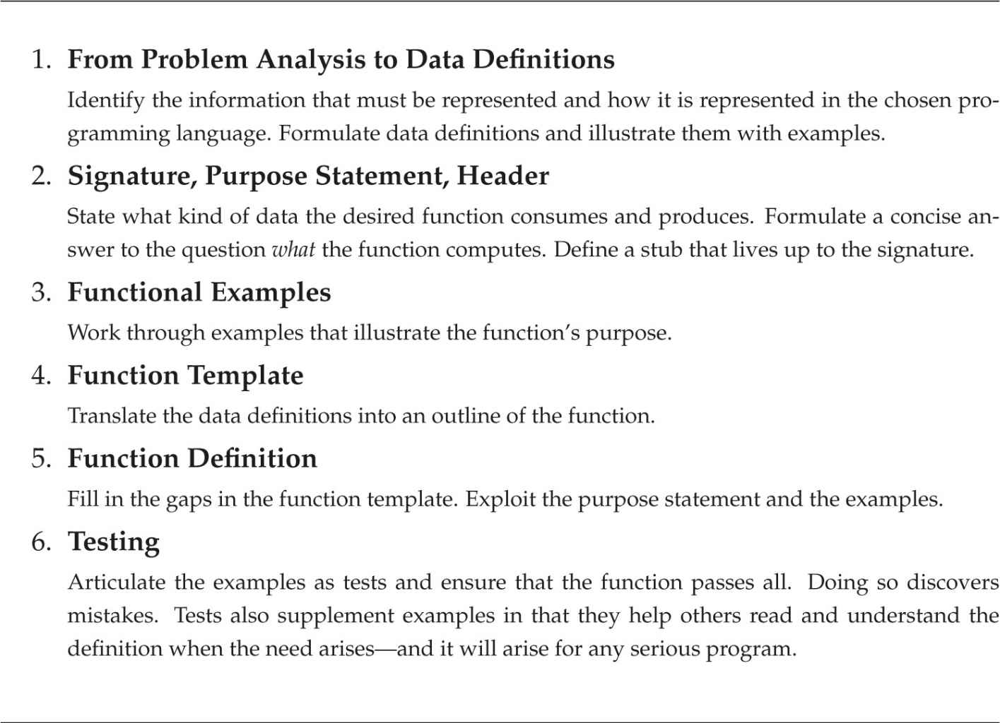
Figure 1: The basic steps of a function design recipe

### DrRacket and the Teaching Languages

Summary: The book uses DrRacket and custom teaching languages because beginners need tools that support learning principles rather than fighting industrial-language complexity. The Beginning Student Language is intentionally small, close to pre-algebra, and designed so that error messages remain understandable before students know much syntax. As students master structural design principles, they move through richer teaching languages toward abstraction and general recursion. DrRacket itself is framed as a novice-friendly environment whose two-pane model encourages experimentation while separating data manipulation from real-world input and output.

### Skills that Transfer

Summary: The Preface claims that systematic program design transfers both to other programming contexts and to non-programming intellectual work. The design process teaches analysis, abstraction, examples, planning, evaluation, and revision. These habits strengthen mathematical thinking, reading comprehension, precise writing, and iterative creative work. The authors compare design refinement to the way architects, composers, and writers gradually make their ideas concrete.

### This Book and Its Parts

Summary: The book introduces systematic program design alongside a symbolic view of computation, using DrRacket’s algebraic stepper to make evaluation visible. Its structure is a Prologue, six major parts, five Intermezzos, and an Epilogue. The parts move from simple fixed-size data through arbitrarily large data, abstraction, iterative refinement, generative recursion, performance thinking, and accumulators. The Intermezzos supply language mechanics, quotation, lexical scope, loops, and numeric-computation details. The Preface also gives different paths through the book for high school, quarter-system college, and semester-system college courses.

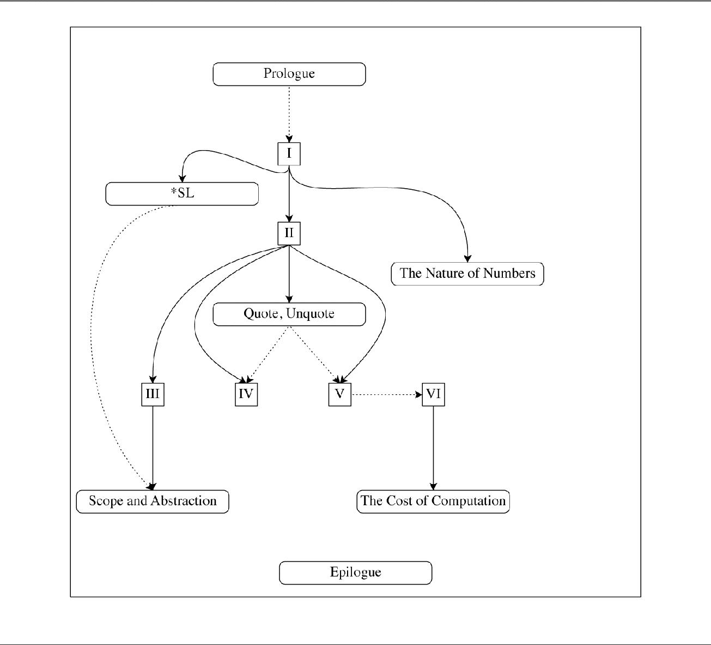
Figure 2: The dependencies among parts and intermezzos

### The Differences

Summary: The second edition differs from the first by explicitly separating whole-program design from function design, adding a clearer top-down planning phase followed by bottom-up construction, emphasizing wish lists, relying more heavily on testing support, dropping imperative programming, using new teachpacks, and changing terminology and notation. The edition also gives more attention to design by composition, where intermediate data definitions and staged functions simplify larger batch-program designs.

### Acknowledgments from the First Edition

Summary: The first-edition acknowledgments credit key collaborators, teachers, students, workshop participants, reviewers, and family members who shaped the book, the TeachScheme! ecosystem, DrRacket, and the authors’ long-running teaching efforts.

### Acknowledgments

Summary: The second-edition acknowledgments thank the people who maintained and improved DrRacket’s stepper, commented on drafts, improved error messages, refined the prose, contributed feedback from teaching, created the online HTML layout, and supported production through MIT Press.

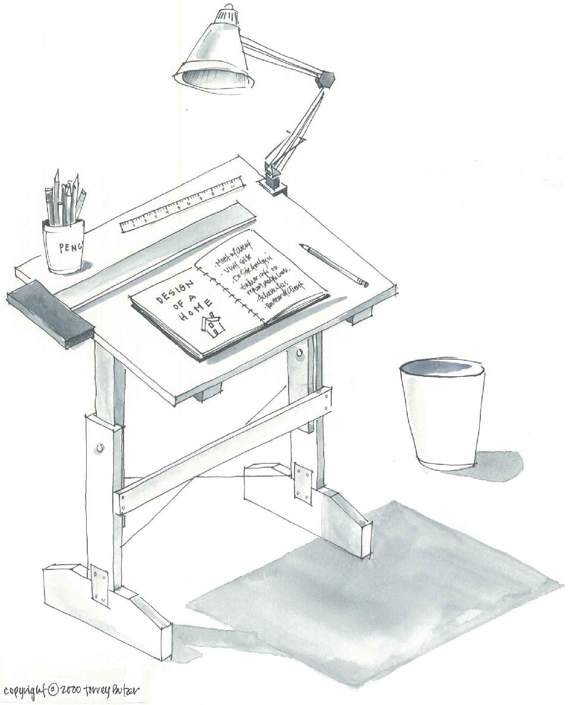

## PROLOGUE: HOW TO PROGRAM

Summary: When you were a small child, your parents taught you to count and perform simple calculations with your fingers: “1 + 1 is 2”; “1 + 2 is 3”; and so on. Then they would ask “what’s 3 + 2? ” and you would count off the fingers of one hand.

```racket
(+ 1 1)
```

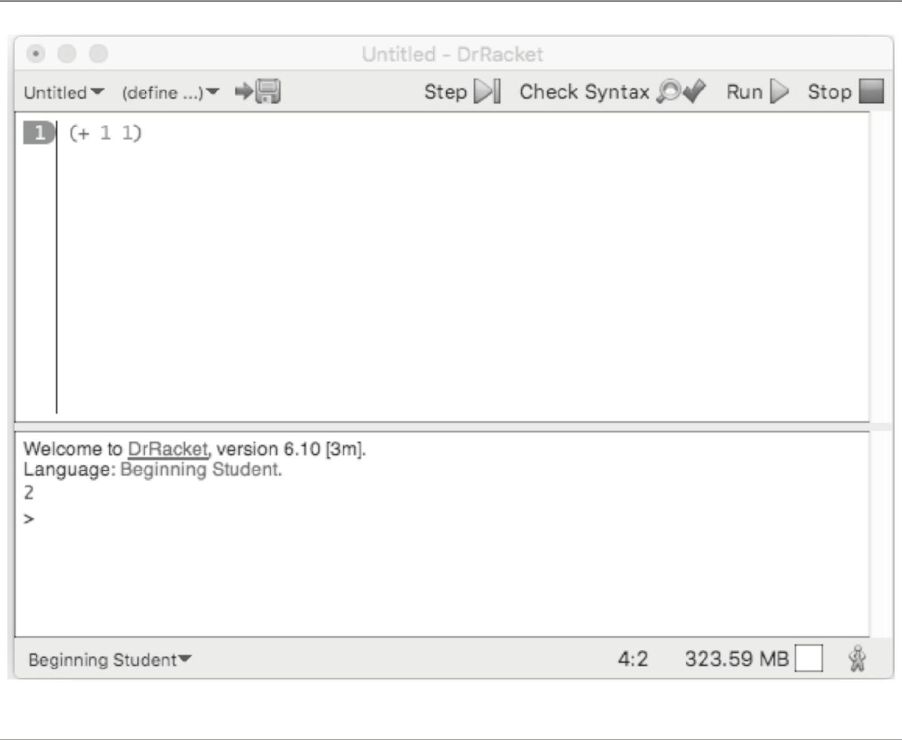
Figure 3: Meet DrRacket

```racket
(+ 2 2)
(* 3 3)
(- 4 2)
(/ 6 2)
```

```racket
> (+ 1 1)
2
```

```racket
> (+ 2 2)
4
> (* 3 3)
9
> (- 4 2)
2
> (/ 6 2)
3
> (sqr 3)
9
> (expt 2 3)
8
> (sin 0)
0
> (cos pi)
#i-1.0
```

```racket
> (+ 2 (+ 3 4))
9
> (+ 2 3 4)
9
```

```racket
> (+ 2 (+ 3 4))
9
```

```racket
> (+ 2 (+ (* 3 3) 4))
15
> (+ 2 (+ (* 3 (/ 12 4)) 4))
15
> (+ (* 5 5) (+ (* 3 (/ 12 4)) 4))
38
```

```racket
> (+ (1) (2))
function call:expected a function after the open parenthesis, found a number
```

```racket
> (+ 1 2 3 4 5 6 7 8 9 0)
45
> (* 1 2 3 4 5 6 7 8 9 0)
0
```

```racket
> "hello world"
"hello world"
```

```racket
> (string-append "hello" "world")
"helloworld"
> (string-append "hello " "world")
"hello world"
```

```racket
(string-append "hello" " " "world")
```

```racket
> (+ (string-length "hello world") 20)
31
> (number->string 42)
"42"
```

```racket
> (string->number "42")
42
```

```racket
> (string->number "hello world")
#false
```

```
> (and #true #true)
#true
> (and #true #false)
#false
> (or #true #false)
#true
> (or #false #false)
#false
> (not #false)
#true
```

```racket
> (> 10 9)
#true
> (< -1 0)
#true
> (= 42 9)
#false
```

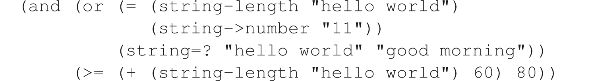

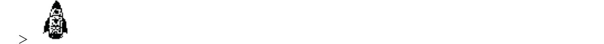


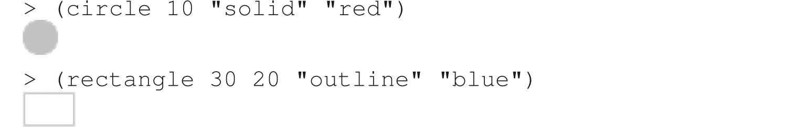

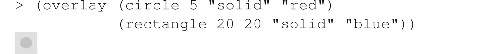

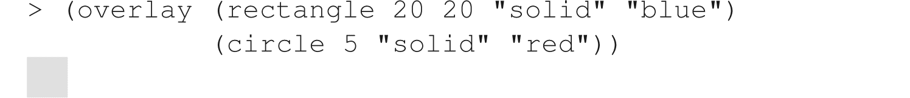

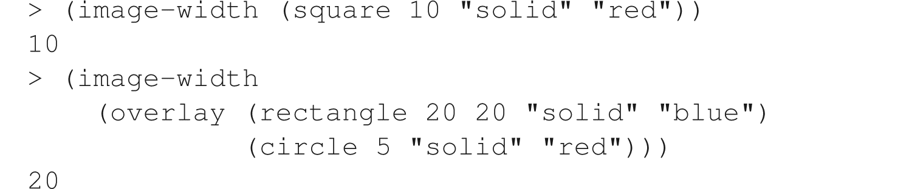

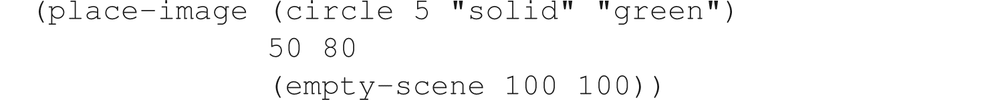

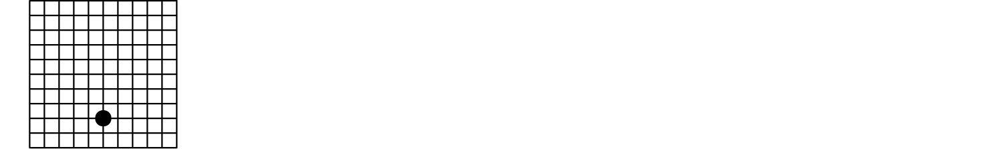

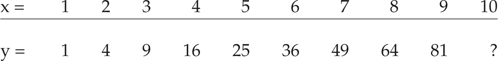

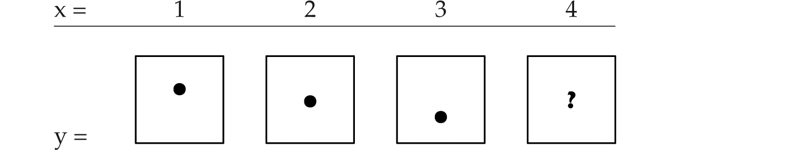


```racket
(define (y x) (* x x))
```

```racket
(y 1)
```

```racket
(y 2)
```

```racket
(define (y x) (* x x))
```

```racket
(y 1)
(y 2)
(y 3)
(y 4)
(y 5)
```

```racket
    (define (FunctionName InputName) BodyExpression)
```

```racket
    (FunctionName ArgumentExpression)
```

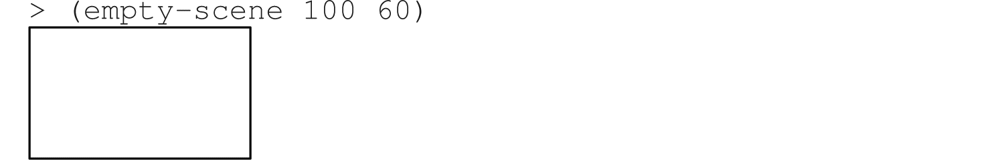

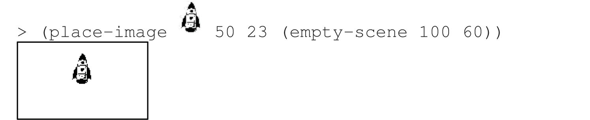

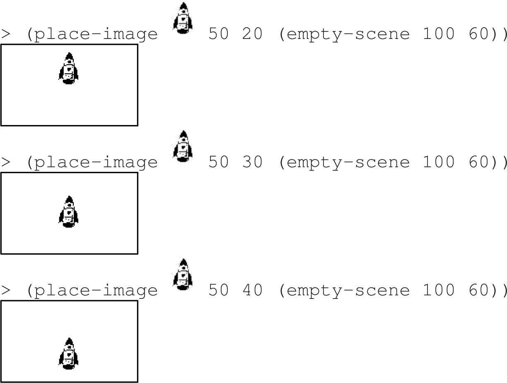

```racket
(picture-of-rocket 0)
(picture-of-rocket 10)
(picture-of-rocket 20)
(picture-of-rocket 30)
```

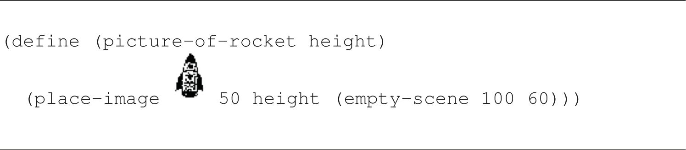
Figure 4: Landing a rocket (version 1)

```racket
> (animate picture-of-rocket)
```


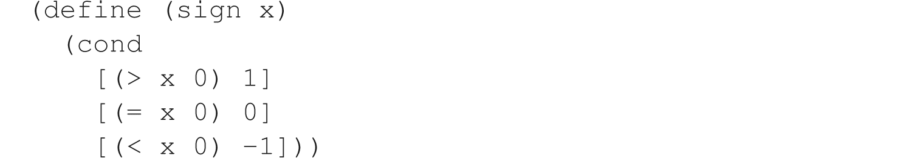

```racket
> (sign 10)
1
> (sign -5)
-1
> (sign 0)
0
```

```racket
(cond
    [ConditionExpression1 ResultExpression1]
    [ConditionExpression2 ResultExpression2]
    …
    [ConditionExpressionN ResultExpressionN])
```

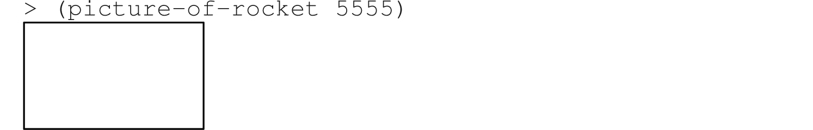

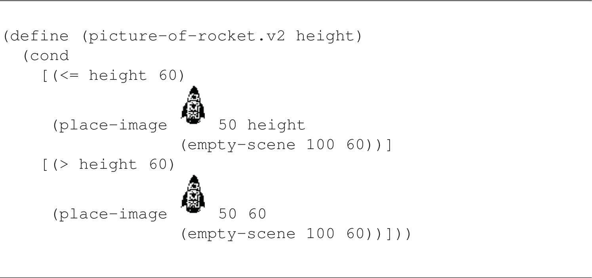
Figure 5: Landing a rocket (version 2)

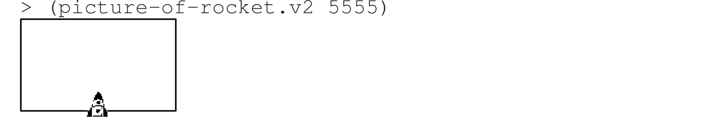

```racket
> (animate picture-of-rocket.v2)
```

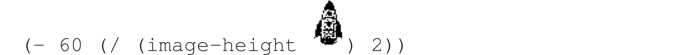

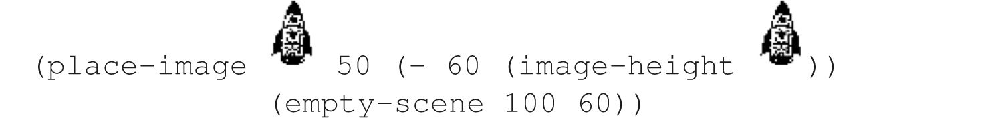


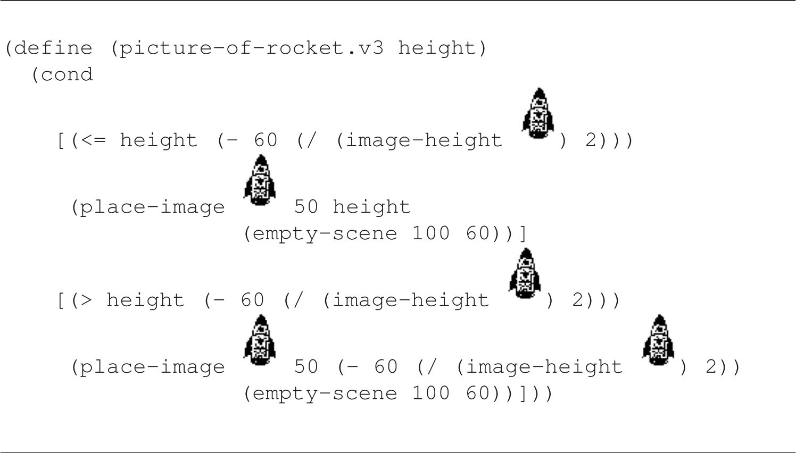
Figure 6: Landing a rocket (version 3)

```racket
(define Name Expression)
```

```racket
(define HEIGHT 60)
```

```racket
> (animate picture-of-rocket.v4)
```

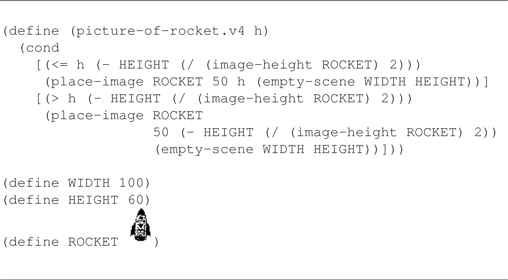
Figure 7: Landing a rocket (version 4)

```racket
(- HEIGHT (/ (image-height ROCKET) 2))
```

```racket
(define ROCKET-CENTER-TO-TOP
  (- HEIGHT (/ (image-height ROCKET) 2)))
```

```racket
(define HEIGHT (* 2 CENTER))
(define CENTER 100)
```

```racket
(define CENTER 100)
(define HEIGHT (* 2 CENTER))
```

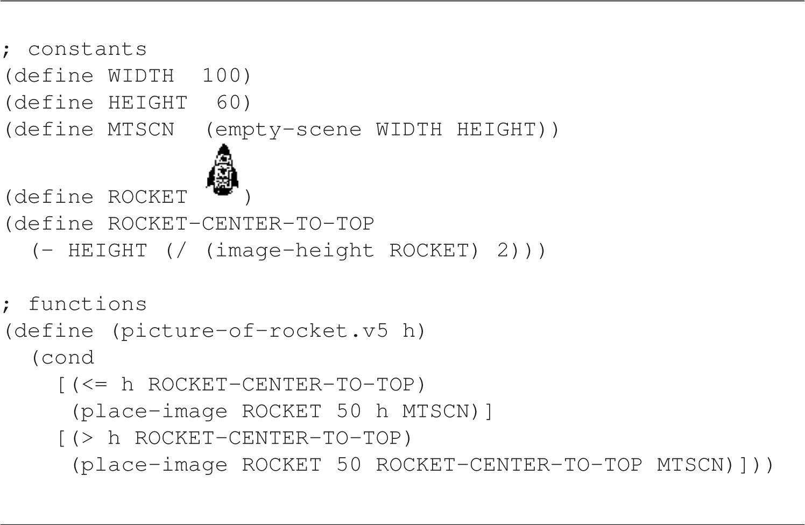
Figure 8: Landing a rocket (version 5)


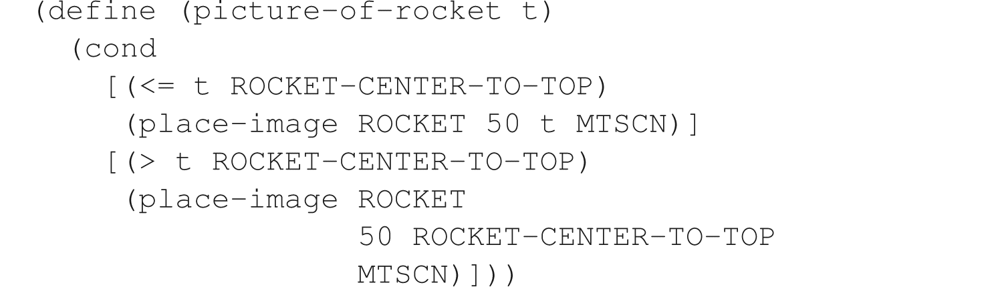


```racket
(define V 3)
```

```racket
(define (distance t)
  (* V t))
```

```racket
> (animate picture-of-rocket.v6)
```

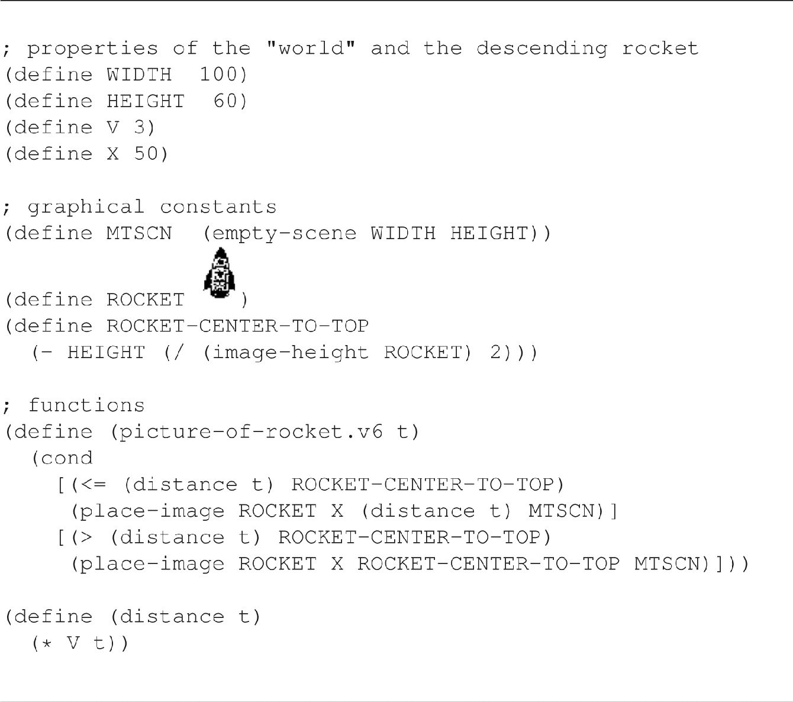
Figure 9: Landing a rocket (version 6)

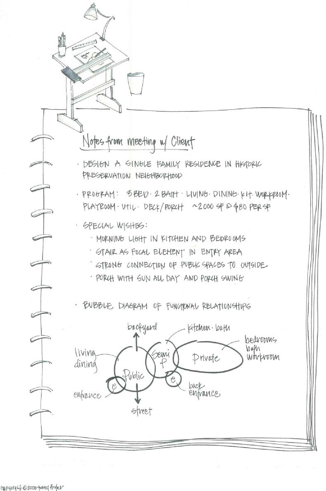
