## Chapter 1: Computer Networks and the Internet

Today’s Internet is arguably the largest engineered system ever created by mankind, with hundreds of millions of connected computers, communication links, and switches; with billions of users who connect via laptops, tablets, and smartphones; and with an array of new Internet-connected “things” including game consoles, surveillance systems, watches, eye glasses, thermostats, robots, cars, and even diapers. Given that the Internet is so large and has so many diverse components and uses, is there any hope of understanding how it works? Are there guiding principles and structure that can provide a foundation for understanding such an amazingly large and complex system? And if so, is it possible that it actually could be both interesting and fun to learn about computer networks? Fortunately, the answer to all of these questions is a resounding YES! Indeed, it’s our aim in this book to provide you with a modern introduction to the dynamic field of computer networking, giving you the principles and practical insights you’ll need to understand not only today’s networks, but tomorrow’s as well.


This first chapter presents a broad overview of computer networking and the Internet. Our goal here is to paint a broad picture and set the context for the rest of this book, to see the forest through the trees. We’ll cover a lot of ground in this introductory chapter and discuss a lot of the pieces of a computer network, without losing sight of the big picture.

We’ll structure our overview of computer networks in this chapter as follows. After introducing some basic terminology and concepts, we’ll first examine the basic hardware and software components that make up a network. We’ll begin at the network’s edge and look at the end systems and network applications running in the network. We’ll then explore the core of a computer network, examining the links and the switches that transport data, as well as the access networks and physical media that connect end systems to the network core. We’ll learn that the Internet is a network of networks, and we’ll learn how these networks connect with each other.

After having completed this overview of the edge and core of a computer network, we’ll take the broader and more abstract view in the second half of this chapter. We’ll examine delay, loss, and throughput of data in a computer network and provide simple quantitative models for end-to-end throughput and delay: models that take into account transmission, propagation, and queuing delays. We’ll then introduce some of the key architectural principles in computer networking, namely, protocol layering and service models. We’ll also learn that computer networks are vulnerable to many different types of attacks; we’ll survey some of these attacks and consider how computer networks can be made more secure. Finally, we’ll close this chapter with a brief history of computer networking.

#### 1.1 What Is the Internet?

In this book, we’ll use the public Internet, a specific computer network, as our principal vehicle for discussing computer networks and their protocols. But what is the Internet? There are a couple of ways to answer this question. One way is to describe the nuts and bolts of the Internet, that is, the basic hardware and software components that make up the Internet. The other way is to describe the Internet in terms of a networking infrastructure that provides services to distributed applications. Let’s begin with the nuts-and-bolts description, using Figure 1.1 to illustrate our discussion.

##### 1.1.1 A Nuts-and-Bolts Description

The Internet is a computer network that interconnects billions of computing devices throughout the world. Not too long ago, these computing devices were primarily traditional desktop computers, Linux workstations, and so-called servers that store and transmit information such as Web pages and e-mail messages. Increasingly, however, users connect to the Internet with smartphones and tablets—today, approximately two-thirds of world’s population are active mobile Internet users [Statista Users 2024]. Furthermore, nontraditional Internet “things” such as TVs, gaming consoles, thermostats, home security systems, home appliances, watches, eye glasses, cars, traffic control systems, and more are being connected to the Internet. Indeed, the term computer network is beginning to sound a bit dated, given the many nontraditional devices that are being hooked up to the Internet. In Internet jargon, all of these devices are called hosts or end systems. By some estimates, there were about 19 billion devices connected to the Internet in 2025, and the number will reach 29 billion by 2030 [Statista Connections 2025].

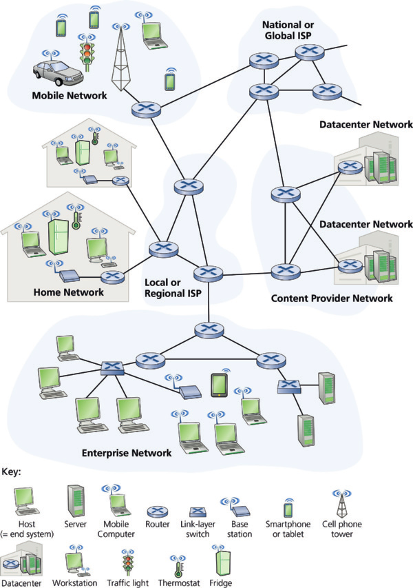

Figure 1.1 Some pieces of the Internet

End systems are connected together by a network of communication links and packet switches. We’ll see in Section 1.2 that there are many types of communication links, which are made up of different types of physical media, including coaxial cable, copper wire, optical fiber, and radio spectrum. Different links can transmit data at different rates, with the transmission rate of a link measured in bits/second. When one end system has data to send to another end system, the sending end system segments the data and adds header bytes to each segment. The resulting packages of information, known as packets in the jargon of computer networks, are then sent through the network to the destination end system, where they are reassembled into the original data.

A packet switch takes a packet arriving on one of its incoming communication links and forwards that packet on one of its outgoing communication links. Packet switches come in many shapes and flavors, but the two most prominent types in today’s Internet are routers and link-layer switches. Both types of switches forward packets toward their ultimate destinations. Linklayer switches are typically used in access networks, while routers are typically used in the network core. The sequence of communication links and packet switches traversed by a packet from the sending end system to the receiving end system is known as a route or path through the network.

Packet-switched networks (which transport packets) are in many ways similar to transportation networks transporting vehicles over highways, roads and, intersections. Consider, for example, a factory that needs to move a large amount of cargo to some destination warehouse located thousands of kilometers away. At the factory, the cargo is segmented and loaded into a fleet of trucks. Each of the trucks then independently travels through the network of highways, roads, and intersections to the destination warehouse. At the destination warehouse, the cargo is unloaded and grouped with the rest of the cargo arriving from the same shipment. Thus, in many ways, packets are analogous to trucks, communication links are analogous to highways and roads, packet switches are analogous to intersections, and end systems are analogous to buildings. Just as a truck takes a path through the transportation network, a packet takes a path through a computer network.

End systems access the Internet through Internet Service Providers (ISPs), including residential ISPs such as local cable or telephone companies;

corporate ISPs; university ISPs; ISPs that provide WiFi access in airports, hotels, coffee shops, and other public places; and cellular data ISPs, providing mobile access to our smartphones and other devices. Each ISP is in itself a network of packet switches and communication links. ISPs provide a variety of types of network access to the end systems, including residential broadband access such as cable modem or DSL, high-speed local area network access, and mobile wireless access. ISPs also provide Internet access to content providers, connecting servers directly to the Internet. The Internet is all about connecting end systems to each other, so the ISPs that provide access to end systems must also be interconnected. These lower-tier ISPs are thus interconnected through national and international upper-tier ISPs and these upper-tier ISPs are connected directly to each other. An upper-tier ISP consists of high-speed routers interconnected with high-speed fiber-optic links. Each ISP network, whether upper-tier or lower-tier, is managed independently, runs the IP protocol (see below), and conforms to certain naming and address conventions. We’ll examine ISPs and their interconnection more closely in Section 1.3.

End systems, packet switches, and other pieces of the Internet run protocols that control the sending and receiving of information within the Internet.

The Transmission Control Protocol (TCP) and the Internet Protocol (IP) are two of the most important protocols in the Internet. The IP protocol specifies the format of the packets that are sent and received among routers and end systems. The Internet’s principal protocols are collectively known as TCP/IP.

We’ll begin looking into protocols in this introductory chapter. But that’s just a start—much of this book is concerned with networking protocols!

Given the importance of protocols to the Internet, it’s important that everyone agree on what each and every protocol does, so that people can create systems and products that interoperate. This is where standards come into play. Internet standards are developed by the Internet Engineering Task Force (IETF) [IETF 2025]. The IETF standards documents are called requests for comments (RFCs). RFCs started out as general requests for comments (hence the name) to resolve network and protocol design problems that faced the precursor to the Internet [Allman 2011]. RFCs tend to be quite technical and detailed. They define protocols such as TCP, IP, HTTP (for the Web), and SMTP (for e-mail). There are currently nearly 9000 RFCs. Other bodies also specify standards for network components, most notably for network links. The IEEE 802 LAN Standards Committee [IEEE 802 2025], for example, specifies the Ethernet and wireless WiFi standards.

##### 1.1.2 A Services Description

Our discussion above has identified many of the pieces that make up the Internet. But we can also describe the Internet from an entirely different angle—namely, as an infrastructure that provides services to applications. In addition to traditional applications such as e-mail and Web surfing, Internet applications include mobile smartphone and tablet applications, including Internet messaging, mapping with real-time road-traffic information, music streaming, movie and television streaming, online social media, video conferencing, multi-person games, and location-based recommendation systems.

The applications are said to be distributed applications, since they involve multiple end systems that exchange data with each other. Importantly, Internet applications run on end systems—they do not run in the packet switches in the network core. Although packet switches facilitate the exchange of data among end systems, they are not concerned with the application that is the source or sink of data.

Let’s explore a little more what we mean by an infrastructure that provides services to applications. To this end, suppose you have an exciting new idea for a distributed Internet application, one that may greatly benefit humanity or one that may simply make you rich and famous. How might you go about transforming this idea into an actual Internet application? Because applications run on end systems, you are going to need to write programs that run on the end systems. You might, for example, write your programs in Java, C, or Python. Now, because you are developing a distributed Internet application, the programs running on the different end systems will need to send data to each other. And here we get to a central issue—one that leads to the alternative way of describing the Internet as a platform for applications. How does one program running on one end system instruct the Internet to deliver data to another program running on another end system?

End systems attached to the Internet provide a socket interface that specifies how a program running on one end system asks the Internet infrastructure to deliver data to a specific destination program running on another end system. This Internet socket interface is a set of rules that the sending program must follow so that the Internet can deliver the data to the destination program.

We’ll discuss the Internet socket interface in detail in Chapter 2. For now, let’s draw upon a simple analogy, one that we will frequently use in this book. Suppose Alice wants to send a letter to Bob using the postal service. Alice, of course, can’t just write the letter (the data) and drop the letter out her window. Instead, the postal service requires that Alice put the letter in an envelope; write Bob’s full name, address, and zip code in the center of the envelope; seal the envelope;

put a stamp in the upper-right-hand corner of the envelope; and finally, drop the envelope into an official postal service mailbox. Thus, the postal service has its own “postal service interface,” or set of rules, that Alice must follow to have the postal service deliver her letter to Bob. In a similar manner, the Internet has a socket interface that the program sending data must follow to have the Internet deliver the data to the program that will receive the data.

The postal service, of course, provides more than one service to its customers. It provides express delivery, reception confirmation, ordinary use, and many more services. In a similar manner, the Internet provides multiple services to its applications. When you develop an Internet application, you too must choose one of the Internet’s services for your application. We’ll describe the Internet’s services in Chapter 2.

We have just given two descriptions of the Internet; one in terms of its hardware and software components, the other in terms of an infrastructure for providing services to distributed applications. But perhaps you are still confused as to what the Internet is. What are packet switching and TCP/IP? What are routers? What kinds of communication links are present in the Internet? What is a distributed application? How can a thermostat or weighing scale be attached to the Internet? If you feel a bit overwhelmed by all of this now, don’t worry— the purpose of this book is to introduce you to both the nuts and bolts of the Internet and the principles that govern how and why it works. We’ll explain these important terms and questions in the following sections and chapters.

##### 1.1.3 What Is a Protocol?

Now that we’ve got a bit of a feel for what the Internet is, let’s consider another important buzzword in computer networking: protocol. What is a protocol?

What does a protocol do?

A Human Analogy It is probably easiest to understand the notion of a computer network protocol by first considering some human analogies, since we humans execute protocols all of the time. Consider what you do when you want to ask someone for the time of day.A typical exchange is shown in Figure 1.2.Human protocol (or good manners, at least) dictates that one first offer a greeting (the first “Hi” in Figure 1.2) to initiate communication with someone else. The typical response to a “Hi” is a returned “Hi” message. Implicitly, one then takes a cordial “Hi” response as an indication that one can proceed and ask for the time of day.A different response to the initial “Hi” (such as “Don’t bother me!” or “I don’t speak English,” or some unprintable reply) might indicate an unwillingness or inability to communicate.

In this case, the human protocol would be not to ask for the time of day. Sometimes one gets no response at all to a question, in which case one typically gives up asking that person for the time. Note that in our human protocol, there are specific messages we send, and specific actions we take in response to the received reply messages or other events (such as no reply within some given amount of time). Clearly, transmitted and received messages, and actions taken when these messages are sent or received or other events occur, play a central role in a human protocol. If people run different protocols (for example, if one person has manners but the other does not, or if one understands the concept of time and the other does not) the protocols do not interoperate and no useful work can be accomplished. The same is true in networking—it takes two (or more) communicating entities running the same protocol in order to accomplish a task.

Let’s consider a second human analogy. Suppose you’re in a college class (a computer networking class, for example!). The teacher is droning on about protocols and you’re confused. The teacher stops to ask, “Are there any questions?” (a message that is transmitted to, and received by, all students who are Figure 1.2 A human protocol and a computer network protocol

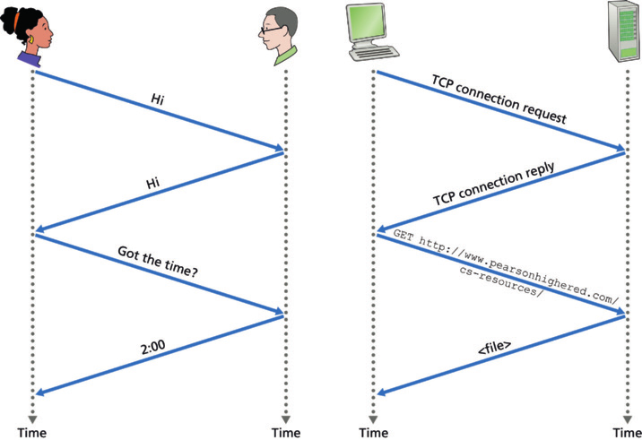

not sleeping). You raise your hand (transmitting an implicit message to the teacher). Your teacher acknowledges you with a smile, saying “Yes . . .” (a transmitted message encouraging you to ask your question—teachers love to

be asked questions), and you then ask your question (that is, transmit your message to your teacher). Your teacher hears your question (receives your question message) and answers (transmits a reply to you). Once again, we see that the transmission and receipt of messages, and a set of conventional actions taken when these messages are sent and received, are at the heart of this question-and-answer  protocol.

Network Protocols A network protocol is similar to a human protocol, except that the entities exchanging messages and taking actions are hardware or software components of some device (for example, computer, smartphone, tablet, router, or other network-capable device). All activity in the Internet that involves two or more communicating remote entities is governed by a protocol. For example, hardware-implemented protocols in two physically connected computers control the flow of bits on the “wire” between the two network interface cards;

congestion-control protocols in end systems control the rate at which packets are transmitted between sender and receiver; protocols in routers determine a packet’s path from source to destination. Protocols are running everywhere in the Internet, and consequently much of this book is about computer network protocols.

As an example of a computer network protocol with which you are probably familiar, consider what happens when you make a request to a Web server, that is, when you type the URL of a Web page into your Web browser.

The scenario is illustrated in the right half of Figure 1.2. First, your computer will send a connection request message to the Web server and wait for a reply.

The Web server will eventually receive your connection request message and return a connection reply message. Knowing that it is now OK to request the Web document, your computer then sends the name of the Web page it wants to fetch from that Web server in a GET message. Finally, the Web server returns the Web page (file) to your computer.

Given the human and networking examples above, the exchange of messages and the actions taken when these messages are sent and received are the key defining elements of a protocol:

A  protocol defines the format and the order of messages exchanged between two or more communicating entities, as well as the actions taken on the transmission and/or receipt of a message or other event.

The Internet, and computer networks in general, make extensive use of protocols. Different protocols are used to accomplish different communication tasks. As you read through this book, you will learn that some protocols are simple and straightforward, while others are complex and intellectually deep.

Mastering the field of computer networking is equivalent to understanding the what, why, and how of networking protocols.

#### 1.2 The Network Edge

In the previous section, we presented a high-level overview of the Internet and networking protocols. We are now going to delve a bit more deeply into the components of the Internet. We begin in this section at the edge of the network and look at the components with which we are most familiar—namely, the computers, smartphones and other devices that we use on a daily basis. In the next section, we’ll move from the network edge to the network core and examine switching and routing in computer networks.

Recall from the previous section that in computer networking jargon, the computers and other devices connected to the Internet are often referred to as end systems. They are referred to as end systems because they sit at the edge of the Internet, as shown in Figure 1.3. The Internet’s end systems include desktop computers (e.g., desktop PCs, Macs, and Linux boxes), servers (e.g., Web and e-mail servers), and mobile devices (e.g., laptops, smartphones, and tablets).

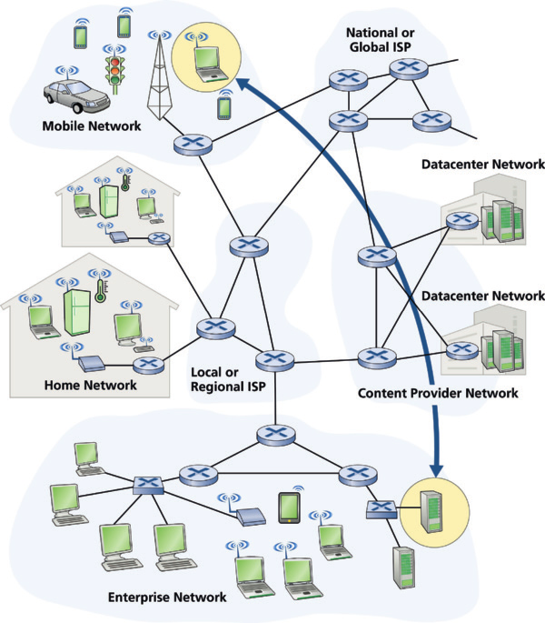

Figure 1.3 End-system interaction

Furthermore, an increasing number of non-traditional “things” are being attached to the Internet as end systems (see the Case History feature).

End systems are also referred to as hosts because they host (that is, run) application programs such as a Web browser program, a Web server program, an e-mail client program, or an e-mail server program. Throughout this book we will use the terms hosts and end systems interchangeably; that is, host = end system . Hosts are sometimes further divided into two catego-

ries: clients and servers. Informally, clients tend to be desktops, laptops, smartphones, and so on, whereas servers tend to be more powerful machines that store and distribute Web pages, stream video, relay e-mail, and so on.

Today, most of the servers from which we receive search results, e-mail, Web pages, videos and mobile app content reside in large data centers. For example, as of late 2024, Google has 33 data centers on four continents, [Google data centers 2024] collectively containing several million servers. Figure 1.3 includes two such data centers, and the Case History sidebar describes data centers in more detail.

Case History Data Centers and Cloud Computing Internet companies such as Google, Microsoft, Amazon, and Alibaba have built massive data centers, each housing tens to hundreds of thousands of hosts. These data centers are not only connected to the Internet, as shown in Figure 1.1, but also internally include complex computer networks that interconnect the datacenter’s hosts. The data centers are the engines behind the Internet applications that we use on a daily basis.

Broadly speaking, data centers serve three purposes, which we describe here in the context of Amazon for concreteness. First, they serve Amazon e-commerce pages to users, for example, pages describing products and purchase information. Second, they serve as massively parallel computing infrastructures for Amazon-specific data processing tasks. Third, they provide cloud computing to other companies. Indeed, today a major trend in

computing is for companies to use a cloud provider such as Amazon to handle essentially all of their IT needs. For example, Airbnb and many other Internetbased companies do not own and manage their own data centers but instead run their entire Web-based services in the Amazon cloud, called Amazon Web Services (AWS).

The worker bees in a data center are the hosts. They serve content (e.g., Web pages and videos), store e-mails and documents, and collectively perform massively distributed computations. The hosts in data centers, called blades and resembling pizza boxes, are generally commodity hosts that include CPU, memory, and disk storage. The hosts are stacked in racks, with each rack typically having 20 to 40 blades. The racks are then interconnected using sophisticated and evolving data center network designs. Data center networks are discussed in greater detail in Chapter 6.

##### 1.2.1 Access Networks

Having considered the applications and end systems at the “edge of the network,” let’s next consider the access network—the network that physically connects an end system to the first router (also known as the “edge router”) on a path from the end system to any other distant end system. Figure 1.4 shows several types of access networks with thick, shaded lines and the settings (home, enterprise, and wide-area mobile wireless) in which they are used.

Home Access: DSL, Cable, FTTH, Fixed Wireless, and LEO Satellites As of 2023, more than 80% of the households in Europe and the USA have Internet access [OECD 2024], although a “digital divide” in access exists around the world and among different demographics [globaldigitalinclusion 2025]. Given this widespread use of home access networks let’s begin our overview of access networks by considering how homes connect to the Internet.

Today, the three most prevalent types of broadband residential access are digital subscriber line (DSL),  cable, and fiber to the home (FTTH).

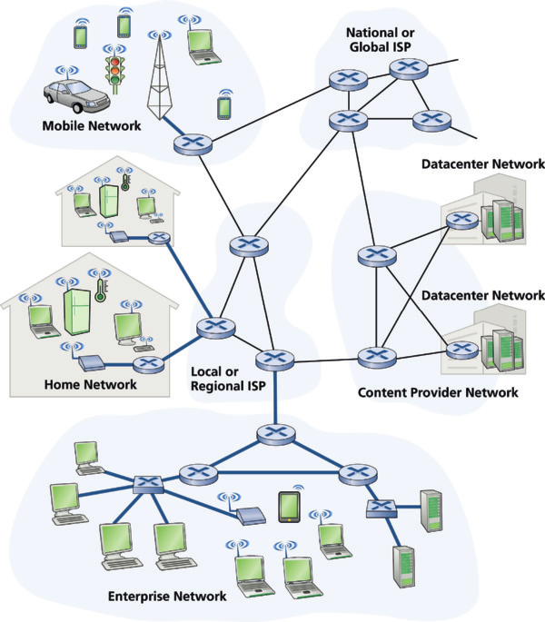

Figure 1.4 Access networks

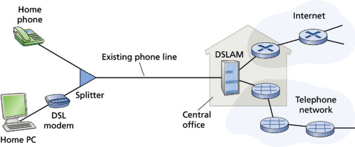

Figure 1.5 DSL Internet access

A residence typically obtains DSL Internet access from the same local telephone company (telco) that provides its wired local phone access. Thus, when DSL is used, a customer’s telco is also its ISP.

As shown in Figure 1.5, each customer’s DSL modem uses the existing telephone line exchange data with a digital subscriber line access multiplexer (DSLAM) located in the telco’s local central office (CO). The home’s DSL modem takes digital data and translates it to high-frequency tones for transmission over telephone wires to the CO; the analog signals from many such houses are translated back into digital format at the DSLAM.

The residential telephone line carries both data and traditional telephone signals simultaneously, which are encoded at different frequencies:

• A high-speed downstream channel, in the 50 kHz to 1 MHz band

• A medium-speed upstream channel, in the 4 kHz to 50 kHz band

• An ordinary two-way telephone channel, in the 0 to 4 kHz band This approach makes the single DSL link appear as if there were three separate links, so that a telephone call and an Internet connection can share the DSL link at the same time. (We’ll describe this technique of frequency-division multiplexing in Section 1.3.1.) On the customer side, a splitter separates the data and telephone signals arriving to the home and forwards the data signal to the DSL modem. On the telco side, in the CO, the DSLAM separates the data and phone signals and sends the data into the Internet. Hundreds or even thousands of households connect to a single DSLAM.

The most recent DSL standard [ITU DSL 2019] provide for up to 1 Gbps downstream over short distances and up to 500 Mbps upstream transmission rates. Because the downstream and upstream rates are different, the access is said to be asymmetric. The actual downstream and upstream transmission rates achieved may be less than the rates noted above, as the DSL provider may purposefully limit a residential rate when tiered service (different rates, available at different prices) are offered. The maximum rate is also limited by the distance between the home and the CO, the gauge of the twisted-pair line and the degree of electrical interference. Engineers have expressly designed DSL for short distances between the home and the CO; generally, if the residence is not located within 5 to 10 miles of the CO, the residence must resort to an alternative form of Internet access.

While DSL makes use of the telco’s existing local telephone infrastructure, cable Internet access makes use of the cable television company’s existing often referred to as hybrid fiber coax (HFC).Cable internet access requires special modems, called cable modems. As with a DSL modem, the cable modem is typically an external device and connects to the home PC through an Ethernet port. (We will discuss Ethernet in great detail in Chapter 6.) At the cable head end, the cable modem termination system (CMTS) serves a similar function as the DSL network’s DSLAM—turning the analog signal sent from the cable modems in many downstream homes back into digital format. Cable modems divide the HFC network into two channels, a downstream and an upstream channel. As with DSL, access is typically asymmetric, with the downstream channel typically allocated a higher transmission rate than the upstream channel. The DOCSIS 2.0 and 3.0 standards define downstream bitrates of 40 Mbps and 1.2 Gbps, and upstream rates of 30 Mbps and 100 Mbps, respectively. As in the case of DSL networks, the maximum achievable rate may not be realized due to lower contracted data rates or media impairments. One important characteristic of cable Internet access is that it is a shared broadcast medium. In particular, every packet sent by the head end travels downstream on every link to every home and every packet sent by a home travels on the upstream channel to the head end. For this reason, if several users are simultaneously downloading a video file on the downstream channel, the actual rate at which each user receives its video file will be significantly lower than the aggregate cable downstream rate. On the other hand, if there are only a few active users and they are all Web surfing, then each of the users may actually receive Web pages at the full cable downstream rate, because the users will rarely request a Web page at exactly the same time. Because the upstream channel is also shared, a distributed multiple access protocol is

Figure 1.6 A hybrid fiber-coaxial access network cable television infrastructure. A residence obtains cable Internet access from the same company that provides its cable television. As illustrated in Figure 1.6, fiber optics connect the cable head end to neighborhood-level junctions, from which traditional coaxial cable is then used to reach individual houses and apartments. Each neighborhood junction typically supports 500 to 5, 000 homes. Because both fiber and coaxial cable are employed in this system, it is

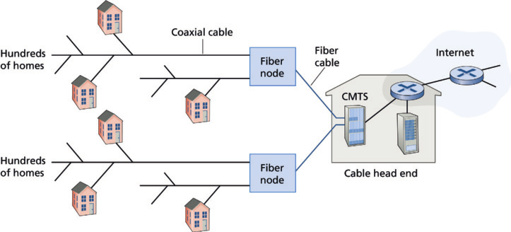

needed to coordinate transmissions and avoid collisions. (We’ll discuss this collision issue in some detail in Chapter 6.) Although DSL and cable networks currently represent the majority of residential broadband access in the United States, an up-and-coming technology that provides even higher speeds is fiber to the home (FTTH) [Fiber Broadband 2025]. As the name suggests, the FTTH concept is simple—provide an optical fiber path from the CO directly to the home. FTTH can potentially provide Internet access rates in the gigabits per second range.

There are several competing technologies for optical distribution from the CO to the homes. The simplest optical distribution network is called direct fiber, with one fiber leaving the CO for each home. More commonly, each fiber leaving the central office is actually shared by many homes; it is not until the fiber gets relatively close to the homes that it is split into individual customerspecific fibers. There are two competing optical-distribution network architectures that perform this splitting: active optical networks (AONs) and passive optical networks (PONs). AON is essentially switched Ethernet, which is discussed in Chapter 6.

Here, we briefly discuss PON, which is used in Verizon’s FiOS service.

Figure 1.7 shows FTTH using the PON distribution architecture. Each home has an optical network terminator (ONT), which is connected by dedicated optical fiber to a neighborhood splitter. The splitter combines a number of homes (typically less than 100) onto a single, shared optical fiber, which connects to an optical line terminator (OLT) in the telco’s CO. The OLT, providing conversion between optical and electrical signals, connects to the Internet via a telco router. At home, users connect a home router (typically a wireless router) to the ONT and access the Internet via this home router. In the PON architecture, all packets sent from OLT to the splitter are replicated at the splitter (similar to a cable head end).

Fixed wireless Internet (FWI) has also become a popular Internet access technology.FWI not only provides high-speed residential access, but does so without installing costly and failure-prone cabling from the telco’s CO to the home.

With 5G fixed wireless, using beam-forming technology, data is sent wirelessly from a provider’s base station to the a modem in the home. A WiFi wireless router is connected to the modem (possibly bundled together), similar to how a WiFi wireless router is connected to a cable or DSL modem. In addition to DSL, cable, FTTH and FWI, low-earth orbit (LEO) satellites are

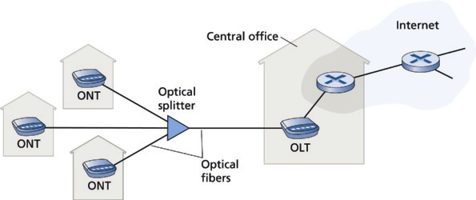

Figure 1.7 FTTH Internet access

increasingly being used for broadband Internet access, particularly in rural and remote areas. Companies such as SpaceX’s Starlink deploy large constellation of satellites, providing high-speed access with signal propagation delays much lower than with geostationary satellites.

Ethernet and WiFi On corporate and university campuses, and increasingly in home settings, a local area network (LAN) is used to connect an end system to the edge router.

Although there are many types of LAN technologies, Ethernet is by far the most prevalent access technology in corporate, university, and home networks.

As shown in Figure 1.8, Ethernet users use twisted-pair copper wire to connect to an Ethernet switch, a technology discussed in detail in Chapter 6. The Ethernet switch, or a network of such interconnected switches, is then in turn connected into the larger Internet. With Ethernet access, users typically have 100 Mbps to tens of Gbps access to the Ethernet switch, whereas servers may have 1 Gbps 10 Gbps access.

Increasingly, however, people are accessing the Internet wirelessly from laptops, smartphones, tablets, and other “things”. In a wireless LAN setting, wireless users transmit/receive packets to/from an access point that is connected into the enterprise’s network (most likely using wired Ethernet), which in turn is connected to the wired Internet. A wireless LAN user must typically be within a few tens of meters of the access point. Wireless LAN access based on IEEE 802.11 technology, more colloquially known as WiFi, is now just about everywhere—universities, business offices, cafes, airports, homes, and even in airplanes. As discussed in detail in Chapter 7, 802.11 today provides a shared transmission rate of up to more than 100 Mbps.

Even though Ethernet and WiFi access networks were initially deployed in enterprise (corporate, university) settings, they are also common components of home networks. Many homes combine broadband residential access (that is, cable modems or DSL) with these inexpensive wireless LAN technologies to create powerful home networks Figure 1.9 shows a typical home network.

This home network consists of a roaming laptop, multiple Internetconnected home appliances, as well as a wired PC; a base station (the wireless access point), which communicates with the wireless PC and other wireless devices in the home; and a home router that connects the wireless access point,

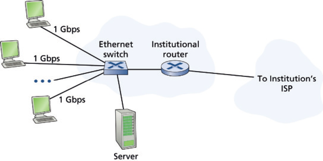

Figure 1.8 Ethernet Internet access

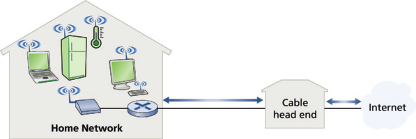

Figure 1.9 A typical home network

and any other wired home devices, to the Internet. This network allows household members to have broadband access to the Internet with one member roaming from the kitchen to the backyard to the bedrooms.

Wide-Area Wireless Access: 4G and 5G Mobile devices such as iPhones and Android devices are being used to message, share photos and video in online social networks, make mobile payments, watch movies, stream music, video conference, and much more while on the run. These devices employ the same wireless infrastructure used for cellular telephony to send/receive packets through a base station that is operated by the cellular network provider. Unlike WiFi, a user need only be within a few tens of kilometers (as opposed to a few tens of meters) of the base station.

Telecommunications companies have made enormous investments in socalled fourth-generation  4G wireless, which provides real-world download 

speeds of up to 60 Mbps. But even higher-speed wide-area access technologies— a fifth-generation  5G of wide-area wireless networks—are already being 

deployed. We’ll cover the basic principles of wireless networks and mobility, as well as WiFi, 4G and 5G technologies (and more!) in Chapter 7.

##### 1.2.2 Physical Media

In the previous subsection, we gave an overview of some of the most important network access technologies in the Internet. As we described these technologies, we also indicated the physical media used. For example, we said that HFC uses a combination of fiber cable and coaxial cable. We said that DSL and Ethernet use copper wire. And we said that mobile access networks use the radio spectrum. In this subsection, we provide a brief overview of these and other transmission media that are commonly used in the Internet.

In order to define what is meant by a physical medium, let us reflect on the brief life of a bit. Consider a bit traveling from one end system, through a series of links and routers, to another end system. This poor bit gets kicked around and transmitted many, many times! The source end system first transmits the bit, and shortly thereafter the first router in the series receives the bit;

the first router then transmits the bit, and shortly thereafter the second router receives the bit; and so on. Thus our bit, when traveling from source to destination, passes through a series of transmitter-receiver pairs. For each transmitter-receiver pair, the bit is sent by propagating electromagnetic waves or optical pulses across a physical medium. The physical medium can take many shapes and forms and does not have to be of the same type for each transmitter-receiver pair along the path. Examples of physical media include twisted-pair copper wire, coaxial cable, multimode fiber-optic cable, terrestrial radio spectrum, and satellite radio spectrum. Physical media fall into two categories: guided media and unguided media. With guided media, the waves are guided along a solid medium, such as a fiber-optic cable, a twisted-pair copper wire, or a coaxial cable. With unguided media, the waves propagate in the atmosphere and in outer space, such as in a wireless LAN or a digital satellite channel.

But before we get into the characteristics of the various media types, let us say a few words about their costs. The actual cost of the physical link (copper wire, fiber-optic cable, and so on) is often relatively minor compared with other networking costs.

In particular, the labor cost associated with the installation of the physical link can be orders of magnitude higher than the cost of the material. For this reason, many builders install twisted pair, optical fiber, and coaxial cable in every room in a building. Even if only one medium is initially used, there is a good chance that another medium could be used in the near future, and so money is saved by not having to lay additional wires in the future.

Twisted-Pair Copper Wire The least expensive and most commonly used guided transmission medium is twisted-pair copper wire. For over a hundred years it has been used by telephone networks. In fact, more than 99 percent of the wired connections from the telephone handset to the local telephone switch use twisted-pair copper wire. Most of us have seen twisted pair in our homes (or those of our parents or grandparents!) and work environments. Twisted pair consists of two insulated copper wires, each about 1 mm thick, arranged in a regular spiral pattern.

The wires are twisted together to reduce the electrical interference from similar pairs close by. Typically, a number of pairs are bundled together in a cable by wrapping the pairs in a protective shield. A wire pair constitutes a single communication link. Unshielded twisted pair (UTP) is commonly used for computer networks within a building, that is, for LANs. Data rates for LANs using twisted pair today range from 10 Mbps to 10 Gbps. The data rates that can be achieved depend on the thickness of the wire and the distance between transmitter and receiver.

When fiber-optic technology emerged in the 1980s, many people disparaged twisted pair because of its relatively low bit rates. Some people even felt that fiber-optic technology would completely replace twisted pair. But twisted pair did not give up so easily. Modern twisted-pair technology, such as category 6a cable, can achieve data rates of 10 Gbps for distances up to a hundred meters. In the end, twisted pair has emerged as the dominant solution for highspeed LAN networking.

As discussed earlier, twisted pair is also commonly used for residential Internet access. We saw that dial-up modem technology enables access at rates of up to 56 kbps over twisted pair. We also saw that DSL (digital subscriber line) technology has enabled residential users to access the Internet at tens of Mbps over twisted pair (when users live close to the ISP’s central office).

Coaxial Cable Like twisted pair, coaxial cable consists of two copper conductors, but the two conductors are concentric rather than parallel. With this construction and special insulation and shielding, coaxial cable can achieve high data transmission rates. Coaxial cable is quite common in cable television systems. As we saw earlier, cable television systems have recently been coupled with cable modems to provide residential users with Internet access at rates of hundreds of Mbps.

In cable television and cable Internet access, the transmitter shifts the digital signal to a specific frequency band, and the resulting analog signal is sent from the transmitter to one or more receivers. Coaxial cable can be used as a guided shared medium. Specifically, a number of end systems can be connected directly to the cable, with each of the end systems receiving whatever is sent by the other end systems.

Fiber Optics An optical fiber is a thin, flexible medium that conducts pulses of light, with each pulse representing a bit. A single optical fiber can support tremendous bit rates, up to tens or even hundreds of gigabits per second. They are immune to electromagnetic interference, have very low signal attenuation up to 100 kilometers, and are very hard to tap. These characteristics have made fiber optics the preferred long-haul guided transmission media, particularly for overseas links. Many of the long-distance telephone networks in the United States and elsewhere now use fiber optics exclusively. Fiber optics is also prevalent in the backbone of the Internet. However, the high cost of optical devices—such as transmitters, receivers, and switches—has hindered their deployment for short-haul transport, such as in a LAN or into the home in a residential access network. The Optical Carrier (OC) standard link speeds range from 51.8 Mbps to 39.8 Gbps; these specifications are often referred to as OC- , where the link n

speed equals n × 51.8 Mbps. Standards in use today include OC-1, OC-3,

OC-12, OC-24, OC-48, OC-96, OC-192, OC-768.

Terrestrial Radio Channels Radio channels carry signals in the electromagnetic spectrum. They are an attractive medium because they require no physical wire to be installed, can penetrate walls, provide connectivity to a mobile user, and can potentially carry a signal for long distances. The characteristics of a radio channel depend significantly on the propagation environment and the distance over which a signal is to be carried. Environmental considerations determine path loss and shadow fading (which decrease the signal strength as the signal travels over a distance and around/through obstructing objects), multipath fading (due to signal reflection off of interfering objects), and interference (due to other transmissions and electromagnetic signals).

Terrestrial radio channels can be broadly classified into three groups:

those that operate over very short distance (e.g., with one or two meters); those that operate in local areas, typically spanning from ten to a few hundred meters; and those that operate in the wide area, spanning tens of kilometers.

Personal devices such as wireless headsets, keyboards, and medical devices operate over short distances; the wireless LAN technologies described in Section 1.2.1 use local-area radio channels; the cellular access technologies use wide-area radio channels. We’ll discuss radio channels in detail in Chapter 7.

Satellite Radio Channels A communication satellite links two or more Earth-based microwave transmitter/ receivers, known as ground stations. The satellite receives transmissions on one frequency band, regenerates the signal using a repeater (discussed below), and transmits the signal on another frequency. Two types of satellites are used in communications: geostationary satellites and low-earth orbiting (LEO) satellites.

Geostationary satellites permanently remain above the same spot on Earth. This stationary presence is achieved by placing the satellite in orbit at 36,000 kilometers above Earth’s surface. This huge distance from ground station through satellite back to ground station introduces a substantial signal propagation delay of 280 milliseconds. Nevertheless, satellite links, which can operate at speeds of hundreds of Mbps, are often used in areas without access to DSL or cable-based Internet access. Geostationary satellites are also the central component of the global positioning system (GPS), on which many location-based Internet applications rely.

LEO satellites are placed much closer to Earth and do not remain permanently above one spot on Earth. They rotate around Earth (just as the Moon does) and may communicate with each other, as well as with ground stations.

As compared to geostationary satellites, they have a much lower round-trip propagation delay of about 10 msec. To provide continuous coverage to an area, many satellites need to be placed in orbit. There are currently many lowaltitude communication systems in development. LEO satellite technology is increasingly used for Internet access, particularly in remote areas that are not easily served with land-based communication infrastructure.

#### 1.3 The Network Core

Having examined the Internet’s edge, let us now delve more deeply inside the network core—the mesh of packet switches and links that interconnects the Internet’s end systems. Figure 1.10 highlights the network core with thick, shaded lines.

##### 1.3.1 Packet Switching

In a network application, end systems exchange messages with each other.

Messages can contain anything the application designer wants. Messages may perform a control function (for example, the “Hi” messages in our handshaking example in Figure 1.2) or can contain data, such as an e-mail message, a JPEG image, or an MP3 audio file. To send a message from a source end system to a destination end system, the source breaks long messages into smaller chunks of data known as packets. Between source and destination, each packet travels through communication links and packet switches (for which there are two predominant types, routers and link-layer switches). Packets are transmitted over each communication link at a rate equal to the full transmission rate of the link. So, if a source end system or a packet switch is sending a packet of L bits over a link with transmission rate R  bits sec, then the time to transmit the packet is L R seconds.

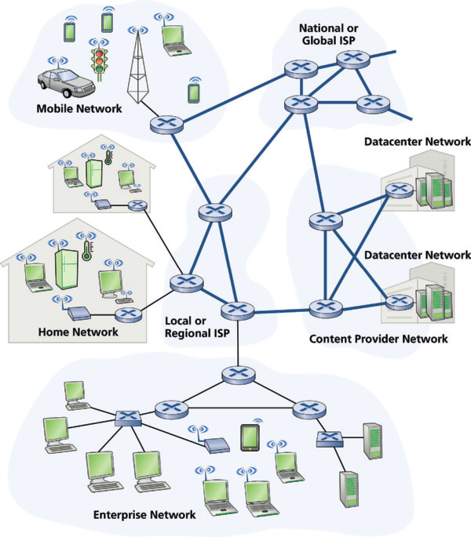

Figure 1.10 The network core

Store-and-Forward Transmission Most packet switches use store-and-forward transmission at the inputs to the links. Store-and-forward transmission means that the packet switch must receive the entire packet before it can begin to transmit the first bit of the packet onto the outbound link. To explore store-and-forward transmission in more detail, consider a simple network consisting of two end systems connected by a single router, as shown in Figure 1.11. A router will typically have many incident links, since its job is to switch an incoming packet onto an outgoing link;

in this simple example, the router has the rather simple task of transferring a packet from one (input) link to the only other attached link.

In this example, the source has three packets, each consisting of L bits, to send to the destination. At the snapshot of time shown in Figure 1.11, the source has transmitted some of packet 1, and the front of packet 1 has already arrived at the router.

Figure 1.11 Store-

and-forward packet switching

Because the router employs store-and-forwarding, at this instant of time, the router cannot transmit the bits it has received; instead it must first buffer (i.e., “store”) the packet’s bits. Only after the router has received all of the packet’s bits can it begin to transmit (i.e., “forward”) the packet onto the outbound link.

To gain some insight into store-and-forward transmission, let’s now calculate the amount of time that elapses from when the source begins to send the packet until the destination has received the entire packet. (Here we will ignore propagation delay—the time it takes for the bits to travel across the wire at near the speed of light—which will be discussed in Section 1.4.) The source begins to transmit at time 0; at time L R seconds, the source has transmitted the entire packet, and the entire packet has been received and stored at the router (since there is no propagation delay). At time L R seconds, since the router has just

received the entire packet, it can begin to transmit the packet onto the outbound link towards the destination; at time 2 L R , the router has transmitted

the entire packet, and the entire packet has been received by the destination.

Thus, the total delay is 2 L R . If the switch instead forwarded bits as soon as

they arrive (without first receiving the entire packet), then the total delay would be L R since bits are not held up at the router. But, as we will discuss in Section 1.4, routers need to receive, store, and process the entire packet before forwarding.

Now let’s calculate the amount of time that elapses from when the source begins to send the first packet until the destination has received all three packets. As before, at time L R, the router begins to forward the first packet. But

also at time L R the source will begin to send the second packet, since it has just finished sending the entire first packet. Thus, at time 2 L R , the destination

has received the first packet and the router has received the second packet.

Similarly, at time 3 L R , the destination has received the first two packets and

the router has received the third packet. Finally, at time 4 L R the destination

has received all three packets!

Let’s now consider the general case of sending one packet from source to destination over a path consisting of N links each of rate R (thus, there are N-1

routers between source and destination). Applying the same logic as above, we see that the end-to-end delay is:

d = N L (1.1) end-to-end R

You may now want to try to determine what the delay would be for P packets sent over a series of N links.

Queuing Delays and Packet Loss Each packet switch has multiple links attached to it. For each attached link, the packet switch has an output buffer (also called an output queue), which stores packets that the router is about to send into that link. The output buffers play a key role in packet switching. If an arriving packet needs to be transmitted onto a link but finds the link busy with the transmission of another packet, the arriving packet must wait in the output buffer. Thus, in addition to the store-and-forward delays, packets suffer output buffer queuing delays. These delays are variable and depend on the level of congestion in the network. Since the amount of buffer space is finite, an arriving packet may find that the buffer is completely full with other packets waiting for transmission.

In this case, packet loss will occur—either the arriving packet or one of the already-queued packets will be dropped.

Figure 1.12 illustrates a simple packet-switched network. As in Figure 1.11, packets are represented by three-dimensional slabs. The width of a slab represents the number of bits in the packet. In this figure, all packets have the same width and hence the same length. Suppose Hosts A and B are sending packets to Host E. Hosts A and B first send their packets along 100 Mbps Ethernet links to the first router. The router then directs these packets to the 15 Mbps link. If, during a short interval of time, the arrival rate of packets to the router (when converted to bits per second) exceeds 15 Mbps, congestion will occur at the router as packets queue in the link’s output buffer before being transmitted onto the link. For example, if Host A and B each send a burst of five packets back-toback at the same time, then most of these packets will spend some time waiting in the queue. The situation is, in fact, entirely analogous to many common-day situations—for example, when we wait in line for a bank teller or wait in front of a tollbooth. We’ll examine this queuing delay in more detail in Section 1.4.

Forwarding Tables and Routing Protocols Earlier, we said that a router takes a packet arriving on one of its attached communication links and forwards that packet onto another one of its attached communication links. But how does the router determine which link it should forward the packet onto? Packet forwarding is actually done in different ways

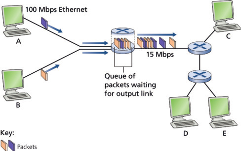

Figure 1.12 Packet switching

in different types of computer networks. Here, we briefly describe how it is done in the Internet.

In the Internet, every end system has an address called an IP address.

When a source end system wants to send a packet to a destination end system, the source includes the destination’s IP address in the packet’s header. As with postal addresses, this address has a hierarchical structure. When a packet arrives at a router in the network, the router examines a portion of the packet’s destination address and forwards the packet to an adjacent router. More specifically, each router has a forwarding table that maps destination addresses (or portions of the destination addresses) to that router’s outbound links.

When a packet arrives at a router, the router examines the address and searches its forwarding table, using this destination address, to find the appropriate outbound link. The router then directs the packet to this outbound link.

The end-to-end routing process is analogous to a car driver who does not use maps but instead prefers to ask for directions. For example, suppose Joe is driving from Philadelphia to 156 Lakeside Drive in Orlando, Florida. Joe first drives to his neighborhood gas station and asks how to get to 156 Lakeside Drive in Orlando, Florida. The gas station attendant extracts the Florida portion of the address and tells Joe that he needs to get onto the interstate highway I-95 South, which has an entrance just next to the gas station. He also tells Joe that once he enters Florida, he should ask someone else there. Joe then takes I-95 South until he gets to Jacksonville, Florida, at which point he asks another gas station attendant for directions. The attendant extracts the Orlando portion of the address and tells Joe that he should continue on I-95 to Daytona Beach and then ask someone else. In Daytona Beach, another gas station attendant also extracts the Orlando portion of the address and tells Joe that he should take I-4 directly to Orlando. Joe takes I-4 and gets off at the Orlando exit. Joe goes to another gas station attendant, and this time the attendant extracts the Lakeside Drive portion of the address and tells Joe the road he must follow to get to Lakeside Drive. Once Joe reaches Lakeside Drive, he asks a kid on a bicycle how to get to his destination. The kid extracts the 156 portion of the address and points to the house. Joe finally reaches his ultimate destination. In the above analogy, the gas station attendants and kids on bicycles are analogous to routers.

We just learned that a router uses a packet’s destination address to index a forwarding table and determine the appropriate outbound link. But this statement begs yet another question: How do forwarding tables get set? Are they configured by hand in each and every router, or does the Internet use a more automated procedure? This issue will be studied in depth in Chapter 5. But to whet your appetite here, we’ll note now that the Internet has a number of special routing protocols that are used to automatically set the forwarding tables.

A routing protocol may, for example, determine the shortest path from each router to each destination and use the shortest path results to configure the forwarding tables in the routers.

##### 1.3.2 Circuit Switching

There are two fundamental approaches to moving data through a network of links and switches: circuit switching and packet switching. Having covered packet-switched networks in the previous subsection, we now turn our attention to circuit-switched networks.

In circuit-switched networks, the resources needed along a path (buffers, link transmission rate) to provide for communication between the end systems are reserved for the duration of the communication session between the end systems.

In packet-switched networks, these resources are not reserved; a session’s messages use the resources on demand and, as a consequence, may have to wait (that is, queue) for access to a communication link. As a simple analogy, consider two restaurants, one that requires reservations and another that neither requires reservations nor accepts them. For the restaurant that requires reservations, we have to go through the hassle of calling before we leave home.

But when we arrive at the restaurant we can, in principle, immediately be seated and order our meal. For the restaurant that does not require reservations, we don’t need to bother to reserve a table. But when we arrive at the restaurant, we may have to wait for a table before we can be seated.

Traditional telephone networks are examples of circuit-switched networks. Consider what happens when one person wants to send information (voice or facsimile) to another over a telephone network. Before the sender can send the information, the network must establish a connection between the sender and the receiver.

This is a bona fide connection for which the switches on the path between the sender and receiver maintain connection state for that connection. In the jargon of telephony, this connection is called a circuit. When the network establishes the circuit, it also reserves a constant transmission rate in the network’s links (representing a fraction of each link’s transmission capacity) for the duration of the connection. Since a given transmission rate has been reserved for this sender-to-receiver connection, the sender can transfer the data to the receiver at the guaranteed constant rate.

Figure 1.13 illustrates a circuit-switched network. In this network, the four circuit switches are interconnected by four links. Each of these links has four circuits, so that each link can support four simultaneous connections. The hosts (for example, PCs and workstations) are each directly connected to one of the switches. When two hosts want to communicate, the network establishes a dedicated end-to-end connection between the two hosts. Thus, in order for Host A to communicate with Host B, the network must first reserve one circuit on each of two links. In this example, the dedicated end-to-end connection uses the second circuit in the first link and the fourth circuit in the second link.

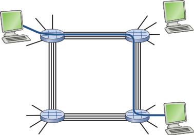

Figure 1.13 A simple circuit-switched network consisting of four switches and four links Because each link has four circuits, for each link used by the end-to-end connection, the connection gets one fourth of the link’s total transmission capacity for the duration of the connection. Thus, for example, if each link between adjacent switches has a transmission rate of 1 Mbps, then each end-to-end circuit-switch connection gets 250 kbps of dedicated transmission rate.

In contrast, consider what happens when one host wants to send a packet to another host over a packet-switched network, such as the Internet. As with circuit switching, the packet is transmitted over a series of communication links. But different from circuit switching, the packet is sent into the network without reserving any link resources whatsoever. If one of the links is congested because other packets need to be transmitted over the link at the same time, then the packet will have to wait in a buffer at the sending side of the transmission link and suffer a delay. The Internet makes its best effort to deliver packets in a timely manner, but it does not make any guarantees.

Multiplexing in Circuit-Switched Networks A circuit in a link is implemented with either frequency-division multiplexing (FDM) or time-division multiplexing (TDM). With FDM, the frequency spectrum of a link is divided up among the connections established across the link.

Specifically, the link dedicates a frequency band to each connection for the duration of the connection. In telephone networks, this frequency band typically has a width of 4 kHz (that is, 4,000 hertz or 4,000 cycles per second). The width of the band is called, not surprisingly, the bandwidth. FM radio stations also use FDM to share the frequency spectrum between 88 MHz and 108 MHz, with each station being allocated a specific frequency band.

For a TDM link, time is divided into frames of fixed duration, and each frame is divided into a fixed number of time slots. When the network establishes a connection across a link, the network dedicates one time slot in every frame to this connection. These slots are dedicated for the sole use of that connection, with one time slot available for use (in every frame) to transmit the connection’s data.

Figure 1.14 illustrates FDM and TDM for a specific network link supporting up to four circuits. For FDM, the frequency domain is segmented into four bands, each of bandwidth 4 kHz. For TDM, the time domain is segmented into frames, with four time slots in each frame; each circuit is assigned the same dedicated slot in the revolving TDM frames. For TDM, the transmission rate of a circuit is equal to the frame rate multiplied by the number of bits in a slot. For example, if the link transmits 8,000 frames per second and each slot consists of 8 bits, then the transmission rate of each circuit is 64 kbps.

Proponents of packet switching have always argued that circuit switching is wasteful because the dedicated circuits are idle during silent periods. For example, when one person in a telephone call stops talking, the idle network resources (frequency bands or time slots in the links along the connection’s route) cannot be used by other ongoing connections.

As another example of how these resources can be underutilized, consider a radiologist who uses a circuit-switched network to remotely access a series of x-rays. The radiologist sets up a connection, requests an image, contemplates the image, and then requests a new image. Network resources are allocated to the connection but are not used (i.e., are wasted) during the radiologist’s contemplation periods.

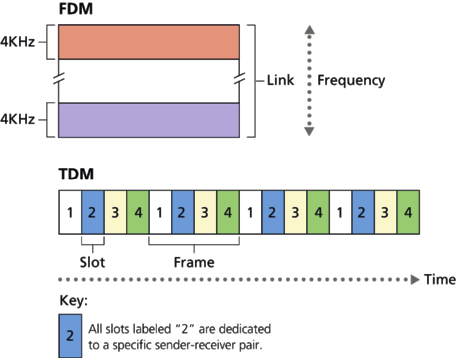

Figure 1.14 With FDM, each circuit continuously gets a fraction of the bandwidth. With TDM, each circuit gets all of the bandwidth periodically during brief intervals of time (that is, during slots)

Proponents of packet switching also enjoy pointing out that establishing endto-end circuits and reserving end-to-end transmission capacity is complicated and requires complex signaling software to coordinate the operation of the switches along the end-to-end path.

Before we finish our discussion of circuit switching, let’s work through a numerical example that should shed further insight on the topic. Let us consider how long it takes to send a file of 640,000 bits from Host A to Host B over a circuitswitched network. Suppose that all links in the network use TDM with 24 slots and have a bit rate of 1.536 Mbps. Also suppose that it takes 500 msec to establish an end-to-end circuit before Host A can begin to transmit the file. How long does it take to send the file? Each circuit has a transmission rate of  1.536 Mbps 24  =

kbps, so it takes  640,000 bits ( 64 kbps ) = 10 seconds to transmit the file. To 

this 10 seconds we add the circuit establishment time, giving 10.5 seconds to send the file. Note that the transmission time is independent of the number of links:

The transmission time would be 10 seconds if the end-to-end circuit passed through one link or a hundred links. (The actual end-to-end delay also includes a propagation delay; see Section 1.4.)

Packet Switching Versus Circuit Switching Having described circuit switching and packet switching, let us compare the two. Critics of packet switching have often argued that packet switching is not suitable for real-time services (for example, telephone calls and video conference calls) because of its variable and unpredictable end-to-end delays (due primarily to variable and unpredictable queuing delays). Proponents of packet switching argue that (1) it offers better sharing of transmission capacity than circuit switching and (2) it is simpler, more efficient, and less costly to implement than circuit switching. An interesting discussion of packet switching versus circuit switching is [Molinero-Fernandez 2002]. Generally speaking, people who do not like to hassle with restaurant reservations prefer packet switching to circuit switching.

Why is packet switching more efficient? Let’s look at a simple example.

Suppose users share a 1 Mbps link. Also suppose that each user alternates between periods of activity, when a user generates data at a constant rate of 100 kbps, and periods of inactivity, when a user generates no data. Suppose further that a user is active only 10 percent of the time (and is idly drinking coffee during the remaining 90 percent of the time).

With circuit switching, 100 kbps must be reserved for each user at all times. For example, with circuitswitched TDM, if a one-second frame is divided into 10 time slots of 100 ms each, then each user would be allocated one time slot per frame.

Thus, the circuit-switched link can support only 10 ( = 1 Mbps 100 kbps )

simultaneous users. With packet switching, the probability that a specific user is active is 0.1 (that is, 10 percent). If there are 35 users, the probability that there are 11 or more simultaneously active users is approximately 0.0004.

(Homework Problem P8 outlines how this probability is obtained.) When there are 10 or fewer simultaneously active users (which happens with probability 0.9996), the aggregate arrival rate of data is less than or equal to 1 Mbps, the output rate of the link. Thus, when there are 10 or fewer active users, users’ packets flow through the link essentially without delay, as is the case with circuit switching. When there are more than 10 simultaneously active users, then the aggregate arrival rate of packets exceeds the output capacity of the link, and the output queue will begin to grow. (It continues to grow until the aggregate input rate falls back below 1 Mbps, at which point the queue will begin to diminish in length.) Because the probability of having more than 10 simultaneously active users is minuscule in this example, packet switching provides essentially the same performance as circuit switching, but does so while allowing for more than three times the number of users.

Let’s now consider a second simple example. Suppose there are 10 users and that one user suddenly generates one thousand 1,000-bit  packets, while other users remain quiescent and do not generate packets. Under TDM circuit switching with 10 slots per frame and each slot consisting of 1,000 bits, the active user can only use its one time slot per frame to transmit data, while the remaining nine time slots in each frame remain idle. It will be 10 seconds before all of the active user’s one million bits of data has been transmitted. In the case of packet switching, the active user can continuously send its packets at the full link rate of 1 Mbps, since there are no other users generating packets that need to be multiplexed with the active user’s packets. In this case, all of the active user’s data will be transmitted within 1 second.

The above examples illustrate two ways in which the performance of packet switching can be superior to that of circuit switching. They also highlight the crucial difference between the two forms of sharing a link’s transmission rate among multiple data streams. Circuit switching pre-allocates use of the transmission link regardless of demand, with allocated but unneeded link time going unused. Packet switching on the other hand allocates link use on demand. Link transmission capacity will be shared on a packet-by-packet basis only among those users who have packets that need to be transmitted over the link.

Although packet switching and circuit switching are both prevalent in today’s telecommunication networks, the trend has certainly been in the direction of packet switching. Even many of today’s circuit-switched telephone networks are slowly migrating toward packet switching. In particular, telephone networks often use packet switching for the expensive overseas portion of a telephone call.

##### 1.3.3 A Network of Networks

We saw earlier that end systems (PCs, smartphones, Web servers, mail servers, and so on) connect into the Internet via an access ISP.The access ISP can provide either wired or wireless connectivity, using an array of access technologies including DSL, cable, FTTH, Wi-Fi, and cellular.

Note that the access ISP does not have to be a telco or a cable company; instead it can be, for example, a university (providing Internet access to students, staff, and faculty), or a company (providing access for its employees). But connecting end users and content providers into an access ISP is only a small piece of solving the puzzle of connecting the billions of end systems that make up the Internet. To complete this puzzle, the access ISPs themselves must be interconnected. This is done by creating a network of networks—understanding this phrase is the key to understanding the Internet.

Over the years, the network of networks that forms the Internet has evolved into a very complex structure. Much of this evolution is driven by economics and national policy, rather than by performance considerations. In order to understand today’s Internet network structure, let’s incrementally build a series of network structures, with each new structure being a better approximation of the complex Internet that we have today. Recall that the overarching goal is to interconnect the access ISPs so that all end systems can send packets to each other. One naive approach would be to have each access ISP directly connect with every other access ISP. Such a mesh design is, of course, much too costly for the access ISPs, as it would require each access ISP to have a separate communication link to each of the hundreds of thousands of other access ISPs all over the world.

Our first network structure, Network Structure 1, interconnects all of the access ISPs with a single global transit ISP. Our (imaginary) global transit ISP is a network of routers and communication links that not only spans the globe, but also has at least one router near each of the hundreds of thousands of access ISPs. Of course, it would be very costly for the global ISP to build such an extensive network. To be profitable, it would naturally charge each of the access ISPs for connectivity, with the pricing reflecting (but not necessarily directly proportional to) the amount of traffic an access ISP exchanges with the global ISP. Since the access ISP pays the global transit ISP, the access ISP is said to be a customer and the global transit ISP is said to be a provider.

Now if some company builds and operates a global transit ISP that is profitable, then it is natural for other companies to build their own global transit ISPs and compete with the original global transit ISP. This leads to Network Structure 2, which consists of the hundreds of thousands of access ISPs and multiple global transit ISPs. The access ISPs certainly prefer Network Structure 2 over Network Structure 1 since they can now choose among the competing global transit providers as a function of their pricing and services. Note, however, that the global transit ISPs themselves must interconnect: Otherwise access ISPs connected to one of the global transit providers would not be able to communicate with access ISPs connected to the other global transit providers.

Network Structure 2, just described, is a two-tier hierarchy with global transit providers residing at the top tier and access ISPs at the bottom tier. This assumes that global transit ISPs are not only capable of getting close to each and every access ISP, but also find it economically desirable to do so. In reality, although some ISPs do have impressive global coverage and do directly connect with many access ISPs, no ISP has presence in each and every city in the world. Instead, in any given region, there may be a regional ISP to which the access ISPs in the region connect. Each regional ISP then connects to tier 1 -

ISPs. Tier-1 ISPs are similar to our (imaginary) global transit ISP; but tier-1 ISPs, which actually do exist, do not have a presence in every city in the world.

There are approximately a dozen tier-1 ISPs, including Level 3 Communications, AT&T, Sprint, and NTT. Interestingly, no group officially sanctions tier-1 status; as the saying goes—if you have to ask if you’re a member of a group, you’re probably not.

Returning to this network of networks, not only are there multiple competing tier-1 ISPs, there may be multiple competing regional ISPs in a region.

In such a hierarchy, each access ISP pays the regional ISP to which it connects, and each regional ISP pays the tier-1 ISP to which it connects. (An access ISP can also connect directly to a tier-1 ISP, in which case it pays the tier-1 ISP).

Thus, there is customer-provider relationship at each level of the hierarchy.

Note that the tier-1 ISPs do not pay anyone as they are at the top of the hierarchy. To further complicate matters, in some regions, there may be a larger regional ISP (possibly spanning an entire country) to which the smaller regional ISPs in that region connect; the larger regional ISP then connects to a tier-1 ISP. For example, in China, there are access ISPs in each city, which connect to provincial ISPs, which in turn connect to national ISPs, which finally connect to tier-1 ISPs [Tian 2012]. We refer to this multi-tier hierarchy, which is still only a crude approximation of today’s Internet, as Network Structure 3.

To build a network that more closely resembles today’s Internet, we must add points of presence (PoPs), multi-homing, peering, and Internet exchange points (IXPs) to the hierarchical Network Structure 3.PoPs exist in all levels of the hierarchy, except for the bottom (access ISP) level.A PoP is simply a group of one or more routers (at the same location) in the provider’s network where customer ISPs can connect into the provider ISP.For a customer network to connect to a provider’s PoP, it can lease a high-speed link from a third-party telecommunications provider to directly connect one of its routers to a router at the PoP.Any ISP (except for tier-1 ISPs) may choose to multi-home, that is, to connect to two or more provider ISPs. So, for example, an access ISP may multi-home with two regional ISPs, or it may multi-home with two regional ISPs and also with a tier-1 ISP.Similarly, a regional ISP may multi-home with multiple tier-1 ISPs.

When an ISP multi-homes, it can continue to send and receive packets into the Internet even if one of its providers has a failure.

As we just learned, customer ISPs pay their provider ISPs to obtain global Internet interconnectivity. The amount that a customer ISP pays a provider ISP reflects the amount of traffic it exchanges with the provider. To reduce these costs, a pair of nearby ISPs at the same level of the hierarchy can peer, that is, they can directly connect their networks together so that all the traffic between them passes over the direct connection rather than through upstream intermediaries. When two ISPs peer, it is typically settlement-free, that is, neither ISP pays the other. As noted earlier, tier-1 ISPs also peer with one another, settlement-free. For a readable discussion of peering and customer-provider relationships, see [Van der Berg 2008]. Along these same lines, a third-party company can create an Internet Exchange Point (IXP), which is a meeting point where multiple ISPs can peer together. An IXP is typically in a standalone building with its own switches [Ager 2012]. There are over 600 IXPs in the Internet today [PeeringDB 2025]. We refer to this ecosystem—consisting of access ISPs, regional ISPs, tier-1 ISPs, PoPs, multi-homing, peering, and IXPs— as Network Structure 4.

We now finally arrive at Network Structure 5, which describes today’s Internet. Network Structure 5, illustrated in Figure 1.15, builds on top of Network Structure 4 by adding content-provider networks. Google is currently one of the leading examples of such a content-provider network. Google has over 20 major data centers distributed across North America, Europe, Asia, and South America, [Google datacenters 2024] with each data center having tens or hundreds of thousands of servers. Additionally, Google has smaller data centers, each with a few hundred servers; these smaller data centers are often located within IXPs. The Google data centers are all interconnected via Google’s private TCP/IP network, which spans the entire globe but is nevertheless separate from the public Internet. Importantly, the Google private network only carries traffic to/from Google servers. Figure 1.15 illustrates Google’s world-wide cloud network as of 2024 [Google Cloud 2025].

As shown in Figure 1.16, the Google private network attempts to “bypass” the upper tiers of the Internet by peering (settlement free) with lower-tier ISPs, either by directly connecting with them or by connecting with them at IXPs [Labovitz 2010].However, because many access ISPs can still only be reached by transiting through tier-1 networks, the Google network also connects to tier-1 ISPs, and pays those ISPs for the traffic it exchanges with them. By creating its own network, a content provider not only reduces its payments to upper-tier ISPs, but also has greater control of how its services are ultimately delivered to end users.

As of 2020, the cloud providers Amazon, Google, IBM, and Microsoft collectively are able to reach 76% of the Internet without passing through Tier-1 ISPs [Arnold 2020].

In summary, today’s Internet—a network of networks—is complex, consisting of a dozen or so tier-1 ISPs and hundreds of thousands of lower-tier ISPs. The ISPs are diverse in their coverage, with some spanning multiple continents and oceans, and others limited to narrow geographic regions. The lower-tier ISPs connect to the higher-tier ISPs, and the higher-tier ISPs interconnect with one another. Users and content providers are customers of lower-tier ISPs, and lower-tier ISPs are customers of higher-tier ISPs. In recent years, major content providers have also created their own networks and connect directly into lower-tier ISPs where possible.

Figure 1.15 Google cloud locations and network

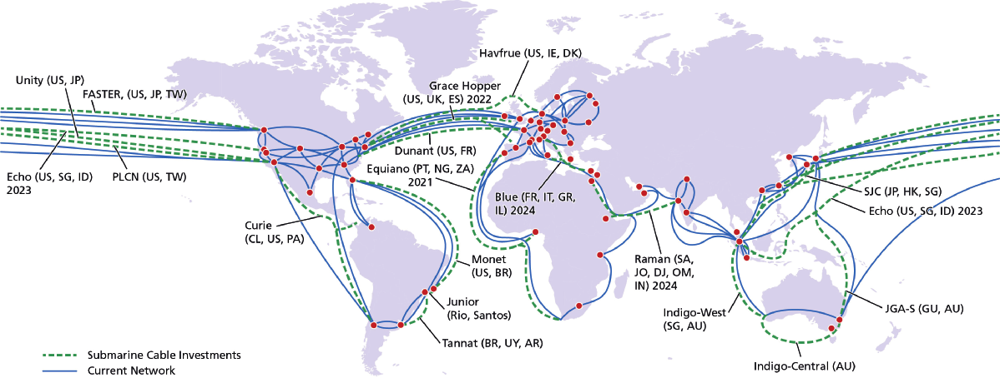

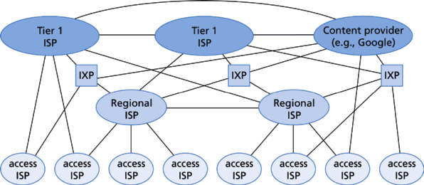

Figure 1.16 Interconnection of ISPs and content provider networks

#### 1.4 Delay, Loss, and Throughput in Packet-Switched Networks

Back in Section 1.1 we said that the Internet can be viewed as an infrastructure that provides services to distributed applications running on end systems.

Ideally, we would like Internet services to be able to move as much data as we want between any two end systems, instantaneously, without any loss of data.

Alas, this is a lofty goal, one that is unachievable in reality. Instead, computer networks necessarily constrain throughput (the amount of data per second that can be transferred) between end systems, introduce delays between end systems, and can actually lose packets. On one hand, it is unfortunate that the physical laws of reality introduce delay and loss as well as constrain throughput. On the other hand, because computer networks have these problems, there are many fascinating issues surrounding how to deal with the  problems— more than enough issues to fill a course on computer networking and to motivate thousands of PhD theses!

In this section, we’ll begin to examine and quantify delay, loss, and throughput in computer networks.

##### 1.4.1 Overview of Delay in Packet-Switched Networks

Recall that a packet starts in a host (the source), passes through a series of routers, and ends its journey in another host (the destination). As a packet travels from one node (host or router) to the subsequent node (host or router) along this path, the packet suffers from several types of delays at each node along the path. The most important of these delays are the nodal processing delay, queuing delay, transmission delay, and propagation delay; together, these delays accumulate to give a total nodal delay. The performance of many Internet applications—such as search, Web browsing, e-mail, maps, instant messaging, and voice-over-IP—are greatly affected by network delays. In order to acquire a deep understanding of packet switching and computer networks, we must understand the nature and importance of these delays.

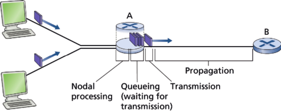

Figure 1.17 The nodal delay at router A

Types of Delay Let’s explore these delays in the context of Figure 1.17. As part of its end-toend route between source and destination, a packet is sent from the upstream node through router A to router B. Our goal is to characterize the nodal delay at router A. Note that router A has an outbound link leading to router B. This link is preceded by a queue (also known as a buffer). When the packet arrives at router A from the upstream node, router A examines the packet’s header to determine the appropriate outbound link for the packet and then directs the packet to this link. In this example, the outbound link for the packet is the one that leads to router B. A packet can be transmitted on a link only if there is no other packet currently being transmitted on the link and if there are no other packets preceding it in the queue; if the link is currently busy or if there are other packets already queued for the link, the newly arriving packet will then join the queue.

PROCESSING DELAY The time required to examine the packet’s header and determine where to direct the packet is part of the processing delay. The processing delay can also include other factors, such as the time needed to check for bit-level errors in the packet that occurred in transmitting the packet’s bits from the upstream node to router A. Processing delays in high-speed routers are typically on the order of microseconds or less. After this nodal processing, the router directs the packet to the queue that precedes the link to router B. (In Chapter 4 we’ll study the details of how a router operates.)

QUEUING DELAY At the queue, the packet experiences a queuing delay as it waits to be transmitted onto the link. The length of the queuing delay of a specific packet will depend on the number of earlier-arriving packets that are queued and waiting for transmission onto the link. If the queue is empty and no other packet is currently being transmitted, then our packet’s queuing delay will be zero. On the other hand, if the traffic is heavy and many other packets are also waiting to be transmitted, the queuing delay will be long. We will see shortly that the number of packets that an arriving packet might expect to find is a function of the intensity and nature of the traffic arriving at the queue. Queuing delays can be on the order of microseconds to milliseconds in practice.

TRANSMISSION DELAY Assuming that packets are transmitted in a first-come-first-served manner, as is common in packet-switched networks, our packet can be transmitted only after all the packets that have arrived before it have been transmitted. Denote the length of the packet by L bits, and denote the transmission rate of the link

from router A to router B by R bits sec. For example, for a 10 Mbps Ethernet

link, the rate is R = 10 Mbps; for a 100 Mbps Ethernet link, the rate is

R = 100 Mbps .The transmission delay is L R.

This is the amount of time

required to push (that is, transmit) all of the packet’s bits into the link. Transmission delays are typically on the order of microseconds to milliseconds in practice.

PROPAGATION DELAY Once a bit is pushed into the link, it needs to propagate to router B. The time required to propagate from the beginning of the link to router B is the propagation delay. The bit propagates at the propagation speed of the link. The propagation speed depends on the physical medium of the link (that is, fiber optics, twisted-pair copper wire, and so on) and is in the range of

2 10  meters sec  to 3 10  meters sec i 8 i 8

which is equal to, or a little less than, the speed of light. The propagation delay is the distance between two routers divided by the propagation speed. That is, the propagation delay is d s, where d is the distance between router A and

router B and s is the propagation speed of the link. Once the last bit of the packet propagates to node B, it and all the preceding bits of the packet are stored in router B. The whole process then continues with router B now performing the forwarding. In wide-area networks, propagation delays are on the order of milliseconds.

Comparing Transmission and Propagation Delay Newcomers to the field of computer networking sometimes have difficulty understanding the difference between transmission delay and propagation delay. The difference is subtle but important. The transmission delay is the amount of time required for the router to push out the packet; it is a function of the packet’s length and the transmission rate of the link, but has nothing to do with the distance between the two routers. The propagation delay, on the other hand, is the time it takes a bit to propagate from one router to the next; it is a function of the distance between the two routers, but has nothing to do with the packet’s length or the transmission rate of the link.

An analogy might clarify the notions of transmission and propagation delay. Consider a highway that has a tollbooth every 100 kilometers, as shown in Figure 1.18.You can think of the highway segments between tollbooths as links and the tollbooths as routers. Suppose that cars travel (that is, propagate) on the highway at a rate of 100 km hour (that is, when a car leaves a tollbooth, it instantaneously accelerates to 100 km hour  and maintains that speed between tollbooths).Suppose next that 10 cars, traveling together as a caravan, follow each other in a fixed order. You can think of each car as a bit and the caravan as a packet. Also suppose that each tollbooth services (that is, transmits) a car at a rate of one car per 12 seconds, and that it is late at night so that the caravan’s cars are the only cars on the highway. Finally, suppose that whenever the first car of the caravan arrives at a tollbooth, it waits at the entrance until the other nine cars have arrived and lined up behind it. (Thus, the entire caravan must be stored at the tollbooth before it can begin to be forwarded.) The time required for the tollbooth to push the entire caravan onto the highway is  10 cars 5 cars minute  = 2 minutes .

This time is analogous to the 

Figure 1.18 Caravan

analogy

transmission delay in a router. The time required for a car to travel from the exit of one tollbooth to the next tollbooth is 100 km 100 km hour  = 1 hour .

This time is analogous to propagation delay. Therefore, the time from when the caravan is stored in front of a tollbooth until the caravan is stored in front of the next tollbooth is the sum of transmission delay and propagation delay—in this example, 62 minutes.

Let’s explore this analogy a bit more. What would happen if the tollbooth service time for a caravan were greater than the time for a car to travel between tollbooths? For example, suppose now that the cars travel at the rate of 1,000 km hour and the tollbooth services cars at the rate of one car per minute. Then the traveling delay between two tollbooths is 6 minutes and the time to serve a caravan is 10 minutes. In this case, the first few cars in the caravan will arrive at the second tollbooth before the last cars in the caravan leave the first tollbooth. This situation also arises in packet-switched networks—the first bits in a packet can arrive at a router while many of the remaining bits in the packet are still waiting to be transmitted by the preceding router.

If a picture speaks a thousand words, then an animation must speak a million words. The Web site for this text book provides an interactive animation that nicely illustrates and contrasts transmission delay and propagation delay.

The reader is highly encouraged to visit that animation. [Smith 2009] also provides a very readable discussion of propagation, queueing, and transmission delays.

If we let d , d , d , and d denote the processing, queuing, transproc queue trans prop mission, and propagation delays, then the total nodal delay is given by

d = d + d + d + d nodal proc queue trans prop

The contribution of these delay components can vary significantly. For example, d can be negligible (for example, a couple of microseconds) for a prop link connecting two routers on the same university campus; however, d is prop hundreds of milliseconds for two routers interconnected by a geostationary satellite link, and can be the dominant term in d . Similarly, d can range nodal trans from negligible to significant. Its contribution is typically negligible for transmission rates of 10 Mbps and higher (for example, for LANs); however, it can be hundreds of milliseconds for large Internet packets sent over low-speed dial-up modem links. The processing delay, , is often negligible; however, proc it strongly influences a router’s maximum throughput, which is the maximum rate at which a router can forward packets.

##### 1.4.2 Queuing Delay and Packet Loss

The most complicated and interesting component of nodal delay is the queuing delay, d . In fact, queuing delay is so important and interesting in queue computer networking that thousands of papers and numerous books have been written about it [Bertsekas 1991; Kleinrock 1975, Kleinrock 1976]. We give only a high-level, intuitive discussion of queuing delay here; the more curious reader may want to browse through some of the books (or even eventually write a PhD thesis on the subject!). Unlike the other three delays (namely, d , d , and d ), the queuing delay can vary from packet to proc trans prop packet. For example, if 10 packets arrive at an empty queue at the same time, the first packet transmitted will suffer no queuing delay, while the last packet transmitted will suffer a relatively large queuing delay (while it waits for the other nine packets to be transmitted). Therefore, when characterizing queuing delay, one typically uses statistical measures, such as average queuing delay, variance of queuing delay, and the probability that the queuing delay exceeds some specified value.

When is the queuing delay large and when is it insignificant? The answer to this question depends on the rate at which traffic arrives at the queue, the transmission rate of the link, and the nature of the arriving traffic, that is, whether the traffic arrives periodically or arrives in bursts. To gain some insight here, let a denote the average rate at which packets arrive at the queue (a is in units of packets/sec).

Recall that R is the transmission rate; that is, it is the rate (in bits/sec) at which bits are pushed out of the queue. Also suppose, for simplicity, that all packets consist of L bits. Then the average rate at which

bits arrive at the queue is La bits sec. Finally, assume that the queue is very

big, so that it can hold essentially an infinite number of bits. The ratio La R,

called the traffic intensity, often plays an important role in estimating the extent of the queuing delay. If La R > 1 , then the average rate at which bits

arrive at the queue exceeds the rate at which the bits can be transmitted from the queue. In this unfortunate situation, the queue will tend to increase without bound and the queuing delay will approach infinity! Therefore, one of the golden rules in traffic engineering is: Design your system so that the traffic intensity is no greater than 1.

Now consider the case La R ≤ 1 . Here, the nature of the arriving traffic

impacts the queuing delay. For example, if packets arrive periodically—that is, one packet arrives every L R seconds—then every packet will arrive at an

empty queue and there will be no queuing delay. On the other hand, if packets arrive in bursts but periodically, there can be a significant average queuing delay. For example, suppose N packets arrive simultaneously every

L R N seconds. Then the first packet transmitted has no queuing delay; the  second packet transmitted has a queuing delay of L R seconds; and more

− generally, the nth packet transmitted has a queuing delay of  n L R sec- 

onds. We leave it as an exercise for you to calculate the average queuing delay in this example.

The two examples of periodic arrivals described above are a bit academic.

Typically, the arrival process to a queue is random; that is, the arrivals do not follow any pattern and the packets are spaced apart by random amounts of time. In this more realistic case, the quantity La R is not usually sufficient to

fully characterize the queuing delay statistics. Nonetheless, it is useful in gaining an intuitive understanding of the extent of the queuing delay. In particular, if the traffic intensity is close to zero, then packet arrivals are few and far between and it is unlikely that an arriving packet will find another packet in the queue. Hence, the average queuing delay will be close to zero. On the other hand, when the traffic intensity is close to 1, there will be intervals of time when the arrival rate exceeds the transmission capacity (due to variations in packet arrival rate), and a queue will form during these periods of time; when the arrival rate is less than the transmission capacity, the length of the queue will shrink. Nonetheless, as the traffic intensity approaches 1, the average queue length gets larger and larger. The qualitative dependence of average queuing delay on the traffic intensity is shown in Figure 1.19.

One important aspect of Figure 1.19 is the fact that as the traffic intensity approaches 1, the average queuing delay increases rapidly. A small percentage increase in the intensity will result in a much larger percentage-wise increase in delay. Perhaps you have experienced this phenomenon on the highway. If you regularly drive on a road that is typically congested, the fact that the road is typically congested means that its traffic intensity is close to 1. If some event causes an even slightly larger-than-usual amount of traffic, the delays you experience can be huge.

To really get a good feel for what queuing delays are about, you are encouraged once again to visit the textbook Web site, which provides an interactive animation for a queue. If you set the packet arrival rate high enough so that the traffic intensity exceeds 1, you will see the queue slowly build up over time.

Packet Loss In our discussions above, we have assumed that the queue is capable of holding an infinite number of packets. In reality a queue preceding a link has finite

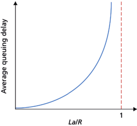

Figure 1.19 Dependence of average queuing delay on traffic intensity capacity, although the queuing capacity greatly depends on the router design and cost. Because the queue capacity is finite, packet delays do not really approach infinity as the traffic intensity approaches 1. Instead, a packet can arrive to find a full queue. With no place to store such a packet, a router will drop that packet;

that is, the packet will be lost. This overflow at a queue can again be seen in the interactive animation when the traffic intensity is greater than 1.

From an end-system viewpoint, a packet loss will look like a packet having been transmitted into the network core but never emerging from the network at the destination. The fraction of lost packets increases as the traffic intensity increases. Therefore, performance at a node is often measured not only in terms of delay, but also in terms of the probability of packet loss. As we’ll discuss in the subsequent chapters, a lost packet may be retransmitted on an end-to-end basis in order to ensure that all data are eventually transferred from source to destination.

##### 1.4.3 End-to-End Delay

Our discussion up to this point has focused on the nodal delay, that is, the delay at a single router. Let’s now consider the total delay from source to destination. To get a handle on this concept, suppose there are N-1 routers between

the source host and the destination host. Let’s also suppose for the moment that the network is uncongested (so that queuing delays are negligible), the processing delay at each router and at the source host is d , the transmission proc rate out of each router and out of the source host is R bits sec, and the propa-

gation on each link is d . The nodal delays accumulate and give an prop end-to-end delay,

 d = N d + d + d (1.2) end end − proc trans prop

where, once again, d = L R , where L is the packet size.

Note that Equatrans tion 1.2 is a generalization of Equation 1.1, which did not take into account processing and propagation delays. We leave it to you to generalize Equation 1.2 to the case of heterogeneous delays at the nodes and to the presence of an average queuing delay at each node.

Traceroute To get a hands-on feel for end-to-end delay in a computer network, we can make use of the Traceroute program. Traceroute is a simple program that can run in any Internet host. When the user specifies a destination hostname, the program in the source host sends multiple, special packets toward that destination. As these packets work their way toward the destination, they pass through a series of routers. When a router receives one of these special packets, it sends back to the source a short message that contains the name and address of the router.

More specifically, the source sends a series of special packets into the network, with each packet addressed to the final destination. The first of these packets is marked 1, the second is marked 2, and so on. Whenever a router between the source and destination receives one of these special packets, it decrements the marking by one and then forwards the packet along its merry way. However, if at a router the marking gets decremented to zero, the router does not forward the packet toward its destination, but instead sends a message back to the source. When the destination host receives a packet marked as 1, it too returns a message back to the source. (After receiving the message from the host, the source stops sending these special packets.) The source records the time that elapses between when it sends a packet and when it receives the corresponding return message; it also records the name and address of the router (or the destination host) that returns the message. In this manner, the source can reconstruct the route taken by packets flowing from source to destination, and the source can determine the round-trip delays to all the intervening routers. Traceroute actually repeats the experiment just described three times, so the source actually sends 3 i N packets to the destination, where N-1 is the number or routers between source and destination.

RFC 1393 describes Traceroute in detail.

Here is an example of the output of the Traceroute program, where the route was being traced from the source host gaia.cs.umass.edu (at the University of Massachusetts) to a host in the computer science department at the University of Sorbonne in Paris (formerly the university was known as UPMC). The output has six columns: the first column is the marked value described above, that is, the ordinal number of the router along the route; the second column is the name of the router; the third column is the address of the router (of the form xxx.xxx.xxx.xxx); the last three columns are the roundtrip delays for three experiments. If the source receives fewer than three messages from any given router (due to packet loss in the network),  Traceroute places an asterisk just after the router number and reports fewer than three round-trip times for that router.

1  gw-vlan-2451.cs.umass.edu (128.119.245.1) 1.899 ms 3.266 ms 3.280 ms 2  j-cs-gw-int-10-240.cs.umass.edu (10.119.240.254) 1.296 ms 1.276 ms 1.245 ms 3  n5-rt-1-1-xe-2-1-0.gw.umass.edu (128.119.3.33) 2.237 ms 2.217 ms 2.187 ms 4  core1-rt-et-5-2-0.gw.umass.edu (128.119.0.9) 0.351 ms 0.392 ms 0.380 ms 5  border1-rt-et-5-0-0.gw.umass.edu (192.80.83.102) 0.345 ms 0.345 ms 0.344 ms 6  nox300gw1-umass-re.nox.org (192.5.89.101) 3.260 ms 0.416 ms 3.127 ms 7  nox300gw1-umass-re.nox.org (192.5.89.101) 3.165 ms 7.326 ms 7.311 ms 8  198.71.45.237 (198.71.45.237) 77.826 ms 77.246 ms 77.744 ms 9  renater-lb1-gw.mx1.par.fr.geant.net (62.40.124.70) 79.357 ms 77.729 79.152 ms 10  193.51.180.109 (193.51.180.109) 78.379 ms 79.936 80.042 ms 11  * 193.51.180.109 (193.51.180.109) 80.640 ms * 12  * 195.221.127.182 (195.221.127.182) 78.408 ms * 13  195.221.127.182 (195.221.127.182) 80.686 ms 80.796 ms 78.434 ms 14  r-upmc1.reseau.jussieu.fr (134.157.254.10) 78.399 ms * 81.353 ms

In the trace above, there are 14 routers between the source and the destination. Most of these routers have a name, and all of them have addresses. For

core1-rt-et-5-2-0.gw.umass.edu example, the name of Router 4 is and 128.119.0.9 its address is . Looking at the data provided for this same router, we see that in the first of the three trials the round-trip delay between the source and the router was 0.351 msec. The round-trip delays for the subsequent two trials were 0.392 and 0.380 msec. These round-trip delays include all of the delays just discussed, including transmission delays, propagation delays, router processing delays, and queuing delay.

Because the queuing delay is varying with time, the round-trip delay of packet n sent to a router n can sometimes be longer than the round-trip delay of packet n + 1 sent to router n + 1 . Indeed, we observe this phenomenon in

the above example: the delay to Router 12 is smaller than the delay to Router 11!

Also note the big increase in the round-trip delay when going from router 7 to router 8. This is due to a transatlantic fiber-optic link between routers 7 and 8, giving rise to a relatively large propagation delay. There are a number of free software programs that provide a graphical interface to Traceroute; one of our favorites is PingPlotter [PingPlotter 2025]. Another frequently used tool is Whois, which queries the distributed Whois database and provides registration information about IP addresses.

End System, Application, and Other Delays In addition to processing, transmission, and propagation delays, there can be additional significant delays in the end systems. For example, an end system wanting to transmit a packet into a shared medium (e.g., as in a WiFi or cable modem scenario) may purposefully delay its transmission as part of its protocol for sharing the medium with other end systems; we’ll consider such protocols in detail in Chapter 6. Another important delay is media packetization delay, which is present in video conferencing applications such as Zoom and Google Hangouts. applications. In video conferencing, the sending side must first fill a packet with encoded digitized video and speech before passing the packet to the Internet.

##### 1.4.4 Throughput in Computer Networks

In addition to delay and packet loss, another critical performance measure in computer networks is end-to-end throughput. To define throughput, consider transferring a large file from Host A to Host B across a computer network. This transfer might be, for example, a large video clip from one computer to another.

The instantaneous throughput at any instant of time is the rate (in bits sec) at which Host B is receiving the file. (Many applications display the instantaneous throughput during downloads in the user interface—perhaps you have observed this before! You might like to try measuring the end-to-end delay and download throughput between your and servers around the Internet using the speedtest application [Speedtest 2025].) If the file consists of F  bits and the

transfer takes T  seconds for Host B to receive all F  bits, then the average

throughput of the file transfer is F T bits sec. For some applications, such as Internet telephony, it is desirable to have a low delay and an instantaneous throughput consistently above some threshold (for example, over 24 kbps for some Internet telephony applications and over 256 kbps for some real-time video applications). For other applications, including those involving file transfers, delay is not critical, but it is desirable to have the highest possible throughput.

To gain further insight into the important concept of throughput, let’s consider a few examples. Figure 1.20(a) shows two end systems, a server and a client, connected by two communication links and a router. Consider the throughput for a file transfer from the server to the client. Let R denote the rate s of the link between the server and the router; and R denote the rate of the link c between the router and the client. Suppose that the only bits being sent in the entire network are those from the server to the client. We now ask, in this ideal scenario, what is the server-to-client throughput? To answer this question, we may think of bits as fluid and communication links as pipes. Clearly, the server cannot pump bits through its link at a rate faster than R bps; and the router s cannot forward bits at a rate faster than R bps. If R < R , then the bits c s c pumped by the server will “flow” right through the router and arrive at the client at a rate of R bps, giving a throughput of R bps. If, on the other hand, s s R < R , then the router will not be able to forward bits as quickly as it receives c s them.

In this case, bits will only leave the router at rate R , giving an end-toc end throughput of R . (Note also that if bits continue to arrive at the router at c rate R , and continue to leave the router at R , the backlog of bits at the router s c waiting for transmission to the client will grow and grow—a most undesirable situation!) Thus, for this simple two-link network, the throughput is min R R , , that is, it is the transmission rate of the bottleneck link. Having { } c s determined the throughput, we can now approximate the time it takes to transfer a large file of F bits from server to client as F min R R , . For a specific { } s c example, suppose that you are downloading an MP3 file of F = 32 million

bits, the server has a transmission rate of R = 2 Mbps , and you have an s access link of R = 1 Mbps . The time needed to transfer the file is then c 32 seconds. Of course, these expressions for throughput and transfer time are only approximations, as they do not account for store-and-forward and processing delays as well as protocol issues.

Figure 1.20(b) now shows a network with N links between the server and the client, with the transmission rates of the N  links being R R , , . . . , R . 1 2 N Applying the same analysis as for the two-link network, we find that the

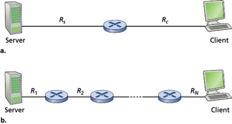

Figure 1.20 Throughput for a file transfer from server to client throughput for a file transfer from server to client is min  R R { , , . . . , R } , N which is once again the transmission rate of the bottleneck link along the path between server and client.

Now consider another example motivated by today’s Internet. Figure 1.21(a) shows two end systems, a server and a client, connected to a computer network. Consider the throughput for a file transfer from the server to the client. The server is connected to the network with an access link of rate R and the client is connected to the network with an access link of rate R . Now s c suppose that all the links in the core of the communication network have very high transmission rates, much higher than R and R . Indeed, today, the core of s c the Internet is over-provisioned with high speed links that experience little congestion. Also suppose that the only bits being sent in the entire network are those from the server to the client. Because the core of the computer network is like a wide pipe in this example, the rate at which bits can flow from source to destina-

= tion is again the minimum of R and R , that is, throughput min { R R , } . s c s Therefore, the constraining factor for throughput in today’s Internet is typically the access network.

For a final example, consider Figure 1.21(b) in which there are 10 servers and 10 clients connected to the core of the computer network. In this example, there are 10 simultaneous downloads taking place, involving 10 client-server pairs. Suppose that these 10 downloads are the only traffic in the network at the current time. As shown in the figure, there is a link in the core that is traversed by all 10 downloads. Denote R for the transmission rate of this link R.

Let’s suppose that all server access links have the same rate R , all client access s links have the same rate R , and the transmission rates of all the links in the c core—except the one common link of rate R—are much larger than R , R , and R. s c Now we ask, what are the throughputs of the downloads? Clearly, if the rate of the common link, R, is large—say a hundred times larger than both R and s

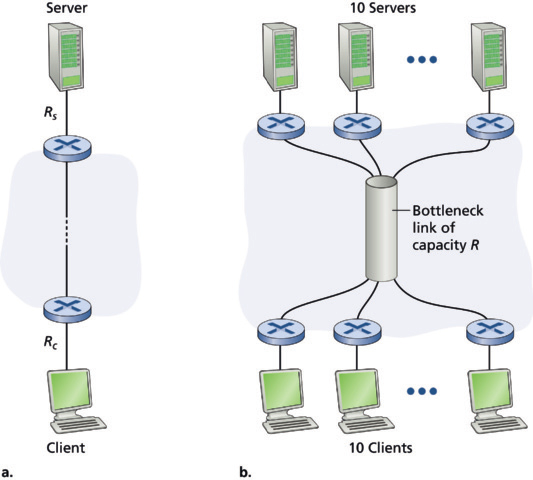

Figure 1.21 End-to- end throughput: (a) Client downloads a file from server; (b) 10 clients downloading with 10 servers

R —then the throughput for each download will once again be min { R R , } . s But what if the rate of the common link is of the same order as R and R ? What s will the throughput be in this case? Let’s take a look at a specific example. Sup- = = = pose R 2 Mbps ,  R 1 Mbps ,  R 5 Mbps, and the common link s c divides its transmission rate equally among the 10 downloads. Then the bottleneck for each download is no longer in the access network, but is now instead the shared link in the core, which only provides each download with 500 kbps of throughput. Thus, the end-to-end throughput for each download is now reduced to 500 kbps.

The examples in Figure 1.20 and Figure 1.21(a) show that throughput depends on the transmission rates of the links over which the data flows. We saw that when there is no other intervening traffic, the throughput can simply be approximated as the minimum transmission rate along the path between source and destination. The example in Figure 1.21(b) shows that more generally the throughput depends not only on the transmission rates of the links along the path, but also on the intervening traffic.

In particular, a link with a high transmission rate may nonetheless be the bottleneck link for a file transfer if many other data flows are also passing through that link. We will examine throughput in computer networks more closely in the homework problems and in the subsequent chapters.

#### 1.5 Protocol Layers and Their Service Models

From our discussion thus far, it is apparent that the Internet is an extremely complicated system. We have seen that there are many pieces to the Internet:

numerous applications and protocols, various types of end systems, packet switches, and various types of link-level media. Given this enormous complexity, is there any hope of organizing a network architecture, or at least our discussion of network architecture? Fortunately, the answer to both questions is yes.

##### 1.5.1 Layered Architecture

Before attempting to organize our thoughts on Internet architecture, let’s look for a human analogy. Actually, we deal with complex systems all the time in our everyday life. Imagine if someone asked you to describe, for example, the airline system. How would you find the structure to describe this complex system that has ticketing agents, baggage checkers, gate personnel, pilots, airplanes, air traffic control, and a worldwide system for routing airplanes?

One way to describe this system might be to describe the series of actions you take (or others take for you) when you fly on an airline. You purchase your ticket, check your bags, go to the gate, and eventually get loaded onto the plane. The plane takes off and is routed to its destination.

After your plane lands, you deplane at the gate and claim your bags. If the trip was bad, you complain about the flight to the ticket agent (getting nothing for your effort).

This scenario is shown in Figure 1.22.

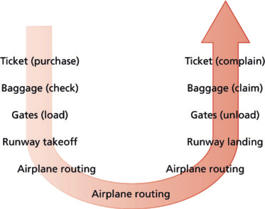

Figure 1.22 Taking an airplane trip: actions

Already, we can see some analogies here with computer networking: You are being shipped from source to destination by the airline; a packet is shipped from source host to destination host in the Internet. But this is not quite the analogy we are after. We are looking for some structure in Figure 1.22. Looking at Figure 1.22, we note that there is a ticketing function at each end; there is also a baggage function for already-ticketed passengers, and a gate function for already-ticketed and already-baggage-checked passengers. For passengers who have made it through the gate (that is, passengers who are already ticketed, baggage-checked, and through the gate), there is a takeoff and landing function, and while in flight, there is an airplane-routing function. This suggests that we can look at the functionality in Figure 1.22 in a horizontal manner, as shown in Figure 1.23.

Figure 1.23 has divided the airline functionality into layers, providing a framework in which we can discuss airline travel. Note that each layer, combined with the layers below it, implements some functionality, some service. At the ticketing layer and below, airline-counter-to-airline-counter transfer of a person is accomplished. At the baggage layer and below, baggage-check-tobaggage-claim transfer of a person and bags is accomplished. Note that the baggage layer provides this service only to an already-ticketed person. At the gate layer, departure-gate-to-arrival-gate transfer of a person and bags is accomplished. At the takeoff/landing layer, runway-to-runway transfer of people and their bags is accomplished. Each layer provides its service Figure 1.23 Horizontal layering of airline functionality

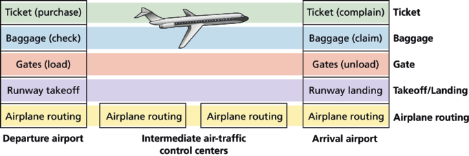

by (1) performing certain actions within that layer (for example, at the gate layer, loading and unloading people from an airplane) and by (2) using the services of the layer directly below it (for example, in the gate layer, using the runway-to-runway passenger transfer service of the takeoff/landing layer).

A layered architecture allows us to discuss a well-defined, specific part of a large and complex system. This simplification itself is of considerable value by providing modularity, making it much easier to change the implementation of the service provided by the layer. As long as the layer provides the same service to the layer above it, and uses the same services from the layer below it, the remainder of the system remains unchanged when a layer’s implementation is changed. (Note that changing the implementation of a service is very different from changing the service itself!) For example, if the gate functions were changed (for instance, to have people board and disembark by height), the remainder of the airline system would remain unchanged since the gate layer still provides the same function (loading and unloading people); it simply implements that function in a different manner after the change. For large and complex systems that are constantly being updated, the ability to change the implementation of a service without affecting other components of the system is another important advantage of layering.

Protocol Layering But enough about airlines. Let’s now turn our attention to network protocols.

To provide structure to the design of network protocols, network designers organize protocols—and the network hardware and software that implement the protocols—in layers. Each protocol belongs to one of the layers, just as each function in the airline architecture in Figure 1.23 belonged to a layer. We are again interested in the services that a layer offers to the layer above—the socalled service model of a layer. Just as in the case of our airline example, each layer provides its service by (1) performing certain actions within that layer and by (2) using the services of the layer directly below it. For example, the services provided by layer n may include reliable delivery of messages from one edge of the network to the other.

This might be implemented by using an unre-

− liable edge-to-edge message delivery service of layer n 1 , and adding layer n

functionality to detect and retransmit lost messages.

A protocol layer can be implemented in software, in hardware, or in a combination of the two. Application-layer protocols—such as HTTP and SMTP—are almost always implemented in software in the end systems; so are transport-layer protocols. Because the physical layer and data link layers are responsible for handling communication over a specific link, they are typically implemented in a network interface card (for example, Ethernet or WiFi interface cards) associated with a given link. The network layer is often a mixed implementation of hardware and software. Also note that just as the functions in the layered airline architecture were distributed among the various airports and flight control centers that make up the system, so too is a layer n protocol distributed among the end systems, packet switches, and other components that make up the network. That is, there’s often a piece of a layer n protocol in each of these network components.

Protocol layering has conceptual and structural advantages [RFC 3439]. Figure 1.24 The As we have seen, layering provides a structured way to discuss system compo- Internet protocol stack nents. Modularity makes it easier to update system components. We mention, however, that some researchers and networking engineers are vehemently opposed to layering [Wakeman 1992]. One potential drawback of layering is that one layer may duplicate lower-layer functionality. For example, many protocol stacks provide error recovery on both a per-link basis and an end-to-end basis. A second potential drawback is that functionality at one layer may need information (for example, a timestamp value) that is present only in another layer; this violates the goal of separation of layers.

When taken together, the protocols of the various layers are called the protocol stack. The Internet protocol stack consists of five layers: the physical, link, network, transport, and application layers, as shown in Figure 1.24. If you examine the Table of Contents, you will see that we have roughly organized this book using the layers of the Internet protocol stack. We take a top-down approach, first covering the application layer and then proceeding downward.

Application Layer The application layer is where network applications and their application-layer protocols reside. The Internet’s application layer includes many protocols, such as the HTTP protocol (which provides for Web document request and transfer) and SMTP (which provides for the transfer of e-mail).

We’ll see that certain network functions, such as the translation of humanfriendly names for Internet end systems like www.ietf.org to a 32-bit network address, are also done with the help of a specific application-layer protocol, namely, the domain name system (DNS). We’ll see in Chapter 2 that it is very easy to create and deploy our own new application-layer protocols.

An application-layer protocol is distributed over multiple end systems, with the application in one end system using the protocol to exchange packets of information with the application in another end system. We’ll refer to this packet of information at the application layer as a message.

The Internet’s transport layer transports application-layer messages between application endpoints. In the Internet, there are two transport protocols, TCP and UDP, either of which can transport application-layer messages. TCP provides a connection-oriented service to its applications. This service includes guaranteed delivery of application-layer messages to the destination and flow control (that is, sender/receiver speed matching). TCP also breaks long messages into shorter segments and provides a congestion-control mechanism, so that a source throttles its transmission rate when the network is congested. The UDP protocol provides a connectionless service to its applications. This is a no-frills service that provides no reliability, no flow control, and no congestion control. In this book, we’ll refer to a transport-layer packet as a segment.

Network Layer The Internet’s network layer is responsible for moving network-layer packets known as datagrams from one host to another. The Internet transport-layer protocol (TCP or UDP) in a source host passes a transport-layer segment and a destination address to the network layer, just as you would give the postal service a letter with a destination address. The network layer then provides the service of delivering the segment to the transport layer in the destination host.

The Internet’s network layer includes the celebrated IP protocol, which defines the fields in the datagram as well as how the end systems and routers act on these fields. There is only one IP protocol, and all Internet components that have a network layer must run the IP protocol. The Internet’s network layer also contains routing protocols that determine the routes that datagrams take between sources and destinations. The Internet has many routing protocols. As we saw in Section 1.3, the Internet is a network of networks, and within a network, the network administrator can run any routing protocol desired. Although the network layer contains both the IP protocol and numerous routing protocols, it is often simply referred to as the IP layer, reflecting the fact that IP is the glue that binds the Internet together.

Link Layer The Internet’s network layer routes a datagram through a series of routers between the source and destination. To move a packet from one node (host or router) to the next node in the route, the network layer relies on the services of the link layer.

In particular, at each node, the network layer passes the datagram down to the link layer, which delivers the datagram to the next node along the route. At this next node, the link layer passes the datagram up to the network layer.

The services provided by the link layer depend on the specific link-layer protocol that is employed over the link. For example, some link-layer protocols provide reliable delivery, from transmitting node, over one link, to receiving node. Note that this reliable delivery service is different from the reliable delivery service of TCP, which provides reliable delivery from one end system to another. Examples of link-layer protocols include Ethernet, WiFi, and the cable access network’s DOCSIS protocol. As datagrams typically need to traverse several links to travel from source to destination, a datagram may be handled by different link-layer protocols at different links along its route. For example, a datagram may be handled by WiFi on one link and by Ethernet on the next link. The network layer will receive a different service from each of the different link-layer protocols. In this book, we’ll refer to the link-layer packets as frames.

Physical Layer While the job of the link layer is to move entire frames from one network element to an adjacent network element, the job of the physical layer is to move the individual bits within the frame from one node to the next. The protocols in this layer are again link dependent and further depend on the actual transmission medium of the link (for example, twisted-pair copper wire, single-mode fiber optics). For example, Ethernet has many physical-layer protocols: one for twisted-pair copper wire, another for coaxial cable, another for fiber, and so on.

In each case, a bit is moved across the link in a different way.

##### 1.5.2 Encapsulation

Figure 1.25 shows the physical path that data takes down a sending end system’s protocol stack, up and down the protocol stacks of an intervening link-layer switch and router, and then up the protocol stack at the receiving end system. As we discuss later in this book, routers and link-layer switches are both packet switches. Similar to end systems, routers and link-layer switches organize their networking hardware and software into layers. But routers and link-layer switches do not implement all of the layers in the protocol stack; they typically implement only the bottom layers. As shown in Figure 1.25, link-layer switches implement layers 1 and 2; routers implement layers 1 through 3. This means, for example, that Internet routers are capable of implementing the IP protocol (a layer 3 protocol), while link-layer switches are not. We’ll see later that while link-layer switches do not recognize IP addresses, they are capable of recognizing layer 2 addresses, such as Ethernet addresses. Note that hosts implement all five layers; this is consistent with the view that the Internet architecture puts much of its complexity at the edges of the network.

Figure 1.25 also illustrates the important concept of encapsulation. At the sending host, an application-layer message (M in Figure 1.25) is passed to the transport layer. In the simplest case, the transport layer takes the message and appends additional information (so-called transport-layer header information, H in Figure 1.25) that will be used by the receiver-side transport layer. The t

Figure 1.25 Hosts, routers, and link-layer switches; each contains a different set of

layers, reflecting their differences in functionality

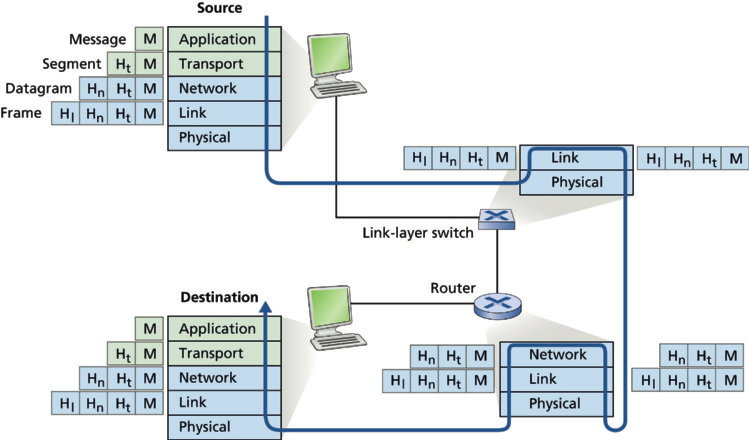

application-layer message and the transport-layer header information together constitute the transport-layer segment. The transport-layer segment thus encapsulates the application-layer message. The added information might include information allowing the receiver-side transport layer to deliver the message up to the appropriate application, and error-detection bits that allow the receiver to determine whether bits in the message have been changed in route. The transport layer then passes the segment to the network layer, which adds network-layer header information (H in Figure 1.25) such as source and n destination end system addresses, creating a network-layer datagram. The datagram is then passed to the link layer, which (of course!) will add its own link-layer header information and create a link-layer frame. Thus, we see that at each layer, a packet has two types of fields: header fields and a payload field. The payload is typically a packet from the layer above.

A useful analogy here is the sending of an interoffice memo from one corporate branch office to another via the public postal service. Suppose Alice, who is in one branch office, wants to send a memo to Bob, who is in another branch office. The memo is analogous to the application-layer message. Alice puts the memo in an interoffice envelope with Bob’s name and department written on the front of the envelope. The interoffice envelope is analogous to a transportlayer segment—it contains header information (Bob’s name and department number) and it encapsulates the application-layer message (the memo).

When the sending branch-office mailroom receives the interoffice envelope, it puts the interoffice envelope inside yet another envelope, which is suitable for sending through the public postal service. The sending mailroom also writes the postal address of the sending and receiving branch offices on the postal envelope. Here, the postal envelope is analogous to the datagram—it encapsulates the transport-layer segment (the interoffice envelope), which encapsulates the original message (the memo). The postal service delivers the postal envelope to the receiving branch-office mailroom. There, the process of de-encapsulation is begun. The mailroom extracts the interoffice memo and forwards it to Bob.

Finally, Bob opens the envelope and removes the memo.

The process of encapsulation can be more complex than that described above. For example, a large message may be divided into multiple transportlayer segments (which might themselves each be divided into multiple network-layer datagrams). At the receiving end, such a segment must then be reconstructed from its constituent datagrams.

#### 1.6 Networks Under Attack

The Internet has become mission critical for many institutions today, including large and small companies, universities, and government agencies. Many individuals also rely on the Internet for many of their professional, social, and personal activities. Billions of “things,” including wearables and home devices, are currently being connected to the Internet. But behind all this utility and excitement, there is a dark side, a side where “bad guys” attempt to wreak havoc in our daily lives by damaging our Internet-connected computers, violating our privacy, and rendering inoperable the Internet services on which we depend.

The field of network security is about how the bad guys can attack computer networks and about how we, soon-to-be experts in computer networking, can defend networks against those attacks, or better yet, design new architectures that are immune to such attacks in the first place. Given the frequency and variety of existing attacks as well as the threat of new and more destructive future attacks, network security has become a central topic in the field of computer networking. One of the features of this textbook is that it brings network security issues to the forefront.

Since we don’t yet have expertise in computer networking and Internet protocols, we’ll begin here by surveying some of today’s more prevalent security-related problems. This will whet our appetite for more substantial discussions in the upcoming chapters. So we begin here by simply asking, what can go wrong? How are computer networks vulnerable? What are some of the more prevalent types of attacks today?

The Bad Guys Can Put Malware into Your Host Via the Internet We attach devices to the Internet because we want to receive/send data from/ to the Internet. This includes all kinds of good stuff, including Instagram posts, Internet search results, streaming music, video conference calls, streaming movies, and so on. But, unfortunately, along with all that good stuff comes malicious stuff—collectively known as malware—that can also enter and infect our devices. Once malware infects our device it can do all kinds of devious things, including deleting our files and installing spyware that collects our private information, such as social security numbers, passwords, and keystrokes, and then sends this (over the Internet, of course!) back to the bad guys.

Our compromised host may also be enrolled in a network of thousands of similarly compromised devices, collectively known as a botnet, which the bad guys control and leverage for spam e-mail distribution or distributed denial-of-service attacks (soon to be discussed) against targeted hosts.

Much of the malware out there today is self-replicating: once it infects one host, from that host it seeks entry into other hosts over the Internet, and from the newly infected hosts, it seeks entry into yet more hosts. In this manner, self-replicating malware can spread exponentially fast.

The Bad Guys Can Attack Servers and Network Infrastructure Another broad class of security threats are known as denial-of-service (DoS) attacks.

As the name suggests, a DoS attack renders a network, host, or other piece of infrastructure unusable by legitimate users. Web servers, e-mail servers, DNS servers (discussed in Chapter 2), and institutional networks can all be subject to DoS attacks. Most Internet DoS attacks fall into one of three categories:

• Vulnerability attack. This involves sending a few well-crafted messages to a vulnerable application or operating system running on a targeted host.

If the right sequence of packets is sent to a vulnerable application or operating system, the service can stop or, worse, the host can crash.

• Bandwidth flooding. The attacker sends a deluge of packets to the targeted host—so many packets that the target’s access link becomes clogged, preventing legitimate packets from reaching the server.

• Connection flooding. The attacker establishes a large number of half-open or fully open TCP connections (TCP connections are discussed in Chapter 3) at the target host. The host can become so bogged down with these bogus connections that it stops accepting legitimate connections.

Let’s now explore the bandwidth-flooding attack in more detail. Recalling our delay and loss analysis discussion in Section 1.4.2, it’s evident that if the server has an access rate of R bps, then the attacker will need to send traffic at

a rate of approximately R bps to cause damage. If R is very large, a single

attack source may not be able to generate enough traffic to harm the server.

Furthermore, if all the traffic emanates from a single source, an upstream router may be able to detect the attack and block all traffic from that source before the traffic gets near the server. In a distributed DoS (DDoS) attack, illustrated in Figure 1.26, the attacker controls multiple sources and has each source blast traffic at the target. With this approach, the aggregate traffic rate across all the controlled sources needs to be approximately R to cripple the service. DDoS attacks leveraging botnets with thousands of compromised hosts are a common occurrence today. DDos attacks are much harder to detect and defend against than a DoS attack from a single host. There are roughly about 100 major DDoS attacks on Internet infrastructure every year [Sitaraman 2022].

We encourage you to consider the following question as you work your way through this book: What can computer network designers do to defend against DoS attacks? We will see that different defenses are needed for the three types of DoS attacks.

The Bad Guys Can Sniff Packets Many users today access the Internet via wireless devices, such as WiFiconnected laptops or handheld devices with cellular Internet connections

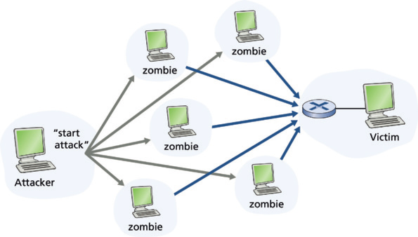

Figure 1.26 A distributed denial-of- service attack

(covered in Chapter 7). While ubiquitous Internet access is extremely convenient and enables marvelous new applications for mobile users, it also creates a major security vulnerability—by placing a passive receiver in the vicinity of the wireless transmitter, that receiver can obtain a copy of every packet that is transmitted! These packets can contain all kinds of sensitive information, including passwords, social security numbers, trade secrets, and private personal messages. A passive receiver that records a copy of every packet that flies by is called a packet sniffer.

Sniffers can be deployed in wired environments as well. In wired broadcast environments, as in many Ethernet LANs, a packet sniffer can obtain copies of broadcast packets sent over the LAN. As described in Section 1.2, cable access technologies also broadcast packets and are thus vulnerable to sniffing. Furthermore, a bad guy who gains access to an institution’s access router or access link to the Internet may be able to plant a sniffer that makes a copy of every packet going to/from the organization. Sniffed packets can then be analyzed offline for sensitive information.

Packet-sniffing software is freely available at various Web sites and as commercial products. Professors teaching a networking course have been known to assign lab exercises that involve writing a packet-sniffing and application-layer data reconstruction program. Indeed, the Wireshark [Wireshark 2025] labs associated with this text (see the introductory Wireshark lab at the end of this chapter) use exactly such a packet sniffer!

Because packet sniffers are passive—that is, they do not inject packets into the channel—they are difficult to detect. So, when we send packets into a wireless channel, we must accept the possibility that some bad guy may be recording copies of our packets. As you may have guessed, some of the best defenses against packet sniffing involve cryptography. We will examine cryptography as it applies to network security in Chapter 8.

The Bad Guys Can Masquerade as Someone You Trust It is surprisingly easy (you will have the knowledge to do so shortly as you proceed through this text!) to create a packet with an arbitrary source address, packet content, and destination address and then transmit this hand-crafted packet into the Internet, which will dutifully forward the packet to its destination. Imagine the unsuspecting receiver (say an Internet router) who receives such a packet, takes the (false) source address as being truthful, and then performs some command embedded in the packet’s contents (say modifies its forwarding table). The ability to inject packets into the Internet with a false source address is known as IP spoofing, and is but one of many ways in which one user can masquerade as another user.

To solve this problem, we will need end-point authentication, that is, a mechanism that will allow us to determine with certainty if a message originates from where we think it does. Once again, we encourage you to think about how this can be done for network applications and protocols as you progress through the chapters of this book. We will explore mechanisms for end-point authentication in Chapter 8.

In closing this section, it’s worth considering how the Internet got to be such an insecure place in the first place. The answer, in essence, is that the Internet was originally designed to be that way, based on the model of “a group of mutually trusting users attached to a transparent network” [ Blumenthal 2001]—a model in which (by definition) there is no need for security. Many aspects of the original Internet architecture deeply reflect this notion of mutual trust. For example, the ability for one user to send a packet to any other user is the default rather than a requested/granted capability, and user identity is taken at declared face value, rather than being authenticated by default.

But today’s Internet certainly does not involve “mutually trusting users.” Nonetheless, today’s users still need to communicate when they don’t necessarily trust each other, may wish to communicate anonymously, may communicate indirectly through third parties (e.g., Web caches, which we’ll study in Chapter 2, or mobility-assisting agents, which we’ll study in Chapter 7), and may distrust the hardware, software, and even the air through which they communicate. We now have many security-related challenges before us as we progress through this book: We should seek defenses against sniffing, end-point masquerading, man-in-the-middle attacks, DDoS attacks, malware, and more. We should keep in mind that communication among mutually trusted users is the exception rather than the rule. Welcome to the world of modern computer networking!

#### 1.7 History of Computer Networking and the Internet

Sections 1.1 through 1.6 presented an overview of the technology of computer networking and the Internet. You should know enough now to impress your family and friends! However, if you really want to be a big hit at the next cocktail party, you should sprinkle your discourse with tidbits about the fascinating history of the Internet [Segaller 1998].

##### 1.7.1 The Development of Packet Switching: 1961–1972

The field of computer networking and today’s Internet trace their beginnings back to the early 1960s, when the telephone network was the world’s dominant communication network. Recall from Section 1.3 that the telephone network uses circuit switching to transmit information from a sender to a receiver—an appropriate choice given that voice is transmitted at a constant rate between sender and receiver. Given the increasing importance of computers in the early 1960s and the advent of timeshared computers, it was perhaps natural to consider how to hook computers together so that they could be shared among geographically distributed users. The traffic generated by such users was likely to be bursty—intervals of activity, such as the sending of a command to a remote computer, followed by periods of inactivity while waiting for a reply or while contemplating the received response.

Three research groups around the world, each unaware of the others’ work [Leiner 1998], began inventing packet switching as an efficient and robust alternative to circuit switching. The first published work on packet-switching techniques was that of Leonard Kleinrock [Kleinrock 1961; Kleinrock 1964], then a graduate student at MIT. Using queuing theory, Kleinrock’s work elegantly demonstrated the effectiveness of the packet-switching approach for bursty traffic sources. In 1964, Paul Baran [Baran 1964] at the Rand Institute had begun investigating the use of packet switching for secure voice over military networks, and at the National Physical Laboratory in England, Donald Davies and Roger Scantlebury were also developing their ideas on packet switching.

The work at MIT, Rand, and the NPL laid the foundations for today’s Internet. But the Internet also has a long history of a let’s-build-it-and- demonstrate-it attitude that also dates back to the 1960s. J. C. R. Licklider [DEC 1990] and Lawrence Roberts, both colleagues of Kleinrock’s at MIT, went on to lead the computer science program at the Advanced Research Projects Agency (ARPA) in the United States. Roberts published an overall plan for the ARPAnet [Roberts 1967], the first packet-switched computer network and a direct ancestor of today’s public Internet. On Labor Day in 1969, the first packet switch was installed at UCLA under Kleinrock’s supervision, and three additional packet switches were installed shortly thereafter at the Stanford Research Institute (SRI), UC Santa Barbara, and the University of Utah (Figure 1.27).

The fledgling precursor to the Internet was four nodes large by the end of 1969.

Kleinrock recalls the very first use of the network to perform a remote login from UCLA to SRI, crashing the system [Kleinrock 2004].

By 1972, ARPAnet had grown to approximately 15 nodes and was given its first public demonstration by Robert Kahn. The first host-to-host protocol between ARPAnet end systems, known as the network-control protocol (NCP), Mark J. Terrill/AP Photo

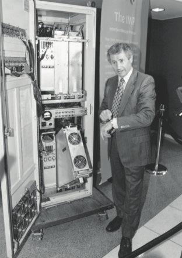

Figure 1.27 An early packet switch

was completed [RFC 001]. With an end-to-end protocol available, applications could now be written. Ray Tomlinson wrote the first e-mail program in 1972.

##### 1.7.2 Proprietary Networks and Internetworking: 1972–1980

The initial ARPAnet was a single, closed network. In order to communicate with an ARPAnet host, one had to be actually attached to another ARPAnet IMP. In the early to mid-1970s, additional stand-alone packet-switching networks besides ARPAnet came into being: ALOHANet, a microwave network linking universities on the Hawaiian islands [Abramson 1970], as well as DARPA’s packet-satellite [RFC 829] and packet-radio networks [Kahn 1978];

Telenet, a BBN commercial packet-switching network based on ARPAnet technology; Cyclades, a French packet-switching network pioneered by Louis Pouzin [Think 2012]; Time-sharing networks such as Tymnet and the GE Information Services network, among others, in the late 1960s and early 1970s [Schwartz 1977]; IBM’s SNA (1969–1974), which paralleled the ARPAnet work [Schwartz 1977].

The number of networks was growing. With perfect hindsight we can see that the time was ripe for developing an encompassing architecture for connecting networks together. Pioneering work on interconnecting networks (under the sponsorship of the Defense Advanced Research Projects Agency (DARPA)), in essence creating a network of networks, was done by Vinton Cerf and Robert Kahn [Cerf 1974]; the term internetting was coined to describe this work.

These architectural principles were embodied in TCP. The early versions of TCP, however, were quite different from today’s TCP. The early versions of TCP combined a reliable in-sequence delivery of data via end-system retransmission (still part of today’s TCP) with forwarding functions (which today are performed by IP). Early experimentation with TCP, combined with the recognition of the importance of an unreliable, non-flow-controlled, end-to-end transport service for applications such as packetized voice, led to the separation of IP out of TCP and the development of the UDP protocol. The three key Internet protocols that we see today—TCP, UDP, and IP—were conceptually in place by the end of the 1970s.

In addition to the DARPA Internet-related research, many other important networking activities were underway. In Hawaii, Norman Abramson was developing ALOHAnet, a packet-based radio network that allowed multiple remote sites on the Hawaiian Islands to communicate with each other. The ALOHA protocol [Abramson 1970] was the first multiple-access protocol, allowing geographically distributed users to share a single broadcast communication medium (a radio frequency). Metcalfe and Boggs built on Abramson’s multiple-access protocol work when they developed the Ethernet protocol [Metcalfe 1976] for wire-based shared broadcast networks. Interestingly, Metcalfe and Boggs’ Ethernet protocol was motivated by the need to connect multiple PCs, printers, and shared disks [Perkins 1994]. Twenty-five years ago, well before the PC revolution and the explosion of networks, Metcalfe and Boggs were laying the foundation for today’s PC LANs.

##### 1.7.3 A Proliferation of Networks: 1980–1990

By the end of the 1970s, approximately two hundred hosts were connected to the ARPAnet. By the end of the 1980s the number of hosts connected to the public Internet, a confederation of networks looking much like today’s Internet, would reach a hundred thousand. The 1980s would be a time of tremendous growth.

Much of that growth resulted from several distinct efforts to create computer networks linking universities together.BITNET provided e-mail and file transfers among several universities in the Northeast.CSNET (computer science network) was formed to link university researchers who did not have access to ARPAnet.

In 1986, NSFNET was created to provide access to NSFsponsored supercomputing centers. Starting with an initial backbone speed of 56 kbps, NSFNET’s backbone would be running at 1.5 Mbps by the end of the decade and would serve as a primary backbone linking regional networks.

In the ARPAnet community, many of the final pieces of today’s Internet architecture were falling into place. January 1, 1983 saw the official deployment of TCP/IP as the new standard host protocol for ARPAnet (replacing the NCP protocol).The transition [RFC 801] from NCP to TCP/IP was a flag day event—all hosts were required to transfer over to TCP/IP as of that day.

In the late 1980s, important extensions were made to TCP to implement host-based congestion control [Jacobson 1988]. The DNS, used to map between a humanreadable Internet name (for example, gaia.cs.umass.edu) and its 32-bit IP address, was also developed [RFC 1034].

Paralleling this development of the ARPAnet (which was for the most part a US effort), in the early 1980s the French launched the Minitel project, an ambitious plan to bring data networking into everyone’s home. Sponsored by the French government, the Minitel system consisted of a public packetswitched network (based on the X. 25 protocol suite), Minitel servers, and inexpensive terminals with built-in low-speed modems. The Minitel became a huge success in 1984 when the French government gave away a free Minitel terminal to each French household that wanted one. Minitel sites included free sites—such as a telephone directory site—as well as private sites, which collected a usage-based fee from each user. At its peak in the mid 1990s, it offered more than 20,000 services, ranging from home banking to specialized research databases. The Minitel was in a large proportion of French homes 10 years before most Americans had ever heard of the Internet.

##### 1.7.4 The Internet Explosion: The 1990s

The 1990s were ushered in with a number of events that symbolized the continued evolution and the soon-to-arrive commercialization of the Internet.

ARPAnet, the progenitor of the Internet, ceased to exist. In 1991, NSFNET lifted its restrictions on the use of NSFNET for commercial purposes. NSFNET itself would be decommissioned in 1995, with Internet backbone traffic being carried by commercial Internet Service Providers.

The main event of the 1990s was to be the emergence of the World Wide Web application, which brought the Internet into the homes and businesses of millions of people worldwide. The Web served as a platform for enabling and deploying hundreds of new applications that we take for granted today, including search (e.g., Google and Bing) Internet commerce (e.g., Amazon and eBay) and social networks (e.g., Facebook).

The Web was invented at CERN by Tim Berners-Lee between 1989 and 1991 [Berners-Lee 1989], based on ideas originating in earlier work on hypertext from the 1940s by Vannevar Bush [Bush 1945] and since the 1960s by Ted Nelson [Xanadu 2012]. Berners-Lee and his associates developed initial versions of HTML, HTTP, a Web server, and a browser—the four key components of the Web. Around the end of 1993 there were about two hundred Web servers in operation, this collection of servers being just a harbinger of what was about to come. At about this time several researchers were developing Web browsers with GUI interfaces, including Marc Andreessen, who along with Jim Clark, formed Mosaic Communications, which later became Netscape Communications Corporation [Cusumano 1998; Quittner 1998]. By 1995, university students were using Netscape browsers to surf the Web on a daily basis. At about this time companies—big and small—began to operate Web servers and transact commerce over the Web. In 1996, Microsoft started to make browsers, which started the browser war between Netscape and Microsoft, which Microsoft won a few years later [Cusumano 1998].

The second half of the 1990s was a period of tremendous growth and innovation for the Internet, with major corporations and thousands of startups creating Internet products and services. By the end of the millennium the Internet was supporting hundreds of popular applications, including four killer applications:

• E-mail, including attachments and Web-accessible e-mail

• The Web, including Web browsing and Internet commerce

• Instant messaging, with contact lists

• Peer-to-peer file sharing of MP3s, pioneered by Napster Interestingly, the first two killer applications came from the research community, whereas the last two were created by a few young entrepreneurs.

The period from 1995 to 2001 was a roller-coaster ride for the Internet in the financial markets. Before they were even profitable, hundreds of Internet startups made initial public offerings and started to be traded in a stock market. Many companies were valued in the billions of dollars without having any significant revenue streams. The Internet stocks collapsed in 2000–2001, and many startups shut down. Nevertheless, a number of companies emerged as big winners in the Internet space, including Microsoft, Cisco, Yahoo, eBay, Google, and Amazon.

##### 1.7.5 The New Millennium

In the first three decades of the 21st century, perhaps no other technology has transformed society more than the Internet along with Internet-connected smartphones. And innovation in computer networking continues. Advances are being made on all fronts, including deployments of faster routers and higher transmission speeds in both access networks and in network backbones. But the following developments merit special attention:

• Since the beginning of the millennium, we have been seeing aggressive deployment of broadband Internet access to homes—not only cable modems and DSL but also fiber to the home, 5G fixed wireless, and LEO satellites as discussed in Section 1.2. This high-speed Internet access has enabled a wealth of video applications, including the distribution of usergenerated video (for example, YouTube and TikTok), on-demand streaming of high-definition movies and television shows (e.g., Netflix), and multiperson video conference (e.g., Zoom, Facetime, and Google Hangouts).

• The increasing ubiquity of high-speed wireless Internet access is not only making it possible to remain constantly connected while on the move, but also enabling new location-specific applications including navigation and mapping (e.g., Google Maps and Waze), ride-sharing services (e.g., Uber and Didi), food delivery services, local business search, and dating services (e.g., Tinder).The number of wireless devices connecting to the Internet surpassed the number of wired devices in 2011.

This high-speed wireless access set the stage for the rapid emergence of hand-held computers (iPhones, Androids, iPads, and so on), which enjoy constant and untethered access to the Internet.

• Online social networks—such as Facebook, Instagram, Twitter, TikTok and WeChat (hugely popular in China)—have created massive people networks on top of the Internet. Many of these social networks are extensively used for messaging as well as photo and video sharing. Many Internet users today “live” primarily within one or more social networks. Through their APIs, the online social networks create platforms for new networked applications, including mobile payments and distributed games.

• As discussed in Section 1.3.3, online service providers, such as Google and Microsoft, have deployed their own extensive private networks, which not only connect together their globally distributed data centers, but are used to bypass the Internet as much as possible by peering directly with lower-tier ISPs. As a result, Google provides search results and e-mail access almost instantaneously, as if their data centers were running within one’s own computer.

• Many Internet commerce companies are now running their applications in the “cloud”—such as in Amazon’s EC2, in Microsoft’s Azure, or in the Alibaba Cloud. Many companies and universities have also migrated their Internet applications (e.g., e-mail and Web hosting) to the cloud. Cloud companies not only provide applications scalable computing and storage environments, but also provide the applications implicit access to their high-performance private networks.

#### 1.8 Summary

In this chapter, we’ve covered a tremendous amount of material! We’ve looked at the various pieces of hardware and software that make up the Internet in particular and computer networks in general. We started at the edge of the network, looking at end systems and applications, and at the transport service provided to the applications running on the end systems. We also looked at the link-layer technologies and physical media typically found in the access network. We then dove deeper inside the network, into the network core, identifying packet switching and circuit switching as the two basic approaches for transporting data through a telecommunication network, and we examined the strengths and weaknesses of each approach. We also examined the structure of the global Internet, learning that the Internet is a network of networks.

We saw that the Internet’s hierarchical structure, consisting of higher- and lower-tier ISPs, has allowed it to scale to include thousands of networks.

In the second part of this introductory chapter, we examined several topics central to the field of computer networking. We first examined the causes of delay, throughput and packet loss in a packet-switched network. We developed simple quantitative models for transmission, propagation, and queuing delays as well as for throughput; we’ll make extensive use of these delay models in the homework problems throughout this book. Next we examined protocol layering and service models, key architectural principles in networking that we will also refer back to throughout this book. We also surveyed some of the more prevalent security attacks in the Internet day. We finished our introduction to networking with a brief history of computer networking.

The first chapter in itself constitutes a mini-course in computer networking.

So, we have indeed covered a tremendous amount of ground in this first chapter! If you’re a bit overwhelmed, don’t worry. In the following chapters, we’ll revisit all of these ideas, covering them in much more detail (that’s a promise, not a threat!). At this point, we hope you leave this chapter with a stilldeveloping intuition for the pieces that make up a network, a still-developing command of the vocabulary of networking (don’t be shy about referring back to this chapter), and an ever-growing desire to learn more about networking.

That’s the task ahead of us for the rest of this book.

Road-Mapping This Book Before starting any trip, you should always glance at a road map in order to become familiar with the major roads and junctures that lie ahead. For the trip we are about to embark on, the ultimate destination is a deep understanding of the how, what, and why of computer networks. Our road map is the sequence of chapters of this book:

1.  Computer Networks and the Internet

2.  Application Layer

3.  Transport Layer

4.  Network Layer: Data Plane

5.  Network Layer: Control Plane

6.  The Link Layer and LANs

7.  Wireless and Mobile Networks

8.  Security in Computer Networks Chapters 2 through 6 are the five core chapters of this book. You should notice that these chapters are organized around the top four layers of the five-layer Internet protocol. Further note that our journey will begin at the top of the Internet protocol stack, namely, the application layer, and will work its way downward. The rationale behind this top-down journey is that once we understand the applications, we can understand the network services needed to support these applications. We can then, in turn, examine the various ways in which such services might be implemented by a network architecture. Covering applications early thus provides motivation for the remainder of the text.

The second half of the book—Chapters 7 and 8—zooms in on two enormously important (and somewhat independent) topics in modern computer networking. In Chapter 7, we examine wireless and mobile networks, including wireless LANs (including WiFi and Bluetooth), Cellular networks (including 4G and 5G), and mobility. Chapter 8, which addresses security in computer networks, first looks at the underpinnings of encryption and network security, and then we examine how the basic theory is being applied in a broad range of Internet contexts.

Homework Problems and Questions Chapter 1 Review Questions R9.  HFC, DSL, FTTH, FWI, and LEO satellite are all used for residential access. For each of Section 1.1 these access technologies, provide a range of transmission rates and comment on whether R1.  What is the difference between a host and an

the transmission rate is shared or dedicated. end system? List several different types of end systems. Is a Web server an end system? R10.  Describe the most popular wireless Internet access technologies today. Compare and con- R2.  The word protocol is often used to describe

trast them. diplomatic relations. How does ChatGPT describe diplomatic protocol? Section 1.3 R3.  Why are standards important for protocols?

R11.  Suppose there is exactly one packet switch

Section 1.2 between a sending host and a receiving host.

The transmission rates between the sending R4.  List four access technologies. Classify each host and the switch and between the switch one as home access, enterprise access, or and the receiving host are R and R , respecwide-area wireless access. 1 2 tively. Assuming that the switch uses store- R5.  Is HFC transmission rate dedicated or shared and-forward packet switching, what is the among users? Are collisions possible in a total end-to-end delay to send a packet of downstream HFC channel? Why or why not? length L? (Ignore queuing, propagation delay, R6.  List the available residential access technoloand processing delay.)

gies in your city. For each type of access, pro- R12.  What advantage does a circuit-switched netvide the advertised downstream rate, upstream work have over a packet-switched network? rate, and monthly price. What advantages does TDM have over FDM

R7.  What is the transmission rate of Ethernet in a circuit-switched network?

LANs? R13.  Suppose users share a 2 Mbps link. Also sup-

R8.  What are some of the physical media that pose each user transmits continuously at 1 Mbps

Ethernet can run over? when transmitting, but each user transmits only this delay depend on packet length? Does this 20 percent of the time. (See the discussion of sta-

delay depend on transmission rate? tistical multiplexing in Section 1.3.)

R19.  Suppose Host A wants to send a large file to a.  When circuit switching is used, how many

Host B. The path from Host A to Host B has three users can be supported?

= = links, of rates R 500 kbps , R 2 Mbps , b.  For the remainder of this problem, suppose 1 2 = and R 1 Mbps . packet switching is used. Why will there be 3 a.  Assuming no other traffic in the network, essentially no queuing delay before the link

what is the throughput for the file transfer? if two or fewer users transmit at the same time? Why will there be a queuing delay if b.  Suppose the file is 4 million bytes. Dividing

three users transmit at the same time? the file size by the throughput, roughly how long will it take to transfer the file to Host B? c.  Find the probability that a given user is transmitting. c.  Repeat (a) and (b), but now with R reduced

to 100 kbps. d.  Suppose now there are three users. Find the probability that at any given time, all three R20.  Suppose end system A wants to send a large file

users are transmitting simultaneously. Find to end system B. At a very high level, describe

the fraction of time during which the queue how end system A creates packets from the file.

grows. When one of these packets arrives to a router, what information in the packet does the router R14.  Why will two ISPs at the same level of the

use to determine the link onto which the packet hierarchy often peer with each other? How

is forwarded? Why is packet switching in the does an IXP earn money?

Internet analogous to driving from one city to R15.  Some content providers have created their another and asking directions along the way? own networks. Describe Google’s network.

R21.  Visit the Queuing and Loss interactive anima- What motivates content providers to create

tion at the companion Web site. What is the these networks?

maximum emission rate and the minimum Section 1.4 transmission rate? With those rates, what is the traffic intensity? Run the interactive animation R16.  Consider sending a packet from a source host with these rates and determine how long it to a destination host over a fixed route. List takes for packet loss to occur. Then repeat the the delay components in the end-to-end delay. experiment a second time and determine again Which of these delays are constant and which how long it takes for packet loss to occur. Are are variable? the values different? Why or why not? R17.  Visit the Transmission Versus Propagation Delay interactive animation at the companion Section 1.5

Web site. Among the rates, propagation delay, R22.  List five tasks that a layer can perform. Is it and packet sizes available, find a combination possible that one (or more) of these tasks for which the sender finishes transmitting could be performed by two (or more) layers? before the first bit of the packet reaches the R23.  What are the five layers in the Internet protoreceiver. Find another combination for which col stack? What are the principal responsibilithe first bit of the packet reaches the receiver ties of each of these layers? before the sender finishes transmitting.

R24.  What is an application-layer message? A R18.  How long does it take a packet of length transport-layer segment? A network-layer 1,000 bytes to propagate over a link of distance datagram? A link-layer frame? 2,500 km, propagation speed 2.5 10 m s , i 8

and transmission rate 2 Mbps? More generally, R25.  Which layers in the Internet protocol stack

how long does it take a packet of length L to does a router process? Which layers does a

propagate over a link of distance d, propagalink-layer switch process? Which layers does

tion speed s, and transmission rate R bps? Does a host process?

Section 1.6 Trudy positions herself in the network so that she can capture all the packets sent by Alice R26.  What is self-replicating malware? and send whatever she wants to Bob; she can R27.  Describe how a botnet can be created and how also capture all the packets sent by Bob and it can be used for a DDoS attack. send whatever she wants to Alice. List some

R28.  Suppose Alice and Bob are sending packets to of the malicious things Trudy can do from this

each other over a computer network. Suppose position.

Problems P1. Design and describe an application-level protocol to be used between an automatic teller machine and a bank’s centralized computer. Your protocol should allow a user’s card and password to be verified, the account balance (which is maintained at the centralized computer) to be queried, and an account withdrawal to be made (that is, money disbursed to the user).

Your protocol entities should be able to handle the all-too-common case in which there is not enough money in the account to cover the withdrawal.

Specify your protocol by listing the messages exchanged and the action taken by the automatic teller machine or the bank’s centralized computer on transmission and receipt of messages. Sketch the operation of your protocol for the case of a simple withdrawal with no errors, using a diagram similar to that in Figure 1.2. Explicitly state the assumptions made by your protocol about the underlying end-to-end transport service.

P2. Equation 1.1 gives a formula for the end-to-end delay of sending one packet of length L over N  links of transmission rate R. Generalize this formula for sending P such packets back-to-back over the N links.

P3. Consider an application that transmits data at a steady rate (for example, the sender generates an N-bit unit of data every k milliseconds, where k is small and fixed). Also, when such an application starts, it will continue running for a relatively long period of time. Answer the following questions, briefly justifying your answer:

a.  Would a packet-switched network or a circuit-switched network be more appropriate for this application? Why?

b.  Suppose that a packet-switched network is used and the only traffic in this network comes from such applications as described above.

Furthermore, assume that the sum of the application data rates is less than the capacities of each and every link. Is some form of congestion control needed? Why?

P4. Consider the circuit-switched network in Figure 1.13. Recall that there are four circuits on each link. Label the four switches A, B, C, and D, going in the clockwise direction.

a.  What is the maximum number of simultaneous connections that can be in progress at any one time in this network?

b.  Suppose that all connections are between switches A and C. What is the maximum number of simultaneous connections that can be in progress?

c.  Suppose we want to make four connections between switches A and C, and another four connections between switches B and D. Can we route these calls through the four links to accommodate all eight connections?

P5. Review the car-caravan analogy in Section 1.4. Assume a propagation speed of 100 km hour.

a.  Suppose the caravan travels 175 km, beginning in front of one tollbooth, passing through a second tollbooth, and finishing just after a third tollbooth. What is the end-to-end delay?

b.  Repeat (a), now assuming that there are eight cars in the caravan instead of ten.

P6. This elementary problem begins to explore propagation delay and transmission delay, two central concepts in data networking. Consider two hosts, A and B, connected by a single link of rate R bps. Suppose that the

two hosts are separated by m meters, and suppose the propagation speed

along the link is s meters sec. Host A is to send a packet of size L bits to

Host B.

a.  Express the propagation delay, d , in terms of m and s. prop b.  Determine the transmission time of the packet, d , in terms of L trans and R.

c.  Ignoring processing and queuing delays, obtain an expression for the end-to-end delay.

d.  Suppose Host A begins to transmit the packet at time t = 0 . At time

t = d , where is the last bit of the packet? trans e.  Suppose d = is greater than d . At time t d , where is the first prop trans trans bit of the packet?

f.  Suppose d is less than d . At time t = d , where is the first bit prop trans trans of the packet?

g.  Suppose s = 2.5 × 10^8, L = 1500 bytes, and R = 10 Mbps. Find the

distance m so that d equals d . prop trans P7. In this problem, we consider sending real-time voice from Host A to Host B over a packet-switched network (VoIP). Host A converts analog voice to a digital 64 kbps bit stream on the fly. Host A then groups the bits into 56-byte packets. There is one link between Hosts A and B; its transmission rate is 10 Mbps and its propagation delay is 10 msec. As soon as Host A gathers a packet, it sends it to Host B. As soon as Host B receives an entire packet, it converts the packet’s bits to an analog signal. How much time elapses from the time a bit is created (from the original analog signal at Host A) until the bit is decoded (as part of the analog signal at Host B)?

P8.Suppose users share a 10 Mbps link. Also suppose each user requires 200 kbps when transmitting, but each user transmits only 10 percent of the time. (See the discussion of packet switching versus circuit switching in Section 1.3.) a.

When circuit switching is used, how many users can be supported?

b.  For the remainder of this problem, suppose packet switching is used.

Find the probability that a given user is transmitting.

c.  Suppose there are 120 users. Find the probability that at any given time, exactly n users are transmitting simultaneously. (Hint: Use the binomial distribution.) d.  Find the probability that there are 51 or more users transmitting simultaneously.

P9. Consider the discussion in Section 1.3 of packet switching versus circuit switching in which an example is provided with a 1 Mbps link. Users are generating data at a rate of 100 kbps when busy, but are busy generating

= data only with probability p 0.1 . Suppose that the 1 Mbps link is

replaced by a 1 Gbps link.

a.  What is N, the maximum number of users that can be supported simultaneously under circuit switching?

b.  Now consider packet switching and a user population of M users.

Give a formula (in terms of p M N ,  ,  ) for the probability that more than

N users are sending data.

P10.  Consider a packet of length L that begins at end system A and travels over three links to a destination end system. These three links are connected by two packet switches. Let d , s , and R denote the length, propi i i agation speed, and the transmission rate of link i, for i = 1, 2, 3 . The

packet switch delays each packet by d . Assuming no queuing delays, proc in terms of d , s , R ,  i = 1, 2, 3 , and L, what is the total end-to-end  i i i delay for the packet? Suppose now the packet is 1,500 bytes, the propagation speed on all three links is 2.5 10 m s i , the transmission rates of 8

all three links are 2.5 Mbps, the packet switch processing delay is 3 msec, the length of the first link is 5,000 km, the length of the second link is 4,000 km, and the length of the last link is 1,000 km. For these values, what is the end-to-end delay?

P11.  In the above problem, suppose R = = = = R R R and d 0 . Fur- 1 2 3 proc ther suppose that the packet switch does not store-and-forward packets but instead immediately transmits each bit it receives before waiting for the entire packet to arrive. What is the end-to-end delay?

P12.  A packet switch receives a packet and determines the outbound link to which the packet should be forwarded. When the packet arrives, one other packet is halfway done being transmitted on this outbound link and four other packets are waiting to be transmitted. Packets are transmitted in order of arrival. Suppose all packets are 1,500 bytes and the link rate is 2.5 Mbps. What is the queuing delay for the packet? More generally, what is the queuing delay when all packets have length L, the

transmission rate is R, x bits of the currently-being-transmitted packet

have been transmitted, and n packets are already in the queue?

P13.  a.  Suppose N packets arrive simultaneously to a link at which no packets are currently being transmitted or queued. Each packet is of length and the link has transmission rate R. What is the average queuing

delay for the N packets?

b.  Now suppose that N such packets arrive to the link every LN R seconds. What is the average queuing delay of a packet?

P14.  Consider the queuing delay in a router buffer. Let I denote traffic inten-

= sity; that is, La R . Suppose that the queuing delay takes the form

− < IL R for I .  a.  Provide a formula for the total delay, that is, the queuing delay plus the transmission delay.

b.  Plot the total delay as a function of L R.

P15.  Let a denote the rate of packets arriving at a link in packets/sec, and let µ

denote the link’s transmission rate in packets/sec. Based on the formula for the total delay (i.e., the queuing delay plus the transmission delay) derived in the previous problem, derive a formula for the total delay in terms of a and µ .

P16.  Consider a router buffer preceding an outbound link. In this problem, you will use Little’s formula, a famous formula from queuing theory. Let N  denote the average number of packets in the buffer plus the packet being transmitted. Let a denote the rate of packets arriving at the link.

Let d denote the average total delay (i.e., the queuing delay plus the transmission delay) experienced by a packet. Little’s formula is = N a d i . Suppose that on average, the buffer contains 100 packets, and the average packet queuing delay is 20 msec. The link’s transmission rate is 100 packets sec. Using Little’s formula, what is the average packet arrival rate, assuming there is no packet loss?

P17.  a.  Generalize Equation 1.2 in Section 1.4.3 for heterogeneous processing rates, transmission rates, and propagation delays.

b.  Repeat (a), but now also suppose that there is an average queuing delay of d at each node. queue P18.  Perform a Traceroute between source and destination on the same continent at three different hours of the day.

a.  Find the average and standard deviation of the round-trip delays at each of the three hours.

b.  Find the number of routers in the path at each of the three hours. Did the paths change during any of the hours?

c.  Try to identify the number of ISP networks that the Traceroute packets pass through from source to destination. Routers with similar names and/or similar IP addresses should be considered as part of the same ISP. In your experiments, do the largest delays occur at the peering interfaces between adjacent ISPs?

d.  Repeat the above for a source and destination on different continents.

Compare the intra-continent and inter-continent results.

P19.  Metcalfe’s law states the value of a computer network is proportional to the square of the number of connected users of the system. Let n denote

the number of users in a computer network. Assuming each user sends one message to each of the other users, how many messages will be sent?

Does your answer support Metcalfe’s law?

P20.  Consider the throughput example corresponding to Figure 1.21(b). Now suppose that there are M client-server pairs rather than 10. Denote R , R , s c and R for the rates of the server links, client links, and network link. Assume all other links have abundant capacity and that there is no other traffic in the network besides the traffic generated by the M client-server pairs. Derive a

general expression for throughput in terms of R , R , R, and M. s P21.  Consider Figure 1.20(b). Now suppose that there are M paths between the server and the client. No two paths share any link. Path k k = 1, . . . , M consists of N links with transmission rates R , R , . . . ,  k k 1 2 R . If the server can only use one path to send data to the client, what is k N the maximum throughput that the server can achieve? If the server can use all M paths to send data, what is the maximum throughput that the server can achieve?

P22.  Consider Figure 1.20(b). Suppose that each link between the server and the client has a packet loss probability p, and the packet loss probabilities

for these links are independent. What is the probability that a packet (sent by the server) is successfully received by the receiver? If a packet is lost in the path from the server to the client, then the server will re-transmit the packet. On average, how many times will the server re-transmit the packet in order for the client to successfully receive the packet?

P23.  Consider Figure 1.20(a). Assume that we know the bottleneck link along the path from the server to the client is the first link with rate R  bits sec . s Suppose we send a pair of packets back to back from the server to the client, and there is no other traffic on this path. Assume each packet of size L bits, and both links have the same propagation delay d . prop a.  What is the packet inter-arrival time at the destination? That is, how much time elapses from when the last bit of the first packet arrives until the last bit of the second packet arrives?

b.  Now assume that the second link is the bottleneck link (i.e., R < R ). c s Is it possible that the second packet queues at the input queue of the second link? Explain. Now suppose that the server sends the second packet T seconds after sending the first packet. How large must T be to ensure no queuing before the second link? Explain.

P24.  Suppose you would like to urgently deliver 50 terabytes data from Boston to Los Angeles. You have available a 100 Mbps dedicated link for data transfer. Would you prefer to transmit the data via this link or instead use FedEx over-night delivery? Explain.

P25.  Suppose two hosts, A and B, are separated by 20,000 kilometers and are connected by a direct link of R = 5 Mbps . Suppose the propagation

speed over the link is 2.5 10  meters sec . i 8

a.  Calculate the bandwidth-delay product, R d i . prop b.  Consider sending a file of 800,000 bits from Host A to Host B. Suppose the file is sent continuously as one large message. What is the maximum number of bits that will be in the link at any given time?

c.  Provide an interpretation of the bandwidth-delay product.

d.  What is the width (in meters) of a bit in the link? Is it longer than a football field?

e.  Derive a general expression for the width of a bit in terms of the propagation speed s, the transmission rate R, and the length of the link m.

P26.  Referring to problem P25, suppose we can modify R. For what value of R is the width of a bit as long as the length of the link?

P27.  Consider problem P25 but now with a link of R = 500 Mbps .

a.  Calculate the bandwidth-delay product, R d i . prop b.  Consider sending a file of 800,000 bits from Host A to Host B. Suppose the file is sent continuously as one big message. What is the maximum number of bits that will be in the link at any given time?

c.  What is the width (in meters) of a bit in the link?

P28.  Refer again to problem P25.

a.  How long does it take to send the file, assuming it is sent continuously?

b.  Suppose now the file is broken up into 20 packets with each packet containing 40,000 bits. Suppose that each packet is acknowledged by the receiver and the transmission time of an acknowledgment packet is negligible. Finally, assume that the sender cannot send a packet until the preceding one is acknowledged. How long does it take to send the file?

c.  Compare the results from (a) and (b).

P29.  Suppose there is a 10 Mbps microwave link between a geostationary satellite and its base station on Earth. Every minute the satellite takes a digital photo and sends it to the base station. Assume a propagation speed of 2.4 × 10^8 meters/sec.

a.  What is the propagation delay of the link?

b.  What is the bandwidth-delay product, R d ? i prop c.  Let x denote the size of the photo. What is the minimum value of x for the microwave link to be continuously transmitting?

P30.  Consider the airline travel analogy in our discussion of layering in Section 1.5, and the addition of headers to protocol data units as they flow down the protocol stack. Is there an equivalent notion of header information that is added to passengers and baggage as they move down the airline protocol stack?

P31.  In modern packet-switched networks, including the Internet, the source host segments long, application-layer messages (for example, an image or a music file) into smaller packets and sends the packets into the network. The receiver then reassembles the packets back into the original message. We refer to this process as message segmentation.  Figure 1.28 illustrates the end-to-end transport of a message with and without message segmentation. Consider a message that is 10  bits 6 long that is to be

sent from source to destination in Figure 1.28. Suppose each link in the figure is 5 Mbps. Ignore propagation, queuing, and processing delays.

a.  Consider sending the message from source to destination without message segmentation. How long does it take to move the message from the source host to the first packet switch? Keeping in mind that each switch uses store-and-forward packet switching, what is the total time to move the message from source host to destination host?

b.  Now suppose that the message is segmented into 100 packets, with each packet being 10,000 bits long. How long does it take to move the first packet from source host to the first switch? When the first packet is being sent from the first switch to the second switch, the second packet is being sent from the source host to the first switch. At what time will the second packet be fully received at the first switch?

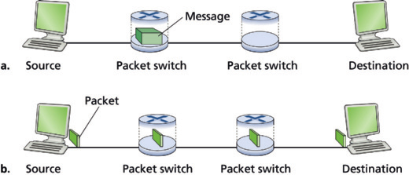

Figure 1.28 End-to- end message transport: (a) without message segmentation; (b) with message segmentation

c.  How long does it take to move the file from source host to destination host when message segmentation is used? Compare this result with your answer in part (a) and comment.

d.  In addition to reducing delay, what are reasons to use message segmentation?

e.  Discuss the drawbacks of message segmentation.

P32.  Experiment with the Message Segmentation interactive animation at the book’s Web site. Do the delays in the interactive animation correspond to the delays in the previous problem? How do link propagation delays affect the overall end-to-end delay for packet switching (with message segmentation) and for message switching?

P33.  Consider sending a large file of F bits from Host A to Host B. There are three links (and two switches) between A and B, and the links are uncongested (that is, no queuing delays). Host A segments the file into segments of S bits each and adds 80 bits of header to each segment, forming packets of L = 80 + S bits. Each link has a transmission rate of R bps.

Find the value of S that minimizes the delay of moving the file from Host

A to Host B. Disregard propagation delay.

P34.  There are applications that allows you to make a phone call from a PC to an ordinary phone. This means that the voice call must pass through both the Internet and through a telephone network. Discuss how this might be done.

Wireshark Lab

One’s understanding of network protocols can often “Tell me and I forget. Show me and I remembe greatly deepened by seeing them in action and

ber. Involve me and I understand.” by playing around with them—observing the sequence of messages exchanged between two protocol entities, delving into the details of protocol Chinese proverb operation, causing protocols to perform certain actions, and observing these actions and their consealso displays the contents of the various protocol

quences. This can be done in simulated scenarios or fields of these captured messages. A screenshot of

in a real network environment such as the Internet. the Wireshark packet sniffer is shown in Figure 1.29.

The interactive animations at the textbook Web site Wireshark is a free packet sniffer that runs on Win-

take the first approach. In the Wireshark labs, we’ll dows, Linux/Unix, and Mac computers. Through-

take the latter approach. You’ll run network applicaout the textbook, you will find Wireshark labs that

tions in various scenarios using a computer on your allow you to explore a number of the protocols

desk, at home, or in a lab. You’ll observe the netstudied in the chapter. In this first Wireshark lab,

work protocols in your computer, interacting and you’ll obtain and install a copy of Wireshark, access

exchanging messages with protocol entities executa Web site, and capture and examine the protocol

ing elsewhere in the Internet. Thus, you and your messages being exchanged between your Web

computer will be an integral part of these live labs. browser and the Web server.

You’ll observe—and you’ll learn—by doing. You can find full details about this first Wire-

The basic tool for observing the messages shark lab (including instructions about how to

exchanged between executing protocol entities is obtain and install Wireshark) at the Web site www.

called a packet sniffer. As the name suggests, a pearson.com/cs-resources and on the authors’ Web

packet sniffer passively copies (sniffs) messages site http://gaia.cs.umass.edu/kurose_ross.

being sent from and received by your computer; it

Figure 1.29 A Wireshark screenshot (Wireshark screenshot reprinted by permission of the Wireshark

Foundation.)

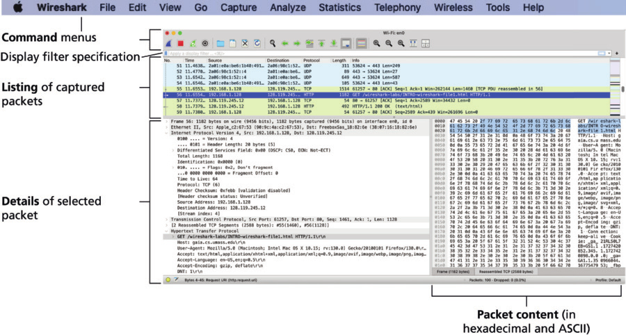

AN INTERVIEW WITH...


Leonard Kleinrock

Leonard Kleinrock is distinguished professor of computer science at the University of California, Los Angeles. His creation of the mathematical theory of packet-switching principles in 1961 launched the technology behind the Internet. In 1969, his computer at UCLA became the first node of the Internet and from there his team transmitted the first message of the Internet. He received his B.E.E. from the City College of New York (CCNY) and his masters and PhD in electrical engineering from MIT.

What made you decide to specialize in networking/Internet technology? Courtesy of Leonard Kleinrock

As a PhD student at MIT in 1959, I looked around and found that most of my classmates were doing research in information theory and coding theory, an area that had been created by the great researcher, Claude Shannon. I judged that he had solved most of the important problems already. The research problems that were left were hard and seemed to me to be of lesser consequence. So I decided to launch out in a new area that no one else had yet conceived of. At MIT I was surrounded by many computers, and it was clear to me that, sooner or later, these machines would need to communicate with each other. At the time, there was no effective way for them to do so and I recognized the solution to this important problem would have impact. I had an approach to this problem and so, for my PhD research, I decided to create a mathematical theory to model, evaluate, design and optimize efficient and reliable data networks.

What was your first job in the computer industry? What did it entail?

Throughout my high school years, it was necessary for me to earn an income to help support the family. When it came time to enter college, in order for me to earn a fulltime salary during the day, I went to the Evening Session at CCNY from 1951 to 1957 for my bachelor's degree in electrical engineering. During the day, I worked first as a technician and then as an assistant electrical engineer at a small, industrial electronics firm called Photobell. While there, I introduced digital technology to their product line. Essentially, we were using photoelectric devices to detect the presence of certain items (boxes, people, etc.) and I recognized that the use of a circuit known then as a bistable multivibrator was just what we needed to bring digital processing into this field of detection. These circuits happen to be the building blocks for computers, and have come to be known as flip-flops or switches in today's vernacular.

What was going through your mind when you sent the first host-to-host message (from UCLA to the Stanford Research Institute)?

Frankly, we had no idea of the importance of that event. We had not prepared a special message of historic significance, as did so many inventors of the past (Samuel

Morse with “What hath God wrought.” or Alexander Graham Bell with “Watson, come here! I want you.” or Neal Armstrong with “That's one small step for a man, one giant leap for mankind.”) Those guys were smart! They understood media and public relations. We were simply nerds and all we wanted to do was to demonstrate our ability to remotely login to the SRI computer. So we typed the “L”, which was correctly received, we typed the “o” which was correctly received, and then we typed the “g” and the SRI host computer crashed! So, it turned out that our message was perhaps the most succinct, most prophetic and most powerful message possible, namely “Lo!” as in “Lo and behold” (I added that later!).

Months before the first node was established, I was quoted in a UCLA press release saying “As of now, computer networks are still in their infancy. But as they grow up and become more sophisticated, we will probably see the spread of ‘computer utilities’ which, like present electric and telephone utilities, will service individual homes and offices across the country.”. So my vision at that time was that the Internet would be ubiquitous, always on, always available, anyone with any device could connect from any location at any time, and it would be invisible. However, I totally missed that social networks would arise as, for example, I never anticipated that my 99-year-old mother would use the Internet at the same time that my 5 year-old granddaughter was—and indeed she did!

What is your vision for the future of networking?

The easy part of the vision is to predict the infrastructure itself. I anticipate that we will see considerable deployment of wireless and mobile devices in smart spaces to produce what I like to refer to as the Invisible Internet. This step will enable us to move out from the netherworld of cyberspace to the physical world of smart spaces. Our environments (desks, walls, vehicles, watches, belts, fingernails, bodies and so on) will come alive with technology, through actuators, sensors, logic, processing, storage, cameras, microphones, speakers, displays, and communication.

This embedded technology will allow our environment to provide the IP services wherever and whenever we want. When I walk into a room, the room will know I entered. I will be able to communicate with my environment naturally, as in spoken English, haptics, gestures, and eventually through brain-Internet interfaces;

my requests will generate replies that present Web pages to me from wall displays, through my eyeglasses, as speech, holograms, and so forth. Looking a bit further out, I see a networking future that includes the following additional key components. I see customized intelligent software agents deployed across the network whose function it is to mine data, act on that data, observe trends, and carry out tasks dynamically and adaptively. I see the deployment of blockchain technology that provides irrefutable, immutable distributed ledgers coupled with reputation systems that provide credibility to the contents and functionality. I see considerably more network traffic generated not so much by humans, but by the embedded devices, the intelligent software agents and the distributed ledgers. I see large collections of self-organizing systems controlling this vast, fast network. I see huge amounts of information flashing across this network instantaneously with this information undergoing enormous processing and filtering. The Invisible Internet will essentially be a pervasive, intelligent, global nervous system. I see all these things and more as we move headlong through the twenty-first century.

The harder part of the vision is to predict the applications and services, which have consistently surprised us in dramatic ways (e-mail, search technologies, the World Wide Web, blogs, peer-to-peer networks, social networks, user generated content, sharing of music, photos, and videos, etc.).These applications have “come of the blue”, sudden, unanticipated and explosive. Moreover, and importantly, we are now observing and must face the rapid rise and influence of dramatic advanced generative AI technology.

This presents a rich domain of research and profound innovation for future challenges, risks and possibilities. What a wonderful world for the next generation to explore!

What people have inspired you professionally?

By far, it was Claude Shannon from MIT, a brilliant researcher who had the ability to relate his mathematical ideas to the physical world in highly intuitive ways. He was a superb member of my PhD thesis committee.

Do you have any advice for students entering the networking/Internet field?

The Internet and all that it enables is a vast new frontier, continuously full of amazing challenges. There is room for great innovation. Don’t be constrained by today’s technology. Reach out and imagine what could be and then make it happen.

## Chapter 2: Application Layer

Network applications are the raisons d’être of a computer network—if we couldn’t conceive of any useful applications, there wouldn’t be any need for networking infrastructure and protocols to support them. Since the Internet’s inception, many useful and entertaining applications have indeed been created. These applications have been the driving force behind the Internet’s success, used by people in homes, cars, schools, governments, and businesses


to make the Internet an integral part of their daily activities. Internet applications include the classic text-based applications that became popular in the 1970s and 1980s: text e-mail, remote access to computers, file transfers, and newsgroups. They include the killer application of the mid-1990s, the World Wide Web, encompassing Web surfing, search, and electronic commerce. Since the beginning of new millennium, new and highly compelling applications continue to emerge, including video conferencing such as Zoom, Facetime, and Teams; user generated video such as YouTube; and movies on demand such as Netflix; and multiplayer online games such as Second Life and World of Warcraft. During this same period, we have seen the emergence of a new generation of social networking applications—such as

TikTok, Facebook, Instagram, and X—which have created human networks on top of the Internet’s network or routers and communication links. And most recently, along with the arrival of the smartphone and the ubiquity of 4G/5G wireless Internet access, there has been a profusion of location based mobile apps, including popular check-in, dating, and road-traffic forecasting apps (such as Yelp, Tinder, and Waze), mobile payment apps (such as WeChat and Apple Pay) and messaging apps (such as WeChat and WhatsApp). Clearly, there has been no slowing down of new and exciting Internet applications. Perhaps some of the readers of this text will create the next generation of killer Internet applications!

In this chapter, we study the conceptual and implementation aspects of network applications. We begin by defining key application-layer concepts, including network services required by applications, clients and servers, processes, and transport-layer interfaces. We examine several network applications in detail, including the Web, e-mail, DNS, and video streaming. We then cover network application development, over both TCP and UDP. In particular, we study the socket interface and walk through some simple client-server applications in Python. We also provide several fun and interesting socket programming assignments at the end of the chapter.

The application layer is a particularly good place to start our study of protocols. It’s familiar ground. We’re acquainted with many of the applications that rely on the protocols we’ll study. It will give us a good feel for what protocols are all about and will introduce us to many of the same issues that we’ll see again when we study transport, network, and link layer protocols.

#### 2.1 Principles of Network Applications

Suppose you have an idea for a new network application. Perhaps this application will be a great service to humanity, or will please your professor, or will bring you great wealth, or will simply be fun to develop and use. Whatever the motivation may be, let’s now examine how you transform the idea into a realworld network application.

At the core of network application development is writing programs that run on different end systems and communicate with each other over the network. For example, in the Web application there are two distinct programs that communicate with each other: the browser program running in the user’s host (desktop, laptop, tablet, smartphone, and so on); and the Web server program running in the Web server host.

As another example, in a Video on Demand application such as Netflix (see Section 2.5), there is a Netflix-provided program running on the user’s smartphone, tablet, computer, or TV; and a Netflix server program running on the Netflix server host. Servers often (but not always) are housed in a data center, as shown in Figure 2.1.

Thus, when developing your new application, you need to write software that will run on multiple end systems. This software could be written, for example, in C, Java, or Python. Importantly, you do not need to write software application layer that runs on network-core devices, such as routers or link-layer switches.

Figure 2.1 Communication for a network application takes place between end systems at the

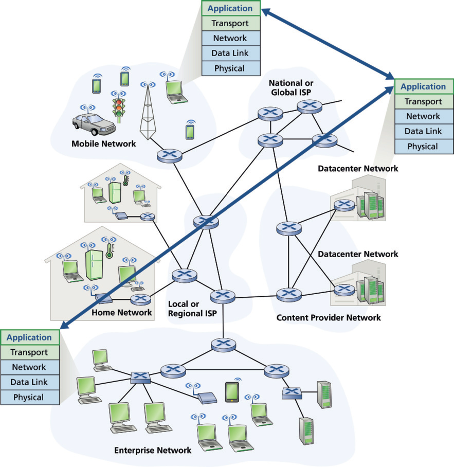

Indeed, even if you wanted to write application software for these networkcore devices, you wouldn’t be able to do so. As we learned in Chapter 1, and as shown earlier in Figure 1.25, network-core devices do not function at the application layer but instead function at lower layers—specifically at the network layer and below. This basic design—namely, confining application software to the end systems—as shown in Figure 2.1, has facilitated the rapid development and deployment of a vast array of network applications.

##### 2.1.1 Network Application Architectures

Before diving into software coding, you should have a broad architectural plan for your application. Keep in mind that an application’s architecture is distinctly different from the network architecture (e.g., the five-layer Internet architecture discussed in Chapter 1).From the application developer’s perspective, the network architecture is fixed and provides a specific set of services to applications. The application architecture, on the other hand, is designed by the application developer and dictates how the application is structured over the various end systems.

In choosing the application architecture, an application developer will likely draw on one of the two predominant architectural paradigms used in modern network applications: the client-server architecture or the peer-to-peer  P2P architecture. 

In a client-server architecture, there is an always-on host, called the server, which services requests from many other hosts, called clients. A classic example is the Web application for which an always-on Web server services requests from browsers running on client hosts. When a Web server receives a request for an object from a client host, it responds by sending the requested object to the client host. Note that with the client-server architecture, clients do not directly communicate with each other; for example, in the Web application, two browsers do not directly communicate. Another characteristic of the clientserver architecture is that the server has a fixed, well-known address, called an IP address (which we’ll discuss soon). Because the server has a fixed, wellknown address, and because the server is always on, a client can always contact the server by sending a packet to the server’s IP address. Some of the betterknown applications with a client-server architecture include the Web, e-mail, and video streaming. The client-server architecture is shown in Figure 2.2(a).

Often in a client-server application, a single-server host is incapable of keeping up with all the requests from clients. For example, a popular socialnetworking site can quickly become overwhelmed if it has only one server handling all of its requests. For this reason, a data center, housing a large number of hosts, is often used to create a powerful virtual server. The most popular Internet services—such as generative AI (chatbots, text to image/video, and so on), search engines (e.g., Google, Bing, Baidu), Internet commerce (e.g., Amazon, eBay, Alibaba), Web-based e-mail (e.g., Gmail and Yahoo Mail), social media (e.g., TikTok, Facebook, Instagram, X, and WeChat)—run in one or more data centers.

As discussed in Section 1.3.3, Google has more than 20 data centers distributed around the world, which collectively handle search, YouTube, Gmail, and other services. A data center can have hundreds of thousands of servers, which must be powered and maintained. Additionally, the service providers must pay recurring interconnection and bandwidth costs for sending data from their data centers.

In a P2P architecture, there is minimal (or no) reliance on dedicated servers in data centers. Instead the application exploits direct communication between pairs of intermittently connected hosts, called peers. Peers are not owned by a service provider, but are instead desktops and laptops controlled by users, with most of the peers residing in homes, universities, and offices.

Because the peers communicate without passing through a dedicated server, the architecture is called peer-to-peer. An example of a popular P2P application is the file-sharing application BitTorrent. One of the most compelling features of P2P architectures is their self-scalability. For example, in a P2P file-sharing application, although each peer generates workload by requesting files, each peer also adds service capacity to the system by distributing files to other peers. P2P architectures are also cost effective, since they normally don’t require significant server infrastructure and server bandwidth (in contrast with clients-server designs with datacenters). However, P2P applications face challenges of security, performance, and reliability due to their highly decentralized structure. Because of these challenges, most applications today have a client-server architecture.

Figure 2.2 (a) Client-server architecture; (b) P2P architecture

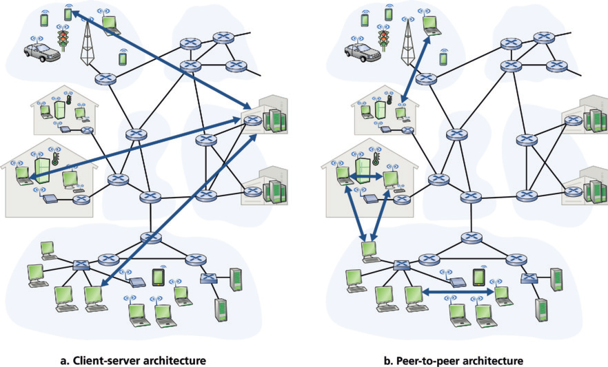

##### 2.1.2 Processes Communicating

Before building your network application, you also need a basic understanding of how the programs, running in multiple end systems, communicate with each other. In the jargon of operating systems, it is not actually programs but processes that communicate. A process can be thought of as a program that is running within an end system. When processes are running on the same end system, they can communicate with each other with interprocess communication, using rules that are governed by the end system’s operating system. But in this book, we are not particularly interested in how processes in the same host communicate, but instead in how processes running on different hosts (with potentially different operating systems) communicate.

Processes on two different end systems communicate with each other by messages exchanging across the computer network. A sending process creates

and sends messages into the network; a receiving process receives these messages and possibly responds by sending messages back. Figure 2.1 illustrates that processes communicating with each other reside in the application layer of the five-layer protocol stack.

Client and Server Processes A network application consists of pairs of processes that send messages to each other over a network. For example, in the Web application a client browser process exchanges messages with a Web server process. For each pair of communicating processes, we typically label one of the two processes as the client

and the other process as the server . With the Web, a browser is a client process

and a Web server is a server process. We define the client and server processes as follows:

In the context of a communication session between a pair of processes, the process that initiates the communication (that is, initially contacts the other process at the beginning of the session) is labeled as the client . The process that waits to be

contacted to begin the session is the server .

For example, in the Web, a browser process initiates contact with a Web server process; hence the browser process is the client and the Web server process is the server. When there’s no confusion, we’ll sometimes also use the terminology “client side and server side of an application.” At the end of this chapter, we’ll step through simple code for both the client and server sides of network applications.

The Interface Between the Process and the Computer Network As noted above, most applications consist of pairs of communicating processes, with the two processes in each pair sending messages to each other.

Any message sent from one process to another must go through the underlying network. A process sends messages into, and receives messages from, the network through a software interface called a socket . Let’s consider an anal-

ogy to help us understand processes and sockets. A process is analogous to a house and its socket is analogous to its door. When a process wants to send a message to another process on another host, it shoves the message out its door (socket). This sending process assumes that there is a transportation infrastructure on the other side of its door that will transport the message to the door of the destination process. Once the message arrives at the destination host, the message passes through the receiving process’s door (socket), and the receiving process then acts on the message.

Figure 2.3 illustrates socket communication between two processes that communicate over the Internet. (Figure 2.3 assumes that the underlying sockets in some detail in Section 2.6. Addressing Processes In order to send postal mail to a particular destination, the destination needs to have an address. Similarly, in order for a process running on one host to send packets to a process running on another host, the receiving process needs to have an address. To identify the receiving process, two pieces of information need to be specified: (1) the address of the host and (2) an identifier that specifies the receiving process in the destination host. In the Internet, the host is identified by its IP address. We’ll discuss IP addresses in great detail in Chapter 4. For now, all we need to know is that an IP address is a 32-bit quantity that we can think of as uniquely identifying the host. In addition to knowing the address of the host to which a message is destined, the sending process must also identify the receiving process (more specifically, the receiving socket) running in the host. This information is needed because in general a host could be running many network applications. A destination port number serves this purpose. Popular applications

Figure 2.3 Application processes, sockets, and underlying transport protocol transport protocol used by the processes is the Internet’s TCP protocol.) As shown in this figure, a socket is the interface between the application layer and the transport layer within a host. It is also referred to as the Application Programming Interface (API) between the application and the network, since the socket is the programming interface with which network applications are built. The application developer has control of everything on the application-layer side of the socket but has little control of the transport-layer side of the socket. The only control that the application developer has on the transportlayer side is (1) the choice of transport protocol and (2) perhaps the ability to fix a few transport-layer parameters such as maximum buffer and maximum segment sizes (to be covered in Chapter 3). Once the application developer chooses a transport protocol (if a choice is available), the application is built using the transport-layer services provided by that protocol. We’ll explore

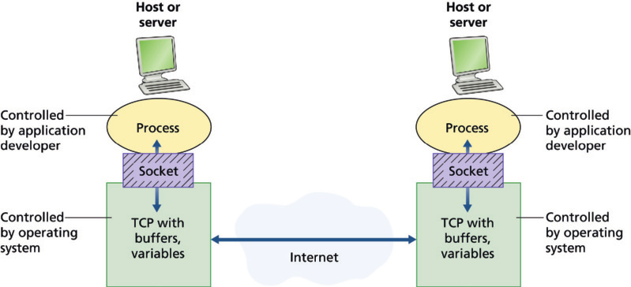

have been assigned specific port numbers. For example, a Web server is identified by port number 80. A mail server process (using the SMTP protocol) is identified by port number 25. A list of well-known port numbers for all Internet standard protocols can be found at www.iana.org. We’ll examine port numbers in detail in Chapter 3.

##### 2.1.3 Transport Services Available to Applications

Recall that a socket is the interface between the application process and the transport-layer protocol. The application at the sending side pushes messages through the socket. At the other side of the socket, the transport-layer protocol has the responsibility of getting the messages to the socket of the receiving process.

Many networks, including the Internet, provide more than one transportlayer protocol. When you develop an application, you must choose one of the available transport-layer protocols. How do you make this choice? Most likely, you would study the services provided by the available transport-layer protocols, and then pick the protocol with the services that best match your application’s needs. The situation is similar to choosing either train or airplane transport for travel between two cities. You have to choose one or the other, and each transportation mode offers different services. (For example, the train offers downtown pickup and drop-off, whereas the plane offers shorter travel time.) What are the services that a transport-layer protocol can offer to applications invoking it? We can broadly classify the possible services along four dimensions: reliable data transfer, throughput, timing, and security.

Reliable Data Transfer As discussed in Chapter 1, packets can get lost within a computer network. For example, a packet can overflow a buffer in a router, or can be discarded by a host or router after having some of its bits corrupted. For many applications— such as electronic mail, file transfer, Web document transfers, and financial applications—data loss can have devastating consequences (in the latter case, for either the bank or the customer!). Thus, to support these applications, something has to be done to guarantee that the data sent by one end of the application is delivered correctly and completely to the other end of the application. If a protocol provides such a guaranteed data delivery service, it is said to provide reliable data transfer. One important service that a transport-layer protocol can potentially provide to an application is process-to-process reliable data transfer. When a transport protocol provides this service, the sending process can just pass its data into the socket and know with complete confidence that the data will arrive without errors at the receiving process.

When a transport-layer protocol doesn’t provide reliable data transfer, some of the data sent by the sending process may never arrive at the receiving process. This may be acceptable for loss-tolerant applications, most notably multimedia applications such as conversational audio/video that can tolerate some amount of data loss. In these multimedia applications, lost data might result in a small glitch in the audio/video—not a crucial impairment.

Throughput In Chapter 1, we introduced the concept of available throughput, which, in the context of a communication session between two processes along a network path, is the rate at which the sending process can deliver bits to the receiving process. Because other sessions will be sharing the bandwidth along the network path, and because these other sessions will be coming and going, the available throughput can fluctuate with time. These observations lead to another natural service that a transport-layer protocol could provide, namely, guaranteed available throughput at some specified rate. With such a service, the application could request a guaranteed throughput of r bits sec, and the

transport protocol would then ensure that the available throughput is always at least r bits sec. Such a guaranteed throughput service would appeal to many applications. For example, if an Internet telephony application encodes voice at 32 kbps, it needs to send data into the network and have data delivered to the receiving application at this rate. If the transport protocol cannot provide this throughput, the application would need to encode at a lower rate (and receive enough throughput to sustain this lower coding rate) or may have to give up, since receiving, say, half of the needed throughput is of little or no use to this Internet telephony application. Applications that have throughput requirements are said to be bandwidth-sensitive applications. Many current multimedia applications are bandwidth sensitive, although some multimedia applications may use adaptive coding techniques to encode digitized voice or video at a rate that matches the currently available throughput.

While bandwidth-sensitive applications have specific throughput requirements, elastic applications can make use of as much, or as little, throughput as happens to be available. Electronic mail, file transfer, and Web transfers are all elastic applications. Of course, the more throughput, the better. There’s an adage that says that one cannot be too rich, too thin, or have too much throughput!

Timing A transport-layer protocol can also provide timing guarantees. As with throughput guarantees, timing guarantees can come in many shapes and forms. An example guarantee might be that every bit that the sender pumps into the socket arrives at the receiver’s socket no more than 100 msec later.

Such a service would be appealing to interactive real-time applications, such as Internet telephony, video conferencing, metaverses, and multiplayer games, all of which require tight timing constraints on data delivery in order to be effective, see [Gauthier 1999; Ramjee 1994]. Long delays in Internet telephony, for example, tend to result in unnatural pauses in the conversation; in a multiplayer game or virtual interactive metaverses, a long delay between taking an action and seeing the response from the environment (for example, from another player at the end of an end-to-end connection) makes the application feel less realistic. For non-real-time applications, lower delay is always preferable to higher delay, but no tight constraint is placed on the end-to-end delays.

Security Finally, a transport protocol can provide an application with one or more security services. For example, in the sending host, a transport protocol can encrypt all data transmitted by the sending process, and in the receiving host, the transport-layer protocol can decrypt the data before delivering the data to the receiving process. Such a service would provide confidentiality between the two processes, even if the data is somehow observed between sending and receiving processes. A transport protocol can also provide other security services in addition to confidentiality, including data integrity and end-point authentication, topics that we’ll cover in detail in Chapter 8.

##### 2.1.4 Transport Services Provided by the Internet

Up until this point, we have been considering transport services that a computer network could provide in general. Let’s now get more specific and examine the type of transport services provided by the Internet. The Internet (and, more generally, TCP/IP networks) makes two transport protocols available to applications, UDP and TCP.

When you (as an application developer) create a new network application for the Internet, one of the first decisions you have to make is whether to use UDP or TCP. Each of these protocols offers a different set of services to the invoking applications. Figure 2.4 shows the service requirements for some selected applications.

TCP Services The TCP service model includes a connection-oriented service and a reliable data transfer service. When an application invokes TCP as its transport protocol, the application receives both of these services from TCP.

• Connection-oriented service. TCP has the client and server exchange transport-layer control information with each other before the application-level messages begin to flow. This so-called handshaking procedure alerts the

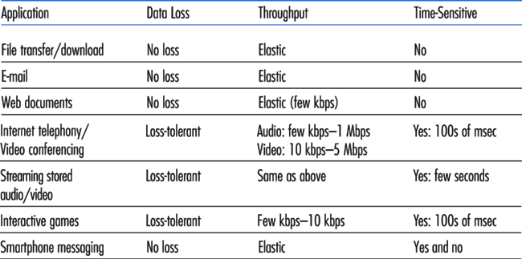

Figure 2.4 Requirements of selected network applications client and server, allowing them to prepare for an onslaught of packets.

After the handshaking phase, a TCP connection is said to exist between the sockets of the two processes. The connection is a full-duplex connection in that the two processes can send messages to each other over the connection at the same time. When the application finishes sending messages, it must tear down the connection. In Chapter 3, we’ll discuss connection-oriented service in detail and examine how it is implemented.

• Reliable data transfer service. The communicating processes can rely on TCP to deliver all data sent without error and in the proper order. When one side of the application passes a stream of bytes into a socket, it can count on TCP to deliver the same stream of bytes to the receiving socket, with no missing or duplicate bytes.

TCP also includes a congestion-control mechanism, a service for the general welfare of the Internet rather than for the direct benefit of the communicating processes. The TCP congestion-control mechanism throttles a sending process (client or server) when the network is congested between sender and receiver.

As we will see in Chapter 3, TCP congestion control also attempts to limit each TCP connection to its fair share of network bandwidth.

UDP Services UDP is a no-frills, lightweight transport protocol, providing minimal services.

UDP is connectionless, so there is no handshaking before the two processes start to communicate. UDP provides an unreliable data transfer service—that is, when a process sends a message into a UDP socket, UDP provides no guarantee that the message will ever reach the receiving process. Furthermore, messages that do arrive at the receiving process may arrive out of order.

##### Focus on Security: Securing TCP

Neither TCP nor UDP provides any encryption—the data that the sending process passes into its socket is the same data that travels over the network to the destination process. So, for example, if the sending process sends a password in cleartext (i.e., unencrypted) into its socket, the cleartext password will travel over all the links between sender and receiver, potentially getting sniffed and discovered at any of the intervening links. Because privacy and other security issues have become critical for many applications, the Internet community has developed an enhancement for TCP, called Security (TLS) [RFC 5246]. TCP-enhanced-with-TLS not only does everything that traditional TCP does but also provides critical process-to-process security services, including encryption, data integrity, and end-point authentication.

We emphasize that TLS is not a third Internet transport protocol, on the same level as TCP and UDP, but instead is an enhancement of TCP, with the enhancements being implemented in the application layer. In particular, if an application wants to use the services of TLS, it needs to include TLS code (existing, highly optimized libraries and classes) in both the client and server sides of the application. TLS has its own socket API that is similar to the traditional TCP socket API. When an application uses TLS, the sending process passes cleartext data to the TLS socket; TLS in the sending host then encrypts the data and passes the encrypted data to the TCP socket. The encrypted data travels over the Internet to the TCP socket in the receiving process. The receiving socket passes the encrypted data to TLS, which decrypts the data.

Finally, TLS passes the cleartext data through its TLS socket to the receiving process. We’ll cover TLS in some detail in Chapter 8.

UDP does not include a congestion-control mechanism, so the sending side of UDP can pump data into the layer below (the network layer) at any rate it pleases. (Note, however, that the actual end-to-end throughput may be less than this rate due to the limited transmission capacity of intervening links or due to congestion).

Services Not Provided by Internet Transport Protocols We have organized transport protocol services along four dimensions: reliable data transfer, throughput, timing, and security. Which of these services are provided by TCP and UDP? We have already noted that TCP provides reliable end-to-end data transfer. And we also know that TCP can be easily enhanced at the application layer with TLS to provide security services. But in our brief description of TCP and UDP, conspicuously missing was any mention of throughput or timing guarantees—services not provided by today’s Internet transport protocols. Does this mean that time-sensitive applications such as video conferencing cannot run in today’s Internet? The answer is clearly no— the Internet has been hosting time-sensitive applications for many years. These applications often work fairly well because they have been designed to cope, to the greatest extent possible, with this lack of guarantee. Nevertheless, clever design has its limitations when delay is excessive, or the end-to-end throughput is limited. In summary, today’s Internet can often provide satisfactory service to time-sensitive applications, but it cannot provide any timing or throughput guarantees.

Figure 2.5 indicates the transport protocols used by some popular Internet applications. We see that e-mail, remote terminal access, the Web, and file transfer all use TCP. These applications have chosen TCP primarily because TCP provides reliable data transfer, guaranteeing that all data will eventually get to its destination. Because video conferencing applications (such as Zoom) can often tolerate some loss but require a minimal rate to be effective, developers of video conferencing applications usually prefer to run their applications over UDP, thereby circumventing TCP’s congestion control mechanism and packet overheads. But because many firewalls are configured to block (most types of) UDP traffic, Internet telephony applications often are designed to use TCP as a backup if UDP communication fails.

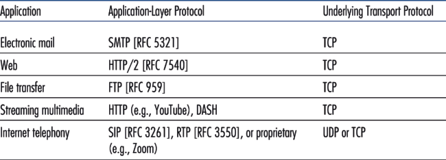

Figure 2.5 Popular Internet applications, their application-layer protocols, and their underlying transport protocols

##### 2.1.5 Application-Layer Protocols

We have just learned that network processes communicate with each other by sending messages into sockets. But how are these messages structured? What are the meanings of the various fields in the messages? When do the processes send the messages? These questions bring us into the realm of application-layer protocols. An application-layer protocol defines how an application’s processes, running on different end systems, pass messages to each other. In particular, an application-layer protocol defines:

• The types of messages exchanged, for example, request messages and response messages

• The syntax of the various message types, such as the fields in the message and how the fields are delineated

• The semantics of the fields, that is, the meaning of the information in the fields

• Rules for determining when and how a process sends messages and responds to messages Some application-layer protocols are specified in RFCs and are therefore in the public domain. For example, the Web’s application-layer protocol, HTTP (the HyperText Transfer Protocol [RFC 7230]), is available as an RFC. If a browser developer follows the rules of the HTTP RFC, the browser will be able to retrieve Web pages from any Web server that has also followed the rules of the HTTP RFC. Many other application-layer protocols are proprietary and intentionally not available in the public domain. For example, Zoom uses proprietary application-layer protocols.

It is important to distinguish between network applications and application-layer protocols. An application-layer protocol is only one piece of a network application (albeit, a very important piece).Let’s look at a couple of examples. The Web is a client-server application that allows users to obtain documents from Web servers on demand. The Web application consists of many components, including a standard for document formats (that is, HTML), Web browsers (for example, Google Chrome and Microsoft Edge), Web servers (for example, Apache and Microsoft servers), and an application-layer protocol. The Web’s application-layer protocol, HTTP, defines the format and sequence of messages exchanged between browser and Web server. Thus, HTTP is only one piece (albeit, a critical piece) of the Web application.

As another example, we’ll see in Section 2.5 that Netflix’s video service also has many components, including servers that store and transmit videos, other servers that manage billing and other client functions, clients (e.g., the Netflix app on your smartphone, tablet, or computer), and an application-level DASH protocol defines the format and sequence of messages exchanged between a Netflix server and client. Thus, DASH is only one piece (albeit, a critical piece) of the Netflix application.

##### 2.1.6 Network Applications Covered in This Book

New applications are being developed every day. Rather than covering a large number of Internet applications in an encyclopedic manner, we have chosen to focus on a small number of applications that are both pervasive and important.

In this chapter, we discuss four important applications: the Web, electronic mail, directory service, and video streaming. We first discuss the Web, not only because it is an enormously popular application, but also because its application-layer protocol, HTTP, is relatively straightforward and easy to understand.

We then discuss electronic mail, the Internet’s first killer application. E-mail is more complex than the Web in the sense that it makes use of not one but several application-layer protocols. After e-mail, we cover DNS, which provides a directory service for the Internet. Most users do not interact with DNS directly;

instead, users invoke DNS indirectly through other applications (including the Web, file transfer, and electronic mail). DNS illustrates nicely how a piece of core network functionality (network-name to network-address translation) can be implemented at the application layer in the Internet. We complete our application study by discussing video streaming on demand, including distributing stored video over content distribution networks.

#### 2.2 The Web and HTTP

Until the early 1990s, the Internet was used primarily by researchers, academics, and university students to log in to remote hosts, to transfer files from local hosts to remote hosts and vice versa, to receive and send news, and to receive and send electronic mail. Although these applications were (and continue to be) extremely useful, the Internet was essentially unknown outside of the academic and research communities. Then, in the early 1990s, a major new application arrived on the scene—the World Wide Web [Berners-Lee 1994]. The Web was the first Internet application that caught the general public’s eye. It dramatically changed how people interact inside and outside their work environments. It elevated the Internet from just one of many data networks to essentially the one and only data network.

Perhaps what appeals the most to users is that the Web operates on demand.

Users receive what they want, when they want it. This is unlike traditional broadcast radio and television, which force users to tune in when the content provider makes the content available. In addition to being available on demand, the Web has many other compelling features that people love and cherish. It is enormously easy for any individual to make information available over the Web—everyone can become a publisher at extremely low cost. Hyperlinks and search engines help us navigate through an ocean of information.

Photos and videos stimulate our senses. Forms, JavaScript, video, and many other devices enable us to interact with pages and sites. And the Web and its protocols serve as a platform for generative AI, YouTube, Web-based e-mail (such as Gmail), and most mobile Internet applications, including Instagram and Google Maps.

##### 2.2.1 Overview of HTTP

The HyperText Transfer Protocol (HTTP) is defined in [RFC 1945], [RFC 7230], [RFC 7540] and [RFC 9114]. Today the vast majority of applications run over HTTP, including Web browsing, video streaming, social media, and email between clients and mail servers. Also, smartphone apps typically communicate with servers over HTTP.

HTTP is implemented in two programs: a client program and a server program. The client program and server program, executing on different end systems, talk to each other by exchanging HTTP messages. HTTP defines the structure of these messages and how the client and server exchange the messages. Before explaining HTTP in detail, we should review some Web terminology.

A Web page (also called a document) consists of objects. An object is simply a file—such as an HTML file, a JPEG image, a Javascrpt file, a CCS style sheet file, or a video clip—that is addressable by a single URL. Most Web pages consist of a base HTML file and several referenced objects. For example, if a Web page contains HTML text and five JPEG images, then the Web page has six objects: the base HTML file plus the five images. The base HTML file references the other objects in the page with the objects’ URLs. Each URL has two components: the hostname of the server that houses the object and the object’s path name. For example, the URL http://www.someSchool.edu/someDepartment/picture.gif www.someSchool.edu /someDepartment/ has for a hostname and

picture.gif for a path name. Because Web browsers (such as Chrome and

Edge) implement the client side of HTTP, in the context of the Web, we will use the words browser and client interchangeably. Web servers, which implement the server side of HTTP, house Web objects, each addressable by a URL. Popular Web servers include Apache, Nginx, and Microsoft Internet Information Server.

HTTP defines how Web clients request Web pages from Web servers and how servers transfer Web pages to clients. We discuss the interaction between client and server in detail later, but the general idea is illustrated in Figure 2.6.

When a user requests a Web page (for example, clicks on a hyperlink), the browser sends HTTP request messages for the objects in the page to the server.

The server receives the requests and responds with HTTP response messages that contain the objects.

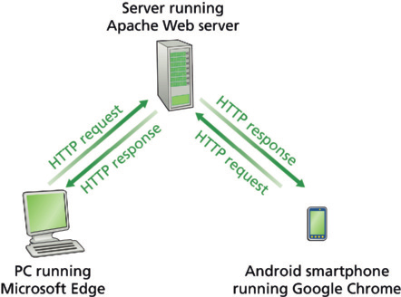

Figure 2.6 HTTP request-response behavior

Depending on the HTTP version, HTTP can use either TCP or UDP as its underlying transport protocol. Using UDP is a relatively new development.

We’ll first discuss HTTP assuming TCP is the underyling transport protocol.

We’ll then discuss HTTP over UDP in Section 2.2.7. The HTTP client first initiates a TCP connection with the server. Once the connection is established, the browser and the server processes access TCP through their socket interfaces.

As described in Section 2.1, on the client side the socket interface is the door between the client process and the TCP connection; on the server side it is the door between the server process and the TCP connection. The client sends HTTP request messages into its socket interface and receives HTTP response messages from its socket interface. Similarly, the HTTP server receives request messages from its socket interface and sends response messages into its socket interface. Once the client sends a message into its socket interface, the message is out of the client’s hands and is “in the hands” of TCP. Recall from Section 2.1 that TCP provides a reliable data transfer service to HTTP. This implies that each HTTP request message sent by a client process eventually arrives intact at the server; similarly, each HTTP response message sent by the server process eventually arrives intact at the client. Here we see one of the great advantages of a layered architecture—HTTP need not worry about lost data or the details of how TCP recovers from loss or reordering of data within the network. That is the job of TCP and the protocols in the lower layers of the protocol stack.

It is important to note that the server sends requested files to clients without storing any state information about the client. If a particular client asks for the same object twice in a period of a few seconds, the server does not respond by saying that it just served the object to the client; instead, the server resends the object, as it has completely forgotten what it did earlier. Because an HTTP server maintains no information about the clients, HTTP is said to be a stateless protocol. We also remark that the Web uses the client-server application architecture, as described in Section 2.1. A Web server is always on, with a fixed IP address, and it services requests from potentially millions of different browsers.

HTTP has gone through many versions. The original version of HTTP, HTTP 1.0, dates back to the early 1990s [RFC 1945]. Since then HTTP 1.1 [RFC 7320] and HTTP 2 [RFC 7540] have been widely deployed. HTTP 1.0, HTTP 1.1, and HTTP 2 all run on top of TCP. More recently, HTTP 3 has been standardized [RFC 9114] and is gaining traction. HTTP 3, discussed in Section 2.2.7, runs over UDP.

##### 2.2.2 Non-Persistent and Persistent Connections

In many Internet applications, the client and server communicate for an extended period of time, with the client making a series of requests and the server responding to each of the requests. Depending on the application and on how the application is being used, the series of requests may be made backto-back, periodically at regular intervals, or intermittently. When this client-server interaction is taking place over TCP, the application developer needs to make an important decision—should each request/response pair be sent over a separate TCP connection, or should all of the requests and their corresponding responses be sent over the same TCP connection? In the former approach, the application is said to use non-persistent connections; and in the latter approach, persistent connections. To gain a deep understanding of this design issue, let’s examine the advantages and disadvantages of persistent connections in the context of a specific application, namely, HTTP, which can use both non-persistent connections and persistent connections.

HTTP with Non-Persistent Connections Let’s walk through the steps of transferring a Web page from server to client for the case of non-persistent connections. Let’s suppose the page consists of a base HTML file and 10 JPEG images, and that all 11 of these objects reside on the same server. Further suppose the URL for the base HTML file is http://www.someSchool.edu/someDepartment/home.index Here is what happens:

www. 1.  The HTTP client process initiates a TCP connection to the server someSchool.edu on port number 80, which is the default port number

for HTTP. Associated with the TCP connection, there will be a socket at the client and a socket at the server.

2.  The HTTP client sends an HTTP request message to the server via its

/someDepartment/ socket. The request message includes the path name home.index . (We will discuss HTTP messages in some detail below.)

3.  The HTTP server process receives the request message via its socket,

/someDepartment/home.index retrieves the object from its storage

(RAM or disk), encapsulates the object in an HTTP response message, and sends the response message to the client via its socket.

4.  The HTTP server process tells TCP to close the TCP connection. (But TCP doesn’t actually terminate the connection until it knows for sure that the client has received the response message intact.)

5.  The HTTP client receives the response message. The TCP connection terminates. The message indicates that the encapsulated object is an HTML file. The client extracts the file from the response message, examines the HTML file, and finds references to the 10 JPEG objects.

6.  The first four steps are then repeated for each of the referenced JPEG objects.

As the browser receives the Web page, it displays the page to the user.

Two different browsers may interpret (that is, display to the user) a Web page in somewhat different ways. HTTP has nothing to do with how a Web page is interpreted by a client. The HTTP specifications ([RFC 1945] and [RFC 7540]) define only the communication protocol between the client HTTP program and the server HTTP program.

The steps above illustrate the use of non-persistent connections, where each TCP connection is closed after the server sends the object—the connection does not persist for other objects. Note that each non-persistent TCP connection transports exactly one request message and one response message.

Thus, in this example, when a user requests the Web page, 11 TCP connections are generated.

Before continuing, let’s do a back-of-the-envelope calculation to estimate the amount of time that elapses from when a client requests the base HTML file until the entire file is received by the client. To this end, we define the round-trip time (RTT), which is the time it takes for a small packet to travel from client to server and then back to the client. The RTT includes packetpropagation delays, packet-queuing delays in intermediate routers and switches, and packet-processing delays. (These delays were discussed in Section 1.4.) Now consider what happens when a user clicks on a hyperlink.

As shown in Figure 2.7, this causes the browser to initiate a TCP connection between the browser and the Web server; this involves a “three-way handshake”—the client sends a small TCP segment to the server, the server acknowledges and responds with a small TCP segment, and, finally, the client acknowledges back to the server. The first two parts of the three-way handshake take one RTT. After completing the first two parts of the handshake, the client sends the HTTP request message combined with the third part of the three-way handshake (the acknowledgment) into the TCP connection.

Once the request message arrives at the server, the server sends the HTML file into the TCP connection. This HTTP request/response eats up another RTT.

Thus, roughly, the total response time is two RTTs plus the transmission time at the server of the HTML file.

HTTP with Persistent Connections Non-persistent connections have some shortcomings. First, a brand-new connection must be established and maintained for each requested object. For each of these connections, TCP buffers must be allocated and TCP variables must be kept in both the client and server. This can place a significant burden on the Web server, which may be serving requests from hundreds of different clients simultaneously. Second, as we just described, each object suffers a delivery delay of two RTTs—one RTT to establish the TCP connection and one RTT to request and receive an object.

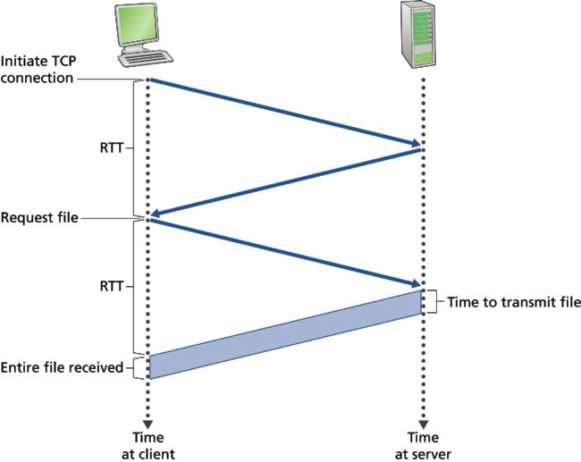

Figure 2.7 Back-of- the-envelope calculation for the time needed to request and receive an HTML file

With persistent connections, as employed in HTTP 1.1 and HTTP 2, the server leaves the TCP connection open after sending a response. Subsequent requests and responses between the same client and server can be sent over the same connection. In particular, an entire Web page (in the example above, the base HTML file and the 10 images) can be sent over a single persistent TCP connection.

Moreover, multiple Web pages residing on the same server can be sent from the server to the same client over a single persistent TCP connection. These requests for objects can be made using “pipelining,” that is, back-to-back, without waiting for replies to pending requests. Typically, the HTTP server closes a connection when it isn’t used for a certain time (a configurable timeout interval).

When the server receives the back-to-back requests, it sends the objects back-to-back.

##### 2.2.3 HTTP Message Format

The HTTP specifications [RFC 1945; RFC 7230; RFC 7540; RFC 9114] include the definitions of the HTTP message formats. There are two types of HTTP messages, request messages and response messages, both of which are discussed below.

HTTP Request Message Below we provide a typical HTTP request message:

GET /somedir/page.html HTTP/1.1 Host: www.someschool.edu Connection: close User-agent: Mozilla/5.0 Accept-language: fr

We can learn a lot by taking a close look at this simple request message.

First of all, we see that the message is written in ordinary ASCII text, so that your ordinary computer-literate human being can read it. Second, we see that the message consists of five lines, each followed by a carriage return and a line feed. The last line is followed by an additional carriage return and line feed.

Although this particular request message has five lines, a request message can have many more lines or as few as one line. The first line of an HTTP request message is called the request line; the subsequent lines are called the header lines. The request line has three fields: the method field, the URL field, and the HTTP version field. The method field can take on several different values, GET POST HEAD PUT DELETE including , , , , and . The great majority of HTTP

GET GET request messages use the method. The method is used when the

browser requests an object, with the requested object identified in the URL

/somedir/page. field. In this example, the browser is requesting the object html . The version is self-explanatory; in this example, the browser implements version HTTP 1.1.

Host: Now let’s look at the header lines in the example. The header line www.someschool.edu specifies the host on which the object resides. You

might think that this header line is unnecessary, as there is already a TCP connection in place to the host. But, as we’ll see in Section 2.2.5, the information provided by the host header line is required by Web proxy caches. By includ- Connection: close ing the header line, the browser is telling the server

that it doesn’t want to bother with persistent connections; it wants the server to

User-agent close the connection after sending the requested object. The :

header line specifies the user agent, that is, the browser type that is making the request to the server. Here the user agent is Mozilla/5.0, a Firefox browser.

This header line is useful because the server can actually send different versions of the same object to different types of user agents. (Each of the versions

Accept-language is addressed by the same URL.) Finally, the : header indi-

cates that the user prefers to receive a French version of the object, if such an object exists on the server; otherwise, the server should send its default ver- Accept-language sion. The : header is just one of many content negotiation

headers available in HTTP.

Having looked at an example, let’s now look at the general format of a request message, as shown in Figure 2.8. We see that the general format closely follows our earlier example. You may have noticed, however, that after the header lines (and the additional carriage return and line feed) there is an

GET “entity body.” The entity body is empty with the method, but is used with

POST POST the method. An HTTP client often uses the method when the user

fills out a form—for example, when a user provides search words to a search

POST engine. With a message, the user is still requesting a Web page from the

server, but the specific contents of the Web page depend on what the user

POST entered into the form fields. If the value of the method field is , then the

entity body contains what the user entered into the form fields.

We would be remiss if we didn’t mention that a request generated with a

POST form does not necessarily have to use the method. Instead, HTML forms

GET often use the method and include the inputted data (in the form fields) in

GET the requested URL. For example, if a form uses the method, has two fields, www.somesite.com/animalsearch?monkeys& have the structure bananas . In your day-to-day Web surfing, you have probably noticed extended URLs of this sort.


Figure 2.8 General format of an HTTP request message

monkeys bananas and the inputs to the two fields are and , then the URL will

HEAD GET The method is similar to the method. When a server receives a

HEAD request with the method, it responds with an HTTP message but it leaves

HEAD out the requested object. Application developers often use the method

PUT for debugging. The method is often used in conjunction with Web pub-

lishing tools. It allows a user to upload an object to a specific path (directory)

PUT on a specific Web server. The method is also used by applications that

DELETE need to upload objects to Web servers. The method allows a user, or

an application, to delete an object on a Web server.

HTTP Response Message Below we provide a typical HTTP response message. This response message could be the response to the example request message just discussed.

HTTP/1.1 200 OK Connection: close Date: Mon, 21 Oct 2024 18:58:21 GMT Server: Apache/2.2.3 (CentOS) Last-Modified: Sun, 20 Oct 2024 13:20:46 GMT Content-Length: 6821 Content-Type: text/html (data data data data data ...)

Let’s take a careful look at this response message. It has three sections: an initial status line, six header lines, and then the entity body. The entity body is the

data meat of the message—it contains the requested object itself (represented by data data data data ... ). The status line has three fields: the protocol ver-

sion field, a status code, and a corresponding status message. In this example, the status line indicates that the server is using HTTP 1.1 and that everything is OK (that is, the server has found, and is sending, the requested object).

Connection: Now let’s look at the header lines. The server uses the close header line to tell the client that it is going to close the TCP connection

Date after sending the message. The : header line indicates the time and date

when the HTTP response was created and sent by the server. Note that this is not the time when the object was created or last modified; it is the time when the server retrieves the object from its file system, inserts the object into the

Server response message, and sends the response message. The : header line

indicates that the message was generated by an Apache Web server; it is analo- User-agent gous to the : header line in the HTTP request message. The

Last-Modified : header line indicates the time and date when the object was Last-Modified created or last modified. The : header, which we will soon

cover in more detail, is critical for object caching, both in the local client and in

Content-Length network cache servers (also known as proxy servers). The :

header line indicates the number of bytes in the object being sent. The Content-Type : header line indicates that the object in the entity body is

Content-Type HTML text. (The object type is officially indicated by the :

header and not by the file extension.) Having looked at an example, let’s now examine the general format of a response message, which is shown in Figure 2.9. This general format of the response message matches the previous example of a response message. Let’s say a few additional words about status codes and their phrases. The status code and associated phrase indicate the result of the request. Some common status codes and associated phrases include:

200 OK • : Request succeeded and the information is returned in the response.

301 Moved Permanently • : Requested object has been permanently Location moved; the new URL is specified in : header of the response

message. The client software will automatically retrieve the new URL.

400 Bad Request • : This is a generic error code indicating that the request

could not be understood by the server.

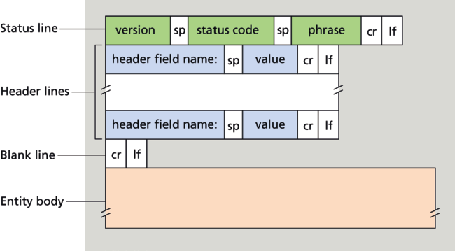

Figure 2.9 General format of an HTTP response message

404 Not Found • : The requested document does not exist on this server.

505 HTTP Version Not Supported • : The requested HTTP protocol

version is not supported by the server.

How would you like to see a real HTTP request message from your computer and the HTTP response sent in return by the Web server? It’s easy to do, and we recommend you give it a try! From a command line prompt on your computer, enter:

curl -v http://gaia.cs.umass.edu/kurose_ross/index.php curl command The above will send an HTTP GET request to the gaia.

kurose_ross/ cs.umass.edu Web server to retrieve the HTML content / index.php, which is the authors’ homepage for this textbook. The verbose (-v) option will cause the text content of the HTTP GET request message and the response received to be displayed as text. Of course, if you want to see what the received response looks like when it’s formatted and displayed, just enter the URL above into your favorite Web browser.

In this section, we discussed a number of header lines that can be used within HTTP request and response messages. The HTTP specification defines many, many more header lines that can be inserted by browsers, Web servers, and network cache servers. We have covered only a small number of the totality of header lines. We’ll cover a few more below and another small number when we discuss network Web caching in Section 2.2.5.

How does a browser decide which header lines to include in a request message? How does a Web server decide which header lines to include in a response message? A browser will generate header lines as a function of the browser type and version, the user configuration of the browser and whether the browser currently has a cached, but possibly out-of-date, version of the object. Web servers behave similarly: There are different products, versions, and configurations, all of which influence which header lines are included in response messages.

##### 2.2.4 User-Server Interaction: Cookies

We mentioned above that an HTTP server is stateless. This simplifies server design and has permitted engineers to develop high-performance Web servers that can handle thousands of simultaneous TCP connections. However, it is often desirable for a Web site to identify users, either because the server wishes to restrict user access or because it wants to serve content as a function of the user identity. For these purposes, HTTP uses cookies. Cookies, defined in [RFC 6265], allow sites to keep track of users. Most major commercial Web sites use cookies today.

As shown in Figure 2.10, cookie technology has four components: (1) a cookie header line in the HTTP response message; (2) a cookie header line in the HTTP request message; (3) a cookie file kept on the user’s end system and managed by the user’s browser; and (4) a back-end database at the Web site.

Using Figure 2.10, let’s walk through an example of how cookies work. Suppose Susan, who always accesses the Web using Google Chrome from her

Figure 2.10 Keeping user state with cookies home PC, contacts Amazon.com for the first time. Let us suppose that in the past she has already visited the eBay site. When the request comes into the Amazon Web server, the server creates a unique identification number and creates an entry in its back-end database that is indexed by the identification number. The Amazon Web server then responds to Susan’s browser, including

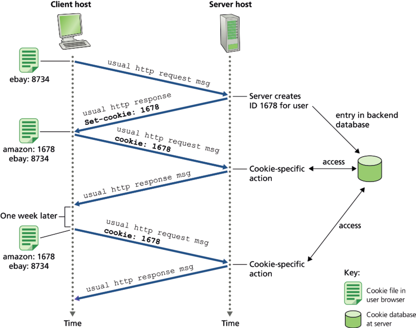

Set-cookie in the HTTP response a : header, which contains the identification number. For example, the header line might be: Set-cookie: 1678 Set- When Susan’s browser receives the HTTP response message, it sees the cookie : header. The browser then appends a line to the special cookie file that it manages. This line includes the hostname of the server and the identification Set-cookie number in the : header. Note that the cookie file already has an entry for eBay, since Susan has visited that site in the past. As Susan continues to browse the Amazon site, each time she requests a Web page, her browser consults her cookie file, extracts her identification number for this site, and puts a cookie header line that includes the identification number in the HTTP request. Specifically, each of her HTTP requests to the Amazon server includes the header line:

Cookie: 1678 In this manner, the Amazon server is able to track Susan’s activity at the Amazon site. Although the Amazon Web site does not necessarily know Susan’s name, it knows exactly which pages user 1678 visited, in which order, and at what times! Amazon uses cookies to provide its shopping cart service— Amazon can maintain a list of all of Susan’s intended purchases, so that she can pay for them collectively at the end of the session.

If Susan returns to Amazon’s site, say, one week later, her browser will

Cookie: 1678 continue to put the header line in the request messages.

Amazon also recommends products to Susan based on Web pages she has visited at Amazon in the past. If Susan also registers herself with Amazon—providing full name, e-mail address, postal address, and credit card information—Amazon can then include this information in its database, thereby associating Susan’s name with her identification number (and all of the pages she has visited at the site in the past!).

This is how Amazon and other e-commerce sites provide “one-click shopping”—when Susan chooses to purchase an item during a subsequent visit, she doesn’t need to re-enter her name, credit card number, or address.

From this discussion, we see that cookies can be used to identify a user.

The first time a user visits a site, the user can provide a user identification (possibly his or her name). During the subsequent sessions, the browser passes a cookie header to the server, thereby identifying the user to the server. Cookies can thus be used to create a user session layer on top of stateless HTTP. For example, when a user logs in to a Web-based e-mail application, the browser sends cookie information to the server, permitting the server to identify the user throughout the user’s session with the application.

Although cookies often simplify the Internet shopping experience for the user, they are controversial because they can also be considered as an invasion of privacy. As we just saw, using a combination of cookies and user-supplied account information, a Web site can learn a lot about a user and potentially sell this information to a third party.

##### 2.2.5 Browser Caching

We learned earlier in Figure 2.7 that the minimum delay from when your browser first requests an object from a Web server and when your browser receives that object is 2RTT—one RTT to establish a TCP connection between your browser and the server, and another RTT to send the HTTP request and receive the HTTP response. We’ll learn shortly that the most recent version of

HTTP  HTTP 3 has been optimized to require just one RTT to request a web 

page in many cases. But can we cut that this delay to something even less that one RTT? Wouldn’t a delay of zero be great? Although this might seem to defy the law of physics, this can indeed happen with browser caching, a technique implemented in all modern Web browsers, and used extensively in the Web.

One estimate is that 75% of Web requests receive HTTP responses with the types of explicit browser caching instructions that we’ll study below [Web almanac 2021].

With browser caching, a Web browser locally stores the content of recently received Web objects in its browser cache. When a user requests a Web object, the browser first checks to see if that object is stored in its local browser cache.

If so, it may immediately display that Web object, without making a new request to the Web server (and incurring the subsequent request/response delay), since the browser has already requested and received that object earlier from the Web server.

Although browser caching can reduce user-perceived response times and decrease the amount of HTTP traffic carried over the Internet (advantages we’ll explore in the end-of-chapter problems), it introduces an important new challenge—how does the browser know whether the object currently housed in the Web server has been modified since the copy was cached at the client?

Certain types of Web objects such as images, JavaScript files, and CSS files change infrequently; other objects such as text may change frequently. How is the browser to know whether the contents in its cache are up-to-date or stale?

Fortunately, the HTTP protocol provides fields in both the HTTP GET and response messages to help the server and a browser manage browser caching [RFC 7232]:

Cache-Control • Cache-Control. The field in an HTTP response message

lets the server specify how the content in the HTTP reply message

Cache Control:no-store should be cached. The directive instructs

the browser to not cache/store the content locally. In this case, the browser will always have to re-request the content from the server. Alternatively, a server can explicitly instruct the browser about the amount of time that an

Cache-Control: maxobject can remain in the cache. For example, the age=3600 directive tells the browser that the content can be cached for 3600 seconds, but after that must be re-requested from the server. Many Cache-Control other directives are defined in [RFC 7232].

• I f-Modified-Since. HTTP also provides a mechanism in the client-to-server HTTP message, known as a conditional GET message, to facilitate caching. The conditional GET message is the usual HTTP GET message that

If-Modified-Since: also include an header line. With a conditional

GET, the client explicitly requests an object, but lets the server know that it has that object in its browser cache and when that object was added to its cache. The HTTP server in turn will reply with the full object if that object has changed in the intervening time; otherwise, it will simply let the browser know that its (browser cache) copy is still current and does not send the object again.

To illustrate how the conditional GET operates, let’s walk through an

say example. Suppose that a browser has previously requested an object, kiwi.jpg kiwi. , has that object in its cache and has recorded the time when jpg was added to its cache. When a user later requests this object again, however, the browser is uncertain as to whether or not this cached copy is still current. This can happen because the server never provided cache-control information, the server earlier provided a cache-control directive with a max-age that has expired, or the server directed the browser to cache the object but also directed the browser to always explicitly check with the server on the object’s freshness. In this case, the browser sends a conditional GET to the server:

GET /fruit/kiwi.jpg HTTP/1.1 Host: www.exotiquecuisine.com If-modified-since: Fri, 13 Sep 2024 09:23:24 If-modified-since The value of the : header line indicates that the object in

the browser’s cache was received on 13 Sep 2024 at 9:23:24. This conditional GET is telling the server to send the object only if the object has been modified since the specified date. Suppose the object has not been modified since 13 Sep 2024 09:23:24. In this case, the Web server sends an HTTP response message:

HTTP/1.1 304 Not Modified Date: Fri, 8 Nov 2024 12:07:29 Server: Apache/2.4.62 (Unix) (empty entity body) We see in this case, that the Web server still sends a response message but does

304 Not Modnot include the requested object in the response message. The ified in the status line tells the browser that copy of the object in the browsers cache in current and therefore the cached copy of the object can be used.

Including the requested object would only waste bandwidth and increase userperceived response time, particularly if the object is large.

##### 2.2.6 HTTP 2

HTTP 2 [RFC 7540], standardized in 2015, was the first new version of HTTP since  HTTP 1.1, which was standardized in 1997. Since standardization, HTTP 2 has taken off, with about 35% of the top 10 million websites supporting HTTP 2 in 2024 [W3Techs]. Most browsers—including Google Chrome, Microsoft Edge, Safari, Opera, and Firefox—also support HTTP 2. Usage in recent years has declined some due to the emergence of HTTP 3, discussed in Seciton 2.2.7.

The primary goals for HTTP 2 are to reduce perceived latency by enabling request and response multiplexing over a single TCP connection, provide request prioritization and server push, and provide efficient compression of HTTP header fields. HTTP 2 does not change HTTP methods, status codes, URLs, or header fields. Instead, HTTP 2 changes how the data is formatted and transported between the client and server.

To motivate the need for HTTP 2, recall that HTTP 1.1 uses persistent TCP connections, allowing a Web page to be sent from server to client over a single TCP connection. By having only one TCP connection per Web page, the number of sockets at the server is reduced and each transported Web page gets a fair share of the network bandwidth (as discussed below).

But developers of Web browsers quickly discovered that sending all the objects in a Web page over a single TCP connection has a Head of Line (HOL) blocking problem. To understand HOL blocking, consider a Web page that includes an HTML base page, a large video clip near the top of Web page, and many small objects below the video. Further suppose there is a low-to-medium speed bottleneck link (for example, a low-speed wireless link) on the path between server and client. Using a single TCP connection, the video clip will take a long time to pass through the bottleneck link, while the small objects are delayed as they wait behind the video clip; that is, the video clip at the head of the line blocks the small objects behind it. HTTP 1.1 browsers typically work around this problem by opening multiple parallel TCP connections, thereby having objects in the same web page sent in parallel to the browser. This way, the small objects can arrive at and be rendered in the browser much faster, thereby reducing user-perceived delay.

TCP congestion control, discussed in detail in Chapter 3, also provides browsers an unintended incentive to use multiple parallel TCP connections rather than a single persistent connection. Very roughly speaking, TCP congestion control aims to give each TCP connection sharing a bottleneck link an equal share of the available bandwidth of that link; so if there are n TCP connections operating over a bottleneck link, then each connection approximately gets 1 th of the bandwidth. By opening multiple parallel TCP connections to n transport a single Web page, the browser can “cheat” and grab a larger portion of the link bandwidth. Many HTTP 1.1 browsers open up to six parallel TCP connections not only to circumvent HOL blocking but also to obtain more bandwidth.

One of the primary goals of HTTP 2 is to get rid of (or at least reduce the number of) parallel TCP connections for transporting a single Web page.

This not only reduces the number of sockets that need to be open and maintained at servers, but also allows TCP congestion control to operate as intended. But with only one TCP connection to transport a Web page, HTTP 2 requires carefully designed mechanisms to avoid HOL blocking.

HTTP 2 Framing The HTTP 2 solution for HOL blocking is to break each message into small frames, and interleave the request and response messages on the same TCP connection. To understand this, more thoroughly consider again the example of a Web page consisting of one large video clip and, say, 8 smaller objects. Thus the server will receive 9 concurrent requests from any browser wanting to see this Web page. For each of these requests, the server needs to send 9 competing HTTP response messages to the browser over the same TCP connection. For simplicity, suppose all frames are of fixed length, the video clip consists of 1000 frames, and each of the smaller objects consists of two frames. With frame interleaving, after sending one frame from the video clip, the first frame of each of the small objects are sent. Then after sending the second frame of the video clip, the last frame of each of the small objects are sent. Thus, all of the smaller objects are sent after sending a total of 18 frames. If interleaving were not used, the smaller objects would be sent only after sending 1016 frames. Thus the HTTP 2 framing mechanism can significantly decrease user-perceived delay.

The ability to break down an HTTP message into independent frames, interleave them, and then reassemble them on the other end is the single most important enhancement of HTTP 2. The framing is done by the framing sublayer of the HTTP 2 protocol. When a server wants to send an HTTP response, the response is processed by the framing sub-layer, where it is broken down into frames. The header field of the response becomes one frame, and the body of the message is broken down into one or more additional frames. The frames of the response are then interleaved by the framing sub-layer in the server with the frames of other responses and sent over the single persistent TCP connection. As the frames arrive at the client, they are first reassembled into the original response messages at the framing sub-layer and then processed by the browser as usual. Similarly, a client’s HTTP requests are broken into frames and interleaved.

In addition to breaking down each HTTP message into independent frames, the framing sublayer also binary encodes the frames. Binary protocols are more efficient to parse, lead to slightly smaller frames, and are less error-prone.

Response Message Prioritization and Server Pushing Message prioritization allows developers to customize the relative priority of requests to better optimize application performance. As we just learned, the framing sub-layer organizes messages into parallel streams of data destined to the same requestor. When a client sends concurrent requests to a server, it can prioritize the responses it is requesting by assigning a weight between 1 and 256 to each message. The higher number indicates higher priority. Using these weights, the server can send first the frames for the responses with the highest priority. In addition to this, the client also states each message’s dependency on other messages by specifying the ID of the message on which it depends.

Another feature of HTTP 2 is the ability for a server to send multiple responses for a single client request. That is, in addition to the response to the original request, the server can push additional objects to the client, without the client having to request each one. This is possible since the HTML base page indicates the objects that will be needed to fully render the Web page. So instead of waiting for the HTTP requests for these objects, the server can analyze the HTML page, identify the objects that are needed, and send them to the client before receiving explicit requests for these objects. Server push eliminates the extra latency due to waiting for the requests.

##### 2.2.7 HTTP 3 and QUIC

We just learned about the evolution of the HTTP protocol, from HTTP 1.0 to HTTP 1.1 to HTTP 2. Although those three protocols have significant differences, one important common characteristic they share is that they all run over TCP. But that doesn’t mean HTTP will always run over TCP! HTTP 3, standardized in 2022 in RFC 9114, has hit the Internet community by storm. It is rapidly gaining market share in the Web, including for email, video/audio streaming, and social media, and has become the default version of HTTP for many popular Web browsers and smartphone applications. And remarkably, HTTP 3 does not run over TCP but instead over UTP! How can this be, you may ask, since UDP is a bare-bones transport protocol without reliable data transfer, and thus without guarantees for HTTP message delivery? We will soon get to the bottom of this most intriguing mystery.

The QUIC Transport Protocol HTTP 3 runs over the Quick UDP Internet Connections (QUIC) transport protocol. So before describing HTTP 3, we need to discuss the QUIC transport protocol, which was standardized in 2021 in RFC 9000. You may now be thinking, “Well hold on! Haven’t the authors been telling us over and over again that the Internet has exactly two transport protocols—UDP and TCP? And now they’re telling us there is a third transport protocol called QUIC? So, does the Internet have two or three transport protocols?” Let’s try to clear this up. Strictly speaking, the Internet continues to have only two transport protocols, TCP and UDP. And in truth, QUIC is not actually a transport layer protocol, but is instead a sub-layer in the application layer that uses UDP to send and receive packets over the Internet, as shown in Figure 2.11.

Hence the “UDP” in the name, Quick UDP Internet Connections (QUIC).

However, even though QUIC is not, strictly speaking, a transport-layer protocol, from the application developer’s perspective it is. Indeed, network application developers can write applications by creating QUIC sockets similar to how they create TCP and UDP sockets (discussed in Section 2.6).

When the application establishes a QUIC socket, the QUIC sublayer will then create a UDP socket, as described in Section 2.6. The application can then send messages into and receive messages from the QUIC socket without concerning itself with the inner workings of QUIC. In summary, although in actuality QUIC is a sublayer of the application layer, from the application developer’s perspective QUIC is a new transport layer protocol.

Why a New “Transport Protocol”?

Although QUIC is a generic protocol that can be employed by many applications, it was primarily designed with the goal of improving the performance of the Web. Let’s take a look at where there is room for performance improvement.

In the distant past (about up to 2005), most Web transactions ran directly over TCP without any encryption. But over the years, encryption and authentication became default requirements in most Web transactions, including Web surfing, Web search, and Web-based email. Such security services were typically provided to Web applications via TLS as described in the “Security in Focus” sidebar in Section 2.3 and in greater detail in Chapter 8. Thus, most

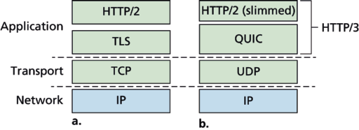

Figure 2.11 a. traditional secure HTTP protocol stack; b. secure QUIC-based HTTP 3 protocol stack

HTTP 1.1 and HTTP 2 Web transactions today employ TLS running on top of TCP (with TLS running in a sub-layer of the application layer, as described in the sidebar). But this “TLS on top of TCP” design (commonly known as https) requires two handshake phases: one phase for setting up the TCP connection and a subsequent phase for sharing encryption keys between client and server.

This can introduce undesirable delays for interactive HTTP applications, including Web browsing. One of the most important features of QUIC is that it gets rid of this double-handshake by absorbing the TLS handshake phase into the initial connection setup handshake—and hence the word “Quick” in “Quick Internet UDP Connections”.

More specifically, QUIC integrates a recent version of TLS, called TLS 1.3, directly into the QUIC protocol, eliminating the need for a separate TLS handshake. In this manner, QUIC performs both the connection setup and encryption setup in one round trip, reducing latency. Furthermore, on reconnecting, QUIC can use the previously stored session and encryption parameters, allowing 0-RTT data transmission without waiting for a full handshake, further reducing connection setup time.

In addition to reducing connection set-up time, QUIC also re-examines the HOL blocking problem, introduced in Section 2.2.6. Recall that HTTP 2 addresses the HOL blocking problem for the situation of when one big Web object gets in front of other smaller objects, all of which are being sent over a single TCP connection. HTTP 2 solves this problem by breaking up HTTP messages into small frames, and multiplexes the frames from different HTTP messages over the single TCP connection. But, as it turns out, HTTP 2 doesn’t fully resolve the HOL blocking problem. In HTTP 2, multiple messages are multiplexed over a single TCP connection. If a packet is lost in this connection, TCP requires that the lost packet be retransmitted and processed before other packets can be delivered. This delays all the other messages, even if they don’t depend on the lost packet. This phenomenon results in another form of HOL blocking, where one lost packet for one HTTP message blocks the transmission of the other HTTP messages. This problem is particularly severe in wireless environments, where packet loss rates can be high.

QUIC solves this by using UDP instead of TCP, and then applying reliable data-transfer to each message separately within the same QUIC connection.

QUIC uses the terminology “streams” for the different data streams (different HTTP messages in an HTTP context) sharing the same QUIC connection. Specifically, QUIC not only breaks up streams into small frames and multiplexes the frames, but also manages each stream independently within a single QUIC connection, which means if a packet from one stream is lost, only that stream is affected. The other streams can continue to send and receive data without waiting for the lost packet to be retransmitted, eliminating the HOL blocking problem that plagues single-connection TCP. The inner workings of QUIC are discussed in greater detail in Section 3.7.

QUIC Services Suppose you want to develop a new networking application. Should you run your application over UDP, TCP or QUIC? To make this decision, you will want to know what services each of these protocols would provide to your application. We have already discussed the services that UDP and TCP provide in Section 2.1.4. Let’s now summarize QUIC’s services so that you will have all the facts at your disposal before making this crucial decision.

From the application developer’s perspective, QUIC services are more similar to those of TCP than to those of UDP.

• Like TCP, QUIC is connection-oriented. Before sending data, a QUIC connection is created between client and server. This connection is established on top of the bare-bones connectionless protocol UDP.

• Like TCP, QUIC provides reliable data transfer, so that the application knows that every message one side sends will eventually arrive at the other side.

• Like TCP, QUIC provides congestion and flow control services.

But QUIC offers additional services that go well beyond the services provided by TCP, services which are highly desirable for applications in the modern Internet:

• Built-in Encryption: QUIC integrates TLS 1.3 (which we will learn about in Chapter 8) directly into its protocol, providing encrypted communication by default. This eliminates the need for separate handshakes for TLS over TCP, making secure connections faster and more efficient.

• Independent Data Streams: QUIC allows multiple streams (for example, multiple HTTP messages) to be sent simultaneously over a single QUIC connection. These streams are independent, so packet loss in one stream doesn’t affect others, unlike in TCP, where losses in one stream can delay all streams. Further, each stream can be managed individually, allowing applications to prioritize different types of data, such as video, text, or control messages, ensuring a smoother user experience.

• 0 RTT - Handshakes: For returning clients, QUIC supports 0-RTT handshakes, allowing data to be sent immediately without waiting for a full connection handshake. This speeds up reconnecting to services, benefiting latency-sensitive applications like Web surfing and gaming.

• Connection Migration: QUIC supports connection migration, allowing connections to remain active if the client’s IP address changes (e.g., switching from Wi-Fi to cellular).

This improves reliability for mobile users where network conditions change frequently.

HTTP 3: Running the Web over QUIC HTTP 3, the latest version of HTTP, is designed to address several limitations in previous versions, particularly in terms of performance, security, and reliability over modern networks. Unlike previous versions, HTTP 3 operates over the QUIC protocol, which provides all the QUIC services just described.

Since its release, HTTP 3 has seen growing adoption. Major browsers like Chrome, Firefox, Edge, and Safari now support HTTP 3 and have adopted it as their default HTTP protocol when connecting to HTTP 3-compatible servers. Leading Internet companies such as Google have also implemented

HTTP 3 to improve user experience across many of their services including search, video distribution, and video conferencing.

HTTP 3 does not change the message formats of early HTTP protocols.

It’s only major change as compared with HTTP 2 is that instead of using a persistent TCP connection between client and server to send the HTTP messages, it uses a persistent QUIC connection. We will describe in greater detail how HTTP messages are sent and received over QUIC connections in Section 2.6.3.

In summary, HTTP 3 clients and servers use QUIC’s features—such as fast connection establishment, encryption, multiplexing independent streams, prioritization, and connection migration—to efficiently and securely deliver multiple objects of a Web page in parallel while reducing latency and ensuring smooth, uninterrupted transmission.

#### 2.3 Electronic Mail in the Internet

Electronic mail has been around since the beginning of the Internet. It was the most popular application when the Internet was in its infancy [Segaller 1998], and has become more elaborate and powerful over the years. It remains one of the Internet’s most important and utilized applications.

In this section, we examine the application-layer protocols that are at the heart of Internet e-mail. But before we jump into an in-depth discussion of these protocols, let’s take a high-level view of the Internet mail system and its key components.

Figure 2.12 presents a high-level view of the Internet mail system. We see from this diagram that it has three major components: user agents, mail servers, and the Simple Mail Transfer Protocol (SMTP). We now describe each of these components in the context of a sender, Alice, sending an e-mail message to a recipient, Bob. User agents allow users to read, reply to, forward, save, and compose messages. Examples of user agents for e-mail include Microsoft Outlook, Apple Mail, Web-based Gmail, the Gmail App running in a smartphone, and so on. Today, many users send emails to their mail servers and receive emails from their mail servers via HTTP-based user agents such as gmail and Yahoo! mail. When Alice is finished composing her message, her user agent sends the message to her mail server, where the message is placed in the mail server’s outgoing message queue. When Bob wants to read a message, his user agent retrieves the message from his mailbox in his mail server.

Mail servers form the core of the e-mail infrastructure. Each recipient, such as Bob, has a mailbox located in one of the mail servers. Bob’s mailbox manages and maintains the messages that have been sent to him. A typical message starts its journey in the sender’s user agent, then travels to the sender’s mail server, and then travels to the recipient’s mail server, where it is deposited in the recipient’s mailbox. When Bob wants to access the messages in his mailbox, the mail server containing his mailbox authenticates Bob (with his username and password). Alice’s mail server must also deal with failures in Bob’s mail server. If Alice’s server cannot deliver mail to Bob’s server, Alice’s the sender (Alice) with an e-mail message. SMTP is the principal application-layer protocol for Internet electronic mail. It uses the reliable data transfer service of TCP to transfer mail from the sender’s mail server to the recipient’s mail server. As with most application-layer protocols, SMTP has two sides: a client side, which executes on the sender’s mail server, and a server side, which executes on the recipient’s mail server. Both the client and server sides of SMTP run on every mail server. When a mail server sends mail to other mail servers, it acts as an SMTP client. When a mail server receives mail from other mail servers, it acts as an SMTP server.

Figure 2.12 A high-level view of the Internet e-mail system server holds the message in a message queue and attempts to transfer the message later. Reattempts are often done every 30 minutes or so; if there is no success after several days, the server removes the message and notifies

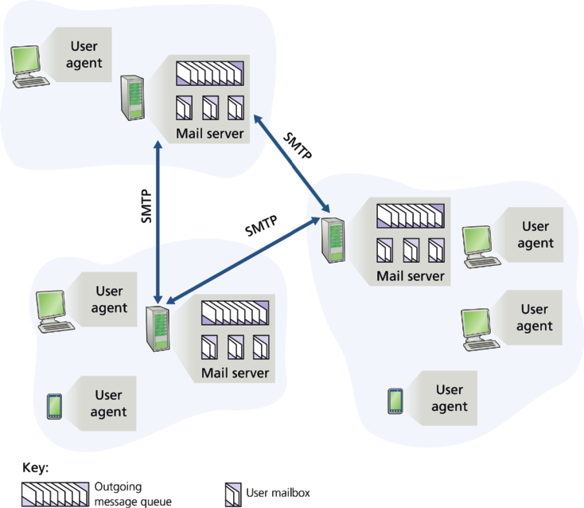

##### 2.3.1 SMTP

SMTP, defined in RFC 5321, is at the heart of Internet electronic mail. As mentioned above, SMTP transfers messages from senders’ mail servers to the recipients’ mail servers. SMTP is much older than HTTP. (The original SMTP

RFC dates back to 1982, and SMTP was around long before that.) Although SMTP has numerous wonderful qualities, as evidenced by its ubiquity in the Internet, it is nevertheless a legacy technology that possesses certain archaic characteristics. For example, it restricts the body (not just the headers) of all mail messages to simple 7-bit ASCII.

This restriction made sense in the early 1980s when transmission capacity was scarce and no one was e-mailing large attachments or large image, audio, or video files. But today, in the multimedia era, the 7-bit ASCII restriction is a bit of a pain—it requires binary multimedia data to be encoded to ASCII before being sent over SMTP; and it requires the corresponding ASCII message to be decoded back to binary after SMTP transport. Recall from Section 2.2 that HTTP does not require multimedia data to be ASCII encoded before transfer.

To illustrate the basic operation of SMTP, let’s walk through a common scenario. Suppose Alice wants to send Bob a simple ASCII message.

1.  Alice invokes her user agent for e-mail, provides Bob’s e-mail address (for bob@someschool.edu example, ), composes a message, and instructs

the user agent to send the message.

2.  Alice’s user agent sends the message to her mail server, where it is placed in a message queue.

3.  The client side of SMTP, running on Alice’s mail server, sees the message in the message queue. It opens a TCP connection to an SMTP server, running on Bob’s mail server.

4.  After some initial SMTP handshaking, the SMTP client sends Alice’s message into the TCP connection.

5.  At Bob’s mail server, the server side of SMTP receives the message. Bob’s mail server then places the message in Bob’s mailbox.

6.  Bob invokes his user agent to read the message at his convenience.

The scenario is summarized in Figure 2.13.

It is important to observe that SMTP does not normally use intermediate mail servers for sending mail, even when the two mail servers are located at opposite ends of the world. If Alice’s server is in Hong Kong and Bob’s server is in St. Louis, the TCP connection is a direct connection between the Hong Figure 2.13 Alice sends a message to Bob

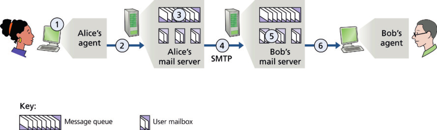

Kong and St. Louis servers. In particular, if Bob’s mail server is down, the message remains in Alice’s mail server and waits for a new attempt—the message does not get placed in some intermediate mail server.

Let’s now take a closer look at how SMTP transfers a message from a sending mail server to a receiving mail server. We will see that the SMTP protocol has many similarities with protocols that are used for face-to-face human interaction. First, the client SMTP (running on the sending mail server host) has TCP establish a connection to port 25 at the server SMTP (running on the receiving mail server host). If the server is down, the client tries again later. Once this connection is established, the server and client perform some application-layer handshaking—just as humans often introduce themselves before transferring information from one to another, SMTP clients and servers introduce themselves before transferring information.

During this SMTP handshaking phase, the SMTP client indicates the e-mail address of the sender (the person who generated the message) and the e-mail address of the recipient. Once the SMTP client and server have introduced themselves to each other, the client sends the message. SMTP can count on the reliable data transfer service of TCP to get the message to the server without errors. The client then repeats this process over the same TCP connection if it has other messages to send to the server; otherwise, it instructs TCP to close the connection.

Let’s next take a look at an example transcript of messages exchanged between an SMTP client (C) and an SMTP server (S). The hostname of the clicrepes.fr hamburger.edu ent is and the hostname of the server is . The

C ASCII text lines prefaced with : are exactly the lines the client sends into its

S TCP socket, and the ASCII text lines prefaced with : are exactly the lines the

server sends into its TCP socket. The following transcript begins as soon as the TCP connection is established.

S: 220 hamburger.edu C: HELO crepes.fr S: 250 Hello crepes.fr, pleased to meet you C: MAIL FROM: <alice@crepes.fr> S: 250 alice@crepes.fr ... Sender ok C: RCPT TO: <bob@hamburger.edu> S: 250 bob@hamburger.edu ... Recipient ok

C: DATA S: 354 Enter mail, end with ”.” on a line by itself C: Do you like ketchup?

C: How about pickles?

C: .

S: 250 Message accepted for delivery

C: QUIT S: 221 hamburger.edu closing connection

Do you like In the example above, the client sends a message (“ ketchup? How about pickles? crepes.fr ”) from mail server to mail

hamburger.edu server . As part of the dialogue, the client issued five com-

HELO MAIL FROM RCPT TO DATA mands: (an abbreviation for HELLO), , , , and

QUIT . These commands are self-explanatory. The client also sends a line consisting of a single period, which indicates the end of the message to the server.

CRLF.CRLF CR LF (In ASCII jargon, each message ends with , where and stand

for carriage return and line feed, respectively.) The server issues replies to each command, with each reply having a reply code and some (optional) Englishlanguage explanation. We mention here that SMTP uses persistent connections:

If the sending mail server has several messages to send to the same receiving mail server, it can send all of the messages over the same TCP connection. For

MAIL FROM crepes. each message, the client begins the process with a new :

fr QUIT , designates the end of message with an isolated period, and issues only after all messages have been sent.

It is highly recommended that you use Telnet to carry out a direct dialogue with an SMTP server. To do this, issue telnet serverName 25 serverName where is the name of a local mail server. When you do this, you

are simply establishing a TCP connection between your local host and the mail

220 server. After typing this line, you should immediately receive the reply

HELO MAIL FROM RCPT from the server. Then issue the SMTP commands , ,

TO DATA CRLF.CRLF QUIT , , , and at the appropriate times. It is also highly rec-

ommended that you do Programming Assignment 3 at the end of this chapter.

In that assignment, you’ll build a simple user agent that implements the client side of SMTP. It will allow you to send an e-mail message to an arbitrary recipient via a local mail server.

##### 2.3.2 Mail Message Formats

When Alice writes an ordinary snail-mail letter to Bob, she may include all kinds of peripheral header information at the top of the letter, such as Bob’s address, her own return address, and the date. Similarly, when an e-mail message is sent from one person to another, a header containing peripheral information precedes the body of the message itself. This peripheral information is contained in a series of header lines, which are defined in RFC 5322. The header lines and the

CRLF body of the message are separated by a blank line (that is, by ). RFC 5322

specifies the exact format for mail header lines as well as their semantic interpretations. As with HTTP, each header line contains readable text, consisting of a keyword followed by a colon followed by a value. Some of the keywords are

From required and others are optional. Every header must have a : header line

To Subject and a : header line; a header may include a : header line as well as

other optional header lines. It is important to note that these header lines are different from the SMTP commands we studied in Section 2.3.1 (even though they contain some common words such as “from” and “to”). The commands in that section were part of the SMTP handshaking protocol; the header lines examined in this section are part of the mail message itself.

A typical message header looks like this:

From: alice@crepes.fr To: bob@hamburger.edu Subject: Searching for the meaning of life.

After the message header, a blank line follows; then the message body (in ASCII) follows.

##### 2.3.3 Mail Access Protocols

Once SMTP delivers the message from Alice’s mail server to Bob’s mail server, the message is placed in Bob’s mailbox. Given that Bob (the recipient) executes his user agent on his local host (e.g., smartphone or PC), it is natural to consider placing a mail server on his local host as well.

With this approach, Alice’s mail server would dialogue directly with Bob’s PC. There is a problem with this approach, however. Recall that a mail server manages mailboxes and runs the client and server sides of SMTP. If Bob’s mail server were to reside on his local host, then Bob’s host would have to remain always on, and connected to the Internet, in order to receive new mail, which can arrive at any time. This is impractical for many Internet users. Instead, a typical user runs a user agent on the local host but accesses its mailbox stored on an always-on shared mail server. This mail server is shared with other users.

Now let’s consider the path an e-mail message takes when it is sent from Alice to Bob. We just learned that at some point along the path the e-mail message needs to be deposited in Bob’s mail server. This could be done simply by having Alice’s user agent send the message directly to Bob’s mail server. However, typically the sender’s user agent does not dialogue directly with the recipient’s mail server. Instead, as shown in Figure 2.14, Alice’s user agent uses SMTP or HTTP to deliver the e-mail message into her mail server, then Alice’s mail server uses SMTP (as an SMTP client) to relay the e-mail message to Bob’s mail server. Why the two-step procedure? Primarily because without relaying through Alice’s mail server, Alice’s user agent doesn’t have any recourse to an unreachable destination mail server. By having Alice first deposit the e-mail in her own mail server, Alice’s mail server can repeatedly try to send the message to Bob’s mail server, say every 30  minutes, until Bob’s mail server becomes operational. (And if Alice’s mail server is down, then she has the recourse of complaining to her system administrator!) But there is still one missing piece to the puzzle! How does a recipient like Bob, running a user agent on his local host, obtain his messages, which are sitting in a mail server? Note that Bob’s user agent can’t use SMTP to obtain the messages because obtaining the messages is a pull operation, whereas SMTP is a push protocol.

Figure 2.14 E-mail protocols and their communicating entities

Today, there are two common ways for Bob to retrieve his e-mail from a mail server. If Bob is using Web-based e-mail or a smartphone app (such as Gmail), then the user agent will use HTTP to retrieve Bob’s e-mail.

This case requires Bob’s mail server to have an HTTP interface as well as an SMTP interface (to communicate with Alice’s mail server). The alternative method, typically used with mail clients such as Microsoft Outlook, is to use the Internet Mail Access Protocol (IMAP) defined in RFC 3501. Both the HTTP and IMAP approaches allow Bob to manage folders, maintained in Bob’s mail server. Bob can move messages into the folders he creates, delete messages, mark messages as important, and so on.

#### 2.4 DNS: The Internet’s Directory Service

We human beings can be identified in many ways. For example, we can be identified by the names that appear on our birth certificates. We can be identified by our social security numbers. We can be identified by our driver’s license numbers. Although each can be used to identify people, within a given context one identifier may be more appropriate than another. For example, the computers at the IRS (the infamous tax-collecting agency in the United States) prefer to use fixed-length social security numbers rather than birth certificate names. On the other hand, ordinary people prefer the more mnemonic birth certificate names rather than social security numbers. (Indeed, can you imagine saying, “Hi. My name is 132-67-9875. Please meet my husband, 178-87-1146.”) Just as humans can be identified in many ways, so too can Internet hosts.

www.face- One identifier for a host is its hostname. Hostnames—such as book.com www.google.com gaia.cs.umass.edu , , —are mnemonic and

are therefore appreciated by humans. However, hostnames provide little, if any, information about the location within the Internet of the host. (A host-

www.eurecom.fr .fr name such as , which ends with the country code , tells

us that the host is probably in France, but doesn’t say much more.) Furthermore, because hostnames can consist of variable-length alphanumeric characters, they would be difficult to process by routers. For these reasons, hosts are also identified by so-called IP addresses.

We discuss IP addresses in some detail in Chapter 4, but it is useful to say a few brief words about them now. An IP address consists of four bytes and 121.7.106.83 has a rigid hierarchical structure. An IP address looks like ,

where each period separates one of the bytes expressed in decimal notation from 0 to 255. An IP address is hierarchical because as we scan the address from left to right, we obtain more and more specific information about where the host is located in the Internet (that is, within which network, in the network of networks). Similarly, when we scan a postal address from bottom to top, we obtain more and more specific information about where the addressee is located.

##### 2.4.1 Services Provided by DNS

We have just seen that there are two ways to identify a host—by a hostname and by an IP address. People prefer the more mnemonic hostname identifier, while routers prefer fixed-length, hierarchically structured IP addresses. In order to reconcile these preferences, we need a directory service that translates hostnames to IP addresses. This is the main task of the Internet’s domain name system (DNS). The DNS is (1) a distributed database implemented in a hierarchy of DNS servers, and (2) an application-layer protocol that allows hosts to query the distributed database. The DNS servers are often UNIX machines running the Berkeley Internet Name Domain (BIND) software [BIND 2025].

The DNS protocol runs over UDP and uses port 53.

DNS is commonly employed by other application-layer protocols, including HTTP and SMTP, to translate user-supplied hostnames to IP addresses. As an example, consider what happens when a browser (that is, an HTTP client),

www.someschool.edu/ running on some user’s host, requests the URL index.html . In order for the user’s host to be able to send an HTTP request

www.someschool.edu message to the Web server , the user’s host must first

www.someschool.edu obtain the IP address of . This is done as follows.

1.  The same user machine runs the client side of the DNS application.

www.someschool.edu 2.  The browser extracts the hostname, , from the

URL and passes the hostname to the client side of the DNS application.

3.  The DNS client sends a query containing the hostname to a DNS server.

4.  The DNS client eventually receives a reply, which includes the IP address for the hostname.

5.  Once the browser receives the IP address from DNS, it can initiate a TCP connection to the HTTP server process located at port 80 at that IP address.

We see from this example that DNS adds an additional delay—sometimes substantial—to the Internet applications that use it. Fortunately, as we discuss below, the desired IP address is often cached in a “nearby” DNS server, which helps to reduce DNS network traffic as well as the average DNS delay.

DNS provides a few other important services in addition to translating hostnames to IP addresses:

• Host aliasing. A host with a complicated hostname can have one or more

relay1.west-coast. alias names. For example, a hostname such as enterprise.com enterprise.com could have, say, two aliases such as

www.enterprise.com relay1.westand . In this case, the hostname

coast.enterprise.com is said to be a canonical hostname. Alias host-

names, when present, are typically more mnemonic than canonical hostnames. DNS can be invoked by an application to obtain the canonical hostname for a supplied alias hostname as well as the IP address of the host.

• Mail server aliasing. For obvious reasons, it is highly desirable that e-mail addresses be mnemonic. For example, if Bob has an account with Yahoo

bob@yahoo.com Mail, Bob’s e-mail address might be as simple as . How-

ever, the hostname of the Yahoo mail server is more complicated and yahoo.com much less mnemonic than simply (for example, the canonical relay1.west-coast.yahoo.com hostname might be something like ).

DNS can be invoked by a mail application to obtain the canonical hostname for a supplied alias hostname as well as the IP address of the host. In fact, the MX record (see below) permits a company’s mail server and Web server to have identical (aliased) hostnames; for example, a company’s

enterprise.com Web server and mail server can both be called .

• Load distribution. DNS is also used to perform load distribution among replicated servers, such as replicated Web servers. Busy sites, such as cnn.com , are replicated over multiple servers, with each server running on a different end system and each having a different IP address. For replicated Web servers, a set of IP addresses is thus associated with one alias hostname. The DNS database contains this set of IP addresses. When clients make a DNS query for a name mapped to a set of addresses, the server responds with the entire set of IP addresses, but rotates the ordering of the addresses within each reply. Because a client typically sends its HTTP request message to the IP address that is listed first in the set, DNS rotation distributes the traffic among the replicated servers. DNS rotation is also used for e-mail so that multiple mail servers can have the same alias name. Also, content distribution companies such as Akamai have used DNS in more sophisticated ways [Nygren 2010] to provide Web content distribution (see Section 2.5.3).

Principles in Practice DNS: Critical Network Functions Via the Client-Server Paradigm Like HTTP and SMTP, the DNS protocol is an application-layer protocol since it (1) runs between communicating end systems using the client-server paradigm and (2) relies on an underlying end-to-end transport protocol to transfer DNS messages between communicating end systems. In another sense, however, the role of the DNS is quite different from Web, file transfer, and e-mail applications. Unlike these applications, the DNS is not an application with which a user directly interacts.

Instead, the DNS provides a core Internet function—namely, translating hostnames to their underlying IP addresses, for user applications and other software in the Internet. We noted in Section 1.2 that much of the complexity in the Internet architecture is located at the “edges” of the network. The DNS, which implements the critical name-to-address translation process using clients and servers located at the edge of the network, is yet another example of that design philosophy.

The DNS is specified in RFC 1034 and RFC 1035, and updated in several additional RFCs. It is a complex system, and we only touch upon key aspects of its operation here. The interested reader is referred to these RFCs, the book [Albitz 1993], and a recent description of Akamai’s DNS service [Schomp 2020]. See also the retrospectives [Mockapetris 1988; Mockapetris 2005] that also provide a nice description of the what and why of DNS.

##### 2.4.2 Overview of How DNS Works

We now present a high-level overview of how DNS works. Our discussion will focus on the hostname-to-IP-address translation service.

Suppose that some application (such as a Web browser or a mail client) running in a user’s host needs to translate a hostname to an IP address. The application will invoke the client side of DNS, specifying the hostname that

gethostbyname needs to be translated. (On many UNIX-based machines, is the function call that an application calls in order to perform the translation.) DNS in the user’s host then takes over, sending a query message into the network. All DNS query and reply messages are sent within UDP datagrams to port 53.

After a delay, ranging from milliseconds to seconds, DNS in the user’s host receives a DNS reply message that provides the desired mapping. This mapping is then passed to the invoking application. Thus, from the perspective of the invoking application in the user’s host, DNS is a black box providing a simple, straightforward translation service. But in fact, the black box that implements the service is complex, consisting of a large number of DNS servers distributed around the globe, as well as an application-layer protocol that specifies how the DNS servers and querying hosts communicate.

A simple design for DNS would have one DNS server that contains all the mappings. In this centralized design, clients simply direct all queries to the single DNS server, and the DNS server responds directly to the querying clients.

Although the simplicity of this design is attractive, it is inappropriate for today’s Internet, with its vast (and growing) number of hosts. The problems with a centralized design include:

• A single point of failure. If the DNS server crashes, so does the entire Internet!

• Traffic volume. A single DNS server would have to handle all DNS queries (for all the HTTP requests and e-mail messages generated from hundreds of millions of hosts).

• Distant centralized database. A single DNS server cannot be “close to” all the querying clients. If we put the single DNS server in New York City, then all queries from Australia must travel to the other side of the globe, perhaps over slow and congested links. This can lead to significant delays.

• Maintenance. The single DNS server would have to keep records for all Internet hosts. Not only would this centralized database be huge, but it would have to be updated frequently to account for every new host.

In summary, a centralized database in a single DNS server simply doesn’t scale. Consequently, the DNS is distributed by design. In fact, the DNS is a wonderful example of how a distributed database can be implemented in the Internet.

A Distributed, Hierarchical Database In order to deal with the issue of scale, the DNS uses a large number of servers, organized in a hierarchical fashion and distributed around the world.

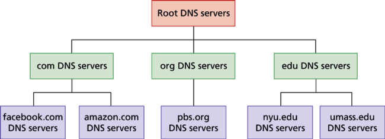

Figure 2.15 Portion of the hierarchy of DNS servers

No single DNS server has all of the mappings for all of the hosts in the Internet.

Instead, the mappings are distributed across the DNS servers. To a first approximation, there are three classes of DNS servers—root DNS servers, top-level domain (TLD) DNS servers, and authoritative DNS servers—organized in a hierarchy as shown in Figure 2.15. To understand how these three classes of servers interact, suppose a DNS client wants to determine the IP address for

www.amazon.com the hostname . To a first approximation, the following

events will take place. The client first contacts one of the root servers, which

com returns IP addresses for TLD servers for the top-level domain . The client

then contacts one of these TLD servers, which returns the IP address of

amazon.com an authoritative server for . Finally, the client contacts one of the

amazon.com authoritative servers for , which returns the IP address for

www.amazon.com the hostname . We’ll soon examine this DNS lookup pro-

cess in more detail. But let’s first take a closer look at these three classes of DNS servers:

• Root DNS servers. There are nearly 2000 root servers instances scattered all over the world, as shown in Figure 2.16, serving tens of billions of DNS queries per day. These root servers are copies of 13 different root servers, Figure 2.16 Number of root servers and locations (2024)

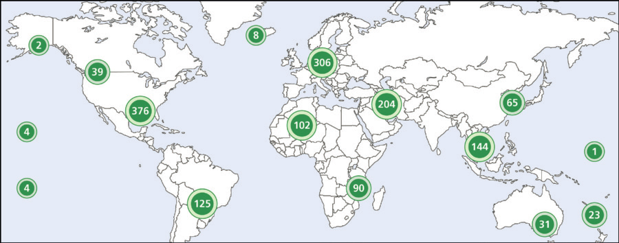

managed by 12 different organizations, and coordinated through the Internet Assigned Numbers Authority [IANA 2025]. The full list of root name servers, along with the organizations that manage them and their IP addresses can be found at [Root Servers 2025]. Root name servers provide the IP addresses of the TLD servers.

• Top-level domain (TLD) servers. For each of the top-level domains— top-level domains such as com, org, net, edu, and gov, and all of the country top-level domains such as uk, fr, ca, and jp—there is TLD server (or server cluster). The company Verisign Global Registry Services maintains

com the TLD servers for the top-level domain, and the company Educause edu maintains the TLD servers for the top-level domain. The network

infrastructure supporting a TLD can be large and complex; see [Osterweil 2012] for a nice overview of the Verisign network. See [TLD list 2025] for a list of all top-level domains. TLD servers provide the IP addresses for authoritative DNS servers.

• Authoritative DNS servers. Every organization with publicly accessible hosts (such as Web servers and mail servers) on the Internet must provide publicly accessible DNS records that map the names of those hosts to IP addresses. An organization’s authoritative DNS server houses these DNS records. An organization can choose to implement its own authoritative DNS server to hold these records; alternatively, the organization can pay to have these records stored in an authoritative DNS server of some service provider. Most universities and large companies implement and maintain their own primary and secondary (backup) authoritative DNS server.

The root, TLD, and authoritative DNS servers all belong to the hierarchy of DNS servers, as shown in Figure 2.15.There is another important type of DNS server called the local DNS server.A local DNS server does not strictly belong to the hierarchy of servers but is nevertheless central to the DNS architecture. Each ISP—such as a residential ISP or an institutional ISP—has a local DNS server (also called a default name server).

When a host connects to an ISP, the ISP provides the host with the IP addresses of one or more of its local DNS servers (typically through DHCP, which is discussed in Chapter 4). Rather than using your ISPs or institution’s local DNS server, you can also configure your device to receive its local DNS service from a commercial provider such as Google (at IP address 8.8.8.8). You can easily determine the IP address of your local DNS server by accessing network status windows in Windows or UNIX. A host’s local DNS server is typically “close to” the host. For an institutional ISP, the local DNS server may be on the same LAN as the host; for a residential ISP, it is typically separated from the host by no more than a few routers. When a host makes a DNS query, the query is sent to the local DNS server, which acts a proxy, forwarding the query into the DNS server hierarchy, as we’ll discuss in more detail below.

cse.nyu.edu Let’s take a look at a simple example. Suppose the host

gaia.cs.umass.edu desires the IP address of . Also suppose that NYU’s local

cse.nyu.edu dns.nyu.edu DNS server for is called and that an authorita-

gaia.cs.umass.edu dns.umass.edu tive DNS server for is called . As dns.nyu.edu to its local DNS server, . The query message contains the hostgaia.cs.umass.edu name to be translated, namely, . The local DNS server

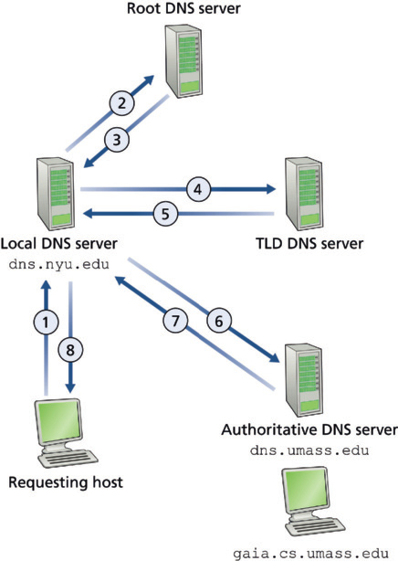

Figure 2.17 Interaction of the various DNS servers

cse.nyu.edu shown in Figure 2.17, the host first sends a DNS query message

forwards the query message to a root DNS server. The root DNS server takes note of the edu suffix and returns to the local DNS server a list of IP addresses

edu for TLD servers responsible for . The local DNS server then resends the

query message to one of these TLD servers. The TLD server takes note of the umass.edu suffix and responds with the IP address of the authoritative DNS

dns.umass.edu server for the University of Massachusetts, namely, . Finally, dns.umass.edu the local DNS server resends the query message directly to ,

gaia.cs.umass.edu which responds with the IP address of . Note that in this

example, in order to obtain the mapping for one hostname, eight DNS messages were sent: four query messages and four reply messages! We’ll soon see how DNS caching reduces this query traffic.

Our previous example assumed that the TLD server knows the authoritative DNS server for the hostname. In general, this is not always true. Instead, the TLD server may know only of an intermediate DNS server, which in turn knows the authoritative DNS server for the hostname. For example, suppose again that the University of Massachusetts has a DNS server for the university, dns.umass.edu called . Also suppose that each of the departments at the Uni-

versity of Massachusetts has its own DNS server, and that each departmental DNS server is authoritative for all hosts in the department. In this case, when

dns.umass.edu the intermediate DNS server, , receives a query for a host

cs.umass.edu dns.nyu.edu with a hostname ending with , it returns to the

dns.cs.umass.edu IP address of , which is authoritative for all hostnames

cs.umass.edu dns.nyu.edu ending with . The local DNS server then sends

the query to the authoritative DNS server, which returns the desired mapping to the local DNS server, which in turn returns the mapping to the requesting host. In this case, a total of 10 DNS messages are sent!

The example shown in Figure 2.17 makes use of both recursive queries

cse.nyu.edu dns.nyu.edu and iterative queries. The query sent from to is

dns.nyu.edu a recursive query, since the query asks to obtain the mapping

on its behalf. However, the subsequent three queries are iterative since all of

dns.nyu.edu the replies are directly returned to . In theory, any DNS query

can be iterative or recursive. For example, Figure 2.18 shows a DNS query chain for which all of the queries are recursive. In practice, the queries typically follow the pattern in Figure 2.17: The query from the requesting host to the local DNS server is recursive, and the remaining queries are iterative.

DNS Caching Our discussion thus far has ignored DNS caching, a critically important feature of the DNS system. In truth, DNS extensively exploits DNS caching in

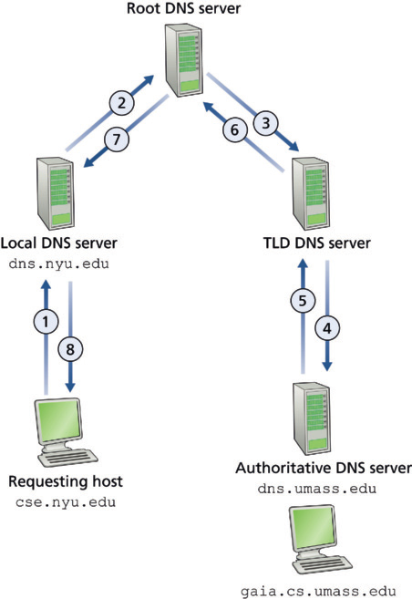

Figure 2.18 Recursive queries in DNS

order to improve the delay performance and to reduce the number of DNS messages ricocheting around the Internet. The idea behind DNS caching is very simple. In a query chain, when a DNS server receives a DNS reply (containing, for example, a mapping from a hostname to an IP address), it can cache the mapping in its local memory. For example, in Figure 2.17, each time

dns.nyu.edu the local DNS server receives a reply from some DNS server, it

can cache any of the information contained in the reply. If a hostname/IP address pair is cached in a DNS server and another query arrives to the DNS server for the same hostname, the DNS server can provide the desired IP address, even if it is not authoritative for the hostname. Because hosts and mappings between hostnames and IP addresses are by no means permanent, DNS servers discard cached information after a period of time (often set to two days).

apricot.nyu.edu As an example, suppose that a host queries

dns.nyu.edu cnn.com for the IP address for the hostname . Furthermore, kiwi.nyu.edu suppose that a few hours later, another NYU host, say, , also

dns.nyu.edu queries with the same hostname. Because of caching, the local

cnn.com DNS server will be able to immediately return the IP address of to

this second requesting host without having to query any other DNS servers. A local DNS server can also cache the IP addresses of TLD servers, thereby allowing the local DNS server to bypass the root DNS servers in a query chain. In fact, because of caching, root servers are bypassed for all but a very small fraction of DNS queries.

##### 2.4.3 DNS Records and Messages

The DNS servers that together implement the DNS distributed database store resource records (RRs), including RRs that provide hostname-to-IP address mappings. Each DNS reply message carries one or more resource records.

In this and the following subsection, we provide a brief overview of DNS resource records and messages; more details can be found in [Albitz 1993] or in the DNS RFCs [RFC 1034; RFC 1035].

A resource record is a four-tuple that contains the following fields:

(Name, Value, Type, TTL) TTL is the time to live of the resource record; it determines when a resource should be removed from a cache.

In the example records given below, we TTL Name Value Type ignore the field. The meaning of and depend on :

Type=A Name Value • If , then is a hostname and is the IP address for the

hostname. Thus, a Type A record provides the standard hostname-to-IP

( r e l a y 1 . b a r . f o o . c o m address mapping. As an example, , 145.37.93.126 A) , is a Type A record.

Type=NS Name foo.com Value • If , then is a domain (such as ) and is the

hostname of an authoritative DNS server that knows how to obtain the IP addresses for hosts in the domain. This record is used to route DNS que-

(foo.com ries further along in the query chain. As an example, ,

dns.foo.com NS) , is a Type NS record.

Type=CNAME Value • If , then is a canonical hostname for the alias host-

Name name . This record can provide querying hosts the canonical name

(foo.com relay1.bar.foo.com for a hostname. As an example, , ,

CNAME) is a CNAME record.

Type=MX Value • If , then is the canonical name of a mail server that has Name (foo.com mail.bar.foo.an alias hostname .

As an example, ,

com MX) , is an MX record. MX records allow the hostnames of mail servers to have simple aliases. Note that by using the MX record, a company can have the same aliased name for its mail server and for one of its other servers (such as its Web server). To obtain the canonical name for the mail server, a DNS client would query for an MX record; to obtain the canonical name for the other server, the DNS client would query for the CNAME record.

If a DNS server is authoritative for a particular hostname, then the DNS server will contain a Type A record for the hostname. (Even if the DNS server is not authoritative, it may contain a Type A record in its cache.) If a server is not authoritative for a hostname, then the server will contain a Type NS record for the domain that includes the hostname; it will also contain a Type A record that

Value provides the IP address of the DNS server in the field of the NS record.

As an example, suppose an edu TLD server is not authoritative for the host gaia.cs.umass.edu . Then this server will contain a record for a domain gaia.cs.umass.edu (umass.edu that includes the host , for example, ,

dns.umass.edu NS) , . The edu TLD server would also contain a Type A dns.umass.edu record, which maps the DNS server to an IP address, for

(dns.umass.edu 128.119.40.111 A) example, , , .

DNS Messages Earlier in this section, we referred to DNS query and reply messages. These are the only two kinds of DNS messages. Furthermore, both query and reply messages have the same format, as shown in Figure 2.19. The semantics of the various fields in a DNS message are as follows:

• The first 12 bytes is the header section, which has a number of fields. The first field is a 16-bit number that identifies the query. This identifier is copied into the reply message to a query, allowing the client to match received replies with sent queries. There are a number of flags in the flag field. A 1-bit query/reply flag indicates whether the message is a query (0) or a reply (1). A 1-bit authoritative flag is set in a reply message when a DNS server is an authoritative server for a queried name. A 1-bit recursiondesired flag is set when a client (host or DNS server) desires that the DNS server perform recursion when it doesn’t have the record. A 1-bit recursionavailable field is set in a reply if the DNS server supports recursion. In the header, there are also four number-of fields. These fields indicate the number of occurrences of the four types of data sections that follow the header.

• The question section contains information about the query that is being made. This section includes (1) a name field that contains the name that is being queried, and (2) a type field that indicates the type of question being asked about the name—for example, a host address associated with a name (Type A) or the mail server for a name (Type MX).

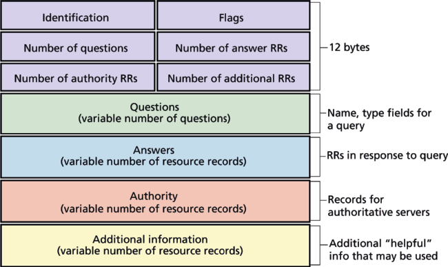

Figure 2.19 DNS message format

• In a reply from a DNS server, the answer section contains the resource records for the name that was originally queried. Recall that in each

Type resource record there is the (for example, A, NS, CNAME, and MX),

Value TTL the , and the . A reply can return multiple RRs in the answer,

since a hostname can have multiple IP addresses (for example, for replicated Web servers, as discussed earlier in this section).

• The authority section contains records of other authoritative servers.

• The additional section contains other helpful records. For example, the answer field in a reply to an MX query contains a resource record providing the canonical hostname of a mail server. The additional section contains a Type A record providing the IP address for the canonical hostname of the mail server.

How would you like to send a DNS query message directly from the host you’re working on to some DNS server? This can easily be done with the nslookup program, which is available from most Windows and UNIX platforms. For example, from a Windows host, open the Command Prompt and invoke the nslookup program by simply typing “nslookup.” After invoking nslookup, you can send a DNS query to any DNS server (root, TLD, or authoritative). After receiving the reply message from the DNS server, nslookup will display the records included in the reply (in a human-readable format). As an alternative to running nslookup from your own host, you can visit one of many Web sites that allow you to remotely employ nslookup. (Just type “nslookup” into a search engine and you’ll be brought to one of these sites.) The DNS Wireshark lab at the end of this chapter will allow you to explore the DNS in much more detail.

Inserting Records into the DNS Database The discussion above focused on how records are retrieved from the DNS database. You might be wondering how records get into the database in the first place. Let’s look at how this is done in the context of a specific example.

Suppose you have just created an exciting new startup company called Network Utopia. The first thing you’ll surely want to do is register the domain networkutopia.com name at a registrar. A registrar is a commercial entity

that verifies the uniqueness of the domain name, enters the domain name into the DNS database (as discussed below), and collects a small fee from you for its services. Prior to 1999, a single registrar, Network Solutions, had a monop-

com net org oly on domain name registration for , , and domains. But now

there are many registrars competing for customers, and the Internet Corporation for Assigned Names and Numbers (ICANN) accredits the various

http://www. registrars. A complete list of accredited registrars is available at internic.net . In 2024, measurements [Sommese 2024] indicate that approx-

imately 75 thousand new domain names are registered daily.

networkutopia.com When you register the domain name with some

registrar, you also need to provide the registrar with the names and IP addresses of your primary and secondary authoritative DNS servers. Suppose

dns1.networkutopia.com dns2.netthe names and IP addresses are ,

workutopia.com 212.2.212.1 212.212.212.2. , , and For each of these

two authoritative DNS servers, the registrar would then make sure that a Type NS and a Type A record are entered into the TLD com servers. Specifically, for

networkutopia.com the primary authoritative server for , the registrar

would insert the following two resource records into the DNS system:

(networkutopia.com, dns1.networkutopia.com, NS) (dns1.networkutopia.com, 212.212.212.1, A) Focus on Security DNS Vulnerabilities We have seen that DNS is a critical component of the Internet infrastructure, with many important services—including the Web and e-mail—simply incapable of functioning without it. We therefore naturally ask, how can DNS be attacked?

Is DNS a sitting duck, waiting to be knocked out of service, while taking most Internet applications down with it?

The first type of attack that comes to mind is a DDoS bandwidth-flooding attack (see Section 1.6) against DNS servers. For example, an attacker could attempt to send to each DNS root server a deluge of packets, so many that the majority of legitimate DNS queries never get answered. Such a large-scale DDoS attack against DNS root servers actually took place on October 21, 2002.

In this attack, the attackers leveraged a botnet to send truck loads of ICMP ping messages to each of the 13 DNS root IP addresses. (ICMP messages are discussed in Section 5.6.For now, it suffices to know that ICMP packets are special types of IP datagrams.) Fortunately, this large-scale attack caused minimal damage, having little or no impact on users’ Internet experience. The attackers did succeed at directing a deluge of packets at the root servers.

But many of the DNS root servers were protected by packet filters, configured to always block all ICMP ping messages directed at the root servers. These protected servers were thus spared and functioned as normal. Furthermore, most local DNS servers cache the IP addresses of top-level-domain servers, allowing the query process to often bypass the DNS root servers.

A potentially more effective DDoS attack against DNS is send a deluge of DNS queries to top-level-domain servers, for example, to top-level-domain servers that handle the .com domain. It is harder to filter DNS queries directed to DNS servers; and top-level-domain servers are not as easily bypassed as are root servers. Such an attack took place against the top-level-domain service provider Dyn on October 21, 2016. This DDoS attack was accomplished through a large number of DNS lookup requests from a botnet consisting of about one hundred thousand IoT devices such as printers, IP cameras, residential gateways and baby monitors that had been infected with Mirai malware. For almost a full day, Amazon, Twitter, Netflix, Github and Spotify were disturbed.

DNS could potentially be attacked in other ways. In a man-in-the-middle attack, the attacker intercepts queries from hosts and returns bogus replies. In the DNS poisoning attack, the attacker sends bogus replies to a DNS server, tricking the server into accepting bogus records into its cache. Either of these attacks could be used, for example, to redirect an unsuspecting Web user to the attacker’s Web site. The DNS Security Extensions (DNSSEC [Gieben 2004;

RFC 4033] have been designed and deployed to protect against such exploits.

DNSSEC, a secured version of DNS, addresses many of these possible attacks and is gaining popularity in the Internet.

You’ll also have to make sure that the Type A resource record for your Web www.networkutopia.com server and the Type MX resource record for your

mail.networkutopia.com mail server are entered into your authoritative

DNS servers. (Until recently, the contents of each DNS server were configured statically, for example, from a configuration file created by a system manager.

More recently, an UPDATE option has been added to the DNS protocol to allow data to be dynamically added or deleted from the database via DNS messages. [RFC 2136] and [RFC 3007] specify DNS dynamic updates.) Once all of these steps are completed, people will be able to visit your Web site and send e-mail to the employees at your company. Let’s conclude our discussion of DNS by verifying that this statement is true. This verification also helps to solidify what we have learned about DNS. Suppose Alice in Australia

www.networkutopia.com wants to view the Web page . As discussed earlier,

her host will first send a DNS query to her local DNS server. The local DNS

com server will then contact a TLD server. (The local DNS server will also have

com to contact a root DNS server if the address of a TLD server is not cached.)

This TLD server contains the Type NS and Type A resource records listed above, because the registrar had these resource records inserted into all of the TLD com servers. The TLD com server sends a reply to Alice’s local DNS

server, with the reply containing the two resource records. The local DNS 212.212.212.1 server then sends a DNS query to , asking for the Type A

www.networkutopia.com record corresponding to . This record provides the 212.212.71.4 IP address of the desired Web server, say, , which the local

DNS server passes back to Alice’s host. Alice’s browser can now initiate a TCP 212.212.71.4 connection to the host and send an HTTP request over the

connection. Whew! There’s a lot more going on than what meets the eye when one surfs the Web!

#### 2.5 Video Streaming and Content Distribution Networks

By many estimates, streaming video—including Netflix, YouTube, AppleTV, Amazon Prime, and so on—account for more than 65% of global Internet traffic [Sandvine 2024] and nearly 75% of mobile network traffic [Ericsson 2024].

This section we will provide an overview of how popular video streaming services are implemented in today’s Internet.

##### 2.5.1 Internet Video

In streaming stored video applications, the underlying medium is prerecorded video, such as a movie, a television show, a prerecorded sporting event, or a prerecorded user-generated video (such as those commonly seen on YouTube).

These prerecorded videos are placed on servers, and users send requests to the servers to view the videos on demand. Many Internet companies today provide streaming video, including, Netflix, YouTube (Google), Amazon, and TikTok.

But before launching into a discussion of video streaming, we should first get a quick feel for the video medium itself. A video is a sequence of images, typically being displayed at a constant rate, for example, at 24 or 30 images per second. An uncompressed, digitally encoded image consists of an array of pixels, with each pixel encoded into a number of bits to represent luminance and color. An important characteristic of video is that it can be compressed, thereby trading off video quality with bit rate. Today’s off-the-shelf compression algorithms can compress a video to essentially any bit rate desired. Of course, the higher the bit rate, the better the image quality and the better the overall user viewing experience.

From a networking perspective, perhaps the most salient characteristic of video is its high bit rate. Compressed Internet video typically ranges from 100 kbps for low-quality video to 25 Mbps for ultra high definition video.

This can translate to huge amount of traffic and storage, particularly for highend video. For example, a single 7 Mbps video with a duration of one hour will consume 3 gigabytes of storage and traffic. By far, the most important performance measure for streaming video is average end-to-end throughput. In order to provide continuous playout, the network must provide an average throughput to the streaming application that is at least as large as the bit rate of the compressed video.

We can also use compression to create multiple versions of the same video, each at a different quality level. For example, we can use compression to create, say, three versions of the same video, at rates of 300 kbps, 1 Mbps, and 3 Mbps. Users can then decide which version they want to watch as a function of their current available bandwidth. Users with high-speed Internet connections might choose the 3 Mbps version; users watching the video over 3G with a smartphone might choose the 300 kbps version.

##### 2.5.2 HTTP Streaming and DASH

In HTTP streaming, the video is simply stored at an HTTP server as an ordinary file with a specific URL. When a user wants to see the video, the client

GET establishes a TCP connection with the server and issues an HTTP request

for that URL. The server then sends the video file, within an HTTP response message, as quickly as the underlying network protocols and traffic conditions will allow. On the client side, the bytes are collected in a client application buffer. Once the number of bytes in this buffer exceeds a predetermined threshold, the client application begins playback—specifically, the streaming video application periodically grabs video frames from the client application buffer, decompresses the frames, and displays them on the user’s screen. Thus, the video streaming application is displaying video as it is receiving and buffering frames corresponding to latter parts of the video.

Although HTTP streaming, as described in the previous paragraph, has been extensively deployed in practice (for example, by YouTube since its inception), it has a major shortcoming: All clients receive the same encoding of the video, despite the large variations in the amount of bandwidth available to a client, both across different clients and also over time for the same client.

This has led to the development of a new type of HTTP-based streaming, often referred to as Dynamic Adaptive Streaming over HTTP (DASH). In DASH, the video is encoded into several different versions, with each version having a different bit rate and, correspondingly, a different quality level. The client dynamically requests chunks  of video segments of a few seconds in length.

When the amount of available bandwidth is high, the client naturally selects chunks from a high-rate version; and when the available bandwidth is low, it naturally selects from a low-rate version. The client selects different chunks one at a time with HTTP GET request messages [Akhshabi 2011].

DASH allows clients with different Internet access rates to stream in video at different encoding rates. Clients with low-speed 3G connections can receive a low bit-rate (and low-quality) version, and clients with fiber connections can receive a high-quality version. DASH also allows a client to adapt to the available bandwidth if the available end-to-end bandwidth changes during the session.

This feature is particularly important for mobile users, who typically see their bandwidth availability fluctuate as they move with respect to the base stations.

With DASH, each video version is stored in the HTTP server, each with a different URL. The HTTP server also has a manifest file, which provides a URL for each version along with its bit rate. The client first requests the manifest file and learns about the various versions. The client then selects one chunk at a time by specifying a URL and a byte range in an HTTP GET request message for each chunk. While downloading chunks, the client also measures the received bandwidth and runs a rate determination algorithm to select the chunk to request next. Naturally, if the client has a lot of video buffered and if the measured receive bandwidth is high, it will choose a chunk from a highbitrate version. And naturally if the client has little video buffered and the measured received bandwidth is low, it will choose a chunk from a low-bitrate version. DASH therefore allows the client to freely switch among different quality levels.

##### 2.5.3 Content Distribution Networks

Today, many Internet video companies are distributing on-demand multi- Mbps streams to millions of users on a daily basis. YouTube, for example, with a library of hundreds of millions of videos, distributes hundreds of millions of video streams to users around the world every day. Streaming all this traffic to locations all over the world while providing continuous playout and high interactivity is clearly a challenging task.

For an Internet video company, perhaps the most straightforward approach to providing streaming video service is to build a single massive data center, store all of its videos in the data center, and stream the videos directly from the data center to clients worldwide. But there are three major problems with this approach. First, if the client is far from the data center, server-to-client packets will cross many communication links and likely pass through many ISPs, with some of the ISPs possibly located on different continents. If one of these links provides a throughput that is less than the video consumption rate, the end-to-end throughput will also be below the consumption rate, resulting in annoying freezing delays for the user. (Recall from Chapter 1 that the end-to-end throughput of a stream is governed by the throughput at the bottleneck link.) The likelihood of this happening increases as the number of links in the end-to-end path increases. A second drawback is that a popular video will likely be sent many times over the same communication links. Not only does this waste network bandwidth, but the Internet video company itself will be paying its provider ISP (connected to the data center) for sending the same bytes into the Internet over and over again. A third problem with this solution is that a single data center represents a single point of failure—if the data center or its links to the Internet goes down, it would not be able to distribute any video streams.

In order to meet the challenge of distributing massive amounts of video data to users distributed around the world, almost all major video-streaming companies make use of Content Distribution Networks (CDNs). A CDN manages servers in multiple geographically distributed locations, stores copies of the videos (and other types of Web content, including documents, images, and audio) in its servers, and attempts to direct each user request to a CDN location that will provide the best user experience. The CDN may be a private CDN, that is, owned by the content provider itself; for example, Google’s CDN distributes YouTube videos and other types of content. The CDN may alternatively be a third-party CDN that distributes content on behalf of multiple content providers; Akamai, Cloudflare, and Amazon Cloudfront all operate third-party CDNs. A very readable overview of modern CDNs is [Leighton 2009; Nygren 2010].

CDNs typically adopt one of two different server placement philosophies [Huang 2008]:

• Enter Deep. One philosophy, pioneered by Akamai, is to enter deep into the access networks of Internet Service Providers, by deploying server clusters in access ISPs all over the world. (Access networks are described in Section 1.3.) Akamai takes this approach with clusters in thousands of locations. The goal is to get close to end users, thereby improving userperceived delay and throughput by decreasing the number of links and routers between the end user and the CDN server from which it receives content. Because of this highly distributed design, the task of maintaining and managing the clusters becomes challenging.

• Bring Home. A second design philosophy, taken by Limelight and many other CDN companies, is to bring the ISPs home by building large clusters at a smaller number (for example, tens) of sites. Instead of getting inside the access ISPs, these CDNs typically place their clusters in Internet Exchange Points (IXPs) (see Section 1.3). Compared with the enter-deep design philosophy, the bring-home design typically results in lower maintenance and management overhead, possibly at the expense of higher delay and lower throughput to end users.

Once its clusters are in place, the CDN replicates content across its clusters. The CDN may not want to place a copy of every video in each cluster, since some videos are rarely viewed or are only popular in some countries. In fact, many CDNs do not push videos to their clusters but instead use a simple pull strategy: If a client requests a video from a cluster that is not storing the video, then the cluster retrieves the video (from a central repository or from another cluster) and stores a copy locally while streaming the video to the client at the same time. When a cluster’s storage becomes full, it removes videos that are not frequently requested.

CDN Operation Having identified the two major approaches toward deploying a CDN, let’s now dive down into the nuts and bolts of how a CDN operates. When a browser in a user’s host is instructed to retrieve a specific video (identified by a URL), the CDN must intercept the request so that it can (1) determine a suitable CDN server cluster for that client at that time, and (2) redirect the client’s request to a server in that cluster. We’ll shortly discuss how a CDN can determine a suitable cluster. But first let’s examine the mechanics behind intercepting and redirecting a request.

Most CDNs take advantage of DNS to intercept and redirect requests; an interesting discussion of such a use of the DNS is [Vixie 2009]. Let’s consider a simple example to illustrate how the DNS is typically involved. Suppose a content provider, NetCinema, employs the third-party CDN company, KingCDN, to distribute its videos to its customers. On the NetCinema Web pages, each of its videos is assigned a URL that includes the string “video” and a unique identifier for the video itself; for example, Transformers 7 might be assigned http://video.netcinema.com/6Y7B23V. Six steps then occur, as shown in Figure 2.20:

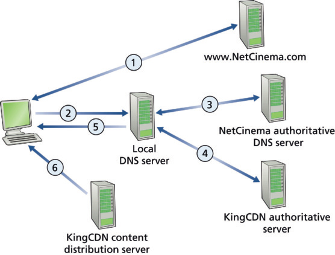

Figure 2.20 DNS redirects a user’s request to a CDN server

1.  The user visits the Web page at NetCinema.

2.  When the user clicks on the link http://video.netcinema.com/6Y7B23V, the user’s host sends a DNS query for video.netcinema.com.

3.  The user’s Local DNS Server (LDNS) relays the DNS query to an authoritative DNS server for NetCinema, which observes the string “video” in the hostname video.netcinema.com. To “hand over” the DNS query to KingCDN, instead of returning an IP address, the NetCinema authoritative DNS server returns to the LDNS a hostname in the KingCDN’s domain, for example, a1105.kingcdn.com.

4.  From this point on, the DNS query enters into KingCDN’s private DNS infrastructure. The user’s LDNS then sends a second query, now for a1105.

kingcdn.com, and KingCDN’s DNS system eventually returns the IP addresses of a KingCDN content server to the LDNS. It is thus here, within the KingCDN’s DNS system, that the CDN server from which the client will receive its content is specified.

5.  The LDNS forwards the IP address of the content-serving CDN node to the user’s host.

6.  Once the client receives the IP address for a KingCDN content server, it establishes a direct TCP connection with the server at that IP address and issues an HTTP GET request for the video. If DASH is used, the server will first send to the client a manifest file with a list of URLs, one for each version of the video, and the client will dynamically select chunks from the different versions.

Cluster Selection Strategies At the core of any CDN deployment is a cluster selection strategy, that is, a mechanism for dynamically directing clients to a server cluster or a data center within the CDN. As we just saw, the CDN learns the IP address of the client’s LDNS server via the client’s DNS lookup. After learning this IP address, the CDN needs to select an appropriate cluster based on this IP address. CDNs generally employ proprietary cluster selection strategies. We now briefly survey a few approaches, each of which has its own advantages and disadvantages.

One simple strategy is to assign the client to the cluster that is geographically closest. Using commercial geo-location databases (such as Quova [Quova 2025] and Max-Mind [MaxMind 2025]), each LDNS IP address is mapped to a geographic location.

When a DNS request is received from a particular LDNS, the CDN chooses the geographically closest cluster, that is, the cluster that is the fewest kilometers from the LDNS “as the bird flies.” Such a solution can work reasonably well for a large fraction of the clients [Agarwal 2009]. However, for some clients, the solution may perform poorly, since the geographically closest cluster may not be the closest cluster in terms of the length or number of hops of the network path. Furthermore, a problem inherent with all DNSbased approaches is that some end-users are configured to use remotely located LDNSs [Shaikh 2001; Mao 2002], in which case the LDNS location may be far from the client’s location. Moreover, this simple strategy ignores the variation in delay and available bandwidth over time of Internet paths, always assigning the same cluster to a particular client.

In order to determine the best cluster for a client based on the current traffic conditions, CDNs can instead perform periodic real-time measurements of delay and loss performance between their clusters and clients. For instance, a CDN can have each of its clusters periodically send probes (for example, ping messages or DNS queries) to all of the LDNSs around the world. One drawback of this approach is that many LDNSs are configured to not respond to such probes.

CDN Caching A CDN may have servers in hundreds or thousands of different geographical locations. Putting all of its content in all of these geographical locations may not only incur high network distribution costs, but may also demand excessive storage capacity in the various locations. For this reason, a CDN typically places different subsets of its content in different geographical locations. Since each location will typically remove, on a regular basis, some of its content to make room for fresher content or content that is in greater demand, the servers located at a particular location are collectively referred to as a cache.

A CDN has at its disposal two fundamental strategies for placing video files (and other content) in its caches: push and pull.

In the push strategy, the CDN forecasts which videos will be in greatest demand at each of its geographical locations. The CDN central servers will then send to each of its geographical locations the videos that it expects to be in highest demand for those locations. As described in Section 2.5.4, the video streaming company Netflix takes this push approach. In the pull strategy, when a user makes a request for a video, the user first gets redirected to a nearby cache in the CDN.

If that cache has a copy of the video, then the cache streams the video to the user using, for example, the DASH protocol. However, if there is a cache miss—that is if the cache doesn’t have a copy of the requested video—the cache first retrieves the video from one the CDN’s central servers, stores the video in the local cache, and streams the video to the requesting user. In order to reduce latency, once the cache has received the beginning of the video from the central CDN server, it may start the streaming while in parallel receiving the remainder of the video. As described in Section 2.5.4, the video sharing service YouTube takes this pull approach. Akamai (see sidebar) combines both a push and a pull approach.

Case Study Akamai: Living on the Edge for a Quarter Century Akamai has been a pioneer of CDN delivery of content since the late 1990’s [Spinrad 1999, Leighton 2000] and has evolved to also provide general edgebased computing services for companies that want to provide content and computing “close” to the company’s customers, i.e., at the network’s edge. In late 2023, Akamai truly operated at “Internet scale,” with more than 360,000 servers in 4,200 edge locations in more than 1,350 networks, and delivering more than 175 Terabit per second of data to end users [Sitaraman 2023].

At the heart of the Akamai CDN are (i) its content replication/placement algorithms that scale the number of replicated instances of content, e.g., in response to flash crowds, according to demand, and seeks to place that content “close” to requesting users, and (ii) a redirection service, [Leighton 2000, Nygren 2010] similar to that shown in Figure 2.20, to direct a user’s request for content to a nearby copy at an available server. More detailed descriptions of Akamai’s algorithms and services can be found at the reference above.

Case Study Google’s Data Center and Network Infrastructure To support its vast array of services—including search, Gmail, calendar, YouTube video, maps, documents, and social networks—Google has deployed an extensive private network and data center infrastructure. Google’s worldwide infrastructure has two tiers of data centers, interconnected by an internal private network and connected to the ISPs at hundreds of peering points:

• Large Scale data centers . Google current has twenty three “mega data

centers” in North and South America, Europe, and Asia [Google data centers 2024], with each data center having on the order of perhaps 100,000 servers. These large-scale data centers are responsible for serving dynamic (and often personalized) content, including search results and Gmail messages.

• Network Edge sites . More than 100 Google Global Cache (GGC) sites and

140 network edge sites [Diot 2022] that allow ISPs to serve relatively static Google content (e.g., YouTube and Google Play) from within their own networks. Google traffic management systems directs user requests a nearby Google edge location for service.

This near-to-the user (and often withinthe-user’s-ISP) servicing of user requests helps ensure a high-quality user experiences and frees the ISP from having to carry traffic from outside its ISP, though the network to the end-user.

• Network connectivity . Google runs its own private global wide-area net-

work, known as B4 [Jain 2013] to connect its data centers. We’ll discuss the control and management of Googles B4 network in Chapter 5. Google’s Edge Points of Presence (POPs) connect to ISP and private networks at more than 200 IXPs (Figure 1.15) and at over 100 interconnection facilities around the world.

• Google cloud . In addition to the large-scale and edge infrastructure that provide Google services to users, Google also provides cloud hosting and application services for third-party Internet services. For example, Spotify uses Google cloud to run its (Spotify’s) services. In the Fall of 2024, Google had Cloud data centers in 40 regions around the world [Statista Google Cloud 2024; Google Cloud 2025].

As noted above, all of these data centers are networked together with Google’s own private network. When a user makes a search query, often the query is first sent over the local ISP to a nearby enter-deep cache, from where the static content can be retrieved; while providing the static content to the client, the nearby cache also forwards the query over Google’s private network to one of the mega data centers, from where the personalized search results are retrieved. For a YouTube video, the video itself may come from one of the bringhome caches, whereas portions of the Web page surrounding the video may come from the nearby enter-deep cache, and the advertisements surrounding the video come from the data centers.

##### 2.5.4 Case Studies: Netflix and YouTube

We conclude our discussion of streaming stored video by taking a look at two highly successful large-scale deployments: Netflix and YouTube. We’ll see that each of these systems take a very different approach, yet employ many of the underlying principles discussed in this section.

Netflix As of 2025, Netflix is one of the leading service providers for online movies and TV series in North America. As we discuss below, Netflix video distribution has two major components: the Amazon cloud and its own private CDN infrastructure.

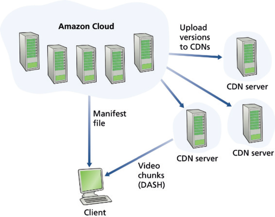

Figure 2.21 Netflix video streaming platform

Netflix has a Web site that handles numerous functions, including user registration and login, billing, movie catalogue for browsing and searching, and a movie recommendation system. As shown in Figure 2.21, this Web site (and its associated backend databases) run entirely on Amazon servers in the Amazon cloud. Additionally, the Amazon cloud handles the following critical functions:

• Content ingestion. Before Netflix can distribute a movie to its customers, it must first ingest and process the movie. Netflix receives studio master versions of movies and uploads them to hosts in the Amazon cloud.

Content processing. The machines in the Amazon cloud create many dif- • ferent formats for each movie, suitable for a diverse array of client video players running on desktop computers, smartphones, and game consoles connected to televisions. A different version is created for each of these formats and at multiple bit rates, allowing for adaptive streaming over HTTP using DASH.

• Uploading versions to its CDN. Once all of the versions of a movie have been created, the hosts in the Amazon cloud upload the versions to its CDN.

When Netflix first rolled out its video streaming service in 2007, it employed three third-party CDN companies to distribute its video content.

Netflix has since created its own private CDN, called Open Connect, from which it now streams all of its videos. To create its own CDN, Netflix has installed server racks both in IXPs and within residential ISPs themselves. Netflix currently has server racks in over 200 IXP locations; see [Bottger 2018] [Netflix Open Connect 2025] for a current list of IXPs housing Netflix racks.

There are also hundreds of ISP locations housing Netflix racks; also see [Netflix Open Connect 2025], where Netflix provides to potential ISP partners instructions about installing a (free) Netflix rack for their networks. Each server in the rack has several 10 Gbps Ethernet ports and over 100 terabytes of storage. The number of servers in a rack varies: IXP installations often have tens of servers and contain the entire Netflix streaming video library, including multiple versions of the videos to support DASH. Netflix does not use pull-caching (Section 2.5.4) to populate its CDN servers in the IXPs and ISPs. Instead, Netflix distributes by pushing the videos to its CDN servers during off-peak hours. For those locations that cannot hold the entire library, Netflix pushes only the most popular videos, which are determined on a day-to-day basis. The Netflix CDN design is described in some detail in the YouTube videos [Netflix Video 1] and [Netflix Video 2]; see also [Bottger 2018]. An excellent and accessible overview of Netflix’s architecture, algorithms, and operation is [Teixeira 2021].

Having described the components of the Netflix architecture, let’s take a closer look at the interaction between the client and the various servers that are involved in movie delivery. As indicated earlier, the Web pages for browsing the Netflix video library are served from servers in the Amazon cloud. When a user selects a movie to play, the Netflix software, running in the Amazon cloud, first determines which of its CDN servers have copies of the movie.

Among the servers that have the movie, the software then determines the “best” server for that client request. If the client is using a residential ISP that has a Netflix CDN server rack installed in that ISP, and this rack has a copy of the requested movie, then a server in this rack is typically selected. If not, a server at a nearby IXP is typically selected.

Once Netflix determines the CDN server that is to deliver the content, it sends the client the IP address of the specific server as well as a manifest file, which has the URLs for the different versions of the requested movie. The client and that CDN server then directly interact using a proprietary version of DASH. Specifically, as described in Section 2.5.2, the client uses the byte-range header in HTTP GET request messages, to request chunks from the different versions of the movie. Netflix uses chunks that are approximately four seconds long [Adhikari 2012]. While the chunks are being downloaded, the client measures the received throughput and runs a rate-determination algorithm to determine the quality of the next chunk to request.

Netflix embodies many of the key principles discussed earlier in this section, including adaptive streaming and CDN distribution. However, because Netflix uses its own private CDN, which distributes only video (and not Web pages), Netflix has been able to simplify and tailor its CDN design.

In particular, Netflix does not need to employ DNS redirect, as discussed in Section 2.5.3, to connect a particular client to a CDN server; instead, the Netflix software (running in the Amazon cloud) directly tells the client to use a particular CDN server. Furthermore, the Netflix CDN uses push caching rather than pull caching (Section 2.5.4): content is pushed into the servers at scheduled times at off-peak hours, rather than dynamically during cache misses.

YouTube With hundreds of hours of video uploaded to YouTube every minute and several billion video views per day, YouTube is indisputably the world’s largest video-sharing site. YouTube began its service in April 2005 and was acquired by Google in November 2006. Although the Google/YouTube design and protocols are proprietary, through several independent measurement efforts we can gain a basic understanding about how YouTube operates [Zink 2009;  Torres 2011; Adhikari 2011a]. As with Netflix, YouTube makes extensive use of CDN technology to distribute its videos [Torres 2011]. Similar to Netflix, Google uses its own private CDN to distribute YouTube videos, and has installed server clusters in many hundreds of different IXP and ISP locations. From these locations and directly from its huge data centers, Google distributes YouTube videos [Adhikari 2011a]. Unlike Netflix, however, Google uses pull caching, as described in Section 2.5.3, and DNS redirect, as also described in Section 2.5.3.

Most of the time, Google’s cluster-selection strategy directs the client to the cluster for which the RTT between client and cluster is the lowest; however, in order to balance the load across clusters, sometimes the client is directed (via DNS) to a more distant cluster [Torres 2011].

Several million videos are uploaded to YouTube every day. Not only are YouTube videos streamed from server to client over HTTP, but YouTube uploaders also upload their videos from client to server over HTTP. YouTube processes each video it receives, converting it to a YouTube video format and creating multiple versions at different bit rates. This processing takes place entirely within Google data centers. (See the case study on Google’s network infrastructure in Section 2.5.3.)

#### 2.6 Socket Programming: Creating Network Applications

Now that we’ve looked at a number of important network applications, let’s explore how network application programs are actually created. Recall from Section 2.1 that a typical network application consists of a pair of programs—a client program and a server program—residing in two different end systems.

When these two programs are executed, a client process and a server process are created, and these processes communicate with each other by reading from, and writing to, sockets. When creating a network application, the developer’s main task is therefore to write the code for both the client and server programs.

There are two types of network applications. One type is an implementation whose operation is specified in a protocol standard, such as an RFC or some other standards document; such an application is sometimes referred to as “open,” since the rules specifying its operation are known to all. For such an implementation, the client and server programs must conform to the rules dictated by the RFC. For example, the client program could be an implementation of the client side of the HTTP protocol, described in Section 2.2 and precisely defined in RFC 2616; similarly, the server program could be an implementation of the HTTP server protocol, also precisely defined in RFC 2616. If one developer writes code for the client program and another developer writes code for the server program, and both developers carefully follow the rules of the RFC, then the two programs will be able to interoperate. Indeed, many of today’s network applications involve communication between client and server programs that have been created by independent developers—for example, a Google Chrome browser communicating with an Apache Web server, or a BitTorrent client communicating with BitTorrent tracker.

The other type of network application is a proprietary network application. In this case, the client and server programs employ an application-layer protocol that has not been openly published in an RFC or elsewhere. A single developer (or development team) creates both the client and server programs, and the developer has complete control over what goes in the code. But because the code does not implement an open protocol, other independent developers will not be able to develop code that interoperates with the application.

In this section, we’ll examine the key issues in developing a client-server application, and we’ll “get our hands dirty” by looking at code that implements a very simple client-server application. During the development phase, one of the first decisions the developer must make is whether the application is to run over TCP or over UDP. Recall that TCP is connection oriented and provides a reliable byte-stream channel through which data flows between two end systems. UDP is connectionless and sends independent packets of data from one end system to the other, without any guarantees about delivery.

Recall also that when a client or server program implements a protocol defined by an RFC, it should use the well-known port number associated with the protocol; conversely, when developing a proprietary application, the developer must be careful to avoid using such well-known port numbers.

(Port numbers were briefly discussed in Section 2.1.They are covered in more detail in Chapter 3.) We introduce UDP and TCP socket programming by way of a simple UDP application and a simple TCP application. We present the simple UDP and TCP applications in Python 3.We could have written the code in Java, C, or C ++ , but we chose Python mostly because Python clearly exposes the key socket concepts.

With Python there are fewer lines of code, and each line can be explained to the novice programmer without difficulty. But there’s no need to be frightened if you are not familiar with Python. You should be able to easily follow the code if you have experience programming in Java, C, or C ++ .

If you are interested in client-server programming with Java, you are encouraged to see the Companion Website for this textbook; in fact, you can find there all the examples in this section (and associated labs) in Java. For readers who are interested in client-server programming in C, there are several good references available [Donahoo 2001; Stevens 1997; Frost 1994]; our Python examples below have a similar look and feel to C.

##### 2.6.1 Socket Programming with UDP

In this subsection, we’ll write simple client-server programs that use UDP; in the following section, we’ll write similar programs that use TCP.

Recall from Section 2.1 that processes running on different machines communicate with each other by sending messages into sockets. We said that each process is analogous to a house and the process’s socket is analogous to a door.

The application resides on one side of the door in the house; the transportlayer protocol resides on the other side of the door in the outside world. The application developer has control of everything on the application-layer side of the socket; however, it has little control of the transport-layer side.

Now let’s take a closer look at the interaction between two communicating processes that use UDP sockets. Before the sending process can push a packet of data out the socket door, when using UDP, it must first attach a destination address to the packet. After the packet passes through the sender’s socket, the Internet will use this destination address to route the packet through the Internet to the socket in the receiving process. When the packet arrives at the receiving socket, the receiving process will retrieve the packet through the socket, and then inspect the packet’s contents and take appropriate action.

So you may be now wondering, what goes into the destination address that is attached to the packet? As you might expect, the destination host’s IP address is part of the destination address. By including the destination IP address in the packet, the routers in the Internet will be able to route the packet through the Internet to the destination host. But because a host may be running many network application processes, each with one or more sockets, it is also necessary to identify the particular socket in the destination host. When a socket is created, an identifier, called a port number, is assigned to it. So, as you might expect, the packet’s destination address also includes the socket’s port number.

In summary, the sending process attaches to the packet a destination address, which consists of the destination host’s IP address and the destination socket’s port number. Moreover, as we shall soon see, the sender’s source address— consisting of the IP address of the source host and the port number of the source socket—are also attached to the packet. However, attaching the source address to the packet is typically not done by the UDP application code; instead it is automatically done by the underlying operating system.

We’ll use the following simple client-server application to demonstrate socket programming for both UDP and TCP:

1.  The client reads a line of characters (data) from its keyboard and sends the data to the server.

2.  The server receives the data and converts the characters to uppercase.

3.  The server sends the modified data to the client.

4.  The client receives the modified data and displays the line on its screen.

Figure 2.22 highlights the main socket-related activity of the client and server that communicate over the UDP transport service.

Now let’s get our hands dirty and take a look at the client-server program pair for a UDP implementation of this simple application. We also provide a detailed, line-by-line analysis after each program. We’ll begin with the UDP client, which will send a simple application-level message to the server. In order for the server to be able to receive and reply to the client’s message, it must be ready and running before the client sends its message. The client program is called UDPClient.py, and the server program is called UDPServer.py. In order to emphasize the key issues, we intentionally provide code that is minimal. “Good code” would certainly have a few more auxiliary lines, in particular for handling error cases. For this application, we have arbitrarily chosen 12000 for the server port number.

UDPClient.py Here is the code for the client side of the application:

```python
from socket import *

serverName = 'hostname'
serverPort = 12000

clientSocket = socket(AF_INET, SOCK_DGRAM)
message = input('Input lowercase sentence:')
clientSocket.sendto(message.encode(), (serverName, serverPort))
modifiedMessage, serverAddress = clientSocket.recvfrom(2048)
print(modifiedMessage.decode())
clientSocket.close()
```

Now let’s take a look at the various lines of code in UDPClient.py.

`from socket import *`

Figure 2.22 The client-server application using UDP must be ready and running—that is, it must be running as a process before the

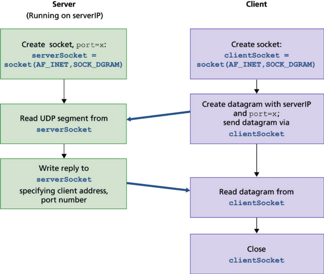

socket The module forms the basis of all network communications in Python.

By including this line, we will be able to create sockets within our program.

serverName = 'hostname' serverPort = 12000

serverName The first line sets the variable to the string ‘hostname’. Here, we

provide a string containing either the IP address of the server (e.g., “128.138.32.126”) or the hostname of the server (e.g., “cis.poly.edu”). If we use the hostname, then a DNS lookup will automatically be performed to get the

serverPort IP address.) The second line sets the integer variable to 12000.

clientSocket = socket(AF_INET, SOCK_DGRAM)

clientSocket This line creates the client’s socket, called . The first parameter

AF_INET indicates the address family; in particular, indicates that the underly-

ing network is using IPv4. (Do not worry about this now—we will discuss IPv4 in Chapter 4.) The second parameter indicates that the socket is of type SOCK_DGRAM , which means it is a UDP socket (rather than a TCP socket).

Note that we are not specifying the port number of the client socket when we create it; we are instead letting the operating system do this for us. Now that the client process’s door has been created, we will want to create a message to send through the door.

`message = input('Input lowercase sentence:')`

input is a built-in function in Python.

When this command is executed, the user at the client is prompted with the words “Input lowercase sentence:” The user then uses her keyboard to input a line, which is put into the variable message . Now that we have a socket and a message, we will want to send the message through the socket to the destination host.

clientSocket.sendto(message.encode(), (serverName, serverPort))

In the above line, we first convert the message from string type to byte type, as

encode we need to send bytes into a socket; this is done with the method.

sendto serverName The method attaches the destination address ( ,

serverPort ) to the message and sends the resulting packet into the process’s clientSocket socket, . (As mentioned earlier, the source address is also

attached to the packet, although this is done automatically rather than explicitly by the code.) Sending a client-to-server message via a UDP socket is that simple! After sending the packet, the client waits to receive data from the server.

modifiedMessage, serverAddress = clientSocket.recvfrom(2048)

With the above line, when a packet arrives from the Internet at the client’s

modifiedMessage socket, the packet’s data is put into the variable and the

serverAddress packet’s source address is put into the variable . The variable

serverAddress contains both the server’s IP address and the server’s port

number. The program UDPClient doesn’t actually need this server address information, since it already knows the server address from the outset; but this line of Python provides the server address nevertheless. The method recvfrom also takes the buffer size 2048 as input. (This buffer size works for most purposes.)

`print(modifiedMessage.decode())`

This line prints out modifiedMessage on the user’s display, after converting the message from bytes to string. It should be the original line that the user typed, but now capitalized.

`clientSocket.close()`

This line closes the socket. The process then terminates.

UDPServer.py Let’s now take a look at the server side of the application:

```python
from socket import *

serverPort = 12000
serverSocket = socket(AF_INET, SOCK_DGRAM)
serverSocket.bind(('', serverPort))
print('The server is ready to receive')

while True:
    message, clientAddress = serverSocket.recvfrom(2048)
    modifiedMessage = message.decode().upper()
    serverSocket.sendto(modifiedMessage.encode(), clientAddress)
```

Note that the beginning of UDPServer is similar to UDPClient. It also imports

serverPort the socket module, also sets the integer variable to 12000, and

SOCK_DGRAM also creates a socket of type (a UDP socket). The first line of code

that is significantly different from UDPClient is:

`serverSocket.bind(('', serverPort))`

The above line binds (that is, assigns) the port number 12000 to the server’s socket. Thus, in UDPServer, the code (written by the application developer) is explicitly assigning a port number to the socket. In this manner, when anyone sends a packet to port 12000 at the IP address of the server, that packet will be directed to this socket. UDPServer then enters a while loop; the while loop will allow UDPServer to receive and process packets from clients indefinitely. In the while loop, UDPServer waits for a packet to arrive.

`message, clientAddress = serverSocket.recvfrom(2048)`

This line of code is similar to what we saw in UDPClient. When a packet

message arrives at the server’s socket, the packet’s data is put into the variable

clientAddress and the packet’s source address is put into the variable . The

variable clientAddress contains both the client’s IP address and the client’s port number. Here, UDPServer will make use of this address information, as it provides a return address, similar to the return address with ordinary postal mail. With this source address information, the server now knows to where it should direct its reply.

`modifiedMessage = message.decode().upper()`

This line is the heart of our simple application. It takes the line sent by the cli-

upper ent and, after converting the message to a string, uses the method to

capitalize it.

`serverSocket.sendto(modifiedMessage.encode(), clientAddress)`

This last line attaches the client’s address (IP address and port number) to the capitalized message (after converting the string to bytes), and sends the resulting packet into the server’s socket. (As mentioned earlier, the server address is also attached to the packet, although this is done automatically rather than explicitly by the code.) The Internet will then deliver the packet to this client address. After the server sends the packet, it remains in the while loop, waiting for another UDP packet to arrive (from any client running on any host).

To test the pair of programs, you run UDPClient.py on one host and UDPServer.py on another host. Be sure to include the proper hostname or IP address of the server in UDPClient.py. Next, you execute UDPServer.py, the compiled server program, in the server host. This creates a process in the server that idles until it is contacted by some client. Then you execute UDPClient.py, the compiled client program, in the client. This creates a process in the client.

Finally, to use the application at the client, you type a sentence followed by a carriage return.

To develop your own UDP client-server application, you can begin by slightly modifying the client or server programs. For example, instead of converting all the letters to uppercase, the server could count the number of times the letter s appears and return this number. Or you can modify the client so that after receiving a capitalized sentence, the user can continue to send more sentences to the server.

##### 2.6.2 Socket Programming with TCP

Unlike UDP, TCP is a connection-oriented protocol. This means that before the client and server can start to send data to each other, they first need to handshake and establish a TCP connection. One end of the TCP connection is attached to the client socket and the other end is attached to a server socket. When creating the TCP connection, we associate with it the client socket address (IP address and port number) and the server socket address (IP address and port number). With the TCP connection established, when one side wants to send data to the other side, it just drops the data into the TCP connection via its socket. This is different from UDP, for which the server must attach a destination address to the packet before dropping it into the socket.

Now let’s take a closer look at the interaction of client and server programs in TCP. The client has the job of initiating contact with the server. In order for the server to be able to react to the client’s initial contact, the server has to be ready. This implies two things. First, as in the case of UDP, the TCP server must be running as a process before the client attempts to initiate contact. Second, the server program must have a special door—more precisely, a special socket—that welcomes some initial contact from a client process running on an arbitrary host. Using our house/door analogy for a process/socket, we will sometimes refer to the client’s initial contact as “knocking on the welcoming door.” With the server process running, the client process can initiate a TCP connection to the server. This is done in the client program by creating a TCP socket. When the client creates its TCP socket, it specifies the address of the welcoming socket in the server, namely, the IP address of the server host and the port number of the socket. After creating its socket, the client initiates a three-way handshake and establishes a TCP connection with the server. The three-way handshake, which takes place within the transport layer, is completely invisible to the client and server programs.

During the three-way handshake, the client process knocks on the welcoming door of the server process. When the server “hears” the knocking, it creates a new door—more precisely, a new socket that is dedicated to that particular client. In our example below, the welcoming door is a TCP socket object serverSocket that we call ; the newly created socket dedicated to the client connectionSocket making the connection is called . Students who are

encountering TCP sockets for the first time sometimes confuse the welcoming socket (which is the initial point of contact for all clients wanting to communicate with the server), and each newly created server-side connection socket that is subsequently created for communicating with each client.

From the application’s perspective, the client’s socket and the server’s connection socket are directly connected by a pipe. As shown in Figure 2.23, the client process can send arbitrary bytes into its socket, and TCP guarantees that the server process will receive (through the connection socket) each byte in the order sent. TCP thus provides a reliable service between the client and server processes. Furthermore, just as people can go in and out the same door, the client process not only sends bytes into but also receives bytes from its socket; similarly, the server process not only receives bytes from but also sends bytes into its connection socket.

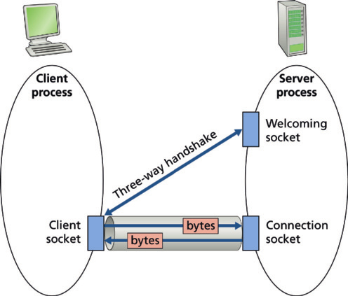

Figure 2.23 The TCPServer process has two sockets

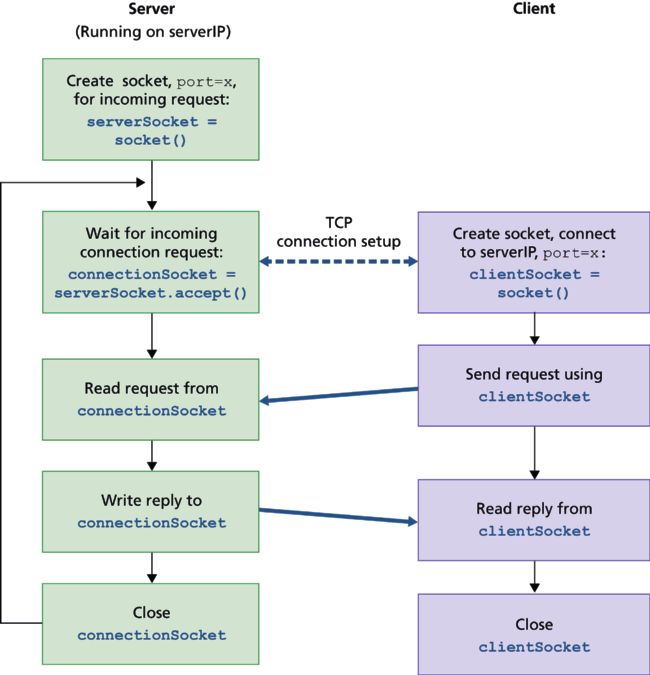

Figure 2.24 The client-server application using TCP

We use the same simple client-server application to demonstrate socket programming with TCP: The client sends one line of data to the server, the server capitalizes the line and sends it back to the client. Figure 2.24 highlights the main socket-related activity of the client and server that communicate over the TCP transport service.

TCPClient.py Here is the code for the client side of the application:

```python
from socket import *

serverName = 'servername'
serverPort = 12000

clientSocket = socket(AF_INET, SOCK_STREAM)
clientSocket.connect((serverName, serverPort))

sentence = input('Input lowercase sentence:')
clientSocket.send(sentence.encode())

modifiedSentence = clientSocket.recv(1024)
print('From Server: ', modifiedSentence.decode())

clientSocket.close()
```

Let’s now take a look at the various lines in the code that differ significantly from the UDP implementation. The first such line is the creation of the client socket.

clientSocket = socket(AF_INET, SOCK_STREAM)

clientSocket This line creates the client’s socket, called . The first parameter

again indicates that the underlying network is using IPv4. The second param-

SOCK_STREAM eter indicates that the socket is of type , which means it is a TCP

socket (rather than a UDP socket). Note that we are again not specifying the port number of the client socket when we create it; we are instead letting the operating system do this for us. Now the next line of code is very different from what we saw in UDPClient:

`clientSocket.connect((serverName, serverPort))`

Recall that before the client can send data to the server (or vice versa) using a TCP socket, a TCP connection must first be established between the client and server. The above line initiates the TCP connection between the client and

connect server. The parameter of the method is the address of the server

side of the connection. After this line of code is executed, the three-way handshake is performed and a TCP connection is established between the client and server.

`sentence = input('Input lowercase sentence:')`

As with UDPClient, the above obtains a sentence from the user. The string sentence continues to gather characters until the user ends the line by typing a carriage return. The next line of code is also very different from UDPClient:

clientSocket.send(sentence.encode())

sentence The above line sends the through the client’s socket and into the

TCP connection. Note that the program does not explicitly create a packet and attach the destination address to the packet, as was the case with UDP sockets.

sentence Instead the client program simply drops the bytes in the string into

the TCP connection. The client then waits to receive bytes from the server.

`modifiedSentence = clientSocket.recv(2048)`

When characters arrive from the server, they get placed into the string modifiedSentence modifiedSen- . Characters continue to accumulate in

tence until the line ends with a carriage return character. After printing the capitalized sentence, we close the client’s socket:

`clientSocket.close()`

This last line closes the socket and, hence, closes the TCP connection between the client and the server. It causes TCP in the client to send a TCP message to TCP in the server (see Section 3.5).

TCPServer.py Now let’s take a look at the server program.

```python
from socket import *

serverPort = 12000
serverSocket = socket(AF_INET, SOCK_STREAM)
serverSocket.bind(('', serverPort))
serverSocket.listen(1)
print('The server is ready to receive')

while True:
    connectionSocket, addr = serverSocket.accept()
    sentence = connectionSocket.recv(1024).decode()
    capitalizedSentence = sentence.upper()
    connectionSocket.send(capitalizedSentence.encode())
    connectionSocket.close()
```

Let’s now take a look at the lines that differ significantly from UDPServer and TCPClient. As with TCPClient, the server creates a TCP socket with:

serverSocket=socket(AF_INET,SOCK_STREAM)

serverPort Similar to UDPServer, we associate the server port number, , with

this socket:

`serverSocket.bind(('', serverPort))`

But with TCP, will be our welcoming socket. After establish-

ing this welcoming door, we will wait and listen for some client to knock on the door:

`serverSocket.listen(1)`

This line has the server listen for TCP connection requests from the client.

The parameter specifies the maximum number of queued connections (at least 1).

`connectionSocket, addr = serverSocket.accept()`

accept When a client knocks on this door, the program invokes the method for serverSocket, which creates a new socket in the server, called connectionSocket , dedicated to this particular client. The client and

server then complete the handshaking, creating a TCP connection between clientSocket connectionSocket the client’s and the server’s . With the

TCP connection established, the client and server can now send bytes to each other over the connection. With TCP, all bytes sent from one side are only guaranteed to arrive at the other side but also guaranteed to arrive in order.

`connectionSocket.close()`

In this program, after sending the modified sentence to the client, we close

serverSocket the connection socket. But since remains open, another client

can now knock on the door and send the server a sentence to modify.

This completes our discussion of socket programming in TCP. You are encouraged to run the two programs in two separate hosts, and also to modify them to achieve slightly different goals. You should compare the UDP program pair with the TCP program pair and see how they differ. You should also do many of the socket programming assignments described at the end of

Chapters 2 and 3. Finally, we hope someday, after mastering these and more advanced socket programs, you will write your own popular network application, become very rich and famous, and remember the authors of this textbook!

##### 2.6.3 Socket Programming with QUIC

We will close this section with a high-level discussion of how an application developer would use a QUIC API to send messages between a client and server. Consider what happens when a Web browser uses the HTTP 3 protocol to request a Web page from a server also running HTTP 3. Instead of initiating a traditional TCP handshake, the client initiates a QUIC handshake on top of UDP. QUIC incorporates the TLS 1.3 handshake into the QUIC handshake, meaning the connection and encryption setup are done in parallel, and not serially as when HTTP 2. Even though UDP is connectionless, QUIC is connection-oriented, allowing the client and server to retain connection information across different HTTP requests for the same or different Web pages.

Let’s now turn our attention to the HTTP 3 server with a connection already established between the client and the server. After receiving request(s) over the QUIC connection, the server will need to send HTTP messages, each encapsulating an object, to the client. The HTTP 3 server will use the QUIC API to create a separate stream and a corresponding stream ID for each message it wants to send. For example, the server may create Stream 1 for the HTML base page, create Stream 2 for a CSS object, and Stream 3 for an image. It could then send all three of these messages back-to-back into the QUIC connection. When HTTP 3 wants to send a message, it specifies, to the QUIC API, the QUIC connection ID and the stream ID. Tasks such as encryption, breaking the streams (i.e., messages) into smaller frames, and stream multiplexing are all handled by the QUIC sublayer internally. The HTTP 3 server can also indicate to the QUIC API that it should prioritize streams based on the importance of the resource. For instance, the HTTP 3 server can tell QUIC to prioritize the HTML content (as it forms the basic structure of the web page) and send it before other resources like images or JavaScript.

Importantly, the HTTP 3 code interacts with the QUIC API and not with the underlying UDP socket API. So from the perspective of the HTTP 3 application developer, HTTP 3 runs over the QUIC transport protocol.

#### 2.7 Summary

In this chapter, we’ve studied the conceptual and the implementation aspects of network applications. We’ve learned about the ubiquitous client-server architecture adopted by many Internet applications and seen its use in the HTTP, SMTP, and DNS protocols. We’ve studied these important applicationlevel protocols, and their corresponding associated applications (the Web, file transfer, e-mail, and DNS) in some detail. We’ve also learned about streaming video, and how modern video distribution systems leverage CDNs. We’ve examined how the socket API can be used to build network applications.

We’ve walked through the use of sockets for connection-oriented (TCP) and connectionless (UDP) end-to-end transport services. The first step in our journey down the layered network architecture is now complete!

At the very beginning of this book, in Section 1.1, we gave a rather vague, bare-bones definition of a protocol: “the format and the order of messages exchanged between two or more communicating entities, as well as the actions taken on the transmission and/or receipt of a message or other event.” The material in this chapter, and in particular our detailed study of the HTTP, SMTP, and DNS protocols, has now added considerable substance to this definition. Protocols are a key concept in networking; our study of application protocols has now given us the opportunity to develop a more intuitive feel for what protocols are all about.

In Section 2.1, we described the service models that TCP and UDP offer to applications that invoke them. We took an even closer look at these service models when we developed simple applications that run over TCP and UDP in Section 2.6. However, we have said little about how TCP and UDP provide these service models. For example, we know that TCP provides a reliable data service, but we haven’t said yet how it does so. In the next chapter, we’ll take a careful look at not only the what, but also the how and why of transport protocols.

Equipped with knowledge about Internet application structure and application-level protocols, we’re now ready to head further down the protocol stack and examine the transport layer in Chapter 3.

Homework Problems and Questions Chapter 2 Review Questions R5.  What information is used by a process running on one host to identify a process running Section 2.1 on another host?

R1.  List five nonproprietary Internet applications R6.  Suppose you wanted to do a transaction from

and the application-layer protocols that they a remote client to a server as fast as possible.

use. Would you use UDP or TCP? Why?

R2.  What is the difference between network archi- R7.  Referring to Figure 2.4, we see that none of the

tecture and application architecture? applications listed in Figure 2.4 requires both no data loss and timing. Can you conceive of R3.  For a communication session between a pair

an application that requires no data loss and of processes, which process is the client and

that is also highly time-sensitive? which is the server?

R8.  List the four broad classes of services that a R4.  What is the software interface that a process

transport protocol can provide. For each of sends messages into, and receives messages

the service classes, indicate if either UDP or from?

TCP (or both) provides such a service.

R9.  Recall that TCP can be enhanced with TLS to R19.  Is it possible for an organization’s Web server

provide process-to-process security services, and mail server to have exactly the same alias

foo.com including encryption. Does TLS operate at the for a hostname (for example, )?

transport layer or the application layer? If What would be the type for the RR that con-

the application developer wants TCP to be tains the hostname of the mail server?

enhanced with TLS, what does the developer R20.  Look over your received e-mails, and examine have to do? the header of a message sent from a user. Is it possible to determine from the header the IP Sections 2.2–2.4 address of the host from which the message

R10.  What is meant by a handshaking protocol? was sent? Do the same for a message sent from a Gmail account. R11.  Why do HTTP, SMTP, and IMAP run on top of TCP rather than on UDP? Section 2.5 R12.  Consider an e-commerce site that wants to R21.  CDNs typically adopt one of two different keep a purchase record for each of its customserver placement philosophies. Name and ers. Describe how this can be done with briefly describe them. cookies.

R22.  Besides network-related considerations such R13.  How is it that QUIC can be connection-oriented as delay, loss, and bandwidth performance, even though it runs over UDP? there are other important factors that go into R14.  In HTTP 3 code, are UDP, TCP, or QUIC sockdesigning a CDN server selection strategy. ets opened and closed? What are they? R15.  List several popular messaging apps. Do they

Section 2.6 use the same protocols as SMS?

R16.  Alice uses Gmail and Bob uses Yahoo! Mail. R23.  In Section 2.6, the UDP server described

Suppose Alice sends and email message to needed only one socket, whereas the TCP

Bob. List the series of application protocols that server needed two sockets. Why? If the TCP

are used to get the message from Alice to Bob. server were to support n simultaneous connec-

tions, each from a different client host, how R17.  Print out the header of an e-mail message you

Received many sockets would the TCP server need? have recently received. How many :

header lines are there? Analyze each of the R24.  For the client-server application over TCP

header lines in the message. described in Section 2.6, why must the server program be executed before the client pro- R18.  What is the HOL blocking issue in HTTP 1.1?

gram? For the client-server application over How does HTTP 2 attempt to solve it? What

UDP, why may the client program be executed is the HOL issue in HTTP 2? How does

before the server program? HTTP 3 solve it.

Problems P1. True or false?

a.  A user requests a Web page that consists of some text and three images. For this page, the client will send one request message and receive four response messages.

www.mit.edu/research. b.  Two distinct Web pages (for example, html www.mit.edu/students.html and ) can be sent over the

same persistent connection.

c.  With nonpersistent connections between browser and origin server, it is possible for a single TCP segment to carry two distinct HTTP request messages.

Date d.  The : header in the HTTP response message indicates when the object in the response was last modified.

e.  HTTP response messages never have an empty message body.

P2. SMS, iMessage, Wechat, and WhatsApp are all smartphone real-time messaging systems. After doing some research on the Internet, for each of these systems write one paragraph about the protocols they use. Then write a paragraph explaining how they differ.

P3. Consider an HTTP client that wants to retrieve a Web document at a given URL. The IP address of the HTTP server is initially unknown. What transport and application-layer protocols besides HTTP are needed in this scenario?

P4. Consider the following string of ASCII characters that were captured by Wireshark when the browser sent an HTTP GET message (i.e., this is the actual content of an HTTP GET message). The characters <cr><lf> are carriage return and line-feed characters (that is, the italized character string <cr> in the text below represents the single carriage-return character that was contained at that point in the HTTP header). Answer the following questions, indicating where in the HTTP GET message below you find the answer.

GET /cs453/index.html HTTP/1.1<cr><lf>Host: gai a.cs.umass.edu<cr><lf>User-Agent: Mozilla/5.0 ( Windows;U; Windows NT 5.1; en-US; rv:1.7.2) Gec ko/20040804 Netscape/7.2 (ax) <cr><lf>Accept:ex t/xml, application/xml, application/xhtml+xml, text /html;q=0.9, text/plain;q=0.8,image/png,*/*;q=0.5 <cr><lf>Accept-Language: en-us,en;q=0.5<cr><lf>Accept- Encoding: zip,deflate<cr><lf>Accept-Charset: ISO -8859-1,utf-8;q=0.7,*;q=0.7<cr><lf>Keep-Alive: 300<cr> <lf>Connection:keep-alive<cr><lf><cr><lf> a.  What is the URL of the document requested by the browser?

b.  What version of HTTP is the browser running?

c.  Does the browser request a non-persistent or a persistent connection?

d.  What is the IP address of the host on which the browser is running?

e.  What type of browser initiates this message? Why is the browser type needed in an HTTP request message?

P5. The text below shows the reply sent from the server in response to the HTTP GET message in the question above. Answer the following questions, indicating where in the message below you find the answer.

HTTP/1.1 200 OK<cr><lf>Date: Tue, 07 Mar 2008 12:39:45GMT<cr><lf>Server: Apache/2.0.52 (Fedora) <cr><lf>Last-Modified: Sat, 10 Dec2005 18:27:46 GMT<cr><lf>ETag: “526c3-f22-a88a4c80”<cr><lf>Accept-

Ranges: bytes<cr><lf>Content-Length: 3874<cr><lf> Keep-Alive: timeout=max=100<cr><lf>Connection:

Keep-Alive<cr><lf>Content-Type: text/html; charset= ISO-8859-1<cr><lf><cr><lf><!doctype html public {“- //w3c//dtd html 4.0transitional//en”><lf><html><lf> <head><lf> <meta http-equiv=”Content-Type” content=”text/html; charset=iso-8859-1”><lf> <meta name=”GENERATOR” content=”Mozilla/4.79 [en] (Windows NT 5.0; U) Netscape]”><lf> <title>CMPSCI 453 / 591 / NTU-ST550ASpring 2005 homepage</title><lf></head><lf> <much more document text following here (not shown)> a.  Was the server able to successfully find the document or not? What time was the document reply provided?

b.  When was the document last modified?

c.  How many bytes are there in the document being returned?

d.  What are the first 5 bytes of the document being returned? Did the server agree to a persistent connection?

P6. Obtain the HTTP 1.1 specification (RFC 2616). Answer the following questions:

a.  Explain the mechanism used for signaling between the client and server to indicate that a persistent connection is being closed. Can the client, the server, or both signal the close of a connection?

b.  What encryption services are provided by HTTP?

c.  Can a client open three or more simultaneous connections with a given server?

d.  Either a server or a client may close a transport connection between them if either one detects the connection has been idle for some time.

Is it possible that one side starts closing a connection while the other side is transmitting data via this connection? Explain.

P7. Suppose within your Web browser you click on a link to obtain a Web page. The IP address for the associated URL is not cached in your local host, so a DNS lookup is necessary to obtain the IP address. Suppose that n DNS servers are visited before your host receives the IP address from DNS; the successive visits incur an RTT of RTT , . . . , RTT . Further 1 n suppose that the Web page associated with the link contains exactly one object, consisting of a small amount of HTML text. Let RTT denote the 0 RTT between the local host and the server containing the object. Assuming zero transmission time of the object, how much time elapses from when the client clicks on the link until the client receives the object?

P8. Referring to Problem P7, suppose the HTML file references eight very small objects on the same server. Neglecting transmission times, how much time elapses with a.  Non-persistent HTTP with no parallel TCP connections?

b.  Non-persistent HTTP with the browser configured for 6 parallel connections?

c.  Persistent HTTP?

P9. Consider a short, 10-meter link, over which a sender can transmit at a rate of 150 bits sec in both directions. Suppose that packets containing data are 100,000 bits long, and packets containing only control (e.g., ACK or handshaking) are 200 bits long. Assume that N parallel connections each get 1  of the link bandwidth. Now consider the HTTP proto- N

col, and suppose that each downloaded object is 100 Kbits long, and that the initial downloaded object contains 10 referenced objects from the same sender. Would parallel downloads via parallel instances of nonpersistent HTTP make sense in this case? Now consider persistent HTTP.

Do you expect significant gains over the non-persistent case? Justify and explain your answer.

P10.  Consider the scenario introduced in the previous problem. Now suppose that the link is shared by Bob with four other users. Bob uses parallel instances of non-persistent HTTP, and the other four users use nonpersistent HTTP without parallel downloads.

a.  Do Bob’s parallel connections help him get Web pages more quickly?

Why or why not?

b.  If all five users open five parallel instances of non-persistent HTTP, then would Bob’s parallel connections still be beneficial? Why or why not?

P11.  Write a simple TCP program for a server that accepts lines of input from a client and prints the lines onto the server’s standard output. (You can do this by modifying the TCPServer.py program in the text.) Compile and execute your program. On any other machine that contains a Web browser, set the proxy server in the browser to the host that is running your server program; also configure the port number appropriately. Your browser should now send its GET request messages to your server, and your server should display the messages on its standard output. Use this platform to determine whether your browser generates conditional GET messages for objects that are locally cached.

P12.  Consider sending over HTTP 2 a Web page that consists of one video clip, and five images. Suppose that the video clip is transported as 2000 frames, and each image has three frames.

a.  If all the video frames are sent first without interleaving, how many “frame times” are needed until all five images are sent?

b.  If frames are interleaved, how many frame times are needed until all five images are sent.

P13.  Consider the Web page in problem 12. Now HTTP 2 prioritization is employed. Suppose all the images are given priority over the video clip, and that the first image is given priority over the second image, the second image over the third image, and so on. How many frame times will be needed until the second image is sent?

MAIL FROM From P14.  What is the difference between : in SMTP and : in the

mail message itself?

P15.  How does SMTP mark the end of a message body? How about HTTP?

Can HTTP use the same method as SMTP to mark the end of a message body? Explain.

P16.  Read RFC 5321 for SMTP. What does MTA stand for? Consider the following received spam e-mail (modified from a real spam e-mail). Assuming only the originator of this spam e-mail is malicious and all other hosts are honest, identify the malacious host that has generated this spam e-mail.

From - Fri Nov 07 13:41:30 2008 Return-Path: <tennis5@pp33head.com> Received: from barmail.cs.umass.edu (barmail.cs.umass.

edu [128.119.240.3]) by cs.umass.edu (8.13.1/8.12.6) for <hg@cs.umass.edu>; Fri, 7 Nov 2008 13:27:10 -0500 Received: from asusus-4b96 (localhost [127.0.0.1]) by barmail.cs.umass.edu (Spam Firewall) for <hg@cs.umass.

edu>; Fri, 7 Nov 2008 13:27:07 -0500 (EST) Received: from asusus-4b96 ([58.88.21.177]) by barmail.

cs.umass.edu for <hg@cs.umass.edu>; Fri, 07 Nov 2008 13:27:07 -0500 (EST) Received: from [58.88.21.177] by inbnd55.exchangeddd.

com; Sat, 8 Nov 2008 01:27:07 +0700 From: ‘’Jonny’’ <tennis5@pp33head.com> To: <hg@cs.umass.edu> Subject: How to secure your savings P17.  a.  What is a who is database?

b.  Use various whois databases on the Internet to obtain the names of two DNS servers. Indicate which whois databases you used.

c.  Use nslookup on your local host to send DNS queries to three DNS servers: your local DNS server and the two DNS servers you found in part (b). Try querying for Type A, NS, and MX reports. Summarize your findings.

d.  Use nslookup to find a Web server that has multiple IP addresses.

Does the Web server of your institution (school or company) have multiple IP addresses?

e.  Use the ARIN whois database to determine the IP address range used by your university.

f.  Describe how an attacker can use whois databases and the nslookup tool to perform reconnaissance on an institution before launching an attack.

g.  Discuss why whois databases should be publicly available.

P18.  In this problem, we use the useful dig tool available on Unix and Linux hosts to explore the hierarchy of DNS servers. Recall that in Figure 2.17, a DNS server in the DNS hierarchy delegates a DNS query to a DNS server lower in the hierarchy, by sending back to the DNS client the name of that lower-level DNS server. First read the man page for dig, and then answer the following questions.

a.  Starting with a root DNS server (from one of the root servers [a-m].

root-servers.net), initiate a sequence of queries for the IP address for your department’s Web server by using dig. Show the list of the names of DNS servers in the delegation chain in answering your query.

b.  Repeat part (a) for several popular Web sites, such as google.com, yahoo.com, or amazon.com.

P19.  Suppose you can access the caches in the local DNS servers of your department. Can you propose a way to roughly determine the Web servers (outside your department) that are most popular among the users in your department? Explain.

P20.  Suppose that your department has a local DNS server for all computers in the department. You are an ordinary user (i.e., not a network/system administrator). Can you determine if an external Web site was likely accessed from a computer in your department a couple of seconds ago?

Explain.

P21.  Consider a DASH system for which there are N video versions (at N different rates and qualities) and N audio versions (at N different rates and

qualities). Suppose we want to allow the player to choose at any time any of the N video versions and any of the N audio versions.

a.  If we create files so that the audio is mixed in with the video, so server sends only one media stream at given time, how many files will the server need to store (each a different URL)?

b.  If the server instead sends the audio and video streams separately and has the client synchronize the streams, how many files will the server need to store?

P22.  Install and compile the Python programs TCPClient and UDPClient on one host and TCPServer and UDPServer on another host.

a.  Suppose you run TCPClient before you run TCPServer. What happens? Why?

b.  Suppose you run UDPClient before you run UDPServer. What happens? Why?

c.  What happens if you use different port numbers for the client and server sides?

P23.  Suppose that in UDPClient.py, after we create the socket, we add the line:

`clientSocket.bind(('', 5432))`

Will it become necessary to change UDPServer.py? What are the port numbers for the sockets in UDPClient and UDPServer? What were they before making this change?

P24.  We have seen that Internet TCP sockets treat the data being sent as a byte stream but UDP sockets recognize message boundaries. What are one advantage and one disadvantage of byte-oriented API versus having the API explicitly recognize and preserve application-defined message boundaries?

P25.  What is the Apache Web server? How much does it cost? What functionality does it currently have?

Socket Programming Assignments

Assignment 2: UDP Pinger The Companion Website includes six socket programming assignments. The first four assignments In this programming assignment, you will write a are summarized below. The fifth assignment makes client ping program in Python. Your client will send use of the ICMP protocol and is summarized at the a simple ping message to a server, receive a correend of Chapter 5. It is highly recommended that stusponding pong message back from the server, and dents complete several, if not all, of these assigndetermine the delay between when the client sent ments. Students can find full details of these the ping message and received the pong message. assignments, as well as important snippets of the This delay is called the Round Trip Time (RTT). The Python code, at the Web site www.pearsonhighered. functionality provided by the client and server is com/cs-resources. similar to the functionality provided by standard ping program available in modern operating sys- Assignment 1: Web Server tems. However, standard ping programs use the Internet Control Message Protocol (ICMP) (which In this assignment, you will develop a simple Web we will study in Chapter 5). Here we will create a server in Python that is capable of processing only nonstandard (but simple!) UDP-based ping one request. Specifically, your Web server will (i) creprogram. ate a connection socket when contacted by a client Your ping program is to send 10 ping messages (browser); (ii) receive the HTTP request from this to the target server over UDP. For each message, connection; (iii) parse the request to determine the your client is to determine and print the RTT when specific file being requested; (iv) get the requested the corresponding pong message is returned. file from the server’s file system; (v) create an HTTP Because UDP is an unreliable protocol, a packet sent response message consisting of the requested file by the client or server may be lost. For this reason, preceded by header lines; and (vi) send the response the client cannot wait indefinitely for a reply to a over the TCP connection to the requesting browser. ping message. You should have the client wait up to If a browser requests a file that is not present in your one second for a reply from the server; if no reply is server, your server should return a “404 Not Found” received, the client should assume that the packet error message. was lost and print a message accordingly. In the Companion Website, we provide the In this assignment, you will be given the comskeleton code for your server. Your job is to complete code for the server (available in the Companplete the code, run your server, and then test your ion Website). Your job is to write the client code, server by sending requests from browsers running which will be very similar to the server code. It is on different hosts. If you run your server on a host recommended that you first study carefully the that already has a Web server running on it, then server code. You can then write your client code, libyou should use a different port than port 80 for your erally cutting and pasting lines from the server code. Web server.

Assignment 3: Mail Client Assignment 4: Web Proxy

The goal of this programming assignment is to cre- In this assignment, you will develop a Web proxy.

ate a simple mail client that sends e-mail to any When your proxy receives an HTTP request for an

recipient. Your client will need to establish a TCP object from a browser, it generates a new HTTP

connection with a mail server (e.g., a Google mail request for the same object and sends it to the origin

server), dialogue with the mail server using the server. When the proxy receives the corresponding

SMTP protocol, send an e-mail message to a recipi- HTTP response with the object from the origin

ent (e.g., your friend) via the mail server, and finally server, it creates a new HTTP response, including

close the TCP connection with the mail server. the object, and sends it to the client.

For this assignment, the Companion Website For this assignment, the Companion Website

provides the skeleton code for your client. Your job provides the skeleton code for the proxy server.

is to complete the code and test your client by send- Your job is to complete the code, and then test it by

ing e-mail to different user accounts. You may also having different browsers request Web objects via

try sending through different servers (for example, your proxy.

through a Google mail server and through your university mail server).

Wireshark Labs: HTTP, DNS Having gotten our feet wet with the Wireshark HTML files with embedded URLs, persistent and

packet sniffer in Lab 1, we’re now ready to use Wirenon-persistent connections, and HTTP authentica-

shark to investigate protocols in operation. In this tion and security.

lab, we’ll explore several aspects of the HTTP proto- As is the case with all Wireshark labs, the full

col: the basic GET/reply interaction, HTTP message description of this lab is available at this book’s Web

formats, retrieving large HTML files, retrieving site, www.pearsonhighered.com/cs-resources.

Wireshark Lab: DNS In this lab, we take a closer look at the client side of DNS query. From the DNS client’s standpoint, how-

the DNS, the protocol that translates Internet hostever, the protocol is quite simple—a query is formu-

names to IP addresses. Recall from Section 2.5 that lated to the local DNS server and a response is

the client’s role in the DNS is relatively simple—a received from that server. We observe DNS in action

client sends a query to its local DNS server and in this lab.

receives a response back. Much can go on under the As is the case with all Wireshark labs, the full

covers, invisible to the DNS clients, as the hierarchidescription of this lab is available at this book’s Web

cal DNS servers communicate with each other to site, www.pearsonhighered.com/cs-resources.

either recursively or iteratively resolve the client’s

AN INTERVIEW WITH...


Paul Mockapetris Paul Mockapetris is best known as the creator of the Domain Name System (DNS), and wrote the first implementation of SMTP, the Internet’s mail protocol. At present, he is a board member and Chief Scientist at ThreatSTOP, a realtime threat prevention service using DNS. Previously he was Chief Scientist and board member of Nominum, CTO at Urban Media, Siara, Fiberlane, and Software.com and director of engineering at @Home. He has been IETF chair, program manager at ARPA, and division director at the USC Information Sciences Institute. He spent 10 years at UC Irvine with the DCS project, and 4 years at MIT with the Architecture Machine Group before it became the Media Lab. He received his learner's permits in Physics and Electrical Engineering from the MIT in 1971, and a Ph. D. in Information and Computer Science from UC Irvine. Courtesy of Paul Mockapetris He is a member of the inaugural Internet Hall of Fame, and is Doctor Honoris Causa of the Miguel Hernandez and Ramon Llull Universities. He is the recipient of the ACM Software System Award, IEEE Internet award and the ACM Sigcomm award, and is a Fellow of the ACM, IEEE and the US National Academy of Engineering.

How did you get interested in computers and computer networking?

My first interaction with a computer was as a high school student taking a summer programming course at MIT, one of many offered at the time. Stu Madnick taught us programming on IBM 1620s, and I managed to get access to a few other machines.

As a Physics major at MIT, I needed income, so I took an entry level programming job with Nicholas Negroponte as the first employee of the Architecture Machine Group, which evolved into the Media Lab. Huge timesharing systems were at the forefront of computing research then, but all we had was a few donated minicomputers and one expensive hard disk. So we built a cluster that shared I/O devices and a file system. I coauthored the MagicOS with Steve Gregory.

Little did we know while we were supporting various architects and their projects that we had built something that was state of the art computing research. I also worked at the IBM Cambridge Scientific Center on virtual machine technology and Draper Labs on flight code for rockets. Eventually, my Physics advisor and the head of the IBM center convinced me that computing was my future, not Physics.

For my PhD, I headed west to UC Irvine and the Distributed Computing System project led by Dave Farber. This was a cluster of minicomputers tied together with a ring LAN – cloud computing over 50 years ago! All based on message passing between named processes. Dave and UC Irvine introduced me to VLSI at Caltech, dialup ARPAnet, and the USC Information Sciences Institute, or ISI What was ISI like at the time?

ISI’s home was a high rise across the street from the Pacific ocean, packed with computers and ARPA researchers, doing everything from VLSI to AI to networking.

I got a research assistantship, all the computing resources I could use and a connection on the ARPAnet backbone while I worked on my thesis.

So how did you start on the DNS?

In 1982 I finished my thesis and accepted a fulltime position at ISI. I had been working on email and TCP performance, but it wasn’t satisfying. My boss, Jon Postel, suggested that I might think about the problem of naming in the network. There were some ideas about “domain names” for email, and some thought we needed a new way to manage the HOST.TXT file. There were even some existing designs that might be used.

The DNS design I created combines my experiences before ISI, ideas borrowed from other naming systems and input from the community. In particular, DCS and Magic OS had taught me a lot about how to build distributed systems with loose coupling. I didn’t repeat mistakes I had made with DCS and Magic OS naming.

The design is purposefully general and extensible; its first application was organizing its own data and permitting multiple organizations to manage their own separate names and data while allowing the namespace to appear seamless to the end user; its second application was the HOSTS.TXT issue; and then email routing. The system achieves reliability by having redundant servers that can compensate for both network failures as well as server problems.

The specs for DNS were revised a couple times in response to feedback from the networking community and then published as RFCs in 1983; they were later revised and published as RFCs 1034 and 1035 in 1986. Other milestones that year were the first machines that relied on the DNS and didn’t have HOSTS.TXT as a backup, as well as others adding to the DNS specs.

Was it really that simple?

Specs are fine, but to get the DCS adopted it had to be implemented and deployed across the Internet. SRI, which maintained the HOSTS.TXT file was happy to administer its successor. I wrote the first implementation, Jeeves, which was deployed across DEC timesharing systems to be the first few generations of root servers. UC Berkeley wrote bind, the first UNIX implementation, and ARPA funded the Berkeley UNIX distribution carrying bind around the world. I did many classes on DNS. Jon Postel created a transition plan for HOSTS.TXT to DNS. The Internet owes a great debt to all the individuals who bought into the DNS plan and moved it forward; there were a lot of skeptics. Simple things required rethinking. For example, email systems had to deal with situations where a particular domain wasn’t resolvable at a given time, and mail had to be queued for later delivery.

Are you happy with the subsequent evolution of DNS?

By the late 1980s, ARPA and the NSF both decided that DNS wasn’t research anymore and that they should move on. Somewhat paradoxically, that led me to be an ARPA program manager. I probably should have taken DNS to the venture capitalists of Sand Hill Road, but I didn’t know that world.

NSF enabled the commercial exploitation of DNS buy allowing registries to charge for names. The Internet scaled up with the DNS. Early DNS was guided by my utopian idea that eventually everyone would have their own domain, perhaps analogous to the digital identities or wallets we have today. But the DNS wasn’t just serving just the network research community, it moved on to the universities in general, then the commercial world, and then the world in general. Today the large

Internet companies dominate the discussion on DNS in the IETF and governments want their interests served.

After many years away from the DNS, I came back to working on DNS protection or DNS for security. This was service sold at a series of startups. The basic idea is that you want to avoid using domain names that lead you to undesirable places or content. It’s an extremely cost effective layer of security, but quite problematic when governments et al use it to censor your Internet. Meanwhile, the bad actors try to avoid being known. All in all, a Gordian knot of technology and policy that can perhaps be solved by having everyone control their own name space. It’s one of the many Internet problems that create a tension between outsourcing complicated tasks and retaining individual control.

Do you have any advice for students based on your experiences?

First, always be exploring. For example, I tell all PhD students that their first step should be to go to the library and examine recent PhD theses to set expectations. If you want to be a professor, at least learn a bit about how the startup/entrepreneur world works. Second, opportunities often are best where two different disciplines intersect. Computing, like mathematics, has most of its utility when applied. Biology and computing are made for each other. Third, hope to see places where conventional wisdom is wrong and you see low-hanging fruit. I had many people tell me about the impossibility of sending data over cable TV systems because of the noisy environment, but I believed that Moore’s law and digital signal processing would make it possible, so took a chance on my first startup.

But above all collect great mentors or people that can inspire you. In my case (alphabetically): Dave Farber, Bob Kahn, Nicholas Negroponte, Jon Postel, Steve Squires, and Ed Thorpe, to name a few.


## Chapter 3: Transport Layer

Residing between the application and network layers, the transport layer is a central piece of the layered network architecture. It has the critical role of providing communication services directly to the application processes running on different hosts. The pedagogic approach we take in this chapter is to alternate between discussions of transport-layer principles and discussions of how these principles are implemented in existing protocols; as usual, particular emphasis will be given to Internet protocols, in particular the TCP and UDP transport-layer protocols.

We’ll begin by discussing the relationship between the transport and network layers. This sets the stage for examining the first critical function of the transport layer—extending the network layer’s delivery service between two end systems to a delivery service between two application-layer processes running on the end systems. We’ll illustrate this function in our coverage of the Internet’s connectionless transport protocol, UDP.

We’ll then return to principles and confront one of the most fundamental problems in computer networking—how two entities can communicate reliably over a medium that may lose and corrupt data. Through a series of increasingly complicated (and realistic!) scenarios, we’ll build up an array of techniques that transport protocols use to solve this problem. We’ll then show how these principles are embodied in TCP, the Internet’s connection-oriented transport protocol.

We’ll next move on to a second fundamentally important problem in networking—controlling the transmission rate of transport-layer entities in order to avoid, or recover from, congestion within the network. We’ll consider the causes and consequences of congestion, as well as commonly used congestion-control techniques. After obtaining a solid understanding of the issues behind congestion control, we’ll study several different approaches taken toward congestion control in different “flavors” of TCP.

#### 3.1 Introduction and Transport-Layer Services

In the previous two chapters, we touched on the role of the transport layer and the services that it provides. Let’s quickly review what we have already learned about the transport layer.

A transport-layer protocol provides for logical communication between application processes running on different hosts. By logical communication, we mean that from an application’s perspective, it is as if the hosts running the processes were directly connected; in reality, the hosts may be on opposite sides of the planet, connected via numerous routers and a wide range of link types. Application processes use the logical communication provided by the transport layer to send messages to each other, free from the worry of the details of the physical infrastructure used to carry these messages. Figure 3.1 illustrates the notion of logical communication.

As shown in Figure 3.1, transport-layer protocols are implemented in the end systems but not in network routers. On the sending side, the transport layer converts the application-layer messages it receives from a sending application process into transport-layer packets, known as transport-layer segments in Internet terminology. We learned in Section 1.5.2 that this is done by ( possibly) breaking the application messages into smaller chunks and adding a transport-layer header to each chunk to create the transport-layer segment.

The transport layer then passes the segment to the network layer at the sending end system, where the segment is encapsulated within a network-layer packet (a datagram) and sent to the destination. It’s important to note that network routers act only on the network-layer fields of the datagram; that is, they do not examine the fields of the transport-layer segment encapsulated with the datagram. On the receiving side, the network layer extracts the transport-layer segment from the datagram and passes the segment up to the transport layer.

The transport layer then processes the received segment, making the data in the segment available to the receiving application.

More than one transport-layer protocol may be available to network applications. For example, the Internet has two protocols—TCP and UDP. Each of these protocols provides a different set of transport-layer services to the invoking application.

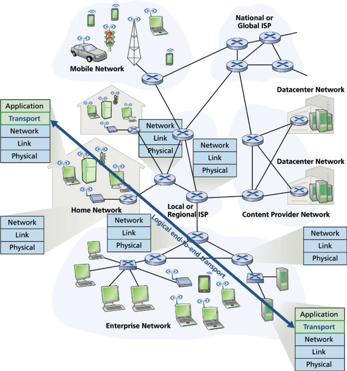

Figure 3.1 The transport layer provides logical rather than physical communication between application processes

##### 3.1.1 Relationship Between Transport and Network Layers

Recall that the transport layer lies just above the network layer in the protocol stack. Whereas a transport-layer protocol provides logical communication between processes running on different hosts, a network-layer protocol provides logical communication between hosts. This distinction is subtle but important. Let’s examine this distinction with the aid of a household analogy.

Consider two houses, one on the East Coast and the other on the West Coast, with each house being home to a dozen kids. The kids in the East Coast household are cousins of the kids in the West Coast household. The kids in the two households love to write to each other—each kid writes each cousin every week, with each letter delivered by the traditional postal service in a separate envelope. Thus, each household sends 144 letters to the other household every week. (These kids would save a lot of money if they had e-mail!)

In each of the households, there is one kid—Ann in the West Coast house and Bill in the East

Coast house—responsible for mail collection and mail distribution. Each week Ann visits all her brothers and sisters, collects the mail, and gives the mail to a postal-service mail carrier, who makes daily visits to the house. When letters arrive at the West Coast house, Ann also has the job of distributing the mail to her brothers and sisters. Bill has a similar job on the East Coast.

In this example, the postal service provides logical communication between the two houses—the postal service moves mail from house to house, not from person to person. On the other hand, Ann and Bill provide logical communication among the cousins—Ann and Bill pick up mail from, and deliver mail to, their brothers and sisters. Note that from the cousins’ perspective, Ann and Bill are the mail service, even though Ann and Bill are only a part (the end-system part) of the end-to-end delivery process. This household example serves as a nice analogy for explaining how the transport layer relates to the network layer:

application messages = letters in envelopes

processes = cousins

hosts  also called end systems  = houses

transport-layer protocol = Ann and Bill

network-layer protocol = postal service  including mail carriers 

Continuing with this analogy, note that Ann and Bill do all their work within their respective homes; they are not involved, for example, in sorting mail in any intermediate mail center or in moving mail from one mail center to another. Similarly, transport-layer protocols live in the end systems. Within an end system, a transport protocol moves messages from application processes to the network edge (that is, the network layer) and vice versa, but it doesn’t have any say about how the messages are moved within the network core.

In fact, as illustrated in Figure 3.1, intermediate routers neither act on, nor recognize, any information that the transport layer may have added to the application messages.

Continuing with our family saga, suppose now that when Ann and Bill go on vacation, another cousin pair—say, Susan and Harvey—substitute for them and provide the household-internal collection and delivery of mail. Unfortunately for the two families, Susan and Harvey do not do the collection and delivery in exactly the same way as Ann and Bill. Being younger kids, Susan and Harvey pick up and drop off the mail less frequently and occasionally lose letters (which are sometimes chewed up by the family dog).Thus, the cousinpair Susan and Harvey do not provide the same set of services (that is, the same service model) as Ann and Bill.

In an analogous manner, a computer network may make available multiple transport protocols, with each protocol offering a different service model to applications.

The possible services that Ann and Bill can provide are clearly constrained by the possible services that the postal service provides. For example, if the postal service doesn’t provide a maximum bound on how long it can take to deliver mail between the two houses (for example, three days), then there is no way that Ann and Bill can guarantee a maximum delay for mail delivery between any of the cousin pairs.

In a similar manner, the services that a transport protocol can provide are often constrained by the service model of the underlying network-layer protocol. If the network-layer protocol cannot provide delay or bandwidth guarantees for transport-layer segments sent between hosts, then the transport-layer protocol cannot provide delay or bandwidth guarantees for application messages sent between processes.

Nevertheless, certain services can be offered by a transport protocol even when the underlying network protocol doesn’t offer the corresponding service at the network layer. For example, as we’ll see in this chapter, a transport protocol can offer reliable data transfer service to an application even when the underlying network protocol is unreliable, that is, even when the network protocol loses, garbles, or duplicates packets. As another example (which we’ll explore in Chapter 8 when we discuss network security), a transport protocol can use encryption to guarantee that application messages are not read by intruders, even when the network layer cannot guarantee the confidentiality of transport-layer segments.

##### 3.1.2 Overview of the Transport Layer in the Internet

Recall that the Internet makes two distinct transport-layer protocols available to the application layer. One of these protocols is UDP  (User Datagram Protocol), which provides an unreliable, connectionless service to the invoking application. The second of these protocols is TCP (Transmission Control  Protocol), which provides a reliable, connection-oriented service to the invoking application. When designing a network application, the application developer must specify one of these two transport protocols. As we saw in Section 2.6, the application developer selects between UDP and TCP when creating sockets.

To simplify terminology, we refer to the transport-layer packet as a segment. We mention, however, that the Internet literature (for example, the RFCs) also refers to the transport-layer packet for TCP as a segment but often refers to the packet for UDP as a datagram. However, this same Internet literature also uses the term datagram for the network-layer packet! For an introductory book on computer networking such as this, we believe that it is less confusing to refer to both TCP and UDP packets as segments, and reserve the term datagram for the network-layer packet.

Before proceeding with our brief introduction of UDP and TCP, it will be useful to say a few words about the Internet’s network layer. (We’ll learn about the network layer in detail in Chapters 4 and 5.) The Internet’s network-layer protocol has a name—IP, for Internet Protocol.IP provides logical communication between hosts. The IP service model is a best-effort delivery service.

This means that IP makes its “best effort” to deliver segments between communicating hosts, but it makes no guarantees. In particular, it does not guarantee segment delivery, it does not guarantee orderly delivery of segments, and it does not guarantee the integrity of the data in the segments. For these reasons, IP is said to be an unreliable service. We also mention here that every host has at least one network-layer address, a so-called IP address. We’ll examine IP addressing in detail in Chapter 4; for this chapter we need only keep in mind that each host has an IP address.

Having taken a glimpse at the IP service model, let’s now summarize the service models provided by UDP and TCP. The most fundamental responsibility of UDP and TCP is to extend IP’s delivery service between two end systems to a delivery service between two processes running on the end systems.

Extending host-to-host delivery to process-to-process delivery is called transport-layer  multiplexing  and demultiplexing. We’ll discuss transportlayer multiplexing and demultiplexing in the next section. UDP and TCP also provide integrity checking by including error-detection fields in their segments’ headers. These two minimal transport-layer services—process-to-process data delivery and error checking—are the only two services that UDP  provides!

In particular, like IP, UDP is an unreliable service—it does not guarantee that data sent by one process will arrive intact (or at all!) to the destination process.

UDP is discussed in detail in Section 3.3.

TCP, on the other hand, offers several additional services to applications.

First and foremost, it provides reliable data transfer. Using flow control, sequence numbers, acknowledgments, and timers (techniques we’ll explore in detail in this chapter), TCP ensures that data is delivered from sending process to receiving process, correctly and in order.TCP thus converts IP’s unreliable service between end systems into a reliable data transport service between processes.TCP also provides congestion control. Congestion control is not so much a service provided to the invoking application as it is a service for the Internet as a whole, a service for the general good.

This is done by regulating the rate at which the sending sides of TCP connections can send traffic into the network. UDP traffic, on the other hand, is unregulated. An application using UDP transport can send at any rate it pleases, for as long as it pleases.

A protocol that provides reliable data transfer and congestion control is necessarily complex. We’ll need several sections to cover the principles of reliable data transfer and congestion control, and additional sections to cover the TCP protocol itself. These topics are investigated in Sections 3.4 through 3.7.

The approach taken in this chapter is to alternate between basic principles and the TCP protocol. For example, we’ll first discuss reliable data transfer in a general setting and then discuss how TCP specifically provides reliable data transfer. Similarly, we’ll first discuss congestion control in a general setting and then discuss how various versions of TCP perform congestion control. But before getting into all this good stuff, let’s first look at transport-layer multiplexing and demultiplexing.

#### 3.2 Multiplexing and Demultiplexing

In this section, we discuss transport-layer multiplexing and demultiplexing, that is, extending the host-to-host delivery service provided by the network layer to a process-to-process delivery service for applications running on the hosts.

In order to keep the discussion concrete, we’ll discuss this basic  transport-layer service in the context of the Internet. We emphasize, however, that a multiplexing/demultiplexing service is needed for all computer networks.

At the destination host, the transport layer receives segments from the network layer just below. The transport layer has the responsibility of delivering the data in these segments to the appropriate application process running in the host. Let’s take a look at an example. Suppose you are sitting in front of your computer, and you are downloading Web pages while running one Zoom session and two ssh sessions. You therefore have four network application processes running—two ssh processes, one Zoom process, and one HTTP process.

When the transport layer in your computer receives data from the network layer below, it needs to direct the received data to one of these four processes.

Let’s now examine how this is done.

First recall from Section 2.6 that a process (as part of a network application) can have one or more sockets, doors through which data passes from the network to the process and through which data passes from the process to the network. Thus, as shown in Figure 3.2, the transport layer in the receiving host does not actually deliver data directly to a process, but instead to an intermediary socket. Because at any given time there can be more than one socket in the receiving host, each socket has a unique identifier. The format of the identifier depends on whether the socket is a UDP or a TCP socket, as we’ll discuss shortly.

Now let’s consider how a receiving host directs an incoming transportlayer segment to the appropriate socket. Each transport-layer segment has a set of fields in the segment for this purpose. At the receiving end, the transport layer examines these fields to identify the receiving socket and then directs the segment to that socket. This job of delivering the data in a transport-layer segment to the correct socket is called demultiplexing. The job of gathering data chunks at the source host from different sockets, encapsulating each data chunk with header information (that will later be used in demultiplexing) to create segments, and passing the segments to the network layer is called multiplexing. Note that the transport layer in the middle host in Figure 3.2 must demultiplex segments arriving from the network layer below to either process P or P above; this is done by directing the arriving segment’s data to 1 2 the corresponding process’s socket. The transport layer in the middle host Figure 3.2 Transport-layer multiplexing and demultiplexing

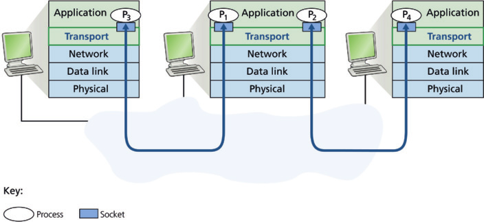

must also gather outgoing data from these sockets, form transport-layer segments, and pass these segments down to the network layer. Although we have introduced multiplexing and demultiplexing in the context of the Internet transport protocols, it’s important to realize that they are concerns whenever a single protocol at one layer (at the transport layer or elsewhere) is used by multiple protocols at the next higher layer.

To illustrate the demultiplexing job, recall the household analogy in the previous section. Each of the kids is identified by his or her name. When Bill receives a batch of mail from the mail carrier, he performs a demultiplexing operation by observing to whom the letters are addressed and then hand delivering the mail to his brothers and sisters. Ann performs a multiplexing operation when she collects letters from her brothers and sisters and gives the collected mail to the mail person.

Now that we understand the roles of transport-layer multiplexing and demultiplexing, let us examine how it is actually done in a host. From the discussion above, we know that transport-layer multiplexing requires (1) that sockets have unique identifiers, and (2) that each segment have special fields that indicate the socket to which the segment is to be delivered. These special fields, illustrated in Figure 3.3, are the source port number field and the destination port number field. (The UDP and TCP segments have other fields as well, as discussed in the subsequent sections of this chapter.) Each port number is a 16-bit number, ranging from 0 to 65535.The port numbers ranging from 0 to 1023 are called well-known port numbers and are restricted, which means that they are reserved for use by well-known application protocols such as HTTP (which uses port number 80) and FTP (which uses port number 21).The list of well-known port numbers is given in RFC 1700 and is updated at http://www.iana.org [RFC 3232].

When we develop a new application (such as the simple application developed in Section 2.6), we must assign the application a port number.

It should now be clear how the transport layer could implement the demultiplexing service: Each socket in the host could be assigned a port number, and when a segment arrives at the host, the transport layer examines the destination port number in the segment and directs the segment to the corresponding socket. The segment’s data then passes through the socket into the attached process. As we’ll see, this is basically how UDP does it. However, we’ll also see that multiplexing/demultiplexing in TCP is a bit more subtle. Figure 3.3 Source and

destination port-number Connectionless Multiplexing and Demultiplexing fields in a transport-layer segment with UDP Recall from Section 2.6.1 that the Python program running in a host can create

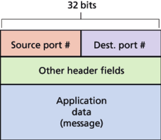

a UDP socket with the line `clientSocket = socket(AF_INET, SOCK_DGRAM)`

When a UDP socket is created in this manner, the transport layer automatically assigns a port number to the socket. In particular, the transport layer assigns a port number in the range 1024 to 65535 that is currently not being used by any other UDP port in the host. Alternatively, we can add a line into our Python program after we create the socket to associate a specific port number (say, 19157) to this UDP socket via the socket bind method:

`clientSocket.bind(('', 19157))`

If the application developer writing the code were implementing the server side of a “well-known protocol,” then the developer would have to assign the corresponding well-known port number. Typically, the client side of the application lets the transport layer automatically (and transparently) assign the port number, whereas the server side of the application assigns a specific port number.

With port numbers assigned to UDP sockets, we can now precisely describe UDP multiplexing/demultiplexing. Suppose a process in Host A, with UDP port 19157, wants to send a chunk of application data to a process with UDP port 46428 in Host B. The transport layer in Host A creates a transport-layer segment that includes the application data, the source port number  19157 , 

the destination port number  46428 , and two other values (which will be discussed later, but are unimportant for the current discussion). The transport layer then passes the resulting segment to the network layer. The network layer encapsulates the segment in an IP datagram and makes a best-effort attempt to deliver the segment to the receiving host. If the segment arrives at the receiving Host B, the transport layer at the receiving host examines the destination port number in the segment  46428 and delivers the segment to its socket identi- 

fied by port 46428. Note that Host B could be running multiple processes, each with its own UDP socket and associated port number. As UDP segments arrive from the network, Host B directs (demultiplexes) each segment to the appropriate socket by examining the segment’s destination port number.

It is important to note that a UDP socket is fully identified by a two-tuple consisting of a destination IP address and a destination port number. As a consequence, if two UDP segments have different source IP addresses and/or source port numbers, but have the same destination IP address and destination port number, then the two segments will be directed to the same destination process via the same destination socket.

You may be wondering now, what is the purpose of the source port number? As shown in Figure 3.4, in the A-to-B segment the source port number

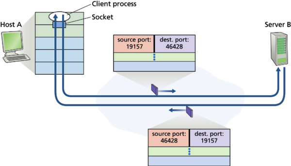

Figure 3.4 The inversion of source and destination port numbers serves as part of a “return address”—when B wants to send a segment back to A, the destination port in the B-to-A segment will take its value from the source port value of the A-to-B segment. (The complete return address is A’s IP address and the source port number.) As an example, recall the UDP server

UDPServer.py program studied in Section 2.7. In , the server uses the


recvfrom method to extract the client-side (source) port number from the

segment it receives from the client; it then sends a new segment to the client, with the extracted source port number serving as the destination port number in this new segment.

Connection-Oriented Multiplexing and Demultiplexing with TCP In order to understand TCP demultiplexing, we have to take a close look at TCP sockets and TCP connection establishment. One subtle difference between a TCP socket and a UDP socket is that a TCP socket is identified by a four-tuple:

(source IP address, source port number, destination IP address, destination port number).Thus, when a TCP segment arrives from the network to a host, the host uses all four values to direct (demultiplex) the segment to the appropriate socket.

In particular, and in contrast with UDP, two arriving TCP segments with different source IP addresses or source port numbers will (with the exception of a TCP segment carrying the original connection-establishment request) be directed to two different sockets, even if they have the same destination IP address and destination port number. To gain further insight, let’s reconsider the TCP client-server programming example in Section 2.6.2:

• The TCP server application has a “welcoming socket,” that waits for connection-establishment requests from TCP clients (see Figure 2.24) on port number 12000.

• The TCP client creates a socket and sends a connection establishment request segment with the lines:

clientSocket = socket (AF_INET, SOCK_STREAM) clientSocket.connect((serverName,12000))

• A connection-establishment request is nothing more than a TCP segment with destination port number 12000 and a special connection-establishment bit set in the TCP header (discussed in Section 3.5). The segment also includes a source port number that was chosen by the client.

• When the host operating system of the computer running the server process receives the incoming connection-request segment with destination port 12000, it locates the server process that is waiting to accept a connection on port number 12000. The server process then creates a new socket:

connectionSocket, addr = serverSocket.accept

• Also, the transport layer at the server notes the following four values in the connection-request segment: (1) the source port number in the segment, (2) the IP address of the source host, (3) the destination port number in the segment, and (4) its own IP address. The newly created connection socket is identified by these four values; all subsequently arriving segments whose source port, source IP address, destination port, and destination IP address match these four values will be demultiplexed to this socket.

With the TCP connection now in place, the client and server can now send data to each other.

The server host may support many simultaneous TCP connection sockets, with each socket attached to a process, and with each socket identified by its own four-tuple. When a TCP segment arrives at the host, all four fields (source IP address, source port, destination IP address, destination port) are used to direct (demultiplex) the segment to the appropriate socket.

Focus on Security Port Scanning We’ve seen that a server process waits patiently on an open port for contact by a remote client. Some ports are reserved for well-known applications (e.g., Web, FTP, DNS, and SMTP servers); other ports are used by convention by popular applications (e.g., the Microsoft Windows SQL server listens for requests on UDP port 1434).Thus, if we determine that a port is open on a host, we may be able to map that port to a specific application running on the host.

This is very useful for system administrators, who are often interested in knowing which network applications are running on the hosts in their networks. But attackers, in order to “case the joint,” also want to know which ports are open on target hosts. If a host is found to be running an application with a known security flaw (e.g., a SQL server listening on port 1434 was subject to a buffer overflow, allowing a remote user to execute arbitrary code on the vulnerable host, a flaw exploited by the Slammer worm [Kristoff 2023]), then that host is ripe for attack.

Determining which applications are listening on which ports is a relatively easy task. Indeed there are a number of public domain programs, called port scanners, that do just that. Perhaps the most widely used of these is nmap, freely available at http://nmap.org and included in most Linux distributions. For TCP, nmap sequentially scans ports, looking for ports that are accepting TCP connections. For UDP, nmap again sequentially scans ports, looking for UDP ports that respond to transmitted UDP segments. In both cases, nmap returns a list of open, closed, or unreachable ports. A host running nmap can attempt to scan any target host anywhere in the Internet.

The situation is illustrated in Figure 3.5, in which Host C initiates two HTTP sessions to server B, and Host A initiates one HTTP session to B.Hosts A and C and server B each have their own unique IP address—A, C, and B, respectively. Host C assigns two different source port numbers (26145 and 7532) to its two HTTP connections. Because Host A is choosing source port numbers independently of C, it might also assign a source port of 26145 to its HTTP connection.

But this is not a problem—server B will still be able to correctly demultiplex the two connections having the same source port number, since the two connections have different source IP addresses.

Figure 3.5 Two clients, using the same destination port number (80) to communicate

with the same Web server application port 80. In particular, both the initial connection-establishment segments and Chapter 2, you built a Web server that does just this. For such a server, at any

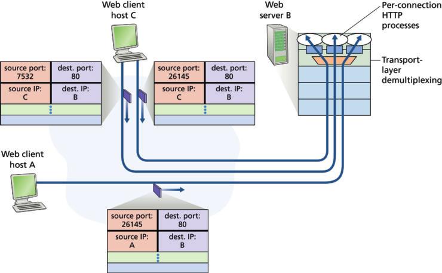

Web Servers and TCP Before closing this discussion, it’s instructive to say a few additional words about Web servers and how they use port numbers. Consider a host running a Web server, such as an Apache Web server, on port 80. When clients (for example, browsers) send segments to the server, all segments will have destination the segments carrying HTTP request messages will have destination port 80. As we have just described, the server distinguishes the segments from the different clients using source IP addresses and source port numbers. Figure 3.5 shows a Web server that spawns a new process for each connection. As shown in Figure 3.5, each of these processes has its own connection socket through which HTTP requests arrive and HTTP responses are sent. We mention, however, that there is not always a one-to-one correspondence between connection sockets and processes. In fact, today’s high-performing Web servers often use only one process, and create a new thread with a new connection socket for each new client connection. (A thread can be viewed as a lightweight subprocess.) If you did the first programming assignment in given time there may be many connection sockets (with different identifiers) attached to the same process. If the client and server are using persistent HTTP, then throughout the duration of the persistent connection the client and server exchange HTTP messages via the same server socket. However, if the client and server use non-persistent HTTP, then a new TCP connection is created and closed for every request/response, and hence a new socket is created and later closed for every request/response. This frequent creating and closing of sockets can severely impact the performance of a busy Web server (although a number of operating system tricks can be used to mitigate the problem). Readers interested in the operating system issues surrounding persistent and non-persistent HTTP are encouraged to see [Nielsen 1997; Nahum 2002].

Now that we’ve discussed transport-layer multiplexing and demultiplexing, let’s move on and discuss one of the Internet’s transport protocols, UDP. In the next section, we’ll see that UDP adds little more to the network-layer protocol than a multiplexing/demultiplexing service.

#### 3.3 Connectionless Transport: UDP

In this section, we’ll take a close look at UDP, how it works, and what it does.

We encourage you to refer back to Section 2.1, which includes an overview of the UDP service model, and to Section 2.6.1, which discusses socket programming using UDP.

To motivate our discussion about UDP, suppose you were interested in designing a no-frills, bare-bones transport protocol. How might you go about doing this? You might first consider using a vacuous transport protocol. In particular, on the sending side, you might consider taking the messages from the application process and passing them directly to the network layer; and on the receiving side, you might consider taking the messages arriving from the network layer and passing them directly to the application process. But as we learned in the previous section, we have to do a little more than nothing! At the very least, the transport layer has to provide a multiplexing/demultiplexing service in order to pass data between the network layer and the correct application-level  process.

UDP, defined in [RFC 768], does just about as little as a transport protocol can do. Aside from the multiplexing/demultiplexing function and some light error checking, it adds nothing to IP. In fact, if the application developer chooses UDP instead of TCP, then the application is almost directly talking with IP. UDP takes messages from the application process, attaches source and destination port number fields for the multiplexing/demultiplexing service, adds two other small fields, and passes the resulting segment to the network layer. The network layer encapsulates the transport-layer segment into an IP datagram and then makes a best-effort attempt to deliver the segment to the receiving host. If the segment arrives at the receiving host, UDP uses the destination port number to deliver the segment’s data to the correct application process. Note that with UDP there is no handshaking between sending and receiving transport-layer entities before sending a segment. For this reason, UDP is said to be connectionless.

DNS is an example of an application-layer protocol that typically uses UDP. When the DNS application in a host wants to make a query, it constructs a DNS query message and passes the message to UDP. Without performing any handshaking with the UDP entity running on the destination end system, the host-side UDP adds header fields to the message and passes the resulting segment to the network layer. The network layer encapsulates the UDP segment into a datagram and sends the datagram to a name server. The DNS application at the querying host then waits for a reply to its query. If it doesn’t receive a reply (possibly because the underlying network lost the query or the reply), it might try resending the query, try sending the query to another name server, or inform the invoking application that it can’t get a reply.

Now you might be wondering why an application developer would ever choose to build an application over UDP rather than over TCP. Isn’t TCP always preferable, since TCP provides a reliable data transfer service, while UDP does not? The answer is no, as some applications are better suited for UDP for the following reasons:

• Finer application-level control over what data is sent, and when. Under UDP, as soon as an application process passes data to UDP, UDP will package the data inside a UDP segment and immediately pass the segment to the network layer. TCP, on the other hand, has a congestion-control mechanism that throttles the transport-layer TCP sender when one or more links between the source and destination hosts become excessively congested.

TCP will also continue to resend a segment until the receipt of the segment has been acknowledged by the destination, regardless of how long reliable delivery takes. Since real-time applications often require a minimum sending rate, do not want to overly delay segment transmission, and can tolerate some data loss, TCP’s service model is not particularly well matched to these applications’ needs. As discussed below, these applications can use UDP and implement, as part of the application, any additional functionality that is needed beyond UDP’s no-frills segment-delivery service.

• No connection establishment. As we’ll discuss later, TCP uses a three-way handshake before it starts to transfer data. UDP just blasts away without any formal preliminaries. Thus UDP does not introduce any additional setup delay to establish a connection. This is probably the principal reason why DNS usually runs over UDP rather than TCP—DNS would be much slower if it ran over TCP. We learned in Section 2.2 that HTTP 1 and HTTP 2 use TCP rather than UDP, since reliability is critical for Web pages with text. But, as we discussed in Section 2.2, the TCP connection-

HTTP establishment delay in is an important contributor to the delays

associated with downloading Web documents. Indeed, HTTP 3 uses the QUIC protocol (Quick UDP Internet Connection, [RFC 9000; RFC 9002]), which uses UDP as its underlying transport protocol and implements reliability in the application layer on top of UDP. We’ll take a closer look at QUIC in Section 3.8.

• No connection state. TCP maintains connection state in the end systems.

This connection state includes receive and send buffers, congestioncontrol parameters, and sequence and acknowledgment number parameters. We will see in Section 3.5 that this state information is needed to implement TCP’s reliable data transfer service and to provide congestion control. UDP, on the other hand, does not maintain connection state and does not track any of these parameters. For this reason, a server devoted to a particular application can typically support many more active clients when the application runs over UDP rather than TCP.

• Small packet header overhead. The TCP segment has 20 bytes of header overhead in every segment, whereas UDP has only 8 bytes of overhead.

Figure 3.6 lists popular Internet applications and the transport protocols that they use. As we expect, e-mail, remote terminal access, and file transfer run over TCP—all these applications need the reliable data transfer service of TCP. We learned in Chapter 2 that early versions of HTTP ran over TCP but that more recent versions of HTTP run over UDP, providing their own error control and congestion control (among other services) at the application layer.

Nevertheless, many important applications run over UDP rather than TCP. For example, UDP is used to carry network management (SNMP; see Section 5.7) data. UDP is preferred to TCP in this case, since network management applications must often run when the network is in a stressed state—precisely when reliable, congestion-controlled data transfer is difficult to achieve. Also, as we mentioned earlier, DNS usually runs over UDP, thereby avoiding TCP’s connection-establishment delays but DNS can also be run over TCP.

As shown in Figure 3.6, both UDP and TCP are sometimes used today with multimedia applications, such as Internet phone, real-time video conferencing, and streaming of stored audio and video. We just mention now that all of these applications can tolerate a small amount of packet loss, so that reliable data transfer is not absolutely critical for the application’s success. Furthermore, real-time applications, like Internet phone and video conferencing, react very poorly to TCP’s congestion control. For these reasons, developers of multimedia applications may choose to run their applications over UDP instead of TCP. When packet loss rates are low, and with some organizations blocking UDP traffic for security reasons (see Chapter 8), TCP becomes an increasingly attractive protocol for streaming media transport.

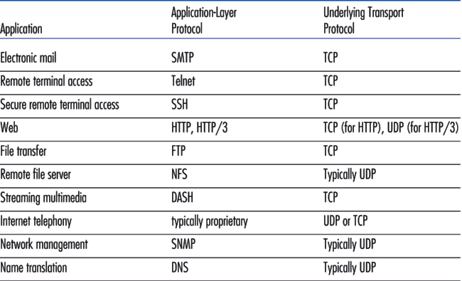

Figure 3.6 Popular Internet applications and their underlying transport protocols

Although commonly done today, running multimedia applications over UDP needs to be done with care. As we mentioned above, UDP has no congestion control. But congestion control is needed to prevent the network from entering a congested state in which very little useful work is done. If everyone were to start streaming high-bit-rate video without using any congestion control, there would be so much packet overflow at routers that very few UDP packets would successfully traverse the source-to-destination path. Moreover, the high loss rates induced by the uncontrolled UDP senders would cause the TCP senders (which, as we’ll see, do decrease their sending rates in the face of congestion) to dramatically decrease their rates. Thus, the lack of congestion control in UDP can result in high loss rates between a UDP sender and receiver, and the crowding out of TCP sessions. Many researchers have proposed new mechanisms to force all sources, including UDP sources, to perform adaptive congestion control [Mahdavi 1997; Floyd 2000; Kohler 2006: RFC 4340].

Before discussing the UDP segment structure, we mention that it is possible for an application to have reliable data transfer when using UDP. This can be done if reliability is built into the application itself (for example, by adding acknowledgment and retransmission mechanisms, such as those we’ll study in the next section). We mentioned earlier that the QUIC protocol implements reliability in the application-layer on top of UDP. Building reliability directly into the application allows the application to “have its cake and eat it too.” That is, application processes can communicate reliably without being subjected to the transmission-rate constraints imposed by TCP’s congestion-control mechanism.

##### 3.3.1 UDP Segment Structure

The UDP segment structure, shown in Figure 3.7, is defined in RFC 768. The application data occupies the data field of the UDP segment. For example, for DNS, the data field contains either a query message or a response message. For a streaming audio application, audio samples fill the data field. The UDP header has only four fields, each consisting of two bytes. As discussed in the previous section, the port numbers allow the destination host to pass the application data to the correct process running on the destination end system (that is, to perform the demultiplexing function). The length field specifies the number of bytes in the UDP segment (header plus data). An explicit length value is needed since the size of the data field may differ from one UDP segment to the next. The checksum is used by the receiving host to check whether errors have

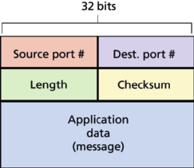

Figure 3.7 UDP segment structure

been introduced into the segment. In truth, the checksum is also calculated over a few of the fields in the IP header in addition to the UDP segment. But we ignore this detail in order to see the forest through the trees. We’ll discuss the checksum calculation below. Basic principles of error detection are described in Section 6.2. The length field specifies the length of the UDP segment, including the header, in bytes.

##### 3.3.2 UDP Checksum

The UDP checksum provides for error detection. That is, the checksum is used to determine whether bits within the UDP segment have been altered (for example, by noise in the links or while stored in a router) as it moved from source to destination.UDP at the sender side performs the 1s complement of the sum of all the 16-bit words in the segment, with any overflow encountered during the sum being wrapped around.

This result is put in the checksum field of the UDP segment. Here we give a simple example of the checksum calculation. You can find details about efficient implementation of the calculation in RFC 1071 and performance over real data in [Stone 1998; Stone 2000]. As an example, suppose that we have the following three 16-bit words:

0110011001100000

0101010101010101

1000111100001100 The sum of first two of these 16-bit words is

0110011001100000

0101010101010101

1011101110110101 Adding the third word to the above sum gives

1011101110110101

1000111100001100

0100101011000010 Note that this last addition had overflow, which was wrapped around. The 1s complement is obtained by converting all the 0s to 1s and converting all the

0100101011000010 1s to 0s. Thus, the 1s complement of the sum is

1011010100111101 , which becomes the checksum. At the receiver, all four

16-bit words are added, including the checksum. If no errors are introduced

1111111111111111 into the packet, then clearly the sum at the receiver will be .

If one of the bits is a 0, then we know that errors have been introduced into the packet.

You may wonder why UDP provides a checksum in the first place, as many link-layer protocols (including the popular Ethernet protocol) also provide error checking. The reason is that there is no guarantee that all the links between source and destination provide error checking; that is, one of the links may use a link-layer protocol that does not provide error checking. Furthermore, even if segments are correctly transferred across a link, it’s possible that bit errors could be introduced when a segment is stored in a router’s memory.

Given that neither link-by-link reliability nor in-memory error detection is guaranteed, UDP must provide error detection at the transport layer, on an endend basis, if the end-end data transfer service is to provide error detection. This is an example of the celebrated end-end principle in system design [Saltzer 1984], which states that since certain functionality (error detection, in this case) must be implemented on an end-end basis: “functions placed at the lower levels may be redundant or of little value when compared to the cost of providing them at the higher level.” Because IP is supposed to run over just about any layer-2 protocol, it is useful for the transport layer to provide error checking as a safety measure.

Although UDP provides error checking, it does not do anything to recover from an error. Some implementations of UDP simply discard the damaged segment; others pass the damaged segment to the application with a warning.

That wraps up our discussion of UDP. We will soon see that TCP offers reliable data transfer to its applications as well as other services that UDP doesn’t offer. Naturally, TCP is also more complex than UDP. Before discussing TCP, however, it will be useful to step back and first discuss the underlying principles of reliable data transfer.

#### 3.4 Principles of Reliable Data Transfer

In this section, we consider the problem of reliable data transfer in a general context. This is appropriate since the problem of implementing reliable data transfer occurs not only at the transport layer, but also at the link layer and the application layer as well. The general problem is thus of central importance to networking. Indeed, if one had to identify a “top-ten” list of fundamentally important problems in all of networking, this would be a candidate to lead the list. In the next section, we’ll see that TCP uses many of the principles that we are about to describe.

Figure 3.8 illustrates the framework for our study of reliable data transfer. The service abstraction provided to the upper-layer entities is that of a reliable channel through which data can be transferred. With a reliable channel, no transferred data bits are corrupted (flipped from 0 to 1, or vice versa) or lost, and all are delivered in the order in which they were sent. This is precisely the service model offered by TCP to the Internet applications that invoke it.

It is the responsibility of a reliable data transfer protocol to implement this service abstraction. This task is made difficult by the fact that the layer below the reliable data transfer protocol may be unreliable. For example, TCP is a reliable data transfer protocol that is implemented on top of an unreliable (IP) end-to-end network layer. More generally, the layer beneath the two reliably communicating end points might consist of a single physical link (as in the case of a link-level data transfer protocol) or a global internetwork (as in the case of a transport-level protocol). For our purposes, however, we can view this lower layer simply as an unreliable point-to-point channel.

Figure 3.8 Reliable data transfer: Service model and service implementation

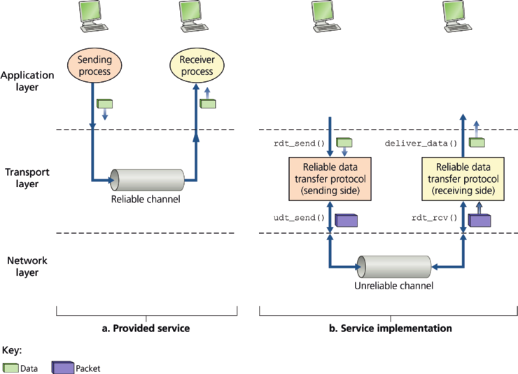

In this section, we will incrementally develop the sender and receiver sides of a reliable data transfer protocol, considering increasingly complex models of the underlying channel. For example, we’ll consider what protocol mechanisms are needed when the underlying channel can corrupt bits or lose entire packets. One assumption we’ll adopt throughout our discussion here is that packets will be delivered in the order in which they were sent, with some packets possibly being lost; that is, the underlying channel will not reorder packets. Figure 3.8(b) illustrates the interfaces for our data transfer protocol. The sending side of the data transfer protocol will be invoked from above by a rdt_send call to .It will pass the data to be delivered to the upper layer at rdt send the receiving side. (Here stands for reliable data transfer protocol and _ rdt indicates that the sending side of is being called. The first step in develop- rdt_rcv ing any protocol is to choose a good name!) On the receiving side, will be called when a packet arrives from the receiving side of the channel.rdt

When the protocol wants to deliver data to the upper layer, it will do so by deliver_data calling . In the following, we use the terminology “packet” rather than transport-layer “segment.” Because the theory developed in this section applies to computer networks in general and not just to the Internet transport layer, the generic term “packet” is perhaps more appropriate here. In this section, we consider only the case of unidirectional data transfer, that is, data transfer from the sending to the receiving side. The case of reliable bidirectional (that is, full-duplex) data transfer is conceptually no more difficult but considerably more tedious to explain. Although we consider only unidirectional data transfer, it is important to note that the sending and receiving sides of our protocol will nonetheless need to transmit packets in both directions, as indicated in Figure 3.8. We will see shortly that, in addition to exchanging packets containing the data to be transferred, the sending and

rdt receiving sides of will also need to exchange control packets back and

rdt forth. Both the send and receive sides of send packets to the other side by

udt_send a call to (where udt stands for unreliable data transfer).

##### 3.4.1 Building a Reliable Data Transfer Protocol

We now step through a series of protocols, each one becoming more complex, arriving at a flawless, reliable data transfer protocol.

Reliable Data Transfer over a Perfectly Reliable

rdt1.0 Channel:

We first consider the simplest case, in which the underlying channel is com-

rdt1.0 pletely reliable. The protocol itself, which we’ll call , is trivial. The

rdt1.0 finite-state machine (FSM) definitions for the sender and receiver are

shown in Figure 3.9. The FSM in Figure 3.9(a) defines the operation of the sender, while the FSM in Figure 3.9(b) defines the operation of the receiver. It is important to note that there are separate FSMs for the sender and for the receiver. The sender and receiver FSMs in Figure 3.9 each have just one state.

The arrows in the FSM description indicate the transition of the protocol from one state to another. (Since each FSM in Figure 3.9 has just one state, a transition is necessarily from the one state back to itself; we’ll see more complicated state diagrams shortly.) The event causing the transition is shown above the horizontal line labeling the transition, and the actions taken when the event occurs are shown below the horizontal line.

When no action is taken on an event, or no event occurs and an action is taken, we’ll use the symbol Λ below

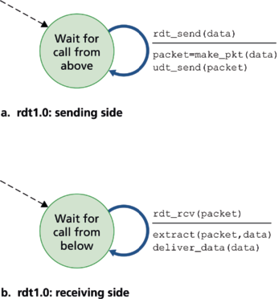

Figure 3.9 rdt1.0 —A protocol for a completely reliable channel or above the horizontal, respectively, to explicitly denote the lack of an action or event. The initial state of the FSM is indicated by the dashed arrow. Although the FSMs in Figure 3.9 have but one state, the FSMs we will see shortly have multiple states, so it will be important to identify the initial state of each FSM.

rdt The sending side of simply accepts data from the upper layer via the

rdt_send(data) event, creates a packet containing the data (via the action

make_pkt(data) ) and sends the packet into the channel. In practice, the

rdt_send(data) event would result from a procedure call (for example, to

rdt_send ) by the upper-layer application.

On the receiving side, rdt receives a packet from the underlying channel rdt_rcv(packet) via the event, removes the data from the packet (via the

extract (packet, data) action ) and passes the data up to the upper layer

deliver_data(data) rdt_rcv(packet) (via the action ). In practice, the

rdt_rcv event would result from a procedure call (for example, to ) from

the lower-layer protocol.

In this simple protocol, there is no difference between a unit of data and a packet. Also, all packet flow is from the sender to receiver; with a perfectly reliable channel there is no need for the receiver side to provide any feedback to the sender since nothing can go wrong! Note that we have also assumed that the receiver is able to receive data as fast as the sender happens to send data.

Thus, there is no need for the receiver to ask the sender to slow down!

Reliable Data Transfer over a Channel with Bit Errors: rdt2.0 A more realistic model of the underlying channel is one in which bits in a packet may be corrupted. Such bit errors typically occur in the physical components of a network as a packet is transmitted, propagates, or is buffered. We’ll continue to assume for the moment that all transmitted packets are received (although their bits may be corrupted) in the order in which they were sent.

Before developing a protocol for reliably communicating over such a channel, first consider how people might deal with such a situation. Consider how you yourself might dictate a long message over the phone. In a typical scenario, the message taker might say “OK” after each sentence has been heard, understood, and recorded. If the message taker hears a garbled sentence, you’re asked to repeat the garbled sentence. This message-dictation protocol uses both positive acknowledgments (“OK”) and negative acknowledgments (“Please repeat that.”). These control messages allow the receiver to let the sender know what has been received correctly, and what has been received in error and thus requires repeating. In a computer network setting, reliable data transfer protocols based on such retransmission are known as ARQ (Automatic Repeat reQuest) protocols.

Fundamentally, three additional protocol capabilities are required in ARQ protocols to handle the presence of bit errors:

• Err or detection. First, a mechanism is needed to allow the receiver to detect when bit errors have occurred. Recall from the previous section that UDP uses the Internet checksum field for exactly this purpose. In Chapter 6, we’ll examine error-detection and- correction techniques in greater detail; these techniques allow the receiver to detect and possibly correct packet bit errors. For now, we need only know that these techniques require that extra bits (beyond the bits of original data to be transferred) be sent from the sender to the receiver; these bits will be gathered into the packet check-

rdt2.0 sum field of the data packet.

• Receiver feedback. Since the sender and receiver are typically executing on different end systems, possibly separated by thousands of miles, the only way for the sender to learn of the receiver’s view of the world (in this case, whether or not a packet was received correctly) is for the receiver to provide explicit feedback to the sender. The positive (ACK) and negative (NAK) acknowledgment replies in the message-dictation scenario are

rdt2.0 examples of such feedback. Our protocol will similarly send ACK

and NAK packets back from the receiver to the sender. In principle, these packets need only be one bit long; for example, a 0 value could indicate a NAK and a value of 1 could indicate an ACK.

• Retransmission. A packet that is received in error at the receiver will be retransmitted by the sender.

rdt2.0 Figure 3.10 shows the FSM representation of , a data transfer pro-

tocol employing error detection, positive acknowledgments, and negative acknowledgments.

rdt2.0 The send side of has two states. In the leftmost state, the send-

side protocol is waiting for data to be passed down from the upper layer.

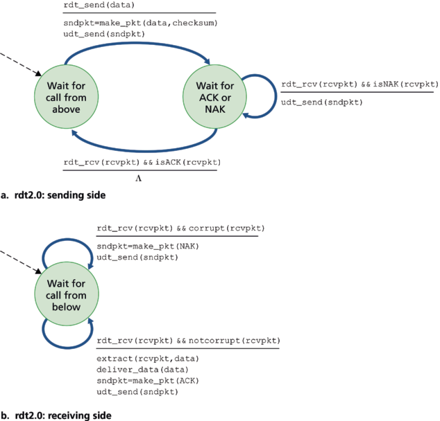

Figure 3.10 rdt2.0 — A protocol for a channel with bit errors

rdt_send(data) When the event occurs, the sender will create a packet

sndpkt  containing the data to be sent, along with a packet checksum (for example, as discussed in Section 3.3.2 for the case of a UDP segment), and

`udt_send(sndpkt)` then send the packet via the operation.

In the rightmost

state, the sender protocol is waiting for an ACK or a NAK packet from the

rdt_rcv(rcvpkt) && receiver. If an ACK packet is received (the notation isACK(rcvpkt) in Figure 3.10 corresponds to this event), the sender knows

that the most recently transmitted packet has been received correctly and thus the protocol returns to the state of waiting for data from the upper layer. If a NAK is received, the protocol retransmits the last packet and waits for an ACK or NAK to be returned by the receiver in response to the retransmitted data packet. It is important to note that when the sender is in the wait-for- ACK-or-NAK state, it cannot get more data from the upper layer; that is, the rdt_send event can not occur; that will happen only after the sender

receives an ACK and leaves this state. Thus, the sender will not send a new piece of data until it is sure that the receiver has correctly received the current

rdt2.0 packet. Because of this behavior, protocols such as are known as

stop-and-wait protocols.

rdt2.0 The receiver-side FSM for still has a single state. On packet

arrival, the receiver replies with either an ACK or a NAK, depending on whether or not the received packet is corrupted. In Figure 3.10, the notation rdt_rcv(rcvpkt) && corrupt(rcvpkt) corresponds to the event in

which a packet is received and is found to be in error.

rdt2.0 Protocol may look as if it works but, unfortunately, it has a fatal

flaw. In particular, we haven’t accounted for the possibility that the ACK or NAK packet could be corrupted! (Before proceeding on, you should think about how this problem may be fixed.) Unfortunately, our slight oversight is not as innocuous as it may seem. Minimally, we will need to add checksum bits to ACK/NAK packets in order to detect such errors. The more difficult question is how the protocol should recover from errors in ACK or NAK packets. The difficulty here is that if an ACK or NAK is corrupted, the sender has no way of knowing whether or not the receiver has correctly received the last piece of transmitted data.

Consider three possibilities for handling corrupted ACKs or NAKs:

• For the first possibility, consider what a human might do in the messagedictation scenario. If the speaker didn’t understand the “OK” or “Please repeat that” reply from the receiver, the speaker would probably ask, “What did you say?” (thus introducing a new type of sender-to-receiver packet to our protocol).The receiver would then repeat the reply.

But what if the speaker’s “What did you say?” is corrupted? The receiver, having no idea whether the garbled sentence was part of the dictation or a request to repeat the last reply, would probably then respond with “What did you say?” And then, of course, that response might be garbled. Clearly, we’re heading down a difficult path.

• A second alternative is to add enough checksum bits to allow the sender not only to detect, but also to recover from, bit errors. This solves the immediate problem for a channel that can corrupt packets but not lose them.

• A third approach is for the sender simply to resend the current data packet when it receives a garbled ACK or NAK packet. This approach, however, introduces duplicate packets into the sender-to-receiver channel. The fundamental difficulty with duplicate packets is that the receiver doesn’t know whether the ACK or NAK it last sent was received correctly at the sender. Thus, it cannot know a priori whether an arriving packet contains new data or is a retransmission!

A simple solution to this new problem (and one adopted in almost all existing data transfer protocols, including TCP) is to add a new field to the data packet and have the sender number its data packets by putting a sequence number into this field. The receiver then need only check this sequence number to determine whether or not the received packet is a retransmission. For this simple case of a stop-and-wait protocol, a 1-bit sequence number will suffice, since it will allow the receiver to know whether the sender is resending the previously transmitted packet (the sequence number of the received packet has the same sequence number as the most recently received packet) or a new packet (the sequence number changes, moving “forward” in modulo-2 arithmetic). Since we are currently assuming a channel that does not lose packets, ACK and NAK packets do not themselves need to indicate the sequence number of the packet they are acknowledging. The sender knows that a received ACK or NAK packet (whether garbled or not) was generated in response to its most recently transmitted data packet.

rdt2.1 Figures 3.11 and 3.12 show the FSM description for , our fixed ver-

rdt2.0 rdt2.1 sion of . The sender and receiver FSMs each now have twice

as many states as before. This is because the protocol state must now reflect whether the packet currently being sent (by the sender) or expected (at the receiver) should have a sequence number of 0 or 1. Note that the actions in those states where a 0-numbered packet is being sent or expected are mirror

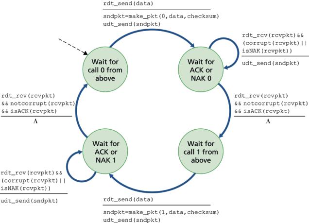

Figure 3.11 rdt2.1 sender

Figure 3.12 rdt2.1 receiver images of those where a 1-numbered packet is being sent or expected; the only

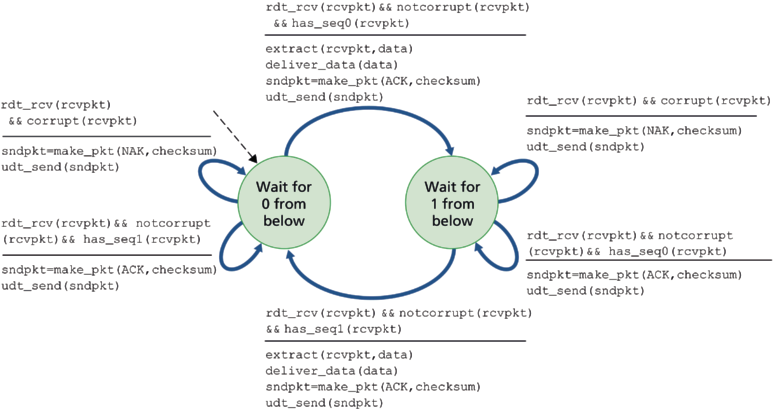

differences have to do with the handling of the sequence number. rdt2.1 Protocol uses both positive and negative acknowledgments from the receiver to the sender. When an out-of-order packet is received, the receiver sends a positive acknowledgment for the packet it has received. When a cor- rupted packet is received, the receiver sends a negative acknowledgment. We can accomplish the same effect as a NAK if, instead of sending a NAK, we send an ACK for the last correctly received packet. A sender that receives two ACKs for the same packet (that is, receives duplicate ACKs) knows that the receiver did not correctly receive the packet following the packet that is being ACKed twice. Our NAK-free reliable data transfer protocol for a channel with rdt2.2 bit errors is , shown in Figures 3.13 and 3.14. One subtle change rtdt2.1 rdt2.2 between and is that the receiver must now include the sequence number of the packet being acknowledged by an ACK message (this ACK 0 ACK 1 make_pkt is done by including the , or , argument in in the receiver FSM), and the sender must now check the sequence number of the packet being acknowledged by a received ACK message (this is done by 0 1 isACK including the or argument in in the sender FSM). Reliable Data Transfer over a Lossy Channel with Bit Errors: rdt3.0 Suppose now that in addition to corrupting bits, the underlying channel can lose packets as well, a not-uncommon event in today’s computer networks (including the Internet). Two additional concerns must now be addressed by the protocol: how to detect packet loss and what to do when packet loss occurs. The use of checksumming, sequence numbers, ACK packets, and retransmissions— rdt2.2 the techniques already developed in —will allow us to answer the latter concern. Handling the first concern will require adding a new protocol mechanism.

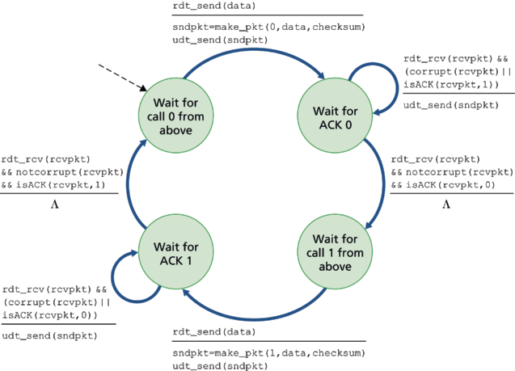

Figure 3.13 rdt2.2 sender

There are many possible approaches toward dealing with packet loss (several more of which are explored in the exercises at the end of the chapter). Here, we’ll put the burden of detecting and recovering from lost packets on the sender.

Suppose that the sender transmits a data packet and either that packet, or the receiver’s ACK of that packet, gets lost. In either case, no reply is forthcoming at the sender from the receiver. If the sender is willing to wait long enough so that it is certain that a packet has been lost, it can simply retransmit the data packet.

You should convince yourself that this protocol does indeed work.

Figure 3.14 rdt2.2 receiver

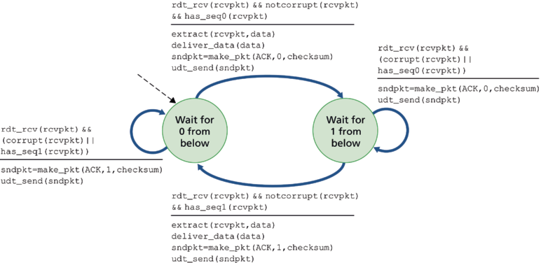

But how long must the sender wait to be certain that something has been lost? The sender must clearly wait at least as long as a round-trip delay between the sender and receiver (which may include buffering at intermediate routers) plus whatever amount of time is needed to process a packet at the receiver. In many networks, this worst-case maximum delay is very difficult even to estimate, much less know with certainty. Moreover, the protocol should ideally recover from packet loss as soon as possible; waiting for a worst-case delay could mean a long wait until error recovery is initiated. The approach thus adopted in practice is for the sender to judiciously choose a time value such that packet loss is likely, although not guaranteed, to have happened. If an ACK is not received within this time, the packet is retransmitted. Note that if a packet experiences a particularly large delay, the sender may retransmit the packet even though neither the data packet nor its ACK have been lost. This introduces the possibility of duplicate data packets in the sender-to-receiver

rdt2.2 channel. Happily, protocol already has enough functionality (that is,

sequence numbers) to handle the case of duplicate packets.

From the sender’s viewpoint, retransmission is a panacea. The sender does not know whether a data packet was lost, an ACK was lost, or if the packet or ACK was simply overly delayed. In all cases, the action is the same:

retransmit. Implementing a time-based retransmission mechanism requires a countdown timer that can interrupt the sender after a given amount of time has expired. The sender will thus need to be able to (1) start the timer each time a packet (either a first-time packet or a retransmission) is sent, (2) respond to a timer interrupt (taking appropriate actions), and (3) stop the timer.

rdt3.0 Figure 3.15 shows the sender FSM for , a protocol that reliably

transfers data over a channel that can corrupt or lose packets; in the homework

rdt3.0 problems, you’ll be asked to provide the receiver FSM for . Figure 3.16

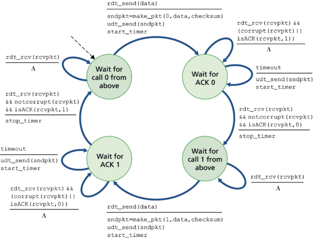

Figure 3.15 rdt3.0 sender

Figure 3.16 rdt3.0 Operation of , the alternating-bit protocol shows how the protocol operates with no lost or delayed packets and how it handles lost data packets. In Figure 3.16, time moves forward from the top of the diagram toward the bottom of the diagram; note that a receive time for a packet is necessarily later than the send time for a packet as a result of transmission and propagation delays. In Figures 3.16(b)–(d), the send-side brackets indicate the times at which a timer is set and later times out. Several of the more subtle aspects of this protocol are explored in the exercises at the end of this chapter. Because packet sequence numbers alternate between 0 and 1, pro-

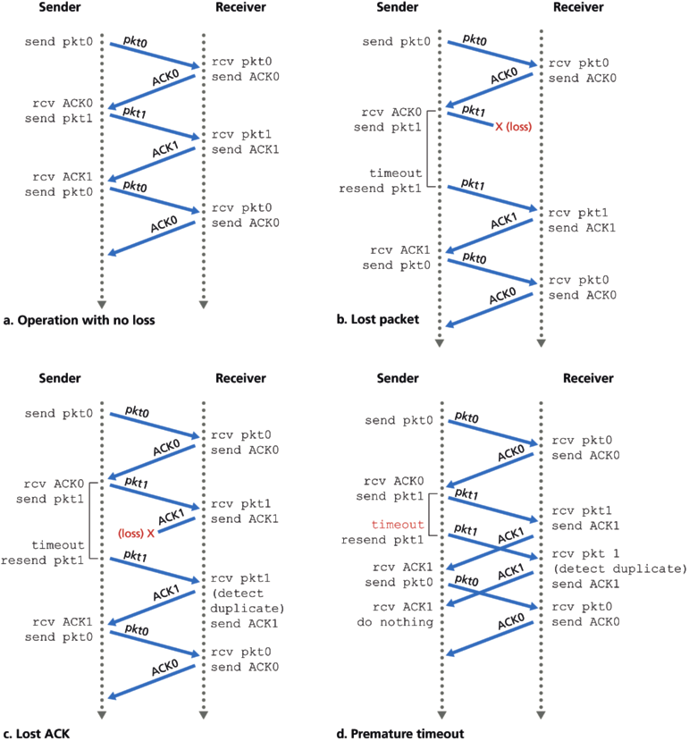

rdt3.0 tocol is sometimes known as the alternating-bit protocol. We have now assembled the key elements of a data transfer protocol. Checksums, sequence numbers, timers, and positive and negative acknowledgment packets each play a crucial and necessary role in the operation of the protocol. We now have a working reliable data transfer protocol!

##### 3.4.2 Pipelined Reliable Data Transfer Protocols

rdt3.0 Protocol is a functionally correct protocol, but it is unlikely that any-

one would be happy with its performance, particularly in today’s high-speed

rdt3.0 networks. At the heart of ’s performance problem is the fact that it is a

stop-and-wait protocol.

To appreciate the performance impact of this stop-and-wait behavior, consider an idealized case of two hosts, one located on the West Coast of the United States and the other located on the East Coast, as shown in Figure 3.17.

The speed-of-light round-trip propagation delay between these two end systems, RTT, is approximately 30 milliseconds. Suppose that they are connected by a channel with a transmission rate, R, of 1 Gbps (10  bits 9 per second).

With

a packet size, L, of 1,000 bytes  8,000 bits per packet, including both header 

fields and data, the time needed to actually transmit the packet into the 1 Gbps link is

L 8000 bits d = = = 8 microseconds trans R 10 bits sec 9

Figure 3.18(a) shows that with our stop-and-wait protocol, if the sender begins sending the packet at t = 0 , then at t = L R = 8 microseconds, the

last bit enters the channel at the sender side. The packet then makes its 15-msec cross-country journey, with the last bit of the packet emerging at the receiver at t = RTT/2 + L/R = 15.008 msec. Assuming for simplicity that ACK packets

are extremely small (so that we can ignore their transmission time) and that the receiver can send an ACK as soon as the last bit of a data packet is received, the ACK emerges back at the sender at t = RTT + L R = 30.008 msec. At this

point, the sender can now transmit the next message. Thus, in 30.008 msec, the sender was sending for only 0.008 msec. If we define the utilization of the sender (or the channel) as the fraction of time the sender is actually busy sending bits into the channel, the analysis in Figure 3.18(a) shows that the stop-and-wait protocol has a rather dismal sender utilization, U , of sender L R .008 U = = = 0.00027 sender RTT + L R 30.008

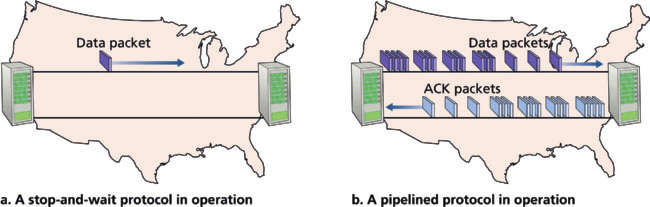

Figure 3.17 Stop- and-wait versus pipelined protocol That is, the sender was busy only 2.7 hundredths of one percent of the time! Viewed another way, the sender was able to send only 1,000 bytes in

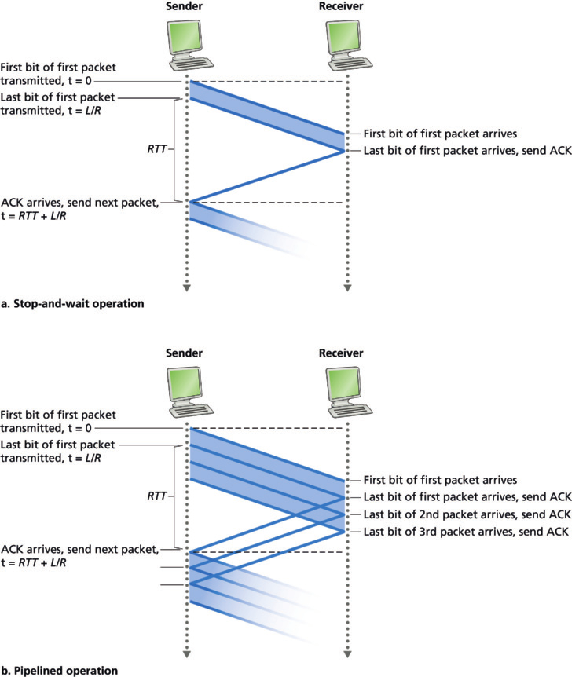

Figure 3.18 Stop-and-wait and pipelined sending

30.008 milliseconds, an effective throughput of only 267 kbps—even though a 1 Gbps link was available! Imagine the unhappy network manager who just paid a fortune for a gigabit capacity link but manages to get a throughput of only 267 kilobits per second! This is a graphic example of how network protocols can limit the capabilities provided by the underlying network hardware.

Also, we have neglected lower-layer protocol-processing times at the sender and receiver, as well as the processing and queuing delays that would occur at any intermediate routers between the sender and receiver. Including these effects would serve only to further increase the delay and further accentuate the poor performance.

The solution to this particular performance problem is simple: Rather than operate in a stop-and-wait manner, the sender is allowed to send multiple packets without waiting for acknowledgments, as illustrated in Figure 3.17(b).

Figure 3.18(b) shows that if the sender is allowed to transmit three packets before having to wait for acknowledgments, the utilization of the sender is essentially tripled. Since the many in-transit sender-to-receiver packets can be visualized as filling a pipeline, this technique is known as pipelining. Pipelining has the following consequences for reliable data transfer protocols:

• The range of sequence numbers must be increased, since each in-transit packet (not counting retransmissions) must have a unique sequence number and there may be multiple, in-transit, unacknowledged packets.

• The sender and receiver sides of the protocols may have to buffer more than one packet. Minimally, the sender will have to buffer packets that have been transmitted but not yet acknowledged. Buffering of correctly received packets may also be needed at the receiver, as discussed below.

• The range of sequence numbers needed and the buffering requirements will depend on the manner in which a data transfer protocol responds to lost, corrupted, and overly delayed packets. Two basic approaches toward pipelined error recovery can be identified: Go-Back-N and selective repeat.

##### 3.4.3 Go-Back-N (GBN)

In a Go-Back-N (GBN) protocol, the sender is allowed to transmit multiple packets (when available) without waiting for an acknowledgment, but is constrained to have no more than some maximum allowable number, N , of

unacknowledged packets in the pipeline. We describe the GBN protocol in some detail in this section. But before reading on, you are encouraged to play with the GBN animation (an awesome interactive animation) at the companion Web site.

Figure 3.19 shows the sender’s view of the range of sequence numbers in a

base GBN protocol. If we define to be the sequence number of the oldest unacnextseqnum knowledged packet and to be the smallest unused sequence

number (that is, the sequence number of the next packet to be sent), then four intervals in the range of sequence numbers can be identified. Sequence num-

0,base-1 bers in the interval [ ] correspond to packets that have already been

[base,nextseqnum-1] transmitted and acknowledged. The interval corre-

sponds to packets that have been sent but not yet acknowledged. Sequence Figure 3.19 Sender’s view of sequence numbers in Go-Back-N

[nextseqnum,base+N-1] numbers in the interval can be used for packets

that can be sent immediately, should data arrive from the upper layer. Finally,

base+N sequence numbers greater than or equal to cannot be used until an

unacknowledged packet currently in the pipeline (specifically, the packet with

base sequence number ) has been acknowledged.

As suggested by Figure 3.19, the range of permissible sequence numbers for transmitted but not yet acknowledged packets can be viewed as a window of size N over the range of sequence numbers. As the protocol operates, this window slides forward over the sequence number space. For this reason, N is

often referred to as the window size and the GBN protocol itself as a slidingwindow protocol. You might be wondering why we would even limit the number of outstanding, unacknowledged packets to a value of N in the first place.

Why not allow an unlimited number of such packets? We’ll see in  Section 3.5 that flow control is one reason to impose a limit on the sender. We’ll examine another reason to do so in Section 3.7, when we study TCP congestion control.

In practice, a packet’s sequence number is carried in a fixed-length field in the packet header. If k  is the number of bits in the packet sequence number

field, the range of sequence numbers is thus  0, 2 − 1 . With a finite range of [ k ]

sequence numbers, all arithmetic involving sequence numbers must then be done using modulo 2 arithmetic. (That is, the sequence number space can be k

thought of as a ring of size 2 , where sequence number 2 − 1 is immediately k k rdt3.0 followed by sequence number 0.) Recall that had a 1-bit sequence

number and a range of sequence numbers of  0, 1 . Several of the problems at [ ]

the end of this chapter explore the consequences of a finite range of sequence numbers. We will see in Section 3.5 that TCP has a 32-bit sequence number field, where TCP sequence numbers count bytes in the byte stream rather than packets.

Figures 3.20 and 3.21 give an extended FSM description of the sender and receiver sides of an ACK-based, NAK-free, GBN protocol. We refer to this FSM description as an extended FSM because we have added variables (similar to

base nextseqnum programming-language variables) for and , and added

operations on these variables and conditional actions involving these variables. Note that the extended FSM specification is now beginning to look somewhat like a programming-language specification. [Bochman 1984] provides an excellent survey of additional extensions to FSM techniques as well as other programming-language-based techniques for specifying protocols.

The GBN sender must respond to three types of events:

rdt_send • Invocation from above. When is called from above, the sender

first checks to see if the window is full, that is, whether there are N outstanding, unacknowledged packets. If the window is not full, a packet is created and sent, and variables are appropriately updated. If the window is full, the sender simply returns the data back to the upper layer, an implicit indication that the window is full. The upper layer would presumably then have to try again later. In a real implementation, the sender would more likely have either buffered (but not immediately sent) this data, or would have a synchronization mechanism (for example, a sema-

rdt_send phore or a flag) that would allow the upper layer to call only when the window is not full.

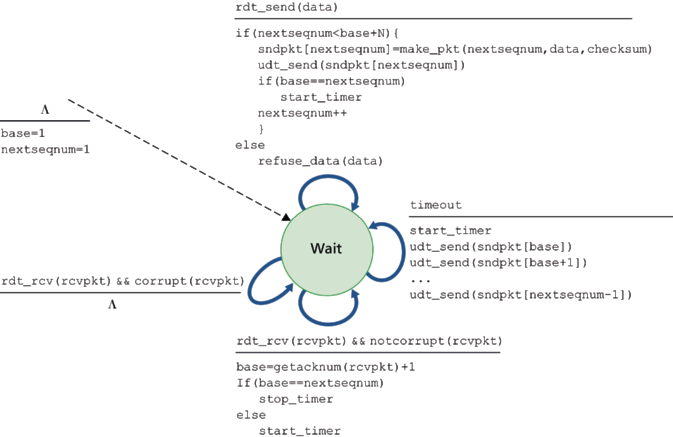

Figure 3.20 Extended FSM description of the GBN sender

• Receipt of an ACK. In our GBN protocol, an acknowledgment for a packet with sequence number n will be taken to be a cumulative acknowledg-

ment, indicating that all packets with a sequence number up to and including n have been correctly received at the receiver. We’ll come back to this issue shortly when we examine the receiver side of GBN.

• A timeout event. The protocol’s name, “Go-Back-N,” is derived from the sender’s behavior in the presence of lost or overly delayed packets. As in the stop-and-wait protocol, a timer will again be used to recover from lost data or acknowledgment packets. If a timeout occurs, the sender resends all packets that have been previously sent but that have not yet been acknowledged. Our sender in Figure 3.20 uses only a single timer, which can be thought of as a timer for the oldest transmitted but not yet acknowledged packet. If an ACK is received but there are still additional transmitted but not yet acknowledged packets, the timer is restarted. If there are no outstanding, unacknowledged packets, the timer is stopped.

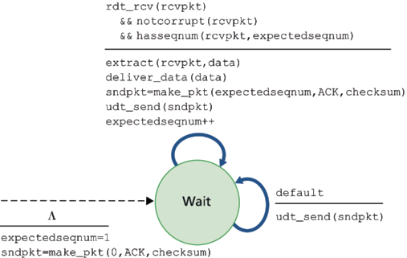

Figure 3.21 Extended FSM description of the GBN receiver

The receiver’s actions in GBN are also simple. If a packet with sequence number n is received correctly and is in order (that is, the data last delivered to the upper layer came from a packet with sequence number n − ), the receiver

sends an ACK for packet n and delivers the data portion of the packet to the

upper layer. In all other cases, the receiver discards the packet and resends an ACK for the most recently received in-order packet. Note that since packets are delivered one at a time to the upper layer, if packet k  has been received and

delivered, then all packets with a sequence number lower than k  have also

been delivered. Thus, the use of cumulative acknowledgments is a natural choice for GBN.

In our GBN protocol, the receiver discards a packet that has been

expectedreceived correctly but has a sequence number that is larger than seqnum . For example, if the GBN receiver is waiting for a packet with sequence number n, and a packet with sequence number n + 2 arrives, that

packet is discarded by the GBN receiver in Figure 3.21, even though the data in the arriving packet will eventually need to be delivered to the upper layer at the receiver. Why not buffer (but not ACK) the received data in packet n + 2 , and then ACK and deliver this packet later, following the eventual correct receipt of a packet with sequence number n + 1 ? While the need for

receiver buffering introduces additional complexity into the GBN receiver and requires more receiver memory, this buffering of correctly-received data with larger-than-expected sequence numbers is indeed often performed in practice.

Figure 3.22 shows the operation of the GBN protocol for the case of a window size of four packets. Because of this window size limitation, the sender sends packets 0 through 3 but then must wait for one or more of these packets to be acknowledged before proceeding. As each successive ACK (for example, ACK0 ACK1 and ) is received, the window slides forward and the sender can

transmit one new packet (pkt4 and pkt5, respectively). On the receiver side, packet 2 is lost and thus packets 3, 4, and 5 are found to be out of order and are discarded.

Before closing our discussion of GBN, it is worth noting that an implementation of this protocol in a protocol stack would likely have a structure similar to that of the extended FSM in Figure 3.20. The implementation would also likely be in the form of various procedures that implement the actions to be taken in response to the various events that can occur. In such event-based programming, the various procedures are called (invoked) either by other procedures in the protocol stack, or as the result of an interrupt. In the sender, these events would be (1) a call from the upper-layer entity to invoke rdt_send , (2) a timer interrupt, and (3) a call from the lower layer to invoke

rdt_rcv when a packet arrives. The programming exercises at the end of this chapter will give you a chance to actually implement these routines in a simulated, but realistic, network setting.

The GBN protocol incorporates almost all of the techniques that we will encounter when we study the reliable data transfer components of TCP in Section 3.5. These techniques include the use of sequence numbers, cumulative acknowledgments, checksums, and a timeout/retransmit operation.

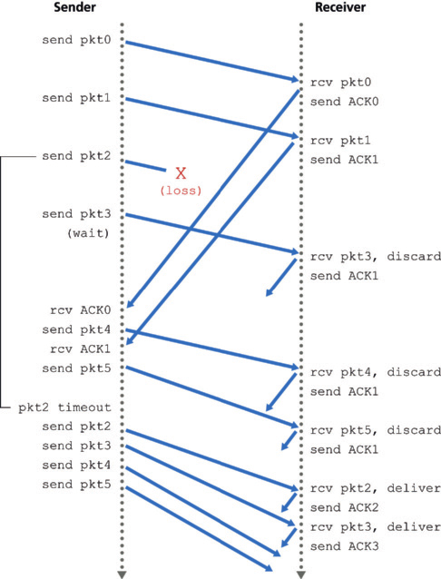

Figure 3.22 Go-Back-N in operation

##### 3.4.4 Selective Repeat (SR)

The GBN protocol allows the sender to potentially “fill the pipeline” in Figure 3.17 with packets, thus avoiding the channel utilization problems we noted with stop-and-wait protocols. There are, however, scenarios in which GBN itself suffers from performance problems. In particular, when the window size and bandwidth-delay product are both large, many packets can be in the pipeline. A single packet error can thus cause GBN to retransmit a large number of packets, many unnecessarily if they have been correctly received but are outof-order and thus buffered at the receiver. As the probability of channel errors increases, the pipeline can become filled with these unnecessary retransmissions. Imagine, in our message-dictation scenario, that if every time a word was garbled, the surrounding 1,000 words (for example, a window size of 1,000 words) had to be repeated. The dictation would be slowed by all of the reiterated words.

As the name suggests, selective-repeat protocols avoid unnecessary retransmissions by having the sender retransmit only those packets that were received in error (that is, were lost or corrupted) at the receiver. This individual, as-needed, retransmission will require that the receiver individually acknowledge correctly received packets. A window size of N  will again be

used to limit the number of outstanding, unacknowledged packets in the the SR sender. The SR receiver will acknowledge a correctly received packet whether or not it is in order. Out-of-order packets are buffered until any missing packets (that is, packets with lower sequence numbers) are received, at which point a batch of packets can be delivered in order to the upper layer. Figure 3.25 itemizes the various actions taken by the SR receiver. Figure 3.26 shows an example of SR operation in the presence of lost packets.

Note that in Figure 3.26, the receiver initially buffers packets 3, 4, and 5, and delivers them together with

Figure 3.23 Selective-repeat (SR) sender and receiver views of sequence-

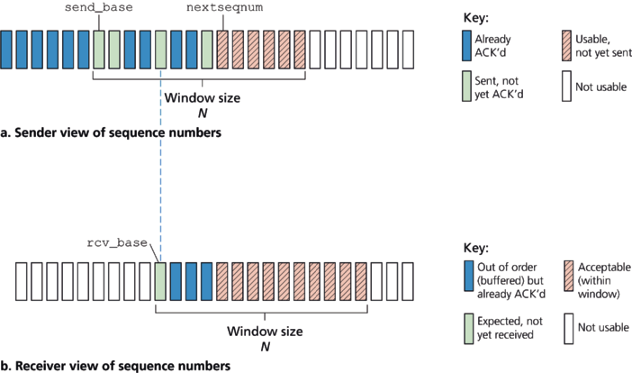

number space pipeline. However, unlike GBN, the sender will have already received ACKs for some of the packets in the window. Figure 3.23 shows the SR sender’s view of the sequence number space. Figure 3.24 details the various actions taken by packet 2 to the upper layer when packet 2 is finally received.

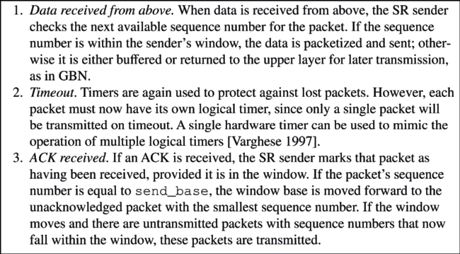

Figure 3.24 SR sender events and actions

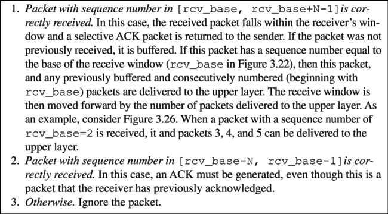

Figure 3.25 SR receiver events and actions Figure 3.26 SR operation

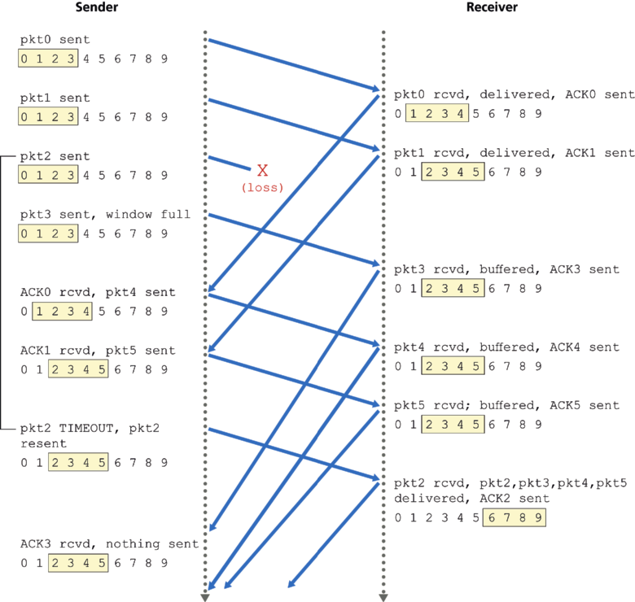

It is important to note that in Step 2 in Figure 3.25, the receiver reacknowledges (rather than ignores) already received packets with certain sequence numbers below the current window base. You should convince yourself that this reacknowledgment is indeed needed. Given the sender and receiver sequence number spaces in Figure 3.23, for example, if there is no ACK for send_base packet propagating from the receiver to the sender, the sender

send_base will eventually retransmit packet , even though it is clear (to us,

not the sender!) that the receiver has already received that packet. If the receiver were not to acknowledge this packet, the sender’s window would never move forward! This example illustrates an important aspect of SR protocols (and many other protocols as well). The sender and receiver will not always have an identical view of what has been received correctly and what has not. For SR protocols, this means that the sender and receiver windows will not always coincide.

Let’s conclude our discussion of reliable data transfer protocols by considering one remaining assumption in our underlying channel model. Recall that we have assumed that packets cannot be reordered within the channel between the sender and receiver. This is generally a reasonable assumption when the sender and receiver are connected by a single physical wire. However, when the “channel” connecting the two is a network, packet reordering can occur.

One manifestation of packet reordering is that old copies of a packet with a sequence or acknowledgment number of x can appear, even though neither the sender’s nor the receiver’s window contains x. With packet reordering, the

channel can be thought of as essentially buffering packets and spontaneously emitting these packets at any point in the future. Because sequence numbers may be reused, some care must be taken to guard against such duplicate packets. The approach taken in practice is to ensure that a sequence number is not reused until the sender is “sure” that any previously sent packets with sequence number x are no longer in the network. This is done by assuming

that a packet cannot “live” in the network for longer than some fixed maximum amount of time. A maximum packet lifetime of approximately three minutes is assumed in the TCP extensions for high-speed networks [RFC 7323].

[Sunshine 1978] describes a method for using sequence numbers such that reordering problems can be completely avoided.

#### 3.5 Connection-Oriented Transport: TCP

Now that we have covered the underlying principles of reliable data transfer, let’s turn to TCP—the Internet’s transport-layer, connection-oriented, reliable transport protocol. In this section, we’ll see that in order to provide reliable data transfer, TCP relies on many of the underlying principles discussed in the previous section, including error detection, retransmissions, cumulative acknowledgments, timers, and header fields for sequence and acknowledgment numbers. TCP is defined in RFC 793 and updated in various additional RFCs over the years, including RFC 1122, RFC 2018, RFC 5681, and RFC 7323. These and other changes have been gathered together with the original RFC 793 TCP specification into a new RFC [RFC 9293] that officially “obsoletes” RFC 793.

##### 3.5.1 The TCP Connection

TCP is said to be connection-oriented because before one application process can begin to send data to another, the two processes must first “handshake” with each other—that is, they must send some preliminary segments to each other to establish the parameters of the ensuing data transfer. As part of TCP connection establishment, both sides of the connection will initialize many TCP state variables (many of which will be discussed in this section and in Section 3.7) associated with the TCP connection.

The TCP “connection” is not an end-to-end TDM or FDM circuit as in a circuit-switched network. Instead, the “connection” is a logical one, with common state residing only in the TCPs in the two communicating end systems.

Recall that because the TCP protocol runs only in the end systems and not in the intermediate network elements (routers and link-layer switches), the intermediate network elements do not maintain TCP connection state. In fact, the intermediate routers are completely oblivious to TCP connections; they see datagrams, not connections.

A TCP connection provides a full-duplex service: If there is a TCP connection between Process A on one host and Process B on another host, then application-layer data can flow from Process A to Process B at the same time as application-layer data flows from Process B to Process A.A TCP connection is also always point-to-point, that is, between a single sender and a single receiver. So-called “multicasting” (see the online supplementary materials for this text)—the transfer of data from one sender to many receivers in a single send operation—is not possible with TCP.

With TCP, two hosts are company and three are a crowd!

Let’s now take a look at how a TCP connection is established. Suppose a process running in one host wants to initiate a connection with another process in another host. Recall that the process that is initiating the connection is called the client process, while the other process is called the server process. The client application process first informs the client transport layer that it wants to establish a connection to a process in the server. Recall from Section 2.6.2, a Python client program does this by issuing the command clientSocket.connect((serverName,serverPort)) serverName serverPort where is the name of the server and identifies

the process on the server. TCP in the client then proceeds to establish a TCP connection with TCP in the server. At the end of this section we discuss in some detail the connection-establishment procedure. For now it suffices to know that the client first sends a special TCP segment; the server responds with a second special TCP segment; and finally the client responds again with a third special segment. The first two segments carry no payload, that is, no application-layer data; the third of these segments may carry a payload.

Because three segments are sent between the two hosts, this connectionestablishment procedure is often referred to as a three-way handshake.

Case History Vinton Cerf, Robert Kahn, and TCP/IP In the early 1970s, packet-switched networks began to proliferate, with the ARPAnet—the precursor of the Internet—being just one of many networks.

Each of these networks had its own protocol. Two researchers, Vinton Cerf and Robert Kahn, recognized the importance of interconnecting these networks and invented a cross-network protocol called TCP/IP, which stands for Transmission Control Protocol/Internet Protocol. Although Cerf and Kahn began by seeing the protocol as a single entity, it was later split into its two parts, TCP and IP, which operated separately. Cerf and Kahn published a paper on TCP/IP in May 1974 in IEEE Transactions on Communications Technology [Cerf 1974].

The TCP/IP protocol, which is the bread and butter of today’s Internet, was devised before PCs, workstations, smartphones, and tablets, before the proliferation of Ethernet, cable, and DSL, WiFi, and other access network technologies, and before the Web, social media, and streaming video. Cerf and Kahn saw the need for a networking protocol that, on the one hand, provides broad support for yet-to-be-defined applications and, on the other hand, allows arbitrary hosts and link-layer protocols to interoperate.

In 2004, Cerf and Kahn received the ACM’s Turing Award, considered the “Nobel Prize of Computing” for “pioneering work on internetworking, including the design and implementation of the Internet’s basic communications protocols, TCP/IP, and for inspired leadership in networking.” Once a TCP connection is established, the two application processes can send data to each other. Let’s consider the sending of data from the client process to the server process. The client process passes a stream of data through the socket (the door of the process), as described in Section 2.6. Once the data passes through the door, the data is in the hands of TCP running in the client.

As shown in Figure 3.27, TCP directs this data to the connection’s send buffer, which is one of the buffers that is set aside during the initial three-way handshake. From time to time, TCP will grab chunks of data from the send buffer and pass the data to the network layer. Interestingly, the original TCP specification [RFC 793] is very laid back about specifying when TCP should actually send buffered data, stating that TCP should “send that data in segments at its

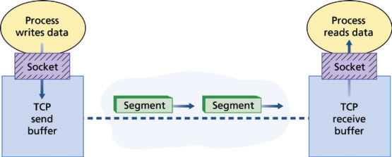

Figure 3.27 TCP send and receive buffers own convenience.” The maximum amount of data that can be grabbed and placed in a segment is limited by the maximum segment size (MSS). The MSS is typically set by first determining the length of the largest link-layer frame that can be sent by the local sending host (the so-called maximum transmission unit, MTU), and then setting the MSS to ensure that a TCP segment (when encapsulated in an IP datagram) plus the TCP/IP header length (typically 40 bytes) will fit into a single link-layer frame. Both Ethernet and PPP link-layer protocols have an MTU of 1,500 bytes. Thus, a typical value of MSS is 1460 bytes. Approaches have also been proposed for discovering the path MTU—the largest link-layer frame that can be sent on all links from source to destination [RFC 1191]—and setting the MSS based on the path MTU value.

Note that the MSS is the maximum amount of application-layer data in the segment, not the maximum size of the TCP segment including headers. (This terminology is confusing, but we have to live with it, as it is well entrenched.) TCP pairs each chunk of client data with a TCP header, thereby forming TCP segments. The segments are passed down to the network layer, where they are separately encapsulated within network-layer IP datagrams. The IP datagrams are then sent into the network.

When TCP receives a segment at the other end, the segment’s data is placed in the TCP connection’s receive buffer, as shown in Figure 3.27. The application reads the stream of data from this buffer. Each side of the connection has its own send buffer and its own receive buffer. (You can see the online flow-control interactive animation on the authors’ website, http://gaia.cs.umass.edu/kurose_ross, or at the publisher’s website, https://media.pearsoncmg.com/ov2/ph/esm/ecs_kurose_compnetwork_9/cw/ which provides an animation of the send and receive buffers.) We see from this discussion that a TCP connection consists of buffers, variables, and a socket connection to a process in one host, and another set of buffers, variables, and a socket connection to a process in another host. As mentioned earlier, no buffers or variables are allocated to the connection in the network elements (routers, switches, and repeaters) between the hosts.

##### 3.5.2 TCP Segment Structure

Having taken a brief look at the TCP connection, let’s examine the TCP segment structure. The TCP segment consists of header fields and a data field. The data field contains a chunk of application data. As mentioned above, the MSS limits the maximum size of a segment’s data field. When TCP sends a large file, such as an image as part of a Web page, it typically breaks the file into chunks of size MSS (except for the last chunk, which will often be less than the MSS). Interactive applications, however, often transmit data chunks that are smaller than the MSS; for example, with remote login applications such as Telnet and ssh, the data field in the TCP segment is often only one byte. Because the TCP header is typically 20 bytes (12 bytes more than the UDP header), segments sent by Telnet and ssh may be only 21 bytes in length.

Figure 3.28 shows the structure of the TCP segment. As with UDP, the header includes source and destination port numbers, which are used for multiplexing/demultiplexing data from/to upper-layer applications. Also, as with UDP, the header includes a checksum field. A TCP segment header also contains the following fields:

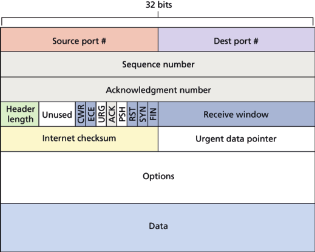

Figure 3.28 TCP segment structure

• The 32-bit sequence number field and the 32-bit acknowledgment number field are used by the TCP sender and receiver in implementing a reliable data transfer service, as discussed below.

• The 16-bit receive window field is used for flow control. We will see shortly that it is used to indicate the number of bytes that a receiver is willing to accept.

• The 4-bit header length field specifies the length of the TCP header in 32-bit words. The TCP header can be of variable length due to the TCP options field. (Typically, the options field is empty, so that the length of the typical TCP header is 20 bytes.)

• The optional and variable-length options field is used when a sender and receiver negotiate the maximum segment size (MSS) or as a window scaling factor for use in high-speed networks. A time-stamping option is also defined. See RFC 854 and RFC 1323 for additional details.

• The flag field contains 6 bits. The ACK bit is used to indicate that the value carried in the acknowledgment field is valid; that is, the segment contains an acknowledgment for a segment that has been successfully received. The RST, SYN, and FIN bits are used for connection setup and teardown, as we will discuss at the end of this section. The CWR and ECE bits are used in explicit congestion notification, as discussed in Section 3.7.2. Setting the PSH bit indicates that the receiver should pass the data to the upper layer immediately. Finally, the URG bit is used to indicate that there is data in this segment that the sending-side upperlayer entity has marked as “urgent.” The location of the last byte of this urgent data is indicated by the 16-bit urgent data pointer field. TCP must inform the receiving-side upper-layer entity when urgent data exists and pass it a pointer to the end of the urgent data. (In practice, the PSH, URG, and the urgent data pointer are not used. However, we mention these fields for completeness.)

Our experience as teachers is that our students sometimes find discussion of packet formats rather dry and perhaps a bit boring. For a fun and fanciful look at TCP header fields, particularly if you love Legos TM as we do, see

[Pomeranz 2010].

Sequence Numbers and Acknowledgment Numbers Two of the most important fields in the TCP segment header are the sequence number field and the acknowledgment number field. These fields are a critical part of TCP’s reliable data transfer service. But before discussing how these fields are used to provide reliable data transfer, let us first explain what exactly TCP puts in these fields.

TCP views data as an unstructured, but ordered, stream of bytes. TCP’s use of sequence numbers reflects this view in that sequence numbers are over the stream of transmitted bytes and not over the series of transmitted segments. The sequence number for a segment is therefore the byte-stream number of the first byte in the segment. Let’s look at an example. Suppose that a process in Host A wants to send a stream of data to a process in Host B over a TCP connection. The TCP in Host A will implicitly number each byte in the data stream. Suppose that the data stream consists of a file consisting of 500,000 bytes that the MSS is 1,000 bytes, and that the first byte of the data stream is numbered 0. As shown in Figure 3.29, TCP constructs 500 segments out of the data stream. The first segment gets assigned sequence number 0, the second segment gets assigned sequence number 1,000, the third segment gets assigned sequence number 2,000, and so on. Each sequence number is inserted in the sequence number field in the header of the appropriate TCP segment.

Now let’s consider acknowledgment numbers. These are a little trickier than sequence numbers. Recall that TCP is full-duplex, so that Host A may be receiving data from Host B while it sends data to Host B (as part of the same TCP connection). Each of the segments that arrive from Host B has a sequence number for the data flowing from B to A. The acknowledgment number that Host A puts in its segment is the sequence number of the next byte Host A is expecting from Host B. It is good to look at a few examples to understand what is going on here. Suppose that Host A has received all bytes numbered 0 through 535 from B and suppose that it is about to send a segment to Host B. Host A is waiting for byte 536 and all the subsequent bytes in Host B’s data stream. So Host A puts 536 in the acknowledgment number field of the segment it sends to B.

Figure 3.29 Dividing

file data into TCP segments

As another example, suppose that Host A has received one segment from Host B containing bytes 0 through 535 and another segment containing bytes 900 through 1,000. For some reason Host A has not yet received bytes 536 through 899. In this example, Host A is still waiting for byte 536 (and beyond) in order to re-create B’s data stream. Thus, A’s next segment to B will contain 536 in the acknowledgment number field. Because TCP only acknowledges bytes up to the first missing byte in the stream, TCP is said to provide cumulative acknowledgments.

This last example also brings up an important but subtle issue. Host A received the third segment (bytes 900 through 1,000) before receiving the second segment (bytes 536 through 899). Thus, the third segment arrived out of order. The subtle issue is: What does a host do when it receives out-of-order segments in a TCP connection? Interestingly, the TCP RFCs do not impose any rules here and leave the decision up to the programmers implementing a TCP implementation. There are basically two choices: either (1) the receiver immediately discards out-of-order segments (which, as we discussed earlier, can simplify receiver design), or (2) the receiver keeps the out-of-order bytes and waits for the missing bytes to fill in the gaps. Clearly, the latter choice is more efficient in terms of network bandwidth, and is the approach taken in practice.

In Figure 3.29, we assumed that the initial sequence number was zero. In truth, both sides of a TCP connection randomly choose an initial sequence number. This is done to minimize the possibility that a segment that is still present in the network from an earlier, already-terminated connection between two hosts is mistaken for a valid segment in a later connection between these same two hosts (which also happen to be using the same port numbers as the old connection) [Sunshine 1978].

Telnet: A Case Study for Sequence and Acknowledgment Numbers Telnet, defined in RFC 854, is a popular application-layer protocol used for remote login. It runs over TCP and is designed to work between any pair of hosts. Unlike the bulk data transfer applications discussed in Chapter 2, Telnet is an interactive application. We discuss a Telnet example here, as it nicely illustrates TCP sequence and acknowledgment numbers. We note that users now prefer to use the SSH protocol rather than Telnet, since data sent in a Telnet connection (including passwords!) are not encrypted, making Telnet vulnerable to eavesdropping attacks.

Suppose Host A initiates a Telnet session with Host B.Because Host A initiates the session, it is labeled the client, and Host B is labeled the server. Each character typed by the user (at the client) will be sent to the remote host; the remote host will send back a copy of each character, which will be displayed on the Telnet user’s screen.

This “echo back” is used to ensure that characters seen by the Telnet user have already been received and processed at the remote site. Each character thus traverses the network twice between the time the user hits the key and the time the character is displayed on the user’s monitor.

Now suppose the user types a single letter, ‘C,’ and then grabs a coffee.

Let’s examine the TCP segments that are sent between the client and server. As shown in Figure 3.30, we suppose the starting sequence numbers are 42 and 79 for the client and server, respectively. Recall that the sequence number of a segment is the sequence number of the first byte in the data field. Thus, the first segment sent from the client will have sequence number 42; the first segment sent from the server will have sequence number 79. Recall that the acknowledgment number is the sequence number of the next byte of data that the host is waiting for. After the TCP connection is established but before any data is sent, the client is waiting for byte 79 and the server is waiting for byte 42.

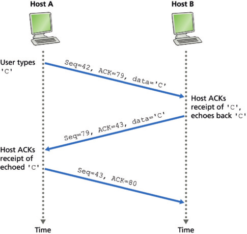

Figure 3.30 Sequence and acknowledgment numbers for a simple Telnet application over TCP

As shown in Figure 3.30, three segments are sent. The first segment is sent from the client to the server, containing the 1-byte ASCII representation of the letter ‘C’ in its data field. This first segment also has 42 in its sequence number field, as we just described. Also, because the client has not yet received any data from the server, this first segment will have 79 in its acknowledgment number field.

The second segment is sent from the server to the client. It serves a dual purpose. First it provides an acknowledgment of the data the server has received. By putting 43 in the acknowledgment field, the server is telling the client that it has successfully received everything up through byte 42 and is now waiting for bytes 43 onward. The second purpose of this segment is to echo back the letter ‘C.’ Thus, the second segment has the ASCII representation of ‘C’ in its data field. This second segment has the sequence number 79, the initial sequence number of the server-to-client data flow of this TCP connection, as this is the very first byte of data that the server is sending. Note that the acknowledgment for client-to-server data is carried in a segment carrying server-to-client data; this acknowledgment is said to be piggybacked on the server-to-client data segment.

The third segment is sent from the client to the server. Its sole purpose is to acknowledge the data it has received from the server. (Recall that the second segment contained data—the letter ‘C’—from the server to the client.)

This segment has an empty data field (that is, the acknowledgment is not being piggybacked with any client-to-server data). The segment has 80 in the acknowledgment number field because the client has received the stream of bytes up through byte sequence number 79 and it is now waiting for bytes 80 onward. You might think it odd that this segment also has a sequence number since the segment contains no data. But because TCP has a sequence number field, the segment needs to have some sequence number.

##### 3.5.3 Round-Trip Time Estimation and Timeout

TCP, like our protocol in Section 3.4, uses a timeout/retransmit mecha-

nism to recover from lost segments. Although this is conceptually simple, many subtle issues arise when we implement a timeout/retransmit mechanism in an actual protocol such as TCP.Perhaps the most obvious question is the length of the timeout intervals. Clearly, the timeout should be larger than the connection’s round-trip time (RTT), that is, the time from when a segment is sent until it is acknowledged. Otherwise, unnecessary retransmissions would be sent.

But how much larger? How should the RTT be estimated in the first place? Should a timer be associated with each and every unacknowledged segment? So many questions! Our discussion in this section is based on the TCP work in [Jacobson 1988] and the current IETF recommendations for managing TCP timers [RFC 6298].

Estimating the Round-Trip Time Let’s begin our study of TCP timer management by considering how TCP estimates the round-trip time between sender and receiver. This is accomplished

SampleRTT, as follows. The sample RTT, denoted for a segment is the amount

of time between when the segment is sent (that is, passed to IP) and when an acknowledgment for the segment is received. Instead of measuring a SampleRTT for every transmitted segment, most TCP implementations take SampleRTT only one measurement at a time. That is, at any point in time, the

SampleRTT is being estimated for only one of the transmitted but currently

SampleRTT unacknowledged segments, leading to a new value of approxi- SampleRTT mately once every RTT. Also, TCP never computes a for a

SampleRTT segment that has been retransmitted; it only measures for seg-

ments that have been transmitted once [Karn 1987]. (A problem at the end of the chapter asks you to consider why.)

SampleRTT Obviously, the values will fluctuate from segment to seg-

ment due to congestion in the routers and to the varying load on the end

SampleRTT systems. Because of this fluctuation, any given value may be

atypical. In order to estimate a typical RTT, it is therefore natural to take some

SampleRTT sort of average of the values. TCP maintains an average, called

EstimatedRTT, SampleRTT of the values. Upon obtaining a new

SampleRTT, EstimatedRTT TCP updates according to the following

formula:

EstimatedRTT = (1 - ) · EstimatedRTT + · SampleRTT α α

The formula above is written in the form of a programming-language statement—the new value of EstimatedRTT is a weighted combination of the previous value of EstimatedRTT and the new value for SampleRTT. The recommended value of α is α = 0.125 (that is, 1 8) [RFC 6298], in which case the

formula above becomes:

EstimatedRTT = 0.875 · EstimatedRTT + 0.125 · SampleRTT

Note that EstimatedRTT is a weighted average of the SampleRTT values.

As discussed in a homework problem at the end of this chapter, this weighted average puts more weight on recent samples than on old samples. This is natural, as the more recent samples better reflect the current congestion in the network. In statistics, such an average is called an exponential weighted moving average (EWMA). The word “exponential” appears in EWMA because

SampleRTT the weight of a given decays exponentially fast as the updates

proceed. In the homework problems, you will be asked to derive the exponen- EstimatedRTT. tial term in

SampleRTT EstimatedRTT Figure 3.31 shows the values and for a

gaia.cs.umass.edu value of α = 1 8 for a TCP connection between (in

fantasia.eurecom.fr Amherst, Massachusetts) to (in the south of France).

SampleRTT Clearly, the variations in the are smoothed out in the computa-

EstimatedRTT. tion of the In addition to having an estimate of the RTT, it is also valuable to have a measure of the variability of the RTT. [RFC 6298] defines the RTT variation, DevRTT SampleRTT , as an estimate of how much typically deviates from

EstimatedRTT:

DevRTT = (1 - ) · DevRTT + · | SampleRTT -  EstimatedRTT | β β

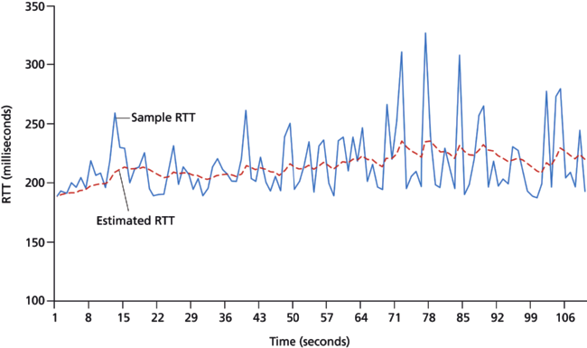

Figure 3.31 RTT samples and RTT estimates

DevRTT SampleRTT Note that is an EWMA of the difference between

EstimatedRTT. SampleRTT and If the values have little fluctuation, then

DevRTT DevRTT will be small; on the other hand, if there is a lot of fluctuation, will be large. The recommended value of β is 0.25.

Setting and Managing the Retransmission Timeout Interval

EstimatedRTT DevRTT Given values of and , what value should be used for

TCP’s timeout interval? Clearly, the interval should be greater than or equal to EstimatedRTT, or unnecessary retransmissions would be sent. But the time-

EstimatedRTT; out interval should not be too much larger than otherwise,

when a segment is lost, TCP would not quickly retransmit the segment, leading to large data transfer delays. It is therefore desirable to set the timeout EstimatedRTT equal to the plus some margin. The margin should be large SampleRTT when there is a lot of fluctuation in the values; it should be small DevRTT when there is little fluctuation. The value of should thus come into

play here. All of these considerations are taken into account in TCP’s method for determining the retransmission timeout interval:

TimeoutInterval = EstimatedRTT + 4 · DevRTT Principles in Practice TCP provides reliable data transfer by using positive acknowledgments and timers in much the same way that we studied in Section 3.4. TCP acknowledges data that has been received correctly, and it then retransmits segments when segments or their corresponding acknowledgments are thought to be lost or corrupted. Certain versions of TCP also have an implicit NAK mechanism—with TCP’s fast retransmit mechanism, the receipt of three duplicate ACKs for a given segment serves as an implicit NAK for the following segment, triggering retransmission of that segment before timeout. TCP uses sequences of numbers to allow the receiver to identify lost or duplicate segments. Just as in the case of our reliable data transfer protocol, rdt3.0 , TCP cannot itself tell for certain if a segment, or its ACK, is lost, corrupted, or overly delayed. At the sender, TCP’s response will be the same: retransmit the segment in question.

TCP also uses pipelining, allowing the sender to have multiple transmitted but yet-to-be-acknowledged segments outstanding at any given time. We saw earlier that pipelining can greatly improve a session’s throughput when the ratio of the segment size to round-trip delay is small. The specific number of outstanding, unacknowledged segments that a sender can have is determined by TCP’s flow-control and congestion-control mechanisms. TCP flow control is discussed at the end of this section; TCP congestion control is discussed in Section 3.7. For the time being, we must simply be aware that the TCP sender uses pipelining.

TimeoutInterval An initial value of 1 second is recommended [RFC

TimeoutInterval 6298]. Also, when a timeout occurs, the value of is doubled to avoid a premature timeout occurring for a subsequent segment that will soon be acknowledged. However, as soon as a segment is received and EstimatedRTT TimeoutInterval is updated, the is again computed using

the formula above.

##### 3.5.4 Reliable Data Transfer

Recall that the Internet’s network-layer service (IP service) is unreliable. IP does not guarantee datagram delivery, does not guarantee in-order delivery of datagrams, and does not guarantee the integrity of the data in the datagrams.

With IP service, datagrams can overflow router buffers and never reach their destination, datagrams can arrive out of order, and bits in the datagram can get corrupted (flipped from 0 to 1 and vice versa). Because transport-layer segments are carried across the network by IP datagrams, transport-layer segments can suffer from these problems as well.

TCP creates a reliable data transfer service on top of IP’s unreliable besteffort service. TCP’s reliable data transfer service ensures that the data stream that a process reads out of its TCP receive buffer is uncorrupted, without gaps, without duplication, and in sequence; that is, the byte stream is exactly the same byte stream that was sent by the end system on the other side of the connection. How TCP provides a reliable data transfer involves many of the principles that we studied in Section 3.4.

In our earlier development of reliable data transfer techniques, it was conceptually easiest to assume that an individual timer is associated with each transmitted but not yet acknowledged segment. While this is great in theory, timer management can require considerable overhead. Thus, the recommended TCP timer management procedures [RFC 6298] use only a single retransmission timer, even if there are multiple transmitted but not yet acknowledged segments. The TCP protocol described in this section follows this single-timer recommendation.

We will discuss how TCP provides reliable data transfer in two incremental steps. We first present a highly simplified description of a TCP sender that uses only timeouts to recover from lost segments; we then present a more complete description that uses duplicate acknowledgments in addition to timeouts. In the ensuing discussion, we suppose that data is being sent in only one direction, from Host A to Host B, and that Host A is sending a large file.

Figure 3.32 presents a highly simplified description of a TCP sender. We see that there are three major events related to data transmission and retransmission in the TCP sender: data received from application above; timer timeout;

and ACK receipt. Upon the occurrence of the first major event, TCP receives data from the application, encapsulates the data in a segment, and passes the segment to IP. Note that each segment includes a sequence number that is the byte-stream number of the first data byte in the segment, as described in Section 3.5.2. Also note that if the timer is already not running for some other segment, TCP starts the timer when the segment is passed to IP. (It is helpful to think of the timer as being associated with the oldest unacknowledged segment.)

Figure 3.32 Simplified TCP sender

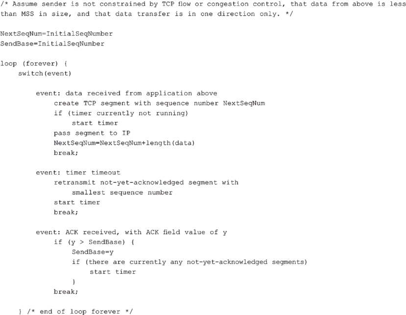

TimeoutInterval The expiration interval for this timer is the , which is calcu- EstimatedRTT DevRTT lated from and , as described in Section 3.5.3.The second major event is the timeout.TCP responds to the timeout event by retransmitting the segment that caused the timeout.TCP then restarts the timer. The third major event that must be handled by the TCP sender is the arrival of an acknowledgment segment (ACK) from the receiver (more specifically, a segment containing a valid ACK field value).On the occurrence of this y SendBase event, TCP compares the ACK value with its variable .The TCP SendBase state variable is the sequence number of the oldest unacknowl- SendBase–1 edged byte. (Thus is the sequence number of the last byte that is known to have been received correctly and in order at the receiver.)

As indi- y cated earlier, TCP uses cumulative acknowledgments, so that acknowledges y y > SendBase the receipt of all bytes before byte number . If , then the ACK is acknowledging one or more previously unacknowledged segments. Thus SendBase the sender updates its variable; it also restarts the timer if there cur- rently are any not-yet-acknowledged segments.

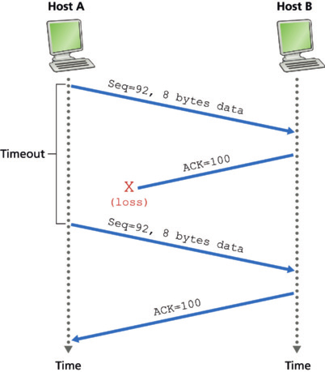

Figure 3.33 Retransmission due to a lost acknowledgment

A Few Interesting Scenarios We have just described a highly simplified version of how TCP provides reliable data transfer. But even this highly simplified version has many subtleties.

To get a good feeling for how this protocol works, let’s now walk through a few simple scenarios. Figure 3.33 depicts the first scenario, in which Host A sends one segment to Host B. Suppose that this segment has sequence number 92 and contains 8 bytes of data. After sending this segment, Host A waits for a segment from B with acknowledgment number 100. Although the segment from A is received at B, the acknowledgment from B to A gets lost. In this case, the timeout event occurs, and Host A retransmits the same segment. Of course, when Host B receives the retransmission, it observes from the sequence number that the segment contains data that has already been received. Thus, TCP in Host B will discard the bytes in the retransmitted segment.

In a second scenario, shown in Figure 3.34, Host A sends two segments back to back. The first segment has sequence number 92 and 8 bytes of data, and the second segment has sequence number 100 and 20 bytes of data. Suppose that both segments arrive intact at B, and B sends two separate acknowledgments for each of these segments. The first of these acknowledgments has acknowledgment number 100; the second has acknowledgment number 120. Suppose now that neither of the acknowledgments arrives at Host A before the timeout. When the timeout event occurs, Host A resends the first segment with sequence number 92 and restarts the timer. As long as the ACK for the second segment arrives before the new timeout, the second segment will not be retransmitted.

In a third and final scenario, suppose Host A sends the two segments, exactly as in the second example. The acknowledgment of the first segment is lost in the network, but just before the timeout event, Host A receives an acknowledgment with acknowledgment number 120. Host A therefore knows that Host B has received everything up through byte 119; so Host A does not resend either of the two segments. This scenario is illustrated in Figure 3.35.

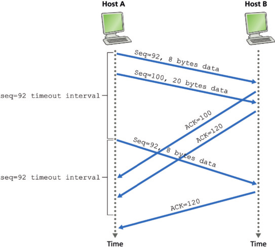

Figure 3.34 Segment 100 not retransmitted

Fast Retransmit One of the problems with timeout-triggered retransmissions is that the timeout period can be relatively long. When a segment is lost, this long timeout period forces the sender to delay resending the lost packet, thereby increasing the end-to-end delay. Fortunately, the sender can often infer packet loss well before the timeout event occurs by noting so-called duplicate ACKs. A duplicate ACK is an ACK that reacknowledges a segment for which the sender has already received an earlier acknowledgment. To understand the sender's response to a duplicate ACK, we must look at why the receiver sends a duplicate ACK in the first place.

When a TCP receiver receives a segment with a sequence number that is larger than the next, expected, in-order sequence number, it detects a gap in the data stream—that is, a missing segment. This gap could be the result of lost or reordered segments within the network. Since TCP uses cumulative ACKs, when a gap is detected, the TCP receiver simply reacknowledges (that is, generates a duplicate ACK for) the last in-order byte of data it has received.

Because the sender uses pipelining, there may be many segments in flight between the sender and receiver. If one in-flight segment is lost, there will likely be many back-to-back duplicate ACKs generated by the TCP receiver.

Thus, if the TCP sender receives three duplicate ACKs for the same data (i.e., receives an original ACK for this data and then receives three additional ACKs for this same data), it takes this as an indication that the segment following the segment that has been ACKed four times has been lost. (In the homework problems, we consider the question of why the sender waits for three duplicate ACKs, rather than just a single duplicate ACK.)

In the case that triple duplicate ACKs are received, the TCP sender performs a fast retransmit [RFC 5681], retransmitting the missing segment before that segment’s timer expires.

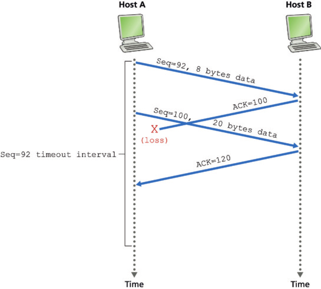

Figure 3.35 A cumulative acknowledgment avoids retransmission of the first segment

Go-Back-N or Selective Repeat?

Let’s close our study of TCP’s error-recovery mechanism by considering the following question: Is TCP a GBN or an SR protocol? Recall that TCP acknowledgments are cumulative and correctly received but out-of-order segments are not individually ACKed by the receiver. Consequently, as shown in Figure 3.32 (see also Figure 3.19), the TCP sender need only maintain the smallest sequence

SendBase number of a transmitted but unacknowledged byte  and the

NextSeqNum sequence number of the next byte to be sent . In this sense, TCP

looks a lot like a GBN-style protocol. But there are some striking differences between TCP and Go-Back-N. Many TCP implementations will buffer correctly received but out-of-order segments [Stevens 1994]. Consider also what happens when the sender sends a sequence of segments 1, 2, . . . , N, and all of the segments arrive in order without error at the receiver. Further suppose that the acknowledgment for packet n < N gets lost, but the remaining N −

acknowledgments arrive at the sender before their respective timeouts. In this example, GBN would retransmit not only packet n, but also all of the subse-

quent packets n + 1 , n + 2 , . . . , N. TCP, on the other hand, would retransmit

at most one segment, namely, segment n. Moreover, TCP would not even

retransmit segment n if the acknowledgment for segment n + 1 arrived before

the timeout for segment n.

A proposed modification to TCP, the so-called selective acknowledgment [RFC 2018], allows a TCP receiver to acknowledge out-of-order segments selectively rather than just cumulatively acknowledging the last correctly received, in-order segment. When combined with selective retransmission— skipping the retransmission of segments that have already been selectively acknowledged by the receiver—TCP looks a lot like our generic SR protocol.

Thus, TCP’s error-recovery mechanism is probably best categorized as a hybrid of GBN and SR protocols.

##### 3.5.5 Flow Control

Recall that the hosts on each side of a TCP connection set aside a receive buffer for the connection. When the TCP connection receives bytes that are correct and in sequence, it places the data in the receive buffer. The associated application process will read data from this buffer, but not necessarily at the instant the data arrives. Indeed, the receiving application may be busy with some other task and may not even attempt to read the data until long after it has arrived. If the application is relatively slow at reading the data, the sender can very easily overflow the connection’s receive buffer by sending too much data too quickly.

TCP provides a flow-control service to its applications to eliminate the possibility of the sender overflowing the receiver’s buffer. Flow control is thus a speed-matching service—matching the rate at which the sender is sending against the rate at which the receiving application is reading. As noted earlier, a TCP sender can also be throttled due to congestion within the IP network; this form of sender control is referred to as congestion control, a topic we will explore in detail in Sections 3.6 and 3.7. Even though the actions taken by flow and congestion control are similar (the throttling of the sender), they are obviously taken for very different reasons. Unfortunately, many authors use the terms interchangeably, and the savvy reader would be wise to distinguish between them.

Let’s now discuss how TCP provides its flow-control service. In order to see the forest for the trees, we suppose throughout this section that the TCP implementation is such that the TCP receiver discards out-of-order segments.

TCP provides flow control by having the sender maintain a variable called the receive window. Informally, the receive window is used to give the sender an idea of how much free buffer space is available at the receiver. Because TCP is full-duplex, the sender at each side of the connection maintains a distinct receive window. Let’s investigate the receive window in the context of a file transfer. Suppose that Host A is sending a large file to Host B over a TCP connection. Host B allocates a receive buffer to this connection; denote its size by RcvBuffer . From time to time, the application process in Host B reads from the buffer. Define the following variables:

LastByteRead • : the number of the last byte in the data stream read from

the buffer by the application process in B LastByteRcvd • : the number of the last byte in the data stream that has

arrived from the network and has been placed in the receive buffer at B Because TCP is not permitted to overflow the allocated buffer, we must have LastByteRcvd – LastByteRead ≤ RcvBuffer rwnd able is illustrated in Figure 3.36.

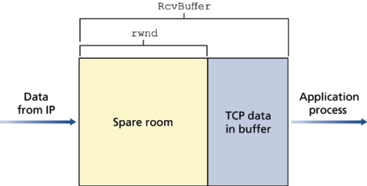

Figure 3.36 The (rwnd) receive window and the receive buffer (RcvBuffer)

rwnd The receive window, denoted is set to the amount of spare room in

the buffer:

rwnd = RcvBuffer – [LastByteRcvd – LastByteRead]

rwnd Because the spare room changes with time, is dynamic. The vari-

rwnd How does the connection use the variable to provide the flow-con-

trol service? Host B tells Host A how much spare room it has in the connection

rwnd buffer by placing its current value of in the receive window field of rwnd = RcvBuffer every segment it sends to A.Initially, Host B sets .

Note

that to pull this off, Host B must keep track of several connection-specific variables.

LastByteSent Host A in turn keeps track of two variables, and

LastByteAcked , which have obvious meanings. Note that the difference LastByteSent – LastByteAcked between these two variables, , is the

amount of unacknowledged data that A has sent into the connection. By keep-

rwnd, ing the amount of unacknowledged data less than the value of Host A

is assured that it is not overflowing the receive buffer at Host B. Thus, Host A makes sure throughout the connection’s life that LastByteSent – LastByteAcked ≤ rwnd There is one minor technical problem with this scheme. To see this, sup-

rwnd = 0 pose Host B’s receive buffer becomes full so that .

After advertising

rwnd = 0 to Host A, also suppose that B has nothing to send to A.Now consider what happens.

As the application process at B empties the buffer, TCP

rwnd does not send new segments with new values to Host A; indeed, TCP

sends a segment to Host A only if it has data to send or if it has an acknowledgment to send. Therefore, Host A is never informed that some space has opened up in Host B’s receive buffer—Host A is blocked and can transmit no more data! To solve this problem, the TCP specification requires Host A to continue to send segments with one data byte when B’s receive window is zero. These segments will be acknowledged by the receiver. Eventually the buffer will

rwnd begin to empty and the acknowledgments will contain a nonzero value.

The online site at for this book provides an interactive animation that illustrates the operation of the TCP receive window.

Having described TCP’s flow-control service, we briefly mention here that UDP does not provide flow control and consequently, segments may be lost at the receiver due to buffer overflow. For example, consider sending a series of UDP segments from a process on Host A to a process on Host B. For a typical UDP implementation, UDP will append the segments in a finite-sized buffer that “precedes” the corresponding socket (that is, the door to the process). The process reads one entire segment at a time from the buffer. If the process does not read the segments fast enough from the buffer, the buffer will overflow and segments will get dropped.

##### 3.5.6 TCP Connection Management

In this subsection, we take a closer look at how a TCP connection is established and torn down. Although this topic may not seem particularly thrilling, it is important because TCP connection establishment can significantly add to perceaved delays (for example, when surfing the Web). Furthermore, many of the most common network attacks—including the incredibly popular SYN flood attack (see sidebar on the SYN flood attack)—exploit vulnerabilities in TCP connection management. Let’s first take a look at how a TCP connection is established. Suppose a process running in one host (client) wants to initiate a connection with another process in another host (server). The client application process first informs the client TCP that it wants to establish a connection to a process in the server. The TCP in the client then proceeds to establish a TCP connection with the TCP in the server in the following manner:

• Step 1. The client-side TCP first sends a special TCP segment to the serverside TCP. This special segment contains no application-layer data. But one of the flag bits in the segment’s header (see Figure 3.28), the SYN bit, is set to 1. For this reason, this special segment is referred to as a SYN segment.

In addition, the client randomly chooses an initial sequence number client_isn  and puts this number in the sequence number field of the

initial TCP SYN segment. This segment is encapsulated within an IP datagram and sent to the server. There has been considerable interest in prop-

client_isn erly randomizing the choice of the in order to avoid certain

security attacks [RFC 4987].

• Step 2. Once the IP datagram containing the TCP SYN segment arrives at the server host (assuming it does arrive!), the server extracts the TCP SYN segment from the datagram, allocates the TCP buffers and variables to the connection, and sends a connection-granted segment to the client TCP.

(We’ll see in Chapter 8 that the allocation of these buffers and variables before completing the third step of the three-way handshake makes TCP vulnerable to a denial-of-service attack known as SYN flooding.) This connection-granted segment also contains no application-layer data.

However, it does contain three important pieces of information in the segment header. First, the SYN bit is set to 1. Second, the acknowledgment

client_isn+1 field of the TCP segment header is set to . Finally, the server_isn server chooses its own initial sequence number  and puts

this value in the sequence number field of the TCP segment header. This connection-granted segment is saying, in effect, “I received your SYN packet to start a connection with your initial sequence number, client_isn . I agree to establish this connection. My own initial sequence server_isn number is .” The connection-granted segment is referred to

as a SYNACK segment.

• Step 3. Upon receiving the SYNACK segment, the client also allocates buffers and variables to the connection. The client host then sends the server yet another segment; this last segment acknowledges the server’s connection-granted segment (the client does so by putting the value server_isn+1 in the acknowledgment field of the TCP segment header).

The SYN bit is set to zero, since the connection is established. This third stage of the three-way handshake may carry client-to-server data in the segment payload.

Once these three steps have been completed, the client and server hosts can send segments containing data to each other. In each of these future segments, the SYN bit will be set to zero. Note that in order to establish the connection, three packets are sent between the two hosts, as illustrated in Figure 3.37. For this reason, this connection-establishment procedure is often referred to as a three-way handshake. Several aspects of the TCP three-way handshake are explored in the homework problems (Why are initial sequence numbers needed? Why is a three-way handshake, as opposed to a two-way handshake, needed?). It’s interesting to note that a rock climber and a belayer (who is stationed below the rock climber and whose job it is to handle the climber’s safety rope) use a three-way-handshake communication protocol that is identical to TCP’s to ensure that both sides are ready before the climber begins ascent.

Given that the TCP client that initiates a three-way handshake needs to wait to receive a SYNACK message from the server before it knows that the server has accepted the connection and that the connection’s state has been initialized, it would seem that a one RTT delay is inherent in connection setup for

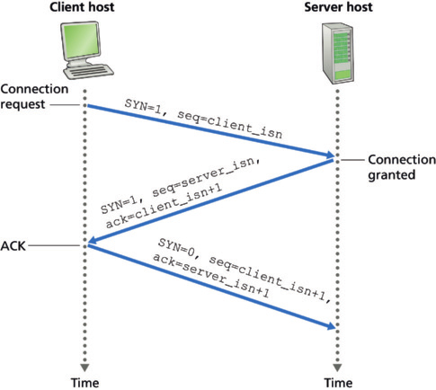

Figure 3.37 TCP three-way handshake: segment exchange any such handshaking protocol (e.g., the TLS protocol that we will study in Chapter 8, or the QUIC protocol that we studied in Chapter 2 and will revisit later in this chapter). However, if the client and server have previously communicated, it’s possible to use a technique known as “fast open” to reduce the handshaking time to zero! That is, a client can immediately send data to a connection-oriented server with which it has previously communicated without undertaking the first two steps of a traditional 3-way handshake.

The key idea behind fast open, also sometimes referred to as 0 RTT hand-

shaking, is that during a traditional three-way handshake, a client can also request that the server provide it with a fast-open cookie, which encodes all of the connection information needed in a future connection. This cookie is saved at the client and the server. The next time the client wants to establish a connection with this server, it sends the fast-open cookie together with application-layer data in its very first message to the server. The server inspects the cookie, and finding it acceptable, will accept the connection, establish the connection’s parameters from the cookie, and respond to the client application-layer data contained in the initial message, with the server’s application-layer response data—thus completely avoiding the one RTT delay in three-way handshake before data can be sent.

It’s important to note that fast-open is only a potential optimization for the client; the server may not accept the fast-open cookie for policy reasons, e.g., the server no longer wants to communicate with that client, or wants to force that client to reauthenticate itself (e.g., in the case of TLS handshaking). Just because a client brings a cookie to a server, doesn’t mean the server has to eat (accept) the cookie! Of course, the fast-open cookie must be created in a cryptographically secure way, using the techniques we’ll study in Chapter 8. TCP Fast Open is described in RFC 7413; the TLS (see Chapter 8 and RFC 8446) and QUIC protocols [RFC 9000; RFC 9002] also support zero-RTT fast opens.

All good things must come to an end, and the same is true with a TCP connection. Either of the two processes participating in a TCP connection can end the connection. When a connection ends, the “resources” (that is, the buffers and variables) in the hosts are deallocated. As an example, suppose the client decides to close the connection, as shown in Figure 3.38. The client application process issues a close command. This causes the client TCP to send a special TCP segment to the server process. This special segment has a flag bit in the segment’s header, the FIN bit (see Figure 3.28), set to 1. When the server receives this segment, it sends the client an acknowledgment segment in return. The server then sends its own shutdown segment, which has the FIN bit set to 1. Finally, the client acknowledges the server’s shutdown segment. At this point, all the resources in the two hosts are now deallocated.

During the life of a TCP connection, the TCP protocol running in each host makes transitions through various TCP states. Figure 3.39 illustrates a typical sequence of TCP states that are visited by the client TCP.The client TCP begins in the CLOSED state. The application on the client side initiates a new TCP connection (by creating a Socket object in our Python examples from Chapter 2).

This causes TCP in the client to send a SYN segment to TCP in the server. After having sent the SYN segment, the client TCP enters the SYN_ SENT state. While in the SYN_SENT state, the client TCP waits for a segment from the server TCP that includes an acknowledgment for the client’s previous segment and has the SYN bit set to 1. Having received such a segment, the client TCP enters the ESTABLISHED state. While in the ESTABLISHED state, the TCP client can send and receive TCP segments containing payload (that is, application-generated) data.

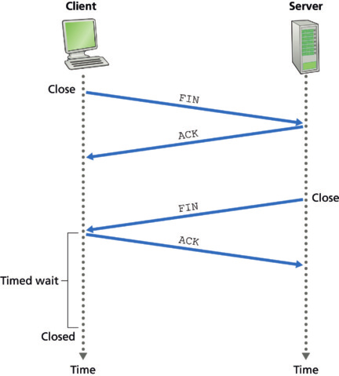

Figure 3.38 Closing a TCP connection

Suppose that the client application decides it wants to close the connection. (Note that the server could also choose to close the connection.) This causes the client TCP to send a TCP segment with the FIN bit set to 1 and to enter the FIN_WAIT_1 state. While in the FIN_WAIT_1 state, the client TCP waits for a TCP segment from the server with an acknowledgment. When it

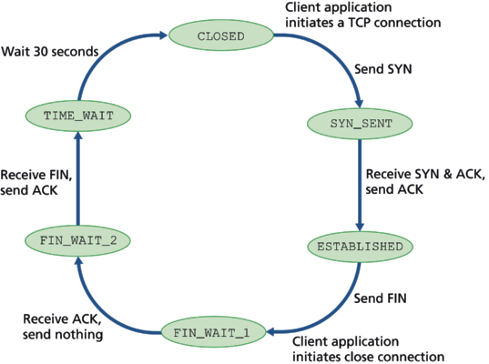

Figure 3.39 A typical sequence of TCP states visited by a client TCP receives this segment, the client TCP enters the FIN_WAIT_2 state. While in the FIN_WAIT_2 state, the client waits for another segment from the server with the FIN bit set to 1; after receiving this segment, the client TCP acknowledges the server’s segment and enters the TIME_WAIT state. The TIME_WAIT state lets the TCP client resend the final acknowledgment in case the ACK is lost. The time spent in the TIME_WAIT state is implementation-dependent, but typical values are 30 seconds, 1 minute, and 2 minutes. After the wait, the connection formally closes and all resources on the client side (including port numbers) are released.

Figure 3.40 illustrates the series of states typically visited by the serverside TCP, assuming the client begins connection teardown. The transitions are self-explanatory. In these two state-transition diagrams, we have only shown how a TCP connection is normally established and shut down. We have not described what happens in certain pathological scenarios, for example, when both sides of a connection want to initiate or shut down at the same time. If you are interested in learning about this and other advanced issues concerning TCP, you are encouraged to see Stevens’ comprehensive book [Stevens 1994].

Our discussion above has assumed that both the client and server are prepared to communicate, that is, that the server is listening on the port to which the client sends its SYN segment. Let’s consider what happens when a host receives a TCP segment whose port numbers or source IP address do not match with any of the ongoing sockets in the host. For example, suppose a host receives a TCP SYN packet with destination port 80, but the host is not accepting connections on port 80 (that is, it is not running a Web server on port 80).

Then the host will send a special reset segment to the source. This TCP segment has the RST flag bit (see Section 3.5.2) set to 1. Thus, when a host sends a reset segment, it is telling the source “I don’t have a socket for that segment.

Please do not resend the segment.” When a host receives a UDP packet whose destination port number doesn’t match with an ongoing UDP socket, the host sends a special ICMP datagram, as discussed in Chapter 5.

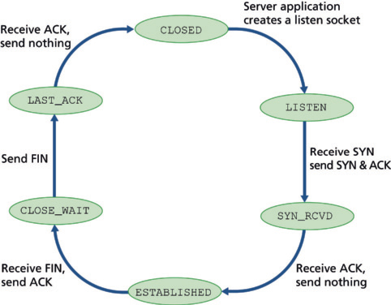

Figure 3.40 A typical sequence of TCP states visited by a server-side TCP

Focus on Security The Syn Flood Attack We’ve seen in our discussion of TCP’s three-way handshake that a server allocates and initializes connection variables and buffers in response to a received SYN. The server then sends a SYNACK in response, and awaits an ACK segment from the client. If the client does not send an ACK to complete the third step of this 3-way handshake, eventually (often after a minute or more) the server will terminate the half-open connection and reclaim the allocated resources.

This TCP connection management protocol sets the stage for a classic Denial of Service (DoS) attack known as the SYN flood attack .

In this attack,

the attacker(s) send a large number of TCP SYN segments, without completing the third handshake step.

With this deluge of SYN segments, the server’s connection resources become exhausted as they are allocated (but never used!) for half-open connections; legitimate clients are then denied service.

Such SYN flooding attacks were among the first documented DoS attacks.

30 years later, SYN flooding attacks still constitute 14% of DoS attacks [Fastly 2024]. Fortunately, an effective defense known as SYN cookies [RFC 4987] are

now deployed in most major operating systems. SYN cookies work as follows:

• When the server receives a SYN segment, it does not know if the segment is coming from a legitimate user or is part of a SYN flood attack. So, instead of creating a half-open TCP connection for this SYN, the server creates an initial TCP sequence number that is a complicated function (hash function) of source and destination IP addresses and port numbers of the SYN segment, as well as a secret number only known to the server.

This carefully crafted initial sequence number is the so-called “cookie.” The server then sends the client a SYNACK packet with this special initial sequence number. Importantly, the server does not remember the cookie

or any other state information corresponding to the SYN .

• A legitimate client will return an ACK segment. When the server receives this ACK, it must verify that the ACK corresponds to some SYN sent earlier. But how is this done if the server maintains no memory about SYN segments? As you may have guessed, it is done with the cookie. Recall that for a legitimate ACK, the value in the acknowledgment field is equal to the initial sequence number in the SYNACK (the cookie value in this case) plus one (see Figure 3.37). The server can then run the same hash function using the source and destination IP address and port numbers in the SYNACK (which are the same as in the original SYN) and the secret number. If the result of the function plus one is the same as the acknowledgment (cookie) value in the client’s SYNACK, the server concludes that the ACK corresponds to an earlier SYN segment and is hence valid. The server then creates a fully open connection along with a socket.

• On the other hand, if the client does not return an ACK segment, then the original SYN has done no harm at the server, since the server hasn’t yet allocated any resources in response to the original bogus SYN.

This completes our introduction to error control and flow control in TCP.

In Section 3.7, we’ll return to TCP and look at TCP congestion control in some depth. Before doing so, however, we first step back and examine congestioncontrol issues in a broader context.

#### 3.6 Principles of Congestion Control

In the previous sections, we examined both the general principles and specific TCP mechanisms used to provide for a reliable data transfer service in the face of packet loss. We mentioned earlier that, in practice, such loss typically results from the overflowing of router buffers as the network becomes congested.

Packet retransmission thus treats a symptom of network congestion (the loss of a specific transport-layer segment) but does not treat the cause of network congestion—too many sources attempting to send data at too high a rate. To treat the cause of network congestion, mechanisms are needed to throttle senders in the face of network congestion.

In this section, we consider the problem of congestion control in a general context, seeking to understand why congestion is a bad thing, how network congestion is manifested in the performance received by upper-layer applications, and various approaches that can be taken to avoid, or react to, network congestion. This more general study of congestion control is appropriate since, as with reliable data transfer, it is high on our “top-ten” list of fundamentally important problems in networking. The following section contains a detailed study of TCP’s congestion-control algorithm.

##### 3.6.1 The Causes and the Costs of Congestion

Let’s begin our general study of congestion control by examining three increasingly complex scenarios in which congestion occurs. In each case, we’ll look at why congestion occurs in the first place and at the cost of congestion (in terms of resources not fully utilized and poor performance received by the end systems). We’ll not (yet) focus on how to react to, or avoid, congestion but rather focus on the simpler issue of understanding what happens as hosts increase their transmission rate and the network becomes congested.

Scenario 1: Two Senders, a Router with Infinite Buffers We begin by considering perhaps the simplest congestion scenario possible:

Two hosts (A and B) each have a connection that shares a single hop between source and destination, as shown in Figure 3.41.

Let’s assume that the application in Host A is sending data into the connection (for example, passing data to the transport-level protocol via a socket)

Figure 3.41 Congestion scenario 1: Two connections sharing a single hop with

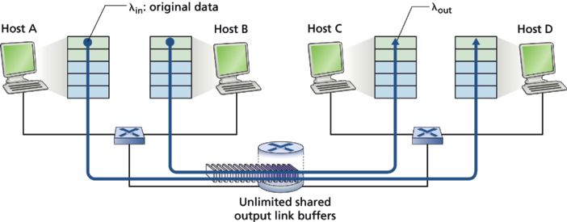

λ at an average rate of bytes/sec. These data are original in the sense that each unit of data is sent into the socket only once. The underlying transport-level protocol is a simple one. Data is encapsulated and sent; no error recovery (e.g., retransmission), flow control, or congestion control is performed. Ignoring the additional overhead due to adding transport- and lower-layer header information, the rate at which Host A offers traffic to the router in this first scenario is thus bytes/sec. Host B operates in a similar manner, and we assume for simplicity that it too is sending at a rate of bytes/sec. Packets from Hosts A and B pass through a router and over a shared outgoing link of capacity R. The router has buffers that allow it to store incoming packets when the packet-arrival rate exceeds the outgoing link’s capacity.

In this first scenario, we assume that the router has an infinite amount of buffer space. Figure 3.42 plots the performance of Host A’s connection under this first scenario. The left graph plots the per-connection throughput (number of bytes per second at the receiver) as a function of the connection-sending rate. For a sending rate between 0 and R 2, the throughput at the receiver equals the sender’s sending rate—everything sent by the sender is received at the receiver with a finite delay. When the sending rate is above put is only of link capacity between two connections. The link simply cannot deliver packets to a receiver at a steady-state rate that exceeds

infinite buffers R 2, however, the through- R 2. This upper limit on throughput is a consequence of the sharing R 2. No matter how high

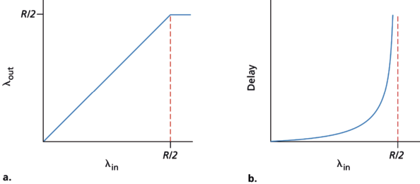

Figure 3.42 Congestion scenario 1: Throughput and delay as a function of host sending rate

Hosts A and B set their sending rates, they will each never see a throughput higher than R 2.

Achieving a per-connection throughput of R 2 might actually appear to be

a good thing, because the link is fully utilized in delivering packets to their destinations. The right-hand graph in Figure 3.42, however, shows the consequence of operating near link capacity. As the sending rate approaches R 2 (from the

left), the average delay becomes larger and larger. When the sending rate exceeds R 2, the average number of queued packets in the router is unbounded, and the average delay between source and destination becomes infinite (assuming that the connections operate at these sending rates for an infinite period of time and there is an infinite amount of buffering available). Thus, while operating at an aggregate throughput of near R may be ideal from a throughput

standpoint, it is far from ideal from a delay standpoint. Even in this (extremely) idealized scenario, we’ve already found one cost of a congested network—large queuing delays are experienced as the packet-arrival rate nears the link capacity.

Scenario 2: Two Senders and a Router with Finite Buffers Let’s now slightly modify scenario 1 in the following two ways (see  Figure 3.43).

First, the amount of router buffering is assumed to be finite. A consequence of this real-world assumption is that packets will be dropped when arriving to an already-full buffer. Second, we assume that each connection is reliable. If a packet containing a transport-level segment is dropped at the router, the sender will eventually retransmit it. Because packets can be retransmitted, we must now be more careful with our use of the term sending rate. Specifically, let us again denote the rate at which the application sends original data into the socket by λ bytes sec . The rate at which the transport layer sends in segments (containing original data and retransmitted data) into the network will be denoted λ′ bytes sec . λ′ is sometimes referred to as the offered load in in to the network.

Figure 3.43 Scenario 2: Two hosts (with retransmissions) and a router with finite

buffers

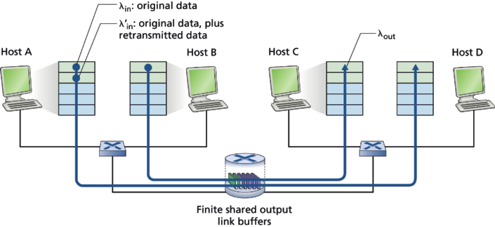

Figure 3.44 Scenario 2 performance with finite buffers R 2 under this R 2. According to Figure 3.44(b), at this value of R 3. Thus, out of the

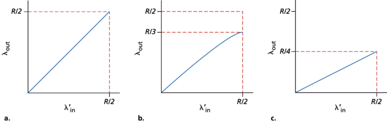

The performance realized under scenario 2 will now depend strongly on how retransmission is performed. First, consider the unrealistic case that Host A is able to somehow (magically!) determine whether or not a buffer is free in the router and thus sends a packet only when a buffer is free.

In this case, no loss would occur, λ would be equal to λ′ , and the throughput of the connec- in in tion would be equal to λ . This case is shown in Figure 3.44(a). From a in throughput standpoint, performance is ideal—everything that is sent is received. Note that the average host sending rate cannot exceed scenario, since packet loss is assumed never to occur. Consider next the slightly more realistic case that the sender retransmits only when a packet is known for certain to be lost. (Again, this assumption is a bit of a stretch. However, it is possible that the sending host might set its timeout large enough to be virtually assured that a packet that has not been acknowledged has been lost.) In this case, the performance might look some- thing like that shown in Figure 3.44(b). To appreciate what is happening here, consider the case that the offered load, λ′ (the rate of original data transmission in plus retransmissions), equals the offered load: the rate at which data are delivered to the receiver application is 0.5 units of data transmitted. On average, 0.333 bytes/sec are original data and 0.166 bytes/sec are retransmitted data. We see here another cost of a congested network—the sender must perform retransmissions in order to compensate for dropped (lost) packets due to buffer overflow.

Finally, let us consider the case that the sender may time out prematurely and retransmit a packet that has been delayed in the queue but not yet lost. In this case, both the original data packet and the retransmission may reach the receiver. Of course, the receiver needs but one copy of this packet and will discard the retransmission. In this case, the work done by the router in forwarding the retransmitted copy of the original packet was wasted, as the receiver will have already received the original copy of this packet. The router would have better used the link transmission capacity to send a different packet instead.

Here then is yet another cost of a congested network—unneeded retransmissions by the sender in the face of large delays may cause a router to use its link bandwidth to forward unneeded copies of a packet. Figure 3.44(c) shows the throughput versus offered load when each packet is assumed to be forwarded (on average) twice by the router. Since each packet is forwarded twice, the throughput will have an asymptotic value of R 4 as the offered load approaches R 2.

Scenario 3: Four Senders, Routers with Finite Buffers, and Multihop Paths In our final congestion scenario, four hosts transmit packets, each over overlapping two-hop paths, as shown in Figure 3.45. We again assume that each host uses a timeout/retransmission mechanism to implement a reliable data transfer service, that all hosts have the same value of λ , and that all router in links have capacity R bytes sec.

Let’s consider the connection from Host A to Host C, passing through routers R1 and R2. The A–C connection shares router R1 with the D–B connection and shares router R2 with the B–D connection. For extremely small values of λ , buffer overflows are rare (as in congestion scenarios 1 and 2), and the in throughput approximately equals the offered load. For slightly larger values of λ , the corresponding throughput is also larger, since more original data is in being transmitted into the network and delivered to the destination, and overflows are still rare. Thus, for small values of λ , an increase in λ results in an in in increase in λ . out Having considered the case of extremely low traffic, let’s next examine the case that λ (and hence λ′ ) is extremely large. Consider router R2. The A–C in in traffic arriving to router R2 (which arrives at R2 after being forwarded from R1) can have an arrival rate at R2 that is at most R, the capacity of the link from R1 to R2, regardless of the value of λ . If λ′ is extremely large for all connections in in

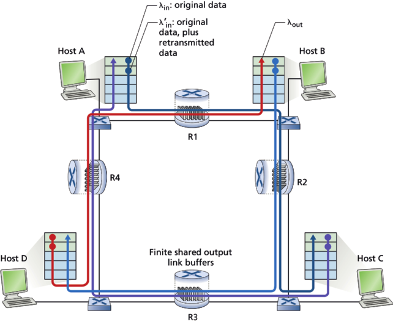

Figure 3.45 Four senders, routers with finite buffers, and multihop paths

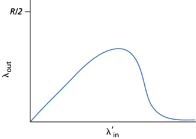

Figure 3.46 Scenario 3 performance with finite buffers and multihop paths

(including the B–D connection), then the arrival rate of B–D traffic at R2 can be much larger than that of the A–C traffic. Because the A–C and B–D traffic must compete at router R2 for the limited amount of buffer space, the amount of A–C traffic that successfully gets through R2 (that is, is not lost due to buffer overflow) becomes smaller and smaller as the offered load from B–D gets larger and larger.

In the limit, as the offered load approaches infinity, an empty buffer at R2 is immediately filled by a B–D packet, and the throughput of the A–C connection at R2 goes to zero. This, in turn, implies that the A–C end-to-end throughput goes to zero in the limit of heavy traffic. These considerations give rise to the offered load versus throughput tradeoff shown in Figure 3.46.

The reason for the eventual decrease in throughput with increasing offered load is evident when one considers the amount of wasted work done by the network. In the high-traffic scenario outlined above, whenever a packet is dropped at a second-hop router, the work done by the first-hop router in forwarding a packet to the second-hop router ends up being “wasted.” The network would have been equally well off (more accurately, equally bad off) if the first router had simply discarded that packet and remained idle. More to the point, the transmission capacity used at the first router to forward the packet to the second router could have been much more profitably used to transmit a different packet. (For example, when selecting a packet for transmission, it might be better for a router to give priority to packets that have already traversed some number of upstream routers.) So here we see yet another cost of dropping a packet due to congestion—when a packet is dropped along a path, the transmission capacity that was used at each of the upstream links to forward that packet to the point at which it is dropped ends up having been wasted.

With our newfound insights into the costs of congestion—increased queueing delay as the packet arrival rate to a congested link nears its capacity (Figure 3.42), decreased application-to-application throughput due to the presence of retransmitted packets (Figure 3.44), and the potential for congestion collapse (Figure 3.46)—the need for some form of congestion control is clear.

Before taking a look at approaches toward solving the congestion control problem, let’s take a step back and look at the fundamental problem these protocols are trying to solve. Figure 3.47 shows N transport-layer connections passing through a shared bottleneck link with a maximum transmission rate of R bps. A connection’s bottleneck link is the link along the end-to-end path, such that if senders whose traffic traverses that link slowly increase their transmission rate, that link along each of those connections’ end-to-end paths would be the first link to experience congestion loss. Usually, we refer to a bottleneck link only when it is in a congested state. A common assumption [Cardwell 2017; Kleinrock 2018] and one that is usually good in both theory and practice [Hu 2024] is that a connection has at most one bottleneck link.

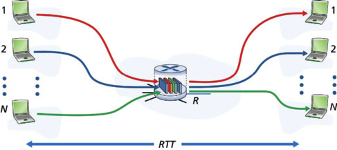

Figure 3.47

N connections sharing a bottleneck link of capacity R

Connections with different source-to-destination paths may have different bottleneck links.

A path’s bottleneck link plays an important role in congestion control.

Suppose that a bottleneck link is in a congested state, i.e., that the arrival rate of traffic to the bottleneck link is near the link’s capacity, R. If the N connec-

tions were to increase their sending rates, the bottleneck link would not be able to provide any additional throughput to the connections, since the link is already congested and always busy transmitting traffic in this congested state.

Thus, the aggregate end-to-end throughput achieved by the N  connections passing

through that bottleneck link will be determined by the bottleneck’s transmission rate, R.

And if the link’s capacity is fairly shared (see Section 7.3.4) among these N con-

nections, then each connection will have a throughput of R N . An analogy

might help visualize this. Think of the N connections in Figure 3.47 as hoses

connected to a single shared hose that has a maximum water output flow rate of R liters/sec. The hose’s output is then divided equally among the N hoses that branch out from that single hose and lead to each of the N destinations.

From experience, we know that that if the collective input rate of the N connec-

tions were to exceed R liters/sec, the shared hose would still not be able to

output more than its maximum flow capacity of R liters of water per second,

and thus no end-end hose path would be able to achieve a flow rate more then R N  liters/sec.

With this insight and now back in the realm of computer networking, we can see that the goal of congestion control should be for the N  connections in

Figure 3.47 to set their transport layer’s sending rates so that their aggregate sending rate is close to, but does not exceed, the bottleneck link capacity. An aggregate sending rate that is lower than this ideal rate would sometimes leave the link idle when the senders have additional data to send; an aggregate sending rate that is higher than this ideal rate will suffer all of the negative consequences of link congestion that we just studied.

Two fundamental questions thus come immediately to mind:

• How does a connection know that a link on its source-to-destination path is congested, i.e., that there is a bottleneck link? We’ll address this question in Section 7.6.2.

• How do connections individually regulate their sending rates so that their aggregate sending rate is close to, but does not exceed, their path’s bottleneck link capacity? We’ll see how different flavors of TCP congestion control address this question in Section 7.3.

##### 3.6.2 End-to-End and Network-Assisted Approaches to Congestion Control

In Section 3.7, we’ll examine TCP’s specific approach to congestion control in great detail. Here, we identify the two broad approaches to congestion control that are taken in practice and discuss specific network architectures and congestion-control protocols embodying these approaches.

At the highest level, we can distinguish among congestion-control approaches by whether the network layer provides explicit assistance to the transport layer for congestion-control purposes:

End-to-end congestion control. In an end-to-end approach to congestion control, the network layer provides no explicit support to the transport layer for congestion-control purposes. Even the presence of network congestion must be inferred by the end systems based only on observed network behavior (for example, packet loss and delay). We’ll see shortly in Sections 3.7.1 and 3.7.2 that TCP takes this end-to-end approach toward congestion control, since the IP layer is not required to provide feedback to hosts regarding network congestion. We’ll look at several different “flavors” of TCP. In some flavors, segment loss (as indicated by a timeout or the receipt of three duplicate acknowledgments) is taken as an indication of network congestion, and TCP decreases its window size accordingly. We’ll see that other flavors of TCP use the connection’s measured round-trip delay and/or throughput to determine the sending rate.

• Network-assisted congestion contr ol. With network-assisted congestion con-

trol, routers provide explicit feedback to the sender and/or receiver regarding the congestion state of the network. This feedback may be as simple as a single bit indicating congestion at a link—an approach taken in the early IBM SNA [Schwartz 1982], DEC DECnet [Jain 1989; Ramakrishnan 1990] architectures, and ATM [Black 1995] network architectures.

More sophisticated feedback is also possible. For example, in ATM Available Bite Rate (ABR) congestion control, a router informs the sender of the maximum host sending rate it (the router) can support on an outgoing link.

As noted above, the Internet-default versions of IP and TCP adopt an end-to-end approach towards congestion control. We’ll see, however, in Section 3.7.3 that, more recently, IP and TCP may also optionally implement network-assisted congestion control.

• For network-assisted congestion control, congestion information is typically fed back from the network to the sender in one of two ways, as shown in Figure 3.48. Direct feedback may be sent from a network router to the sender. This form of notification typically takes the form of a choke packet (essentially saying, “I’m congested!”). The second and more common form of notification occurs when a router marks/updates a field in a packet flowing from sender to receiver to indicate congestion. Upon receipt of a marked packet, the receiver then notifies the sender of the congestion indication. This latter form of notification takes a full round-trip time.

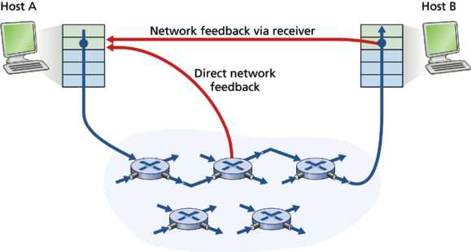

Figure 3.48 Two feedback pathways for network-indicated congestion information

#### 3.7 TCP Congestion Control

In this section, we return to our study of TCP. As we learned in Section 3.5, TCP provides a reliable transport service between two processes running on different hosts. Another key component of TCP is its congestion-control mechanism. As indicated in the previous section, what we might refer to as “Classic” TCP—the version of TCP standardized in [RFC 2581; RFC 5681]—uses end-toend congestion control rather than network-assisted congestion control, since the IP layer provides no explicit feedback to the end systems regarding network congestion. We’ll first cover this “classic” version of TCP in depth in Section 3.7.1. In Section 3.7.2, we’ll then look at newer flavors of TCP that use end-end congestion control in different ways than, i.e., “classic TCP. In Section 3.7.3, we’ll study a version of TCP that use an explicit congestion indication provided by the network layer. We’ll then cover the challenge of providing fairness among transport layer flows that must share a congested link in  Section 3.7.4.

##### 3.7.1 Classic End-to-End TCP Congestion Control

The approach taken by TCP is to have each sender limit the rate at which it sends traffic into its connection as a function of perceived network congestion.

If a TCP sender perceives that there is little congestion on the path between itself and the destination, then the TCP sender increases its send rate; if the sender perceives that there is congestion along the path, then the sender reduces its send rate. But this approach raises three questions. First, how does a TCP sender limit the rate at which it sends traffic into its connection? Second, how does a TCP sender perceive that there is congestion on the path between itself and the destination? And third, what algorithm should the sender use to change its send rate as a function of perceived end-to-end congestion?

There are now many different “flavors” of TCP congestion control that are used in the Internet. [Ware 2024] reports on the usage of a dozen of the most widely used TCP congestion control flavors as seen on the Top 10K Web sites.

We’ll learn in this section how and why four of these TCP congestion control algorithms—“Classic” TCP, TCP Vegas, CUBIC TCP, and BBR—answer these three questions above in different ways.

Let’s begin our study of TCP congestion control with “Classic” TCP, and examine how a TCP sender limits the rate at which it sends traffic into its connection. In Section 3.5, we saw that each side of a TCP connection consists of a

LastByteRead rwnd, receive buffer, a send buffer, and several variables ( ,

and so on). The TCP congestion-control mechanism operating at the sender keeps track of an additional variable, the congestion window. The congestion

cwnd, window, denoted imposes a constraint on the rate at which a TCP

sender can send traffic into the network. Specifically, the amount of unac-

cwnd knowledged data at a sender may not exceed the minimum of and

rwnd, that is:

LastByteSent – LastByteAcked <= min{cwnd,rwnd}

In order to focus on congestion control (as opposed to flow control), let’s assume from now on that the TCP receive buffer is so large that the receivewindow constraint can be ignored; thus, the amount of unacknowledged data

cwnd. at the sender is solely limited by We’ll also assume that the sender

always has data to send, that is, that all segments in the congestion window are sent.

The constraint above limits the amount of unacknowledged data at the sender and therefore indirectly limits the sender’s send rate. To see this, consider a connection for which loss and packet transmission delays are negligible.

Then, roughly, at the beginning of every RTT, the constraint permits the sender cwnd to send bytes of data into the connection; at the end of the RTT the

sender receives acknowledgments for this data. Thus the sender’s send rate is

cwnd, roughly cwnd/RTT bytes/sec. By adjusting the value of the sender can there-

fore adjust the rate at which it sends data into its connection.

Let’s next consider how a classic TCP sender perceives that there is congestion on the path between itself and the destination. Let us define a “loss event” at a TCP sender as the occurrence of either a timeout or the receipt of three duplicate ACKs from the receiver. (Recall our discussion in Section 3.5.4 of the timeout event in Figure 3.32 and the subsequent modification to include fast retransmit on receipt of three duplicate ACKs.)

When there is excessive congestion, then one (or more) router buffers along the path overflows, causing a datagram (containing a TCP segment) to be dropped. The dropped datagram, in turn, results in a loss event at the sender—either a timeout or the receipt of three duplicate ACKs—which is taken by the sender to be an indication of congestion on the sender-to-receiver path. We should note that while classic TCP infers congestion via a loss event, there are other measurable events (for example, changes in the RTT) that serve as congestion indications in other flavors of TCP congestion control that we will study.

Having considered how congestion is detected in classic TCP, let’s next consider the more optimistic case when the network is congestion-free, that is, when a loss event doesn’t occur. In this case, acknowledgments for previously unacknowledged segments will be received at the TCP sender. As we’ll see, classic TCP will take the arrival of these acknowledgments as an indication that all is well—that segments being transmitted into the network are being successfully delivered to the destination—and will use acknowledgments to increase its congestion window size (and hence its transmission rate). Note that if acknowledgments arrive at a relatively slow rate (e.g., if the end-end path has high delay or contains a low-bandwidth link), then the congestion window will be increased at a relatively slow rate. On the other hand, if acknowledgments arrive at a high rate, then the congestion window will be increased more quickly. Because TCP uses acknowledgments to trigger (or clock) its increase in congestion window size, TCP is said to be self-clocking.

cwnd Given the mechanism of adjusting the value of to control the sending

rate, the critical question remains: How should an individual TCP sender determine the rate at which it should send? If TCP senders collectively send too fast, they can congest the network, leading to the type of congestion collapse that we saw in Figure 3.46. Indeed, the classic TCP congestion-control algorithm that we’ll study shortly was developed in response to observed Internet congestion collapse [Jacobson 1988] under earlier versions of TCP. However, if TCP senders are too cautious and send too slowly, they could underutilize the bandwidth in the network; that is, it would be possible for TCP senders to send at a higher rate without congesting the network. How then do the TCP senders determine their sending rates such that they don’t congest the network but at the same time make use of all the available bandwidth? Are TCP senders explicitly coordinated, or is there a distributed approach in which the TCP senders can set their sending rates based only on local information? Classic TCP answers these questions using the following guiding principles:

• A lost segment implies congestion, and hence, the TCP sender’s rate should be decreased when a segment is lost. Recall from our discussion in Section 3.5.4, that a timeout event or the receipt of four acknowledgments for a given segment (one original ACK and then three duplicate ACKs) is interpreted as an implicit “loss event” indication of the segment following the quadruply ACKed segment, triggering a retransmission of the lost segment.

From a congestion-control standpoint, the question is how the TCP sender should decrease its congestion window size, and hence its sending rate, in response to this inferred loss event.

• An acknowledged segment indicates that the network is delivering the sender’s segments to the receiver, and hence, the sender’s rate can be increased when an ACK arrives for a previously unacknowledged segment. The arrival of acknowledgments is taken as an implicit indication that all is well—segments are being successfully delivered from sender to receiver, and the network is thus not congested. The congestion-window size can thus be increased.

• Bandwidth probing. Given ACKs indicating a congestion-free source-to-destination path and loss events indicating a congested path, TCP’s strategy for adjusting its transmission rate is to increase its rate in response to arriving ACKs until a loss event occurs, at which point, the transmission rate is decreased. The TCP sender thus increases its transmission rate to probe for the rate that at which congestion onset begins, backs off from that rate, and then to begins probing again to see if the congestion onset rate has changed. The TCP sender’s behavior is perhaps analogous to the child who requests (and gets) more and more goodies until finally he/she is finally told “No!”, backs off a bit, but then begins making requests again shortly afterward.

Note that there is no explicit signaling of congestion state by the network—ACKs and loss events serve as implicit signals— and that each TCP sender acts on local information asynchronously from other TCP senders.

Given this overview of TCP congestion control, we’re now in a position to consider the details of the celebrated TCP congestion-control algorithm, which we refer to as “classic” TCP and which was first described in [Jacobson 1988] and is standardized in [RFC 5681]. The algorithm has three major components: (1) slow start, (2) congestion avoidance, and (3) fast recovery. Slow start and congestion avoidance are mandatory components of TCP, differing in how they increase the size of cwnd in response to received ACKs. We’ll see

cwnd shortly that slow start increases the size of more rapidly (despite its

name!) than congestion avoidance. Fast recovery is recommended, but not required, for TCP senders.

Slow Start

cwnd When a TCP connection begins, the value of is typically initialized to a

small value of 1 MSS [RFC 3390], resulting in an initial sending rate of roughly MSS/RTT. For example, if MSS = 500 bytes and RTT = 200 msec , the result-

ing initial sending rate is only about 20 kbps. Since the available bandwidth to the TCP sender may be much larger than MSS/RTT, the TCP sender would like to find the amount of available bandwidth quickly. Thus, in the slow-start state, the value of cwnd begins at 1 MSS and increases by 1 MSS every time a transmitted segment is first acknowledged. In the example of Figure 3.49, TCP sends the first segment into the network and waits for an acknowledgment.

When this acknowledgment arrives, the TCP sender increases the congestion window by one MSS and sends out two maximum-sized segments. These segments are then acknowledged, with the sender increasing the congestion window by 1 MSS for each of the acknowledged segments, giving a congestion window of 4 MSS, and so on. This process results in a doubling of the sending rate every RTT. Thus, the TCP send rate starts slow but grows exponentially fast during the slow-start phase.

But when should this exponential growth end? Slow start provides several answers to this question. First, if there is a loss event (i.e., congestion)

cwnd indicated by a timeout, the TCP sender sets the value of to 1 and begins

the slow-start process anew. It also sets the value of a second state variable, ssthresh cwnd/2 (short-hand for “slow-start threshold”) to —half of the

value of the congestion-window value when congestion was detected. The sec-

ssthresh. ond way in which slow start may end is directly tied to the value of ssthresh cwnd Since is half the value of when congestion was last detected, cwnd it might be a bit reckless to keep doubling when it reaches or surpasses cwnd ssthresh, the value of ssthresh. Thus, when the value of equals slow-

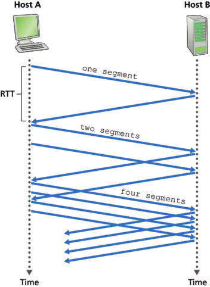

Figure 3.49 TCP slow-start

start ends and TCP transitions into congestion avoidance mode. As we’ll see,

cwnd TCP increases more cautiously when in congestion-avoidance mode.

The slow-start algorithm traces its roots to [Jacobson 1988]; an approach similar to slow-start was also proposed independently in [Jain 1986].

Congestion Avoidance

cwnd On entry to the congestion-avoidance state, the value of is approxi-

mately half its value when congestion was last encountered—congestion could

cwnd be just around the corner! Thus, rather than doubling the value of every

RTT, TCP adopts a more conservative approach and increases the value of cwnd by just a single MSS every RTT [RFC 5681]. This can be accomplished in several ways. A common approach is for the TCP sender to increase cwnd by MSS/cwnd bytes whenever a new acknowledgment arrives. For example, if

cwnd MSS is 1,460 bytes and is 14,600 bytes, then 10 segments are being

sent within an RTT. Each arriving ACK (assuming one ACK per segment) increases the congestion window size by 1 10 MSS, and thus, the value of the congestion window will have increased by one MSS when all 10 ACKS have been received.

But what happens when a loss event is inferred (by timeout or the receipt of triple duplicate ACKs) during congestion avoidance? When a timeout occurs during congestion avoidance, TCP’s congestion-avoidance algorithm

cwnd behaves the same as in the case of slow-start: the value of is set to 1 MSS,

ssthresh cwnd and the value of is updated to half the value of when the

loss event occurred. If loss is inferred by a triple duplicate ACK event, we know that the network is continuing to deliver some segments from sender to receiver (as indicated by the receipt of duplicate ACKs). So classic TCP’s behavior to this type of loss event is less drastic than with a timeout-indicated

cwnd loss: TCP halves the value of (adding in 3 MSS for good measure to

ssthresh account for the triple duplicate ACKs received) and sets the value of

cwnd to be half the value of when the triple duplicate ACKs were received.

If TCP (optionally) implements fast-recovery, it will manipulate the value cwnd of in a slightly different manner than in congestion avoidance, specificwnd cally by increasing by 1 MSS for every duplicate ACK received for the

missing segment. As soon as an ACK arrives that acknowledges new data, or a timeout occurs, TCP returns to the slow-start, or congestion-avoidance phase, respectively. Earlier editions of this book discuss Fast Recovery in more detail, and provide a detailed FSM description of classic TCP; see the publisher’s Web site or authors’ Web site (https://gaia.cs.umass.edu/kurose_ross) for this archived information.

One of the earliest versions of TCP, known as TCP Tahoe, always cut its congestion window to 1 MSS and entered the slow-start phase after either a timeout-indicated or triple-duplicate-ACK-indicated loss event. The next version of TCP congestion control, TCP Reno, incorporated the change of responding less drastically to congestion indicated by a triple duplicate ACK, i.e., by halving the value of cwnd (and adding three).

Figure 3.50 illustrates the evolution of TCP’s congestion window for both Reno and Tahoe. In this figure, the threshold is initially equal to 8 MSS. For the first eight transmission rounds, Tahoe and Reno take identical actions.

The  congestion window climbs exponentially fast during slow start and hits the threshold at the fourth round of transmission. The congestion window then climbs linearly until a triple duplicate- ACK event occurs, just after transmission round 8. Note that the congestion window is 12 MSS when this loss event

ssthresh occurs. The value of is then set to 0.5 cwnd  6 MSS. = Under TCP

Reno, the congestion window is set to cwnd  9 MSS = and then grows linearly.

Under TCP Tahoe, the congestion window is set to 1 MSS and grows exponen-

ssthresh, tially until it reaches the value of at which point it grows linearly.

TCP Congestion Control: Retrospective Having delved into the details of slow start, congestion avoidance, and fast recovery, it’s worthwhile to now step back and view the forest from the trees.

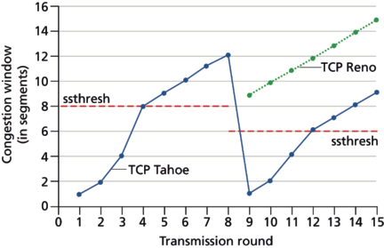

Figure 3.50 Evolution of TCP’s congestion window (Tahoe and Reno)

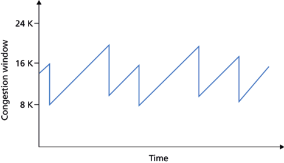

Figure 3.51 Additive-increase, multiplicative-decrease (AIMD) congestion control

Ignoring the initial slow-start period when a connection begins and assuming that losses are indicated by triple duplicate ACKs rather than timeouts, TCP’s

cwnd congestion control consists of linear (additive) increase in of one MSS cwnd per RTT and then a halving (multiplicative decrease) of on a triple

duplicate-ACK event. For this reason, TCP congestion control is often referred to as an additive-increase, multiplicative-decrease (AIMD) form of congestion control. AIMD congestion control gives rise to the “saw tooth” behavior shown in Figure 3.51, which also nicely illustrates our earlier intuition of TCP “probing” for bandwidth—TCP linearly increases its congestion window size (and hence its transmission rate) until a triple duplicate-ACK event occurs. It then decreases its congestion window size by a factor of two but then again begins increasing it linearly, probing to see if there is additional available bandwidth. TCP’s AIMD algorithm was developed based on a tremendous amount of engineering insight and experimentation with congestion control in operational networks. Rather amazingly, ten years after TCP’s development and deployment, theoretical analyses showed that TCP’s congestion-control algorithm serves as a distributed asynchronous-optimization algorithm that results in several important aspects of user and network performance being simultaneously optimized [Kelly 1998]! A rich theory of congestion control has since been developed [Srikant 2012].

Macroscopic Description of TCP Reno Throughput Given the saw-toothed behavior of TCP Reno, it’s natural to consider what the average throughput (that is, the average rate) of a long-lived TCP Reno connection might be. In this analysis, we’ll ignore the slow-start phases that occur after timeout events. (These phases are typically very short, since the sender grows out of the phase exponentially fast.) During a particular round-trip interval, the rate at which TCP sends data is a function of the congestion window and the current RTT. When the window size is w bytes and the current

round-trip time is RTT seconds, then TCP’s transmission rate is roughly w RTT . TCP then probes for additional bandwidth by increasing w by 1 MSS each RTT until a loss event occurs. Denote by W  the value of w when a loss

event occurs. Assuming that RTT and W are approximately constant over the

duration of the connection, the TCP transmission rate ranges from W 2 i RTT 

to W RTT .

These assumptions lead to a highly simplified macroscopic model for the steady-state behavior of TCP. The network drops a packet from the connection when the rate increases to W RTT ; the rate is then cut in half and then increases

by MSS RTT every RTT until it again reaches W RTT . This process repeats itself over and over again. Because TCP’s throughput (that is, rate) increases linearly between the two extreme values, we have

W 0.75 i = average throughput of a connection RTT

Using this highly idealized model for the steady-state dynamics of TCP, we can also derive an interesting expression that relates a connection’s loss rate to its available bandwidth [Mathis 1997]. This derivation is outlined in the homework problems. A more sophisticated model that has been found empirically to agree with measured data is [Padhye 2000].

##### 3.7.2 Recent End-to-End TCP Congestion Control Algorithms

Over the past 25 years, many new end-to-end TCP congestion control algorithms have been developed and deployed. Indeed, recent measurements [Ware 2024] of the congestion control algorithms used by the top 10K most popular web sites [Durumeric 2025] have shown that the “classic” TCP congestion control algorithms that we studied in the last section have largely been replaced by the newer flavors of TCP congestion control (in particular, BBR, and before that TCP CUBIC) that we will study in this section.

As we’ll see, some of these newer approaches make relatively minor changes to classic TCP’s loss-as-anindication-of-congestion approaches, while others take a fundamentally different approach.

TCP CUBIC: improving on additive increase Given TCP Reno’s additive-increase, multiplicative-decrease approach to congestion control, one might naturally wonder whether this is the best way to “probe” for a packet sending rate that is just below the threshold of triggering packet loss. Indeed, cutting the sending rate in half (or even worse, cutting the sending rate to one packet per RTT as in TCP Tahoe) and then increasing rather slowly over time may be overly cautious. If the state of the congested link where packet loss occurred hasn’t changed much, then perhaps it’s better to more quickly ramp up the sending rate to get close to the pre-loss sending rate and only then probe cautiously for bandwidth.

This insight lies at the heart of a flavor of TCP known as TCP CUBIC [Ha 2008; RFC 8312] and its predecessor, BIC [Xu 2004].

TCP CUBIC differs only slightly from TCP Reno. Once again, the congestion window is increased only on ACK receipt. CUBIC only changes the congestion avoidance phase, as follows:

• Let W be the size of TCP’s congestion control window when loss was max last detected, and let K  be the future point in time when TCP CUBIC’s window size will again reach W , assuming no losses. Several tunable max CUBIC parameters determine the value of K, that is, how quickly the pro-

tocol’s congestion window size would reach W . max

• CUBIC TCP increases the congestion window as a function of the cube of the distance between the current time, t, and K . Thus, when t is further away from K, the congestion window size increases are much larger than when t is close to K. That is, CUBIC quickly ramps up TCP’s sending rate to get close to the pre-loss rate, W , and only then probes cautiously for max bandwidth as it approaches W . max

• When t is greater than K, the cubic rule implies that CUBIC’s congestion window increases are small when t is still close to K (which is good if the

congestion level of the link causing loss hasn’t changed much) but then increases rapidly as t exceeds K  (which allows CUBIC to more quickly

find a new operating point if the congestion level of the link that caused loss has changed significantly).

Under these rules, the idealized performance of TCP Reno and TCP CUBIC are compared in Figure 3.52, adapted from [Huston 2017].We see the slow start phase ending at t .Then, when congestion loss occurs at t , t , and t , 0 1 2 3 CUBIC more quickly ramps up close to W (thereby enjoying more overall max throughput than TCP Reno).We can see graphically how TCP CUBIC attempts to maintain the flow for as long as possible just below the (unknown to the sender) congestion threshold.

Note that at t , the congestion level has presum- 3 ably decreased appreciably, allowing both TCP Reno and TCP CUBIC to achieve sending rates higher than W . max TCP CUBIC gained initial wide deployment. While measurements taken around 2000 on popular Web servers showed that nearly all were running classic TCP [Padhye 2001], by 2014, measurements of the 5000 most popular Web servers shows that nearly 50% were running a version of TCP CUBIC [Yang 2014]. CUBIC was also the default version of TCP used in the Linux operating system. By 2024, however, BBR usage had significantly surpassed CUBIC usage, and indeed that of all other flavors of TCP congestion control— combined [Ware 2024]!

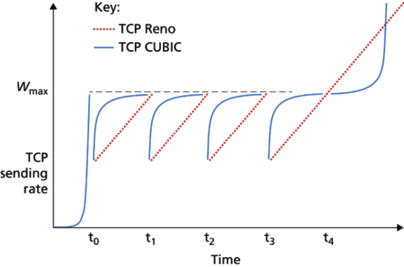

Figure 3.52 TCP congestion avoidance sending rates: TCP Reno and TCP CUBIC

TCP Vegas: Delay-based Congestion Control Classic TCP, CUBIC, and many other flavors of TCP are based on using segment loss, as inferred from a TCP timeout event or a triple-duplicate-ACK event as an indication of congestion. TCP Vegas [Brakmo 1995] is an end-toend congestion-control approach that uses measured RTT delay to proactively detect congestion onset, hopefully before packet loss occurs.

In TCP Vegas the sender measures the RTT of the source-to-destination path for all acknowledged packets. Let RTT be the minimum of these meamin surements at a sender; this occurs when the path is uncongested and packets experience minimal queueing delay. If TCP Vegas’ congestion window size is cwnd, then the uncongested throughput rate would be cwnd/ RTT . The min intuition behind TCP Vegas is that if the actual sender-measured throughput is close to this value, the TCP sending rate can be increased since (by definition and by measurement) the path is not yet congested. However, if the actual sender-measured throughput is significantly less than the uncongested throughput rate, the path is congested and the Vegas TCP sender will decrease its sending rate. Details can be found in [Brakmo 1995].

While TCP Vegas was among the first Internet congestion protocols to make use of measured RTT, many other protocols have also adopted a delaybased approach. See [Al-Saadi 2019] for a survey of these protocols and a broader discussion of using delay as a congestion signal.

BBR: Bottleneck Bandwidth and Round-trip propagation time TCP Vegas operates under the intuition that TCP senders should “Keep the pipe just full, but no fuller” [Kleinrock 2018]. “Keeping the pipe full” means that the pipe’s bottleneck link that limits its throughput should be kept busy transmitting, doing useful work. “But no fuller” means that there is nothing to gain (except increased delay!) if large queues are allowed to build up while the pipe is kept full. The BBR (Bottleneck Bandwidth and RTT) congestion-control protocol [Cardwell 2017], developed initially by Google and now in its third version [Cardwell 2024], is also based on this insight.

As of 2024, BBR has become the most widely deployed flavor of TCP congestion control [Ware 2024].

To gain insight into BBR, let’s recall our discussion of a bottleneck link from Section 3.6.1 and Figure 3.48, and again consider N connections passing through a bottleneck link. Now consider what happens as each of these connections allows progressively more and more unacknowledged packets to be in-flight from sender to receiver. The number of in-flight packets, n , is inflight subtly different from the λ′ in value plotted on the x-axes in Figures 3.42, 3.44,

and 3.46:

• First, λ′ is strictly a measure of transmission rate, while the number of in inflight packets is a count of the number of in-flight packets. Note that n , is also implicitly a function of the amount of time packets are ininflight flight, i.e., the RTT. Intuitively, if our goal is to “keep the pipe just full” then it’s important to account for the fact that a longer RTT pipe is able to hold more packets than a shorter RTT pipe.

• Second, if our goal is to “Keep the pipe just full, but no fuller,” then we’d like to keep the link queues relatively short. Buffering will be needed to absorb statistical fluctuations in the instantaneous arrival rate, but persistent queues should be avoided.

• Third, we should consider the effect of link transmission capacities on the number of in-flight packets that a pipe can hold. Intuitively, we’d expect that as the path’s link capacities increase, it can hold more in-flight packets. Indeed, congestion control for “long, fat pipes”—connections with large-bandwidth links and a large RTT, or equivalently a large bandwidthdelay product— has been examined for decades [RFC 1072]. As discussed below, we’ll see that we can think of the bandwidth delay product as i

an approximation for the average amount of in-flight data that connections (e.g., the N connections in Figure 3.47) can support without loss.

Figure 3.53 illustrates the intuition behind BBR. Let’s consider what happens as the senders increase n . Initially, the connections’ throughput also inflight increases. Additionally, the RTT remains unchanged. We can think of in-flight data as being distributed evenly throughout the pipe and with no link queues, RTT consists only of propagation delay.

When the amount of in-flight data reaches the connections’ bandwidth delay product, the pipe is “just full enough.” Increasing the amount of ini flight traffic further will result in a queue of in-flight data at the bottleneck link (with the remainder conceptually evenly distributed throughout the pipe). As shown in the bottom of Figure 3.53, increasing n beyond the inflight bandwidth delay product won’t increase throughput, as there is already (in i this approximate model) a persistent queue of in-flight data at the bottleneck link and that link is thus always busy. Increasing n beyond the inflight

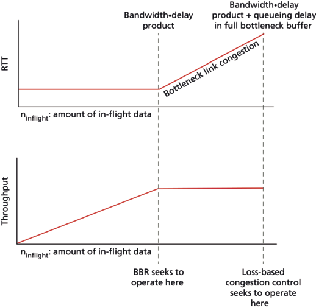

Figure 3.53 RTT and throughput versus the amount of in-flight data

bandwidth delay product also increases the RTT increases, due to the

increased queueing delay at the bottleneck link.

Given these considerations, the point at which n equals the inflight bandwidth delay i product can be considered an “ideal” operating point—

the pipe is kept just full, but no fuller. The insights above are based on average rates only, and in practice there will be statistical variations in traffic arrival rates at the bottleneck queue. For a more formal queueing theoretic treatment of delay and throughout in a bottleneck-link model, which comes to essentially the same conclusion as our average case analysis above, see [Kleinrock 2018].

BBR operates by directly measuring the RTT, estimating the bandwidth delay i product, and setting the value of n accordingly. BBR inflight operates at two time scales. At large time intervals, BBR reduces n to drain inflight the pipeline, and to see if there is a new lower RTT. At shorter time intervals, BRR cycle through three phases:

• Acceleration. BBR increases its sending rate, increasing n , until it inflight reaches a throughput plateau, as shown in Figure 3.53, and thus has saturated the available per-flow link capacity.

• Cruising. BBR sends at the rate that network is delivering data, as evidenced through received ACKs.

• Deceleration. BBR sends at a rate slower than the network is delivering data, reducing n , decreasing queue pressure, and looking for a lower inflight RTT.

BBR also has a transmission pacing mechanism to ensure that a large burst of segments are not sent back-to-back. The details of BBRv3 operation are described in [Cardwell 2024]. A concern with earlier versions of BBR was its fairness (see Section 7.3.4) with respect to competing TCP flows using a traditional loss-based approach toward congestion control (e.g., TCP CUBIC or Reno) at the bottleneck link [Ware 2019], a concern explicitly addressed in BBRv3.

##### 3.7.3 Network-Assisted Explicit Congestion Notification

In the previous section, we discussed several end-to-end approaches towards congestion control in “classic” TCP, CUBIC TCP, TCP Vegas, and BBR. These approaches took an end-to-end approach towards congestion control in that they used observations at the TCP sender of packet loss, RTT, and achieved throughput to perform congestion control.

Extensions to both IP and TCP [RFC 3168] have been proposed, implemented, and deployed, collectively known as Explicit Congestion Notification (ECN), that allow the network to explicitly signal congestion to a TCP sender and receiver. As shown in Figure 3.54, both TCP and IP are involved in ECN.

At the network layer, two bits (with four possible values, overall) in the Type of Service field of the IP datagram header (which we’ll discuss in Section 4.3) are used for ECN.There are two possible settings of these bits. One setting of the ECN bits is used by a router to indicate that it (the router) is experiencing congestion.

This congestion indication is then carried in the marked IP datagram to the destination host, which then informs the sending host, as shown in Figure 3.54. RFC 3168 does not provide a definition of when a router is congested; that decision is a configuration choice made possible by the router vendor, and decided by the network operator. However, the intuition is that the congestion indication bit can be set to signal the onset of congestion to the send before loss actually occurs. A second setting of the ECN bits is used by the sending host to inform routers that the sender and receiver are ECN-capable, and thus capable of taking action in response to ECN-indicated network congestion.

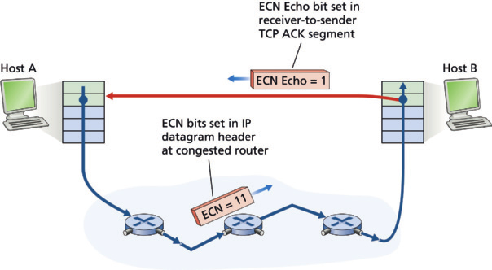

Figure 3.54 Explicit congestion notification: network-assisted congestion control

As shown in Figure 3.54, when the TCP in the receiving host receives an ECN congestion indication via a received datagram, the TCP in the receiving host informs the TCP in the sending host of the congestion indication by setting the ECE (Explicit Congestion Notification Echo) bit (see Figure 3.28) in a receiver-to-sender TCP ACK segment. The TCP sender, in turn, reacts to an ACK with a congestion indication by halving the congestion window, as it would react to a lost segment using fast retransmit, and sets the CWR (Congestion Window Reduced) bit in the header of the next transmitted TCP sender-to-receiver segment.

Other transport-layer protocols besides TCP may also make use of network-layer-signaled ECN. The Datagram Congestion Control Protocol (DCCP) [RFC 4340] provides a low-overhead, congestion-controlled UDP-like unreliable service that utilizes ECN. DCTCP (Data Center TCP) [Alizadeh 2010;

RFC 8257] and DCQCN (Data Center Quantized Congestion Notification) [Zhu 2015] designed specifically for data center networks, also makes use of ECN. Recent Internet measurements show that more than 80% of popular Web servers and paths from these Web servers to their clients support ECN capabilities [Lim 2022].

##### 3.7.4 Fairness

Consider K TCP connections, each with a different end-to-end path, each taking a loss-based AIMD approach toward congestion control. Each of these connection pass through a bottlneck link (see Section 7.6.2) with transmission rate R bps. (By bottleneck link, we mean that for each connection, all the other links along the connection’s path are not congested and have abundant transmission capacity as compared with the transmission capacity of the bottleneck link.) Suppose each connection is transferring a large file and there is no UDP traffic passing through the bottleneck link. A congestion-control mechanism is said to be fair if the average transmission rate of each connection is approximately R K; that is, each connection gets an equal share of the link capacity.

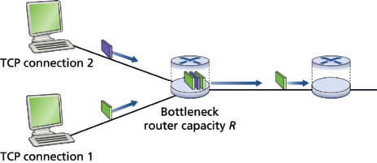

Figure 3.55 Two TCP connections sharing a single bottleneck link

Is TCP’s AIMD algorithm fair, particularly given that different TCP connections may start at different times and thus may have different window sizes at a given point in time? [Chiu 1989] provides an elegant and intuitive explanation of why TCP congestion control converges to provide an equal share of a bottleneck link’s capacity among competing TCP connections.

Let’s consider the simple case of two TCP connections sharing a single link with transmission rate R, as shown in Figure 3.55. Assume that the two connections have the same MSS and RTT (so that if they have the same congestion window size, then they have the same throughput), that they have a large amount of data to send, and that no other TCP connections or UDP datagrams traverse this shared link. Also, ignore the slow-start phase of TCP and assume the TCP connections are operating in CA mode (AIMD) at all times.

Figure 3.56 plots the throughput realized by the two TCP connections. If TCP is to share the link capacity equally between the two connections, then the realized throughput should fall along the 45-degree arrow (equal shares of the

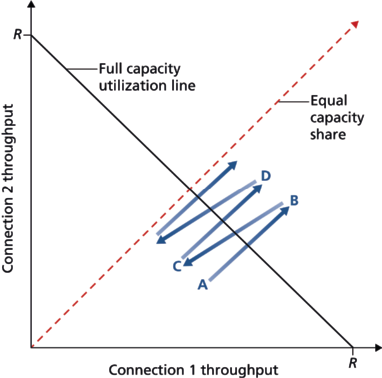

Figure 3.56 Throughput realized by TCP connections 1 and 2 link’s capacity.) emanating from the origin. Ideally, the sum of the two throughputs should equal R. (Certainly, each connection receiving an equal, but zero,

share of the link capacity is not a desirable situation!) So the goal should be to have the achieved throughputs fall somewhere near the intersection of the equal capacity share line and the full utilization line in Figure 3.56.

Suppose that the TCP window sizes are such that at a given point in time, connections 1 and 2 realize throughputs indicated by point A in Figure 3.56.

Because the amount of link capacity jointly consumed by the two connections is less than R, no loss will occur, and both connections will increase their window by 1 MSS per RTT as a result of TCP’s congestion-avoidance algorithm.

Thus, the joint throughput of the two connections proceeds along a 45-degree line (equal increase for both connections) starting from point A. Eventually, the link capacity jointly consumed by the two connections will be greater than R,

and eventually packet loss will occur. Suppose that connections 1 and 2 experience packet loss when they realize throughputs indicated by point B.

Connections 1 and 2 then decrease their windows by a factor of two. The resulting throughputs realized are thus at point C, halfway along a vector starting at B and ending at the origin. Because the joint capacity use is less than R at

point  C, the two connections again increase their throughputs along a 45-degree line starting from C. Eventually, loss will again occur, for example, at point D, and the two connections again decrease their window sizes by a factor of two, and so on. You should convince yourself that the capacity realized by the two connections eventually fluctuates along the equal capacity share line. You should also convince yourself that the two connections will converge to this behavior regardless of where they are in the two-dimensional space! Although a number of idealized assumptions lie behind this scenario, it still provides an intuitive feel for why TCP results in an equal sharing of capacity among connections.

In our idealized scenario, we assumed that only TCP connections traverse the bottleneck link, that the connections have the same RTT value, and that only a single TCP connection is associated with a host-destination pair. In practice, these conditions are typically not met, and client-server applications can thus obtain very unequal portions of link capacity. In particular, it has been shown that when multiple connections share a common bottleneck, those sessions with a smaller RTT are able to grab the available capacity at that link more quickly as it becomes free (that is, open their congestion windows faster) and thus will enjoy higher throughput than those connections with larger RTTs [Lakshman 1997].

Fairness and UDP We have just seen how TCP congestion control regulates an application’s transmission rate via the congestion window mechanism. Many multimedia applications, such as Internet phone and video conferencing, often do not run over TCP for this very reason—they do not want their transmission rate throttled, even if the network is very congested. Instead, these applications prefer to run over UDP, which does not have built-in congestion control. When running over UDP, applications can pump their audio and video into the network at a constant rate and occasionally lose packets, rather than reduce their rates to “fair” levels at times of congestion and not lose any packets. From the perspective of TCP, the multimedia applications running over UDP are not being fair—they do not cooperate with the other connections nor adjust their transmission rates appropriately. Because TCP congestion control will decrease its transmission rate in the face of increasing congestion (loss), while UDP sources need not, it is possible for UDP sources to crowd out TCP traffic. A number of congestion-control mechanisms have been proposed for the Internet that prevent UDP traffic from bringing the Internet’s throughput to a grinding halt [Floyd 1999; Floyd 2000; Kohler 2006; RFC 4340].

Fairness and Parallel TCP Connections But even if we could force UDP traffic to behave fairly, the fairness problem would still not be completely solved. This is because there is nothing to stop a TCP-based application from using multiple parallel connections. For example, Web browsers often use multiple parallel TCP connections to transfer the multiple objects within a Web page. (The exact number of multiple connections is configurable in most browsers.) When an application uses multiple parallel connections, it gets a larger fraction of the bandwidth in a congested link. As an example, consider a link of rate R supporting nine ongoing client-server

applications, with each of the applications using one TCP connection. If a new application comes along and also uses one TCP connection, then each application gets approximately the same transmission rate of R 10. But if this new

application instead uses 11 parallel TCP connections, then the new application gets an unfair allocation of more than R 2. Because Web traffic is so pervasive

in the Internet, multiple parallel connections are not uncommon.

This concludes our discussion of TCP congestion control. There is probably no other Internet protocol that has received so much research and attention in the research literature and in deployment. An excellent resource for learning more about TCP congestion control is [Peterson 2025].

#### 3.8 Evolution of Transport-Layer Functionality

Our discussion of specific Internet transport protocols in this chapter has focused on UDP and TCP—the two “work horses” of the Internet transport layer. However, as we’ve seen, four decades of experience with these two protocols has identified circumstances in which neither is ideally suited, and so the design and implementation of transport layer functionality has continued to evolve since these protocols were first standardized. We’ve already considered a number of advances in TCP’s evolution in Sections 3.5 and 3.7.2.

The Datagram Congestion Control Protocol (DCCP) [RFC 4340] provides a low-overhead, message-oriented, UDP-like unreliable service, but with an application-selected form of congestion control that is compatible with TCP.

One of DCCP’s selectable forms of congestion control is the TCP-Friendly Rate

Control (TFRC) protocol [RFC 5348], which smooths out the “saw tooth” behavior (see Figure 3.50) in TCP congestion control, while maintaining a long-term sending rate that is “reasonably” close to that of TCP.

With a smoother sending rate than TCP, TFRC is well-suited for multimedia applications such as IP telephony or streaming media. TFRC is an “equation-based” protocol that uses the measured packet loss rate as input to an equation [Padhye 2000] that estimates what TCP’s throughput would be if a TCP session experienced that loss rate.

This rate is then taken as TFRC’s target sending rate. DCCP is envisioned for use in applications such as streaming media that can exploit the tradeoff between timeliness and reliability of data delivery, but that want to be responsive to network congestion. If reliable or semi-reliable data transfer was needed by an application using DCCP, then this would be performed within the application itself, likely using the mechanisms we have studied in Section 3.4.

In addition to these changes, the transport layer has witnessed an even more seismic change over the past decade—the migration of TCP’s reliable data transfer, flow control, congestion control and other services into the application layer in the form of application-level modules that provide TCP-like services over UDP. The most well-known protocol illustrating this trend is the QUIC (Quick UDP Internet Connections) protocol [RFC 9000; RFC 9002], which we studied earlier in the context of HTTP 3 in Section 2.2, and will consider in more detail below.

Today, an application designer can still choose between native TCP and UDP services implemented in the operating system. But now there is a third choice—an application designer can “roll their own” transport layer services in the application layer, on top of UDP using QUIC. The authors of an earlier version of QUIC [Langley 2017] noted that implementing of transport-layer functions in the application layer means that changes can be made to QUIC at “application-update timescales,” that is, with feature velocity much faster than that of TCP or UDP update timescales. Or, as rather humorously suggested in RFC 1263, “to be able to design and distribute protocols in less time than it takes a standards committee to agree on an acceptable meeting time.” Let’s now take a closer look at QUIC, which will also serve as a nice culmination of our study of the transport layer, as QUIC uses many of the approaches for reliable data transfer, congestion control, and connection management that we’ve studied in this chapter. Before reading on, you might want to review our discussion of QUIC in Section 2.2.7 and Figure 2.11. Some of QUIC’s major features include:

• Connection-Oriented and Secure. Like TCP, QUIC is a connection-oriented protocol between two endpoints. This requires a handshake between endpoints to set up QUIC connection state. Two of these pieces of connection state are the source and destination connection ID. All QUIC packets are encrypted, and as suggested in Figure 3.57, QUIC combines the handshakes needed to establish connection state with those needed for authentication and encryption (transport layer security (TLS) topics that we’ll study in Chapter 8) to provide much quicker connection establishment than in the case where multiple RTTs are required to first establish a TCP connection, and then establish a TLS connection over the TCP connection.

• Streams. QUIC allows several different application-level “streams” to be multiplexed through a single QUIC connection. A stream is an abstraction for the reliable, in-order bi-directional delivery of data between two QUIC endpoints. Each connection has a connection ID, and each stream within a connection has a stream ID; both of these IDs are contained in a QUIC packet header (along with other header information). Data from multiple streams may be contained within a single QUIC segment, which is carried over UDP. The Stream Control Transmission Protocol (SCTP) [RFC 4960;

RFC 3286] is an earlier reliable, message-oriented protocol that pioneered the notion of several different application-level “streams” being multiplexed through a single SCTP connection.

• Reliable, TCP-friendly congestion-controlled data transfer. As illustrated in Figure 3.57, QUIC provides reliable data transfer to each QUIC stream separately. Figure 3.57(a) shows the case of HTTP 1.1 sending multiple HTTP requests over a single TCP connection. Since TCP provides reliable, in-order byte delivery, this means that the multiple HTTP requests must be delivered in-order at the destination HTTP server. Thus, if bytes from one HTTP request are lost, the remaining HTTP requests cannot be delivered until those lost bytes are retransmitted and correctly received by the TCP at the HTTP server—the so-called HOL blocking problem that we encountered in Section 2.2.5. Since QUIC provides a reliable in-order delivery on a per-stream basis, a lost UDP segment only impacts those streams whose data was carried in that segment; HTTP messages in other streams can continue to be received and delivered to the application.

QUIC provides reliable data transfer using acknowledgement mechanisms similar to TCP’s, as specified in [RFC 5681].

• QUIC’s congestion control is based on TCP NewReno [RFC 6582], a slight modification to the TCP Reno protocol that we studied in Section 3.7.2. QUIC’s specification on loss detection and congestion control [RFC 9002] notes:

“ Readers familiar with TCP’s loss detection and congestion control will find algorithms here that parallel well-known TCP ones.” Since we’ve carefully studied TCP’s congestion control in Section 3.7, we’d be right at home reading the details of QUIC’s specification of its congestion control algorithm!

Figure 3.57 HTTP1.1 HTTP3 (a) using TLS over TCP; using QUIC

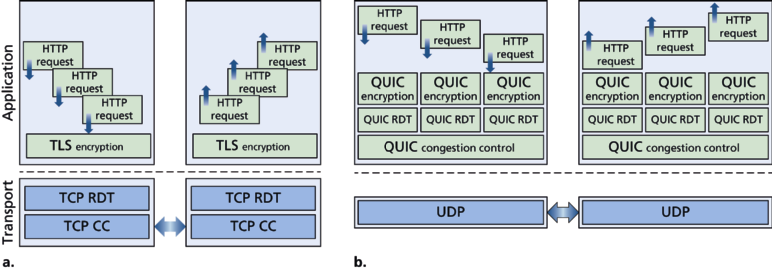

#### 3.9 Summary

We began this chapter by studying the services that a transport-layer protocol can provide to network applications. At one extreme, the transport-layer protocol can be very simple and offer a no-frills service to applications, providing only a multiplexing/demultiplexing function for communicating processes.

The Internet’s UDP protocol is an example of such a no-frills transport-layer protocol. At the other extreme, a transport-layer protocol can provide a variety of guarantees to applications, such as reliable delivery of data, delay guarantees, and bandwidth guarantees. Nevertheless, the services that a transport protocol can provide are often constrained by the service model of the underlying network-layer protocol. If the network-layer protocol cannot provide delay or bandwidth guarantees to transport-layer segments, then the  transport-layer protocol cannot provide delay or bandwidth guarantees for the messages sent between processes.

We learned in Section 3.4 that a transport-layer protocol can provide reliable data transfer even if the underlying network layer is unreliable. We saw that providing reliable data transfer has many subtle points, but that the task can be accomplished by carefully combining acknowledgments, timers, retransmissions, and sequence numbers.

Although we covered reliable data transfer in this chapter, we should keep in mind that reliable data transfer can be provided by link-, network-, transport-, or application-layer protocols. Any of the upper four layers of the protocol stack can implement acknowledgments, timers, retransmissions, and sequence numbers and provide reliable data transfer to the layer above. In fact, over the years, engineers and computer scientists have independently designed and implemented link-, network-, transport-, and application-layer protocols that provide reliable data transfer (although many of these protocols have quietly disappeared).

In Section 3.5, we took a close look at TCP, the Internet’s connectionoriented and reliable transport-layer protocol. We learned that TCP is complex, involving connection management, flow control, and round-trip time estimation, as well as reliable data transfer. In fact, TCP is actually more complex than our description—we intentionally did not discuss a variety of TCP patches, fixes, and improvements that are widely implemented in various versions of TCP. All of this complexity, however, is hidden from the network application.

If a client on one host wants to send data reliably to a server on another host, it simply opens a TCP socket to the server and pumps data into that socket. The client-server application is blissfully unaware of TCP’s complexity.

In Section 3.6, we examined congestion control from a broad perspective, and in Section 3.7, we showed how TCP implements congestion control. We learned that congestion control is imperative for the well-being of the network.

Without congestion control, a network can easily become gridlocked, with little or no data being transported end-to-end. In Section 3.7, we learned that classic TCP implements an end-to-end congestion-control mechanism that additively increases its transmission rate when the TCP connection’s path is judged to be congestion-free, and multiplicatively decreases its transmission rate when loss occurs. This mechanism also strives to give each TCP connection passing through a congested link an equal share of the link bandwidth. We also studied several newer variations of TCP congestion control that try to determine TCP’s sending rate more quickly than classic TCP, use a delaybased approach or explicit congestion notification from the network (rather than a loss-based approach) to determine TCP’s sending rate. We also examined in some depth the impact of TCP connection establishment and slow start on latency. We observed that in many important scenarios, connection establishment and slow start significantly contribute to end-to-end delay. We emphasize once more that while TCP congestion control has evolved over the years, it remains an area of intensive research and will likely continue to evolve in the upcoming years. To wrap up this chapter, in Section 3.8, we studied recent developments in implementing many of the transport layer ’s functions—reliable data transfer, congestion control, connection establishment, and more—in the application layer using the QUIC protocol.

In Chapter 1, we said that a computer network can be partitioned into the “network edge” and the “network core.” The network edge covers everything that happens in the end systems. Having now covered the application layer and the transport layer, our discussion of the network edge is complete. It is time to explore the network core! This journey begins in the next two chapters, where we’ll study the network layer, and continues into Chapter 6, where we’ll study the link layer.

Homework Problems and Questions Chapter 3 Review Questions R2.  Consider a planet where everyone belongs to a family of six, every family lives in its own Sections 3.1–3.3 house, each house has a unique address, and each person in a given house has a unique R1.  Suppose the network layer provides the fol-

name. Suppose this planet has a mail service lowing service. The network layer in the

that delivers letters from source house to dessource host accepts a segment of maximum

tination house. The mail service requires that size  1,200 bytes  and a destination host

(1) the letter be in an envelope, and that (2) the address from the transport layer. The network

address of the destination house (and nothing layer then guarantees to deliver the segment

more) be clearly written on the envelope. Supto the transport layer at the destination host.

pose each family has a delegate family mem- Suppose many network application processes

ber who collects and distributes letters for the can be running at the destination host.

other family members. The letters do not neca.  Design the simplest possible transport-layer essarily provide any indication of the recipiprotocol that will get application data to the ents of the letters. desired process at the destination host.

a.  Using the solution to Problem R1 above as Assume the operating system in the destina-

inspiration, describe a protocol that the deltion host has assigned a 4-byte port number

egates can use to deliver letters from a to each running application process.

sending family member to a receiving famb.  Modify this protocol so that it provides a ily member. “return address” to the destination process.

b.  In your protocol, does the mail service ever c.  In your protocols, does the transport layer have to open the envelope and examine the “have to do anything” in the core of the letter in order to provide its service? computer network?

R3.  Consider a TCP connection between Host A R12.  Visit the Go-Back-N interactive animation at

and Host B. Suppose that the TCP segments the companion Web site.

traveling from Host A to Host B have source a.  Have the source send five packets, and port number x and destination port number y. then pause the animation before any of the What are the source and destination port five packets reach the destination. Then kill numbers for the segments traveling from Host the first packet and resume the animation. B to Host A? Describe what happens.

R4.  Describe why an application developer might b.  Repeat the experiment, but now let the first choose to run an application over UDP rather packet reach the destination and kill the than TCP. first acknowledgment. Describe again what

R5.  Why is it that voice and video traffic is often happens.

sent over TCP rather than UDP in today’s c.  Finally, try sending six packets. What Internet? (Hint: The answer we are looking for happens? has nothing to do with TCP’s congestion-con- R13.  Repeat R12, but now with the Selective Repeat trol mechanism.) interactive animation. How are Selective R6.  Is it possible for an application to enjoy relia- Repeat and Go-Back-N different? ble data transfer even when the application

Section 3.5 runs over UDP? If so, how?

R7.  Suppose a process in Host C has a UDP socket R14.  True or false?

with port number 6789. Suppose both Host A a.  Host A is sending Host B a large file over a and Host B each send a UDP segment to TCP connection. Assume Host B has no Host C with destination port number 6789. data to send Host A. Host B will not send Will both of these segments be directed to the acknowledgments to Host A because Host same socket at Host C? If so, how will the pro- B cannot piggyback the acknowledgments cess at Host C know that these two segments on data. originated from two different hosts? rwnd b.  The size of the TCP never changes R8.  Suppose that a Web server runs in Host C on throughout the duration of the connection. port 80. Suppose this Web server uses persisc.  Suppose Host A is sending Host B a large tent connections, and is currently receiving file over a TCP connection. The number of requests from two different Hosts, A and B. unacknowledged bytes that A sends cannot Are all of the requests being sent through the exceed the size of the receive buffer. same socket at Host C? If they are being

d.  Suppose Host A is sending a large file to passed through different sockets, do both of

Host B over a TCP connection. If the the sockets have port 80? Discuss and explain.

sequence number for a segment of this con- Section 3.4 nection is m, then the sequence number for the subsequent segment will necessarily rdt R9.  In our protocols, why did we need to be m + 1 . introduce sequence numbers?

e.  The TCP segment has a field in its header rdt R10.  In our protocols, why did we need to rwnd. for introduce timers?

SampleRTT f.  Suppose that the last in a TCP R11.  Suppose that the roundtrip delay between connection is equal to 1  sec. The current sender and receiver is constant and known to TimeoutInterval value of for the conthe sender. Would a timer still be necessary in nection will necessarily be  1 sec ≥ . rdt 3.0 protocol , assuming that packets can

be lost? Explain. g.  Suppose Host A sends one segment with sequence number 38 and 4 bytes of data

Section 3.7 over a TCP connection to Host B. In this same segment, the acknowledgment num- R17.  Suppose two TCP connections are present ber is necessarily 42. over some bottleneck link of rate R bps. Both R15.  Suppose Host A sends two TCP segments connections have a huge file to send (in the back to back to Host B over a TCP connection. same direction over the bottleneck link). The The first segment has sequence number 90; transmissions of the files start at the same the second has sequence number 110. time. What transmission rate would TCP like

a.  How much data is in the first segment? to give to each of the connections?

b.  Suppose that the first segment is lost but the R18.  True or false? Consider congestion control in

second segment arrives at B. In the acknowl- TCP. When the timer expires at the sender, the ssthresh edgment that Host B sends to Host A, what value of is set to one half of its

will be the acknowledgment  number? previous value.

R19.  In the discussion of TCP splitting in the sidebar R16.  Consider the Telnet example discussed in Sec-

in Section 3.7, it was claimed that the response tion 3.5. A few seconds after the user types the

time with TCP splitting is approximately 4. letter ‘ C,’ the user types the letter ‘ R.’ After

RTT + RTT + processing time . Justify typing the letter ‘ R,’ how many segments are FE BE this claim. sent, and what is put in the sequence number and acknowledgment fields of the segments?

Problems P1. Suppose Client A initiates a Telnet session with Server S. At about the same time, Client B also initiates a Telnet session with Server S. Provide possible source and destination port numbers for a.  The segments sent from A to S.

b.  The segments sent from B to S.

c.  The segments sent from S to A.

d.  The segments sent from S to B.

e.  If A and B are different hosts, is it possible that the source port number in the segments from A to S is the same as that from B to S?

f.  How about if they are the same host?

P2. Consider Figure 3.5. What are the source and destination port values in the segments flowing from the server back to the clients’ processes?

What are the IP addresses in the network-layer datagrams carrying the transport-layer segments?

P3. UDP and TCP use 1s complement for their checksums. Suppose you have the following three 8-bit bytes: 01010011, 01100110, 01110100.

What is the 1s complement of the sum of these 8-bit bytes? (Note that although UDP and TCP use 16-bit words in computing the checksum, for this problem you are being asked to consider 8-bit sums.) Show all work. Why is it that UDP takes the 1s complement of the sum; that is, why not just use the sum?

With the 1s complement scheme, how does the receiver detect errors? Is it possible that a 1-bit error will go undetected? How about a 2-bit error?

P4. a.  Suppose you have the following 2 bytes:  01011100 and 01100101.

What is the 1s complement of the sum of these 2 bytes?

b.  Suppose you have the following 2 bytes:  11011010 and 01100101.

What is the 1s complement of the sum of these 2 bytes?

c.  For the bytes in part (a), give an example where one bit is flipped in each of the 2 bytes and yet the 1s complement doesn’t change.

P5. Suppose that the UDP receiver computes the Internet checksum for the received UDP segment and finds that it matches the value carried in the checksum field. Can the receiver be absolutely certain that no bit errors have occurred? Explain.

rdt2.1 P6. Consider our motivation for correcting protocol . Show that the

receiver, shown in Figure 3.58, when operating with the sender shown in Figure 3.11, can lead the sender and receiver to enter into a deadlock state, where each is waiting for an event that will never occur.

rdt3.0 P7. In protocol , the ACK packets flowing from the receiver to the

sender do not have sequence numbers (although they do have an ACK field that contains the sequence number of the packet they are acknowledging). Why is it that our ACK packets do not require sequence numbers?

rdt3.0 P8. Draw the FSM for the receiver side of protocol .

rdt3.0 P9. Give a trace of the operation of protocol when data packets and

acknowledgment packets are garbled. Your trace should be similar to that used in Figure 3.16.

P10.  Consider a channel that can lose packets but has a maximum delay that

rdt2.1 is known. Modify protocol to include sender timeout and

retransmit. Informally argue why your protocol can communicate correctly over this channel.

Figure 3.58 rdt 2.1 An incorrect receiver for protocol

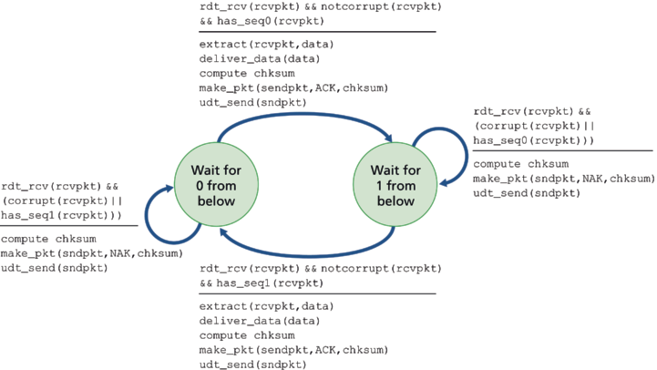

rdt2.2 P11.  Consider the receiver in Figure 3.14, and the creation of a new

packet in the self-transition (i.e., the transition from the state back to itself) in the Wait-for- 0-from-below and the Wait-for- 1-from-below states:

sndpkt=make_pkt(ACK,1,checksum) sndpkt=make_pkt and

(ACK,0,checksum) . Would the protocol work correctly if this action

were removed from the self-transition in the Wait-for-1-from-below state? Justify your answer. What if this event were removed from the self-transition in the Wait-for-0-from-below state? [Hint: In this latter case, consider what would happen if the first sender-to-receiver packet were corrupted.]

rdt3.0 P12.  The sender side of simply ignores (that is, takes no action on) all

received packets that are either in error or have the wrong value in the acknum field of an acknowledgment packet. Suppose that in such cirrdt3.0 cumstances, were simply to retransmit the current data packet.

Would the protocol still work? (Hint: Consider what would happen if there were only bit errors; there are no packet losses but premature timeouts can occur. Consider how many times the nth packet is sent, in the limit as n approaches infinity.) rdt 3.0 P13.  Consider the protocol. Draw a diagram showing that if the

network connection between the sender and receiver can reorder messages (that is, that two messages propagating in the medium between the sender and receiver can be reordered), then the alternating-bit protocol will not work correctly (make sure you clearly identify the sense in which it will not work correctly). Your diagram should have the sender on the left and the receiver on the right, with the time axis running down the page, showing data (D) and acknowledgment (A) message exchange.

Make sure you indicate the sequence number associated with any data or acknowledgment segment.

P14.  Consider a reliable data transfer protocol that uses only negative acknowledgments. Suppose the sender sends data only infrequently.

Would a NAK-only protocol be preferable to a protocol that uses ACKs?

Why? Now suppose the sender has a lot of data to send and the end-toend connection experiences few losses. In this second case, would a NAK-only protocol be preferable to a protocol that uses ACKs? Why?

P15.  Consider the cross-country example shown in Figure 3.17. How big would the window size have to be for the channel utilization to be greater than 98 percent? Suppose that the size of a packet is 1,500 bytes, including both header fields and data.

rdt 3.0 P16.  Suppose an application uses as its transport layer protocol. As

the stop-and-wait protocol has very low channel utilization (shown in the cross-country example), the designers of this application let the receiver keep sending back a number (more than two) of alternating ACK 0 and ACK 1 even if the corresponding data have not arrived at the receiver. Would this application design increase the channel utilization? Why? Are there any potential problems with this approach?

Explain.

P17.  Consider two network entities, A and B, which are connected by a perfect bi-directional channel (i.e., any message sent will be received correctly; the channel will not corrupt, lose, or re-order packets). A and B are to deliver data messages to each other in an alternating manner: First, A must deliver a message to B, then B must deliver a message to A, then A must deliver a message to B and so on. If an entity is in a state where it should not attempt to deliver a message to the other side, and there is an rdt_send(data) event like call from above that attempts to pass data

down for transmission to the other side, this call from above can simply

rdt_unable_to_send(data) be ignored with a call to , which informs

the higher layer that it is currently not able to send data. [Note: This simplifying assumption is made so you don’t have to worry about buffering data.] Draw a FSM specification for this protocol (one FSM for A, and one FSM for B!). Note that you do not have to worry about a reliability mechanism here; the main point of this question is to create a FSM specification that reflects the synchronized behavior of the two entities. You should use the following events and actions that have the same meaning as protocol

rdt_send(data), packet = make_pkt(data) rdt1.0 in Figure 3.9: ,

u d t _ s e n d ( p a c k e t ) ,  r d t _ r c v ( p a c k e t ) e x t r a c t ,

(packet,data), deliver_data(data) . Make sure your protocol

reflects the strict alternation of sending between A and B. Also, make sure to indicate the initial states for A and B in your FSM descriptions.

P18.  In the generic SR protocol that we studied in Section 3.4.4, the sender transmits a message as soon as it is available (if it is in the window) without waiting for an acknowledgment. Suppose now that we want an SR protocol that sends messages two at a time. That is, the sender will send a pair of messages and will send the next pair of messages only when it knows that both messages in the first pair have been received correctly.

Suppose that the channel may lose messages but will not corrupt or reorder messages. Design an error-control protocol for the unidirectional reliable transfer of messages. Give an FSM description of the sender and receiver. Describe the format of the packets sent between sender and receiver, and vice versa. If you use any procedure calls other than those

udt_send start_timer in Section 3.4 (for example, , ,

rdt_rcv , and so on), clearly state their actions. Give an example (a timeline trace of sender and receiver) showing how your protocol recovers from a lost packet.

P19.  Consider a scenario in which Host A wants to simultaneously send packets to Hosts B and C. A is connected to B and C via a broadcast channel— a packet sent by A is carried by the channel to both B and C. Suppose that the broadcast channel connecting A, B, and C can independently lose and corrupt packets (and so, for example, a packet sent from A might be correctly received by B, but not by C). Design a stop-and-waitlike error-control protocol for reliably transferring packets from A to B and C, such that A will not get new data from the upper layer until it knows that both B and C have correctly received the current packet. Give

FSM descriptions of A and C. (Hint: The FSM for B should be essentially the same as for C.) Also, give a description of the packet format(s) used.

P20.  Consider a scenario in which Host A and Host B want to send messages to Host C. Hosts A and C are connected by a channel that can lose and corrupt (but not reorder) messages. Hosts B and C are connected by another channel (independent of the channel connecting A and C) with the same properties. The transport layer at Host C should alternate in delivering messages from A and B to the layer above (that is, it should first deliver the data from a packet from A, then the data from a packet from B, and so on). Design a stop-and-wait-like error-control protocol for reliably transferring packets from A and B to C, with alternating delivery at C as described above. Give FSM descriptions of A and C. (Hint: The FSM for B should be essentially the same as for A.) Also, give a description of the packet format(s) used.

P21.  Suppose we have two network entities, A and B. B has a supply of data messages that will be sent to A according to the following conventions.

When A gets a request from the layer above to get the next data (D) message from B, A must send a request (R) message to B on the A-to-B channel. Only when B receives an R message can it send a data (D) message back to A on the B-to-A channel. A should deliver exactly one copy of each D message to the layer above. R messages can be lost (but not corrupted) in the A-to-B channel; D messages, once sent, are always delivered correctly. The delay along both channels is unknown and variable.

Design (give an FSM description of) a protocol that incorporates the appropriate mechanisms to compensate for the loss-prone A-to-B channel and implements message passing to the layer above at entity A, as discussed above. Use only those mechanisms that are absolutely necessary.

P22.  Consider the GBN protocol with a sender window size of 4 and a sequence number range of 1,024. Suppose that at time t, the next in-order packet that the receiver is expecting has a sequence number of k. Assume

that the medium does not reorder messages. Answer the following questions:

a.  What are the possible sets of sequence numbers inside the sender’s window at time t? Justify your answer.

b.  What are all possible values of the ACK field in all possible messages currently propagating back to the sender at time t? Justify your answer.

P23.  In this question, we’ll consider the relationship between the size of the sequence number space and the size of the pipelined Selective Repeat sender window, see Figure 3.26.

a.  Consider at SR sender and receiver with a window size of 3 packets.

Suppose also that the size of the sequence number space is 4 packets.

Draw an example of SR sender and receiver actions (sending of packets, ACKing of packets) with this window size of 3 that shows how a SR receiver can mistakenly deliver two copies of an identical packet to the layer above at the receiver. [Consider the case where the sender sends three packets in a row, and ACKs for these packets are lost.]

b.  Consider the GBN and SR protocols. Suppose the sequence number space is of size k. What is the largest allowable sender window that will avoid the occurrence of problems such as that in your answer to a. above, for each of these protocols?

P24.  Answer true or false to the following questions and briefly justify your answer:

a.  With the SR protocol, it is possible for the sender to receive an ACK for a packet that falls outside of its current window.

b.  With GBN, it is possible for the sender to receive an ACK for a packet that falls outside of its current window.

c.  The alternating-bit protocol is the same as the SR protocol with a sender and receiver window size of 1.

d.  The alternating-bit protocol is the same as the GBN protocol with a sender and receiver window size of 1.

P25.  We have said that an application may choose UDP for a transport protocol because UDP offers finer application control (than TCP) of what data is sent in a segment and when.

Why does an application have more control of what data is sent in a segment?

Why does an application have more control on when the segment is sent?

P26.  Consider transferring an enormous file of L bytes from Host A to Host B.

Assume an MSS of 536 bytes.

a.  What is the maximum value of L such that TCP sequence numbers are not exhausted? Recall that the TCP sequence number field has 4 bytes.

b.  For the L you obtain in (a), find how long it takes to transmit the file.

Assume that a total of 66 bytes of transport, network, and data-link header are added to each segment before the resulting packet is sent out over a 155 Mbps link. Ignore flow control and congestion control so A can pump out the segments back to back and continuously.

P27.  Host A and B are communicating over a TCP connection, and Host B has already received from A all bytes up through byte 126. Suppose Host A then sends two segments to Host B back-to-back. The first and second segments contain 80 and 40 bytes of data, respectively. In the first segment, the sequence number is 127, the source port number is 302, and the destination port number is 80. Host B sends an acknowledgment whenever it receives a segment from Host A.

a.  In the second segment sent from Host A to B, what are the sequence number, source port number, and destination port number?

b.  If the first segment arrives before the second segment, in the acknowledgment of the first arriving segment, what is the acknowledgment number, the source port number, and the destination port number?

c.  If the second segment arrives before the first segment, in the acknowledgment of the first arriving segment, what is the acknowledgment number?

d.  Suppose the two segments sent by A arrive in order at B. The first acknowledgment is lost and the second acknowledgment arrives after the first timeout interval. Draw a timing diagram, showing these segments and all other segments and acknowledgments sent. (Assume there is no additional packet loss.) For each segment in your figure, provide the sequence number and the number of bytes of data; for each acknowledgment that you add, provide the acknowledgment number.

P28.  Host A and B are directly connected with a 100 Mbps link. There is one TCP connection between the two hosts, and Host A is sending to Host B an enormous file over this connection. Host A can send its application data into its TCP socket at a rate as high as 120 Mbps but Host B can read out of its TCP receive buffer at a maximum rate of 50 Mbps.

Describe the effect of TCP flow control.

P29.  SYN cookies were discussed in Section 3.5.6.

a.  Why is it necessary for the server to use a special initial sequence number in the SYNACK?

b.  Suppose an attacker knows that a target host uses SYN cookies. Can the attacker create half-open or fully open connections by simply sending an ACK packet to the target? Why or why not?

c.  Suppose an attacker collects a large amount of initial sequence numbers sent by the server. Can the attacker cause the server to create many fully open connections by sending ACKs with those initial sequence numbers? Why?

P30.  Consider the network shown in Scenario 2 in Section 3.6.1. Suppose both sending hosts A and B have some fixed timeout values.

a.  Argue that increasing the size of the finite buffer of the router might possibly decrease the throughput ( λ ). out b.  Now suppose both hosts dynamically adjust their timeout values (like what TCP does) based on the buffering delay at the router. Would increasing the buffer size help to increase the throughput? Why?

SampleRTT P31.  Suppose that the five measured values (see Section 3.5.3)

are  106 ms,  120 ms ,  140 ms ,  90 ms, and 115 ms . Compute the EstimatedRTT after each of these SampleRTT values is obtained, using

EstimatedRTT a value of α = 0.125 and assuming that the value of

was 100 ms just before the first of these five samples were obtained.

DevRTT Compute also the after each sample is obtained, assuming a

DevRTT value of β = 0.25 and assuming the value of was 5 ms just

before the first of these five samples was obtained. Last, compute the TimeoutInterval TCP after each of these samples is obtained.

P32.  Consider the TCP procedure for estimating RTT. Suppose that α = 0.1 .

Let SampleRTT be the most recent sample RTT, let SampleRTT be the 1 2 next most recent sample RTT, and so on.

a.  For a given TCP connection, suppose four acknowledgments have been returned with corresponding sample RTTs: SampleRTT , SampleRTT ,

EstimatedRTT SampleRTT , and SampleRTT . Express in terms of

the four sample RTTs.

b.  Generalize your formula for n sample RTTs.

c.  For the formula in part (b) let n approach infinity. Comment on why this averaging procedure is called an exponential moving average.

P33.  In Section 3.5.3, we discussed TCP’s estimation of RTT. Why do you

SampleRTT think TCP avoids measuring the for retransmitted

segments?

SendBase P34.  What is the relationship between the variable in Section 3.5.4

LastByteRcvd and the variable in Section 3.5.5?

LastByteRcvd P35.  What is the relationship between the variable in

Section 3.5.5 and the variable y in Section 3.5.4?

P36.  In Section 3.5.4, we saw that TCP waits until it has received three duplicate ACKs before performing a fast retransmit. Why do you think the TCP designers chose not to perform a fast retransmit after the first duplicate ACK for a segment is received?

P37.Compare GBN, SR, and TCP (no delayed ACK).Assume that the timeout values for all three protocols are sufficiently long such that five consecutive data segments and their corresponding ACKs can be received (if not lost in the channel) by the receiving host (Host B) and the sending host (Host A) respectively. Suppose Host A sends five data segments to Host B, and the second segment (sent from A) is lost.

In the end, all five data segments have been correctly received by Host B.

a.  How many segments has Host A sent in total and how many ACKs has Host B sent in total? What are their sequence numbers? Answer this question for all three protocols.

b.  If the timeout values for all three protocol are much longer than 5 RTT, then which protocol successfully delivers all five data segments in shortest time interval?

ssthresh, P38.  In our description of TCP the value of the threshold, is set as

ssthresh=cwnd/2 ssthresh in several places and value is referred

to as being set to half the window size when a loss event occurred. Must the rate at which the sender is sending when the loss event occurred be

cwnd approximately equal to segments per RTT? Explain your answer.

If your answer is no, can you suggest a different manner in which ssthresh should be set?

P39.  Consider Figure 3.44(b). If λ′ increases beyond R 2, can λ increase in out beyond R 3? Explain. Now consider Figure 3.44(c). If λ′ increases in beyond R 2, can λ increase beyond R 4 under the assumption that a out packet will be forwarded twice on average from the router to the receiver? Explain.

P40.  Consider Figure 3.59. Assuming TCP Reno is the protocol experiencing the behavior shown above, answer the following questions. In all cases, you should provide a short discussion justifying your answer.

a.  Identify the intervals of time when TCP slow start is operatinag.

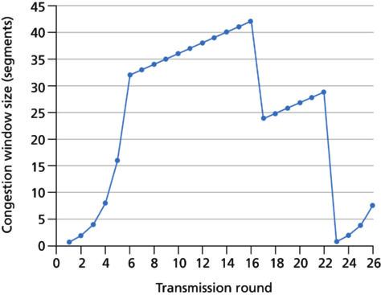

Figure 3.59 TCP window size as a function of time

b.  Identify the intervals of time when TCP congestion avoidance is operating.

c.  After the 16th transmiassion round, is segment loss detected by a triple duplicate ACK or by a timeout?

d.  After the 22nd transmission round, is segment loss detected by a triple duplicate ACK or by a timeout?

ssthresh e.  What is the initial value of at the first transmission round?

ssthresh f.  What is the value of at the 18th transmission round?

ssthresh g.  What is the value of at the 24th transmission round?

h.  During what transmission round is the 70th segment sent?

i.  Assuming a packet loss is detected after the 26th round by the receipt of a triple duplicate ACK, what will be the values of the congestion

ssthresh? window size and of j.  Suppose TCP Tahoe is used (instead of TCP Reno), and assume that triple duplicate ACKs are received at the 16th round. What are the ssthresh and the congestion window size at the 19th round?

k.  Again suppose TCP Tahoe is used, and there is a timeout event at 22nd round. How many packets have been sent out from 17th round till 22nd round, inclusive?

P41.  Refer to Figure 3.56, which illustrates the convergence of TCP’s AIMD algorithm. Suppose that instead of a multiplicative decrease, TCP decreased the window size by a constant amount. Would the resulting AIAD algorithm converge to an equal share algorithm? Justify your answer using a diagram similar to Figure 3.56.

P42.  In Section 3.5.4, we discussed the doubling of the timeout interval after a timeout event. This mechanism is a form of congestion control. Why does TCP need a window-based congestion-control mechanism (as studied in Section 3.7) in addition to this doubling-timeout-interval mechanism?

P43.  Host A is sending an enormous file to Host B over a TCP connection.

Over this connection there is never any packet loss and the timers never expire. Denote the transmission rate of the link connecting Host A to the Internet by R bps. Suppose that the process in Host A is capable of sending data into its TCP socket at a rate S bps, where S = 10 i R . Further

suppose that the TCP receive buffer is large enough to hold the entire file, and the send buffer can hold only one percent of the file. What would prevent the process in Host A from continuously passing data to its TCP socket at rate S bps? TCP flow control? TCP congestion control?

Or something else? Elaborate.

P44.  Consider sending a large file from a host to another over a TCP connection that has no loss.

a.  Suppose TCP uses AIMD for its congestion control without slow start.

cwnd Assuming increases by 1 MSS every time a batch of ACKs is

received and assuming approximately constant round-trip times, how

cwnd long does it take for increase from 6 MSS to 12 MSS (assuming

no loss events)?

b.  What is the average throughput (in terms of MSS and RTT) for this connection up through time = 6 RTT ?

P45.  Consider Figure 3.52. Suppose that at t , the sending rate at which con- 3 gestion loss next occurs drops to 0.75* W (unbeknownst to the max TCP senders, of course). Show the evolution of both TCP Reno and TCP CUBIC for two more rounds each (Hint: note that the times at which TCP Reno and TCP CUBIC react to congestion loss may not be the same anymore).

P46.  Consider Figure 3.52 again. Suppose that at t , the sending rate at which 3 congestion loss next occurs increases to 1.5* W . Show the evolution of max both TCP Reno and TCP CUBIC for at two more rounds each (Hint: see the hint in P45).

P47.  Recall the macroscopic description of TCP throughput. In the period of time from when the connection’s rate varies from W 2 RTT i to 

W RTT , only one packet is lost (at the very end of the period).

a.  Show that the loss rate (fraction of packets lost) is equal to

1 L = loss rate = 3 3 W 2 + W 8 4

b.  Use the result above to show that if a connection has loss rate L, then its average rate is approximately given by

1.22 i MSS ≈ RTT L

P48.  Consider that only a single TCP (Reno) connection uses one 10 Mbps link which does not buffer any data. Suppose that this link is the only congested link between the sending and receiving hosts. Assume that the TCP sender has a huge file to send to the receiver, and the receiver’s receive buffer is much larger than the congestion window. We also make the following assumptions: each TCP segment size is 1,500 bytes; the two-way propagation delay of this connection is 150 msec; and this TCP connection is always in congestion avoidance phase, that is, ignore slow start.

a.  What is the maximum window size (in segments) that this TCP connection can achieve?

b.  What is the average window size (in segments) and average throughput (in bps) of this TCP connection?

c.  How long would it take for this TCP connection to reach its maximum window again after recovering from a packet loss?

P49.  Consider the scenario described in the previous problem. Suppose that the 10 Mbps link can buffer a finite number of segments. Argue that in order for the link to always be busy sending data, we would like to choose a buffer size that is at least the product of the link speed C and the two-way propagation delay between the sender and the receiver.

P50.  Repeat Problem 48, but replacing the 10 Mbps link with a 10 Gbps link.

Note that in your answer to part c, you will realize that it takes a very long time for the congestion window size to reach its maximum window size after recovering from a packet loss. Sketch a solution to solve this problem.

P51.  Let T (measured by RTT) denote the time interval that a TCP connection takes to increase its congestion window size from W 2 to W, where W is

the maximum congestion window size. Argue that T is a function of TCP’s average throughput.

P52.  Consider a simplified TCP’s AIMD algorithm where the congestion window size is measured in number of segments, not in bytes. In additive increase, the congestion window size increases by one segment in each RTT. In multiplicative decrease, the congestion window size decreases by half (if the result is not an integer, round down to the nearest integer).

Suppose that two TCP connections, C and C , share a single congested 1 2 link of speed 30 segments per second. Assume that both C and C are in 1 2 the congestion avoidance phase. Connection C ’s RTT is 50 msec and 1 connection C ’s RTT is 100 msec. Assume that when the data rate in the 2 link exceeds the link’s speed, all TCP connections experience data segment loss.

a.  If both C and C at time t have a congestion window of 10 segments, 1 2 0 what are their congestion window sizes after 1000 msec?

b.  In the long run, will these two connections get the same share of the bandwidth of the congested link? Explain.

P53.  Consider the network described in the previous problem. Now suppose that the two TCP connections, C1 and C2 , have the same RTT of 100 msec. Suppose that at time t ,  C1’s congestion window size is 15 0 segments but C2’s congestion window size is 10 segments.

a.  What are their congestion window sizes after 2200 msec?

b.  In the long run, will these two connections get about the same share of the bandwidth of the congested link?

c.  We say that two connections are synchronized, if both connections reach their maximum window sizes at the same time and reach their minimum window sizes at the same time. In the long run, will these two connections get synchronized eventually? If so, what are their maximum window sizes?

d.  Will this synchronization help to improve the utilization of the shared link? Why? Sketch some idea to break this synchronization.

P54.  Consider a modification to TCP’s congestion control algorithm. Instead of additive increase, we can use multiplicative increase. A TCP sender increases its window size by a small positive constant a 0 < a < 1 

whenever it receives a valid ACK. Find the functional relationship between loss rate L and maximum congestion window W. Argue that for this modified TCP, regardless of TCP’s average throughput, a TCP connection always spends the same amount of time to increase its congestion window size from W 2 to W.

P55.  In our discussion of TCP futures in Section 3.7, we noted that to achieve a throughput of 10 Gbps, TCP could only tolerate a segment loss probability of 2 10 (or equivalently, one loss event for every 5,000,000,000 i − 10

segments). Show the derivation for the values of 2 10 (1 out of i − 10

5,000,000) for the RTT and MSS values given in Section 3.7. If TCP needed to support a 100 Gbps connection, what would the tolerable loss be?

P56.  In our discussion of TCP congestion control in Section 3.7, we implicitly assumed that the TCP sender always had data to send. Consider now the case that the TCP sender sends a large amount of data and then goes idle (since it has no more data to send) at t . TCP remains idle for a relatively 1 long period of time and then wants to send more data at t . What are the 2 cwnd advantages and disadvantages of having TCP use the and

ssthresh values from t when starting to send data at t ? What alter- 1 2 native would you recommend? Why?

P57.  In this problem, we investigate whether either UDP or TCP provides a degree of end-point authentication.

a.  Consider a server that receives a request within a UDP packet and responds to that request within a UDP packet (for example, as done by a DNS server). If a client with IP address X spoofs its address with address Y, where will the server send its response?

b.  Suppose a server receives a SYN with IP source address Y, and after responding with a SYNACK, receives an ACK with IP source address Y with the correct acknowledgment number. Assuming the server chooses a random initial sequence number and there is no “man-inthe-middle,” can the server be certain that the client is indeed at Y (and not at some other address X that is spoofing Y)?

P58.  In this problem, we consider the delay introduced by the TCP slow-start phase. Consider a client and a Web server directly connected by one link of rate R. Suppose the client wants to retrieve an object whose size is

exactly equal to 15  , where S is the maximum segment size (MSS). S

Denote the round-trip time between client and server as RTT (assumed to be constant). Ignoring protocol headers, determine the time to retrieve the object (including TCP connection establishment) when a.  S R 4 > S R + RTT > 2 S R

b.  S R + > RTT 4 S R

c.  S R > RTT .

Programming Assignments Implementing a Reliable Transport software environment. However, the programming interface provided to your routines—the code that Protocol

would call your entities from above and from below—

In this laboratory programming assignment, you is very close to what is done in an actual UNIX envi-

will be writing the sending and receiving transportronment. (Indeed, the software interfaces described in

level code for implementing a simple reliable data this programming assignment are much more realis-

transfer protocol. There are two versions of this lab, tic than the infinite loop senders and receivers that

the alternating-bit-protocol version and the GBN many texts describe.) Stopping and starting timers are

version. This lab should be fun—your implementaalso simulated, and timer interrupts will cause your

tion will differ very little from what would be timer handling routine to be activated.

required in a real-world situation. The full lab assignment, as well as code you

Since you probably don’t have standalone will need to compile with your own code, are avail-

machines (with an OS that you can modify), your able at this book’s Web site: www.pearsonhighered.

code will have to execute in a simulated hardware/ com/cs-resources.

Wireshark Lab: Exploring TCP In this lab, you’ll use your Web browser to access a In particular, you’ll evaluate the performance of

file from a Web server. As in earlier Wireshark labs, the TCP connection between your computer and

you’ll use Wireshark to capture the packets arrivthe Web server. You’ll trace TCP’s window behav-

ing at your computer. Unlike earlier labs, you’ll ior, and infer packet loss, retransmission, flow con-

also be able to download a Wireshark-readable trol and congestion control behavior, and estimated

packet trace from the Web server from which you roundtrip time.

downloaded the file. In this server trace, you’ll As is the case with all Wireshark labs, the full

find the packets that were generated by your own description of this lab is available at this book’s Web

access of the Web server. You’ll analyze the clientsite, www.pearsonhighered.com/cs-resources.

and server-side traces to explore aspects of TCP.

Wireshark Lab: Exploring UDP In this short lab, you’ll do a packet capture and investigate the header fields in the UDP segment as

analysis of your favorite application that uses UDP well as the checksum calculation.

(for example, DNS or a multimedia application such As is the case with all Wireshark labs, the full

as Skype). As we learned in Section 3.3, UDP is a description of this lab is available at this book’s Web

simple, no-frills transport protocol. In this lab, you’ll site, www.pearsonhighered.com/cs-resources.

AN INTERVIEW WITH...


Van Jacobson Van Jacobson works at Google and was previously a Research Fellow at PARC. Prior to that, he was co-founder and Chief Scientist of Packet Design. Before that, he was Chief Scientist at Cisco. Before joining Cisco, he was head of the Network Research Group at Lawrence Berkeley National Laboratory and taught at UC Berkeley and Stanford. Van received the ACM SIGCOMM Award in 2001 for outstanding lifetime contribution to the field of communication networks and the IEEE Kobayashi Award in 2002 for “contributing to the understanding of network congestion and developing congestion control mechanisms that enabled the successful scaling of the Internet”. He was elected to the U.S. National Academy of Engineering in 2004. Please describe one or two of the most

Courtesy of Van Jacobson

exciting projects you have worked on during your career. What were the biggest challenges?

School teaches us lots of ways to find answers. In every interesting problem I’ve worked on, the challenge has been finding the right question. When Mike Karels and I started looking at TCP congestion, we spent months staring at protocol and packet traces asking “Why is it failing?”. One day in Mike’s office, one of us said “The reason I can’t figure out why it fails is because I don’t understand how it ever worked to begin with.” That turned out to be the right question and it forced us to figure out the “ack clocking” that makes TCP work. After that, the rest was easy.

More generally, where do you see the future of networking and the Internet?

For most people, the Web is the Internet. Networking geeks smile politely since we know the Web is an application running over the Internet but what if they’re right? The Internet is about enabling conversations between pairs of hosts. The Web is about distributed information production and consumption. “Information propagation” is a very general view of communication of which “pairwise conversation” is a tiny subset. We need to move into the larger tent. Networking today deals with broadcast media (radios, PONs, etc.) by pretending it’s a point-to-point wire. That’s massively inefficient. Terabits-per-second of data are being exchanged all over the World via thumb drives or smart phones but we don’t know how to treat that as “networking”. ISPs are busily setting up caches and CDNs to scalably distribute video and audio. Caching is a necessary part of the solution but there’s no part of today’s networking—from Information, Queuing or Traffic Theory down to the Internet protocol specs—that tells us how to engineer and deploy it. I think and hope that over the next few years, networking will evolve to embrace the much larger vision of communication that underlies the Web.

What people inspired you professionally?

When I was in grad school, Richard Feynman visited and gave a colloquium. He talked about a piece of Quantum theory that I’d been struggling with all semester and his explanation was so simple and lucid that what had been incomprehensible gibberish to me became obvious and inevitable. That ability to see and convey the simplicity that underlies our complex world seems to me a rare and wonderful gift.

What are your recommendations for students who want careers in computer science and networking?

It’s a wonderful field—computers and networking have probably had more impact on society than any invention since the book. Networking is fundamentally about connecting stuff, and studying it helps you make intellectual connections: Ant foraging & Bee dances demonstrate protocol design better than RFCs, traffic jams or people leaving a packed stadium are the essence of congestion, and students finding flights back to school in a post-Thanksgiving blizzard are the core of dynamic routing. If you’re interested in lots of stuff and want to have an impact, it’s hard to imagine a better field.

## Chapter 4: The Network Layer: Data Plane

We learned in the previous chapter that the transport layer provides various forms of process-to-process communication by relying on the network layer’s host-to-host communication service. We also learned that the transport layer does so without any knowledge about how the network layer actually implements this service. So perhaps you’re now wondering, what’s under the hood


of the host-to-host communication service, what makes it tick? In this chapter and the next, we’ll learn exactly how the network layer can provide its host-to-host communication service. We’ll see that unlike the transport and application layers, there is a piece of the network layer in each and every host and router in the network. Because of this, network-layer protocols are among the most challenging (and therefore among the most interesting!) in the protocol stack. Since the network layer is arguably the most complex layer in the protocol stack, we’ll have a lot of ground to cover here. Indeed, there is so much to cover that we cover the network layer in two chapters. We’ll see that the net- work layer can be decomposed into two interacting parts, the data plane and the control plane. In Chapter 4, we’ll first cover the data plane functions of the network layer—the per-router functions in the network layer that determine how a datagram (that is, a network-layer packet) arriving on one of a router’s input links is forwarded to one of that router’s output links. We’ll cover both traditional IP forwarding (where forwarding is based on a datagram’s destination address) and generalized forwarding (where forwarding and other functions may be performed using values in several different fields in the datagram’s header). We’ll study the IPv4 and IPv6 protocols and addressing in detail. In Chapter 5, we’ll cover the control plane functions of the network layer—the network-wide logic that controls how a datagram is routed among routers along an end-to-end path from the source host to the destination host.

We’ll cover routing algorithms, as well as routing protocols, such as OSPF and BGP, that are in widespread use in today’s Internet. Traditionally, these control-plane routing protocols and data-plane forwarding functions have been implemented together, monolithically, within a router. Software-defined networking (SDN) explicitly separates the data plane and control plane by implementing these control plane functions as a separate service, typically in a remote “controller.” We’ll also cover SDN controllers in Chapter 5.

This distinction between data-plane and control-plane functions in the network layer is an important concept to keep in mind as you learn about the network layer—it will help structure your thinking about the network layer and reflects a modern view of the network layer’s role in computer networking.

#### 4.1 Overview of Network Layer

Figure 4.1 shows a simple network with two hosts, H1 and H2, and several routers on the path between H1 and H2. Let’s suppose that H1 is sending information to H2, and consider the role of the network layer in these hosts and in the intervening routers. The network layer in H1 takes segments from the transport layer in H1, encapsulates each segment into a datagram, and then sends the datagrams to its nearby router, R1. At the receiving host, H2, the network layer receives the datagrams from its nearby router R2, extracts the transport-layer segments, and delivers the segments up to the transport layer at H2. The primary data-plane role of each router is to forward datagrams from its input links to its output links; the primary role of the network control plane is to coordinate these local, per-router forwarding actions so that datagrams are ultimately transferred end-to-end, along paths of routers between source and destination hosts. Note that the routers in Figure 4.1 are shown with a truncated protocol stack, that is, with no upper layers above the network layer, because routers do not run application-and transport-layer protocols such as those we examined in Chapters 2 and 3.

##### 4.1.1 Forwarding and Routing: The Data and Control Planes

The primary role of the network layer is deceptively simple—to move packets from a sending host to a receiving host. To do so, two important network-layer functions can be identified: • Forwarding. When a packet arrives at a router’s input link, the router must move the packet to the appropriate output link. For example, a packet arriving from Host H1 to Router R1 in Figure 4.1 must be forwarded to the next router on a path to H2. As we will see, forwarding is but one function (albeit the most common and important one!) implemented in the data plane. In the more general case, which we’ll cover in Section 4.4, a packet might also be blocked from exiting a router (for example, if the packet originated at a known malicious sending host, or if the packet were destined to a forbidden destination host), or might be duplicated and sent over multiple outgoing links.

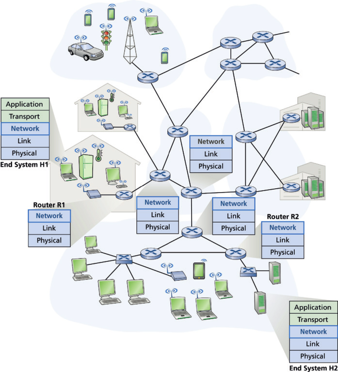

Figure 4.1 The network layer

• Routing. The network layer must determine the route or path taken by packets as they flow from a sender to a receiver. The algorithms that calculate these paths are referred to as routing algorithms. A routing algorithm would determine, for example, the path along which packets flow from H1 to H2 in Figure 4.1. Routing is implemented in the control plane of the network layer.

The terms forwarding and routing are often used interchangeably by authors discussing the network layer. We’ll use these terms much more precisely in this book. Forwarding refers to the router-local action of transferring a packet from an input link interface to the appropriate output link interface.

Forwarding takes place at very short timescales (typically a few nanoseconds), and thus is typically implemented in hardware. Routing refers to the networkwide process that determines the end-to-end paths that packets take from source to destination. Routing takes place on much longer timescales (typically seconds), and as we will see is often implemented in software. Using our driving analogy, consider the trip from Pennsylvania to Florida undertaken by our traveler back in Section 1.3.1. During this trip, our driver passes through many interchanges en route to Florida. We can think of forwarding as the process of getting through a single interchange: A car enters the interchange from one road and determines which road it should take to leave the interchange. We can think of routing as the process of planning the trip from Pennsylvania to Florida: Before embarking on the trip, the driver has consulted a map and chosen one of many paths possible, with each path consisting of a series of road segments connected at interchanges.

A key element in every network router is its forwarding table. A router forwards a packet by examining the value of one or more fields in the arriving packet’s header, and then using these header values to index into its forwarding table. The value stored in the forwarding table entry for those values indicates the outgoing link interface at that router to which that packet is to be forwarded. For example, in Figure 4.2, a packet with header field value of 0110 arrives to a router. The router indexes into its forwarding table and determines that the output link interface for this packet is interface 2. The router then internally forwards the packet to interface 2. In Section 4.2, we’ll look inside a router and examine the forwarding function in much greater detail. Forwarding is the key function performed by the data-plane functionality of the network layer.

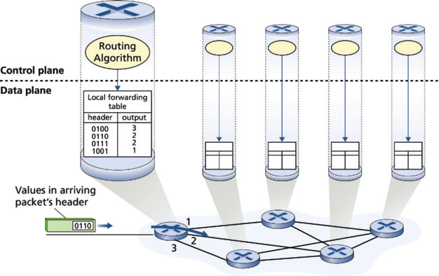

Figure 4.2 Routing algorithms determine values in forward tables

Control Plane: The Traditional Approach But now you are undoubtedly wondering how a router’s forwarding tables are configured in the first place. This is a crucial issue, one that exposes the important interplay between forwarding (in data plane) and routing (in control plane). As shown in Figure 4.2, the routing algorithm determines the contents of the routers’ forwarding tables. In this example, a routing algorithm runs in each and every router and both forwarding and routing functions are contained within a router. As we’ll see in Sections 5.3 and 5.4, the routing algorithm function in one router communicates with the routing algorithm function in other routers to compute the values for its forwarding table. How is this communication performed? By exchanging routing messages containing routing information according to a routing protocol! We’ll cover routing algorithms and protocols in Sections 5.2 through 5.4.

The distinct and different purposes of the forwarding and routing functions can be further illustrated by considering the hypothetical (and unrealistic, but technically feasible) case of a network in which all forwarding tables are configured directly by human network operators physically present at the routers. In this case, no routing protocols would be required! Of course, the human operators would need to interact with each other to ensure that the forwarding tables were configured in such a way that packets reached their intended destinations. It’s also likely that human configuration would be more error-prone and much slower to respond to changes in the network topology than a routing protocol. We’re thus fortunate that all networks have both a forwarding and a routing function!

Control Plane: The SDN Approach The approach to implementing routing functionality shown in Figure 4.2— with each router having a routing component that communicates with the routing component of other routers—has been the traditional approach adopted by routing vendors in their products, at least until recently. Our observation that humans could manually configure forwarding tables does suggest, however, that there may be other ways for control-plane functionality to determine the contents of the data-plane forwarding tables.

Figure 4.3 shows an alternative approach in which a physically separate, remote controller computes and distributes the forwarding tables to be used by each and every router within a network. Note that the data plane components of Figures 4.2 and 4.3 are identical. In Figure 4.3; however, control-plane routing functionality is separated from the physical router—the routing device performs forwarding only, while the remote controller computes and distributes forwarding tables. The remote controller might be implemented in a remote data center with high reliability and redundancy, and might be managed by the ISP or some third party. How might the routers and the remote controller communicate? By exchanging messages containing forwarding tables and other pieces of routing information. The control-plane approach shown in Figure 4.3 is at the heart of software-defined networking (SDN), where the network is “software-defined” because the controller that computes forwarding tables and interacts with routers is implemented in software.

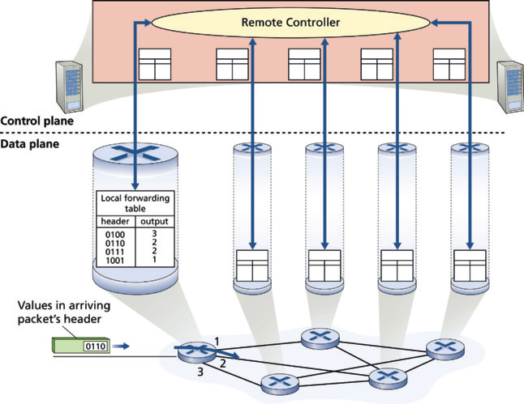

Figure 4.3 A remote controller determines and distributes values in forwarding tables

Increasingly, these software implementations are also open, that is, similar to Linux OS code, the code is publically available, allowing ISPs (and networking researchers and students!) to innovate and propose changes to the software that controls network-layer functionality. We will cover the SDN control plane in Section 5.5.

##### 4.1.2 Network Service Model

Before delving into the network layer’s data plane, let’s wrap up our introduction by taking the broader view and consider the different types of service that might be offered by the network layer. When the transport layer at a sending host transmits a packet into the network (that is, passes it down to the network layer at the sending host), can the transport layer rely on the network layer to deliver the packet to the destination? When multiple packets are sent, will they be delivered to the transport layer in the receiving host in the order in which they were sent? Will the amount of time between the sending of two sequential packet transmissions be the same as the amount of time between their reception? Will the network provide any feedback about congestion in the network? The answers to these questions and others are determined by the service model provided by the network layer. The network service model defines the characteristics of end-to-end delivery of packets between sending and receiving hosts.

Let’s now consider some possible services that the network layer could provide. These services could include:

• Guaranteed delivery. This service guarantees that a packet sent by a source host will eventually arrive at the destination host.

• Guaranteed delivery with bounded delay. This service not only guarantees delivery of the packet, but delivery within a specified host-to-host delay bound (for example, within 100 msec).

• In-order packet delivery. This service guarantees that packets arrive at the destination in the order that they were sent.

• Guaranteed minimal bandwidth. This network-layer service emulates the behavior of a transmission link of a specified bit rate (for example, 1 Mbps) between sending and receiving hosts. As long as the sending host transmits bits (as part of packets) at a rate below the specified bit rate, then all packets are eventually delivered to the destination host.

• Security. The network layer could encrypt all datagrams at the source and decrypt them at the destination, thereby providing confidentiality to all transport-layer segments.

This is only a partial list of services that a network layer could provide— there are countless variations possible.

The Internet’s network layer provides a single service, known as besteffort service. With best-effort service, packets are neither guaranteed to be received in the order in which they were sent, nor is their eventual delivery even guaranteed. There is no guarantee on the end-to-end delay nor is there a minimal bandwidth guarantee. It might appear that best-effort service is a euphemism for no service at all—a network that delivered no packets to the destination would satisfy the definition of best-effort delivery service! Other network architectures have defined and implemented service models that go beyond the Internet’s best-effort service. For example, the ATM network architecture [Black 1995] provides for guaranteed in-order delay, bounded delay, and guaranteed minimal bandwidth. There have also been proposed service model extensions to the Internet architecture; for example, the Intserv architecture [RFC 1633] aims to provide end-end delay guarantees and congestion-free communication. Interestingly, in spite of these well-developed alternatives, the Internet’s basic best-effort service model combined with adequate bandwidth provisioning and bandwidth-adaptive application-level protocols such as the DASH multimedia streaming protocol we encountered in Chapter 2 have arguably proven to be more than “good enough” to enable an amazing range of applications, including streaming video services such as Netflix and real-time conferencing applications such as Zoom and Facetime.

An Overview of Chapter 4 Having now provided an overview of the network layer, we’ll cover the dataplane component of the network layer in the following sections in this chapter.

In Section 4.2, we’ll dive down into the internal hardware operations of a router, including input and output packet processing, the router’s internal switching mechanism, and packet queueing and scheduling. In Section 4.3, we’ll take a look at traditional IP forwarding, in which packets are forwarded to output ports based on their destination IP addresses. We’ll encounter IP addressing, the celebrated IPv4 and IPv6 protocols and more. In Section 4.4, we’ll cover more generalized forwarding, where packets may be forwarded to output ports based on a large number of header values (i.e., not only based on destination IP address). Packets may be blocked or duplicated at the router, or may have certain header field values rewritten—all under software control.

This more generalized form of packet forwarding is a key component of a modern network data plane, including the data plane in software-defined networks (SDN). In Section 4.5, we’ll learn about “middleboxes” that can perform functions in addition to forwarding.

We mention here in passing that the terms forwarding and switching are often used interchangeably by computer-networking researchers and practitioners; we’ll use both terms interchangeably in this textbook as well. While we’re on the topic of terminology, it’s also worth mentioning two other terms that are often used interchangeably, but that we will use more carefully. We’ll reserve the term packet switch to mean a general packet-switching device that transfers a packet from input link interface to output link interface, according to values in a packet’s header fields. But in this book we will distinguish between two types of packet switches: routers, which will be studied in depth in this chapter, and switches, which will be studied in depth in Chapter 6. Recall from Section 1.5.2 that network-layer (i.e., layer 3) packets are called datagrams and link-layer (i.e., layer 2) packets are called frames, and both datagrams and frames have their own header fields. Routers base their forwarding decision on header-field values in the network-layer datagram, whereas switches base their forwarding decision on header-field values in the link-layer frame. Routers are therefore considered to be network-layer devices and switches are considers to be link-layer devices. Since our focus in this chapter is on the network layer, we'll mostly use the term router in place of packet switch.

#### 4.2 What’s Inside a Router?

Now that we’ve overviewed the data and control planes within the network layer, the important distinction between forwarding and routing, and the services and functions of the network layer, let’s turn our attention to its forwarding function—the actual transfer of packets from a router’s incoming links to the appropriate outgoing links at that router.

A high-level view of a generic router architecture is shown in Figure 4.4.

Four router components can be identified:

• Input ports. An input port performs several key functions. It performs the physical layer function of terminating an incoming physical link at a router; this is shown in the leftmost box of an input port and the rightmost box of an output port in Figure 4.4. An input port also performs link-layer functions needed to interoperate with the link layer at the other side of the incoming link; this is represented by the middle boxes in the input and output ports. Perhaps most crucially, a lookup function is also performed at the input port; this will occur in the rightmost box of the input port. It is here that the forwarding table is consulted to determine the router output port to which an arriving packet will be forwarded via the switching fabric. Control packets (for example, packets carrying routing protocol information) are forwarded from an input port to the routing processor.

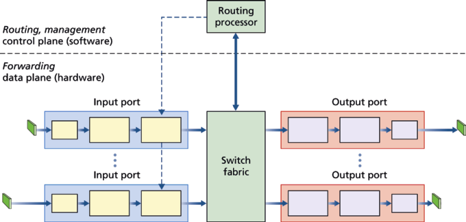

Figure 4.4 Router architecture

Note that the term “port” here—referring to the physical input and output router interfaces—is distinctly different from the software ports associated with network applications and sockets discussed in Chapters 2 and 3. In practice, the number of ports supported by a router can range from a relatively small number in enterprise routers, to hundreds of 10 Gbps ports in a router at an ISP’s edge, where the number of incoming lines tends to be the greatest. The Juniper MX2020 edge router, for example, supports up to 800 100 Gbps Ethernet ports, with an overall router system capacity of 800 Tbps [Juniper MX 2020 2025].

• Switching fabric. The switching fabric connects the router’s input ports to its output ports. This switching fabric is completely contained within the router—a network inside of a network router!

• Output ports. An output port stores packets received from the switching fabric and transmits these packets on the outgoing link by performing the necessary link-layer and physical-layer functions. When a link is bidirectional (that is, carries traffic in both directions), an output port will typically be paired with the input port for that link on the same line card.

• Routing processor. The routing processor performs control-plane functions.

In traditional routers, it executes the routing protocols (which we’ll study in Sections 5.3 and 5.4), maintains routing tables and attached link state information, and computes the forwarding table for the router.

In SDN routers, the routing processor is responsible for communicating with the remote controller in order to (among other activities) receive forwarding table entries computed by the remote controller, and install these entries in the router’s input ports. The routing processor also performs the network management functions that we’ll study in Section 5.7.

A router’s input ports, output ports, and switching fabric are almost always implemented in hardware, as shown in Figure 4.4. To appreciate why a hardware implementation is needed, consider that with a 100 Gbps input link and a 64-byte IP datagram, the input port has only 5.12 ns to process the datagram before another datagram may arrive. If N ports are combined on a line card (as is often done in practice), the datagram-processing pipeline must operate N times faster—far too fast for software implementation. Forwarding hardware can be implemented either using a router vendor’s own hardware designs, or constructed using purchased merchant-silicon chips (for example, as sold by companies such as Intel and Broadcom).

While the data plane operates at the nanosecond time scale, a router’s control functions—executing the routing protocols, responding to attached links that go up or down, communicating with the remote controller (in the SDN case) and performing management functions—operate at the millisecond or second timescale. These control plane functions are thus usually implemented in software and execute on the routing processor (typically a traditional CPU).

Before delving into the details of router internals, let’s return to our analogy from the beginning of this chapter, where packet forwarding was compared to cars entering and leaving an interchange. Let’s suppose that the interchange is a roundabout, and that as a car enters the roundabout, a bit of processing is required. Let’s consider what information is required for this processing:

• Destination-based forwarding. Suppose the car stops at an entry station and indicates its final destination (not at the local roundabout, but the ultimate destination of its journey). An attendant at the entry station looks up the final destination, determines the roundabout exit that leads to that final destination, and tells the driver which roundabout exit to take.

• Generalized forwarding. The attendant could also determine the car’s exit ramp on the basis of many other factors besides the destination. For example, the selected exit ramp might depend on the car’s origin, for example the state that issued the car’s license plate. Cars from a certain set of states might be directed to use one exit ramp (that leads to the destination via a slow road), while cars from other states might be directed to use a different exit ramp (that leads to the destination via superhighway).The same decision might be made based on the model, make and year of the car. Or a car not deemed roadworthy might be blocked and not be allowed to pass through the roundabout.

In the case of generalized forwarding, any number of factors may contribute to the attendant’s choice of the exit ramp for a given car.

Once the car enters the roundabout (which may be filled with other cars entering from other input roads and heading to other roundabout exits), it eventually leaves at the prescribed roundabout exit ramp, where it may encounter other cars leaving the roundabout at that exit.

We can easily recognize the principal router components in Figure 4.4 in this analogy—the entry road and entry station correspond to the input port (with a lookup function to determine to local outgoing port); the roundabout corresponds to the switch fabric; and the roundabout exit road corresponds to the output port. With this analogy, it’s instructive to consider where bottlenecks might occur. What happens if cars arrive blazingly fast (for example, the roundabout is in Germany or Italy!) but the station attendant is slow? How fast must the attendant work to ensure there’s no backup on an entry road? Even with a blazingly fast attendant, what happens if cars traverse the roundabout slowly—can backups still occur? And what happens if most of the cars entering at all of the roundabout’s entrance ramps all want to leave the roundabout at the same exit ramp—can backups occur at the exit ramp or elsewhere? How should the roundabout operate if we want to assign priorities to different cars, or block certain cars from entering the roundabout in the first place? These are all analogous to critical questions faced by router and switch designers.

In the following subsections, we’ll look at router functions in more detail.

[Turner 1988; McKeown 1997a; Partridge 1998; Iyer 2008; Serpanos 2011;

Zilberman 2019] provide a discussion of specific router architectures. For concreteness and simplicity, we’ll initially assume in this section that forwarding decisions are based only on the packet’s destination address, rather than on a generalized set of packet header fields. We will cover the case of more generalized packet forwarding in Section 4.4.

##### 4.2.1 Input Port Processing and Destination-Based Forwarding

A more detailed view of input processing is shown in Figure 4.5. As just discussed, the input port’s line-termination function and link-layer processing implement the physical and link layers for that individual input link. The lookup performed in the input port is central to the router’s operation—it is here that the router uses the forwarding table to look up the output port to which an arriving packet will be forwarded via the switching fabric. The forwarding table is either computed and updated by the routing processor (using a routing protocol to interact with the routing processors in other network routers) or is received from a remote SDN controller. The forwarding table is copied from the routing processor to the line cards over a separate bus (e.g., a PCI bus) indicated by the dashed line from the routing processor to the input line cards in Figure 4.4. With such a shadow copy at each line card, forwarding decisions can be made locally, at each input port, without invoking the centralized routing processor on a per-packet basis and thus avoiding a centralized processing bottleneck.

Let’s now consider the “simplest” case that the output port to which an incoming packet is to be switched is based on the packet’s destination address.

In the case of 32-bit IP addresses, a brute-force implementation of the forwarding table would have one entry for every possible destination address.

Since there are more than 4 billion possible addresses, this option is totally out of the question.

Figure 4.5 Input port

processing

As an example of how this issue of scale can be handled, let’s suppose that our router has four links, numbered 0 through 3, and that packets are to be forwarded to the link interfaces as follows:

Destination Address Range Link Interface

11001000 00010111 00010000 00000000

0 through

11001000 00010111 00010111 11111111

11001000 00010111 00011000 00000000

1 through

11001000 00010111 00011000 11111111

11001000 00010111 00011001 00000000

2 through

11001000 00010111 00011111 11111111

Otherwise 3

Clearly, for this example, it is not necessary to have 4 billion  entries in the router’s forwarding table. We could, for example, have the following forwarding table with just four entries:

Prefix Link Interface

11001000 00010111 00010 0

11001000 00010111 00011000 1

11001000 00010111 00011 2

Otherwise 3

With this style of forwarding table, the router matches a prefix of the packet’s destination address with the entries in the table; if there’s a match, the router forwards the packet to a link associated with the match. For example, suppose

11001000 00010111 00010110 the packet’s destination address is

10100001 ; because the 21-bit prefix of this address matches the first entry in the table, the router forwards the packet to link interface 0. If a prefix doesn’t match any of the first three entries, then the router forwards the packet to the default interface 3. Although this sounds simple enough, there’s a very important subtlety here. You may have noticed that it is possible for a destination address to match more than one entry. For example, the first 24 bits of the

11001000 00010111 00011000 10101010 address match the second

entry in the table, and the first 21 bits of the address match the third entry in the table. When there are multiple matches, the router uses the longest prefix matching rule; that is, it finds the longest matching entry in the table and forwards the packet to the link interface associated with the longest prefix match.

We’ll see exactly why this longest prefix-matching rule is used when we study Internet addressing in more detail in Section 4.3.

Given the existence of a forwarding table, lookup is conceptually simple— hardware logic just searches through the forwarding table looking for the longest prefix match. But at Gigabit transmission rates, this lookup must be performed in nanoseconds (recall our earlier example of a 10 Gbps link and a 64-byte IP datagram). In practice, Ternary Content Addressable Memories (TCAMs) are often used for address lookup [Yu 2004]. With a TCAM, a 32-bit IP address is presented to the associative memory, which returns the content of the forwarding table entry for that address in one clock cycle. TCAMS are ideally suited for IP address lookup, since “ternary” associative memory allows the address to be looked up to have bit values of 0, 1, or * (don’t care). As we will see shortly, these “don’t care” bit values will be crucial in keeping address lookup tables small. The Cisco Catalyst 6500 and 7600 Series routers and switches can hold a million TCAM forwarding table entries [Cisco TCAM 2025]; Intel’s Aurora switch can hold upwards of 1.2M entries [Rios 2022]. Since TCAMs are expensive and have high energy consumption, hybrid approaches that combine static random-access memory (SRAM) memories have also been proposed [Luo 2012; Rios 2022]; and purely “algorithmic” approaches to lookup are also taken in practice [Arista 2023].

Once a packet’s output port has been determined via the lookup, the packet can be sent into the switching fabric. In some designs, a packet may be temporarily blocked from entering the switching fabric if packets from other input ports are currently using the fabric. A blocked packet will be queued at the input port and then scheduled to cross the fabric at a later point in time.

We’ll take a closer look at the blocking, queuing, and scheduling of packets (at both input ports and output ports) shortly. Although “lookup” is arguably the most important action in input port processing, many other actions must be taken: (1) physical- and link-layer processing must occur, as discussed previously; (2) the packet’s version number, checksum and time-to-live field—all of which we’ll study in Section 4.3—must be checked and the latter two fields rewritten; and (3) counters used for network management (such as the number of IP datagrams received) must be updated.

Let’s close our discussion of input port processing by noting that the input port steps of looking up a destination IP address (“match”) and then sending the packet into the switching fabric to the specified output port (“action”) is a specific case of a more general “match plus action” abstraction that is performed in many networked devices, not just routers. In link-layer switches (covered in Chapter 6), link-layer destination addresses are looked up and several actions may be taken in addition to sending the frame into the switching fabric towards the output port. In Chapter 8 we will study firewalls, which are devices that filter out selected incoming packets. In firewalls, an incoming packet whose header matches a given criteria (e.g., a combination of source/ destination IP addresses and transport-layer port numbers) may be dropped (action). In Section 4.3, we will discuss NATs (network address translators). In a NAT, an incoming packet whose transport-layer port number matches a given value will have its port number rewritten before forwarding (action).

Indeed, the “match plus action” abstraction [Bosshart 2013] is both powerful and prevalent in network devices today, and is central to the notion of generalized forwarding that we’ll study in Section 4.4.

##### 4.2.2 Switching

The switching fabric is at the very heart of a router, as it is through this fabric that the packets are actually switched (that is, forwarded) from an input port to an output port. Switching can be accomplished in a number of ways, as shown in Figure 4.6:

• Switching via memory. The simplest, earliest routers were traditional computers, with switching between input and output ports being done under direct control of the CPU (routing processor).Input and output ports functioned as traditional I O devices in a traditional operating system. An input port with an arriving packet first signaled the routing processor via an interrupt. The packet was then copied from the input port into processor memory. The routing processor then extracted the destination address from the header, looked up the appropriate output port in the forwarding table, and copied the packet to the output port’s buffers.

In this scenario, if the memory bandwidth is such that a maximum of B packets per second

can be written into, or read from, memory, then the overall forwarding throughput (the total rate at which packets are transferred from input ports to output ports) must be less than B 2.

Note also that two packets

cannot be forwarded at the same time, even if they have different destination ports, since only one memory read/write can be done at a time over the shared system bus.

• Some modern routers switch via memory. A major difference from early routers, however, is that the lookup of the destination address and the storing of the packet into the appropriate memory location are performed by processing on the input line cards. In some ways, routers that switch via memory look very much like shared-memory multiprocessors, with the processing on a line card switching (writing) packets into the memory of the appropriate output port. Cisco’s Catalyst 8500 series switches [Cisco 8500 2021] internally switches packets via a shared memory.

• Switching via a bus. In this approach, an input port transfers a packet directly to the output port over a shared bus, without intervention by the routing processor. This is typically done by having the input port prepend a switch-internal label (header) to the packet indicating the local output port to which this packet is being transferred and transmitting the packet onto the bus. All output ports receive the packet, but only the port that matches the label will keep the packet. The label is then removed at the output port, as this label is only used within the switch to cross the bus. If multiple packets arrive to the router at the same time, each at a different input port, all but one must wait since only one packet can cross the bus at a time. Because every packet must cross the single bus, the switching speed of the router is limited to the bus speed; in our roundabout analogy, this is as if the roundabout could only contain one car at a time.

Nonetheless, switching via a bus is often sufficient for routers that operate in small local area and enterprise networks. The Cisco Catalyst 9600 switches over a backplane bus, while the Cisco Catalyst 9200 switches over a ring (a direction bus with its ends connected) [Cisco 9000 2022].

• Switching via an interconnection network. One way to overcome the bandwidth limitation of a single, shared bus is to use a more sophisticated interconnection network, such as those that have been used in the past to interconnect processors in a multiprocessor computer architecture.

A crossbar switch is an interconnection network consisting of  N 2  buses

that connect N input ports to N output ports, as shown in Figure 4.6.Each vertical bus intersects each horizontal bus at a crosspoint, which can be opened or closed at any time by the switch fabric controller (whose logic is part of the switching fabric itself). When a packet arrives from port A and needs to be forwarded to port Y, the switch controller closes the crosspoint at the intersection of busses A and Y, and port A then sends the packet onto its bus, which is picked up (only) by bus Y. Note that a packet from port B can be forwarded to port X at the same time, since the A-to-Y and B-to-X packets use different input and output busses. Thus, unlike the previous two switching approaches, crossbar switches are capable of forwarding multiple packets in parallel. A crossbar switch is non-blocking—a packet being forwarded to an output port will not be blocked from reaching that output port as long as no other packet is currently being forwarded to that output port. However, if two packets from two different input ports are destined to that same output port, then one will have to wait at the input, since only one packet can be sent over any given bus at a time.

• More sophisticated interconnection networks use multiple stages of switching elements to allow packets from different input ports to proceed towards the same output port at the same time through the multi-stage switching fabric. See [Tobagi 1990] for a survey of switch architectures.

The Cisco 8000 series uses a two-stage leaf-spine interconnection network [Cisco 8000 2020]. The Cisco CRS employs a three-stage non-blocking switching strategy. A router’s switching capacity can also be scaled by running multiple switching fabrics in parallel. In this approach, input ports and output ports are connected to N switching fabrics that operate

Figure 4.6 Three switching techniques

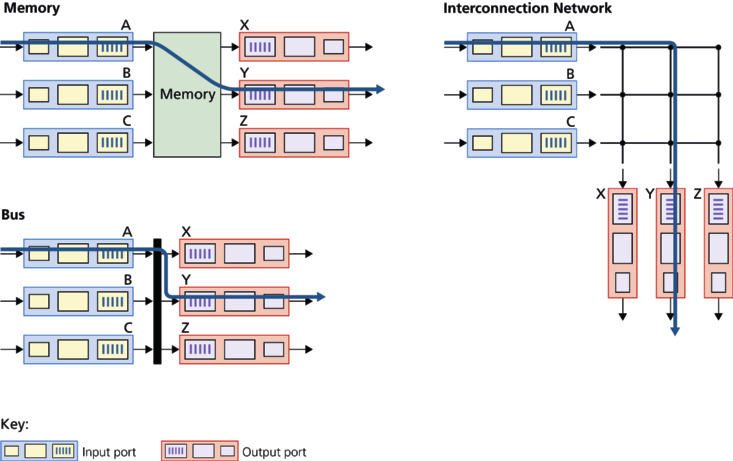

Figure 4.7 Output port

processing

in parallel. An input port breaks a packet into K smaller chunks, and sends (“sprays”) the chunks through K  of these N  switching fabrics to the

selected output port, which reassembles the K chunks back into the origi-

nal packet.

##### 4.2.3 Output Port Processing

Output port processing, shown in Figure 4.7, takes packets that have been stored in the output port’s memory and transmits them over the output link.

This includes selecting (i.e., scheduling) and de-queueing packets for transmission, and performing the needed link-layer and physical-layer transmission functions.

##### 4.2.4 Where Does Queuing Occur?

If we consider input and output port functionality and the configurations shown in Figure 4.6, it’s clear that packet queues may form at both the input ports and the output ports, just as we identified cases where cars may wait at the inputs and outputs of the traffic intersection in our roundabout analogy.

The location and extent of queueing (either at the input port queues or the output port queues) will depend on the traffic load, the relative speed of the switching fabric, and the line speed. Let’s now consider these queues in a bit more detail, since as these queues grow large, the router’s memory can eventually be exhausted and packet loss will occur when no memory is available to store arriving packets.

Recall that in our earlier discussions, we said that packets were “lost within the network” or “dropped at a router.” It is here, at these queues within a router, where such packets are actually dropped and lost.

Suppose that the input and output line speeds (transmission rates) all have an identical transmission rate of R packets per second, and that there are N line input ports and N output ports. To further simplify the discussion, let’s assume

that all packets have the same fixed length, and that packets arrive to input ports in a synchronous manner. That is, the time to send a packet on any link is equal to the time to receive a packet on any link, and during such an interval of time, either zero or one packets can arrive on an input link. Define the switching fabric transfer rate R as the rate at which packets can be moved from switch input port to output port. If R is N times faster than R , then only negliswitch line gible queuing will occur at the input ports. This is because even in the worst case, where all N input lines are receiving packets, and all packets are to be for-

warded to the same output port, each batch of N packets (one packet per input

port) can be cleared through the switch fabric before the next batch arrives.

Input Queueing But what happens if the switch fabric is not fast enough (relative to the input line speeds) to transfer all arriving packets through the fabric without delay?

In this case, packet queuing can also occur at the input ports, as packets must join input port queues to wait their turn to be transferred through the switching fabric to the output port. To illustrate an important consequence of this queuing, consider a crossbar switching fabric and suppose that (1) all link speeds are identical, (2) that one packet can be transferred from any one input port to a given output port in the same amount of time it takes for a packet to be received on an input link, and (3) packets are moved from a given input queue to their desired output queue in an FCFS manner. Multiple packets can be transferred in parallel, as long as their output ports are different. However, if two packets at the front of two input queues are destined for the same output queue, then one of the packets will be blocked and must wait at the input queue—the switching fabric can transfer only one packet to a given output port at a time.

Figure 4.8 shows an example in which two packets at the front of their input queues are destined for the same upper-right output port. Suppose that the switch fabric chooses to transfer the packet from the front of the upper-left queue. In this case, the first packet in the lower-left queue must wait. But not only must this first packet wait, so too must the second packet that is queued behind that packet in the lower-left queue, even though there is no contention for the middle-right output port (the destination for the second packet in the lower queue). This phenomenon is known as head-of-the-line (HOL) blocking in an input-queued switch—a queued packet in an input queue must wait for

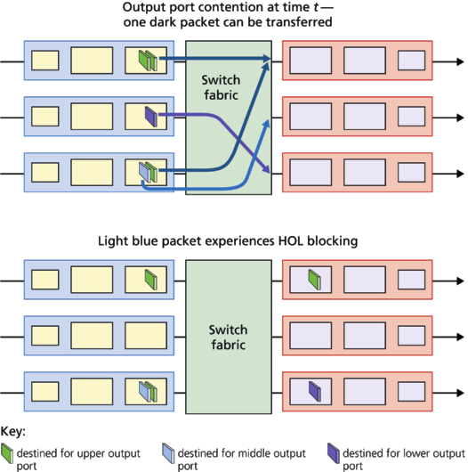

Figure 4.8 HOL blocking at and input-queued switch transfer through the fabric (even though its output port is free) because it is blocked by another packet at the head of the line. [Karol 1987] shows that due to HOL blocking, the input queue will grow to unbounded length (informally, this is equivalent to saying that significant packet loss will occur) under certain assumptions as soon as the packet arrival rate on the input links reaches only 58 percent of their capacity. A number of solutions to HOL blocking are discussed in [McKeown 1997].

Output Queueing Let’s next consider whether queueing can occur at a switch’s output ports.

Suppose that R is again N times faster than R and that packets arriving switch line at each of the N input ports are destined to the same output port. In this case,

in the time it takes to send a single packet onto the outgoing link, N new packets will arrive at this output port (one from each of the N input ports). Since

the output port can transmit only a single packet in a unit of time (the packet transmission time), the N arriving packets will have to queue (wait) for trans-

mission over the outgoing link. Then N more packets can possibly arrive in the

time it takes to transmit just one of the N packets that had just previously been

queued. And so on. Thus, packet queues can form at the output ports even when the switching fabric is N times faster than the port line speeds. Eventu-

ally, the number of queued packets can grow large enough to exhaust available memory at the output port.

When there is not enough memory to buffer an incoming packet, a decision must be made to either drop the arriving packet (a policy known as drop-tail) or remove one or more already-queued packets to make room for the newly arrived packet.

In some cases, it may be advantageous to drop (or mark the header of) a packet before the buffer is full in order to provide a congestion signal to the sender. This marking could be done using the Explicit Congestion Notification bits that we studied in Section 3.7.2. A number of proactive packet-dropping and -marking policies (which collectively have become known as active queue management (AQM) algorithms) have been proposed and analyzed [Labrador 1999, Hollot 2002]. One of the most widely studied and implemented AQM algorithms is the Random Early Detection (RED) algorithm [Christiansen 2001]. More recent AQM policies include PIE (the Proportional Integral controller Enhanced [RFC 8033]), and CoDel [Nichols 2012].

Output port queuing is illustrated in Figure 4.9.At time t, a packet has arrived at each of the incoming input ports, each destined for the uppermost outgoing port. Assuming identical line speeds and a switch operating at three times the line speed, one time unit later (that is, in the time needed to receive or send a packet), all three original packets have been transferred to the outgoing port and are queued awaiting transmission.

In the next time unit, one of these three packets will have been transmitted over the outgoing link. In our example, two new packets have arrived at the incoming side of the switch; one of these packets is destined for this uppermost output port. A consequence of such queuing is that a packet scheduler at the output port must choose one packet, among those queued, for transmission—a topic we’ll cover in the following section.

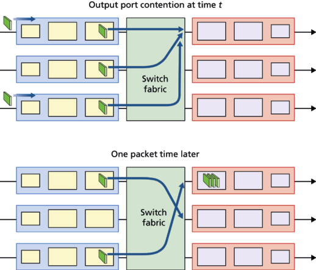

Figure 4.9 Output port queueing

How Much Buffering Is “Enough?” Our study above has shown how a packet queue forms when bursts of packets arrive at a router’s input or (more likely) output port, and the packet arrival rate temporarily exceeds the rate at which packets can be forwarded. The longer the amount of time that this mismatch persists, the longer the queue will grow, until eventually a port’s buffers become full and packets are dropped.

One natural question is how much buffering should be provisioned at a port. It turns out the answer to this question is much more complicated than one might imagine and can teach us quite a bit about the subtle interaction among congestion-aware senders at the network’s edge and the network core!

For many years, the rule of thumb [RFC 3439] for buffer sizing was that the amount of buffering  B  should be equal to an average round-trip

time (RTT, say 250 msec) times the link capacity  C . Thus, a 10-Gbps link

with an RTT of 250 msec would need an amount of buffering equal to B RTT C = i = 2.5 Gbits of buffers.

This result was based on an analysis of

the queueing dynamics of a relatively small number of TCP flows [Villamizar 1994]. More recent theoretical and experimental efforts [Appenzeller 2004], however, suggest that when a large number of independent TCP flows  N  pass

B RTT C N.through a link, the amount of buffering needed is = i

In core

networks, where a large number of TCP flows typically pass through large backbone router links, the value of N can be large, with the decrease in needed buffer size becoming quite significant. [Appenzeller 2004; Wischik 2005;

Beheshti 2008] provide very readable discussions of the buffer-sizing problem from a theoretical, implementation, and operational standpoint.

It’s temping to think that more buffering must be better—larger buffers would allow a router to absorb larger fluctuations in the packet arrival rate, thereby decreasing the router’s packet loss rate. But larger buffers also mean potentially longer queueing delays. For gamers and for interactive teleconferencing users, tens of milliseconds count. Increasing the amount of per-hop buffer by a factor of 10 to decrease packet loss could increase the end-end delay by a factor of 10!

Increased RTTs also make TCP senders less responsive and slower to respond to incipient congestion and/or packet loss. These delay-based considerations show that buffering is a double-edged sword—buffering can be used to absorb short-term statistical fluctuations in traffic but can also lead to increased delay and the attendant concerns. Buffering is a bit like salt—just the right amount of salt makes food better, but too much makes it inedible!

In the discussion above, we’ve implicitly assumed that many independent senders are competing for bandwidth and buffers at a congested link. While this is probably an excellent assumption for routers within the network core, at the network edge this may not hold. Figure 4.10(a) shows a home router sending TCP segments to a remote game server. Following [Nichols 2012], suppose that it takes 20 ms to transmit a packet (containing a gamer’s TCP segment), that there are negligible queueing delays elsewhere on the path to the game server, and that the RTT is 200 ms.

As shown in Figure 4.10(b), suppose that at time t = 0, a burst of 25 packets arrives to the queue. One of these queued packets is then transmitted once every 20 ms, so that at t = 200 msec, the first

ACK arrives, just as the 21st packet is being transmitted. This ACK arrival causes the TCP sender to send another packet, which is queued at the outgoing link of the home router. At t = 220, the next ACK arrives, and another TCP

segment is released by the gamer and is queued, as the 22nd packet is being transmitted, and so on. You should convince yourself that in this scenario, ACK clocking results in a new packet arriving at the queue every time a queued packet is sent, resulting in queue size at the home router’s outgoing link that is always five packets! That is, the end-end-pipe is full (delivering packets to the destination at the path bottleneck rate of one packet every 20 ms), but the amount of queueing delay is constant and persistent.

As a result, the gamer is unhappy with the delay, and the parent (who even knows wireshark!) is confused because he or she doesn’t understand why delays are persistent and excessively long, even when there is no other traffic on the home network.

This scenario above of long delay due to persistent buffering is known as bufferbloat and illustrates that not only is throughput important, but also minimal delay is important as well [Kleinrock 2018], and that the interaction Figure 4.10 Bufferbloat: persistent queues

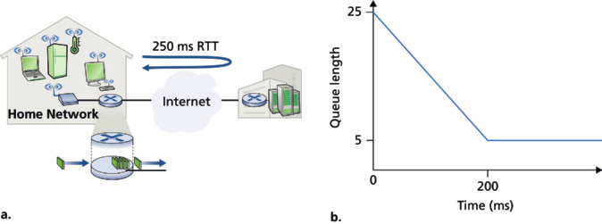

among senders at the network edge and queues within the network can indeed be complex and subtle. The DOCSIS 3.1 standard for cable networks that we will study in Chapter 6, recently added a specific AQM mechanism [RFC 8033, RFC 8034] to combat bufferbloat, while preserving bulk throughput performance.

##### 4.2.5 Packet Scheduling

Let’s now return to the question of determining the order in which queued packets are transmitted over an outgoing link. Since you yourself have undoubtedly had to wait in long lines on many occasions and observed how waiting customers are served, you’re no doubt familiar with many of the queueing disciplines commonly used in routers. There is first-come-firstserved (FCFS, also known as first-in-first-out, FIFO). The British are famous for patient and orderly FCFS queueing at bus stops and in the marketplace (“Oh, are you queueing?”). Other countries operate on a priority basis, with one class of waiting customers given priority service over other waiting customers. There is also round-robin queueing, where customers are again divided into classes (as in priority queueing) but each class of customer is given service in turn.

First-in-First-Out (FIFO) Figure 4.11 shows the queuing model abstraction for the FIFO link-scheduling discipline. Packets arriving at the link output queue wait for transmission if the link is currently busy transmitting another packet. If there is not sufficient buffering space to hold the arriving packet, the queue’s packet-discarding policy then determines whether the packet will be dropped (lost) or whether other packets will be removed from the queue to make space for the arriving packet, as discussed above.

In our discussion below, we’ll ignore packet discard. When a packet is completely transmitted over the outgoing link (that is, receives service) it is removed from the queue.

The FIFO (also known as first-come-first-served, or FCFS) scheduling discipline selects packets for link transmission in the same order in which they arrived at the output link queue. We’re all familiar with FIFO queuing from service centers, where arriving customers join the back of the single waiting line, remain in order, and are then served when they reach the front of the line.

Figure 4.12 shows the FIFO queue in operation. Packet arrivals are indicated by numbered arrows above the upper timeline, with the number indicating the order in which the packet arrived. Individual packet departures are shown

Figure 4.11 FIFO

queueing abstraction

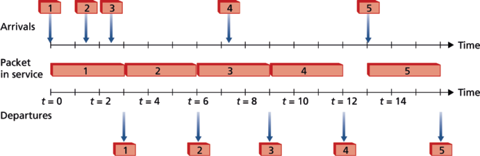

from the queue) until the arrival of packet 5. Priority Queuing Under priority queuing, packets arriving at the output link are classified into priority classes upon arrival at the queue, as shown in Figure 4.13. In practice, a network operator may configure a queue so that packets carrying network management information (for example, as indicated by the source or destina- tion TCP/UDP port number) receive priority over user traffic; additionally, real-time voice-over-IP packets might receive priority over non-real-time traf- fic such e-mail packets. Each priority class typically has its own queue. When choosing a packet to transmit, the priority queuing discipline will transmit a packet from the highest priority class that has a nonempty queue (that is, has packets waiting for transmission). The choice among packets in the same pri- ority class is typically done in a FIFO manner. Figure 4.14 illustrates the operation of a priority queue with two priority classes. Packets 1, 3, and 4 belong to the high-priority class, and packets 2 and 5 belong to the low-priority class. Packet 1 arrives and, finding the link idle, begins transmission. During the transmission of packet 1, packets 2 and 3 arrive and are queued in the low- and high-priority queues, respectively. After

Figure 4.12 The FIFO queue in operation below the lower timeline. The time that a packet spends in service (being transmitted) is indicated by the horizontal length of the rectangle between the two timelines. In our examples here, let’s assume that each packet takes three units of time to be transmitted. Under the FIFO discipline, packets leave in the same order in which they arrived. Note that after the departure of packet 4, the link remains idle (since packets 1 through 4 have been transmitted and removed

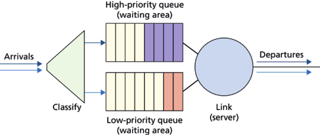

Figure 4.13 The priority queueing model

Figure 4.14 The priority queue in operation the transmission of packet 1, packet 3 (a high-priority packet) is selected for transmission over packet 2 (which, even though it arrived earlier, is a low-priority packet). At the end of the transmission of packet 3, packet 2 then begins transmission. Packet 4 (a high-priority packet) arrives during the transmission of packet 2 (a low-priority packet). Under a non-preemptive priority queuing discipline, the transmission of a packet is not interrupted once it has begun. In this case, packet 4 queues for transmission and begins being transmitted after Net Neutrality We’ve seen that packet scheduling mechanisms (e.g., priority traffic scheduling disciplines such a strict priority, and WFQ) can be used to provide different levels of service to different “classes” of traffic. The definition of what precisely constitutes a “class” of traffic is up to an ISP to decide, but could be potentially based on any set of fields in the IP datagram header. For example, the port field in the IP datagram header could be used to classify datagrams according to the “well-know service” associated with that port: SNMP network management datagram (port 161 might be assigned ) to a higher priority class than an IMAP e-mail protocol (ports 143, or 993 datagram ) and therefore receive better service. An ISP could also potentially use a datagram’s source IP address to provide priority to datagrams being sent by certain companies (who have presumably paid the ISP for this privilege) over datagrams being sent from other companies (who have not paid); an ISP could even block traffic with a source IP address in a given company, or country. There are many mechanisms that would allow an ISP to provide different levels of service to different classes of traffic. The real question is what policies and laws determine what an ISP can actually do. Of course, these laws will vary by country; see [Smithsonian 2017] for a brief survey. Here, we’ll briefly consider US policy on what has come to be known as “net neutrality.” The term “net neutrality” doesn’t have a precise decision, but the March 2015 Order on Protecting and Promoting an Open Internet [FCC 2015] by the US Federal Communications Commission provides three “clear, bright line” rules that are now often associated with net neutrality:

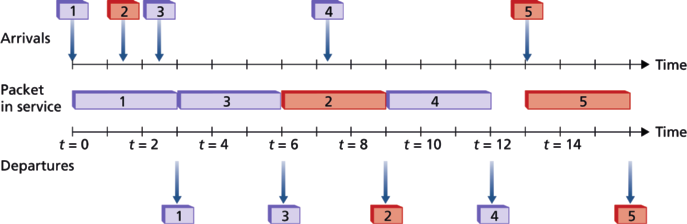

the transmission of packet 2 is completed. Principles in Practice

• “No Blocking. . . . A person engaged in the provision of broadband Internet access service, . . . shall not block lawful content, applications, services, or non-harmful devices, subject to reasonable network management.”

• “No Throttling. . . . A person engaged in the provision of broadband Internet access service, . . . shall not impair or degrade lawful Internet traffic on the basis of Internet content, application, or service, or use of a non-harmful device, subject to reasonable network management.” • “No Paid Prioritization. . . . A person engaged in the provision of broadband Internet access service, . . . shall not engage in paid prioritization. “Paid prioritization” refers to the management of a broadband provider’s network to directly or indirectly favor some traffic over other traffic, including through use of techniques such as traffic shaping, prioritization, resource reservation, or other forms of preferential traffic management, . . .” Quite interestingly, before the Order, ISP behaviors violating the first two of these rules had been observed [Faulhaber 2012]. In 2005, an ISP in North Carolina agreed to stop its practice of blocking its customers from using Vonage, a voice-over-IP service that competed with its own telephone service. In 2007, Comcast was judged to be interfering with BitTorrent P2P traffic by internally creating and sending TCP RST packets to BitTorrent senders and receivers, which caused them to close their BitTorrent connection [FCC 2008].

Both sides of the net neutrality debate have been argued strenuously, mostly focused on the extent to which net neutrality provides benefits to customers, while at the same time promoting innovation. See [Peha 2006, Faulhaber 2012, Economides 2017, Madhyastha 2017].

The 2015 FCC Order on Protecting and Promoting an Open Internet, which banned ISPs from blocking, throttling, or providing paid prioritizing, was superseded by the 2017 FCC Restoring Internet Freedom Order, [FCC 2017] which rolled back these prohibitions and focused instead on ISP transparency. In 2024, the FCC reinstated much of the 2015 FCC Order (effectively rolling back the 2017 rollback) and also re-re-classified broadband Internet access service (BIAS) as “telecommunications service” rather than an “information service” [FCC 2024]. This seemingly innocuous reclassification, however, means that broadband Internet access service would be subject to significantly more US government regulation. With so much interest and so many changes, it’s probably safe to say we aren’t close to having seen the final chapter written on net neutrality in the United States, or elsewhere.

Round Robin and Weighted Fair Queuing (WFQ) Under the round robin queuing discipline, packets are sorted into classes as with priority queuing. However, rather than there being a strict service priority among classes, a round robin scheduler alternates service among the classes.

In the simplest form of round robin scheduling, a class 1 packet is transmitted, followed by a class 2 packet, followed by a class 1 packet, followed by a class 2 packet, and so on. A so-called work-conserving queuing discipline will never allow the link to remain idle whenever there are packets (of any class) queued for transmission. A work-conserving round robin discipline that looks for a packet of a given class but finds none will immediately check the next class in the round robin sequence.

Figure 4.15 illustrates the operation of a two-class round robin queue. In this example, packets 1, 2, and 4 belong to class 1, and packets 3 and 5 belong to the second class. Packet 1 begins transmission immediately upon arrival at the output queue. Packets 2 and 3 arrive during the transmission of packet 1 and thus queue for transmission. After the transmission of packet 1, the link queued packet; it is thus transmitted immediately after packet 2. A generalized form of round robin queuing that has been widely imple- mented in routers is the so-called weighted fair queuing (WFQ) discipline [Demers 1990; Parekh 1993. WFQ is illustrated in Figure 4.16. Here, arriving packets are classified and queued in the appropriate per-class waiting area. As in round robin scheduling, a WFQ scheduler will serve classes in a circular manner—first serving class 1, then serving class 2, then serving class 3, and then (assuming there are three classes) repeating the service pattern. WFQ is also a work-conserving queuing discipline and thus will immediately move on to the next class in the service sequence when it finds an empty class queue. WFQ differs from round robin in that each class may receive a differential amount of service in any interval of time. Specifically, each class, i, is assigned a weight, w . Under WFQ, during any interval of time during which there are i class i packets to send, class i will then be guaranteed to receive a fraction of service equal to w Σ w , where the sum in the denominator is taken over all i j classes that also have packets queued for transmission. In the worst case, even if all classes have queued packets, class i will still be guaranteed to receive a fraction w Σ w of the bandwidth, where in this worst case the sum in the i j denominator is over all classes. Thus, for a link with transmission rate R, class i  will always achieve a throughput of at least R w i Σ w . Our description of i j WFQ has been idealized, as we have not considered the fact that packets are dis- crete and a packet’s transmission will not be interrupted to begin transmission of another packet; [Demers 1990; Parekh 1993] discuss this packetization issue.

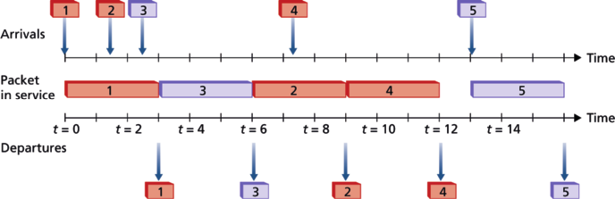

Figure 4.15 The two-class robin queue in operation scheduler looks for a class 2 packet and thus transmits packet 3. After the transmission of packet 3, the scheduler looks for a class 1 packet and thus transmits packet 2. After the transmission of packet 2, packet 4 is the only

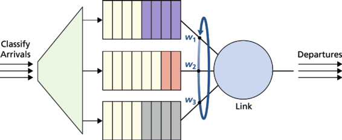

Figure 4.16 Weighted fair queueing

#### 4.3 The Internet Protocol (IP): IPv4, Addressing, IPv6, and More

Our study of the network layer thus far in Chapter 4—the notion of the data and control plane component of the network layer, our distinction between forwarding and routing, the identification of various network service models, and our look inside a router—have often been without reference to any specific computer network architecture or protocol. In this section, we’ll focus on key aspects of the network layer on today’s Internet and the celebrated Internet Protocol (IP).

There are two versions of IP in use today. We’ll first examine the widely deployed IP protocol version 4, which is usually referred to simply as IPv4 [RFC 791] in Section 4.3.1. We’ll examine IP version 6 [RFC 2460; RFC 4291], which has been proposed to replace IPv4, in Section 4.3.4. In between, we’ll primarily cover Internet addressing—a topic that might seem rather dry and detail-oriented but we’ll see is crucial to understanding how the Internet’s network layer works. To master IP addressing is to master the Internet’s network layer itself!

##### 4.3.1 IPV4 Datagram Format

Recall that the Internet’s network-layer packet is referred to as a datagram. We begin our study of IP with an overview of the syntax and semantics of the IPv4 datagram. You might be thinking that nothing could be drier than the syntax and semantics of a packet’s bits. Nevertheless, the datagram plays a central role in the Internet—every networking student and professional needs to see it, absorb it, and master it. (And just to see that protocol headers can indeed be fun to study, check out [Pomeranz 2010]). The IPv4 datagram format is shown in Figure 4.17. The key fields in the IPv4 datagram are the following:

• Version number. These 4 bits specify the IP protocol version of the datagram. By looking at the version number, the router can determine how to interpret the remainder of the IP datagram. Different versions of IP use different datagram formats. The datagram format for IPv4 is shown in Figure 4.17. The datagram format for the new version of IP(IPv6) is discussed in Section 4.3.4.

• Header length. Because an IPv4 datagram can contain a variable number of options (which are included in the IPv4 datagram header), these 4 bits are needed to determine where in the IP datagram the payload (for example, the transport-layer segment being encapsulated in this datagram) actually begins. Most IP datagrams do not contain options, so the typical IP datagram has a 20-byte header.

• Type of service. The type of service  TOS bits were included in the IPv4 

header to allow different types of IP datagrams to be distinguished from each other. For example, it might be useful to distinguish real-time datagrams (such as those used by an IP telephony application) from non-realtime traffic (e.g., FTP . The specific level of service to be provided is a )

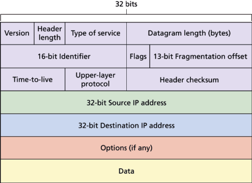

Figure 4.17 IPV4 datagram format

policy issue determined and configured by the network administrator for that router. We also learned in Section 3.7 that two of the TOS bits are used for Explicit Congestion Notification.

• Datagram length. This is the total length of the IP datagram (header plus data), measured in bytes. Since this field is 16 bits long, the theoretical maximum size of the IP datagram is 65,535 bytes. However, datagrams are rarely larger than 1,500 bytes, which allows an IP datagram to fit in the payload field of a maximally sized Ethernet frame.

• Identifier, flags, fragmentation offset. These three fields have to do with socalled IP fragmentation, when a large IP datagram is broken into several smaller IP datagrams which are then forwarded independently to the destination, where they are reassembled before their payload data (see below) is passed up to the transport layer at the destination host. Interestingly, the new version of IP, IPv6, does not allow for fragmentation. We’ll not cover fragmentation here; but readers can find a detailed discussion online, among the “retired” material from earlier versions of this book.

• Time-to-live. The time-to-live (TTL) field is included to ensure that datagrams do not circulate forever (due to, for example, a long-lived routing loop) in the network.

This field is decremented by one each time the datagram is processed by a router. If the TTL field reaches 0, a router must drop that datagram.

• Protocol. This field is typically used only when an IP datagram reaches its final destination. The value of this field indicates the specific transportlayer protocol to which the data portion of this IP datagram should be passed. For example, a value of 6 indicates that the data portion is passed to TCP, while a value of 17 indicates that the data is passed to UDP. For a list of all possible values, see [IANA Protocol Numbers 2025]. Note that the protocol number in the IP datagram has a role that is analogous to the role of the port number field in the transport-layer segment. The protocol number is the glue that binds the network and transport layers together, whereas the port number is the glue that binds the transport and application layers together. We’ll see in Chapter 6 that the link-layer frame also has a special field that binds the link layer to the network layer.

• Header checksum. The header checksum aids a router in detecting bit errors in a received IP datagram. The header checksum is computed by treating each 2 bytes in the header as a number and summing these numbers using 1s complement arithmetic. As discussed in Section 3.3, the 1s complement of this sum, known as the Internet checksum, is stored in the checksum field. A router computes the header checksum for each received IP datagram and detects an error condition if the checksum carried in the datagram header does not equal the computed checksum. Routers typically discard datagrams for which an error has been detected. Note that the checksum must be recomputed and stored again at each router, since the TTL field, and possibly the options field as well, will change. An interesting discussion of fast algorithms for computing the Internet checksum is [RFC 1071]. A question often asked at this point is, why does TCP/IP perform error checking at both the transport and network layers? There are several reasons for this repetition. First, note that only the IP header is checksummed at the IP layer, while the TCP/UDP checksum is computed over the entire TCP/UDP segment. Second, TCP/UDP and IP do not necessarily both have to belong to the same protocol stack. TCP can, in principle, run over a different network-layer protocol (for example, ATM) [Black 1995]) and IP can carry data that will not be passed to TCP/UDP.

• Source and destination IP addresses. When a source creates a datagram, it inserts its IP address into the source IP address field and inserts the address of the ultimate destination into the destination IP address field.

Often the source host determines the destination address via a DNS lookup, as discussed in Chapter 2. We’ll discuss IP addressing in detail in Section 4.3.2.

• Options. The options fields allow an IP header to be extended. Header options were meant to be used rarely—hence the decision to save overhead by not including the information in options fields in every datagram header. However, the mere existence of options does complicate matters— since datagram headers can be of variable length, one cannot determine a priori where the data field will start. Also, since some datagrams may require options processing and others may not, the amount of time needed to process an IP datagram at a router can vary greatly. These considerations become particularly important for IP processing in high-performance routers and hosts. For these reasons and others, IP options were not included in the IPv6 header, as discussed in Section 4.3.4.

• Data (payload).Finally, we come to the last and most important field—the raison d’etre for the datagram in the first place!

In most circumstances, the data field of the IP datagram contains the transport-layer segment (TCP or UDP) to be delivered to the destination. However, the data field can carry other types of data, such as ICMP messages (discussed in Section 5.6).

Note that an IP datagram has a total of 20 bytes of header (assuming no options). If the datagram carries a TCP segment, then each datagram carries a total of 40 bytes of header  20 bytes ( of IP header plus 20 bytes of TCP header)

along with the application-layer message.

##### 4.3.2 IPV4 Addressing

We now turn our attention to IPv4 addressing. Although you may be thinking that addressing must be a straightforward topic, hopefully by the end of this section you’ll be convinced that Internet addressing is not only a juicy, subtle, and interesting topic but also one that is of central importance to the Internet. An excellent treatment of IPv4 addressing can be found in the first chapter in [Stewart 1999].

Before discussing IP addressing, however, we’ll need to say a few words about how hosts and routers are connected into the Internet. A host typically has only a single link into the network; when IP in the host wants to send a datagram, it does so over this link. The boundary between the host and the physical link is called an interface. Now consider a router and its interfaces.

Because a router’s job is to receive a datagram on one link and forward the datagram on some other link, a router necessarily has two or more links to which it is connected. The boundary between the router and any one of its links is also called an interface. A router thus has multiple interfaces, one for each of its links. Because every host and router is capable of sending and receiving IP datagrams, IP requires each host and router interface to have its own IP address. Thus, an IP address is technically associated with an interface, rather than with the host or router containing that interface.

Each IP address is 32 bits long (equivalently, 4 bytes), and there are thus a total of 2 32 (or approximately 4 billion) possible IP addresses. These addresses are typically written in so-called dotted-decimal notation, in which each byte of the address is written in its decimal form and is separated by a period (dot) from other bytes in the address. For example, consider the IP address 193.32.216.9. The 193 is the decimal equivalent of the first 8 bits of the address;

the 32 is the decimal equivalent of the second 8 bits of the address, and so on.

Thus, the address 193.32.216.9 in binary notation is

11000001 00100000 11011000 00001001 Each interface on every host and router in the global Internet must have an IP address that is globally unique (except for interfaces behind NATs, as discussed in Section 4.3.3). These addresses cannot be chosen in a willy-nilly manner, however. A portion of an interface’s IP address will be determined by the subnet to which it is connected.

Figure 4.18 provides an example of IP addressing and interfaces. In this figure, one router (with three interfaces) is used to interconnect seven hosts.

Take a close look at the IP addresses assigned to the host and router interfaces, as there are several things to notice. The three hosts in the upper-left portion of Figure 4.18, and the router interface to which they are connected, all have an IP address of the form 223.1.1.xxx. That is, they all have the same leftmost 24 bits in their IP address. These four interfaces are also interconnected to each other by a network that contains no routers. This network could be interconnected by an Ethernet LAN, in which case the interfaces would be interconnected by an Ethernet switch (as we’ll discuss in Chapter 6), or by a wireless access point (as we’ll discuss in Chapter 7). We’ll represent this routerless network connecting these hosts as a cloud for now, and dive into the internals of such networks in Chapters 6 and 7.

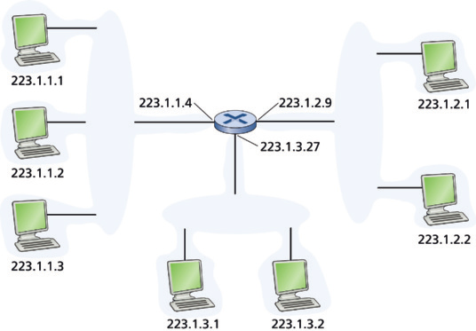

Figure 4.18 Interface addresses and subnets

In IP terms, this network interconnecting three host interfaces and one router interface forms a subnet [RFC 950]. (A subnet is also called an IP network or simply a network in the Internet literature.) IP addressing assigns an address to this subnet: 223.1.1.0/24, where the /24 “slash-24” notation, sometimes 

known as a subnet mask, indicates that the leftmost 24 bits of the 32-bit quantity define the subnet address. The 223.1.1.0/24 subnet thus consists of the three host interfaces  223.1.1.1,  223.1.1.2, and 223.1.1.3 and one router interface (223.1.1.4). Any additional hosts attached to the 223.1.1.0/24 subnet would be  required to have an address of the form 223.1.1.xxx. There are two additional subnets shown in Figure 4.18: the 223.1.2.0/24 network and the 223.1.3.0/24 subnet. Figure 4.19 illustrates the three IP subnets present in Figure 4.18.

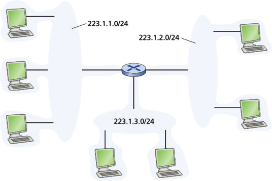

Figure 4.19 Subnet addresses

The IP definition of a subnet is not restricted to Ethernet segments that connect multiple hosts to a router interface. To get some insight here, consider Figure 4.20, which shows three routers that are interconnected with each other by point-to-point links. Each router has three interfaces, one for each point-to-point link and one for the broadcast link that directly connects the router to a pair of hosts. What subnets are present here? Three subnets, 223.1.1.0/24,
223.1.2.0/24, and 223.1.3.0/24, are similar to the subnets we encountered in

Figure 4.18. But note that there are three additional subnets in this example as well: one subnet, 223.1.9.0/24, for the interfaces that connect routers R1 and R2; another subnet, 223.1.8.0/24, for the interfaces that connect routers R2 and R3; and a third subnet, 223.1.7.0/24, for the interfaces that connect routers R3 and R1. For a general interconnected system of routers and hosts, we can use the following recipe to define the subnets in the system:

To determine the subnets, detach each interface from its host or router, creating islands of isolated networks, with interfaces terminating the end points of the isolated networks. Each of these isolated networks is called a subnet.

If we apply this procedure to the interconnected system in Figure 4.20, we get six islands or subnets.

From the discussion above, it’s clear that an organization (such as a company or academic institution) with multiple Ethernet segments and point-to-point links will have multiple subnets, with all of the devices on a given subnet having the same subnet address. In principle, the different subnets could have quite different subnet addresses. In practice, however, their

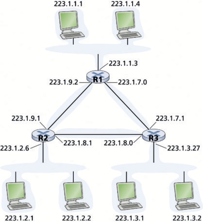

Figure 4.20 Three routers interconnecting six subnets subnet addresses often have much in common. To understand why, let’s next turn our attention to how addressing is handled in the global Internet.

The Internet’s address assignment strategy is known as Classless Interdomain Routing (CIDR—pronounced cider) [RFC 4632].CIDR generalizes the notion of subnet addressing. As with subnet addressing, the 32-bit IP address is divided into two parts and again has the dotted-decimal form a b c d x . . . ,

where x indicates the number of bits in the first part of the address.

The x most significant bits of an address of the form a b c d x . . . constitute the

network portion of the IP address, and are often referred to as the prefix (or network prefix) of the address. An organization is typically assigned a block of contiguous addresses, that is, a range of addresses with a common prefix (see the Principles in Practice feature).

In this case, the IP addresses of devices within the organization will share the common prefix. When we cover the Internet’s BGP routing protocol in Section 5.4, we’ll see that only these x lead-

ing prefix bits are considered by routers outside the organization’s network.

That is, when a router outside the organization forwards a datagram whose destination address is inside the organization, only the leading x bits of the

address need be considered. This considerably reduces the size of the forwarding table in these routers, since a single entry of the form a b c d x . . . will be

sufficient to forward packets to any destination within the organization.

The remaining 32-  bits of an address can be thought of as distinguishing x

among the devices within the organization, all of which have the same network prefix. These are the bits that will be considered when forwarding packets at routers within the organization. These lower-order bits may (or may not) have an additional subnetting structure, such as that discussed above. For example, suppose the first 21 bits of the CIDRized address a.b.c.d/21 specify the organization’s network prefix and are common to the IP addresses of all devices in that organization. The remaining 11 bits then identify the specific hosts in the organization. The organization’s internal structure might be such that these 11 rightmost bits are used for subnetting within the organization, as discussed above. For example, a.b.c.d/24 might refer to a specific subnet within the organization.

Before CIDR was adopted, the network portions of an IP address were constrained to be 8, 16, or 24 bits in length, an addressing scheme known as classful addressing, since subnets with 8-, 16-, and 24-bit subnet addresses were known as class A, B, and C networks, respectively. The requirement that the subnet portion of an IP address be exactly 1, 2, or 3 bytes long turned out to be problematic for supporting the rapidly growing number of organizations with small and medium-sized subnets. A class C  /24 subnet could accom- 

modate only up to 2 8 − 2 = 254 hosts (two of the 2 8 = 256 addresses are

reserved for special use)—too small for many organizations. However, a class B  /16 subnet, which supports up to 65,634 hosts, was too large. Under classful addressing, an organization with, say, 2,000 hosts was typically allocated a class B  /16 subnet address. This led to a rapid depletion of the class B  address space and poor utilization of the assigned address space. For example, the organization that used a class B address for its 2,000 hosts was allocated enough of the address space for up to 65,534 interfaces—leaving more than 63,000 addresses that could not be used by other organizations.

Principles in Practice This example of an ISP that connects eight organizations to the Internet nicely illustrates how carefully allocated CIDRized addresses facilitate routing.

Suppose, as shown in Figure 4.21, that the ISP (which we’ll call Fly-By-Night-ISP) advertises to the outside world that it should be sent any datagrams whose first 20 address bits match 200.23.16.0/20.The rest of the world need not know that within the address block 200.23.16.0/20 there are in fact eight other organizations, each with its own subnets. This ability to use a single prefix to advertise multiple networks is often referred to as address aggregation (also route aggregation or route summarization).

Address aggregation works extremely well when addresses are allocated in blocks to ISPs and then from ISPs to client organizations. But what happens when addresses are not allocated in such a hierarchical manner? What would happen, for example, if Fly-By-Night-ISP acquires ISPs-R-Us and then has Organization 1 connect to the Internet through its subsidiary ISPs-R-Us? As shown in Figure 4.21, the subsidiary ISPs-R-Us owns the address block 199.31.0.0/16, but Organization 1’s IP addresses are unfortunately outside of this address block. What should be done here? Certainly, Organization 1 could renumber all of its routers and hosts to have addresses within the ISPs-R-Us address block. But this is a costly solution, and Organization 1 might well be reassigned to another subsidiary in the future.

The solution typically adopted is for Organization 1 to keep its IP addresses in
200.23.18.0/23. In this case, as shown in Figure 4.22, Fly-By-Night-ISP continues

to advertise the address block 200.23.16.0/20 and ISPs-R-Us continues to advertise
199.31.0.0/16. However, ISPs-R-Us now also advertises the block of addresses for

Organization 1, 200.23.18.0/23. When other routers in the larger Internet see the address blocks 200.23.16.0/20 (from Fly-By-Night-ISP) and 200.23.18.0/23 (from ISPs-R-Us) and want to route to an address in the block 200.23.18.0/23, they will use longest prefix matching (see Section 4.2.1), and route toward ISPs-R-Us, as it advertises the longest (i.e., most-specific) address prefix that matches the destination address.

Figure 4.21 Hierarchical addressing and route aggregation

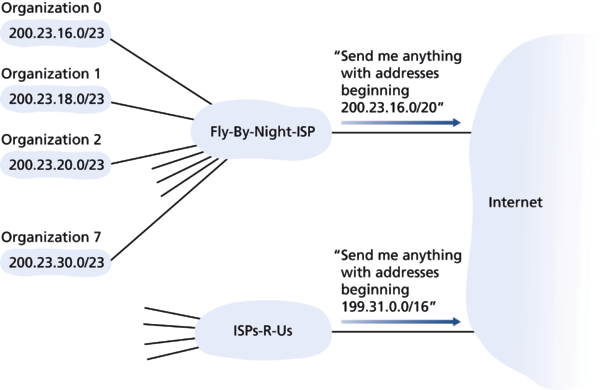

Figure 4.22 ISPs-R-Us has a more specific route to Organization 1 We would be remiss if we did not mention yet another type of IP address, the IP broadcast address 255.255.255.255. When a host sends a datagram with destination address 255.255.255.255, the message is delivered to all hosts on the same subnet. Routers optionally forward the message into neighboring

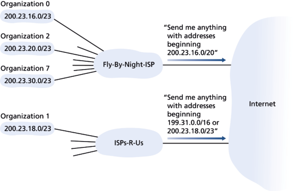

subnets as well (although they usually don’t).Having now studied IP addressing in detail, we need to know how hosts and subnets get their addresses in the first place. Let’s begin by looking at how an organization gets a block of addresses for its devices, and then look at how a device (such as a host) is assigned an address from within the organization’s block of addresses. Obtaining a Block of Addresses

In order to obtain a block of IP addresses for use within an organization’s sub- net, a network administrator might first contact its ISP, which would provide addresses from a larger block of addresses that had already been allocated to the ISP. For example, the ISP may itself have been allocated the address block
200.23.16.0/20. The ISP, in turn, could divide its address block into eight equal-

sized contiguous address blocks and give one of these address blocks out to each of up to eight organizations that are supported by this ISP, as shown below.

(We have underlined the subnet part of these addresses for your convenience.)

11001000 00010111 00010000 00000000 ISP’s block:
200.23.16.0/20

11001000 00010111 00010000 00000000 Organization 0
200.23.16.0/23

11001000 00010111 00010010 00000000 Organization 1
200.23.18.0/23

11001000 00010111 00010100 00000000 Organization 2
200.23.20.0/23

. . .  . . . . . .

11001000 00010111 00011110 00000000 Organization 7
200.23.30.0/23

While obtaining a set of addresses from an ISP is one way to get a block of addresses, it is not the only way. Clearly, there must also be a way for the ISP itself to get a block of addresses. Is there a global authority that has ultimate responsibility for managing the IP address space and allocating address blocks to ISPs and other organizations? Indeed there is! IP addresses are managed under the authority of the Internet Corporation for Assigned Names and Numbers (ICANN) [ICANN 2025], based on guidelines set forth in [RFC 7020]. The role of the nonprofit ICANN organization is not only to allocate IP addresses, but also to manage the DNS root servers. It also has the very contentious job of assigning domain names and resolving domain name disputes. The ICANN allocates addresses to regional Internet registries (for example, ARIN, RIPE, APNIC, and LACNIC, which together form the Address Supporting Organization of ICANN [ASO-ICANN 2025]), and handle the allocation/management of addresses within their regions.

Obtaining a Host Address: The Dynamic Host Configuration Protocol Once an organization has obtained a block of addresses, it can assign individual IP addresses to the host and router interfaces in its organization.A system administrator will typically manually configure the IP addresses into the router (often remotely, with a network management tool).Host addresses can also be configured manually, but typically this is done using the Dynamic Host Configuration Protocol (DHCP) [RFC 2131].DHCP allows a host to obtain (be allocated) an IP address automatically.A network administrator can configure DHCP so that a given host receives the same IP address each time it connects to the network, or a host may be assigned a temporary IP address that will be different each time the host connects to the network.

In addition to host IP address assignment, DHCP also allows a host to learn additional information, such as its subnet mask, the address of its first-hop router (often called the default gateway), and the address of its local DNS server.

Because of DHCP’s ability to automate the network-related aspects of connecting a host into a network, it is often referred to as a plug-and-play or zeroconf (zero-configuration) protocol. This capability makes it very attractive to the network administrator who would otherwise have to perform these tasks manually! DHCP is also enjoying widespread use in residential Internet access networks, enterprise networks, and in wireless LANs, where hosts join and leave the network frequently. Consider, for example, the student who carries a laptop from a dormitory room to a library to a classroom. It is likely that in each location, the student will be connecting into a new subnet and hence will need a new IP address at each location. DHCP is ideally suited to this situation, as there are many users coming and going, and addresses are needed for only a limited amount of time. The value of DHCP’s plug-and-play capability is clear, since it’s unimaginable that a system administrator would be able to reconfigure laptops at each location, and few students (except those taking a computer networking class!) would have the expertise to configure their laptops manually.

DHCP is a client-server protocol. A client is typically a newly arriving host wanting to obtain network configuration information, including an IP address for itself. In the simplest case, each subnet (in the addressing sense of Figure 4.20) will have a DHCP server. If no server is present on the subnet, a DHCP relay agent (typically a router) that knows the address of a DHCP server for that network is needed. Figure 4.23 shows a DHCP server attached to subnet 223.1.2 24, with the router serving as the relay agent for arriving clients attached to subnets 223.1.1 24 and 223.1.3 24. In our discussion below, we’ll assume that a DHCP server is available on the subnet.

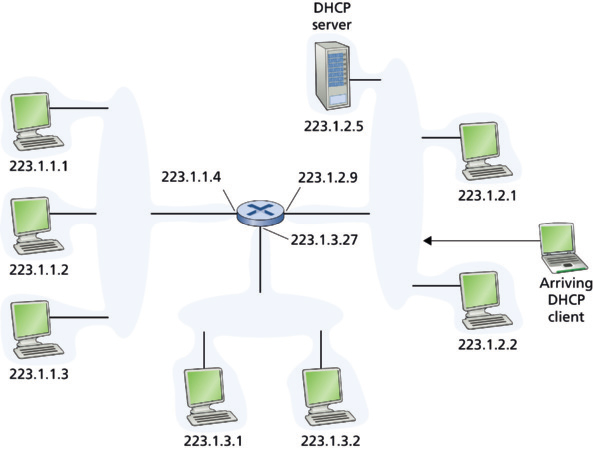

Figure 4.23 DHCP client and server

For a newly arriving host, the DHCP protocol is a four-step process, as shown in Figure 4.24 for the network setting shown in Figure 4.23. In this figyiaddr ure, (as in “your Internet address”) indicates the address being

allocated to the newly arriving client. The four steps are:

• DHCP server discovery. The first task of a newly arriving host is to find a DHCP server with which to interact. This is done using a DHCP discover message, which a client sends within a UDP packet to port 67. The UDP packet is encapsulated in an IP datagram. But to whom should this datagram be sent? The host doesn’t even know the IP address of the network to which it is attaching, much less the address of a DHCP server for this network. Given this, the DHCP client creates an IP datagram containing its DHCP discover message along with the broadcast destination IP address of 255.255.255.255 and a “this host” source IP address of 0.0.0.0.

The DHCP client passes the IP datagram to the link layer, which then broadcasts this frame to all nodes attached to the subnet (we will cover the details of link-layer broadcasting in Section 6.4).

• DHCP server offer(s). A DHCP server receiving a DHCP discover message responds to the client with a DHCP offer message that is broadcast to all nodes on the subnet, again using the IP broadcast address of 255.255.255.255. (You might want to think about why this server reply must also be broadcast). Since several DHCP servers can be present on the subnet, the client may find itself in the enviable position of being able to choose from among several offers. Each server offer message contains the transaction ID of the received discover message, the proposed IP address for the client, the network mask, and an IP address lease time—the amount of time for which the IP address will be valid. It is common for the server to set the lease time to several hours or days [Droms 2002].

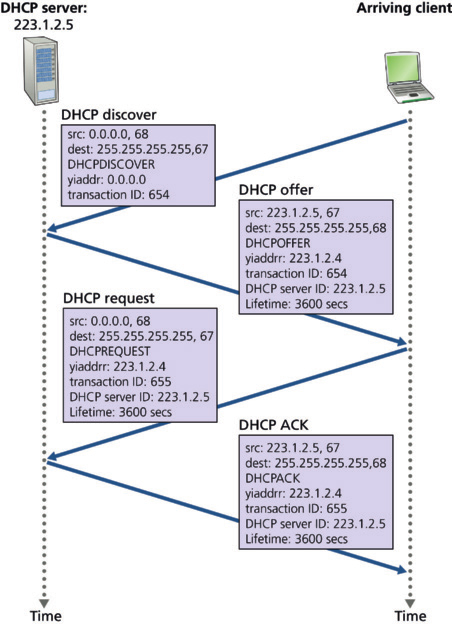

Figure 4.24 DHCP client-server interaction

• DHCP request. The newly arriving client will choose from among one or more server offers and respond to its selected offer with a DHCP request message, echoing back the configuration parameters.

• DHCP ACK. The server responds to the DHCP request message with a DHCP ACK message, confirming the requested parameters.

Once the client receives the DHCP ACK, the interaction is complete and the client can use the DHCP-allocated IP address for the lease duration. Since a client may want to use its address beyond the lease’s expiration, DHCP also provides a mechanism that allows a client to renew its lease on an IP address.

From a mobility aspect, DHCP does have one very significant shortcoming. Since a new IP address is obtained from DHCP each time a node connects to a new subnet, a TCP connection to a remote application cannot be maintained as a mobile node moves between subnets. In Chapter 7, we will learn how mobile cellular networks allow a host to retain its IP address and ongoing TCP connections as it moves between base stations in a provider’s cellular network. Additional details about DHCP can be found in [Droms 2002] and [dhc 2025]. An open source reference implementation of DHCP is available from the Internet Systems Consortium [ISC 2025].

##### 4.3.3 Network Address Translation (NAT)

Given our discussion about Internet addresses and the IPv4 datagram format, we’re now well aware that every IP-capable device needs an IP address. With the proliferation of small office, home office (SOHO) subnets, this would seem to imply that whenever a SOHO wants to install a LAN to connect multiple machines, a range of addresses would need to be allocated by the ISP to cover all of the SOHO’s IP devices (including phones, tablets, gaming devices, IP TVs, printers and more). If the subnet grew bigger, a larger block of addresses would have to be allocated. But what if the ISP had already allocated the contiguous portions of the SOHO network’s current address range? And what typical homeowner wants (or should need) to know how to manage IP addresses in the first place? Fortunately, there is a simpler approach to address allocation that has found increasingly widespread use in such scenarios:

network address translation (NAT) [RFC 2663; RFC 3022; Huston 2004, Zhang 2007; Huston 2017].

Figure 4.25 shows the operation of a NAT-enabled router. The NAT-enabled router, residing in the home, has an interface that is part of the home network on the right of Figure 4.25. Addressing within the home network is exactly as we have seen above—all four interfaces in the home network have the same subnet address of 10.0.0.0/24. The address space 10.0.0.0/8 is one of three portions of the IP address space that is reserved in [RFC 1918] for a private network or a realm with private addresses, such as the home network in Figure 4.25. A realm with private addresses refers to a network whose addresses only have meaning to devices within that network. To see why this is important, consider the fact that there are hundreds of thousands of home Figure 4.25 Network address translation

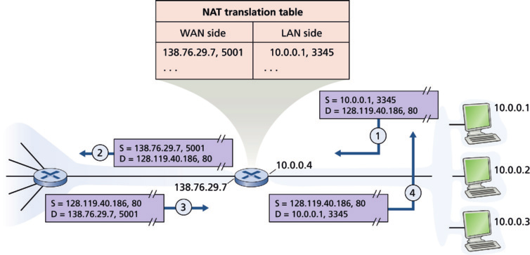

networks, many using the same address space, 10.0.0.0/24.Devices within a given home network can send packets to each other using 10.0.0.0/24 addressing. However, packets forwarded beyond the home network into the larger global Internet clearly cannot use these addresses (as either a source or a destination address) because there are hundreds of thousands of networks using this block of addresses. That is, the 10.0.0.0/24 addresses can only have meaning within the given home network.

But if private addresses only have meaning within a given network, how is addressing handled when packets are sent to or received from the global Internet, where addresses are necessarily unique? The answer lies in understanding NAT.

The NAT-enabled router does not look like a router to the outside world.

Instead the NAT router behaves to the outside world as a single device with a single IP address. In Figure 4.25, all traffic leaving the home router for the larger Internet has a source IP address of 138.76.29.7, and all traffic entering the home router must have a destination address of 138.76.29.7. In essence, the NAT-enabled router is hiding the details of the home network from the outside world. (As an aside, you might wonder where the home network computers get their addresses and where the router gets its single IP address. Often, the answer is the same—DHCP! The router gets its address from the ISP’s DHCP server, and the router runs a DHCP server to provide addresses to computers within the NAT-DHCP-router-controlled home network’s address space.) If all datagrams arriving at the NAT router from the WAN have the same destination IP address (specifically, that of the WAN-side interface of the NAT router), then how does the router know the internal host to which it should forward a given datagram? The trick is to use a NAT translation table at the NAT router, and to include port numbers as well as IP addresses in the table entries.

Consider the example in Figure 4.25.Suppose a user sitting in a home network behind host 10.0.0.1 requests a Web page on some Web server (port 80) with IP address 128.119.40.186.The host 10.0.0.1 assigns the (arbitrary) source port number 3345 and sends the datagram into the LAN.The NAT router receives the datagram, generates a new source port number 5001 for the datagram, replaces the source IP address with its WAN-side IP address 138.76.29.7, and replaces the original source port number 3345 with the new source port number 5001.

When generating a new source port number, the NAT router can select any source port number that is not currently in the NAT translation table. (Note that because a port number field is 16 bits long, the NAT protocol can support over 60,000 simultaneous connections with a single WAN-side IP address for the router!) NAT in the router also adds an entry to its NAT translation table. The Web server, blissfully unaware that the arriving datagram containing the HTTP request has been manipulated by the NAT router, responds with a datagram whose destination address is the IP address of the NAT router, and whose destination port number is 5001. When this datagram arrives at the NAT router, the router indexes the NAT translation table using the destination IP address and destination port number to obtain the appropriate IP address  10.0.0.1 and destination port number  3345 for the browser  

in the home network. The router then rewrites the datagram’s destination address and destination port number, and forwards the datagram into the home network.

As suggested in Figure 4.25, NAT is widely used in home and enterprise networks, that is, the edge network to which user devices are directly attached.

Indeed, the IP address assigned to your laptop or phone in almost any network that you join will have a private network prefix of 10.0.0.0/8, 172.16.0.0/12, or
192.168.0.0/16. But NAT is useful for ISPs as well. Consider, for example, a

cable-based access network provider that needs to assign IP addresses to the interfaces of tens of thousands of home gateway routers in its network (with each of those home networks also using NAT internally, as in Figure 4.25).

Rather than assign public addresses to all of these home routers, the ISP would also prefer to use NAT to assign private IP addresses to these routers. In this case, a datagram sourced at a device within the home would pass through two NAT’ed networks on its way to the larger Internet—the home network, and the ISP network. So-called Carrier-grade NAT implements NAT translation at high-speeds for a large number of devices within ISPs. Additionally, [RFC 6598] created a new private address block, 100.64.0.0/10, for ISP-only use. This was done to avoid the case of a first hop home/enterprise NAT and an ISP NAT choosing to use overlapping private IP address spaces.

NAT has enjoyed widespread deployment in recent years. But NAT is not without detractors. First, one might argue that, port numbers are meant to be used for addressing processes, not for addressing hosts. This violation can indeed cause problems for servers running on the home network, since, as we have seen in Chapter 2, server processes wait for incoming requests at wellknown port numbers and peers in a P2P protocol need to accept incoming connections when acting as servers. How can one peer connect to another peer that is behind a NAT server, and has a DHCP-provided NAT address? Technical solutions to these problems include NAT traversal tools [RFC 5389, RFC 5128, Ford 2005].

More “philosophical” arguments have also been raised against NAT by architectural purists. Here, the concern is that routers are meant to be layer 3 (i.e., network-layer) devices, and should process packets only up to the network layer. NAT violates this principle that hosts should be talking directly with each other, without interfering nodes modifying IP addresses, much less port numbers. We’ll return to this debate later in Section 4.5, when we cover middleboxes.

Focus on Security Inspecting Datagrams: Firewalls and Intrusion Detection Systems Suppose you are assigned the task of administering a home, departmental, university, or corporate network. Attackers, knowing the IP address range of your network, can easily send IP datagrams to addresses in your range. These datagrams can do all kinds of devious things, including mapping your network with ping sweeps and port scans, crashing vulnerable hosts with malformed packets, scanning for open TCP UDP ports on servers in your network, and infecting hosts by including malware in the packets. As the network administrator, what are you going to do about all those bad guys out there, each capable of sending malicious packets into your network? Two popular defense mechanisms to malicious packet attacks are firewalls and intrusion detection systems (IDSs).

As a network administrator, you may first try installing a firewall between your network and the Internet. (Most access routers today have firewall capability.) Firewalls inspect the datagram and segment header fields, denying suspicious datagrams entry into the internal network. For example, a firewall may be configured to block all ICMP echo request packets (see Section 5.6), thereby preventing an attacker from doing a traditional port scan across your IP address range. Firewalls can also block packets based on source and destination IP addresses and port numbers. Additionally, firewalls can be configured to track TCP connections, granting entry only to datagrams that belong to approved connections.

Additional protection can be provided with an IDS.An IDS, typically situated at the network boundary, performs “deep packet inspection,” examining not only header fields but also the payloads in the datagram (including application-layer data).An IDS has a database of packet signatures that are known to be part of attacks.

This database is automatically updated as new attacks are discovered. As packets pass through the IDS, the IDS attempts to match header fields and payloads to the signatures in its signature database. If such a match is found, an alert is created. An intrusion prevention system (IPS) is similar to an IDS, except that it actually blocks packets in addition to creating alerts. We’ll explore firewalls and IDSs in more detail in Section 4.5 and in again Chapter 8.

Can firewalls and IDSs fully shield your network from all attacks? The answer is clearly no, as attackers continually find new attacks for which signatures are not yet available. But firewalls and traditional signature-based IDSs are useful in protecting your network from known attacks.

##### 4.3.4 IPV6

In the early 1990s, the Internet Engineering Task Force began an effort to develop a successor to the IPv4 protocol. A prime motivation for this effort was the realization that the 32-bit IPv4 address space was beginning to be used up, with new subnets and IP nodes being attached to the Internet (and being allocated unique IP addresses) at a breathtaking rate. To respond to this need for a large IP address space, a new IP protocol, IPv6, was developed. The designers of IPv6 also took this opportunity to tweak and augment other aspects of IPv4, based on the accumulated operational experience with IPv4.

The point in time when IPv4 addresses would be completely allocated (and hence no new networks could attach to the Internet) was the subject of considerable debate. The estimates of the two leaders of the IETF’s Address Lifetime Expectations working group were that addresses would become exhausted in 2008 and 2018, respectively [Solensky 1996].

In February 2011, IANA allocated out the last remaining pool of unassigned IPv4 addresses to a regional registry. While these registries still have available IPv4 addresses within their pool, once these addresses are exhausted, there are no more available address blocks that can be allocated from a central pool [Huston 2011a]. A recent survey of IPv4 address-space exhaustion, and the steps taken to prolong the life of the address space is [Richter 2015]; a recent analysis of IPv4 address use is [Huston 2025].

Although the mid-1990s estimates of IPv4 address depletion suggested that a considerable amount of time might be left until the IPv4 address space was exhausted, it was realized that considerable time would be needed to deploy a new technology on such an extensive scale, and so the process to develop IP version 6  IPv6 [RFC 2460] was begun [RFC 1752]. (An often- 

asked question is what happened to IPv5? It was initially envisioned that the ST-2 protocol would become IPv5, but ST-2 was later dropped.) An excellent source of information about IPv6 is [Huitema 1998].

IPV6 Datagram Format The format of the IPv6 datagram is shown in Figure 4.26. The most important changes introduced in IPv6 are evident in the datagram format:

• Expanded addressing capabilities. IPv6 increases the size of the IP address from  32 to 128 bits. This ensures that the world won’t run out of IP addresses. Now, every grain of sand on the planet can be IP-addressable.

In addition to unicast and multicast addresses, IPv6 has introduced a new type of address, called an anycast address, that allows a datagram to be delivered to any one of a group of hosts. (This feature could be used, for example, to send an HTTP GET to the nearest of a number of mirror sites that contain a given document.)

• A streamlined 40byte header. As discussed below, a number of IPv4 fields

have been dropped or made optional. The resulting 40-byte fixed-length header allows for faster processing of the IP datagram by a router. A new encoding of options allows for more flexible options processing.

• Flow labeling. IPv6 has an elusive definition of a flow. RFC 2460 states that this allows “labeling of packets belonging to particular flows for which the sender requests special handling, such as a non-default quality of service or real-time service.” For example, audio and video transmission

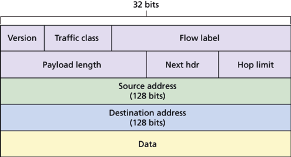

Figure 4.26 IPV6 datagram format

might likely be treated as a flow. On the other hand, the more traditional applications, such as file transfer and e-mail, might not be treated as flows.

It is possible that the traffic carried by a high-priority user (for example, someone paying for better service for their traffic) might also be treated as a flow. What is clear, however, is that the designers of IPv6 foresaw the eventual need to be able to differentiate among the flows, even if the exact meaning of a flow had yet to be determined.

As noted above, a comparison of Figure 4.26 with Figure 4.17 reveals the simpler, more streamlined structure of the IPv6 datagram. The following fields are defined in IPv6:

• Version. This 4-bit field identifies the IP version number. Not surprisingly, IPv6 carries a value of 6 in this field. Note that putting a 4 in this field does not create a valid IPv4 datagram. (If it did, life would be a lot simpler—see the discussion below regarding the transition from IPv4 to IPv6. )

• Traffic class. The 8-bit traffic class field, like the TOS field in IPv4, can be used to give priority to certain datagrams within a flow, or it can be used to give priority to datagrams from certain applications (for example, voice-over-IP) over datagrams from other applications (for example, SMTP e-mail).

• Flow label. As discussed above, this 20-bit field is used to identify a flow of datagrams.

• Payload length. This 16-bit value is treated as an unsigned integer giving the number of bytes in the IPv6 datagram following the fixed-length, 40-byte datagram header.

• Next header. This field identifies the protocol to which the contents (data field) of this datagram will be delivered (for example, to TCP or UDP).

The field uses the same values as the protocol field in the IPv4 header.

• Hop limit. The contents of this field are decremented by one by each router that forwards the datagram. If the hop limit count reaches zero, a router must discard that datagram.

• Source and destination addresses. The various formats of the IPv6 128-bit address are described in RFC 4291.

• Data. This is the payload portion of the IPv6 datagram. When the datagram reaches its destination, the payload will be removed from the IP datagram and passed on to the protocol specified in the next header field.

The discussion above identified the purpose of the fields that are included in the IPv6 datagram. Comparing the IPv6 datagram format in Figure 4.26 with the IPv4 datagram format that we saw in Figure 4.17, we notice that several fields appearing in the IPv4 datagram are no longer present in the IPv6 datagram:

• Fragmentation/reassembly. IPv6 does not allow for fragmentation and reassembly at intermediate routers; these operations can be performed only by the source and destination. If an IPv6 datagram received by a router is too large to be forwarded over the outgoing link, the router simply drops the datagram and sends a “Packet Too Big” ICMP error message (see Section 5.6) back to the sender. The sender can then resend the data, using a smaller IP datagram size. Fragmentation and reassembly is a timeconsuming operation; removing this functionality from the routers and placing it squarely in the end systems considerably speeds up IP forwarding within the network.

• Header checksum. Because the transport-layer (for example, TCP and UDP) and link-layer (for example, Ethernet) protocols in the Internet layers perform checksumming, the designers of IP probably felt that this functionality was sufficiently redundant in the network layer that it could be removed. Once again, fast processing of IP packets was a central concern.

Recall from our discussion of IPv4 in Section 4.3.1 that since the IPv4 header contains a TTL field (similar to the hop limit field in IPv6 , the )

IPv4 header checksum needed to be recomputed at every router. As with fragmentation and reassembly, this too was a costly operation in IPv4.

• Options. An options field is no longer a part of the standard IP header.

However, it has not gone away. Instead, the options field is one of the possible next headers pointed to from within the IPv6 header. That is, just as TCP or UDP protocol headers can be the next header within an IP packet, so too can an options field. The removal of the options field results in a fixed-length, 40-byte IP header.

Transitioning from IPV4 to IPV6 Now that we have seen the technical details of IPv6, let us consider a very practical matter: How will the public Internet, which is based on IPv4, be transitioned to IPv6? The problem is that while new IPv6-capable systems can be made backward-compatible, that is, can send, route, and receive IPv4 datagrams, already deployed IPv4-capable systems are not capable of handling IPv6 datagrams. Several options are possible [Huston 2011b, RFC 4213].

One option would be to declare a flag day—a given time and date when all Internet machines would be turned off and upgraded from IPv4 to IPv6.

The last major technology transition (from using NCP to using TCP for reliable transport service) occurred almost 40 years ago. Even back then [RFC 801], when the Internet was tiny and still being administered by a small number of “wizards,” it was realized that such a flag day was not possible. A flag day involving billions of devices is even more unthinkable today.

The approach to IPv4-to-IPv6 transition that has been most widely adopted in practice involves tunneling [RFC 4213].The basic idea behind tunneling—a key concept with applications in many other scenarios beyond IPv4-to-IPv6 transition, including wide use in the all-IP cellular networks that we’ll cover in Chapter 7—is the following. Suppose two IPv6 nodes (in this example, B and E in Figure 4.27) want to interoperate using IPv6 datagrams but are connected to each other by intervening IPv4 routers. We refer to the intervening set of IPv4 routers between two IPv6 routers as a tunnel, as illustrated in Figure 4.27.

With tunneling, the IPv6 node on the sending side of the tunnel (in this example, B takes the entire IPv6 datagram and puts it in the ) data (payload) field of an IPv4 datagram. This IPv4 datagram is then addressed to the IPv6 node on the receiving side of the tunnel (in this example, E and )

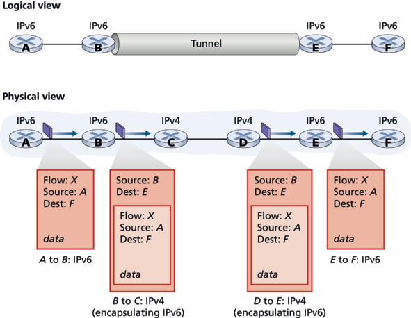

Figure 4.27 Tunneling

sent to the first node in the tunnel (in this example, C . The intervening IPv4 )

routers in the tunnel route this IPv4 datagram among themselves, just as they would any other datagram, blissfully unaware that the IPv4 datagram itself contains a complete IPv6 datagram. The IPv6 node on the receiving side of the tunnel eventually receives the IPv4 datagram (it is the destination of the IPv4 datagram!), determines that the IPv4 datagram contains an IPv6datagram (by observing that the protocol number field in the IPv4 datagram is 41 [RFC 4213], indicating that the IPv4 payload is a IPv6 datagram), extracts the IPv6 datagram, and then routes the IPv6 datagram exactly as it would if it had received the IPv6 datagram from a directly connected IPv6 neighbor.

We end this section by noting that while the adoption of IPv6 was initially slow to take off [Lawton 2001; Huston 2008b], momentum has been building.

[NIST IPv6 2025] surveyed nearly 1400 US government domains and found approximately 40 percent of mail, web and DNS services were configured for IPv6. On the client side, Google reports that nearly 50 percent of the clients accessing Google services do so via IPv6 [Google IPv6 2025]. In 2022, Akamai noted that end-user adoption levels of approximately 44 to 62 percent range for 6 of the top 10 global economies, based on the percentage of requests to the Akamai CDN to IPv4 + IPv6 dual-stacked content. [Nygren 2022] To put the

growth of these numbers in perspective, Google reported an IPv6 adoption rate of just 1 percent in 2012. The proliferation of devices such as IP-enabled phones and other portable devices provides an additional push for more widespread deployment of IPv6.

One important lesson that we can learn from the IPv6 experience is that it is enormously difficult to change network-layer protocols. Since the early 1990s, numerous new network-layer protocols have been trumpeted as the next major revolution for the Internet, but most of these protocols have had limited penetration to date. These protocols include IPv6, multicast protocols, and resource reservation protocols; a discussion of these latter two classes of protocols can be found in the online supplement to this text. Indeed, introducing new protocols into the network layer is like replacing the foundation of a house—it is difficult to do without tearing the whole house down or at least temporarily relocating the house’s residents. On the other hand, the Internet has witnessed rapid deployment of new protocols at the application layer. The classic examples, of course, are the Web, messaging, streaming media, video conferencing, distributed games, and various forms of social media. Introducing new application-layer protocols is like adding a new layer of paint to a house—it is relatively easy to do, and if you choose an attractive color, others in the neighborhood will copy you. In summary, in the future, we can certainly expect to see changes in the Internet’s network layer, but these changes will likely occur on a time scale that is much slower than the changes that will occur at the application layer.

#### 4.4 Generalized Forwarding and SDN

Recall that Section 4.2.1 characterized destination-based forwarding as the two steps of looking up a destination IP address (“match”), then sending the packet into the switching fabric to the specified output port (“action”). Let’s now consider a significantly more general “match-plus-action” paradigm, where the “match” can be made over multiple header fields associated with different protocols at different layers in the protocol stack. The “action” can include forwarding the packet to one or more output ports (as in destination-based forwarding), load balancing packets across multiple outgoing interfaces that lead to a service (as in load balancing), rewriting header values (as in NAT), purposefully blocking/dropping a packet (as in a firewall), sending a packet to a special server for further processing and action (as in DPI), and more.

In generalized forwarding, a match-plus-action table generalizes the notion of the destination-based forwarding table that we encountered in Section 4.2.1. Because forwarding decisions may be made using network-layer and/or link-layer source and destination addresses, the forwarding devices shown in Figure 4.28 are more accurately described as “packet switches” rather than layer 3 “routers” or layer 2 “switches.” Thus, in the remainder of this section, and in Section 5.5, we’ll refer to these devices as packet switches, adopting the terminology that is gaining widespread adoption in SDN literature.

Figure 4.28 shows a match-plus-action table in each packet switch, with the table being computed, installed, and updated by a remote controller. We note that while it is possible for the control components at the individual packet switches to interact with each other (e.g., in a manner similar to that in Figure 4.2), in practice, generalized match-plus-action capabilities are implemented via a remote controller that computes, installs, and updates these tables. You might take a minute to compare Figures 4.2, 4.3, and 4.28—what similarities and differences do you notice between destination-based forwarding shown in Figures 4.2 and 4.3, and generalized forwarding shown in Figure 4.28?

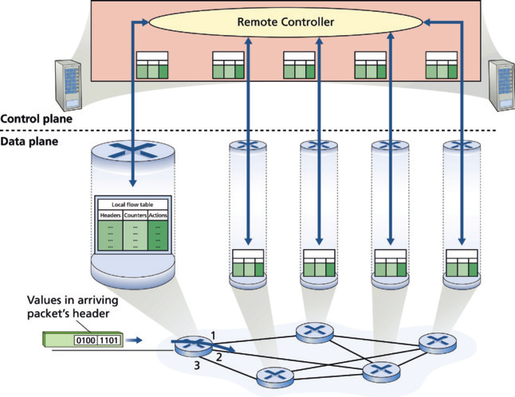

Figure 4.28 Generalized forwarding: Each packet switch contains a match-plus-action table that is computed and distributed by a remote controller

Our following discussion of generalized forwarding will be based on Open-Flow [McKeown 2008, ONF 2025, Casado 2014, Tourrilhes 2014]—a highly visible standard that has pioneered the notion of the match-plus-action forwarding abstraction and controllers, as well as the SDN revolution more generally [Feamster 2013]. We’ll primarily consider OpenFlow 1.0, which introduced key SDN abstractions and functionality in a particularly clear and concise manner. Later versions of OpenFlow introduced additional capabilities as a result of experience gained through implementation and use; current and earlier versions of the OpenFlow standard can be found at [ONF 2025].

Each entry in the match-plus-action forwarding table, known as a flow table in OpenFlow, includes:

• A set of header field values to which an incoming packet will be matched. As in the case of destination-based forwarding, hardware-based matching is most rapidly performed in TCAM memory, with more than a million destination address entries being possible [Bosshart 2013]. A packet that matches no flow table entry can be dropped or sent to the remote controller for more processing. In practice, a flow table may be implemented by multiple flow tables for performance or cost reasons [Bosshart 2013], but we’ll focus here on the abstraction of a single flow table.

• A set of counters that are updated as packets are matched to flow table entries. These counters might include the number of packets that have been matched by that table entry, and the time since the table entry was last updated.

• A set of actions to be taken when a packet matches a flow table entry. These actions might be to forward the packet to a given output port, to drop the packet, makes copies of the packet and sent them to multiple output ports, and/or to rewrite selected header fields.

We’ll explore matching and actions in more detail in Sections 4.4.1 and 4.4.2, respectively. We’ll then study how the network-wide collection of per-packet switch matching rules can be used to implement a wide range of functions including routing, layer-2 switching, firewalling, load-balancing, virtual networks, and more in Section 4.4.3. In closing, we note that the flow table is essentially an API, the abstraction through which an individual packet switch’s behavior can be programmed; we’ll see in Section 4.4.3 that network-wide behaviors can similarly be programmed by appropriately programming/ configuring these tables in a collection of network packet switches [Casado 2014].

##### 4.4.1 Match

Figure 4.29 shows the 11 packet-header fields and the incoming port ID that can be matched in an OpenFlow 1.0 match-plus-action rule. Recall from Section 1.5.2 that a link-layer (layer 2) frame arriving to a packet switch will contain a network-layer (layer 3) datagram as its payload, which in turn will typically contain a transport-layer (layer 4) segment. The first observation we make is that OpenFlow’s match abstraction allows for a match to be made on selected fields from three layers of protocol headers (thus rather brazenly defying the layering principle we studied in Section 1.5). Since we’ve not yet covered the link layer, suffice it to say that the source and destination MAC addresses shown in Figure 4.29 are the link-layer addresses associated with the frame’s sending and receiving interfaces; by forwarding on the basis of Ethernet addresses rather than IP addresses, we can see that an OpenFlow-enabled device can equally perform as a router (layer-3 device) forwarding datagrams as well as a switch (layer-2 device) forwarding frames. The Ethernet type field corresponds to the upper layer protocol (e.g., IP) to which the frame’s payload will be de-multiplexed, and the VLAN fields are concerned with so-called virtual local area networks that we’ll study in Chapter 6. The set of 12 values that can be matched in the OpenFlow 1.0 specification has grown to 41 values in more recent Open- Flow specifications [Bosshart 2014].

The ingress port refers to the input port at the packet switch on which a packet is received. The packet’s IP source address, IP destination address, IP protocol field, and IP type of service fields were discussed earlier in Figure 4.29 Packet matching fields, OpenFlow 1.0 flow table

Section 4.3.1. The transport-layer source and destination port number fields can also be matched.

Flow table entries may also have wildcards. For example, an IP address of 128.119.*.* in a flow table will match the corresponding address field of

any datagram that has 128.119 as the first 16 bits of its address. Each flow table entry also has an associated priority. If a packet matches multiple flow table entries, the selected match and corresponding action will be that of the highest priority entry with which the packet matches.

Lastly, we observe that not all fields in an IP header can be matched. For example OpenFlow does not allow matching on the basis of TTL field or

datagram length field. Why are some fields allowed for matching, while others are not? Undoubtedly, the answer has to do with the tradeoff between functionality and complexity. The “art” in choosing an abstraction is to provide for enough functionality to accomplish a task (in this case to implement, configure, and manage a wide range of network-layer functions that had previously been implemented through an assortment of network-layer devices), without over-burdening the abstraction with so much detail and generality that it becomes bloated and unusable. Butler Lampson has famously noted [Lampson 1983]:

Do one thing at a time, and do it well. An interface should capture the minimum essentials of an abstraction. Don’t generalize;

generalizations are generally wrong.

Given OpenFlow’s success, one can surmise that its designers indeed chose their abstraction well. Additional details of OpenFlow matching can be found in [ONF 2025].

##### 4.4.2 Action

Each flow table entry also has a list of zero or more actions that determine the processing that is to be applied to a packet that matches a flow table entry. If there are multiple actions, they are performed in the order specified in the list.

Among the most important possible actions are:

• Forwarding. An incoming packet may be forwarded to a particular physical output port, broadcast over all ports (except the port on which it arrived) or multicast over a selected set of ports. The packet may be encapsulated and sent to the remote controller for this device. That controller then may (or may not) take some action on that packet, including installing new flow table entries, and may return the packet to the device for forwarding under the updated set of flow table rules.

• Dropping. A flow table entry with no action indicates that a matched packet should be dropped.

• Modify-field. The values in 10 packet-header fields (all layer 2, 3, and 4 fields shown in Figure 4.29 except the IP Protocol field) may be re-written before the packet is forwarded to the chosen output port.

##### 4.4.3 OpenFlow Examples of Match-plus-Action in Action

Having now considered both the match and action components of generalized forwarding, let’s put these ideas together in the context of the sample network shown in Figure 4.30. The network has 6 hosts (h1, h2, h3, h4, h5 and h6) and three packet switches (s1, s2 and s3), each with four local interfaces (numbered 1 through 4). We’ll consider a number of network-wide behaviors that we’d like to implement, and the flow table entries in s1, s2 and s3 needed to implement this behavior.

A First Example: Simple Forwarding As a very simple example, suppose that the desired forwarding behavior is that packets from h5 or h6 destined to h3 or h4 are to be forwarded from s3 to s1, and then from s1 to s2 (thus completely avoiding the use of the link between s3 and s2). The flow table entry in s1 would be:

s1 Flow Table (Example 1)

Match Action

Ingress Port = 1 ; IP Src = 10.3.*.* ; IP Dst = 10.2.*.* Forward(4) . . . . . .

Of course, we’ll also need a flow table entry in s3 so that datagrams sent from h5 or h6 are forwarded to s1 over outgoing interface 3:

s3 Flow Table (Example 1) Match Action

IP Src = 10.3.*.* ; IP Dst = 10.2.*.* Forward(3) . . . . . .

Lastly, we’ll also need a flow table entry in s2 to complete this first example, so that datagrams arriving from s1 are forwarded to their destination, either host h3 or h4:

s2 Flow Table (Example 1) Match Action

Ingress port = 2 ; IP Dst = 10.2.0.3 Forward(3) Ingress port = 2 ; IP Dst = 10.2.0.4 Forward(4) . . . . . .

A Second Example: Load Balancing As a second example, let’s consider a load-balancing scenario, where data-

10.1.*.* grams from h3 destined to are to be forwarded over the direct link

10.1.*.* between s2 and s1, while datagrams from h4 destined to are to be forwarded over the link between s2 and s3 (and then from s3 to s1).

Note that this behavior couldn’t be achieved with IP’s destination-based forwarding. In this case, the flow table in s2 would be:

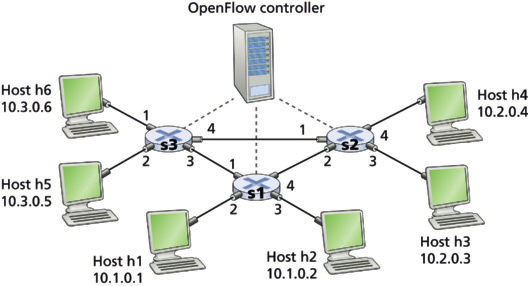

Figure 4.30 OpenFlow match-plus-action network with three packet switches, 6 hosts, and an OpenFlow controller

s2 Flow Table (Example 2) Match Action

Ingress port = 3; IP Dst = 10.1.*.* Forward(2) Ingress port = 4; IP Dst = 10.1.*.* Forward(1) . . . . . .

Flow table entries are also needed at s1 to forward the datagrams received from s2 to either h1 or h2; and flow table entries are needed at s3 to forward datagrams received on interface 4 from s2 over interface 3 toward s1. See if you can figure out these flow table entries at s1 and s3.

A Third Example: Firewalling As a third example, let’s consider a firewall scenario in which s2 wants only to receive (on any of its interfaces) traffic sent from hosts attached to s3.

s2 Flow Table (Example 3) Match Action

IP Src = 10.3.*.* IP Dst = 10.2.0.3 Forward(3) IP Src = 10.3.*.* IP Dst = 10.2.0.4 Forward(4) . . . . . .

If there were no other entries in s2’s flow table, then only traffic from 10.3.*.* would be forwarded to the hosts attached to s2.

Although we’ve only considered a few basic scenarios here, the versatility and advantages of generalized forwarding are hopefully apparent. In homework problems, we’ll explore how flow tables can be used to create many different logical behaviors, including virtual networks—two or more logically separate networks (each with their own independent and distinct forwarding behavior)—that use the same physical set of packet switches and links. In Section 5.5, we’ll return to flow tables when we study the SDN controllers that compute and distribute the flow tables, and the protocol used for communicating between a packet switch and its controller.

The match-plus-action flow tables that we’ve seen in this section are actually a limited form of programmability , specifying how a router should forward

and manipulate (e.g., change a header field) a datagram, based on the match between the datagram’s header values and the matching conditions. One could imagine an even richer form of programmability—a programming language with higher-level constructs such as variables, general purpose arithmetic and Boolean operations, variables, functions, and conditional statements, as well as constructs specifically designed for datagram processing at line rate. P4 (Programming Protocol-independent Packet Processors) [P4 2020] is such a language, and has gained considerable interest and traction since its introduction five years ago [Bosshart 2014].

##### 4.4.4 Middleboxes

Routers are the workhorses of the network layer, and in this chapter, we’ve learned how they accomplish their “bread and butter” job of forwarding IP datagrams toward their destination. But in this chapter, and in earlier chapters, we’ve also encountered other network equipment (“boxes”) within the network that sit on the data path and perform functions other than forwarding.

We encountered Web caches in Section 2.2.5; TCP connection splitters in section 3.7; and network address translation (NAT), firewalls, and intrusion detection systems in Section 4.3.4. We learned in Section 4.4 that generalized forwarding allows a modern router to easily and naturally perform firewalling and load balancing with generalized “match plus action” operations.

In the past 20 years, we’ve seen tremendous growth in such middleboxes ,

which RFC 3234 defines as:

“any intermediary box performing functions apart from normal, standard functions of an IP router on the data path between a source host and destination host” We can broadly identify three types of services performed by middleboxes:

• NAT Translation. As we saw in Section 4.3.4, NAT boxes implement private

network addressing, rewriting datagram header IP addresses and port numbers.

• Security Services. Firewalls block traffic based on header-field values or redi-

rect packets for additional processing, such as deep packet inspection (DPI).

Intrusion Detection Systems (IDS) are able to detect predetermined patterns and filter packets accordingly. Application-level e-mail filters block e-mails considered to be junk, phishing or otherwise posing a security threat.

• Performance Enhancement. These middleboxes perform services such as

compression, content caching, and load balancing of service requests (e.g., an HTTP request, or a search engine query) to one of a set of servers that can provide the desired service.

Many other middleboxes [RFC 3234] provide capabilities belonging to these three types of services, in both wired and wireless cellular [Wang 2011] networks.

With the proliferation of middleboxes comes the attendant need to operate, manage, and upgrade this equipment. Separate specialized hardware boxes, separate software stacks, and separate management/operation skills translate to significant operational and capital costs. It is perhaps not surprising then that researchers are exploring the use of commodity hardware (networking, computing, and storage) with specialized software built on top of a common software stack—exactly the approach taken in SDN a decade earlier—to implement these services.

This approach has become known as network function virtualization (NFV) [Mijumbi 2016]. An alternate approach that has also been explored is to outsource middlebox functionality to the cloud [Sherry 2012].

For many years, the Internet architecture had a clear separation between the network layer and the transport/application layers. In these “good old days,” the network layer consisted of routers, operating within the network core, to forward datagrams toward their destinations using fields only in the IP datagram header. The transport and application layers were implemented in hosts operating at the network edge. Hosts exchanged packets among themselves in transport-layer segments and application-layer messages. Today’s middleboxes clearly violate this separation: a NAT box, sitting between a router and host, rewrites network-layer IP addresses and transport-layer port numbers; an in-network firewall blocks suspect datagrams using application-layer (e.g., HTTP), transport-layer, and network-layer header fields; e-mail security gateways are injected between the e-mail sender (whether malicious or not) and the intended e-mail receiver, filtering application-layer e-mail messages based on whitelisted/blacklisted IP addresses as well as e-mail message content. While there are those who have considered such middleboxes as a bit of an architectural abomination [Garfinkel 2003], others have adopted the philosophy that such middleboxes “exist for important and permanent reasons”—that they fill an important need—and that we’ll have more, not fewer, middleboxes in the future [Walfish 2004].

#### 4.5 Architectural Principles of the Internet

Given the phenomenal success of the Internet, one might naturally wonder about the architectural principles that have guided the development of what is arguably the largest and most complex engineered system ever built by humankind. RFC 1958, entitled “Architectural Principles of the Internet,” suggests that these principles, if indeed they exist, are truly minimal:

“Many members of the Internet community would argue that there is no architecture, but only a tradition, which was not written down for the first 25 years (or at least not by the IAB). However, in very general terms, the community believes that the goal is connectivity, the tool is the Internet Figure 4.31 The Protocol, and the intelligence is end to end rather than hidden in the netnarrow-waisted Internet work.” [RFC 1958] hourglass

So there we have it! The goal was to provide connectivity, there would be just one network-layer protocol (the celebrated IP protocol we have studied in this chapter), and “intelligence” (one might say the “complexity”) would be placed at the network edge, rather than in the network core. Let’s look these

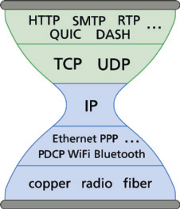

last two considerations in a bit more detail. The IP Hourglass By now, we’re well acquainted with the five-layer Internet protocol stack that we first encountered in Figure 1.24. Another visualization of this stack, shown in Figure 4.31 and sometimes known as the “IP hourglass,” illustrates the “narrow waist” of the layered Internet architecture. While the Internet has many protocols in the physical, link, transport, and application layers, there is only one network layer protocol—the IP protocol. This is the one protocol that must be implemented by each and every of the billions of Internet-connected devices. This narrow waist has played a critical role in the phenomenal growth of the Internet. The relative simplicity of the IP protocol, and the fact that it is the only universal requirement for Internet connectivity has allowed a rich variety of networks—with very different underlying link-layer technologies, from Ethernet to WiFi to cellular to optical networks to become part of the Internet. [Clark 1997] notes that role of the narrow waist, which he refers to as a “spanning layer,” is to “ . . . hide the detailed differences among these various [underlying] technologies and present a uniform service interface to the appli- cations above.” For the IP layer in particular: “How does the IP spanning layer achieve its purpose? It defines a basic set of services, which were carefully designed so that they could be constructed from a wide range of underlying network technologies. Software, as a part of the Internet [i.e., network] layer, translates what each of these lower-layer technologies offers into the common service of the Internet layer.” For a discussion the narrow waist, including examples beyond the Internet, see [Beck 2019; Akhshabi 2011]. We note here that as the Internet architecture enters mid-life (certainly, the Internet’s age of 40 to 50 years quali- fies it for middle age!), one might observe that its “narrow waist” may indeed be widening a bit (as often happens in middle age!) via the rise of middleboxes. For a recent interesting recent perspective (and retrospective) on the Internet hourglass design, we recommending reading [Davie 2024]. The End-to-End Argument The third principle in RFC 1958—that “intelligence is end to end rather than hid- den in the network”—speaks to the placement of functionality within the network. Here, we’ve seen that until the recent rise of middleboxes, most Internet functionality was indeed placed at the network’s edge. It’s worth noting that, in direct contrast with the 20th century telephone network—which had “dumb” (non-programmable) endpoints and smart switches—the Internet has always had smart endpoints (programmable computers), enabling complex functionality to be placed at those endpoints. But a more principled argument for actually placing functionality at the endpoints was made in an extremely influential paper [Saltzer 1984] that articulated the “end-to-end argument.” It stated:

“ . . . there is a list of functions each of which might be implemented in any of several ways: by the communication subsystem, by its client, as a joint venture, or perhaps redundantly, each doing its own version. In reasoning about this choice, the requirements of the application provide the basis for a class of arguments, which go as follows:

The function in question can completely and correctly be implemented only with the knowledge and help of the application standing at the end points of the communication system. Therefore, providing that questioned function as a feature of the communication system itself is not possible. (Sometimes an incomplete version of the function provided by the communication system may be useful as a performance enhancement.)

We call this line of reasoning against low-level function implementation the “end-to-end argument.” An example illustrating the end-to-end argument is that of reliable data transfer. Since packets can be lost within the network (e.g., even without buffer overflows, a router holding a queued packet could crash, or a portion of the network in which a packet is queued becomes detached due to link failures), the endpoints (in this case via the TCP protocol) must perform error control.

As we will see in Chapter 6, some link-layer protocols do indeed perform local error control, but this local error control alone is “incomplete” and not sufficient to provide end-to-end reliable data transfer. And so reliable data transfer must be implemented end to end.

RFC 1958 deliberately includes only two references, both of which are “fundamental papers on the Internet architecture.” One of these is the end-toend paper itself [Saltzer 1984]; the second paper [Clark 1988] discusses the design philosophy of the DARPA Internet Protocols. Both are interesting “must reads” for anyone interested in Internet architecture. Follow-ons to [Clark 1988] are [Blumenthal 2001; Clark 2005] which reconsider Internet architecture in light of the much more complex environment in which today’s Internet must now operate. Two thoughtful and thought-provoking books on Internet architecture are [Clark 2018; Zave 2024].

#### 4.6 Summary

In this chapter, we’ve covered the data plane functions of the network layer— the  per-router functions that determine how packets arriving on one of a router’s input links are forwarded to one of that router’s output links. We began by taking a detailed look at the internal operations of a router, studying input and output port functionality and destination-based forwarding, a router’s internal switching mechanism, packet queue management and more.

We covered both traditional IP forwarding (where forwarding is based on a datagram’s destination address) and generalized forwarding (where forwarding and other functions may be performed using values in several different fields in the datagram’s header) and seen the versatility of the latter approach.

We also studied the IPv4 and IPv6 protocols in detail, and Internet addressing, which we found to be much deeper, subtler, and more interesting than we might have expected. We completed our study of the network-layer data plane with a study of middleboxes, and a broad discussion of Internet architecture.

With our newfound understanding of the network-layer’s data plane, we’re now ready to dive into the network layer’s control plane in Chapter 5!

Homework Problems and Questions Chapter 4 Review Questions Section 4.2 R6.  In Section 4.2, we saw that a router typically Section 4.1

consists of input ports, output ports, a switch- R1.  Let’s review some of the terminology used in ing fabric and a routing processor. Which of this textbook. Recall that the name of a transthese are implemented in hardware and port-layer packet is segment and that the name which are implemented in software? Why? of a link-layer packet is frame. What is the Returning to the notion of the network layer’s name of a network-layer packet? Recall that data plane and control plane, which are both routers and link-layer switches are called implemented in hardware and which are packet switches. What is the fundamental difimplemented in software? Why? ference between a router and link-layer R7.  Discuss why each input port in a high-speed switch? router stores a shadow copy of the forwarding R2.  We noted that network layer functionality can table. be broadly divided into data plane functional- R8.  What is meant by destination-based forwardity and control plane functionality. What are ing? How does this differ from generalized the main functions of the data plane? Of the forwarding (assuming you’ve read Section 4.4, control plane? which of the two approaches are adopted by R3.  We made a distinction between the forward- Software-Defined Networking)? ing function and the routing function per- R9.  Suppose that an arriving packet matches two formed in the network layer. What are the key or more entries in a router’s forwarding table. differences between routing and forwarding? With traditional destination-based forward- R4.  What is the role of the forwarding table within ing, what rule does a router apply to detera router? mine which of these rules should be applied

R5.  We said that a network layer’s service model to determine the output port to which the

“defines the characteristics of end-to-end transarriving packet should be switched?

port of packets between sending and receiving R10.  Three types of switching fabrics are discussed hosts.” What is the service model of the Interin Section 4.2. List and briefly describe each net’s network layer? What guarantees are type. Which, if any, can send multiple packets made by the Internet’s service model regarding across the fabric in parallel? the host-to-host delivery of datagrams?

R11.  Describe how packet loss can occur at input smaller datagrams reassembled into a single

ports. Describe how packet loss at input ports larger datagram?

can be eliminated (without using infinite R21.  Do routers have IP addresses? If so, how many? buffers). R22.  What is the 32-bit binary equivalent of the IP R12.  Describe how packet loss can occur at output address 223.1.3.27? ports. Can this loss be prevented by increas- R23.  Visit a host that uses DHCP to obtain its IP ing the switch fabric speed? address, network mask, default router, and IP R13.  What is HOL blocking? Does it occur in input address of its local DNS server. List these ports or output ports? values.

R14.  In Section 4.2, we studied FIFO, Priority, R24.  Suppose there are three routers between a Round Robin (RR), and Weighted Fair Queuesource host and a destination host. Ignoring ing (WFQ) packet scheduling disciplines? fragmentation, an IP datagram sent from the Which of these queueing disciplines ensure source host to the destination host will travel that all packets depart in the order in which over how many interfaces? How many forthey arrived? warding tables will be indexed to move the

R15.  Give an example showing why a network datagram from the source to the destination?

operator might want one class of packets to be R25.  Suppose an application generates chunks of given priority over another class of packets. 40 bytes of data every 20 msec, and each

R16.  What is an essential different between RR and chunk gets encapsulated in a TCP segment

WFQ packet scheduling? Is there a case (Hint: and then an IP datagram. What percentage of

Consider the WFQ weights) where RR and each datagram will be overhead, and what

WFQ will behave exactly the same? percentage will be application data?

R26.  Suppose you purchase a wireless router and Section 4.3 connect it to your cable modem. Also suppose

R17.  Suppose Host A sends Host B a TCP segment that your ISP dynamically assigns your con-

encapsulated in an IP datagram. When Host B nected device (that is, your wireless router)

receives the datagram, how does the network one IP address. Also suppose that you have

layer in Host B know it should pass the segfive PCs at home that use 802.11 to wirelessly

ment (that is, the payload of the datagram) to connect to your wireless router. How are IP

TCP rather than to UDP or to some other addresses assigned to the five PCs? Does the

upper-layer protocol? wireless router use NAT? Why or why not?

R18.  What field in the IP header can be used to R27.  What is meant by the term “route aggrega-

ensure that a packet is forwarded through no tion”? Why is it useful for a router to perform

more than N routers? route aggregation?

R19.  Recall that we saw the Internet checksum R28.  What is meant by a “plug-and-play” or “zero-

being used in both transport-layer segment conf” protocol?

(in UDP and TCP headers, Figures 3.7 and R29.  What is a private network address? Should a

3.29 respectively) and in network-layer data-

datagram with a private network address grams (IP header, Figure 4.17). Now consider ever be present in the larger public Internet? a transport layer segment encapsulated in an Explain. IP datagram. Are the checksums in the seg- R30.  Compare and contrast the IPv4 and the IPv6 ment header and datagram header computed header fields. Do they have any fields in over any common bytes in the IP datagram? common? Explain your answer.

R31.  It has been said that when IPv6 tunnels R20.  When a large datagram is fragmented into through  IPv4 routers, IPv6 treats the IPv4 multiple smaller datagrams, where are these

R34.  What is meant by the “match plus action” opertunnels as link-layer protocols. Do you agree with this statement? Why or why not? ation of a router or switch? In the case of destination-based forwarding packet switch, what is Section 4.4 matched and what is the action taken? In the case of an SDN, name three fields that can be R32.  How does generalized forwarding differ from

matched, and three actions that can be taken. destination-based forwarding?

R35.  Name three header fields in an IP datagram R33.  What is the difference between a forwarding

that can be “matched” in OpenFlow 1.0 gentable that we encountered in destination-

eralized forwarding. What are three IP databased forwarding in Section 4.1 and Open-

gram header fields that cannot be “matched” Flow’s flow table that we encountered in

in OpenFlow? Section 4.4?

Problems P1. Consider the network below.

a.  Show the forwarding table in router A, such that all traffic destined to host H3 is forwarded through interface 3.

b.  Can you write down a forwarding table in router A, such that all traffic from H1 destined to host H3 is forwarded through interface 3, while all traffic from H2 destined to host H3 is forwarded through interface 4?

(Hint: This is a trick question.) P2. Suppose two packets arrive to two different input ports of a router at exactly the same time. Also suppose there are no other packets anywhere

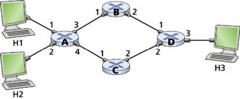

in the router. a. Suppose the two packets are to be forwarded to two different output ports. Is it possible to forward the two packets through the switch fabric at the same time when the fabric uses a shared bus? b. Suppose the two packets are to be forwarded to two different output ports. Is it possible to forward the two packets through the switch fabric at the same time when the fabric uses switching via memory? c. Suppose the two packets are to be forwarded to the same output port. Is it possible to forward the two packets through the switch fabric at the same time when the fabric uses a crossbar? P3. In Section 4.2.4, it was said that if R switch _ is N times faster than R line _ , then only negligible queuing will occur at the input ports, even if all the packets are to be forwarded to the same output port. Now suppose that

= R switch _ R line _ , but all packets are to be forwarded to different out-

put ports. Let D be the time to transmit a packet. As a function of D,

what is the maximum input queuing delay for a packet for the (a) memory, (b) bus, and (c) crossbar switching fabrics?

P4. Consider the switch shown below. Suppose that all datagrams have the same fixed length, that the switch operates in a slotted, synchronous manner, and that in one time slot a datagram can be transferred from an input port to an output port. The switch fabric is a crossbar so that at most one datagram can be transferred to a given output port in a time slot, but different output ports can receive datagrams from different input ports in a single time slot. What is the minimal number of time slots needed to transfer the packets shown from input ports to their output ports, assuming any input queue scheduling order you want (i.e., it need not have HOL blocking)? What is the largest number of slots needed, assuming the worst-case scheduling order you can devise, assuming that a non-empty input queue is never idle?

P5. Suppose that the WFQ scheduling policy is applied to a buffer that supports three classes, and suppose the weights are 0.5, 0.25, and 0.25 for the three classes.

a.  Suppose that each class has a large number of packets in the buffer. In what sequence might the three classes be served in order to achieve the WFQ weights? (For round robin scheduling, a natural sequence is 123123123 . . . . )

b.  Suppose that classes 1 and 2 have a large number of packets in the buffer, and there are no class 3 packets in the buffer. In what sequence might the three classes be served in to achieve the WFQ weights?

P6. Consider the figure below. Answer the following questions:

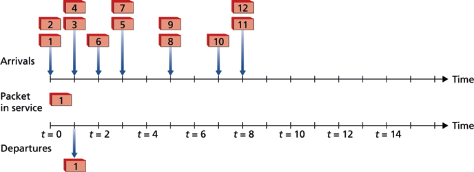

a.  Assuming FIFO service, indicate the time at which packets 2 through 12 each leave the queue. For each packet, what is the delay between its arrival and the beginning of the slot in which it is transmitted? What is the average of this delay over all 12 packets?

b.  Now assume a priority service, and assume that odd-numbered packets are high priority, and even-numbered packets are low priority.

Indicate the time at which packets 2 through 12 each leave the queue.

For each packet, what is the delay between its arrival and the beginning of the slot in which it is transmitted? What is the average of this delay over all 12 packets?

c.  Now assume round robin service. Assume that packets 1, 2, 3, 6, 11, and 12 are from class 1, and packets 4, 5, 7, 8, 9, and 10 are from class

2. Indicate the time at which packets 2 through 12 each leave the queue. For each packet, what is the delay between its arrival and its departure? What is the average delay over all 12 packets?

d. Now assume weighted fair queueing (WFQ) service. Assume that odd-numbered packets are from class 1, and even-numbered packets are from class 2.Class 1 has a WFQ weight of 2, while class 2 has a WFQ weight of 1.

Note that it may not be possible to achieve an idealized WFQ schedule as described in the text, so indicate why you have chosen the particular packet to go into service at each time slot. For each packet what is the delay between its arrival and its departure?

What is the average delay over all 12 packets?

e.  What do you notice about the average delay in all four cases (FIFO, RR, priority, and WFQ)?

P7. Consider again the figure for P6.

a.  Assume a priority service, with packets 1, 4, 5, 6, and 11 being highpriority packets. The remaining packets are low priority. Indicate the slots in which packets 2 through 12 each leave the queue.

b.  Now suppose that round robin service is used, with packets 1, 4, 5, 6, and 11 belonging to one class of traffic, and the remaining packets belonging to the second class of traffic. Indicate the slots in which packets 2 through 12 each leave the queue.

c.  Now suppose that WFQ service is used, with packets 1, 4, 5, 6, and 11 belonging to one class of traffic, and the remaining packets belonging to the second class of traffic. Class 1 has a WFQ weight of 1, while class 2 has a WFQ weight of 2 (note that these weights are different than in the previous question). Indicate the slots in which packets 2 through 12 each leave the queue. See also the caveat in the question above regarding WFQ service.

P8. Consider a datagram network using 32-bit host addresses. Suppose a router has four links, numbered 0 through 3, and packets are to be forwarded to the link interfaces as follows:

Destination Address Range Link Interface

11100000 00000000 00000000 00000000

0 through

11100000 00111111 11111111 11111111

11100000 01000000 00000000 00000000

1 through

11100000 01000000 11111111 11111111

11100000 01000001 00000000 00000000

2 through

11100001 01111111 11111111 11111111

3 Otherwise

a.  Provide a forwarding table that has five entries, uses longest prefix matching, and forwards packets to the correct link interfaces.

b.  Describe how your forwarding table determines the appropriate link interface for datagrams with destination addresses:

11001000 10010001 01010001 01010101

11100001 01000000 11000011 00111100

11100001 10000000 00010001 01110111 P9. Consider a datagram network using 8-bit host addresses. Suppose a router uses longest prefix matching and has the following forwarding table:

Prefix Match Interface

00 0

010 1

011 1

10 2

11 3

For each of the four interfaces, give the associated range of destination host addresses and the number of addresses in the range.

P10.  Consider a datagram network using 8-bit host addresses. Suppose a router uses longest prefix matching and has the following forwarding table:

Prefix Match Interface

1 0

10 1

111 2

otherwise 3

For each of the four interfaces, give the associated range of destination host addresses and the number of addresses in the range.

P11.  Consider a router that interconnects three subnets: Subnet 1, Subnet 2, and Subnet 3. Suppose all of the interfaces in each of these three subnets are required to have the prefix 223.1.17 24. Also suppose that Subnet 1 is required to support at least 60 interfaces, Subnet 2 is to support at least 90 interfaces, and Subnet 3 is to support at least 12 interfaces. Provide three network addresses (of the form a.b.c.d x that satisfy these )

constraints.

P12.  In Section 4.2.2, an example forwarding table (using longest prefix matching) is given. Rewrite this forwarding table using the a.b.c.d x notation instead of the binary string notation.

P13.  In Problem P8, you are asked to provide a forwarding table (using longest prefix matching). Rewrite this forwarding table using the a.b.c.d x notation instead of the binary string notation.

P14.  Consider a subnet with prefix 128.119.40.128/26. Give an example of one IP address (of form xxx.xxx.xxx.xxx that can be assigned to this )

network. Suppose an ISP owns the block of addresses of the form
128.119.40.64/26. Suppose it wants to create four subnets from this

block, with each block having the same number of IP addresses. What are the prefixes (of form a.b.c.d x ) for the four subnets?

P15.  Consider the topology shown in Figure 4.20. Denote the three subnets with hosts (starting clockwise at 12:00 as Networks A, B, and C. Denote )

the subnets without hosts as Networks D, E, and F.

a.  Assign network addresses to each of these six subnets, with the following constraints: All addresses must be allocated from 214.97.254 23;

Subnet A should have enough addresses to support 250 interfaces;

Subnet B should have enough addresses to support 120 interfaces;

and  Subnet C should have enough addresses to support 120 interfaces. Of course, subnets D, E and F should each be able to support two interfaces. For each subnet, the assignment should take the form a.b.c.d x or a.b.c.d x − e.f.g.h y.

b.  Using your answer to part (a), provide the forwarding tables (using longest prefix matching) for each of the three routers.

P16.  Use the whois service at the American Registry for Internet Numbers (http://www.arin.net/whois) to determine the IP address blocks for three universities. Can the whois services be used to determine with certainty the geographical location of a specific IP address? Use www.maxmind.com to determine the locations of the Web servers at each of these universities.

P17.  Suppose datagrams are limited to 1,500 bytes  (including header) between source Host A and destination Host B. Assuming a 20-byte IP header, how many datagrams would be required to send an MP3 consisting of 5 million bytes? Explain how you computed your answer.

P18.  Consider the network setup in Figure 4.25. Suppose that the ISP instead assigns the router the address 24.34.112.235 and that the network address of the home network is 192.168.1 24.

a.  Assign addresses to all interfaces in the home network.

b.  Suppose each host has two ongoing TCP connections, all to port 80 at host 128.119.40.86. Provide the six corresponding entries in the NAT translation table.

P19.  Suppose you are interested in detecting the number of hosts behind a NAT.

You observe that the IP layer stamps an identification number sequentially on each IP packet. The identification number of the first IP packet generated by a host is a random number, and the identification numbers of the subsequent IP packets are sequentially assigned. Assume all IP packets generated by hosts behind the NAT are sent to the outside world.

a.  Based on this observation, and assuming you can sniff all packets sent by the NAT to the outside, can you outline a simple technique that detects the number of unique hosts behind a NAT? Justify your answer.

b.  If the identification numbers are not sequentially assigned but randomly assigned, would your technique work? Justify your answer.

P20.  Consider the SDN OpenFlow network shown in Figure 4.30. Suppose that the desired forwarding behavior for datagrams arriving at s2 is as follows:

•  any datagrams arriving on input port 1 from hosts h5 or h6 that are destined to hosts h1 or h2 should be forwarded over output port 2;

•  any datagrams arriving on input port 2 from hosts h1 or h2 that are destined to hosts h5 or h6 should be forwarded over output port 1;

•  any arriving datagrams on input ports 1 or 2 and destined to hosts h3 or h4 should be delivered to the host specified;

•  hosts h3 and h4 should be able to send datagrams to each other.

Specify the flow table entries in s2 that implement this forwarding behavior.

P21.  Consider again the SDN OpenFlow network shown in Figure 4.30. Suppose that the desired forwarding behavior for datagrams arriving from hosts h3 or h4 at s2 is as follows:

•  any datagrams arriving from host h3 and destined for h1, h2, h5 or h6 should be forwarded in a clockwise direction in the network;

•  any datagrams arriving from host h4 and destined for h1, h2, h5 or h6 should be forwarded in a counter-clockwise direction in the network.

Specify the flow table entries in s2 that implement this forwarding behavior.

P22.  Consider again the scenario from P21 above. Give the flow tables entries at packet switches s1 and s3, such that any arriving datagrams with a source address of h3 or h4 are routed to the destination hosts specified in the destination address field in the IP datagram. (Hint: Your forwarding table rules should include the cases that an arriving datagram is destined for a directly attached host or should be forwarded to a neighboring router for eventual host delivery there.) P23.  Consider again the SDN OpenFlow network shown in Figure 4.30. Suppose we want switch s2 to function as a firewall. Specify the flow table in s2 that implements the following firewall behaviors (specify a different flow table for each of the four firewalling behaviors below) for delivery of datagrams destined to h3 and h4. You do not need to specify the forwarding behavior in s2 that forwards traffic to other routers.

•  Only traffic arriving from hosts h1 and h6 should be delivered to hosts h3 or h4 (i.e., that arriving traffic from hosts h2 and h5 is blocked).

•  Only TCP traffic is allowed to be delivered to hosts h3 or h4 (i.e., that UDP traffic is blocked).

•  Only traffic destined to h3 is to be delivered (i.e., all traffic to h4 is blocked).

•  Only UDP traffic from h1 and destined to h3 is to be delivered. All other traffic is blocked.

P24.  Consider the Internet protocol stack in Figures 1.24 and 4.31. Would you consider the ICMP protocol to be a network-layer protocol or a transport-layer protocol? Justify your answer.

Wireshark Lab: IP In the Web site for this textbook, www.pearsonhighassignment that examines the operation of the IP

ered.com/cs-resources, you’ll find a Wireshark lab protocol, and the IP datagram format in particular.

AN INTERVIEW WITH...


Vinton G. Cerf Vinton G. Cerf has served as Vice President and Chief Internet Evangelist for Google

since 2005. He served for over 15 years at MCI in various positions, ending up his tenure there as Senior Vice President for Technology Strategy. He is widely known as the co-designer of the TCP/IP protocols and the architecture of the Internet. During his time from 1976 to 1982 at the US Department of Defense Advanced Research Projects Agency (DARPA), he played a key role leading the development of Internet Courtesy of Vinton G. Cerf and Internet-related packet communication and security techniques. He received the US Presidential Medal of Freedom in 2005 and the US National Medal of Technology in 1997. He holds a BS in Mathematics from Stanford University and an MS and PhD in computer science from UCLA.

What brought you to specialize in networking?

I was working as a programmer at UCLA in the late 1960s. My job was supported by the US Defense Advanced Research Projects Agency (called ARPA then and DARPA now). I was working in the laboratory of Professor Leonard Kleinrock in the Network Measurement Center of the newly created Arpanet. The first node of the Arpanet was installed at UCLA on September 1, 1969. I was responsible for programming a computer that was used to capture performance information about the Arpanet and to report this information back for comparison with mathematical models and predictions of the performance of the network.

Several of the other graduate students and I were made responsible for working on the so-called host-level protocols of the Arpanet—the procedures and formats that would allow many different kinds of computers on the network to interact with each other. It was a fascinating exploration into a new world (for me) of distributed computing and communication.

Did you imagine that IP would become as pervasive as it is today when you first designed the protocol?

When Bob Kahn and I first worked on this in 1973, I think we were mostly very focused on the central question: How can we make heterogeneous packet networks interoperate with one another, assuming we cannot actually change the networks themselves? We hoped that we could find a way to permit an arbitrary collection of packet-switched networks to be interconnected in a transparent fashion, so that host computers could communicate end-to-end without having to do any translations in between. I think we knew that we were dealing with powerful and expandable technology, but I doubt we had a clear image of what the world would be like with billions of computers all interlinked on the Internet.

What do you now envision for the future of networking and the Internet? What major challenges/obstacles do you think lie ahead in their development?

I believe the Internet itself and networks in general will continue to proliferate.

There are already billions of Internet-enabled devices on the Internet, including appliances like cell phones, refrigerators, personal digital assistants, home servers, televisions, as well as the usual array of laptops, servers, and so on. Big challenges include support for mobility, battery life, capacity of the access links to the network, and ability to scale the optical core of the network in an unlimited fashion. The interplanetary extension of the Internet is a project that is well underway at NASA and other space agencies. We still need to complete adding IPv6 [128-bit addressing] to the original IPv4 [32-bit  addresses] packet format.

The list is long!

Who has inspired you professionally?

My colleague Bob Kahn; my thesis advisor, Gerald Estrin; my best friend, Steve Crocker (we met in high school and he introduced me to computers in 1960!); and the thousands of engineers who continue to evolve the Internet today.

Do you have any advice for students entering the networking/Internet field?

Think outside the limitations of existing systems—imagine what might be possible;

but then do the hard work of figuring out how to get there from the current state of affairs. Dare to dream. The “Internet of Things” is a next big phase of Internet expansion along with massive investments in and application of Artificial Intelligence and Machine Learning. Safety, security, privacy, reliability, and autonomy all need attention. Coping with misinformation, disinformation and accountability are high on the agenda of other challenges that need to be addressed. The interplanetary extension of the terrestrial Internet started as a speculative design but is becoming a reality. It may take decades to implement this, mission by mission, but to paraphrase: “A man’s reach should exceed his grasp, or what are the heavens for?”

## Chapter 5: The Network Layer: Control Plane

In this chapter, we’ll complete our journey through the network layer by covering the control-plane of the network layer—the network-wide logic that controls not only how a datagram is routed along an end-to-end path from the source host to the destination host, but also how network-layer components and services are configured and managed. In Section 5.2, we’ll cover traditional routing algorithms for computing least cost paths in a graph; these algorithms are the basis for two widely deployed Internet routing protocols: OSPF and BGP, that we’ll cover in Sections 5.3 and 5.4, respectively. As we’ll see, OSPF is a routing protocol that operates within a single ISP’s network. BGP is a routing protocol that serves to interconnect all of the networks in the Internet; BGP is thus often referred to as the “glue” that holds the Internet together. Traditionally, control-plane routing protocols have been implemented together with data-plane forwarding functions, monolithically, within a router. As we learned in the introduction to Chapter 4, software-defined networking (SDN)


makes a clear separation between the data and control planes, implementing control-plane functions in a separate “controller” service that is distinct, and remote, from the forwarding components of the routers it controls. We’ll cover SDN controllers in Section 5.5.

In Sections 5.6 and 5.7, we’ll cover some of the nuts and bolts of managing an IP network: ICMP (the Internet Control Message Protocol) and SNMP (the Simple Network Management Protocol).

#### 5.1 Introduction

Let’s quickly set the context for our study of the network control plane by recalling Figures 4.2 and 4.3. There, we saw that the forwarding table (in the case of destination-based forwarding) and the flow table (in the case of generalized forwarding) were the principal elements that linked the network layer’s data and control planes. We learned that these tables specify the local dataplane forwarding behavior of a router. We saw that in the case of generalized forwarding, the actions taken could include not only forwarding a packet to a router’s output port, but also dropping a packet, replicating a packet, and/or rewriting layer 2, 3 or 4 packet-header fields.

In this chapter, we’ll study how those forwarding and flow tables are computed, maintained and installed. In our introduction to the network layer in Section 4.1, we learned that there are two possible approaches for doing so.

• Per-router control. Figure 5.1 illustrates the case where a routing algorithm runs in each and every router; both a forwarding and a routing function are contained within each router. Each router has a routing component that communicates with the routing components in other routers to compute the values for its forwarding table. This per-router control approach has been used in the Internet for decades. The OSPF and BGP protocols

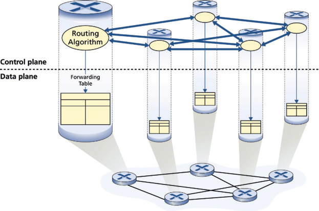

Figure 5.1 Per-router control: Individual routing algorithm components interact in the control plane that we’ll study in Sections 5.3 and 5.4 are based on this per-router approach to control.

• Logically centralized control. Figure 5.2 illustrates the case in which a logically centralized controller computes and distributes the forwarding tables to be used by each and every router. As we saw in Sections 4.4 and 4.5, the generalized match-plus-action abstraction allows the router to perform traditional IP forwarding as well as a rich set of other functions (load sharing, firewalling, and NAT) that had been previously implemented in separate middleboxes.

The controller interacts with a control agent (CA) in each of the routers via a well-defined protocol to configure and manage that router’s flow table. Typically, the CA has minimum functionality; its job is to communicate with the controller, and to do as the controller commands. Unlike the routing algorithms in Figure 5.1, the CAs do not directly interact with each other nor do they actively take part in computing the forwarding table.

This is a key distinction between per-router control and logically centralized control.

By “logically centralized” control [Levin 2012] we mean that the routing control service is accessed as if it were a single central service point, even though the service is likely to be implemented via multiple servers for faulttolerance, and performance scalability reasons. As we will see in Section 5.5, SDN adopts this notion of a logically centralized controller—an approach that is finding increased use in production deployments. [Cisco Trends 2020] noted that SDN has seen wide adoption across data centers (64%), WANs (58%), and access networks (40%) in 2020. In Section 5.5, we’ll study Google’s ORION

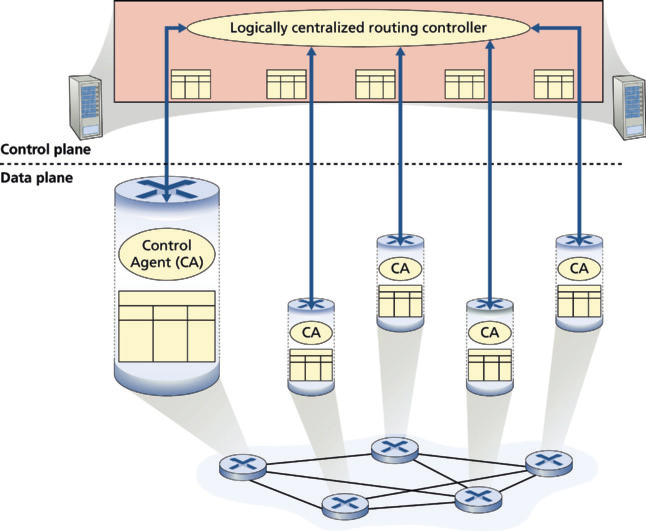

Figure 5.2 Logically centralized control: A distinct, typically remote, controller interacts with local control agents (CAs)

SDN [Ferguson 2021], which Google uses to control the networks within its data centers as well as the global WAN that interconnects these data centers.

#### 5.2 Routing Algorithms

In this section, we’ll study routing algorithms, whose goal is to determine good paths (equivalently, routes), from senders to receivers, through the network of routers. Typically, a “good” path is one that has the least cost. We’ll see that in practice, however, real-world concerns such as policy issues (for example, a rule such as “router x, belonging to organization Y, should not forward

any packets originating from the network owned by organization Z ”) also

come into play. We note that whether the network control plane adopts a perrouter control approach or a logically centralized approach, there must always be a well-defined sequence of routers that a packet will cross in traveling from sending to receiving host. Thus, the routing algorithms that compute these paths are of fundamental importance, and another candidate for our top-10 list of fundamentally important networking concepts.

A graph is used to formulate routing problems. Recall that a graph = G N E , is a set N of nodes and a collection E of edges, where each edge is a  pair of nodes from N. In the context of network-layer routing, the nodes in the

graph represent routers—the points at which packet-forwarding decisions are made—and the edges connecting these nodes represent the physical links between these routers. Such a graph abstraction of a computer network is shown in Figure 5.3. When we study the BGP inter-domain routing protocol, we’ll see that nodes represent networks, and the edge connecting two such nodes represents direction connectivity (know as peering) between the two networks. To view some graphs representing real network maps, see CAIDA 2025;

NetworkingChannel Diot 2021]; for a discussion of how well different graphbased models model the Internet, see [Zegura 1997, Faloutsos 1999, Li 2004].

As shown in Figure 5.3, an edge also has a value representing its cost. Typically, an edge’s cost may reflect the physical length of the corresponding link (for example, a transoceanic link might have a higher cost than a short-haul terrestrial link), the link speed, or the monetary cost associated with a link. For our purposes, we’ll simply take the edge costs as a given and won’t worry about how they are determined. For any edge  x y ( , ) in E, we denote c x y ( , ) as

the cost of the edge between nodes x and y. If the pair  x y ( , ) does not belong

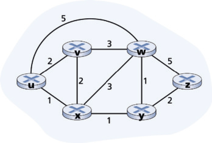

Figure 5.3 Abstract graph model of a computer network

= ∞ to  E, we set c x y ( , ) . Also, we’ll only consider undirected graphs

(i.e., graphs whose edges do not have a direction) in our discussion here, so

= that edge ( x y , ) is the same as edge  y x ( , ) and that c x y ( , ) c y x ( , ) ; how-

ever, the algorithms we’ll study can be easily extended to the case of directed links with a different cost in each direction. Also, a node y is said to be a neigh-

bor of node x if  x y ( , ) belongs to E.

Given that costs are assigned to the various edges in the graph abstraction, a natural goal of a routing algorithm is to identify the least costly paths between sources and destinations. To make this problem more precise, recall

 = that a path in a graph G N E , is a sequence of nodes  x x , , . . . , x  1 2 p  such that each of the pairs x x , ,  x x ( , ) , . . . , x , x are edges in E.  1 2 2 3 p − 1 p  The cost of a path x x , , . . . , x is simply the sum of all the edge costs 1 2 p  + + ⋅ ⋅ ⋅ + along the path, that is, c x x , c x x ( , ) c x , x . Given any  1 2 2 3 p − 1 p two nodes x and y, there are typically many paths between the two nodes, with each path having a cost. One or more of these paths is a least-cost path.

The least-cost problem is therefore clear: Find a path between the source and destination that has least cost. In Figure 5.3, for example, the least-cost path between source node u and destination node w is  u x y w ( ,  ,  , ) with a path cost

of 3. Note that if all edges in the graph have the same cost, the least-cost path is also the shortest path (that is, the path with the smallest number of links between the source and the destination).

As a simple exercise, try finding the least-cost path from node u to z in

Figure 5.3 and reflect for a moment on how you calculated that path. If you are like most people, you found the path from u to z by examining Figure 5.3, trac-

ing a few routes from u to z, and somehow convincing yourself that the path

you had chosen had the least cost among all possible paths. (Did you check all of the 17 possible paths between u and z? Probably not!) Such a calculation is an example of a centralized routing algorithm —the routing algorithm was run in one location, your brain, with complete information about the network.

Broadly, one way in which we can classify routing algorithms is according to whether they are centralized or decentralized.

• A centralized routing algorithm computes the least-cost path between a source and destination using complete, global knowledge about the network. That is, the algorithm takes the connectivity between all nodes and all link costs as inputs. This then requires that the algorithm somehow obtain this information before actually performing the calculation. The calculation itself can be run at one site (e.g., a logically centralized controller as in Figure 5.2) or could be replicated in the routing component of each and every router (e.g., as in Figure 5.1). The key distinguishing feature here, however, is that the algorithm has complete information about connectivity and link costs. Algorithms with global state information are often referred to as link-state (LS) algorithms, since the algorithm must be aware of the cost of each link in the network. We’ll study LS algorithms in Section 5.2.1.

• In a decentralized routing algorithm, the calculation of the least-cost path is carried out in an iterative, distributed manner by the routers. No node has complete information about the costs of all network links. Instead, each node begins with only the knowledge of the costs of its own directly attached links. Then, through an iterative process of calculation and exchange of information with its neighboring nodes, a node gradually calculates the least-cost path to a destination or set of destinations. The decentralized routing algorithm we’ll study below in Section 5.2.2 is called a distance-vector (DV) algorithm, because each node maintains a vector of estimates of the costs (distances) to all other nodes in the network. Such decentralized algorithms, with interactive message exchange between neighboring routers is perhaps more naturally suited to control planes where the routers interact directly with each other, as in Figure 5.1.

A second broad way to classify routing algorithms is according to whether they are static or dynamic. In static routing algorithms, routes change very slowly over time, often as a result of human intervention (for example, a human manually editing a link costs). Dynamic routing algorithms change the routing paths as the network traffic loads or topology change. A dynamic algorithm can be run either periodically or in direct response to topology or link cost changes. While dynamic algorithms are more responsive to network changes, they are also more susceptible to problems such as routing loops and route oscillation.

A third way to classify routing algorithms is according to whether they are load-sensitive or load-insensitive. In a load-sensitive algorithm, link costs vary dynamically to reflect the current level of congestion in the underlying link. If a high cost is associated with a link that is currently congested, a routing algorithm will tend to choose routes around such a congested link. While early ARPAnet routing algorithms were load-sensitive [McQuillan 1980], a number of difficulties were encountered [Huitema 1998]. Today’s Internet routing algorithms (such as RIP, OSPF, and BGP) are load-insensitive, as a link’s cost does not explicitly reflect its current (or recent past) level of congestion.

##### 5.2.1 The Link-State (LS) Routing Algorithm

Recall that in a link-state algorithm, the network topology and all link costs are known, that is, available as input to the LS algorithm. In practice, this is accomplished by having each node broadcast link-state packets to all other nodes in the network, with each link-state packet containing the identities and costs of its attached links. In practice (for example, with the Internet’s OSPF routing protocol, discussed in Section 5.3), this is often accomplished by a link-state broadcast algorithm [Perlman 1999]. The result of the nodes’ broadcast is that all nodes have an identical and complete view of the network. Each node can then run the LS algorithm and compute the same set of least-cost paths as every other node.

The link-state routing algorithm we present below is known as Dijkstra’s algorithm, named after its inventor. A closely related algorithm is Prim’s algorithm; see [Cormen 2001] for a general discussion of graph algorithms.

Dijkstra’s algorithm computes the least-cost path from one node (the source, which we will refer to as u) to all other nodes in the network. Dijkstra’s algorithm is iterative and has the property that after the kth iteration of the algorithm, the least-cost paths are known to k destination nodes, and among

the least-cost paths to all destination nodes, these k paths will have the k small-

est costs. Let us define the following notation:

• D v : cost of the least-cost path from the source node to destination v as of  this iteration of the algorithm.

• p v : previous node (neighbor of v) along the current least-cost path from  the source to v.

′ ′ • N : subset of nodes; v is in N if the least-cost path from the source to v is

definitively known.

The centralized routing algorithm consists of an initialization step followed by a loop. The number of times the loop is executed is equal to the number of nodes in the network. Upon termination, the algorithm will have calculated the shortest paths from the source node u to every other node in the

network.

Link-State (LS) Algorithm for Source Node u

1  Initialization:

2  N’ = {u} 3  for all nodes v 4  if v is a neighbor of u 5  then D(v) = c(u,v) 6  else D(v) = ∞ 7 8  Loop 9  find w not in N’ such that D(w) is a minimum 10 add w to N’ 11 update D(v) for each neighbor v of w and not in N’:

12  D(v) = min(D(v), D(w)+ c(w,v) ) 13  /* new cost to v is either old cost to v or known 14  least path cost to w plus cost from w to v */ 15 until N’= N

As an example, let’s consider the network in Figure 5.3 and compute the leastcost paths from u to all possible destinations. A tabular summary of the algorithm’s computation is shown in Table 5.1, where each line in the table gives the values of the algorithm’s variables at the end of the iteration. Let’s consider the few first steps in detail.

• In the initialization step, the currently known least-cost paths from u to its

directly attached neighbors, v, x, and w, are initialized to 2, 1, and 5,

respectively. Note in particular that the cost to w is set to 5 (even though

we will soon see that a lesser-cost path does indeed exist) since this is the cost of the direct (one hop) link from u to w. The costs to y and z are set to

infinity because they are not directly connected to u.

• In the first iteration, we look among those nodes not yet added to the set ′ N and find that node with the least cost as of the end of the previous iter-

′ ation. That node is x, with a cost of 1, and thus x is added to the set N .

Table 5.1 Running the link-state algorithm on the network in Figure 5.3 ′ step N D v , p v D w , p w D x p x , D y p y , D z , p z  

0 u ∞ ∞ 2, u 5, u 1, u

1 ux ∞ 2, u 4, x 2, x

2 uxy 2, u 3, y 4, y

3 uxyv 3, y 4, y

4 uxyvw 5 uxyvwz Line 12 of the LS algorithm is then performed to update D v for all nodes v, 

yielding the results shown in the second line (Step 1) in Table 5.1. The cost of the path to v is unchanged. The cost of the path to w (which was 5

at the end of the initialization) through node x is found to have a cost of 4.

Hence this lower-cost path is selected and w’s predecessor along the short-

est path from u is set to x. Similarly, the cost to y (through x) is computed

to be 2, and the table is updated accordingly.

• In the second iteration, nodes v and y are found to have the least-cost

′ ′ paths (2), and we break the tie arbitrarily and add y to the set N so that N ′ now contains u x ,  , and y. The cost to the remaining nodes not yet in N ,

that is, nodes v w ,  , and z, are updated via line 12 of the LS algorithm,

yielding the results shown in the third row in Table 5.1.

• And so on . . .

When the LS algorithm terminates, we have, for each node, its predecessor along the least-cost path from the source node. For each predecessor, we also have its predecessor, and so in this manner we can construct the entire path from the source to all destinations. The forwarding table in a node, say node u, can then be constructed from this information by storing, for each destination, the next-hop node on the least-cost path from u to the destination.

Figure 5.4 shows the resulting least-cost paths and forwarding table in u for the

network in Figure 5.3.

What is the computational complexity of this algorithm? That is, given n

nodes (not counting the source), how much computation must be done in the worst case to find the least-cost paths from the source to all destinations?

In the first iteration, we need to search through all n nodes to determine the node, w,

′ not in N that has the minimum cost. In the second iteration, we need to

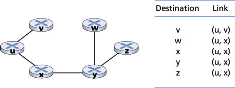

Figure 5.4 Least cost path and forwarding table for node u

− − check n nodes to determine the minimum cost; in the third iteration n nodes, and so on. Overall, the total number of nodes we need to search through

+ over all the iterations is n n 1 2 , and thus we say that the preceding imple- 

mentation of the LS algorithm has worst-case complexity of order n

squared: O n ( 2 ) . (A more sophisticated implementation of this algorithm, using

a data structure known as a heap, can find the minimum in line 9 in logarithmic rather than linear time, thus reducing the complexity.) Before completing our discussion of the LS algorithm, let us consider a pathology that can arise. Figure 5.5 shows a simple network topology where link costs are equal to the load carried on the link, for example, reflecting the delay that would be experienced. In this example, link costs are not symmetric;

that is, c u v , equals c v u , only if the load carried on both directions on the  

link u v , is the same. In this example, node z originates a unit of traffic des-  tined for w, node x also originates a unit of traffic destined for w, and node y injects an amount of traffic equal to e, also destined for w. The initial routing is

shown in Figure 5.5(a) with the link costs corresponding to the amount of traffic carried.

When the LS algorithm is next run, node y determines (based on the link

costs shown in Figure 5.5(a)) that the clockwise path to w has a cost of 1, while

+ the counterclockwise path to w (which it had been using) has a cost of 1 e .

Hence y’s least-cost path to w is now clockwise. Similarly, x determines that its new least-cost path to w is also clockwise, resulting in costs shown in

Figure 5.5(b). When the LS algorithm is run next, nodes x, y, and z all detect a

zero-cost path to w in the counterclockwise direction, and all route their traffic

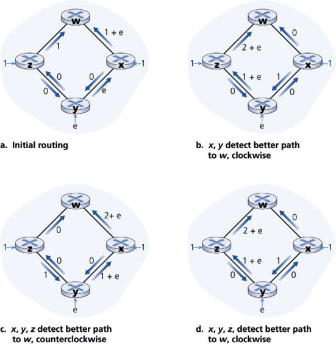

Figure 5.5 Oscillations with congestion-sensitive routing to the counterclockwise routes. The next time the LS algorithm is run, x y ,  , and

z all then route their traffic to the clockwise routes.

What can be done to prevent such oscillations (which can occur in any algorithm, not just an LS algorithm, that uses a congestion or delay-based link metric)? One solution would be to mandate that link costs not depend on the amount of traffic carried—an unacceptable solution since one goal of routing is to avoid highly congested (for example, high-delay) links. Another solution is to ensure that not all routers run the LS algorithm at the same time.

This seems a more reasonable solution, since we would hope that even if routers ran the LS algorithm with the same periodicity, the execution instance of the algorithm would not be the same at each node. Interestingly, researchers have found that routers in the Internet can self-synchronize among themselves [Floyd Synchronization 1994]. That is, even though they initially execute the algorithm with the same period but at different instants of time, the algorithm execution instance can eventually become, and remain, synchronized at the routers. One way to avoid such self-synchronization is for each router to randomize the time it sends out a link advertisement.

Having studied the LS algorithm, let’s consider the other major routing algorithm that is used in practice today—the distance-vector routing algorithm.

##### 5.2.2 The Distance-Vector (DV) Routing Algorithm

Whereas the LS algorithm is an algorithm using global information, the distance-vector  (DV) algorithm is iterative, asynchronous, and distributed. It is distributed in that each node receives some information from one or more of its directly attached neighbors, performs a calculation, and then distributes the results of its calculation back to its neighbors. It is iterative in that this process continues on until no more information is exchanged between neighbors.

(Interestingly, the algorithm is also self-terminating—there is no signal that the computation should stop; it just stops.) The algorithm is asynchronous in that it does not require all of the nodes to operate in lockstep with each other. We’ll see that an asynchronous, iterative, self-terminating, distributed algorithm is much more interesting and fun than a centralized algorithm!

Before we present the DV algorithm, it will prove beneficial to discuss an important relationship that exists among the costs of the least-cost paths. Let d y  be the cost of the least-cost path from node x to node y. Then the least x costs are related by the celebrated Bellman-Ford equation, namely,

d y = min c x v , + d y , (5.1)  {  }  x v v

where the min in the equation is taken over all of x’s neighbors. The Bellmanv Ford equation is rather intuitive. Indeed, after traveling from x to v, if we then

take the least-cost path from v to y, the path cost will be c x v , + d y . Since  v we must begin by traveling to some neighbor v, the least cost from x to y is the

minimum of c x v , + d y taken over all neighbors v.  v But for those who might be skeptical about the validity of the equation, let’s check it for source node u and destination node z in Figure 5.3. The source node u has three neighbors: nodes v, x, and w. By walking along various paths in the graph, it is easy to see that d z = , d z = , and d z = . Plug-  w ging these values into Equation 5.1, along with the costs c u v , = , 

c u x , = 1 , and c u w , = 5 , gives d z = min 2 + 5, 5 + 3, 1 + 3 = 4 ,  { } u which is obviously true and which is exactly what the Dijskstra algorithm gave us for the same network.

This quick verification should help relieve any skepticism you may have.

The Bellman-Ford equation is not just an intellectual curiosity. It actually has significant practical importance: the solution to the Bellman-Ford equation provides the entries in node x’s forwarding table. To see this, let v* be any

neighboring node that achieves the minimum in Equation 5.1. Then, if node x

wants to send a packet to node y along a least-cost path, it should first forward

the packet to node v*. Thus, node x’s forwarding table would specify node v*

as the next-hop router for the ultimate destination y. Another important practi-

cal contribution of the Bellman-Ford equation is that it suggests the form of the neighbor-to-neighbor communication that will take place in the DV algorithm.

The basic idea is as follows. Each node x begins with D y  , an estimate of x the cost of the least-cost path from itself to node y, for all nodes, y, in N. Let

D = [ D y y  :  in N ] be node x’s distance vector, which is the vector of cost x x estimates from x to all other nodes, y, in N.

With the DV algorithm, each node

x maintains the following routing information:

• For each neighbor v, the cost c x v , from x to directly attached neighbor, v 

• Node x’s distance vector, that is, D = D y y :  in N , containing x’s [  ] x x estimate of its cost to all destinations, y, in N

• The distance vectors of each of its neighbors, that is, D = [ D y y  :  in N ] v v for each neighbor v of x

In the distributed, asynchronous algorithm, from time to time, each node sends a copy of its distance vector to each of its neighbors. When a node x

receives a new distance vector from any of its neighbors w, it saves w’s dis-

tance vector, and then uses the Bellman-Ford equation to update its own distance vector as follows:

D y = min c x v , + D y for each node  in y N  {  }  x v v

If node x’s distance vector has changed as a result of this update step, node x will then send its updated distance vector to each of its neighbors, which can in turn update their own distance vectors. Miraculously enough, as long as all the nodes continue to exchange their distance vectors in an asynchronous fashion, each cost estimate D y converges to d y , the actual cost  x x of the least-cost path from node x to node y [Bertsekas 1991]!

Distance-Vector (DV) Algorithm At each node, x:

1  Initialization:

2  for all destinations y in N:

3  Dx(y)= c(x,y)/* if y is not a neighbor then c(x,y)= ∞ */ 4  for each neighbor w

5  Dw(y) = ? for all destinations y in N 6  for each neighbor w 7  send distance vector Dx = [Dx(y): y in N] to w 8 9  loop 10  wait  (until I see a link cost change to some neighbor w or 11  until I receive a distance vector from some neighbor w) 12 13  for each y in N:

14  Dx(y) = minv{c(x,v) + Dv(y)} 15 16 if Dx(y) changed for any destination y 17  send distance vector Dx = [Dx(y): y in N] to all neighbors 18 19 forever

In the DV algorithm, a node updates its distance-vector estimate when it x

either sees a cost change in one of its directly attached links or receives a distance-vector update from some neighbor. But to update its own forwarding table for a given destination y, what node x really needs to know is not the

shortest-path distance to y but instead the neighboring node v*(y) that is the next-hop router along the shortest path to y. As you might expect, the next-hop

router v y *  is the neighbor v that achieves the minimum in Line 14 of the DV algorithm. (If there are multiple neighbors v that achieve the minimum, then v*(y) can be any of the minimizing neighbors.) Thus, in Lines 13–14, for each destination y, node x also determines v y *  and updates its forwarding table

for destination y.

Recall that the LS algorithm is a centralized algorithm in the sense that it requires each node to first obtain a complete map of the network before running the Dijkstra algorithm. The DV algorithm is decentralized and does not use such global information. Indeed, the only information a node will have is the costs of the links to its directly attached neighbors and information it receives from these neighbors. Each node waits for an update from any neighbor (Lines 10–11), calculates its new distance vector when receiving an update (Line 14), and distributes its new distance vector to its neighbors (Lines 16–17).

DV-like algorithms are used in many routing protocols in practice, including the Internet’s RIP and BGP, ISO IDRP, Novell IPX, and the original ARPAnet.

Figure 5.6 illustrates the operation of the DV algorithm for the simple three-node network shown at the top of the figure. The operation of the algorithm is illustrated in a synchronous manner, where all nodes simultaneously receive distance vectors from their neighbors, compute their new distance vectors, and inform their neighbors if their distance vectors have changed. After studying this example, you should convince yourself that the algorithm operates correctly in an asynchronous manner as well, with node computations and update generation/reception occurring at any time.

The leftmost column of the figure displays three initial routing tables for each of the three nodes. For example, the table in the upper-left corner is node x’s initial routing table. Within a specific routing table, each row is a distance vector—specifically, each node’s routing table includes its own distance vector and that of each of its neighbors. Thus, the first row in node x’s initial routing table is D = D x D y D z , , = 0, 2, 7 . The second and third rows [  ]  [ ] x x x x in this table are the most recently received distance vectors from nodes y and z,

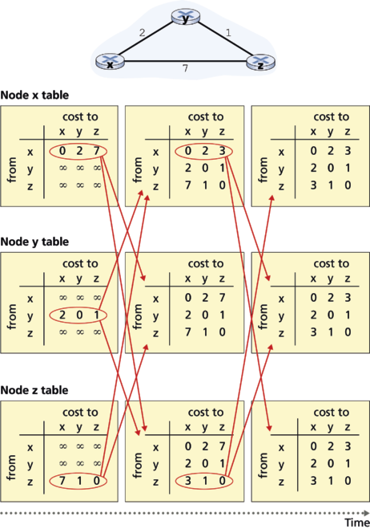

Figure 5.6 Distance- vector (DV) algorithm in operation

respectively. Because at initialization node x has not received anything from

node y or z, the entries in the second and third rows are initialized to infinity.

After initialization, each node sends its distance vector to each of its two neighbors. This is illustrated in Figure 5.6 by the arrows from the first column of tables to the second column of tables. For example, node x sends its distance

vector D = 0, 2, 7 to both nodes y and z.

After receiving the updates, each [ ] x node recomputes its own distance vector. For example, node x computes

D x = 0  x { } D y = min c x y , + D y c x z , , + D y = min 2 + 0, 7 + 1 = 2  { } x y z

{ } D z = min c x y , + D z c x z , , + D z = min 2 + 1, 7 + 0 = 3  { } x y z

The second column therefore displays, for each node, the node’s new distance vector along with distance vectors just received from its neighbors. Note, for example, that node x’s estimate for the least cost to node z, D z , has  x changed from 7 to 3. Also note that for node x, neighboring node y achieves the minimum in line 14 of the DV algorithm; thus, at this stage of the algorithm, we have at node x that v y *  = y and v z * = y . 

After the nodes recompute their distance vectors, they again send their updated distance vectors to their neighbors (if there has been a change).

This is illustrated in Figure 5.6 by the arrows from the second column of tables to the third column of tables. Note that only nodes x and z send updates: node y’s

distance vector didn’t change so node y doesn’t send an update. After receiv-

ing the updates, the nodes then recompute their distance vectors and update their routing tables, which are shown in the third column.

The process of receiving updated distance vectors from neighbors, recomputing routing table entries, and informing neighbors of changed costs of the least-cost path to a destination continues until no update messages are sent. At this point, since no update messages are sent, no further routing table calculations will occur and the algorithm will enter a quiescent state;

that is, all nodes will be performing the wait in Lines 10–11 of the DV algorithm. The algorithm remains in the quiescent state until a link cost changes, as discussed next.

Distance-Vector Algorithm: Link-Cost Changes and Link Failure When a node running the DV algorithm detects a change in the link cost from itself to a neighbor (Lines 10–11), it updates its distance vector (Lines 13–14) and, if there’s a change in the cost of the least-cost path, informs its neighbors (Lines 16–17) of its new distance vector. Figure 5.7(a) illustrates a scenario where the link cost from y to x changes from 4 to 1. We focus here only on y’

and z’s distance table entries to destination x. The DV algorithm causes the following sequence of events to occur:

• At time t , y detects the link-cost change (the cost has changed from 4 to 1), 0 updates its distance vector, and informs its neighbors of this change since its distance vector has changed.

• At time t , z receives the update from y and updates its table. It computes 1 a new least cost to x (it has decreased from a cost of 5 to a cost of 2) and

sends its new distance vector to its neighbors.

• At time t , y receives z’s update and updates its distance table. y’s least 2 costs do not change and hence y does not send any message to z. The algo-

rithm comes to a quiescent state.

Thus, only two iterations are required for the DV algorithm to reach a quiescent state. The good news about the decreased cost between x and y has

propagated quickly through the network.

Figure 5.7 Changes in

link cost

Let’s now consider what can happen when a link cost increases. Suppose that the link cost between x and y increases from 4 to 60, as shown in

Figure 5.7(b).

1.  Before the link cost changes, D x = 4 ,  D z = 1 ,  D y  = 1 , and  y y z D x = 5 . At time t , y detects the link-cost change (the cost has changed  z 0 from 4 to 60). y computes its new minimum-cost path to x to have a cost of D x = min c y x , + D x c y z , , + D x = min 60 + 0, 1 + 5 = 6 {  } { }  y x z

Of course, with our global view of the network, we can see that this new cost via z is wrong. But the only information node y has is that its direct cost to x is 60 and that z has last told y that z could get to x with a cost of 5. So in order to get to x, y would now route through z, fully expecting that z will

be able to get to x with a cost of 5. As of t we have a routing loop—in order 1 to get to x, y routes through z, and z routes through y. A routing loop is like a black hole—a packet destined for x arriving at y or z as of t will bounce 1 back and forth between these two nodes forever (or until the forwarding tables are changed).

2.  Since node y has computed a new minimum cost to x, it informs z of its new distance vector at time t . 1

3.  Sometime after t , z receives y’s new distance vector, which indicates that 1 y’s minimum cost to x is 6. z knows it can get to y with a cost of 1 and hence computes a new least cost to x of D x = min 50 + 0, 1 + 6 = 7 .  { } z Since z’s least cost to x has increased, it then informs y of its new distance

vector at t . 2 4.  In a similar manner, after receiving z’s new distance vector, y determines = = D x 8 and sends z its distance vector. z then determines D x 9  y z and sends z its distance vector, and so on.

How long will the process continue? You should convince yourself that the loop will persist for 44 iterations (message exchanges between y and z)— until z eventually computes the cost of its path via y to be greater than 50. At this point, z will (finally!) determine that its least-cost path to x is via its direct connection to x. y will then route to x via z. The result of the bad news about

the increase in link cost has indeed traveled slowly! What would have happened if the link cost c(y, x) had changed from 4 to 10,000 and the cost c(z, x)

had been 9,999? Because of such scenarios, the problem we have seen is sometimes referred to as the count-to-infinity problem.

Distance-Vector Algorithm: Adding Poisoned Reverse The specific looping scenario just described can be avoided using a technique known as poisoned reverse. The idea is simple—if z routes through y to get to

destination x, then z will advertise to y that its distance to x is infinity, that is, z will advertise to y that D x = ∞ (even though z knows D x = 5 in truth).  z z z will continue telling this little white lie to y as long as it routes to x via y.

Since y believes that z has no path to x, y will never attempt to route to x via z, as long as z continues to route to x via y (and lies about doing so).

Let’s now see how poisoned reverse solves the particular looping problem we encountered before in Figure 5.5(b). As a result of the poisoned reverse, y’s

distance table indicates D x = ∞ .

When the cost of the (x, y) link changes  z from 4 to 60 at time t , y updates its table and continues to route directly to x, 0 albeit at a higher cost of 60, and informs z of its new cost to x, that is, D x = 60 . After receiving the update at t , z immediately shifts its route to x  y 1 to be via the direct ( z, x) link at a cost of 50. Since this is a new least-cost path to x,

and since the path no longer passes through y,  z now informs y that

D x = 50 at t .

After receiving the update from z, y updates its distance  z 2 table with D x = 51 . Also, since z is now on y’s least-cost path to x, y poi-  y sons the reverse path from z to x by informing z at time t that D x = ∞  3 y (even though y knows that D x = 51 in truth).  y Does poisoned reverse solve the general count-to-infinity problem? It does not. You should convince yourself that loops involving three or more nodes (rather than simply two immediately neighboring nodes) will not be detected by the poisoned reverse technique.

A Comparison of LS and DV Routing Algorithms The DV and LS algorithms take complementary approaches toward computing routing. In the DV algorithm, each node talks to only its directly connected neighbors, but it provides its neighbors with least-cost estimates from itself to all the nodes (that it knows about) in the network. The LS algorithm requires global information. Consequently, when implemented in each and every router, for example, as in Figures 4.2 and 5.1, each node would need to communicate with all other nodes (via broadcast), but it tells them only the costs of its directly connected links. Let’s conclude our study of LS and DV algorithms with a quick comparison of some of their attributes. Recall that N is the set of

nodes (routers) and E is the set of edges (links).

• Message complexity. We have seen that LS requires each node to know the cost of each link in the network. This requires O N E messages to be 

sent. Also, whenever a link cost changes, the new link cost must be sent to all nodes. The DV algorithm requires message exchanges between directly connected neighbors at each iteration. We have seen that the time needed for the algorithm to converge can depend on many factors. When link costs change, the DV algorithm will propagate the results of the changed link cost only if the new link cost results in a changed least-cost path for one of the nodes attached to that link.

• Speed of convergence. We have seen that our implementation of LS is an ( 2 ) O N algorithm requiring O(|N| |E|)) messages. The DV algorithm can converge slowly and can have routing loops while the algorithm is converging. DV also suffers from the count-to-infinity problem.

• Robustness. What can happen if a router fails, misbehaves, or is sabotaged?

Under LS, a router could broadcast an incorrect cost for one of its attached links (but no others).A node could also corrupt or drop any packets it received as part of an LS broadcast.

But an LS node is computing only its own forwarding tables; other nodes are performing similar calculations for themselves. This means route calculations are somewhat separated under LS, providing a degree of robustness. Under DV, a node can advertise incorrect least-cost paths to any or all destinations. (Indeed, in 1997, a malfunctioning router in a small ISP provided national backbone routers with erroneous routing information. This caused other routers to flood the malfunctioning router with traffic and caused large portions of the Internet to become disconnected for up to several hours [Neumann 1997].) More generally, we note that, at each iteration, a node’s calculation in DV is passed on to its neighbor and then indirectly to its neighbor’s neighbor on the next iteration. In this sense, an incorrect node calculation can be diffused through the entire network under DV.

In the end, neither algorithm is an obvious winner over the other; indeed, both algorithms are used in the Internet.

#### 5.3 Intra-AS Routing in the Internet: OSPF

In our study of routing algorithms so far, we’ve viewed the network simply as a collection of interconnected routers. One router was indistinguishable from another in the sense that all routers executed the same routing algorithm to compute routing paths through the entire network. In practice, this model and its view of a homogenous set of routers all executing the same routing algorithm is simplistic for two important reasons:

• Scale. As the number of routers becomes large, the overhead involved in communicating, computing, and storing routing information becomes prohibitive. Today’s Internet consists of hundreds of millions of routers.

Storing routing information for possible destinations at each of these routers would clearly require enormous amounts of memory. The overhead required to broadcast connectivity and link cost updates among all of the routers would be huge! A distance-vector algorithm that iterated among such a large number of routers would surely never converge. Clearly, something must be done to reduce the complexity of route computation in a network as large as the Internet.

• Administrative autonomy. As described in Section 1.3, the Internet is a network of ISPs, with each ISP consisting of its own network of routers. An ISP generally desires to operate its network as it pleases (for example, to run whatever routing algorithm it chooses within its network) or to hide aspects of its network’s internal organization from the outside. Ideally, an organization should be able to operate and administer its network as it wishes, while still being able to connect its network to other outside networks.

Both of these problems can be solved by organizing routers into autonomous systems (ASs), with each AS consisting of a group of routers that are under the same administrative control. Often the routers in an ISP, and the links that interconnect them, constitute a single AS.Some ISPs, however, partition their network into multiple ASs.

In particular, some tier-1 ISPs use one gigantic AS for their entire network, whereas others break up their ISP into tens of interconnected ASs. An autonomous system is identified by its globally unique autonomous system number (ASN) [RFC 1930]. AS numbers, like IP addresses, are assigned by ICANN regional registries [ICANN 2025].

Routers within the same AS all run the same routing algorithm and have information about each other. The routing algorithm running within an autonomous system is called an intra-autonomous system routing protocol.

Open Shortest Path First (OSPF) OSPF routing and its closely related cousin, IS-IS, are widely used for intra-AS routing in the Internet. The Open in OSPF indicates that the routing protocol specification is publicly available (for example, as opposed to Cisco’s EIGRP protocol, which was only recently became open [Savage 2015], after roughly 20 years as a Cisco-proprietary protocol). The most recent version of OSPF, version  2, is defined in [RFC 2328], a public document.

OSPF is a link-state protocol that uses flooding of link-state information and a Dijkstra’s least-cost path algorithm. With OSPF, each router constructs a complete topological map (that is, a graph) of the entire autonomous system.

Each router then locally runs Dijkstra’s shortest-path algorithm to determine a shortest-path tree to all subnets, with itself as the root node. Individual link costs are configured by the network administrator (see sidebar, Principles and Practice: Setting OSPF Weights). The administrator might choose to set all link costs to 1, thus achieving minimum-hop routing, or might choose to set the link weights to be inversely proportional to link capacity in order to discourage traffic from using low-bandwidth links. OSPF does not mandate a policy for how link weights are set (that is the job of the network administrator), but instead provides the mechanisms (protocol) for determining least-cost path routing for the given set of link weights.

Principles in Practice Setting OSPF Link Weights Our discussion of link-state routing has implicitly assumed that link weights are set, a routing algorithm such as OSPF is run, and traffic flows according to the routing tables computed by the LS algorithm. In terms of cause and effect, the link weights are given (i.e., they come first) and result (via Dijkstra’s algorithm) in routing paths that minimize overall cost. In this viewpoint, link weights reflect the cost of using a link (for example, if link weights are inversely proportional to capacity, then the use of high-capacity links would have smaller weight and thus be more attractive from a routing standpoint) and Dijsktra’s algorithm serves to minimize overall cost.

In practice, the cause and effect relationship between link weights and routing paths may be reversed, with network operators configuring link weights in order to obtain routing paths that achieve certain traffic engineering goals [Fortz 2000, Fortz 2002]. For example, suppose a network operator has an estimate of traffic flow entering the network at each ingress point and destined for each egress point.

The operator may then want to put in place a specific routing of ingress-to-egress flows that minimizes the maximum utilization over all of the network’s links. But with a routing algorithm such as OSPF, the operator’s main “knobs” for tuning the routing of flows through the network are the link weights. Thus, in order to achieve the goal of minimizing the maximum link utilization, the operator must find the set of link weights that achieves this goal. This is a reversal of the cause and effect relationship—the desired routing of flows is known, and the OSPF link weights must be found such that the OSPF routing algorithm results in this desired routing of flows.

With OSPF, a router broadcasts routing information to all other routers in the autonomous system, not just to its neighboring routers. A router broadcasts link-state information whenever there is a change in a link’s state (for example, a change in cost or a change in up/down status). It also broadcasts a link’s state periodically (at least once every 30 minutes), even if the link’s state has not changed. RFC 2328 notes that “this periodic updating of link state advertisements adds robustness to the link state algorithm.” OSPF advertisements are contained in OSPF messages that are carried directly by IP, with an upperlayer protocol of for OSPF. Thus, the OSPF protocol must itself implement 89

functionality such as reliable message transfer and link-state broadcast. The OSPF protocol also checks that links are operational (via a HELLO message that is sent to an attached neighbor) and allows an OSPF router to obtain a neighboring router’s database of network-wide link state.

Some of the advances embodied in OSPF include the following:

• Security. Exchanges between OSPF routers (for example, link-state updates) can be authenticated.

With authentication, only trusted routers can participate in the OSPF protocol within an AS, thus preventing malicious intruders (or networking students taking their newfound knowledge out for a joyride) from injecting incorrect information into router tables. By default, OSPF packets between routers are not authenticated and could be forged.

Two types of authentication can be configured—simple and (see MD5

Chapter 8 for a discussion on and authentication in general). With MD5

simple authentication, the same password is configured on each router.

When a router sends an OSPF packet, it includes the password in plaintext.

Clearly, simple authentication is not very secure. authentication is MD5

based on shared secret keys that are configured in all the routers. For each OSPF packet that it sends, the router computes the hash of the content MD5

of the OSPF packet appended with the secret key. (See the discussion of message authentication codes in Chapter 8.) Then the router includes the resulting hash value in the OSPF packet. The receiving router, using the preconfigured secret key, will compute an hash of the packet and MD5

compare it with the hash value that the packet carries, thus verifying the packet’s authenticity. Sequence numbers are also used with authenti- MD5

cation to protect against replay attacks.

• Multiple same-cost paths. When multiple paths to a destination have the same cost, OSPF allows multiple paths to be used (that is, a single path need not be chosen for carrying all traffic when multiple equal-cost paths exist).

• Integrated support for unicast and multicast routing. Multicast OSPF (MOSPF) [RFC 1584] provides simple extensions to OSPF to provide for multicast routing. MOSPF uses the existing OSPF link database and adds a new type of link-state advertisement to the existing OSPF link-state broadcast mechanism.

• Support for hierarchy within a single AS. An OSPF autonomous system can be configured hierarchically into areas. Each area runs its own OSPF link-state routing algorithm, with each router in an area broadcasting its link state to all other routers in that area. Within each area, one or more area border routers are responsible for routing packets outside the area. Lastly, exactly one OSPF area in the AS is configured to be the backbone area. The primary role of the backbone area is to route traffic between the other areas in the AS. The backbone always contains all area border routers in the AS and may contain non-border routers as well. Inter-area routing within the AS requires that the packet be first routed to an area border router (intra-area routing), then routed through the backbone to the area border router that is in the destination area, and then routed to the final destination.

OSPF is a relatively complex protocol, and our coverage here has been necessarily brief; [Huitema 1998; Moy 1998; RFC 2328] provide additional details.

#### 5.4 Routing Among the ISPs: BGP

We just learned that OSPF is an example of an intra-AS routing protocol. When routing a packet between a source and destination within the same AS, the route the packet follows is entirely determined by the intra-AS routing protocol.

However, to route a packet across multiple ASs, say from a smartphone in Timbuktu to a server in a datacenter in Silicon Valley, we need an interautonomous system routing protocol. Since an inter-AS routing protocol involves coordination among multiple ASs, communicating ASs must run the same inter-AS routing protocol. In fact, in the Internet, all ASs run the same inter-AS routing protocol, called the Border Gateway Protocol, more commonly known as BGP [RFC 4271; Stewart 1999].

BGP is arguably the most important of all the Internet protocols (the only other contender would be the IP protocol that we studied in Section 4.3), as it is the protocol that glues the thousands of ISPs in the Internet together. As we will soon see, BGP is a decentralized and asynchronous protocol in the vein of distance-vector routing described in Section 5.2.2. Although BGP is a complex and challenging protocol, to understand the Internet on a deep level, we need to become familiar with its underpinnings and operation. The time we devote to learning BGP will be well worth the effort.

##### 5.4.1 The Role of BGP

To understand the responsibilities of BGP, consider an AS and an arbitrary router in that AS. Recall that every router has a forwarding table, which plays the central role in the process of forwarding arriving packets to outbound router links. As we have learned, for destinations that are within the same AS, the entries in the router’s forwarding table are determined by the AS’s intra- AS routing protocol. But what about destinations that are outside of the AS?

This is precisely where BGP comes to the rescue.

In BGP, packets are not routed to a specific destination address, but instead to CIDRized prefixes, with each prefix representing a subnet or a collection of subnets. In the world of BGP, a destination may take the form 138.16.68 22, which for this example includes 1,024 IP addresses. Thus, a router’s forwarding table will have entries of the form x I , , where x is a prefix (such as 

138.16.68/22) and I is an interface number for one of the router’s interfaces.

As an inter-AS routing protocol, BGP provides each router a means to:

1.  Obtain prefix reachability information from neighboring ASs. In particular, BGP allows each subnet to advertise its existence to the rest of the Internet.

A subnet screams, “I exist and I am here,” and BGP makes sure that all the routers in the Internet know about this subnet. If it weren’t for BGP, each subnet would be an isolated island—alone, unknown and unreachable by the rest of the Internet.

2.  Determine the “best” routes to the prefixes. A router may learn about two or more different routes to a specific prefix. To determine the best route, the router will locally run a BGP route-selection procedure (using the prefix reachability information it obtained via neighboring routers). The best route will be determined based on policy as well as the reachability information.

Let’s now delve into how BGP carries out these two tasks.

##### 5.4.2 Advertising BGP Route Information

Consider the network shown in Figure 5.8. As we can see, this simple network has three autonomous systems: AS1,  AS2, and AS3. As shown, AS3 includes a subnet with prefix x. For each AS, each router is either a gateway router or an internal router. A gateway router is a router on the edge of an AS that directly connects to one or more routers in other ASs. An internal router connects only to hosts and routers within its own AS. In AS1, for example, router 1c is a gateway router; routers 1a, 1b, and 1d are internal routers.

Let’s consider the task of advertising reachability information for prefix x to all of the routers shown in Figure 5.8. At a high level, this is straightforward.

First, AS3 sends a BGP message to AS2, saying that x exists and is in AS3; let’s denote this message as “AS3 x”. Then AS2 sends a BGP message to AS1, saying that x exists and that you can get to x by first passing through AS2 and then going to AS3; let’s denote that message as “AS2 AS3 x”. In this manner, each of the autonomous systems will not only learn about the existence of x, but also learn about a path of autonomous systems that leads to x.

Although the discussion in the above paragraph about advertising BGP reachability information should get the general idea across, it is not precise in the sense that autonomous systems do not actually send messages to each other, but instead routers do. To understand this, let’s now re-examine the example in Figure 5.8. In BGP, pairs of routers exchange routing information over semi-permanent TCP connections using port 179. Each such TCP connection, along with all the BGP messages sent over the connection, is called a BGP connection. Furthermore, a BGP connection that spans two ASs is called an external BGP (eBGP) connection, and a BGP session between routers in the same AS is called an internal BGP (iBGP) connection. Examples of BGP connections for the network in Figure 5.8 are shown in Figure 5.9. There is typically one eBGP connection for each link that directly connects gateway routers in different ASs; thus, in Figure 5.9, there is an eBGP connection between gateway routers 1c and 2a and an eBGP connection between gateway routers 2c and 3a.

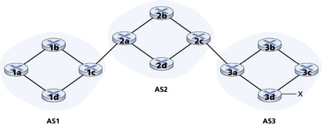

Figure 5.8 Network with three autonomous systems. AS3 includes a subnet with prefix x

There are also iBGP connections between routers within each of the ASs.

In particular, Figure 5.9 displays a common configuration of one BGP connection for each pair of routers internal to an AS, creating a mesh of TCP connections within each AS. In Figure 5.9, the eBGP connections are shown with the long dashes; the iBGP connections are shown with the short dashes.

Note that iBGP connections do not always correspond to physical links.

In order to propagate the reachability information, both iBGP and eBGP sessions are used. Consider again advertising the reachability information for prefix x to all routers in AS1 and AS2. In this process, gateway router 3a first sends an eBGP message “AS3 x” to gateway router 2c. Gateway router 2c then sends the iBGP message “AS3 x” to all of the other routers in AS2, including to gateway router 2a . Gateway router 2a  then sends the eBGP message “AS2 AS3 x” to gateway router 1c. Finally, gateway router 1c uses iBGP to

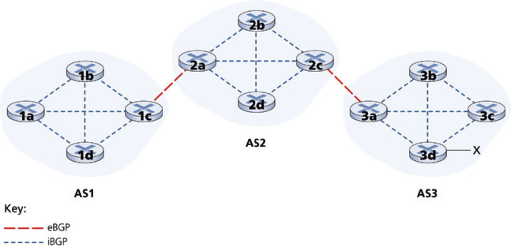

Figure 5.9 eBGP and iBGP connections

send the message “AS2 AS3 x” to all the routers in AS1. After this process is complete, each router in AS1 and AS2 is aware of the existence of x and is also aware of an AS path that leads to x.

Of course, in a real network, from a given router there may be many different paths to a given destination, each through a different sequence of ASs.

For example, consider the network in Figure 5.10, which is the original network in Figure 5.8, with an additional physical link from router 1d to router 3d.

In this case, there are two paths from AS1 to x: the path “AS2 AS3 x” via router 1c; and the new path “AS3 x” via the router 1d.

##### 5.4.3 Determining the Best Routes

As we have just learned, there may be many paths from a given router to a destination subnet. In fact, in the Internet, routers often receive reachability information about dozens of different possible paths. How does a router choose among these paths (and then configure its forwarding table accordingly)?

Before addressing this critical question, we need to introduce a little more BGP terminology. When a router advertises a prefix across a BGP connection, it includes with the prefix several BGP attributes. In BGP jargon, a prefix along with its attributes is called a route. Two of the more important attributes are AS-PATH and NEXT-HOP. The AS-PATH attribute contains the list of ASs through which the advertisement has passed, as we’ve seen in our examples above. To generate the AS-PATH value, when a prefix is passed to an AS, the AS adds its ASN to the existing list in the AS-PATH. For example, in Figure 5.10, there are two routes from AS1 to subnet x: one which uses the AS-PATH “AS2 AS3”; and another that uses the AS-PATH “A3”. BGP routers also use the AS-PATH attribute to detect and prevent looping advertisements; specifically, if a router sees that its own AS is contained in the path list, it will reject the advertisement.

Providing the critical link between the inter-AS and intra-AS routing protocols, the NEXT-HOP attribute has a subtle but important use. The NEXT-HOP is the IP address of the router interface that begins the AS-PATH. To gain insight into this attribute, let’s again refer to Figure 5.10. As indicated in Figure 5.10, the NEXT-HOP attribute for the route “AS2 AS3 x” from AS1 to x that passes  through  AS2 is the IP address of the left interface on router 2a.

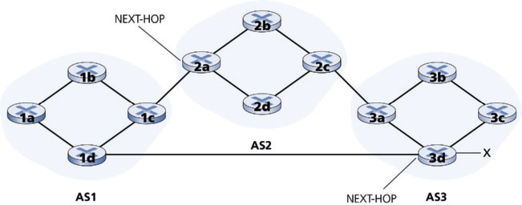

Figure 5.10 Network augmented with peering link between AS1 and AS3

The NEXT-HOP attribute for the route “AS3 x” from AS1 to x that bypasses AS2 is the IP address of the leftmost interface of router 3d. In summary, in this toy example, each router in AS1 becomes aware of two BGP routes to prefix x:

IP address of leftmost interface for router 2a;  AS2 AS3;  x IP address of leftmost interface of router 3d;  AS3;  x Here, each BGP route is written as a list with three components: NEXT- HOP; AS-PATH; destination prefix. In practice, a BGP route includes additional attributes, which we will ignore for the time being. Note that the NEXT-HOP attribute is an IP address of a router that does not belong to AS1; however, the subnet that contains this IP address directly attaches to AS1.

Hot Potato Routing We are now finally in position to talk about BGP routing algorithms in a precise manner. We will begin with one of the simplest routing algorithms, namely, hot potato routing.

Consider router 1b in the network in Figure 5.10. As just described, this router will learn about two possible BGP routes to prefix x. In hot potato routing, the route chosen (from among all possible routes) is that route with the least cost to the NEXT-HOP router beginning that route. In this example, router 1b will consult its intra-AS routing information to find the least-cost intra-AS path to NEXT-HOP router 2a and the least-cost intra-AS path to NEXT-HOP router 3d, and then select the route with the smallest of these least-cost paths.

For example, suppose that cost is defined as the number of links traversed.

Then the least cost from router 1b to router 2a is 2, the least cost from router 1b to router 2d is 3, and router 2a would therefore be selected. Router 1b would then consult its forwarding table (configured by its intra-AS algorithm) and find the interface I that is on the least-cost path to router 2a. It then adds  x I , 

to its forwarding table.

The steps for adding an outside-AS prefix in a router’s forwarding table for hot potato routing are summarized in Figure 5.11. It is important to note that when adding an outside-AS prefix into a forwarding table, both the inter-AS routing protocol (BGP) and the intra-AS routing protocol (e.g., OSPF) are used.

The idea behind hot-potato routing is for router 1b to get packets out of its AS as quickly as possible (more specifically, with the least cost possible) without worrying about the cost of the remaining portions of the path outside of its AS to the destination.

In the name “hot potato routing,” a packet is analogous

Figure 5.11 Steps in adding outside-AS destination in a router’s forwarding table to a hot potato that is burning in your hands. Because it is burning hot, you want to pass it off to another person (another AS) as quickly as possible. Hot potato routing is thus a selfish algorithm—it tries to reduce the cost in its own AS while ignoring the other components of the end-to-end costs outside its AS.

Note that with hot potato routing, two routers in the same AS may choose two different AS paths to the same prefix. For example, we just saw that router 1b would send packets through AS2 to reach x. However, router 1d would bypass AS2 and send packets directly to AS3 to reach x.

Route-Selection Algorithm In practice, BGP uses an algorithm that is more complicated than hot potato routing, but nevertheless incorporates hot potato routing. For any given destination prefix, the input into BGP’s route-selection algorithm is the set of all routes to that prefix that have been learned and accepted by the router. If there is only one such route, then BGP obviously selects that route. If there are two or more routes to the same prefix, then BGP sequentially invokes the following elimination rules until one route remains:

1.  A route is assigned a local preference value as one of its attributes (in addition to the AS-PATH and NEXT-HOP attributes). The local preference of a route could have been set by the router or could have been learned from another router in the same AS. The value of the local preference attribute is a policy decision that is left entirely up to the AS’s network administrator. (We will shortly discuss BGP policy issues in some detail.) The routes with the highest local preference values are selected.

2.  From the remaining routes (all with the same highest local preference value), the route with the shortest AS-PATH is selected. If this rule were the only rule for route selection, then BGP would be using a DV algorithm for path determination, where the distance metric uses the number of AS hops rather than the number of router hops.

3.  From the remaining routes (all with the same highest local preference value and the same AS-PATH length), hot potato routing is used, that is, the route with the closest NEXT-HOP router is selected.

4.  If more than one route still remains, the router uses BGP identifiers to select the route; see [Stewart 1999].

As an example, let’s again consider router 1b in Figure 5.10. Recall that there are exactly two BGP routes to prefix x, one that passes through AS2 and one that bypasses AS2. Also recall that if hot potato routing on its own were used, then BGP would route packets through AS2 to prefix x. But in the above route-selection algorithm, rule 2 is applied before rule 3, causing BGP to select the route that bypasses AS2, since that route has a shorter AS PATH. So we see that with the above route-selection algorithm, BGP is no longer a selfish algorithm—it first looks for routes with short AS paths (thereby likely reducing end-to-end delay).

As noted above, BGP is the de facto standard for inter-AS routing for the Internet. To see the contents of various BGP routing tables (large!) extracted from routers in tier-1 ISPs, see http://www.routeviews.org. BGP routing tables often contain over half a million routes (that is, prefixes and corresponding attributes). Statistics about the size and characteristics of BGP routing tables are presented in [Huston 2019b].

##### 5.4.4 IP-Anycast

In addition to being the Internet’s inter-AS routing protocol, BGP is often used to implement the IP-anycast service [RFC 1546, RFC 7094], which is commonly used in DNS.To motivate IP-anycast, consider that in many applications, we are interested in (1) replicating the same content on different servers in many different dispersed geographical locations, and (2) having each user access the content from the server that is closest. For example, a CDN may replicate videos and other objects on servers in different countries. Similarly, the DNS system can replicate DNS records on DNS servers throughout the world.

When a user wants to access this replicated content, it is desirable to point the user to the “nearest” server with the replicated content. BGP’s route-selection algorithm provides an easy and natural mechanism for doing so.

To make our discussion concrete, let’s describe how a CDN might use IP-anycast. As shown in Figure 5.12, during the IP-anycast configuration stage, the CDN company assigns the same IP address to each of its servers, and uses standard BGP to advertise this IP address from each of the servers. When a BGP router receives multiple route advertisements for this IP address, it treats these advertisements as providing different paths to the same physical location (when, in fact, the advertisements are for different paths to different physical locations). When configuring its routing table, each router will locally use the BGP route-selection algorithm to pick the “best” (for example, closest, as

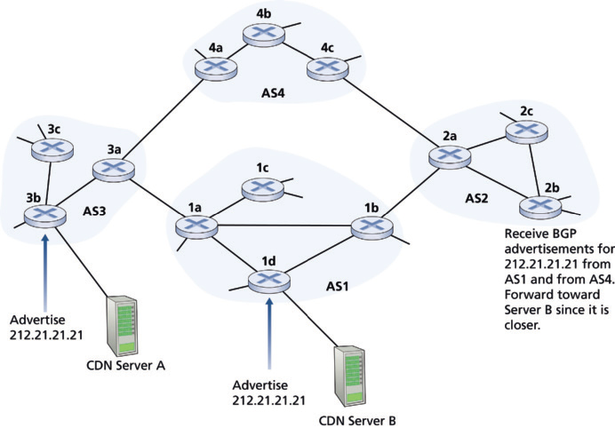

Figure 5.12 Using IP-anycast to bring users to the closest CDN server determined by AS-hop counts) route to that IP address. For example, if one BGP route (corresponding to one location) is only one AS hop away from the router, and all other BGP routes (corresponding to other locations) are two or more AS hops away, then the BGP router would choose to route packets to the location that is one hop away. After this initial BGP address-advertisement phase, the CDN can do its main job of distributing content. When a client requests the video, the CDN returns to the client the common IP address used by the geographically dispersed servers, no matter where the client is located.

When the client sends a request to that IP address, Internet routers then forward the request packet to the “closest” server, as defined by the BGP route-selection algorithm.

Although the above CDN example nicely illustrates how IP-anycast can be used, in practice, CDNs generally choose not to use IP-anycast because BGP routing changes can result in different packets of the same TCP connection arriving at different instances of the Web server. But IP-anycast is extensively used by the DNS system to direct DNS queries to the closest root DNS server.

Recall from Section 2.4, there are currently 13 IP addresses for root DNS servers. But corresponding to each of these addresses, there are multiple DNS root servers, with some of these addresses having over 100 DNS root servers scattered over all corners of the world. When a DNS query is sent to one of these 13 IP addresses, IP anycast is used to route the query to the nearest of the DNS root servers that is responsible for that address. [Li 2018; Zhou 2023] present recent measurements illustrating Internet anycast, use, performance, and challenges.

##### 5.4.5 Routing Policy

When a router selects a route to a destination, the AS routing policy can trump all other considerations, such as shortest AS path or hot potato routing. Indeed, in the route-selection algorithm, routes are first selected according to the localpreference attribute, whose value is fixed by the policy of the local AS.

Let’s illustrate some of the basic concepts of BGP routing policy with a simple example. Figure 5.13 shows six interconnected autonomous systems:

A,  B,  C,  W,  X, and Y. It is important to note that A,  B,  C,  W,  X, and Y are ASs, not routers. Let’s assume that autonomous systems W,  X, and Y are access ISPs and that A,  B, and C are backbone provider networks. We’ll also assume that A,  B, and C, directly send traffic to each other, and provide full BGP information to their customer networks. All traffic entering an ISP access network must be destined for that network, and all traffic leaving an ISP access network must have originated in that network. W and Y are clearly

Figure 5.13 A simple

BGP policy scenario

access ISPs.X is a multi-homed access ISP, since it is connected to the rest of the network via two different providers (a scenario that is becoming increasingly common in practice).However, like W and Y,  X itself must be the source/destination of all traffic leaving/entering X.

But how will this stub network behavior be implemented and enforced? How will X be prevented from forwarding traffic between B and C? This can easily be accomplished by controlling the manner in which BGP routes are advertised. In particular, X will function as an access ISP network if it advertises (to its neighbors B and C) that it has no paths to any other destinations except itself. That is, even though X may know of a path, say XCY, that reaches network Y, it will not advertise this path to B. Since B is unaware that X has a path to Y,  B would never forward traffic destined to Y (or C) via X. This simple example illustrates how a selective route advertisement policy can be used to implement customer/provider routing relationships.

Let’s next focus on a provider network, say AS B.Suppose that B has learned (from A) that A has a path AW to W.B can thus install the route AW into its routing information base. Clearly, B also wants to advertise the path BAW to its customer, X, so that X knows that it can route to W via B.

But should B advertise the path BAW to C? If it does so, then C could route traffic to W via BAW. If A,  B, and C are all backbone providers, than B might rightly feel that it should not have to shoulder the burden (and cost!) of carrying transit traffic between A and C. B might rightly feel that it is A’s and C’s job (and cost!) to make sure that C can route to/from A’s customers via a direct connection between A and C. There are currently no official standards that govern how backbone ISPs route among themselves. However, a rule of thumb followed by commercial ISPs is that any traffic flowing across an ISP’s backbone network must have either a source or a destination (or both) in a network that is a customer of that ISP; otherwise the traffic would be getting a free ride on the ISP’s network. Individual peering agreements (that would govern questions such as those raised above) are typically negotiated between pairs of ISPs and are often confidential; [Huston 1999a; Huston 2012] provide an interesting discussion of peering agreements. For a detailed description of how routing policy reflects commercial relationships among ISPs, see [Gao 2001;

Dmitiropoulos 2007]. For a discussion of BGP routing polices from an ISP standpoint, see [Caesar 2005b].

Principles in Practice Why Are There Different Inter-AS and Intra-AS Routing Protocols?

Having now studied the details of specific inter-AS and intra-AS routing protocols deployed in today’s Internet, let’s conclude by considering perhaps the most fundamental question we could ask about these protocols in the first place (hopefully, you have been wondering this all along, and have not lost the forest for the trees!): Why are different inter-AS and intra-AS routing protocols used?

The answer to this question gets at the heart of the differences between the goals of routing within an AS and among ASs:

• Policy. Among ASs, policy issues dominate. It may well be important that traffic originating in a given AS not be able to pass through another specific AS. Similarly, a given AS may well want to control what transit traffic it carries between other ASs. We have seen that BGP carries path attributes and provides for controlled distribution of routing information so that such policy-based routing decisions can be made. Within an AS, everything is nominally under the same administrative control, and thus policy issues play a much less important role in choosing routes within the AS.

• Scale. The ability of a routing algorithm and its data structures to scale to handle routing to/among large numbers of networks is a critical issue in inter-AS routing. Within an AS, scalability is less of a concern. For one thing, if a single ISP becomes too large, it is always possible to divide it into two ASs and perform inter-AS routing between the two new ASs. (Recall that OSPF allows such a hierarchy to be built by splitting an AS into areas.) • Performance. Because inter-AS routing is so policy oriented, the quality (for example, performance) of the routes used is often of secondary concern (that is, a longer or more costly route that satisfies certain policy criteria may well be taken over a route that is shorter but does not meet that criteria). Indeed, we saw that among ASs, there is not even the notion of cost (other than AS hop count) associated with routes. Within a single AS, however, such policy concerns are of less importance, allowing routing to focus more on the level of performance realized on a route.

This completes our brief introduction to BGP. Understanding BGP is important because it plays a central role in the Internet. We encourage you to consult the BGP references in this section (in particular [Stewart 1999; Huston 2019a]) and the outstanding online BGP resources available at [NSRC 2025].

##### 5.4.6 Putting the Pieces Together: Obtaining Internet Presence

Although this subsection is not about BGP per se, it brings together many of the protocols and concepts we’ve seen thus far, including IP addressing, DNS, and BGP.

Suppose you have just created a small company that has a number of servers, including a public Web server that describes your company’s products and services, a mail server from which your employees obtain their e-mail messages, and a DNS server. Naturally, you would like the entire world to be able to visit your Web site in order to learn about your exciting products and services. Moreover, you would like your employees to be able to send and receive e-mail to potential customers throughout the world.

To meet these goals, you first need to obtain Internet connectivity, which is done by contracting with, and connecting to, a local ISP. Your company will have a gateway router, which will be connected to a router in your local ISP.

This connection might be a DSL connection through the existing telephone infrastructure, a leased line to the ISP’s router, or one of the many other access solutions described in Chapter 1. In the simplest case, your local ISP will also provide you with an IP address range, for example, a /24 address range consisting of 256 addresses. Once you have your physical connectivity and your IP address range, you will assign one of the IP addresses (in your address range) to your Web server, one to your mail server, one to your DNS server, one to your gateway router, and other IP addresses to other servers and networking devices in your company’s network. (In the case that your ISP is using NAT, described in Section 4.3.3, your server addressing setup would be a bit more complicated.) In addition to contracting with an ISP, you will also need to contract with an Internet registrar to obtain a domain name for your company, as described in Chapter 2. For example, if your company’s name is, say, Xanadu Inc., you will naturally try to obtain the domain name xanadu.com. Your company must also obtain presence in the DNS system. Specifically, because outsiders will want to contact your DNS server to obtain the IP addresses of your servers, you will also need to provide your registrar with the IP address of your DNS server. Your registrar will then put an entry for your DNS server (domain name and corresponding IP address) in the .com top-level-domain servers, as described in Chapter 2. After this step is completed, any user who knows your domain name (e.g., xanadu.com) will be able to obtain the IP address of your DNS server via the DNS system.

So that people can discover the IP addresses of your Web server, in your DNS server you will need to include entries that map the host name of your Web server (e.g., www.xanadu.com) to its IP address. You will want to have similar entries for other publicly available servers in your company, including your mail server.

In this manner, if Alice wants to browse your Web server, the DNS system will contact your DNS server, find the IP address of your Web server, and give it to Alice. Alice can then establish a TCP connection directly with your Web server.

However, there still remains one other necessary and crucial step to allow outsiders from around the world to access your Web server. Consider what happens when Alice, who knows the IP address of your Web server, sends an IP datagram (e.g., a TCP SYN segment) to that IP address.

This datagram will be routed through the Internet, visiting a series of routers in many different ASs, and eventually reach your Web server. When any one of the routers receives the datagram, it is going to look for an entry in its forwarding table to determine on which outgoing port it should forward the datagram. Therefore, each of the routers needs to know about the existence of your company’s /24 prefix (or some aggregate entry). How does a router become aware of your company’s prefix? As we have just seen, it becomes aware of it from BGP!

Specifically, when your company contracts with a local ISP and gets assigned a prefix (i.e., an address range), your local ISP will use BGP to advertise your prefix to the ISPs to which it connects. Those ISPs will then, in turn, use BGP to propagate the advertisement. Eventually, all Internet routers will know about your prefix (or about some aggregate that includes your prefix) and thus be able to appropriately forward datagrams destined to your Web and mail servers.

#### 5.5 The SDN Control Plane

In this section, we’ll dive into the SDN control plane—the network-wide logic that controls packet forwarding among a network’s SDN-enabled devices, as well as the configuration and management of these devices and their services.

Our study here builds on our earlier discussion of generalized SDN forwarding in Section 4.4, so you might want to first review that section, as well as Section 5.1 of this chapter, before continuing on. As in Section 4.4, we’ll again adopt the terminology used in the SDN literature and refer to the network’s forwarding devices as “packet switches” (or just switches, with “packet” being understood), since forwarding decisions can be made on the basis of networklayer source/destination addresses, link-layer source/destination addresses, as well as many other values in transport, network, and link-layer packetheader fields. Our discussion here will also be a good foundation for our discussion of the control plane in 5G cellular networks, which adopts an SDNlike approach.

Four key characteristics of an SDN architecture can be identified [Kreutz 2015]:

• Flow-based forwarding. Packet forwarding by SDN-controlled switches can be based on any number of header field values in the transport-layer, network-layer, or link-layer header. We saw in Section 4.4 that the OpenFlow  1.0 abstraction allows forwarding based on eleven different header field values. This contrasts sharply with the traditional approach to router-based forwarding that we studied in Sections 5.2–5.4, where forwarding of IP datagrams was based solely on a datagram’s destination IP address. Recall from Figure 5.2 that packet forwarding rules are specified in a switch’s flow table; it is the job of the SDN control plane to compute, manage and install flow table entries in all of the network’s switches.

• Separation of data plane and contr ol plane. This separation is shown clearly in

Figures 5.2 and 5.14. The data plane consists of the network’s switches— relatively simple (but fast) devices that execute the “match plus action” rules in their flow tables. The control plane consists of servers and software that determine and manage the switches’ flow tables.

• Network control functions: external to data-plane switches. Given that the “S” in SDN is for “software,” it’s perhaps not surprising that the SDN control plane is implemented in software. Unlike traditional routers, however, this software executes on servers that are both distinct and remote from the network’s switches. As shown in Figure 5.14, the control plane itself consists of two components—an SDN controller (or network operating system [Gude 2008]) and a set of network-control applications. The controller maintains accurate network state information (e.g., the state of remote links, switches, and hosts); provides this information to the network-control applications running in the control plane; and provides the means through which these applications can monitor, program, and control the underlying network devices. Although the controller in Figure 5.14 is shown as a single central server, in practice the controller is only logically centralized; it is typically implemented on several servers that provide coordinated, scalable performance and high availability.

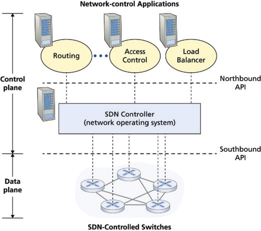

Figure 5.14 Components of the SDN architecture: SDN-controlled switches, the SDN controller, network-control applications

• A programmable network control plane. The network control plane is programmable through the network-control applications running in the control plane. These applications represent the “brains” of the SDN control plane, using the APIs provided by the SDN controller to specify and control the data plane in the network devices. For example, a routing network-control application might determine the end-end paths between sources and destinations (for example, by executing Dijkstra’s algorithm using the node-state and link-state information maintained by the SDN controller). Another network application might perform access control, that is, determine which packets are to be blocked at a switch, as in our third example in Section 4.4.3. Yet another application might have switches forward packets in a manner that performs server load balancing (the second example we considered in Section 4.4.3).

From this discussion, we can see that SDN represents a significant “unbundling” of network functionality—data plane switches, SDN controllers, and network-control applications are separate entities that may each be provided by different vendors and organizations. This contrasts with the pre-SDN model in which a switch/router (together with its embedded control plane software and protocol implementations) was monolithic, vertically integrated, and sold by a single vendor. This unbundling of network functionality in SDN has been likened to the earlier evolution from mainframe computers (where hardware, system software, and applications were provided by a single vendor) to personal computers (with their separate hardware, operating systems, and applications). The unbundling of computing hardware, system software, and applications has led to a rich, open ecosystem driven by innovation in all three of these areas; one hope for SDN is that it will continue to drive and enable such rich innovation.

Given our understanding of the SDN architecture of Figure 5.14, many questions naturally arise. How and where are the flow tables actually computed?

How are these tables updated in response to events at SDN-controlled devices (e.g., an attached link going up/down)? And how are the flow table entries at multiple switches coordinated in such a way as to result in orchestrated and consistent network-wide functionality (e.g., end-to-end paths for forwarding packets from sources to destinations, or coordinated distributed firewalls)? It is the role of the SDN control plane to provide these, and many other, capabilities.

##### 5.5.1 The SDN Control Plane: SDN Controller and SDN Network-Control Applications

Let’s begin our discussion of the SDN control plane in the abstract, by considering the generic capabilities that the control plane must provide. As we’ll see, this abstract, “first principles” approach will lead us to an overall architecture that reflects how SDN control planes have been implemented in practice.

As noted above, the SDN control plane divides broadly into two components—the SDN controller and the SDN network-control applications.

Let’s explore the controller first. Although many different SDN controllers have been developed [Kreutz 2015] since the earliest SDN controller [Gude 2008], their structure can be broadly organized into three layers. Let’s consider these layers in an uncharacteristically bottom-up fashion:

• A communication layer: communicating between the SDN controller and controlled network devices. Clearly, if an SDN controller is going to control the operation of a remote SDN-enabled switch, host, or other device, a protocol is needed to transfer information between the controller and that device. In addition, a device must be able to communicate locallyobserved events to the controller (for example, a message indicating that an attached link has gone up or down, that a device has just joined the network, or a heartbeat indicating that a device is up and operational).

These events provide the SDN controller with an up-to-date view of the network’s state. This protocol constitutes the lowest layer of the controller architecture, as shown in Figure 5.15. The communication between the controller and the controlled devices cross what has come to be known as the controller’s “southbound” interface. In Section 5.5.2, we’ll study OpenFlow—a specific protocol that provides this communication functionality. OpenFlow is implemented in most, if not all, SDN controllers.

• A network-wide state-management layer. The ultimate control decisions made by the SDN control plane—for example, configuring flow tables in all switches to achieve the desired end-end forwarding, to implement load balancing, or to implement a particular firewalling capability—will require that the controller have up-to-date information about state of the networks’ hosts, links, switches, and other SDN-controlled devices. A switch’s flow

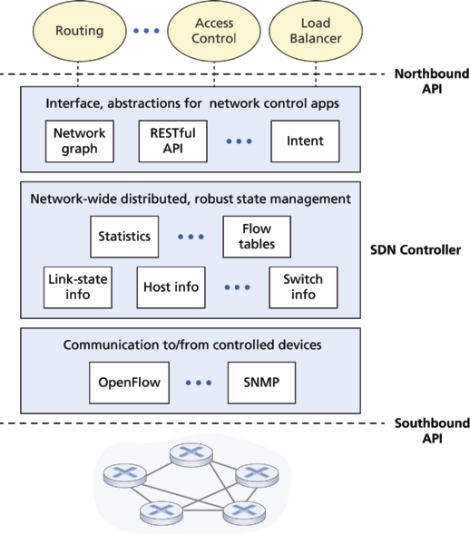

Figure 5.15 Components of an SDN controller

table contains counters whose values might also be profitably used by network-control applications; these values should thus be available to the applications. Since the ultimate aim of the control plane is to determine flow tables for the various controlled devices, a controller might also maintain a copy of these tables. These pieces of information all constitute examples of the network-wide “state” maintained by the SDN controller.

• The interface to the network-control application layer. The controller interacts with network-control applications through its “northbound” interface.

This API allows network-control applications to read/write network state and flow tables within the state-management layer. Applications can register to be notified when state-change events occur, so that they can take actions in response to network event notifications sent from SDNcontrolled devices. Different types of APIs may be provided; we’ll see that two popular SDN controllers communicate with their applications using a REST [Fielding 2000] request-response interface.

We have noted several times that an SDN controller can be considered to be “logically centralized,” that is, that the controller may be viewed externally (for example, from the point of view of SDN-controlled devices and external network-control applications) as a single, monolithic service. However, these services and the databases used to hold state information are implemented in practice by a distributed set of servers for fault tolerance, high availability, or for performance reasons.

With controller functions being implemented by a set of servers, the semantics of the controller’s internal operations (e.g., maintaining logical time ordering of events, consistency, consensus, and more) must be considered [Panda 2013; Ferguson 2021]. Such concerns are common across many different distributed systems; see [Lamport 1989, Lampson 1996] for elegant solutions to these challenges. Modern controllers such as ONOS [ONOS 2025] and ORION [Ferguson 2021] (see sidebar) have placed considerable emphasis on architecting a logically centralized but physically distributed controller platform that provides scalable services and high availability to the controlled devices and network-control applications alike.

The architecture depicted in Figure 5.15 closely resembles the architecture of the originally proposed NOX controller in 2008 [Gude 2008], as well as that of today’s controllers (see sidebar). We’ll cover an example of controller operation in Section 5.5.3. First, however, let’s examine the OpenFlow protocol, the earliest and now one of several protocols that can be used for communication between an SDN controller and a controlled device, which lies in the controller’s communication layer.

##### 5.5.2 OpenFlow Protocol

The OpenFlow protocol [OpenFlow 2025] operates between an SDN controller and an SDN-controlled switch or other device implementing the OpenFlow API that we studied earlier in Section 4.4. The OpenFlow protocol operates over TCP, with a default port number of 6653.

Among the important messages flowing from the controller to the controlled switch are the following:

• Configuration. This message allows the controller to query and set a switch’s configuration parameters.

• Modify-State. This message is used by a controller to add/delete or modify entries in the switch’s flow table, and to set switch port properties.

• Read-State. This message is used by a controller to collect statistics and counter values from the switch’s flow table and ports.

• Send-Packet. This message is used by the controller to send a specific packet out of a specified port at the controlled switch. The message itself contains the packet to be sent in its payload.

Among the messages flowing from the SDN-controlled switch to the controller are the following:

• Flow-Removed. This message informs the controller that a flow table entry has been removed, for example by a timeout or as the result of a received modify-state message.

• Port-status. This message is used by a switch to inform the controller of a change in port status.

• Packet-in. Recall from Section 4.4 that a packet arriving at a switch port and not matching any flow table entry is sent to the controller for additional processing. Matched packets may also be sent to the controller, as an action to be taken on a match. The packet-in message is used to send such packets to the controller.

##### 5.5.3 Data and Control Plane Interaction: An Example

In order to solidify our understanding of the interaction between SDN-controlled switches and the SDN controller, let’s consider the example shown in Figure 5.16, in which Dijkstra’s algorithm (which we studied in Section 5.2) is used to determine shortest path routes. The SDN scenario in Figure 5.16 has two important differences from the earlier per-router-control scenario of Sections 5.2.1 and 5.3, where Dijkstra’s algorithm was implemented in each and every router and link-state updates were flooded among all network routers:

• Dijkstra’s algorithm is executed as a separate application, outside of the packet switches.

• Packet switches send link updates to the SDN controller and not to each other.

In this example, let’s assume that the link between switch s1 and s2 goes down; that shortest path routing is implemented, and consequently and that incoming and outgoing flow forwarding rules at s1, s3, and s4 are affected, but that s2’s operation is unchanged. Let’s also assume that OpenFlow is used as the communication layer protocol, and that the control plane performs no other function other than link-state routing.

1.  Switch s1, experiencing a link failure between itself and s2, notifies the SDN controller of the link-state change using the OpenFlow port-status message.

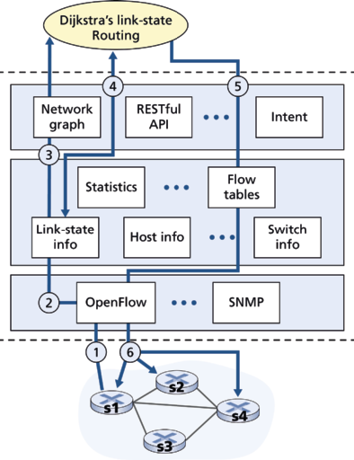

Figure 5.16 SDN controller scenario: Link-state change

2.  The SDN controller receives the OpenFlow message indicating the linkstate change, and notifies the link-state manager, which updates a linkstate database.

3.  The network-control application that implements Dijkstra’s link-state routing has previously registered to be notified when link state changes.

That application receives the notification of the link-state change.

4.  The link-state routing application interacts with the link-state manager to get updated link state; it might also consult other components in the statemanagement layer. It then computes the new least-cost paths.

5.  The link-state routing application then interacts with the flow table manager, which determines the flow tables to be updated.

6.  The flow table manager then uses the OpenFlow protocol to update flow table entries at affected switches—s1 (which will now route packets destined to s2 via s4), s2 (which will now begin receiving packets from s1 via intermediate switch s4), and s4 (which must now forward packets from s1 destined to s2).

This example is simple but illustrates how the SDN control plane provides control-plane services (in this case, network-layer routing) that had been previously implemented with per-router control exercised in each and every network router. One can now easily appreciate how an SDN-enabled ISP could easily switch from least-cost path routing to a more hand-tailored approach to routing.

Indeed, since the controller can tailor the flow tables as it pleases, it can implement  any form of forwarding that it pleases—simply by changing its application-control software. This ease of change should be contrasted to the case of a traditional per-router control plane, where software in all routers (which might be provided to the ISP by multiple independent vendors) must be changed.

Principles in Practice SDN Controller Case Studies:

The ONOS and Orion Controllers In the earliest days of SDN, there was a single SDN protocol (OpenFlow [McKeown 2008; OpenFlow 2025]) and a single SDN controller (NOX [Gude 2008]). Since then, the number of SDN controllers in particular has grown significantly [Kreutz 2015].

Some SDN controllers are company-specific and proprietary, particularly when used to control internal proprietary networks (e.g., within or among a company’s data centers).

In this sidebar we describe two SDN controllers that demonstrate how the principle of a logically centralized is implemented in practice.

The ONOS Controller

® Open Network Operating System (ONOS ) [ONOS 2025] is an open-source SDN

controller created, distributed, and supported by the Open Networking Foundation [OpenNetworking 2025].

Figure 5.17 ONOS controller architecture

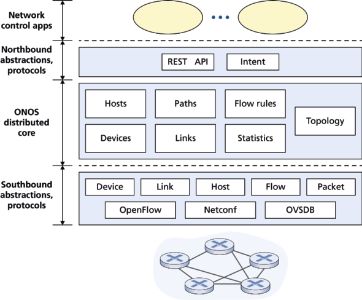

Figure 5.17 presents a simplified view of the ONOS controller Similar to the canonical controller in Figure 5.15, three layers can be identified in the ONOS controller: • Northbound abstractions and protocols. A unique feature of ONOS is its intent framework, which allows an application to request a high-level service (e.g., to setup a connection between host A and Host B, or conversely to not allow Host A and host B to communicate) without having to know the details of how this service is performed. State information is provided to network-control applications across the northbound API either synchronously (via query) or asynchronously (via listener callbacks, e.g., when network state changes). • Distributed core. The state of the network’s links, hosts, and devices is maintained in ONOS’s distributed core. ONOS is deployed as a service on a set of interconnected servers, with each server running an identical copy of the ONOS software; an increased number of servers offers an increased service capacity. The ONOS core provides the mechanisms for service replication and coordination among instances, providing the applications above and the network devices below with the abstraction of logically centralized core services. • Southbound abstractions and protocols. The southbound abstractions mask the heterogeneity of the underlying hosts, links, switches, and protocols, allowing the distributed core to be both device and protocol agnostic. Because of this abstraction, the southbound interface below the distributed core is logically higher than in our canonical controller in Figure 5.14. Orion Orion [Ferguson 2021] is the second-generation SDN platform used to control Google’s Jupiter datacenter networks [Singh 2015] as well as the internal B4 wide-area network [Jain 2013] that globally connects these data centers. Figure 5.18 presents of high-level view of Orion. Orion’s overall structure and context are remarkably similar to that of ONOS, shown in Figure 5.17. Indeed, the Orion creators note [Ferguson 2021] how the “architecture of Orion . . . maps to the textbook ONF view” [ONF 2013]. We see the Orion SDN core at the center of Figure 7.18, with a northbound interface to the Orion apps, and a southbound interface to the Orioncontrolled routers and switches. But we can find many important differences from ONOS beneath this common high-level view.

Each Google network is divided into one or more domains, with an Orion SDN controller instance being responsible for managing and controlling the devices within its domain. The use of domains purposefully limits the scope and impact of any failures, as well as the amount of work that must be performed by an Orion controller.

At the heart of the Orion core is the Network Information Base (NIB). The NIB is a logically centralized data store, coupled with a data-driven publication/ subscribe (pub/sub) system for that allows Orion apps and core components to read/write NIB data, as well as receive notifications when NIB data changes. A logically centralized data store also has the advantage of globally ordering network events, which significantly helps with debugging and trouble-shooting problems.

[Ferguson 2021] notes “Based on years of experience, the NIB has been one of our most successful design elements.” An Orion MIB can process roughly a million read/write events per second.

The following components, implemented as microservices, are found in the Orion core:

• The Topology Manager maintains the state of the links, routers and switches in the Orion controller’s domain. It also queries and receives runtime port statistics.

• The Config Manager configures components in the Orion controller’s domain by setting configuration parameter properties in the MIB table. The Config Manager can also check and validate configurations for correctness.

• The Flow Manager ensures that the intended network state and behavior registered by apps in the NIB matches with the collective state reported by the controlled devices, and performs flow state reconciliation, as needed.

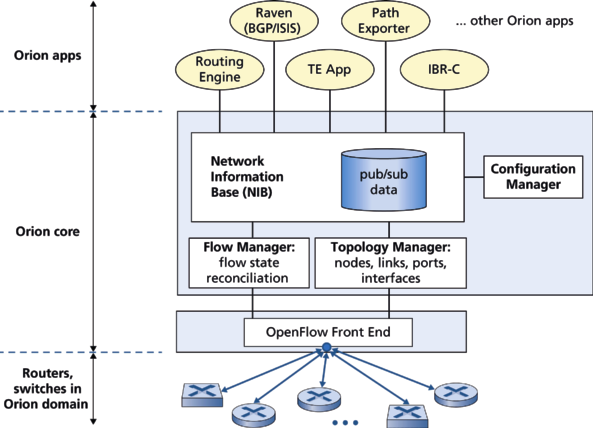

Figure 5.18 Google’s Orion SDN

The Orion apps sit above the Orion core and interact with each other and with other Orion components via the NIB. The Routing Engine is the intra-domain routing app, and provides the abstracted topology and reachability information needed by interdomain routing apps, e.g., Raven, and datacenter spline routing apps, e.g., IBR-C. The TE app shown in Figure 7.18 performs traffic engineering and the Path Exporter app exports data-plane state to services outside of Orion.

Orion enables an approach to network management and control known as intent-based networking. [Ferguson 2021] notes that “Intent-based networks specify management or design changes by describing the new intended end-state of the network (the “what”) rather than prescribing the sequence of modification to bring the network to that end-state (the “how”).For example, the intended network topology is specified in terms of an abstract model [Mogul 2020]. This is high-level intent and is authoritative in that it then requires that lower-level network apps (e.g., link activation, routing apps) to monitor, set and change their configurations so that this high-level intent is met. Intent thus propagates top-down and remains stable of longer time scales; network state, and the changes needed to reconcile network state with high-level intent occur bottom up and change more rapidly as network conditions change. Intent, configuration settings, and monitored device state are all stored in NIB, and the NIB’s pub/sub mechanism is used to notify apps when they need to take actions in response to a changed NIB value. For a discussion of Orion’s intent-based networking, see [Ferguson 2021].

##### 5.5.4 SDN: Past and Future

Although the intense interest in SDN is a relatively recent phenomenon, a number of SDN’s technical roots—the separation of the data and control planes in particular—go back considerably further. The ARPAnet, the ancestor of today’s Internet, purposefully emphasized a decentralized protocol-based approach to network control. However, two other data networks from the early 1970’s fully embraced centralized control and a clear separation of data and control planes.

TYMNET I [Tymes 1981] was a virtual-circuit data network that had a centralized controller with a physically separate tree-based control network connecting the control portions of TYMNET nodes to the centralized controller at the root of the tree. The data-plane of TYMNET I nodes, however, could be connected in an arbitrary mesh topology. AT&T’s Spider network [Fraser 1993] also had a clear data/control-plane separation, with a dedicated virtual circuit reserved for sending control message to/from a node and the centralized controller.

In the 1990s and into the 2000s, data/control plane separation again came to the forefront. [van der Merwe 1998] describes a control framework for ATM networks [Black 1995] with multiple controllers, each controlling a number of ATM switches. In 2004, [Feamster 2004; Lakshman 2004; RFC 3746] all argued for the separation of the network’s data and control planes. In addition to logically centralized control and data/control plane separation, other attributes often associated with SDN include network virtualization, softwareization, and programmability. [Feamster 2014; Anenousis 2021] both delve into the history of the concepts underlying SDN.

The Ethane project [Casado 2007] pioneered the notion of a network of simple flow-based Ethernet switches with match-plus-action flow tables, a centralized controller that managed flow admission and routing, and the forwarding of unmatched packets from the switch to the controller. A network of more than 300 Ethane switches was operational in 2007. Ethane quickly evolved into the OpenFlow project, and the rest (as the saying goes) is history!

Numerous research efforts are aimed at developing future SDN architectures and capabilities. As we have seen, the SDN revolution is leading to the disruptive replacement of dedicated monolithic switches and routers (with both data and control planes) by simple commodity switching hardware and a sophisticated software control plane. A generalization of SDN known as network functions virtualization (NFV) (which we discussed earlier in Section 4.5) similarly aims at disruptive replacement of sophisticated middleboxes (such as middleboxes with dedicated hardware and proprietary software for media caching/service) with simple commodity servers, switching, and storage.

Another important challenge is to structure SDN controllers to be robust with respect to failures (e.g., router or computer crashes, loss of connectivity) and to be able to recover rapidly when failures do occur [Ferguson 2021; Krentsel 2024].

#### 5.6 ICMP: The Internet Control Message Protocol

The Internet Control Message Protocol (ICMP), specified in [RFC 792], is used by hosts and routers to communicate network-layer information to each other.

The most typical use of ICMP is for error reporting. For example, when running an HTTP session, you may have encountered an error message such as “Destination network unreachable.” This message had its origins in ICMP. At some point, an IP router was unable to find a path to the host specified in your HTTP request. That router created and sent an ICMP message to your host indicating the error.

ICMP is often considered part of IP, but architecturally it lies just above IP, as ICMP messages are carried inside IP datagrams. That is, ICMP messages are carried as IP payload, just as TCP or UDP segments are carried as IP payload.

Similarly, when a host receives an IP datagram with ICMP specified as the upper-layer protocol (an upper-layer protocol number of 1), it demultiplexes the datagram’s contents to ICMP, just as it would demultiplex a datagram’s content to TCP or UDP.

ICMP messages have a type and a code field, and contain the header and the first 8 bytes of the IP datagram that caused the ICMP message to be generated in the first place (so that the sender can determine the datagram that caused the error).Selected ICMP message types are shown in Figure 5.19. Note that ICMP messages are used not only for signaling error conditions.

The well-known ping program sends an ICMP type 8 code 0 message to the specified host. The destination host, seeing the echo request, sends back a type 0 code 0 ICMP echo reply. Most TCP/IP implementations support the ping server directly in the operating system; that is, the server is not a process.

Chapter 11 of [Stevens 1990] provides the source code for the ping client program. Note that the client program needs to be able to instruct the operating system to generate an ICMP message of type 8 code 0.

In Chapter 1, we introduced the Traceroute program, which allows us to trace a route from a host to any other host in the world. Interestingly, Traceroute is implemented with ICMP messages. To determine the names and addresses of the routers between source and destination, Traceroute in the source sends a series of ordinary IP datagrams to the destination. Each of these datagrams carries a UDP segment with an unlikely UDP port number. The first of these datagrams has a TTL of 1, the second of 2, the third of 3, and so on. The source also starts timers for each of the datagrams. When the nth datagram arrives at the nth

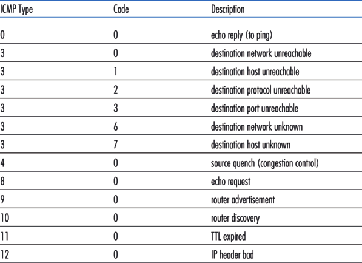

Figure 5.19 ICMP message types

router, the nth router observes that the TTL of the datagram has just expired.

According to the rules of the IP protocol, a router must discard a datagram when the datagram’s TTL has expired. In addition, the router typically sends an ICMP warning message to the source (type 11 code 0). This warning message includes the name of the router and its IP address. When this ICMP message arrives back at the source, the source obtains the round-trip time from the timer and the name and IP address of the nth router from the ICMP message.

How does a Traceroute source know when to stop sending UDP segments?

Recall that the source increments the TTL field for each datagram it sends. Thus, one of the datagrams will eventually make it all the way to the destination host.

Because this datagram contains a UDP segment with an unlikely port number, the destination host sends a port unreachable ICMP message (type 3 code 3) back to the source. When the source host receives this particular ICMP message, it knows it does not need to send additional probe packets. (The standard Traceroute program actually sends sets of three packets with the same TTL;

thus, the Traceroute output provides three results for each TTL.) In this manner, the source host learns the number and the identities of routers that lie between it and the destination host and the round-trip time between the two hosts. Note that the Traceroute client program must be able to instruct the operating system to generate UDP datagrams with specific TTL values and must also be able to be notified by its operating system when ICMP messages arrive. Now that you understand how Traceroute works, you may want to go back and play with it some more.

A new version of ICMP has been defined for IPv6 in RFC 4443. In addition to reorganizing the existing ICMP type and code definitions, ICMPv6 also added new types and codes required by the new IPv6 functionality. These include the “Packet Too Big” type and an “unrecognized IPv6 options” error code.

#### 5.7 Network Management and SNMP, NETCONF/YANG

Having now made our way to the end of our study of the network layer, with only the link-layer before us, we’re well aware that a network consists of many complex, interacting pieces of hardware and software—from the links, switches, routers, hosts, and other devices that comprise the physical components of the network to the many protocols that control and coordinate these devices. When hundreds or thousands of such components are brought together by an organization to form a network, the job of the network administrator to keep the network “up and running” is surely a challenge. We saw in Section 5.5 that the logically centralized controller can help with this process in an SDN context. But the challenge of network management has been around long before SDN, with a rich set of network management tools and approaches that help the network administrator monitor, manage, and control the network. We’ll study these tools and techniques in this section, as well as new tools and techniques that have co-evolved along with SDN.

An often-asked question is “What is network management?” A wellconceived, single-sentence (albeit a rather long run-on sentence) definition of network management from [Saydam 1996] is:

Network management includes the deployment, integration, and coordination of the hardware, software, and human elements to monitor, test, poll, configure, analyze, evaluate, and control the network and element resources to meet the real-time, operational performance, and Quality of Service requirements at a reasonable cost.

Given this broad definition, we’ll cover only the rudiments of network management in this section—the architecture, protocols, and data used by a network administrator in performing their task. We’ll not cover the administrator’s decision-making processes, where topics such as fault identification [Labovitz 1997; Steinder 2002; Feamster 2005; Wu 2005; Teixeira 2006], anomaly detection [Lakhina 2005; Barford 2009], network design/engineering to meet contracted Service Level Agreements (SLA’s) [Huston 1999a], and more come into consideration. Our focus is thus purposefully narrow; the interested reader should consult these references, the excellent overviews in [Subramanian 2000; Schonwalder 2010; Claise 2019], and the more detailed treatment of network management available on the Web site for this text.

##### 5.7.1 The Network Management Framework

Figure 5.20 shows the key components of network management:

• Managing server. The managing server is an application, typically with network  managers (humans) in the loop, running in a centralized  network management station in the network operations center (NOC).The managing server is the locus of activity for network management: it controls the collection, processing, analysis, and dispatching of network management information and commands. It is here that actions are initiated to configure, monitor, and control the network’s managed devices.

In practice, a network may have several such managing servers.

• Managed device. A managed device is a piece of network equipment (including its software) that resides on a managed network. A managed device might be a host, router, switch, middlebox, modem, thermometer, or other network-connected device. The device itself will have many manageable components (e.g., a network interface is but one component of a host or router), and configuration parameters for these hardware and software components (e.g., an intra-AS routing protocol, such as OSPF).

• Data. Each managed device will have data, also known as “state,” associated with it. There are several different types of data. Configuration data is device information explicitly configured by the network manager, for example, a manager-assigned/configured IP address or interface speed for a device interface. Operational data is information that the device acquires as it operates, for example, the list of immediate neighbors in OSPF protocol. Device statistics are status indicators and counts that are updated as the device operators (e.g., the number of dropped packets on an interface, or the device’s cooling fan speed).The network manager can query remote device data, and in some cases, control the remote device by writing device data values, as discussed below.

As shown in Figure 5.20, the managing server also maintains its own copy of configuration, operational and statistics data from its managed devices as well as networkwide data (e.g., the network’s topology).

• Network management agent. The network management agent is a software process running in the managed device that communicates with the managing server, taking local actions at the managed device under the command and control of the managing server. The network management agent is similar to the routing agent that we saw in Figure 5.2.

• Network management protocol. The final component of a network management framework is the network management protocol. This protocol runs between the managing server and the managed devices, allowing the managing server to query the status of managed devices and take actions at these devices via its agents. Agents can use the network management protocol to inform the managing server of exceptional events (e.g., component failures or violation of performance thresholds). It’s important to note that the network management protocol does not itself manage the network. Instead, it provides capabilities that network managers can use to manage (“monitor, test, poll, configure, analyze, evaluate, and control”) the network. This is a subtle, but important, distinction.

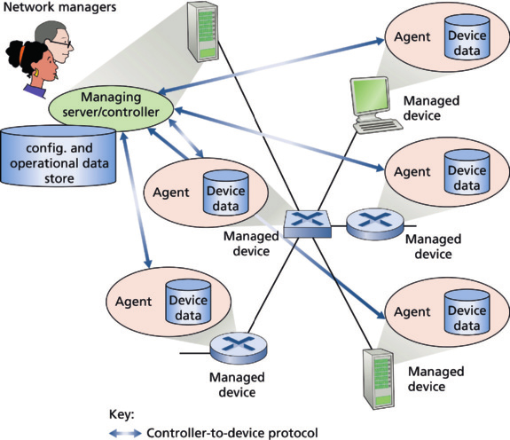

Figure 5.20 Elements of network management

In practice, there are three commonly used ways in a network operator can manage the network, using the components described above:

• CLI. A network operator may issue direct Command Line Interface (CLI) commands to the device. These commands can be typed directly on a managed device’s console (if the operator is physically present at the device), or over a Telnet or secure shell (SSH) connection, possibly via scripting, between the managing server/controller and the managed device. CLI commands are vendor- and device-specific and can be rather arcane. While seasoned network wizards may be able to use CLI to flawlessly configure network devices, CLI use is prone to errors, and it is difficult to automate or efficiently scale for large networks. Consumer-oriented network devices, such as your wireless home router, may export a management menu that you (the network manager!) can access via HTTP to configure that device.

While this approach may work well for single, simple devices and is less error-prone than CLI, it also doesn’t scale to larger-sized networks.

• SNMP/MIB. In this approach, the network operator can query/set the data contained in a device’s Management Information Base (MIB) objects using the Simple Network Management Protocol (SNMP). Some MIBs are device- and vendor-specific, while other MIBs (e.g., the number of IP datagrams discarded at a router due to errors in an IP datagram header, or the number of UDP segments received at a host) are device-agnostic, providing abstraction and generality. A network operator would most typically use this approach to query and monitor operational state and device statistics, and then use CLI to actively control/configure the device. We note, importantly, that both approaches manage devices individually. We’ll cover the SNMP and MIBs, which have been in use since the late 1980s, in Section 5.7.2 below. A network-management workshop convened by the Internet Architecture Board in 2002 [RFC 3535] noted not only the value of the SNMP/MIB approach for device monitoring but also noted its shortcomings, particularly for device configuration and network management at scale. This gave rise to the most recent approach for network management, using NETCONF and YANG.

• NETCONF/YANG. The NETCONF/YANG approach takes a more abstract, network-wide, and holistic view toward network management, with a much stronger emphasis on configuration management, including specifying correctness constraints and providing atomic management operations over multiple controlled devices. YANG [RFC 6020] is a data modeling language used to model configuration and operational data.

The  NETCONF protocol [RFC 6241] is used to communicate YANGcompatible actions and data to/from/among remote devices.

##### 5.7.2 The Simple Network Management Protocol (SNMP) and the Management Information Base (MIB)

The Simple Network Management Protocol version 3 (SNMPv3) [RFC 3410] is an application-layer protocol used to convey network-management control and information messages between a managing server and an agent executing on behalf of that managing server. The most common usage of SNMP is in a request-response mode in which an SNMP managing server sends a request to an SNMP agent, who receives the request, performs some action, and sends a reply to the request. Typically, a request will be used to query (retrieve) or modify (set) MIB object values associated with a managed device. A second common usage of SNMP is for an agent to send an unsolicited message, known as a trap message, to a managing server. Trap messages are used to notify a managing server of an exceptional situation (e.g., a link interface going up or down) that has resulted in changes to MIB object values.

MIB objects are specified in a data description language known as SMI (Structure of Management Information) [RFC 2578; RFC 2579; RFC 2580], a rather oddly named component of the network management framework whose name gives no hint of its functionality.A formal definition language is used to ensure that the syntax and semantics of the network management data are well defined and unambiguous. Related MIB objects are gathered into MIB modules.

As of late 2024, there are more than 400 MIB-related RFCs and a much larger number of vendor-specific (private) MIB modules.

SNMPv3 defines seven types of messages, known generically as protocol data units—PDUs—as shown in Table 5.2 and described below.

GetRequest GetNextRequest, GetBulkRequest • The , and PDUs are

all sent from a managing server to an agent to request the value of one or more MIB objects at the agent’s managed device. The MIB objects whose values are being requested are specified in the variable binding portion of GetRequest GetNextRequest GetBulkRequest the PDU. , , and differ

Table 5.2 SNMPv3 PDU types SNMPv3 PDU Type Sender-receiver Description

GetRequest manager-to-agent get value of one or more MIB object instances

GetNextRequest manager-to-agent get value of next MIB object instance in list or table

GetBulkRequest manager-to-agent get values in large block of data, for example, values in a large table

InformRequest manager-to-manager inform remote managing entity of MIB values remote to its access

SetRequest manager-to-agent set value of one or more MIB object instances

Response agent-to-manager or generated in response to

manager-to-manager GetRequest, GetNextRequest, GetBulkRequest, SetRequest PDU, or

InformRequest

SNMPv2-Trap agent-to-manager inform manager of an exceptional event # GetRequest in the granularity of their data requests. can request an arbi-

GetNextRequest trary set of MIB values; multiple s can be used to GetBulkRequest sequence through a list or table of MIB objects; allows

a large block of data to be returned, avoiding the overhead incurred if GetRequest GetNextRequest multiple or messages were to be sent. In Response PDU all three cases, the agent responds with a containing the

object identifiers and their associated values.

SetRequest • The PDU is used by a managing server to set the value of

one or more MIB objects in a managed device. An agent replies with a Response PDU with the “noError” error status to confirm that the value has indeed been set.

InformRequest • The PDU is used by a managing server to notify another

managing server of MIB information that is remote to the receiving server.

Response PDU • The is typically sent from a managed device to the manag-

ing server in response to a request message from that server, returning the requested information.

• The final type of SNMPv3 PDU is the trap message. Trap messages are generated asynchronously; that is, they are not generated in response to a received request but rather in response to an event for which the managing server requires notification. RFC 3418 defines well-known trap types that include a cold or warm start by a device, a link going up or down, the loss of a neighbor, or an authentication failure event. A received trap request has no required response from a managing server.

Given the request-response nature of SNMP, it is worth noting here that although SNMP PDUs can be carried via many different transport protocols, the SNMP PDU is typically carried in the payload of a UDP datagram. Indeed, RFC 3417 states that UDP is “the preferred transport mapping.” However, since UDP is an unreliable transport protocol, there is no guarantee that a request, or its response, will be received at the intended destination. Interestingly, SNMP standard does not mandate any particular procedure for retransmission, or even if retransmission is to be done in the first place. It only requires that the managing server “needs to act responsibly in respect to the frequency and duration of retransmissions.” This, of course, leads one to wonder how a “responsible” protocol should act!

SNMP has evolved through three versions. The designers of SNMPv3 have said that “SNMPv3 can be thought of as SNMPv2 with additional security and administration capabilities” [RFC 3410]. Certainly, there are changes in SNMPv3 over SNMPv2, but nowhere are those changes more evident than in the area of administration and security. The central role of security in SNMPv3 was particularly important, since the lack of adequate security resulted in SNMP being used primarily for monitoring rather than control (for SetRequest example, is rarely used in SNMPv1). Once again, we see that

security—a topic we’ll cover in detail in Chapter 8 — is of critical concern, but once again a concern whose importance had been realized perhaps a bit late and only then “added on.” The Management Information Base (MIB) We learned earlier that a managed device’s operational state data (and to some extent its configuration data) in the SNMP/MIB approach to network management are represented as objects that are gathered together into an MIB for that device. An MIB object might be a counter, such as the number of IP datagrams discarded at a router due to errors in an IP datagram header; or the number of carrier sense errors in an Ethernet interface card; descriptive information such as the version of the software running on a DNS server; status information such as whether a particular device is functioning correctly; or protocol-specific information such as a routing path to a destination. Related MIB objects are gathered into MIB modules. There are over 400 MIB modules defined in various IETC RFC’s; there are many more device- and vendor-specific MIBs. [RFC 4293] specifies the MIB module that defines managed objects (including ipSystemStatsInDelivers) for managing implementations of the Internet Protocol (IP) and its associated Internet Control Message Protocol (ICMP). [RFC 4022] specifies the MIB module for TCP, and [RFC 4113] specifies the MIB module for UDP.

While MIB-related RFCs make for rather tedious and dry reading, it is nonetheless instructive (i.e., like eating vegetables, it is “good for you”) to con-

ipSystem-StatsInDelivers sider an example of a MIB object, The object-type definition from [RFC 4293] defines a 32-bit read-only counter that keeps track of the number of IP datagrams that were received at the managed device and were successfully delivered to an upper-layer protocol. In the example below, Counter32 is one of the basic data types defined in the SMI.

ipSystemStatsInDelivers OBJECT-TYPE SYNTAX Counter32 MAX-ACCESS read-only STATUS current

DESCRIPTION “The total number of datagrams successfully delivered to IPuser-protocols (including ICMP).

...

::= { ipSystemStatsEntry 18 }

##### 5.7.3 The Network Configuration Protocol (NETCONF) and YANG

The NETCONF protocol operates between the managing server and the managed network devices, providing messaging to (i) retrieve, set, and modify configuration data at managed devices; (ii) to query operational data and statistics at managed devices; and (iii) to subscribe to notifications generated by managed devices. The managing server actively controls a managed device by sending it configurations, which are specified in a structured XML document, and activating a configuration at the managed device. NETCONF uses a remote procedure call (RPC) paradigm, where protocol messages are also encoded in XML and exchanged between the managing server and a managed device over a secure, connection-oriented session such as the TLS (Transport Layer Security) protocol (discussed in Chapter 8) over TCP.

Figure 5.21 shows an example NETCONF session. First, the managing server establishes a secure connection to the managed device. (In NETCONF parlance, the managing server is actually referred to as the “client” and the managed device as the “server,” since the managing server establishes the connection to the managed device. But we’ll ignore that here for consistency with the longer-standing network-management server/client terminology shown in Figure 5.20.) Once a secure connection has been established, the managing server and the managed device exchange <hello> messages, declaring their “capabilities”—NETCONF functionality that supplements the base NETCONF specification in [RFC 6241]. Interactions between the managing server and managed device take the form of a remote procedure call, using the <rpc> and <rpc-response> messages. These messages are used to retrieve, set, query and modify device configurations, operational data and statistics, and to

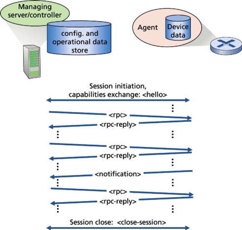

Figure 5.21 NETCONF session between managing server/controller and managed device

Table 5.3 Selected NETCONF operations NETCONF Operation Description

<get-config> Retrieve all or part of a given configuration. A device may have multiple configurations. There is always running/ a configuration that describes the devices current (running) configuration.

<get> Retrieve all or part of both configuration state and operational state data.

<edit-config> Change all or part of a specified configuration at the managed device. If the running/configuration is specified, then the device’s current (running) configuration will be changed. If the managed device was able to satisfy the request, an <rpc-reply> is sent containing an <ok> element; otherwise <rpc-error> response is returned. On error, the device’s configuration state can be roll-ed-back to its previous state.

<lock>, <unlock> The <lock> (<unlock>) operation allows the managing server to lock (unlock) the entire configuration datastore system of a managed device. Locks are intended to be short-lived and allow a client to make a change without fear of interaction with other NETCONF, SNMP, or CLIs commands from other sources.

<create- This operation initiates an event notification subscription that will send asynchronous event subscription>, <notification> for specified events of interest from the managed device to the managing server, until the <notification> subscription is terminated.

subscribe to device notifications. Device notifications themselves are proactively sent from managed device to the managing server using NETCONF <notification> messages. A session is closed with the <session-close message>.

Table 5.3 shows a number of the important NETCONF operations that a managing server can perform at a managed device. As in the case of SNMP, we see operations for retrieving operational state data (<get>), and for event notification. However, the <get-config>, <edit-config>, <lock> and <unlock> operation demonstrate NETCONF’s particular emphasis on device configuration. Using the basic operations shown in Table 5.3, it is also possible to create a set of more sophisticated network management transactions that either complete atomically (i.e., as a group) and successfully on a set of devices, or are fully reversed and leave the devices in their pre-transaction state. Such multidevice transactions—“enabl[ing] operators to concentrate on the configuration of the network as a whole rather than individual devices” was an important operator requirement put forth in [RFC 3535].

A full description of NETCONF is beyond our scope here; [RFC 6241, RFC 5277, Claise 2019; Schonwalder 2010] provide more in-depth coverage.

YANG YANG is the data modeling language used to precisely specify the structure, syntax, and semantics of network management data used by NETCONF, in much the same way that the SMI is used to specify MIBs in SNMP. All YANG definitions are contained in modules, and an XML document describing a device and its capabilities can be generated from a YANG module.

YANG features a small set of built-in data types (as in the case of SMI) and also allows data modelers to express constraints that must be satisfied by a valid NETCONF configuration—a powerful aid in helping ensure that NET- CONF configurations satisfy specified correctness and consistency constraints.

YANG is also used to specify NETCONF notifications.

A fuller discussion of YANG is beyond our scope here. For more information, we refer the interested reader to the excellent book [Claise 2019].

#### 5.8 Summary

We have now completed our two-chapter journey into the network core—a journey that began with our study of the network layer’s data plane in Chapter 4 and finished here with our study of the network layer’s control plane. We learned that the control plane is the network-wide logic that controls not only how a datagram is forwarded among routers along an end-to-end path from the source host to the destination host, but also how network-layer components and services are configured and managed.

We learned that there are two broad approaches towards building a control plane: traditional per-router control (where a routing algorithm runs in each and every router and the routing component in the router communicates with the routing components in other routers) and software-defined networking (SDN) control (where a logically centralized controller computes and distributes the forwarding tables to be used by each and every router).We studied two fundamental routing algorithms for computing least cost paths in a graph—link-state routing and distance-vector routing—in Section 5.2; these algorithms find application in both per-router control and in SDN control. These algorithms are the basis for two widely deployed Internet routing protocols, OSPF and BGP, that we covered in Sections 5.3 and 5.4.We covered the SDN approach to the network-layer control plane in Section 5.5, investigating SDN networkcontrol applications, the SDN controller, and the OpenFlow protocol for communicating between the controller and SDN-controlled devices.

In Sections 5.6 and 5.7, we covered some of the nuts and bolts of managing an IP network: ICMP (the Internet Control Message Protocol) and network management using SNMP and NETCONF/YANG.

Having completed our study of the network layer, our journey now takes us one step further down the protocol stack, namely, to the link layer. Like the network layer, the link layer is part of each and every network-connected device.

But we will see in the next chapter that the link layer has the much more localized task of moving packets between nodes on the same link or LAN. Although this task may appear on the surface to be rather simple compared with that of the network layer’s tasks, we will see that the link layer involves a number of important and fascinating issues that can keep us busy for a long time.

Homework Problems and Questions Chapter 5 Review Questions are the data plane and the control plane implemented within the same device or in Section 5.1 separate devices? Explain.

R1.  What is meant by a control plane that is based on Section 5.2 per-router control? In such cases, when we say the network control and data planes are imple- R3.  Compare and contrast the properties of a cen-

mented “monolithically,” what do we mean? tralized and a distributed routing algorithm.

Give an example of a routing protocol that takes R2.  What is meant by a control plane that is based

a centralized and a decentralized approach. on logically centralized control? In such cases, R4.  Compare and contrast link-state and distancelayer, and the network-control application

vector routing algorithms. layer in an SDN controller.

R5.  What is the “count to infinity” problem in dis- R15.  Suppose you wanted to implement a new

tance vector routing? routing protocol in the SDN control plane. At which layer would you implement that proto- R6.  Is it necessary that every autonomous system col? Explain. use the same intra-AS routing algorithm?

R16.  What types of messages flow across an SDN Why or why not?

controller’s northbound and southbound Sections 5.3–5.4 APIs? Who is the recipient of these messages sent from the controller across the southbound R7.  Why are different inter-AS and intra-AS pro-

interface, and who sends messages to the contocols used in the Internet?

troller across the northbound interface? R8.  True or false: When an OSPF route sends its

R17.  Describe the purpose of two types of Openlink state information, it is sent only to those

Flow messages (of your choosing) that are sent nodes directly attached neighbors. Explain.

from a controlled device to the controller. R9.  What is meant by an area in an OSPF autono- Describe the purpose of two types of Openmous system? Why was the concept of an area flow messages (of your choosing) that are send introduced? from the controller to a controlled device. R10.  Define and contrast the following terms: R18.  What is the purpose of the service abstraction subnet, prefix, and BGP route. layer in the OpenDaylight SDN controller? R11.  How does BGP use the NEXT-HOP attribute?

How does it use the AS-PATH attribute? Sections 5.6–5.7

R12.  Describe how a network administrator of an R19.  Names four different types of ICMP messages upper-tier ISP can implement policy when R20.  What two types of ICMP messages are configuring BGP. received at the sending host executing the R13.  True or false: When a BGP router receives an T raceroute program? advertised path from its neighbor, it must add R21.  Define the following terms in the context of its own identity to the received path and then SNMP: managing server, managed device, netsend that new path on to all of its neighbors. work management agent and MIB. Explain. R22.  What are the purposes of the SNMP  GetRequest

Section 5.5 and SetRequest messages?

R23.  What is the purpose of the SNMP trap message? R14.  Describe the main role of the communication layer, the network-wide state-management

Problems P1. Looking at Figure 5.3, enumerate the paths from y to u that do not contain any loops.

P2. Repeat Problem P1 for paths from x to z, z to u, and z to w.

P3. Consider the following network. With the indicated link costs, use Dijkstra’s shortest-path algorithm to compute the shortest path from x to all network nodes. Show how the algorithm works by computing a table similar to Table 5.1.

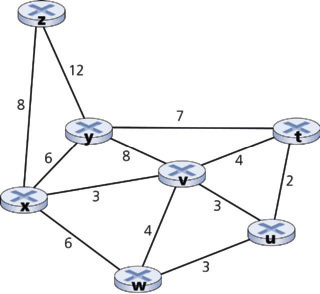

P4. Consider the network shown in Problem P3. Using Dijkstra’s algorithm, and showing your work using a table similar to Table 5.1, do the following:

a.  Compute the shortest path from t to all network nodes.

b.  Compute the shortest path from u to all network nodes.

c.  Compute the shortest path from v to all network nodes.

d.  Compute the shortest path from w to all network nodes.

e.  Compute the shortest path from y to all network nodes.

f.  Compute the shortest path from z to all network nodes.

P5. Consider the network shown below, and assume that each node initially knows the costs to each of its neighbors. Consider the distance-vector algorithm and show the distance table entries at node z.

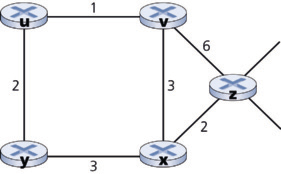

P6. Consider a general topology (that is, not the specific network shown above) and a synchronous version of the distance-vector algorithm. Suppose that at each iteration, a node exchanges its distance vectors with its neighbors and receives their distance vectors. Assuming that the algorithm begins with each node knowing only the costs to its immediate neighbors, what is the maximum number of iterations required before the distributed algorithm converges? Justify your answer.

P7. Consider the network fragment shown below. x has only two attached neighbors, w and y w .  has a minimum-cost path to destination u (not

shown) of 5, and y has a minimum-cost path to u of 6. The complete paths from w and y to u (and between w and y) are not shown. All link costs in the network have strictly positive integer values.

a.  Give x’s distance vector for destinations w y , , and u.

b.  Give a link-cost change for either c x w , or c x y , such that x will  

inform its neighbors of a new minimum-cost path to u as a result of

executing the distance-vector algorithm.

c.  Give a link-cost change for either c x w , or c x y ( , ) such that x will not 

inform its neighbors of a new minimum-cost path to u as a result of

executing the distance-vector algorithm.

P8. Consider the three-node topology shown in Figure 5.6. Rather than having the link costs shown in Figure 5.6, the link costs are c x y , = , 

c y z , = 6 , c z x , = 4 . Compute the distance tables after the initializa-  

tion step and after each iteration of a synchronous version of the distance-vector algorithm (as we did in our earlier discussion of Figure 5.6).

P9. Consider the count-to-infinity problem in the distance vector routing.

Will the count-to-infinity problem occur if we decrease the cost of a link?

Why? How about if we connect two nodes which do not have a link?

P10.  Argue that for the distance-vector algorithm in Figure 5.6, each value in the distance vector D x is non-increasing and will eventually stabilize 

in a finite number of steps.

P11.  Consider Figure 5.7. Suppose there is another router w, connected to

= router y and z. The costs of all links are given as follows: c x y ( , ) ,

= = = = c x z , 50 , c y w ( , ) 1 , c z w , 1 , c y z ( , ) 3 . Suppose that poi-  

soned reverse is used in the distance-vector routing algorithm.

a.  When the distance vector routing is stabilized, router w y ,  , and z

inform their distances to x to each other. What distance values do they

tell each other?

b.  Now suppose that the link cost between x and y increases to 60. Will there be a count-to-infinity problem even if poisoned reverse is used?

Why or why not? If there is a count-to-infinity problem, then how many iterations are needed for the distance-vector routing to reach a stable state again? Justify your answer.

c.  How do you modify c y z , such that there is no count-to-infinity 

problem at all if c y x , changes from 4 to 60? 

P12.  Describe how loops in paths can be detected in BGP.

P13.  Will a BGP router always choose the loop-free route with the shortest ASpath length? Justify your answer.

P14.  Consider the network shown below. Suppose AS3 and AS2 are running OSPF for their intra-AS routing protocol. Suppose AS1 and AS4 are running RIP for their intra-AS routing protocol. Suppose eBGP and iBGP are used for the inter-AS routing protocol. Initially suppose there is no physical link between AS2 and AS4.

a.  Router 3c learns about prefix x from which routing protocol: OSPF, RIP, eBGP, or iBGP?

b.  Router 3a learns about x from which routing protocol?

c.  Router 1c learns about x from which routing protocol?

d.  Router 1d learns about x from which routing protocol?

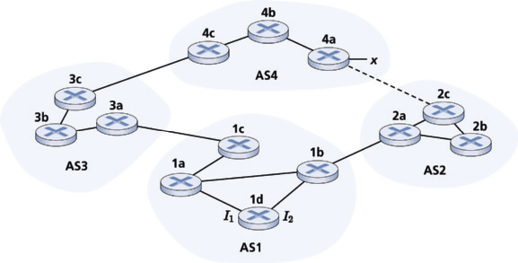

P15.  Referring to the previous problem, once router 1d learns about x it will put an entry x I , in its forwarding table. 

a.  Will I be equal to I or I for this entry? Explain why in one sentence. 1 2 b.  Now suppose that there is a physical link between AS2 and AS4, shown by the dotted line. Suppose router 1d learns that x is accessible via AS2 as well as via AS3. Will I be set to I or I ? Explain why in one 1 2 sentence.

c.  Now suppose there is another AS, called AS5, which lies on the path between AS2 and AS4 (not shown in diagram). Suppose router 1d learns that x is accessible via AS2 AS5 AS4 as well as via AS3 AS4.

Will I be set to I or I ? Explain why in one sentence. 1 2 P16.  Consider the following network. ISP B provides national backbone service to regional ISP A. ISP C provides national backbone service to regional ISP D. Each ISP consists of one AS. B and C peer with each other in two places using BGP. Consider traffic going from A to D. B would prefer to hand that traffic over to C on the West Coast (so that C would have to absorb the cost of carrying the traffic cross-country), while C would prefer to get the traffic via its East Coast peering point with B (so that B would have carried the traffic across the country). What BGP mechanism might C use, so that B would hand over A-to-D traffic at its East Coast peering point? To answer this question, you will need to dig into the BGP specification.

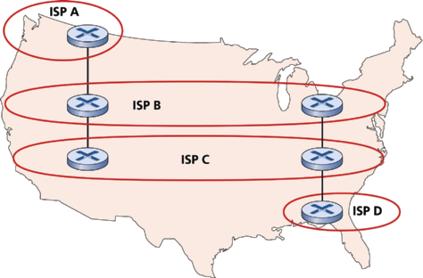

P17.  In Figure 5.13, consider the path information that reaches stub networks W, X, and Y. Based on the information available at W and X, what are their respective views of the network topology? Justify your answer. The topology view at Y is shown below.

P18.  Consider Figure 5.13. B would never forward traffic destined to Y via X based on BGP routing. But there are some very popular applications for which data packets go to X first and then flow to Y. Identify one such application, and describe how data packets follow a path not given by BGP routing.

P19.  In Figure 5.13, suppose that there is another stub network V that is a customer of ISP A. Suppose that B and C have a peering relationship, and A is a customer of both B and C. Suppose that A would like to have the traffic destined to W to come from B only, and the traffic destined to V from either B or C. How should A advertise its routes to B and C?

What AS routes does C receive?

P20.  Suppose ASs X and Z are not directly connected but instead are connected by AS Y. Further suppose that X has a peering agreement with Y, and that Y has a peering agreement with Z. Finally, suppose that Z wants to transit all of Y’s traffic but does not want to transit X’s traffic. Does BGP allow Z to implement this policy?

P21.  Consider the two ways in which communication occurs between a managing entity and a managed device: request-response mode and trapping. What are the pros and cons of these two approaches, in terms of (1) overhead, (2) notification time when exceptional events occur, and (3) robustness with respect to lost messages between the managing entity and the device?

P22.  In Section 5.7, we saw that it was preferable to transport SNMP messages in unreliable UDP datagrams. Why do you think the designers of SNMP chose UDP rather than TCP as the transport protocol of choice for SNMP?

Socket Programming Assignment 5: ICMP Ping At the end of Chapter 2, there are four socket protarget host. It works by sending ICMP “echo

gramming assignments. Here you will find a fifth request” packets (i.e., ping packets) to the target

assignment which employs ICMP, a protocol dishost and listening for ICMP “echo response” replies

cussed in this chapter. (i.e., pong packets). Ping measures the RRT, records

Ping is a popular networking application used packet loss, and calculates a statistical summary of

to test from a remote location whether a particular multiple ping-pong exchanges (the minimum,

host is up and reachable. It is also often used to mean, max, and standard deviation of the round-

measure latency between the client host and the trip times).

In this lab, you will write your own Ping applithe server side is built into almost all operating sys-

cation in Python. Your application will use ICMP. tems. You can find full details of this assignment, as

But in order to keep your program simple, you will well as important snippets of the Python code, at

not exactly follow the official specification in RFC the Web site http://www.pearsonhighered.com/

1739. Note that you will only need to write the client cs-resources.

side of the program, as the functionality needed on Programming Assignment: Routing In this programming assignment, you will be writ- • rtupdate0(struct rtpkt *rcvdpkt). This routine will

ing a “distributed” set of procedures that implebe called when node 0 receives a routing packet

ments a distributed asynchronous distance-vector that was sent to it by one of its directly connected

routing for the network shown below. neighbors. The parameter *rcvdpkt is a pointer to

You are to write the following routines that will the packet that was received. rtupdate0 is the

“execute” asynchronously within the emulated “heart” of the distance-vector algorithm. The

environment provided for this assignment. For values it receives in a routing update packet from

node 0, you will write the routines: some other node i contain i’s current shortest-

path costs to all other network nodes.rtupdate0 uses these received values to update its own distance table (as specified by the distance-vector algorithm).If its own minimum cost to another node changes as a result of the update, node 0 informs its directly connected neighbors of this change in minimum cost by sending them a routing packet.

Recall that in the distance-vector • rtinit0. This routine will be called once at the algorithm, only directly connected nodes will beginning of the emulation. rtinit0 has no exchange routing packets. Thus, nodes 1 and 2 arguments. It should initialize your distance will communicate with each other, but nodes 1 table in node 0 to reflect the direct costs of 1, 3, and 3 will not communicate with each other. and 7 to nodes 1, 2, and 3, respectively. In the figure above, all links are bidirectional and the Similar routines are defined for nodes 1, 2, and 3.

costs in both directions are identical. After ini- Thus, you will write eight procedures in all: rtinit0,

tializing the distance table and any other data rtinit1, rtinit2, rtinit3, rtupdate0, rtupdate1,

structures needed by your node 0 routines, it rtupdate2, and rtupdate3. These routines will

should then send its directly connected neightogether implement a distributed, asynchronous

bors (in this case, 1, 2, and 3) the cost of its mincomputation of the distance tables for the topology

imum-cost paths to all other network nodes. and costs shown in the figure on the preceding page.

This minimum-cost information is sent to You can find the full details of the program-

neighboring nodes in a routing update packet ming assignment, as well as C code that you will

by calling the routine tolayer2, as described in need to create the simulated hardware/software

the full assignment. The format of the routing environment, at http://www.pearsonhighered.

update packet is also described in the full com/cs-resource. A Java version of the assignment

assignment. is also available.

Wireshark Lab: ICMP In the Web site for this textbook, www.pearsonhighassignment that examines the use of the ICMP pro-

ered.com/cs-resources, you’ll find a Wireshark lab tocol in the ping and traceroute commands.

AN INTERVIEW WITH...


Jennifer Rexford Jennifer Rexford is the Provost of Princeton University, where she is also a Professor in the Computer Science department. Her research has the broad goal of making computer networks easier to design and manage, with particular emphasis on Courtesy of Jennifer Rexford programmable networks. Before joining the faculty at Princeton, she worked at AT&T for eight years, developing techniques and tools for network measurement, traffic engineering, and router configuration that were deployed in AT&T's backbone network. Jennifer is co-author of the books “Web Protocols and Practice: Networking Protocols, Caching, and Traffic Measurement” (Addison-Wesley, 2001) and “The Real Internet Architecture: Past, Present, and Future Evolution” (Princeton University Press, 2024). She served as the chair of ACM SIGCOMM

from 2003 to 2007. She received her BSE degree in electrical engineering from Princeton University, and her PhD degree in electrical engineering and computer science from the University of Michigan. Jennifer received the ACM Grace Murray Hopper Award, the ACM SIGCOMM Award, the IEEE Internet Award, and the IEEE Alexander Graham Bell Medal. She is an ACM Fellow, an IEEE Fellow, and a member of the National Academy of Engineering and the National Academy of Sciences.

Please describe one or two of the most exciting projects you have worked on during your career. What were the biggest challenges?

When I was a researcher at AT&T, a group of us designed a new way to manage routing in Internet Service Provider backbone networks. Traditionally, network operators configure each router individually, and these routers run distributed protocols to compute paths through the network. We believed that network management would be simpler and more flexible if network operators could exercise direct control over how routers forward traffic based on a network-wide view of the topology and traffic. The Routing Control Platform (RCP) we designed and built could compute the routes for all of AT&T’s backbone on a single commodity computer, and could control legacy routers without modification. To me, this project was exciting because we had a provocative idea, a working system, and ultimately a real deployment in an operational network. Fast forward a few years, and software-defined networking (SDN) has become a mainstream technology, and standard protocols (like standard protocols (like OpenFlow) and languages (like P4) have made it much easier to tell the underlying switches what to do.

How do you think software-defined networking should evolve in the future?

In a major break from the past, the software controlling network devices can be created by many different programmers, not just at companies selling network equipment. Yet, unlike the applications running on a server or a smart phone, SDN applications must work together to handle the same traffic. Network operators do not want to perform load balancing on some traffic and routing on other traffic;

instead, they want to perform load balancing and routing, together, on the same traffic. Future SDN platforms should offer good programming abstractions for composing independently written multiple applications together. More broadly, good programming abstractions can make it easier to create applications, without having to worry about low-level details like flow table entries, traffic counters, bit patterns in packet headers, and so on. Also, while an SDN controller is logically centralized, the network still consists of a distributed collection of devices. Future programmable networks should offer good abstractions for updating a distributed set of devices, so network administrators can reason about what happens to packets in flight while the devices are updated. Programming abstractions for programmable network is an exciting area for interdisciplinary research between computer networking, distributed systems, and programming languages, with a real chance for practical impact in the years ahead.

Where do you see the future of networking and the Internet?

Networking is an exciting field because the applications and the underlying technologies change all the time. We are always reinventing ourselves! Who would have predicted even ten years ago the dominance of smart phones, allowing mobile users to access existing applications as well as new location-based services?

The emergence of cloud computing is fundamentally changing the relationship between users and the applications they run, and networked sensors and actuators (the “Internet of Things”) are enabling a wealth of new applications (and security vulnerabilities!). The pace of innovation is truly inspiring.

The underlying network is a crucial component in all of these innovations.

Yet, the network is notoriously “in the way”—limiting performance, compromising reliability, constraining applications, and complicating the deployment and management of services. We should strive to make the network of the future as invisible as the air we breathe, so it never stands in the way of new ideas and valuable services. To do this, we need to raise the level of abstraction above individual network devices and protocols (and their attendant acronyms!), so we can reason about the network and the user’s high-level goals as a whole.

What people inspired you professionally?

I’ve long been inspired by Sally Floyd who worked for many years at the International Computer Science Institute. Her research was always purposeful, focusing on the important challenges facing the Internet. She dug deeply into hard questions until she understood the problem and the space of solutions completely, and she devoted serious energy into “making things happen,” such as pushing her ideas into protocol standards and network equipment. Also, she gave back to the community, through professional service in numerous standards and research organizations and by creating tools (such as the widely used ns-2 and ns-3 simulators) that enable other researchers to succeed. She retired in 2009, and passed away in 2019, but her influence on the field will be felt for years to come.

What are your recommendations for students who want careers in computer science and networking?

Networking is an inherently interdisciplinary field. Applying techniques from other discipline’s breakthroughs in networking come from such diverse areas as queuing theory, game theory, control theory, distributed systems, network optimization, programming languages, machine learning, algorithms, data structures, and so on. I think that becoming conversant in a related field, or collaborating closely with experts in those fields, is a wonderful way to put networking on a stronger foundation, so we can learn how to build networks that are worthy of society’s trust. Beyond the theoretical disciplines, networking is exciting because we create real artifacts that real people use. Mastering how to design and build systems—by gaining experience in operating systems, computer architecture, and so on—is another fantastic way to amplify your knowledge of networking to help make the world a better place.

## Chapter 6: The Link Layer and LANs

In the previous two chapters, we learned that the network layer provides a


communication service between any two network hosts. Between the two hosts, datagrams travel over a series of communication links, some wired and some wireless, starting at the source host, passing through a series of packet switches (switches and routers) and ending at the destination host.

As we continue down the protocol stack, from the network layer to the link layer, we naturally wonder how packets are sent across the individual links that make up the end-to-end communication path. How are the network-layer datagrams encapsulated in the link-layer frames for transmission over a single link? Are different link-layer protocols used in the different links along the communication path? How are transmission conflicts in broadcast links resolved? Is there addressing at the link layer and, if so, how does the link-layer addressing operate with the network-layer addressing we learned about in Chapter 4? And what exactly is the difference between a switch and a router? We’ll answer these and other important questions in this chapter. In discussing the link layer, we’ll see that there are two fundamentally different types of link-layer channels. The first type are broadcast channels, which connect multiple hosts in wireless LANs, in satellite networks, and in hybrid fiber-coaxial cable (HFC) access networks. Since many hosts are connected to the same broadcast communication channel, a so-called medium access protocol is needed to coordinate frame transmission. In some cases, a central controller may be used to coordinate transmissions; in other cases, the hosts themselves coordinate transmissions. The second type of link-layer channel is the point-to-point communication link, such as that often found between two routers connected by a long-distance link, or between a user’s office computer and the nearby Ethernet switch to which it is connected. Coordinating access to a point-to-point link is simpler; the reference material on this book’s Web site has a detailed discussion of the Point-to-Point Protocol (PPP), which is used in settings ranging from dial-up service over a telephone line to highspeed point-to-point frame transport over fiber-optic links.

We’ll explore several important link-layer concepts and technologies in this chapter. We’ll dive deeper into error detection and correction, a topic we touched on briefly in Chapter 3. We’ll consider multiple access networks and switched LANs, including Ethernet—by far the most prevalent wired LAN technology. We’ll also look at virtual LANs, and data center networks.

Although WiFi, and more generally wireless LANs, are link-layer topics, we’ll postpone our study of these important topics until Chapter 7.

#### 6.1 Introduction to the Link Layer

Let’s begin with some important terminology. We’ll find it convenient in this chapter to refer to any device that runs a link-layer (i.e., layer 2) protocol as a node. Nodes include hosts, routers, switches, and WiFi access points (discussed in Chapter 7). We will also refer to the communication channels that connect adjacent nodes along the communication path as links.

In order for a datagram to be transferred from source host to destination host, it must be moved over each of the individual links in the end-to-end path. As an example, in the company network shown at the bottom of Figure 6.1, consider sending a datagram from one of the wireless hosts to one of the servers. This datagram will actually pass through six links: a WiFi link between sending host and WiFi access point, an Ethernet link between the access point and a link-layer switch;

a link between the link-layer switch and the router, a link between the two routers; an Ethernet link between the router and a link-layer switch; and finally an Ethernet link between the switch and the server. Over a given link, a transmitting node encapsulates the datagram in a link-layer frame and transmits the frame into the link.

In order to gain further insight into the link layer and how it relates to the network layer, let’s consider a transportation analogy. Consider a travel agent who is planning a trip for a tourist traveling from Princeton, New Jersey, to Lausanne, Switzerland. The travel agent decides that it is most convenient for the tourist to take a limousine from Princeton to JFK airport, then a plane from JFK airport to Geneva’s airport, and finally a train from Geneva’s airport to

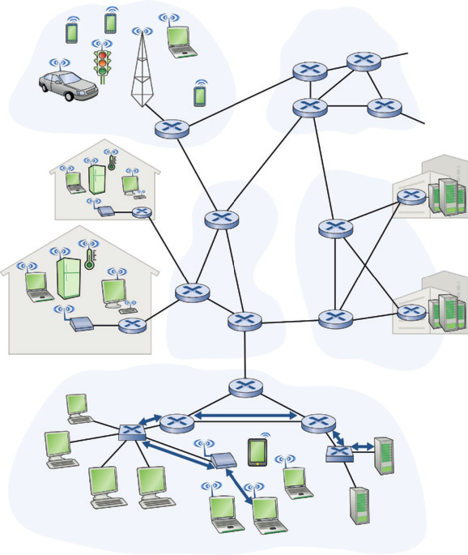

Figure 6.1 Six link-layer hops between wireless host and server

Lausanne’s train station. Once the travel agent makes the three reservations, it is the responsibility of the Princeton limousine company to get the tourist from Princeton to JFK; it is the responsibility of the airline company to get the tourist from JFK to Geneva; and it is the responsibility of the Swiss train service to get the tourist from Geneva to Lausanne. Each of the three segments of the trip is “direct” between two “adjacent” locations. Note that the three transportation segments are managed by different companies and use entirely different transportation modes (limousine, plane, and train). Although the transportation modes are different, they each provide the basic service of moving passengers from one location to an adjacent location. In this transportation analogy, the tourist is a datagram, each transportation segment is a link, the transportation mode is a link-layer protocol, and the travel agent is a routing protocol.

##### 6.1.1 The Services Provided by the Link Layer

Although the basic service of any link layer is to move a datagram from one node to an adjacent node over a single communication link, the details of the provided service can vary from one link-layer protocol to the next. Possible services that can be offered by a link-layer protocol include:

• Framing. Almost all link-layer protocols encapsulate each network-layer datagram within a link-layer frame before transmission over the link. A frame consists of a data field, in which the network-layer datagram is inserted, and a number of header fields. The structure of the frame is specified by the link-layer protocol. We’ll see several different frame formats when we examine specific link-layer protocols in the second half of this chapter.

• Link access. A medium access control (MAC) protocol specifies the rules by which a frame is transmitted onto the link. For point-to-point links that have a single sender at one end of the link and a single receiver at the other end of the link, the MAC protocol is simple (or nonexistent)—the sender can send a frame whenever the link is idle. The more interesting case is when multiple nodes share a single broadcast link—the so-called multiple access problem. Here, the MAC protocol serves to coordinate the frame transmissions of the many nodes.

• Reliable delivery. When a link-layer protocol provides reliable delivery service, it guarantees to move each network-layer datagram across the link without error. Recall that certain transport-layer protocols (such as TCP) also provide a reliable delivery service. Similar to a transport-layer reliable delivery service, a link-layer reliable delivery service can be achieved with acknowledgments and retransmissions (see Section 3.4). A link-layer reliable delivery service is often used for links that are prone to high error rates, such as a wireless link, with the goal of correcting an error locally— on the link where the error occurs—rather than forcing an end-to-end retransmission of the data by a transport- or application-layer protocol.

However, link-layer reliable delivery can be considered an unnecessary overhead for low bit-error links, including fiber, coax, and many twistedpair copper links. For this reason, many wired link-layer protocols do not provide a reliable delivery service.

• Error detection and correction. The link-layer hardware in a receiving node can incorrectly decide that a bit in a frame is zero when it was transmitted as a one, and vice versa. Such bit errors are introduced by signal attenuation and electromagnetic noise. Because there is no need to forward a datagram that has an error, many link-layer protocols provide a mechanism to detect such bit errors. This is done by having the transmitting node include error-detection bits in the frame, and having the receiving node perform an error check. Recall from Chapters 3 and 4 that the Internet’s transport layer and network layer also provide a limited form of error detection—the Internet checksum. Error detection in the link layer is usually more sophisticated and is implemented in hardware.

Error correction is similar to error detection, except that a receiver not only detects when bit errors have occurred in the frame but also determines exactly where in the frame the errors have occurred (and then corrects these errors).

##### 6.1.2 Where Is the Link Layer Implemented?

Before diving into our detailed study of the link layer, let’s conclude this introduction by considering the question of where the link layer is implemented. Is a host’s link layer implemented in hardware or software? Is it implemented on a separate card or chip, and how does it interface with the rest of a host’s hardware and operating system components?

Figure 6.2 shows a typical host architecture. The Ethernet capabilities are either integrated into the motherboard chipset or implemented via a low-cost dedicated Ethernet chip. For the most part, the link layer is implemented on a chip called the network adapter, also sometimes known as a network interface controller (NIC). The network adapter implements many link layer services including framing, link access, error detection, and so on. Thus, much of a linklayer controller’s functionality is implemented in hardware. For example, Intel’s 800 series adapters [Intel 2025] implements the Ethernet protocols we’ll study in Section 6.5; the Atheros Fastconnect 6800 subsystem [Qualcomm 2025] controller implements the 802.11 protocols we’ll study in Chapter 7.

On the sending side, the controller takes a datagram that has been created and stored in host memory by the higher layers of the protocol stack, encapsulates the datagram in a link-layer frame (filling in the frame’s various fields), and then transmits the frame into the communication link, following the linkaccess protocol. On the receiving side, a controller receives the entire frame, and extracts the network-layer datagram. If the link layer performs error detection, then it is the sending controller that sets the error-detection bits in the frame header and it is the receiving controller that performs error detection.

Figure 6.2 shows that while most of the link layer is implemented in hardware, part of the link layer is implemented in software that runs on the host’s CPU. The software components of the link layer implement higher-level linklayer functionality such as assembling link-layer addressing information and

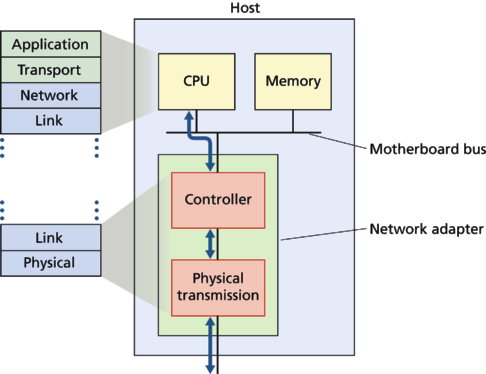

Figure 6.2 Network adapter: Its relationship to other host components and to protocol stack functionality activating the controller hardware. On the receiving side, link-layer  software responds to controller interrupts (for example, due to the receipt of one or more frames), handling error conditions and passing a datagram up to the network layer. Thus, the link layer is a combination of hardware and  software—the place in the protocol stack where software meets hardware.

#### 6.2 Error-Detection and -Correction Techniques

In the previous section, we noted that bit-level error detection and correction—detecting and correcting the corruption of bits in a link-layer frame sent from one node to another physically connected neighboring node—are two services often provided by the link layer. We saw in Chapter 3 that error-detection and -correction services are also often offered at the transport layer as well. In this section, we’ll examine a few of the simplest techniques that can be used to detect and, in some cases, correct such bit errors. A full treatment of the theory and implementation of this topic is itself the topic of many textbooks (e.g., [Schwartz 1980] or [Bertsekas 1991]), and our treatment here is necessarily brief. Our goal here is to develop an intuitive feel for the capabilities that errordetection and -correction techniques provide and to see how a few simple techniques work and are used in practice in the link layer.

Figure 6.3 illustrates the setting for our study. At the sending node, data, D, to be protected against bit errors is augmented with error-detection and - correction  bits EDC . Typically, the data to be protected includes not 

only the datagram passed down from the network layer for transmission across the link, but also link-level addressing information, sequence numbers, and other fields in the link frame header. Both D and EDC are sent to the

receiving node in a link-level frame. At the receiving node, a sequence of bits, ′ ′ ′ ′ D and EDC is received. Note that D and EDC may differ from the original D

and EDC as a result of in-transit bit flips.

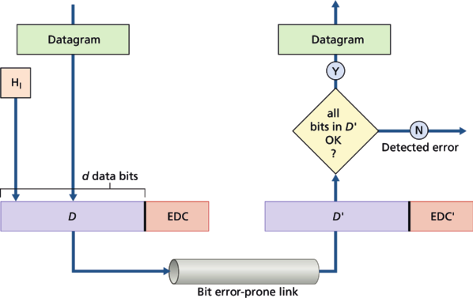

Figure 6.3 Error- detection and -correction scenario

′ The receiver’s challenge is to determine whether or not D is the same as

′ ′ the original D, given that it has only received D and EDC . The exact wording

of the receiver’s decision in Figure 6.3 (we ask whether an error is detected, not whether an error has occurred!) is important. Error-detection and -correction techniques allow the receiver to sometimes, but not always, detect that bit errors have occurred. Even with the use of error-detection bits there still may be undetected bit errors; that is, the receiver may be unaware that the received information contains bit errors.

As a consequence, the receiver might deliver a corrupted datagram to the network layer, or be unaware that the contents of a field in the frame’s header has been corrupted. We thus want to choose an error-detection scheme that keeps the probability of such occurrences small.

Generally, more sophisticated error-detection and -correction techniques (that is, those that have a smaller probability of allowing undetected bit errors) incur a larger overhead—more computation is needed to compute and transmit a larger number of error-detection and -correction bits.

Let’s now examine three techniques for detecting errors in the transmitted data—parity checks (to illustrate the basic ideas behind error detection and correction), checksumming methods (which are more typically used in the transport layer), and cyclic redundancy checks (which are more typically used in the link layer in an adapter).

##### 6.2.1 Parity Checks

Perhaps the simplest form of error detection is the use of a single parity bit.

Suppose that the information to be sent, D in Figure 6.4, has d bits. In an even

parity scheme, the sender simply includes one additional bit and chooses its value such that the total number of 1s in the d + 1 bits (the original informa-

tion plus a parity bit) is even. For odd parity schemes, the parity bit value is chosen such that there is an odd number of 1s. Figure 6.4 illustrates an even parity scheme, with the single parity bit being stored in a separate field.

Receiver operation is also simple with a single parity bit. The receiver need only count the number of 1s in the received d + 1 bits. If an odd number

of 1-valued bits are found with an even parity scheme, the receiver knows that at least one bit error has occurred. More precisely, it knows that some odd number of bit errors have occurred.

But what happens if an even number of bit errors occur? You should convince yourself that this would result in an undetected error. If the probability of bit errors is small and errors can be assumed to occur independently from one bit to the next, the probability of multiple bit errors in a packet would be extremely small. In this case, a single parity bit might suffice. However, measurements have shown that, rather than occurring independently, errors are often clustered together in “bursts.” Under burst error conditions, the

Figure 6.4 One-bit

even parity

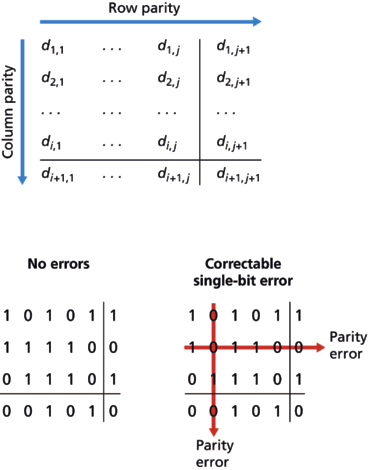

Figure 6.5 Two- dimensional even parity

probability of undetected errors in a frame protected by single-bit parity can approach 50 percent [Spragins 1991].Clearly, a more robust error-detection scheme is needed (and, fortunately, is used in practice!). But before examining error-detection schemes that are used in practice, let’s consider a simple generalization of one-bit parity that will provide us with insight into error-correction techniques.

Figure 6.5 shows a two-dimensional generalization of the single-bit parity scheme. Here, the d bits in D are divided into i rows and j columns. A parity

value is computed for each row and for each column. The resulting i + + j

parity bits comprise the link-layer frame’s error-detection bits.

Suppose now that a single bit error occurs in the original d bits of infor-

mation. With this two-dimensional parity scheme, the parity of both the column and the row containing the flipped bit will be in error. The receiver can thus not only detect the fact that a single bit error has occurred, but can use the column and row indices of the column and row with parity errors to actually identify the bit that was corrupted and correct that error! Figure 6.5 shows an example in which the 1-valued bit in position  2, 2 is corrupted and switched 

to a 0—an error that is both detectable and correctable at the receiver. Although our discussion has focused on the original d bits of information, a single error

in the parity bits themselves is also detectable and correctable. Two- dimensional parity can also detect (but not correct!) any combination of two errors in a packet. Other properties of the two-dimensional parity scheme are explored in the problems at the end of the chapter.

The ability of the receiver to both detect and correct errors is known as forward error correction (FEC).These techniques are commonly used in audio storage and playback devices such as audio CDs. In a network setting, FEC techniques can be used by themselves, or in conjunction with link-layer ARQ techniques similar to those we examined in Chapter 3. FEC techniques are valuable because they can decrease the number of sender retransmissions required. Perhaps more important, they allow for immediate correction of errors at the receiver. This avoids having to wait for the round-trip propagation delay needed for the sender to receive a NAK packet and for the retransmitted packet to propagate back to the receiver—a potentially important advantage for real-time network applications [Rubenstein 1998] or links (such as deep-space links) with long propagation delays. Research examining the use of FEC in error-control protocols includes [Biersack 1992; Nonnenmacher 1998; Byers 1998; Shacham 1990].

##### 6.2.2 Checksumming Methods

In checksumming techniques, the d bits of data in Figure 6.4 are treated as a sequence of k-bit integers. One simple checksumming method is to simply sum these k-bit integers and use the resulting sum as the error-detection bits.

The Internet checksum is based on this approach—bytes of data are treated as 16-bit integers and summed. The 1s complement of this sum then forms the Internet checksum that is carried in the segment header. As discussed in Section 3.3, the receiver checks the checksum by taking the 1s complement sum of the received data (including the checksum) and checking whether the result is all 1 bits. If any of the bits are 1, an error is indicated. RFC 1071 discusses the Internet checksum algorithm and its implementation in detail. In the TCP and UDP protocols, the Internet checksum is computed over all fields (header and data fields included). In IP, the checksum is computed over the IP header (since the UDP or TCP segment has its own checksum). In other protocols, for example, XTP [Strayer 1992], one checksum is computed over the header and another checksum is computed over the entire packet.

Checksumming methods require relatively little packet overhead. For example, the checksums in TCP and UDP use only 16 bits. However, they provide relatively weak protection against errors as compared with cyclic redundancy check, which is discussed below and which is often used in the link layer. A natural question at this point is, Why is checksumming used at the transport layer and cyclic redundancy check used at the link layer? Recall that the transport layer is typically implemented in software in a host as part of the host’s operating system. Because transport-layer error detection is implemented in software, it is important to have a simple and fast error-detection scheme such as checksumming. On the other hand, error detection at the link layer is implemented in dedicated hardware in adapters, which can rapidly perform the more complex CRC operations. Feldmeier [Feldmeier 1995] presents fast software implementation techniques for not only weighted checksum codes, but CRC (see below) and other codes as well.

##### 6.2.3 Cyclic Redundancy Check (CRC)

An error-detection technique used widely in today’s computer networks is based on cyclic redundancy check (CRC) codes. CRC codes are also known as polynomial codes, since it is possible to view the bit string to be sent as a polynomial whose coefficients are the 0 and 1 values in the bit string, with operations on the bit string interpreted as polynomial arithmetic.

Figure 6.6 CRC

CRC codes operate as follows. Consider the d-bit piece of data, D, that the

sending node wants to send to the receiving node. The sender and receiver must first agree on an r + 1 bit pattern, known as a generator, which we will

denote as G. We will require that the most significant (leftmost) bit of G be a 1.

The key idea behind CRC codes is shown in Figure 6.6. For a given piece of data, D, the sender will choose r additional bits, R, and append them to D such that the resulting d + r bit pattern (interpreted as a binary number) is exactly

divisible by G (i.e., has no remainder) using modulo-2 arithmetic. The process of error checking with CRCs is thus simple: The receiver divides the d + r

received bits by G. If the remainder is nonzero, the receiver knows that an error

has occurred; otherwise the data is accepted as being correct.

All CRC calculations are done in modulo-2 arithmetic without carries in addition or borrows in subtraction. This means that addition and subtraction are identical, and both are equivalent to the bitwise exclusive-or (XOR) of the operands. Thus, for example, 1011 XOR 0101 = 1110 1001 XOR 1101 = 0100 Also, we similarly have 1011 - 0101 = 1110 1001 - 1101 = 0100 Multiplication and division are the same as in base-2 arithmetic, except that any required addition or subtraction is done without carries or borrows.

As in regular binary arithmetic, multiplication by 2 k left shifts a bit pattern by

k places. Thus, given D and R, the quantity D i 2  XOR r R yields the d + r bit

pattern shown in Figure 6.6. We’ll use this algebraic characterization of the d + r bit pattern from Figure 6.6 in our discussion below.

Let us now turn to the crucial question of how the sender computes R.

Recall that we want to find R such that there is an n such that D i 2  XOR r R = nG

That is, we want to choose R such that G divides into D i 2  XOR r R with-

out remainder. If we XOR (that is, add modulo-2, without carry) R to both sides of the above equation, we get

D i 2 = nG XOR R r

This equation tells us that if we divide D 2 i by G, the value of the remainr

der is precisely R. In other words, we can calculate R as

D i 2 r R = remainder G

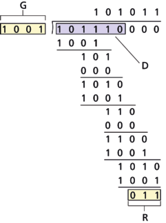

Figure 6.7 A sample CRC calculation Figure 6.7 illustrates this calculation for the case of D = 101110 , d = 6 , G = 1001 , and r = 3 . The 9 bits transmitted in this case are 101 110 011. You should check these calculations for yourself and also check that indeed D i 2 r = 101011 i G XOR R . International standards have been defined for 8-, 12-, 16-, and 32-bit gen- erators, G. The CRC-32 32-bit standard, which has been adopted in a number of link-level IEEE protocols, uses a generator of G = 100000100110000010001110110110111 CRC-32 Each of the CRC standards can detect burst errors of fewer than r + 1 bits. (This means that all consecutive bit errors of r bits or fewer will be detected.) Furthermore, under appropriate assumptions, a burst of length greater than r + 1 bits is detected with probability 1 − 0.5 . Also, each of the CRC stan- r dards can detect any odd number of bit errors. See [Williams 1993] for a discussion of implementing CRC checks. The theory behind CRC codes and even more powerful codes is beyond the scope of this text. The text [Schwartz 1980] provides an excellent introduction to this topic.

#### 6.3 Multiple Access Links and Protocols

In the introduction to this chapter, we noted that there are two types of network links: point-to-point links and broadcast links. A point-to-point link consists of a single sender at one end of the link and a single receiver at the other end of the link. Many link-layer protocols have been designed for point-to-point links; the point-to-point protocol (PPP) and high-level data link control (HDLC) are two such protocols. The second type of link, a broadcast link, can have multiple sending and receiving nodes all connected to the same, single, shared broadcast channel. The term broadcast is used here because when any one node transmits a frame, the channel broadcasts the frame and each of the other nodes receives a copy. Ethernet and wireless LANs are examples of broadcast link-layer technologies. In this section, we’ll take a step back from specific link-layer protocols and first examine a problem of central importance to the link layer: how to coordinate the access of multiple sending and receiving nodes to a shared broadcast channel—the multiple access problem.

Broadcast channels are often used in LANs, networks that are geographically concentrated in a single building (or on a corporate or university campus).

Thus, we’ll look at how multiple access channels are used in LANs at the end of this section.

We are all familiar with the notion of broadcasting—television has been using it since its invention. But traditional television is a one-way broadcast (that is, one fixed node transmitting to many receiving nodes), while nodes on a computer network broadcast channel can both send and receive. Perhaps a more apt human analogy for a broadcast channel is a cocktail party, where many people gather in a large room (the air providing the broadcast medium) to talk and listen. A second good analogy is something many readers will be familiar with—a classroom—where teacher(s) and student(s) similarly share the same, single, broadcast medium. A central problem in both scenarios is that of determining who gets to talk (that is, transmit into the channel) and when.

As humans, we’ve evolved an elaborate set of protocols for sharing the broadcast channel:

“Give everyone a chance to speak.” “Don’t speak until you are spoken to.” “Don’t monopolize the conversation.” “Raise your hand if you have a question.” “Don’t interrupt when someone is speaking.” “Don’t fall asleep when someone is talking.” Computer networks similarly have protocols—so-called multiple access protocols—by which nodes regulate their transmission into the shared broadcast channel. As shown in Figure 6.8, multiple access protocols are needed in a wide variety of network settings, including both wired and wireless access networks, and satellite networks. Although technically each node accesses the broadcast channel through its adapter, in this section, we will refer to the node as the sending and receiving device. In practice, hundreds or even thousands of nodes can directly communicate over a broadcast channel.

Because all nodes are capable of transmitting frames, more than two nodes can transmit frames at the same time. When this happens, all of the nodes receive multiple frames at the same time; that is, the transmitted frames  collide at all of the receivers. Typically, when there is a collision, none of the receiving nodes can make any sense of any of the frames that were transmitted; in a sense, the signals of the colliding frames become inextricably tangled together.

Thus, all the frames involved in the collision are lost, and the broadcast channel is wasted during the collision interval. Clearly, if many nodes want to transmit frames frequently, many transmissions will result in collisions, and much of the bandwidth of the broadcast channel will be wasted.

In order to ensure that the broadcast channel performs useful work when multiple nodes are active, it is necessary to somehow coordinate the transmissions of the active nodes. This coordination job is the responsibility of the multiple access protocol. Over the past 50 years, thousands of papers and hundreds of PhD dissertations have been written on multiple access protocols; a comprehensive survey of the first 20 years of this body of work is [Rom 1990].

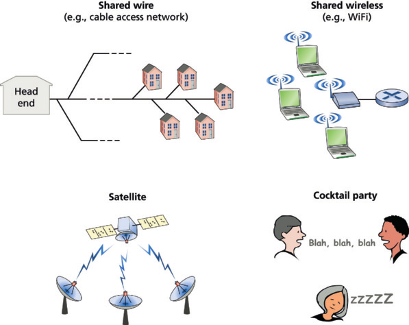

Figure 6.8 Various multiple access channels

Furthermore, active research in multiple access protocols continues due to the continued emergence of new types of links, particularly new wireless links.

Over the years, dozens of multiple access protocols have been implemented in a variety of link-layer technologies. Nevertheless, we can classify just about any multiple access protocol as belonging to one of three categories:

channel partitioning protocols, random access protocols, and taking-turns protocols. We’ll cover these categories of multiple access protocols in the following three subsections.

Let’s conclude this overview by noting that, ideally, a multiple access protocol for a broadcast channel of rate R bits per second should have the following desirable characteristics:

1.  When only one node has data to send, that node has a throughput of R bps.

2.  When M nodes have data to send, each of these nodes has a throughput of R M bps. This need not necessarily imply that each of the M nodes always has an instantaneous rate of R M, but rather that each node should have

an average transmission rate of R M over some suitably defined interval

of time.

3.  The protocol is decentralized; that is, there is no centralized controller node that represents a single point of failure for the network.

4.  The protocol is simple, so that it is inexpensive to implement.

##### 6.3.1 Channel Partitioning Protocols

Recall from our early discussion back in Section 1.3 that time-division multiplexing (TDM) and frequency-division multiplexing (FDM) are two techniques that can be used to partition a broadcast channel’s bandwidth among all nodes sharing that channel.

As an example, suppose the channel supports N nodes and that the transmission rate of the channel is R bps. TDM divides time into time frames and further divides each time frame into N

time slots. (The TDM time frame should not be confused with the link-layer unit of data exchanged between sending and receiving adapters, which is also called a frame. In order to reduce confusion, in this subsection we’ll refer to the link-layer unit of data exchanged as a packet.) Each time slot is then assigned to one of the N  nodes. Whenever a node has a packet to send, it

transmits the packet’s bits during its assigned time slot in the revolving TDM frame. Typically, slot sizes are chosen so that a single packet can be transmitted during a slot time. Figure 6.9 shows a simple four-node TDM example.

Returning to our cocktail party analogy, a TDM-regulated cocktail party would allow one partygoer to speak for a fixed period of time, then allow another partygoer to speak for the same amount of time, and so on. Once everyone had had a chance to talk, the pattern would repeat.

TDM is appealing because it eliminates collisions and is perfectly fair:

Each node gets a dedicated transmission rate of R N  bps during each frame

time. However, it has two major drawbacks. First, a node is limited to an average rate of R N  bps even when it is the only node with packets to send. A second drawback is that a node must always wait for its turn in the transmission sequence—again, even when it is the only node with a frame to send.

Imagine the partygoer who is the only one with anything to say (and imagine that this is the even rarer circumstance where everyone wants to hear what that one person has to say). Clearly, TDM would be a poor choice for a multiple access protocol for this particular party.

While TDM shares the broadcast channel in time, FDM divides the R bps

channel into different frequencies (each with a bandwidth of R N ) and assigns

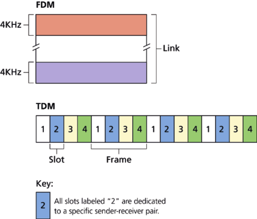

Figure 6.9 A four-node TDM and FDM example each frequency to one of the N nodes. FDM thus creates N smaller channels of R N  bps out of the single, larger R bps channel. FDM shares both the advantages and drawbacks of TDM. It avoids collisions and divides the bandwidth fairly among the N nodes. However, FDM also shares a principal disadvantage

with TDM—a node is limited to a bandwidth of R N , even when it is the only

node with packets to send. TDM and FDM techniques are widely used in the cellular, WiFi, Bluetooth, and satellite systems that we’ll study in Chapter 7. Both of them are also used in cable access networks, as we’ll see later in this chapter.

A third channel partitioning protocol is code division multiple access (CDMA). While TDM and FDM assign time slots and frequencies, respectively, to the nodes, CDMA assigns a different code to each node. Each node then uses its unique code to encode the data bits it sends. If the codes are chosen carefully, CDMA networks have the wonderful property that different nodes can transmit simultaneously and yet have their respective receivers correctly receive a sender’s encoded data bits (assuming the receiver knows the sender’s code) in spite of interfering transmissions by other nodes. CDMA was a foundational technology for 3G cellular networks but was replaced by other technologies in 4G and 5G networks. You can learn about CDMA in Chapter 7 of earlier versions of our textbook.

##### 6.3.2 Random Access Protocols

The second broad class of multiple access protocols are random access protocols. In a random access protocol, a transmitting node always transmits at the full rate of the channel, namely, R bps. When there is a collision, each node

involved in the collision repeatedly retransmits its frame (that is, packet) until its frame gets through without a collision. But when a node experiences a collision, it doesn’t necessarily retransmit the frame right away. Instead it waits a random delay before retransmitting the frame. Each node involved in a collision chooses independent random delays. Because the random delays are independently chosen, it is possible that one of the nodes will pick a delay that is sufficiently less than the delays of the other colliding nodes and will therefore be able to sneak its frame into the channel without a collision.

There are dozens if not hundreds of random access protocols described in the literature [Rom 1990; Bertsekas 1991]. In this section we’ll describe a few of the most well-known random access protocols—the ALOHA protocols [Abramson 1970; Abramson 1985; Abramson 2009] and the carrier sense multiple access (CSMA) protocols [Kleinrock 1975b]. Ethernet [Metcalfe 1976] is a popular and widely deployed CSMA protocol. In Chapter 7, we’ll cover the use of random access in WiFi’s CSMA/CA protocol.

Slotted ALOHA Let’s begin our study of random access protocols with one of the simplest random access protocols, the slotted ALOHA protocol. In our description of slotted ALOHA, we assume the following:

• All frames consist of exactly L bits.

• Time is divided into slots of size L R seconds (that is, a slot equals the time to transmit one frame).

• Nodes start to transmit frames only at the beginnings of slots.

• The nodes are synchronized so that each node knows when the slots begin.

• If two or more frames collide in a slot, then all the nodes detect the collision event before the slot ends.

Let p be a probability, that is, a number between 0 and 1. The operation of slotted ALOHA in each node is simple:

• When the node has a fresh frame to send, it waits until the beginning of the next slot and transmits the entire frame in the slot.

• If there isn’t a collision, the node has successfully transmitted its frame and thus need not consider retransmitting the frame. (The node can prepare a new frame for transmission, if it has one.)

• If there is a collision, the node detects the collision before the end of the slot. The node retransmits its frame in each subsequent slot with probability p until the frame is transmitted without a collision.

By retransmitting with probability p, we mean that the node effectively tosses a biased coin; the event heads corresponds to “retransmit,” which occurs with probability p. The event tails corresponds to “skip the slot and toss the

coin again in the next slot”; this occurs with probability 1 − p . All nodes 

involved in the collision toss their coins independently.

Slotted ALOHA would appear to have many advantages. Unlike channel partitioning, slotted ALOHA allows a node to transmit continuously at the full rate, R, when that node is the only active node. (A node is said to be active if it has frames to send.) Slotted ALOHA is also highly decentralized, because each node detects collisions and independently decides when to retransmit. (Slotted ALOHA does, however, require the slots to be synchronized in the nodes;

shortly we’ll discuss an unslotted version of the ALOHA protocol, as well as CSMA protocols, none of which require such synchronization.) Slotted ALOHA is also an extremely simple protocol.

Slotted ALOHA works well when there is only one active node, but how efficient is it when there are multiple active nodes? There are two possible efficiency concerns here. First, as shown in Figure 6.10, when there are multiple active nodes, a certain fraction of the slots will have collisions and will therefore be “wasted.” The second concern is that another fraction of the slots will be empty because all active nodes refrain from transmitting as a result of the probabilistic transmission policy. The only “unwasted” slots will be those in which exactly one node transmits. A slot in which exactly one node transmits is said to be a successful slot. The efficiency of a slotted multiple access protocol is defined to be the long-run fraction of successful slots in the case when there are a large number of active nodes, each always having a large number of frames to send. Note that if no form of access control were used, and each node were to immediately retransmit after each collision, the efficiency would be zero. Slotted ALOHA clearly increases the efficiency beyond zero, but by how much?

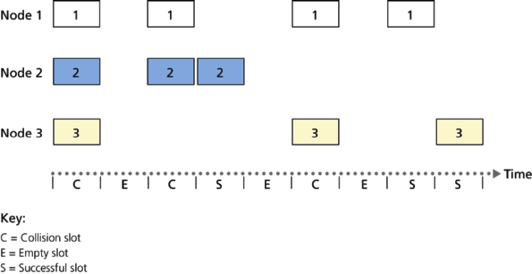

Figure 6.10 Nodes 1, 2, and 3 collide in the first slot. Node 2 finally succeeds in the fourth slot, node 1 in the eighth slot, and node 3 in the ninth slot

We now proceed to outline the derivation of the maximum efficiency of slotted ALOHA. To keep this derivation simple, let’s modify the protocol a little and assume that each node attempts to transmit a frame in each slot with probability p. (That is, we assume that each node always has a frame to send and that the node transmits with probability p for a fresh frame as well as for a

frame that has already suffered a collision.) Suppose there are N nodes. Then

the probability that a given slot is a successful slot is the probability that one of

− the nodes transmits and that the remaining N 1 nodes do not transmit. The

probability that a given node transmits is p; the probability that the remaining N 1 − − nodes do not transmit is ( 1 p ) . Therefore, the probability a given node N 1 − − has a success is p ( 1 p ) . Because there are N nodes, the probability that

N 1 − − any one of the N nodes has a success is Np ( 1 p ) .

Thus, when there are N active nodes, the efficiency of slotted ALOHA is

N 1 − − Np ( 1 p ) . To obtain the maximum efficiency for N active nodes, we have to

find the p* that maximizes this expression. (See the homework problems for a general outline of this derivation.) And to obtain the maximum efficiency for a

N 1 − − large number of active nodes, we take the limit of Np * 1 ( p * ) as N

approaches infinity. (Again, see the homework problems.) After performing these calculations, we’ll find that the maximum efficiency of the protocol is = given by 1 e 0.37 . That is, when a large number of nodes have many frames

to transmit, then (at best) only 37 percent of the slots do useful work. Thus, the effective transmission rate of the channel is not R bps but only 0.37 R bps! A

similar analysis also shows that 37 percent of the slots go empty and 26 percent of slots have collisions. Imagine the poor network administrator who has purchased a 100-Mbps slotted ALOHA system, expecting to be able to use the network to transmit data among a large number of users at an aggregate rate of, say, 80 Mbps! Although the channel is capable of transmitting a given frame at the full channel rate of 100 Mbps, in the long run, the successful throughput of this channel will be less than 37 Mbps.

Aloha The slotted ALOHA protocol required that all nodes synchronize their transmissions to start at the beginning of a slot. The first ALOHA protocol [Abramson 1970] was actually an unslotted, fully decentralized protocol. In pure ALOHA, when a frame first arrives (that is, a network-layer datagram is passed down from the network layer at the sending node), the node immediately transmits the frame in its entirety into the broadcast channel. If a transmitted frame experiences a collision with one or more other transmissions, the node will then immediately (after completely transmitting its collided frame) retransmit the frame with probability p. Otherwise, the node waits for a frame transmission time. After this wait, it then transmits the frame with probability p, or waits (remaining

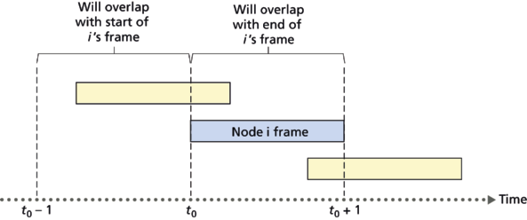

Figure 6.11 Interfering transmissions in pure ALOHA

idle) for another frame time with probability 1 − p .

To determine the maximum efficiency of pure ALOHA, we focus on an individual node. We’ll make the same assumptions as in our slotted ALOHA analysis and take the frame transmission time to be the unit of time. At any given time, the probability that a node is transmitting a frame is p. Suppose

this frame begins transmission at time t . As shown in Figure 6.11, in order for 0 this frame to be successfully transmitted, no other nodes can begin their transmission in the interval of time t − 1, t . Such a transmission would overlap [ ] 0 0 with the beginning of the transmission of node i’s frame. The probability that

N 1 − all other nodes do not begin a transmission in this interval is 1 − p . Simi- 

larly, no other node can begin a transmission while node i is transmitting, as

such a transmission would overlap with the latter part of node i’s transmis-

sion. The probability that all other nodes do not begin a transmission in this

N 1 − interval is also 1 − p . Thus, the probability that a given node has a suc-  2 N − 1 cessful transmission is p 1 − p  . By taking limits as in the slotted ALOHA 

case, we find that the maximum efficiency of the pure ALOHA protocol is only 1 2 e —exactly half that of slotted ALOHA. This then is the price to be paid for  a fully decentralized ALOHA protocol.

Carrier Sense Multiple Access (CSMA) In both slotted and pure ALOHA, a node’s decision to transmit is made independently of the activity of the other nodes attached to the broadcast channel.

In particular, a node neither pays attention to whether another node happens to be transmitting when it begins to transmit, nor stops transmitting if another node begins to interfere with its transmission. In our cocktail party analogy, ALOHA protocols are quite like a boorish partygoer who continues to chatter away regardless of whether other people are talking. As humans, we have human protocols that allow us not only to behave with more civility, but also to decrease the amount of time spent “colliding” with each other in conversation and, consequently, to increase the amount of data we exchange in our conversations. Specifically, there are two important rules for polite human conversation:

• Listen before speaking. If someone else is speaking, wait until they are finished. In the networking world, this is called carrier sensing—a node listens to the channel before transmitting. If a frame from another node is currently being transmitted into the channel, a node then waits until it detects no transmissions for a short amount of time and then begins transmission.

• If someone else begins talking at the same time, stop talking. In the networking world, this is called collision detection—a transmitting node listens to the channel while it is transmitting. If it detects that another node is transmitting an interfering frame, it stops transmitting and waits a random amount of time before repeating the sense-and-transmit-when-idle cycle.

These two rules are embodied in the family of carrier sense multiple access (CSMA) and CSMA with collision detection (CSMA/CD) protocols [Kleinrock 1975b; Metcalfe 1976; Lam 1980; Rom 1990]. Many variations on CSMA and CSMA/CD have been proposed. Here, we’ll consider a few of the most important, and fundamental, characteristics of CSMA and CSMA/CD.

Case History Norm Abramson and Alohanet Norm Abramson, a PhD engineer, had a passion for surfing and an interest in packet switching. This combination of interests brought him to the University of Hawaii in 1969. Hawaii consists of many mountainous islands, making it difficult to install and operate land-based networks. When not surfing, Abramson thought about how to design a network that does packet switching over radio. The network he designed had one central host and several secondary nodes scattered over the Hawaiian Islands. The network had two channels, each using a different frequency band. The downlink channel broadcasted packets from the central host to the secondary hosts; and the upstream channel sent packets from the secondary hosts to the central host. In addition to sending informational packets, the central host also sent on the downstream channel an acknowledgment for each packet successfully received from the secondary hosts.

Because the secondary hosts transmitted packets in a decentralized fashion, collisions on the upstream channel inevitably occurred. This observation led Abramson to devise the pure ALOHA protocol, as described in this chapter. In 1970, with continued funding from ARPA, Abramson connected his ALOHAnet to the ARPAnet. For a history of AlohaNet, see [Schwartz 2009].

Abramson’s work is important not only because it was the first example of a radio packet network, but also because it inspired Bob Metcalfe. A few years later, Metcalfe modified the ALOHA protocol to create the CSMA/CD protocol and the Ethernet LAN.

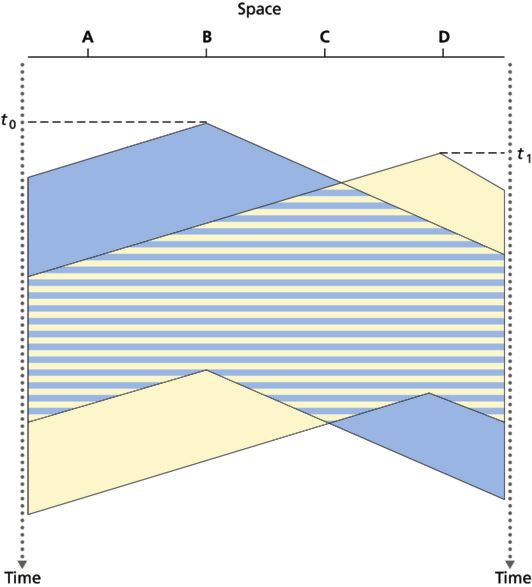

Figure 6.12 Space- time diagram of two CSMA nodes with colliding transmissions

The first question that you might ask about CSMA is why, if all nodes perform carrier sensing, do collisions occur in the first place? After all, a node will refrain from transmitting whenever it senses that another node is transmitting.

The answer to the question can best be illustrated using space-time diagrams [Molle 1987]. Figure 6.12 shows a space-time diagram of four nodes

A,  B,  C,  D attached to a linear broadcast bus. The horizontal axis shows the  position of each node in space; the vertical axis represents time.

At time t , node B senses the channel is idle, as no other nodes are cur- 0 rently transmitting. Node B thus begins transmitting, with its bits propagating in both directions along the broadcast medium. The downward propagation of B’s bits in Figure 6.12 with increasing time indicates that a nonzero amount of time is needed for B’s bits actually to propagate (albeit at near the speed of light) along the broadcast medium. At time t t > t , node D has a frame to  1 1 0 send. Although node B is currently transmitting at time t , the bits being trans- 1 mitted by B have yet to reach D, and thus D senses the channel idle at t .

In

accordance with the CSMA protocol, D thus begins transmitting its frame. A short time later, B’s transmission begins to interfere with D’s transmission at D.

From Figure 6.12, it is evident that the end-to-end channel propagation delay of a broadcast channel—the time it takes for a signal to propagate from one of the nodes to another—will play a crucial role in determining its performance.

The longer this propagation delay, the larger the chance that a carrier-sensing node is not yet able to sense a transmission that has already begun at another node in the network.

Carrier Sense Multiple Access with Collision Detection (CSMA/CD) In Figure 6.12, nodes do not perform collision detection; both B and D continue to transmit their frames in their entirety even though a collision has occurred.

When a node performs collision detection, it ceases transmission as soon as it detects a collision. Figure 6.13 shows the same scenario as in Figure 6.12, except that the two nodes each abort their transmission a short time after detecting a collision. Clearly, adding collision detection to a multiple access protocol will help protocol performance by not transmitting a useless, damaged (by interference with a frame from another node) frame in its entirety.

Before analyzing the CSMA/CD protocol, let us now summarize its operation from the perspective of an adapter (in a node) attached to a broadcast channel:

1.  The adapter obtains a datagram from the network layer, prepares a linklayer frame, and puts the frame adapter buffer.

2.  If the adapter senses that the channel is idle (that is, there is no signal energy entering the adapter from the channel), it starts to transmit the frame. If, on the other hand, the adapter senses that the channel is busy, it waits until it senses no signal energy and then starts to transmit the frame.

3.  While transmitting, the adapter monitors for the presence of signal energy coming from other adapters using the broadcast channel.

4.  If the adapter transmits the entire frame without detecting signal energy from other adapters, the adapter is finished with the frame. If, on the other

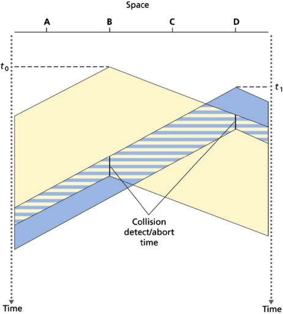

Figure 6.13 CSMA with collision detection hand, the adapter detects signal energy from other adapters while transmitting, it aborts the transmission (that is, it stops transmitting its frame).

5.  After aborting, the adapter waits a random amount of time and then returns to step 2.

The need to wait a random (rather than fixed) amount of time is hopefully clear—if two nodes transmitted frames at the same time and then both waited the same fixed amount of time, they’d continue colliding forever.

But what is a good interval of time from which to choose the random backoff time? If the interval is large and the number of colliding nodes is small, nodes are likely to wait a large amount of time (with the channel remaining idle) before repeating the sense-and-transmit-when-idle step. On the other hand, if the interval is small and the number of colliding nodes is large, it’s likely that the chosen random values will be nearly the same, and transmitting nodes will again collide.

What we’d like is an interval that is short when the number of colliding nodes is small, and long when the number of colliding nodes is large.

The binary exponential backoff algorithm, used in Ethernet as well as in DOCSIS cable network multiple access protocols [DOCSIS 3.1 2014], elegantly solves this problem. Specifically, when transmitting a frame that has already experienced  n collisions, a node chooses the value of K  at random from 0, 1, 2, . . . . 2 − 1 . Thus, the more collisions experienced by a frame, the { n }

larger the interval from which K is chosen. For Ethernet, the actual amount of time a node waits is K 512 bit times (i.e., K times the amount of time needed i

to send 512 bits into the Ethernet) and the maximum value that n can take is capped at 10.

Let’s look at an example. Suppose that a node attempts to transmit a frame for the first time and while transmitting it detects a collision. The node then chooses K = 0 with probability 0.5 or chooses K = 1 with probability 0.5. If

the node chooses K = 0 , then it immediately begins sensing the channel. If the

node chooses K = 1 , it waits 512 bit times (e.g., 5.12 microseconds for a

100 Mbps Ethernet) before beginning the sense-and-transmit-when-idle cycle.

After a second collision, K  is chosen with equal probability from  0,1,2,3 . { }

After three collisions, K is chosen with equal probability from  0,1,2,3,4,5,6,7 . { }

After  10 or more collisions, K  is chosen with equal probability from 0,1,2, . . . , 1023 . Thus, the size of the sets from which K  is chosen grows { }

exponentially with the number of collisions; for this reason this algorithm is referred to as binary exponential backoff.

We also note here that each time a node prepares a new frame for transmission, it runs the CSMA/CD algorithm, not taking into account any collisions that may have occurred in the recent past. So it is possible that a node with a new frame will immediately be able to sneak in a successful transmission while several other nodes are in the exponential backoff state.

CSMA/CD Efficiency When only one node has a frame to send, the node can transmit at the full channel rate (e.g., for Ethernet typical rates are 10 Mbps, 100 Mbps, or 1 Gbps).

However, if many nodes have frames to transmit, the effective transmission rate of the channel can be much less. We define the efficiency of CSMA/CD to be the long-run fraction of time during which frames are being transmitted on the channel without collisions when there is a large number of active nodes, with each node having a large number of frames to send. In order to present a closed-form approximation of the efficiency of Ethernet, let d denote the prop maximum time it takes signal energy to propagate between any two adapters.

Let d be the time to transmit a maximum-size frame (approximately 1.2 trans msecs for a 10 Mbps Ethernet). A derivation of the efficiency of CSMA/CD is beyond the scope of this book (see [Lam 1980] and [Bertsekas 1991]). Here we simply state the following approximation:

1 = Efficiency 1 + 5 d d prop trans

We see from this formula that as d approaches 0, the efficiency prop approaches 1. This matches our intuition that if the propagation delay is zero, colliding nodes will abort immediately without wasting the channel. Also, as d becomes very large, efficiency approaches 1. This is also intuitive because trans when a frame grabs the channel, it will hold on to the channel for a very long time; thus, the channel will be doing productive work most of the time.

##### 6.3.3 Taking-Turns Protocols

Recall that two desirable properties of a multiple access protocol are (1) when only one node is active, the active node has a throughput of R bps, and

(2) when M nodes are active, then each active node has a throughput of nearly R M  bps. The ALOHA and CSMA protocols have this first property but not the second.

This has motivated researchers to create another class of protocols— the taking-turns protocols. As with random access protocols, there are dozens of taking-turns protocols, and each one of these protocols has many variations.

We’ll discuss two of the more important protocols here. The first one is the polling protocol. The polling protocol requires one of the nodes to be designated as a controller node. The controller node polls each of the nodes in a round-robin fashion. In particular, the controller node first sends a message to node 1, saying that it (node 1) can transmit up to some maximum number of frames. After node 1 transmits some frames, the controller node tells node  2 it (node 2) can transmit up to the maximum number of frames.

(The controller node can determine when a node has finished sending its frames by observing the lack of a signal on the channel.) The procedure continues in this manner, with the controller node polling each of the nodes in a cyclic manner.

The polling protocol eliminates the collisions and empty slots that plague random access protocols. This allows polling to achieve a much higher efficiency. But it also has a few drawbacks. The first drawback is that the protocol introduces a polling delay—the amount of time required to notify a node that it can transmit. If, for example, only one node is active, then the node will transmit at a rate less than R bps, as the controller node must poll each of the inactive nodes in turn each time the active node has sent its maximum number of frames. The second drawback, which is potentially more serious, is that if the controller node fails, the entire channel becomes inoperative. The Bluetooth protocol, which we will study in Section 7.5.1, is an example of a polling protocol.

The second taking-turns protocol is the token-passing protocol. In this protocol there is no controller node. A small, special-purpose frame known as a token is exchanged among the nodes in some fixed order. For example, node 1 might always send the token to node 2, node 2 might always send the token to node 3, and node N might always send the token to node 1. When a node receives a token, it holds onto the token only if it has some frames to transmit; otherwise, it immediately forwards the token to the next node. If a node does have frames to transmit when it receives the token, it sends up to a maximum number of frames and then forwards the token to the next node.

Token passing is decentralized and highly efficient. But it has its problems as well. For example, the failure of one node can crash the entire channel. Or if a node accidentally neglects to release the token, then some recovery procedure must be invoked to get the token back in circulation. Over the years many token-passing protocols have been developed, including the fiber distributed data interface (FDDI) protocol [Jain 1994] and the IEEE 802.5 token ring protocol [IEEE 802.5 2012], and each one had to address these as well as other sticky issues.

##### 6.3.4 DOCSIS: The Link-Layer Protocol for Cable Internet Access

In the previous three subsections, we’ve learned about three broad classes of multiple access protocols: channel partitioning protocols, random access protocols, and taking turns protocols. A cable access network will make for an excellent case study here, as we’ll find aspects of each of these three classes of multiple access protocols with the cable access network!

Recall from Section 1.2.1 that a cable access network typically connects several thousand residential cable modems to a cable modem termination system (CMTS) at the cable network headend. The Data-Over-Cable Service Interface Specifications (DOCSIS) [DOCSIS 3.1 2014; Hamzeh 2015] specifies the cable data network architecture and its protocols. DOCSIS uses FDM to divide the downstream (CMTS to modem) and upstream (modem to CMTS) network segments into multiple frequency channels. Each downstream channel is between 24 MHz and 192 MHz wide, with a maximum throughput of approximately 1.6 Gbps per channel; each upstream channel has channel widths ranging from 6.4 MHz to 96 MHz, with a maximum upstream throughput of approximately 1 Gbps. Each upstream and downstream channel is a broadcast channel. Frames transmitted on the downstream channel by the CMTS are received by all cable modems receiving that channel; since there is just a single CMTS transmitting into the downstream channel, however, there is no multiple access problem. The upstream direction, however, is more interesting and technically challenging, since multiple cable modems share the same upstream channel (frequency) to the CMTS, and thus collisions can potentially occur.

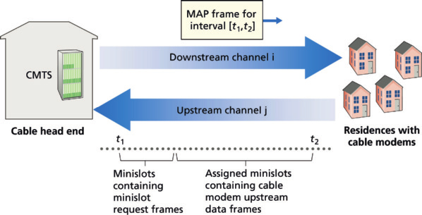

Figure 6.14 Upstream and downstream channels between CMTS and cable modems

As illustrated in Figure 6.14, each upstream channel is divided into intervals of time (TDM-like), each containing a sequence of mini-slots during which cable modems can transmit to the CMTS. The CMTS explicitly grants permission to individual cable modems to transmit during specific mini-slots. The CMTS accomplishes this by sending a control message known as a MAP message on a downstream channel to specify which cable modem (with data to send) can transmit during which mini-slot for the interval of time specified in the control message. Since mini-slots are explicitly allocated to cable modems, the CMTS can ensure there are no colliding transmissions during a mini-slot.

But how does the CMTS know which cable modems have data to send in the first place? This is accomplished by having cable modems send mini-slot-request frames to the CMTS during a special set of interval mini-slots that are dedicated for this purpose, as shown in Figure 6.14. These mini-slot-request frames are transmitted in a random access manner and so may collide with each other.

A cable modem can neither sense whether the upstream channel is busy nor detect collisions. Instead, the cable modem infers that its mini-slot-request frame experienced a collision if it does not receive a response to the requested allocation in the next downstream control message. When a collision is inferred, a cable modem uses binary exponential backoff to defer the retransmission of its mini-slot-request frame to a future time slot. When there is little traffic on the upstream channel, a cable modem may actually transmit data frames during slots nominally assigned for mini-slot-request frames (and thus avoid having to wait for a mini-slot assignment).

A cable access network thus serves as a terrific example of multiple access protocols in action—FDM, TDM, random access, and centrally allocated time slots all within one network!

#### 6.4 Switched Local Area Networks

Having covered broadcast networks and multiple access protocols in the previous section, let’s turn our attention next to switched local networks.

Figure 6.15 shows a switched local network connecting three departments, two servers and a router with four switches. Because these switches operate at the link layer, they switch link-layer frames (rather than network-layer datagrams), don’t recognize network-layer addresses, and don’t use routing algorithms like OSPF to determine paths through the network of layer-2 switches. Instead of using IP addresses, we will soon see that they use link-layer addresses to forward link-layer frames through the network of switches. We’ll begin our study of switched LANs by first covering link-layer addressing (Section 6.4.1). We then examine the celebrated Ethernet protocol (Section 6.4.2). After examining link-layer addressing and Ethernet, we’ll look at how link-layer switches operate (Section 6.4.3), and then see (Section 6.4.4) how these switches are often used to build large-scale LANs.

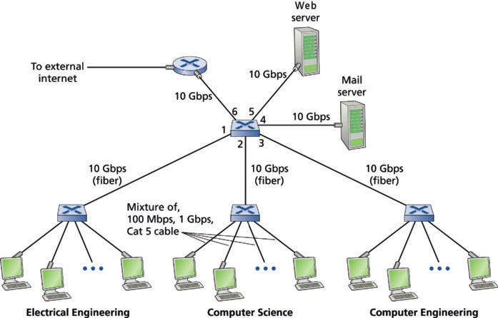

Figure 6.15 An institutional network connected together by four switches

##### 6.4.1 Link-Layer Addressing and ARP

Hosts and routers have link-layer addresses. Now you might find this surprising, recalling from Chapter 4 that hosts and routers have network-layer addresses as well. You might be asking, why in the world do we need to have addresses at both the network and link layers? In addition to describing the syntax and function of the link-layer addresses, in this section we hope to shed some light on why the two layers of addresses are useful and, in fact, indispensable. We’ll also cover the Address Resolution Protocol (ARP), which provides a mechanism to translate IP addresses to link-layer addresses.

MAC Addresses In truth, it is not hosts and routers that have link-layer addresses but rather their adapters (that is, network interfaces) that have link-layer addresses. A host or router with multiple network interfaces will thus have multiple link-layer addresses associated with it, just as it would also have multiple IP addresses associated with it. It’s important to note, however, that link-layer switches do not have link-layer addresses associated with their interfaces that connect to hosts and routers. This is because the job of the link-layer switch is to carry datagrams between hosts and routers; a switch does this job transparently, that is, without the host or router having to explicitly address the frame to the intervening switch. This is illustrated in Figure 6.16. A link-layer address is variously called a LAN address, a physical address, or a MAC address.

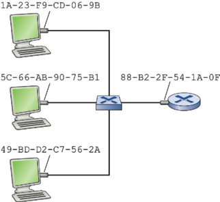

Figure 6.16 Each interface connected to a LAN has a unique MAC address

Because MAC address seems to be the most popular term, we’ll henceforth refer to link-layer addresses as MAC addresses. For most LANs (including Ethernet and 802.11 wireless LANs), the MAC address is 6 bytes long, giving 2 48 possible MAC addresses.

As shown in Figure 6.16, these 6-byte addresses are typically expressed in hexadecimal notation, with each byte of the address expressed as a pair of hexadecimal numbers. Although MAC addresses were designed to be permanent, it is now possible to change an adapter’s MAC address via software. For the rest of this section, however, we’ll assume that an adapter’s MAC address is fixed.

One interesting property of MAC addresses is that no two adapters have the same address. This might seem surprising given that adapters are manufactured in many countries by many companies. How does a company manufacturing adapters in Taiwan make sure that it is using different addresses from a company manufacturing adapters in Belgium? The answer is that the IEEE manages the MAC address space. In particular, when a company wants to manufacture adapters, it purchases a chunk of the address space consisting of 2 24 addresses for a nominal fee. IEEE allocates the chunk of 2 24 addresses by

fixing the first 24 bits of a MAC address and letting the company create unique combinations of the last 24 bits for each adapter.

An adapter’s MAC address has a flat structure (as opposed to a hierarchical structure) and doesn’t change no matter where the adapter goes.A laptop with an Ethernet interface always has the same MAC address, no matter where the computer goes.A smartphone with an 802.11 interface always has the same MAC address, no matter where the smartphone goes.

Recall that, in contrast, IP addresses have a hierarchical structure (that is, a network part and a host part), and a host’s IP addresses needs to be changed when the host moves, i.e., changes the network to which it is attached. An adapter’s MAC address is analogous to a person’s social security number, which also has a flat addressing structure and which doesn’t change no matter where the person goes. An IP address is analogous to a person’s postal address, which is hierarchical and which must be changed whenever a person moves. Just as a person may find it useful to have both a postal address and a social security number, it is useful for a host and router interfaces to have both a network-layer address and a MAC address.

When an adapter wants to send a frame to some destination adapter, the sending adapter inserts the destination adapter’s MAC address into the frame and then sends the frame into the LAN. As we will soon see, a switch occasionally broadcasts an incoming frame onto all of its interfaces. We’ll see in Chapter 7 that 802.11 also broadcasts frames. Thus, an adapter may receive a frame that isn’t addressed to it. Thus, when an adapter receives a frame, it will check to see whether the destination MAC address in the frame matches its own MAC address. If there is a match, the adapter extracts the enclosed datagram and passes the datagram up the protocol stack. If there isn’t a match, the adapter discards the frame, without passing the network-layer datagram up.

Thus, the destination only will be interrupted when the frame is received.

However, sometimes a sending adapter does want all the other adapters on the LAN to receive and process the frame it is about to send. In this case, the sending adapter inserts a special MAC broadcast address into the destination address field of the frame. For LANs that use 6-byte addresses (such as Ethernet and 802.11), the broadcast address is a string of 48 consecutive 1s (that is, FF-FF-FF-FF-FF-FF in hexadecimal notation).

Address Resolution Protocol (ARP) Because there are both network-layer addresses (for example, Internet IP addresses) and link-layer addresses (that is, MAC addresses), there is a need to translate between them. For the Internet, this is the job of the Address Resolution Protocol (ARP) [RFC 826].

To understand the need for a protocol such as ARP, consider the network shown in Figure 6.17. In this simple example, each host and router has a single IP address and single MAC address. As usual, IP addresses are shown in

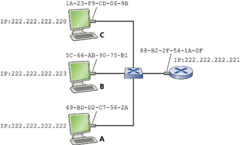

Figure 6.17 Each interface on a LAN has an IP address and a MAC address dotted-decimal notation and MAC addresses are shown in hexadecimal notation. For the purposes of this discussion, we will assume in this section that the switch broadcasts all frames; that is, whenever a switch receives a frame on one interface, it forwards the frame on all of its other interfaces. In the next section, we will provide a more accurate explanation of how switches operate.

Principles in Practice Keeping the Layers Independent There are several reasons why hosts and router interfaces have MAC addresses in addition to network-layer addresses. First, LANs are designed for arbitrary network-layer protocols, not just for IP and the Internet. If adapters were assigned IP addresses rather than “neutral” MAC addresses, then adapters would not easily be able to support other network-layer protocols (for example, IPX or DECnet).

Second, if adapters were to use network-layer addresses instead of MAC addresses, the network-layer address would have to be stored in the adapter RAM and reconfigured every time the adapter was moved (or powered up).Another option is to not use any addresses in the adapters and have each adapter pass the data (typically, an IP datagram) of each frame it receives up the protocol stack. The network layer could then check for a matching network-layer address. One problem with this option is that the host would be interrupted by every frame sent on the LAN, including by frames that were destined for other hosts on the same broadcast LAN.

In summary, in order for the layers to be largely independent building blocks in a network architecture, different layers need to have their own addressing scheme. We have now seen three types of addresses: host names for the application layer, IP addresses for the network layer, and MAC addresses for the link layer.

Now suppose that the host with IP address 222.222.222.220 wants to send an IP datagram to host 222.222.222.222. In this example, both the source and destination are in the same subnet, in the addressing sense of Section 4.3.3. To send a datagram, the source must give its adapter not only the IP datagram but also the MAC address for destination 222.222.222.222. The sending adapter will then construct a link-layer frame containing the destination’s MAC address and send the frame into the LAN.

The important question addressed in this section is, How does the sending host determine the MAC address for the destination host with IP address 222.222.222.222? As you might have guessed, it uses ARP. An ARP module in the sending host takes any IP address on the same LAN as input, and returns the corresponding MAC address. In the example at hand, sending host
222.222.222.220 provides its ARP module the IP address 222.222.222.222, and

the ARP module returns the corresponding MAC address 49-BD-D2-C7-56-2A.

So we see that ARP resolves an IP address to a MAC address. In many ways it is analogous to DNS (studied in Section 2.5), which resolves host names to IP addresses. However, one important difference between the two resolvers is that DNS resolves host names for hosts anywhere in the Internet, whereas ARP resolves IP addresses only for hosts and router interfaces on the same subnet. If a node in California were to try to use ARP to resolve the IP address for a node in Mississippi, ARP would return with an error.

Figure 6.18 A

possible ARP table in 222.222.222.220

Now that we have explained what ARP does, let’s look at how it works.

Each host and router has an ARP table in its memory, which contains mappings of IP addresses to MAC addresses. Figure 6.18 shows what an ARP table in host 222.222.222.220 might look like. The ARP table also contains a time-tolive (TTL) value, which indicates when each mapping will be deleted from the table.

Note that a table does not necessarily contain an entry for every host and router on the subnet; some may have never been entered into the table, and others may have expired. A typical expiration time for an entry is 20 minutes from when an entry is placed in an ARP table.

Now suppose that host 222.222.222.220 wants to send a datagram that is IP-addressed to another host or router on that subnet. The sending host needs to obtain the MAC address of the destination given the IP address. This task is easy if the sender’s ARP table has an entry for the destination node. But what if the ARP table doesn’t currently have an entry for the destination? In particular, suppose 222.222.222.220 wants to send a datagram to 222.222.222.222. In this case, the sender uses the ARP protocol to resolve the address. First, the sender constructs a special packet called an ARP packet. An ARP packet has several fields, including the sending and receiving IP and MAC addresses. Both ARP query and response packets have the same format. The purpose of the ARP query packet is to query all the other hosts and routers on the subnet to determine the MAC address corresponding to the IP address that is being resolved.

Returning to our example, 222.222.222.220 passes an ARP query packet to the adapter along with an indication that the adapter should send the packet to the MAC broadcast address, namely, FF-FF-FF-FF-FF-FF. The adapter encapsulates the ARP packet in a link-layer frame, uses the broadcast address for the frame’s destination address, and transmits the frame into the subnet. Recalling our social security number/postal address analogy, an ARP query is equivalent to a person shouting out in a crowded room of cubicles in some company (say, AnyCorp): “What is the social security number of the person whose postal address is Cubicle 13, Room 112, AnyCorp, Palo Alto, California?” The frame containing the ARP query is received by all the other adapters on the subnet, and (because of the broadcast address) each adapter passes the ARP packet within the frame up to its ARP module. Each of these ARP modules checks to see if its IP address matches the destination IP address in the ARP packet. The one with a match sends back to the querying host a response ARP packet with the desired mapping. The querying host
222.222.222.220 can then update its ARP table and send its IP datagram,

encapsulated in a link-layer frame whose destination MAC is that of the host or router responding to the earlier ARP query.

There are a couple of interesting things to note about the ARP protocol.

First, the query ARP message is sent within a broadcast frame, whereas the response ARP message is sent within a standard frame. Before reading on you should think about why this is so. Second, ARP is plug-and-play; that is, an ARP table gets built automatically—it doesn’t have to be configured by a system administrator. And if a host becomes disconnected from the subnet, its entry is eventually deleted from the other ARP tables in the subnet.

Students often wonder if ARP is a link-layer protocol or a network-layer protocol. As we’ve seen, an ARP packet is encapsulated within a link-layer frame and thus lies architecturally above the link layer. However, an ARP packet has fields containing link-layer addresses and thus is arguably a linklayer protocol, but it also contains network-layer addresses and thus is also arguably a network-layer protocol. In the end, ARP is probably best considered a protocol that straddles the boundary between the link and network layers— not fitting neatly into the simple layered protocol stack we studied in Chapter 1. Such are the complexities of real-world protocols!

Sending a Datagram off the Subnet It should now be clear how ARP operates when a host wants to send a datagram to another host on the same subnet. But now let’s look at the more complicated situation when a host on a subnet wants to send a network-layer datagram to a host off the subnet (that is, across a router onto another subnet).

Let’s discuss this issue in the context of Figure 6.19, which shows a simple network consisting of two subnets interconnected by a router.

There are several interesting things to note about Figure 6.19. Each host has exactly one IP address and one adapter. But, as discussed in Chapter 4, a router has an IP address for each of its interfaces. For each router interface there is also an ARP module (in the router) and an adapter. Because the router in Figure 6.19 has two interfaces, it has two IP addresses, two ARP modules, and two adapters. Of course, each adapter in the network has its own MAC address.

Also note that Subnet 1 has the network address 111.111.111 24 and that Subnet 2 has the network address 222.222.222 24. Thus, all of the interfaces connected to Subnet 1 have addresses of the form 111.111.111.xxx and all of the interfaces connected to Subnet 2 have addresses of the form 222.222.222.xxx.

Now let’s examine how a host on Subnet 1 would send a datagram to a host on Subnet 2. Specifically, suppose that host 111.111.111.111 wants to send an IP datagram to a host 222.222.222.222. The sending host passes the datagram to its adapter, as usual. But the sending host must also indicate to its Figure 6.19 Two subnets interconnected by a router

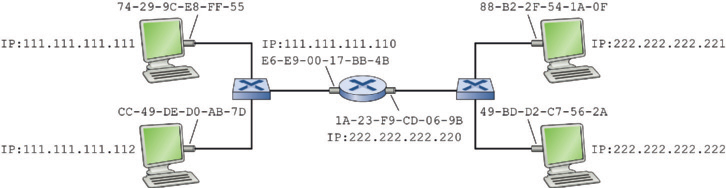

adapter an appropriate destination MAC address. What MAC address should the adapter use? One might be tempted to guess that the appropriate MAC address is that of the adapter for host 222.222.222.222, namely, 49-BD-D2-C7-56-2A. This guess, however, would be wrong! If the sending adapter were to use that MAC address, then none of the adapters on Subnet 1 would bother to pass the IP datagram up to its network layer, since the frame’s destination address would not match the MAC address of any adapter on Subnet 1. The datagram would just die and go to datagram heaven.

If we look carefully at Figure 6.19, we see that in order for a datagram to go from 111.111.111.111 to a host on Subnet 2, the datagram must first be sent to the router interface 111.111.111.110, which is the IP address of the first-hop router on the path to the final destination. Thus, the appropriate MAC address for the frame is the address of the adapter for router interface 111.111.111.110, namely, E6-E9-00-17-BB-4B.How does the sending host acquire the MAC address for 111.111.111.110? By using ARP, of course! Once the sending adapter has this MAC address, it creates a frame (containing the datagram addressed to 222.222.222.222) and sends the frame into Subnet 1.The router adapter on Subnet 1 sees that the link-layer frame is addressed to it, and therefore passes the frame to the network layer of the router. Hooray—the IP datagram has successfully been moved from source host to the router!

But we are not finished. We still have to move the datagram from the router to the destination. The router now has to determine the correct interface on which the datagram is to be forwarded. As discussed in Chapter 4, this is done by consulting a forwarding table in the router. The forwarding table tells the router that the datagram is to be forwarded via router interface 222.222.222.220. This interface then passes the datagram to its adapter, which encapsulates the datagram in a new frame and sends the frame into Subnet 2. This time, the destination MAC address of the frame is indeed the MAC address of the ultimate destination. And how does the router obtain this destination MAC address? From ARP, of course!

ARP for Ethernet is defined in RFC 826. A nice introduction to ARP is given in the TCP/IP tutorial, RFC 1180. We’ll explore ARP in more detail in the homework problems.

##### 6.4.2 Ethernet

Ethernet has pretty much taken over the wired LAN market. In the 1980s and the early 1990s, Ethernet faced many challenges from other LAN technologies, including token ring, FDDI, and ATM. Some of these other technologies succeeded in capturing a part of the LAN market for a few years. But since its invention in the mid-1970s, Ethernet has continued to evolve and grow and has held on to its dominant position. Today, Ethernet is by far the most prevalent wired LAN technology, and it is likely to remain so for the foreseeable future. One might say that Ethernet has been to local area networking what the Internet has been to global networking.

There are many reasons for Ethernet’s success. First, Ethernet was the first widely deployed high-speed LAN. Because it was deployed early, network administrators became intimately familiar with Ethernet—its wonders and its quirks—and were reluctant to switch over to other LAN technologies when they came on the scene. Second, token ring, FDDI, and ATM were more complex and expensive than Ethernet, which further discouraged network administrators from switching over. Third, the most compelling reason to switch to another LAN technology (such as FDDI or ATM) was usually the higher data rate of the new technology; however, Ethernet always fought back, producing versions that operated at equal data rates or higher. Switched Ethernet was also introduced in the early 1990s, which further increased its effective data rates. Finally, because Ethernet has been so popular, Ethernet hardware (in particular, adapters and switches) has become a commodity and is remarkably cheap.

The original Ethernet LAN was invented in the mid-1970s by Bob Metcalfe and David Boggs. The original Ethernet LAN used a coaxial bus to interconnect the nodes. Bus topologies for Ethernet actually persisted throughout the 1980s and into the mid-1990s. Ethernet with a bus topology is a broadcast LAN—all transmitted frames travel to and are processed by all adapters connected to the bus. Recall that we covered Ethernet’s CSMA/CD multiple access protocol with binary exponential backoff in Section 6.3.2.

By the late 1990s, most companies and universities had replaced their LANs with Ethernet installations using a hub-based star topology. In such an installation the hosts (and routers) are directly connected to a hub with twistedpair copper wire. A hub is a physical-layer device that acts on individual bits rather than frames. When a bit, representing a zero or a one, arrives from one interface, the hub simply re-creates the bit, boosts its energy strength, and transmits the bit onto all the other interfaces. Thus, Ethernet with a hub-based star topology is also a broadcast LAN—whenever a hub receives a bit from one of its interfaces, it sends a copy out on all of its other interfaces. In particular, if a hub receives frames from two different interfaces at the same time, a collision occurs and the nodes that created the frames must retransmit.

In the early 2000s, Ethernet experienced yet another major evolutionary change. Ethernet installations continued to use a star topology, but the hub at the center was replaced with a switch. We’ll be examining switched Ethernet in depth later in this chapter. For now, we only mention that a switch is not only “collision-less” but is also a bona-fide store-and-forward packet switch;

but unlike routers, which operate up through layer 3, a switch operates only up through layer 2.

Ethernet Frame Structure We can learn a lot about Ethernet by examining the Ethernet frame, which is shown in Figure 6.20. To give this discussion about Ethernet frames a tangible context, let’s consider sending an IP datagram from one host to another host, with both hosts on the same Ethernet LAN (for example, the Ethernet LAN in Figure 6.17.) (Although the payload of our Ethernet frame is an IP datagram, we note that an Ethernet frame can carry other network-layer packets as well.) Let the sending adapter, adapter A, have the MAC address AA-AA-AA-AA-AA-AA and the receiving adapter, adapter B, have the MAC address  BB-BB-BB-BB-BB-BB. The sending adapter encapsulates the IP datagram within an Ethernet frame and passes the frame to the physical layer.

Figure 6.20 Ethernet

frame structure

The receiving adapter receives the frame from the physical layer, extracts the IP datagram, and passes the IP datagram to the network layer. In this context, let’s now examine the six fields of the Ethernet frame, as shown in Figure 6.20.

• Data field (46 to 1,500 bytes ). This field carries the IP datagram. The maxi-

mum transmission unit (MTU) of Ethernet is 1,500 bytes. This means that if the IP datagram exceeds 1,500 bytes, then the host has to fragment the datagram, as discussed in Section 4.3.2. The minimum size of the data field is 46 bytes. This means that if the IP datagram is less than 46 bytes, the data field has to be “stuffed” to fill it out to 46 bytes. When stuffing is used, the data passed to the network layer contains the stuffing as well as an IP datagram. The network layer uses the length field in the IP datagram header to remove the stuffing.

• Destination address ( 6 bytes ) . This field contains the MAC address of the

destination adapter, BB-BB-BB-BB-BB-BB. When adapter B receives an Ethernet frame whose destination address is either BB-BB-BB-BB-BB-BB or the MAC broadcast address, it passes the contents of the frame’s data field to the network layer; if it receives a frame with any other MAC address, it discards the frame.

• Source address ( 6 bytes ). This field contains the MAC address of the

adapter that transmits the frame onto the LAN, in this example, AA-AA-AA-AA-AA-AA.

• Type field ( 2 bytes ) . The type field permits Ethernet to multiplex network-

layer protocols. To understand this, we need to keep in mind that hosts can use other network-layer protocols besides IP. In fact, a given host may support multiple network-layer protocols using different protocols for different applications. For this reason, when the Ethernet frame arrives at adapter B, adapter B needs to know to which network-layer protocol it should pass (that is, demultiplex) the contents of the data field. IP and other network-layer protocols (for example, Novell IPX or AppleTalk) each have their own, standardized type number. Furthermore, the ARP protocol (discussed in the previous section) has its own type number, and if the arriving frame contains an ARP packet (i.e., has a type field of 0806 hexadecimal), the ARP packet will be demultiplexed up to the ARP protocol. Note that the type field is analogous to the protocol field in the network-layer datagram and the port-number fields in the transport-layer segment; all of these fields serve to glue a protocol at one layer to a protocol at the layer above.

• Cyclic redundancy check (CRC) ( 4 bytes ). As discussed in Section 6.2.3, the

purpose of the CRC field is to allow the receiving adapter, adapter B, to detect bit errors in the frame.

• Preamble ( bytes ). The Ethernet frame begins with an 8-byte preamble

field. Each of the first 7 bytes of the preamble has a value of 10101010; the last byte is 10101011. The first 7 bytes of the preamble serve to “wake up” the receiving adapters and to synchronize their clocks to that of the sender’s clock. Why should the clocks be out of synchronization? Keep in mind that adapter A aims to transmit the frame at 10 Mbps, 100 Mbps, or 1 Gbps, depending on the type of Ethernet LAN. However, because nothing is absolutely perfect, adapter A will not transmit the frame at exactly the target rate; there will always be some drift from the target rate, a drift which is not known a priori by the other adapters on the LAN. A receiving adapter can lock onto adapter A’s clock simply by locking onto the bits in the first 7 bytes of the preamble. The last 2 bits of the eighth byte of the preamble (the first two consecutive 1s) alert adapter B that the “important stuff” is about to come.

All of the Ethernet technologies provide connectionless service to the network layer. That is, when adapter A wants to send a datagram to adapter B, adapter A encapsulates the datagram in an Ethernet frame and sends the frame into the LAN, without first handshaking with adapter B. This layer-2 connectionless service is analogous to IP’s layer-3 datagram service and UDP’s layer-4 connectionless service.

Ethernet technologies provide an unreliable service to the network layer.

Specifically, when adapter B receives a frame from adapter A, it runs the frame through a CRC check, but neither sends an acknowledgment when a frame passes the CRC check nor sends a negative acknowledgment when a frame fails the CRC check. When a frame fails the CRC check, adapter B simply discards the frame. Thus, adapter A has no idea whether its transmitted frame reached adapter B and passed the CRC check. This lack of reliable transport (at the link layer) helps to make Ethernet simple and cheap. But it also means that the stream of datagrams passed to the network layer can have gaps.

Case History Bob Metcalfe and Ethernet As a PhD student at Harvard University in the early 1970s, Bob Metcalfe worked on the ARPAnet at MIT. During his studies, he also became exposed to Abramson’s work on ALOHA and random access protocols. After completing his PhD and just before beginning a job at Xerox Palo Alto Research Center (Xerox PARC), he visited Abramson and his University of Hawaii colleagues for three months, getting a firsthand look at ALOHAnet. At Xerox PARC, Metcalfe became exposed to Alto computers, which in many ways were the forerunners of the personal computers of the 1980s. Metcalfe saw the need to network these computers in an inexpensive manner. So armed with his knowledge about ARPAnet, ALOHAnet, and random access protocols, Metcalfe—along with colleague David Boggs—invented Ethernet.

Metcalfe and Boggs’s original Ethernet ran at 2.94 Mbps and linked up to 256 hosts separated by up to one mile. Metcalfe and Boggs succeeded at getting most of the researchers at Xerox PARC to communicate through their Alto computers. Metcalfe then forged an alliance between Xerox, Digital, and Intel to establish Ethernet as a 10 Mbps Ethernet standard, ratified by the IEEE.

Xerox did not show much interest in commercializing Ethernet. In 1979, Metcalfe formed his own company, 3Com, which developed and commercialized networking technology, including Ethernet technology. In particular, 3Com developed and marketed Ethernet cards in the early 1980s for the immensely popular IBM PCs.

In 2022, Metcalfe received the ACM A.M. Turing Award (often referred to as the “Nobel Prize of Computer Science”) for the invention, standardization, and commercialization of Ethernet [ACM 2022].

If there are gaps due to discarded Ethernet frames, does the application at Host B see gaps as well? As we learned in Chapter 3, this depends on whether the application is using UDP or TCP. If the application is using UDP, then the application in Host B will indeed see gaps in the data. On the other hand, if the application is using TCP, then TCP in Host B will not acknowledge the data contained in discarded frames, causing TCP in Host A to retransmit. Note that when TCP retransmits data, the data will eventually return to the Ethernet adapter at which it was discarded. Thus, in this sense, Ethernet does retransmit data, although Ethernet is unaware of whether it is transmitting a brand-new datagram with brand-new data, or a datagram that contains data that has already been transmitted at least once.

Ethernet Technologies In our discussion above, we’ve referred to Ethernet as if it were a single protocol standard. But in fact, Ethernet comes in many different flavors, with somewhat bewildering acronyms such as 10BASE-T, 10BASE-2, 100BASE-T, 1000BASE-LX, 10GBASE-T and 40GBASE-T. These and many other Ethernet technologies have been standardized over the years by the IEEE 802.3 CSMA/CD (Ethernet) working group [IEEE 802.3 2020]. While these acronyms may appear bewildering, there is actually considerable order here. The first part of the acronym refers to the speed of the standard: 10, 100, 1000, or 10G, for 10 Megabit (per second), 100 Megabit, Gigabit, 10 Gigabit and 40 Gigabit Ethernet, respectively. “BASE” refers to baseband Ethernet, meaning that the physical media only carries Ethernet traffic; almost all of the 802.3 standards are for baseband Ethernet. The final part of the acronym refers to the physical media itself;

Ethernet is both a link-layer and a physical-layer specification and is carried over a variety of physical media including coaxial cable, copper wire, and fiber. Generally, a “T” refers to twisted-pair copper wires.

Historically, an Ethernet was initially conceived of as a segment of coaxial cable. The early 10BASE-2 and 10BASE-5 standards specify 10 Mbps Ethernet over two types of coaxial cable, each limited in length to 500 meters. Longer runs could be obtained by using a repeater—a physical-layer device that receives a signal on the input side, and regenerates the signal on the output side. A coaxial cable corresponds nicely to our view of Ethernet as a broadcast medium—all frames transmitted by one interface are received at other interfaces, and Ethernet’s CSMA/CD protocol nicely solves the multiple access problem. Nodes simply attach to the cable, and voila, we have a local area network!

Ethernet has passed through a series of evolutionary steps over the years, and today’s Ethernet is very different from the original bus-topology designs using coaxial cable. In most installations today, nodes are connected to a switch via point-to-point segments made of copper wires or fiber-optic cables, as shown in Figures 6.15–6.17.

By the mid-2000s, various standards were in place for Gigabit  Ethernet, which as its name would suggest, transmits bits at a Gigabit per second. The original Ethernet MAC protocol and frame format from earlier 10 Mbs and 100 Mbps were preserved. But higher-speed physical layers were defined for twisted-pair copper wire  1000BASE-T , optical fiber (1000BASE-SX,  1000BASE-LX, 

1000BASE-LX10, 1000BASE-BX10) and copper cable  1000BASE-CX . Allow- 

able Ethernet distances range 10’s of meters (for twisted pair) to 10’s of kilometers for some optical physical layers.  Figure 6.21 shows these different standards and the common Ethernet MAC protocol and frame format. While Gigabit Ethernet remains in use today, higher speed Ethernet standards have been developed for 10, 40, 100, 200, and 400 Gbps.

Let’s conclude our discussion of Ethernet technology by posing a question that may have begun troubling you. In the days of bus topologies and hubbased star topologies, Ethernet was clearly a broadcast link (as defined in Section 6.3) in which frame collisions occurred when nodes transmitted at the same time. To deal with these collisions, the Ethernet standard included the CSMA/CD protocol, which is particularly effective for a wired broadcast LAN spanning a small geographical region. But if the prevalent use of Ethernet today is a switch-based star topology, using store-and-forward packet switching, is there really a need anymore for an Ethernet MAC protocol? As we’ll see shortly, a switch coordinates its transmissions and never forwards more than one frame onto the same interface at any time. Furthermore, modern switches are full-duplex, so that a switch and a node can each send frames to each other at the same time without interference. In other words, in a switch-based Ethernet LAN there are no collisions and, therefore, there is no need for a MAC protocol!

As we’ve seen, today’s Ethernets are very different from the original Ethernet conceived by Metcalfe and Boggs more than 40 years ago—speeds have increased by three orders of magnitude, Ethernet frames are carried over a variety of media, switched-Ethernets have become dominant, and now even

Figure 6.21 100

Gbps Ethernet standards:

A common link layer, different physical layers the MAC protocol is often unnecessary! Is all of this really still Ethernet? The answer, of course, is “yes, by definition.” It is interesting to note, however, that through all of these changes, there has indeed been one enduring constant that has remained unchanged over nearly 50 years—Ethernet’s frame format [Metcalfe 2025]. Perhaps this then is the one true and timeless centerpiece of the Ethernet standard.

##### 6.4.3 Link-Layer Switches

Up until this point, we have been purposefully vague about what a switch actually does and how it works. The role of the switch is to receive incoming link-layer frames and forward them onto outgoing links; we’ll study this forwarding function in detail in this subsection. We’ll see that the switch itself is transparent to the hosts and routers in the subnet; that is, a host/router addresses a frame to another host/router (rather than addressing the frame to the switch) and happily sends the frame into the LAN, unaware that a switch will be receiving the frame and forwarding it. The rate at which frames arrive to any one of the switch’s output interfaces may temporarily exceed the link capacity of that interface. To accommodate this problem, switch output interfaces have buffers, in much the same way that router output interfaces have buffers for datagrams. Let’s now take a closer look at how switches operate.

Forwarding and Filtering Filtering is the switch function that determines whether a frame should be forwarded to some interface or should just be dropped. Forwarding is the switch function that determines the interfaces to which a frame should be directed, and then moves the frame to those interfaces. Switch filtering and forwarding are done with a switch table. The switch table contains entries for some, but not necessarily all, of the hosts and routers on a LAN. An entry in the switch table contains (1) a MAC address, (2) the switch interface that leads toward that MAC address, and (3) the time at which the entry was placed in the table.

An example switch table for the uppermost switch in Figure 6.15 is shown in Figure 6.22. This description of frame forwarding may sound similar to our discussion of datagram forwarding in Chapter 4. Indeed, in our discussion of generalized forwarding in Section 4.4, we learned that many modern packet switches can be configured to forward on the basis of layer-2 destination MAC addresses (i.e., function as a layer-2 switch) or layer-3 IP destination addresses (i.e., function as a layer-3 router). Nonetheless, we’ll make the important distinction that switches forward packets based on MAC addresses rather than on IP addresses. We will also see that a traditional (i.e., in a non-SDN context)

Figure 6.22 Portion

of a switch table for the uppermost switch in Figure 6.15 switch table is constructed in a very different manner from a router’s forwarding table.

To understand how switch filtering and forwarding work, suppose a frame with destination address DD-DD-DD-DD-DD-DD arrives at the switch on interface x. The switch indexes its table with the MAC address

DD-DD-DD-DD-DD-DD. There are three possible cases:

• There is no entry in the table for DD-DD-DD-DD-DD-DD. In this case, the switch forwards copies of the frame to the output buffers preceding all interfaces except for interface x. In other words, if there is no entry for the

destination address, the switch broadcasts the frame.

• There is an entry in the table, associating DD-DD-DD-DD-DD-DD with interface x. In this case, the frame is coming from a LAN segment that contains adapter DD-DD-DD-DD-DD-DD. There being no need to forward the frame to any of the other interfaces, the switch performs the filtering function by discarding the frame.

• There is an entry in the table, associating DD-DD-DD-DD-DD-DD with interface y ≠ x . In this case, the frame needs to be forwarded to the LAN

segment attached to interface y. The switch performs its forwarding function by putting the frame in an output buffer that precedes interface y.

Let’s walk through these rules for the uppermost switch in Figure 6.15 and its switch table in Figure 6.22.Suppose that a frame with destination address 62-FE-F7-11-89-A3 arrives at the switch from interface 1.The switch examines its table and sees that the destination is on the LAN segment connected to interface 1 (that is, Electrical Engineering).

This means that the frame has already been broadcast on the LAN segment that contains the destination. The switch therefore filters (that is, discards) the frame. Now suppose a frame with the same destination address arrives from interface 2. The switch again examines its table and sees that the destination is in the direction of interface 1; it therefore forwards the frame to the output buffer preceding interface 1. It should be clear from this example that as long as the switch table is complete and accurate, the switch forwards frames toward destinations without any broadcasting.

In this sense, a switch is “smarter” than a hub. But how does this switch table get configured in the first place? Are there link-layer equivalents to network-layer routing protocols? Or must an overworked manager manually configure the switch table?

Self-Learning A switch has the wonderful property (particularly for the already-overworked network administrator) that its table is built automatically, dynamically, and autonomously—without any intervention from a network administrator or from a configuration protocol.

In other words, switches are self-learning. This capability is accomplished as follows:

1.  The switch table is initially empty.

2.  For each incoming frame received on an interface, the switch stores in its table (1) the MAC address in the frame’s source address field, (2) the interface

Figure 6.23 Switch

learns about the location of an adapter with address

01-12-23-34-45-56

from which the frame arrived, and (3) the current time.

In this manner, the switch records in its table the LAN segment on which the sender resides.

If every host in the LAN eventually sends a frame, then every host will eventually get recorded in the table.

3.The switch deletes an address in the table if no frames are received with that address as the source address after some period of time (the aging time).

In this manner, if a PC is replaced by another PC (with a different adapter), the MAC address of the original PC will eventually be purged from the switch table.

Let’s walk through the self-learning property for the uppermost switch in Figure 6.15 and its corresponding switch table in Figure 6.22. Suppose at time 9:39 a frame with source address 01-12-23-34-45-56 arrives from interface 2.

Suppose that this address is not in the switch table. Then the switch adds a new entry to the table, as shown in Figure 6.23.

Continuing with this same example, suppose that the aging time for this switch is 60 minutes, and no frames with source address 62-FE-F7-11-89-A3 arrive to the switch between 9:32 and 10:32. Then at time 10:32, the switch removes this address from its table.

Switches are plug-and-play devices because they require no intervention from a network administrator or user. A network administrator wanting to install a switch need do nothing more than connect the LAN segments to the switch interfaces. The administrator need not configure the switch tables at the time of installation or when a host is removed from one of the LAN segments.

Switches are also full-duplex, meaning any switch interface can send and receive at the same time.

Properties of Link-Layer Switching Having described the basic operation of a link-layer switch, let’s now consider their features and properties. We can identify several advantages of using switches, rather than broadcast links such as buses or hub-based star topologies:

• Elimination of collisions. In a LAN built from switches (and without hubs), there is no wasted bandwidth due to collisions! The switches buffer frames and never transmit more than one frame on a segment at any one time. As with a router, the maximum aggregate throughput of a switch is the sum of all the switch interface rates. Thus, switches provide a significant performance improvement over LANs with broadcast links.

• Heterogeneous links. Because a switch isolates one link from another, the different links in the LAN can operate at different speeds and can run over different media. For example, the uppermost switch in Figure 6.15 might have three 1 Gbps 1000BASE-T copper links, two 100 Mbps 100BASE-FX fiber links, and one 100BASE-T copper link. Thus, a switch is ideal for mixing legacy equipment with new equipment.

• Management. In addition to providing enhanced security (see sidebar on Focus on Security), a switch also eases network management. For example, if an adapter malfunctions and continually sends Ethernet frames (called a jabbering adapter), a switch can detect the problem and internally disconnect the malfunctioning adapter. With this feature, the network administrator need not get out of bed and drive back to work in order to correct the problem. Similarly, a cable cut disconnects only that host that was using the cut cable to connect to the switch. In the days of coaxial cable, many a network manager spent hours “walking the line” (or more accurately, “crawling the floor”) to find the cable break that brought down the entire network. Switches also gather statistics on bandwidth usage, collision rates, and traffic types, and make this information available to the network manager. This information can be used to debug and correct problems, and to plan how the LAN should evolve in the future.

Researchers are exploring adding yet more management functionality into Ethernet LANs in prototype deployments [Casado 2007; Koponen 2011].

Focus on Security Sniffing a Switched Lan: Switch Poisoning When a host is connected to a switch, it typically only receives frames that are intended for it. For example, consider a switched LAN in Figure 6.17. When host A sends a frame to host B, and there is an entry for host B in the switch table, then the switch will forward the frame only to host B. If host C happens to be running a

sniffer, host C will not be able to sniff this A-to-B frame. Thus, in a switched-LAN environment (in contrast to a broadcast link environment such as 802.11 LANs or hub–based Ethernet LANs), it is more difficult for an attacker to sniff frames.

However , because the switch broadcasts frames that have destination addresses that are not in the switch table, the sniffer at C can still sniff some frames that are not intended for C. Furthermore, a sniffer will be able sniff all Ethernet broadcast frames with broadcast destination address FF–FF–FF–FF–FF–FF. A well-known attack against a switch, called switch poisoning , is to send tons of packets to

the switch with many different bogus source MAC addresses, thereby filling the switch table with bogus entries and leaving no room for the MAC addresses of the legitimate hosts. This causes the switch to broadcast most frames, which can then be picked up by the sniffer [Skoudis 2006]. As this attack is rather involved even for a sophisticated attacker, switches are significantly less vulnerable to sniffing than are hubs and wireless LANs.

Switches Versus Routers As we learned in Chapter 4, routers are store-and-forward packet switches that forward packets using network-layer addresses. Although a switch is also a store-and-forward packet switch, it is fundamentally different from a router in that it forwards packets using MAC addresses. Whereas a router is a layer-3 packet switch, a switch is a layer-2 packet switch. Recall, however, that we learned in Section 4.4 that modern switches using the “match plus action” operation can be used to forward a layer-2 frame based on the frame’s destination MAC address, as well as a layer-3 datagram using the datagram’s destination IP address. Indeed, we saw that switches using the OpenFlow standard can perform generalized packet forwarding based on any of eleven different frame, datagram, and transport-layer header fields.

Even though switches and routers are fundamentally different, network administrators must often choose between them when installing an interconnection device. For example, for the network in Figure 6.15, the network administrator could just as easily have used a router instead of a switch to connect the department LANs, servers, and internet gateway router. Indeed, a router would permit interdepartmental communication without creating collisions. Given that both switches and routers are candidates for interconnection devices, what are the pros and cons of the two approaches?

First consider the pros and cons of switches. As mentioned above, switches are plug-and-play, a property that is cherished by all the overworked network administrators of the world. Switches can also have relatively high filtering and forwarding rates—as shown in Figure 6.24, switches have to process frames only up through layer 2, whereas routers have to process datagrams up through layer 3. On the other hand, to prevent the cycling of broadcast frames, the active topology of a switched network is restricted to a spanning tree. Also, a large switched network would require large ARP tables in the hosts and routers and would generate substantial ARP traffic and processing. Furthermore, switches are susceptible to broadcast storms—if one host goes haywire and transmits an endless stream of Ethernet broadcast frames, the switches will forward all of these frames, causing the entire network to collapse.

Now consider the pros and cons of routers. Because network addressing is often hierarchical (and not flat, as is MAC addressing), packets do not normally cycle through routers even when the network has redundant paths.

(However, packets can cycle when router tables are misconfigured; but as we learned in Chapter 4, IP uses a special datagram header field to limit the

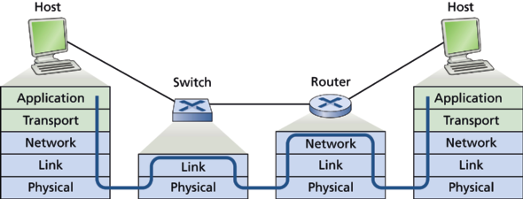

Figure 6.24 Packet processing in switches, routers, and hosts cycling.) Thus, packets are not restricted to a spanning tree and can use the best path between source and destination. Because routers do not have the spanning tree restriction, they have allowed the Internet to be built with a rich topology that includes, for example, multiple active links between Europe and North America. Another feature of routers is that they provide firewall protection against layer-2 broadcast storms. Perhaps the most significant drawback of routers, though, is that they are not plug-and-play—they and the hosts that connect to them need their IP addresses to be configured. Also, routers often have a larger per-packet processing time than switches, because they have to process up through the layer-3 fields. Finally, there are two different ways to pronounce the word router, either as “rootor” or as “rowter,” and people waste a lot of time arguing over the proper pronunciation [Perlman 1999].

Table 6.1 Comparison of the typical features of popular interconnection

devices

Hubs Routers Switches

Traffic isolation No Yes Yes

Plug and play Yes No Yes

Optimal routing No Yes No

Given that both switches and routers have their pros and cons (as summarized in Table 6.1), when should an institutional network (for example, a university campus network or a corporate campus network) use switches, and when should it use routers? Typically, small networks consisting of a few hundred hosts have a few LAN segments. Switches suffice for these small networks, as they localize traffic and increase aggregate throughput without requiring any configuration of IP addresses.

But larger networks consisting of thousands of hosts typically include routers within the network (in addition to switches). The routers provide a more robust isolation of traffic, control broadcast storms, and use more “intelligent” routes among the hosts in the network.

##### 6.4.4 Virtual Local Area Networks (VLANs)

In our earlier discussion of Figure 6.15, we noted that modern institutional LANs are often configured hierarchically, with each workgroup (department) having its own switched LAN connected to the switched LANs of other groups via a switch hierarchy. While such a configuration works well in an ideal world, the real world is often far from ideal. Three drawbacks can be identified in the configuration in Figure 6.15:

• Lack of traffic isolation. Although the hierarchy localizes group traffic to within a single switch, broadcast traffic (e.g., frames carrying ARP and DHCP messages or frames whose destination has not yet been learned by a self-learning switch) must still traverse the entire institutional network.

Limiting the scope of such broadcast traffic would improve LAN performance. Perhaps more importantly, it also may be desirable to limit LAN broadcast traffic for security/privacy reasons. For example, if one group contains the company’s executive management team and another group contains disgruntled employees running Wireshark packet sniffers, the network manager may well prefer that the executives’ traffic never even reaches employee hosts. This type of isolation could be provided by replacing the center switch in Figure 6.15 with a router. We’ll see shortly that this isolation also can be achieved via a switched (layer 2) solution.

• Inefficient use of switches. If instead of three groups, the institution had 10 groups, then 10 first-level switches would be required. If each group were small, say less than 10 people, then a single 96-port switch would likely be large enough to accommodate everyone, but this single switch would not provide traffic isolation.

• Managing users. If an employee moves between groups, the physical cabling must be changed to connect the employee to a different switch in Figure 6.15. Employees belonging to two groups make the problem even harder.

Fortunately, each of these difficulties can be handled by a switch that supports virtual local area networks(VLANs). As the name suggests, a switch that supports VLANs allows multiple virtual local area networks to be defined over a single physical local area network infrastructure. Hosts within a VLAN communicate with each other as if they (and no other hosts) were connected to the switch. In a port-based VLAN, the switch’s ports (interfaces) are divided into groups by the network manager. Each group constitutes a VLAN, with the ports in each VLAN forming a broadcast domain (i.e., broadcast traffic from one port can only reach other ports in the group). Figure 6.25 shows a single switch with 16 ports. Ports 2 to 8 belong to the EE VLAN, while ports 9 to 15 belong to the CS VLAN (ports 1 and 16 are unassigned). This VLAN solves all of the difficulties noted above—EE and CS VLAN frames are isolated from each other, the two switches in Figure 6.15 have been replaced by a single switch, and if the user at switch port 8 joins the CS Department, the network operator simply reconfigures the VLAN software so that port 8 is now associated with the CS VLAN. One can easily imagine how the VLAN switch is configured and operates—the network manager declares a port to belong to a given VLAN (with undeclared ports belonging to a default VLAN) using switch management software, a table of port-to-VLAN mappings is maintained within the switch; and switch hardware only delivers frames between ports belonging to the same VLAN.

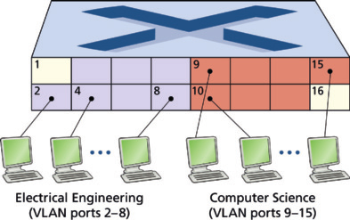

Figure 6.25 A single switch with two configured VLANs But by completely isolating the two VLANs, we have introduced a new difficulty! How can traffic from the EE Department be sent to the CS Department?

One way to handle this would be to connect a VLAN switch port (e.g., port 1 in Figure 6.25) to an external router and configure that port to belong both the EE and CS VLANs.

In this case, even though the EE and CS departments share the same physical switch, the logical configuration would look as if the EE and CS departments had separate switches connected via a router. An IP datagram going from the EE to the CS department would first cross the EE VLAN to reach the router and then be forwarded by the router back over the CS VLAN to the CS host. Fortunately, switch vendors make such configurations easy for the network manager by building a single device that contains both a VLAN switch and a router, so a separate external router is not needed. A homework problem at the end of the chapter explores this scenario in more detail.

Returning again to Figure 6.15, let’s now suppose that rather than having a separate Computer Engineering department, some EE and CS faculty are housed in a separate building, where (of course!) they need network access, and (of course!) they’d like to be part of their department’s VLAN.Figure 6.26 shows a second 8-port switch, where the switch ports have been defined as belonging to the EE or the CS VLAN, as needed.

But how should these two switches be interconnected? One easy solution would be to define a port belonging to the CS VLAN on each switch (similarly for the EE VLAN) and to connect these ports to each other, as shown in Figure 6.26(a). This solution doesn’t scale, however, since N VLANS would require N ports on each switch simply to interconnect the two switches.

A more scalable approach to interconnecting VLAN switches is known as VLAN trunking. In the VLAN trunking approach shown in Figure 6.26(b), Figure 6.26 Connecting two VLAN switches with two VLANs: (a) two cables (b) trunked

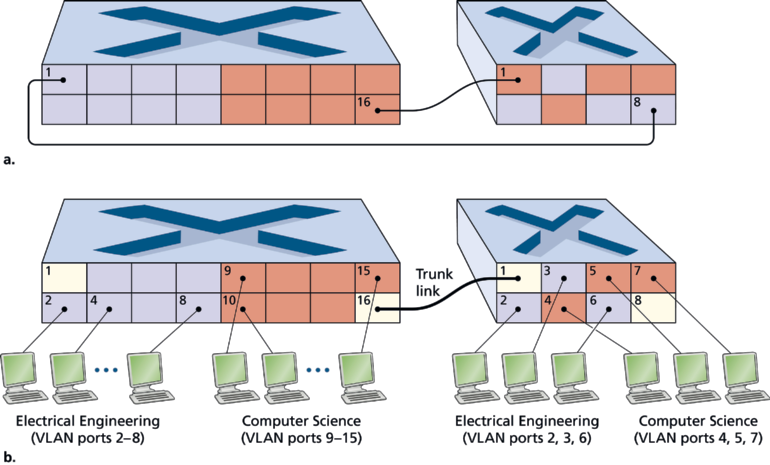

Figure 6.27 Original Ethernet frame (top), 802.1Q-tagged Ethernet VLAN

frame (below) a special port on each switch (port 16 on the left switch and port 1 on the right switch) is configured as a trunk port to interconnect the two VLAN switches.

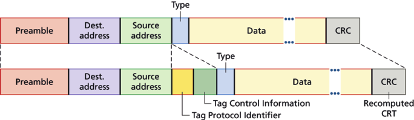

The trunk port belongs to all VLANs, and frames sent to any VLAN are forwarded over the trunk link to the other switch. But this raises yet another question: How does a switch know that a frame arriving on a trunk port belongs to a particular VLAN? The IEEE has defined an extended Ethernet frame format, 802.1Q, for frames crossing a VLAN trunk. As shown in  Figure 6.27, the 802.1Q frame consists of the standard Ethernet frame with a four-byte VLAN tag added into the header that carries the identity of the VLAN to which the frame belongs. The VLAN tag is added into a frame by the switch at the sending side of a VLAN trunk, parsed, and removed by the switch at the receiving side of the trunk. The VLAN tag itself consists of a 2-byte Tag Protocol Identifier (TPID) field (with a fixed hexadecimal value of 81-00), a 2-byte Tag Control Information field that contains a 12-bit VLAN identifier field, and a 3-bit priority field that is similar in intent to the IP datagram TOS field.

In this discussion, we’ve only briefly touched on VLANs and have focused on port-based VLANs. We should also mention that VLANs can be defined in several other ways. In MAC-based VLANs, the network manager specifies the set of MAC addresses that belong to each VLAN; whenever a device attaches to a port, the port is connected into the appropriate VLAN based on the MAC address of the device. VLANs can also be defined based on network-layer protocols (e.g., IPv4, IPv6, or Appletalk) and other criteria. See the 802.1Q standard [IEEE 802.1q 2005] for more details. It is also possible for VLANs to be extended across IP routers, allowing islands of LANs to be connected together to form a single VLAN that could span the globe [Yu 2011]. Indeed, VXLAN (Virtual Extensible LAN) technology, which we will cover in Section 6.5.2, allows virtual LANs to be created that cover larger geographical distances than VLANs.

#### 6.5 Link Virtualization: A Network as a Link Layer

Because this chapter concerns link-layer protocols, and given that we’re now nearing the chapter’s end, let’s reflect on how our understanding of the term link has evolved. We began this chapter by viewing the link as a physical wire connecting two communicating hosts. In studying multiple access protocols, we saw that multiple hosts could be connected by a shared wire and that the “wire” connecting the hosts could be radio spectra or other media. This led us to consider the link a bit more abstractly as a channel, rather than as a wire. In our study of Ethernet LANs (Figure 6.15), we saw that the interconnecting media could actually be a rather complex switched infrastructure. Throughout this evolution, however, the hosts themselves maintained the view that the interconnecting medium was simply a link-layer channel connecting two or more hosts. We saw, for example, that an Ethernet host can be blissfully unaware of whether it is connected to other LAN hosts by a single short LAN segment (Figure 6.17) or by a geographically dispersed switched LAN ( Figure 6.15) or by a VLAN (Figure 6.26).

In the case of a dialup modem connection between two hosts, the link connecting the two hosts is actually the telephone network—a logically separate, global telecommunications network with its own switches, links, and protocol stacks for data transfer and signaling. From the Internet link-layer point of view, however, the dial-up connection through the telephone network is viewed as a simple “wire.” In this sense, the Internet virtualizes the telephone network, viewing the telephone network as a link-layer technology providing link-layer connectivity between two Internet hosts. You may recall from our discussion of overlay networks in Chapter 2 that an overlay network similarly views the Internet as a means for providing connectivity between overlay nodes, seeking to overlay the Internet in the same way that the Internet overlays the telephone network.

In this section, we’ll cover two technologies in which a virtual link between two devices logically behaves like a single physical link, but in fact is implemented by an underlying complex network of interconnected devices. In Section 6.5.2 we’ll cover the VXLAN technology noted above. But the first example we’ll consider in Section 6.5.1 is Multiprotocol Label Switching (MPLS). Unlike the circuit-switched telephone network, MPLS is a packetswitched, virtual-circuit network in its own right. It has its own packet formats and forwarding behaviors. Thus, from a pedagogical viewpoint, a discussion of MPLS fits well into a study of either the network layer or the link layer.

From an Internet viewpoint, however, we can consider MPLS, like the telephone network and switched-Ethernets, as a link-layer technology that serves to interconnect IP devices. Our treatment of MPLS will be necessarily brief, as entire books could be (and have been) written on these networks. We recommend [Davie 2000] for details on MPLS. We’ll focus here primarily on how MPLS servers interconnect to IP devices, although we’ll dive a bit deeper into the underlying technologies as well.

##### 6.5.1 Multiprotocol Label Switching (MPLS)

Multiprotocol Label Switching (MPLS) evolved from a number of industry efforts in the mid-to-late 1990s to improve the forwarding speed of IP routers by adopting a key concept from the world of virtual-circuit networks: a fixed-length label. The goal was not to abandon the destination-based IP datagram-forwarding infrastructure for one based on fixed-length labels and virtual circuits, but to augment it by selectively labeling datagrams and allowing routers to forward datagrams based on fixed-length labels (rather than destination IP addresses) when possible. Importantly, these techniques work hand-in-hand with IP, using IP addressing and routing. The IETF unified these efforts in the MPLS protocol [RFC 3031, RFC 3032], effectively blending VC techniques into a routed datagram network.

Figure 6.28 MPLS

header: Located between link- and network-layer headers

Let’s begin our study of MPLS by considering the format of a link-layer frame that is handled by an MPLS-capable router. Figure 6.28 shows that a link-layer frame transmitted between MPLS-capable devices has a small MPLS header added between the layer-2 (e.g., Ethernet) header and layer-3 (i.e., IP) header. RFC 3032 defines the format of the MPLS header for such links; headers are defined for ATM and frame-relayed networks as well in other RFCs.

Among the fields in the MPLS header are the label, 3 bits reserved for experimental use, a single S bit, which is used to indicate the end of a series of “stacked” MPLS headers (an advanced topic that we’ll not cover here), and a time-to-live field.

It’s immediately evident from Figure 6.28 that an MPLS-enhanced frame can only be sent between routers that are both MPLS capable (since a non- MPLS-capable router would be quite confused when it found an MPLS header where it had expected to find the IP header!).An MPLS-capable router is often referred to as a label-switched router, since it forwards an MPLS frame by looking up the MPLS label in its forwarding table and then immediately passing the datagram to the appropriate output interface. Thus, the MPLS-capable router need not extract the destination IP address and perform a lookup of the longest prefix match in the forwarding table.

But how does a router know if its neighbor is indeed MPLS capable, and how does a router know what label to associate with the given IP destination? To answer these questions, we’ll need to take a look at the interaction among a group of MPLS-capable routers.

In the example in Figure 6.29, routers R1 through R4 are MPLS capable.

R5 and R6 are standard IP routers. R1 has advertised to R2 and R3 that it  R1 

can route to destination A, and that a received frame with MPLS label 6 will be forwarded to destination A. Router R3 has advertised to router R4 that it can route to destinations A and D, and that incoming frames with MPLS labels 10 and 12, respectively, will be switched toward those destinations. Router R2 has also advertised to router R4 that it  R2 can reach destination A, and that a 

received frame with MPLS label 8 will be switched toward A. Note that router R4 is now in the interesting position of having two MPLS paths to reach A: via interface 0 with outbound MPLS label 10, and via interface 1 with an MPLS label of 8. The broad picture painted in Figure 6.29 is that IP devices R5, R6, A, and D are connected together via an MPLS infrastructure (MPLS-capable routers R1, R2, R3, and R4) in much the same way that a switched LAN or an ATM network can connect together IP devices. And like a switched LAN or ATM network, the MPLS-capable routers R1 through R4 do so without ever touching the IP header of a packet.

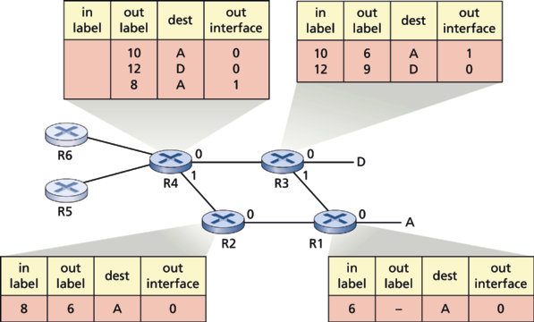

Figure 6.29 MPLS- enhanced forwarding

In our discussion above, we’ve not specified the specific protocol used to distribute labels among the MPLS-capable routers, as the details of this signaling are well beyond the scope of this book. We note, however, that the IETF working group on MPLS has specified in [RFC 3468] that an extension of the RSVP protocol, known as RSVP-TE [RFC 3209], will be the focus of its efforts for MPLS signaling. We’ve also not discussed how MPLS actually computes the paths for packets among MPLS capable routers, nor how it gathers linkstate information (e.g., amount of link bandwidth unreserved by MPLS) to use in these path computations. Existing link-state routing algorithms (e.g., OSPF) have been extended to flood this information to MPLS-capable routers. Interestingly, the actual path computation algorithms are not standardized, and are currently vendor-specific.

Thus far, the emphasis of our discussion of MPLS has been on the fact that MPLS performs switching based on labels, without needing to consider the IP address of a packet. The true advantages of MPLS and the reason for current interest in MPLS, however, lie not in the potential increases in switching speeds, but rather in the new traffic management capabilities that MPLS enables. As noted above, R4 has two MPLS paths to A. If forwarding were performed up at the IP layer on the basis of IP address, the IP routing protocols we studied in Chapter 5 would specify only a single, least-cost path to A. Thus, MPLS provides the ability to forward packets along routes that would not be possible using standard IP routing protocols. This is one simple form of traffic engineering using MPLS [RFC 3346; RFC 3272; RFC 2702; Xiao 2000], in which a network operator can override normal IP routing and force some of the traffic headed toward a given destination along one path, and other traffic destined toward the same destination along another path (whether for policy, performance, or some other reason).

It is also possible to use MPLS for many other purposes as well. It can be used to perform fast restoration of MPLS forwarding paths, e.g., to reroute traffic over a precomputed failover path in response to link failure [Kar 2000;

Huang 2002; RFC 3469].Finally, we note that MPLS can, and has, been used to implement so-called virtual private networks (VPNs). In implementing a VPN for a customer, an ISP uses its MPLS-enabled network to connect together the customer’s various networks. MPLS can be used to isolate both the resources and addressing used by the customer’s VPN from that of other users crossing the ISP’s network; see [DeClercq 2002] for details. We’ll also cover VPNs in more detail in Section 8.7.1.

Our discussion of MPLS has been brief, and we encourage you to consult [Davie 2000] and the reference above. We note that MPLS rose to prominence before the development of software-defined networking, which we studied in Chapter 5, and that many of MPLS’ traffic engineering capabilities can also be achieved via SDN and the generalized forwarding paradigm we studied in Chapter 4. Only the future will tell whether MPLS and SDN will continue to co-exist, or whether newer technologies (such as SDN) will eventually replace MPLS.

##### 6.5.2 VXLANs: Ethernet Over IP

The 802.11Q VLANs that we studied in Section 6.4.4 have two important limitations—they are constrained to have no more than 4,096 VLANs (due to the 12-bit VLAN identifier field in the 802.11Q VLAN tag) and must be contained within a single all-switched-Ethernet-end-to-end LAN infrastructure. Is it possible to build even larger virtual LANS, or to connect layer-2 devices that are located around the globe into a virtual LAN? The answer to both of these questions is “Yes!” , using an approach known as Virtual extensible Local-Area Networks, or VXLANs [RFC 7348].

Figure 6.30 shows the simple case of two physically separate Ethernet LANs—one in Sunnyvale, California and one in Bangalore, India—that are combined into a single logical VXLAN such that an Ethernet frame sent from a host in the Sunnyvale Ethernet segment that is addressed to the MAC address of a host in the Bangalore Ethernet will be received at that host in Bangalore!

This is accomplished by creating a link-layer tunnel with one endpoint on a device on the Sunnyvale LAN and the other endpoint on a device on the Bangalore LAN. An Ethernet frame entering the tunnel on the Sunnyvale LAN will exit the tunnel on the Bangalore LAN. A VXLAN tunnel extends an Ethernet, or more generally a layer 2 subnet, across layer 3 network boundaries. You may recall that we saw tunneling used in Chapter 4 to connect one IPv6 network to another IPv6 through an intermediary IPv4 network. With VXLANs, we have another example of how an entire network (in this case the IP network between the tunnel endpoints) is virtualized to be a single logical link. In Chapter 7, we’ll also see that tunneling is widely used in cellular networks. Indeed, tunneling appears in many, many network settings [Zave 2024].

The VXLAN Tunnel Endpoints (VTEPs) play a crucial role in VXLANs.A VTEP is an ordinary physical switch or router, or a virtualized switch or router in a data center, which is configured to implement VXLANs.

In Figure 6.30, tion includes a 24-bit VXLAN Network Identifier (VNI), which allows 16 million VXLANs to be identified per extended LAN. The large number of virtual LANs made possible with VXLANs is particularly valuable in data center use cases. The UDP datagram, containing the original Ethernet frame and header information, is then placed inside an IP datagram that is addressed to VTEP y, which implements the other end of the VXLAN tunnel. The IP network between x and y then delivers this IP datagram to y, as it would normally deliver any datagram, oblivious to the contents within. VTEP y receives the datagram and noting that it contains a UDP segment containing a VXLAN Ethernet frame, extracts and transmits the Ethernet frame on the Bangalore Ethernet. The original Ethernet frame with source MAC address A and destination MAC address B is then received at Host B. If you can wrap your mind around the rather unusual layering of encapsulating an Ethernet datagram inside a UDP segment inside an IP datagram, as shown in Figure 6.30, then you have truly mastered not only the concept of

Figure 6.30 A VXLAN containing segments in Sunnyvale and Bangalore Host A, which is in Sunnyvale, sends an Ethernet frame with the MAC destination address of Host B, which is in Bangalore. Being physically attached to the Sunnyvale LAN, VTEP x receives the frame and notes that it is destined to Host B, which it knows is at the other end of the tunnel. VTEP x then places the Ethernet frame in its entirety, together with some additional VXLAN header information, in the payload a standard UDP datagram. This header informa-

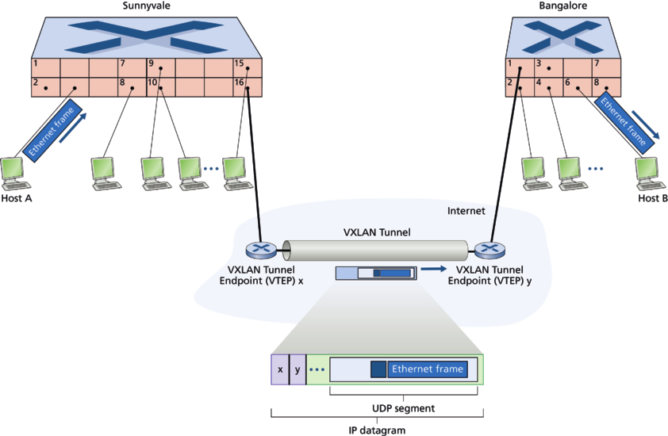

tunneling but also of link virtualization, and the notion of an entire network serving as a single virtual link!

In this brief discussion of VXLANs, we’ve skipped over some important issues. For example, how did VTEP x know that Host B lay at the other end of the tunnel, what VXLAN header information is included inside the UDP datagram, and what are the various use cases that require a large number of VXLANs? Good sources of information about the details of VXLANs and their use are [Arista VXLAN 2017; Cisco VXLAN 2014; Juniper VXLAN 2024; RFC 7348].

#### 6.6 Data Center Networking

Internet companies such as Google, Microsoft, Amazon, and Alibaba have built massive data centers, each housing tens to hundreds of thousands of hosts. As briefly discussed in the sidebar in Section 1.2, data centers are not only connected to the Internet, but also internally include complex computer networks, called data center networks, which interconnect their internal hosts.

In this section, we provide a brief introduction to data center networking for cloud applications.

Broadly speaking, data centers serve three purposes. First, they provide content such as Web pages, search results, AI chatbots, e-mail, or streaming video to users. Second, they serve as massively-parallel computing infrastructures for specific data processing tasks, such as distributed index computations for search engines. Third, they provide cloud computing to other companies.

Indeed, today a major trend in computing is for companies to use a cloud provider such as Amazon Web Services, Microsoft Azure, and Alibaba Cloud to handle essentially all of their IT needs.

##### 6.6.1 Data Center Architectures

Data center designs are carefully kept company secrets, as they often provide critical competitive advantages to leading cloud computing companies. In 2024, the cost to build a large-scale data center can range from many 100’s of millions of dollars to more than a billion dollars. About 45% of costs can be attributed to the hosts themselves (which need to be replaced every 3–4 years);

25 percent to infrastructure, including transformers, uninterruptable power supplies (UPS) systems, generators for long-term outages, and cooling systems; 15 percent for electric utility costs for the power draw; and 15 percent for networking, including network gear (switches, routers, and load balancers), external links, and transit traffic costs. (In these percentages, costs for equipment are amortized so that a common cost metric is applied for one-time purchases and ongoing expenses such as power.) While networking is not the largest cost, networking innovation is the key to reducing overall cost and maximizing performance [Greenberg 2009a].

The worker bees in a data center are the hosts. The hosts in data centers, called blades and resembling pizza boxes, are generally commodity hosts that include CPU, memory, and disk storage. The hosts are stacked in racks, with each rack typically having 20 to 40 blades. At the top of each rack, there is a switch, aptly named the Top of Rack (TOR) switch, that interconnects the hosts in the rack with each other and with other switches in the data center.

Specifically, each host in the rack has a network interface that connects to its TOR switch, and each TOR switch has additional ports that can be connected to other switches. Today, hosts typically have 40 Gbps or 100 Gbps Ethernet connections to their TOR switches [FB 2019; Greenberg 2015; Roy 2015; Singh 2015]. Each host is also assigned its own data-center-internal IP address.

The data center network supports two types of traffic: traffic flowing between external clients and internal hosts and traffic flowing between internal hosts. To handle flows between external clients and internal hosts, the data center network includes one or more border routers, connecting the data center network to the public Internet. The data center network therefore interconnects the racks with each other and connects the racks to the border routers. Figure 6.31 shows an example of a data center network. Data center network design, the art of designing the interconnection network and protocols that connect the racks with each other and with the border routers, has become an important branch of computer networking research in recent years.

(See references in this section.)

Load Balancing A cloud data center, such as one operated by Google, Microsoft, Amazon, and Alibaba, provides many applications concurrently, such as search, e-mail, and video applications. To support requests from external clients, each application is associated with a publicly visible IP address to which clients send their requests and from which they receive responses. Inside the data center, the Figure 6.31 A data center network with a hierarchical topology

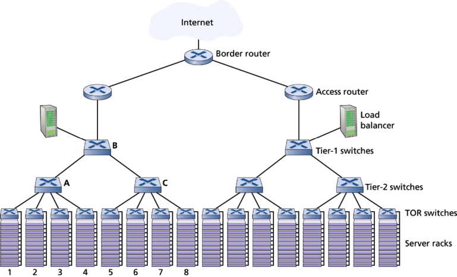

external requests are first directed to a load balancer whose job it is to distribute requests to the hosts, balancing the load across the hosts as a function of their current load [Patel 2013; Eisenbud 2016].A large data center will often have several load balancers, each one devoted to a set of specific cloud applications. Such a load balancer is sometimes referred to as a “layer-4 switch” since it makes decisions based on the destination port number (layer 4) as well as destination IP address in the packet. Upon receiving a request for a particular application, the load balancer forwards it to one of the hosts that handles the application. (A host may then invoke the services of other hosts to help process the request.) The load balancer not only balances the work load across hosts, but also provides a NAT-like function, translating the public external IP address to the internal IP address of the appropriate host, and then translating back for packets traveling in the reverse direction back to the clients.

This prevents clients from contacting hosts directly, which has the security benefit of hiding the internal network structure and preventing clients from directly interacting with the hosts.

Hierarchical Architecture For a small data center housing only a few thousand hosts, a simple network consisting of a border router, a load balancer, and a few tens of racks all interconnected by a single Ethernet switch could possibly suffice. But to scale to tens to hundreds of thousands of hosts, a data center often employs a hierarchy of routers and switches, such as the topology shown in Figure 6.31. At the top of the hierarchy, the border router connects to access routers (only two are shown in Figure 6.31, but there can be many more). Below each access router, there are three tiers of switches. Each access router connects to a top-tier switch, and each top-tier switch connects to multiple second-tier switches and a load balancer. Each second-tier switch in turn connects to multiple racks via the racks’ TOR switches (third-tier switches). All links typically use Ethernet for their link-layer and physical-layer protocols, with a mix of copper and fiber cabling. With such a hierarchical design, it is possible to scale a data center to hundreds of thousands of hosts.

Because it is critical for a cloud application provider to continually provide applications with high availability, data centers also include redundant network equipment and redundant links in their designs (not shown in Figure 6.31).For example, each TOR switch can connect to two tier-2 switches, and each access router, tier-1 switch, and tier-2 switch can be duplicated and integrated into the design [Cisco 2012; Greenberg 2009b].

In the hierarchical design in Figure 6.31, observe that the hosts below each access router form a single subnet. In order to localize ARP broadcast traffic, each of these subnets is further partitioned into smaller VLAN subnets, each comprising a few hundred hosts [Greenberg 2009a].

Although the conventional hierarchical architecture just described solves the problem of scale, it suffers from limited host-to-host capacity [Greenberg 2009b]. To understand this limitation, consider again Figure 6.31, and suppose each host connects to its TOR switch with a 10 Gbps link, whereas the links between switches are 100 Gbps Ethernet links. Two hosts in the same rack can always communicate at a full 10 Gbps, limited only by the rate of the hosts’ network interface controllers. However, if there are many simultaneous flows in the data center network, the maximum rate between two hosts in different racks can be much less. To gain insight into this issue, consider a traffic pattern consisting of 40 simultaneous flows between 40 pairs of hosts in different racks. Specifically, suppose each of 10 hosts in rack 1 in Figure 6.31 sends a flow to a corresponding host in rack 5. Similarly, there are ten simultaneous flows between pairs of hosts in racks 2 and 6, ten simultaneous flows between racks 3 and 7, and ten simultaneous flows between racks 4 and 8. If each flow evenly shares a link’s capacity with other flows traversing that link, then the 40 flows crossing the 100 Gbps A-to-B link (as well as the 100 Gbps B-to-C link)

= will each only receive 100 Gbps/40 = 2.5 Gbps, which is significantly less

than the 10 Gbps network interface rate. The problem becomes even more acute for flows between hosts that need to travel higher up the hierarchy.

There are several possible solutions to this problem:

• One possible solution to this limitation is to deploy higher-rate switches and routers. But this would significantly increase the cost of the data center, because switches and routers with high port speeds are very expensive.

• A second solution to this problem, which can be adopted whenever possible, is to co-locate related services and data as close to one another as possible (e.g., in the same rack or in a nearby rack) [Roy 2015; Singh 2015] in order to minimize inter-rack communication via tier-2 or tier-1 switches.

But this can only go so far, as a key requirement in data centers is flexibility in placement of computation and services [Greenberg 2009b; Farrington 2010]. For example, a large-scale Internet search engine may run on thousands of hosts spread across multiple racks with significant bandwidth requirements between all pairs of hosts. Similarly, a cloud computing service (such Amazon Web Services or Microsoft Azure) may wish to place the multiple virtual machines comprising a customer’s service on the physical hosts with the most capacity irrespective of their location in the data center. If these physical hosts are spread across multiple racks, network bottlenecks as described above may result in poor performance.

• A final piece of the solution is to provide increased connectivity between the TOR switches (often referred to as access switches) and tier-2 switches (often referred to as aggregation switches), and between tier-2 switches and tier-1 switches (often referred to as core switches). For example, as shown in Figure 6.32, each TOR switch could be connected to two tier-2 switches, which then provide for multiple link- and switch-disjoint paths between racks.

In Figure 6.32, there are four distinct paths between the first tier-2 switch and the second tier-2 switch, together providing an aggregate capacity of 400 Gbps between the first two tier-2 switches.

Increasing the degree of connectivity between tiers has two significant benefits: there is both increased capacity and increased reliability (because of path diversity) between switches. In Facebook’s data center [FB 2019], each TOR is connected to 16 different tier-2 switches, and each tier-2 switch is connected to 16 different tier-1 switches.

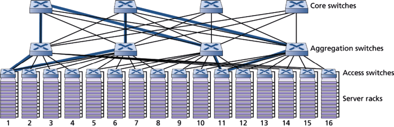

also been proposed [Alizadeh 2014; Noormohammadpour 2018]. While these schemes perform multi-path routing at the flow level, there are also designs that route individual packets within a flow among multiple paths [He 2015; The three-layer hierarchy shown in Figures 6.31 and 6.32, have evolved into a two-layer data-center interconnection fabric known as a leaf-spine topology [Alizadeh 2013], as shown in Figure 6.33. In the leaf-spine topology, the access switch (known as a leaf switch) is connected to each and every core switch (known as a spine switch). The interconnection capacity of the leaf-spine topology can scale by either upgrading link speeds between the leaf and spine nodes, or by adding more spine nodes horizontally. In a leaf-spine topology, all communication within the data center beyond the access switch requires exactly two switch hops, as opposed to the variable and potentially larger number of hops in the topologies in Figures 6.31 and 6.32. The evolution toward leaf-spine topologies reflects the increase of communication among servers within the data center (so-called “east-west” Figure 6.33 Leaf and spine switch interconnection

Figure 6.32 A three-tier, highly interconnected data network topology A direct consequence of the increased connectivity between tiers in data center networks is that multi-path routing can become a first-class citizen in these networks. Flows are by default multipath flows. A very simple scheme to achieve multi-path routing is Equal Cost Multi Path (ECMP) [RFC 2992], which performs a randomized next-hop selection along the switches between source and destination. Advanced schemes using finer-grained load balancing have Raiciu 2010].

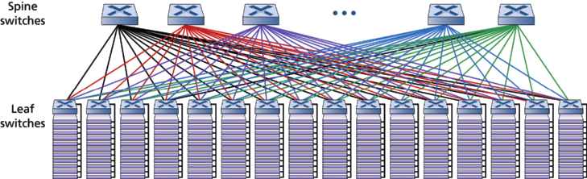

traffic) as opposed to communication between a server and an endpoint outside the data-center (so called “north-south” traffic). There is also increased interest in reconfigurable direct optical interconnects, under SDN control, among leaf (or aggregate) switches, thereby bypassing the need for spine switches [Poutievski 2022].

Multi-switch layered (tiered, multistage) interconnection network such as those illustrated in Figures 6.32 and 6.33 are known as Clos networks, named after Charles Clos, who studied such network [Clos 1953] in the context of telephony switching. Since then, a rich theory of Clos networks has been developed, finding additional use in data center networking and in multiprocessor interconnection networks. For some of the largest data center operators, switches in the interconnection network are being built in-house from commodity, off-the-shelf, merchant silicon [Greenberg 2009b; Roy 2015; Singh 2015;

Poutievski 2022] rather than being purchased from switch vendors.

##### 6.6.2 Trends in Data Center Networking

Data center networking is evolving rapidly, with the trends being driven by cost reduction, virtualization, physical constraints, manageability, expandability, and customization.

Centralized SDN Control and Management Because a data center is managed by a single organization, it is perhaps natural that a number of the largest data center operators, including Google, Microsoft, and Facebook, are embracing the notion of SDN-like logically centralized control. For example, we learned about Google’ s Orion SDN platform that is used to control and manage its data-center networks as well as the wide-area B4 network that connects these data centers. Their architectures also reflect a clear separation of a data plane (comprised of relatively simple, commodity switches) and a software-based control plane, as we saw in Section 5.5. Due to the immense-scale of their data centers, automated configuration and operational state management, as we encountered in Section 5.7, are also crucial [Vahdat 2024].

Virtualization Virtualization has been a driving force for much of the growth of cloud computing and data center networks more generally. Virtual Machines (VMs) decouple software running applications from the physical hardware.

This decoupling also allows seamless migration of VMs between physical servers, which might be located on different racks. Standard Ethernet and IP protocols have limitations in enabling the movement of VMs while maintaining active network connections across servers. Since all data center networks are managed by a single administrative authority, an elegant solution to the problem is to treat the entire data center network as a single, flat, layer-2 network. Recall that in a typical Ethernet network, the ARP protocol maintains the binding between the IP address and hardware (MAC) address on an interface.

To emulate the effect of having all hosts connect to a “single” switch, the ARP mechanism is modified to use a DNS style query system instead of a broadcast, and the directory maintains a mapping of the IP address assigned to a VM and which physical switch the VM is currently connected to in the data center network. Scalable schemes that implement this basic design have been proposed in [Mysore 2009; Greenberg 2009b] and have been successfully deployed in modern data centers.

Physical Constraints Unlike the wide area Internet, data center networks operate in environments that not only have very high capacity (40 Gbps and 100 Gbps links are now commonplace) but also have extremely low delays (microseconds).Consequently, buffer sizes are small and congestion control protocols such as TCP and its variants do not scale well in data centers. In data centers, congestion control protocols have to react fast and operate in extremely low loss regimes, as loss recovery and timeouts can lead to extreme inefficiency. Several approaches to tackle this issue have been proposed and deployed, ranging from data center-specific TCP variants [Alizadeh 2010] to implementing Remote Direct Memory Access (RDMA) technologies on standard Ethernet [Zhu 2015; Moshref 2016; Guo 2016]. Scheduling theory has also been applied to develop mechanisms that decouple flow scheduling from rate control, enabling very simple congestion control protocols while maintaining high utilization of the links [Alizadeh 2013; Hong 2012].

Hardware Modularity and Customization Another major trend is to employ shipping container–based modular data centers (MDCs) [YouTube 2009; Waldrop 2007]. In an MDC, a factory builds, within a standard 12-meter shipping container, a “mini data center” and ships the container to the data center location. Each container has up to a few thousand hosts, stacked in tens of racks, which are packed closely together. At the data center location, multiple containers are interconnected with each other and also with the Internet. Once a prefabricated container is deployed at a data center, it is often difficult to service. Thus, each container is designed for graceful performance degradation: as components (servers and switches) fail over time, the container continues to operate but with degraded performance. When many components have failed and performance has dropped below a threshold, the entire container is removed and replaced with a fresh one.

Building a data center out of containers creates new networking challenges. With an MDC, there are two types of networks: the container-internal networks within each of the containers and the core network connecting each container [Guo 2009; Farrington 2010]. Within each container, at the scale of up to a few thousand hosts, it is possible to build a fully connected network using inexpensive commodity Gigabit Ethernet switches. However, the design of the core network, interconnecting hundreds to thousands of containers while providing high host-to-host bandwidth across containers for typical workloads, remains a challenging problem. A hybrid electrical/optical switch architecture for interconnecting the containers is described in [Farrington 2010].

Energy-efficiency and Carbon-efficiency We learned earlier that the cost of power is a significant factor in operating a data center. And with an increase in the size and number of data centers, power now represent a non-negligible fraction of overall energy demand. [Goldman 2024] estimates that data centers consume approximately 400 Terawatt hours of energy in 2024—between 1% and 2% of global electricity use. That demand is expected to rise to 3–4% of global energy use by the end of the decade, driven in part by increasing demands of data- and compute-intensive demands of AI-based applications, including Large Language Models. Many data center operators are thus focused on energy-efficiency, e.g., [Microsoft 2025]. Beyond energy-efficiency alone, an increased emphasis on sustainability of human-built infrastructure has resulted in an emphasis on carbon efficiency—optimizing operations to reduce their overall carbon footprint [Shenoy 2022].

A final important trend is that large cloud providers are increasingly building or customizing just about everything that is in their data centers, including network adapters, switches routers, TORs, software, and networking protocols [Greenberg 2015; Singh 2015]. Another trend, pioneered by Amazon, is to improve reliability with “availability zones,” which essentially replicate distinct data centers in different nearby buildings. By having the buildings nearby (a few kilometers apart), transactional data can be synchronized across the data centers in the same availability zone while providing fault tolerance [Amazon 2014]. Many more innovations in data center design are likely to continue to come.

#### 6.7 Retrospective: A Day in the Life of a Web Page Request

Now that we’ve covered the link layer in this chapter, and the network, transport and application layers in earlier chapters, our journey down the protocol stack is complete! In the very beginning of this book (Section 1.1), we wrote “much of this book is concerned with computer network protocols,” and in the first five chapters, we’ve certainly seen that this is indeed the case! Before heading into the topical chapters in second part of this book, we’d like to wrap up our journey down the protocol stack by taking an integrated, holistic view of the protocols we’ve learned about so far. One way then to take this “big picture” view is to identify the many (many!) protocols that are involved in satisfying even the simplest request: downloading a Web page. Figure 6.34 illustrates our setting: a student, Bob, connects a laptop to his school’s Ethernet switch and downloads a Web page (say the home page of www.google.com). As we now know, there’s a lot going on “under the hood” to satisfy this seemingly simple request. A Wireshark lab at the end of this chapter examines trace files containing a number of the packets involved in similar scenarios in more detail.

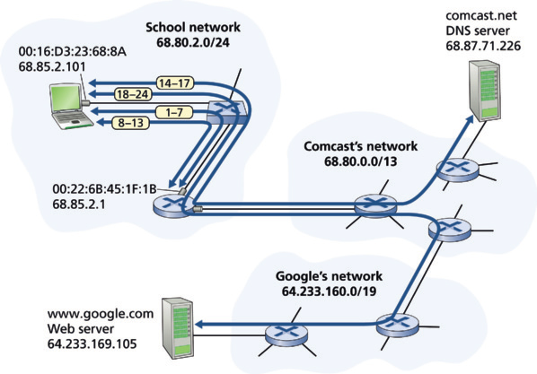

Figure 6.34 A day in the life of a Web page request: Network setting and actions

##### 6.7.1 Getting Started: DHCP, UDP, IP, and Ethernet

Let’s suppose that Bob boots up his laptop and then connects it to an Ethernet cable connected to the school’s Ethernet switch, which in turn is connected to the school’s router, as shown in Figure 6.34. The school’s router is connected to an ISP, in this example, comcast.net. In this example, comcast.net is providing the DNS service for the school; thus, the DNS server resides in the Comcast network rather than the school network. We’ll assume that the DHCP server is running within the router, as is often the case.

When Bob first connects his laptop to the network, he can’t do anything (e.g., download a Web page) without an IP address. Thus, the first networkrelated action taken by Bob’s laptop is to run the DHCP protocol to obtain an IP address, as well as other information, from the local DHCP server:

1.  The operating system on Bob’s laptop creates a DHCP request message (Section 4.3.3) and puts this message within a UDP segment (Section 3.3) with destination port 67 (DHCP server) and source port 68 (DHCP client).

The UDP segment is then placed within an IP datagram (Section 4.3.1) with a broadcast IP destination address  255.255.255.255 and a source IP 

address of 0.0.0.0, since Bob’s laptop doesn’t yet have an IP address.

2.  The IP datagram containing the DHCP request message is then placed within an Ethernet frame (Section 6.4.2). The Ethernet frame has a destination MAC addresses of FF:FF:FF:FF:FF:FF so that the frame will be broadcast to all devices connected to the switch (hopefully including a DHCP server); the frame’s source MAC address is that of Bob’s laptop, 00:16:D3:23:68:8A.

3.  The broadcast Ethernet frame containing the DHCP request is the first frame sent by Bob’s laptop to the Ethernet switch. The switch broadcasts the incoming frame on all outgoing ports, including the port connected to the router.

4.  The router receives the broadcast Ethernet frame containing the DHCP request on its interface with MAC address 00:22:6B:45:1F:1B and the IP datagram is extracted from the Ethernet frame. The datagram’s broadcast IP destination address indicates that this IP datagram should be processed by upper layer protocols at this node, so the datagram’s payload (a UDP segment) is thus demultiplexed (Section 3.2) up to UDP, and the DHCP request message is extracted from the UDP segment. The DHCP server now has the DHCP request message.

5.Let’s suppose that the DHCP server running within the router can allocate IP addresses in the CIDR (Section 4.3.3) block 68.85.2.0/24. In this example, all IP addresses used within the school are thus within Comcast’s address block. Let’s suppose the DHCP server allocates address
68.85.2.101 to Bob’s laptop. The DHCP server creates a DHCP ACK

message (Section 4.3.3) containing this IP address, as well as the IP address of the DNS server  68.87.71.226 , the IP address for the default gateway 

router  68.85.2.1 , and the subnet block  68.85.2.0/24  (equivalently, the 

“network mask”). The DHCP message is put inside a UDP segment, which is put inside an IP datagram, which is put inside an Ethernet frame. The Ethernet frame has a source MAC address of the router’s interface to the home network  00:22:6B:45:1F:1B and a destination MAC address of 

Bob’s laptop  00:16:D3:23:68:8A . 

6.  The Ethernet frame containing the DHCP ACK is sent (unicast) by the router to the switch. Because the switch is self-learning (Section 6.4.3) and previously received an Ethernet frame (containing the DHCP request) from Bob’s laptop, the switch knows to forward a frame addressed to 00:16:D3:23:68:8A only to the output port leading to Bob’s laptop.

7.  Bob’s laptop receives the Ethernet frame containing the DHCP ACK, extracts the IP datagram from the Ethernet frame, extracts the UDP segment from the IP datagram, and extracts the DHCP ACK message from the UDP segment. Bob’s DHCP client then records its IP address and the IP address of its DNS server. It also installs the address of the default gateway into its IP forwarding table (Section 4.1). Bob’s laptop will send all datagrams with destination address outside of its subnet 68.85.2.0/24 to the default gateway. At this point, Bob’s laptop has initialized its networking components and is ready to begin processing the Web page fetch. (Note that only the last two DHCP steps of the four presented in Chapter 4 are actually necessary.)

##### 6.7.2 Still Getting Started: DNS and ARP

When Bob types the URL for www.google.com into his Web browser, he begins the long chain of events that will eventually result in Google’s home page being displayed by his Web browser. Bob’s Web browser begins the process by creating a TCP socket (Section 2.7) that will be used to send the HTTP request (Section 2.2) to www.google.com.

In order to create the socket, Bob’s laptop will need to know the IP address of www.google.com. We learned in

Section 2.5, that the DNS protocol is used to provide this name-to-IP-address translation service.

1.The operating system on Bob’s laptop thus creates a DNS query message (Section 2.5.3), putting the string “www.google.com” in the question section of the DNS message.

This DNS message is then placed within a UDP segment with a destination port of 53 (DNS server). The UDP segment is then placed within an IP datagram with an IP destination address of
68.87.71.226 (the address of the DNS server returned in the DHCP ACK

in step 5) and a source IP address of 68.85.2.101.

2.  Bob’s laptop then places the datagram containing the DNS query message in an Ethernet frame. This frame will be sent (addressed, at the link layer) to the gateway router in Bob’s school’s network. However, even though Bob’s laptop knows the IP address of the school’s gateway router  68.85.2.1 via 

the DHCP ACK message in step 5 above, it doesn’t know the gateway router’s MAC address. In order to obtain the MAC address of the gateway router, Bob’s laptop will need to use the ARP protocol (Section 6.4.1).

3.  Bob’s laptop creates an ARP query message with a target IP address of
68.85.2.1 (the default gateway), places the ARP message within an

Ethernet frame with a broadcast destination address  FF:FF:FF:FF:FF:FF 

and sends the Ethernet frame to the switch, which delivers the frame to all connected devices, including the gateway router.

4.  The gateway router receives the frame containing the ARP query message on the interface to the school network, and finds that the target IP address of 68.85.2.1 in the ARP message matches the IP address of its interface.

The gateway router thus prepares an ARP reply, indicating that its MAC address of 00:22:6B:45:1F:1B corresponds to IP address 68.85.2.1. It places the ARP reply message in an Ethernet frame, with a destination address of 00:16:D3:23:68:8A (Bob’s laptop) and sends the frame to the switch, which delivers the frame to Bob’s laptop.

5.  Bob’s laptop receives the frame containing the ARP reply message and extracts the MAC address of the gateway router  00:22:6B:45:1F:1B from 

the ARP reply message.

6.Bob’s laptop can now (finally!) address the Ethernet frame containing the DNS query to the gateway router’s MAC address. Note that the IP datagram in this frame has an IP destination address of 68.87.71.226 (the DNS server), while the frame has a destination address of 00:22:6B:45:1F:1B (the gateway router). Bob’s laptop sends this frame to the switch, which delivers the frame to the gateway router.

##### 6.7.3 Still Getting Started: Intra-Domain Routing to the DNS Server

1.  The gateway router receives the frame and extracts the IP datagram containing the DNS query. The router looks up the destination address of this datagram  68.87.71.226 and determines from its forwarding table that  the datagram should be sent to the leftmost router in the Comcast network in Figure 6.34. The IP datagram is placed inside a link-layer frame appropriate for the link connecting the school’s router to the leftmost Comcast router and the frame is sent over this link.

2.  The leftmost router in the Comcast network receives the frame, extracts the IP datagram, examines the datagram’s destination address 68.87.71.226 and determines the outgoing interface on which to for- 

ward the datagram toward the DNS server from its forwarding table, which has been filled in by Comcast’s intra-domain protocol (such as RIP, OSPF or IS-IS, Section 5.3) as well as the Internet’s inter-domain protocol, BGP (Section 5.4).

3.  Eventually the IP datagram containing the DNS query arrives at the DNS server. The DNS server extracts the DNS query message, looks up the name www.google.com in its DNS database (Section 2.5), and finds the DNS resource record that contains the IP address  64.233.169.105 for 

www.google.com. (assuming that it is currently cached in the DNS server).

Recall that this cached data originated in the authoritative DNS server (Section 2.5.2) for google.com. The DNS server forms a DNS reply message containing this hostname-to-IP-address mapping, and places the DNS reply message in a UDP segment, and the segment within an IP datagram addressed to Bob’s laptop  68.85.2.101 .

This datagram will be for- 

warded back through the Comcast network to the school’s router and from there, via the Ethernet switch to Bob’s laptop.

4.  Bob’s laptop extracts the IP address of the server www.google.com from the DNS message. Finally, after a lot of work, Bob’s laptop is now ready to contact the www.google.com server!

##### 6.7.4 Web Client-Server Interaction: TCP and HTTP

1.Now that Bob’s laptop has the IP address of www.google.com, it can create the TCP socket (Section 2.7) that will be used to send the HTTP GET message (Section 2.2.3) to www.google.com.

When Bob creates the TCP socket, the TCP in Bob’s laptop must first perform a three-way handshake (Section 3.5.6) with the TCP in www.google.com. Bob’s laptop thus first creates a TCP SYN segment with destination port 80 (for HTTP), places the TCP segment inside an IP datagram with a destination IP address of
64.233.169.105 (www.google.com), places the datagram inside a frame

with a destination MAC address of 00:22:6B:45:1F:1B (the gateway router) and sends the frame to the switch.

2.  The routers in the school network, Comcast’s network, and Google’s network forward the datagram containing the TCP SYN toward www.google.

com, using the forwarding table in each router, as in steps 14–16 above.

Recall that the router forwarding table entries governing forwarding of packets over the inter-domain link between the Comcast and Google networks are determined by the BGP protocol (Chapter 5).

3.  Eventually, the datagram containing the TCP SYN arrives at www.google.

com. The TCP SYN message is extracted from the datagram and demultiplexed to the welcome socket associated with port 80. A connection socket (Section 2.6) is created for the TCP connection between the Google HTTP server and Bob’s laptop. A TCP SYNACK (Section 3.5.6) segment is generated, placed inside a datagram addressed to Bob’s laptop, and finally placed inside a link-layer frame appropriate for the link connecting www.

google.com to its first-hop router.

4.  The datagram containing the TCP SYNACK segment is forwarded through the Google, Comcast, and school networks, eventually arriving at the Ethernet controller in Bob’s laptop. The datagram is demultiplexed within the operating system to the TCP socket created in step 18, which enters the connected state.

5.  With the socket on Bob’s laptop now (finally!) ready to send bytes to www.

google.com, Bob’s browser creates the HTTP GET message (Section 2.2.3) containing the URL to be fetched. The HTTP GET message is then written into the socket, with the GET message becoming the payload of a TCP segment. The TCP segment is placed in a datagram and sent and delivered to www.google.com as in steps 18–20 above.

6.  The HTTP server at www.google.com reads the HTTP GET message from the TCP socket, creates an HTTP response message (Section 2.2), places the requested Web page content in the body of the HTTP response message, and sends the message into the TCP socket.

7.  The datagram containing the HTTP reply message is forwarded through the Google, Comcast, and school networks, and arrives at Bob’s laptop.

Bob’s Web browser program reads the HTTP response from the socket, extracts the html for the Web page from the body of the HTTP response, and finally (finally!) displays the Web page!

Our scenario above has covered a lot of networking ground! If you’ve understood most or all of the above example, then you’ve also covered a lot of ground since you first read Section 1.1, where we wrote “much of this book is concerned with computer network protocols” and you may have wondered what a protocol actually was! As detailed as the above example might seem, we’ve omitted a number of possible additional protocols (e.g., NAT running in the school’s gateway router, wireless access to the school’s network, security protocols for accessing the school network or encrypting segments or datagrams, network management protocols), and considerations (Web caching, the DNS hierarchy) that one would encounter in the public Internet. We’ll cover a number of these topics and more in the second part of this book.

Lastly, we note that our example above was an integrated and holistic, but also very “nuts and bolts,” view of many of the protocols that we’ve studied in the first part of this book. The example focused more on the “how” than the “why.” For a broader, more reflective view on the design of network protocols in general, you might want to re-read the “Architectural Principles of the Internet” in Section 4.5, and the references therein.

#### 6.8 Summary

In this chapter, we’ve examined the link layer—its services, the principles underlying its operation, and a number of important specific protocols that use these principles in implementing link-layer services.

We saw that the basic service of the link layer is to move a network-layer datagram from one node (host, switch, router, WiFi access point) to an adjacent node. We saw that all link-layer protocols operate by encapsulating a networklayer datagram within a link-layer frame before transmitting the frame over the link to the adjacent node. Beyond this common framing function, however, we learned that different link-layer protocols provide very different link access, delivery, and transmission services. These differences are due in part to the wide variety of link types over which link-layer protocols must operate.A simple point-to-point link has a single sender and receiver communicating over a single “wire.” A multiple access link is shared among many senders and receivers; consequently, the link-layer protocol for a multiple access channel has a protocol (its multiple access protocol) for coordinating link access.

In cases of VXLANs and MPLS, the “link” connecting two nodes may actually be a network in and of itself. In one sense, the idea of a network being considered as a link should not seem odd. A telephone link connecting a home modem/computer to a remote modem/router, for example, is actually a path through a sophisticated and complex telephone network.

Among the principles underlying link-layer communication, we examined error-detection and -correction techniques, multiple access protocols, link-layer addressing, virtualization (VLANs), and the construction of extended switched LANs and data center networks. Much of the focus today at the link layer is on these switched networks.

In the case of error detection/ correction, we examined how it is possible to add additional bits to a frame’s header in order to detect, and in some cases correct, bit-flip errors that might occur when the frame is transmitted over the link. We covered simple parity and checksumming schemes, as well as the more robust cyclic redundancy check. We then moved on to the topic of multiple access protocols. We identified and studied three broad approaches for coordinating access to a broadcast channel: channel partitioning approaches (TDM, FDM), random access approaches (the ALOHA protocols and CSMA protocols), and taking-turns approaches (polling and token passing). We studied the cable access network and found that it uses many of these multiple access methods. We saw that a consequence of having multiple nodes share a single broadcast channel was the need to provide node addresses at the link layer. We learned that link-layer addresses were quite different from network-layer addresses and that, in the case of the Internet, a special protocol (ARP—the Address Resolution Protocol) is used to translate between these two forms of addressing and studied the hugely successful Ethernet protocol in detail. We then examined how nodes sharing a broadcast channel form a LAN and how multiple LANs can be connected together to form larger LANs—all without the intervention of network-layer routing to interconnect these local nodes. We also learned how multiple virtual LANs can be created on a single physical LAN infrastructure.

We ended our study of the link layer by focusing on link virtualization, using MPLS and VXLANs as case studies. We then provided an overview of the network designs for today’s massive data centers. We wrapped up this chapter (and indeed the first five chapters) by identifying the many protocols that are needed to fetch a simple Web page. Having covered the link layer, our journey down the protocol stack is now over! Certainly, the physical layer lies below the link layer, but the details of the physical layer are probably best left for another course (e.g., in communication theory, rather than computer networking). We have, however, touched upon several aspects of the physical layer in this chapter and in Chapter 1 (our discussion of physical media in Section 1.2). We’ll consider the physical layer again when we study wireless link characteristics in the next chapter.

Although our journey down the protocol stack is over, our study of computer networking is not yet at an end. In the following two chapters, we cover wireless networking and network security. These two topics do not fit conveniently into any one layer; indeed, each topic crosscuts many layers.

Understanding these topics (billed as advanced topics in some networking texts) thus requires a firm foundation in all layers of the protocol stack—a foundation that our study of the link layer has now completed!

Homework Problems and Questions Chapter 6 Review Questions these characteristics does slotted ALOHA have? Which of these characteristics does Sections 6.1–6.2 token passing have?

R1.  Consider the transportation analogy in Sec- R6.  In CSMA/CD, after the fifth collision, what is

tion 6.1.1. If the passenger is analogous to a the probability that a node chooses K = ?

datagram, what is analogous to the link layer The result K = 4 corresponds to a delay of

frame? how many seconds on a 10 Mbps Ethernet?

R2.  If all the links in the Internet were to provide R7.  Describe polling and token-passing protocols

reliable delivery service, would the TCP reliausing the analogy of cocktail party interactions.

ble delivery service be redundant? Why or R8.  Why would the token-ring protocol be ineffiwhy not? cient if a LAN had a very large perimeter? R3.  What are some of the possible services that a

Section 6.4 link-layer protocol can offer to the network layer? Which of these link-layer services have R9.  How big is the MAC address space? The IPv4 corresponding services in IP? In TCP? address space? The IPv6 address space?

R10.  Suppose nodes A, B, and C each attach to the Section 6.3

same broadcast LAN (through their adapters).R4.Suppose two nodes start to transmit at the same If A sends thousands of IP datagrams to B with time a packet of length L over a broadcast chaneach encapsulating frame addressed to the nel of rate R.Denote the propagation delay MAC address of B, will C’s adapter process between the two nodes as d .Will there be a these frames? If so, will C’s adapter pass the prop collision if d < L R ? Why or why not? IP datagrams in these frames to the network prop R5.

In Section 6.3, we listed four desirable characlayer C? How would your answers change if A

teristics of a broadcast channel. Which of sends frames with the MAC broadcast address?

R11.  Why is an ARP query sent within a broadcast R14.  Consider Figure 6.15. How many subnet-

frame? Why is an ARP response sent within a works are there, in the addressing sense of

frame with a specific destination MAC address? Section 4.3?

R12.  For the network in Figure 6.19, the router has R15.  What is the maximum number of VLANs that

two ARP modules, each with its own ARP can be configured on a switch supporting the

table. Is it possible that the same MAC address 802.1Q protocol? Why?

appears in both tables? R16.  Suppose that N switches supporting K VLAN

R13.  Compare the frame structures for 10BASE-T, groups are to be connected via a trunking pro-

100BASE-T, and Gigabit Ethernet. How do tocol. How many ports are needed to connect

they differ? the switches? Justify your answer.

Problems P1. Suppose the information content of a packet is the bit pattern 1110 0110 1001 0101 and an even parity scheme is being used. What would the value of the field containing the parity bits be for the case of a two-dimensional parity scheme? Your answer should be such that a minimum-length checksum field is used.

P2. Show (give an example other than the one in Figure 6.5) that twodimensional parity checks can correct and detect a single bit error. Show (give an example of) a double-bit error that can be detected but not corrected.

P3. Suppose the information portion of a packet (D in Figure 6.3) contains 8 bytes consisting of the 8-bit unsigned binary ASCII representation of string “Internet”. Compute the Internet checksum for this data.

P4. Consider the previous problem, but instead suppose these 10 bytes contain a.  the binary representation of the numbers 1 through 10.

b.  the ASCII representation of the letters B through K (uppercase).

c.  the ASCII representation of the letters b through k (lowercase).

d.  Compute the Internet checksum for this data.

P5. Consider the 5-bit generator, G = 10011 , and suppose that D has the

value 1010101010. What is the value of R?

P6. Consider the previous problem, but suppose that D has the value a.  1000100101. b.  0101101010. c.  0110100011.

P7. In this problem, we explore some of the properties of the CRC. For the generator G = 1001 given in Section 6.2.3, answer the following questions. 

a.  Why can it detect any single bit error in data D?

b.  Can the above G detect any odd number of bit errors? Why?

P8. In Section 6.3, we provided an outline of the derivation of the efficiency of slotted ALOHA. In this problem we’ll complete the derivation.

a.  Recall that when there are N active nodes, the efficiency of slotted

N 1 − ALOHA is Np ( − p ) . Find the value of p that maximizes this

expression.

b.  Using the value of p found in (a), find the efficiency of slotted ALOHA

N by letting N approach infinity. Hint: ( − N ) approaches  e 1  as N

approaches infinity.

P9. Show that the maximum efficiency of pure ALOHA is 1 2 . Note: This e

problem is easy if you have completed the problem above!

P10.  Consider two nodes, A and B, that use the slotted ALOHA protocol to contend for a channel. Suppose node A has more data to transmit than node B, and node A’s retransmission probability p is greater than node B’s A retransmission probability, p . B a.  Provide a formula for node A’s average throughput. What is the total efficiency of the protocol with these two nodes?

b.  If p = 2 p , is node A’s average throughput twice as large as that of A B node B? Why or why not? If not, how can you choose p and p to A B make that happen?

c.  In general, suppose there are N nodes, among which node A has retransmission probability 2  and all other nodes have retransmission p

probability p. Provide expressions to compute the average throughputs of node A and of any other node.

P11.  Suppose four active nodes—nodes A, B, C and D—are competing for access to a channel using slotted ALOHA. Assume each node has an infinite number of packets to send. Each node attempts to transmit in each slot with probability p. The first slot is numbered slot 1, the second slot is

numbered slot 2, and so on.

a.  What is the probability that node A succeeds for the first time in slot 4?

b.  What is the probability that some node (either A, B, C or D) succeeds in slot 5?

c.  What is the probability that the first success occurs in slot 4?

d.  What is the efficiency of this four-node system?

P12.  Graph the efficiency of slotted ALOHA and pure ALOHA as a function of p for the following values of N:

a.  N b.  N c.  N = 10 . = 30 . = 50 .

P13.  Consider a broadcast channel with N nodes and a transmission rate of R bps. Suppose the broadcast channel uses polling (with an additional polling node) for multiple access. Suppose the amount of time from when a node completes transmission until the subsequent node is permitted to transmit (that is, the polling delay) is d . Suppose that within poll a polling round, a given node is allowed to transmit at most Q bits. What is the maximum throughput of the broadcast channel?

P14.  Consider three LANs interconnected by two routers, as shown in Figure 6.35.

a.  Assign IP addresses to all of the interfaces. For Subnet 1 use addresses of the form 192.168.1.xxx; for Subnet 2 uses addresses of the form 192.168.2.xxx; and for Subnet 3 use addresses of the form 192.168.3.xxx.

b.  Assign MAC addresses to all of the adapters.

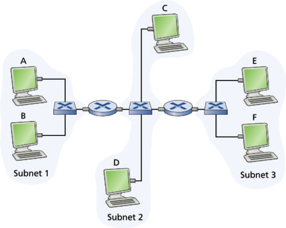

Figure 6.35 Three subnets, interconnected by routers

c.  Consider sending an IP datagram from Host E to Host B. Suppose all of the ARP tables are up to date. Enumerate all the steps, as done for the single-router example in Section 6.4.1.

d.  Repeat (c), now assuming that the ARP table in the sending host is empty (and the other tables are up to date).

P15.  Consider Figure 6.35. Now we replace the router between subnets 1 and 2 with a switch S1, and label the router between subnets 2 and 3 as R1.

a.  Consider sending an IP datagram from Host E to Host F. Will Host E ask router R1 to help forward the datagram? Why? In the Ethernet frame containing the IP datagram, what are the source and destination IP and MAC addresses?

b.  Suppose E would like to send an IP datagram to B, and assume that E’s ARP cache does not contain B’s MAC address. Will E perform an ARP query to find B’s MAC address? Why? In the Ethernet frame (containing the IP datagram destined to B) that is delivered to router R1, what are the source and destination IP and MAC addresses?

c.  Suppose Host A would like to send an IP datagram to Host B, and neither A’s ARP cache contains B’s MAC address nor does B’s ARP cache contain A’s MAC address. Further suppose that the switch S1’s forwarding table contains entries for Host B and router R1 only. Thus, A will broadcast an ARP request message. What actions will switch S1 perform once it receives the ARP request message? Will router R1 also receive this ARP request message? If so, will R1 forward the message to Subnet 3? Once Host B receives this ARP request message, it will send back to Host A an ARP response message. But will it send an ARP query message to ask for A’s MAC address? Why? What will switch S1 do once it receives an ARP response message from Host B?

P16.  Consider the previous problem, but suppose now that the router between subnets 2 and 3 is replaced by a switch. Answer questions (a)–(c) in the previous problem in this new context.

P17.  Recall that with the CSMA/CD protocol, the adapter waits K 512 bit = times after a collision, where K is drawn randomly. For K , how

long does the adapter wait until returning to Step 2 for a 100 Mbps broadcast channel? For a 1 Gbps broadcast channel?

P18.  Suppose nodes A and B are on the same 10 Mbps broadcast channel, and the propagation delay between the two nodes is 325 bit times. Suppose CSMA/CD and Ethernet packets are used for this broadcast channel.

Suppose node A begins transmitting a frame and, before it finishes, node B begins transmitting a frame. Can A finish transmitting before it detects that B has transmitted? Why or why not? If the answer is yes, then A incorrectly believes that its frame was successfully transmitted without a collision.  Hint: Suppose at time t = 0 bits, A begins transmitting a

frame. In the worst case, A transmits a minimum-sized frame of 512 +

bit times. So A would finish transmitting the frame at t = 512 + 64 bit

times. Thus, the answer is no, if B’s signal reaches A before bit time t = 512 + 64 bits.

In the worst case, when does B’s signal reach A?

P19.  Suppose nodes A and B are on the same 10 Mbps broadcast channel, and the propagation delay between the two nodes is 245 bit times. Suppose A and B send Ethernet frames at the same time, the frames collide, and then A and B choose different values of K in the CSMA/CD algorithm.

Assuming no other nodes are active, can the retransmissions from A and B collide? For our purposes, it suffices to work out the following exam-

= ple. Suppose A and B begin transmission at t 0 bit times. They both

= = = detect collisions at t 245 t bit times. Suppose K 0 and K . At A B what time does B schedule its retransmission? At what time does A begin transmission? (Note: The nodes must wait for an idle channel after returning to Step 2—see protocol.) At what time does A’s signal reach B?

Does B refrain from transmitting at its scheduled time?

P20.  In this problem, you will derive the efficiency of a CSMA/CD-like multiple access protocol. In this protocol, time is slotted and all adapters are synchronized to the slots. Unlike slotted ALOHA, however, the length of a slot (in seconds) is much less than a frame time (the time to transmit a frame). Let S be the length of a slot. Suppose all frames are of constant length L = kRS , where R is the transmission rate of the channel and k is

a large integer. Suppose there are N nodes, each with an infinite number of frames to send. We also assume that d < S , so that all nodes can prop detect a collision before the end of a slot time. The protocol is as follows:

•  If, for a given slot, no node has possession of the channel, all nodes contend for the channel; in particular, each node transmits in the slot with probability p. If exactly one node transmits in the slot, that node

− takes possession of the channel for the subsequent k 1 slots and

transmits its entire frame.

•  If some node has possession of the channel, all other nodes refrain from transmitting until the node that possesses the channel has finished transmitting its frame. Once this node has transmitted its frame, all nodes contend for the channel.

Note that the channel alternates between two states: the productive state, which lasts exactly k slots, and the nonproductive state, which lasts for a random number of slots. Clearly, the channel efficiency is the ratio of k k + x , where x is the expected number of consecutive unproductive  slots.

a.  For fixed N and p, determine the efficiency of this protocol.

b.  For fixed N, determine the p that maximizes the efficiency.

c.  Using the p (which is a function of N) found in (b), determine the efficiency as N approaches infinity.

d.  Show that this efficiency approaches 1 as the frame length becomes large.

P21.  Consider Figure 6.35 in problem P14. Provide MAC addresses and IP addresses for the interfaces at Host A, both routers, and Host F. Suppose Host A sends a datagram to Host F. Give the source and destination MAC addresses in the frame encapsulating this IP datagram as the frame is transmitted (i) from A to the left router, (ii) from the left router to the right router, (iii) from the right router to F. Also give the source and destination IP addresses in the IP datagram encapsulated within the frame at each of these points in time.

P22.  Suppose now that the leftmost router in Figure 6.35 is replaced by a switch. Hosts A, B, C, and D and the right router are all star-connected into this switch. Give the source and destination MAC addresses in the frame encapsulating this IP datagram as the frame is transmitted (i) from A to the switch, (ii) from the switch to the right router, (iii) from the right router to F. Also give the source and destination IP addresses in the IP datagram encapsulated within the frame at each of these points in time.

P23.  Consider Figure 6.15. Suppose that all links are 1 Gbps. What is the maximum total aggregate throughput that can be achieved among the 9 hosts and 2 servers in this network? You can assume that any host or server can send to any other host or server. Why?

P24.  Suppose the three departmental switches in Figure 6.15 are replaced by hubs. All links are 1 Gbps. Now answer the questions posed in problem  P23.

P25.  Suppose that all the switches in Figure 6.15 are replaced by hubs. All links are 1 Gbps. Now answer the questions posed in problem P23.

P26.  Let’s consider the operation of a learning switch in the context of a network in which 6 nodes labeled A through F are star connected into an Ethernet switch. Suppose that (i) B sends a frame to E, (ii) E replies with a frame to B, (iii) A sends a frame to B, (iv) B replies with a frame to A.

The switch table is initially empty. Show the state of the switch table before and after each of these events. For each of these events, identify the link(s) on which the transmitted frame will be forwarded, and briefly justify your answers.

P27.  In this problem, we explore the use of small packets for Voice-over-IP applications. One of the drawbacks of a small packet size is that a large fraction of link bandwidth is consumed by overhead bytes. To this end, suppose that the packet consists of P bytes and 5 bytes of header.

a.  Consider sending a digitally encoded voice source directly. Suppose the source is encoded at a constant rate of 128 kbps. Assume each packet is entirely filled before the source sends the packet into the network. The time required to fill a packet is the packetization delay. In terms of L, determine the packetization delay in milliseconds.

b.  Packetization delays greater than 20 msec can cause a noticeable and unpleasant echo. Determine the packetization delay for L = 1,500

bytes (roughly corresponding to a maximum-sized Ethernet packet) and for L = 50 (corresponding to an ATM packet).

c.  Calculate the store-and-forward delay at a single switch for a link rate of R = 622 Mbps for L = 1,500 bytes, and for L = 50 bytes.

d.  Comment on the advantages of using a small packet size.

P28.  Consider the single switch VLAN in Figure 6.25, and assume an external router is connected to switch port 1. Assign IP addresses to the EE and CS hosts and router interface. Trace the steps taken at both the network layer and the link layer to transfer an IP datagram from an EE host to a CS host (Hint: Reread the discussion of Figure 6.19 in the text).

P29.  Consider the MPLS network shown in Figure 6.29, and suppose that routers R5 and R6 are now MPLS enabled. Suppose that we want to perform traffic engineering so that packets from R6 destined for A are switched to A via R6-R4-R3-R1, and packets from R5 destined for A are switched via R5-R4-R2-R1. Show the MPLS tables in R5 and R6, as well as the modified table in R4, that would make this possible.

P30.  Consider again the same scenario as in the previous problem, but suppose that packets from R6 destined for D are switched via R6-R4-R3, while packets from R5 destined to D are switched via R4-R2-R1-R3.

Show the MPLS tables in all routers that would make this possible.

P31.  In this problem, you will put together much of what you have learned about Internet protocols. Suppose you walk into a room, connect to Ethernet, and want to download a Web page. What are all the protocol steps that take place, starting from powering on your PC to getting the Web page? Assume there is nothing in our DNS or browser caches when you power on your PC. (Hint: The steps include the use of Ethernet, DHCP, ARP, DNS, TCP, and HTTP protocols.) Explicitly indicate in your steps how you obtain the IP and MAC addresses of a gateway router.

P32.  Consider the data center network with hierarchical topology in Figure 6.31. Suppose now there are 80 pairs of flows, with ten flows between the first and ninth rack, ten flows between the second and tenth rack, and so on. Further suppose that all links in the network are 10 Gbps, except for the links between hosts and TOR switches, which are 1 Gbps.

a.  Each flow has the same data rate; determine the maximum rate of a flow.

b.  For the same traffic pattern, determine the maximum rate of a flow for the highly interconnected topology in Figure 6.32.

c.  Now suppose there is a similar traffic pattern, but involving 20 hosts on each rack and 160 pairs of flows. Determine the maximum flow rates for the two topologies.

P33.  Consider the hierarchical network in Figure 6.31 and suppose that the data center needs to support e-mail and video distribution among other applications. Suppose four racks of servers are reserved for e-mail and four racks are reserved for video. For each of the applications, all four racks must lie below a single tier-2 switch since the tier-2 to tier-1 links do not have sufficient bandwidth to support the intra-application traffic. For the e-mail application, suppose that for 99.9 percent of the time only three racks are used, and that the video application has identical usage patterns.

a.  For what fraction of time does the e-mail application need to use a fourth rack? How about for the video application?

b.  Assuming e-mail usage and video usage are independent, for what fraction of time do (equivalently, what is the probability that) both applications need their fourth rack?

c.  Suppose that it is acceptable for an application to have a shortage of servers for 0.001 percent of time or less (causing rare periods of performance degradation for users). Discuss how the topology in Figure 6.32 can be used so that only seven racks are collectively assigned to the two applications (assuming that the topology can support all the traffic).

Wireshark Labs: 802.11 Ethernet At the Companion website for this textbook, http:// the IEEE 802.3 protocol and the Wireshark frame

www.pearsonhighered.com/cs-resources/, you’ll format. A second Wireshark lab examines packet

find a Wireshark lab that examines the operation of traces taken in a home network scenario.

AN INTERVIEW WITH...

Amin Vahdat Amin Vahdat is a Fellow and vice president of Engineering at Google, where his team is responsible for delivering industry-leading Machine Learning software and hardware that serves Alphabet, Google and the world, and Artificial Intelli- Courtesy of Amin Vahdat gence technologies that empower ML developers and solve customers’ most pressing business challenges. In the past, he was General Manager for Google’s compute, storage, and network hardware and software infrastructure. Until 2019, he was the Technical Lead for the Networking organization at Google.

Before joining Google, Amin was the Science Applications International Corporation (SAIC) Professor of Computer Science and Engineering at UC San Diego (UCSD) He received his doctorate from the University of California Berkeley in computer science, and is a member of the National Academy of Engineering (NAE) and an Association for Computing Machinery (ACM) Fellow.

Amin has been recognized with a number of awards, including the National Science Foundation (NSF) CAREER award, the UC Berkeley Distinguished EECS Alumni Award, the Alfred P. Sloan Fellowship, the Association for Computing Machinery’s SIGCOMM Networking Systems Award, and the Duke University David and Janet Vaughn Teaching Award. Most recently, Amin was awarded the SIGCOMM lifetime achievement award for his contributions to data center and wide area networks. Lastly, he was inducted into the National Academy of Engineering in September 2023 for his contributions to the design and implementation of datacenter and planet-scale networks that power cloud computer systems.

What people inspired you professionally?

How did you get into computing and networking? Who were some of your early influences?

As an undergraduate at UC Berkeley, I was surrounded by people who had a love of learning. While the faculty were clearly at the cutting edge of research, they were simultaneously incredibly passionate about the material and conveying their understanding to students. To this day, I vividly recall the lectures and assignments from Bryan Harvey, Paul Hilfinger, Dave Anderson, Carlo Sequin, Randy Katz, and so many more. Robert Brayton offered me my first research job working on Automatic Test Pattern Generation and Randy Katz opened my eyes to the wonders of computer systems. What struck me repeatedly was that some of the most brilliant and accomplished people at the frontier of computer science were also so humble and generous.

I recall in an interview for a summer internship at Xerox PARC in my junior year, the interviewer asked me, “What do you want to do after you graduate?” While the answer at the top of my mind was, “apply for jobs as a software engineer and work at a company,” through some combination of self-realization and selfinterest, I answered in the moment, “I would like to go to graduate school and to become a professor.” It struck me from that point forward that this was not just the “right” answer but the real answer. Having watched and learned from the Berkeley faculty, I realized that I too would love to be a professor, learning at the frontier, helping to advance scientific understanding, and conveying that understanding to students. I ended up having three formative internships at Xerox PARC, which was the birthplace of much of the inventions underlying modern computing, including the personal computer, graphical user interfaces, Remote Procedure Call, graphical user interfaces, the mouse, object oriented programming, Ethernet LANs, and so much more. Being a part of the culture that enabled such breakthroughs taught me a lot about systems building, collaboration and cross-disciplinary research.

You came to networking via a background in distributed systems. Can you say a bit about how that came about?

It’s always interesting to see how happenstance plays an important role in one’s work and perspective. My focus in graduate school was on operating systems and distributed systems. While I was an avid consumer of networking, I was far from an expert. In 1999, when I started as a first-year Assistant Professor at Duke University, networking and the Internet were exploding across academia and industry. The department chair stopped by my office and said “We are planning course assignments for next year. We have never had undergraduate or graduate courses in networking. I thought you would be perfect to design and introduce these classes to our curriculum.” I replied, “But I don’t know anything about networking.” He very graciously replied, “You’ll pick it up quickly and, besides, you’re the best we’ve got.” I could not imagine how impactful and beneficial this would be to me. It led to a sprint on my part to read as much as I could, but also to tap into my colleagues at other universities for their expertise. I quickly grew to love the material. The notion of fully decentralized protocols exchanging messages to approximate the global optimum in a decentralized and independent manner for classic, thrilling problems such as routing, congestion control, and even media access opened a whole new world of thought and perspective. I viewed the material through a distributed systems and operating systems lens, constantly thinking in terms of how ideas in those domains could be applied to networking and vice versa. The students could see my excitement and passion for the material. I, in turn, felt the weight of teaching material where I felt like I was no expert.

My having the good fortune to be tasked with the responsibility to teach networking led to a number of outcomes. First, and perhaps foremost, I was recognized a few years later with the Duke University teaching award for my networking classes. I had embarked on my PhD path for my love of teaching and certainly chose academia for teaching. To this day, when students ask me about choosing academic or industrial careers, the very easy question back is, “Do you love to teach?” Being recognized at a university filled with incredible teachers and students remains a career highlight. To not claim too much credit, it helped that networking was all the rage in the early 2000s, and so students were naturally predisposed to match my passion and curiosity.

Second, I saw opportunities to bring together the fields of traditional operating systems, networking, and distributed systems to explore the overlap into what I called networked systems. While I was a junior academic, I proposed forming a new conference to bring these communities together around the ideas of Networked Systems Design and Implementation (NSDI). I served as steering committee chair for the conference, which launched in 2004. Another personal highlight for me is that this year’s NSDI conference will spotlight some of the most influential works in networking and distributed systems appearing in NSDI annually.

Third, my teaching deeply influenced my own research thinking. My most cited paper, on Epidemic Routing for Partially Connected Ad Hoc Networks, brought together classic distributed epidemic protocols with routing in wireless networks. The combination of the idea and open-sourcing our software and simulation results presaged the area of delay-tolerant network (DTNs) a few years later.

When I later learned about the scaling challenges in the emerging area of datacenter networking, I naturally considered how one might leverage ideas from supercomputing, consensus protocols, and centralized controllers in distributed systems such as GFS and MapReduce to address those challenges.

Following your early work on data center interconnection networks, you focused more recently on logically centralized management and control, at scale (i.e. at “Google scale”). How did that evolution come about, and where is it heading?

In addition to the points above, there were a number of other considerations – management, reliability, and efficiency –that led to the Software Defined Networking model that we developed for Google’s datacenter, Jupiter, and wide-area, B4, networks. Managing a network of autonomous elements that incrementally learned the state of the global network to make local decisions approximating the global optimum is inherently challenging. Doing so in the global Internet  setting means that there can be no global coordination and no central blueprint, as the fact that any Autonomous System (“node”) could attach to the Internet and commence global communication without any central arbitration is one of the foundations of the Internet, its exponential growth, and global reach. However, inter-AS convergence times and reliability were a challenge because information about global state took time to propagate and, in the end, approximate.

But in a single building or even across a private global WAN such that we were designing, the location and role of every network element is known ahead of time.

Rather than allowing a node to boot, exchange messages with neighbors, and learn its role in the global network, we knew we could configure the role of all network elements into a logically centralized controller that could then inform all relevant elements of new and changing configurations. This shifted the problem of network management from managing the configuration of individual network elements to managing the configuration of a logical network, dramatically simplifying the problem both from a technical perspective but also from the perspective of the cognitive load on network managers. Imagine asking people to essentially act as a perfect emulator of network evolution based on pairwise message exchanges among thousands of network entities – even the most capable and experienced person could not keep up with the growing scale and complexity of our networks!

Classic problems like traffic engineering, admission control, and differentiated quality of service also become significantly easier with centralized control. A key insight here is that networks are highly bursty and rapidly changing. Even the most advanced decentralized traffic engineering or admission control system will have longer control loops and convergence times than a centralized one.

Given the rapidly evolving nature of the network and the need to often respond in milliseconds, or even microseconds, to changing network conditions, a logically centralized controller has fundamental advantages. These advantages translate to higher levels of efficiency as less “bandwidth buffer” needs to be kept in reserve to manage delays in response time.

Where do you see the future of networking and the Internet - both in the data center and in wide area networks (and also perhaps in public and private networks as well?

In both datacenter and wide-area networking, the opportunities have never been greater. In the datacenter, the predictable, ultra-low latency and simultaneously high bandwidth communication requirements of ML workloads coupled with the computation scaling to hundreds of thousands of tightly coupled accelerators, mean that the bandwidth density of the network must increase by 1-2 orders of magnitude relative to traditional compute and storage. This jump in density coupled with the critical reliability requirements of ML computation supporting synchronous, in many cases, all-to-all communication, will result in all new designs focused on scale, reliability, predictable performance, and power efficiency.

Across the wide area, the Internet increasingly constitutes societal infrastructure.

One interesting thought exercise here would be determining what it would take to ensure no more than 5 minutes of downtime a year (99.999% availability) for most of the Internet globally and essentially 100% availability for a subset of workloads.

Getting there will require fundamentally different architectures for end-to-end connectivity and end-to-end guarantees, very different from the emergent, more bottom-up reliability characteristics of current Internet connectivity.

What are your recommendations for students looking forward to careers in computer science and networking?

Being both broad and deep is very important. On the one hand, understanding the requirements and opportunities for networking necessitates a very good understanding of the hardware (switches, NICs, accelerators, CPUs, GPUs, TPUs), operating systems, and distributed systems that use the network.

In the end, a similar understanding is needed of the higher-level, end-to-end Internet services. So many of the challenges come down to assumptions about the network. Driving to new designs and paradigms means having an understanding of the ways in which the network currently comes up short.

On the other hand, being deep in the network is equally critical. Network protocols from routing to congestion control to fault tolerance to security/ authentication are some of the most classic and intricate topics in all of computing.

Understanding the history of how we settled on the solutions we did, the details of how they work in theory, and also in practice through very hands-on work, is critical to set a deep understanding and intuition for the solutions and designs that will carry us collectively forward successfully.


## Chapter 7: Wireless and Mobile Networks

The past 15 years have seen a breathtaking increase in the deployment and use of wireless and mobile networks. In 2008, the number of fixed (wired) broadband Internet subscribers was approximately the same as the number of broadband subscribers attached via wireless technologies. While both subscriber bases have grown since then, there are now (in 2025) five times as many Internet-connected wireless subscribers than wired subscribers. An estimated 60 percent of Web site traffic was directed to mobile versus fixed devices in 2025 [Statista Mobile 2025]. The many advantages of wireless access are evident to all—anywhere, anytime, untethered access to the global Internet via a highly portable lightweight device. Increasingly, devices such as gaming consoles, home appliances, security systems, watches, eyeglasses, cars, wearable clothing, and so much more are being wirelessly connected to the Internet.

Indeed, some have posited that a profoundly important, fourth industrial revolution [Schwab 2016]—enabled by wireless networks and cyber-physical systems that integrate the physical and digital worlds—is now underway.

The challenges posed by networking wireless and mobile devices are so different from traditional wired computer networks that an individual chapter devoted to the study of wireless and mobile networks (i.e., this chapter) is appropriate.

In this chapter, we’ll cover both the principles and the practice of wireless and mobile networks. In Section 7.1, we’ll begin by setting the “big picture” context.

As a reader of this book, you know by now that we’re huge fans of a topdown approach. But so many aspects of wireless networking result from the complex, time-varying, capacity-limited, and shared nature of the physical wireless channel that an early mastery of radio channels is needed to appreciate practically any other aspect of wireless networking. Thus, we’ll begin our indepth study of wireless and mobile networks bottom-up, where we’ll first learn about the properties of wireless radio channels in Section 7.2. In  Section 7.3, we’ll then focus on the first-hop radio access network. Here, we’ll learn about techniques for sharing the radio channel, network discovery and device attachment, frame transmission scheduling, energy conservation, and more. In Section 7.4, we’ll learn about the wireless network “core” that provides control-plane services such as identity and mobility management as well as data-plane connectivity to the larger Internet. Throughout Sections 7.2–7.4, we’ll begin by identifying and studying fundamental principles that transcend any particular networking technology, and then illustrate these principles in practice in the context of WiFi and cellular networks. Our goal here is to separate out the “why” and “how,” from the “what.” There are many books and other documents that describe “what” is done in a particular wireless network architecture. Indeed, there are (rather dry) standards, many of them thousands of pages long, describing the “what” in great detail. Sections 7.2–7.4 thus aim to provide a foundation to understand the “why”—why an architecture is structured a certain way, or why a protocol takes a particular approach to accomplish a task. This deeper understanding will also last far beyond the lifetime of any specific wireless technology, helping to futureproof your knowledge of wireless and mobile networks!

Device mobility is such a unique feature of wireless networks that we’ll devote an entire section (Section 7.5) to this important topic. While we focus primarily on 5G and WiFi networks throughout this chapter, there are other widely deployed wireless network architectures as well.

In Section 7.6, we’ll thus briefly cover Bluetooth, satellite, and IoT wireless networks. Section 7.7 concludes this chapter. We’ll defer our discussion of security in wireless networks to the next chapter.

#### 7.1 Introduction

Figure 7.1 shows the setting for our discussion of wireless and mobile networks. We’ll begin by keeping our discussion general enough to cover a wide range of networks, including 5G cellular networks, WiFi local area networks (WLANs), and ad hoc networks including Bluetooth and IoT networks.

We can identify the following key common elements in a wireless network:

• Wireless access networks. At the highest level, a wireless network has one or more wireless access networks. The wireless access network lies at the outermost “edge” of the entire network, connecting devices into a larger network via a wireless radio channel. An access network can be thought of as a type of local area network, as studied in Chapter 6: it has limited geographic scope, is under the control of a single service provider, and primarily provides a link-layer service. In cellular networks, the wireless access network is known as the Radio Access Network (RAN). In WiFi networks, the wireless access network is often referred to as a Wireless Local Area Network (WLAN).

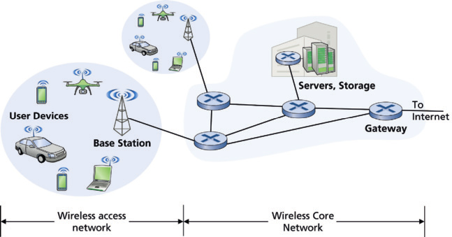

Figure 7.1 Elements of a wireless network

• Wireless core network. The wireless core network consists of servers, storage, routers, and (typically wired) links that lie between the devices in a provider’s access network and the external network. The core network may be geographically distributed, e.g., with some parts collocated with infrastructure in the access network and other parts located in distant data centers. The core network implements higher-level control-plane and management-plane services (e.g., for user and device identity, mobility, and access-security management) as well as data-plane services that forward datagrams from devices in the access network to the larger Internet, and vice versa.

In cellular networks, there is a well-defined core network operated by the cellular network provider; we’ll study the 4G 5G core network in Section 7.4. Unlike 4G 5G, there is no corresponding wireless core network for WiFi. Instead, an enterprise uses the same infrastructure for WLANs that it uses for its wired LANs. In this sense, an enterprise views WiFi as just another link-layer technology in its enterprise network.

• Wireless devices. A wireless device might be a smartphone, tablet, or laptop, or an IoT device such as a sensor or appliance. As in the case of wired networks, it is these devices that host and run applications. As shown in Figure 7.1, wireless devices attach to a wireless access network. We note that wireless devices may or may not be mobile—a topic we’ll return to in Section 7.5.

• Base station. The base station is arguably the most important and most unique part of a wireless network, as it has no counterpart in a wired network. A base station is responsible for sending and receiving packets to and from the wireless user devices that are associated with that base station. That is, all wireless devices that send packets into the Internet and receive packets from the Internet do so via a base station. A base station will typically be responsible for multiple associated wireless devices.

When we say a wireless device is “associated” with a base station, we mean that (1) the device is within the wireless communication distance of the base station, and (2) the device and base station have executed a protocol that has resulted in the base station serving as a relay of packets between the device and the larger Internet. The transmission of frames from the base station to the associated devices is often said to take place on the downstream or downlink channel, while transmission of frames from the associated devices to the base station takes place on the upstream or uplink channel.

• In 5G networks, the base station is known as a gNodeB, abbreviated gNB, which stands for “Next Generation Node B” in the 5G standards. In 4G networks, the base station is referred to as an eNodeB, which stands for “evolved Node B,” abbreviated eNB. These are possibly the least intuitive, least self-explanatory, and most impenetrable acronyms in all of networking! For that reason, and always preferring to use descriptive language rather than jargon, we’ll refer to base stations in 4G and 5G networks simply as “base stations.” However, if you’re going to dig into the technical standards, keep in mind that “eNB” and “gNB” are 3GPP terminology for “base station” in a 4G or 5G network, respectively. In WiFi networks, a base station is referred to as an Access Point (AP). Since that terminology is more descriptive and in common use, we’ll also occasionally refer to WiFi base stations as APs.

Devices associated with a base station are often referred to as operating in infrastructure mode, since traditional network services (e.g., address assignment, identity and access privileges, and routing) are provided by the network infrastructure to which a device is connected via the base station.

In ad hoc networks, wireless devices have no such infrastructure with which to connect.

In the absence of such infrastructure, the devices themselves must self-organize and provide for services such as routing, address assignment, DNS-like name translation, and more. WiFi networks can operate in either infrastructure or ad hoc mode, but we’ll assume throughout this chapter that WiFi networks have a base station, i.e., operate in infrastructure mode. Bluetooth networks, which we’ll study in Section 7.6, are an example of purely ad hoc networks.

[ Mohapatra 2004] provides a detailed study of ad hoc networks.

When a mobile device moves beyond the range of one base station and into the range of another, it will change its point of attachment into the larger network, i.e., change the base station with which it is associated—a process referred to as handoff or handover. Such mobility raises many challenging questions. If a wireless device can move, how does one find the mobile device’s current location in the network so that data can be forwarded to that mobile device? How is addressing performed, given that a device can be in one of many possible locations? If the device moves during a TCP connection or voice/video call, how are datagrams forwarded so that the connection continues uninterrupted? We’ll look at the answer to these and many other mobility-related questions in Section 7.5.

Let’s now dive deeper into our study of wireless networks, bottom-up and beginning at the network edge, with a study of wireless radio channels.

#### 7.2 The Physical Layer in Wireless Networks

You may have noticed that our study of networking so far has mostly steered clear of the physical layer. There is only so much material one can cover in a single book and an understanding of a few simple physical-layer characteristics such as bit transmission rate, bit error rate, and propagation delay has been sufficient to understand the material we’ve covered in Chapters 2 through 6.

But this is not so in the case of wireless networks! Thus, in this section and the next, we’ll dive down into the details of the wireless network physical layer.

We’ll adopt more of a computer-science perspective than a traditional EE perspective on the wireless channel, offering more of an intuitive description of the physical layer rather than a more precise mathematical description.

##### 7.2.1 Characteristics of wireless channels

At the most basic level, a time-varying electric current in an antenna at one location (the transmitter), creates electromagnetic (radio) waves that propagate through space and create a current in receiving antenna(s) at other location(s).

The transmitter will code information into the electromagnetic signal by changing (also known as “modulating”) characteristics of the electromagnetic wave. Given the coding of information in the electromagnetic signal, it’s important that we understand some of these basic characteristics of electromagnetic waves.

Radio Waves: Amplitude, Frequency, and Phase Figure 7.2 shows the electric field component of an electromagnetic wave—a figure you may perhaps recall from an introductory physics course. An electromagnetic wave is characterized by its

• amplitude: the height of a wave at a particular point in space and time;

• wavelength λ : the distance between two successive wave peaks in the  wave;

• cycle time: the time between two successive wave peaks;

• frequency: 1 cycle time, measured in Hertz (Hz). A one-megahertz (MHz) wave, for example, has 1 × 10  cycles sec 6 ;

• phase: the fraction of a cycle covered up until time t. As shown in Figure 7.2, phase is measured from a reference point in time, typically, when the wave’s amplitude is zero and increasing. Phase is also typically expressed in angular units, i.e., from 0 to 360 degrees. Thus, if the phase were equal to 75 percent of a cycle, this would correspond to a phase of 270 degrees.

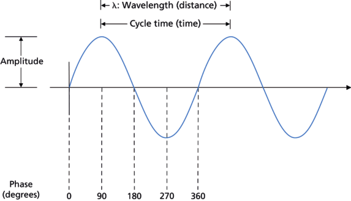

Figure 7.2 Electromagnetic wave: amplitude, wavelength, and phase

Electromagnetic waves have a direction and propagate at approximately the speed of light, 3 × 10 m sec . 8

Radio Transmission: Power, Bandwidth Informally, we understand from our everyday experience, that radio signals may be strong or weak, and that they may be clear or filled with static (“noise”).

Let’s next formalize these concepts.

Power is the amount of energy per unit time that a transmitter puts into its emitted electromagnetic waves. We can think of power informally as the signal’s strength. Power is measured in units of watts, typically milliwatts (mW) in wireless networks. Electrical engineers sometimes like to measure power in decibel milliwatts (“dBm”), which is the logarithm of the ratio of the signal’s power (measured in mW) to one mW.

But we’ll use the more common linear measure of mW here.

The idealized electromagnetic wave in Figure 7.2 has just one frequency.

That is, all of the radiated electromagnetic energy is concentrated at one specific frequency. In practice, a transmitter’s power will be spread across more than one frequency. The power spectral density function, shown in Figure 7.3(a), characterizes the amount of power present in the transmitter’s signal as a function of frequency. A power spectral density function is typically centered around a so-called carrier frequency, as shown in Figure 7.3(a). The carrier frequency in the example of Figure 7.3(a) is 1 GHz.

Equipped with the concept of power spectral density, we can now carefully define the notion of a radio signal’s bandwidth—a key physical-layer concept in wireless networks. A radio signal’s bandwidth, as its name suggests, is the width (measured in Hz) of the range of frequencies occupied by the signal. The signal in Figure 7.3(b), has a bandwidth of 22 MHz, with its power spread evenly between 2.427 and 2.429 GHz. We’ll see in Section 7.6 that this particular 22-MHz-wide “channel”—i.e., a radio channel with a 22 MHz bandwidth—corresponds to channel 6 in a WiFi network.

It’s important to note that this precise notion of signal “bandwidth” in the wireless physical layer—the width of the frequency band occupied by a radio supports a maximum transmission rate of 72.2 Mbps, while a 40-MHz-wide 802.11n WiFi channel has a maximum transmission rate of 150 Mbps [Intel 2024]. But as we will see, the relationship between radio channel bandwidth (measured in Hertz) and link transmission bandwidth (measured in bits per second) is rather complex. We’ll be careful to use the term “bandwidth” in this chapter to mean the width of the frequency band occupied by a radio signal. We know from our everyday experience (e.g., from listening to AM, FM, or satellite radio) that radio signals can sometimes be clear but at other times be filled with noise. The top part of Figure 7.4 shows the original “clean” signal from Figure 7.2, with additional noise signal introduced between the transmitter and receiver (the middle section of Figure 7.4), and the received signal (the bot- tom part of Figure 7.4). Looking at the middle section of the noisy received signal, you can perhaps appreciate the challenge of extracting the original transmitted signal from the received noisy signal. There can be many sources of noise: • Interfering transmitters. Certain radio frequency bands are reserved for “unlicensed” use, meaning that many industrial and consumer devices can transmit radio waves in that band, subject to power restrictions. One of these bands is the 2.4–2.5 GHz band, where baby monitors, garage door openers, and many other home devices can all transmit signals. Even more importantly, many networks—WiFi, Bluetooth and Zigbee band and do so in an uncoordinated manner. Of course, it’s fine when it’s your WiFi network using this band, but nearby networks owned by others look just like noise to your network! As the saying goes, “One person’s network transmission is another person’s noise.”

Figure 7.3 (a) Signal power spectral density, (b) signal bandwidth (idealized) signal—is very different from the rather informal use of the term “bandwidth” elsewhere in networking to refer to a link’s bit transmission rate or capacity. Students are often understandably confused by this. For starters, note that radio signal bandwidth is measured in Hertz, while a link’s transmission rate is measured in bits per second (bps). As we’ll see, a radio channel’s bandwidth (in Hertz) is related to the rate at which bits can be transmitted across a radio link (in bits per second). In general, the larger the bandwidth, the higher the rate at which bits can be transmitted. For example, a 20-MHz-wide 802.11n WiFi channel (Section 7.3.2) (IEEE 802.15.4) networks, for example—use the unlicensed 2.4–2.5 GHz

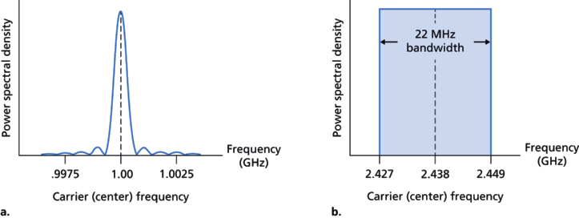

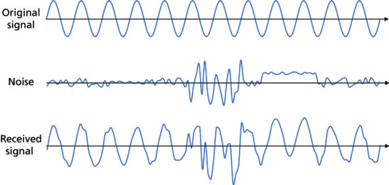

Figure 7.4 Original signal, noise, and noisy received signal

• EM radiators. Electric motors and microwaves, particularly older models with less shielding, can emit radio waves.

• Thermal and electronic noise. Natural thermal variations and imperfections in electronics at a transmitter or receiver can add noise to the signal.

Radio Channel: Noise, Signal-to-Noise (SNR) Ratio, and Capacity The ratio of the signal power to noise power is known as the signal-to-noise ratio (SNR). The SNR is typically measured in decibels (dB):

 received signal power    SNR dB = 10 log i  10   noise power

Note that an SNR value of 0 means that there is an equal amount of signal and noise. For WiFi networks, a minimum acceptable value of SNR in a received signal is around 20 dB [Meraki 2023]; the minimum acceptable value for LTE ranges from –5 to 18 dB, depending on the modulation technique used; see Section 7.2.2 [Rohde and Schwarz 2013].

With the concepts of power, bandwidth and noise in hand, we’re now ready to state one of the most important results in communication theory, Shannon’s capacity theorem. Shannon’s theorem relates communication channel capacity, C—the maximum possible rate at which data can be transmitted (measured in bits per second), error-free, over the channel—to the channel’s bandwidth (B), and received signal and noise powers (both measured linearly, e.g., in mW):

 received signal power    C = B log  1 + i 2  noise power 

It’s important to note that Shannon’s capacity theorem gives an upper bound on channel capacity. It says that no matter how cleverly data is coded and modulated into the wireless signal, the amount of received data will be less than or equal to C, for a given channel bandwidth and SNR. There are also several important practical consequences of Shannon’s capacity theorem:

• At a given SNR, maximum channel capacity scales linearly with channel bandwidth. A wider channel bandwidth means the potential to transmit more bits per second.

• For the case of a high SNR, there is little additional benefit in expending more effort to increase the SNR, since the maximum capacity will only increase logarithmically, i.e., sublinearly with increasing SNR.

Radio channel properties: path loss, multipath, and hidden terminals A radio signal can change in important ways as it propagates from transmitter to receiver. Most fundamentally, a wave loses strength as it propagates. This weakening of a radio signal as it propagates is referred to as path loss or attenuation. In the case of an unobstructed line-of-sight path from transmitter to receiver, the ratio of the transmitted power to received power decreases according to an inverse-square law:

P 1 received ~ P 2 ( fd ) transmitted

where P and P are the transmitted and received powers, respectransmitted received tively, f  is a signal’s frequency, and d is the distance between the transmitter and receiver.

The intuition behind this quadratic path loss is illustrated in Figure 7.5.

Since the surface area of a sphere increases as the square of the distance between the center and surface of the sphere, the energy passing through a unit of area at distance d from the sender is the same amount of energy that

passes through area four times larger at distance 2 , and an area nine times d

larger at distance 3d. The path loss exponent of 2 is for so-called free-space path loss in air. A path loss exponent of around 3 is common in an outdoor urban environment, and a path loss exponent of 4 or higher is common within buildings—making path loss an even more important concern.

The quadratic path loss in both distance and frequency has important ramifications for radio communication: low frequency (e.g., kHz) radio tends to be used for long-distance, low-data-rate radio applications such as radio navigation, while high frequencies (e.g., GHz) tend to be used for relatively shorter distance terrestrial applications including cellular and WiFi networks.

The exponential decrease in received power as a function of distance gives rise to the hidden terminal problem, a phenomenon that will drive the design

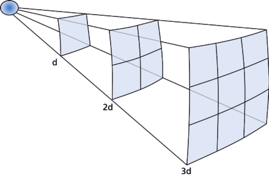

Figure 7.5 Free space path loss decreases according to the square of the distance between transmitter and receiver other, but A and C cannot hear each other of wireless link-layer multiple access protocols such as WiFi’s CSMA/CA protocol (Section 7.3.1). Figure 7.6(a) illustrates the case where nodes A and B can “hear” each other, i.e., the received power levels of their signals are above a detection threshold. Similarly, nodes B and C can hear each other. However, because of path loss, nodes A and C cannot hear each other because their received power levels have dropped below the detection threshold. Thus, nodes A and C are “hidden” from each other. One can already appreciate how hidden terminals will impact wireless CSMA protocols—if A and C want to transmit to B they may listen to the channel, not hear each other transmitting (due to path loss), and yet their transmissions to B will interfere with each other at B. Figure 7.6(b) illustrates another hidden terminal scenario where A’s and B’s signals are physically blocked from each other. And yet in this case as well, their transmissions interfere with each other at B. Clearly, communicating over a wireless channel

Figure 7.6 Hidden terminals: A and B can hear each other, B and C can hear each

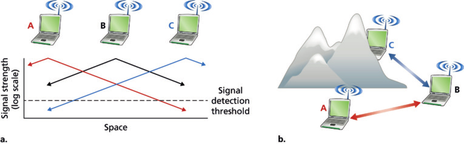

will be more complicated than communicating over a wired channel! The inverse square law also states that the received power decreases exponentially not just in distance, but in frequency as well. This exponential decrease with frequency also has very important consequences in wireless networks. It means, for example, that moving from a fixed-bandwidth channel at 5 GHz to a similar channel at 50 GHz, will result in 100 times less power received at 50 GHz! Thus, channels at higher frequencies tend to operate at shorter ranges, while lower frequency channels tend to be used to cover longer distances. Figure 7.7 illustrates another important characteristic of wireless communication: multipath signals. In this figure, part of the radio signal transmitted by a sender follows a direct line-of-sight path to the receiver, shown conceptually as a received green pulse in Figure 7.7(a). However, the transmitted signal also reflects off of objects (e.g., buildings) in the environment and arrives at the receiver at slightly later points in time, as the reflected pulses have travelled longer distances from the transmitter to the receiver. These multipath received signals are shown as the red and purple pulses in Figure 7.7(b). Because of multipath, the reception of a signal that was transmitted at a given instant of time at the sender is spread out over time at the receiver. Clearly, multipath will complicate the receiver’s job of reconstructing the originally transmitted signal. Multipath also places constraints on the maximum rate at which a transmitter can change its transmitted signal, and consequently constrains the rate dictated minimum amount of time needed between changes in the sender’s signal is referred to as the receiver’s coherence time. Antennas: MIMO The antennas deployed in most of today’s wireless cellular and WiFi base stations and devices aren’t at all like your grandparent’s (or even your parent’s) antennas! Beginning in the early 2000s wireless networks began moving from systems with a single antenna at the transmitter and a single antenna at the receiver, to multiple-input and multiple-output (MIMO) antennas that use multiple antennas at both the transmitter and receiver. As we’ll see, these inno- vative MIMO technologies have allowed radio networks to significantly increase link throughput (the number of bits per second successfully received)

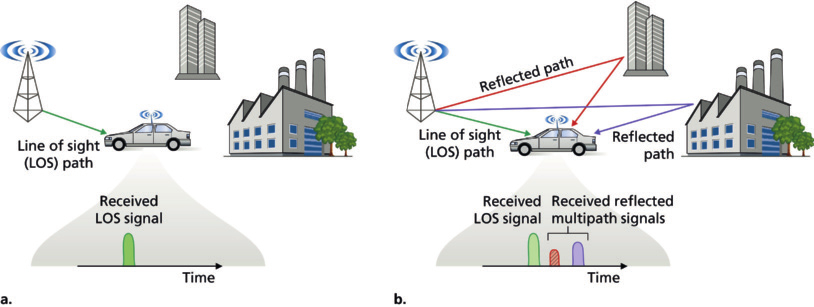

Figure 7.7 (a) Line-of-sight (LoS) signal; (b) LoS and reflected signal reception at which a transmitter can transmit bits. Figure 7.8 shows two transmitted pulses from the sender. The transmitter must space its signal/pulse transmissions far enough apart so that the LoS signal (the green pulse in Figure 7.8) and all of its multipath reflections (the red and purple pulses) are received at the receiver before the next LoS signal/pulse is received. If this isn’t done, the two pulses and their reflections will be mixed in time at the receiver. This receiver-

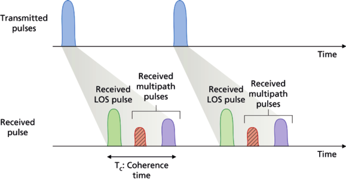

Figure 7.8 Multipath reflections determine coherence time between transmitter and receiver. One immediate advantage of having multiple antennas at the receiver should be apparent – N receiver antennas means

(to a first approximation) that the total received signal has N  times more

power. But MIMO systems are about much more than that!

MIMO gains its advantages over single-antenna systems by exploiting the multiple paths between sending and receiving antennas in one of two fundamentally different ways:

• MIMO spatial diversity.MIMO spatial diversity techniques send redundant streams of information from a transmitter to a receiver, exploiting the fact that radio signals travelling on different physical paths between the one or more transmitting antennas to the one or more receiving antennas will experience different degradations (e.g., multipath effects).

This technique is essential in combating the adverse effects of multipath fading, where signal reflections from buildings, trees, and other obstacles cause variations in signal strength. By receiving multiple copies of the signal through different paths, MIMO systems can combine these signals in a way that maximizes signal strength and minimizes error rates. Even though antennas may be separated by only a few centimeters (e.g., on a cell phone), signals received on different paths may indeed experience quite different channel conditions.

• Figure 7.9(a) shows the case of a single transmitting antenna and two receiving antennas. Spatial diversity can also be exploited with multiple transmitting antennas, but we’ll focus on the simplest case here; see [ Halperin 2010] for a readable introduction to the more general case.

• Suppose that the transmitter sends an original signal, x. The upper antenna receives a signal y = H x , where the H  function represents how  1 1, 1 1, 1 the transmitted signal has been changed (e.g., in amplitude and phase) between the single transmitter antenna and the upper receiver antenna.

Similarly, the lower antenna receives a different signal y = H .

But 2 1, 2 x  what should the receiver do with these two different received signals? This is where physical-layer signal-processing techniques come in. Simply “adding” the signals together would essentially just recreate the effects of single-antenna multipath. One might instead choose to select the y signal i with the largest SNR. Or one might first choose to align the phases of the received signals (which may have been shifted as a result of transmission) and then coherently add the signals together, perhaps weighting the contributions of the two signals by their SNRs. These are but two of the many techniques that can be used to recover the original signal from multiple received signals [Goldsmith 2005; Tze 2005].

Figure 7.9 Simple

MIMO (a) spatial diversity ,

(b) spatial multiplexing

• MIMO spatial multiplexing. In the case of MIMO spatial multiplexing, multiple different streams of information are sent in parallel along the different paths from transmitter antennas to receiver antennas. This is illustrated in Figure 7.9(b), which shows an example where two different streams of information, x and x are transmitted by two different trans- 1 2 mitting antennas. At the receiver, each antenna receives a signal containing both streams of information, with each component stream having experienced different degradations. For example, the received signal at the upper receiver antenna is represented by y = H x + H ,  1 1, 1 1 2, 1 where the sum indicates that the signals are combined in the air, that the original signal x has been transformed according to H  on its way to 1 1, 1 the upper receiving antenna, and that x has been transformed by H  2 2, 1 on its way to this upper antenna. The signal received at the lower antenna, y ,

has an analogous interpretation.

• The receiver’s task is to determine the original signals x , x , given the 1 2 received signals, y , y . Of course, H  and H  are unknown in prac- 1 2 1, 1 2, 1 tice, but they can be estimated if the sender and receiver work together. This, together with the observation that Figure 7.9(b) has two equations (one for y , one for y ) with two unknowns (x and x ), hints at the type of signal 1 2 1 2 processing algorithms that might be used at the receiver to compute the original signals, x and x . In practice, a sender can also perform coding and 1 2 modulation that helps the receiver improve its estimates for x and x . 1 2

The theory and practice of the MIMO signal-processing techniques are well beyond the scope of what we can cover here. Our modest goal here has been to introduce spatial diversity and spatial multiplexing and give a flavor of the types of signal processing that is at the foundation of MIMO systems.

The reader is referred to [Goldsmith 2005; Tze 2005; Halperin 2010] for more in-depth treatments.

Beam Forming and Directional Antennas Beamforming involves directing the transmitted signal towards a specific user or area instead of radiating the signal in all directions. Beamforming with directional antennas enhances signal strength at the receiver, reduces interference, and improves overall wireless communication performance.

Beamforming is typically implemented using an array of antennas. By adjusting the phase and amplitude of the signal at each transmitting antenna, the system can create constructive interference in the desired direction and destructive interference in others, forming a “beam” of radio waves. Beamforming can be dynamic, with the system continuously adjusting the beam direction based on the location of the user. This ensures optimal signal quality even as users move. Beamforming has the following benefits:

1.  Increased signal strength: By focusing the signal in a specific direction, beamforming increases the signal strength received by the intended user, leading to higher data rates and more reliable connections.

2.  Reduced interference: Beamforming reduces interference with other users by minimizing signal leakage into undesired directions. This leads to better performance in dense environments with many devices.

3.  Improved coverage: Directional beams can extend the coverage area of wireless networks, providing better connectivity at the edges of the coverage zone.

4.  Enhanced capacity: By enabling more efficient use of the available spectrum, beamforming can increase the overall capacity of the network, supporting more users simultaneously.

Beamforming is used widely in WiFi, modern cellular networks, and satellite communications.

Multi-user MIMO (MU-MIMO) Our MIMO discussion above has implicitly focused so far on Single-user MIMO (SU-MIMO)—using multiple antennas at the transmitter and/or receiver to transmit to a single device, as shown in Figure 7.10(a). In practice, the number of antennas in such systems is small, e.g., 2 to 4 antennas in a WiFi base station.

In cellular networks, MIMO techniques are also used to send from one sender to many receivers simultaneously. This is known as Multi-user MIMO (MU-MIMO), or sometimes as Massive MIMO. MU-MIMO uses different subsets of its antennas to transmit to multiple different devices at the same time, as shown in Figure 7.10(b). Each subset of antennas, in turn, uses MIMO spatial diversity to transmit multiple signals with the same information to a device. In addition, MU-MIMO often employs beamforming as just described and shown in Figure 7.10(b). A modern MU-MIMO antenna for a 5G base station can contain an array of up to 64 beamforming transmitter elements, and an equal or similar number of receiving antenna elements [Ericsson 2024; Samsung 2021].

Radio Spectrum The radio spectrum is the range of the electromagnetic spectrum from 3 Hz to 3 THz. The radio spectrum is considered a national asset and thus its use is

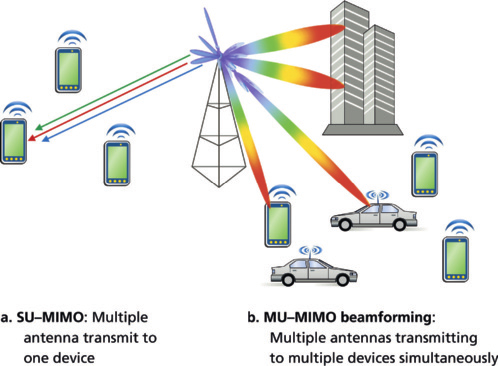

Figure 7.10 Beamforming in MU-MIMO

regulated by individual countries, with some coordination (but no regulation) provided by a United Nations agency known as the International Telecommunication Union (ITU). Typically, a country assigns specific frequency ranges of the radio spectrum for specific uses. A popular poster graphic (“popular” at least among radio geeks!) [NTIA 2016] shows the allocation of the US radio spectrum for uses that include maritime and aeronautical radio navigation; terrestrial AM, FM, and television broadcasting; satellite broadcasting; radio location (e.g., GPS);

amateur radio; radio astronomy; weather radar, consumer wireless devices, and of course, to the wireless networks covered in Sections 7.3 through 7.6.

There are two broad classes of spectrum-use types:

• Licensed spectrum. As the name would suggest, a government-issued license must be obtained to operate a transmitter in a licensed spectrum band; this includes the spectrum bands used by commercial cellular network providers (see Table 7.1).

• In many countries, spectrum is allocated to commercial cellular network providers through spectrum auctions, which have generated tens to hundreds of billions of dollars of licensing fees in India, the UK, and the US.

One consequence of commercial purchase of expensive spectrum rights (as well as the costs of tower and land access needed to operate a cellular network) is that cellular commercial services (say unlike WiFi providers) must price their services so that they can cover all of these costs and make a profit. Because of the scarcity and cost of licensed spectrum, new spectrum-sharing methods are being developed to allow non-incumbent devices (i.e., devices not associated with the spectrum licensee) to use the

Table 7.1 Most common US spectrum bands used by wireless networks (non-exhaustive; non-US

frequencies differ slightly) Spectrum band (L)icensed

(informal name) Network Type (U)nlicensed Comments

WiFi, Bluetooth, U

2.4 GHz  2.40 – 2.49 GHz

WiFi: 802.11 b/g/n/ax . See Section 7.3.2.  Zigbee Bluetooth: See Section 7.6.1.

WiFi U 5 GHz  5.17 – 5.83 GHz

802.11 a/h/n/ac/ax . See Section 7.3.2.

 WiFi U 6 GHz  5.9 – 7.12 GHz

802.11 ax/be. See Section 7.3.2.

 cellular L < 1 GHz (various cellular “low- 2G/3G/4G/5G. See Section 7.2.2. Low-band band” frequencies) frequences cover longer distances (10s of miles), but at lower speeds  50 – 250 Mbps . 

cellular L

1.8 GHz, 3.3 – 3.8 GHz, 6 GHz

2G/3G/4G/5G. See Section 7.3.3. Midband (various cellular “mid-band” frequencies are the “sweet spot,” balancing frequencies) distances  5 miles and transmission rates  100 – 900 Mbps . 

cellular L/U

3.5 GHz Citizens Broadband Radio

CBRS also known as “Private 5G”. Service (CBRS)

cellular L 26 GHz, 40 GHz, 50 GHz, 66 GHz 5G. See Section 7.3.2. High band frequencies, also (various cellular “high-band” known as “millimeter wave” frequencies, cover short frequencies) distances ( < mile), but at high speeds ( 3 Gbps < ).

LoRa (IoT) U See Section 7.6.3 915 MHz  902 – 928 MHz  incumbents’ licensed spectrum under specific rules and conditions. As an example, in the US, the 3.5GHz CBRS band (see Table 7.1) allows cellular base stations (non-incumbents) to transmit if there are no naval radars (incumbents) in the spectrum. Many approaches are being explored, including cognitive radio schemes that dynamically sense and use spectrum not currently in use. See [Parvini 2023] for a recent survey.

• Unlicensed spectrum. Portions of the spectrum are also available for unlicensed use. This means that institutions and people can purchase and use devices (e.g., garage door openers, baby monitors, microwave ovens, and much more) and wireless networks (notably WiFi networks) that operate in the unlicensed spectrum without obtaining a license. However, these devices must conform with use rules, e.g., limiting their transmission power level. Also, since many uncoordinated devices can transmit in unlicensed spectrum, they can interfere with each other. We’ll see throughout this chapter that wireless networks operating in the unlicensed spectrum take many different approaches to avoid, mitigate, and respond to this interference.

Table 7.1 presents a non-exhaustive list of the most common spectrum bands used by wireless networks.

In this section, we’ve already covered a lot of material about the characteristics of the wireless channel, all of which will serve us well in understanding the higher layers of wireless networks. But before we leave the physical layer, we need to cover one more foundational physical-layer concept—how bits from the link layer are transformed into symbols and how symbols are then transformed into transmitted waveforms.

##### 7.2.2 Coding and Modulation: From Bits to Symbols to Waveforms

In this subsection, we’ll move “up” the stack (while staying in the physical layer) and discuss how a wireless transmitter groups the bits that are to be transmitted into “symbols,” which are then encoded into waveforms that are then transmitted over the wireless channel. At the receiver, symbols are then extracted from the received waveform and translated back into bits.

Figure 7.11 shows the major steps in physical-layer transmission and reception. Data bits are presented to the physical layer at the transmitter from the link layer above. These bits are then processed into electromagnetic waveforms that propagate over the channel to the receiver, where they are Figure 7.11 Major steps in physical-layer transmission and reception transformed back into bits that are then passed from the physical layer to the link layer. Ideally, these bits also pass through this processing and transmission pipeline as fast as possible.

Physical-layer coding In the first step (“coding”) the original data bits from the link layer may be expanded, e.g., in the simplest case, redundant copies of the original bits can be added to the original set of bits to protect against the corruption of some of the transmitted bits by channel noise. It is important to note that bits added here in the physical layer are in addition to checksum or CRC bits that have been added at the link layer, and that we studied in Chapter 6. If a link-layer frame contains checksum or CRC bits, these bits are treated in the physical layer exactly the same as any other bits in the link-layer frame, and so may themselves be protected by added physical-layer bits!

The transmitted bits might also be reordered, e.g., spreading redundant bits among the transmitted bits, so that a burst of noise does not cause all copies of a bit to be affected. The receiver then reverses the encoding steps to recover the original bitstream. For example, eight original data bits

d d d d d d d d 1 2 3 4 5 6 7 8

might be expanded (where d ’ denotes a copy of the ith bit) to 16 bits: i

d d d d d d d d d d d d d d d d ’  ’  ’  ’  ’  ’  ’  ’ 1 1 2 2 3 3 4 4 5 5 6 6 7 7 8 8

and then shuffled to produce:

d d d d d d d d d d d d d d d d ’  ’  ’  ’  ’  ’  ’  ’ 1 5 2 6 3 7 4 8 5 1 6 2 7 3 8 4

If, for example, three bits in a row experience a burst of interference when transmitted (where x denotes a bit that the receiver is not able to extract from

the received signal):

d d d d d d x x x d d d d d d d ’  ’ ’  ’  ’  ’ ’ 1 5 2 6 3 7 1 6 2 7 3 8 4

then after the receiver unshuffles the received bits to obtain:

d d d d d d x d x d d d d d d x ’ ’ ’ ’ ’ ’ ’ 1 1 2 2 3 3 4 5 6 6 7 7 8

there are still enough received bits for the receiver to recover the original eight data bits, even in the presence of a burst error. There are much more sophisticated coding techniques that offer more efficient techniques than the simple redundancy code illustrated above, and indeed entire courses are taught on this topic; see [Goldsmith 2005].

Lastly, we note that the dashed arrows at the top of Figure 7.11 from the receiver to the transmitter represent receiver feedback that is used by the transmitter to choose a modulation technique that is best suited to the current (yet changing) wireless channel conditions—a topic we’ll consider shortly at the end of this section.

Modulation: amplitude, frequency, and phase Modulation lies at the heart of the wireless transmitter’s physical layer. Modulation takes coded bits from the coding module shown in Figure 7.11 and creates waveforms that encode these bits.

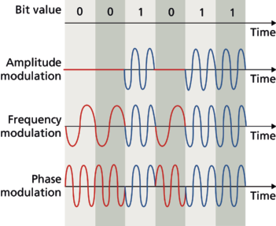

Figure 7.12 Amplitude, frequency, and phase modulation

As shown in Figure 7.12, there are three common approaches for encoding information into a radio signal, sometimes referred to as a carrier signal. Each approach encodes information by changing or “modulating” one of the three fundamental radio-wave characteristics discussed in Section 7.2.1: the signal’s amplitude, frequency, or phase.

• Amplitude Modulation. In amplitude modulation, also known as amplitude shift keying (ASK), bit values are encoded into the carrier signal by changing the signal’s amplitude among several discrete values. The “amplitude modulation” timeline in Figure 7.12 shows how the 0- and 1-bit values at the top of the figure that are to be transmitted during different intervals of time are encoded by setting the carrier signal’s amplitude to 0 or 1, respectively.

• Frequency Modulation. In frequency modulation, also known as frequency shift keying (FSK), bit values are encoded into the carrier signal by changing the carrier signal’s frequency during different time intervals. The “frequency modulation” timeline in Figure 7.12 shows how the signal’s frequency is set to one of two frequencies to encode a 0- or a 1-bit value.

• Phase Modulation. In phase modulation, also known as phase shift keying (PSK), bit values are encoded into the carrier signal by changing the phase of the carrier signal during different time intervals. In the “phase modulation” timeline in Figure 7.12, the red signal has a zero-and-increasing value at the start of a time interval; this phase encodes a 0-bit value in this example. The blue curve is 180 degrees out of phase from the red curve; it has a zero-and-decreasing value at the start of a time interval and encodes a 1-bit value.

In these examples, we see that the receiver can determine whether a bit value of 0 or 1 is encoded into the transmitter’s analog radio signal simply by measuring the amplitude, frequency, or phase of the radio signal. Note the ability to detect frequency and phase shifts implies that the clocks at the sender and receiver have been carefully synchronized.

Quadrature Phase Shift Keying (QPSK) Our example in Figure 7.12 shows two values of amplitude, frequency or phase being used to encode a single bit value.

But why stop at two values?

Why not use more than two values of amplitude, phase, or frequency to encode more than just two values? And why not modulate the amplitude, phase or frequency values at the same time to encode even more information? The answers to these questions lie at the heart of modern, physical-layer modulation techniques standardized for 4G 5G, WiFi, Bluetooth, and other wireless networks.

Thus, let’s next consider grouping the serial bits exiting the coding module in Figure 7.11 pairwise, two bits at a time: if the two serial bits values are a 0 followed by another 0 they will be grouped together and become the single symbol “00”; if two serial bits values are a 0 followed by a 1, they will be grouped together and become a different symbol, “01”; if two serial bits values are a 1 followed by a 0, they will be grouped together and become the symbol, “10”; and two serial bits values of a 1 followed by a 1, they will be grouped together and become the symbol, “11”. The transmitter’s job of transmitting a stream of bits is now transformed into the job of transmitting symbols. Since there are four symbol values  “00”,  “01”,  “10”,  “11” that can be transmitted, 

four different values of phase shift will do nicely to represent these four symbol values. This approach of using four phase values to encode four different symbols (which represent four different pairs of two-bit values) is known as Quadrature Phase Shift Keying (QPSK), illustrated in Figure 7.13.

Notice that in QPSK, all signals have the same amplitude but have phase values separated by 90 degrees: of 45 ° (red), 135 ° (green), 225 ° (blue), and 315 °

(purple).The receiver need only measure the signal’s phase to determine which of the four symbols is being transmitted. Note also that the rate at which symbols are processed is only half of the bit rate, leaving more time for symbol signal processing than bit-by-bit signal-processing. A fun interactive Web site where you can learn about and play with QPSK signals is https://www.geogebra.

org/m/enkymjtg The four symbols in QPSK can be succinctly characterized in a diagram known as a constellation diagram.A point in a constellation diagram depicts the symbol’s phase (measured in degrees counterclockwise from the east, i.e., 3:00, position) and amplitude (measured in distance from the origin).The four QPSK symbols are represented as red dots in Figure 7.14.For example, the symbol in the northeast quadrant has a phase of 45 degrees.

As we’d expect, the four QPSK symbols shown in Figure 7.14 have the same phases of 45 ° ,

135 ° , 225 ° , and 315 ° and all have the same amplitude.

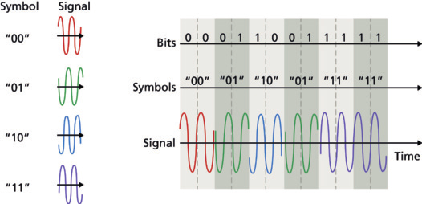

Figure 7.13 Quadrature Phase Shift Keying (QPSK)

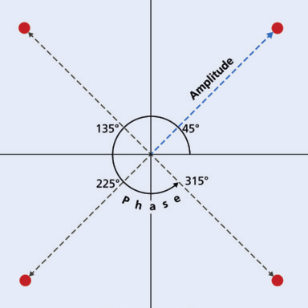

Figure 7.14 QPSK constellation diagram— four symbols represented by four signal waveforms that have four different phases and identical amplitudes

Quadrature Amplitude Modulation (QAM) In QPSK, only the signal’s phase is modulated. In quadrature amplitude modulation (QAM), a signal’s phase and its amplitude are both modulated. QAM is nicely illustrated using constellation diagrams. Figure 7.15 shows the constellation diagrams for 4-QAM, 16-QAM and 64-QAM. The number preceding “-QAM” refers to the number of symbols in this version of QAM. 4-QAM is essentially the same as QPSK and has 4 symbols. Figure 7.15 also shows the bit values encoded by a symbol—2 bits for 4-QAM,  4 bits for 16-QAM, and Figure 7.15 Bit encodings for 4-QAM, 16-QAM, 64-QAM, constellations (for WiFi)

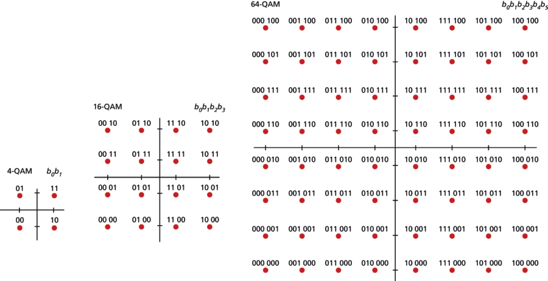

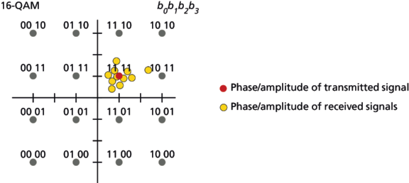

Figure 7.16 Transmitted versus

received 16-QAMmodulated signals

6 bits for 64-QAM. 16-QAM, 64-QAM and 256-QAM are used in 4 5G and WiFi networks, with higher order QAMs  1024,  4096 appearing in the WiFi-6 

and WiFi-7 standards.

A constellation diagram can also provide us with additional insight about how noise gives rise to bit (or more accurately, symbol) errors. Consider the 16-QAM constellation in Figure 7.16 and suppose a sender transmits the “1111” symbol shown in solid red.

As a result of changing electromagnetic and measurement noise at the receiver, a “1111” signal’s amplitude and phase will be received differently each time that signal is transmitted. The yellow-shaded dots in Figure 7.16 represent possible instances of measured amplitude and phase at the receiver. Most of the yellow-shaded dots, corresponding to measured amplitude and phase values, are closer to the amplitude and phase of the “1111” symbol than any other constellation symbol. In these cases, the receiver would correctly infer that the originally transmitted symbol was “1111”. However, note that there is one received signal that is closer to the “1011” symbol than the “1111” symbol; in this case, the receiver would incorrectly infer that the “1011” symbol had been sent, when in fact the “1111” symbol was transmitted, resulting in an incorrect symbol reception.

Adaptive Modulation Figures 7.15 and 7.16 also suggest that as the constellation diagram becomes more densely packed at higher order QAMs, the effects of noise and receiver measurement error will become more pronounced. This results in higher symbol-error rates, and hence bit-error rates. While higher transmission rates might seem to always be desirable and thus using a higher-order QAM might also always seem like a good idea, this won’t be true if the error rate is too high! This observation offers a valuable insight for physical-layer wireless communication—that it will be important for the transmitter and receiver to choose a modulation technique that is matched to the channel conditions.

Figure 7.17 illustrates this insight. Suppose the goal is to keep the bit error rate (BER) below 10 − 4 . At the same time, of course, we’d like to achieve the

highest bit rate possible subject to this constraint. Figure 7.17 indicates that if the signal-to-noise ratio (SNR, measured in dB) is less than 13, then 4-QAM should be used. On the other hand, if the SNR is between 13 and 17, then 16-QAM can be used, with a correspondingly higher bit rate. And if the SNR is higher than 17, then 64-QAM can be used.

As the SNR varies over time, the modulation technique used by the transmitter and receiver can be changed dynamically to realize the highest throughput possible at a given time, given the BER constraint. Of course, this will require that the sender and receiver coordinate to measure and report BER and SNR, and to coordinate changes in modulation technique. We’ll see how this is done when we study the 4G/5G wireless networks.

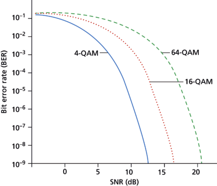

Figure 7.17 SNR versus BER for 4-QAM, 16-QAM, and 64-QAM

This concludes our discussion of the wireless physical layer. We’ve covered a lot of ground! Indeed, as we noted at the outset of this section, wireless networking is an example where the functions of the lower layers cannot be easily abstracted away with a few easy-to-understand concepts. If you’re a computer scientist, the wireless physical layer may be quite new ground for you. Nonetheless, the physical-layer concepts we have learned in this section will provide a great foundation for a deeper and broader understanding of wireless networks.

#### 7.3 The Wireless Access Network

In this section, we’ll cover the principles and practice underlying wireless access networks, including the 802.11 WiFi WLAN and the 4G/5G RAN. The radio channel and modulation and coding topics we just studied are physical-layer topics; the access network principles and practices that we’ll study in this section are link-layer topics, building on top of this physical-layer foundation.

We’ll begin in Section 7.3.1 by studying how the radio channel is shared among the many devices and the base station in an access network. Since we’ve already studied the multiple access problem in Section 6.3, we’ll focus here on how the basic techniques we learned about there (FDM, TDM and random access) are specialized for a wireless channel.

With this common foundation, along with the foundations from Section 7.2, we’ll then study the two major wireless access networks: 802.11 WiFi WLAN and the 4 5G RAN in Sections 7.3.2 and 7.3.3, respectively. We’ll then turn to more specialized topics related to the wireless access network. In Section 7.3.4, we’ll learn how a wireless device discovers the existence of a wireless access network and the initial steps taken to join such a network. In Section 7.3.5, we’ll dive deeper into channel sharing, studying bandwidth allocation and the scheduling of frame transmissions onto upstream and downstream channels. Section 7.3.6 covers energy use in wireless network devices.

##### 7.3.1 Sharing the wireless channel

In Section 6.3, we learned about the various approaches used to share a multiple access channel:

• channel partitioning techniques, including time-division multiplexing (TDM) and frequency-division multiplexing (FDM);

• random access pr otocols, including Aloha and Carrier Sense Multiple Access

(CSMA) protocols; and

• taking-turns pr otocols, including polling.

We’ll assume Section 6.3 as background here, so you may want to refer back to that section to refresh your understanding. We’ll see that all of these techniques are used in the wireless network architectures we’ll study! In some cases, their use is quite straightforward. But in other cases, these basic approaches are combined or extended specifically for use in wireless networks.

In this subsection, we’ll cover two specific approaches for sharing the wireless channel: (i) Orthogonal Frequency Division Multiple Access (OFDMA), used in 4G, 5G and WiFi-6 7 networks; and (ii) carrier sense multiple access with collision avoidance (CSMA/CA), used in all generations of WiFi networks.

We’ll also learn how the physical radio channel is partitioned into upstream and downstream channels for link-layer data frame transmission, channel measurement, network discovery and more.

FDM, OFDM: channels and subchannels Figure 7.18 shows the starting point of our OFDM discussion. Figure 7.18(a) shows an idealized single wideband channel, where the power spectrum (see Section 7.2) is distributed evenly across the frequency spectrum used. Because a single wideband channel can be difficult to implement in practice (e.g., due to different impairments being present at different frequencies), and because devices will not need the full bandwidth of a wideband channel, a frequency band is thus often divided into multiple narrowband channels, each with smaller bandwidth, as shown in Figure 7.18(b).Each narrowband channel in Figure 7.18(b) is shown in a different color.

This figure also shows guard bands between the narrowband channels—a small frequency range where no signal is transmitted in this frequency range, preventing one subchannel’s transmissions from interfering with a neighboring subchannel’s transmissions.

Figure 7.18 Power spectrum of (a) an idealized single wideband channel; (b) frequency

division multiplexing (FDM) with 12 subchannels; (c) orthogonal FDM (OFDM) with 12 subchannels Figures 7.19 matching the 12 subchannel colors in Figure 7.18. The RE is the

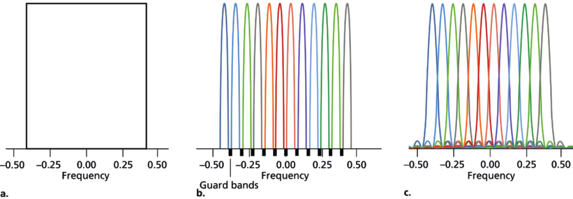

Orthogonal frequency division multiplexing (OFDM) is a technique for modulating the FDM subchannel carrier signals so that overlapping signals on different channels cancel each other out, as shown in Figure 7.18(c).OFDM doesn’t need guard bands, thus making fuller use of the available channel spectrum.

Note that there is more area under the power spectral density curves in Figure 7.18(c) than under the curves in Figure 7.18(b). That is, OFDM has higher spectral efficiency than FDM with guard bands. With spectrum a scarce and costly commodity (see Section 7.2.1), spectral efficiency is important! In Section 7.4, we’ll see how 4G 5G and WiFi networks specifically define the bandwidths of their various channels and subchannels. Orthogonal Frequency Division Multiple Access (OFDMA) Orthogonal Frequency Division Multiplexing Access (OFDMA) combines both frequency-division multiplexing and time-division multiplexing. Figure 7.19 illustrates how each OFDM frequency subchannel is divided into time minislots. An OFDMA Resource Element (RE) is a single time minislot at a subchannel frequency. As in Figure 7.18(c), each subchannel frequency in Figure 7.19 is shown in a different color, with the 12 subchannel colors in smallest unit of the OFDMA channel resource—a transmitter can send exactly one symbol (see Section 7.2.2), shown as a black dot in Figure 7.19, in an RE. In 4G 5G networks, an RE occupies a subchannel bandwidth of 15 kHz and is

66.6 µsec in duration. In WiFi networks supporting OFDMA, an RE occupies a subchannel bandwidth of 78 kHz and is 12.8 µsec in duration.

Although the RE is the smallest unit of an OFDMA channel resource, REs themselves are not used individually. Instead, adjacent REs (in both frequency and time) are grouped together, with all symbols transmitted using the same modulation technique and at the same power.

In 4G 5G networks a group of REs is referred to as a resource block (RB); in WiFi OFDM networks, a group of REs is referred to as a Resource Unit (RU). A base station or wireless device transmits its data as symbols in one or more RBs or RUs, as discussed in Section 7.3.5. In 4G networks, an RB consists of 84 symbols, contained in 7 time minislots, each

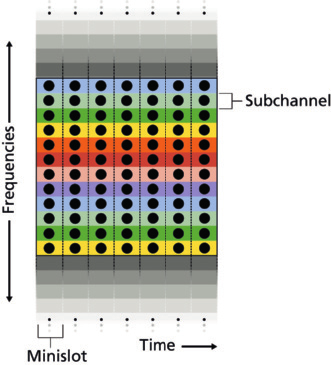

Figure 7.19 Orthogonal Frequency Division Multiple Access (OFDMA): combining frequency division and time division multiplexing

66.6 µsecs long, and 12 frequency subchannels, each 15 kHz wide, as shown in Figure 7.19. Different RB/RU sizes are defined for 5G and WiFi networks.

Random access: Aloha and CSMA/CA In Section 6.3.2, we learned that random access protocols are simple (e.g., there is no centralized assignment of frame transmission times to transmitting nodes) and ideal when the channel load is low. We learned that in Aloha, a node simply transmits whenever it has data to send, using the full channel bandwidth. If two or more transmitters send messages at the same time, the overlapping transmissions “collide,” and neither is received successfully at their destination(s). It is important to note that collisions are manifested in overlapping, interfering signals received at the destination (i.e., the receiver) rather than at the sender or intermediate locations. A higher-level retransmission mechanism is then used to recover from such collisions. Aloha protocols were first developed more than 50 years ago for wireless satellite networks [Abramson 1972; Schwartz 2009]. As we will see, they are still in use today in satellite and IoT networks, and are implemented in selected control-plane functions in 4G 5G networks.

Carrier Sense Multiple Access with Collision Avoidance (CSMA/CA) Carrier Sense Multiple Access with Collision Avoidance (CSMA/CA) was the original (and for many years the only) channel access method used in WiFi networks.

As discussed later in Section 7.3.2, the most recent WiFi standards (WiFi-6 onwards) offer both CSMA/CA and OFDMA as channel access techniques.

CSMA/CA is a carrier sense multiple access (CSMA) protocol that has the same listen-before-transmit behavior that we learned about in Section 6.3.2.

However, CSMA/CA has other features that address two challenges specific to a wireless setting:

• Hidden terminal problem. Due to the hidden terminal problem, a first transmitter may not even hear a transmission from a “hidden” second transmitter that is also sending to the first transmitter’s intended destination.

• No collision detection. The ability to detect collisions requires the ability to send (the transmitter’s own signal) and receive (to determine whether another station is also transmitting) at the same time. Because the strength of the received wireless signal is typically very small compared to the strength of the sender’s transmitted signal, it is difficult for a wireless transmitter to detect a collision with its own ongoing transmission (even at its own radio), obviating the use of CSMA/CD’s collision detection technique. Because CSMA/CA does not use collision detection, once a station begins transmitting a frame, it transmits the frame in its entirety;

that is, once a station gets started, there is no turning back. As one might expect, transmitting entire frames (particularly long frames) when collisions are prevalent can significantly degrade a multiple access protocol’s performance.

Because of these two challenges, collisions at a destination are typically more prevalent in wireless networks than in wired networks. Thus, CSMA/CA has an explicit link-layer acknowledgment mechanism. As shown in  Figure 7.20, when the destination station correctly receives a frame (e.g., a received frame that has passed the CRC bit-error check) it waits a short period of time known as the Short Inter-frame Spacing (SIFS) and then sends back an acknowledgment frame. If the transmitting station does not receive an acknowledgment

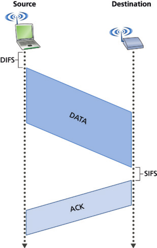

Figure 7.20 CSMA/ CA uses link-layer acknowledgments within a given amount of time, it assumes that an error has occurred and retransmits the frame, using the CSMA/CA protocol to access the channel. If an acknowledgment is not received after some fixed number of retransmissions, the transmitting station gives up and discards the frame.

Having discussed how CSMA/CA uses link-layer acknowledgments, we’re now in a position to describe the CSMA/CA protocol more fully. Suppose that a station (wireless device or an AP) has a frame to transmit.

1.  If initially the station senses the channel idle, it transmits its frame after a short period of time known as the Distributed Inter-Frame Space (DIFS);

see Figure 7.20.

2.  Otherwise, the station chooses a random backoff value using binary exponential backoff (as we encountered in Section 6.3.2) and counts down this value after DIFS when the channel is sensed idle. While the channel is sensed busy, the counter value remains frozen.

3.  When the counter reaches zero (which can only occur while the channel is sensed idle), the station transmits the entire frame and then waits for an acknowledgment.

4.  If an acknowledgment is received, the transmitting station knows that its frame has been correctly received at the destination station. If the station has another frame to send, it begins the CSMA/CA protocol anew at step 2. If the acknowledgment isn’t received, the transmitting station re-enters the backoff phase in step 2, with the random value chosen from a larger interval.

Recall that under Ethernet’s CSMA/CD multiple access protocol ( Section 6.3.2), a station begins transmitting as soon as the channel is sensed idle. With CSMA/CA, however, the station refrains from transmitting while counting down, even when it senses the channel is idle. Why do CSMA/CD and CSMA/CA take different approaches here?

To answer this question, let’s consider a scenario in which two stations each have a data frame to transmit, but neither station transmits immediately because each senses that a third station is already transmitting. With Ethernet’s CSMA/CD, the two stations would each transmit as soon as they detect that the third station has finished transmitting. This would cause a collision, which isn’t a serious issue in CSMA/CD, since both stations would abort their transmissions and thus avoid the useless transmission of the remainders of their frames. In a WiFi network, however, the situation is quite different. Because WiFi transmitters do not detect and abort a collision, a frame suffering a collision is transmitted in its entirety. The goal in WiFi is thus to avoid collisions whenever possible. In WiFi, if the two stations sense the channel busy, they both immediately enter random backoff, hopefully choosing different backoff values. If these values are indeed different, one of the two stations will eventually begin transmitting before the other, and (if the two stations are not hidden from each other) the “losing station” will hear the “winning station’s” transmission, freeze its counter, and refrain from transmitting until the winning station has completed its transmission. In this manner, a costly collision is avoided. Of course, collisions can still occur with 802.11 in this scenario: the two stations could be hidden from each other, or the two stations could choose random backoff values that are close enough that the transmission from the station starting first has yet to reach the second station. Recall that we encountered this problem earlier in our discussion of random-access algorithms in the context of Figure 6.12.

Dealing with Hidden Terminals: RTS and CTS WiFi’s CSMA/CA protocol also has a nifty (but optional) reservation scheme that helps avoid collisions even in the presence of hidden terminals. Recall from Figure 7.6 that in the hidden terminal problem, stations A and B can hear each other, stations B and C can hear each other, but stations A and C cannot hear each other. Suppose A is transmitting a frame to B, and halfway through A’s transmission, C wants to send a frame to B. Station C, not hearing the transmission from A, will first wait a DIFS interval and then transmit the frame, resulting in a collision at B. The channel will therefore be wasted during the entire period of both A’s and C’s transmissions.

In order to avoid this problem, the CSMA/CA protocol has an optional, short Request to Send (RTS) control frame and a short Clear to Send (CTS) control frame to (implicitly) reserve access to the channel. Let’s describe this in the common context of a station wanting to transmit a frame to an access point (AP).

When a sender wants to send a DATA frame, it first sends an RTS frame to the AP, indicating the total time required to transmit the DATA frame and the acknowledgment (ACK) frame. When the destination receives the RTS frame, it responds by broadcasting a CTS frame. This CTS frame serves two purposes: it gives the sender explicit permission to send and also instructs the other stations within hearing range of the destination not to send for the reserved duration.

Figure 7.21 shows that before transmitting a DATA frame, the source first broadcasts an RTS frame, which is heard by all stations within hearing range, including the AP. Note that the stations to the right of the AP are not within hearing distance of the sender and do not receive this RTS. However, the AP then responds with a CTS frame, which is heard by all stations within its range, including the sender and the other stations to the right of the AP. These other stations, having heard the CTS, refrain from transmitting for the time duration specified in the CTS frame. The RTS, CTS, DATA, and ACK frames are shown in Figure 7.21.

The use of RTS/CTS improves performance in two important ways:

• The hidden station problem is mitigated, since a long DATA frame is transmitted only after the channel has been reserved.

• Because RTS and CTS frames are short, a collision involving an RTS or CTS frame will last only for the duration of the short RTS or CTS frame.

Once the RTS and CTS frames are correctly transmitted, the following DATA and ACK frames are usually transmitted collision-free. You should convince yourself, however, that the RTS/CTS mechanism will not always successfully reserve the channel for a DATA message, since an RTS/CTS message may itself be lost due to channel fading or noise. You’re encouraged to check out the CSMA/CA animation in the textbook’s Web site. This interactive animation illustrates the CSMA/CA protocol, including the RTS/CTS exchange sequence.

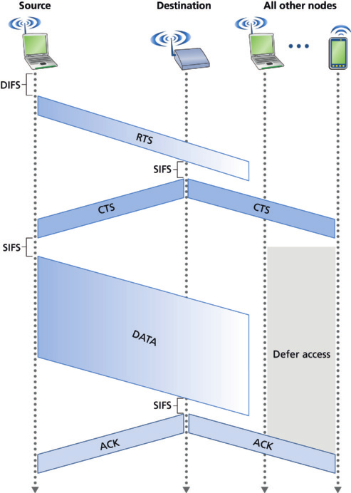

Figure 7.21 Collision avoidance using RTS/CTS

Although the RTS/CTS exchange can help reduce collisions, it also introduces delay and consumes channel resources. For this reason, the RTS/CTS exchange is only used (if at all) to reserve the channel for the transmission of a long DATA frame.

##### 7.3.2 WiFi: the 802.11 Wireless LAN

Pervasive in the workplace, home, educational institutions, cafés, airports, stadiums, and street corners, wireless LANs are now one of the Internet’s most important access network technologies. Although many wireless LANs were developed in the 1990s, one particular network technology has clearly emerged as the winner: the IEEE 802.11 wireless LAN, aka WiFi. Just as Ethernet has come to rule the wired LAN, so too has WiFi come to rule the wireless LAN.

The  802.11 standards for wireless LANs are created by the IEEE 802.11 standards committee [IEEE 802.11  Standards 2024]. Since 2000, a number of the 802.11 standards (but not all) have also been branded as “WiFi” by the WiFi Alliance, with numbered generations of WiFi conceptually matching the similar notion of numbered “generations” of cellular network standards. Although there are a number of 802.11 standards that are not part of the WiFi “branding” (and for example operate at higher or lower frequency ranges than shown in Table 7.3), we’ll nonetheless use the terms “WiFi” and “802.11” interchangeably, as each of the major commercial 802.11 standards corresponds to a WiFi generation, as shown in Table 7.2.

Overview of 802.11* Wireless LANs We’ve already covered many of the foundational aspects of WiFi in Section 7.3.1, including CSMA/CA, OFDM, and OFDMA. So we’ve already gotten a great start in understanding WiFi! In this section we’ll provide an overview of WiFi networks, and discuss its channel structure, frame formats, and internetworking with wired Ethernet LANs. Later in this chapter, we’ll also cover how a device discovers and attaches to a WiFi network ( Section 7.3.4), the scheduling of WiFi frame transmissions (Section 7.3.5) and how a device conserves energy in a WiFi network through sleep/wake cycles in Section 7.3.6.

We’ll also cover how a wireless network (including WiFi) supports device mobility in Section 7.4.2.

Table 7.2 shows the evolution of the IEEE 802.11 standard. One takeaway from Table 7.2 is that WiFi has provided a relentless increase in the maximum throughput seen by a WiFi user—after all, more is always better! While this was true particularly in WiFi’s early days, WiFi networks are not always (or even often) deployed with the aim of providing maximum sustained throughput for a single user. Indeed, the most recent use case driving many WiFi developments is dense deployment of WiFi networks in large enterprises, airports, stadiums, and public spaces, where a large number of users want to send and receive data at the same time. In dense deployments, the focus is on efficiently supporting many simultaneous users, rather than delivering maximum throughput to a single user.

Table 7.2 Evolution of major 802.11 standards IEEE 802.11 Max data rate Frequency

standard WiFi gen Year (theoretical) (GHz) Bandwidth PHY

1999 Direct-sequence spread 802.11b 11 Mbps 2.4 22 spectrum

2003 OFDM 802.11g 54 Mbps 2.4 20

2009 OFDM 802.11n WiFi 4 600 Mbps 2.4, 5 20, 40

2013 OFDM, MIMO 802.11ac WiFi 5

6.9 Gbps

5 20, 40, 80, 160

2020 OFDM, OFDMA, MIMO 802.11ax WiFi 6

9.5 Gbps

2.4, 5 20, 40, 80, 160

2024 OFDM, OFDMA, MIMO 802.11be WiFi 7 30 + Gbps 2.4, 5, 6 20, 40, 80, 160, 320

So, let’s look beyond the gains in maximum throughput and make the following observations about WiFi evolution:

• Frequency. Most WiFi networks operate in unlicensed frequency bands (One exception to this is the 802.11p for vehicle to vehicle communication that operates in a licensed spectrum band). The bands used by WiFi have expanded from just the 2.4 GHz band (which we recall is crowded with many consumer-electronic devices that are potential sources of interference for WiFi networks) to the 5 GHz band and now the 6 GHz band as well. Some 802.11 standards (e.g., 802.11 ah) use sub-1GHz bands, while others (801.11ad, 802.11ay) use the so-called millimeter wave band at 60 GHz and higher.

• Bandwidth. The bandwidth used by WiFi networks is divided into channels of different channel bandwidths, with each successive WiFi generation boasting of an increase in the maximum channel bandwidth. The minimum channel bandwidth is 20 MHz, with higher channel bandwidths achieved by “bonding” multiple adjacent 20 MHz channels together; see Figure 7.43. An individual WiFi network will operate on just one of these channels.

• The Physical Layer. The 802.11 physical layer has evolved from a spreadspectrum form of modulation related to that used in 3G cellular networks to OFDM to OFDMA, the same modulation technique used in 4G and 5G networks that support dense deployment scenarios. Given that an AP must support a range of legacy devices, e.g., from ancient 802.11g devices to modern WiFi6-capable devices, an AP must support OFDM, OFDMA, and CSMA/CA at the same time. We’ll soon see how this technical challenge is solved.

Figure 7.22 illustrates the principal components of the 802.11 wireless LAN architecture. The fundamental building block is known as the basic service set (BSS). A BSS contains two or more wireless nodes, with one of those nodes typically being a central base station, known as an access point (AP) of 802.11 Wireless LAN

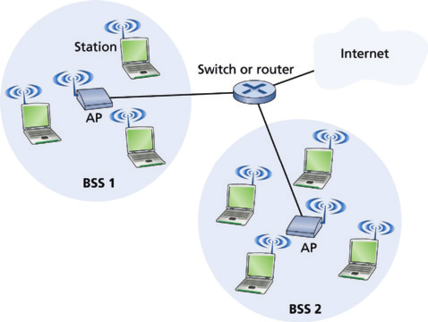

Figure 7.22 Elements

in 802.11 parlance. Figure 7.22 shows the AP in each of two BSSs connecting to an interconnection device (such as a switch or router), which in turn leads to the Internet.

In a typical home network, there is one AP, one layer 2 switch and one layer 3 router (typically all integrated together in one physical “box”) that connects the BSS to the Internet. In our discussion below, we’ll occasionally play a little fast-and-loose with 802.11 parlance and refer to the combination of an AP together with a switch and possibly a router simply as an “AP”. But according to the 802.11 standard, the AP is a layer-2-only device. Network devices can only transmit/receive to/from the AP; direct device-to-device communication cannot happen.

WiFi channel structures Figure 7.23 shows how WiFi divides its use of the 2.4 and 5 GHz spectrum bands into channels, with each channel having a unique channel number. In the

In the 2.4 GHz band, 802.11 defines 11 partially overlapping channels, each with a bandwidth of 20 MHz. Here, two channels are non-overlapping if and only if they are separated by four or more channels. In particular, the set of channels 1, 6, and 11 is the only set of three non-overlapping channels. This means that if three APs all operate in the same physical space using channels 1, 6, and 11, then the transmissions on these three networks will not interfere with each other. However, if two of the networks operate in overlapping channels, then the devices on these two networks can interfere with each other. This can be particularly problematic, of course, when multiple WiFi networks in the physical space are operated independently, e.g., your home WiFi network, and all of the other home WiFi networks in all apartments within 30 meters of your apartment.

Figure 7.23 WiFi channels in the 2.4 and 5 GHz bands

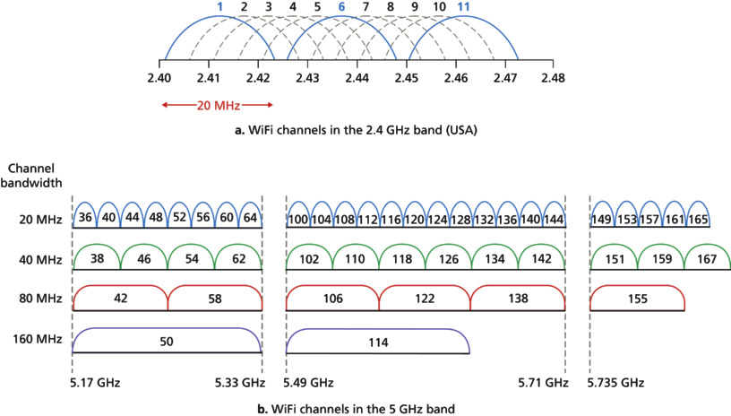

Putting it all together: CSMA/CA, OFDM, and OFDMA in WiFi 6 As noted in Table 7.2, all 802.11 standards from the past 20 years support orthogonal frequency division multiplexing (OFDM), which is used to create the multiple separate WiFi channels in Figure 7.23. A WiFi AP can be configured to operate using just one of these fixed-bandwidth channels, with all devices in the AP’s WLAN communicating with the AP over this single channel. Alternatively, an AP can be assigned a primary channel and then dynamically increase the available bandwidth by bonding one or more adjacent secondary channels with the primary channel. With OFDM, a device or AP uses the full channel bandwidth when transmitting. We’ve also learned that WiFi 6 (and onwards) also supports OFDMA, which is different from pure OFDM and particularly useful in dense deployment scenarios. We learned in Section 7.3.1 that OFDMA divides a channel into multiple subchannels and allows transmission to/from multiple devices simultaneously, with each device using a different set of subchannels and timeslots. And we learned in Section 7.3.1 that WiFi also uses CSMA/CA random access to share the WiFi channel. But how can all three of these channel-sharing approaches—OFDM, OFDMA, and CSMA/CA—be used in the same WiFi network? How is that even possible?

The answer to this question lies in the clever extension of WiFi’s basic RTS/CTS mechanism—initially developed to help solve the hidden terminal problem—to also solve the problem OFDM, OFDMA, and CSMA/CA co-existence.

WiFi 6 introduced a new type of RTS message, known as a multi-user RTS message (MU-RTS). In the downlink direction, the AP sends an MU-RTS when it wants to initiate OFDMA transmissions to multiple devices. The MU-RTS contains a list of OFDMA resource unit (RU) allocations, indicating which RUs the AP will use to send data to which devices simultaneously, and the length of time that the channel will be used. The MU-RTS is transmitted using OFDM to all devices, whether OFDMA capable or not, as part of the CSMA/CA protocol. Thus, all devices will receive the MU-RTS message. An OFDM-only device will respond to the RTS with a CTS as discussed earlier and as shown in Figure 7.20. An OFDMA-capable device responds to the RTS with a CTS that is transmitted in just the frequencies being assigned to that device. As with regular RTS/CTS messages, an RTS message may not be successful. However, if this MU-RTS/CTS exchange is successful, the AP has now reserved the  channel and can then send RUs to the multiple devices using OFDMA. In the uplink direction, transmissions from the devices to the AP are also coordinated by the AP, again using MU-RTS messages; see [Meraki WiFi6 2020] for details.

The interaction of CSMA/CA, OFDM, and OFDMA is illustrated in Figure 7.24. In this example, there are two legacy 802.11g (pre-WiFi 4!) devices, a and b, and five 802.11ax (WiFi 6) devices. In this example, devices a and b gain use of the full OFDM channel following t and t respectively, using the 0 1 CSMA/CA protocol. At t , the AP uses CSMA/CA with the MU-RTS mecha- 2 nism (during the time and at frequencies shown in the shaded gray box beginning at t ) to successfully reserve the channel for simultaneous OFDMA 2 RU transmissions to devices 1, 2, 4, and 5 in the RUs shown. At t , device b again uses CSMA/CA to gain access to the channel and transmits another frame using OFDM. At t , the AP uses the MU-RTS mechanism to successfully 4 reserve the channel for OFDMA RU transmissions to devices 1, 2, and 3 in the RUs shown.

Figure 7.24 Intervals of CSMA/CA, OFDM, and OFDMA

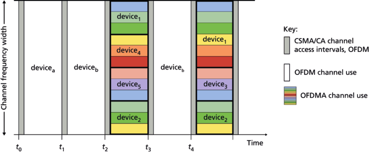

802.11 MAC: the WiFi wireless link layer

Figure 7.25 expands on Figure 7.22, showing the IEEE 802.11 medium access control (MAC) as the wireless link layer in a WiFi network. Note that the MACs in all devices in Figure 7.25 have data-plane and control-plane components. The job of the MAC data plane is to transport link-layer frames to and from end user applications. The job of the MAC control plane is to implement control functions such as RTS/CTS, ACKs and NAKs, beaconing (Section 7.3.4) and power control (Section 7.3.6). Since MAC control plane modules in the device and the AP exchange control messages in link-layer frames, a logical connection with dashed lines is shown between the control modules on both sides of the wireless link. MAC data and control frames are both scheduled for transmission across the wireless medium by the MAC scheduler (Section 7.3.5).

Figure 7.25 WiFi: the wireless link layer

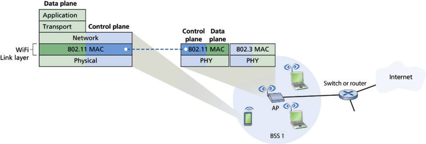

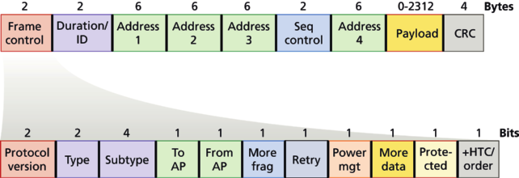

Figure 7.26 802.11 frame format (numbers indicate field length in bytes) and frame control field (numbers indicate subfield length in bits)

Note that the wireless user device in Figure 7.25 implements all five layers of the Internet protocol stack. The AP, however, is a layer-2-only device. On one side of the AP, the AP’s link layer uses WiFi to communicate with the user device; on the other side, the AP’s link layer connects to an Ethernet link layer to communicate with the layer-3 router. In practice, the AP, Ethernet, and layer-3 router functions are often packaged together in the same “box” for small-scale (e.g., residential) deployments, technically making the box a layer-3 device.

The 802.11 frame is shown in Figure 7.26. Although it shares many similarities with an Ethernet frame, it also contains a number of fields that are specific to its use in wireless LANs. The numbers above each of the fields in the frame show the lengths of the fields in bytes; the numbers above each of the subfields in the frame control field give the subfield lengths in bits. In Figure 7.26, not all fields shown are always used, and there are additional optional fields that are not shown. Let’s now examine the fields in the frame as well as some of the more important subfields in the frame control field.

Payload and CRC Fields At the heart of the frame is the payload, which typically consists of an IP datagram, a MAC control frame, or an ARP packet. Although the field is permitted to be as long as 2,312 bytes, it is typically less than 1,500 bytes. As with an Ethernet frame, an 802.11 frame includes a 32-bit cyclic redundancy check (CRC) so that the receiver can detect bit errors in the received frame. As we’ve seen, bit errors are much more common in wireless LANs than in wired LANs, so the CRC is even more useful here.

Address Fields Perhaps the most striking difference between the 802.11 and Ethernet frames is that the 802.11 frame has four address fields, each of which can hold a 6-byte MAC address. But why four address fields? Doesn’t a source MAC field and destination MAC field suffice, as they do for Ethernet? It turns out that three address fields are needed for internetworking purposes—specifically, for moving the network-layer datagram from a wireless station through an AP to a router interface. The fourth address field is used when devices forward frames to each other in ad hoc mode, without an AP. Since we are only considering infrastructure networks here, let’s focus our attention on the first three address fields. The 802.11 standard defines these fields as follows:

• Address 2 is the MAC address of the device that transmits the 802.11 frame. Thus, if a (non-AP) wireless device transmits the frame, its MAC address is inserted in the Address 2 field. Similarly, if an AP transmits the frame, the AP’s MAC address is inserted in the Address 2 field.

• Address 1 is the MAC address of the wireless device that is to receive the frame. Thus, if a (non-AP) wireless device transmits the frame, Address 1 contains the MAC address of the destination AP. Similarly, if an AP transmits the frame, Address 1 contains the MAC address of the destination wireless device.

• To understand Address 3, recall that the BSS (consisting of the AP and wireless devices) is part of a subnet, and that this subnet connects to other subnets via some router interface. Address 3 contains the MAC address of this router interface.

To gain further insight into the purpose of Address 3, let’s walk through the example in Figure 7.27. In this figure, there are two APs, each of which is responsible for a number of wireless devices. Each of the APs has an Ethernet connection to a router, which in turn connects to the global Internet. We should keep in mind that an AP is a link-layer device, and thus neither “speaks” IP nor understands IP addresses. Consider now moving a datagram from the router interface R1 to the wireless device H1. The router is not aware that there is an AP between it and H1; from the router’s perspective, H1 is just a device in one of the subnets to which it (the router) is connected.

• The router, which knows the IP address of H1 (from the destination address of the datagram), uses ARP to determine the MAC address of H1, just as in an ordinary Ethernet LAN.

After obtaining H1’s MAC address, the router interface R1 encapsulates the datagram within an Ethernet frame. The source address field of this frame contains R1’s MAC address, and the destination address field contains H1’s MAC address.

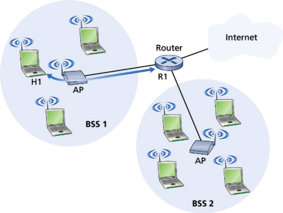

Figure 7.27 Use of address fields in 802.11 frames: sending frames between H1 and R1

• When the Ethernet frame arrives at the AP, the AP converts the 802.3 Ethernet frame to an 802.11 frame before transmitting the frame into the wireless channel. The AP fills in Addresses 1 and 2 with H1’s MAC address and its own MAC address, respectively, as described above. For Address 3, the AP inserts the MAC address of R1. In this manner, H1 can determine (from Address 3) the MAC address of the router interface that sent the datagram into the subnet.

Now consider what happens when the wireless device H1 responds by transmitting a datagram from H1 to R1.

• H1 creates an 802.11 frame, filling the fields for Addresses 1 and 2 with the AP’s MAC address and H1’s MAC address, respectively, as described above. For Address 3, H1 inserts R1’s MAC address.

• When the AP receives the 802.11 frame, it converts the frame to an Ethernet frame. The source address field for this frame is H1’s MAC address, and the destination address field is R1’s MAC address. Thus, Address 3 allows the AP to determine the appropriate destination MAC address when constructing the Ethernet frame.

In summary, Address 3 plays a crucial role for internetworking the BSS with a wired LAN.

Sequence Number, Duration, and Frame Control Fields Recall that in 802.11, whenever a station correctly receives a frame from another station, it sends back an acknowledgment. Because acknowledgments can get lost, the sending station may send multiple copies of a given frame. As we saw in our discussion of the rdt2.1 protocol (Section 3.4.1), sequence numbers allow the receiver to distinguish between a newly transmitted frame and the retransmission of a previous frame. The sequence number field in the

The 802.11 frame serves exactly the same purpose here at the link layer as it did in the transport layer in Chapter 3.

Recall that the 802.11 protocol allows a transmitting station to reserve the channel for a period of time that includes the time to transmit its data frame and the time to transmit an acknowledgment. This amount of time (in microseconds) is included in the frame’s duration field, both for data frames and for the RTS and CTS frames.

As shown in Figure 7.26, the frame control field includes many subfields.

We’ll say just a few words about some of the more important subfields; for a more complete discussion, see [Wikipedia 802.11_frame_types 2024]. The type and subtype fields are used to identify 802.11 control and data frames. Among the control messages are the RTS, CTS, and ACK messages that we encountered in Figure 7.21. Several types of control frames are used when a device joins a network, as discussed in Section 7.3.4. The power management bit is used (as the name would suggest) when a device sleeps to preserve battery power, as discussed in Section 7.3.6.

##### 7.3.3 The 5G Radio Access Network

In this subsection, we’ll cover key aspects of the Radio Access Network (RAN) in 4G and 5G cellular networks. We’ll rely heavily on the foundational material from the earlier sections of this chapter on wireless channels and OFDMA in particular. We’ll focus here primarily on 5G, but will address 4G LTE cellular networks where appropriate.

Architectural components of 5G networks:

the big picture Before diving into the 5G RAN itself, let’s situate the RAN in the context of the larger 5G cellular network. As shown in Figure 7.28, a 5G (and 3G and 4G) cellular network has two principal components—the edge and the core.

• Radio Access Network (RAN). The RAN is at the edge of the 5G network.

A RAN consists of (i) the end-user wireless devices (referred to as user equipment (UE) in cellular parlance) that are attached over (ii) the local 5G wireless radio channel known as New Radio (NR), presumably to distinguish it from the “old” 4G radio channel to (iii) a base station, known as a Next Generation Node (gNB).

As discussed in Section 7.1, since the UE, NR, gNB nomenclature is opaque and non-intuitive, we’ll use the more intuitive and descriptive nomenclature here of “base station” rather than “gNB”, “user device” rather than “UE”, and “wireless channel” or “radio channel” rather than “NR.” The RAN is the cellular equivalent of a WiFi wireless LAN—it contains the first-hop wireless link between the user and the larger network, the wireless user devices, and a 5G base station that is similar to, but considerably more multi-functional, complex and sophisticated than, a WiFi access point (AP) in a wireless LAN.

• The 5G Core. The 5G Core consists of the links, routers, servers, and Core Network Functions that lie between a RAN and a gateway from the cellular provider’s network into the larger Internet, including other cellular provider networks. A typical cellular network will have a single core, with multiple attached edge networks The links and routers in the cellular core are typically wired, use the same Internet protocols and technology that we studied in Chapters 4, 5, and 6. The distinction between the networklayer data and control planes that we made earlier in Chapters 4 and 5, respectively, is also very much present in 5G, except that the data plane is known as the user plane in 5G terminology. Indeed, the logical separation of control and user planes is so foundational in 5G architecture that (of course!) it even has its own acronym in the 5G standards: CUPS, which stands for Control Plane and User Plane Separation!

• What is unique in the 5G Core is the set of control and management functions, known as 5G  Core Network Functions, that provide 5G services such as RAN access and authorization, and support for user-device mobility. We’ll study these services, shown in blue boxes in Figure 7.28, data center (often referred to as an edge-cloud) in the Core but near the RAN, or may be implemented in a large, physically-distant data center. The only absolute requirement is that these services be reachable via IP.User application code may also run on servers at the base station or in the 5G Core, communicating with wireless devices in the RAN to implement an application’s service.

This is referred to as local breakout, as the user’s application client-server traffic never leaves the cellular network. 4G, 5G RAN: the physical radio channel 4G and 5G RANs implement OFDMA channel sharing, which we studied in where the transmission time for a single symbol in a single minislot is 66 sec µ . In 5G networks, larger subchannel bandwidths (30, 60, 120, 240, 480, and 960 kHz) with proportionally shorter minislot lengths are also defined. Recall from Section 7.3.1 that a resource element (RE) is a single time min- islot on a single OFDMA subcarrier frequency. Both 4G and 5G networks bundle neighboring REs (in frequency and time) into a Resource Block (RB).

Figure 7.28 Major elements of a 5G network in Section 7.4. The locations where these Core services are implemented will differ from one 5G network to another. For example, the servers implementing Core services might be co-located at the base station in the case of a small private 5G network, or might be implemented in a physically separate small Section 7.3.1. In 4G networks, the smallest subchannel bandwidth is 15 kHz,

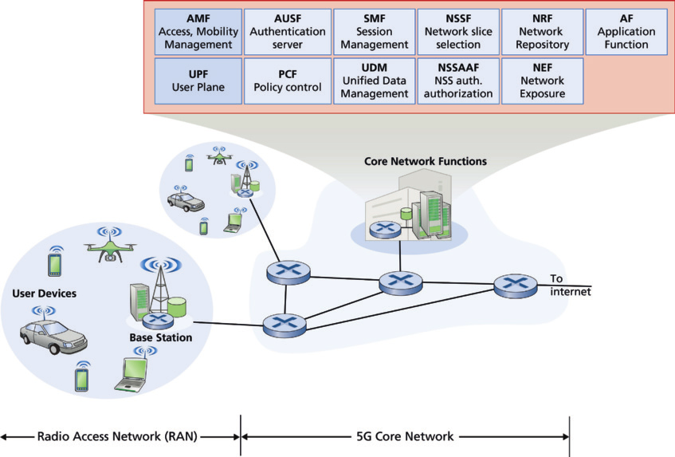

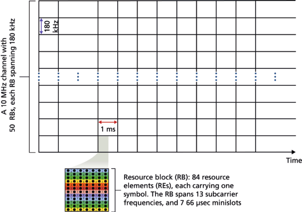

Figure 7.29 4G Resource Blocks

A resource block is the smallest unit of channel resource that is used by a transmitting device or base station in 4G and 5G networks. In 4G networks, an RB bundles together 84 symbols (on 12 neighboring subcarriers, and in 7 consecutive time minislots), as shown in Figure 7.29. This is the only bundling of REs into an RB in 4G networks. In 5G networks, there are a number of different ways to bundle REs into an RB.

Figure 7.29 also illustrates the relationship between a channel and an RB, showing a 10 MHz wide channel that consists of 50 time-parallel RBs, each using one of the 50 different frequency subchannels. Standard channel bandwidths for 4G networks are 1.4, 3, 5, 10, 15, and 20 MHz. 5G incorporates all of the earlier 4G channel definitions and additionally defines channels up to 100 MHz wide.

There is even one last higher level of bandwidth aggregation in 4G 5G networks! A band is an aggregation of one or more channels, with each channel consisting of a number of different subcarriers(subchannels), as shown in Figure 7.30.Various 5G bands are defined by the 3GPP [3GPP TS 38.101-1 2024]. Recall from Section 7.2.1, that the allocation of licensed spectrum within these bands to cellular network providers is made by national governments, typically via auctions. The amount of spectrum made available nationally to carriers in these bands varies from country to country. Once a network operator has been allocated a frequency band, it’s up to that operator to decide how to divide the band into channels, and the channels into subcarriers.

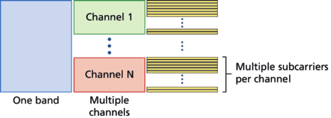

Figure 7.30 Bands, channels, and subcarriers

4G, 5G RAN Radio: physical and logical control and data channels Our discussion above has focused on the physical radio channel resources— the radio frequencies, time minislots, and RB structure. Each RB also has a direction. The downlink direction is from the base station to the user device.

The uplink direction is from the user device to the base station. As we saw in wired (e.g., cable) edge networks in Chapter 6, there is typically significantly more downstream traffic than uplink traffic, with a ratio of approximately 10:1 [Sauter 2021; Mitra 2024] between downlink and uplink traffic in 4G 5G networks. Each network operator can set the ratio of downlink to uplink channel resources by determining the fraction of OFDMA time slots assigned in each direction, a process known as Time Division Duplexing (TDD). It is also possible to group resources by frequency, with a range of channel frequencies assigned exclusively for uplink or downlink transmission—a process known the Frequency Division Duplexing (FDD).

Given the frequency and time slot assignments for the uplink and downlink RBs in the RAN, RBs are then partitioned into three groups in the downlink direction and three groups in the uplink direction. These groups are known as downlink physical channels and uplink physical channels. The RBs in each physical channel are used for the same purpose. Three of these channels are in the downlink direction:

• Physical Downlink Shared Channel (PDSCH). This channel carries all downstream user-plane data, as well as control plane messages from the base station to the user device for all user devices.

• Physical Downlink Control Channel (PDCCH). This channel is used to inform user devices about the RBs in which they will be receiving data in the downlink direction and which they can use to transmit data in the uplink direction.

• Physical Broadcast Channel (PBCH). This channel carries information broadcast by the base station that is needed for a user device to discover and then join the cellular network, as discussed in Section 7.3.4.

and three of these channels are in the uplink direction:

• Physical Uplink Shared Channel (PUSCH). This channel is the upstream equivalent of the PDSCH. It carries all upstream user-plane data, as well as control plane messages from user devices to the base station.

• Physical Random-Access Channel (PRACH). This channel is used by user devices to request a connection to the base station, when a device first joins the network. As the name would suggest, devices access this channel using a random-access scheme.

• Physical Uplink Control Channel (PUCCH). A device uses this channel to request that the base station allocate it RBs in the PUSCH that it can use in the future to transmit data to the base station. The PUCCH also carries measurement data, and link-layer ACK/NAKs used for reliable data transfer.

There are also multiple logical channels defined in the uplink and downlink directions, which are then mapped onto the physical uplink and downlink channels. All information flowing on the same logical channel is semantically related. See [Sauter 2021; electronicsnotes 2024] for details. Given these definitions of 5G logical and physical uplink and downlink channels, the notion of frequency bands and channels in Figure 7.30, and our discussion of the characteristics of radio channels in Section 7.2, it’s clear that the word “channel” takes on very different meanings in different contexts and is one of the most used (or perhaps overused) words in wireless networking!

5G RAN: the wireless link layer Having earlier studied the WiFi link-layer protocol stack, let’s now take a look at the link-layer protocol stack in the 5G RAN.

Figure 7.31 shows the 5G RAN protocol stack, with an expanded view of the various sublayers in the 5G link layer. Note that as in the case of WiFi, the link layers in both the device and the base station have a user plane and a control plane. The job of the user plane is to move link-layer frames from the device’s applications to the base station and vice versa. The job of the control plane is to control and configure the RAN’s radio resources, provide control functions for user-plane frame transfer (e.g., ARQ and quality of service) and additional services such as device mobility (Section 7.4.2), attachment to the network (Section 7.3.4), and power control (Section 7.3.6). Since link-layer control plane actions usually involve message exchange between control functions in the device and the base station, a logical connection with dashed lines is shown between control modules in the sublayers on both sides of the wireless link in Figure 7.31. Control messages sent between the base station and user device are carried in link-layer frames over one of the appropriate 5G physical control channels.

Figure 7.31 shows that the 5G RAN link layer is divided into a number of sublayers:

• The Radio Resource Control (RRC) is the control-plane function responsible for (i) establishing, maintaining and releasing link-layer logical  channels, (ii) managing the per-device link-layer connection state ( Sections 7.3.4 and 7.3.6), (iii) managing aspects of device mobility (Section 7.4), and

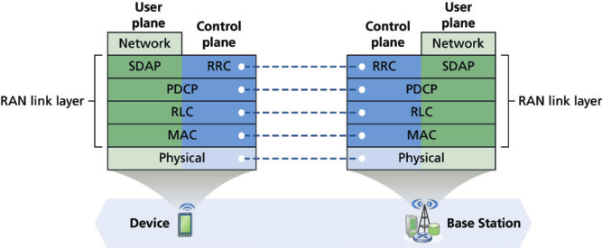

Figure 7.31 5G RAN protocol stacks at the user device and base station

(iv) performing channel quality measurement and reporting ( Section 7.3.5).

The RRC accomplishes its work by configuring local link- and physical-layer state, using the RRC protocol [3GPP TS 38.331 2024] to send control messages between the base station and a user device.

• The Service Data Adaptation Protocol (SDAP) is the highest sublayer in the link-layer user plane. When Quality of Service guarantees are to be provided to packet flows, SDAP assigns QoS Flow IDs and maps the flows onto underlying radio resources.

• The  Packet Data Convergence Protocol (PDCP) is responsible for IP header compression and (optionally) encryption and cryptographic message integrity checks.

• The Radio Link Control (RLC) is responsible for segmentation/reassembly and reliable frame transfer using a simple ARQ (Automatic Repeat Request) protocol with sequence numbers, cyclic redundancy checks, and ACK/NACK messages, as we studied in Chapter 3.

• The Medium Access Control (MAC) sublayer is responsible for scheduling the transmission of link-layer user- and control-plane frames between the base station and user devices.

As we learned earlier in this section, the data in these frames is segmented into smaller chunks that are then mapped onto OFDMA Resource Blocks for transmission. We’ll cover MAC scheduling in Section 7.3.5.

While the WiFi link-layer frame in Figure 7.26 is relatively simple, the 5G RAN frame is considerably more complex, due in great part to the multiple link sublayers. A 5G link-layer frame includes an IP datagram or an RRC control-plane message with added SDAP, PDCP, RLC, and MAC header fields.

Each sublayer adds its own header fields, typically including a user/control message bit, a sequence number or identifier, a payload field, and other fields needed to accomplish the sublayers functions. Rather than laboriously detail these fields, we’ll instead simply refer the interested reader to Section 6 in each of the 3GPP link—sublayer protocol documents [3GPP RRC TS 38.331 2024;

3GPP SDAP TS 38.300 2024; 3GPP PDCP TS 38.323 2024; 3GPP RLC TS 38.322 2024; 3GPP MAC TS 38.321 2024].

Figure 7.32 shows a view of the 5G base station’s link-layer control and packet-processing pipeline, once again emphasizing control- and user-plane separation. We also note the central, controlling role of the RRC.

In earlier 2G, 3G, and 4G networks, a RAN cellular base station was implemented as a monolithic unit—essentially a specialized, single vendor “box” implementing that generation’s standardized functions. Beginning with 5G, there has been a move to “disaggregate” RAN functions into multiple functional units that interoperate with each other through standardized interfaces. This disaggregated architecture allows multiple vendors to offer competing implementations of pieces of the 5G base station, lowering the barrier to entry, and increasing competition and innovation—similar to a key motivation we found behind the development of SDN in Chapter 5.

Figure 7.33 shows the functional split of a 5G base station into a Radio Unit (RU), a Distributed Unit (DU), and a Central Unit (CU), as well as the and real-time communication requirements. While the RU, DU, and CU are part of the 3GPP 5G specification [3GPP TS 38.300; 3GPP TS 38.401], the O-RAN Alliance takes this disaggregation one step further by specifying interfaces among these units [O-RAN Architecture 2024; Polese 2023]. Implementing the 5G RAN control plane The disaggregation of the 5G base station into RU, DU, and CU functional units is but one of two disaggregations in 5G. A second form of disaggregation arises in the 5G control plane. In particular, since the RRC control plane is Figure 7.33 Disaggregation: functional split of a 5G base station into three “units”

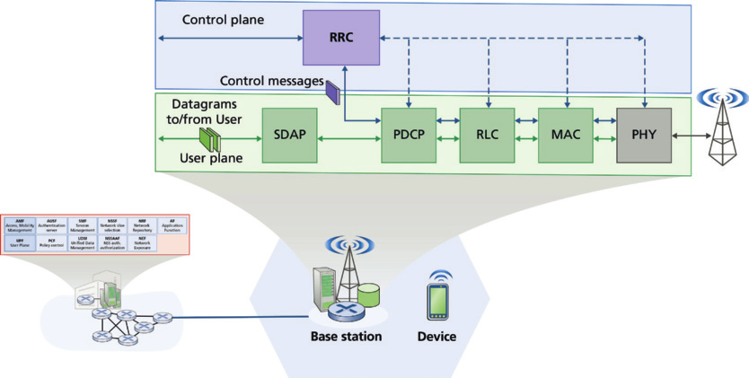

Figure 7.32 5G base station RAN control and packet-processing pipeline RAN functions performed within each unit. Where such functional units are situated in the RAN—in the base station, in an edge cloud, or in a central cloud—is an implementation decision, often driven by communication delays

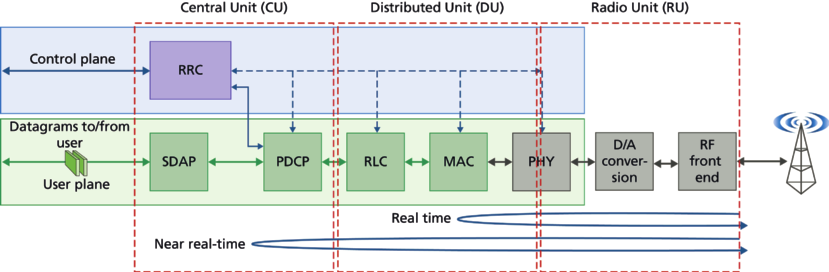

Figure 7.34 SD-RAN: a software-defined RAN control plane separate from the user plane (in much the same way that the Internet control plane and data plane are separate), it’s possible to implement the standardized

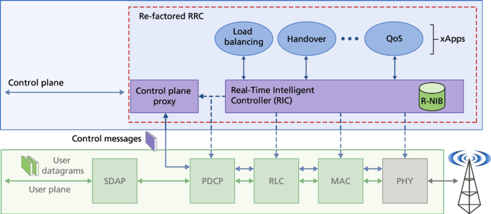

RRC functions in a modern SDN-like manner. Figure 7.34 shows an SDN-like implementation of the RAN control plane. It’s instructive to compare the monolithic RRC implementation suggested in Figure 7.33 with the SDN RRC implementation of Figure 7.34. In particular, as long as the re-factored implementation in Figure 7.34 implements all of the functional interfaces to the mobile core and to the user plane as in Figure 7.33, one implementation is indistinguishable from the other as far as the other components of the 5G network are concerned. An SD-RAN controller will typically have the following main components shown in Figure 7.34: • A control-plane proxy that implements a 3GPP-compliant interface between the RAN and 5G Core’s control plane. Specifically, the RAN’s control plane proxy must implement the well-defined service-based interface to each of the Core Network Functions shown in Figure 7.28 and discussed later in Section 7.4. • A real-time intelligent controller (RIC) that serves a similar function here as the SDN controller in Figure 5.14. The RIC itself has three major components: • A lower layer communication layer that communicates commands to the data-plane RAN components. • A RAN-wide state-management layer. The RIC’s control decisions will require up-to-date information about channel state, connection state and identity information for each user device, for the QoS requirements, and for much more. This information is stored in the local RAN Node Information Base (R-NIB). • An interface to a set of application-layer control processes.

• The RIC control processes that make RAN control decisions regarding load balancing, device handover, QoS provisioning, and more. These processes, known as xApps in the OpenRAN parlance, can access information in the R-NIB and are implemented as separate software processes executing outside of the RIC itself, as shown in Figure 7.34. A set of opensource xApps can be found at [O-RAN xApp 2024]. OpenRAN [O-RAN Architecture 2024] is one of the most prominent examples of an SD-RAN.

OpenRAN is open in the sense that there are well-defined, standardized interfaces between the different components of the SD-RAN, allowing multi-vendor implementations of different components of the SD-RAN to interoperate.

For a thoughtful discussion of the softwareization of the 5G RAN, see [Peterson 2024].

##### 7.3.4 Discovery: Attaching to a Wireless Network

Having discussed both cellular RANs and WiFi LANs in detail, let’s now turn our attention to a capability needed in any edge network, regardless of whether it is a wired Ethernet LAN, a 5G RAN, or WiFi WLAN—the ability for a device to detect the existence of network infrastructure and to “attach” to that network. This process is known as network association.

Beaconing A base station, whether in a 5G network or a WiFi network, will periodically transmit beacon messages, that announce the existence of the access network and information about its characteristics such as its name, its transmission capabilities (e.g., transmission rates), and physical-layer parameters about its radio channels. A device wishing to attach to a network will passively scan the various possible wireless channels, looking for such beacon messages.

Wireless network standards don’t specify the algorithm a device uses to select which of the advertised networks to associate with—that choice is left up to you (the device or user) or the designers of the firmware and software in your wireless device. Typically, a device may choose to associate with the network with which it was most recently associated, may choose from an ordered list, or may choose to join the network whose signal strength is best.

In public 5G networks, a device will almost always preferably associate with a 5G network operated by the provider that issued the device’s SIM card, and with which the device has a paid service plan.

Attaching to a WiFi network After scanning for available networks and selecting the AP with which to associate, a WiFi device sends an 802.11 association request frame to the AP. The AP responds with an association response frame, as shown in Figure 7.35. As discussed in Section 8.8, but not shown in Figure 7.35, a device will authenticate itself to the network using WPA (WiFi Protected Access) security after receiving a beacon, and either before or after association.

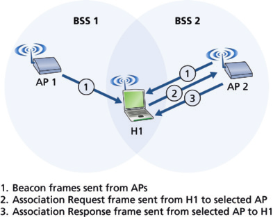

Figure 7.35 Associating with a WiFi network

Once associated with a WiFi AP, the device will want to join the subnet (in the IP addressing sense of Section 4.3.3) to which the AP belongs. The device will thus typically send a DHCP discovery message (see Figure 4.21) into the subnet via the AP in order to obtain an IP address on the subnet. Once the address is obtained, the rest of the world then views that device simply as another device with an IP address in that subnet.

Attaching to a 5G network The process by which a device attaches to a 5G network to get its own collision-free control and data channels is a bit more complicated than attaching to a WiFi network. In particular, rather than looking for just a single beacon message that contains all of the information needed to join an access network, a 5G device goes through a multistep process to obtain the needed information.

Figure 7.36 illustrates the process:

1.Each base station broadcasts multiple pieces of information needed by a device to decide whether or not to join a network.A network’s primary synchronization signal (PSS) is first located by a device and used to synchronize its clock with that of the base station. The secondary synchronization signal (SSS), which provides an initial network identifier, is then located. The PSS and SSS are broadcast every 5 msec on the center 127 subcarriers of every 5G channel by every 5G base station. Next, the device obtains the Master Information Block (MIB) for that channel, which includes information about subcarrier spacing, and whether or not the cell is even open for association. The PSS, SSS, and MIB together form the System Signal Block (SSB).

With this information, the device can then locate and receive up to 20 System Information Blocks (SIBs) that characterize the 5G network and its operation. The most important of these is SIB1, which is transmitted every 80 ms and contains:

•  The mobile country code (MCC) and mobile network code (MNC) for the carrier operating this channel, •  the minimum reception level (channel quality) acceptable.

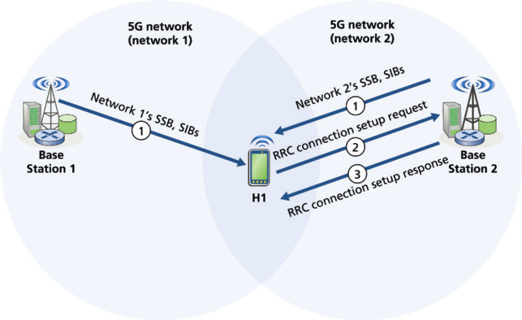

Figure 7.36 Associating with a 5G network

•  the base station identifier, and

2.  Now suppose that the device decides that it wants to associate with this 5G network. However, the base station is not yet even aware of the device’s existence, and the device has yet to be allocated any uplink RBs that can be used to communicate with the base station. Thus, the device uses the cell’s upstream random-access channel to send a Radio Resource Control (RRC) connection setup request (similar in spirit to the 802.11 association request frame) to the base station.

3.  In step 3, the base station responds to the device’s connection setup request message with an RRC connection setup response message (similar in spirit to the 802.11 association response frame).

At this point, the user device and base station are able to exchange control messages with each other in the RAN. But the device still has not yet joined the 5G network (!) as it hasn’t yet identified or authenticated itself to the network, nor does it have an IP address. We’ll see how the device completes the process of joining a 5G network when we cover the 5G Core (Section 7.4) and authentication (Section 8.8).

##### 7.3.5 Scheduling Transmissions Over the RAN/WLAN

One of the most important functions of the MAC layer is to schedule the order in which data is transmitted in the downlink direction from a base station to user devices, and on the uplink reverse direction. This is the role of the MAC scheduler, which is particularly important in dense deployment scenarios (i.e., in 4 5G networks and WiFi 6 7 OFDMA deployments), where there may be tens or hundreds of users with data to transmit at a given time. Thus, we’ll focus here on the scenario in which there is a central MAC scheduler at the base station.

Distributed scheduling of transmissions is also a topic of interest in pure random-access environments (see, e.g., [Liang 2010]), but will not be covered here.

Recall that we previously studied link-layer scheduling in a wired setting in Section 4.2.5.We saw there that the overall performance at the link layer (e.g., measured in throughput and aggregated over all traffic flowing across the link) was essentially independent of the order in which frames were transmitted, since a fixed number of frames were transmitted per second regardless of the specific selection of frames to be transmitted.

In a wireless setting, however, this is decidedly not the case! As we learned in Section 7.2, a base station is able to transmit at higher rates (by using a higher-bitrate modulation scheme) to a device that is physically close and has clear line-of-sight, than to a device that is far away and suffers from multipath effects. Thus, WLAN and RAN throughput depends on which devices are scheduled as transmitters and receivers. MIMO spatial multiplexing and spatial diversity offer additional degrees of freedom to transmit single or multiple streams to a given receiver.

Beamforming offers yet a different opportunity—to send to different sets of receivers simultaneously. And, of course, channel characteristics are constantly changing over time. Consequently, overall aggregate wireless link-layer performance will very much depend on MAC scheduling choices!

Since neither the 3GPP nor the WiFi standards mandate (or even describe) MAC scheduling algorithms, the choice of scheduling algorithms is completely in the hands of the network operator. Scheduling is thus part of the “secret sauce” that can distinguish one network provider from another. Indeed, many wireless hardware/software vendors and wireless network providers tout that their sophisticated approach to MAC scheduling sets them apart from their competition.

There are four key considerations in MAC scheduling:

• Channel quality awareness. Does the scheduler consider estimates/measurements of the quality of the radio channel between the base station and device when making a scheduling decision? Since a device with highquality radio channel between itself and a base station can send/receive data at higher rates, a network can achieve a higher aggregate throughput by preferentially sending to devices with high quality radio channels to/ from the base station.

• Fairness among devices. Does the scheduler provide a degree of fairness (e.g., approximately equal throughput) among devices? If so, what is meant by “fairness”? For example, a scheduling policy that transmits only to devices with the highest quality channel may achieve high throughput but does not provide throughput fairness among devices. If fairness is to be provided, the “price” to be paid may be some reduction in aggregate throughput (with respect to the maximum throughput achievable in the absence of fairness considerations).

• Prioritization among classes of traffic. Does the scheduler distinguish between control-plane traffic versus user-plane traffic, e.g., by prioritizing the former over the latter, or by providing for a fixed minimum amount of channel resources for one or both of these classes? Does the scheduler distinguish between traffic with real-time constraints (such as control applications, and interactive voice and video) and non-real-time traffic (e.g., web browsing). Our earlier discussion of priority scheduling in Section 4.2.5 is applicable here.

• Quality of Service (QoS) awareness. Does the scheduler make scheduling decisions so that quality-of-service (performance) guarantees are provided to devices in the network?

Thousands of research papers have been written, and nearly as many MAC scheduling algorithms have been proposed, over the years. Here, we’ll describe just a few representative algorithms, adopting notation from [Capozzi 2012]. Surveys of MAC scheduling algorithms can be found in [Capozzi 2012;

Haque 2023].

Figure 7.37 illustrates four different MAC scheduling algorithms, showing the data (i.e., link-layer frames) queued at the base station for transmission to six downstream devices. We’ll focus here on scheduling the downstream transmissions from the base station to its associated devices. Our discussion, however, is applicable to the upstream channel as well, since the base station also schedules the upstream channel and informs devices of the upstream channel resources that the devices can use, and when. With an OFDMA downstream channel, the scheduler’s decision determines which device’s queued frames will be transmitted in which resource blocks (RBs) between the current scheduling instant and the next. In 4G 5G systems, scheduling decisions are made every 1 ms. In WiFi 6, the time between scheduling decisions can be even shorter [Qualcomm 2021].

Round Robin (RR) Scheduling Recall our discussion of RR scheduling in a wired setting in Section 4.2.5. In a wireless setting, RR allocates an equal number of RBs to each device for the

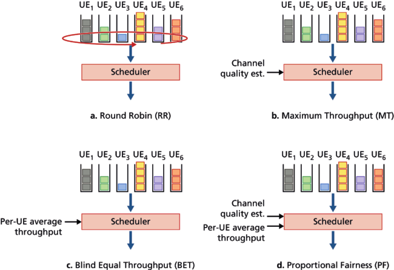

Figure 7.37 Four MAC scheduling algorithms, measurements used next transmission round. RR is channel-unaware and QoS-unaware. RR is fair by turns, since each device is allocated an equal number of RBs, but not necessarily throughput-fair since different devices may experience different channel conditions, and thus realize different throughputs.

Maximum Throughput (MT) scheduling In MT scheduling, shown in Figure 7.37(b), the base station assigns RBs to the user devices that have the highest measured channel quality for that RB and that have data to send. Channel quality can be determined in many different ways. In 5G networks, a base station periodically broadcasts reference signal symbols in known positions in resource blocks. A device periodically sends a 4-bit Channel Quality Indication (CQI) based on its measured reception of these reference signals.

In MT scheduling, at each scheduling instant, t, the base station

computes:

d t : the expected throughput for device i using kth RB at time t. d t i  k k is computed using device-reported CQIs from each device, i, which in turn

will determine the modulation technique to be used (see, e.g., Table 5.2.2.1 in [3GPP 38.214 2024]), which in turn will determine the number of bits per transmitted symbol in resource block k.

The MT scheduler then finds the device, i, with highest reported quality channel over all RBs, k:

max d i t , { }  i k , k

and assigns RB to device i. The process repeats until all RBs have been assigned. k Note that MT scheduling is channel-aware, but unfair. Indeed, in the most unfair case, the single device with the highest channel quality among all devices may be assigned all of the available RBs, if there is enough data to send to the device!

Blind Equal Throughput (BET) The BET scheduling algorithm, shown in Figure 7.37(c), explicitly aims to be fair by providing equal average throughput to all user devices. In BET, the scheduler maintains an estimate of a device’s average throughput. Let r t be i

the measured throughput achieved by device i during time period t. An expo-

nentially weighted moving average (EWMA) of device i’s throughput at time t,

R t , is then: i 

R t i = 1 − β i r t i + β i R t i − 1 ,  

β < β < where the parameter  0 1 determines the relative importance of 

more recent values of R i  in computing the average throughput; a higher

value of b gives higher importance to recent values. You might recall that we encountered this EWMA formula when we learned about how TCP estimates round-trip times in Section 3.5.3. BET simply assigns an RB to the device with the smallest throughput that has queued data awaiting transmission in the base station. The process repeats until all RBs have been assigned. BET scheduling is explicitly throughput-fair, QoS-unaware, and arguably somewhat channel-aware, in that it uses the realized per-device throughput (which depends on the channel quality).

Proportional Fairness (PF) scheduling PF scheduling seeks to strike a balance between maximizing performance (throughput) and providing fairness among devices. Let d t and R t be i i  k defined as above. At each scheduling time, t, the PF scheduler finds the device

i and resource block, k, that achieves

− max { d i t R t i 1 }  i k , k

and then assigns RB k to device i. The intuition behind PF is clear—since d i t  k is in the numerator in the expression to be maximized, higher values of throughput will raise the value of the expression being maximized. Similarly, − since R t i 1 is in the denominator, a user device with a low average 

throughput will also raise the value of the expression being maximized, favoring devices that have experienced low throughput. The process repeats until all RBs have been assigned. Note that PF scheduling is channel-aware and aims to provide a measure of fairness.

Our discussion above has just begun to scratch the surface of WLAN and RAN scheduling. Additional scheduling disciplines, the provision of qualityof-service guarantees through the hard or soft reservation of resources [Prasad 2023], priority scheduling, scheduling for real-time traffic, and virtualized scheduling [Peterson 2024] are all additionally important topics in this area.

##### 7.3.6 Energy Considerations: Wake/Sleep

Energy is a precious resource in wireless mobile devices, and thus many wireless networks provide explicit power-management capabilities that allow devices to minimize the amount of time that their sense, transmit, and receive functions and other circuitry need to be “on.” To accomplish this, a device will typically alternate between sleep and wake states (not unlike a sleepy student in a classroom!)—waking when there is work to do and sleeping when there is no work to be done. Measurements have shown that an LTE radio can consume between 1,000 and 3, 500 mW of energy while transmitting or receiving (or waiting to receive), but less than 15 mW when powered off—approximately one percent of on-state energy use [Huang 2012]. Measurements have also shown that between 20% to more than 50% of energy use in 4G and 5G devices running popular applications is expended on communication [Xu 2020]. Thus, communication-related energy use plays a central role in overall mobile device energy management.

We can identify two main approaches towards energy management via radio sleep/wake cycles:

• In coordinated sleep/wake approaches, a protocol between the device and the base station serves to coordinate the device’s sleep/wake cycles, with both sides being aware of the device’s sleep/wake state, and the time at which the device is scheduled to awaken next. With this knowledge, the base station can queue arriving datagrams that are destined for the sleeping device, and then transmit these datagrams to the device when it awakens. Both WiFi and 5G networks adopt a coordinated sleep/wake approach.

• In uncoordinated, wake-and-send approaches, a device awakes only when it has data to send. This might happen for example in an IoT device, where an occasional sensor reading is to be transmitted to a logging server via a base station. After waking and transmitting, the device may then wait for messages transmitted to it by the base station in reply, and then return to sleep until the next sensor reading needs to be transmitted. Bluetooth (Section 7.5.1), LoRaWAN (see Section 7.5.3), and 4G LTE Narrowband IoT (NB-IoT) networks adopt an uncoordinated, wake-and-send approach.

Coordinated sleep/wake in IEEE 802.11 networks

802.11 networks have featured power-management capabilities since their inception. A WiFi device indicates to the access point that it will be going to sleep by setting the power-management bit in the header of an 802.11 frame (see Figure 7.26) to 1. Since the AP knows from the set power-transmission bit that the device is going to sleep, the AP will buffer any arriving frames that are destined for the sleeping device until that device awakens.

When the WiFi device wakes up, it will scan for a beacon frame from the AP that contains a Traffic Indication Map (TIM), indicating those devices that have frames that are buffered at the AP and awaiting transmission to that sleeping device. If there are no buffered frames for the device, it can go back to sleep. Otherwise, the device will send polling request messages to the AP, to ask the AP to transmit the buffered frames.

A number of more recent power-management capabilities have also been added to 802.11.WiFi 6 introduced a Target Wake Time (TWT) that allows a device to negotiate the length of its sleep period with the AP. This is valuable in IoT settings where devices may only occasionally report sensor values. The maximum TWT value is 4 years, 5 months, 16 days, 13 hours, 37 minutes, and

39.49 seconds—a very long sleep! The IEEE 802.11ah standard, designed specifically for IoT applications (see Section 7.5.3), inherited IEEE 802.11’s power-saving capabilities and added other enhancements, such as reduced header sizes, to save additional energy. A thorough and readable overview of WiFi’s modern energy-saving mechanisms is [Guerin 2023].

Coordinated sleep/wake in 5G networks As in the case of WiFi, when a user device has nothing to send or receive, there is no reason for its radio to be continuously “on.” Thus, user devices in 5G networks, like their WiFi counterparts, can also go through sleep/wake cycles.

There are two different forms of 5G device sleep/wake cycles, roughly corresponding to a light sleep (perhaps akin to a short “nap”), and a deeper sleep.

Figure 7.38 shows the structure of the light sleep cycle, known as Discontinuous Reception (DRX) in the Connected State. Here, there are two phases ated with powering up the radio, checking for pending downlink transmissions, and powering down the radio. In the example in Figure 7.38, a user device receives a transmission from the base station at t and starts an activity timer. At t , with the device having 0 1 neither received any transmissions since t nor having any transmissions to 0 send, the activity timer expires, and the device enters a short DRX sleep cycle. At the end of each short DRX cycle, the device awakens and checks whether the base station is advertising pending transmissions to it, or whether it has transmissions of its own to send. In this example, since there is no activity for this device over several short sleep cycles, the device then enters a long DRX sleep cycle at t . The device again wakes up at the end of each longer sleep 2 cycle to check for incoming or outgoing transmissions. At t , a packet arrives at 3 the base station for transmission to this device and is buffered, since the device is sleeping. At the end of the long sleep cycle ending at t , the device awakens, 4 finds that the base station is advertising a transmission for the device, enters the active state, eventually receives a transmission from the base station at t , 5 and restarts its inactivity timer. In this example, the increase in latency experienced by the arriving packet due to device sleep is equal to t –t . 5 3 There are additional user device sleep states that are even longer and deeper than the DRX cycles shown in Figure 7.38. After even longer periods of inactivity, a device can enter the Idle state or Inactive state, where it must take additional steps to re-establish its active presence in the RAN before it can send or receive user data. See [Hailu 2019; Developedia 2021; Sauter 2021] for more details. Uncoordinated, wake-and-send in LoRaWAN LoRa (see Section 7.5.3) [Sematech 2019a, 2019b; Sinha 2017] is a low-power, low-bitrate, wireless networking technology for relatively simple IoT devices

Figure 7.38 A user device’s light sleep cycle, with short and long DRX cycles of this light sleep: short DRX cycles and long DRX cycles. The two phases differ, as their names would suggest, only on the length of the sleep period, trading latency (delay until the device receives datagrams that have arrived at the base station destined for the device) with the energy expenditures associ-

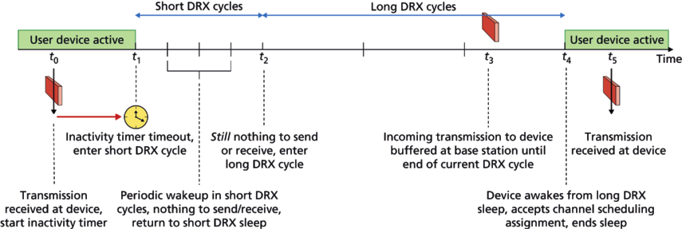

Figure 7.39 LoRa wake-and-send whose typical task is to report sensor measurement data to a nearby gateway, typically within a few kilometers of the device. The simplest type of LoRa device, known as a Class A device, uses its radio in an uncoordinated, wakeand-send approach to do so. A device with data to send simply wakes up, transmits its data without any coordination with a gateway node (or even knowing that a gateway node is present), optionally waits for downlink data from the gateway node, and then goes back to sleep. Here, device-energy conservation is a first-class consideration, with the device’s usual sleep state only occasionally disturbed by device-initiated wake-up for data transmission.

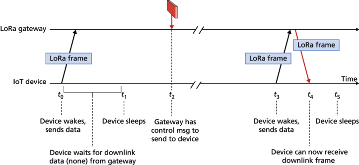

Figure 7.39 shows LoRa’s wake-and-send behavior. At t , the LoRa IoT 0 device awakes and sends a LoRa frame (e.g., containing a sensor measurement) to the LoRa gateway. The device then looks for messages from the gateway, and receiving none, returns to sleep at t . At t , the gateway has a 1 2 message to send to the IoT device but must wait until the next device contact (following t ) before sending the message. The gateway’s message is received 3 at t and the device returns to sleep at t . 4 5 Like LoRa Class A, Bluetooth Low Energy (BLE) and 4G LTE Narrowband IoT (NB-IoT) networks also support device-initiated wake-and-send transmission by the IoT device. However, in these cases, the device must first contact the controller node or base station upon waking to first be allocated channel transmission slots in which to send its data. See [Sauter 2021] for details.

#### 7.4 The Wireless Core Network

Having learned about wireless access networks in Section 7.3, we’ll now move from the wireless edge and into the wireless core. The 5G Core provides higher-level control-plane and management-plane services (e.g., for managing user-device identity, access security, mobility, and more) as well as the dataplane services to forward datagrams between devices in the 5G RAN and the larger Internet.

In this section we’ll focus entirely on 5G networks rather than covering both 5G and WiFi networks. Indeed, there is no reason to discuss core control and management for WiFi networks here, since traditional IP networks use the same management and control-plane mechanisms for both wired Ethernet and WiFi. An enterprise views WiFi, or any wireless edge network, as just another link-layer technology in its network.

One might wonder why the core network is such a central architectural component in mobile cellular networks, but not in traditional IP networks. The answer undoubtedly lies in 5G’s roots in mobile cellular telephony. 1G and 2G cellular networks were essentially telephone-only networks; 3G networks were still primarily telephone networks, with packet data grafted on as an additional service. These early cellular networks supported services for managing user identity (e.g., via SIM cards); device mobility within a provider’s network; roaming among different provider networks; and accounting, billing, payment and settlement for services. There was no support for such services in the deployed Internet at the time. 4G and 5G networks have now become “all IP” networks and have adopted many of the services pioneered in traditional IP networks. Nonetheless, native support for services such as identity, mobility, roaming and service billing—services implemented primarily in the 5G Core—is not implemented in traditional Internet ISPs, and remains a significant difference between 4G 5G networks and traditional IP networks today.

In this section, we’ll provide an overview of the 5G Core and its services in Section 7.4.1. We’ll focus on the User Plane network function and the extensive use of tunneling in Section 7.4.2 and then cover user identity and its role in registration and session establishment in Section 7.4.3. Mobility is such an important topic that we’ll give this a separate treatment in Section 7.5.

##### 7.4.1 The 5G Core and Network Functions

Figure 7.40, adapted from [3GPP 23.501 2024], shows a number of the key 5G Core components. The 5G Core adopts a Service-Based Architecture (SBA), with architectural elements in the Core defined in terms of Network Functions (NFs) and the services they provide. Although the 5G specifications do not specify how these functions are to be implemented, a service-based description would naturally map (as suggested by various figures in this chapter) onto microservices implemented in a logically centralized data center. This approach differs significantly from 4G and earlier cellular network architectures that defined traditional network “entities” that interacted via protocols and were typically implemented by standalone single-function equipment (“boxes”).

Perhaps reflecting this break from 4G, 5G service elements have completely new names and abbreviations than their 4G counterparts, causing occasional headaches for students learning about cellular networks who can be overwhelmed by names and acronyms in the cellular network world.

Many of the innovations in the 5G Core—in particular the evolution from “boxes” to “services,” the opportunity for SDN-based implementation of services, and the clear separation between the control plane and user plane—mirror the earlier evolution of the Internet control plane that we learned about in Chapter 5.

Figure 7.40 5G Core: key network functions

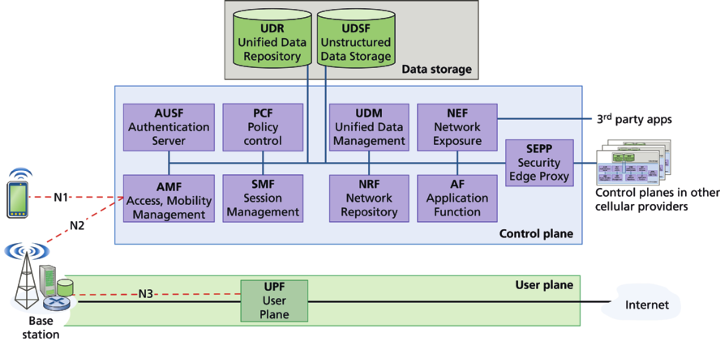

5G Network Functions If one were to identify the “top three” most centrally important Network Func- tions in the 5G Core, these three functions would be leading candidates: • The User Plane Function (UPF) is responsible for the data-plane for- warding of traffic between the RAN and the larger Internet.

As the only 5G network function in the data plane, it clearly plays a central role. As we’ll see in Section 7.4.2, the User Plane Function is structured as a tun- neled relay that forwards user IP datagrams between the base station and the larger Internet. Every datagram transmitted by a device to the larger Internet and vice versa will pass through the device’s User Plane Function. • The Access, Mobility Management Function (AMF) plays the key role in authorizing and establishing device access to a 5G network’s services and in managing device mobility (discussed in Section 7.5). The AMF is arguably the central Network Function in the 5G control plane. As we will see, the AMF works with many other network functions to implement its services. For example, the AMF interacts with the Authentication Server Function (AUSF) to authenticate a device that wants to join a 5G network. The AMF is also the only control-plane network function that exchanges control messages directly with a device, via the N1 interface shown in Figure 7.40, and is one of only two network functions that directly exchange control messages with a base station (via the N2 interface). A numbered interface such as N1 is known as a reference point in 3GPP parlance and defines the interaction between a 5G core function and another Core function (or device or base station). [3GPP 23.501 2024] standardizes more than 60 such reference points.

• The Session Management Function (SMF) manages each device session, including IP address allocation and assignment (e.g., NAT and DHCP-like services) and the installation of per-device state for functions such as policy-based access control, charging, and establishing device data-plane forwarding via the UPF.

Network, user, and application data and state information also figure prominently in the set of network functions. Device profile, service and authentication information is managed by the Unified Data Management (UDM) Network Function. The UDM may store its data internally within its function implementation or externally in the Unified Data Repository (UDR).

When a Network Function chooses to store data externally in the Unified Data Repository and accesses and updates this information remotely, stateless transactions (similar in spirit to the stateless client/server interaction in HTTP) are possible, naturally leading to scalable and resilient network function implementations in a cloud environment. Other network functions and third-party applications can also store and retrieve data to and from the Unified Data Repository and the Unstructured Data Storage Function (UDSF).

In Section 7.3.3, we learned that user application code can run on servers in the 5G Core or at the base station and communicate with devices to implement an application’s service, a capability known as local breakout. The Network Exposure Function (NEF) and Application Function (AF) expose select network data and Network Function services to these local-breakout applications, and vice versa.

Sometimes a Network Function running in one operator’s 5G network will need to interact with a counterpart in another operator’s 5G network. For example, when your smartphone wants to join a network not operated by the network provider with whom you have a paid subscription plan (known as your “home” network), the Authentication Server Function (AUSF) in the network that you want to join will interact with its peer AUSF in your home network to perform authentication and to determine the set of services available to you. The authentication functions in these two networks will securely communicate with each other via their local Security Edge Protection Proxy (SEPP) Network Function.

Finally, capabilities are needed for network functions to register their services and discover the potentially large number of other network functions. The Network Repository Function (NRF) provides these automatic registration and discovery services, obviating the need for complex manual configuration. The Policy Control Function (PCF) provides control, management, and centralized repository services for control policy rules used for mobility management, per-device quality of service, and roaming. One important new concept introduced in 5G is network slicing, which involves the virtualization of RAN and Core resources, and the ability to define multiple logical networks that share the network’s underlying physical resources, in much the same way that we learned (in Section 6.5) that multiple virtual private networks (VPNs) can operate over the same set of physical network resources in traditional IP networks. The Network Slice Selection Function (NSSF) is the network function that plays the central role in network slicing, a topic beyond the scope of this book.

As we will see, a network function will typically interact with other network functions to implement its service. Network functions can communicate with each other using several different styles of interaction, and the standards do not mandate or recommend one approach over another. NF services may be accessed using the traditional request/response client-server model that we studied in Chapter 2, which in turn can be implemented via a protocol such as HTTP, or by remote procedure calls in a data center setting. Another form of client-server interaction is the subscribe/notify model (aka the publish/ subscribe model in the distributed systems literature) in which a client registers its interest in a service, and the server notifies the client when results from the service are available (i.e., “pushes” results to subscribed clients).

Recall that we learned in Chapter 5 that the publish/subscribe model is the central organizing principle in Google’s Orion SDN platform.

##### 7.4.2 User Plane Function

We learned above that the User Plane Function is responsible for controlling the data-plane forwarding of traffic between the RAN and the larger Internet. Since the 5G data plane is an all-IP network, in many ways it functions exactly as we’ve already seen in Chapters 4 and 5.However, the 5G control plane configures the data plane to support two key services not always found in traditional IP networks: quality of service (QoS) support and tunneling. 5G QoS support is an advanced topic beyond the scope of this book; see [Sauter 2021] for a discussion.

In this subsection, we’ll consider tunneling together with the protocol stacks in the 5G data plane that implement tunneling.

Recall from Chapters 4 and 6 that tunneling provides the abstraction of a virtual link between two IP devices. In a 5G setting, a tunnel is established for each device between its base station and its instance of the User Plane Function, as shown in Figure 7.41. With tunneling, the entire sea of routers and links in the backhaul network between the base station and the User Plane Function is abstracted as a single virtual link for that device.

Having studied the RAN protocol stacks in detail in Section 7.3, let’s now focus on the data-plane protocol stacks at the base station and the User Plane Function in the 5G Core. As discussed in Section 7.4.3, the Session Management Function will establish a tunnel between the base station and the device’s User Plane Function when a device joins the network. When a User Plane Function receives a datagram from the external Internet that is destined for a device in its data plane, the User Plane Function encapsulates that datagram within a UDP segment using the GPRS Tunneling Protocol (GTP) [3GPP TS

29.281 2022]. The UDP datagram then becomes the payload in a new IP datagram, which is forwarded from the User Plane Function through the backhaul network to the base station, just like any other IP datagram addressed to the base station. On the receiving side, the base station decapsulates the tunneled UDP datagram from the User Plane Function, extracts the encapsulated IP within-a-datagram in Figure 7.41. The protocol details of the tunneling protocol are fairly straightforward and can be found in [3GPP TS 29.281 2022]. So rather than diving into those details here, let’s instead consider the more fundamental question of why tunneling is used in the first place. In Chapter 4, we learned that tunneling allowed IPv4 and IPv6 networks to interoperate. But what are the advantages to wrapping a datagram inside a datagram while operating in a pure 5G network? The answer lies in device mobility, i.e., a device changing the base station to which it is attached (Section 7.4) as it moves through the cellular provider’s network. Consider again the example in Figure 7.41. Without tunneling, all of the routers in the backhaul network would need to maintain up-to-date information about a device’s location (i.e., the base station to which the device is currently attached) in order to forward a datagram to that device. Indeed, the routers would need to maintain that information for all devices in the provider’s network! With tunneling, only the tunnel endpoint (i.e., the User Plane Function) needs to know the identity of the base station to which the device is attached; the backhaul routers need only know how to forward and route datagrams to and from the base stations. The UPF thus serves as an anchor point for forwarding datagrams from a device to the larger Internet, and vice versa, for the

Figure 7.41 5G protocol stacks, with tunneling datagram destined for the device, and forwards that IP datagram over the RAN to the device. As with the use of tunneling in mixed IPv4 v6 networks (Section 4.3), you should carefully examine the addresses in the datagram-

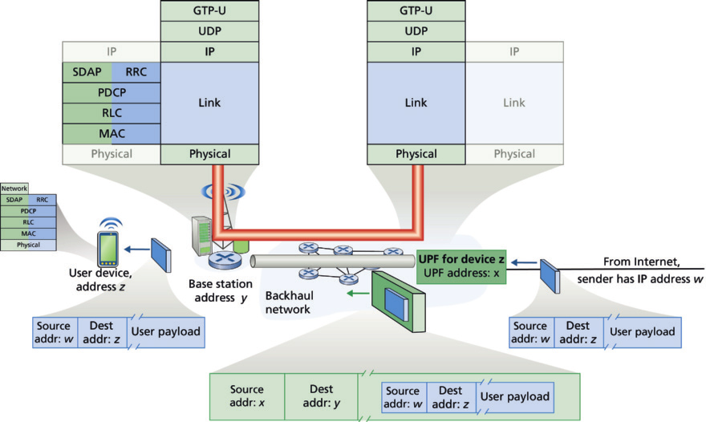

duration of a device’s attachment to the 5G network, regardless of the particular base station to which the device happens to be attached at a given time.

##### 7.4.3 User Identity, Registration, and Session Establishment

In Section 7.3.4, we learned how a device discovers the existence of a 5G network and how it initially attaches to a base station. Recall that following this initial attachment, although the device and base station are able to exchange control messages, the device still has not yet really joined the 5G network—it hasn’t yet exchanged control messages with the 5G Core and so can’t yet, for example, send or receive data-plane datagrams via a User Plane Function.

Let’s begin our discussion of how a device fully joins a 5G network by first considering how the device identifies itself to the network.

Identity: SIM Cards As most cell phone owners know, a 4G 5G device needs a physical SIM (Subscriber Identity Module) card, or more recently a software-only eSIM, to attach to a 4G 5G network. Your SIM uniquely identifies you and your “home” network to all cellular network providers globally. In the cellular network world, your SIM is your global network identity!

The information included in a SIM can differ from one provider to another, but will generally include the following information:

• IMSI: International Mobile Subscriber Identity. An IMSI has three parts:

a 3-digit (base 10) mobile country code (MCC), a 2- or 3-digit mobile network code (MNC) and a mobile subscription identification number (MSIN).The MCC and MNC together define the SIM’s home network, i.e., the cellular provider that provided the SIM card to you and with whom you have a subscription plan. The MSIN uniquely identifies the SIM within the home network. Your SIM also has your cellular phone number and an associated set of cellular services that you’re able to access when attached to your home network.

When you’re in an area not served by your home network, you may attach to another provider’s network, in which case you are said to be roaming on a visited network. You may have a different set of services available to you on visited networks, depending on your subscription plan with your home network and the charging/settlement mechanisms between your home network and the visited network. There may be networks that, with great frustration, you simply cannot join.

• Cryptographic keys and PINs are also stored on a SIM. The cryptographic key is used for authenticating the device when it joins the 5G network, as discussed below and in Chapter 8.

• Local Area Identity information lists current and recently visited networks. Local identity is used to identify networks that a device may try first when seeking cellular network service.

• Contact lists and text messages may also be stored on a SIM card.

Joining a 5G network: registration and session establishment When a device wants to join a 5G network, there are two important sets of actions that are undertaken. The first is registration, when the device identifies and then authenticates itself to the network, and vice versa. The second is PDU Session establishment, which allocates an IP address for the device and creates a data-plane path between the device and a User Plane Function. “PDU” is an acronym for “Protocol Data Unit”—3GPP jargon for a “packet.” After these steps, the device is fully attached to the network, and ready to go (communicate while being mobile)!

Both registration and session establishment are performed by network functions in the 5G Core, with Access and Mobility Management Function (AMF) playing a central role in this process. The AMF is the only Network Function that communicates directly with the base station and the device. It orchestrates authentication (with the AUSF) and session establishment (with the SMF) within the 5G Core.

Let’s now briefly consider the steps involved in registration and session establishment, as shown in Figure 7.42.

Figure 7.42 Device registration and session establishment: interaction among device, base

station and Core Network Functions

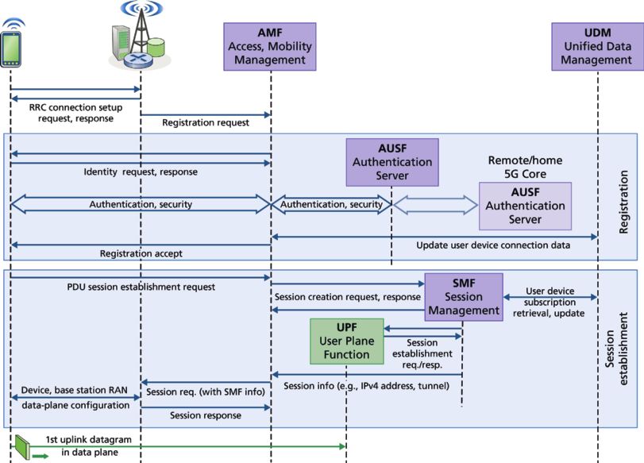

• Registration. Earlier in Section 7.3.4, we learned that the device and base station exchange connection setup request/response messages to establish a RAN signaling channel between themselves. After this exchange, the base station then selects an instance of the AMF for the device and sends a registration request to that AMF for that device. The AMF then contacts the device and requests and receives device identity information. As shown in Figure 7.42, that information is then passed to the Authentication Function which performs mutual authentication with the device; we’ll postpone our discussion of 5G authentication until Chapter 8, where we’ll cover this topic in detail. Note that if the network being joined by the device is not its home network, the local Authentication Function in the visited network will serve as a proxy to the Authentication Function in the device’s home network, which will actually perform the authentication. Following a successful authentication, the AMF then registers the device’s identity and subscribed service information in the local UDM, and returns a registration acceptance message to the device.

• Session establishment. The device initiates the process that will establish its data plane by sending a PDU session establishment request to the AMF, which in turn selects an SMF that will be responsible for establishing and managing the device’s data plane, while the device is attached to the network. After verifying via the User Data Management Function that the device’s requested session parameters are permissible, the SMF selects an instance of the User Plane Function and establishes the device’s tunnel between its base station and that User Plane Function. The SMF then returns the tunnel, IPv4 address information, and additional session information to the device via the AMF and the base station. The final step is for the base station and the device to interact to configure the device’s RAN data plane. Once this is done, the device is then ready to send datagrams into the Internet!

In the above, we’ve illustrated only the most important interactions among the device, base station, and various network functions in registration and session establishment. We note that the Policy Control Function and the Charging Function are also involved in session establishment and that additional steps are needed to configure IPv6, if desired. For a full discussion of the process, see [3GPP TS 23.502 2024], and the discussion (34 rather dense pages!) surrounding Figures 4.2.2.2.2-1 and 4.3.2.2.1.

#### 7.5 Mobility

Having covered the characteristics of wireless links and the physical layer of wireless networks in Section 7.2, wireless access networks in Section 7.3 and wireless core networks in Section 7.4, let’s now turn our attention to one of the most unique and interesting aspects of wireless networks—the need to support device mobility. Indeed, this topic is so important that we are devoting an entire section to the topic! We’ll begin in Section 7.5.1 by discussing the challenges introduced by the need to support mobile devices and the principles and broad approaches towards doing so. While WiFi naturally supports mobility in the vicinity of an access point, we’ll see that WiFi (Section 7.5.2) only provides limited support for mobility among nearby WiFi WLANs. By contrast, cellular networks have had mobility “baked in” as a first-class, “must-have” service since their earliest days due to their roots in the mobile telephony world. We’ll cover the extensive support for mobility in 5G networks in Section 7.5.3.

In Section 7.5.4, we’ll wrap our discussion of mobility with observations about past IETF efforts for supporting network-layer mobility within and among non-cellular IP networks, and possibly why such mobile Internet service has not been deployed to date.

##### 7.5.1 Mobility Principles

What is “mobility”?

Let’s begin our discussion of device mobility by carefully considering what we mean by “mobility” in the first place. Suppose a device is “on” and communicating as it moves, and let’s consider how “far” such a device can move while communicating without interruption (e.g., maintaining ongoing TCP connections and not needing to explicitly join any new networks). Drawing on the distinction made between inter-domain and intra-domain routing, we can identify three distinct mobility scenarios, depending on whether or not a device is able to move without interrupting ongoing communication within and among access networks (e.g., 802.11 WLANs or 5G RANs) with a single provider’s network, and within and among the multiple provider networks.

• Mobility only within a single access network. At one end of the spectrum, scenario (a) in Figure 7.43, a mobile device maintains its communication connectivity only while attached to a given access network.

In this scenario, a device must disconnect from the base station in one access network, and then connect to a new base station in another access network, as it moves between access networks. For example, a student might disconnect from a wireless classroom network and power down their laptop or smartphone, head to the dining commons and connect to the wireless access network there while eating, and then disconnect and power down from the dining commons network, walk to the library, and connect to the library’s wireless network while studying. In this case, the device serially associates with (joins), and later disassociates from (leaves), each wireless access network encountered. This case of limited device mobility can be completely handled using the networking mechanisms we’ve already studied in Sections 7.3 and 7.4.

• Mobility among access networks within a single provider network. Our interest in device mobility really starts with case (b), where a device moves among multiple access networks within a provider’s network while continuing to send and receive IP datagrams, and while maintaining higherlevel (e.g., TCP) connections. Here, the network will need to provide handover—a transfer of responsibility for forwarding datagrams to/ from one base station to another as the device moves among WLANs or

Figure 7.43 Various degrees of mobility, as a device maintains connectivity

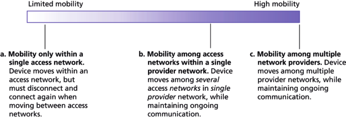

RANs. When handover occurs within access networks belonging to a single network provider, that single provider’s network orchestrates handover on its own. • Mobility among multiple network providers. When a mobile device roams between multiple provider networks, as in scenario (c) in Figure 7.43, the providers must coordinate handover to ensure uninterrupted ongoing communication. This inter-provider handoff significantly complicates the process. As scenario (c) is more complex and occurs less often as cellular network providers increase their geographical footprints, we’ll focus our attention here on case (b). See Chapter 7 in earlier editions of this book, available on our pub- lisher’s and authors’ Web sites, for a discussion of scenario (c). Mobility: challenges and approaches Any approach toward supporting device mobility among access networks within a single provider network (case (b) in Figure 7.43) must consider three fundamental questions: • Is device mobility supported only at the link layer, or is the network layer involved as well? If mobility is supported only at the link layer, a device may be able to move among wireless access (link-layer) networks, but this may restrict a device’s mobility range while communicating without interruption to be within its current subnet (in the addressing sense of Section 4.3). This is because, with only link-layer mobility support, incoming datagrams from the larger Internet that are destined to the device will always be forwarded to this subnet for delivery to the device. As we will see in Section 7.5.3, this is the approach taken in enterprise WiFi networks. • On the other hand, if device mobility is supported across the provider’s entire network, network-layer (and/or higher-layer) support will be needed. For example, the core network will need to know the particular access network to which the mobile device is currently attached, so that incoming datagrams from the larger Internet can be forwarded to that subnet for delivery to the device. As we will see in Section 7.5.3, this is the approach taken in 5G (and 3G and 4G) cellular networks.

• Why is handover initiated, and who initiates handover? When a device changes its point of attachment to the network from one base station to another, why is that change made in the first place? As we saw in Section 7.2, as a device moves, the quality of the radio signal between itself and the base station (and hence packet throughput and latency) can change. A device might thus change access networks to improve its performance. However, the network itself may choose to move the device from one access network to another in order to load-balance devices among its access networks. The WiFi and 5G standards do not specify specific algorithms to be used by a base station to determine whether or not to perform handover, or which target base station to choose. That decision is left up to network operators and remains an active area of research [Haghrah 2023].

• A wireless device will also typically measure the signal quality of all base stations within range and report that information back to the base station to which it is currently attached. We learned in Section 7.3.5 that in 5G networks, a base station periodically broadcasts reference signal symbols and that a device periodically reports a 4-bit channel quality indication (CQI) to the base station based on its measured reception of these reference signals. WiFi devices measure the strength of the signal received from various APs and return a Received Signal Strength Indicator for each of these APs. These measured and reported values can then be used to decide whether a device should be handed over to a different base station. A device or network could also predict future device mobility and radio signal strength (e.g., using machine learning) and proactively perform handover, rather than relying just on current measurements. The decision to perform a handover may be initiated and controlled primarily by the device, or by the control plane in the network’s base stations.

• How is handoff accomplished? When a device that is associated with one base station is handed off to another base station, two important tasks must be accomplished. First, device state (e.g., the authenticated status of the device, the device’s allowed services) within the WLAN or RAN control plane in one base station must be transferred to the neighboring base station. Without this transfer, a device would have to disassociate from the old base station, and associate with the new base station. Secondly, to ensure the uninterrupted bi-directional flow of datagrams to and from the mobile device, forwarding tables in routers and switches must be modified to redirect datagrams to and from the device when there is a new point of attachment to the network.

In the following two subsections, we’ll study how these mobility considerations are addressed in institutional WiFi networks (Section 7.5.3) and 5G cellular networks (Section 7.5.4).

##### 7.5.2 Mobility in a WiFi network

The IEEE 802.11 WiFi standard adopts a decidedly link-layer-only approach towards mobility, perhaps not surprising because 802.11 is a link-layer standard. Consequently, WiFi mobility is supported only among access points that are within the same subnet (in the addressing sense of Section 4.3).

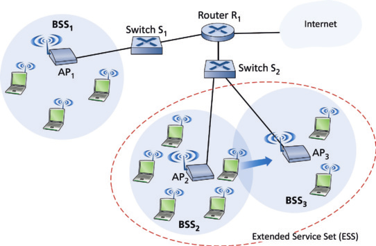

Figure 7.44 WiFi: handover within the ESS

We learned in Section 7.3.2 (Figure 7.22) that the traditional WiFi network, known as the Basic Service Set (BSS), contains a single AP and one or more attached wireless devices. Figure 7.44 shows the concept of an Extended Service Set (ESS), which consists of multiple BSSs (e.g., BSS and BSS ) and their 2 3 set of access points (e.g., AP and AP in Figure 7.44). Assuming that each AP 2 3 in the ESS uses the same SSID, an ESS appears logically to be just a single WLAN from both the device point of view and from the network-layer point of view, since the devices and APs in the ESS are in the same layer-3 subnet. Indeed, a device that moves between BSS and BSS in Figure 7.44 is not even mobile 2 3 from a network-layer point of view, since it never leaves its subnet! The IEEE 802.11 standard introduced Fast Basic Service Set Transition (FT) to accelerate  the  802.1X authentication when a device moves between APs in an ESS, and to allow APs to suggest alternative APs to which a device may wish to attach within the ESS.

In addition to these 802.11 standard capabilities, large WiFi equipment vendors provide proprietary solutions that provide support for mobility, e.g., to manage device handover between two APs in an ESS [Cisco 802.11r 2016].

##### 7.5.3 Mobility in a 5G network

While 802.11 mobility occurs exclusively at the link layer, mobility in a cellular 5G network is a network-wide undertaking, involving both RANs and the 5G Core network. 5G’s extensive support for device mobility undoubtedly reflects its roots in the mobile cellular telephony world. The earliest generations of cellular networks provided call handover with uninterrupted voice service as a user ranged from cell to cell across a provider’s network, as well as from one provider’s network to another. With mobility “baked in” to the earliest cellular network architectures, the addition of mobile data services followed quite naturally in later generation cellular networks.

In this subsection, we’ll focus on the handover process in 5G networks. As we’ll see, handover is carefully orchestrated within the RAN and 5G Core control planes, and also involves the reconfiguration of the device’s RAN and 5G Core data planes, making it a truly network-wide activity.

5G Handover Let’s consider an active 5G device that is currently associated with a base station in one RAN (the “source” base station for the handover) that will be handed over to a second base station (the “target” base station) in another RAN.Let’s suppose that the device is “active” in the sense that it has an ongoing TCP connection with a remote host in the larger Internet and an active data-plane connection via a tunnel to/from its User Plane Function in the Core (see Section 7.4.2).

After handover, the device will be associated with the target base station, the source base station will have released the device state it had been maintaining, the data-plane tunnel to and from the device will now end in the second RAN (assuming for simplicity that the other tunnel endpoint remains at the same User Plane Function), and all device states in the 5G Core will reflect the fact that the device is now located in the newly-joined base station. So many changes that will need to be made!

Figure 7.45, adapted from Figures 4.9.1.2.2-1 in [3GPP TS 23.502 2024] and 9.2.3.2.1-1 in [3GPP TS 38.300 2024], illustrates the handover process. 5G handover begins in the RANs, and then completes in the Core. Most of the handover interactions shown in Figure 7.45 are in the control plane, but the data-plane tunnel between the User Plane Function and the base station to which the user is associated will also change during the process. We can identify three distinct phases in 5G handover:

• Making the handover decision. Handover begins in the RAN, with the device measuring the quality of the radio channels of the base stations that it can hear, and then reporting these measurements to the source base station. If a handover is deemed desirable by the source base station, it sends a handover request message to the target base station, which then decides whether or not to accept the handover and returns its decision (in the case of the example in Figure 7.45, a positive acknowledgment) to the source base station.

• Transferring the device between base stations. The source base station, target base station and the device then work together to transfer the device’s RAN connection from the source base station to the target base station.

This process begins with the source base station sending two messages: a reconfiguration message to the device and a transfer status message to the target base station that transfers device state to the target base station. The device and the target base station can then set up a new RAN connection.

The process completes when the device sends a reconfiguration complete message to the target base station and the target and source base stations perform a final handshake. Note that the endpoint of the tunnel between the base station and the User Plane Function remains unchanged during this process. However, rather than delivering datagrams to the device over the source RAN, the source base station instead begins forwarding datagrams addressed to the device to the target base station. The target the handover process. • Updating device state and UPF tunnel in the Core. Handover activity now shifts to the Core. The target base station, which is now fully in charge of the device’s RAN connection, signals to the Session Management Func- tion (SMF) via the AMF that it is the new base station for the device being handed over. The SMF then signals to the User Plane Function to change the device’s tunnel to be terminated at the target base station. The User Plane Function then sends a data-end marker to the source base station, which then knows that the device tunnel endpoint has been switched and informs the target base station. At this point, the target base station can deliver to the device any buffered datagrams forwarded to it from the source base station during handover. Additionally, datagrams will now flow directly from the device’s User Plane Function to the target base station. Following some cleanup handshaking, the handover process is now complete!

Figure 7.45 Device handover: RAN and Core actions base station will buffer these datagrams for later delivery to the device, ensuring that no incoming datagrams destined for the device are lost in

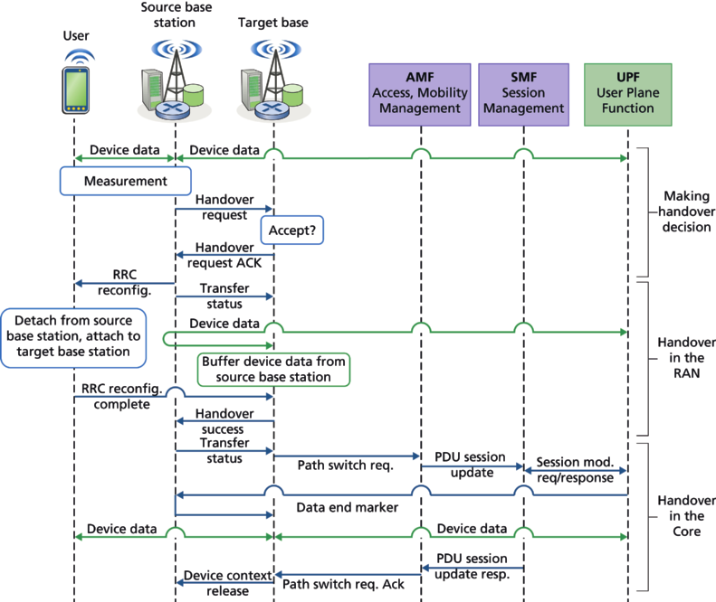

While our description above might seem rather complicated, it actually only considers the simplest of handover scenarios! One common scenario not covered above is the case in which a device has powered off its radio to conserve power. Recall from Section 7.3 that after periods of inactivity, there are sleep periods that are even longer than the DRX sleep cycles we encountered in Figure 7.38. During these periods of long sleep, a device will first enter the Idle state and then the Inactive state. In the Idle state, a device must take additional steps to re-establish its active presence in the RAN before it can send or receive user data. In the Inactive state, additional handover steps must be taken in both the RAN and in the Core. In particular, if a device moves among base stations while Idle or Inactive, the 5G Core may not even know the RAN in which the device is located. Tracking area update procedures can be used so that the Core knows the general area where the device is located. Paging procedures can then be used by the Core to pinpoint the device’s RAN. These topics are beyond the scope of our discussion here; see [Alsaeedy 2019] for a discussion.

A more complex handover also occurs when a device is handed over from the RAN in one provider’s mobile cellular network to the RAN in another provider’s network. In this case, the cellular provider to which the device is attached changes and inter-provider signaling is needed; see [3GPP TS 138.300 2024] for details.

##### 7.5.4 Internet Mobility

Today’s traditional (non-cellular) Internet does not have any widely deployed infrastructure that provides the type of services for “on the go” mobile users that we encountered for 5G cellular networks.

This, however, is not due to the lack of technical solutions for providing such services! Indeed, a Mobile IP architecture and protocols [RFC 5944] were standardized in Internet RFCs more than 25 years ago. Interested readers can consult earlier editions of our book and [Perkins 1998] for an in-depth treatment of Mobile IP. And research has continued on new, more secure and more generalized Internet mobility solutions [Venkataramani 2014].

Given Mobile IP’s technical solutions, it has perhaps been the lack of motivating business and use cases [Arkko 2012] and the timely, first-mover development and deployment of alternative mobility solutions in cellular networks that blunted the deployment of Mobile IP. Recall that 25 years ago, 3G cellular networks had already provided a solution for mobile voice services (the “killer app” for mobile users) as well as the beginnings of global mobile data services. Behind these services was a paid subscription model with a home network provider, and inter-provider business agreements and payments that allowed users to roam from their home networks to visited networks. The traditional Internet lacks such a business infrastructure in support of roaming.

Today, mobile Internet connectivity is provided via a dual technology solution—mobile services via cellular networks when we are truly mobile and “on the go” (i.e., the center and rightmost side of the mobility spectrum in Figure 7.44) and Internet services via 802.11 networks or wireline networks when we are stationary or moving locally (i.e., the center and leftmost side of the mobility spectrum in Figure 7.44). Perhaps this dual-technology solution that we’ve now had in place for 25 years will continue to persist into the future.

The one indisputable fact however, is that 15 years ago there were approximately equal numbers of subscribers attached to the Internet via fixed (wired) broadband technologies and via wireless technologies. While both subscriber bases have grown since then, there are now five times as many Internetconnected wireless subscribers than wired subscribers. There’s a saying that customers “vote with their feet.” That may be a particularly apt description of the choices that highly mobile Internet users have made.

#### 7.6 Bluetooth, Satellite, and IoT Wireless Networks

In the past three sections, we’ve focused primarily on WiFi and 5G networks.

But these are not the only types of widely deployed wireless networks! In this section, we’ll thus briefly cover three additional types of wireless networks— Bluetooth, satellite, and IoT wireless networks. As we’ll see, because these networks provide more specialized services than WiFi and 5G networks, they have interestingly different architectures and protocols.

##### 7.6.1 Bluetooth networks

Bluetooth networks have quickly become part of everyday life. You may have used a Bluetooth network as a cable-replacement technology to interconnect a computer with a wireless keyboard, mouse, or other peripheral device. Or perhaps you’ve used a Bluetooth network to connect wireless earbuds, speaker, watch, or health monitoring band to a smartphone or to connect a smartphone to a car’s audio system. In all of these cases, Bluetooth operates over short ranges (tens of meters or less), at low power, and at low cost. For this reason, Bluetooth networks are sometimes referred to as wireless personal area networks  (WPANs) or, because of their limited range, piconets.

Although Bluetooth networks are small and relatively simple by design, they’re packed with many of the link-level networking techniques that we’ve studied earlier, including time division and frequency division multiplexing (Section 6.3.1), randomized backoff (Section 6.3.2), polling (Section 6.3.3), error detection and correction (Section 6.2), and reliable data transfer and flow control (Chapter 3). And that’s just considering Bluetooth’s link layer!

Bluetooth networks operate in the unlicensed 2.4 GHz Industrial, Scientific, and Medical (ISM) radio band along with other home appliances such as microwaves, garage door openers, and cordless phones. As a result, Bluetooth networks are designed explicitly with noise and interference in mind. The Bluetooth wireless channel is operated in a combined TDM and FDM manner, with 79 frequency channels and 625 microsecond time slots on each channel.

During each time slot, a sender transmits on one of the 79 channels. The sender then changes the channel (frequency) used in a pre-determined manner from one slot to the next, as shown in Figure 7.46.

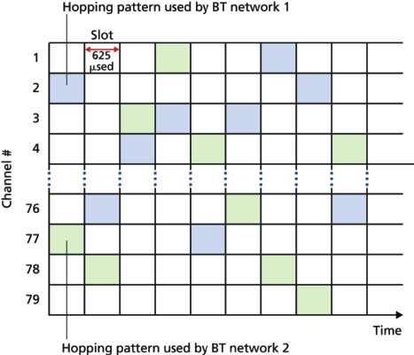

Figure 7.46 Bluetooth frequency hopping over time

This form of channel hopping, known as frequency-hopping spread spectrum (FHSS), is used so that interference from another device operating at a given frequency in the ISM band will only interfere with Bluetooth communications in a small number of slots. Additionally, slots with significant interference, as manifested in a low signal-to-noise ratio, can be adaptively removed from the hopping pattern. Multiple Bluetooth networks can co-exist in the same physical space as long as they use different frequency hopping patterns. Bluetooth data rates can reach up to 2 to 3 Mbps.

Bluetooth networks are ad hoc networks, as no network infrastructure (i.e., base station) is needed.

In most usage cases, Bluetooth communication is between only two devices, e.g., between wireless earphones and a smartphone.

But the Bluetooth standard also allows for devices to organize themselves into networks, and so a multiple access protocol is required. Bluetooth devices organize themselves into a piconet of up to eight active devices, as shown in Figure 7.47. One of these devices is designated as the centralized controller, with the remaining devices acting as clients in a “peripheral” role. The centralized controller node truly rules the piconet—its clock determines time in the

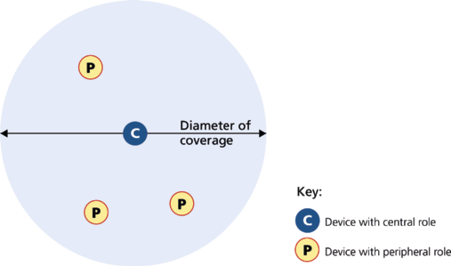

Figure 7.47 A Bluetooth piconet

piconet (e.g., determines TDM slot boundaries), it determines the slot-to-slot frequency hopping sequence, it controls entry of client devices into the piconet, it controls the power (100 mW, 2.5 mW, or 1 mW) at which peripheral devices transmit, and (using polling) it grants transmission privileges to a peripheral device once it has been admitted to the network.

In Bluetooth, communication occurs only between the central and peripheral nodes; there is no direct peripheral-to-peripheral communication.

Because Bluetooth ad hoc networks must be self-organizing, it’s worth looking into how they bootstrap their network structure. When a centralized controller node wants to form a Bluetooth network, it must first determine which other Bluetooth devices are within range; this is the neighbor-discovery problem. The centralized controller does this by broadcasting a series of 32 inquiry messages, each on a different frequency channel, and repeats the transmission sequence up to 128 times. A client device listens on its chosen frequency, hoping to hear one of the centralized controller’s inquiry messages on this frequency. When it hears an inquiry message, it backs off a random amount of time between 0 and 0.3 seconds (to avoid collisions with other responding nodes, reminiscent of WiFi’s and Ethernet’s binary backoff) and then responds to the centralized controller with a message containing its device ID.

As the Bluetooth centralized controller discovers potential clients within range, it can then invite those clients that it wishes to join its piconet. This second phase is known as Bluetooth paging (not to be confused with paging in 5G networks) and is reminiscent of 802.11 clients associating with a base station.

The centralized controller begins the paging process by again sending 32 identical paging invitation messages, each now addressed to a specific client, but again using different frequencies, since a client doesn’t yet know the frequency-hopping pattern. Once the client replies with an ACK message to the paging invitation message, the centralized controller sends frequency-hopping information, clock synchronization information, and an active member address to the client. It then finally polls the client, now using the frequency-hopping pattern, to ensure that the client is connected into the network.

Because Bluetooth was designed for a specific, limited set of services (unlike the Internet and 5G networks), it’s instructive to take a quick look at its protocol stack, shown in Figure 7.48. Perhaps most strikingly, the Bluetooth protocol stack lacks both a network layer and a traditional transport layer! The lack of a network layer is perhaps not surprising, given that Bluetooth networks are generally single-hop with only controller-to-peripheral, or peripheral-to-controller transmissions, and so multi-hop forwarding and routing are not of concern. Multi-hop extensions of the basic Bluetooth mechanisms do exist in the Bluetooth Scatternet and more recently, the Low Energy Mesh specifications, but these have seen extremely limited deployment [Todtenberg 2019]. Many of the Internet’s end-to-end transport-layer services—including reliable data transfer, flow control, segmentation, connection-oriented and connection-less services and an API for upper-layer applications—are provided in Bluetooth’s Logical Link Control and Adaptation Protocol (L2CAP) layer.

L2CAP also provides a service that reserves periodic slots for a connection’s transmissions; this is useful for multimedia applications with known bandwidth requirements and fixed timings.

Figure 7.48 Bluetooth protocol stack Bluetooth 2025].

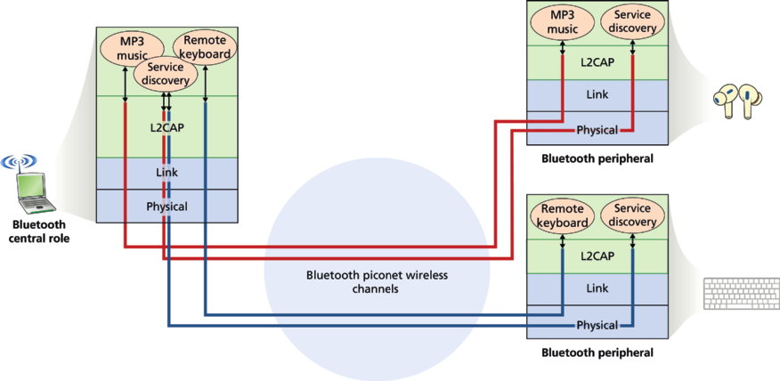

In our discussion above, we have only touched on Bluetooth wireless networking. More recent versions of Bluetooth have emphasized low-energy and security considerations. For more information about Bluetooth, the interested reader should consult [Colbach 2017; Todtenberg 2019; Sauter 2021;

Location Discovery GPS and Wifi Positioning Many of the most useful and important smartphone apps today are location-based mobile apps, including Foursquare, Yelp, Uber, Pokémon Go, and Waze. These software apps all make use of an API that allows them to extract their current geographical position directly from the smartphone. Have you ever wondered how your smartphone obtains its geographical position? Today, it is done by combining two systems: the Global Positioning System (GPS) and the WiFi Positioning System (WPS).

The GPS, with a constellation of 30 + satellites, broadcasts satellite location

and timing information, which in turn is used by each GPS receiver to estimate its geolocation. The United States government created the system, maintains it, and makes it freely accessible to anyone with a GPS receiver. The satellites have very stable atomic clocks that are synchronized with one another and with ground clocks. The satellites also know their locations with great precision. Each GPS satellite continuously broadcasts a radio signal containing its current time and position. If a GPS receiver obtains this information from at least four satellites, it can solve trilateration equations to estimate its position.

GPS, however, cannot always provide accurate geolocations if it does not have line-of-sight with at least four GPS satellites or when there is interference from other high-frequency communication systems. This is particularly true in urban environments, where tall buildings frequently block GPS signals. This is where WiFi positioning systems come to the rescue. WiFi positioning systems make use of databases of WiFi access points, which are independently maintained by various Internet companies, including Google, Apple, and Microsoft. Each database contains information about millions of WiFi access points, including each access point’s SSID and an estimate of its geographic location. To understand how a WiFi positioning system makes use of such a database, consider an Android smartphone along with the Google location service. From each nearby access point, the smartphone receives and measures the signal strength of beacon signals (see Section 7.3.4), which contain the access point’s SSID. The smartphone can therefore continually send messages to the Google location service (in the cloud) that include the SSIDs of nearby access points and the corresponding signal strengths. It will also send its GPS position (obtained via the satellite broadcast signals, as described above) when available. Using the signal-strength information, Google will estimate the distance between the smartphone and each of the WiFi access points. Leveraging these estimated distances, it can then solve trilateration equations to estimate the smartphone’s geolocation. Finally, this WiFi-based estimate is combined with the GPS satellite-based estimate to form an aggregate estimate, which is then sent back to the smartphone and used by the location-based mobile apps.

But you may still be wondering how Google (and Apple, Microsoft, and so on) obtain and maintain the database of access points, and in particular, the access point’s geographic location? Recall that for a given access point, every nearby Android smartphone will send to the Google location service the strength of the signal received from the access point as well as the smartphone’s estimated location.

Given that thousands of smartphones may be passing by the access point during any single day, Google’s location service will have lots of data at its disposal to use in estimating the access point’s position, again by solving trilateration equations.

Thus, the access points help the smartphones determine their locations, and in turn the smartphones help the access points determine their locations!

##### 7.6.2 Satellite Networks

The world of satellite communications has evolved dramatically in the last 10 years. Until 10 years ago, deployed satellite applications primarily used satellites in geostationary orbit (GEO). A geostationary satellite is located roughly 35,000 km above the earth’s equator and rotates with the Earth so that it remains in the same position in the sky relative to observers on Earth. Geostationary satellites have been in use for more than 60 years, for applications including broadcast TV, sensing (e.g., of the weather, atmospheric or surface sensing), and Internet connectivity in areas not served by the terrestrial Internet [Hughes 2025].

The past 10 years, however, have seen a tremendous increase in interest in a different class of satellite networks, known as low earth orbit (LEO) satellites. While the applications remain the same (in particular sensing and Internet connectivity), LEO satellites (LEOs) are generally smaller, less expensive, and positioned much closer to the earth than their GEO counterparts. Located between 500 and 1,200 Km above the surface, LEO satellites thus have much shorter RTTs  ~30 msec  than GEO satellites  ~800 msec  .

As of November

2022, only 6,800 active satellites had been launched in all of history. But in just five years (2019–2024) Starlink alone has launched an equivalent number 6,281 of LEO satellites [space.com 2024]. Today, well over 90% of all satellites launched are LEO satellites. Clearly, there is tremendous recent interest in LEO satellite networks!

LEO satellite network architecture Figure 7.49 shows the principal components of a LEO satellite network:

• LEO satellites. At the top of Figure 7.49, we see the network of orbiting LEO satellites, often referred to as a “constellation” of satellites. Starlink reports more than 6,750 satellites in its constellation; in early 2025 there are approximately 650 LEO satellites in the Oneweb constellation.

Because of their relatively low altitude, LEO satellites are not geostationary but instead are in constant motion with respect to the earth below, travelling at 27,000 km/hr with respect to the ground [Bhattacherjee 2019]. As we’ll see below, these highly mobile network elements take the whole topic of “network mobility” in a whole new direction!

• Satellite links. The coverage area of a satellite’s wireless transmitter/receiver on the earth below is known as its footprint. In the downlink direction, a satellite’s transmissions are broadcast in nature, as they are received by all stations within the footprint. In the uplink direction, transmissions from the various ground stations within the satellite’s footprint are unicast to the satellite—a classical multiple access channel! The footprint of a typical LEO satellite is 15 miles in diameter. A ground station will remain in the footprint of a satellite link’s beam for only 10 minutes or so, until the satellite’s motion takes it out of view of the ground station. You can view the current and changing Starlink and Oneweb constellation footprints (including details for where you are on earth) at https://satellitemap.space/. Satellites may also be directly connected to each other using optical inter-satellite

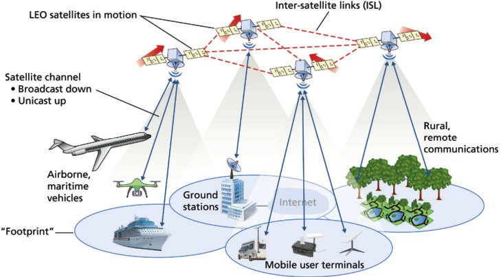

Figure 7.49 Components of a LEO satellite network links (ISLs), although this type of infrastructure link is not yet widely used in practice.

• Ground stations. On or near the Earth’s surface are the ground stations that transmit and receive datagrams over the satellite link. These ground stations may be connected only to the satellite or may be connected both to the satellite and to the terrestrial Internet, in which case the ground station serves as a gateway between the satellite network and the terrestrial Internet. LEO ground stations often have small dish or flat panel antennas for satellite communication. However, a low-bandwidth SOS emergency texting service via satellite is currently available for some (Apple) cellphones, and the provision of additional 5G-like data services via LEO satellites are under study.

Mobility With LEO satellites whizzing through the air at 27,000 km/hr and with ground stations that may themselves be mobile on trucks, boats or airplanes, LEOS constellations are wireless networks with extreme mobility! In contrast to WiFi and 5G networks, however, it is the LEO network infrastructure (satellites), not the user device, that is the primary source of “mobility.” Since a ground station remains attached to a satellite for only 10 minutes or so, ground-station handover between orbiting satellites is a common and important occurrence, as one satellite moves out-of-range of the ground station, while other satellites remain in-range. Recent measurements suggest that satellite handover is much less well-developed than 5G handover, with suspected packet loss occurring during handovers [Kassem 2022]. Also, unlike 5G networks, there is no LEO satellite network standardization body that is similar in spirit to the 3GPP in the cellular network world. As a result, satellite network implementations remain proprietary.

A link in the air or a network in the air?

Figure 7.50 shows two possible approaches towards building satellite networks. The “bent pipe” architecture (Figure 7.50(a)) treats each satellite as a link, with ground stations at each end of each link. An end-to-end path thus

Figure 7.50 Links in the sky or a network in the sky?

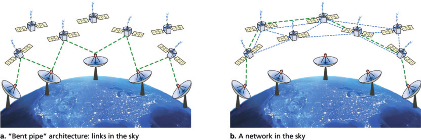

consists of a series of single-hop satellite links, with a packet returning to ground from the sky after each hop. Figure 7.50(b) shows the network-in-thesky approach, where inter-satellite links (ISLs) directly connect satellites, and a packet may cross multiple hops among satellites before returning to ground.

Note that because satellites are non-stationary with respect to the ground and with respect to each other, the ISL links in the network-in-the-sky are dynamically changing, making routing in LEOS networks a challenging problem. For a recent introduction and overview of LEOS networks, see [Bhattacherjee 2019;

Al Homssi 2022; Kassem 2022].

##### 7.6.3 Internet of Things (IoT) networks

The Internet of Things (IoT) [Manyika 2013] is about connecting devices, which are often small and energy-constrained, with computation to sense, monitor, report, and control phenomena in the physical world. Myriad IoT applications in multiple areas abound, including but not limited to (i) manufacturing, where physical characteristics such as pressure, vibration, temperature, humidity, switch settings, and gauge levels are monitored, often with actions then taken; (ii) logistics and supply chains, where asset and transport conditions are monitored and tracked; (iii) agriculture and the environment, where rainfall, temperature, wind, humidity, animal tracking/health, and soil conditions are monitored and resources deployed as a result; (iv) smart cities, where the sound, air, water, weather, lighting, traffic, and crowds, are measured and transportation systems and services are monitored, with services activated and deactivated in response; and (v) personal health monitoring and care. Some have characterized IoT’s impact as being so pervasive and so profound as to constitute a fourth industrial revolution, or “Industry 4.0” [Schwab 2016].

With more than three times as many connected IoT devices deployed than PCs, laptops, tablets, and cellphones combined by the end of this decade [Statista IoT 2025], IoT is on pace to soon become a $300 billion market [Schwab 2016].

With so many different applications with so many different requirements, and such a large potential market, it’s not surprising that there are many different competing technologies angling to provide networked services for IoT. Our modest goal here is to provide an overview of these IoT wireless network technologies, several of which we have already learned about earlier in this chapter, and to provide pointers for additional reading.

Figure 7.51, adapted from [Ahmad 2019], provides a three-faceted characterization of IoT networking technologies, illustrating the extent to which a particular technology emphasizes area coverage, energy consumption, and/or high data rates. Each of the technologies shown in Figure 7.51 emphasizes two of these three characteristics, but none emphasize all three. This suggests that rather than a winner-take-all outcome in IoT networking, we’re likely to see different solutions adopted in practice, depending on the context.

• Emphasizing low energy and low data rate. IEEE 802.11ah, Bluetooth Low Energy (BLE) and Zigbee are three wireless IoT technologies designed for short-range coverage. IEEE 802.11ah is a “flavor” of WiFi, inheriting much of WiFi’s architecture, including the BSS structure, the notion of channels, and a stripped-down 802.11 frame format. IEEE 802.11ah provides data rates of 100’s kbps to ~5 – 10 Mbps. Operating in the 900 MHz unlicensed band and with relays, these networks can span up to a kilometer in practice. Bluetooth Low Energy (BLE) [Sauter 2021] is a significant expansion of the original Bluetooth standard to support IoT devices. We learned about Bluetooth networks earlier in Section 7.6.1 and in Section 7.3.6 we learned that BLE (like LoRa Class A, and 4G LTE Narrowband IoT) supports device-initiated wake-and-send transmission by the IoT device.

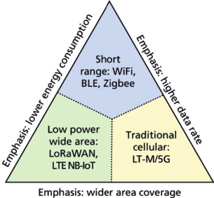

Figure 7.51 IoT communication technologies and their emphases

Introduced in the late 1990s, Zigbee [Gomez 2010] is one of the earliest IoT networking technologies. It is built on the physical and MAC layers of the IEEE 802.15.4 standard for low-rate wireless personal area networks.

• Emphasizing low energy and wider area coverage. LoRaWAN [Jouhari 2023] (Long Range Wide Area Network) is standardized by International Telecommunication Union (ITU). We covered LoRaWAN’s energy saving mechanisms for Class A devices [Semtech 2019a] in Section 7.3.6; Class B device operation is covered in [Semtech 2019b]. LoRaWAN is a networkwide (as opposed to a link-layer) standard, with servers, gateways, and IoT devices operating with data rate ranging from 0.3 kbit/s to 50 kbit/s per channel in the 902 − 928 MHz unlicensed band. LoRaWAN networks span wide areas using a star-of-star network topology, with a LoRaWAN gateway serving as a coordinating central node in each edgestar network. 4G Narrowband Internet of Things (NB-IoT) [Vaezi 2022] is a 3GPP 4G standard that naturally contains many of the architectural features of the 4G RAN, including base stations, user devices, downlink OFDM and uplink single-carrier FDMA—all of which we studied earlier in  Section 7.3.NB-IoT also supports device-initiated wake-and-send transmission by the IoT device that we encountered in Section 7.6.1.

With 200 kHz channel bandwidths, LTE NB-IoT data rates are limited to approximately 250 Kbps.

• Emphasizing wider area coverage and higher data rates. Long Term Evolution for Machines (LTE-M) is a second, more fully functional 3GPP LTE standard aimed at IoT applications. It supports device mobility among base stations and has channel bandwidths that are 5 times larger than LTE NB-IoT. The International Telecommunication Union (ITU), which works with the 3GPP to set the vision for mobile cellular network standards, notes that for 5G, while “initial standards and launches have mostly focused on enhanced Mobile Broadband, 5G is expected to increasingly enable new business models and countless new use cases, in particular those of massive Machine Type Communications and Ultra-reliable and Low Latency Communications.” These two latter broad categories of communication applications include IoT. Thus, while 5G standards and deployments have focused primarily on Mobile Broadband to date, work on supporting IoT within the 5G standard is well underway [Vaezi 2022; 3GPP TS 38.300 2024].

#### 7.7 Summary

Wireless mobile networks first revolutionized telephony and are having an increasingly profound impact in the world of computer networks as well.

With already more than five times as many Internet-connected wireless subscribers as wired subscribers, and with their anytime, anywhere, untethered access into the global network infrastructure, wireless networks are providing nearly ubiquitous wireless Internet connectivity and have enabled an exciting new set of mobile, location-dependent services. Given the importance of wireless and mobile networks, we’ve devoted an entire chapter (this chapter) to this topic.

We began this chapter with an introduction to wireless and mobile networks and then embarked on a bottom-up study of their principles and practice.

In spite of our strong preference for a top-down pedagogical approach, we felt that an early mastery of the underlying radio channel was needed to understand just about every other aspect of wireless networking. Thus, we began our in-depth study of wireless and mobile networks in Section 7.2 with a study of the unique characteristics of a radio channel, and then learned how bits are coded into symbols and then waveforms that are modulated, transmitted, and received over that channel. In Section 7.3 we then turned our attention to wireless access networks, covering techniques for sharing the radio channel, network discovery and device attachment, frame transmission scheduling, and energy conservation. Throughout Section 7.3, we used WiFi and 5G networks to illustrate how the principles we’ve learned are put into practice. In Section 7.4 we then covered the mobile Core network, a key architectural component of cellular networks that provides support for global identity, mobility, and service subscription—services not typically found in the traditional wired Internet. Mobility is such a unique feature of wireless networks, that we devoted an entire section (7.5) to the topic. While we have focused primarily on 5G and WiFi networks throughout this chapter, we briefly covered three other important wireless network architectures—Bluetooth, satellite and IoT wireless networks—in Section 7.6.

Although we’ve devoted an entire chapter to the study of wireless and mobile networks, an entire book (or more!) would be required to fully explore this exciting and rapidly expanding field. A full course could be taught on this topic alone—and such a course is indeed taught by one of the co-authors [Kurose 2025]. We encourage you to delve more deeply into this field by consulting the many resources noted in this chapter.

Homework Problems and Questions Chapter 7 Review Questions R12.  What is the difference between coding and modulation in the physical layer? Section 7.1 R13.  What are three characteristics of a radio signal

R1.  Answer the following review questions that can be modulated to code information

about the wireless access network versus the into the radio signal? (Hint: see question R3.)

wireless core network. Which of these two R14.What characteristics of a radio signal are contains the user’s device? Which one of modulated in Quadrature Amplitude Moduthese two is attached to the larger Internet? lation (QAM)? Which of these contains the radio link(s) that R15.

As a mobile node gets farther and farther connect the user devices into the wireless away from a base station, what are two network? actions that a base station could take to ensure R2.  What does it mean for a wireless network to that the loss probability of a transmitted frame be operating in “infrastructure mode”? If the does not increase? network is not in infrastructure mode, what mode of operation is it in, and what is the dif- Section 7.3

ference between that mode of operation and R16.  What are the commonalities and differences infrastructure mode? between FDM, OFDM, and OFDMA?

Section 7.2 R17.  In CSMA/CA, does a station wanting to transmit a frame perform carrier sensing? R3.  Describe what is meant by an electromagnetic Does it perform collision detection? wave’s amplitude, frequency, and phase.

R18.  What are the roles/purposes of the Request to Which of these three characteristics would

Send (RTS) and Clear to Send (CTS) messages you use to determine the wavelength?

in CSMA/CA? R4.  Is a radio signal’s bandwidth the same as the

R19.  Suppose the IEEE 802.11 RTS and CTS frames number of bits per second that are transmit-

were as long as the standard DATA and ACK ted over the radio channel?

frames. Would there be any advantage to using R5.  List two contributors to noise in a radio chanthe CTS and RTS frames? Why or why not? nel between a sender and receiver.

R20.  Why are acknowledgments used in 802.11 but R6.  What are the differences between path loss not in wired Ethernet? and multipath effects in radio signal transmis-

R21.  What is meant by a “dense deployment” WiFi sion and reception?

network? How does it differ from say a WiFi R7.  What are two causes of the “hidden terminal” deployment in an Internet café? problem?

R22.  What is the relationship between a Resource R8.  What is the “coherence time” for a transmit- Element and a Resource Block in the 5G RAN? ted signal that is received at a receiver?

R23.  Order the following in 5G structures in terms R9.  What are the differences between MIMO spaof their bandwidth (from widest to narrowtial diversity and MIMO spatial multiplexing? est): channel, band, and subchannel. R10.  What is meant by “beamforming”? R24.  Briefly (in a sentence each), describe the role R11.  What is the difference between the licensed of the Radio Resource Control (RRC), Service and unlicensed spectrum? Does 5G operate Data Adaptation Protocol (SDAP), Packet primarily in the licensed or unlicensed spec- Data Convergence Protocol (PDCP), and trum? What about WiFi? Radio Link Control (RLC) in a 5G RAN.

R25.  What is meant by the term “disaggregation” R34.  What is the role of the User Plane Function in

in the context of a 5G RAN? the 5G Core?

R35.  What are the two key functions performed by R26.  Describe the role of a “beacon” message in network discovery. the Access, Mobility Management Function (AMF) in the 5G Core? R27.  What is the difference between active and

R36.  Why are tunnels used in the user plane in the passive scanning for beacons?

5G Core? R28.  What is the purpose of the 802.11 association

R37.  What are five pieces of information stored on request frame?

a cellular SIM card? R29.  Which of the following MAC frame schedul-

R38.  True or false: the decision of whether to admit ing disciplines consider transmitter-to-

an arriving device to a 5G network is always receiver channel characteristics into account

made exclusively within the network that the when making a scheduling decision: Round

arriving device is joining. Robin (RR), Maximum Throughput (MT), Blind Equal Throughput (BET), and Propor- R39.  Softwarization. What is the primary goal of

tional Fairness (PF)? network softwarization?

R30.  Which of the following MAC frame schedula.  To reduce the physical size of network

ing disciplines take fairness among users into hardware

account when making a scheduling decision: b. To increase network flexibility and pro- Round Robin (RR), Maximum Throughput grammability through software solutions (MT), Blind Equal Throughput (BET), and c. To replace all network hardware with Proportional Fairness (PF)? software R31.

In coordinated sleep/wake approaches to d.  To enhance the physical security of netdevice energy conservation, what are the network devices work elements whose actions are being

Section 7.5 coordinated?

R40.  What are two reasons that a mobile user Section 7.4 device may be handed over from one base sta- R32.  Control plane vs data plane. Which of the foltion to another? lowing statements best describes the difference R41.  True or false: While 5G performs handover between the control plane and the data plane? from one base station to another, WiFi does a.  The control plane and data plane perform not have such a capability for performing the same functions but in different network handover from one base station to another. layers. R42.  In 5G, is device handover initiated by the user b.  The control plane generates data, while the device, the source base station, or the target data plane routes data. base station?

c.  The data plane is responsible for the for- R43.  True or false: During 5G handover, user-plane

warding of packets containing user data, datagrams destined for a device will always

while the control plane is responsible for pass through exactly one base station.

managing (configuring, monitoring) the R44.  True or false: During and after 5G handover, network infrastructure that performs this the endpoints of the device’s tunnel between forwarding. the RAN and Core do not change.

d.  The control plane is hardware-based,

Section 7.6 whereas the data plane is software-based.

R33.  What is meant when we say that the 5G Core R45.  Why do you think the designers of Bluetooth

adopts a “service-based architecture”? chose to use frequency-hopping from one time slot to the next, rather than fixed frerelative position of the satellite and ground

quency channels (e.g., as done in WiFi). station change?

R46.  What is the role of the Logical Link Control R49.  What is meant by a “bent-pipe” end-to-end

and Adaptation (L2CAP) layer in Bluetooth? path through a LEO satellite network?

R47.  True or false: In Bluetooth, communication R50.  Consider the three broad classes of IoT network:

occurs only between the central and periphshort-range low power (WiFi, Bluetooth Low

eral nodes; there is no direct peripheral-to- Energy), wide-area low power (LoRaWAN),

peripheral communication.and traditional cellular (LTE-M).Which of these three classes tends to have the lowest data rates? R48.Consider GEO versus LEO satellite networks. Which of these tends to have the smallest geo- What is the difference in ground-satellitegraphical footprint? Which of these tends to ground round trip times in these two nethave the highest energy consumption? works?

In which of these networks does the

Problems P1. Wireless technology speeds. Consider the following four wireless technologies that we studied in this chapter: WiFi, 5G, Bluetooth, and LEO satellites. Rank order each of these technologies in terms of the link speed that an individual user is able to achieve using this wireless technology. In the case that there are multiple speeds achievable within a technology family, use the highest speed possible.

P2. Wireless technology distances. Consider the following four wireless technologies that we studied in this chapter: WiFi, 5G, Bluetooth, and LEO satellites. Rank order each of these technologies in terms of the physical distance over which communication is possible using this wireless technology. In the case that there are multiple distances possible within a technology family, use the longest distance possible.

P3. Multipath delays. In this question, we’ll consider the idealized multipath scenario shown below, and the line-of-sight (LOS) path and a single reflective path.

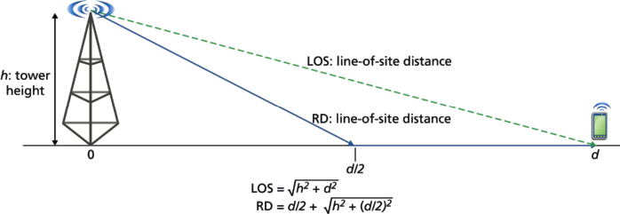

Consider the following parameters: • h = 10 m • d = 5000 m

= × •  c 10 m/sec (speed of light)

•  f = 5 GHz (rate at which pulses are being transmitted)

Compute the delay between when a pulse is sent from the antenna on the left to when it is received at the device on the right (assuming speed of light propagation delays), along the line-of-sight path, and along the single reflective path.

a.  What is the time from when a pulse is sent from the tower on the reflective path, until it is received at the device?

b.  Will pulse i on the reflective path arrive before or after pulse i + 1 on

the LOS path? Explain.

P4. Path loss: who can “hear” who? In this question, we’ll consider which nodes can “hear” other nodes that are transmitting, as a function of distance and frequency. Consider the 4-node network below, where the nodes are separated by the following distances:

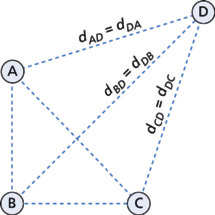

• d = d = d = d = 1 AB BA BC CB • d = d = 1.41 AC CA • d = d = d = d = 2.5 AD DA CD DC • d = d = 3.5 BD DB • f = 1 GHz

Recall that the path loss of a radio signal between two nodes varies (in 2 free space) as ~ ( fd ) Suppose that the transmitting power (the same at all nodes) is such that at frequency f , there is enough received power for a receiver to “hear” a transmitter as long as the distance d between the transmitter and the receiver is less than 3 units of distance. For this configuration, which nodes can “hear” the transmissions of which other nodes? P5. CSMA/CA. In step 4 of the CSMA/CA protocol, a station that successfully transmits a frame begins the CSMA/CA protocol for a second frame at step 2, rather than at step 3. What rationale might the designers of CSMA/CA have had in mind by having such a station not transmit the second frame immediately (if the channel is sensed idle)? P6. RTS/CTS in WiFi. Suppose an 802.11b station is configured to always reserve the channel with the RTS/CTS sequence. Suppose this station suddenly wants to transmit a 1,500 bytes of data, and all other stations are idle at this time. As a function of SIFS and DIFS, and ignoring propagation delay and assuming no bit errors, calculate the time required to transmit the frame and receive the acknowledgment.

P7. Use of ACKs in WiFi. Why are link-layer ACKs used in WiFi (802.11) networks?

a.  Hearing a receiver ACK, all other stations will stop transmitting. This reduces collisions.

b.  Because of the hidden terminal problem, a node that is transmitting and hears no collisions still doesn’t know if there was a collision at the receiver.

c.  Wireless links are noisier than wired links, and so bit level errors are more likely to occur, making link-layer error recovery more valuable than in less-noisy wired links.

d.  The sender can use the differences in the signal strength in an ACK to infer whether the receiver is moving towards, or away from, the sender.

P8. Multi-hop end-end wireless transmissions. Consider the scenario shown in the figure below, in which there are four wireless nodes, A, B, C, and D. The radio coverage of the four nodes is shown via the shaded ovals; all nodes share the same frequency. When A transmits, it can only be heard/received by B; when B transmits, both A and C can hear/ receive from B; when C transmits, both B and D can hear/receive from C;

when D transmits, only C can hear/receive from D.

Suppose now that each node has an infinite supply of messages that it wants to send to each of the other nodes. If a message’s destination is not an immediate neighbor, then the message must be relayed. For example, if A wants to send to D, a message from A must first be sent to B, which then sends the message to C, which then sends the message to D. Time is slotted, with a message transmission time taking exactly one time slot, e.g., as in slotted Aloha. During a slot, a node can do one of the following:

(i) send a message, (ii) receive a message (if exactly one message is being sent to it), and (iii) remain silent.

As always, if a node hears two or more simultaneous transmissions, a collision occurs and none of the transmitted messages are received successfully. You can assume here that there are no bit-level errors, and thus if exactly one message is sent, it will be received correctly by those within the transmission radius of the sender.

a.  Suppose now that an omniscient controller (i.e., a controller that knows the state of every node in the network) can command each node to do whatever it (the omniscient controller) wishes, that is, to send a message, to receive a message, or to remain silent. Given this omniscient controller, what is the maximum rate at which a data message can be transferred from C to A, given that there are no other messages between any other source/destination pairs?

b.  Suppose now that A sends messages to B, and D sends messages to C.

What is the combined maximum rate at which data messages can flow from A to B and from D to C?

c.  Suppose now that A sends messages to B, and C sends messages to D.

What is the combined maximum rate at which data messages can flow from A to B and from C to D?

d.  Suppose now that the wireless links are replaced by wired links.

Repeat questions (a) through (c) again in this wired scenario.

e.  Now suppose we are again in the wireless scenario, and that for every data message sent from source to destination, the destination will send and ACK message back to the source (e.g., as in TCP). Also suppose that each ACK message takes up one slot. Repeat questions (a)–(c) for this scenario.

P9. Bluetooth. Describe the format of the Bluetooth frame. You will have to do some reading outside of the text to find this information. Is there anything in the frame format that inherently limits the number of nodes in a network to eight active nodes? Explain.

P10.  Power savings in WiFi. Recall that in order to implement power savings (PS) in WiFi, WiFi beacons contain power saving information in a traffic indication map (TIM). Which of the following statements are true of power savings in WiFi.

a.  Powers savings in WiFi is controlled by the AP, which instructs the client to sleep when there are no messages to be sent from the AP to the device.

b.  Power savings in WiFi is controlled primarily by the device, which decides when to go into doze (i.e., sleep) state.

c.  Power savings in WiFi is controlled exclusively by the device, and there is no signaling/control message related to power control exchanged between the device and the AP.

d.  The WiFi AP lets the device know when it has buffered datagrams to send to the device through the use of a TIM (Traffic Indication Map) field in AP beacon frames.

e.  Similar to 4G 5G, the AP will take down the device-specific tunnel between itself and the router when the device goes to sleep.

f.  The client device sends a PS poll frame to the AP to ask the AP to send a frame that the AP may have buffered that is destined to the device.

g.  The AP sends a PS poll frame to the client device to ask the device if it has a frame to send.

P11.  Connecting at the 4G 5G Edge. Indicate the order in which each of the following steps is taken by a user device to connect to the base station in a 4G 5G network.

a.  Locate the reference signals that are embedded in every 7th slot on every third subcarrier in the OFDM subcarrier-frequency x time space.

b.  Locate the channel’s primary synchronization signal (PSS) and secondary synchronization signal (SSS), which are transmitted every 5 ms in pre-defined symbol locations in the OFDM subcarrier-frequency x time space.

c.  Locate/receive the Master Information Block (MIB), which is broadcast every 40 ms by the base station, and gives (among other pieces of information) the channel’s bandwidth.

d.  Locate/receive a System Information Block 1 (SIB1) message, which is broadcast every 80 ms by the base station and gives (among other pieces of information) the mobile country code (MCC), the mobile network code (MNC) for the carrier operating this channel, and whether the cell is open/closed for a device to join.

e.  Locate/receive the cell identifier signal, which provides the cell’s name, the mobile country code (MCC), the mobile network code (MNC) for the carrier operating this cell, and the cryptographic keys needed to perform user device authentication.

P12.  RAN Scheduling. In this question, we’ll consider the problem of RAN scheduling in a 4G 5G base station, as illustrated in the figure below.

Suppose that there are 4 user devices  UE , . . . , UE , each with a  1 4 queue of bits to be sent from the base station to that device, as shown in the top part of the figure below. In this problem, we’ll consider bits to be sent to the device rather than link-layer frames. Suppose that at this scheduling instant there are more than enough bits in each device queue to fill all 8 resource blocks to be scheduled at this scheduling time t (i.e., there is no shortage of bits to be sent!).

The table below shows the Channel Quality Indicator (CQI) values reported back from the devices, the number of bits encoded in a symbol at that CQI level, and the average throughput received per device up until time t.

As in 4G OFDMA, each Resource Block (RB) contains 84 symbols; all symbols in an RB must be destined for the same device, but different RBs may be allocated to (destined to) different devices.

Past average throughput

Reported # bits / transmitted achieved by device until

Device CQI symbol at this CQI time t -1

UE , UE 3 2 4,800 bits/scheduling time unit 1 2 UE 10 6 4,100 bits/scheduling time unit 3 UE 13 8 6,000 bits/scheduling time unit 4 a. Under Round Robin (RR) scheduling, how many RBs will be assigned to UE at this scheduling instant, t? 1 b. Under RR scheduling, how many RBs will be assigned to UE at this 3 scheduling instant, t? c. How many bits will be transmitted to UE in a single RB under RR 1 scheduling at this time instant, t? (Hint:

Recall that each RB contains 84 symbols, but that the number of bits associated with each symbol will depend on the reported CQI.) d. Under Maximum Throughput (MT) scheduling, how many RBs will be assigned to UE at this scheduling instant, t? 3 e. Under MT scheduling, how many RBs will be assigned to UE at this 4 scheduling instant, t? f. How many bits will be transmitted to UE in a single RB under MT 4 scheduling at this time instant, t? g. Under Blind Equal Throughput (BET) scheduling, how many RBs will be assigned to UE at this scheduling instant, t? 1 h. Under Blind Equal Throughput (BET) scheduling, how many RBs will be assigned to UE at this scheduling instant, t? 3 i. Under Blind Equal Throughput (BET) scheduling, how many RBs will be assigned to UE at this scheduling instant, t? 4 j. Under Proportional Fairness (PF) scheduling, how many RBs will be assigned to UE at this scheduling instant, t? 1 k. Under PF scheduling, how many RBs will be assigned to UE at this 3 scheduling instant, t? l. Under Proportional Fairness (PF) scheduling, how many RBs will be assigned to UE at this scheduling instant, t? 4 P13. Mobility duality: 4G 5G and LEOS satellite constellations. Let’s con- sider the similarities and differences between mobility in 4G 5G

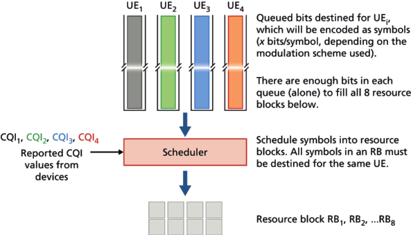

networks and mobility in LEOS satellite constellations, recalling that (i) in 4 5G, the base station is fixed, but users are mobile (ii) in LEOS networks, the infrastructure (LEO satellites) is mobile, but users are (relatively) fixed.

Which of the following statements are TRUE about these similarities/ differences:

a.  Mobility (e.g., time of association, next point of association) is more predictable in 4G 5G networks than in LEOS networks.

b.  The radio channel is more variable over time (e.g., there is more multipath) in 4G 5G.

c.  In both 4G 5G networks and LEOS networks, the infrastructure controls use of the transmission slots in both downstream (infrastructureto-user) and upstream (user-to-infrastructure) directions.

d.  In  4G 5G networks, even though there is mobility, a user’s point of attachment with the network may not change over the period of an hour.

e.  In LEOS networks, even though there is mobility, a user’s point of attachment with the network may not change over the period of an hour.

Programming Assignment: Implementing a 4G/5G RAN scheduler In this lab, you’ll program a downlink RAN schedwith an already implemented Round Robin sched-

uler that will implement the Maximum Throughput uler for this environment, so you’ll have an exam-

(MT), Blind Equal Throughput (BET), and Proporple that you can generalize from. The full lab

tional Fairness (PF) scheduling. You’ll program this assignment, as well as code you will need to com-

in a simulated environment that will, at each schedpile with your own code, are available at this book’s

uling instant, provide your scheduler with per-UE publisher’s Web site: www.pearsonhighered.com/

CQI information, and the per-UE number of newly cs-resource and mirrored on the instructors’ Web

arriving bits for transmission. You will be provided site: http://gaia.cs.umass.edu/kurose_ross.

Wireshark Labs: WiFi and 4G/5G At the Web site for this textbook, www.pearsonexchanged between a wireless laptop and an access

highered.com/cs-resources, also mirrored on the point. There is also a new Wireshark Lab that stud-

instructors’ Web site, http://gaia.cs.umass.edu/ ies the interaction between the user device and the

kurose_ross, you’ll find a Wireshark lab for this base station in a 4G 5G network and a second 5G

chapter that captures and studies the 802.11 frames Wireshark lab that studies mobility.

AN INTERVIEW WITH...

Deborah Estrin Deborah Estrin is a Professor of Computer Science and Associate Dean for Impact at Cornell Tech in New York City and a Professor of Population Health at Weill Cornell Medical College. She received her Ph.D. (1985) in Computer Science from Courtesy of Deborah Estrin M.I.T.and her B.S. (1980) from UC Berkeley. Estrin’s early research focused on the design of network protocols, including multicast and inter-domain routing.

In 2002 Estrin founded the NSF-funded Science and Technology Center at UCLA, Center for Embedded Networked Sensing (CENS http://cens.ucla.edu.). CENS launched new areas of multi-disciplinary computer systems research from sensor networks for environmental monitoring, to participatory sensing and mobile health.

As described in her 2013 TEDMED talk, she explores how individuals can benefit from the pervasive data byproducts of digital and IoT interactions for health management. Professor Estrin is an elected member of the American Academy of Arts and Sciences (2007), the National Academy of Engineering (2009), and the National Academy of Medicine (2019). She is a Fellow of the IEEE, ACM, and AAAS. She was awarded the first ACM-W Athena Lecturer (2006), the Anita Borg Institute’s Women of Vision Award for Innovation (2007), The IEEE Internet Award (2017), a MacArthur Fellowship (2018), and IEEE John von Neumann Medal (2022). She received honorary doctorates from EPFL (2008), Uppsala (2011), and Concordia (2023) Universities.

Please describe a few of the most exciting projects you have worked on during your career. What were the biggest challenges?

In the mid-90s at USC and ISI, I had the great fortune to work with the likes of Steve Deering, Mark Handley, and Van Jacobson on the design of multicast routing protocols (in particular, PIM). I tried to carry many of the architectural design lessons from multicast into the design of ecological monitoring arrays, where for the first time I really began to take applications and multidisciplinary research seriously.

The need for jointly innovating in the social and technological space is what interests me so much about my latest area of research, mobile health. The challenges in multicast routing, environmental sensing and mobile health are as diverse as the problem domains, but what they have in common is the need to keep our eyes open to whether we have the problem definition right as we iterate between design and deployment, prototype and pilot. None of these are problems that could be solved solely analytically, or with simulation or even in constructed laboratory experiments. They challenged our ability to retain clean architectures in the presence of messy problems and contexts, and they required extensive collaboration.

What changes and innovations do you see happening in wireless networks and mobility in the future?

In a prior edition of this interview I said that I have never put much faith into predicting the future, but I did go on to speculate that we might see the end of feature phones (i.e., those that are not programmable and are used only for voice and text messaging) as smart phones become more and more powerful and the primary point of Internet access for many—and now not so many years later that is clearly the case. I also predicted that we would see the continued proliferation of embedded SIMs by which all sorts of devices have the ability to communicate via the cellular network at low data rates. While that has occurred, we see many devices and “Internet of Things” that use embedded WiFi and other lower power, shorter range, forms of connectivity to local hubs. I did not anticipate at that time the emergence of a large consumer wearables market or interactive voice agents like Siri and Alexa, let alone LLM-based agents. By the time the next edition is published I expect broad proliferation of personal health applications in the form of digital therapeutics, powered by multimodal agents.

Where do you see the future of networking and the Internet?

Data, ML, and Generative AI have all emerged as the dominant forces in Computer Systems and Network design generally. Low latency needs of real time applications continue to motivate powerful edge devices. In addition, managing energy consumption and data privacy motivate novel architectures that will not necessarily emerge from commercial market forces alone. At the same time, information ecosystem has become far more monolithic than in earlier decades. This is a challenge for networking, the Internet, and frankly our society.

What people inspired you professionally?

There are three people who come to mind. First, Dave Clark, the secret sauce and undersung hero of the Internet community. I was lucky to be around in the early days to see him act as the “organizing principle” of the IAB and Internet governance; the priest of rough consensus and running code. Second, Scott Shenker, for his intellectual brilliance, integrity, and persistence. I strive for, but rarely attain, his clarity in defining problems and solutions. He is always the first person I email for advice on matters large and small. Third, my sister Judy Estrin, who had the creativity and commitment to spend the first half of her career bringing ideas and concepts to market; and now has the courage to study, write, and advise on how to rebuild it to support a healthier democracy.

What are your recommendations for students who want careers in computer science and networking?

First, build a strong foundation in your academic work, balanced with any and every real-world work experience you can get. As you look for a working environment, seek opportunities in problem areas you really care about and with smart teams that you can learn from and work with to build things that matter.

## Chapter 8: Security in Computer Networks

Way back in Section 1.6, we described some of the more prevalent and damaging classes of Internet attacks, including malware attacks, denial of service, sniffing, source masquerading, and message modification and deletion. Although we have since learned a tremendous amount about computer networks, we still haven’t examined how to secure networks from those attacks. Equipped with our newly acquired expertise in computer networking and Internet protocols, we’ll now study in-depth secure communication and, in particular, how com-


puter networks can be defended from those nasty bad guys. Let us introduce Alice and Bob, two people who want to communicate and wish to do so “securely.” This being a networking text, we should remark that Alice and Bob could be two routers that want to exchange routing tables securely, a client and server that want to establish a secure transport connection, or two e-mail applications that want to exchange secure e-mail—all case studies that we will consider later in this chapter. Alice and Bob are well-known fixtures in the security community, perhaps because their names are more fun than a generic entity named “A” that wants to communicate securely with a generic entity named “B.” Love affairs, wartime communication, and business transactions are the commonly cited human needs for secure communications; preferring the first to the latter two, we’re happy to use Alice and Bob as our sender and receiver, and imagine them in this first scenario.

We said that Alice and Bob want to communicate and wish to do so “securely,” but what precisely does this mean? As we will see, security (like love) is a many-splendored thing; that is, there are many facets to security.

Certainly, Alice and Bob would like for the contents of their communication to remain secret from an eavesdropper. They probably would also like to make sure that when they are communicating, they are indeed communicating with each other, and that if their communication is tampered with by an eavesdropper, that this tampering is detected. In the first part of this chapter, we’ll cover the fundamental cryptography techniques that allow for encrypting communication, authenticating the party with whom one is communicating, and ensuring message integrity.

In the second part of this chapter, we’ll examine how the fundamental cryptography principles can be used to create secure networking protocols.

Once again taking a top-down approach, we’ll examine secure protocols in each of the (top four) layers, beginning with the application layer. We’ll examine how to secure e-mail, how to secure a TCP connection, how to provide blanket security at the network layer, and how to secure a wireless LAN.

In the third part of this chapter we’ll consider operational security, which is about protecting organizational networks from attacks. In particular, we’ll take a careful look at how firewalls and intrusion detection systems can enhance the security of an organizational network.

#### 8.1 What Is Network Security?

Let’s begin our study of network security by returning to our lovers, Alice and Bob, who want to communicate “securely.” What precisely does this mean?

Certainly, Alice wants only Bob to be able to understand a message that she has sent, even though they are communicating over an insecure medium where an intruder (Trudy, the intruder) may intercept whatever is transmitted from Alice to Bob. Bob also wants to be sure that the message he receives from Alice was indeed sent by Alice, and Alice wants to make sure that the person with whom she is communicating is indeed Bob. Alice and Bob also want to make sure that the contents of their messages have not been altered in transit. They also want to be assured that they can communicate in the first place (i.e., that no one denies them access to the resources needed to communicate). Given these considerations, we can identify the following desirable properties of secure communication.

• Confidentiality. Only the sender and intended receiver should be able to understand the contents of the transmitted message. Because eavesdroppers may intercept the message, this necessarily requires that the message be somehow encrypted so that an intercepted message cannot be understood by an interceptor. This aspect of confidentiality is probably the most commonly perceived meaning of the term secure communication. We’ll study cryptographic techniques for encrypting and decrypting data in Section 8.2.

• Message integrity. Alice and Bob want to ensure that the content of their communication is not altered, either maliciously or by accident, in transit.

Extensions to the checksumming techniques that we encountered in reliable transport and data link protocols can be used to provide such message integrity. We will study message integrity in Section 8.3.

• End-point authentication. Both the sender and receiver should be able to confirm the identity of the other party involved in the communication—to confirm that the other party is indeed who or what they claim to be. Faceto-face human communication solves this problem easily by visual recognition. When communicating entities exchange messages over a medium where they cannot see the other party, authentication is not so simple.

When a user wants to access an inbox, how does the mail server verify that the user is the person he or she claims to be? We study end-point authentication in Section 8.4.

• Operational security. Almost all organizations (companies, universities, and so on) today have networks that are attached to the public Internet. These networks therefore can potentially be compromised. Attackers can attempt to deposit worms into the hosts in the network, obtain corporate secrets, map the internal network configurations, and launch DoS attacks. We’ll see in Section 8.9 that operational devices such as firewalls and intrusion detection systems are used to counter attacks against an organization’s network. A firewall sits between the organization’s network and the public network, controlling packet access to and from the network. An intrusion detection system performs “deep packet inspection,” alerting the network administrators about suspicious activity.

Having established what we mean by network security, let’s next consider exactly what information an intruder may have access to, and what actions can be taken by the intruder. Figure 8.1 illustrates the scenario. Alice, the sender, wants to send data to Bob, the receiver. In order to exchange data securely, while meeting the requirements of confidentiality, end-point authentication, and message integrity, Alice and Bob will exchange control messages and data messages (in much the same way that TCP senders and receivers exchange control segments and data segments). All or some of these messages will

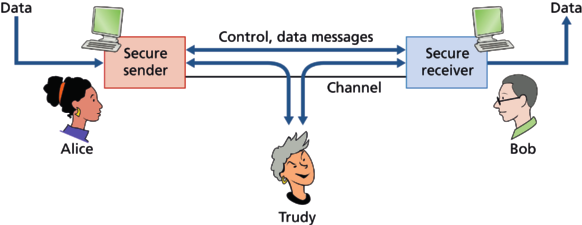

Figure 8.1 Sender, receiver, and intruder (Alice, Bob, and Trudy) typically be encrypted. As discussed in Section 1.6, an intruder can potentially perform

• eavesdropping—sniffing and recording control and data messages on the channel.

• modification, insertion, or deletion of messages or message content.

As we’ll see, unless appropriate countermeasures are taken, these capabilities allow an intruder to mount a wide variety of security attacks: snooping on communication (possibly stealing passwords and data), impersonating another entity, hijacking an ongoing session, denying service to legitimate network users by overloading system resources, and so on. A summary of such vulnerabilities is maintained at the CERT Coordination Center [CERT 2025].

Having established that there are indeed real threats loose in the Internet, what are the Internet equivalents of Alice and Bob, our friends who need to communicate securely? Certainly, Bob and Alice might be human users at two end systems, for example, a real Alice and a real Bob who really do want to exchange secure e-mail. They might also be participants in an electronic commerce transaction. For example, a real Bob might want to transfer his credit card number securely to a Web server to purchase an item online. Similarly, a real Alice might want to interact with her bank online. The parties needing secure communication might themselves also be part of the network infrastructure. Recall that the domain name system (DNS, see Section 2.4) or routing daemons that exchange routing information (see Chapter 5) require secure communication between two parties. The same is true for network management applications, a topic we examined in Chapter 5). An intruder that could actively interfere with DNS lookups (as discussed in Section 2.4), routing computations (Sections 5.3 and 5.4), or network management functions ( Sections 5.5 and 5.7) could wreak havoc in the Internet.

Having now established the framework, a few of the most important definitions, and the need for network security, let us next delve into cryptography. While the use of cryptography in providing confidentiality is self-evident, we’ll see shortly that it is also central to providing end-point authentication and message integrity—making cryptography a cornerstone of network security.

#### 8.2 Principles of Cryptography

Although cryptography has a long history dating back at least as far as Julius Caesar, modern cryptographic techniques, including many of those used in the Internet, are based on advances made in the past 30 years. Kahn’s book, The Codebreakers [Kahn 1967], and Singh’s book, The Code Book: The Science of Secrecy from Ancient Egypt to Quantum Cryptography [Singh 1999], provide a fascinating look at the long history of cryptography. A complete discussion of cryptography itself requires a complete book [Kaufman 2002; Ferguson 2010; Bishop 2018] and so we only touch on the essential aspects of cryptography, particularly as they are practiced on the Internet. We also note that while our focus in this section will be on the use of cryptography for confidentiality, we’ll see shortly that cryptographic techniques are inextricably woven into authentication, message integrity, nonrepudiation, and more.

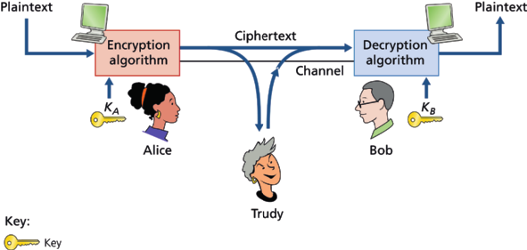

Figure 8.2 Cryptographic components

Cryptographic techniques allow a sender to disguise data so that an intruder can gain no information from the intercepted data. The receiver, of course, must be able to recover the original data from the disguised data.

Figure 8.2 illustrates some of the important terminology.

Suppose now that Alice wants to send a message to Bob. Alice’s message in

Bob, I love you. Alice its original form (e.g., “ ”) is known as plaintext, or

cleartext. Alice encrypts her plaintext message using an encryption algorithm so that the encrypted message, known as ciphertext, looks unintelligible to any intruder. Interestingly, in many modern cryptographic systems, including those used in the Internet, the encryption technique itself is known—published, standardized, and available to everyone (e.g., [RFC 1321; RFC 3447; RFC 2420; NIST 2001, 2025), even a potential intruder! Clearly, if everyone knows the method for encoding data, then there must be some secret information that prevents an intruder from decrypting the transmitted data.

This is where keys come in.

In Figure 8.2, Alice provides a key, K , a string of numbers or characters, A as input to the encryption algorithm. The encryption algorithm takes the key and the plaintext message, m, as input and produces ciphertext as output. The

notation K m refers to the ciphertext form (encrypted using the key K ) of  A A the plaintext message, m. The actual encryption algorithm that uses key K A will be evident from the context. Similarly, Bob will provide a key, K , to the B decryption algorithm that takes the ciphertext and Bob’s key as input and produces the original plaintext as output. That is, if Bob receives an encrypted message K m , he decrypts it by computing K K m = m .

In symmetric  A B A key systems, Alice’s and Bob’s keys are identical and are secret. In public key systems, a pair of keys is used. One of the keys is known to both Bob and Alice (indeed, it is known to the whole world). The other key is known only by either Bob or Alice (but not both). In the following two subsections, we consider symmetric key and public key systems in more detail.

##### 8.2.1 Symmetric Key Cryptography

All cryptographic algorithms involve substituting one thing for another, for example, taking a piece of plaintext and then computing and substituting the appropriate ciphertext to create the encrypted message. Before studying a modern key-based cryptographic system, let us first get our feet wet by studying a very old, very simple symmetric key algorithm attributed to Julius Caesar, known as the Caesar cipher (a cipher is a method for encrypting data).

For English text, the Caesar cipher would work by taking each letter in the plaintext message and substituting the letter that is k letters later (allow-

ing wraparound; that is, having the letter z followed by the letter a) in the

alphabet. For example, if k = 3, then the letter a in plaintext becomes d in

ciphertext; b in plaintext becomes e in ciphertext, and so on. Here, the value of

bob, i love k serves as the key. As an example, the plaintext message “ you. Alice ere, l oryh brx. dolfh ” becomes “ ” in ciphertext. While

the ciphertext does indeed look like gibberish, it wouldn’t take long to break the code if you knew that the Caesar cipher was being used, as there are only 25 possible key values.

An improvement on the Caesar cipher is the monoalphabetic cipher, which also substitutes one letter of the alphabet with another letter of the alphabet. However, rather than substituting according to a regular pattern (e.g., substitution with an offset of k for all letters), any letter can be substituted

for any other letter, as long as each letter has a unique substitute letter, and vice versa. The substitution rule in Figure 8.3 shows one possible rule for encoding plaintext.

bob, i love you. Alice nkn, s The plaintext message “ ” becomes “

gktc wky. Mgsbc .” Thus, as in the case of the Caesar cipher, this looks like

gibberish. A monoalphabetic cipher would also appear to be better than the Caesar cipher in that there are 26! (on the order of 10 26 ) possible pairings of let-

ters rather than 25 possible pairings. A brute-force approach of trying all 10 possible pairings would require far too much work to be a feasible way of breaking the encryption algorithm and decoding the message. However, by statistical analysis of the plaintext language, for example, knowing that the letters e and t are the most frequently occurring letters in typical English text (accounting for 13 percent and 9 percent of letter occurrences), and knowing that particular two-and three-letter occurrences of letters appear quite often together (for example, “in,” “it,” “the,” “ion,” “ing,” and so forth) make it relatively easy to break this code. If the intruder has some knowledge about the possible contents of the message, then it is even easier to break the code. For example, if Trudy the intruder is Bob’s wife and suspects Bob of having an affair with Alice, then she might suspect that the names “bob” and “alice” appear in the text. If Trudy knew for certain that those two names appeared in the ciphertext and had a copy of the example ciphertext message above, then she could immediately determine seven of the 26 letter pairings, requiring 10 fewer possibilities to be checked by a brute-force method. Indeed, if Trudy suspected Bob of having an affair, she might well expect to find some other choice words in the message as well.

Figure 8.3 A

monoalphabetic cipher

When considering how easy it might be for Trudy to break Bob and Alice’s encryption scheme, one can distinguish three different scenarios, depending on what information the intruder has.

• Ciphertext-only attack. In some cases, the intruder may have access only to the intercepted ciphertext, with no certain information about the contents of the plaintext message. We have seen how statistical analysis can help in a ciphertext-only attack on an encryption scheme.

• Known-plaintext attack. We saw above that if Trudy somehow knew for sure that “bob” and “alice” appeared in the ciphertext message, then she could have determined the (plaintext, ciphertext) pairings for the letters a,

l, i, c, e, b, and o. Trudy might also have been fortunate enough to have recorded all of the ciphertext transmissions and then found Bob’s own decrypted version of one of the transmissions scribbled on a piece of paper. When an intruder knows some of the (plaintext, ciphertext) pairings, we refer to this as a known-plaintext attack on the encryption scheme.

• Chosen-plaintext attack. In a chosen-plaintext attack, the intruder is able to choose the plaintext message and obtain its corresponding ciphertext form. For the simple encryption algorithms we’ve seen so far, if Trudy

The quick brown fox jumps could get Alice to send the message, “ over the lazy dog ,” she could completely break the encryption

scheme. We’ll see shortly that for more sophisticated encryption techniques, a chosen-plaintext attack does not necessarily mean that the encryption technique can be broken.

Five hundred years ago, techniques improving on monoalphabetic encryption, known as polyalphabetic encryption, were invented. The idea behind polyalphabetic encryption is to use multiple monoalphabetic ciphers, with a specific monoalphabetic cipher to encode a letter in a specific position in the plaintext message. Thus, the same letter, appearing in different positions in the plaintext message, might be encoded differently. An example of a polyalphabetic encryption scheme is shown in Figure 8.4. It has two Caesar ciphers (with k = 5 and k = 19), shown as rows. We might choose to use these two

Caesar ciphers, C and C , in the repeating pattern C , C , C , C , C . That is, 1 2 1 2 2 1 2 the first letter of plaintext is to be encoded using C , the second and third using 1 C , the fourth using C , and the fifth using C . The pattern then repeats, with 2 1 2 the sixth letter being encoded using C , the seventh with C , and so on. The 1 2 bob, i love you ghu, n etox plaintext message “ .” is thus encrypted “

dhz .” Note that the first b in the plaintext message is encrypted using C , while 1 the second b is encrypted using C . In this example, the encryption and decryp- 2 tion “key” is the knowledge of the two Caesar keys k = 5, k = 19  and the 

pattern C , C , C , C , C . 1 2 2 1 2

Figure 8.4 A polyalphabetic cipher using two Caesar ciphers

Block Ciphers Let us now move forward to modern times and examine how symmetric key encryption is done today. We focus on block ciphers, which are used in many secure Internet protocols, including PGP (for secure e-mail), TLS (for securing TCP connections), and IPsec (for securing the network-layer transport).

In a block cipher, the message to be encrypted is processed in blocks of k bits. For example, if k = 64, then the message is broken into 64-bit blocks,

and each block is encrypted independently. To encode a block, the cipher uses a one-to-one mapping to map the k-bit block of cleartext to a k-bit block of cipher-

text. Let’s look at an example. Suppose that k = 3, so that the block cipher maps

3-bit inputs (cleartext) to 3-bit outputs (ciphertext).One possible mapping is given in Table 8.1.Notice that this is a one-to-one mapping; that is, there is a different output for each input.

This block cipher breaks the message up into 3-bit blocks and encrypts each block according to the above mapping. You should verify that the message 010110001111 gets encrypted into 101000111001.

Continuing with this 3-bit block example, note that the mapping in Table 8.1 is just one mapping of many possible mappings. How many possible mappings are there? To answer this question, observe that a mapping is nothing more than a permutation of all the possible inputs. There are 2 3 = 

possible inputs (listed under the input columns). These eight inputs can be permuted in 8! = 40,320 different ways. Since each of these permutations

specifies a mapping, there are 40,320 possible mappings. We can view each of these mappings as a key—if Alice and Bob both know the mapping (the key), they can encrypt and decrypt the messages sent between them.

The brute-force attack for this cipher is to try to decrypt ciphtertext by using all mappings. With only 40,320 mappings (when k = 3), this can quickly

be accomplished on a desktop PC.To thwart brute-force attacks, block ciphers typically use much larger blocks, consisting of k = 64 bits or even larger.

Note

that the number of possible mappings for a general k-block cipher is 2 k !, which

is astronomical for even moderate values of k (such as k = 64).

Although full-table block ciphers, as just described, with moderate values of k  can produce robust symmetric key encryption schemes, they are unfortunately difficult to implement. For k = 64 and for a given mapping,

Alice and Bob would need to maintain a table with 2 64 input values, which is

an infeasible task. Moreover, if Alice and Bob were to change keys, they would have to each regenerate the table. Thus, a full-table block cipher, providing predetermined mappings between all inputs and outputs (as in the example above), is simply out of the question.

Table 8.1 A specific 3-bit block cipher input output input output

000 110 100 011

001 111 101 010

010 101 110 000

011 100 111 001

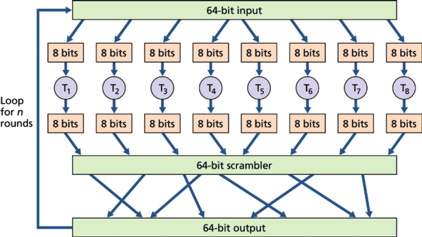

Figure 8.5 An example of a block cipher

Instead, block ciphers typically use functions that simulate randomly permuted tables. An example (adapted from [Kaufman 2002]) of such a function for k = 64 bits is shown in Figure 8.5.The function first breaks a 64-bit block into 8 chunks, with each chunk consisting of 8 bits. Each 8-bit chunk is processed by an 8-bit to 8-bit table, which is of manageable size. For example, the first chunk is processed by the table denoted by T .Next, the 8 output chunks 1 are reassembled into a 64-bit block. The positions of the 64 bits in the block are then scrambled (permuted) to produce a 64-bit output.

This output is fed back to the 64-bit input, where another cycle begins. After n such cycles, the function provides a 64-bit block of ciphertext. The purpose of the rounds is to make each input bit affect most (if not all) of the final output bits. (If only one round were used, a given input bit would affect only 8 of the 64 output bits.) The key for this block cipher algorithm would be the eight permutation tables (assuming the scramble function is publicly known).

Today there are a number of popular block ciphers, including DES (standing for Data Encryption Standard), 3 DES, and AES (standing for Advanced Encryption Standard). Each of these standards uses functions, rather than predetermined tables, along the lines of Figure 8.5 (albeit more complicated and specific to each cipher). Each of these algorithms also uses a string of bits for a key. For example, DES uses 64-bit blocks with a 56-bit key. AES uses 128-bit blocks and can operate with keys that are 128, 192, and 256 bits long. An algorithm’s key determines the specific “mini-table” mappings and permutations within the algorithm’s internals. The brute-force attack for each of these ciphers is to cycle through all the keys, applying the decryption algorithm with each key. Observe that with a key length of n, there are 2 possible keys. NIST [NIST n

2001] estimates that a machine that could crack 56-bit DES in one second (that is, try all 2 keys in one second) would take approximately 149 trillion years 56 to crack a 128-bit AES key.

Cipher-Block Chaining In computer networking applications, we typically need to encrypt long messages or long streams of data. If we apply a block cipher as described by simply chopping up the message into k-bit blocks and independently encrypting each block, a subtle but important problem occurs. To see this, observe that two or more of the cleartext blocks can be identical. For example, the cleartext in two or more blocks could be “HTTP 1.1”. For these identical blocks, a block cipher would, of course, produce the same ciphertext. An attacker could potentially guess the cleartext when it sees identical ciphertext blocks and may even be able to decrypt the entire message by identifying identical ciphtertext blocks and using knowledge about the underlying protocol structure [Kaufman 2002].

To address this problem, we can mix some randomness into the ciphertext so that identical plaintext blocks produce different ciphertext blocks. To explain this idea, let m i  denote the ith plaintext block, c i  denote the ith  

⊕ ciphertext block, and a b denote the exclusive-or (XOR) of two bit strings, a ⊕ = ⊕ = ⊕ = ⊕ = and b. (Recall that the 0 0 1 1 0 and 0 1 1 0 1, and the

XOR of two bit strings is done on a bit-by-bit basis. So, for example, ⊕ = 10101010 11110000 01011010.) Also, denote the block-cipher encryp-

tion algorithm with key S as K . The basic idea is as follows. The sender S creates a random k-bit number r i  for the ith block and calculates 

= ⊕ c i K m i r i .

Note that a new k-bit random number is chosen for  (  ) S each block. The sender then sends c 1 , r 1 , c 2 , r 2 , c 3 , r 3 , and so on.  

Since the receiver receives c i  and r i , it can recover each block of the plain-  = ⊕ text by computing m i K c i r i . It is important to note that,  (  )  S although r i  is sent in the clear and thus can be sniffed by Trudy, she cannot  obtain the plaintext m i , since she does not know the key K . Also note that if  S two plaintext blocks m i  and m j  are the same, the corresponding ciphertext  

blocks c i  and c j  will be different (as long as the random numbers  r i  and  

r j  are different, which occurs with very high probability).  As an example, consider the 3-bit block cipher in Table 8.1. Suppose the plaintext is 010010010. If Alice encrypts this directly, without including the randomness, the resulting ciphertext becomes 101101101. If Trudy sniffs this ciphertext, because each of the three cipher blocks is the same, she can correctly surmise that each of the three plaintext blocks are the same. Now

= = suppose instead Alice generates the random blocks r 1 001, r 2 111,  

= and r 3 100 and uses the above technique to generate the ciphertext  = = = c 1 100, c 2 010, and c 3 000.

Note that the three ciphertext blocks  

are different even though the plaintext blocks are the same. Alice then sends c 1 , r 1 , c 2 , and r 2 . You should verify that Bob can obtain the original  

plaintext using the shared key K . S The astute reader will note that introducing randomness solves one problem but creates another: namely, Alice must transmit twice as many bits as before. Indeed, for each cipher bit, she must now also send a random bit, doubling the required bandwidth. In order to have our cake and eat it too, block ciphers typically use a technique called Cipher Block Chaining (CBC). The basic idea is to send only one random value along with the very first message, and then have the sender and receiver use the computed coded blocks in place of the subsequent random number. Specifically, CBC operates as follows:

1.  Before encrypting the message (or the stream of data), the sender generates a random k-bit string, called the Initialization Vector (IV). Denote this initialization vector by c 0 . The sender sends the IV to the receiver in 

cleartext.

2.  For the first block, the sender calculates ⊕ 0 , that is, calculates the  

exclusive-or of the first block of cleartext with the IV. It then runs the result through the block-cipher algorithm to get the corresponding ciphertext block; that is, c 1 = K m 1 ⊕ c 0 . The sender sends the encrypted  (  ) S block c 1  to the receiver. 

3.  For the ith block, the sender generates the ith ciphertext block from = ⊕ − c i K m i c i 1 .  (  ) S Let’s now examine some of the consequences of this approach. First, the receiver will still be able to recover the original message. Indeed, when the

= ⊕ − receiver receives c(i), it decrypts it with K to obtain s i m i c i 1 ;  S − since the receiver also knows c i 1 , it then obtains the cleartext block from 

= ⊕ − m i s i c i 1 . Second, even if two cleartext blocks are identical, the  

corresponding ciphtertexts (almost always) will be different. Third, although the sender sends the IV in the clear, an intruder will still not be able to decrypt the ciphertext blocks, since the intruder does not know the secret key, S. Finally, the

sender only sends one overhead block (the IV), thereby negligibly increasing the bandwidth usage for long messages (consisting of hundreds of blocks).

As an example, let’s now determine the ciphertext for the 3-bit

= = block cipher in Table 8.1 with plaintext 010010010 and IV c 0 001. 

= ⊕ = The sender first uses the IV to calculate c 1 K m 1 c 0 100 . The  (  ) S = ⊕ = ⊕ = sender then calculates c 2 K m 2 c 1 K 010 100 000 ,  (  )  S S = ⊕ = ⊕ = and c 3 K m 3 c 2 K 010 000 101 . The reader should  (  )  S S verify that the receiver, knowing the IV and K can recover the original S plaintext.

CBC has an important consequence when designing secure network protocols: we’ll need to provide a mechanism within the protocol to distribute the IV from sender to receiver. We’ll see how this is done for several protocols later in this chapter.

##### 8.2.2 Public Key Cryptography

For more than 2,000 years (since the time of the Caesar cipher and up to the 1970s), encrypted communication required that the two communicating parties share a common secret—the symmetric key used for encryption and decryption. One difficulty with this approach is that the two parties must somehow agree on the shared key; but to do so in itself requires secure communication. Perhaps the parties could first meet and agree on the key in person (for example, two of Caesar’s centurions might meet at the Roman baths) and thereafter communicate with encryption.

In a networked world, however, communicating parties may never meet and may never converse except over the network.

Is it possible for two parties to communicate with encryption without having a shared secret key that is known in advance? In 1976, Diffie and Hellman [Diffie 1976] demonstrated an algorithm (known now as Diffie-Hellman Key

Exchange) to do just that—a radically different and marvelously elegant approach toward secure communication that has led to the development of today’s public key cryptography systems. We’ll see shortly that public key cryptography systems also have several wonderful properties that make them useful not only for encryption, but for authentication and digital signatures as well. Interestingly, it has come to light that ideas similar to those in [Diffie 1976] and [RSA 1978] had been independently developed in the early 1970s in a series of secret reports by researchers at the Communications-Electronics Security Group in the United Kingdom [Ellis 1987]. As is often the case, great ideas can spring up independently in many places; fortunately, public key advances took place not only in private, but also in the public view, as well.

The use of public key cryptography is conceptually quite simple. Suppose Alice wants to communicate with Bob. As shown in Figure 8.6, rather than Bob and Alice sharing a single secret key (as in the case of symmetric key systems), Bob (the recipient of Alice’s messages) instead has two keys—a public key that is available to everyone in the world (including Trudy the intruder) and a

+ private key that is known only to Bob. We will use the notation K and K − to B B refer to Bob’s public and private keys, respectively. In order to communicate with Bob, Alice first fetches Bob’s public key. Alice then encrypts her message, m, to Bob using Bob’s public key and a known (for example, standardized)

+ encryption algorithm; that is, Alice computes K m . Bob receives Alice’s  B encrypted message and uses his private key and a known (for example, standardized) decryption algorithm to decrypt Alice’s encrypted message. That is,

+ Bob computes K − ( K m ) . We will see below that there are encryption/  B B decryption algorithms and techniques for choosing public and private keys

+ + such that K − ( K m ) = m ; that is, applying Bob’s public key, K , to a mes-  B B B + sage,  m (to get K m ), and then applying Bob’s private key, K − , to the  B B + encrypted version of m (that is, computing K − ( K m ) ) gives back m.

This is a  B B remarkable result! In this manner, Alice can use Bob’s publicly available key to send a secret message to Bob without either of them having to distribute any secret keys! We will see shortly that we can interchange the public key and private key encryption and get the same remarkable result—that is, K K − + m = K + K m − = m .  B B B B Although public-key cryptography is appealing, one concern immediately springs to mind. Since Bob’s encryption key is public, anyone can send

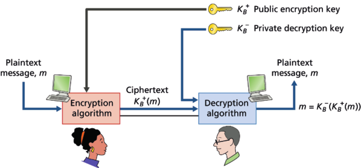

Figure 8.6 Public key cryptography

an encrypted message to Bob, including Alice or someone pretending to be Alice. In the case of a single shared secret key, the fact that the sender knows the secret key implicitly identifies the sender to the receiver. In the case of public key cryptography, however, this is no longer the case since anyone can send an encrypted message to Bob using Bob’s publicly available key. A digital signature, a topic we will study in Section 8.3, is needed to bind a sender to a message.

RSA While there may be many algorithms that address these concerns, the RSA algorithm (named after its founders, Ron Rivest, Adi Shamir, and Leonard Adleman) has become almost synonymous with public key cryptography.

Let’s first see how RSA works and then examine why it works.

RSA makes extensive use of arithmetic operations using modulon arith-

metic. So let’s briefly review modular arithmetic. Recall that x mod n simply

means the remainder of x when divided by n; so, for example, 19 mod 5 = 4.

In modular arithmetic, one performs the usual operations of addition, multiplication, and exponentiation. However, the result of each operation is replaced by the integer remainder that is left when the result is divided by n. Adding

and multiplying with modular arithmetic is facilitated with the following handy facts:

a mod n + b mod n mod n = a + b mod n [  ] 

a mod n − b mod n mod n = a − b mod n [  ] 

a mod n i b mod n mod n = a b i mod n [  ]  d It follows from the third fact that a mod n mod n = a mod n, which is d 

an identity that we will soon find very useful.

Now suppose that Alice wants to send to Bob an RSA-encrypted message, as shown in Figure 8.6. In our discussion of RSA, let’s always keep in mind that a message is nothing but a bit pattern, and every bit pattern can be uniquely represented by an integer number (along with the length of the bit pattern). For example, suppose a mesasage is the bit pattern 1001; this message can be represented by the decimal integer 9. Thus, when encrypting a message with RSA, it is equivalent to encrypting the unique integer number that represents the message.

There are two interrelated components of RSA:

• The choice of the public key and the private key

• The encryption and decryption algorithm To generate the public and private RSA keys, Bob performs the following steps:

1.  Choose two large prime numbers, p and q. How large should p and q be?

The larger the values, the more difficult it is to break RSA, but the longer it takes to perform the encoding and decoding. RSA Laboratories recommends that the product of p and q be on the order of 1,024 bits. For a dis-

cussion of how to find large prime numbers, see [Prime 2025].

2.  Compute = = − − n pq and z ( p )( q 1 . )

3.  Choose a number, e, less than n, that has no common factors (other than 1) with z. (In this case, e and z are said to be relatively prime.) The letter e is used since this value will be used in encryption.

4.  Find a number, d, such that − ed 1 is exactly divisible (that is, with no

remainder) by z. The letter d is used because this value will be used in

decryption. Put another way, given e, we choose d such that ed mod z = 1

5.  The public key that Bob makes available to the world, K + , is the pair of B numbers ( n, e); his private key, K , is the pair of numbers (n, d). − B

The encryption by Alice and the decryption by Bob are done as follows:

• Suppose Alice wants to send Bob a bit pattern represented by the integer number m (with m < n). To encode, Alice performs the exponentiation m , e

and then computes the integer remainder when m is divided by n. In e

other words, the encrypted value, c, of Alice’s plaintext message, m, is c = m mod n e

• The bit pattern corresponding to this ciphertext c is sent to Bob.

• To decrypt the received ciphertext message, c, Bob computes

m = c d mod n

which requires the use of his private key n d , . 

As a simple example of RSA, suppose Bob chooses p = 5 and q = 7.

(Admittedly, these values are far too small to be secure.) Then n = 35 and

z = 24. Bob chooses e = 5, since 5 and 24 have no common factors. Finally,

Bob chooses d = 29, since 5 29 i − 1 (that is, ed − 1) is exactly divisible by 24.

Bob makes the two values, n = 35 and e = 5, public and keeps the value

d = 29 secret. Observing these two public values, suppose Alice now wants to send the letters l, o,  v, and e to Bob. Interpreting each letter as a number

between 1 and 26 (with a being 1, and z being 26), Alice and Bob perform the encryption and decryption shown in Tables 8.2 and 8.3, respectively. Note that in this example, we consider each of the four letters as a distinct message. A more realistic example would be to convert the four letters into their 8-bit

Table 8.2 Alice’s RSA encryption, e = 5, n = 35

Plaintext m : numeric Ciphertext c = m e Letter representation m mod n e

l 12 248832 17

o 15 759375 15

v 22 5153632 22

e 5 3125 10

Table 8.3 Bob’s RSA decryption, = 29, n = 35

Ciphertext = mod n Plaintext Letter

17 4819685721067509150915091411825223071697 12

o 15 127834039403948858939111232757568359375 15

22 851643319086537701956194499721106030592 22

e 10 1000000000000000000000000000000 5

ASCII representations and then encrypt the integer corresponding to the resulting 32-bit bit pattern. (Such a realistic example generates numbers that are much too long to print in a textbook!) Given that the “toy” example in Tables 8.2 and 8.3 has already produced some extremely large numbers, and given that we saw earlier that p and q

should each be several hundred bits long, several practical issues regarding RSA come to mind. How does one choose large prime numbers? How does one then choose e and d? How does one perform exponentiation with large

numbers? A discussion of these important issues is beyond the scope of this book; see [Kaufman 2002] and the references therein for details.

Session Keys We note here that the exponentiation required by RSA is a rather time-consuming process. As a result, RSA is often used in practice in combination with symmetric key cryptography. For example, if Alice wants to send Bob a large amount of encrypted data, she could do the following. First Alice chooses a key that will be used to encode the data itself; this key is referred to as a  session key, and is denoted by K . Alice must inform Bob of the session key, since this S is the shared symmetric key they will use with a symmetric key cipher (e.g., with DES or AES). Alice encrypts the session key using Bob’s public key, that

e is, computes c = K mod n. Bob receives the RSA-encrypted session key, c,  S and decrypts it to obtain the session key, K . Bob now knows the session key S that Alice will use for her encrypted data transfer.

Why Does RSA Work?

RSA encryption/decryption appears rather magical. Why should it be that by applying the encryption algorithm and then the decryption algorithm, one recovers the original message? In order to understand why RSA works, again denote = n pq, where p and q are the large prime numbers used in the RSA algorithm.

Recall that, under RSA encryption, a message (uniquely represented by an integer), m, is exponentiated to the power e using modulo-n arithmetic, that is,

c = m e mod n

Decryption is performed by raising this value to the power d, again using modulo-n arithmetic. The result of an encryption step followed by a decryp-

d tion step is thus m e mod n mod n. Let’s now see what we can say about this 

quantity. As mentioned earlier, one important property of modulo arithmetic is

= = a mod n mod n a mod n for any values a n ,  , and d. Thus, using a e  in this property, we have

m e mod n mod n = m ed mod n 

It therefore remains to show that m ed mod n = m. Although we’re trying

to remove some of the magic about why RSA works, to establish this, we’ll need to use a rather magical result from number theory here. Specifically, we’ll need the result that says if p and q are prime, n = pq, and z = ( p − 1 )( q − 1 , )

then x y mod n is the same as x y mod z mod n [Kaufman 2002]. Applying this 

result with x = m and y = ed we have m ed mod n = m ed mod z mod n 

But remember that we have chosen e and d such that ed mod z = 1.

This gives us

m mod n = m mod n = m ed 1

which is exactly the result we are looking for! By first exponentiating to the power of e (that is, encrypting) and then exponentiating to the power of d (that is, decrypting), we obtain the original value, m. Even more wonderful is the fact

that if we first exponentiate to the power of d and then exponentiate to the

power of e—that is, we reverse the order of encryption and decryption, performing the decryption operation first and then applying the encryption operation—we also obtain the original value, m. This wonderful result follows

immediately from the modular arithmetic:

e d m mod n mod n = m mod n = m mod n = m mod n mod n ( d ) de ed ( e )

More recently, Elliptic Curve Cryptography (ECC) has emerged as an alternative to RSA for use in public key cryptography. The advantages of each of are discussed in [Gupta 2002; VMware 2025]. The security of RSA relies on the fact that there are no known algorithms for quickly factoring a number, in this case the public value n, into the primes p and q. If one knew p and q, then given the

public value e, one could easily compute the secret key, d. On the other hand, it is not known whether or not there exist fast algorithms for factoring a number, and in this sense, the security of RSA is not guaranteed. The security of ECC relies on the difficulty of solving a similarly hard problem. With recent advances in quantum computing, and published fast factoring algorithms for quantum computers, there are concerns that RSA may not be secure forever [MIT TR 2019; RSA 2024].

Although the practical realization of these algorithms still appears to be far in the future, concerns about modern cryptography in a post-quantum world have been serious enough that the US National Institute of Standards and Technology has solicited, evaluated, and the proposed three draft standards for quantumresistant public-key cryptographic algorithms [NIST 2025].

Using Public Key Cryptography to Agree on a Shared Key In the following sections, we’ll see how public key cryptography can be used not only to provide encryption services, but also to provide message integrity, digital signatures, and authentication. It can also be used to derive a symmetric cryptographic key—a shared secret—for two communicating entities that have never interacted before, and so have not been able to choose any shared secrets in advance. This is useful in client-server applications where the client and server want to encrypt their interactions with a shared symmetric key.

The approach for doing this is known as the Diffie-Hellman (DH) key agreement protocol, named after its inventors: Whitfield Diffie and Martin Hellman. We’ll see in Section 8.6 that DH is a central component in the Transport Layer Security (TLS) protocol that is used to secure Internet transport-layer communication.

The DH protocol makes use of a large prime number p and another large

number g less than p. Either Bob or Alice choose p and g and make the values of p and g public, so that they are known by each other (as well as by any attackers!). Alice and Bob then independently choose private values, SA and SB respectively. The recommended length of p, SA, and SB, is 2,048 bits or more. Alice computes her public key, K + , by raising g to the power SA and A then taking mod p K + = g SA mod p A

Bob similarly computes his own public key K : + B

K + = g SA mod p B

The security of DH depends on the fact that given K , g and p, it is extremely + A hard to determine the value of SA in the equation above (similarly for determining SB). Indeed, it is just as hard to determine the values of SA and SB as it is to factor the public value n in RSA, into the RSA primes p and q.

Now let’s see how Alice and Bob compute a common shared secret, without ever explicitly exchanging this shared secret. Alice computes the shared secret by taking Bob’s public key, K , which is known to everyone, and raising + B it to the power of her secret key, SA modulo p:

SA Alice’s computed shared secret = ( K ) mod p + B

Similarly, Bob computes:

SA  Bob’s computed shared secret = K mod p + A

Let’s now verify that Bob and Alice do indeed compute the same shared secret.

We’ll need just a bit of facility with modular arithmetic here. Alice’s computed

SA SA shared key is ( K + ) mod p = ( g SB mod p ) mod p, where we have used B SA the definition of K . And by the rules of modular arithmetic, ( g SB mod p ) + B mod p = g SB SA * mod p = g SA SB * mod p . Similarly, Bob’s computed shared

BA SB  key is K mod p = ( g SA mod p ) mod p = g SA SB * mod p .  which is + A exactly the same as Alice’s computed shared key!

#### 8.3 Message Integrity and Digital Signatures

In the previous section, we saw how encryption can be used to provide confidentiality to two communicating entities. In this section, we turn to the equally important cryptography topic of providing message integrity (also known as message authentication). Along with message integrity, we will discuss two related topics in this section: digital signatures and end-point authentication.

We define the message integrity problem using, once again, Alice and Bob.

Suppose Bob receives a message (which may be encrypted or may be in plaintext) and he believes this message was sent by Alice. To authenticate this message, Bob needs to verify:

1.  The message indeed originated from Alice.

2.  The message was not tampered with on its way to Bob.

We’ll see in Sections 8.4 through 8.7 that this problem of message integrity is a critical concern in just about all secure networking protocols.

As a specific example, consider a computer network using a link-state routing algorithm (such as OSPF) for determining routes between each pair of routers in the network (see Chapter 5).

In a link-state algorithm, each router needs to broadcast a link-state message to all other routers in the network. A router’s link-state message includes a list of its directly connected neighbors and the direct costs to these neighbors. Once a router receives link-state messages from all of the other routers, it can create a complete map of the network, run its least-cost routing algorithm, and configure its forwarding table. One relatively easy attack on the routing algorithm is for Trudy to distribute bogus link-state messages with incorrect link-state information. Thus, the need for message integrity—when router B receives a link-state message from router A, router B should verify that router A actually created the message and, further, that no one tampered with the message in transit.

In this section, we describe a popular message integrity technique that is used by many secure networking protocols. But before doing so, we need to cover another important topic in cryptography—cryptographic hash functions.

##### 8.3.1 Cryptographic Hash Functions

As shown in Figure 8.7, a hash function takes an input, m, and computes a fixed-size string H m  known as a hash. The Internet checksum (Chapter 3) 

and CRCs (Chapter 6) meet this definition. A cryptographic hash function is required to have the following additional property:

•  It is computationally infeasible to find any two different messages x and y

such that H x = H y .  Informally, this property means that it is computationally infeasible for an intruder to substitute one message for another message that is protected by the hash function. That is, if m H m , are the message and the hash of the mes- (  )

sage created by the sender, then an intruder cannot forge the contents of another message, y, that has the same hash value as the original message.

Let’s convince ourselves that a simple checksum, such as the Internet checksum, would make a poor cryptographic hash function. Rather than performing  1s complement arithmetic (as in the Internet checksum), let us compute a checksum by treating each character as a byte and adding the bytes

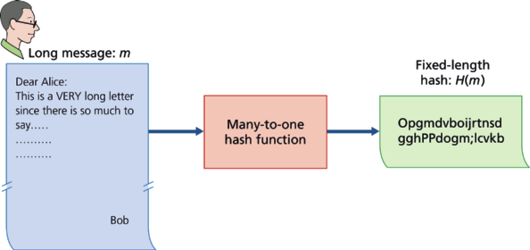

Figure 8.7 Hash functions

together using 4-byte chunks at a time. Suppose Bob owes Alice $100.99 and

IOU100.99BOB sends an IOU to Alice consisting of the text string “ .” The

49,4F,55, ASCII representation (in hexadecimal notation) for these letters is

31,30,30,2E,39,39,42,4F,42 .

Figure 8.8 (top) shows that the 4-byte checksum for this message is B2 C1 D2 AC. A slightly different message (and a much more costly one for

IOU100.99BOB Bob) is shown in the bottom half of Figure 8.8. The messages “ ”

IOU900.19BOB and “ ” have the same checksum. Thus, this simple checksum

algorithm violates the requirement above. Given the original data, it is simple to find another set of data with the same checksum. Clearly, for security purposes, we are going to need a more powerful hash function than a checksum.

The MD5 hash algorithm of Ron Rivest [RFC 1321] is in wide use today. It computes a 128-bit  hash in a four-step process consisting of a padding step (adding a one followed by enough zeros so that the length of the message satisfies certain conditions), an append step (appending a 64-bit representation of the message length before padding), an initialization of an accumulator, and a final looping step in which the message’s 16-word blocks are processed (mangled) in four rounds. For a description of MD5 (including a C source code implementation) see [RFC 1321].

The second major hash algorithm in use today is the Secure Hash Algorithm (SHA-1) [FIPS 1995]. This algorithm is based on principles similar to

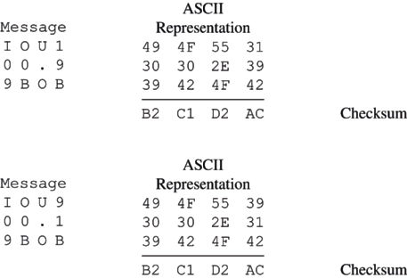

Figure 8.8 Initial message and fraudulent message have the same checksum!

those used in the design of MD4 [RFC 1320], the predecessor to MD5. SHA-1, a US federal standard, is required for use whenever a cryptographic hash algorithm is needed for federal applications. It produces a 160-bit message digest.

The longer output length makes SHA-1 more secure.

##### 8.3.2 Message Authentication Code

Let’s now return to the problem of message integrity. Now that we understand hash functions, let’s take a first stab at how we might perform message integrity:

1.  Alice creates message m and calculates the hash H m  (for example, with 

SHA-1).

2.  Alice then appends H m  to the message m, creating an extended message 

m H m , , and sends the extended message to Bob. (  )

3.  Bob receives an extended message m h , and calculates H m . If  

= H m h, Bob concludes that everything is fine. 

′ This approach is obviously flawed. Trudy can create a bogus message

′ ′ ′  (  ) in which she says she is Alice, calculate H m , and send Bob m H m , .

When Bob receives the message, everything checks out in step 3, so Bob doesn’t suspect any funny business.

To perform message integrity, in addition to using cryptographic hash functions, Alice and Bob will need a shared secret s. This shared secret, which

is nothing more than a string of bits, is called the authentication key. Using this shared secret, message integrity can be performed as follows:

1.  Alice creates message m, concatenates s with m to create + m s, and calcu-

+ + lates the hash H m s  (for example, with SHA-1). H m s  is called  

the message authentication code (MAC).

2.  Alice then appends the MAC to the message m, creating an extended message m H m , + s , and sends the extended message to Bob. (  )

3.  Bob receives an extended message m h , and knowing s, calculates the 

+ + = MAC H m s . If H m s h, Bob concludes that everything is fine.  

A summary of the procedure is shown in Figure 8.9. Readers should note that the MAC here (standing for “message authentication code”) is not the same MAC used in link-layer protocols (standing for “medium access control”)!

One nice feature of a MAC is that it does not require an encryption algorithm. Indeed, in many applications, including the link-state routing algorithm described earlier, communicating entities are only concerned with message integrity and are not concerned with message confidentiality. Using a MAC, the entities can authenticate the messages they send to each other without having to integrate complex encryption algorithms into the integrity process.

As you might expect, a number of different standards for MACs have been proposed over the years. The most popular standard today is HMAC, which can be used either with MD5 or SHA-1. HMAC actually runs data and the authentication key through the hash function twice [Kaufman 2002; RFC 2104].

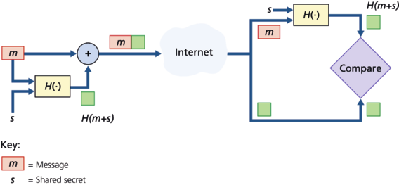

Figure 8.9 Message authentication code (MAC)

There still remains an important issue. How do we distribute the shared authentication key to the communicating entities? For example, in the linkstate routing algorithm, we would somehow need to distribute the secret authentication key to each of the routers in the autonomous system. (Note that the routers can all use the same authentication key.) A network administrator could actually accomplish this by physically visiting each of the routers. Or, if the network administrator is a lazy guy, and if each router has its own public key, the network administrator could distribute the authentication key to any one of the routers by encrypting it with the router’s public key and then sending the encrypted key over the network to the router.

##### 8.3.3 Digital Signatures

Think of the number of the times you’ve signed your name to a piece of paper during the last week. You sign checks, credit card receipts, legal documents, and letters. Your signature attests to the fact that you (as opposed to someone else) have acknowledged and/or agreed with the document’s contents.

In a digital world, one often wants to indicate the owner or creator of a document, or to signify one’s agreement with a document’s content. A digital signature is a cryptographic technique for achieving these goals in a digital world.

Just as with handwritten signatures, digital signing should be done in a way that is verifiable and nonforgeable. That is, it must be possible to prove that a document signed by an individual was indeed signed by that individual (the signature must be verifiable) and that only that individual could have signed the document (the signature cannot be forged).

Let’s now consider how we might design a digital signature scheme.

Observe that when Bob signs a message, Bob must put something on the message that is unique to him. Bob could consider attaching a MAC for the signature, where the MAC is created by appending his key (unique to him) to the message, and then taking the hash.

But for Alice to verify the signature, she must also have a copy of the key, in which case the key would not be unique to Bob. Thus, MACs are not going to get the job done here.

Recall that with public-key cryptography, Bob has both a public and private key, with both of these keys being unique to Bob. Thus, public-key cryptography is an excellent candidate for providing digital signatures. Let us now examine how it is done.

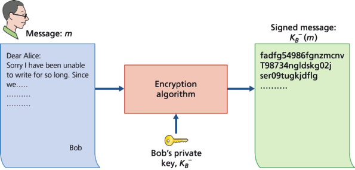

Figure 8.10 Creating a digital signature for a document

Suppose that Bob wants to digitally sign a document, m. We can think of the document as a file or a message that Bob is going to sign and send. As shown in Figure 8.10, to sign this document, Bob simply uses his private key, K , to compute K m . At first, it might seem odd that Bob is using his private − −  B B key (which, as we saw in Section 8.2, was used to decrypt a message that had been encrypted with his public key) to sign a document. But recall that encryption and decryption are nothing more than mathematical operations (exponentiation to the power of e or d in RSA; see Section 8.2) and recall that

Bob’s goal is not to scramble or obscure the contents of the document, but rather to sign the document in a manner that is verifiable and nonforgeable.

Bob’s digital signature of the document is K m . −  B Does the digital signature K m meet our requirements of being verifi- −  B able and nonforgeable? Suppose Alice has m and K m . She wants to prove in −  B court (being litigious) that Bob had indeed signed the document and was the only person who could have possibly signed the document. Alice takes Bob’s public key, K + , and applies it to the digital signature, K m , associated with −  B B the document, m. That is, she computes K + K m , and voilà, with a dra- ( − )  B B matic flurry, she produces m, which exactly matches the original document!

Alice then argues that only Bob could have signed the document, for the following reasons:

• Whoever signed the message must have used the private key, K , in com- − B puting the signature K m , such that K + K m = m . − ( − )  B B B

• The only person who could have known the private key, K − , is Bob. Recall B + from our discussion of RSA in Section 8.2 that knowing the public key, K , B is of no help in learning the private key, K − . Therefore, the only person B who could know K − is the person who generated the pair of keys, B + ( K , K − ) , in the first place, Bob. (Note that this assumes, though, that Bob B B has not given K − to anyone, nor has anyone stolen K − from Bob.) B B

It is also important to note that if the original document, m, is ever modi-

′ fied to some alternate form, m , the signature that Bob created for m will not be

′ ′ + valid for m , since K K m − does not equal m . Thus, we see that digital sig-  B B natures also provide message integrity, allowing the receiver to verify that the message was unaltered as well as the source of the message.

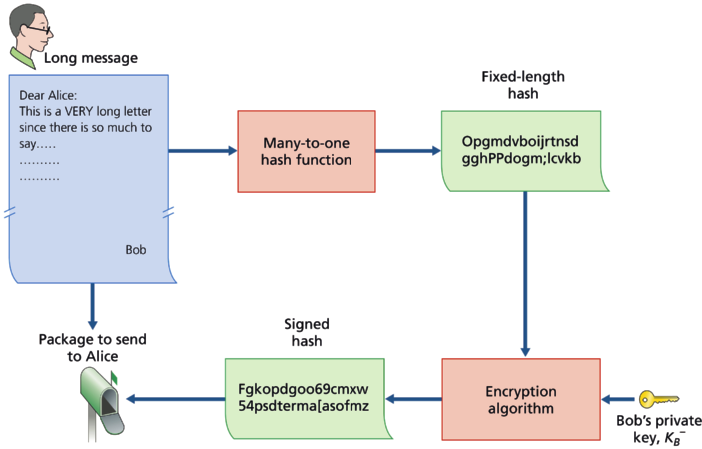

Figure 8.11 Sending a digitally signed message

One concern with signing data by encryption is that encryption and decryption are computationally expensive. Given the overheads of encryption and decryption, signing data via complete encryption/decryption can be overkill. A more efficient approach is to introduce hash functions into the digital signature. Recall from Section 8.3.2 that a hash algorithm takes a message, m,

of arbitrary length and computes a fixed-length “fingerprint” of the message, denoted by H m . Using a hash function, Bob signs the hash of a message 

rather than the message itself, that is, Bob calculates K − H m . Since H m  is (  )  B generally much smaller than the original message m, the computational effort

required to create the digital signature is substantially reduced.

In the context of Bob sending a message to Alice, Figure 8.11 provides a summary of the operational procedure of creating a digital signature. Bob puts his original long message through a hash function. He then digitally signs the resulting hash with his private key. The original message (in cleartext) along with the digitally signed message digest (henceforth referred to as the digital signature) is then sent to Alice. Figure 8.12 provides a summary of the operational procedure of the signature. Alice applies the sender’s public key to the message to obtain a hash result. Alice also applies the hash function to the cleartext message to obtain a second hash result. If the two hashes match, then Alice can be sure about the integrity and author of the message.

Before moving on, let’s briefly compare digital signatures with MACs, since they have parallels, but also have important subtle differences. Both digital signatures and MACs start with a message (or a document).To create a MAC out of the message, we append an authentication key to the message, and then take the hash of the result.

Note that neither public key nor symmetric key encryption is involved in creating the MAC. To create a digital signature, we first take the hash of the message and then encrypt the message with our private key (using public key cryptography). Thus, a digital signature is a “heavier” technique, since it requires an underlying Public Key Infrastructure (PKI) with certification authorities as described below. We’ll see in Section 8.4 that PGP—a popular secure e-mail system—uses digital signatures for message integrity. We’ve seen already that OSPF uses MACs for message integrity. We’ll see in Sections 8.5 and 8.6 that MACs are also used for popular transport-layer and network-layer security protocols.

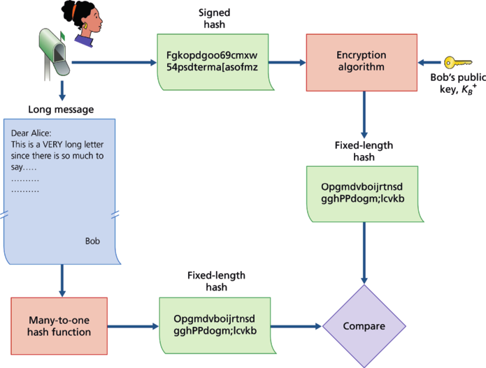

Figure 8.12 Verifying a signed message

Public Key Certification An important application of digital signatures is public key certification, that is, certifying that a public key belongs to a specific entity. Public key certification is used in many popular secure networking protocols, including IPsec and TLS.

To gain insight into this problem, let’s consider an Internet-commerce version of the classic “pizza prank.” Alice is in the pizza delivery business and accepts orders over the Internet. Bob, a pizza lover, sends Alice a plaintext message that includes his home address and the type of pizza he wants. In this message, Bob also includes a digital signature (that is, a signed hash of the original plaintext message) to prove to Alice that he is the true source of the message. To verify the signature, Alice obtains Bob’s public key (perhaps from a public key server or from the e-mail message) and checks the digital signature. In this manner she makes sure that Bob, rather than some adolescent prankster, placed the order.

This all sounds fine until clever Trudy comes along. As shown in  Figure 8.13, Trudy is indulging in a prank. She sends a message to Alice in which she says she is Bob, gives Bob’s home address, and orders a pizza. In this message she vies to his home! We see from this example that for public key cryptography to be useful, you need to be able to verify that you have the actual public key of the entity (person, router, browser, and so on) with whom you want to communicate. For example, when Alice wants to communicate with Bob using public key cryptography, she needs to verify that the public key that is supposed to be Bob’s is indeed Bob’s. Binding a public key to a particular entity is typically done by a Certification Authority (CA), whose job is to validate identities and issue certificates. A CA has the following roles: 1. A CA verifies that an entity (a person, a router, and so on) is who it says it is. There are no mandated procedures for how certification is done. When dealing with a CA, one must trust the CA to have performed a suitably rigorous identity verification. For example, if Trudy were able to walk into the Fly-by-Night CA and simply announce “I am Alice” and receive cer- tificates associated with the identity of Alice, then one shouldn’t put much faith in public keys certified by the Fly-by-Night CA. On the other hand, one might (or might not!) be more willing to trust a CA that is part of a federal or state program. You can trust the identity associated with a

Figure 8.13 Trudy masquerades as Bob using public key cryptography also includes her (Trudy’s) public key, although Alice naturally assumes it is Bob’s public key. Trudy also attaches a digital signature, which was created with her own (Trudy’s) private key. After receiving the message, Alice applies Trudy’s public key (thinking that it is Bob’s) to the digital signature and concludes that the plaintext message was indeed created by Bob. Bob will be very surprised when the delivery person brings a pizza with pepperoni and ancho-

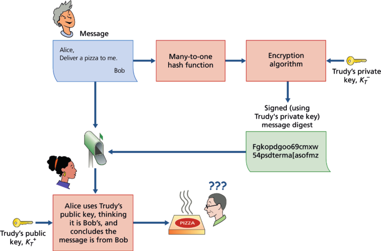

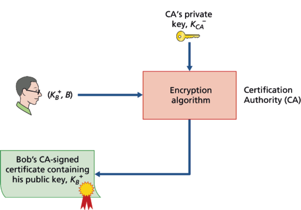

Figure 8.14 Bob has his public key certified by the CA

public key only to the extent to which you can trust a CA and its identity verification techniques. What a tangled web of trust we spin!

2.  Once the CA verifies the identity of the entity, the CA creates a certificate that binds the public key of the entity to the identity. The certificate contains the public key and globally unique identifying information about the owner of the public key (for example, a human name or an IP address). The certificate is digitally signed by the CA. These steps are shown in  Figure 8.14.

Let us now see how certificates can be used to combat pizza-ordering pranksters, like Trudy, and other undesirables. When Bob places his order he also sends his CA-signed certificate. Alice uses the CA’s public key to check the validity of Bob’s certificate and extract Bob’s public key.

Both the International Telecommunication Union (ITU) and the IETF have developed standards for CAs. ITU X.509 [ITU 2005a] specifies an authentication service as well as a specific syntax for certificates. [RFC 1422] describes CA-based key management for use with secure Internet e-mail. It is compatible with X.509 but goes beyond X.509 by establishing procedures and conventions for a key management architecture. Table 8.4 describes some of the important fields in a certificate.

Table 8.4 Selected fields in an X.509 and RFC 1422 public key Field Name Description

Version Version number of X.509 specification

Serial number CA-issued unique identifier for a certificate

Signature Specifies the algorithm used by CA to sign this certificate

Issuer name Identity of CA issuing this certificate, in distinguished name (DN) [RFC 4514] format

Validity period Start and end of period of validity for certificate

Subject name Identity of entity whose public key is associated with this certificate, in DN format

Subject public key The subject’s public key as well indication of the public key algorithm (and algorithm parameters) to be used with this key

#### 8.4 End-Point Authentication

End-point authentication is the process of one entity proving its identity to another entity over a computer network, for example, a user proving its identity to an e-mail server. As humans, we authenticate each other in many ways:

We recognize each other’s faces when we meet, we recognize each other’s voices on the telephone, we are authenticated by the customs official who checks us against the picture on our passport.

In this section, we consider how one party can authenticate another party when the two are communicating over a network. We focus here on authenticating a “live” party, at the point in time when communication is actually occurring. A concrete example is a user authenticating him or herself to an e-mail server. This is a subtly different problem from proving that a message received at some point in the past did indeed come from that claimed sender, as studied in Section 8.3.

When performing authentication over the network, the communicating parties cannot rely on biometric information, such as a visual appearance or a voiceprint. Indeed, we will see in our later case studies that it is often network elements such as routers and client/server processes that must authenticate each other. Here, authentication must be done solely on the basis of messages and data exchanged as part of an authentication protocol. Typically, an authentication protocol would run before the two communicating parties run some other protocol (for example, a reliable data transfer protocol, a routing information exchange protocol, or an e-mail protocol). The authentication protocol first establishes the identities of the parties to each other’s satisfaction;

only after authentication do the parties get down to the work at hand.

As in the case of our development of a reliable data transfer (rdt) protocol in Chapter 3, we will find it instructive here to develop various versions of an authentication protocol, which we will call ap (authentication protocol), and poke holes in each version as we proceed. (If you enjoy this stepwise evolution of a design, you might also enjoy [Bryant 1988], which recounts a fictitious narrative between designers of an open-network authentication system, and their discovery of the many subtle issues involved.) Let’s assume that Alice needs to authenticate herself to Bob.

Perhaps the simplest authentication protocol we can imagine is one where Alice simply sends a message to Bob saying she is Alice. This protocol is shown in Figure 8.15. The flaw here is obvious—there is no way for Bob actually to know that the person sending the message “I am Alice” is indeed Alice. For example, Trudy (the intruder) could just as well send such a message.

Authentication Protocol ap2.0

If Alice has a well-known network address (e.g., an IP address) from which she always communicates, Bob could attempt to authenticate Alice by verifying that the source address on the IP datagram carrying the authentication message matches Alice’s well-known address.

In this case, Alice would be authenticated.

This might stop a very network-naive intruder from impersonating Alice, but it wouldn’t stop the determined student studying this book, or many others!

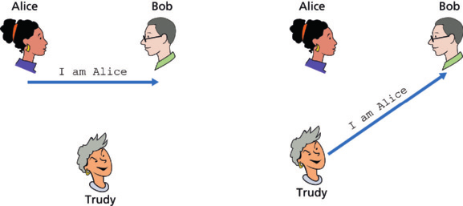

Figure 8.15 Protocol ap1.0 and a failure scenario

From our study of the network and data link layers, we know that it is not that hard (for example, if one had access to the operating system code and could build one’s own operating system kernel, as is the case with Linux and several other freely available operating systems) to create an IP datagram, put whatever IP source address we want (for example, Alice’s well-known IP address) into the IP datagram, and send the datagram over the link-layer protocol to the first-hop router. From then on, the incorrectly source-addressed datagram would be dutifully forwarded to Bob.

This approach, shown in Figure 8.16, is a form of IP spoofing. IP spoofing can be avoided if Trudy’s firsthop router is configured to forward only datagrams containing Trudy’s IP source address [RFC 2827]. However, this capability is not universally deployed or enforced. Bob would thus be foolish to assume that Trudy’s network manager (who might be Trudy herself) had configured Trudy’s first-hop router to forward only appropriately addressed datagrams.

Authentication Protocol ap3.0

One classic approach to authentication is to use a secret password. The password is a shared secret between the authenticator and the person being authenticated. Gmail, Facebook, telnet, FTP, and many other services use password authentication. In protocol ap3.0, Alice thus sends her secret password to Bob, as shown in Figure 8.17.

Since passwords are so widely used, we might suspect that protocol ap3.0

is fairly secure. If so, we’d be wrong! The security flaw here is clear. If Trudy eavesdrops on Alice’s communication, then she can learn Alice’s password.

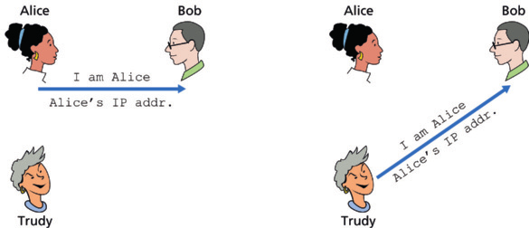

Figure 8.16 Protocol ap2.0 and a failure scenario

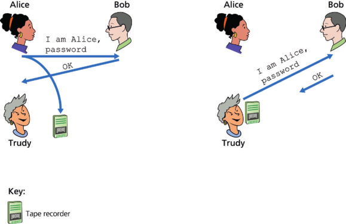

Figure 8.17 Protocol ap3.0 and a failure scenario

Lest you think this is unlikely, consider the fact that when you Telnet to another machine and log in, the login password is sent unencrypted to the Telnet server. Someone connected to the Telnet client or server’s LAN can possibly sniff (read and store) all packets transmitted on the LAN and thus steal the login password.

In fact, this is a well-known approach for stealing passwords (see, for example, [Jimenez 1997]). Such a threat is obviously very real, so ap3.0

clearly won’t do.

Authentication Protocol ap3.1

Our next idea for fixing ap3.0 is naturally to encrypt the password. By encrypting the password, we can prevent Trudy from learning Alice’s password. If we assume that Alice and Bob share a symmetric secret key, K , then Alice can A B − I am Alice encrypt the password and send her identification message, “ ,”

and her encrypted password to Bob. Bob then decrypts the password and, assuming the password is correct, authenticates Alice. Bob feels comfortable in authenticating Alice since Alice not only knows the password, but also knows the shared secret key value needed to encrypt the password. Let’s call this protocol ap3.1.

While it is true that ap3.1 prevents Trudy from learning Alice’s password,

the use of cryptography here does not solve the authentication problem. Bob is subject to a playback attack: Trudy need only eavesdrop on Alice’s communication, record the encrypted version of the password, and play back the encrypted version of the password to Bob to pretend that she is Alice. The use of an encrypted password in ap3.1 doesn’t make the situation manifestly different from that of protocol ap3.0 in Figure 8.17.

Authentication Protocol ap4.0

The failure scenario in Figure 8.17 resulted from the fact that Bob could not distinguish between the original authentication of Alice and the later playback of

Alice’s original authentication. That is, Bob could not tell if Alice was live (that Figure 8.18 Protocol is, was currently really on the other end of the connection) or whether the mesap4.0 and a failure sages he was receiving were a recorded playback of a previous authentication scenario of Alice. The very (very) observant reader will recall that the three-way TCP handshake protocol needed to address the same problem—the server side of a TCP connection did not want to accept a connection if the received SYN seg-

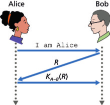

ment was an old copy (retransmission) of a SYN segment from an earlier connection. How did the TCP server side solve the problem of determining whether the client was really live? It chose an initial sequence number that had not been used in a very long time, sent that number to the client, and then waited for the client to respond with an ACK segment containing that number. We can adopt the same idea here for authentication purposes.A nonce is a number that a protocol will use only once in a lifetime. That is, once a protocol uses a nonce, it will never use that number again. Our ap4.0 protocol uses a nonce as follows: I am Alice 1.Alice sends the message “ ” to Bob. 2.Bob chooses a nonce, R, and sends it to Alice. 3.Alice encrypts the nonce using Alice and Bob’s symmetric secret key, K , and sends the encrypted nonce, K (R), back to Bob.

As in protocol A B − A B − ap3.1, it is the fact that Alice knows K and uses it to encrypt a value A B − that lets Bob know that the message he receives was generated by Alice. The nonce is used to ensure that Alice is live. 4. Bob decrypts the received message. If the decrypted nonce equals the nonce he sent Alice, then Alice is authenticated. Protocol ap4.0 is illustrated in Figure 8.18. By using the once-in-a-lifetime value, R, and then checking the returned value, K (R), Bob can be sure that A B − Alice is both who she says she is (since she knows the secret key value needed to encrypt R) and live (since she has encrypted the nonce, R, that Bob just created). The use of a nonce and symmetric key cryptography forms the basis of ap4.0. A natural question is whether we can use a nonce and public key cryptography (rather than symmetric key cryptography) to solve the authentication problem. This issue is explored in the problems at the end of the chapter.

#### 8.5 Securing E-Mail

In previous sections, we examined fundamental issues in network security, including symmetric key and public key cryptography, end-point authentication, key distribution, message integrity, and digital signatures. We are now going to examine how these tools are being used to provide security in the Internet.

Interestingly, it is possible to provide security services in any of the top four layers of the Internet protocol stack. When security is provided for a specific application-layer protocol, the application using the protocol will enjoy one or more security services, such as confidentiality, authentication, or integrity.

When security is provided for a transport-layer protocol, all applications that use that protocol enjoy the security services of the transport protocol. When security is provided at the network layer on a host-to-host basis, all transportlayer segments (and hence all application-layer data) enjoy the security services of the network layer. When security is provided on a link basis, then the data in all frames traveling over the link receive the security services of the link.

In Sections 8.5 through 8.8, we examine how security tools are being used in the application, transport, network, and link layers. Being consistent with the general structure of this book, we begin at the top of the protocol stack and discuss security at the application layer. Our approach is to use a specific application, e-mail, as a case study for application-layer security. We then move down the protocol stack. We’ll examine the TLS protocol (which provides security at the transport layer), IPsec (which provides security at the network layer), and the security of the IEEE 802.11 wireless LAN protocol.

You might be wondering why security functionality is being provided at more than one layer in the Internet. Wouldn’t it suffice simply to provide the security functionality at the network layer and be done with it? There are two answers to this question. First, although security at the network layer can offer “blanket coverage” by encrypting all the data in the datagrams (that is, all the transport-layer segments) and by authenticating all the source IP addresses, it can’t provide user-level security. For example, a commerce site cannot rely on IP-layer security to authenticate a customer who is purchasing goods at the commerce site. Thus, there is a need for security functionality at higher layers as well as blanket coverage at lower layers. Second, it is generally easier to deploy new Internet services, including security services, at the higher layers of the protocol stack. A classic example is Pretty Good Privacy (PGP), which provides secure e-mail (discussed later in this section). Requiring only client and server application code, PGP was one of the first security technologies to be broadly used in the Internet.

##### 8.5.1 Secure E-Mail

We now use the cryptographic principles of Sections 8.2 through 8.3 to create a secure e-mail system. We create this high-level design in an incremental manner, at each step introducing new security services. When designing a secure e-mail system, let us keep in mind the racy example introduced in Section 8.1— the love affair between Alice and Bob. Imagine that Alice wants to send an e-mail message to Bob, and Trudy wants to intrude.

Before plowing ahead and designing a secure e-mail system for Alice and Bob, we should consider which security features would be most desirable for them. First and foremost is confidentiality. As discussed in Section 8.1, neither Alice nor Bob wants Trudy to read Alice’s e-mail message. The second feature that Alice and Bob would most likely want to see in the secure e-mail system is

I don’t sender authentication. In particular, when Bob receives the message “ love you anymore. I never want to see you again. Formerly yours, Alice ,” he would naturally want to be sure that the message came from Alice and not from Trudy. Another feature that the two lovers would appreciate is message integrity, that is, assurance that the message Alice sends is not modified while en route to Bob. Finally, the e-mail system should provide receiver authentication; that is, Alice wants to make sure that she is indeed sending the letter to Bob and not to someone else (for example, Trudy) who is impersonating Bob.

So let’s begin by addressing the foremost concern, confidentiality. The most straightforward way to provide confidentiality is for Alice to encrypt the message with symmetric key technology (such as DES or AES) and for Bob to decrypt the message on receipt.

As discussed in Section 8.2, if the symmetric key is long enough, and if only Alice and Bob have the key, then it is extremely difficult for anyone else (including Trudy) to read the message. Although this approach is straightforward, it has the fundamental difficulty that we discussed in Section 8.2—distributing a symmetric key so that only Alice and Bob have copies of it. So we naturally consider an alternative approach—public key cryptography (using, for example, RSA). In the public key approach, Bob makes his public key publicly available (e.g., in a public key server or on his personal Web page), Alice encrypts her message with Bob’s public key, and she sends the encrypted message to Bob’s e-mail address. When Bob receives the message, he simply decrypts it with his private key. Assuming that Alice knows for sure that the public key is Bob’s public key, this approach is an excellent means to provide the desired confidentiality. One problem, however, is that public key encryption is relatively inefficient, particularly for long messages.

To overcome the efficiency problem, let’s make use of a session key (discussed in Section 8.2.2). In particular, Alice (1) selects a random symmetric session key, K , (2) encrypts her message, m, with the symmetric key, S (3) encrypts the symmetric key with Bob’s public key, K + , (4) concatenates the B encrypted message and the encrypted symmetric key to form a “package,” and (5) sends the package to Bob’s e-mail address. The steps are illustrated in Figure 8.19. (In this and the subsequent figures, the circled “ + ” represents con-

catenation and the circled “ − ” represents deconcatenation.) When Bob receives

the package, he (1) uses his private key, K − , to obtain the symmetric key, K , B S and (2) uses the symmetric key K to decrypt the message m. S Having designed a secure e-mail system that provides confidentiality, let’s now design another system that provides both sender authentication and message integrity. We’ll suppose, for the moment, that Alice and Bob are no longer s

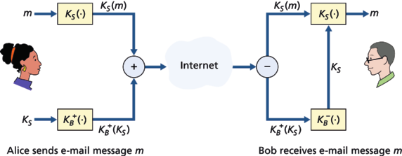

Figure 8.19 Alice used a symmetric session key, , to send a secret e-mail K to Bob one!), and are concerned only about sender authentication and message integrity. To accomplish this task, we use digital signatures and message digests, as described in Section 8.3. Specifically, Alice (1) applies a hash function, H (e.g., MD5), to her message, m, to obtain a message digest, (2) signs the result of the hash function with her private key, K − , to create a digital signa- A ture, (3) concatenates the original (unencrypted) message with the signature to create a package, and (4) sends the package to Bob’s e-mail address. When Bob receives the package, he (1) applies Alice’s public key, K + , to the signed mes- A sage digest and (2) compares the result of this operation with his own hash, H, of the message. The steps are illustrated in Figure 8.20. As discussed in message came from Alice and is unaltered. Now let’s consider designing an e-mail system that provides confidentiality, sender authentication, and message integrity. This can be done by combining the procedures in Figures 8.19 and 8.20. Alice first creates a preliminary package, exactly as in Figure 8.20, that consists of her original message along with a digitally signed hash of the message. She then treats this preliminary package as a message in itself and sends this new message through the sender steps in Figure 8.19, creating a new package that is sent to Bob. The steps applied by Alice are shown in Figure 8.21. When Bob receives the package, he first applies his side of Figure 8.19 and then his side of Figure 8.20. It should be clear that this design achieves the goal of providing confidentiality,

Figure 8.20 Using hash functions and digital signatures to provide sender

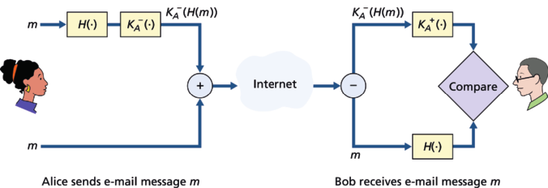

authentication and message integrity concerned with confidentiality (they want to share their feelings with every- Section 8.3, if the two results are the same, Bob can be pretty confident that the

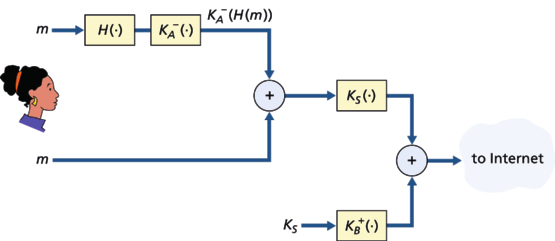

Figure 8.21 Alice uses symmetric key cyptography, public key cryptography, a hash function, and a digital signature to provide secrecy, sender authentication, and message integrity sender authentication, and message integrity. Note that, in this scheme, Alice uses public key cryptography twice: once with her own private key and once with Bob’s public key. Similarly, Bob also uses public key cryptography twice— once with his private key and once with Alice’s public key.

The secure e-mail design outlined in Figure 8.21 probably provides satisfactory security for most e-mail users for most occasions. However, there is still one important issue that remains to be addressed. The design in Figure 8.21 requires Alice to obtain Bob’s public key, and requires Bob to obtain Alice’s public key. The distribution of these public keys is a nontrivial problem. For example, Trudy might masquerade as Bob and give Alice her own public key while saying that it is Bob’s public key, enabling her to receive the message meant for Bob. As we learned in Section 8.3, a popular approach for securely distributing public keys is to certify the public keys using a CA.

##### 8.5.2 PGP

Written by Phil Zimmermann in 1991, Pretty Good Privacy (PGP) is a nice example of an e-mail encryption scheme. The PGP design is, in essence, the same as the design shown in Figure 8.21. Depending on the version, the PGP software uses MD5 or SHA for calculating the message digest; CAST, triple- DES, or IDEA for symmetric key encryption; and RSA for the public key encryption.

When PGP is installed, the software creates a public key pair for the user.

The public key can be posted on the user’s Web site or placed in a public key server. The private key is protected by the use of a password. The password has to be entered every time the user accesses the private key. PGP gives the user the option of digitally signing the message, encrypting the message, or both digitally signing and encrypting. Figure 8.22 shows a PGP signed message. This message appears after the MIME header. The encoded data in the message is K − H m , that is, the digitally signed message digest. As we dis- (  ) A cussed above, in order for Bob to verify the integrity of the message, he needs to have access to Alice’s public key.

Figure 8.23 shows a secret PGP message. This message also appears after the MIME header. Of course, the plaintext message is not included within the secret e-mail message. When a sender (such as Alice) wants both confidentiality and integrity, PGP contains a message like that of Figure 8.23 within the message of Figure 8.22.

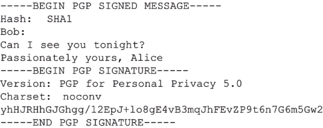

Figure 8.22 A PGP signed message

Figure 8.23 A secret

PGP message

PGP also provides a mechanism for public key certification, but the mechanism is quite different from the more conventional CA. PGP public keys are certified by a web of trust. Alice herself can certify any key/username pair when she believes the pair really belong together. In addition, PGP permits Alice to say that she trusts another user to vouch for the authenticity of more keys.

Some PGP users sign each other’s keys by holding key-signing parties. Users physically gather, exchange public keys, and certify each other’s keys by signing them with their private keys.

OpenPGP [OpenPGP 2025] is an open descendent of Zimmerman’s original PHP, providing data confidentiality, digital signatures, and message integrity for email and data files using public key and/or symmetric encryption techniques. OpenPGP is specified in [RFC 9580].

#### 8.6 Securing TCP and HTTP Connections: TLS

In the previous section, we saw how cryptographic techniques can provide confidentiality, data integrity, and end-point authentication to a specific application, namely, e-mail. In this section, we’ll drop down a layer in the protocol stack and examine how cryptography can enhance TCP and HTTP with security services, including confidentiality, data integrity, and end-point authentication. The protocol that provides these security services is known as the Transport Layer Security (TLS) protocol.

Recall that we learned in Section 2.2.6 that, strictly speaking, TLS is an application-layer protocol that provides security services between the client and server processes using TLS. Historically, TLS has been implemented on top of TCP, securing the underlying process-to-process services provided by TCP. We learned in Section 2.2.6 that TLS is now also run on top of UDP as part of the QUIC protocol, which provides transport services for HTTP 3.

TLS has its roots in the earlier Secure Socket Layer (SSL) protocol that was published and developed for Netscape. Indeed, RFC 2246, which specified TLS1.0 noted “The differences between this protocol and SSL 3.0 are not dramatic.” We briefly note that the basic ideas behind securing TCP had predated Netscape’s work (e.g., see [Woo1994]).

TLS enjoys broad deployment.TLS is supported by all popular Web browsers and Web servers, is used by default in HTTP 3, and is used by Gmail and essentially all Internet commerce sites (including Amazon, eBay, and TaoBao).Hundreds of billions of dollars are spent over TLS every year.

In fact, if you have ever purchased anything over the Internet with your credit card, the communication between your browser and the server for this purchase almost certainly went over TLS. (You can identify that TLS is being used by your browser when the URL begins with “https:” rather than “http:”.) The current version of TLS is TLS1.3, specified in RFC 8446. TLS1.3 improves over earlier versions by introducing faster initial handshakes (as discussed in Section 2.2.6) and by removing older and less secure cryptographic algorithms and procedures.

To understand the need for TLS, let’s walk through a typical Internet commerce scenario. Bob is surfing the Web and arrives at the Alice Incorporated site, which is selling perfume. The Alice Incorporated site displays a form in which Bob is supposed to enter the type of perfume and quantity desired, his address, and his payment card number. Bob enters this information, clicks on Submit, and expects to receive (via ordinary postal mail) the purchased perfumes; he also expects to receive a charge for his order in his next payment card statement.

This all sounds good, but if no security measures are taken, Bob could be in for a few surprises.

• If no confidentiality (encryption) is used, an intruder could intercept Bob’s order and obtain his payment card information. The intruder could then make purchases at Bob’s expense.

• If no data integrity is used, an intruder could modify Bob’s order, having him purchase ten times more bottles of perfume than desired.

• Finally, if no server authentication is used, a server could display Alice Incorporated’s famous logo when in actuality the site maintained by Trudy, who is masquerading as Alice Incorporated. After receiving Bob’s order, Trudy could take Bob’s money and run. Or Trudy could carry out an identity theft by collecting Bob’s name, address, and credit card number.

TLS addresses these issues by providing confidentiality, data integrity, server authentication, and client authentication to applications running above it.

##### 8.6.1 The Big Picture

We begin by describing a simplified version of TLS, one that will allow us to get a big-picture understanding of the why and how of TLS. We will refer to this simplified version of TLS as “almost-TLS.” After describing almost-TLS, in the next subsection we’ll then describe the real TLS, filling in the details. Almost- TLS (and TLS) has three phases: handshake, key derivation, and data transfer. We now describe these three phases for a communication session between a client (Bob) and a server (Alice), with Alice having a private/public key pair and a certificate that binds her identity to her public key. We’ll describe TLS in the context of securing TCP connections, but recall that TLS is also used in QUIC to secure process-to-process communication over UDP as well.

Handshake During the handshake phase, Bob needs to (a) establish a TCP connection with Alice, (b) verify that Alice is really Alice, and (c) send Alice a master secret key, which will be used by both Alice and Bob to generate all the symmetric keys they need for the TLS session. These three steps are shown in Figure 8.24.

Note that once the TCP connection is established, Bob sends Alice a hello message.

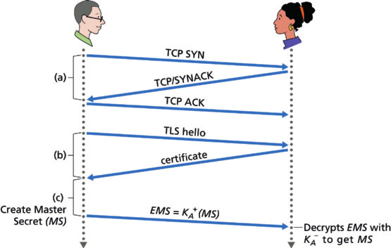

Figure 8.24 The almost-TLS handshake, beginning with a TCP connection

Alice then responds with her certificate, which contains her public key. As discussed in Section 8.3, because the certificate has been certified by a CA, Bob knows for sure that the public key in the certificate belongs to Alice. Bob then generates a Master Secret (MS) (which will only be used for this TLS session), encrypts the MS with Alice’s public key to create the Encrypted Master Secret (EMS), and sends the EMS to Alice. Alice decrypts the EMS with her private key to get the MS. After this phase, both Bob and Alice (and no one else) know the master secret for this TLS session.

Key Derivation In principle, the MS, now shared by Bob and Alice, could be used as the symmetric session key for all subsequent encryption and data integrity checking. It is, however, generally considered safer for Alice and Bob to each use different cryptographic keys, and also to use different keys for encryption and integrity checking. Thus, both Alice and Bob use the MS to generate four keys:

• E = session encryption key for data sent from Bob to Alice B • M = session HMAC key for data sent from Bob to Alice, where HMAC B [RFC 2104] is a standardized hashed message authentication code (MAC) that we encountered in Section 8.3.2 • E = session encryption key for data sent from Alice to Bob A • M = session HMAC key for data sent from Alice to Bob A Alice and Bob each generate the four keys from the MS.

This could be done by simply slicing the MS into four keys. (But in reality TLS it is a little more complicated, as we’ll see.) At the end of the key derivation phase, both Alice and Bob have all four keys. The two encryption keys will be used to encrypt data;

the two HMAC keys will be used to verify the integrity of the data.

Data Transfer Now that Alice and Bob share the same four session keys (E ,  M ,  E , B B A and M ), they can start to send secured data to each other over the TCP A connection. Since TCP is a byte-stream protocol, a natural approach would be for TLS to encrypt application data on the fly and then pass the encrypted data on the fly to TCP.

But if we were to do this, where would we put the HMAC for the integrity check? We certainly do not want to wait until the end of the TCP session to verify the integrity of all of Bob’s data that was sent over the entire session! To address this issue, TLS breaks the data stream into records, appends an HMAC to each record for integrity checking, and then encrypts the record + HMAC. To create the HMAC, Bob

inputs the record data along with the key M into a hash function, as dis- B cussed in Section 8.3. To encrypt the package record + HMAC, Bob uses his

session encryption key E . This encrypted package is then passed to TCP B for transport over the Internet.

Although this approach goes a long way, it still isn’t bullet-proof when it comes to providing data integrity for the entire message stream. In particular, suppose Trudy is a woman-in-the-middle and has the ability to insert, delete, and replace segments in the stream of TCP segments sent between Alice and Bob. Trudy, for example, could capture two segments sent by Bob, reverse the order of the segments, adjust the TCP sequence numbers (which are not encrypted), and then send the two reverse-ordered segments to Alice. Assuming that each TCP segment encapsulates exactly one record, let’s now take a look at how Alice would process these segments.

1.  TCP running in Alice would think everything is fine and pass the two records to the TLS sublayer.

2.  TLS in Alice would decrypt the two records.

3.  TLS in Alice would use the HMAC in each record to verify the data integrity of the two records.

4.  TLS would then pass the decrypted byte streams of the two records to the application layer; but the complete byte stream received by Alice would not be in the correct order due to reversal of the records!

You are encouraged to walk through similar scenarios for when Trudy removes segments or when Trudy replays segments.

The solution to this problem, as you probably guessed, is to use sequence numbers. TLS does this as follows. Bob maintains a sequence number counter, which begins at zero and is incremented for each TLS record he sends. Bob doesn’t actually include a sequence number in the record itself, but when he calculates the HMAC, he includes the sequence number in the HMAC calculation. Thus, the HMAC is now a hash of the data plus the HMAC key M plus B the current sequence number. Alice tracks Bob’s sequence numbers, allowing her to verify the data integrity of a record by including the appropriate sequence number in the HMAC calculation. This use of TLS sequence numbers prevents Trudy from carrying out a woman-in-the-middle attack, such as reordering or replaying segments. (Why?)

Figure 8.25 Record

format for almost-TLS

TLS Record The almost-TLS record is shown in Figure 8.25. The record consists of a type field, version field, length field, data field, and HMAC field. Note that the first three fields are not encrypted. The type field indicates whether the record is a handshake message or a message that contains application data. It is also used to close the TLS connection, as discussed below. TLS at the receiving end uses the length field to extract the TLS records out of the incoming TCP byte stream.

The version field is self-explanatory.

##### 8.6.2 A More Complete Picture: TLS 1.3

The previous subsection covered the almost-TLS protocol and provided a basic understanding of the why and how of TLS. With this basic understanding, we can now dig a little deeper and examine the essentials of the actual TLS protocol. In parallel to reading this description of the TLS protocol, you are encouraged to complete the Wireshark TLS lab, available at the textbook’s Web site.

The TLS protocol has undergone a number of changes as it has evolved from TLS 1.0 to TLS 1.1 to TLS 1.2 and now to TLS 1.3 [RFC 8446]. Some of these changes have been introduced as a result of security flaws found in earlier versions or to implement emerging best practices in security. Other changes have been introduced to improve TLS performance, in particular to minimize the number of RTTs needed to establish a TLS connection—a theme that we encountered earlier when we studied the evolution of the HTTP protocol in Chapter 2. Despite these changes, the goal of TLS has remained the same—to provide confidentiality, data integrity, and authentication to the client and server processes communicating via TLS. And as we’ll see, TLS does so using the foundational cryptographic security techniques that we studied earlier in this chapter.

TLS 1.3 Handshake The goal of the TLS 3.1 handshake is for the client and server to securely agree on the cipher suite that will be used to provide confidentiality, data integrity, and authentication; to perform authentication; and to agree on a new shared Master Secret known as an ephemeral key. This ephemeral key is then used to derive other shared keys that are used later in the TLS-protected session. The common case TLS 3.1 handshake has the following steps:

• Client Hello. In the Client Hello message, the client indicates the TLS version number

1.3, the choice of one of three cipher suites and parameters, and a nonce to avoid replay attacks. The pieces of a cipher suite are: (i) a key exchange technique that is used to generate a Master Secret, and a SHA hashing algorithm to be used following the handshake to derive additional keys from the Master Secret; (ii) an Authenticated Encryption with Associated Data (AEAD) algorithm to be used during data transfer.

Rather than using separate encryption and message integrity algorithms, the single AEAD provides both confidentiality and integrity for transmitted data, using (AES or ChaCha20) for encryption. For generating the Master Secret, in all cases a variation of the Diffie-Hellman (DH) key agreement, studied in Section 8.2.2, is used.

• Server Hello, Finished. The TLS 3.1 server says “hello” followed by an immediate “goodbye.” The server Hello message includes the server’s certificate, chosen cipher suite, and a server-generated nonce. Since the client Hello message contains the client’s (public) values needed for DH key agreement, the server generates its own public and private DH values and then generates the shared Master Secret from the client’s public value and its own private DH value. It includes its public DH values in the Server Hello message to the client.

• Client Finished. The client verifies the signature and certificate and generates its own copy of the Master Secret from its private DH key-agreement values and the received server public DH value. The Finished message contains a signed hash of the Client and Server Hello messages to verify that these messages have been received and have not been tampered with.

The Finish message itself is encrypted and signed using a key derived from the Master Secret.

Once the Client Finished message has been sent, the client can immediately send application messages (e.g., an HTTP GET message) to the server, with these messages and replies now being protected by TLS.

As shown in Figure 8.26, only a single RTT is required by TLS 1.3—a decrease from the two or more RTTs needed by earlier TLS versions.

When TLS 1.3 is run on top of TCP, a TCP connection must first be established before the TCP handshake can proceed. Thus, when running TLS 1.3 TLS 1.3

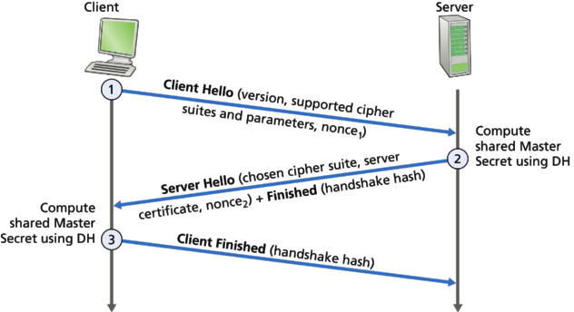

Figure 8.26 Handshake

over TCP, two RTTs are needed before the client can begin to send data (such as the initial HTTP request message).

In contrast, when using QUIC, TLS 1.3 does not run on top of QUIC but is instead integrated into it. Within QUIC, the TLS 1.3 Client Hello message is part of the QUIC connection establishment message, which is sent over UDP. Thus, when using QUIC, the client needs to wait only one RTT before it can start to send data to the server. With QUIC, it is also possible for zero RTTs to be needed (i.e., a client can immediately begin sending TLS-protected data to a client) in the case that the client and server have previously communicated and had agreed then on TLS parameters to be used in a future TLS connection.

You may be wondering why there are nonces In the TLS handshake. Don’t sequence numbers suffice for preventing the segment replay attack? The answer is yes, but they don’t alone prevent the “connection replay attack.” Consider the following connection replay attack. Suppose Trudy sniffs all messages between Alice and Bob. The next day, Trudy masquerades as Bob and sends to Alice exactly the same sequence of messages that Bob sent to Alice on the previous day. If Alice doesn’t use nonces, she will respond with exactly the same sequence of messages she sent the previous day. Alice will not suspect any funny business, as each message she receives will pass the integrity check.

If Alice is an e-commerce server, she will think that Bob is placing a second order (for exactly the same thing).On the other hand, by including a nonce in the protocol, Alice will send different nonces for each TCP session, causing the encryption keys to be different on the two days. Therefore, when Alice receives played-back TLS records from Trudy, the records will fail the integrity checks, and the bogus e-commerce transaction will not succeed.

In summary, in TLS, nonces are used to defend against the “connection replay attack” and sequence numbers are used to defend against replaying individual packets during an ongoing session.

TLS 1.3 records containing TLS handshake messages and subsequent application-layer data have the format shown for the almost-TLS record in Figure 8.25, except that an explicit HMAC is not needed, due to the AEAD algorithm that provides both confidentiality and integrity for transmitted data.

Connection Closure At some point, either Bob or Alice will want to end the TLS session. One approach would be to let Bob end the TLS session by simply terminating the underlying TCP connection—that is, by having Bob send a TCP FIN segment to Alice. But such a naive design sets the stage for the truncation attack whereby Trudy once again gets in the middle of an ongoing TLS session and ends the session early with a TCP FIN. If Trudy were to do this, Alice would think she received all of Bob’s data when actuality she only received a portion of it. The solution to this problem is to indicate in the type field whether the record serves to terminate the TLS session. By including such a field, if Alice were to receive a TCP FIN before receiving a closure TLS record, she would know that something funny was going on.

This completes our introduction to TLS. We’ve seen that it uses many of the cryptography principles discussed in Sections 8.2 and 8.3. Readers who want to explore TLS on yet a deeper level can read Rescorla’s foundational book on SSL/TLS [Rescorla 2001] as well as more recent updates regarding TLS 1.3 specifically [Cloudflare TLS 2018; Cloudflare TLS 2025].

#### 8.7 Network-Layer Security: IPsec and Virtual Private Networks

The IP security protocol, more commonly known as IPsec, provides security at the network layer. IPsec secures IP datagrams between any two network-layer entities, including hosts and routers. As we will soon describe, many institutions (corporations, government branches, non-profit organizations, and so on) use IPsec to create virtual private networks (VPNs) that run over the public Internet.

Before getting into the specifics of IPsec, let’s step back and consider what it means to provide confidentiality at the network layer. With network-layer confidentiality between a pair of network entities (for example, between two routers, between two hosts, or between a router and a host), the sending entity encrypts the payloads of all the datagrams it sends to the receiving entity. The encrypted payload could be a TCP segment, a UDP segment, an ICMP message, and so on. If such a network-layer service were in place, all data sent from one entity to the other—including e-mail, Web pages, TCP handshake messages, and management messages (such as ICMP and SNMP)—would be hidden from any third party that might be sniffing the network. For this reason, network-layer security is said to provide “blanket coverage.” In addition to confidentiality, a network-layer security protocol could potentially provide other security services. For example, it could provide source authentication, so that the receiving entity can verify the source of the secured datagram. A network-layer security protocol could provide data integrity, so that the receiving entity can check for any tampering of the datagram that may have occurred while the datagram was in transit. A network-layer security service could also provide replay-attack prevention, meaning that Bob could detect any duplicate datagrams that an attacker might insert. We will soon see that IPsec indeed provides mechanisms for all these security services, that is, for confidentiality, source authentication, data integrity, and replayattack prevention.

##### 8.7.1 IPsec and Virtual Private Networks (VPNs)

An institution that extends over multiple geographical regions often desires its own IP network, so that its hosts and servers can send data to each other in a secure and confidential manner. To achieve this goal, the institution could actually deploy a stand-alone physical network—including routers, links, and a DNS infrastructure—that is completely separate from the public Internet.

Such a disjoint network, dedicated to a particular institution, is called a private network. Not surprisingly, a private network can be very costly, as the institution needs to purchase, install, and maintain its own physical network infrastructure.

Instead of deploying and maintaining a private network, many institutions today create VPNs over the existing public Internet. With a VPN, the institution’s inter-office traffic is sent over the public Internet rather than over a physically independent network. But to provide confidentiality, the inter-office traffic is encrypted before it enters the public Internet. A simple example of a VPN is shown in Figure 8.27. Here the institution consists of a headquarters, a branch office, and traveling salespersons that typically access the Internet from their hotel rooms. (There is only one salesperson shown in the figure.) In this VPN, whenever two hosts within headquarters send IP datagrams to each other or whenever two hosts within the branch office want to communicate, they use good-old vanilla IPv4 (that is, without IPsec services). However, when two of the institution’s hosts communicate over a path that traverses the public Internet, the traffic is encrypted before it enters the Internet.

To get a feel for how a VPN works, let’s walk through a simple example in the context of Figure 8.27. When a host in headquarters sends an IP datagram to a salesperson in a hotel, the gateway router in headquarters converts the vanilla IPv4 datagram into an IPsec datagram and then forwards this IPsec datagram into the Internet. This IPsec datagram actually has a traditional IPv4 header, so that the routers in the public Internet process the datagram as if it were an ordinary IPv4 datagram—to them, the datagram is a perfectly ordinary datagram. But, as shown Figure 8.27, the payload of the IPsec datagram includes an IPsec header, which is used for IPsec processing; furthermore, the Figure 8.27 Virtual private network (VPN)

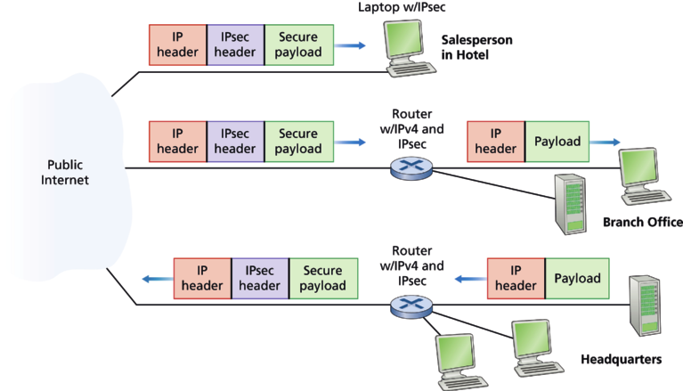

payload of the IPsec datagram is encrypted. When the IPsec datagram arrives at the salesperson’s laptop, the OS in the laptop decrypts the payload (and provides other security services, such as verifying data integrity) and passes the unencrypted payload to the upper-layer protocol (for example, to TCP or UDP).

We have just given a high-level overview of how an institution can employ IPsec to create a VPN. To see the forest through the trees, we have brushed aside many important details. Let’s now take a closer look.

##### 8.7.2 The AH and ESP Protocols

IPsec is a rather complex animal—it is defined in more than a dozen RFCs.

Two important RFCs are RFC 4301, which describes the overall IP security architecture, and RFC 6071, which provides an overview of the IPsec protocol suite. Our goal in this textbook, as usual, is not simply to re-hash the dry and arcane RFCs, but instead take a more operational and pedagogic approach to describing the protocols.

In the IPsec protocol suite, there are two principal protocols: the Authentication Header (AH) protocol and the Encapsulation Security Payload (ESP) protocol. When a source IPsec entity (typically a host or a router) sends secure datagrams to a destination entity (also a host or a router), it does so with either the AH protocol or the ESP protocol. The AH protocol provides source authentication and data integrity but does not provide confidentiality. The ESP protocol provides source authentication, data integrity, and confidentiality.

Because confidentiality is often critical for VPNs and other IPsec applications, the ESP protocol is much more widely used than the AH protocol. In order to de-mystify IPsec and avoid much of its complication, we will henceforth focus exclusively on the ESP protocol. Readers wanting to learn also about the AH protocol are encouraged to explore the RFCs and other online resources.

##### 8.7.3 Security Associations

IPsec datagrams are sent between pairs of network entities, such as between two hosts, between two routers, or between a host and router. Before sending IPsec datagrams from source entity to destination entity, the source and destination entities create a network-layer logical connection. This logical connection is called a security association (SA). An SA is a simplex logical connection; that is, it is unidirectional from source to destination. If both entities want to send secure datagrams to each other, then two SAs (that is, two logical connections) need to be established, one in each direction.

For example, consider once again the institutional VPN in Figure 8.27.

This institution consists of a headquarters office, a branch office and, say, n traveling salespersons. For the sake of example, let’s suppose that there is bidirectional IPsec traffic between headquarters and the branch office and bi-directional IPsec traffic between headquarters and the salespersons. In this VPN, how many SAs are there? To answer this question, note that there are two SAs between the headquarters gateway router and the branch-office gateway router (one in each direction); for each salesperson’s laptop, there are two SAs between the headquarters gateway router and the laptop (again, one in each direction). So, in total, there are 2 + 2  SAs. Keep in mind, however, n 

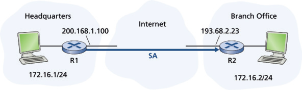

Figure 8.28 Security association (SA) from R1 to R2

that not all traffic sent into the Internet by the gateway routers or by the laptops will be IPsec secured. For example, a host in headquarters may want to access a Web server (such as Amazon or Google) in the public Internet. Thus, the gateway router (and the laptops) will emit into the Internet both vanilla IPv4 datagrams and secured IPsec datagrams.

Let’s now take a look “inside” an SA. To make the discussion tangible and concrete, let’s do this in the context of an SA from router R1 to router R2 in Figure 8.28. (You can think of Router R1 as the headquarters gateway router and Router R2 as the branch office gateway router from Figure 8.27.) Router R1 will maintain state information about this SA, which will include:

• A 32-bit identifier for the SA, called the Security Parameter Index (SPI)

• The origin interface of the SA (in this case 200.168.1.100) and the destination interface of the SA (in this case 193.68.2.23)

• The type of encryption to be used (for example, 3DES with CBC)

• The encryption key

• The type of integrity check (for example, HMAC with MD5)

• The authentication key Whenever router R1 needs to construct an IPsec datagram for forwarding over this SA, it accesses this state information to determine how it should authenticate and encrypt the datagram. Similarly, router R2 will maintain the same state information for this SA and will use this information to authenticate and decrypt any IPsec datagram that arrives from the SA.

An IPsec entity (router or host) often maintains state information for many SAs. For example, in the VPN example in Figure 8.27 with n salespersons, the + headquarters gateway router maintains state information for 2 2  SAs. An n 

IPsec entity stores the state information for all of its SAs in its Security Association Database (SAD), which is a data structure in the entity’s OS kernel.

##### 8.7.4 The IPsec Datagram

Having now described SAs, we can now describe the actual IPsec datagram.

IPsec has two different packet forms, one for the so-called tunnel mode and the other for the so-called transport mode. The tunnel mode, being more appropriate for VPNs, is more widely deployed than the transport mode. In order to further de-mystify IPsec and avoid much of its complication, we henceforth focus exclusively on the tunnel mode. Once you have a solid grip on the tunnel mode, you should be able to easily learn about the transport mode on your own.

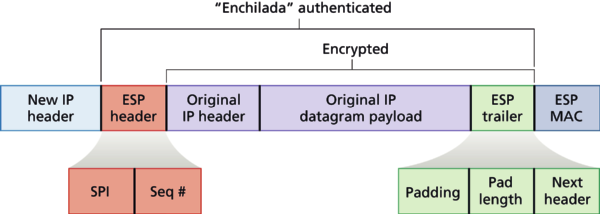

Figure 8.29 IPsec datagram format

The packet format of the IPsec datagram is shown in Figure 8.29. You might think that packet formats are boring and insipid, but we will soon see that the IPsec datagram actually looks and tastes like a popular Tex-Mex delicacy! Let’s examine the IPsec fields in the context of Figure 8.28. Suppose router R1 receives an ordinary IPv4 datagram from host 172.16.1.17 (in the headquarters network) which is destined to host 172.16.2.48 (in the branchoffice network). Router R1 uses the following recipe to convert this “original IPv4 datagram” into an IPsec datagram:

• Appends to the back of the original IPv4 datagram (which includes the original header fields!) an “ESP trailer” field

• Encrypts the result using the algorithm and key specified by the SA

• Appends to the front of this encrypted quantity a field called “ESP header”; the resulting package is called the “enchilada”

• Creates an authentication MAC over the whole enchilada using the algorithm and key specified in the SA

• Appends the MAC to the back of the enchilada forming the payload

• Finally, creates a brand new IP header with all the classic IPv4 header fields (together normally 20 bytes long), which it appends before the payload Note that the resulting IPsec datagram is a bona fide IPv4 datagram, with the traditional IPv4 header fields followed by a payload. But in this case, the payload contains an ESP header, the original IP datagram, an ESP trailer, and an ESP authentication field (with the original datagram and ESP trailer encrypted). The original IP datagram has 172.16.1.17 for the source IP address and 172.16.2.48 for the destination IP address. Because the IPsec datagram includes the original IP datagram, these addresses are included (and encrypted) as part of the payload of the IPsec packet. But what about the source and destination IP addresses that are in the new IP header, that is, in the left-most header of the IPsec datagram? As you might expect, they are set to the source and destination router interfaces at the two ends of the tunnels, namely, 200.168.1.100 and 193.68.2.23. Also, the protocol number in this new IPv4 header field is not set to that of TCP, UDP, or SMTP, but instead to 50, designating that this is an IPsec datagram using the ESP protocol.

After R1 sends the IPsec datagram into the public Internet, it will pass through many routers before reaching R2. Each of these routers will process the datagram as if it were an ordinary datagram—they are completely oblivious to the fact that the datagram is carrying IPsec-encrypted data. For these public Internet routers, because the destination IP address in the outer header is R2, the ultimate destination of the datagram is R2.

Having walked through an example of how an IPsec datagram is constructed, let’s now take a closer look at the ingredients in the enchilada. We see in Figure 8.29 that the ESP trailer consists of three fields: padding; pad length; and next header. Recall that block ciphers require the message to be encrypted to be an integer multiple of the block length. Padding (consisting of meaningless bytes) is used so that when added to the original datagram (along with the pad length and next header fields), the resulting “message” is an integer number of blocks.

The pad-length field indicates to the receiving entity how much padding was inserted (and thus needs to be removed). The next header identifies the type (e.g., UDP) of data contained in the payload-data field. The payload data (typically the original IP datagram) and the ESP trailer are concatenated and then encrypted.

Appended to the front of this encrypted unit is the ESP header, which is sent in the clear and consists of two fields: the SPI and the sequence number field. The SPI indicates to the receiving entity the SA to which the datagram belongs; the receiving entity can then index its SAD with the SPI to determine the appropriate authentication/decryption algorithms and keys. The sequence number field is used to defend against replay attacks.

The sending entity also appends an authentication MAC. As stated earlier, the sending entity calculates a MAC over the whole enchilada (consisting of the ESP header, the original IP datagram, and the ESP trailer—with the datagram and trailer being encrypted). Recall that to calculate a MAC, the sender appends a secret MAC key to the enchilada and then calculates a fixed-length hash of the result.

When R2 receives the IPsec datagram, R2 observes that the destination IP address of the datagram is R2 itself. R2 therefore processes the datagram.

Because the protocol field (in the left-most IP header) is 50, R2 sees that it should apply IPsec ESP processing to the datagram. First, peering into the enchilada, R2 uses the SPI to determine to which SA the datagram belongs.

Second, it calculates the MAC of the enchilada and verifies that the MAC is consistent with the value in the ESP MAC field. If it is, it knows that the enchilada comes from R1 and has not been tampered with. Third, it checks the sequence-number field to verify that the datagram is fresh (and not a replayed datagram). Fourth, it decrypts the encrypted unit using the decryption algorithm and key associated with the SA. Fifth, it removes padding and extracts the original, vanilla IP datagram. And finally, sixth, it forwards the original datagram into the branch office network toward its ultimate destination.

Whew, what a complicated recipe, huh? Well no one ever said that preparing and unraveling an enchilada was easy!

There is actually another important subtlety that needs to be addressed. It centers on the following question: When R1 receives an (unsecured) datagram from a host in the headquarters network, and that datagram is destined to some destination IP address outside of headquarters, how does R1 know whether it should be converted to an IPsec datagram? And if it is to be processed by IPsec, how does R1 know which SA (of many SAs in its SAD) should be used to construct the IPsec datagram? The problem is solved as follows.

Along with a SAD, the IPsec entity also maintains another data structure called the Security Policy Database (SPD).The SPD indicates what types of datagrams (as a function of source IP address, destination IP address, and protocol type) are to be IPsec processed; and for those that are to be IPsec processed, which SA should be used.

In a sense, the information in a SPD indicates “what” to do with an arriving datagram; the information in the SAD indicates “how” to do it.

Summary of IPsec Services So what services does IPsec provide, exactly? Let us examine these services from the perspective of an attacker, say Trudy, who is a woman-in-the-middle, sitting somewhere on the path between R1 and R2 in Figure 8.28. Assume throughout this discussion that Trudy does not know the authentication and encryption keys used by the SA. What can and cannot Trudy do? First, Trudy cannot see the original datagram. If fact, not only is the data in the original datagram hidden from Trudy, but so is the protocol number, the source IP address, and the destination IP address. For datagrams sent over the SA, Trudy only knows that the datagram originated from 200.168.1.100 and is destined to 193.68.2.23. She does not know if it is carrying TCP, UDP, or ICMP data; she does not know if it is carrying HTTP, SMTP, or some other type of application data. This confidentiality thus goes a lot farther than TLS. Second, suppose Trudy tries to tamper with a datagram in the SA by flipping some of its bits.

When this tampered datagram arrives at R2, it will fail the integrity check (using the MAC), thwarting Trudy’s vicious attempts once again. Third, suppose Trudy tries to masquerade as R1, creating a IPsec datagram with source
200.168.1.100 and destination 193.68.2.23. Trudy’s attack will be futile, as this

datagram will again fail the integrity check at R2. Finally, because IPsec includes sequence numbers, Trudy will not be able create a successful replay attack. In summary, as claimed at the beginning of this section, IPsec  provides—between any pair of devices that process packets through the network layer—confidentiality, source authentication, data integrity, and replay-attack prevention.

##### 8.7.5 IKE: Key Management in IPsec

When a VPN has a small number of end points (for example, just two routers as in Figure 8.28), the network administrator can manually enter the SA information (encryption/authentication algorithms and keys, and the SPIs) into the SADs of the endpoints. Such “manual keying” is clearly impractical for a large VPN, which may consist of hundreds or even thousands of IPsec routers and hosts. Large, geographically distributed deployments require an automated mechanism for creating the SAs. IPsec does this with the Internet Key Exchange (IKE) protocol, specified in RFC 5996.

IKE has some similarities with the handshake in TLS (see Section 8.6).

Each IPsec entity has a certificate, which includes the entity’s public key. As with TLS, the IKE protocol has the two entities exchange certificates, negotiate authentication and encryption algorithms, and securely exchange key material for creating session keys in the IPsec SAs. Unlike TLS, IKE employs two phases to carry out these tasks.

Let’s investigate these two phases in the context of two routers, R1 and R2, in Figure 8.28. The first phase consists of two exchanges of message pairs between R1 and R2:

• During the first exchange of messages, the two sides use Diffie-Hellman (see Homework Problems) to create a bi-directional IKE SA between the routers. To keep us all confused, this bi-directional IKE SA is entirely different from the IPsec SAs discussed in Sections 8.7.3 and 8.7.4. The IKE SA provides an authenticated and encrypted channel between the two routers.

During this first message-pair exchange, keys are established for encryption and authentication for the IKE SA. Also established is a master secret that will be used to compute IPSec SA keys later in phase 2. Observe that during this first step, RSA public and private keys are not used. In particular, neither R1 nor R2 reveals its identity by signing a message with its private key.

• During the second exchange of messages, both sides reveal their identity to each other by signing their messages. However, the identities are not revealed to a passive sniffer, since the messages are sent over the secured IKE SA channel. Also during this phase, the two sides negotiate the IPsec encryption and authentication algorithms to be employed by the IPsec SAs.

In phase 2 of IKE, the two sides create an SA in each direction. At the end of phase 2, the encryption and authentication session keys are established on both sides for the two SAs. The two sides can then use the SAs to send secured datagrams, as described in Sections 8.7.3 and 8.7.4. The primary motivation for having two phases in IKE is computational cost—since the second phase doesn’t involve any public-key cryptography, IKE can generate a large number of SAs between the two IPsec entities with relatively little computational cost.

#### 8.8 Securing Wireless LANs and 4G/5G Cellular Networks

Security is a particularly important concern in wireless networks, where the attacker can sniff frames by simply positioning a receiving device anywhere within the transmission range of the sender. This is true in both 802.11 wireless LANs, as well as in 4G 5G cellular networks. In both settings, we’ll see extensive use of the fundamental security techniques that we studied earlier in this chapter, including the use of nonces for authentication, cryptographic hashing for message integrity, derivation of shared symmetric keys for encrypting usersession data, and the extensive use of the AES encryption standard. We will also see, as is also the case in wired Internet settings, that wireless security protocols have undergone constant evolution, as researchers and hackers discover weaknesses and flaws in existing security protocols.

In this section, we present a brief introduction to wireless security in both 802.11(WiFi) and 4G 5G settings. For a more in-depth treatment, see the highly readable 802.11 security book [Wright 2015], the excellent coverage of WiFi and 4G 5G security in [Sauter 2021], and in the survey [Zou 2016].

##### 8.8.1 Authentication and Key Agreement in 802.11 Wireless LANs

Let’s start our discussion of 802.11 security by identifying two (of many [Zou 2016]) critical security concerns that we’ll want an 802.11 network to handle:

• Mutual authentication. Before a mobile device is allowed to fully attach to an access point and send datagrams to remote hosts, the network will typically want to first authenticate the device—to verify the identity of the mobile device attaching to the network, and to check that device’s access privileges. Similarly, the mobile device will want to authenticate the network to which it is attaching—to make sure that the network it is joining is truly the network to which it wants to attach. This two-way authentication is known as mutual authentication.

• Encryption. Since 802.11 frames will be exchanged over a wireless channel that can be sniffed and manipulated by potential ne’er do-wells, it will be important to encrypt link-level frames carrying user-level data exchanged between the mobile device and the AP. Symmetric key encryption is used in practice, since encryption and decryption must be performed at high speeds. The mobile device and AP will need to derive the symmetric encryption and decryption keys to be used.

The manner in which WiFi authentication is performed depends on the network setting. In the “personal” setting (e.g., a home, café, or small office), a client device wanting to join a WiFi network authenticates directly with the AP.

In an “enterprise” setting, the device authenticates with a centralized authentication server that typically provides access to the enterprise’s LANs/WLANs networks as well as other enterprise resources and services. In the enterprise setting, the AP acts simply as a pass-through between the client device and the authentication server. Let’s now take a look at WiFi authentication in each of these settings.

Authentication in the WiFi Personal Setting:

WPA3-Personal Figure 8.30 illustrates the interaction between an arriving device and the AP that will authenticate the device. Beaconing and WLAN association, which we covered earlier in Section 7.3.4, are also shown in Figure 8.30 to provide the complete picture of the steps taken by a client device when it joins the WiFi network. The technical standard for authentication in the personal WiFi setting is known as Wi-Fi Protected Access 3—Personal (WPA3-Personal).WPA3 [WiFi Alliance 2019, WiFi Alliance 2024] is a security certification program developed by the WiFi Alliance.

As of 2018, WiFi devices wanting to have the WiFi Alliance’s “WiFi certified” designation must implement WPA3.

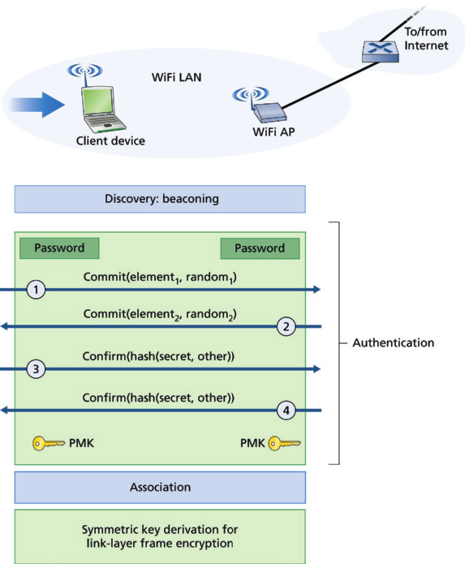

Figure 8.30 WPA3- Personal security

WPA3-Personal uses password-based authentication between the AP and the client device wanting to join the WiFi network. As you’ve probably experienced, the same password is used by all devices attaching to the WiFi network.

And, you may have seen such a password posted on a café wall for all to see— meaning that such a network is secured only against the ne’re-do-wells who don’t know the password! The specific authentication protocol used in WPA-3 is known as Simultaneous Authentication of Equals (SAE) [WiFi Alliance 2024; Kumar 2024].

WPA3-Personal authentication begins following the client device’s receipt of the AP’s beacon message, which contains a field letting the client know that WPA3-Personal is supported. The SAE authentication protocol, shown in Figure 8.30, uses the four-step Dragonfly Key Exchange protocol [RFC 7664]:

1.  Client commit. The client uses the password (a “shared secret” in SAE par-

element lance) to generate a new value, that is cryptographically secure element in that it is not possible to infer the password from the value of .

The client also creates a random value that serves as a nonce. The client sends these values, and others, to the AP in a SAE commit message.

2.  AP commit. The AP receives the client’s commit message. Knowing the

element shared secret, the AP can determine that the client that created also knows the shared secret. So far, so good! The AP then creates element and a random value that serves a nonce and sends these  values, 2 and others, to the client in a SAE commit message.

3.  Client confirm. The client device can similarly determine that the AP that element sent also knows the shared secret. To avoid a replay attack, the 2 client sends a hash of the shared secret and values exchanged in the earlier SAE steps (in particular the nonce) to the AP in an SAE confirm message.

4.  AP confirm. The AP checks the received hash to make sure the correct values were hashed together by the client. It then sends its hash of the shared secret and values exchanged in the earlier SAE steps to the client.

Following this four-step SAE protocol, the client device and AP have authenticated each other, i.e., they have established that each other knows the shared secret even though the shared secret itself hasn’t been transmitted over the network. They then generate a pairwise master key (PMK) based on the shared secret and the random values exchanged during the SAE protocol.

Since each client joining the network will have generated different random values during the SAE protocol, a different PMK will be generated by each client. Also note that each time a client device joins the network, it will generate a new PMK; for this reason, the PMK is sometimes referred to as a “dynamic” key.

Following the Association Request/Response phase (discussed earlier in Section 7.3.4), the PMK will be used in a second handshake between the device and the AP to generate the keys for link-layer encryption of frames exchanged on the WiFi channel.

This process is described in [IEEE 802.11 2020].

Authentication in the WiFi Enterprise Setting:

802.1x and WPA3-Enterprise Figure 8.31 illustrates the interaction between an arriving client device and the authentication server that will authenticate the device. The IEEE 802.1X standard [IEEE 802.1x 2010] defines the authentication process when a device authenticates via an enterprise’s authentication server. Within the 802.1X framework, the Extensible Authentication Protocol (EAP) is used to provide authentication. Wi-Fi Protected 3—Personal (WPA3-Personal) certification simply adopts the IEEE 802.1x standard.

As the word “extensible” would suggest, EAP accommodates many different “methods” for authentication, and the IEEE 802.1X standard does not specify which of these EAP methods to use. There are more than 40 different standardized EAP methods. One method familiar in academic settings, however, is known as EAP-Tunneled Transport Layer Security (EAP-TTLS) [RFC 5281], which is shown in Figure 8.31.

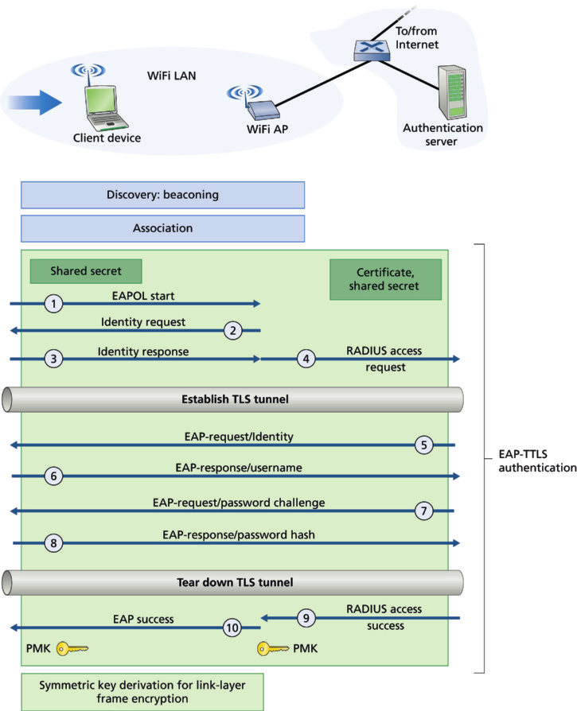

Figure 8.31 WPA3-Enterprise / 802.1x security using EAP-TTLS

Before describing the steps involved in EAP-TTLS, let’s take a look at the big picture. Following the initial beaconing and WLAN association (see Section 7.3.4) between the arriving client device and the AP, the authentication itself occurs between the client and the authentication server, with the AP only serving as a pass-through device. EAP-TTLS relies heavily on the use of a TLS tunnel (which we learned about in Section 8.6) that is created between the client and the authentication server to secure the inner-most EAP-TTLS steps.

Following these steps, the TLS tunnel is torn down, and the PMK is used in a second handshake between the client device and the AP to generate the keys for link-layer encryption of frames exchanged on the WiFi channel, as in WPA3-Personal.

Let’s now consider the EAP-TTLS steps in Figure 8.31 in more detail:

• In steps 1–3, the client device lets the AP know that it wants to authenticate and join the network using EAP. If the AP is configured to allow this, it responds to the client, and asks for (and receives) a placeholder identity;

the client will only reveal its itentity itself within the encrypted TLS tunnel that secures EAP-TTLS messaging with the authentication server.

• In step 4, the AP relays the client’s request to join the WiFi network to the authentication server using the RADIUS protocol, discussed below.

• Recall that as a result of TLS tunnel establishment, the client has authenticated the server via the server’s public-key certificate, and the client and server have agreed on a shared secret. However, the client has not yet been authenticated to the server; this authentication is performed in steps 5–8. Here, the authentication server requests and receives the true identity of the client device, and the client’s shared secret. Once the client’s identity and password have been verified, the server tears down the TLS tunnel, informs the AP that the client has been authenticated, and provides a PMK to the AP so that the AP and the client (which will also derive the same PMK) can establish the encryption keys for the WiFi channel.

#### 802.11 Security Messaging Protocols

Figure 8.32 shows the protocols used to implement the 802.11 security framework discussed above. The Extensible Authentication Protocol (EAP) [RFC 3748] defines the end-to-end message formats used in a simple request/ response mode of interaction between the mobile device and authentication server. As shown in Figure 8.32, EAP messages are encapsulated using EAPoL (EAP over LAN) and sent over the 802.11 wireless link. These EAP messages are then decapsulated at the access point, and then re-encapsulated using the RADIUS protocol for transmission over UDP/IP to the authentication server.

While the RADIUS server and protocol [RFC 2865] are not required, they are de facto standard components. The recently standardized DIAMETER protocol [RFC 3588] is projected to eventually replace RADIUS in the future.

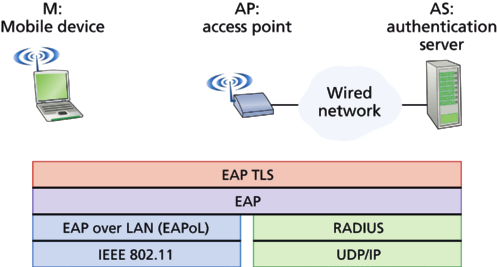

Figure 8.32 EAP is an end-to-end protocol. EAP messages are encapsulated using EAPoL over the wireless link between the mobile device and the access point, and using RADIUS over UDP/IP between the access point and the authentication server

##### 8.8.2 Authentication and Key Agreement in 5G Cellular Networks

In this section, we describe mutual authentication and key-generation mechanisms in 5G networks. Many of the approaches we’ll encounter here parallel those that we just studied in 802.11 networks, with the notable exception that in cellular networks, mobile devices may be attached to their home network (i.e., the cellular carrier network to which they are subscribed), or may be roaming on a visited network. In this latter case, the visited and home networks will need to interact when authenticating a mobile device and generating encryption keys. Before continuing, you may want to re-familiarize yourself with 5G network architecture by re-reading Sections 7.3.3 and 7.5.

The goals of mutual authentication and key generation are the same in the 5G setting as in the 802.11 setting. In order to encrypt the contents of frames being transmitted over the wireless channel, the mobile device and base station will need to derive a shared symmetric encryption key. In addition, the network to which the mobile device is attaching will need to authenticate the device’s identity and check its access privileges. Similarly, the mobile device will also want to authenticate the network to which it is attaching. While the network’s need to authenticate a mobile device may be obvious, the need for authentication in the reverse direction may not be so clear. However, there are documented cases of ne’er-do-wells operating rogue cellular base stations that entice unsuspecting mobile devices to attach to the rogue network, exposing a device to a number of attacks [Li 2017]. So, as in the case of 802.11 WLANs, a mobile device should exercise abundant caution when attaching to a cellular network!

Figure 8.33 (adapted from Figures 6.1.2-1 and 6.1.3.1-1 in [3GPP TS 33.501]) shows the setting and procedure for 5G authentication, which occurs when an arriving user device wants to join a 5G network. Before continuing, you might want to re-read the material in Section 7.4.3 on 5G  user identity and registration, and in particular review Figure 7.42. Having learned about WPA3-Enterprise authentication, we can immediately note a number of structural similarities between 5G and WPA3-Enterprise authentication:

• Authentication occurs between a device and an authentication server. The 5G base station and the 5G Core in the visited network serve primarily as pass-throughs, in the same way that the AP and the network between the device and the Wi-Fi authentication server serve as a pass-through.

• The EAP protocol is used in both settings to carry authentication messages between the device and the authentication server. One EAP protocol used in 5G is EAP-AKA' (Extensible Authentication Protocol—Authentication and Key Agreement Prime), which is used in Figure 8.33.

• G 5  and WiFi authentication both make use of a secret that has been pre-shared between the device and the authentication server. In 5G, that shared secret is contained on the device’s SIM card and on the authentication server in the device’s home (not visited) network.

• TLS is used to securely transport authentication messages in both WPA3- Enterprise and 5G EAP-AKA’.

Figure 8.33 5G Authentication with EAP-AKA’ One difference between Wi-Fi and 5G is, of course, that there is no notion of a home network in Wi-Fi. This is a critically important difference. Note that the 5G authentication decision is made by the Authentication Server (AUSF) in the device’s home network, not in the visited network. This is because the only two places where the device’s identity and cryptographic information are stored are on the device’s SIM card and in the home network. This is a significant change from 4G authentication, where the visited network played a more significant role. This change reflects the belief that only the home network should be trusted to explicitly use, store, and manage sensitive information

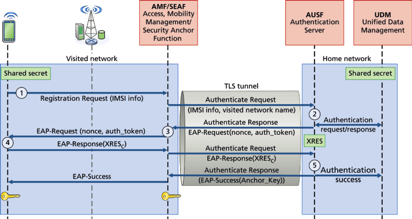

such as the device’s shared secret key. Now let’s consider the steps involved in 5G authentication in more detail: 1. In step 1, the device sends a Registration Request message to the Access and Mobility Management Function (AMF) in the 5G Core of the network that it wants to join. The device includes its International Mobile Subscriber Identity (IMSI), which identifies the device’s home network, as well as its identity in that network. The Security Anchor Function (SEAF), a logical component of the 5G Core AMF, thus has enough information to locate the authentication server function (AUSF) in the 5G Core of the device’s home network, which (when the device is roaming) will be different from the network being joined. The SEAF first establishes a TLS tunnel (see Section 8.6) so that all messages between the SEAF and the Authentication Server will themselves be authenticated and encrypted. 2. In step 2, the AUSF contacts the Unified Data Management function (UDM) in the device’s home network. We learned in Chapter 7 that the UDM contains the IMSI, encryption keys, and service authorizations for the home network’s subscribers. The UDM creates four important pieces of information, stored in an authentication vector (AV), that it returns to the AUSF:

•  A random nonce value.

•  An authentication token, which is a value computed by the UDM that will be used by the device to verify that the authentication information being received is indeed from the device’s home Authentication Server and that it is current (i.e., not being replayed). The token value includes a sequence number and a key derived from the device’s secret key (conveniently known only by the device and its Authentication Server). The token is signed by the UDM using the device’s secret key.

•  The XRES is the “expected response”—the value that the Authentication Server knows the device will compute in response to the random nonce value that the device will receive. The XRES is generated by the UDM using the nonce and device’s shared secret key. Because the device and its Authentication Server both know the shared secret key and the nonce value (and presumably are the only two entities in the world that know that information!), they will compute the same values for XRES.

This XRES value will be used in step 5 below.

•  A key derived from the authentication process that will be used later by the visited network and UE to derive additional keys needed, e.g., to encrypt their communication.

3.  In step 3, the Authentication Server in the home network then sends the random nonce value and the authentication token to the SEAF in the visited network, which then transparently forwards these two pieces of information to the client device.

4.  The device receives the nonce and the authentication token. Given the nonce and its shared secret on its SIM, the device determines that the authentication token was indeed generated by the Authentication Server in its home network, and is not a replay. The device then computes the expected response value on its own, following the same procedure used by the UDM in step 2. Hopefully, the value computed by the client device, XRES , will match the value of XRES computed earlier by the UDM and C now stored in the Authentication Server. The device sends XRES , in an C EAP message to the SEAF, which forwards this information to the Authentication Server. Now comes the moment of truth—the authentication decision!

5.  The Authentication Server checks the received value of XRES with the C previously computed value of XRES. If the two values match, the Authentication Server authenticates the client device and informs the visited network and the home UDM that the device has been authenticated.

The Authentication Server also generates and sends a symmetric anchor key to the visited network. This one-time-use key is computed using the secret shared between the device and the Authentication Server. Thus, the device will also be able to compute the same anchor key value on its own.

The anchor key will be used by the device, the base station, and 5G Core functions in the visited network to compute other keys needed (e.g., for encryption) during the device’s session. The anchor key is thus analogous in many ways to the pairwise master key in Wi-Fi authentication.

Our discussion above has focused on the major steps involved in 5G device authentication. There are additional parameters and conditional protocol steps not shown above; see the 3GPP specification [3GPP TS 33.501] and [RFC 5448] for details. In addition to basic authentication, the visited network will also need to know the services (e.g., voice calling, bandwidth or datausage caps, quality of service policies) that can be used by the visiting device.

See [3GPP TS 29.512 2022].

In this section, we have only briefly overviewed mutual authentication and key agreement in 5G networks. As we have seen, they make extensive use of the security techniques that we studied earlier in this chapter. The references cited above and [Cable Labs 2019] provide more in-depth details on these topics.

#### 8.9 Operational Security: Firewalls and Intrusion Detection Systems

We’ve seen throughout this chapter that the Internet is not a very safe place—bad guys are out there, wreaking all sorts of havoc. Given the hostile nature of the Internet, let’s now consider an organization’s network and the network administrator who administers it. From a network administrator’s point of view, the world divides quite neatly into two camps—the good guys (who belong to the organization’s network, and who should be able to access resources inside the organization’s network in a relatively unconstrained manner) and the bad guys (everyone else, whose access to network resources must be carefully scrutinized).

In many organizations, ranging from medieval castles to modern corporate office buildings, there is a single point of entry/exit where both good guys and bad guys entering and leaving the organization are security-checked. In a castle, this was done at a gate at one end of the drawbridge; in a corporate building, this is done at the security desk. In a computer network, when traffic entering/leaving a network is security-checked, logged, dropped, or forwarded, it is done by operational devices known as firewalls, intrusion detection systems (IDSs), and intrusion prevention systems (IPSs).

##### 8.9.1 Firewalls

A firewall is a combination of hardware and software that isolates an organization’s internal network from the Internet at large, allowing some packets to pass and blocking others. A firewall allows a network administrator to control access between the outside world and resources within the administered network by managing the traffic flow to and from these resources. A firewall has three goals:

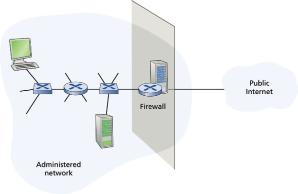

Figure 8.34 Firewall placement between the administered network and the outside world

• All traffic from outside to inside, and vice versa, passes through the firewall.

Figure 8.34 shows a firewall, sitting squarely at the boundary between the administered network and the rest of the Internet. While large organizations may use multiple levels of firewalls or distributed firewalls [Skoudis 2006], locating a firewall at a single access point to the network, as shown in Figure 8.34, makes it easier to manage and enforce a security-access  policy.

• Only authorized traffic, as defined by the local security policy, will be allowed to pass. With all traffic entering and leaving the institutional network passing through the firewall, the firewall can restrict access to authorized traffic.

• The firewall itself is immune to penetration. The firewall itself is a device connected to the network. If not designed or installed properly, it can be compromised, in which case it provides only a false sense of security (which is worse than no firewall at all!).

Palo Alto Networks, Cisco and Check Point are two of the leading firewall vendors today. Furthermore, as discussed in Chapters 4 and 5, firewalls are now frequently implemented in routers and controlled remotely using SDNs.

Firewalls can be classified in three categories: traditional packet filters, stateful filters, and application gateways. We’ll cover each of these in turn in the following subsections.

Traditional Packet Filters As shown in Figure 8.34, an organization typically has a gateway router connecting its internal network to its ISP (and hence to the larger public Internet).

All traffic leaving and entering the internal network passes through this router, and it is at this router where packet filtering occurs. A packet filter examines each datagram in isolation, determining whether the datagram should be allowed to pass or should be dropped based on administrator-specific rules.

Filtering decisions are typically based on:

• IP source or destination address

• Protocol type in IP datagram field: TCP, UDP, ICMP, OSPF, and so on

• TCP or UDP source and destination port

• TCP flag bits: SYN, ACK, and so on

• ICMP message type

• Different rules for datagrams leaving and entering the network

• Different rules for the different router interfaces A network administrator configures the firewall based on the policy of the organization. The policy may take user productivity and bandwidth usage into account as well as the security concerns of an organization. Table 8.5 lists a number of possible polices an organization may have, and how they would be addressed with a packet filter. For example, if the organization doesn’t want any incoming TCP connections except those for its public Web server, it can block all incoming TCP SYN segments except TCP SYN segments with destination port 80 and the destination IP address corresponding to the Web server.

If the organization doesn’t want its users to monopolize access bandwidth with Internet radio applications, it can block all not-critical UDP traffic (since Internet radio is often sent over UDP). If the organization doesn’t want its internal network to be mapped (tracerouted) by an outsider, it can block all ICMP TTL expired messages leaving the organization’s network.

A filtering policy can be based on a combination of addresses and port numbers. For example, a filtering router could forward all Telnet datagrams (those with a port number of 23) except those going to and coming from a list of specific IP addresses.

This policy permits Telnet connections to and from hosts on the allowed list. Unfortunately, basing the policy on external addresses provides no protection against datagrams that have had their source addresses spoofed.

Table 8.5 Policies and corresponding filtering rules for an organization’s

network 130.207/16 with Web server at 130.207.244.203 Policy Firewall Setting

No outside Web access. Drop all outgoing packets to any IP address, port 80.

No incoming TCP connections, except those Drop all incoming TCP SYN packets to any for organization’s public Web server only. IP except 130.207.244.203, port 80.

Prevent Web-radios from eating up the Drop all incoming UDP packets—except available bandwidth. DNS packets.

Prevent your network from being used for a Drop all ICMP ping packets going to a smurf DoS attack. “broadcast” address (eg 130.207.255.255).

Prevent your network from being tracerouted. Drop all outgoing ICMP TTL expired traffic.

Table 8.6 An access control list for a router interface action source address dest address protocol source port dest port flag bit

allow TCP any

222.22/16

outside of 222.22/16 > 1023 80

allow TCP ACK outside of 222.22/16

222.22/16

80 > 1023

allow UDP —

222.22/16

outside of 222.22/16 > 1023 53

allow UDP — outside of 222.22/16

222.22/16

53 > 1023

deny all all all all all all

Filtering can also be based on whether or not the TCP ACK bit is set. This trick is quite useful if an organization wants to let its internal clients connect to external servers but wants to prevent external clients from connecting to internal servers. Recall from Section 3.5 that the first segment in every TCP connection has the ACK bit set to 0, whereas all the other segments in the connection have the ACK bit set to 1. Thus, if an organization wants to prevent external clients from initiating connections to internal servers, it simply filters all incoming segments with the ACK bit set to 0. This policy kills all TCP connections originating from the outside, but permits connections originating internally.

Firewall rules are implemented in routers with access control lists, with each router interface having its own list. An example of an access control list for an organization 222.22/16 is shown in Table 8.6. This access control list is for an interface that connects the router to the organization’s external ISPs.

Rules are applied to each datagram that passes through the interface from top to bottom. The first two rules together allow internal users to surf the Web:

The first rule allows any TCP packet with destination port 80 to leave the organization’s network; the second rule allows any TCP packet with source port 80 and the ACK bit set to enter the organization’s network. Note that if an external source attempts to establish a TCP connection with an internal host, the connection will be blocked, even if the source or destination port is

80. The second two rules together allow DNS packets to enter and leave the organization’s network. In summary, this rather restrictive access control list blocks all traffic except Web traffic initiated from within the organization and DNS traffic. [SEI Best Practices 2017] discusses best practices for network border protection at firewalls.

Readers with sharp memories may recall we encountered access control lists similar to Table 8.6 when we studied generalized forwarding in Section 4.4.3 of Chapter 4. Indeed, we provided an example there of how generalized forwarding rules can be used to build a packet-filtering firewall.

Stateful Packet Filters In a traditional packet filter, filtering decisions are made on each packet in isolation. Stateful filters actually track TCP connections, and use this knowledge to make filtering decisions.

To understand stateful filters, let’s reexamine the access control list in Table 8.6. Although rather restrictive, the access control list in Table 8.6

Table 8.7 Connection table for stateful filter source address dest address source port dest port 222.22.1.7/37.96.87.123 12699 80 222.22.93.2 199.1.205.23 37654 80 222.22.65.143 203.77.240.43 48712 80

nevertheless allows any packet arriving from the outside with ACK = 1 and

source port 80 to get through the filter. Such packets could be used by attackers in attempts to crash internal systems with malformed packets, carry out denial-of-service attacks, or map the internal network. The naive solution is to block TCP ACK packets as well, but such an approach would prevent the organization’s internal users from surfing the Web.

Stateful filters solve this problem by tracking all ongoing TCP connections in a connection table. This is possible because the firewall can observe the beginning of a new connection by observing a three-way handshake (SYN, SYNACK, and ACK); and it can observe the end of a connection when it sees a FIN packet for the connection. The firewall can also (conservatively) assume that the connection is over when it hasn’t seen any activity over the connection for, say, 60 seconds. An example connection table for a firewall is shown in Table 8.7. This connection table indicates that there are currently three ongoing TCP connections, all of which have been initiated from within the organization. Additionally, the stateful filter includes a new column, “check connection,” in its access control list, as shown in Table 8.8. Note that Table 8.8 is identical to the access control list in Table 8.6, except now it indicates that the connection should be checked for two of the rules.

Let’s walk through some examples to see how the connection table and the extended access control list work hand-in-hand. Suppose an attacker attempts to send a malformed packet into the organization’s network by sending a datagram with TCP source port 80 and with the ACK flag set. Further suppose that this packet has source port number 12543 and source IP address 150.23.23.155. When this packet reaches the firewall, the firewall checks the access control list in Table 8.7, which indicates that the connection table must also be checked before permitting this packet to enter the organization’s network. The firewall duly checks the connection table, sees that this packet is not

Table 8.8 Access control list for stateful filter

check

action source address dest address protocol source port dest port flag bit conxion

allow TCP any

222.22/16

outside of 222.22/16 > 1023 80

allow TCP ACK X outside of 222.22/16

222.22/16

80 > 1023

allow UDP —

222.22/16

outside of 222.22/16 > 1023 53

allow UDP — X outside of 222.22/16

222.22/16

53 1023 >

deny all all all all all all

part of an ongoing TCP connection, and rejects the packet. As a second example, suppose that an internal user wants to surf an external Web site. Because this user first sends a TCP SYN segment, the user’s TCP connection gets recorded in the connection table. When the Web server sends back packets (with the ACK bit necessarily set), the firewall checks the table and sees that a corresponding connection is in progress. The firewall will thus let these packets pass, thereby not interfering with the internal user’s Web surfing activity.

Application Gateway In the examples above, we have seen that packet-level filtering allows an organization to perform coarse-grain filtering on the basis of the contents of IP and TCP/UDP headers, including IP addresses, port numbers, and acknowledgment bits. But what if an organization wants to provide, say, an SSH service to a restricted set of internal users (as opposed to IP addresses)? And what if the organization wants such privileged users to authenticate themselves first before being allowed to create SSH sessions to the outside world? Such tasks are beyond the capabilities of traditional and stateful filters. Indeed, information about the identity of the internal users is application-layer data and is not included in the IP/TCP/UDP headers.

To have finer-level security, firewalls must combine packet filters with application gateways. Application gateways look beyond the IP/TCP/UDP headers and make policy decisions based on application data. An application gateway is an application-specific server through which all application data (inbound and outbound) must pass. Multiple application gateways can run on the same host, but each gateway is a separate server with its own processes.

To get some insight into application gateways, let’s design a firewall that allows only a restricted set of internal users to SSH outside and prevents all external clients from SSH inside. Such a policy can be accomplished by implementing a combination of a packet filter (in a router) and a SSH application gateway, as shown in Figure 8.35. The router’s filter is configured to block all

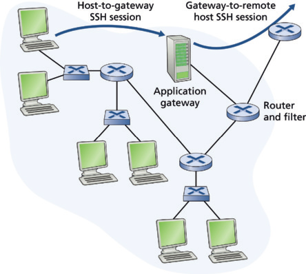

Figure 8.35 Firewall consisting of an application gateway and a filter

SSH connections except those that originate from the IP address of the application gateway. Such a filter configuration forces all outbound SSH connections to pass through the application gateway. Consider now an internal user who wants to SSH to the outside world. The user must first set up a Telnet session with the application gateway. An application running in the gateway, which listens for incoming SSH sessions, prompts the user for a user ID and password. When the user supplies this information, the application gateway checks to see if the user has permission to SSH to the outside world. If not, the SSH connection from the internal user to the gateway is terminated by the gateway.

If the user has permission, then the gateway (1) prompts the user for the host name of the external host to which the user wants to connect, (2) sets up a SSH session between the gateway and the external host, and (3) relays to the external host all data arriving from the user, and relays to the user all data arriving from the external host. Thus, the SSH application gateway not only performs user authorization but also acts as a SSH server and a SSH client, relaying information between the user and the remote SSH server.

Note that the filter will permit step 2 because the gateway initiates the SSH connection to the outside world.

Case History Anonymity and Privacy Suppose you want to visit a controversial Web site (for example, a political activist site) and you (1) don’t want to reveal your IP address to the Web site, (2) don’t want your local ISP (which may be your home or office ISP) to know that you are visiting the site, and (3) don’t want your local ISP to see the data you are exchanging with the site. If you use the traditional approach of connecting directly to the Web site without any encryption, you fail on all three counts.

Even if you use TLS, you fail on the first two counts: Your source IP address is presented to the Web site in every datagram you send; and the destination address of every packet you send can easily be sniffed by your local ISP.

To obtain privacy and anonymity, you can instead use a combination of a trusted proxy server and TLS, as shown in Figure 8.36. With this approach, you first make an TLS connection to the trusted proxy. You then send, into this TLS connection, an HTTP request for a page at the desired site. When the proxy receives the TLS-encrypted HTTP request, it decrypts the request and forwards the cleartext HTTP request to the Web site. The Web site then responds to the proxy, which in turn forwards the response to you over TLS. Because the Web site only sees the IP address of the proxy, and not of your client’s address, you are indeed obtaining anonymous access to the Web site. And because all traffic between you and the proxy is encrypted, your local ISP cannot invade your privacy by logging the site you visited or recording the data you are exchanging.

Many companies today (such as proxify.com) make available such proxy services.

Of course, in this solution, your proxy knows everything: It knows your IP address and the IP address of the site you’re surfing; and it can see all the When a user connects to a server using TOR, TOR randomly chooses (from its proxy pool) a chain of three proxies and routes all traffic between client and server over the chain. In this manner, assuming the proxies do not collude, no one knows that communication took place between your IP address and the target Web site. Furthermore, although cleartext is sent between the last proxy and the server, the last proxy doesn’t know what IP address is sending and receiving the cleartext.

Figure 8.36 Providing anonymity and privacy with a proxy traffic in cleartext exchanged between you and the Web site. Such a solution, therefore, is only as good as the trustworthiness of the proxy. A more robust approach, taken by the TOR anonymizing and privacy service, is to route your traffic through a series of non-colluding proxy servers [TOR 2020]. In particular, TOR allows independent individuals to contribute proxies to its proxy pool.

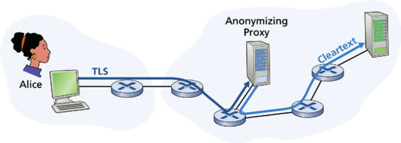

Application gateways do not come without their disadvantages. First, a different application gateway is needed for each application. Second, there is a performance penalty to be paid, since all data will be relayed via the gateway.

This becomes a concern particularly when multiple users or applications are using the same gateway machine. Finally, the client software must know how to contact the gateway when the user makes a request, and must know how to tell the application gateway what external server to connect to.

##### 8.9.2 Intrusion Detection Systems

We’ve just seen that a packet filter (traditional and stateful) inspects IP, TCP, UDP, and ICMP header fields when deciding which packets to let pass through the firewall. However, to detect many attack types, we need to perform deep packet inspection, that is, look beyond the header fields and into the actual application data that the packets carry.

As we saw in Section 8.9.1, application gateways often do deep packet inspection. But an application gateway only does this for a specific application.

Clearly, there is a niche for yet another device—a device that not only examines the headers of all packets passing through it (like a packet filter), but also performs deep packet inspection (unlike a packet filter).

When such a device observes a suspicious packet, or a suspicious series of packets, it could prevent those packets from entering the organizational network. Or, because the activity is only deemed as suspicious, the device could let the packets pass, but send alerts to a network administrator, who can then take a closer look at the traffic and take appropriate actions. A device that generates alerts when it observes potentially malicious traffic is called an intrusion detection system (IDS). A device that filters out suspicious traffic is called an intrusion prevention system (IPS). In this section we study both systems—IDS and IPS—together, since the most interesting technical aspect of these systems is how they detect suspicious traffic (and not whether they send alerts or drop packets). We will henceforth collectively refer to IDS systems and IPS systems as IDS systems.

An IDS can be used to detect a wide range of attacks, including network mapping (emanating, for example, from nmap), port scans, TCP stack scans, DoS bandwidth-flooding attacks, worms and viruses, OS vulnerability attacks, and application vulnerability attacks. (See Section 1.6 for a survey of network attacks.) Today, thousands of organizations employ IDS systems. Many of these deployed systems are proprietary, marketed by Palo Alto Networks, Check Point, and other security and router/switch equipment vendors.

But many of the deployed IDS systems are public-domain systems, such as the immensely popular Snort IDS system (which we’ll discuss shortly).

An organization may deploy one or more IDS sensors in its organizational network. Figure 8.37 shows an organization that has three IDS sensors. When multiple sensors are deployed, they typically work in concert, sending information about suspicious traffic activity to a central IDS processor, which collects

Figure 8.37 An organization deploying a filter, an application gateway, and IDS

sensors

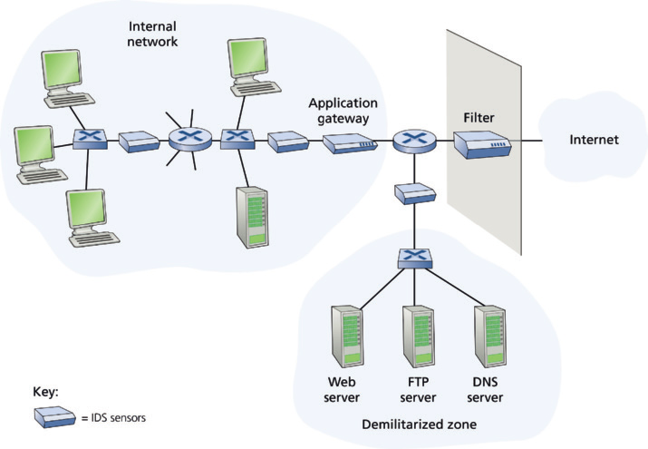

and integrates the information and sends alarms to network administrators when deemed appropriate. In Figure 8.37, the organization has partitioned its network into two regions: a high-security region, protected by a packet filter and an application gateway and monitored by IDS sensors; and a lower-security region—referred to as the demilitarized zone (DMZ)—which is protected only by the packet filter, but also monitored by IDS sensors. Note that the DMZ includes the organization’s servers that need to communicate with the outside world, such as its public Web server and its authoritative DNS server.

You may be wondering at this stage, why multiple IDS sensors? Why not just place one IDS sensor just behind the packet filter (or even integrated with the packet filter) in Figure 8.37? We will soon see that an IDS not only needs to do deep packet inspection, but must also compare each passing packet with tens of thousands of “signatures”; this can be a significant amount of processing, particularly if the organization receives Gigabits/sec of traffic from the Internet. By placing the IDS sensors further downstream, each sensor sees only a fraction of the organization’s traffic, and can more easily keep up. Nevertheless, highperformance IDS and IPS systems are available today, and many organizations can actually get by with just one sensor located near its access router.

IDS systems are broadly classified as either signature-based systems or anomaly-based systems. A signature-based IDS maintains an extensive database of attack signatures. Each signature is a set of rules pertaining to an intrusion activity. A signature may simply be a list of characteristics about a single packet (e.g., source and destination port numbers, protocol type, and a specific string of bits in the packet payload) or may relate to a series of packets.

The signatures are normally created by skilled network security engineers who research known attacks. An organization’s network administrator can customize the signatures or add its own to the database.

Operationally, a signature-based IDS sniffs every packet passing by it, comparing each sniffed packet with the signatures in its database. If a packet (or series of packets) matches a signature in the database, the IDS generates an alert. The alert could be sent to the network administrator in an e-mail message, could be sent to the network management system, or could simply be logged for future inspection.

Signature-based IDS systems, although widely deployed, have a number of limitations. Most importantly, they require previous knowledge of the attack to generate an accurate signature. In other words, a signature-based IDS is completely blind to new attacks that have yet to be recorded. Another disadvantage is that even if a signature is matched, it may not be the result of an attack, so that a false alarm is generated. Finally, because every packet must be compared with an extensive collection of signatures, the IDS can become overwhelmed with processing and actually fail to detect many malicious packets.

An anomaly-based IDS creates a traffic profile as it observes traffic in normal operation. It then looks for packet streams that are statistically unusual, for example, an inordinate percentage of ICMP packets or a sudden exponential growth in port scans and ping sweeps. The great thing about anomaly-based IDS systems is that they don’t rely on previous knowledge about existing attacks—that is, they can potentially detect new, undocumented attacks. On the other hand, it is an extremely challenging problem to distinguish between normal traffic and statistically unusual traffic. To date, most IDS deployments are primarily signature-based, although some include some anomaly-based features.

Snort Snort is a public-domain, open source IDS with hundreds of thousands of existing deployments [Snort 2012; Koziol 2003]. It can run on Linux, UNIX, and Windows platforms. It uses the generic sniffing interface libpcap, which is also used by Wireshark and many other packet sniffers. It can easily handle 100 Mbps of traffic; for installations with Gibabit/sec traffic rates, multiple Snort sensors may be needed.

To gain some insight into Snort, let’s take a look at an example of a Snort signature:

alert icmp $EXTERNAL_NET any -> $HOME_NET any (msg:”ICMP PING NMAP”; dsize: 0; itype: 8;) This signature is matched by any ICMP packet that enters the organization’s $HOME_NET $EXTERNAL_NET network  from the outside , is of type 8 (ICMP

ping), and has an empty payload dsize = 0 . Since nmap (see Section 1.6) 

generates ping packets with these specific characteristics, this signature is designed to detect nmap ping sweeps. When a packet matches this signature,

ICMP PING NMAP Snort generates an alert that includes the message “ ”.

Perhaps what is most impressive about Snort is the vast community of users and security experts that maintain its signature database. Typically, within a few hours of a new attack, the Snort community writes and releases an attack signature, which is then downloaded by the hundreds of thousands of Snort deployments distributed around the world. Moreover, using the Snort signature syntax, network administrators can tailor the signatures to their own organization’s needs by either modifying existing signatures or creating entirely new ones.

#### 8.10 Summary

In this chapter, we’ve examined the various mechanisms that our secret lovers, Bob and Alice, can use to communicate securely. We’ve seen that Bob and Alice are interested in confidentiality (so they alone are able to understand the contents of a transmitted message), end-point authentication (so they are sure that they are talking with each other), and message integrity (so they are sure that their messages are not altered in transit). Of course, the need for secure communication is not confined to secret lovers. Indeed, we saw in Sections 8.5 through 8.8 that security can be used in various layers in a network architecture to protect against bad guys who have a large arsenal of possible attacks at hand.

The first part of this chapter presented various principles underlying secure communication. In Section 8.2, we covered cryptographic techniques for encrypting and decrypting data, including symmetric key cryptography and public key cryptography. DES and RSA were examined as specific case studies of these two major classes of cryptographic techniques in use in today’s networks.

In Section 8.3, we examined two approaches for providing message integrity: message authentication codes (MACs) and digital signatures. The two approaches have a number of parallels. Both use cryptographic hash functions and both techniques enable us to verify the source of the message as well as the integrity of the message itself. One important difference is that MACs do not rely on encryption whereas digital signatures require a public key infrastructure. Both techniques are extensively used in practice, as we saw in Sections 8.5 through 8.8.Furthermore, digital signatures are used to create digital certificates, which are important for verifying the validity of public keys.

In Section 8.4, we examined endpoint authentication and introduced nonces to defend against the replay attack.

In Sections 8.5 through 8.8 we examined several security networking protocols that enjoy extensive use in practice. We saw that symmetric key cryptography is at the core of PGP, TLS, IPsec, and wireless security. We saw that public key cryptography is crucial for both PGP and TLS. We saw that PGP uses digital signatures for message integrity, whereas TLS and IPsec use MACs.

We also explored security in wireless networks, including WiFi  networks and 4G 5G cellular networks. Having now an understanding of the basic principles of cryptography, and having studied how these principles are actually used, you are now in position to design your own secure network protocols!

Armed with the techniques covered in Sections 8.2 through 8.8, Bob and Alice can communicate securely. But confidentiality is only a small part of the network security picture. As we learned in Section 8.9, increasingly, the focus in network security has been on securing the network infrastructure against a potential onslaught by the bad guys. In the latter part of this chapter, we thus covered firewalls and IDS systems which inspect packets entering and leaving an organization’s network.

Homework Problems and Questions Chapter 8 Review Problems Section 8.2 R3.  From a service perspective, what is an impor- Section 8.1

tant difference between a symmetric-key sys- R1.  What are the differences between message tem and a public-key system? confidentiality and message integrity? Can R4.  Suppose that an intruder has an encrypted you have confidentiality without integrity? message as well as the decrypted version of Can you have integrity without confidentialthat message. Can the intruder mount a ity? Justify your answer. ciphertext-only attack, a known-plaintext R2.  Internet entities (routers, switches, DNS servattack, or a chosen-plaintext attack? ers, Web servers, user end systems, and so on) R5.  Consider an 8-bit block cipher. How many often need to communicate securely. Give possible input blocks does this cipher have? three specific example pairs of Internet enti- How many possible mappings are there? ties that may want secure communication.

If we view each mapping as a key, then how message. In this context, do you think a MAC-

many possible keys does this cipher have? based or a digital-signature-based integrity scheme is more suitable? Why? R6.  Suppose N people want to communicate with each of N − 1 other people using symmetric R16.  What is the purpose of a nonce in an end-

key encryption. All communication between point authentication protocol?

any two people, i and j, is visible to all other R17.  What does it mean to say that a nonce is a people in this group of N , and no other peronce-in-a-lifetime value? In whose lifetime? son in this group should be able to decode R18.  ls the message integrity scheme based on their communication. How many keys are HMAC susceptible to playback attacks? If so, required in the system as a whole? Now suphow can a nonce be incorporated into the pose that public key encryption is used. How scheme to remove this susceptibility? many keys are required in this case?

Sections 8.5–8.8 R7.  S u p p o s e n = 10,000, a = 10,023 ,  a n d

b = 10, 004. Use an identity of modular arith- R19.  Suppose that Bob receives a PGP message metic to calculate in your head a b i mod n.  from Alice. How does Bob know for sure that

R8.  Suppose you want to encrypt the message Alice created the message (rather than, say,

10101111 by encrypting the decimal number Trudy)? Does PGP use a MAC for message

that corresponds to the message. What is the integrity?

decimal number? R20.  In the TLS record, there is a field for TLS sequence numbers. True or false? Sections 8.3–8.4

R21.  What is the purpose of the random nonces in R9.  In what way does a hash provide a better the TLS handshake? message integrity check than a checksum R22.  Suppose an TLS session employs a block (such as the Internet checksum)? cipher with CBC. True or false: The server R10.  Can you “decrypt” a hash of a message to get sends to the client the IV in the clear. the original message? Explain your answer. R23.  Suppose Bob initiates a TCP connection to R11.  Consider a variation of the MAC algorithm Trudy who is pretending to be Alice. During (Figure 8.9) where the sender sends the handshake, Trudy sends Bob Alice’s cerm H m , + s , where H m + s is the con- (  )  tificate. In what step of the TLS handshake catenation of H m  and s. Is this variation  algorithm will Bob discover that he is not flawed? Why or why not? communicating with Alice? R12.  What does it mean for a signed document to R24.  Consider sending a stream of packets from be verifiable and nonforgeable? Host A to Host B using IPsec. Typically, a new R13.  In what way does the public-key encrypted SA will be established for each packet sent in message hash provide a better digital signathe stream. True or false? ture than the public-key encrypted message? R25.  Suppose that TCP is being run over IPsec R14.  Suppose certifier.com creates a certificate for between headquarters and the branch office foo.com. Typically, the entire certificate would in Figure 8.28. If TCP retransmits the same be encrypted with certifier.com’s public key. packet, then the two corresponding packets True or false? sent by R1 packets will have the same

R15.  Suppose Alice has a message that she is ready sequence number in the ESP header. True or

to send to anyone who asks. Thousands of false?

people want to obtain Alice’s message, but R26.  An IKE SA and an IPsec SA are the same each wants to be sure of the integrity of the thing. True or false?

R27.  Consider WEP for 802.11. Suppose that the TCP flag bits as well as other header fields.

True or false? data is 10101100 and the keystream is

1111000. What is the resulting ciphertext? R30.  In a traditional packet filter, each interface can have its own access control list. True or false? Section 8.9 R31.  Why must an application gateway work in R28.  Stateful packet filters maintain two data strucconjunction with a router filter to be effective? tures. Name them and briefly describe what R32.  Signature-based IDSs and IPSs inspect into they do. the payloads of TCP and UDP segments. True R29.  Consider a traditional (stateless) packet filter. or false? This packet filter may filter packets based on

Problems P1. Using the monoalphabetic cipher in Figure 8.3, encode the message “This is an easy problem.” Decode the message “rmij’u uamu xyj.” P2. Show that Trudy’s known-plaintext attack, in which she knows the (ciphertext, plaintext) translation pairs for seven letters, reduces the number of possible substitutions to be checked in the example in Section 8.2.1 by approximately 10 9 .

P3. Consider the polyalphabetic system shown in Figure 8.4. Will a chosenplaintext attack that is able to get the plaintext encoding of the message “The quick brown fox jumps over the lazy dog.” be sufficient to decode all messages? Why or why not?

P4. Consider the block cipher in Figure 8.5. Suppose that each block cipher T simply reverses the order of the eight input bits (so that, for example, i 11110000 becomes 00001111). Further suppose that the 64-bit scrambler does not modify any bits (so that the output value of the mth bit is equal

to the input value of the mth bit). (a) With n = 3 and the original 64-bit

input equal to 10100000 repeated eight times, what is the value of the output? (b) Repeat part (a) but now change the last bit of the original 64-bit input from a 0 to a 1. (c) Repeat parts (a) and (b) but now suppose that the 64-bit scrambler inverses the order of the 64 bits.

P5. Consider the block cipher in Figure 8.5. For a given “key” Alice and Bob would need to keep eight tables, each 8 bits by 8 bits. For Alice (or Bob) to store all eight tables, how many bits of storage are necessary? How does this number compare with the number of bits required for a fulltable 64-bit block cipher?

P6. Consider the 3-bit block cipher in Table 8.1. Suppose the plaintext is

100100100. (a) Initially assume that CBC is not used. What is the resulting ciphertext? (b) Suppose Trudy sniffs the ciphertext. Assuming she knows that a 3-bit block cipher without CBC is being employed (but doesn’t know the specific cipher), what can she surmise? (c) Now suppose that CBC is used with IV = 111. What is the resulting ciphertext?

P7. (a) Using RSA, choose = = p 3 and q 11, and encode the word “dog” by

encrypting each letter separately. Apply the decryption algorithm to the encrypted version to recover the original plaintext message. (b) Repeat part (a) but now encrypt “dog” as one message m.

P8. Consider RSA with p = 5 and q = 11.

a.  What are n and z?

b.  Let e be 3. Why is this an acceptable choice for e?

c.  Find d such that = < de 1 (mod z) and d 160.

d.  Encrypt the message m = 8 using the key n e , . Let c denote the cor- 

responding ciphertext. Show all work. Hint: To simplify the calculations, use the fact:

a mod n i b mod n mod n = a b i mod n [  ] 

P9. In this problem, we explore the Diffie-Hellman (DH) public-key encryption algorithm, that we studied in Section 8.2.2 a.  With p = 11 and g = 2, suppose Alice and Bob choose private keys

S = 5 and S = 12 , respectively. Calculate Alice’s and Bob’s public A B keys, T and T . Show all work. A B b.  Following up on part (b), now calculate S as the shared symmetric key.

Show all work.

c.  Provide a timing diagram that shows how Diffie-Hellman can be attacked by a man-in-the-middle. The timing diagram should have three vertical lines, one for Alice, one for Bob, and one for the attacker Trudy.

P10.  Suppose Alice wants to communicate with Bob using symmetric key cryptography using a session key K . In Section 8.2, we learned how S public-key cryptography can be used to distribute the session key from Alice to Bob. In this problem, we explore how the session key can be distributed—without public key cryptography—using a key distribution center (KDC). The KDC is a server that shares a unique secret symmetric key with each registered user. For Alice and Bob, denote these keys by K and K . Design a scheme that uses the KDC to distribute K A KDC − B KDC − S to Alice and Bob. Your scheme should use three messages to distribute the session key: a message from Alice to the KDC; a message from the KDC to Alice; and finally a message from Alice to Bob. The first message is K (A, B). Using the notation, K , K , S, A, and B answer A KDC − A KDC − B KDC − the following questions.

a.  What is the second message?

b.  What is the third message?

P11.  Compute a third message, different from the two messages in Figure 8.8, that has the same checksum as the messages in Figure 8.8.

P12.  Suppose Alice and Bob share two secret keys: an authentication key S and a symmetric encryption key S . Augment Figure 8.9 so that both 2 integrity and confidentiality are provided.

P13.  In the BitTorrent P2P file distribution protocol (see Chapter 2), the seed breaks the file into blocks, and the peers redistribute the blocks to each other. Without any protection, an attacker can easily wreak havoc in a torrent by masquerading as a benevolent peer and sending bogus blocks to a small subset of peers in the torrent. These unsuspecting peers then redistribute the bogus blocks to other peers, which in turn redistribute the bogus blocks to even more peers. Thus, it is critical for BitTorrent to have a mechanism that allows a peer to verify the integrity of a block, so that it doesn’t redistribute bogus blocks. Assume that when a peer joins a tor-

.torrent rent, it initially gets a file from a fully trusted source. Describe

a simple scheme that allows peers to verify the integrity of blocks.

P14.  The OSPF routing protocol uses a MAC rather than digital signatures to provide message integrity. Why do you think a MAC was chosen over digital signatures?

P15.  Consider our authentication protocol in Figure 8.18 in which Alice authenticates herself to Bob, which we saw works well (i.e., we found no flaws in it). Now suppose that while Alice is authenticating herself to Bob, Bob must authenticate himself to Alice. Give a scenario by which Trudy, pretending to be Alice, can now authenticate herself to Bob as Alice. (Hint:

Consider that the sequence of operations of the protocol, one with Trudy initiating and one with Bob initiating, can be arbitrarily interleaved. Pay particular attention to the fact that both Bob and Alice will use a nonce, and that if care is not taken, the same nonce can be used maliciously.) P16.  A natural question is whether we can use a nonce and public key cryptography to solve the end-point authentication problem in Section 8.4.

Consider the following natural protocol: (1) Alice sends the message “I am Alice” to Bob. (2) Bob chooses a nonce, R, and sends it to Alice.

(3) Alice uses her private key to encrypt the nonce and sends the resulting value to Bob. (4) Bob applies Alice’s public key to the received message.

Thus, Bob computes R and authenticates Alice.

a.  Diagram this protocol, using the notation for public and private keys employed in the textbook.

b.  Suppose that certificates are not used. Describe how Trudy can become a “woman-in-the-middle” by intercepting Alice’s messages and then pretending to be Alice to Bob.

P17.  Figure 8.21 shows the operations that Alice must perform with PGP to provide confidentiality, authentication, and integrity. Diagram the corresponding operations that Bob must perform on the package received from Alice.

P18.Suppose Alice wants to send an e-mail to Bob. Bob has a public-private key pair ( K + , K ) , and Alice has Bob’s certificate.

But Alice does not − B B have a public, private key pair. Alice and Bob (and the entire world) share the same hash function H . i 

a.  In this situation, is it possible to design a scheme so that Bob can verify that Alice created the message? If so, show how with a block diagram for Alice and Bob.

b.  Is it possible to design a scheme that provides confidentiality for sending the message from Alice to Bob? If so, show how with a block diagram for Alice and Bob.

P19.  Consider the Wireshark output below for a portion of an SSL session.

a.  Is Wireshark packet 112 sent by the client or server?

b.  What is the server’s IP address and port number?

c.  Assuming no loss and no retransmissions, what will be the sequence number of the next TCP segment sent by the client?

d.  How many SSL records does Wireshark packet 112 contain?

e.  Does packet 112 contain a Master Secret or an Encrypted Master Secret or neither?

f.  Assuming that the handshake type field is 1 byte and each length field is 3 bytes, what are the values of the first and last bytes of the Master Secret (or Encrypted Master Secret)?

g.  The client encrypted handshake message takes into account how many SSL records?

h.  The server encrypted handshake message takes into account how many SSL records?

P20.  In Section 8.6.1, it is shown that without sequence numbers, Trudy (a woman-in-the middle) can wreak havoc in a TLS session by interchanging TCP segments. Can Trudy do something similar by deleting a TCP segment? What does she need to do to succeed at the deletion attack?

What effect will it have?

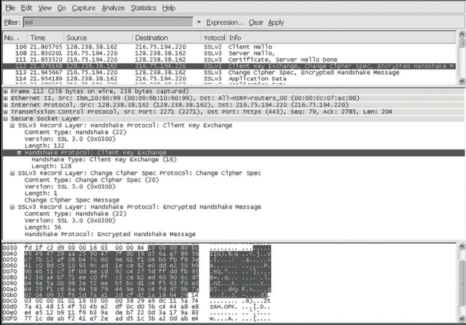

(Wireshark screenshot reprinted by permission of the Wireshark Foundation.)

P21.  Suppose Alice and Bob are communicating over a TLS session. Suppose an attacker, who does not have any of the shared keys, inserts a bogus TCP segment into a packet stream with correct TCP checksum and sequence numbers (and correct IP addresses and port numbers). Will TLS at the receiving side accept the bogus packet and pass the payload to the receiving application? Why or why not?

P22.  The following true/false questions pertain to Figure 8.28.

a.  When a host in 172.16.1 24 sends a datagram to an Amazon.com server, the router R1 will encrypt the datagram using IPsec.

b.  When a host in 172.16.1 24 sends a datagram to a host in 172.16.2 24, the router R1 will change the source and destination address of the IP datagram.

c.  Suppose a host in 172.16.1 24 initiates a TCP connection to a Web server in 172.16.2 24. As part of this connection, all datagrams sent by R1 will have protocol number 50 in the left-most IPv4 header field.

d.  Consider sending a TCP segment from a host in 172.16.1 24 to a host in 172.16.2 24. Suppose the acknowledgment for this segment gets lost, so that TCP resends the segment. Because IPsec uses sequence numbers, R1 will not resend the TCP segment.

P23.  Consider the example in Figure 8.28. Suppose Trudy is a woman-in-themiddle, who can insert datagrams into the stream of datagrams going from R1 and R2. As part of a replay attack, Trudy sends a duplicate copy of one of the datagrams sent from R1 to R2. Will R2 decrypt the duplicate datagram and forward it into the branch-office network? If not, describe in detail how R2 detects the duplicate datagram.

P24.  Provide a filter table and a connection table for a stateful firewall that is as restrictive as possible but accomplishes the following:

a.  Allows all internal users to establish Telnet sessions with external hosts.

b.  Allows external users to surf the company Web site at 222.22.0.12.

c.  But otherwise blocks all inbound and outbound traffic.

The internal network is 222.22 16. In your solution, suppose that the connection table is currently caching three connections, all from inside to outside. You’ll need to invent appropriate IP addresses and port numbers.

P25.  Suppose Alice wants to visit the Web site activist.com using a TOR-like service. This service uses two non-colluding proxy servers, Proxy1 and Proxy2. Alice first obtains the certificates (each containing a public key)

+ + for Proxy1 and Proxy2 from some central server. Denote K , K ,  1 2 K − , and K − for the encryption/decryption with public and private  1 2 RSA keys.

a.  Using a timing diagram, provide a protocol (as simple as possible) that enables Alice to establish a shared session key S with Proxy1. 1

Denote S m for encryption/decryption of data m with the shared  key S .

b.  Using a timing diagram, provide a protocol (as simple as possible) that allows Alice to establish a shared session key S with Proxy2 with- 2 out revealing her IP address to Proxy2.

c.  Assume now that shared keys S and S are now established. Using 1 2 a timing diagram, provide a protocol (as simple as possible and not using public-key cryptography) that allows Alice to request an html page from activist.comwithout revealing her IP address to Proxy2 and without revealing to Proxy1 which site she is visiting. Your diagram should end with an HTTP request arriving at activist.com.

Wireshark Lab: TLS

IPsec Lab In this lab (available from this book’s Web site), we investigate the Transport Layer Security (TLS) pro- In this lab (available from the book Web site), we tocol. Recall from Section 8.6 that TLS is used for will explore how to create IPsec SAs between linux securing a TCP connection, and that it is extensively boxes. You can do the first part of the lab with two used in practice for secure Internet transactions. In ordinary linux boxes, each with one Ethernet this lab, we will focus on the TLS records sent over adapter. But for the second part of the lab, you will the TCP connection. We will attempt to delineate need four linux boxes, two of which having two and classify each of the records, with a goal of Ethernet adapters. In the second half of the lab, understanding the why and how for each record. you will create IPsec SAs using the ESP protocol in We investigate the various TLS record types as well the tunnel mode. You will do this by first manuas the fields in the TLS messages. We do so by anaally creating the SAs, and then by having IKE lyzing a trace of the TLS records sent between your create the SAs. host and an e-commerce server.

AN INTERVIEW WITH...


Lorrie Faith Cranor Lorrie Faith Cranor is a professor in the Software and Societal Systems Depart- ment S3D and in the Engineering and Public Policy Department (EPP) at Carn-  egie Mellon University, where she directs the CyLab Security and Privacy Institute. Her research focuses on “usable privacy and security,” and has included studies of usability issues associated with password policies, access control systems, privacy notices, mobile app privacy labels, and more. She founded the Symposium On Usable Privacy and Security (SOUPS) in 2005 and co-founded the Conference on Privacy Engineering Practice and Respect (PEPR) in 2019.

In 2016, she served as Chief Tech Courtesy of Lorrie Faith Cranor nologist at the U.S. Federal Trade Commission. She is also a co-founder of Wombat Security Technologies, Inc., a security awareness training company. She is a Fel- low of ACM, IEEE, and AAAS. She was also elected to the ACM CHI Academy and received the 2018 ACM CHI Social Impact Award, the 2018 International Association of Privacy Professionals Privacy Leadership Award, and (with colleagues) the 2018 IEEE Cybersecurity Award for Practice. She was previously a researcher at AT&T Labs-Research and taught in the Stern School of Business at New York University. She holds a doctorate in Engineering and Policy from Washington University in St. Louis. What inspired you to start research in usable privacy and security? One of the first projects I got involved with at AT&T Labs-Research aimed at developing a standard computer-readable language for website privacy policies called the Platform for Privacy Preferences P3P . I chaired the P3P working group at the  World Wide Web Consortium W3C , and we spent over 5 years working out the  details. The more I worked on P3P, the more I realized that it would only be useful if Web browsers that read the P3P metadata did something helpful to users. The major browser vendors would not commit to building the full P3P protocol, so I led a project to build a P3P browser plugin called Privacy Bird at AT&T. I looked for research papers on building usable privacy or security tools and didn’t find much. As the project was winding down, I met other researchers interested in the nascent field of usable security at a workshop. Around that time, I decided to do an academic job search. In my job talk, I described my work on P3P and Privacy Bird and my plan for more research around usable privacy and security. CMU hired me, and I started a usable privacy and security lab at CMU and then the SOUPS conference. You’ve served in government and are interested in policy as well as technology. How did that come about? Did those interests evolve, or were they always there? I have three degrees from the (now defunct) Engineering and Public Policy Depart- ment at Washington University (WashU) in St. Louis. I worked on a technology assessment on video telephones back in the 1990s and then did a master’s thesis on electronic newspapers. My dissertation was on electronic voting. What really cemented my interest in technology policy issues was when I attended the Computers, Freedom, and Privacy Conference in 1993. It was an eye-opening experience to hear about the emerging Internet policy issues of the time and to meet the people who were on the front lines of Internet policy debates, including the board of the newly formed Electronic Frontier Foundation. I came back to WashU and asked my advisor, Ron Cytron, why we didn’t have any courses I could take to learn more about Internet policy issues. He suggested I could teach one, and that ended up being a great learning experience for me. Of course, I had to go back to CFP 94 and CFP 95.

I went every year after that for a while and by the time we got to CFP 2000 I was the conference chair, and in 2007 I joined the EFF board.

While I was at AT&T in the late 1990s, I got deeply involved in a couple of technology policy issues. AT&T was supporting efforts to protect children online without infringing the rights of adults. The AT&T government affairs team asked me to present a study about online child safety tools at an event that Vice President Al Gore was keynoting. I subsequently served as an expert witness in several cases challenging the constitutionality of state “harmful to minors” laws and the Federal Child Online Protection Act. I was also working on P3P, which the U.S. Federal Trade Commission and data protection commissioners from around the world were following closely. Thankfully, there were law professors involved in the P3P project who taught me about international privacy laws and gave me a crash course in international diplomacy before I had to present the project to regulators. The FTC staff called me regularly because, even though I worked for a big company, I wasn’t a lobbyist, and they could also understand my explanations about how technology worked. They continued to call me after I joined the CMU faculty, and eventually, FTC Chairwoman Edith Ramirez asked me to spend a year at the FTC as the Chief Technologist. Since then, I’ve gotten my students involved in technology policy projects. I’m especially proud of our work designing and testing the California Opt-Out icon, which now appears widely in the footer of commercial websites to indicate where people can find privacy controls.

A note on URLs. In the references below, we have provided URLs for Web pages, Web-only documents, and other material that has not been published in a conference or journal (when we have been able to locate a URL for such material). We have not provided URLs for conference and journal publications, as these documents can usually be located via a search engine, from the conference Web site (e.g., papers in all ACM SIGCOMM conferences and workshops can be located via http://www.acm.org/sigcomm), or via a digital library subscription. While all URLs provided below were valid (and tested) in Jan. 2020, URLs can become out of date. Please consult the online version of this book (www.

pearsonhighered.com/cs-resources) for an up-to-date bibliography.

A note on Internet Request for Comments (RFCs): Copies of Internet RFCs are available at many sites. The RFC Editor of the Internet Society (the body that oversees the RFCs) maintains the site, http://www.rfc-editor.org.

This site allows you to search for a specific RFC by title, number, or authors, and will show updates to any RFCs listed. Internet RFCs can be updated or obsoleted by later RFCs. Our favorite site for getting RFCs is the original source—http:// www.rfc-editor.org.

[3GPP GTPv1-U 2019] 3GPP, “Tunnelling Protocol User Plane (GTPv1-U),” 3GPP Technical Specification 29.281version 15.3.0, 2018.

[3GPP PDCP 2019] 3GPP, “Packet Data Convergence Protocol (PDCP) Specification,” 3GPP Technical Specification 36.323 version 15.4.0, 2019.

[3GPP RLCP 2018] 3GPP, “Radio Link Control (RLC) protocol specification,” 3GPP Technical Specification 25.322 version 15.0.0, 2018.

[3GPP SAE 2019] 3GPP, “System Architecture Evolution (SAE); Security architecture,” Technical Specification 33.401, version 15.9.0, October 2019.” [3GPP TS 23.* specifications 2024] 3GPP, 3GPP Specification series, https:// www.3gpp.org/dynareport?code=23-series.htm [3GPP TS 23.501 2024] 3GPP, “System architecture for the 5G System (5GS),” Available at [3GPP TS 23.* specifications 2024].

[3GPP TS 23.502 2024] 3GPP, “Procedures for the 5G System (5GS)” Available at [3GPP TS 23.* specifications 2024].

[3GPP TS 29.281 2022] 3GPP, “TS 29.281: General Packet Radio System (GPRS) Tunnelling Protocol User Plane (GTPv1-U)”, V17.4.0, 2022.

[3GPP TS 29.512] 3GPP, “Session Management Policy Control Service,” TS

#### 29.512 version 17.6.0, 2022.

[3GPP TS 33.501] 3GPP, “Security architecture and procedures for 5G System,” 3GPP TS 33.501 version 17.5.0 Release 17.

[3GPP TS 33.501] 3GPP, “Security architecture and procedures for 5G System,” 3GPP TS 33.501 version 17.5.0 Release 17.

[3GPP TS 38.* specifications 2024] 3GPP, 3GPP Specification series, https:// www.3gpp.org/dynareport?code=38-series.htm [3GPP TS 38.101-1 2024] 3GPP, “NR; User Equipment (UE) radio transmission and reception; Part 1: Range 1 Standalone”, Available at [3GPP TS38.* specifications 2024].

[3GPP 38.214 2024] 3GPP, “5G; NR; “Physical layer procedures for data,” (3GPP TS

#### 38.214 version 17.1.0 Release 17). Available at [3GPP TS38.* specifications 2024].

[3GPP TS 38.300] NR and NG-RAN Overall description; Stage-2. Available at [3GPP TS38.* specifications 2024].

[3GPP TS 138.300 2024] NR and NG-RAN Overall description; Stage-2. Available at [3GPP TS38.* specifications 2024] [3GPP SDAP TS 38.300 2024] 3GPP, “NR; NR and NG-RAN Overall description; Stage-2”, see section 6.6 for SDAP, Available at [3GPP TS38.* specifications 2024].

[3GPP MAC TS 38.321 2024] 3GPP, “NR; Medium Access Control (MAC) protocol specification.” Available at [3GPP TS38.* specifications 2024].

[3GPP RLC TS 38.322 2024] 3GPP, “NR; Radio Link Control (RLC) protocol specification.” Available at [3GPP TS38.* specifications 2024].

[3GPP PDCP TS 38.323 2024] 3GPP, “NR; Packet Data Convergence Protocol (PDCP) specification.” [3GPP RRC TS 38.331 2024] 3GPP, “NR; Radio Resource Control (RRC); Protocol specification. Available at [3GPP TS 38.* specifications 2024].

[3GPP TS 38.401] 3GPP, “ NG-RAN; Architecture description,” Available at [3GPP TS 38.* specifications 2024].

[5GTechnologyWorld 2021] 5G Technology World, “Open RAN Functional Splits Explained,” https://www.5gtechnologyworld.com/open-ran-functionalsplits-explained/ 2021.

[Abramson 1970] N. Abramson, “The Aloha System—Another Alternative for Computer Communications,” Proc. 1970 Fall Joint Computer Conference, AFIPS Conference, p. 37, 1970.

[Abramson 1972] N. Abramson, “Packet switching with satellites.” Proc. 1973 National Computer Conference and Exposition, pp. 695-702. 1973.

[Abramson 1985] N. Abramson, “Development of the Alohanet,” IEEE Transactions on Information Theory, Vol. IT-31, No. 3 (Mar. 1985), pp. 119–123.

[Abramson 2009] N. Abramson, “The Alohanet—Surfing for Wireless Data,” IEEE Communications Magazine, Vol. 47, No. 12, pp. 21–25.

[ACM 2022] ACM, “ACM A.M. Turing Award Honors Bob Metcalfe for Invention, Standardization, and Commercialization of Ethernet,” https://awards.

acm.org/about/2022-turing, 2022.

[Adhikari 2011a] V. K. Adhikari, S. Jain, Y. Chen, Z. L. Zhang, “Vivisecting YouTube: An Active Measurement Study,” Technical Report, University of Minnesota,  2011.

[Adhikari 2012] V. K. Adhikari, Y. Gao, F. Hao, M. Varvello, V. Hilt, M. Steiner, Z. L. Zhang, “Unreeling Netflix: Understanding and Improving Multi-CDN Movie Delivery,” Technical Report, University of Minnesota, 2012.

[Afanasyev 2010] A. Afanasyev, N. Tilley, P. Reiher, L. Kleinrock, “Host-to-Host Congestion Control for TCP,” IEEE Communications Surveys & Tutorials, Vol. 12, No. 3, pp. 304–342.

[Agarwal 2009] S. Agarwal, J. Lorch, “Matchmaking for Online Games and Other Latency-sensitive P2P Systems,” Proc. 2009 ACM SIGCOMM.

[Ager 2012] B. Ager, N. Chatzis, A. Feldmann, N. Sarrar, S. Uhlig, W. Willinger, “Anatomy of a Large European ISP,” Proc. 2012 ACM SIGCOMM.

[Ahmad 2019] M. Ahmad, A. Ishtiaq, M. Habib, S. Ahmed, “A Review of Internet of Things (IoT) Connectivity Techniques,” in Recent Trends and Advances in Wireless and IoT-enabled Networks. Springer 2019.

[Akamai 2020] Akamai homepage, http://www.akamai.com [Akella 2003] A. Akella, S. Seshan, A. Shaikh, “An Empirical Evaluation of Wide-Area Internet Bottlenecks,” Proc. 2003 ACM Internet Measurement Conference (Miami, FL, Nov. 2003).

[Akhshabi 2011] S. Akhshabi, A. C. Begen, C. Dovrolis, “An Experimental Evaluation of Rate-Adaptation Algorithms in Adaptive Streaming over HTTP,” Proc. 2011 ACM Multimedia Systems Conf.

[Akhshabi 2011] S. Akhshabi, C. Dovrolis, “The evolution of layered protocol stacks leads to an hourglass-shaped architecture,” Proceedings 2011 ACM SIGCOMM, pp. 206–217.

[Akyildiz 2010] I. Akyildiz, D. Gutierrex-Estevez, E. Reyes, “The Evolution to 4G Cellular Systems, LTE Advanced,” Physical Communication, Elsevier, 3 (2010), pp. 217–244.

[Al-Saadi 2019] R. Al-Saadi, G. Armitage, J. But and P. Branch, “A Survey of Delay-Based and Hybrid TCP Congestion Control Algorithms,” IEEE Communications Surveys & Tutorials, vol. 21, no. 4, pp. 3609-3638, 2019.

[Albitz 1993] P. Albitz and C. Liu, DNS and BIND, O’Reilly & Associates, Petaluma, CA, 1993.

[Al Homssi 2022] B. Al Homssi et al., “Next Generation Mega Satellite Networks for Access Equality: Opportunities, Challenges, and Performance,” in IEEE Communications Magazine, Vol. 60, No. 4 (April 2022), pp. 18–24.

[Alexandris 2016] K. Alexandris, N. Nikaein, R. Knopp and C. Bonnet, “Analyzing X2 handover in LTE/LTE-A,” 2016 14th International Symposium on Modeling and Optimization in Mobile, Ad Hoc, and Wireless Networks (WiOpt), Tempe, AZ, pp. 1–7.

[Alsaeedy 2019] A. Alsaeedy, E. Chong, “Tracking Area Update and Paging in 5G Networks: a Survey of Problems and Solutions,” Mobile Networks and Applications, Vol. 24 (2019), 578–595.

[Alizadeh 2010] M. Alizadeh, A. Greenberg, D. Maltz, J. Padhye, P. Patel, B.

Prabhakar, S. Sengupta, M. Sridharan. “Data center TCP (DCTCP),” Proc.

2010 ACM SIGCOMM Conference, ACM, New York, NY, USA, pp. 63–74.

[Alizadeh 2013] M. Alizadeh, S. Yang, M. Sharif, S. Katti, N. McKeown, B. Prabhakar, S. Shenker, “pFabric: Minimal Near-Optimal Datacenter Transport,” Proc. 2013 ACM SIGCOMM Conference.

[Alizadeh 2013] M. Alizadeh, T. Edsall, “On the data path performance of leaf-spine datacenter fabrics,” 2013 IEEE 21st annual symposium on highperformance interconnects, pp. 71–74.

[Alizadeh 2014] M. Alizadeh, T. Edsall, S. Dharmapurikar, K. Chu, A. Fingerhut, V. T. Lam, F. Matus, R. Pan, N. Yadav, G. Varghese, “CONGA: Distributed Congestion-Aware Load Balancing for Datacenters,” Proc. 2014 ACM SIGCOMM Conference.

[Allman 2011] E. Allman, “The Robustness Principle Reconsidered: Seeking a Middle Ground,” Communications of the ACM, Vol. 54, No. 8 (Aug. 2011), pp. 40–45.

[Almers 2007] P. Almers, et al., “Survey of Channel and Radio Propagation Models for Wireless MIMO Systems,” Journal on Wireless Communications and Networking, 2007.

[Amazon 2014] J. Hamilton, “AWS: Innovation at Scale, YouTube video, https:// www.youtube.com/watch?v=JIQETrFC_SQ [Anderson 1995] J. B. Andersen, T. S. Rappaport, S. Yoshida, “Propagation Measurements and Models for Wireless Communications Channels,” IEEE Communications Magazine, (Jan. 1995), pp. 42–49.

[Anenousis 2021] N. Anerousis, P. Chemouil, A. A. Lazar, N. Mihai, S. B.

Weinstein, “The Origin and Evolution of Open Programmable Networks and SDN,” IEEE Communications Surveys & Tutorials, Vol. 23, No. 3 (2021), pp. 1956–1971.

[Appenzeller 2004] G. Appenzeller, I. Keslassy, N. McKeown, “Sizing Router Buffers,” Proc. 2004 ACM SIGCOMM Conference (Portland, OR, Aug. 2004).

[Arista 2023] Arista Corporation, “Flex Route Engine White Paper,” https:// www.arista.com/assets/data/pdf/Whitepapers/FlexRoute-WP.pdf.

[Arista VXLAN 2017] Arista Networks, “VXLAN for Data Center Fabric,” https://www.arista.com/en/solutions/vxlan, 2017.

[Arkko 2012] J. Arkko, “Analysing IP Mobility Protocol Deployment Difficulties,” 83rd IETF meeting, March, 2012.

[Arnold 2020] T. Arnold, J. He, W. Jiang, M. Calder, V. Giotsas, E. Katz-Bassett, “Cloud Provider Connectivity in the Flat Internet,” Internet Measurement Conference, 2020.

[ASO-ICANN 2025] The Address Supporting Organization homepage, http:// www.aso.icann.org [AT&T 2019] A, Fuetsch, “From Next-Gen to Now: SDN, White Box and Open Source Go Mainstream,” https://about.att.com/innovationblog/2019/09/ sdn_white_box_and_open_source_go_mainstream.html [Ayanoglu 1995] E. Ayanoglu, S. Paul, T. F. La Porta, K. K. Sabnani, R. D. Gitlin, “AIRMAIL: A Link-Layer Protocol for Wireless Networks,” ACM ACM/ Baltzer Wireless Networks Journal, 1: 47–60, Feb. 1995.

[Bakre 1995] A. Bakre, B. R. Badrinath, “I-TCP: Indirect TCP for Mobile Hosts,” Proc. 1995 Int. Conf. on Distributed Computing Systems (ICDCS) (May 1995), pp. 136–143.

[Baldauf 2007] M. Baldauf, S. Dustdar, F. Rosenberg, “A Survey on Context- Aware Systems,” Int. J. Ad Hoc and Ubiquitous Computing, Vol. 2, No. 4 (2007), pp. 263–277.

[Baran 1964] P. Baran, “On Distributed Communication Networks,” IEEE Transactions on Communication Systems, Mar. 1964. Rand Corporation Technical report with the same title (Memorandum RM-3420-PR, 1964). http://www.

rand.org/publications/RM/RM3420/ [Bardwell 2004] J. Bardwell, “You Believe You Understand What You Think I Said . . . The Truth About 802.11 Signal and Noise Metrics: A Discussion Clarifying Often-Misused 802.11 WLAN Terminologies,” http://www.

connect802.com/download/techpubs/2004/you_believe_D100201.pdf [Barford 2009] P. Barford, N. Duffield, A. Ron, J. Sommers, “Network Performance Anomaly Detection and Localization,” Proc. 2009 IEEE INFOCOM (Apr. 2009).

[Beck 2019] M. Beck, “On the hourglass model,” Commun. ACM, Vol. 62, No. 7 (June 2019), pp. 48–57.

[Beheshti 2008] N. Beheshti, Y. Ganjali, M. Ghobadi, N. McKeown, G. Salmon, “Experimental Study of Router Buffer Sizing,” Proc. ACM Internet Measurement Conference (Oct. 2008, Vouliagmeni, Greece).

[Bender 2000] P. Bender, P. Black, M. Grob, R. Padovani, N. Sindhushayana, A.

Viterbi, “CDMA/HDR: A Bandwidth-Efficient High-Speed Wireless Data Service for Nomadic Users,” IEEE Commun. Mag., Vol. 38, No. 7 (July 2000), pp. 70–77.

[Berners-Lee 1989] T. Berners-Lee, CERN, “Information Management: A Proposal,” Mar. 1989, May 1990. http://www.w3.org/History/1989/proposal.html [Berners-Lee 1994] T. Berners-Lee, R. Cailliau, A. Luotonen, H. Frystyk Nielsen, A. Secret, “The World-Wide Web,” Communications of the ACM, Vol. 37, No. 8 (Aug. 1994), pp. 76–82.

[Bertsekas 1991] D. Bertsekas, R. Gallagher, Data Networks, 2nd Ed., Prentice Hall, Englewood Cliffs, NJ, 1991.

[Bhattacherjee 2019] D. Bhattacherjee, Ankit Singla, “Network topology design at 27,000 km/hour,” Proc. ACM CoNEXT 2019, pp. 341–354.

[Biersack 1992] E. W. Biersack, “Performance Evaluation of Forward Error Correction in ATM Networks,” Proc. 1999 ACM SIGCOMM Conference (Baltimore, MD, Aug. 1992), pp. 248–257.

[BIND 2025] Internet Software Consortium page on BIND, http://www.isc.

org/bind.html [Bisdikian 2001] C. Bisdikian, “An Overview of the Bluetooth Wireless Technology,” IEEE Communications Magazine, No. 12 (Dec. 2001), pp. 86–94.

[Bishop 2003] M. Bishop, Computer Security: Art and Science, Boston: Addison Wesley, Boston MA, 2003.

[Bishop 2004] M. Bishop, Introduction to Computer Security, Addison-Wesley, 2004.

[Bishop 2018] M. Bishop, Computer Security, 2nd Edition, Pearson, 2018.

[Bishop 2018] M. Bishop, Computer Security: Art and Science, 2nd edition, Pearson, 2018.

[Björnson 2017] E. Björnson, J. Hoydis, L. Sanguinetti, Massive MIMO Networks:

Spectral, Energy, and Hardware Efficiency, Now Publishers, 2017.

[Black 1995] U. Black, ATM Volume I: Foundation for Broadband Networks, Prentice Hall, 1995.

[Bluetooth 2025] The Bluetooth Special Interest Group, http://www.bluetooth.com/ [Blumenthal 2001] M. Blumenthal, D. Clark, “Rethinking the Design of the Internet: The End-to-end Arguments vs. the Brave New World,” ACM Transactions on Internet Technology, Vol. 1, No. 1 (Aug. 2001), pp. 70–109.

[Bochman 1984] G. V. Bochmann, C. A. Sunshine, “Formal Methods in Communication Protocol Design,” IEEE Transactions on Communications, Vol. 28, No. 4 (Apr. 1980) pp. 624–631.

[Bosshart 2013] P. Bosshart, G. Gibb, H. Kim, G. Varghese, N. McKeown, M.  Izzard, F. Mujica, M. Horowitz, “Forwarding Metamorphosis: Fast Programmable Match-Action Processing in Hardware for SDN,” Proc. 2013 SIGCOMM Conference, pp. 99–110.

[Bosshart 2014] P. Bosshart, D. Daly, G. Gibb, M. Izzard, N. McKeown, J. Rexford, C. Schlesinger, D. Talayco, A. Vahdat, G. Varghese, D. Walker, “P4: Programming Protocol-Independent Packet Processors,” Proc. 2014 ACM SIG- COMM Conference, pp. 87–95.

[Bottger 2018] T. Böttger, F. Cuadrado, G. Tyson, I. Castro, S. Uhlig, Open connect everywhere: A glimpse at the internet ecosystem through the lens of the Netflix CDN, Proc. 2018 ACM SIGCOMM Conference.

[Brakmo 1995] L. Brakmo, L. Peterson, “TCP Vegas: End to End Congestion Avoidance on a Global Internet,” IEEE Journal of Selected Areas in Communications, Vol. 13, No. 8 (Oct. 1995), pp. 1465–1480.

[Bryant 1988] B. Bryant, “Designing an Authentication System: A Dialogue in Four Scenes,” http://web.mit.edu/kerberos/www/dialogue.html [Bush 1945] V. Bush, “As We May Think,” The Atlantic Monthly, July 1945.

http://www.theatlantic.com/unbound/flashbks/computer/bushf.htm [Byers 1998] J. Byers, M. Luby, M. Mitzenmacher, A. Rege, “A Digital Fountain Approach to Reliable Distribution of Bulk Data,” Proc. 1998 ACM SIGCOMM Conference (Vancouver, Canada, Aug. 1998), pp. 56–67.

[Cable Labs 2019] Cable Labs, “A Comparative Introduction to 4G and 5G  Authentication,” https://www.cablelabs.com/insights/a-comparativeintroduction-to-4g-and-5g-authentication [Caesar 2005b] M. Caesar, D. Caldwell, N. Feamster, J. Rexford, A. Shaikh, J. van der Merwe, “Design and implementation of a Routing Control Platform,” Proc. Networked Systems Design and Implementation (May 2005).

[Caesar 2005b] M. Caesar, J. Rexford, “BGP Routing Policies in ISP Networks,” IEEE Network Magazine, Vol. 19, No. 6 (Nov. 2005).

[CAIDA 2025] Center for Applied Internet Data Analysis, www.caida.org [Caldwell 2020] C. Caldwell, “The Prime Pages,” http://www.utm.edu/research/ primes/prove [Capozzi 2012] F. Capozzi, G. Piro, L. A. Grieco, G. Boggia and P. Camarda, “Downlink Packet Scheduling in LTE Cellular Networks: Key Design Issues and a Survey,” IEEE Communications Surveys & Tutorials, Vol. 15, No. 2 (2012), pp. 678–700.

[Cardwell 2017] N. Cardwell, Y. Cheng, C. S. Gunn, S. H. Yeganeh, V. Jacobson.

“BBR: congestion-based congestion control,” Commun. ACM, Vol. 60, No. 2 (Jan. 2017), pp. 58–66.

[Cardwell 2024] N. Cardwell, Ed., I. Swett, Ed., J. Beshay, Ed., “BBR Congestion Control,” Internet-Draft draft-cardwell-ccwg-bbr-00, July 2024.

[Casado 2007] M. Casado, M. Freedman, J. Pettit, J. Luo, N. McKeown, S. Shenker, “Ethane: Taking Control of the Enterprise,” Proc. 2007 ACM SIGCOMM Conference, New York, pp.  1–12. See also IEEE/ACM Trans. Networking, Vol. 17, No. 4 (Aug. 2007), pp. 270–1283.

[Casado 2009] M. Casado, M. Freedman, J. Pettit, J. Luo, N. Gude, N. McKeown, S. Shenker, “Rethinking Enterprise Network Control,” IEEE/ACM Transactions on Networking (ToN), Vol. 17, No. 4 (Aug. 2009), pp. 1270–1283.

[Casado 2014] M. Casado, N. Foster, A. Guha, “Abstractions for Software- Defined Networks,” Communications of the ACM, Vol. 57, No. 10, (Oct. 2014), pp. 86–95.

[Cerf 1974] V. Cerf, R. Kahn, “A Protocol for Packet Network Interconnection,” IEEE Transactions on Communications Technology, Vol. COM-22, No. 5, pp. 627–641.

[CERT 2020] The CERT division of the Software Engineering Institute, https:// www.sei.cmu.edu/about/divisions/cert, 2020 [CERT Filtering 2012] CERT, “Packet Filtering for Firewall Systems,” http:// www.cert.org/tech_tips/packet_filtering.html [Chandra 2007] T. Chandra, R. Greisemer, J. Redstone, “Paxos Made Live: an Engineering Perspective,” Proc. of 2007 ACM Symposium on Principles of Distributed Computing (PODC), pp. 398–407.

[Chao 2011] C. Zhang, P. Dunghel, D. Wu, K. W. Ross, “Unraveling the BitTorrent Ecosystem,” IEEE Transactions on Parallel and Distributed Systems, Vol. 22, No. 7 (July 2011).

[Chen 2011] Y. Chen, S. Jain, V. K. Adhikari, Z. Zhang, “Characterizing Roles of Front-End Servers in End-to-End Performance of Dynamic Content Distribution,” Proc. 2011 ACM Internet Measurement Conference (Berlin, Germany, Nov. 2011).

[Chiu 1989] D. Chiu, R. Jain, “Analysis of the Increase and Decrease Algorithms for Congestion Avoidance in Computer Networks,” Computer Networks and ISDN Systems, Vol. 17, No. 1, pp.  1–14. http://www.cs.wustl.edu/~jain/ papers/cong_av.htm [Christiansen 2001] M. Christiansen, K. Jeffay, D. Ott, F. D. Smith, “Tuning Red for Web Traffic,” IEEE/ACM Transactions on Networking, Vol. 9, No. 3 (June 2001), pp. 249–264.

[Cichonski 2017] J. Cichonski, J. Franklin, M. Bartock, Guide to LTE Security, NIST Special Publication 800–187, Dec. 2017.

[Cisco 2012] Cisco 2012, Data Centers, http://www.cisco.com/go/dce [Cisco 802.11r 2016] Cisco Systems, “802.11r BSS Fast Transition Deployment Guide,” https://www.cisco.com/c/en/us/td/docs/wireless/controller/ technotes/80211r-ft/b-80211r-dg.html [Cisco 8000 2020] Cisco Systems, Cisco 8000 Series—Under the Hood, https:// www.youtube.com/watch?v=KIGct1QOtdI [Cisco 8500 2021] Cisco Systems, “Cisco Catalyst 8500 Series Edge Platforms Architecture White Paper,” https://www.cisco.com/c/en/us/products/ collateral/routers/catalyst-8500-series-edge-platforms/white-paperc11-2395855.html [Cisco 9000 2022] Cisco Systems, eBook—Cisco Catalyst 9000 Switching Family, https://www.cisco.com/c/en/us/products/collateral/switches/catalyst- 9000/nb-06-cat9k-ebook-cte-en.html [Cisco Queue 2016] Cisco Systems Inc., “Congestion Management Overview,” http://www.cisco.com/en/US/docs/ios/12_2/qos/configuration/guide/ qcfconmg.html [Cisco SYN 2016] Cisco Systems Inc., “Defining Strategies to Protect Against TCP SYN Denial of Service Attacks,” http://www.cisco.com/en/US/tech/ tk828/technologies_tech_note09186a00800f67d5.shtml [Cisco TCAM 2025] Cisco Systems, “CAT 6500 and 7600 Series Routers and Switches TCAM Allocation Adjustment Procedures,” https://www.cisco.

com/c/en/us/support/docs/switches/catalyst-6500-series-switches/117712problemsolution-cat6500-00.html [Cisco Trends 2020] Cisco Systems, 2020 Global Networking Trends Report, 2020.

[Cisco VXLAN 2014] Cisco Systems, “VXLAN Design with Cisco Nexus 9300 Platform Switches,” https://www.cisco.com/c/en/us/products/collateral/ switches/nexus-9000-series-switches/white-paper-c11-729383.html, 2014.

[Claise 2019] B. Calise, J. Clarke, J. Lindblad, Network Programmability with YANG, Pearson, 2019.

[Clark 1988] D. Clark, “The Design Philosophy of the DARPA Internet Protocols,” Proc. 1988 ACM SIGCOMM Conference (Stanford, CA, Aug. 1988).

[Clark 1997] D. Clark, “Interoperation, open interfaces and protocol architecture,” in The Unpredictable Certainty, The National Academies Press, 1997, pp. 133–144.

[Clark 2005] D. Clark, J. Wroclawski, K. R. Sollins, R. Braden, “Tussle in cyberspace: defining tomorrow’s internet,” IEEE/ACM Trans. Networking, Vol. 13, No. 3 (June 2005), pp. 462–475.

[Clark 2018] D. Clark, Designing an Internet, MIT Press, 2018.

[Cloudflare TLS 2018] Cloudflare, “A Detailed Look at RFC 8446 (a.k.a. TLS 1.3)” https://blog.cloudflare.com/rfc-8446-aka-tls-1-3/ [Cloudflare TLS 2025] Cloudflare, “What is a TLS handshake?” https://www.

cloudflare.com/learning/ssl/what-happens-in-a-tls-handshake/

[Clos 1953] C. Clos, “A study of non-blocking switching networks,” Bell System Technical Journal, Vol. 32, No. 2 (Mar. 1953), pp. 406–424.

[Cohen 2003] B. Cohen, “Incentives to Build Robustness in BitTorrent,” First  Workshop on the Economics of Peer-to-Peer Systems, Berkeley, CA, June 2003.

[Colbach 2017] G. Colbach, Wireless Technologies: An introduction to Bluetooth and WiFi, 2017.

[Condoluci 2018] M. Condoluci, T. Mahmoodi, “Softwarization and virtualization in 5G mobile networks: Benefits, trends and challenges,” Computer Networks, Vol. 146 (2018), pp. 65–84.

[Cormen 2001] T. H. Cormen, Introduction to Algorithms, 2nd Ed., MIT Press, Cambridge, MA, 2001.

[Crow 1997] B. Crow, I. Widjaja, J. Kim, P. Sakai, “IEEE 802.11 Wireless Local Area Networks,” IEEE Communications Magazine (Sept. 1997), pp. 116–126.

[Cusumano 1998] M. A. Cusumano, D. B. Yoffie, Competing on Internet Time: Lessons from Netscape and Its Battle with Microsoft, Free Press, New York, NY, 1998.

[Dahlman 2018] E. Dahlman, S. Parkvall, J. Skold, 5G NR: The Next Generation Wireless Access Technology, Academic Press, 2018.

[Davie 2000] B. Davie and Y. Rekhter, MPLS: Technology and Applications, Morgan Kaufmann Series in Networking, 2000.

[Davie 2024] B. Davie, “How the Hourglass Won Competition on the Information Superhighway,” https://systemsapproach.org/2024/08/19/how-thehourglass-won/, August 2024. 2024.

[DEC 1990] Digital Equipment Corporation, “In Memoriam: J. C. R. Licklider 1915–1990,” SRC Research Report 61, Aug. 1990. http://www.memex.org/ licklider.pdf [DeClercq 2002] J. DeClercq, O. Paridaens, “Scalability Implications of Virtual Private Networks,” IEEE Communications Magazine, Vol. 40, No. 5 (May 2002), pp. 151–157.

[Demers 1990] A. Demers, S. Keshav, S. Shenker, “Analysis and Simulation of a Fair Queuing Algorithm,” Internetworking: Research and Experience, Vol. 1, No. 1 (1990), pp. 3–26.

[Devolopedia 2021] Developedia, “5G UE RRC States.” V6, https://devopedia.

org/5g-ue-rrc-states [dhc 2025] IETF Dynamic Host Configuration working group homepage, https://datatracker.ietf.org/wg/dhc/about/ [Diffie 1976] W. Diffie, M. E. Hellman, “New Directions in Cryptography,” IEEE Transactions on Information Theory, Vol IT-22 (1976), pp. 644–654.

[Diggavi 2004] S. N. Diggavi, N. Al-Dhahir, A. Stamoulis, R. Calderbank, “Great Expectations: The Value of Spatial Diversity in Wireless Networks,” Proceedings of the IEEE, Vol. 92, No. 2 (Feb. 2004).

[Diot 2022] C. Diot, P. Germano, “Google Networking: Infrastructure and Selected Challenges,” theNetworkingChannel, Sept. 2022, https://networkingchannel.eu/google-networking-infrastructure-and-selected-challenges/

[Dmitiropoulos 2007] X. Dmitiropoulos, D. Krioukov, M. Fomenkov, B. Huffaker, Y. Hyun, K. C. Claffy, G. Riley, “AS Relationships: Inference and Validation,” ACM Computer Communication Review, Vol. 37, No. 1 (Jan. 2007).

[DOCSIS3.1 2014] Data-Over-Cable Service Interface Specification, MAC and Upper Layer Protocols Interface Specification DOCSIS 3.1 (CM-SP-MULPIv3.1-104- 141218), and Data-Over-Cable Service Interface Specification, Physical Layer Specification DOCSIS 3.1 (CM-SP-PHYv3.1-104-141218), Dec. 2014.

[Donahoo 2001] M. Donahoo, K. Calvert, TCP/IP Sockets in C: Practical Guide for Programmers, Morgan Kaufman, 2001.

[Droms 2002] R. Droms, T. Lemon, The DHCP Handbook, 2nd edition, SAMS Publishing, 2002.

[Durumeric 2025] Z. Durumeric, “Chrome (CrUX) Top Million Websites,” https://github.com/zakird/crux-top-lists, 2025.

[Eckel 2017] C. Eckel, Using OpenDaylight, https://www.youtube.com/ watch?v=rAm48gVv8_A [Economides 2017] N. Economides, “A Case for Net Neutrality,” IEEE Spectrum, Dec. 2017, https://spectrum.ieee.org/tech-talk/telecom/internet/a-casefor-net-neutrality [Edney 2003] J. Edney and W. A. Arbaugh, Real 802.11 Security: Wi-Fi Protected Access and 802.11i, Addison-Wesley Professional, 2003.

[Eduroam 2020] Eduroam, https://www.eduroam.org/ [Eisenbud 2016] D. Eisenbud, C. Yi, C. Contavalli, C. Smith, R. Kononov, E. Mann-Hielscher, Cilingiroglu, and B. Cheyney, W. Shang, J.D. Hosein, “Maglev: A Fast and Reliable Software Network Load Balancer,” NSDI 2016.

[Ellis 1987] H. Ellis, “The Story of Non-Secret Encryption,” http://jya.com/ ellisdoc.htm [electronicsnotes 2024] electronicnotes, “5G Data Channels: Physical; Transport; & Logical,” https://www.electronics-notes.com/articles/connectivity/ 5g-mobile-wireless-cellular/data-channels-physical-transport-logical.php [Erickson 2013] D. Erickson, “The Beacon Openflow Controller,” 2nd ACM SIG- COMM Workshop on Hot Topics in Software Defined Networking (HotSDN ‘13).

ACM, New York, NY, USA, pp. 13–18.

[Ericsson 2024] Ericsson, “Mobile network traffic Q1 2024,” https://www.ericsson.com/en/reports-and-papers/mobility-report/dataforecasts/ mobile-traffic-update [Ericsson 2024] Ericsson AB, Massive MIMO Handbook Extended version, 2024.

[Facebook 2014] A. Andreyev, “Introducing Data Center Fabric, the Next- Generation Facebook Data Center Network,” https://code.facebook.com/ posts/360346274145943/introducing-data-center-fabric-the-next-generationfacebook-data-center-network [Faloutsos 1999] C. Faloutsos, M. Faloutsos, P. Faloutsos, “What Does the Internet Look Like? Empirical Laws of the Internet Topology,” Proc. 1999 ACM SIGCOMM Conference (Boston, MA, Aug. 1999).

[Farrington 2010] N. Farrington, G. Porter, S. Radhakrishnan, H. Bazzaz, V. Subramanya, Y. Fainman, G. Papen, A. Vahdat, “Helios: A Hybrid Electrical/ Optical Switch Architecture for Modular Data Centers,” Proc. 2010 ACM SIGCOMM Conference.

[Fastly 2024] Fastly, “What is a SYN flood attack?” https://www.fastly.com/ learning/what-is-a-syn-flood-attack [Faulhaber 2012] G. Faulhaber, “The Economics of Network Neutrality: Are ‘Prophylactic’ Remedies to Nonproblems Needed?,” Regulation, Vol. 34, No. 4, p. 18, Winter 2011–2012.

[FB 2014] Facebook, “Introducing data center fabric, the next-generation Facebook data center network.” https://engineering.fb.com/productionengineering/introducing-data-center-fabric-the-next-generation-facebook-datacenter-network/ [FB 2019] Facebook, “Reinventing Facebook’s Data Center Network,” https:// engineering.fb.com/data-center-engineering/f16-minipack/ [FCC 2008] US Federal Communications Commission, Memorandum Opinion and Order: Formal Complaint of Free Press and Public Knowledge Against Comcast Corporation for Secretly Degrading Peer-to-Peer Applications, FCC 08-083.

[FCC 2015] US Federal Communications Commission, Protecting and Promoting the Open Internet, Report and Order on Remand, Declaratory Ruling, and Order, GN Docket No. 14-28. (March 12, 2015), https://apps.fcc.gov/ edocs_public/attachmatch/FCC-15-24A1.pdf [FCC 2017] Restoring Internet Freedom, Declaratory Ruling, Report and Order and Order, WC Docket No. 17-108, December 14, 2017. https://transition.

fcc.gov/Daily_Releases/Daily_Business/2018/db0105/FCC-17-166A1.

pdf [FCC 2024] Federal Communications Commission, FCC Restores Net Neutrality, https://www.fcc.gov/document/fcc-restores-net-neutrality-0 [Feamster 2004] N. Feamster, H. Balakrishnan, J. Rexford, A. Shaikh, K. van der Merwe, “The Case for Separating Routing from Routers,” ACM SIGCOMM Workshop on Future Directions in Network Architecture, Sept. 2004.

[Feamster 2004] N. Feamster, J. Winick, J. Rexford, “A Model for BGP Routing for Network Engineering,” Proc. 2004 ACM SIGMETRICS Conference (New York, NY, June 2004).

[Feamster 2005] N. Feamster, H. Balakrishnan, “Detecting BGP Configuration Faults with Static Analysis,” NSDI (May 2005).

[Feamster 2013] N. Feamster, J. Rexford, E. Zegura, “The Road to SDN,” ACM Queue, Volume 11, Issue 12, (Dec. 2013).

[Feamster 2018] N. Feamster, J. Rexford, “Why (and How) Networks Should Run Themselves,” Proc. 2018 ACM Applied Networking Research Workshop (ANRW ‘18).

[Feamster 2014] N. Feamster, J. Rexford, E, Zegura, “The road to SDN: an intellectual history of programmable networks,” ACM SIGCOMM Comput. Commun. Rev. Vol. 44, No. 2 (April 2014), 87–98.

[Feldmeier 1995] D. Feldmeier, “Fast Software Implementation of Error Detection Codes,” IEEE/ACM Transactions on Networking, Vol. 3, No. 6 (Dec. 1995), pp. 640–652.

[Ferguson 2010] N. Ferguson, B. Schneier, T. Kohno, Cryptography Engineering Design Principles and Practical Applications, John Wiley & Sons, 2010.

[Ferguson 2021] A. Ferguson et al., “Orion: Google’s Software-Defined Networking Control Plane,” Proc. 18th USENIX Symposium on Networked Systems Design and Implementation, 2021.

[Fiber Broadband 2025] Fiber Broadband Association https://www.fiberbroadband.org/ [Fielding 2000] R. Fielding, “Architectural Styles and the Design of Networkbased Software Architectures,” 2000. PhD Thesis, UC Irvine, 2000.

[FIPS 1995] Federal Information Processing Standard, “Secure Hash Standard,” FIPS Publication 180-1. http://www.itl.nist.gov/fipspubs/fip180-1.htm [Floyd 1999] S. Floyd, K. Fall, “Promoting the Use of End-to-End Congestion Control in the Internet,” IEEE/ACM Transactions on Networking, Vol. 6, No. 5 (Oct. 1998), pp. 458–472.

[Floyd 2000] S. Floyd, M. Handley, J. Padhye, J. Widmer, “Equation-Based Congestion Control for Unicast Applications,” Proc. 2000 ACM SIGCOMM Conference (Stockholm, Sweden, Aug. 2000).

[Floyd 2016] S. Floyd, “References on RED (Random Early Detection) Queue Management,” http://www.icir.org/floyd/red.html [Floyd Synchronization 1994] S. Floyd, V. Jacobson, “Synchronization of Periodic Routing Messages,” IEEE/ACM Transactions on Networking, Vol. 2, No. 2 (Apr. 1997) pp. 122–136.

[Floyd TCP 1994] S. Floyd, “TCP and Explicit Congestion Notification,” ACM SIGCOMM Computer Communications Review, Vol. 24, No. 5 (Oct. 1994), pp. 10–23.

[Fluhrer 2001] S. Fluhrer, I. Mantin, A. Shamir, “Weaknesses in the Key Scheduling Algorithm of RC4,” Eighth Annual Workshop on Selected Areas in Cryptography (Toronto, Canada, Aug. 2002).

[Ford 2005] Bryan Ford, Pyda Srisuresh, and Dan Kegel. 2005. Peer-to-peer communication across network address translators. In Proceedings of the annual conference on USENIX Annual Technical Conference (ATEC ‘05).

[Fortz 2000] B. Fortz, M. Thorup, “Internet Traffic Engineering by Optimizing OSPF Weights,” Proc. 2000 IEEE INFOCOM (Tel Aviv, Israel, Apr. 2000).

[Fortz 2002] B. Fortz, J. Rexford, M. Thorup, “Traffic Engineering with Traditional IP Routing Protocols,” IEEE Communication Magazine, Vol. 40, No. 10 (Oct. 2002).

[Fraser 1993] A. G. Fraser, “Early experiments with asynchronous time division networks,” in IEEE Network, vol. 7, no. 1, pp. 12–26, Jan. 1993.

[Frost 1994] J. Frost, “BSD Sockets: A Quick and Dirty Primer,” http://world.

std.com/~jimf/papers/sockets/sockets.html [Gao 2001] L. Gao, J. Rexford, “Stable Internet Routing Without Global Coordination,”  IEEE/ACM Transactions on Networking, Vol. 9, No. 6 (Dec. 2001), pp. 681–692.

[Garfinkel 2003] S. Garfinkel, “The End of End-to-End?,” MIT Technology Review, July 2003.

[Gauthier 1999] L. Gauthier, C. Diot, and J. Kurose, “End-to-End Transmission Control Mechanisms for Multiparty Interactive Applications on the Internet,” Proc. 1999 IEEE INFOCOM (New York, NY, Apr. 1999).

[Gieben 2004] M. Gieben, “DNSSEC,” The Internet Protocol Journal, 7 [2] (June 2004), http://ipj.dreamhosters.com/internet-protocol-journal/issues/back-issues/ [Giust 2015] F. Giust, L. Cominardi and C. J. Bernardos, “Distributed mobility management for future 5G networks: overview and analysis of existing approaches,” in IEEE Communications Magazine, Vol. 53, No. 1, pp. 142–149, January 2015.

[globaldigitalinclusion 2025] Global Digital Inclusion Partnership, “Meaningful connectivity for the global majority,” https://globaldigitalinclusion.org/.

[Goldsmith 2005] A. Goldsmith, Wireless Communications, Cambridge University Press, 2005.

[Goldsmith 2005] A. Goldsmith, Wireless Communications, Cambridge Press, 2005.

[Goldman 2024] Goldman Sachs, “AI is poised to drive 160% increase in data  center power demand,” https://www.goldmansachs.com/insights/ articles/AI-poised-to-drive-160-increase-in-power-demand, May 2024.

[Gomez 2010] C. Gomez, J. Paradells, “Wireless home automation networks: A survey of architectures and technologies,” IEEE Communications Magazine, Vol. 48, No. 6 (June 2010), pp. 92–101.

[Goodman 1997] David J. Goodman, Wireless Personal Communications Systems, Prentice-Hall, 1997.

[Google 2025] Google, “Cloud locations, network,” https://cloud.google.com/ about/locations#network [Google CDN 2020] Google Data Center Locations https://cloud.google.com/ cdn/docs/locations [Google data centers 2024] Google, “Discover our data center locations,” https://www.google.com/about/datacenters/locations/ [Google IPv6 2025] Google Inc. “IPv6 Statistics,” https://www.google.com/ intl/en/ipv6/statistics.html [Goralski 1999] W. Goralski, Frame Relay for High-Speed Networks, John Wiley, New York, 1999.

[Greenberg 2009a] A. Greenberg, J. Hamilton, D. Maltz, P. Patel, “The Cost of a Cloud: Research Problems in Data Center Networks,” ACM Computer Communications Review (Jan. 2009).

[Greenberg 2009b] A. Greenberg, N. Jain, S. Kandula, C. Kim, P. Lahiri, D.

Maltz, P. Patel, S. Sengupta, “VL2: A Scalable and Flexible Data Center Network,” Proc. 2009 ACM SIGCOMM Conference.

[Greenberg 2015] A. Greenberg, “SDN for the Cloud,” 2015 ACM SIGCOMM Conference 2015 Keynote Address, http://conferences.sigcomm.org/ sigcomm/2015/pdf/papers/keynote.pdf

[GSMA 2018a] GSM Association, “Guidelines for IPX Provider networks,” Document IR.34, Version 14.0, August 2018.

[GSMA 2018b] GSM Association, “Migration from Physical to Virtual Network Functions: Best Practices and Lessons Learned,” July 2019.

[GSMA 2019a] GSM Association, “LTE and EPC Roaming Guidelines,” Document IR.88, June 2019.

[GSMA 2019b] GSM Association, “IMS Roaming, Interconnection and Interworking Guidelines,” Document IR.65, April 2019.

[GSMA 2019c] GSM Association, “5G Implementation Guidelines,” July 2019.

[Gude 2008] N. Gude, T. Koponen, J. Pettit, B. Pfaff, M. Casado, N. McKeown, and S. Shenker, “NOX: Towards an Operating System for Networks,” ACM SIGCOMM Computer Communication Review, July 2008.

[Guerin 2023] E. Guérin, T. Begin, I. Lassous, “An overview of MAC energysaving mechanisms in Wi-Fi,” Computer Communications, Vol. 203, 2023 [Guo 2009] C. Guo, G. Lu, D. Li, H. Wu, X. Zhang, Y. Shi, C. Tian, Y. Zhang, S. Lu, “BCube: A High Performance, Server-centric Network Architecture for Modular Data Centers,” Proc. 2009 ACM SIGCOMM Conference.

[Guo 2016] C. Guo, H. Wu, Z. Deng, G. Soni, J. Ye, J. Padhye, M. Lipshteyn, “RDMA over Commodity Ethernet at Scale,” Proc. 2016 ACM SIGCOMM Conference.

[Gupta 2014] A. Gupta, L. Vanbever, M. Shahbaz, S. Donovan, B. Schlinker, N. Feamster, J. Rexford, S. Shenker, R. Clark, E. Katz-Bassett, “SDX: A Software Defined Internet Exchange,” Proc. 2014 ACM SIGCOMM Conference (Aug. 2014), pp. 551–562.

[Gupta 2002] V. Gupta et al., “Performance analysis of elliptic curve cryptography for SSL,” Proceedings of the 1st ACM workshop on Wireless security (WiSE ‘02) [Ha 2008] S. Ha, I. Rhee, L. Xu, “CUBIC: A New TCP-Friendly High-Speed TCP Variant,” ACM SIGOPS Operating System Review, 2008.

[Halabi 2000] S. Halabi, Internet Routing Architectures, 2nd Ed., Cisco Press, 2000.

[Haghrah 2023] A. Haghrah, M. Abdollahi, H. Azarhava et al., A survey on the handover management in 5G-NR cellular networks: aspects, approaches and challenges. J Wireless Com. Network 2023, 52 (2023).

[Hailu 2019] S. Hailu, M. Saily, O. Tirkkonen, “RRC State Handling for 5G,” IEEE Communications Magazine, Vol. 57, No. 1 (January 2019), pp. 106–113.

[Halperin 2010] Daniel Halperin, Wenjun Hu, Anmol Sheth, and David Wetherall, “802.11 with multiple antennas for dummies,” ACM SIGCOMM Comput.

Commun. Rev. Vol. 40, No. 1 (January 2010), 19–25. https://doi.org/10.1145/ 1672308.1672313 [Hamzeh 2015] B. Hamzeh, M. Toy, Y. Fu and J. Martin, “DOCSIS 3.1: scaling broadband cable to Gigabit speeds,” IEEE Communications Magazine, Vol. 53, No. 3, pp. 108–113, March 2015.

[Hanabali 2005] A. A. Hanbali, E. Altman, P. Nain, “A Survey of TCP over Ad Hoc Networks,” IEEE Commun. Surveys and Tutorials, Vol. 7, No. 3 (2005), pp. 22–36.

[Haque 2023] M. E. Haque, F. Tariq, M. R. A. Khandaker, K. -K. Wong and Y.

Zhang, “A Survey of Scheduling in 5G URLLC and Outlook for Emerging 6G Systems,” IEEE Access, vol. 11, pp. 34372–34396, 2023.

[He 2015] K. He, E. Rozner, K. Agarwal, W. Felter, J. Carter, A. Akella, “Presto:

Edge-based Load Balancing for Fast Datacenter Networks,” Proc. 2015 ACM SIGCOMM Conference.

[Heidemann 1997] J. Heidemann, K. Obraczka, J. Touch, “Modeling the Performance of HTTP over Several Transport Protocols,” IEEE/ACM Transactions on Networking, Vol. 5, No. 5 (Oct. 1997), pp. 616–630.

[Held 2001] G. Held, Data Over Wireless Networks: Bluetooth, WAP, and Wireless LANs, McGraw-Hill, 2001.

[Holland 2001] G. Holland, N. Vaidya, V. Bahl, “A Rate-Adaptive MAC Protocol for Multi-Hop Wireless Networks,” Proc. 2001 ACM Int. Conference of Mobile Computing and Networking (Rome, Italy, July 2001).

[Hollot 2002] C.V. Hollot, V. Misra, D. Towsley, W. Gong, “Analysis and Design of Controllers for AQM Routers Supporting TCP Flows,” IEEE Transactions on Automatic Control, Vol. 47, No. 6 (June 2002), pp. 945–959.

[Hong 2012] C.Y. Hong, M. Caesar, P. B. Godfrey, “Finishing Flows Quickly with Preemptive Scheduling,” Proc. 2012 ACM SIGCOMM Conference.

[Hong 2013] C. Hong, S, Kandula, R. Mahajan, M. Zhang, V. Gill, M. Nanduri, R. Wattenhofer, “Achieving High Utilization with Software-driven WAN,” Proc. ACM SIGCOMM Conference (Aug. 2013), pp.15–26.

[Hong 2018] C. Hong et al., “B4 and after: managing hierarchy, partitioning, and asymmetry for availability and scale in Google’s software-defined WAN,” Proc. 2018 ACM SIGCOMM Conference, pp. 74–87.

[Hu 2024] N. Hu, L. Li, Z. Mao, P. Steenkiste, J. Wang. 2004, Proc. 2004 ACM SIGCOMM Conference.

[Huang 2002] C. Haung, V. Sharma, K. Owens, V. Makam, “Building Reliable MPLS Networks Using a Path Protection Mechanism,” IEEE Communications Magazine, Vol. 40, No. 3 (Mar. 2002), pp. 156–162.

[Huang 2008] C. Huang, J. Li, A. Wang, K. W. Ross, “Understanding Hybrid CDN-P2P: Why Limelight Needs Its Own Red Swoosh,” Proc. 2008 NOSS- DAV, Braunschweig, Germany.

[Huang 2012] J. Huang, F. Qian, A. Gerber, Z. M. Mao, S. Sen, O. Spatscheck, “A close examination of performance and power characteristics of 4G LTE networks,” 2012 ACM MobiSys, 225–238.

[Huang 2013] J. Huang, F. Qian, Y. Guo, Yu. Zhou, Q. Xu, Z. Mao, S. Sen, O.

Spatscheck, “An in-depth study of LTE: effect of network protocol and application behavior on performance,” Proc. 2013 ACM SIGCOMM Conference.

[Hughes 2025] Hughes Network Systems, “Celebrating 25 Years of Satellite Internet,’ https://www.hughes.com/resources/insights/hughesnet/ celebrating-25-years-satellite-internet [Huitema 1998] C. Huitema, IPv6: The New Internet Protocol, 2nd Ed., Prentice Hall, Englewood Cliffs, NJ, 1998.

[Huston 1999a] G. Huston, “Interconnection, Peering, and Settlements—Part I,” The Internet Protocol Journal, Vol. 2, No. 1 (Mar. 1999).

[Huston 2004] G. Huston, “NAT Anatomy: A Look Inside Network Address Translators,” The Internet Protocol Journal, Vol. 7, No. 3 (Sept. 2004).

[Huston 2008b] G. Huston, G. Michaelson, “IPv6 Deployment: Just where are we?” http://www.potaroo.net/ispcol/2008-04/ipv6.html [Huston 2011a] G. Huston, “A Rough Guide to Address Exhaustion,” The Internet Protocol Journal, Vol. 14, No. 1 (Mar. 2011).

[Huston 2011b] G. Huston, “Transitioning Protocols,” The Internet Protocol Journal, Vol. 14, No. 1 (Mar. 2011).

[Huston 2012] G. Huston, “A Quick Primer on Internet Peering and Settlements,” April 2012, http://www.potaroo.net/ispcol/2012-04/interconnection-primer.html [Huston 2017] G. Huston, “BBR, the new kid on the TCP block,” https://blog.

apnic.net/2017/05/09/bbr-new-kid-tcp-block/ [Huston 2017] G. Huston, “An Opinion in Defence of NAT,” https://www.

potaroo.net/ispcol/2017-09/natdefence.html [Huston 2025] G. Huston, “IPv4 Address Report,” https://ipv4.potaroo.net/ [Huston 2019a] G. Huston, “Happy Birthday BGP,” June 2019, http://www.

potaroo.net/ispcol/2019-06/bgp30.html [Huston 2019b] G. Huston, “BGP in 2018, Part 1 – The BGP Table,” https:// www.potaroo.net/ispcol/2019-01/bgp2018-part1.html [Hwang 2009] T. Hwang, C. Yang, G. Wu, S. Li and G. Ye Li, “OFDM and Its Wireless Applications: A Survey,” IEEE Transactions on Vehicular Technology, Vol. 58, No. 4, pp. 1673–1694, May 2009.

[IAB 2020] Internet Architecture Board homepage, http://www.iab.org/ [IANA 2025] Internet Assigned Names Authority, https://www.iana.org/ [IANA Protocol Numbers 2025] Internet Assigned Numbers Authority, Protocol Numbers, https://www.iana.org/assignments/protocol-numbers/protocol-numbers.xhtml [ICANN 2025] The Internet Corporation for Assigned Names and Numbers homepage, http://www.icann.org [IEEE802.11 Evolution 2024]  IEEE, “The Evolution of Wi-Fi Technology and Standards”, https://standards.ieee.org/beyond-standards/the-evolutionof-wi-fi-technology-and-standards/ [IEEE802.11 Standards 2024]  IEEE, IEEE, GET 802Standards, https:// ieeexplore.ieee.org/browse/standards/get-program/page/series?id=68 [IEEE 802 2025] IEEE 802 LAN/MAN Standards Committee homepage, http:// www.ieee802.org/ [IEEE 802.11 1999] IEEE 802.11, “1999 Edition (ISO/IEC 8802-11: 1999) IEEE  Standards for Information Technology—Telecommunications and Information Exchange Between Systems—Local and Metropolitan Area

Network—Specific Requirements—Part 11: Wireless LAN Medium Access Control (MAC) and Physical Layer (PHY) Specification,” http://standards.

ieee.org/getieee802/download/802.11-1999.pdf [IEEE 802.1q 2005] IEEE, “IEEE Standard for Local and Metropolitan Area Networks: Virtual Bridged Local Area Networks,” http://standards.ieee.org/ getieee802/download/802.1Q-2005.pdf [IEEE 802.1x 2010] IEEE, IEEE Standard for Local and metropolitan area networks-Port-Based Network Access Control, 2010.

[IEEE 802.3 2020] IEEE, “IEEE 802.3 CSMA/CD (Ethernet),” http://grouper.

ieee.org/groups/802/3/ [IEEE 802.5 2012] IEEE, IEEE 802.5 homepage, http://www.ieee802.org/5/ www8025org/ [IEEE 802.11 2020] IEEE 802.11 Wireless Local Area Networks, the Working Group for WLAN Standards, http://www.ieee802.org/11/ [IETF 2025] Internet Engineering Task Force homepage, http://www.ietf.org [Intel 2020] Intel Corp., “Intel 710 Ethernet Adapter,” http://www.intel.com/ content/www/us/en/ethernet-products/converged-network-adapters/ ethernet-xl710.html [Intel 2024] Intel Corp, “Different Wi-Fi Protocols and Data Rates”, https:// www.intel.com/content/www/us/en/support/articles/000005725/ wireless/legacy-intel-wireless-products.html

® [Intel 2025 ] Intel Corp., “Intel Ethernet Network Adapter E810-2CQDA2,”

https://ark.intel.com/content/www/us/en/ark/products/210969/ intel-ethernet-network-adapter-e810-2cqda2.html [ISC 2025] Internet Systems Consortium homepage, http://www.isc.org [ITU 2005a] International Telecommunication Union, “ITU-T X.509, The Directory: Public-key and attribute certificate frameworks” (Aug. 2005).

[ITU DSL 2019] ITU, “Fast access to subscriber terminals (G.fast) – Physical layer specification,” Recommendation ITU-T G.9701, 2019.

[ITU 2020] The ITU homepage, http://www.itu.int/ [Iyer 2008] S. Iyer, R. R. Kompella, N. McKeown, “Designing Packet Buffers for Router Line Cards,” IEEE/ACM Transactions on Networking, Vol. 16, No. 3 (June 2008), pp. 705–717.

[Jacobson 1988] V. Jacobson, “Congestion Avoidance and Control,” Proc. 1988 ACM SIGCOMM Conference (Stanford, CA, Aug. 1988), pp. 314–329.

[Jain 1986] R. Jain, “A Timeout-Based Congestion Control Scheme for Window Flow-Controlled Networks,” IEEE Journal on Selected Areas in Communications SAC-4, 7 (Oct. 1986).

[Jain 1989] R. Jain, “A Delay-Based Approach for Congestion Avoidance in Interconnected Heterogeneous Computer Networks,” ACM SIGCOMM Computer Communications Review, Vol. 19, No. 5 (1989), pp. 56–71.

[Jain 1994] R. Jain, FDDI Handbook: High-Speed Networking Using Fiber and Other Media, Addison-Wesley, Reading, MA, 1994.

[Jain 1996] R. Jain. S. Kalyanaraman, S. Fahmy, R. Goyal, S. Kim, “Tutorial Paper on ABR Source Behavior,” ATM Forum/96-1270, Oct. 1996. http://www.cse.

wustl.edu/~jain/atmf/ftp/atm96-1270.pdf [Jain 2013] S. Jain, A. Kumar, S. Mandal, J. Ong, L. Poutievski, A. Singh, S. Venkata, J. Wanderer, J. Zhou, M. Zhu, J. Zolla, U. Hölzle, S. Stuart, A, Vahdat, “B4: Experience with a Globally Deployed Software Defined Wan,” Proc.

2013 ACM SIGCOMM Conference, pp. 3–14.

[Jimenez 1997] D. Jimenez, “Outside Hackers Infiltrate MIT Network, Compromise Security,” The Tech, Vol. 117, No. 49 (Oct. 1997), p. 1, http://www-tech.

mit.edu/V117/N49/hackers.49n.html [Jouhari 2023] M. Jouhari, N. Saeed, M. -S. Alouini and E. M. Amhoud, “A Survey on Scalable LoRaWAN for Massive IoT: Recent Advances, Potentials, and Challenges,” IEEE Communications Surveys & Tutorials, Vol. 25, No. 3 (2023), pp.1841–1876.

[Juniper MX2020 2025] Juniper Networks, “MX2020 Universal Routing Platform,”  https://www.juniper.net/us/en/products/routers/mx-series/ mx2020-universal-routing-platform.html [Juniper VXLAN 2024] Juniper Networks, “Understanding VXLANs,” https://www.juniper.net/documentation/en_US/junos/topics/concept/ vxlan-understanding.html.

[Kaaranen 2001] H. Kaaranen, S. Naghian, L. Laitinen, A. Ahtiainen, V. Niemi, Networks: Architecture, Mobility and Services, New York: John Wiley & Sons, 2001.

[Kahn 1967] D. Kahn, The Codebreakers: The Story of Secret Writing, The Macmillan Company, 1967.

[Kahn 1978] R. E. Kahn, S. Gronemeyer, J. Burchfiel, R. Kunzelman, “Advances in Packet Radio Technology,” Proc. IEEE, Vol. 66, No. 11 (Nov. 1978), pp. 1468–1496.

[Kamerman 1997] A. Kamerman, L. Monteban, “WaveLAN-II: A High–Performance Wireless LAN for the Unlicensed Band,” Bell Labs Technical Journal (Summer 1997), pp. 118–133.

[Kar 2000] K. Kar, M. Kodialam, T. V. Lakshman, “Minimum Interference Routing of Bandwidth Guaranteed Tunnels with MPLS Traffic Engineering Applications,” IEEE J. Selected Areas in Communications (Dec. 2000).

[Karn 1987] P. Karn, C. Partridge, “Improving Round-Trip Time Estimates in Reliable Transport Protocols,” Proc. 1987 ACM SIGCOMM Conference.

[Karol 1987] M. Karol, M. Hluchyj, A. Morgan, “Input Versus Output Queuing on a Space-Division Packet Switch,” IEEE Transactions on Communications, Vol. 35, No. 12 (Dec. 1987), pp. 1347–1356.

[Kassem 2022] M. Kassem, A. Raman, D. Perino, N. Sastry, “A browser-side view of starlink connectivity,” Proc. ACM Internet Measurement Conference (IMC ‘22).

[Kaufman 2002] C. Kaufman, R. Perlman, M. Speciner, Network Security: Private Communication in a Public World, 2nd edition, Prentice Hall, 2002.

[Kelly 1998] F. P. Kelly, A. Maulloo, D. Tan, “Rate Control for Communication Networks: Shadow Prices, Proportional Fairness and Stability,” J. Operations Res. Soc., Vol. 49, No. 3 (Mar. 1998), pp. 237–252.

[Kleinrock 1961] L. Kleinrock, “Information Flow in Large Communication Networks,” RLE Quarterly Progress Report, July 1961.

[Kleinrock 1964] L. Kleinrock, 1964 Communication Nets: Stochastic Message Flow and Delay, McGraw-Hill, New York, NY, 1964.

[Kleinrock 1975] L. Kleinrock, Queuing Systems, Vol. 1, John Wiley, New York, 1975.

[Kleinrock 1975b] L. Kleinrock, F. A. Tobagi, “Packet Switching in Radio Channels: Part I—Carrier Sense Multiple-Access Modes and Their Throughput- Delay Characteristics,” IEEE Transactions on Communications, Vol. 23, No. 12 (Dec. 1975), pp. 1400–1416.

[Kleinrock 1976] L. Kleinrock, Queuing Systems, Vol. 2, John Wiley, New York, 1976.

[Kleinrock 2004] L. Kleinrock, “The Birth of the Internet,” http://www.lk.cs.

ucla.edu/LK/Inet/birth.html [Kleinrock 2018] L. Kleinrock, “Internet congestion control using the power metric: Keep the pipe just full, but no fuller,” Ad Hoc Networks, Vol. 80, 2018, pp. 142–157.

[Kohler 2006] E. Kohler, M. Handley, S. Floyd, “DDCP: Designing DCCP: Congestion Control Without Reliability,” Proc. 2006 ACM SIGCOMM Conference (Pisa, Italy, Sept. 2006).

[Kohlios 2018] C. Kohlios, T. Hayajneh, “A Comprehensive Attack Flow Model and Security Analysis for Wi-Fi and WPA3,” Electronics, Vol. 7, No. 11, 2018.

[Kolding 2003] T. Kolding, K. Pedersen, J. Wigard, F. Frederiksen, P. Mogensen, “High Speed Downlink Packet Access: WCDMA Evolution,” IEEE Vehicular Technology Society News (Feb. 2003), pp. 4–10.

[Koponen 2010] T. Koponen, M. Casado, N. Gude, J. Stribling, L. Poutievski, M. Zhu, R. Ramanathan, Y. Iwata, H. Inoue, T. Hama, S. Shenker, “Onix: A Distributed Control Platform for Large-Scale Production Networks,” 9th USENIX conference on Operating systems design and implementation (OSDI’10), pp. 1–6.

[Koponen 2011] T. Koponen, S. Shenker, H. Balakrishnan, N. Feamster, I.

Ganichev, A. Ghodsi, P. B. Godfrey, N. McKeown, G. Parulkar, B. Raghavan, J. Rexford, S. Arianfar, D. Kuptsov, “Architecting for Innovation,” ACM Computer Communications Review, 2011.

[Korhonen 2003] J. Korhonen, Introduction to 3G Mobile Communications, 2nd edition, Artech House, 2003.

[Koziol 2003] J. Koziol, Intrusion Detection with Snort, Sams Publishing, 2003.

[Krentsel 2024] A. Krentsel et al., “A Decentralized SDN Architecture for the WAN,” Proc. ACM SIGCOMM 2024 Conference.

[Kreutz 2015] D.Kreutz, F.M.V.Ramos, P.Esteves Verissimo, C.Rothenberg, S.Azodolmolky, S.Uhlig, “Software-Defined Networking: A Comprehensive Survey,” Proceedings of the IEEE, Vol. 103, No. 1 (Jan. 2015), pp. 14–76.

This paper is also being updated at https://github.com/SDN-Survey/latex/wiki

[Krishnamurthy 2001] B. Krishnamurthy, J. Rexford, Web Protocols and Practice:

HTTP/1.1, Networking Protocols, and Traffic Measurement, Addison-Wesley, Boston, MA, 2001.

[Kristoff 2023] J. Kristoff, “Remembering SQL Slammer: A 20-Year Retrospective,” https://www.netscout.com/blog/asert/remembering-sql-slammer [Kulkarni 2005] S. Kulkarni, C. Rosenberg, “Opportunistic Scheduling: Generalizations to Include Multiple Constraints, Multiple Interfaces, and Short Term Fairness,” Wireless Networks, 11 (2005), pp. 557–569.

[Kumar 2006] R. Kumar, K.W. Ross, “Optimal Peer-Assisted File Distribution:

Single and Multi-Class Problems,” IEEE Workshop on Hot Topics in Web Systems and Technologies (Boston, MA, 2006).

[Kumar 2024] S. Kumar, “WPA3 Personal – Simultaneous Authentication of Equals(SAE),” https://arista.my.site.com/AristaCommunity/s/article/WPA3- Personal-Simultaneous-Authentication-of-Equals-SAE [Kurose 2025] J. Kurose, Wireless and Mobile Networks, http://gaia.cs.umass.

edu/mobile_and_wireless_networks.

[Labovitz 1997] C. Labovitz, G. R. Malan, F. Jahanian, “Internet Routing Instability,” Proc. 1997 ACM SIGCOMM Conference (Cannes, France, Sept. 1997), pp. 115–126.

[Labovitz 2010] C. Labovitz, S. Iekel-Johnson, D. McPherson, J. Oberheide, F. Jahanian, “Internet Inter-Domain Traffic,” Proc. 2010 ACM SIGCOMM Conference.

[Labrador 1999] M. Labrador, S. Banerjee, “Packet Dropping Policies for ATM and IP Networks,” IEEE Communications Surveys, Vol. 2, No. 3 (Third Quarter 1999), pp. 2–14.

[Lacage 2004] M. Lacage, M. H. Manshaei, T. Turletti, “IEEE 802.11 Rate Adaptation: A Practical Approach,” ACM Int. Symposium on Modeling, Analysis, and Simulation of Wireless and Mobile Systems (MSWiM) (Venice, Italy, Oct. 2004).

[Lakhina 2005] A. Lakhina, M. Crovella, C. Diot, “Mining Anomalies Using Traffic Feature Distributions,” Proc. 2005 ACM SIGCOMM Conference.

[Lakshman 1997] T. V. Lakshman, U. Madhow, “The Performance of TCP/IP for Networks with High Bandwidth-Delay Products and Random Loss,” IEEE/ACM Transactions on Networking, Vol. 5, No. 3 (1997), pp. 336–350.

[Lakshman 2004] T. V. Lakshman, T. Nandagopal, R. Ramjee, K. Sabnani, T. Woo, “The SoftRouter Architecture,” Proc. 3nd ACM Workshop on Hot Topics

in Networks (Hotnets-III), Nov. 2004.

[Lam 1980] S. Lam, “A Carrier Sense Multiple Access Protocol for Local Networks,” Computer Networks, Vol. 4 (1980), pp. 21–32.

[Lamport 1989] L. Lamport, “The Part-Time Parliament,” Technical Report 49, Systems Research Center, Digital Equipment Corp., Palo Alto, Sept. 1989.

[Lampson 1983] Lampson, Butler W. “Hints for computer system design,” ACM SIGOPS Operating Systems Review, Vol. 17, No. 5, 1983.

[Lampson 1996] B. Lampson, “How to Build a Highly Available System Using Consensus,” Proc. 10th International Workshop on Distributed Algorithms (WDAG ‘96), Özalp Babaoglu and Keith Marzullo (Eds.), Springer-Verlag, pp. 1–17.

[Langley 2017] A. Langley, A. Riddoch, A. Wilk, A. Vicente, C. Krasic, D. Zhang, F. Yang, F. Kouranov, I. Swett, J. Iyengar, J. Bailey, J. Dorfman, J. Roskind, J. Kulik, P. Westin, R. Tenneti, R. Shade, R. Hamilton, V. Vasiliev, W. Chang, Z. Shi, “The QUIC Transport Protocol: Design and Internet-Scale Deployment,” Proc. 2017 ACM SIGCOMM Conference.

[Lawton 2001] G. Lawton, “Is IPv6 Finally Gaining Ground?” IEEE Computer Magazine (Aug. 2001), pp. 11–15.

[Leighton 2009] T. Leighton, “Improving Performance on the Internet,” Communications of the ACM, Vol. 52, No. 2 (Feb. 2009), pp. 44–51.

[Leighton 2000] T. Leighton, D. Lewin, “Global Hosting System,” US Patent 6,108,703, August 2000.

[Leiner 1998] B. Leiner, V. Cerf, D. Clark, R. Kahn, L. Kleinrock, D. Lynch, J.  Postel, L. Roberts, S. Woolf, “A Brief History of the Internet,” http://www.

isoc.org/internet/history/brief.html [Leung 2006] K. Leung, V. O. K. Li, “TCP in Wireless Networks: Issues, Approaches, and Challenges,” IEEE Commun. Surveys and Tutorials, Vol. 8, No. 4 (2006), pp. 64–79.

[Levin 2012] D. Levin, A. Wundsam, B. Heller, N. Handigol, A. Feldmann, “Logically Centralized?: State Distribution Trade-offs in Software Defined Networks,”  Proc. First Workshop on Hot Topics in Software Defined Networks (Aug. 2012), pp. 1–6.

[Li 2004] L. Li, D. Alderson, W. Willinger, J. Doyle, “A First-Principles Approach to Understanding the Internet’s Router-Level Topology,” Proc. 2004 ACM SIGCOMM Conference (Portland, OR, Aug. 2004).

[Li 2007] J. Li, M. Guidero, Z. Wu, E. Purpus, T. Ehrenkranz, “BGP Routing Dynamics Revisited.” ACM Computer Communication Review (Apr. 2007).

[Li 2015] S. Q. Li, “Building Softcom Ecosystem Foundation,” Open Networking Summit, 2015.

[Li 2017] Z. Li, W. Wang, C. Wilson, J. Chen, C. Qian, T. Jung, L. Zhang, K. Liu, X. Li, Y. Liu, “FBS-Radar: Uncovering Fake Base Stations at Scale in the Wild,” ISOC Symposium on Network and Distributed System Security (NDSS), February 2017.

[Li 2018] Z. Li, D. Levin, N. Spring, B. Bhattacharjee, “Internet anycast: performance, problems, & potential,” Proc. 2018 ACM SIGCOMM Conference, pp. 59–73.

[Liang 2010] L. Jiang, D. Shah, J. Shin and J. Walrand, “Distributed Random Access Algorithm: Scheduling and Congestion Control,” in IEEE Transactions on Information Theory, Vol. 56, No. 12 (Dec. 2010), pp. 6182–6207.

[Lin 2001] Y. Lin, I. Chlamtac, Wireless and Mobile Network Architectures, John Wiley and Sons, New York, NY, 2001.

[Lim 2022] H. Lim, S. Kim, J. Sippe, J. Kim, G. White, C. Lee, E. Wustrow, K. Lee, D. Grunwald, and S. Ha, “A Fresh Look at ECN Traversal in the Wild,” arXiv:2208.14523 (2022).

[Liogkas 2006] N. Liogkas, R. Nelson, E. Kohler, L. Zhang, “Exploiting BitTorrent for Fun (but Not Profit),” 6th International Workshop on Peer-to-Peer Systems (IPTPS 2006).

[Liu 2003] J. Liu, I. Matta, M. Crovella, “End-to-End Inference of Loss Nature in a Hybrid Wired/Wireless Environment,” Proc. WiOpt’03: Modeling and Optimization in Mobile, Ad Hoc and Wireless Networks.

[Locher 2006] T. Locher, P. Moor, S. Schmid, R. Wattenhofer, “Free Riding in Bit- Torrent is Cheap,” Proc. ACM HotNets 2006 (Irvine CA, Nov. 2006).

[Luo 2012] L. Luo, G. Xie, Y. Xie, L. Mathy, K. Salamatian, “A hybrid IP lookup architecture with fast updates,” Proc. 2012 IEEE INFOCOM, pp. 2435–2443.

[Madhyastha 2017] H. Madhyastha, “A Case Against Net Neutrality,” IEEE Spectrum, Dec. 2017, https://spectrum.ieee.org/tech-talk/telecom/internet/ a-case-against-net-neutrality [Mahdavi 1997] J. Mahdavi, S. Floyd, “TCP-Friendly Unicast Rate-Based Flow Control,” unpublished note (Jan. 1997).

[Manyika 2013] J. Manyika, M. Chiu, J. Bughin, R. Dobbs, P. Bisson, A. Marrs, “Disruptive technologies: Advances that will transform life, business, and the global economy (Chapter 3: Internet of Things),” McKinsey Global Institute, May 2013.

[Mao 2002] Z. Mao, C. Cranor, F. Douglis, M. Rabinovich, O. Spatscheck, J. Wang, “A Precise and Efficient Evaluation of the Proximity Between Web Clients and Their Local DNS Servers,” 2002 USENIX Annual Technical Conference, pp. 229–242.

[Mathis 1997] M. Mathis, J. Semke, J. Mahdavi, T. Ott, T. 1997, “The macroscopic behavior of the TCP congestion avoidance algorithm,” ACM SIGCOMM Computer Communication Review, 27(3): pp. 67–82.

[MaxMind 2025] http://www.maxmind.com/app/ip-location [McKeown 1997a] N. McKeown, M. Izzard, A. Mekkittikul, W. Ellersick, M. Horowitz, “The Tiny Tera: A Packet Switch Core,” IEEE Micro Magazine (Jan.–Feb. 1997).

[McKeown 1997b] N. McKeown, “A Fast Switched Backplane for a Gigabit Switched Router,” Business Communications Review, Vol. 27, No. 12. http:// tiny-tera.stanford.edu/~nickm/papers/cisco_fasts_wp.pdf [McKeown 2008] N. McKeown, T. Anderson, H. Balakrishnan, G. Parulkar, L.  Peterson, J. Rexford, S. Shenker, J. Turner. 2008. OpenFlow: Enabling Innovation in Campus Networks. SIGCOMM Comput. Commun. Rev. 38, 2 (Mar. 2008), pp. 69–74.

[McQuillan 1980] J. McQuillan, I. Richer, E. Rosen, “The New Routing Algorithm for the Arpanet,” IEEE Transactions on Communications, Vol. 28, No. 5 (May 1980), pp. 711–719.

[Meraki 2023] Cisco Meraki, “Signal-to-Noise Ratio (SNR) and Wireless Signal  Strength,”  https://documentation.meraki.com/MR/Wi-Fi_Basics_ and_Best_Practices/Signal-to-Noise_Ratio_(SNR)_and_Wireless_Signal_ Strength [Meraki WiFi6 2020] Cisco Meraki, “Signal-to-Noise Ratio (SNR) and Wireless Signal Strength,” Cisco Meraki, “Wi-Fi 6 (802.11ax) Technical Guide,” https://documentation.meraki.com/MR/Wi-Fi_Basics_and_Best_Practices/Wi-Fi_6_(802.11ax)_Technical_Guide

[Metcalfe 1976] R. M. Metcalfe, D. R. Boggs. “Ethernet: Distributed Packet Switching for Local Computer Networks,” Communications of the Association for Computing Machinery, Vol. 19, No. 7 (July 1976), pp. 395–404.

[Metcalfe 2025] V. Cerf, R. Metcalfe, “Fireside Chat with Vint Cerf and Bob Metcalfe” theNetworkingChannel, https://networkingchannel.eu/firesidechat-with-vint-cerf-and-bob-metcalfe-downloads/, 2025.

[Microsoft 2025] Microsoft, “Microsoft Sustainability Targets,” https://datacenters.microsoft.com/sustainability/efficiency/, 2025.

[Mijumbi 2016] R. Mijumbi, J. Serrat, J. Gorricho, N. Bouten, F. De Turck and R.

Boutaba, “Network Function Virtualization: State-of-the-Art and Research Challenges,”  IEEE Communications Surveys & Tutorials, Vol. 18, No. 1, pp. 236–262, 2016.

[Mitra 2024] S. Mishra et al., “Characterizing 5G Adoption and its Impact on Network Traffic and Mobile Service Consumption,” IEEE INFOCOM Conference, 2024.

[MIT TR 2019] MIT Technology Review, “How a quantum computer could break 2048-bit RSA encryption in 8 hours,” May 2019, https://www.

technologyreview.com/s/613596/how-a-quantum-computer-could-break- 2048-bit-rsa-encryption-in-8-hours/ [Mittal 2015] R. Mittal, V. Lam, N. Dukkipati, E. Blem, H. Wassel, M. Ghobadi, A. Vahdat, Y. Wang, D. Wetherall, D. Zats, “TIMELY: RTT-based Congestion Control for the Datacenter,” Proc. 2015 ACM SIGCOMM Conference, pp. 537–550.

[Mockapetris 1988] P. V. Mockapetris, K. J. Dunlap, “Development of the Domain Name System,” Proc. 1988 ACM SIGCOMM Conference (Stanford, CA, Aug. 1988).

[Mockapetris 2005] P. Mockapetris, Sigcomm Award Lecture, video available at http://www.postel.org/sigcomm [Mogul 2020] J. Mogul et al., “Experiences with Modeling Network Topologies at Multiple Levels of Abstraction, 2020 Symposium on Networked Systems Design and Implementation (NSDI).

[Mohapatra 2004] P. Mohapatra, S, Sivakumar, Ad Hoc Networks: Technologies and Protocols, Springer, 2004.

[Molinero-Fernandez 2002] P. Molinaro-Fernandez, N. McKeown, H. Zhang, “Is IP Going to Take Over the World (of Communications)?” Proc. 2002 ACM Hotnets.

[Molle 1987] M. L. Molle, K. Sohraby, A. N. Venetsanopoulos, “Space-Time Models of Asynchronous CSMA Protocols for Local Area Networks,” IEEE Journal on Selected Areas in Communications, Vol. 5, No. 6 (1987), pp. 956–968.

[Moshref 2016] M. Moshref, M. Yu, R, Govindan, A. Vahdat, “Trumpet: Timely and Precise Triggers in Data Centers,” Proc. 2016 ACM SIGCOMM Conference.

[Motorola 2007] Motorola, “Long Term Evolution (LTE): A Technical Overview,” http://www.motorola.com/staticfiles/Business/Solutions/Industry%20 Solutions/Service%20Providers/Wireless%20Operators/LTE/_Document/ Static%20Files/6834_MotDoc_New.pdf

[Mouly 1992] M. Mouly, M. Pautet, The GSM System for Mobile Communications, Cell and Sys, Palaiseau, France, 1992.

[Moy 1998] J. Moy, OSPF: Anatomy of An Internet Routing Protocol, Addison- Wesley, Reading, MA, 1998.

[Mysore 2009] R. N. Mysore, A. Pamboris, N. Farrington, N. Huang, P. Miri, S. Radhakrishnan, V. Subramanya, A. Vahdat, “PortLand: A Scalable Fault-Tolerant Layer 2 Data Center Network Fabric,” Proc. 2009 ACM SIGCOMM Conference.

[Nahum 2002] E. Nahum, T. Barzilai, D. Kandlur, “Performance Issues in WWW Servers,” IEEE/ACM Transactions on Networking, Vol 10, No. 1 (Feb. 2002).

[Narayan 2018] A. Narayan, F. Cangialosi, D. Raghavan, P. Goyal, S. Narayana, R. Mittal, M. Alizadeh, H. Balakrishnan, “Restructuring endpoint congestion control,” Proc. ACM SIGCOMM 2018 Conference, pp. 30–43.

[Netflix Open Connect 2025] Netflix Open Connect CDN, 2016, https://openconnect.netflix.com/ [Netflix Video 1] Designing Netflix’s Content Delivery System, D. Fulllager, 2014, https://www.youtube.com/watch?v=LkLLpYdDINA [Netflix Video 2] Scaling the Netflix Global CDN, D. Temkin, 2015, https:// www.youtube.com/watch?v=tbqcsHg-Q_o [NetworkingChannel Diot 2021] “Google Networking: Infrastructure and Selected Challenges,” https://networkingchannel.eu/google-networkinginfrastructure-and-selected-challenges [Neumann 1997] R. Neumann, “Internet Routing Black Hole,” The Risks Digest:

Forum on Risks to the Public in Computers and Related Systems, Vol. 19, No. 12 (May 1997). http://catless.ncl.ac.uk/Risks/19.12.html#subj1.1 [Neville-Neil 2009] G. Neville-Neil, “Whither Sockets?” Communications of the ACM, Vol. 52, No. 6 (June 2009), pp. 51–55.

[Nguyen 2016] T. Nguyen, C. Bonnet and J. Harri, “SDN-based distributed mobility management for 5G networks,” 2016 IEEE Wireless Communications and Networking Conference, Doha, 2016, pp. 1–7.

[Nichols 2012] K. Nichols, V. Jacobson. Controlling Queue Delay. ACM Queue, Vol. 10, No. 5, May 2012.

[Nicholson 2006] A Nicholson, Y. Chawathe, M. Chen, B. Noble, D. Wetherall, “Improved Access Point Selection,” Proc. 2006 ACM Mobisys Conference (Uppsala Sweden, 2006).

[Nielsen 1997] H. F. Nielsen, J. Gettys, A. Baird-Smith, E. Prud’hommeaux, H. W. Lie, C. Lilley, “Network Performance Effects of HTTP/1.1, CSS1, and PNG,”  W3C Document, 1997 (also appears in Proc. 1997 ACM SIGCOM Conference (Cannes, France, Sept 1997), pp. 155–166.

[NIST 2001] National Institute of Standards and Technology, “Advanced Encryption Standard (AES),” Federal Information Processing Standards 197, Nov. 2001, http://csrc.nist.gov/publications/fips/fips197/fips-197.pdf [NIST 2018] NIST, “Recommendation for Pair-Wise Key-Establishment Schemes Using Discrete Logarithm Cryptography,” NIST Special Publication 800-56A Revision 3, 2018.

[NIST 2025] National Institute of Standards and Technology, “Cryptographic Standards and Guidelines,” https://csrc.nist.gov/projects/cryptographicstandards-and-guidelines [NIST 2025] NIST, “Post-Quantum Cryptography,” https://csrc.nist.gov/projects/postquantum-cryptography [NIST IPv6 2025] US National Institute of Standards and Technology, “Estimating IPv6 & DNSSEC Deployment SnapShots,” http://fedv6-deployment.

antd.nist.gov/snap-all.html [NIST Post-Quantum 2025] NIST, “Post-Quantum Cryptography,” https:// csrc.nist.gov/projects/post-quantum-cryptography [Nmap 2020] Nmap homepage, https://nmap.org [Nonnenmacher 1998] J. Nonnenmacher, E. Biersak, D. Towsley, “Parity-Based Loss Recovery for Reliable Multicast Transmission,” IEEE/ACM Transactions on Networking, Vol. 6, No. 4 (Aug. 1998), pp. 349–361.

[Noormohammadpour 2018] M. Noormohammadpour, C. Raghavendra, Cauligi, “Datacenter Traffic Control: Understanding Techniques and Trade-offs,”  IEEE Communications Surveys & Tutorials, Vol. 20 (2018), pp. 1492–1525.

[NSA 2018] US National Security Agency, “WPA3 Will Enhance WI-FI Security,” Cybersecurity Report. June 2018.

[NSRC 2025] UNetwork Startup Resource Center, BGP for All, https://learn.

nsrc.org/bgp [NTIA 2016] NTIA, “United States Frequency Allocations: The Radio Spectrum Chart,” https://www.ntia.gov/page/united-states-frequency-allocationchart [Nygren 2010] Erik Nygren, Ramesh K. Sitaraman, and Jennifer Sun, “The Akamai Network: A Platform for High-performance Internet Applications,” SIGOPS Oper. Syst. Rev. 44, 3 (Aug. 2010), pp. 2–19.

[Nygren 2022] E. Nygren, “10 Years Since World IPv6 Launch,” https://www.

akamai.com/blog/trends/10-years-since-world-ipv6-launch [OECD 2024] Organization for Economic Cooperation and Development, “Internet access in households,” https://www.oecd.org/en/data/indicators/ internet-access-in-households.html.

[ONF 2025] Open Networking Foundation, Specification, https://www.opennetworking.org/software-defined-standards/specifications/ [ONF 2013] Open Networking Foundation, “SDN Architecture Overview,” https://www.opennetworking.org/wp-content/uploads/2013/02/SDNarchitecture-overview-1.0.pdf, 2013.

[ONOS 2020] ONOS, https://onosproject.org/collateral/ [ONOS 2025] ONOS, https://opennetworking.org/onos/ [OpenDaylight 2020] OpenDaylight, https://www.opendaylight.org/ [OpenDaylight 2020] OpenDaylight, https://www.opendaylight.org/whatwe-do/current-release/sodium

[OpenFlow 2025] Open Networking Foundation, OpenFlow Specifications, https://opennetworking.org/software-defined-standards/specifications/ [OpenNetworking 2025] OpenNetworking Foundation homepage, https:// opennetworking.org/ [OpenPGP 2025] OpenPGP, https://www.openpgp.org/ [OpenSignal 2019] Opensignal, https://www.opensignal.com/ [O-RAN xApp 2024] O-RAN alliance, “RAN Intelligent Controller Applications (RICAPP)” https://docs.o-ran-sc.org/en/latest/projects.html#ran-intelligentcontroller-applications-ricapp [O-RAN Architecture 2024] O-RAN Alliance, “O-RAN Architecture Description 12.0,” Technical specification O-RAN.WG1. OAD-R003-v12.00, June 2024.

[Ordonez-Lucena 2017] J. Ordonez-Lucena, P. Ameigeiras, D. Lopez, J. J. Ramos-Munoz, J. Lorca and J. Folgueira, “Network Slicing for 5G with SDN/NFV: Concepts, Architectures, and Challenges,” IEEE Communications Magazine, Vol. 55, No. 5, pp. 80–87, May 2017.

[Osterweil 2012] E. Osterweil, D. McPherson, S. DiBenedetto, C. Papadopoulos, D. Massey, “Behavior of DNS Top Talkers,” Passive and Active Measurement Conference, 2012.

[P4 2020] P4 Language Consortium, https://p4.org/ [Padhye 2000] J. Padhye, V. Firoiu, D. Towsley, J. Kurose, “Modeling TCP Reno Performance: A Simple Model and Its Empirical Validation,” IEEE/ACM Transactions on Networking, Vol. 8, No. 2 (Apr. 2000), pp. 133–145.

[Padhye 2001] J. Padhye, S. Floyd, “On Inferring TCP Behavior,” Proc. 2001 ACM SIGCOMM Conference (San Diego, CA, Aug. 2001).

[Palat 2009] S. Palat, P. Godin, “The LTE Network Architecture: A Comprehensive Tutorial,” in LTE—The UMTS Long Term Evolution: From Theory to Practice. Also available as a standalone Alcatel white paper.

[Panda 2013] A. Panda, C. Scott, A. Ghodsi, T. Koponen, S. Shenker, “CAP for Networks,” Proc. 2013 ACM HotSDN Conference, pp. 91–96.

[Parekh 1993] A. Parekh, R. Gallagher, “A Generalized Processor Sharing Approach to Flow Control in Integrated Services Networks: The Single- Node Case,” IEEE/ACM Transactions on Networking, Vol. 1, No. 3 (June 1993), pp. 344–357.

[Partridge 1998] C. Partridge, et al. “A Fifty Gigabit per second IP Router,” IEEE/ACM Transactions on Networking, Vol. 6, No. 3 (Jun. 1998), pp. 237–248.

[Parvini 2023] M. Parvini et al., “ Spectrum Sharing Schemes From 4G to 5G and Beyond: Protocol Flow, Regulation, Ecosystem, Economic,” in IEEE Open Journal of the Communications Society, Vol. 4 (2023), pp. 464–517.

[Patel 2013] P. Patel, D. Bansal, L. Yuan, A. Murthy, A. Greenberg, D. Maltz, R. Kern, H. Kumar, M. Zikos, H. Wu, C. Kim, N. Karri, “Ananta: Cloud Scale Load Balancing,” Proc. 2013 ACM SIGCOMM Conference.

[Pathak 2010] A. Pathak, Y. A. Wang, C. Huang, A. Greenberg, Y. C. Hu, J. Li, K. W. Ross, “Measuring and Evaluating TCP Splitting for Cloud Services,” Passive and Active Measurement (PAM) Conference (Zurich, 2010).

[PeeringDB 2025] “The Interconnection Database,” https://www.peeringdb.

com/ [Peha 2006] J. Peha, “The Benefits and Risks of Mandating Network Neutrality, and the Quest for a Balanced Policy,” Proc. 2006 Telecommunication Policy Research Conference (TPRC), https://ssrn.com/abstract=2103831 [Perkins 1994] A. Perkins, “Networking with Bob Metcalfe,” The Red Herring Magazine (Nov. 1994).

[Perkins 1998b] C. Perkins, Mobile IP: Design Principles and Practice, Addison- Wesley, Reading, MA, 1998.

[Perkins 2000] C. Perkins, Ad Hoc Networking, Addison-Wesley, Reading, MA, 2000.

[Perlman 1999] R. Perlman, Interconnections: Bridges, Routers, Switches, and Internetworking Protocols, 2nd edition, Addison-Wesley Professional Computing Series, Reading, MA, 1999.

[Peterson 2022] L. Peterson, “TCP: The ‘P’ is for Platform,” https://systemsapproach.substack.com/p/tcp-the-p-is-for-platform [Peterson 2024] L. Peterson, O. Sunay, B. Davie, Private 5G: A Systems Approach, https://5g.systemsapproach.org/ [Peterson 2025] L. Peterson, L. Brakmo, B. Davie, TCP Congestion Control: A Systems Approach, https://tcpcc.systemsapproach.org/ [PGP 2020] Symantec PGP, https://www.symantec.com/products/encryption, 2020 [Phifer 2000] L. Phifer, “The Trouble with NAT,” The Internet Protocol Journal, Vol. 3, No. 4 (Dec. 2000), http://www.cisco.com/warp/public/759/ipj_3-4/ ipj_3-4_nat.html [Piatek 2008] M. Piatek, T. Isdal, A. Krishnamurthy, T. Anderson, “One Hop Reputations for Peer-to-peer File Sharing Workloads,” Proc. NSDI (2008).

[Pickholtz 1982] R. Pickholtz, D. Schilling, L. Milstein, “Theory of Spread Spectrum Communication—a Tutorial,” IEEE Transactions on Communications, Vol. 30, No. 5 (May 1982), pp. 855–884.

[PingPlotter 2025] PingPlotter homepage, http://www.pingplotter.com [Polese 2023] M. Polese et al., “Understanding O-RAN: Architecture, Interfaces, Algorithms, Security, and Research Challenges,” IEEE Commun. Surveys Tuts. Vol. 25, No. 2(2023).

[Pomeranz 2010] H. Pomeranz, “Practical, Visual, Three-Dimensional Pedagogy for Internet Protocol Packet Header Control Fields,” https://righteousit.

wordpress.com/2010/06/27/practical-visual-three-dimensional-pedagogyfor-internet-protocol-packet-header-control-fields/, June 2010.

[Poutievski 2022] L. Poutievski et al., “Jupiter Evolving: Transforming Google’s Datacenter Network via Optical Circuit Switches and Software-Defined Networking,” ACM SIGCOMM’22.

[Prasad 2023] R. Prasad, A. Sunny, “QoS-Aware Scheduling in 5G Wireless Base Stations,” IEEE/ACM Trans. Netw. Vol. 32, No. 3 (June 2024).

[Prime 2025] Primepages, https://t5k.org

[Quagga 2012] Quagga, “Quagga Routing Suite,” http://www.quagga.net/ [Qualcomm 2019]  Qualcomm, “Everything you want to know about 5G,” https://www.qualcomm.com/invention/5g/what-is-5g [Qualcomm 2021] X. Huang, R. de Vegt, Qualcomm, “The Benefits of OFDMA for Wi-Fi 6,” 2021.

[Qualcomm 2025] Qualcomm Technologies Inc., “FastConnect 6800,” https:// www.qualcomm.com/products/technology/wi-fi/fastconnect/ fastconnect-6800.

[Qazi 2013] Z. Qazi, C. Tu, L. Chiang, R. Miao, V. Sekar, M. Yu, “SIMPLE-fying Middlebox Policy Enforcement Using SDN,” Proc. ACM SIGCOMM Conference (Aug. 2013), pp. 27–38.

[Quic 2020] https://quicwg.org/ [QUIC-recovery 2020] J. Iyengar, Ed., I. Swett, Ed., “QUIC Loss Detection and Congestion Control,” Internet Draft draft-ietf-quic-recovery-latest, April 20, 2020.

[Quittner 1998] J. Quittner, M. Slatalla, Speeding the Net: The Inside Story of Netscape and How It Challenged Microsoft, Atlantic Monthly Press, 1998.

[Quova 2025] www.quova.com [Raiciu 2010] C. Raiciu, C. Pluntke, S. Barre, A. Greenhalgh, D. Wischik, M.

Handley, “Data Center Networking with Multipath TCP,” Proc. 2010 ACM SIGCOMM Conference.

[Ramakrishnan 1990] K. K. Ramakrishnan, R. Jain, “A Binary Feedback Scheme for Congestion Avoidance in Computer Networks,” ACM Transactions on Computer Systems, Vol. 8, No. 2 (May 1990), pp. 158–181.

[Raman 2007] B. Raman, K. Chebrolu, “Experiences in Using WiFi for Rural Internet in India,” IEEE Communications Magazine, Special Issue on New Directions in Networking Technologies in Emerging Economies (Jan. 2007).

[Ramjee 1994] R. Ramjee, J. Kurose, D. Towsley, H. Schulzrinne, “Adaptive Playout Mechanisms for Packetized Audio Applications in Wide-Area Networks,” Proc. 1994 IEEE INFOCOM.

[Ramjee 1998] R. Ramjee, T. F. La Porta, J. Kurose, D. Towsley, “Performance evaluation of connection rerouting schemes for ATM-based wireless networks,” in IEEE/ACM Transactions on Networking, Vol. 6, No. 3 (June 1998), pp. 249–261.

[Rescorla 2001] E. Rescorla, SSL and TLS: Designing and Building Secure Systems, Addison-Wesley, Boston, 2001.

[RFC 001] S. Crocker, “Host Software,” RFC 001 (the very first RFC!).

[RFC 768] J. Postel, “User Datagram Protocol,” RFC 768, Aug. 1980.

[RFC 791] J. Postel, “Internet Protocol: DARPA Internet Program Protocol Specification,” RFC 791, Sept. 1981.

[RFC 792] J. Postel, “Internet Control Message Protocol,” RFC 792, Sept. 1981.

[RFC 793] J. Postel, “Transmission Control Protocol,” RFC 793, Sept. 1981.

[RFC 801] J. Postel, “NCP/TCP Transition Plan,” RFC 801, Nov. 1981.

[RFC 826] D. C. Plummer, “An Ethernet Address Resolution Protocol—or— Converting Network Protocol Addresses to 48-bit Ethernet Address for Transmission on Ethernet Hardware,” RFC 826, Nov. 1982.

[RFC 829] V. Cerf, “Packet Satellite Technology Reference Sources,” RFC 829, Nov. 1982.

[RFC 854] J. Postel, J. Reynolds, “TELNET Protocol Specification,” RFC 854, May 1993.

[RFC 8446] E. Rescorla, “The Transport Layer Security (TLS) Protocol Version 1.3,” RFC 8446, 2018.

[RFC 950] J. Mogul, J. Postel, “Internet Standard Subnetting Procedure,” RFC 950, Aug. 1985.

[RFC 9580] P. Wouters, D. Huigens, J. Winter, Y. Niibe, “OpenPGP,” RFC 9580, July 2024.

[RFC 959] J. Postel and J. Reynolds, “File Transfer Protocol (FTP),” RFC 959, Oct. 1985.

[RFC 1034] P. V. Mockapetris, “Domain Names—Concepts and Facilities,” RFC 1034, Nov. 1987.

[RFC 1035] P. Mockapetris, “Domain Names—Implementation and Specification,” RFC 1035, Nov. 1987.

[RFC 1071] R. Braden, D. Borman, and C. Partridge, “Computing the Internet Checksum,” RFC 1071, Sept. 1988.

[RFC 1072] V. Jacobson, R. Braden, “TCP Extensions for Long-Delay Paths,” RFC 1072, Oct.

[RFC 1122] R. Braden, “Requirements for Internet Hosts—Communication Layers,” RFC 1122, Oct. 1989.

[RFC 1191] J. Mogul, S. Deering, “Path MTU Discovery,” RFC 1191, Nov. 1990.

[RFC 1263] S. O’Malley, L. Peterson, “TCP Extensions Considered Harmful,” RFC 1263, October 1991.

[RFC 1320] R. Rivest, “The MD4 Message-Digest Algorithm,” RFC 1320, Apr. 1992.

[RFC 1321] R. Rivest, “The MD5 Message-Digest Algorithm,” RFC 1321, Apr. 1992.

[RFC 1422] S. Kent, “Privacy Enhancement for Internet Electronic Mail: Part II:

Certificate-Based Key Management,” RFC 1422.

[RFC 1546] C. Partridge, T. Mendez, W. Milliken, “Host Anycasting Service,” RFC 1546, 1993.

[RFC 1584] J. Moy, “Multicast Extensions to OSPF,” RFC 1584, Mar. 1994.

[RFC 1633] R. Braden, D. Clark, S. Shenker, “Integrated Services in the Internet Architecture: an Overview,” RFC 1633, June 1994.

[RFC 1752] S. Bradner, A. Mankin, “The Recommendations for the IP Next Generation Protocol,” RFC 1752, Jan. 1995.

[RFC 1918] Y. Rekhter, B. Moskowitz, D. Karrenberg, G. J. de Groot, E. Lear, “Address Allocation for Private Internets,” RFC 1918, Feb. 1996.

[RFC 1930] J. Hawkinson, T. Bates, “Guidelines for Creation, Selection, and Registration of an Autonomous System (AS),” RFC 1930, Mar. 1996.

[RFC 1945] T. Berners-Lee, R. Fielding, H. Frystyk, “Hypertext Transfer Protocol—HTTP/1.0,” RFC 1945, May 1996.

[RFC 1958] B. Carpenter, “Architectural Principles of the Internet,” RFC 1958, June 1996.

[RFC 2003] C. Perkins, “IP Encapsulation Within IP,” RFC 2003, Oct. 1996.

[RFC 2004] C. Perkins, “Minimal Encapsulation Within IP,” RFC 2004, Oct.

1996.

[RFC 2018] M. Mathis, J. Mahdavi, S. Floyd, A. Romanow, “TCP Selective Acknowledgment Options,” RFC 2018, Oct. 1996.

[RFC 2104] H. Krawczyk, M. Bellare, R. Canetti, “HMAC: Keyed-Hashing for Message Authentication,” RFC 2104, Feb. 1997.

[RFC 2131] R. Droms, “Dynamic Host Configuration Protocol,” RFC 2131, Mar.

1997.

[RFC 2136] P. Vixie, S. Thomson, Y. Rekhter, J. Bound, “Dynamic Updates in the Domain Name System,” RFC 2136, Apr. 1997.

[RFC 2328] J. Moy, “OSPF Version 2,” RFC 2328, Apr. 1998.

[RFC 2420] H. Kummert, “The PPP Triple-DES Encryption Protocol (3DESE),” RFC 2420, Sept. 1998.

[RFC 2460] S. Deering, R. Hinden, “Internet Protocol, Version 6 (IPv6) Specification,” RFC 2460, Dec. 1998.

[RFC 2578] K. McCloghrie, D. Perkins, J. Schoenwaelder, “Structure of Management Information Version 2 (SMIv2),” RFC 2578, Apr. 1999.

[RFC 2579] K. McCloghrie, D. Perkins, J. Schoenwaelder, “Textual Conventions for SMIv2,” RFC 2579, Apr. 1999.

[RFC 2580] K. McCloghrie, D. Perkins, J. Schoenwaelder, “Conformance Statements for SMIv2,” RFC 2580, Apr. 1999.

[RFC 2581] M. Allman, V. Paxson, W. Stevens, “TCP Congestion Control,” RFC 2581, Apr. 1999.

[RFC 2663] P. Srisuresh, M. Holdrege, “IP Network Address Translator (NAT) Terminology and Considerations,” RFC 2663.

[RFC 2702] D. Awduche, J. Malcolm, J. Agogbua, M. O’Dell, J. McManus, “Requirements for Traffic Engineering Over MPLS,” RFC 2702, Sept. 1999.

[RFC 2827] P. Ferguson, D. Senie, “Network Ingress Filtering: Defeating Denial of Service Attacks which Employ IP Source Address Spoofing,” RFC 2827, May 2000.

[RFC 2865] C. Rigney, S. Willens, A. Rubens, W. Simpson, “Remote Authentication Dial In User Service (RADIUS),” RFC 2865, June 2000.

[RFC 2992] C. Hopps, “Analysis of an Equal-Cost Multi-Path Algorithm,” RFC 2992, Nov 2000.

[RFC 3007] B. Wellington, “Secure Domain Name System (DNS) Dynamic Update,” RFC 3007, Nov. 2000.

[RFC 3022] P. Srisuresh, K. Egevang, “Traditional IP Network Address Translator (Traditional NAT),” RFC 3022, Jan. 2001.

[RFC 3031] E. Rosen, A. Viswanathan, R. Callon, “Multiprotocol Label Switching Architecture,” RFC 3031, Jan. 2001.

[RFC 3032] E. Rosen, D. Tappan, G. Fedorkow, Y. Rekhter, D. Farinacci, T. Li, A. Conta, “MPLS Label Stack Encoding,” RFC 3032, Jan. 2001.

[RFC 3168] K. Ramakrishnan, S. Floyd, D. Black, “The Addition of Explicit Congestion Notification (ECN) to IP,” RFC 3168, Sept. 2001.

[RFC 3209] D. Awduche, L. Berger, D. Gan, T. Li, V. Srinivasan, G. Swallow, “RSVP-TE: Extensions to RSVP for LSP Tunnels,” RFC 3209, Dec. 2001.

[RFC 3232] J. Reynolds, “Assigned Numbers: RFC 1700 Is Replaced by an Online Database,” RFC 3232, Jan. 2002.

[RFC 3234] B. Carpenter, S. Brim, “Middleboxes: Taxonomy and Issues,” RFC 3234, Feb. 2002.

[RFC 3261] J. Rosenberg, H. Schulzrinne, G. Carmarillo, A. Johnston, J. Peterson, R. Sparks, M. Handley, E. Schooler, “SIP: Session Initiation Protocol,” RFC 3261, July 2002.

[RFC 3272] J. Boyle, V. Gill, A. Hannan, D. Cooper, D. Awduche, B. Christian, W. S. Lai, “Overview and Principles of Internet Traffic Engineering,” RFC 3272, May 2002.

[RFC 3286] L. Ong, J. Yoakum, “An Introduction to the Stream Control Transmission Protocol (SCTP),” RFC 3286, May 2002.

[RFC 3346] J. Boyle, V. Gill, A. Hannan, D. Cooper, D. Awduche, B. Christian, W. S. Lai, “Applicability Statement for Traffic Engineering with MPLS,” RFC 3346, Aug. 2002.

[RFC 3390] M. Allman, S. Floyd, C. Partridge, “Increasing TCP’s Initial Window,” RFC 3390, Oct. 2002.

[RFC 3410] J. Case, R. Mundy, D. Partain, “Introduction and Applicability Statements for Internet Standard Management Framework,” RFC 3410, Dec. 2002.

[RFC 3439] R. Bush, D. Meyer, “Some Internet Architectural Guidelines and Philosophy,” RFC 3439, Dec. 2003.

[RFC 3447] J. Jonsson, B. Kaliski, “Public-Key Cryptography Standards (PKCS) #1: RSA Cryptography Specifications Version 2.1,” RFC 3447, Feb. 2003.

[RFC 3468] L. Andersson, G. Swallow, “The Multiprotocol Label Switching (MPLS) Working Group Decision on MPLS Signaling Protocols,” RFC 3468, Feb. 2003.

[RFC 3469] V. Sharma, Ed., F. Hellstrand, Ed, “Framework for Multi-Protocol Label Switching (MPLS)-based Recovery,” RFC 3469, Feb. 2003. ftp://ftp.

rfc-editor.org/in-notes/rfc3469.txt [RFC 3535] J. Schönwälder, “Overview of the 2002 IAB Network Management Workshop,” RFC 3535, May 2003.

[RFC 3550] H. Schulzrinne, S. Casner, R. Frederick, V. Jacobson, “RTP: A Transport Protocol for Real-Time Applications,” RFC 3550, July 2003.

[RFC 3588] P. Calhoun, J. Loughney, E. Guttman, G. Zorn, J. Arkko, “Diameter Base Protocol,” RFC 3588, Sept. 2003.

[RFC 3746] L. Yang, R. Dantu, T. Anderson, R. Gopal, “Forwarding and Control Element Separation (ForCES) Framework,” Internet, RFC 3746, Apr. 2004.

[RFC 3748] B. Aboba, L. Blunk, J. Vollbrecht, J. Carlson, H. Levkowetz, Ed., “Extensible Authentication Protocol (EAP),” RFC 3748, June 2004.

[RFC 4022] R. Raghunarayan, Ed., “Management Information Base for the Transmission Control Protocol (TCP),” RFC 4022, March 2005.

[RFC 4033] R. Arends, R. Austein, M. Larson, D. Massey, S. Rose, “DNS Security Introduction and Requirements, RFC 4033, March 2005.

[RFC 4113] B. Fenner, J. Flick, “Management Information Base for the User Datagram Protocol (UDP),” RFC 4113, June 2005.

[RFC 4213] E. Nordmark, R. Gilligan, “Basic Transition Mechanisms for IPv6 Hosts and Routers,” RFC 4213, Oct. 2005.

[RFC 4271] Y. Rekhter, T. Li, S. Hares, Ed., “A Border Gateway Protocol 4 (BGP-4),” RFC 4271, Jan. 2006.

[RFC 4291] R. Hinden, S. Deering, “IP Version 6 Addressing Architecture,” RFC 4291, Feb. 2006.

[RFC 4293] S. Routhier, Ed., “Management Information Base for the Internet Protocol (IP),” RFC 4293, April 2006.

[RFC 4340] E. Kohler, M. Handley, S. Floyd, “Datagram Congestion Control Protocol (DCCP),” RFC 4340, Mar. 2006.

[RFC 4346] T. Dierks, E. Rescorla, “The Transport Layer Security (TLS) Protocol Version 1.1,” RFC 4346, Apr. 2006.

[RFC 4514] K. Zeilenga, Ed., “Lightweight Directory Access Protocol (LDAP):

String Representation of Distinguished Names,” RFC 4514, June 2006.

[RFC 4632] V. Fuller, T. Li, “Classless Inter-domain Routing (CIDR): The Internet Address Assignment and Aggregation Plan,” RFC 4632, Aug. 2006.

[RFC 4960] R. Stewart, ed., “Stream Control Transmission Protocol,” RFC 4960, Sept. 2007.

[RFC 4987] W. Eddy, “TCP SYN Flooding Attacks and Common Mitigations,” RFC 4987, Aug. 2007.

[RFC 5128] P. Srisuresh, B. Ford, D. Kegel, “State of Peer-to-Peer (P2P) Communication across Network Address Translators (NATs),” March 2008, RFC 5128.

[RFC 5246] T. Dierks, E. Rescorla, “The Transport Layer Security (TLS) Protocol, Version 1.2,” RFC 5246, Aug. 2008.

[RFC 5277] S. Chisholm H. Trevino, “NETCONF Event Notifications,” RFC 5277, July 2008.

[RFC 5281] P. Funk, Blake-Wilson, “Extensible Authentication Protocol Tunneled Transport Layer Security Authenticated Protocol Version 0 ( EAP-TTLSv0),” RFC 5281, 2008.

[RFC 5321] J. Klensin, “Simple Mail Transfer Protocol,” RFC 5321, Oct. 2008.

[RFC 5389] J. Rosenberg, R. Mahy, P. Matthews, D. Wing, “Session Traversal Utilities for NAT (STUN),” RFC 5389, Oct. 2008.

[RFC 5448] J. Arkko, V. Lehtovirta, P. Eronen, “Improved Extensible Authentication Protocol Method for 3rd Generation Authentication and Key Agreement (EAP-AKA’),” RFC 5448, 2009.

[RFC 5681] M. Allman, V. Paxson, E. Blanton, “TCP Congestion Control,” RFC 5681, Sept. 2009.

[RFC 5944] C. Perkins, Ed., “IP Mobility Support for IPv4, Revised,” RFC 5944, Nov. 2010.

[RFC 6020] M. Bjorklund, “YANG—A Data Modeling Language for the Network Configuration Protocol (NETCONF),” RFC 6020, Oct. 2010.

[RFC 6241] R. Enns, M. Bjorklund, J. Schönwälder, A. Bierman, “Network Configuration Protocol (NETCONF),” RFC 6241, June 2011.

[RFC 6265] A Barth, “HTTP State Management Mechanism,” RFC 6265, Apr. 2011.

[RFC 6298] V. Paxson, M. Allman, J. Chu, M. Sargent, “Computing TCP’s Retransmission Timer,” RFC 6298, June 2011.

[RFC 6582] T. Henderson, S. Floyd, A. Gurtov, Y. Nishida, “The NewReno Modification to TCP’s Fast Recovery Algorithm,” RFC 6582, April 2012.

[RFC 6598] J. Weil, V. Kuarsingh, C. Donley, C. Liljenstolpe, M. Azinger, “IANA- Reserved IPv4 Prefix for Shared Address Space, ‘IANA-Reserved IPv4 Prefix for Shared Address Space’,” RFC 5735, April 2012.

[RFC 6733] V. Fajardo, J. Arkko, J. Loughney, G. Zorn, “Diameter Base Protocol,” RFC 6733, Oct. 2012.

[RFC 7020] R. Housley, J. Curran, G. Huston, D. Conrad, “The Internet Numbers Registry System,” RFC 7020, Aug. 2013.

[RFC 7094] D. McPherson, D. Oran, D. Thaler, E. Osterweil, “Architectural Considerations of IP Anycast,” RFC 7094, Jan. 2014.

[RFC 7230] R. Fielding, Ed., J. Reschke, “Hypertext Transfer Protocol (HTTP/1.1): Message Syntax and Routing,” RFC 7230, June 2014.

[RFC 7232] R. Fielding, Ed., J. Reschke, Ed., “Hypertext Transfer Protocol (HTTP/1.1): Conditional Requests,” RFC 7232, June 2014.

[RFC 7234] R. Fielding, Ed., M. Nottingham, Ed., J. Reschke, Ed., “Hypertext Transfer Protocol (HTTP/1.1): Caching,” RFC 7234, June 2014.

[RFC 7323] D. Borman, S. Braden, V. Jacobson, R. Scheffenegger, “TCP Extensions for High Performance,” RFC 7323, Sept. 2014.

[RFC 7348] M. Mahalingam et al., “Virtual eXtensible Local Area Network (VXLAN): A Framework for Overlaying Virtualized Layer 2 Networks over Layer 3 Networks,” RFC 7348, August 2014.

[RFC 7413] Y. Cheng, J. Chu, S. Radhakrishnan, A. Jain, “TCP Fast Open,” RFC 7413m Dec. 2014.

[RFC 7446] D. Harkins, “Dragonfly Key Exchange,” RFC 7664, 2015.

[RFC 7540] M. Belshe, R. Peon, M. Thomson (Eds), “Hypertext Transfer Protocol Version 2 (HTTP/2),” RFC 7540, May 2015.

[RFC 8033] R. Pan, P. Natarajan, F. Baker, G. White, “Proportional Integral Controller Enhanced (PIE): A Lightweight Control Scheme to Address the Bufferbloat Problem,” RFC 8033, Feb. 2017.

[RFC 8034] G. White, R. Pan, “Active Queue Management (AQM) Based on Proportional Integral Controller Enhanced (PIE) for Data-Over-Cable Service Interface Specifications (DOCSIS) Cable Modems,” RFC 8034, Feb. 2017.

[RFC 8257] S. Bensley, D. Thaler, P. Balasubramanian, L. Eggert, G. Judd, “Data Center TCP (DCTCP): TCP Congestion Control for Data Centers,” RFC 8257, October 2017.

[RFC 8312] L. Xu, S. Ha, A. Zimmermann, L. Eggert, R. Scheffenegger, “CUBIC for Fast Long-Distance Networks,” RFC 8312, Feb. 2018.

[RFC 9000] J. Iyengar, M. Thomson, Eds., “QUIC: A UDP-Based Multiplexed and Secure Transport,” RFC 9000, May 2021.

[RFC 9002] J. Iyengar, I. Swett, Eds., “QUIC Loss Detection and Congestion Control,” RFC 2002, May 2021.

[RFC 9114] M. Bishop, Ed., “HTTP/3,” RFC 9114, June, 2022.

[RFC 9293] W. Eddy, Ed., “Transmission Control Protocol (TCP)” RFC 9293, August 2022.

[Richter 2015] P. Richter, M. Allman, R. Bush, V. Paxson, “A Primer on IPv4 Scarcity,” ACM SIGCOMM Computer Communication Review, Vol. 45, No. 2 (Apr. 2015), pp. 21–32.

[Rios 2022] V. Rios, G. Varghese, “MashUp: Scaling TCAM-based IP lookup to larger databases by tiling trees,” arXiv preprint arXiv:2204.09813, 2022.

[Roberts 1967] L. Roberts, T. Merril, “Toward a Cooperative Network of Time- Shared Computers,” AFIPS Fall Conference (Oct. 1966).

[Rohde and Schwarz 2013] Rohde and Schwarz, LTE: System Specifications and Their Impact on RF & Base Band Circuits: Application Note. https:// scdn.rohde-schwarz.com/ur/pws/dl_downloads/dl_application/application_notes/1ma221/1MA221_0e.pdf [Rom 1990] R. Rom, M. Sidi, Multiple Access Protocols: Performance and Analysis, Springer-Verlag, New York, 1990.

[Rommer 2019] S. Rommer, P. Hedman, M. Olsson, L. Frid, S. Sultana, C.  Mulligan,  5G Core Networks: Powering Digitalization, Academic Press, 2019.

[Root Servers 2025] Root Servers home page, http://www.root-servers.org/ [Roy 2015] A. Roy, H.i Zeng, J. Bagga, G. Porter, A. Snoeren, “Inside the Social Network’s (Datacenter) Network,” Proc. 2015 ACM SIGCOMM Conference, pp. 123–137.

[RSA 1978] R. Rivest, A. Shamir, L. Adelman, “A Method for Obtaining Digital Signatures and Public-key Cryptosystems,” Communications of the ACM, Vol. 21, No. 2 (Feb. 1978), pp. 120–126.

[RSA 2024] RSA Blog, “Setting the Record Straight on Quantum Computing and RSA Encryption,” https://www.rsa.com/resources/blog/zero-trust/ setting-the-record-straight-on-quantum-computing-and-rsa-encryption/

[Rubenstein 1998] D. Rubenstein, J. Kurose, D. Towsley, “Real-Time Reliable Multicast Using Proactive Forward Error Correction,” Proceedings of NOSS- DAV ‘98 (Cambridge, UK, July 1998).

[Sandvine 2024] Sandvine, “2024 Global Internet Phenomena Report,” https:// www.sandvine.com/phenomena [Salamatian 2023] L. Salamatian, T. Arnold, Í. Cunha, J. Zhu, Y. Zhang, E. Katz- Bassett, M. Calder, “Who Squats IPv4 Addresses?” ACM SIGCOMM Comput.

Commun. Rev., Vol. 53, No. 1 (January 2023), pp. 48–72.

[Saltzer 1984] J. Saltzer, D. Reed, D. Clark, “End-to-End Arguments in System Design,” ACM Transactions on Computer Systems (TOCS), Vol. 2, No. 4 (Nov.

1984).

[Samsung 2012] Samsung, “What Advances Have We Seen in Massive MIMO, and What’s Next?,” https://www.samsung.com/global/business/networks/insights/blog/0517-what-advances-have-we-seen-in-massivemimo-and-whats-next/ [Samsung 2021] Samsung, “What Advances Have We Seen in Massive MIMO, and What’s Next?,” https://www.samsung.com/global/business/networks/insights/blog/0517-what-advances-have-we-seen-in-massivemimo-and-whats-next/ [Saroiu 2002] S. Saroiu, P. K. Gummadi, S. D. Gribble, “A Measurement Study of Peer-to-Peer File Sharing Systems,” Proc. of Multimedia Computing and Networking (MMCN) (2002).

[Sauter 2014] M. Sauter, From GSM to LTE-Advanced, John Wiley and Sons, 2014.

[Sauter 2021] M. Sauter, From GSM to LTE-Advanced Pro and 5G, An introduction to Mobile networks and Mobile Broadband, Wiley, 2021.

[Savage 2015] D. Savage, J. Ng, S. Moore, D. Slice, P. Paluch, R. White, “Enhanced Interior Gateway Routing Protocol,” Internet Draft, draft-savage-eigrp-04.

txt, Aug. 2015.

[Saydam 1996] T. Saydam, T. Magedanz, “From Networks and Network Management into Service and Service Management,” Journal of Networks and System Management, Vol. 4, No. 4 (Dec. 1996), pp. 345–348.

[Schiller 2003] J. Schiller, Mobile Communications, 2nd edition, Addison Wesley, 2003.

[Schneier 2015] B. Schneier, Applied Cryptography: Protocols, Algorithms, and Source Code in C, Wiley, 2015.

[Schomp 2020] K. Schomp et al., “Akamai DNS: Providing Authoritative Answers to the World’s Queries,” Proc. 2020 ACM SIGCOMM Conference.

[Schwab 2016] K. Schwab, World Economic Forum, “The Fourth Industrial Revolution,” https://www.weforum.org/about/the-fourth-industrialrevolution-by-klaus-schwab.

[Schönwälder 2010] J. Schönwälder, M. Björklund, P. Shafer, “Network configuration management using NETCONF and YANG,” IEEE Communications Magazine, 2010, Vol. 48, No. 9, pp. 166–173.

[Schwartz 1977] M. Schwartz, Computer-Communication Network Design and Analysis, Prentice-Hall, Englewood Cliffs, NJ, 1997.

[Schwartz 1980] M. Schwartz, Information, Transmission, Modulation, and Noise, McGraw Hill, New York, NY 1980.

[Schwartz 1982] M. Schwartz, “Performance Analysis of the SNA Virtual Route Pacing Control,” IEEE Transactions on Communications, Vol. 30, No. 1 (Jan.

1982), pp. 172–184.

[Schwartz 2009] M. Schwartz, N. Abramson, “The Alohanet - surfing for wireless data,” IEEE Communications Magazine, vol. 47, no. 12, pp. 21-25, 2009.

[Schwartz 2009] M. Schwartz, N. Abramson, “The Alohanet - surfing for wireless data [History of Communications],” IEEE Communications Magazine, Vol. 47, No. 12 (Dec. 2009), pp. 21–25.

[Scourias 2012] J. Scourias, “Overview of the Global System for Mobile Communications: GSM.” http://www.privateline.com/PCS/GSM0.html [Segaller 1998] S. Segaller, Nerds 2.0.1, A Brief History of the Internet, TV Books, New York, 1998.

[SEI Best Practices 2017] CMU Software Engineering Institute, “Best Practices for Network Border Protection,” https://insights.sei.cmu.edu/blog/bestpractices-for-network-border-protection/

® [Semtech 2019a] Semtech Corporation, “An In-depth Look at LoRaWAN Class

A Devices,” Technical. paper, Nov., 2019.

® [Semtech 2019b] Semtech Corporation, “An In-depth Look at LoRaWAN Class B Devices,” Technical paper, Nov., 2019.

[Serpanos 2011] D. Serpanos, T. Wolf, Architecture of Network Systems, Morgan Kaufmann Publishers, 2011.

[Shacham 1990] N. Shacham, P. McKenney, “Packet Recovery in High-Speed Networks Using Coding and Buffer Management,” Proc. 1990 IEEE Infocom (San Francisco, CA, Apr. 1990), pp. 124–131.

[Shaikh 2001] A. Shaikh, R. Tewari, M. Agrawal, “On the Effectiveness of DNSbased Server Selection,” Proc. 2001 IEEE INFOCOM.

[Sherry 2012] J. Sherry, S. Hasan, C. Scott, A. Krishnamurthy, S. Ratnasamy, V. Sekar, “Making middleboxes someone else’s problem: network processing as a cloud service,” Proc. 2012 ACM SIGCOMM Conference.

[Shenoy 2022] P. Shenoy, “Energy-Efficiency versus Carbon-Efficiency: What’s the difference?” ACM SIGENERGY Energy Inform. Review, December 2022.

[Singh 1999] S. Singh, The Code Book: The Evolution of Secrecy from Mary, Queen of Scotsto Quantum Cryptography, Doubleday Press, 1999.

[Singh 2015] A. Singh et al., “Jupiter Rising: A Decade of Clos Topologies and Centralized Control in Google’s Datacenter Network,” Proc. 2015 ACM SIG- COMM Conference, pp. 183–197.

[Sinha 2017] R. Sinha, Y. Wei, S. Hwang, “A survey on LPWA technology: LoRa and NB-IoT,” Elsevier ICT Express, Vol. 3, No. 1 (2017), pp. 14–21.

[Sitaraman 2022] R. Sitaraman, “Living on the Edge for a Quarter Century: An Akamai Retrospective,” https://networkingchannel.eu/living-on-the-edgefor-a-quarter-century-an-akamai-retrospective/

[Sitaraman 2023] R. Sitaraman, “Living on the Edge for a Quarter Century: An Akamai Retrospective,” theNetworkingChannel, Dec. 2022, https://networkingchannel.eu/living-on-the-edge-for-a-quarter-century-an-akamairetrospective/ [Skoudis 2006.] E. Skoudis, T. Liston, Counter Hack Reloaded: A Step-by-Step Guide to Computer Attacks and Effective Defenses (2nd Edition), Prentice Hall, 2006.

[Smith 2009] J. Smith, “Fighting Physics: A Tough Battle,” Communications of the ACM, Vol. 52, No. 7 (July 2009), pp. 60–65.

[Smithsonian 2017] Smithsonian Magazine, “How Other Countries Deal with Net Neutrality,” https://www.smithsonianmag.com/innovation/howother-countries-deal-net-neutrality-180967558/ [Snort 2012] Sourcefire Inc., Snort homepage, http://www.snort.org/ [Solensky 1996] F. Solensky, “IPv4 Address Lifetime Expectations,” in IPng:

Internet Protocol Next Generation (S. Bradner, A. Mankin, ed.), Addison- Wesley, Reading, MA, 1996.

[Sommese 2024] R. Sommese et al., “DarkDNS: Revisiting the Value of Rapid Zone Update,” Proc. 2024 ACM Internet Measurement Conference (IMC ‘24).

[Space.com 2024] “Starlink satellites: Facts, tracking and impact on astronomy,” https://www.space.com/spacex-starlink-satellites.html [Speedtest 2025] https://www.speedtest.net/ [Spinrad 1999] P. Spinrad, “The New Cool,” Wired magazine, August 1999.

[Spragins 1991] J. D. Spragins, Telecommunications Protocols and Design, Addison-Wesley, Reading, MA, 1991.

[Srikant 2012] R. Srikant, The mathematics of Internet congestion control, Springer Science & Business Media, 2012.

[Statista Connections 2025] Number of Internet of Things (IoT) connections worldwide from 2022 to 2023, with forecasts from 2024 to 2033.

[Statista Google Cloud 2024] Statista, “Availability zones of Google Cloud data centers worldwide in 2024, by region,” https://www.statista.com/ statistics/1491335/google-cloud-availability-zones-global-by-region/ [Statista IoT 2025] Statista, “Number of connected devices worldwide in 2014 and 2028, by device,” https://www.statista.com/statistics/512650/ worldwide-connected-devices-amount/ [Statista Mobile 2025]  Statista, https://www.statista.com/statistics/306528/ share-of-mobile-internet-traffic-in-global-regions/ [Statista Users 2024] Statista, “Number of internet and social media users worldwide as of July 2024,” October 2024.

[Steinder 2002] M. Steinder, A. Sethi, “Increasing Robustness of Fault Localization Through Analysis of Lost, Spurious, and Positive Symptoms,” Proc.

2002 IEEE INFOCOM.

[Stevens 1990] W. R. Stevens, Unix Network Programming, Prentice-Hall, Englewood Cliffs, NJ.

[Stevens 1994] W. R. Stevens, TCP/IP Illustrated, Vol. 1: The Protocols, Addison- Wesley, Reading, MA, 1994.

[Stevens 1997] W. R. Stevens, Unix Network Programming, Volume 1: Networking APIs-Sockets and XTI, 2nd edition, Prentice-Hall, Englewood Cliffs, NJ, 1997.

[Stewart 1999] J. Stewart, BGP4: Interdomain Routing in the Internet, Addison- Wesley, 1999.

[Stone 1998] J. Stone, M. Greenwald, C. Partridge, J. Hughes, “Performance of Checksums and CRC’s Over Real Data,” IEEE/ACM Transactions on Networking, Vol. 6, No. 5 (Oct. 1998), pp. 529–543.

[Stone 2000] J. Stone, C. Partridge, “When Reality and the Checksum Disagree,” Proc. 2000 ACM SIGCOMM Conference (Stockholm, Sweden, Aug. 2000).

[Strayer 1992] W. T. Strayer, B. Dempsey, A. Weaver, XTP: The Xpress Transfer Protocol, Addison-Wesley, Reading, MA, 1992.

[Stubblefield 2002] A. Stubblefield, J. Ioannidis, A. Rubin, “Using the Fluhrer, Mantin, and Shamir Attack to Break WEP,” Proceedings of 2002 Network and Distributed Systems Security Symposium (2002), pp. 17–22.

[Subramanian 2000] M. Subramanian, Network Management: Principles and Practice, Addison-Wesley, Reading, MA, 2000.

[Subramanian 2002] L. Subramanian, S. Agarwal, J. Rexford, R. Katz, “Characterizing the Internet Hierarchy from Multiple Vantage Points,” Proc. 2002 IEEE INFOCOM.

[Sundaresan 2006] K. Sundaresan, K. Papagiannaki, “The Need for Cross-layer Information in Access Point Selection,” Proc. 2006 ACM Internet Measurement Conference (Rio De Janeiro, Oct. 2006).

[Sunshine 1978] C. Sunshine, Y. Dalal, “Connection Management in Transport Protocols,” Computer Networks, North-Holland, Amsterdam, 1978.

[Tan 2006] K. Tan, J. Song, Q. Zhang and M. Sridharan, “A Compound TCP Approach for High-Speed and Long Distance Networks,” Proc. 2006 IEEE INFOCOM.

[Tariq 2008] M. Tariq, A. Zeitoun, V. Valancius, N. Feamster, M. Ammar, “Answering What-If Deployment and Configuration Questions with WISE,” Proc. 2008 ACM SIGCOMM Conference (Aug. 2008).

[Teixeira 2006] R. Teixeira, J. Rexford, “Managing Routing Disruptions in Internet Service Provider Networks,” IEEE Communications Magazine Vol. 44, No. 3 (Mar. 2006) pp. 160–165.

[Teixeira 2021] R. Teixeira, T. Huang, “A day in the life of Netflix Streaming: A conversation about Netflix Adaptive Streaming and more,” theNetworking- Channel, Nov. 2021, https://networkingchannel.eu/a-day-in-the-life-ofnetflix-streaming-a-conversation-about-netflix-adaptive-streaming-andmore/.

[Think 2012] Technical History of Network Protocols, “Cyclades,” http:// www.cs.utexas.edu/users/chris/think/Cyclades/index.shtml [Tian 2012] Y. Tian, R. Dey, Y. Liu, K. W. Ross, “China’s Internet: Topology Mapping and Geolocating,” IEEE INFOCOM Mini-Conference 2012 (Orlando, FL, 2012).

[TLD list 2025] TLD list maintained by Wikipedia, https://en.wikipedia.org/ wiki/List_of_Internet_top-level_domains

[Tobagi 1990] F. Tobagi, “Fast Packet Switch Architectures for Broadband Integrated Networks,” Proc. IEEE, Vol. 78, No. 1 (Jan. 1990), pp. 133–167.

[Todtenberg 2019] N. Todtenberg, R. Kraemer, “A Survey on Bluetooth Multi- Hop Networks,” Ad Hoc Networks, Vol. 93, 2019.

[TOR 2020] Tor: Anonymity Online, http://www.torproject.org [Torres 2011] R. Torres, A. Finamore, J. R. Kim, M. M. Munafo, S. Rao, “Dissecting Video Server Selection Strategies in the YouTube CDN,” Proc. 2011 Int.

Conf. on Distributed Computing Systems.

[Tourrilhes 2014] J. Tourrilhes, P. Sharma, S. Banerjee, J. Petit, “SDN and Openflow Evolution: A Standards Perspective,” IEEE Computer Magazine, Nov.

2014, Vol. 47, No. 11, pp. 22–29.

[Turner 1988] J. S. Turner, “Design of a Broadcast packet switching network,” IEEE Transactions on Communications, Vol. 36, No. 6 (June 1988), pp. 734–743.

[Turner 2012] B. Turner, “2G, 3G, 4G Wireless Tutorial,” http://blogs.nmscommunications.com/communications/2008/10/2g-3g-4g-wireless-tutorial.html [Tymnet 1981] L. R. Tymes, “Routing and Flow Control in TYMNET,” in IEEE Transactions on Communications, vol. 29, no. 4, pp. 392–398, April 1981.

[Tze 2005] D. Tse, P. Viswanath, Fundamentals of Wireless Communication, Cambridge University Press, 2005 [Vaezi 2022] M. Vaezi et al., “Cellular, Wide-Area, and Non-Terrestrial IoT:

A Survey on 5G Advances and the Road Toward 6G,” in IEEE Communications Surveys & Tutorials, Vol. 24, No. 2, pp. 1117–1174.

[Vahdat 2024] A. Vahdat, “Fireside chat with Amin Vahdat (hosted by Nick McKeown): Networking in the era of Warehouse Computing and AI,” https://networkingchannel.eu/fireside-chat-with-amin-vahdat-hosted-bynick-mckeown-networking-in-the-era-of-warehouse-computing-and-ai/, theNetworkingChannel, 2024.

[van der Berg 2008] R. van der Berg, “How the ‘Net Works: An Introduction to Peering and Transit,” http://arstechnica.com/guides/other/peering-andtransit.ars [van der Merwe 1998] J. van der Merwe, S. Rooney, I. Leslie, S. Crosby, “The Tempest: A Practical Framework for Network Programmability,” IEEE Network, Vol. 12, No. 3 (May 1998), pp. 20–28.

[Vanhoef 2017] M. Vanhoef, F. Piessens, “Key Reinstallation Attacks: Forcing Nonce Reuse in WPA2,” 2017 ACM SIGSAC Conference on Computer and Communications Security (CCS ‘17), pp. 1313–1328.

[Varghese 1997] G. Varghese, A. Lauck, “Hashed and Hierarchical Timing Wheels: Efficient Data Structures for Implementing a Timer Facility,” IEEE/ ACM Transactions on Networking, Vol. 5, No. 6 (Dec. 1997), pp. 824–834.

[Vasudevan 2005] S. Vasudevan, C. Diot, J. Kurose, D. Towsley, “Facilitating Access Point Selection in IEEE 802.11 Wireless Networks,” Proc. 2005 ACM Internet Measurement Conference, (San Francisco CA, Oct. 2005).

[Venkataramani 2014] A. Venkataramani, J. Kurose, D. Raychaudhuri, K. Nagaraja, M. Mao, S. Banerjee, “MobilityFirst: A Mobility-Centric and Trustworthy Internet Architecture,” ACM Computer Communication Review, July 2014.

[Villamizar 1994] C. Villamizar, C. Song. “High Performance TCP in ANSNET,” ACM SIGCOMM Computer Communications Review, Vol. 24, No. 5 (1994), pp. 45–60.

[Viterbi 1995] A. Viterbi, CDMA: Principles of Spread Spectrum Communication, Addison-Wesley, Reading, MA, 1995.

[Vixie 2009] P. Vixie, “What DNS Is Not,” Communications of the ACM, Vol. 52, No. 12 (Dec. 2009), pp. 43–47.

[VMware 2025] VMware, “What is Elliptic Curve Cryptography? Definition & FAQs,” https://www.vmware.com/topics/elliptic-curve-cryptography [Wakeman 1992] I. Wakeman, J. Crowcroft, Z. Wang, D. Sirovica, “Is Layering Harmful (remote procedure call),” IEEE Network, Vol. 6, No. 1 (Jan. 1992), pp. 20–24.

[Waldrop 2007] M. Waldrop, “Data Center in a Box,” Scientific American (July 2007).

[Walfish 2004] M. Walfish, J. Stribling, M. Krohn, H. Balakrishnan, R. Morris, S. Shenker, “Middleboxes No Longer Considered Harmful,” USENIX OSDI 2004 San Francisco, CA, December 2004.

[Wang 2011] Z. Wang, Z. Qian, Q. Xu, Z. Mao, M. Zhang, “An untold story of middleboxes in cellular networks,” Proc. 2011 ACM SIGCOMM Conference.

[Ware 2019] R. Ware, M. Mukerjee, S. Seshan, J. Sherry, “Modeling BBR’s Interactions with Loss-Based Congestion Control,” 2016 ACM Internet Measurement Conference.

[Ware 2024] R. Ware, A. Philip, N. Hungria, Y. Kothari, J. Sherry, S. Seshan, “CCAnalyzer: An Efficient and Nearly-Passive Congestion Control Classifier,” ACM SIGCOMM 2024 Conference.

[Web almanac 2021] Web Almanac by HTTP archive, “Caching,” https://almanac.httparchive.org/en/2021/caching#caching-headers-adoption [Wei 2006] D. X. Wei, C. Jin, S. H. Low and S. Hegde, “FAST TCP: Motivation, Architecture, Algorithms, Performance,” IEEE/ACM Transactions on Networking, Vol. 14, No. 6, pp. 1246–1259, Dec. 2006.

[Wei 2006] W. Wei, C. Zhang, H. Zang, J. Kurose, D. Towsley, “Inference and Evaluation of Split-Connection Approaches in Cellular Data Networks,” Proc.

Active and Passive Measurement Workshop (Adelaide, Australia, Mar. 2006).

[Weiser 1991] M. Weiser, “The Computer for the Twenty-First Century,” Scientific American (Sept. 1991): 94–10. http://www.ubiq.com/hypertext/weiser/ SciAmDraft3.html [Wifi 2019] The WiFi Alliance, “WPA3™ Security Considerations Overview,” April 2019.

[WiFi Alliance 2019] The WiFi Alliance, “WPA3™ Security Considerations Overview,” April 2019.

[WiFi 2020] The WiFi Alliance, https://www.wi-fi.org/ [WiFi Alliance 2024] WiFi Alliance, “WPA3™ Specification Version 3.4,” 2024.

[Wikipedia 802.11_frame_types] Wikipedia, “802.11 frame types,” https:// en.wikipedia.org/wiki/802.11_frame_types.

[Williams 1993] R. Williams, “A Painless Guide to CRC Error Detection Algorithms,” http://www.ross.net/crc/crcpaper.html [Wireshark 2025] Wireshark homepage, http://www.wireshark.org [Wischik 2005] D. Wischik, N. McKeown, “Part I: Buffer Sizes for Core Routers,” ACM SIGCOMM Computer Communications Review, Vol. 35, No. 3 (July 2005).

[Woo 1994] T. Woo, R. Bindignavle, S. Su, S. Lam, “SNP: an interface for secure network programming,” Proc. 1994 Summer USENIX (Boston, MA, June 1994), pp. 45–58.

[Wright 2015] J. Wright, J., Hacking Exposed Wireless, McGraw-Hill Education, 2015.

[Wu 2005] J. Wu, Z. M. Mao, J. Rexford, J. Wang, “Finding a Needle in a Haystack: Pinpointing Significant BGP Routing Changes in an IP Network,” Proc. USENIX NSDI (2005).

[W3Techs] World Wide Web Technology Surveys, 2020. https://w3techs.com/ technologies/details/ce-http2/all/all.

[Xanadu 2012] Xanadu Project homepage, http://www.xanadu.com/ [Xiao 2000] X. Xiao, A. Hannan, B. Bailey, L. Ni, “Traffic Engineering with MPLS in the Internet,” IEEE Network (Mar./Apr. 2000).

[Xu 2004] L. Xu, K Harfoush, I. Rhee, “Binary Increase Congestion Control (BIC) for Fast Long-Distance Networks,” IEEE INFOCOM 2004, pp. 2514–2524.

[Xu 2020] D. Xu, A. Zhou, X. Zhang, G. Wang, X. Liu, C. An, Y. Shi, L. Liu, H. Ma, “Understanding Operational 5G: A First Measurement Study on Its Coverage, Performance and Energy Consumption,” 2020 ACM Sigcomm, pp. 479–494.

[Yang 2014] P. Yang, J. Shao, W. Luo, L. Xu, J. Deogun, Y. Lu, “TCP congestion avoidance algorithm identification,” IEEE/ACM Trans. Netw. Vol. 22, No. 4 (Aug. 2014), pp. 1311–1324.

[Yavatkar 1994] R. Yavatkar, N. Bhagwat, “Improving End-to-End Performance of TCP over Mobile Internetworks,” Proc. Mobile 94 Workshop on Mobile Computing Systems and Applications (Dec. 1994).

[YouTube 2009] YouTube 2009, Google container data center tour, 2009.

[Yu 2004] Yu, Fang, H. Katz, Tirunellai V. Lakshman. “Gigabit Rate Packet Pattern- Matching Using TCAM,” Proc. 2004 Int. Conf. Network Protocols, pp. 174–183.

[Yu 2011] M. Yu, J. Rexford, X. Sun, S. Rao, N. Feamster, “A Survey of VLAN Usage in Campus Networks,” IEEE Communications Magazine, July 2011.

[Zave 2024] P. Zave, J. Rexford, The Real Internet Architecture: Past Present and Future Evolution, Princeton University Press, 2024.

[Zaraket 2021] E. Zaraket, N. Murad, S. Yazdani, L. Rajaoarisoa, B. Ravelo, “An overview on low energy wake-up radio technology: Active and passive circuits associated with MAC and routing protocols,” Elsevier Journal of Network and Computer Applications, Vol. 190, 2021.

[Zegura 1997] E. Zegura, K. Calvert, M. Donahoo, “A Quantitative Comparison of Graph-based Models for Internet Topology,” IEEE/ACM Transactions on

Networking, Vol. 5, No. 6, (Dec. 1997). See also http://www.cc.gatech.edu/ projects/gtitm for a software package that generates networks with a transitstub structure.

[Zhang 2007] L. Zhang, “A Retrospective View of NAT,” The IETF Journal, Vol. 3, No. 2 (Oct. 2007).

[Zheng 2008] N. Zheng and J. Wigard, “On the Performance of Integrator Handover Algorithm in LTE Networks,” 2008 IEEE 68th Vehicular Technology Conference, Calgary, BC, 2008, pp. 1–5.

[Zhou 2023] M. Zhou et al., “Regional IP Anycast: Deployments, Performance, and Potentials,” Proc. ACM SIGCOMM 2023 Conference, pp. 917–931.

[Zhu 2015] Y. Zhu, H. Eran, D. Firestone, D. Firestone, C. Guo, M. Lipshteyn, Y.  Liron, J. Padhye, S. Raindel Mohamad, H. Yahia, M. Zhang, J. Padhye, “Congestion Control for Large-Scale RDMA Deployments,” Proc. 2015 ACM SIGCOMM Conference.

[Zilberman 2019] N. Zilberman, G. Bracha, G. Schzukin. “Stardust: Divide and conquer in the data center network,” 2019 USENIX Symposium on Networked Systems Design and Implementation.

[Zink 2009] M. Zink, K. Suh, Y. Gu, J. Kurose, “Characteristics of YouTube Network Traffic at a Campus Network—Measurements, Models, and Implications,” Computer Networks, Vol. 53, No. 4, pp. 501–514, 2009.

[Zou 2016] Y. Zou, J. Zhu, X. Wang, L. Hanzo, “A Survey on Wireless Security:

Technical Challenges, Recent Advances, and Future Trends,” Proceedings of the IEEE, Vol. 104, No. 9, 2016.

Index

A ACK received events, 206, subnet, 292 amplitude, 470–471 207 address lease time, 299 amplitude modulation (AM), Abramson, Norman, 55, 407, active optical networks Address Resolution Protocol 483 423 (AONs), 14 (ARP), 416–420 amplitude shift keying access and mobility manactive queue management MAC address, 414–419 (ASK), 483 agement function (AQM), 280 packet, 418 anchor point, 525 (AMF), 522, 527, 533 adapters, 393, 400, 409–410, table, 418–419, 430 Andreessen, Marc, 57 access control lists, 617–618 415–417, 421–422, 429 Address Supporting Organi- Android devices, 16 access networks, 11–16, ARP query and, 418 zation of ICANN, 297 anomaly-based systems, 623 355–356 CSMA/CD operation and, ad hoc networks, 469, 537 anonymity, 53, 620–621 cable, 11–15, 58 421 Adleman, Leonard, 569 antennas, 476–478 DSL, 11–15, 58 datagram transmission administrative autonomy, 345 anycast address, 304 enterprise, 15 and, 422 Advanced Encryption Stand- AONs. See active optical Ethernet, 15–16 error detection in, 392 ard (AES), 565, 588 networks 4G, 16 Ethernet frames and, 429 Advanced Research Projects Apache Web server, 87, 94, 5G cellular networks, 14, 16 frames, 402 Agency (ARPA), 54, 135, 169 5G fixed wireless, 14 jabbering, 429 327, 368 API. See Application Pro- FTTH, 14 MAC addresses, 414 aggregate sending rate, 225 gramming Interface HFC, 13 monitors, 409 aging time, 428 application architecture, home, 11–15 motherboard chipset, 393 AH protocol, 600. See also 76–77 LEO satellites, 11–15 network, 393 Authentication application delay, 40 wide-area wireless, 16 adaptive congestion control, Header protocol Application Function (AF), WiFi, 15–16, 390 173 AIMD. See additive-increase, 523 access point (AP), 469, 496 adaptive modulation, multiplicativeapplication gateways, 615, ACK (positive acknowledg- 485–487 decrease 619–621 ments), 179–182 additive-increase, multi- Akamai, 113, 127, 130, 307 application layer, 46, 73 corrupted, 180 plicative-decrease aliasing, 112 application-layer message, DHCP, 299 (AIMD), 233, 239–240 host, 112 46, 48–49, 162 duplicate, 182, 209, 232 fairness of, 239–240 mail server, 112–113 application-layer protocols, ACK bit, 199, 617 address aggregation, 295 Alibaba Cloud, 58, 440 46, 85–86, 146, 269, TCP, 617 addresses, 112, 119, 291, 294, Aloha, 490 316 ack clocking, 261, 282 296–297, 300–305, 308, ALOHAnet, 55, 407 DNS, 46 ACK frames, 493 370, 415, 417, 419, 427, ALOHA protocol, 55, 403–407 HTTP, 46 acknowledged segments, 430, 527, 569, 602, 604. carrier sense multiple SMTP, 46 206, 229 See also IP addresses; access (CSMA), Zoom, 85 acknowledgment number, medium access con- 406–408 application-level transport 199–203 trol address carrier sense multiple reliability, 173 piggybacked, 202, 203 anycast, 304 access with collision application programming Telnet and, 201–203 broadcast, 416 detection (CSMA/ interface (API), 79, 145 acknowledgment number IP broadcast, 296, 298–299 CD), 409–411 application protocols, wellfield, 199, 201, 214 LAN, 415 efficiency, 404, 405 known, 165 acknowledgments (ACKs), obtaining with DHCP, pure, 406, 456 applications. See also multi- 178, 182, 186, 190, 297–300 slotted, 403–405 media applications; 201–203, 209–210, permanent, 119 successful slot, 404 network applications 228, 491 physical, 415 alternating-bit protocol, 185 bandwidth-sensitive, 81 cumulative, 190, 201, realm with private, 300 Alto computers, 423–424 control, 361–363 209–210 temporary IP, 297 Amazon, 10, 30, 57, 58, 124, delays, 40 duplicate, 182, 209, 228, addressing, 288–308, 416, 132–133, 440, 443, distributed, 5 231–232 417, 530 447, 591 elastic, 81 negative, 178–182 classful, 294 cloud services, 440, 441 loss-tolerant, 80 piggybacked, 202, 203 IP, 162 DNS vulnerabilities, multimedia, 172 positive, 178–179, 205, 299 IPv4, 288–308 122–123 network, 74–86 TCP, 200–203, 210 link-layer, 393, 414–420 video streaming, 124 SDN control, 361–363

Index APs. See access point bandwidth-sensitive applicain OSPF, 347 connections (eBGP, iBGP), AQM. See active queue sender, 559, 587–589 tions, 81 management simple, 347 Baran, Paul, 54 determining best routes, ARP. See Address Resolution in WiFi (802.11) networks, base HTML file, 87 351–354 Protocol base station, 15, 16, 468–469 606–610 hot potato routing, 352–353 ARPA. See Advanced Authentication Header (AH) 5G (gNB), 469, 503 internal BGP, 350–351 Research Projects protocol, 600 WiFi (AP), 469, 496 IP-anycast implementation Agency authentication key, 576 basic service set (BSS), 496 with, 354–355 ARPAnet, 54–56, 197, 340, BBN, 55 authentication protocol, outside-AS destinations, 352 368, 407, 423 583–586, 607 BBR. See Bottleneck Bandpolicy, 355–357 ALOHAnet connection authentication server (AS), width and Roundrole of, 348–349 to, 55 606, 608–612 trip propagation time route attributes, 351 Cerf on, 327 beacon messages, 511, 512 Authentication Server Funcroute information adverdevelopment of, 54–56 tion (AUSF), 522, 612 beamforming, 14, 478–479 tisement, 349–351 routing algorithms, 334, authentication token, 613 Bellman-Ford equation, route-selection algorithm, 337, 340 authentication vector (AV), 338–339 353–354 ARP packet, 418 613 BER. See bit error rate routing policy, 355–357 ARP protocol, 418, 422, 450 authoritative DNS servers, Berners-Lee, Tim, 57 routing tables, 353–354 ARP query, 418, 450 115–116, 451 best-effort delivery services, border routers, 441 ARP reply, 450 Automatic Repeat reQuest 162 botnets, 50, 51, 122, 123 ARP table, 418–419, 430 (ARQ) protocols, best-effort service, 25, 162, Bottleneck Bandwidth and ASN. See autonomous system 178, 508 269 Round-trip propaganumber autonomous system number B4 network (Google), 131, 445 tion time (BBR), AS numbers. See autonomous (ASN), 346 BGP. See Border Gateway 236–238 system number autonomous systems (ASs), Protocol bottleneck link, 41, 43, AS-PATH, 351, 353 345–346 bidirectional data transfer, 224–225, 240 AS-PATH attribute, 351, 353 in BGP route advertise- 176 TCP fairness and, 240 ASs. See autonomous systems ment, 349–351 binary exponential backoff bounded delay, 269 associate, 436 hierarchy within, 348 algorithm, 410 bright line rules, 285 association, 600 iBGP connections within, bind, 166 broadband Internet, 15, 58 request, 511 350 bit error rate (BER), 486–487 broadcast, 400, 416, 427, 493 response, 511 routing between, 345–358 bit errors, 178–186, 392, in ALOHA, 56, 403–407 security, 600–601 availability zones, 447 394–395 Ethernet as, 421, 425 Atheros Fastconnect 6800, 393 average throughput, 40, data transfer over channel forwarding to, 311 ATM, 226, 269, 290, 420, 436 516–517 with, 178–182 link, 399 congestion control, 226 Azure, 58, 440 data transfer over lossy link-state, 334, 344 delay and bandwidth channel with, MAC address, 416 B guarantees, 269 182–186 multiple access protocols, frame-relay and, 436 bit-level error detection and 400 SDN and, 368 backbone providers, 355, 356 correction, 394 in OSPF, 347 backhaul network, 524 ATM Available Bite Rate BITNET, 56 packet sniffing and, 52 (ABR), 226 backoff, binary exponential, BitTorrent, 77, 286 broadcast address, 416 congestion control, 226 410 blades, 10, 440 IP, 296, 298–299 AT&T, 29, 368, 386, 633 band, 505 Blind Equal Throughput MAC, 416 bandwidth, 25–26, 229, attacks, network, 49–53, 122– (BET), 516–517 broadcast channels, 390, 123, 218, 302–303, 559 471–472, 488–489 block ciphers, 564–567 400–401 denial-of-service (DoS), ATM guarantees, 269 full-table, 564 broadcast link, 399, 425 50–51 best-effort service and, 269 k-bit block, 564 broadcast media, 261 congestion control and, IP spoofing, 52, 584 3-bit, 564 broadcast storms, 430, 431 malware, 50 229 Bluetooth, 403, 412, 467, browser cache, 98 man-in-the-middle, 123 DoS, 622 536–539, 544 browser caching, 97–99 packet sniffing, 52, 69, 429 fairness and, 242 Bluetooth networks, 536–539 browsers, 57, 87 flooding, 51 attenuation, 474 Boggs, David, 55, 421, BS. See base station authentication, 347, 559, FM radio, 25 423–425 BSS. See basic service set 583–586 guaranteed minimal, 269 bonding, 498 bufferbloat, 282–283 end-point, 52, 559, 583–586 memory, 276 Border Gateway Protocol buffering, 281–283 probing, 229–230, 233 5G cellular networks, (BGP), 264, 348–358, in routers, 281–283 611–614 radio signal, 471–472 451 in TCP, 197, 211–213 MD5, 347 bandwidth-delay product, attributes (AS-PATH, buffer overflows, congestion mutual, 606 66–67, 192, 237, 238 NEXT-HOP), 351 causing, 222–224

Index

buffers, 197, 211–212, 280–283 centralized routing algo- Cisco Catalyst 8000 Series, computational complexity, of finite, 222 rithm, 333 switching fabric, 276 LS algorithm, 336–337 infinite, 219–221 in LS algorithm, 335 Cisco Catalyst 8500 Series, computer networks, 3 output, 22 central office (CO), 12, 14 switching fabric, 276 graph model of, 332–333 receive, 197, 211, 212 Cerf, Vinton, 55, 197, 327–328 Cisco Catalyst 9000 Series, history of, 53–58 send, 197 certificate, 581, 582 switching fabric, 276 throughput in, 40–43 sizing for routers, 281 Certification Authority (CA), Cisco Catalyst 9200 Series, conditional GET message, 98 TCP, 90 581–582 switching fabric, 276 confidentiality, 558–559, built-in encryption, 104 channel partitioning proto- Cisco Catalyst 9600 Series, 587–589 Bush, Vannevar, 57 cols, 401–403 switching fabric, 276 Config Manager, 367 bus, switching via, 276 CDMA, 403 Cisco CRS, switching stratconfiguration data, 372 FDM, 402–403 egy, 277 congestion, 22, 37, 42, 56, C TDM, 402–403 Cisco Trends, 331 219–227 channel partitioning tech- Clark, Jim, 57 bandwidth and, 229–230 niques, 488 classful addressing, 294 CA.See Certification buffer overflows from, channel propagation delay, Authority Classless Interdomain 223, 224 cable, 11 408 Routing (CIDR), 294, causes and costs of, cable Internet access, 12–13, Channel Quality Indication 349, 449 219–226 (CQI), 516 “class” of traffic, 285 58, 412–413 delays from, 220, 221 channels, 13, 402, 470–482, cable modems, 13, 412 cleartext, 561 lost segments and, 229 cable modem termination 486, 497 Clear to Send (CTS), 493 multihop paths and, system (CMTS), 13, with bit errors, 178–182 control frame, 493 223–226 lossy, 182–186 client process, 78, 196 412 retransmission and, 222 perfectly reliable, 177–178 cache, 129 clients, 10, 76, 78 routers and, 219–226 cache-control, 98 satellite radio, 19 client-server architecture, 76 throughput and, 220–225 caching, 261 terrestrial radio, 18–19 cloud computing, 10, 58, 131, congestion avoidance, channel utilization, 186 440 browser, 95, 97 231–232 checksum, 174–175, 178–179, DNS, 118–119 cluster selection strategy, 129 congestion collapse, 224 pull, 129, 133 191, 290, 392, 397 CMTS.See cable modem congestion control, 8, 163, push, 129, 133 corrupted ACK and NAK termination system 211, 219–242 packet detection, 180 CO.See central office Caesar cipher, 562, 563 adaptive, 173 IPv4 headers, 290 canonical hostname, 112 coaxial cable, 4, 13, 17–18, 48 AIMD, 233, 240 carbon-efficiency, 447 UDP, 174–175 code division multiple access approaches to, 226–227 carrier frequency, 471 checksum field, 173, 199 (CDMA), 403 BBR, 236–238 checksumming methods, 397 coding and modulation, Carrier-grade NAT, 302 end-to-end, 226–227 choke packets, 226 Carrier Sense Multiple Access 481–482 fairness and, 239–242 (CSMA), 406–411 chosen-plaintext attack, 563 adaptive modulation, network-assisted, 226–227 Carrier Sense Multiple Access chunks, 125, 126 485–487 principles of, 219–227 CIDR.See Classless Interdoamplitude, frequency, and with Collision Avoid- TCP, 227–242 main Routing ance (CSMA/CA), phase, 482–483 TCP CUBIC, 234–235 490–493 Cipher Block Chaining physical-layer coding, 482 TCP Reno, 232–234 Carrier Sense Multiple Access (CBC), 565–567 quadrature amplitude congestion window (cwnd), ciphertext, 561 modulation, 485–486

With Collision Detec- 228–232 ciphertext-only attack, 563 tion (CSMA/CD), quadrature phase shift Congestion Window Reduced 407, 409–411 circuit, 24 keying, 483–486 (CWR) bit, 239 efficiency, 410–411 circuit switching, 23–28, 53 coherence time, 476 connection flooding, 51 comparison with packet collide, 400 carrier sensing, 407 connectionless demultiplexswitching, 26–28 CBC. See Cipher Block collision, 400, 404, 409, 491 ing, 165–167 Chaining frequency-division detection, 407, 409–410 connectionless multiplexing, multiplexing (FDM), elimination of, 428 165–167 CDMA. See code division 25, 402 COMCAST, 286 multiple access connectionless service, 46, 83, packet switching versus, CDNs. See Content Distribu- Command Line Interface 170, 423 tion Networks 25–28 (CLI), 373 connectionless transport, time-division multiplexing communication channel 170–175 cellular networks, 16, 467, (TDM), 25, 402 capacity, 473 480, 503, 521, 529, connection management, Cisco, 57, 276–277, 442, 532, 530, 532, 535, 556, communication layer, SDN, TCP, 196–198, 605, 611 615 361 213–219 Cisco Catalyst 6500 Series, 275 communication links, 3 connection migration, 104 4G, 16 Cisco Catalyst 7600 Series, communication, secure, 5G, 16 connection-oriented and cellular telephony, 16 secure, 243

Index connection-oriented demultiload balancing, 441–442 crossbar switches, 277 propagation, 32, 34–36 plexing, 167–168 cryptographic hash function, SDN control and managequeuing, 22, 32–33, 36–37 connection-oriented multi- 574–576 ment, 445 total nodal, 32 plexing, 167–168 cryptographic keys and PINs, trends in, 445–447 transmission, 32, 34–36 connection-oriented service, virtualization, 445 526 types of, 33–34 46, 82–83, 140, 196 cryptography, 560–573 Data Center Quantized Condelays connection-oriented transcomponents, 561 gestion Notification application, 40 port, 195–219 principles of, 560–573 (DCQCN), 239 bounded, 269 connection requests, 167 Data Center TCP (DCTCP), public key, 567–573 in end systems, 40 connection state, 171–172, 196 symmetric key, 561–567 239 end-to-end, 38–40 constellation diagram, 484 CSMA. See carrier sense Data Encryption Standard network congestion and, Content Distribution Netmultiple access (DES), 565 221 works (CDNs), 126 CSMA with collision avoiddatagram, 47, 49, 159, nodal, 33 bring home, 127 ance, 490–494 288–291, 304–306, nodal processing, 32 caching, 129–130 CSNET, 56 318, 369, 417, 420, in packet-switched netcluster selection strategies, CTS. See Clear to Send 451, 601–604 works, 32–36 129 cumulative acknowledgment, inspecting, 302–303 processing, 33 DNS redirects user’s 190, 201 IPsec, 601–604 propagation, 32, 34–36 request to, 128 CUPS. See Control Plane IPv4 format, 288–291 queuing, 22, 32, 33, 36–38, enter deep, 127 and User Plane IPv6 format, 304–306 221 geographically closest, 129 Separation NAT and, 301 in shared medium, 40 Google, 126 curl, 95 network-layer, 47, 49 total nodal, 32 IP-anycast and, 354–355 customer, 28 reassembly of, 305–306 transmission, 32, 34 Netflix, 131–133 customer-provider relationtransmission, 422 types of, 33–34 operation, 127 ship, 29–30 Datagram Congestion Condeletion, message content, 560 private, 126 cwnd, 228, 230–233 trol Protocol (DCCP), demilitarized zone (DMZ), real-time measurements, Cyclades, 55 239, 242, 243 623 129 cyclic redundancy check Data-Over-Cable Service Interdemultiplexing, 163–170, 449 server placement, 127 (CRC), 397–399 face Specifications connectionless, 165–167 third-party, 127 codes, 397, 398, 422 (DOCSIS), 412–413 connection-oriented, uploading versions to, 132 error-detection techniques, data plane, 263, 317, 359, 522, 167–168 YouTube, 133–134 397–399 524, 527, 533 transport-layer, 163 content ingestion, 132 generalized forwarding denial-of-service (DoS), 50 content processing, 132 D and SDN, 308–315 attacks, 51 content provider networks, IP, 288–308 distributed, 51 30 routers, 270–287 DARPA. See Defense SYN floods for, 218 control packets, 70–271 Advanced Research SDN and, 359, 364–365 denial-of-service (DoS) attacks. control plane, 263–268, 272, Projects Agency data received events, 206 See attacks, network 329–388 Davies, Donald, 54 dense deployment, 495 DASH. See Dynamic Adaplogically centralized, 331 DCCP. See Datagram Congestive Streaming over destination-based forwardper-router, 330–331 HTTP tion Control Protocol ing, 266, 272–275 SDN, 359–369 data, 372 DCTCP. See Data Center TCP destination port number, Control Plane and User Plane DDoS. See distributed DoS 165, 198 data center, 10, 76 Separation (CUPS), decentralized routing algoenergy-efficiency and destination port number 503 carbon-efficiency, 447 rithm, 333–334 field, 165 control-plane proxy, 510 hardware modularity and decryption, 561, 571–572 device mobility, 467 convergence, routing algodecryption algorithm, 561 device statistics, 372 customization, 446–447 rithm speed of, 344 deep packet inspection (DPI), network design, 441 DevRTT, 204–205 cookies, 95–97 physical constraints, 446 314, 559, 621 DHCP. See Dynamic Host SYN, 218 SDN control and manage- Defense Advanced Research Configuration coordinated sleep/wake Projects Agency Protocol ment, 445 approaches, 517–518 (DARPA), 55, 327 virtualization, 445–446 DHCP ACK message, 299, 449 in 5G networks, 518–519 data center networking, delayed-based congestion DHCP discover message, 298 in IEEE 802.11 networks, 440–447 control, 236 DHCP offer message, 298–299 518 delay, in packet-switched DHCP request message, 299, data center architectures, Core Network Functions, 503 networks, 32–40 440–445 448 countdown timer, 184 trends in, 445–447 bounded, 269 Diffie-Hellman (DH) key Cranor, Lorrie Faith, 633 data center networks, 10, 30, end-to-end, 38–40 agreement, 573 CRC. See cyclic redundancy network congestion and, DIFS. See Distributed Inter- 130–131, 440–447 check 221 architecture, 440–445 frame Space

Index

digital ethernet, 424 hierarchy, 114–118 address obtainment with, mail access protocols, digital signature, 577–582 interaction, 117 297–300 110–111 digital subscriber line (DSL), Internet presence and, messages, 298–299 mail message formats, 109 11–15, 58 357, 358 PGP, 590–591 mobile nodes and, 299 digital subscriber line intra-domain routing, NAT and, 300 protocols, 110 access multiplexer 450–451 dynamic routing algorithms, secure, 587–590 (DSLAM), 12–13 IP-anycast in, 355 334 SMTP, 46, 105–109 Dijkstra’s algorithm, 334–335, iterative queries, 118 EM radiators, 473 340 local server, 116 E encapsulation, 48–49, 159, in OSPF, 346 maintenance, 114 288, 418, 524 directional antennas, 478–479 messages, 120–121 Encapsulation Security EAP. See Extensible Authentidisaggregated architecture, 508 operation of, 114–119 Payload  (ESP) cation Protocol “disaggregate” RAN funcquestion section, 120–121 EAP-Tunneled Transport protocol,  600 tions, 508 records (RRs), 119–120 Layer Security (EAPencrypted, 558 Discontinuous Reception records insertion, 122 encryption, 83–84, 560–573 TTLS), 608–610 (DRX), 518 recursive queries, 118 algorithm, 561 eavesdropping, 560 distance-vector algorithm (DV resource records (RRs), 119 e-Bay, 57 public key, 561, 567–573 algorithm), 339–345 root servers, 115–116 eBGP. See external BGP symmetric key, 561–567 decentralization, 340 security (DNSSEC), 123 end-end principle, 175 EC2, 58 link-cost changes and link servers, 112 end-end TCP congestion ECE. See Explicit Congestion failure, 342–344 servers in 2024, 115 Notification Echo control algorithms, LS compared with, services, 112–113 echo request, 369 234–238 344–345 services provided by, BBR, 236–238 ECN. See Explicit Congestion message complexity, 344 112–113 TCP CUBIC, 234–235 Notification poisoned reverse, 343–344 single point of failure, 114 edge router, 271 TCP Vegas, 236 robustness, 344–345 top-level domain (TLD), efficiency end-point authentication, 52, speed of convergence, 344 115, 116 559, 583–586 ALOHA protocol, 404, 405 distant centralized database, traffic volume, 114 end systems, 3, 4, 9–10, 19, 28, CSMA/CD, 410–411 114 UDP usage by, 170 energy-efficiency and 74. See also hosts distributed applications, 5–6 vulnerabilities, 122–123 carbon-efficiency, 447 delay in, 40 distributed core, 366 dotted-decimal notation, 291 end-to-end argument, 175, 802.1x Enterprise, 608–610 distributed DoS (DDoS), 51 downlink channel, 469 316–317 802.11. See IEEE 802.11 Distributed Inter-Frame downlink physical channels,

802.11 MAC, 499–502

end-to-end congestion con- Space (DIFS), 492 506

802.11 wireless LAN,

trol, 226–227 DMZ. See demilitarized zone downstream channel, 469 end-to-end connection, 24 494–495 DNS. See domain name DPI. See deep packet end-to-end delay, 21, 38–40, channel structures, 497 system inspection CSMA/CA, 498–499 186, 209 DNS protocol, 450 Dragonfly Key Exchange OFDM, 498–499 energy-efficiency, 447 DNS query message, 120, 450 protocol, 607–608 enhanced mobile broadband OFDMA, 498–499 DNS reply message, 120, 451 drop, packet, 38 (eMBB), 545 overview, 495–497 DNS resource record, 451 dropping EIGRP protocol, 346 eNodeB (eNB), 469 DOCSIS. See Data-Over- OpenFlow, 311 elastic applications, 81 enterprise access networks, Cable Service Interpackets, strategies for, 280 15 electronic mail, 5, 10, 85, face Specifications entity body, 93 drop-tail, 280 105–111, 586–591. DOCSIS 2.0, 13 DSL. See digital subscriber See also Simple Mail Equal Cost Multi Path domain names, 358 line (ECMP), 444 Transfer Protocol domain name system (DNS), DSLAM. See digital suberror checking, UDP access protocols, 110–111 46, 56, 86, 111–124, checksums  and, scriber line access components, 105 417, 450 multiplexer high-level view of, 106 174–175 additional section, 121 duplicate ACKs, 182, 209, 232 error-correction techniques, in Internet, 105–111 answer section, 121 duplicate data packets, 184 392, 394–395 message formats, 109 and ARP, 417, 449–450 error detection and correcduplicate packets, 181 PGP, 590–591 authoritative servers, 116 DV algorithm. See distanceprotocols, 110 tion, 178–179, 392, authority section, 121 vector algorithm 394–399 securing, 586–591 caching, 118–119 Dynamic Adaptive Streaming checksumming, 174, 397 Elliptic Curve Cryptography distant centralized dataover HTTP (DASH), (ECC), 572 cyclic redundancy check base, 114 125 e-mail (CRC), 397–399 distributed, hierarchical Dynamic Host Configuration forward error correction components, 105 database, 114–118 Protocol (DHCP), (FEC), 396–397 high-level view of, 106 header section, 120 116, 297–300, 449 in Internet, 105 parity checks, 395–396

Index error-detection andexternal BGP (eBGP), 350. application gateway, 615, forwarding, 23, 265–266, correction bits (EDC), See also Border 619–621 273–275, 308–315, 394–395 Gateway  Protocol packet filters, 615–619 426. See also routing error-detection techniques, stateful filters, 615, to broadcast, 311 392, 394–395 F 617–619 destination-based, 266, checksumming methods, traditional packet filters, 272–275 397 615 flow-based, 359 Facebook, 58, 76, 111, 584 cyclic redundancy check first-come-first-served Facetime, 73, 269 generalized, 266, 272, (CRC), 397–399 video conferencing, 73 (FCFS), 283 308–315 parity checks, 395–397 fading, 477 first-in-first-out (FIFO), link-layer switches, ESP. See Encapsulation 283–284 426–427 fairness, 239–242 Security  Payload 5G cellular networks, 14, 16, of AIMD, 239–241 longest prefix matching EstimatedRTT, 203–205 and parallel TCP connec- 467, 469, 503, 521, rule, 274, 295 Estrin, Deborah, 555–556 tions, 242 528, 530, 532, 533, OpenFlow, 311 Ethane project, 368–369 535, 554, 605–606, 611 packets, 266 TCP and, 239–242 Ethernet, 5, 15–16, 47, 55, 316, authentication and key and UDP, 241–242 SDN, 359 420–426, 495 fast open, 215 agreement, 611–614 forwarding plane, 271 challenges, 420 fast recovery, 230, 232 core network, 468, 520–528 forwarding table, 22–23, 266, development of, 55, millimeter wave frequen- 267, 273–275, 331, fast retransmit, 209–210 423–424 cies, 480 FCFS. See 336, 340, 352 frame, 448 first-come-first-served standards, 495, 503, 522, in input port processing, frame structure, 421–424 FDM. See frequency-division 544 273–275 Gigabit, 425 5G core, 503 in input processing, multiplexing installations, 421 5G core and network func- FEC. See forward error 273–275 MTU, 198 correction tions, 521–524 line cards, 276 over IP, 438–440 Feynman, Richard, 262 5G core network, 468, in LS algorithm, 336 packet sniffing, 52 520–528 match-plus-action, 308 FHSS. See frequency-hopping standards, 424, 425 5G fixed wireless, 14 spread spectrum prefixes, 274 technologies, 424–426 fiber optics, 4, 13, 17–18, 58 5G handover, 533–535 routers, 266, 267 VXLANs, 438–440 in cable systems, 13 5G network mobility, in SDN, 267–268, 271, 273 Ethernet switch, 15, 292, 421 532–535 4G, 16 physical media, 18 event-based programming, 5G Radio Access Network fiber to the home (FTTH), 4G/5G cellular networks 191 11–15, 28 (RAN), 507–509 security, 605–606 EWMA. See exponential FIFO. See first-in-first-out architectural components 4G/5G RAN, 504–505 weighted moving of, 503–504 Radio, 506–507 filtering, 426 average control plane, 509–511 in firewalls, 615–619 scheduler, 554 exclusive-or (XOR), 566. See link-layer switches, physical and logical 4G LTE cellular networks also cryptography 426–427 control and data authentication, 612 in Cipher-Block Chaining channels, 506–507 base station, 469, 503 in switches, 426–427 (CBC), 566 physical radio channel, filters power management, 517 Explicit Congestion stateful, 615, 617–619 504–505 radio access network, Notification  (ECN), wireless link layer, 503–511 traditional packet, 615–617 238–239 507–509 fragmentation, 289, 305–306 FIN bit, 199 Explicit Congestion Notificafixed wireless Internet (FWI), finite-state machine (FSM), frame, 47, 49, 392 tion Echo (ECE), 239 177, 179, 181, 182, 184 14 802.1Q (VLAN), 434 exponential weighted flag day, 56, 306

802.11 (WiFi), 500–502

for data transfer over moving average flag field, 199 Ethernet, 421–424, 448 channel with bit (EWMA), 204, 516 flow, 304 errors, 178–182 link-layer, 47, 49 extended FSM, 189 for data transfer over lossy flow-based forwarding, 359 time, 402 Extended Service Set (ESS), flow control, 46, 163, 211–213 VLANs, 434 channel with bit 532 flow-control service, 211 framing, 392, 499 errors, 182–186 Extensible Authentication for data transfer over flow control, TCP, 211–213 in HTTP/2, 100–101 Protocol (EAP), perfectly reliable Flow Manager, 367 free-space path loss, 474 608–611 flow table, 309, 359, 361 frequency, 470 channel, 177–178 Extensible Authenticamatch-plus-action, 308, 368 extended, 189 frequency-division multiplextion Protocol— for GBN protocol, 189–191 SDN, 361, 362 ing (FDM), 12, 25–26, Authentication and TCP congestion control, wildcards in, 311 402–403, 488, 506 Key Agreement footprint, 541 frequency-hopping spread 232 Prime (EAP-AKA’), forward error correction firewalls, 302–303, 308, 314, spectrum (FHSS), 537 611–612 614–621 (FEC), 396–397 frequency modulation, 483

Index

frequency shift keying (FSK), GPS. See Global Positioning hierarchical architectures, request-response behavior, System 442–445 FSM. See finite-state machine graph, 332–333 within ASs, 348 response message, 93–95 FTTH. See fiber to the home graph algorithms, 334 high-speed wireless Internet response message prioritifull-duplex service, 196, 428 Greenberg, Albert, 441, 443, access, 11, 58 zation, 101 fully connected topology, 446 HMAC, 576 server, manifest file, 125 444, 446 ground stations, 19, 542 HOL blocking, 279–280. server pushing, 101 guaranteed delivery, 268 See also head-of-thestateless nature of, 88 G with bounded delay, 269 line blocking stateless protocol, 88 guaranteed minimal bandhome access networks, TCP and, 451 width, 269 11–15 user-server interaction, gateway router, 4, 297, 349, guard bands, 488 home network, 526 419. See also routers 95–97 gateways, 123, 297, 315, 544 guided media, 17 hop limit, 305 versions (HTTP/1.1, GBN protocol. See Go-Back-N coaxial cable, 18 host, 9 HTTP/2, HTTP/3), fiber optics, 18 aliasing, 112 88, 99–105 (GBN) protocol twisted-pair copper host addresses, obtaining GE Information Services, 55 web and, 86–87 generalized forwarding, 266, wire, 17 with DHCP, 297–300 web caching, 97–99 272, 308–315 host aliasing, 112 H hostname, 111 I action, 311 hosts, 3, 9–10. See also end examples of, 312–313 match, 310–311 Handley, Mark, 555 systems IANA, 297, 303 match-plus-action, handoff, 469, 529 hot potato routing, 352–353 iBGP (internal BGP). hourglass, Internet Protocol, 308–309, 312–314 handover, 469, 529 See  Border  Gateway 316 generator, 398 handover management, 533 Protocol geostationary orbit (GEO), handshake, 82, 90, 141, 196, HTML, development of, 57 IBM, 30, 55 540 213–217, 592–593, HTTP ICANN. See Internet Corpo- GET message, 451 geostationary satellites, 19, 595–597 ration for Assigned manifest file, 125 35, 540 TCP three-way handshake, Names and Numbers GET method (HTTP), 8, 90, 141, 196, 213–215 request, 449 ICMP. See Internet Control 92–93, 125, 451 TLS, 592–593, 595–597 response, 452 Message Protocol TCP and, 451–452 Gigabit Ethernet, 425 handshaking IEEE 802.1X, 608 hub, 421 Github, 123 TCP three-way, 197, IEEE 802.11 wireless LAN, 15 Global Positioning System 214–215 hybrid fiber coax (HFC), 13 IEEE 802 LAN/MAN Stand- (GPS), 19, 539–540 TLS, 592–593 HyperText Transfer Protocol ards Committee, 5 (HTTP), 5, 46, 57, gNodeB (gNB), 469, 503 hash function, 574–576. IETF. See Internet Engineer- 85–105, 244, 451 Go-Back-N (GBN) protocol, See also digital ing Task Force 188–192. See also relisignature; message browser caching, 97–99 if-modified-since, 98, 99 able data transfer authentication code conditional GET, 98–99 IKE. See Internet Key cookies, 95–97 events, 190, 191 checksum, 574–575 Exchange HTTP/2, 99–100 TCP as, 211 cryptographic, 574–576 IKE SA, 605 Google, 10, 30–31, 57, 58, digital signatures using, HTTP/2 framing, 100–101 IMAP. See Internet Mail 130–131, 236, 331, 578–579 HTTP/3, 101–105 Access Protocol ICMP and, 369 363, 366–368, 440, MD5, 575–576 independent data streams, message format, 91–95 445, 591 SHA-1, 575–576 104 B4 network, 131, 367, 445 header checksum, 290 request message, 91–93 information propagation, 261 header length field, 199 response message, infrastructure LANs, 502 CDN infrastructure, 126, 93–95 130 header lines, 92–94 infrastructure mode, 469 non-persistent and percloud locations and netheaders, 288–291, 304–306 Initialization Vector (IV), 566 work, 30–31 AH protocol, 600 sistent connections, in-order packet delivery, 269 DNS, 120 89–91 input port, 270–271 cloud services, 10, 58, 131 with non-persistent condata centers, 10, 30, IPv4, 288–291 input port processing, 273–275 nections, 89–90 130–131, 440 head-of-the-line (HOL) forwarding tables in, Orion SDN, 331–332, 363, blocking, 99–100, 103, overview of, 86–89 273–275 279–280 with persistent connecinput queuing, 279–280 366–368 tions, 90–91 private network, 30, 58 HELLO message, 347 insertion, message content, ports, 169 SDN use by, 331 heterogeneous links, 429 560 video streaming, 124 HFC. See hybrid fiber coax QUIC, 101–105 instantaneous throughput, 40 Quick UDP Internet Google Chrome browser, 87 hidden terminal problem, Intel Ethernet, 393, 424 Connections,  244 GPRS Tunneling Protocol 474–475, 491, 493 intelligent software agents, 71 request message, 91–93 (GTP), 524 hierarchical addressing, 295 intent-based networking, 368

Index inter-area routing, 348 Internet Control Message intruder, security attacks, IV. See Initialization Vector inter-AS routing protocols. Protocol (ICMP), 559, 560 IXPs. See Internet Exchange See Border Gateway 369–371, 376, 385 intrusion detection system Points Protocol IPv6 and, 371 (IDS), 302–303, 559, inter-autonomous system message types, 370 615, 621–624 J routing protocol, 348, Ping, 384–385 intrusion prevention systems 356–357 Internet Corporation for (IPSs), 303, 622 jabbering adapters, 429 interconnection networks, 276 Assigned Names and Intserv, 269 Jacobson, Van, 56, 231, 261–262 switching via, 276–278 Numbers (ICANN), IP. See Internet Protocol on TCP congestion control, inter-domain protocol, 451 122, 297, 346 IP addresses, 23, 56, 79, 111, 56, 231 interface, 291 Internet Engineering Task 288–308 Jain, Raj, 231, 367, 412 SDN controller, 361–363 Force (IETF), 5, 303 broadcast, 296, 298–299 Java, 5, 74, 135 socket, 6 Internet Exchange Points classes of, 294 for network application interfering transmitters, 472 (IXPs), 29–30, 127, 132 DHCP, 297–300 programming, 74 internal BGP (iBGP), 350–351. Internet Key Exchange (IKE) Internet presence and, socket programming in, See also Border Gateprotocol, 604 357, 358 135 way Protocol Internet Mail Access Protocol IPv4, 288–308 JavaScript, 87, 95, 129 internal router, 349 (IMAP), 111 IPv6, 303–304 JPEG, 19, 87, 89 International Mobile Internet of Things (IoT), 467, NAT and, 300–302 Juniper MX2020, 271 Subscriber Identity 543–545 obtaining, 296–300 Juniper Networks, 271, 440 (IMSI), 526, 612 Internet Protocol (IP), 5, 47, obtaining blocks of, 296–297 International Telecommuni- 288–308, 327. See also temporary, 297 K cation Union (ITU), IPv4; IPv6 IP-anycast, 354–355 12, 480, 544, 582 ICMP and, 369 IP datagram, 439, 448, 451 Kahn, Bob, 327, 328 Internet, 2–9, 53–58. See also service model, 162 IP forwarding table, 449, 451 Kahn, Robert, 54–55, 197 access networks stack for, 46 IP fragmentation, 305–306 ARPAnet development architectural principles of, transition to, 56 IPv6, 305 and, 54–55 315–317 Internet registrars, 358 iPhones, 16 TCP/IP creation and, 197 best-effort service and, 269 Internet Service Providers IP hourglass, 316 Karels, Mike, 261 broadband, 58 (ISPs), 4, 28–30 IPsec, 598–605. See also virtual key, 261, 561 Cerf on, 327–328 access, 28 private networks key agreement, 5G cellular commercialization of, 56 backbone, 355 datagram format, 601–604 networks, 611–614 components of, 2–5 AS configurations, 345–346 IKE key management, keys (cryptography), DNS and presence on, customer-provider rela- 604–605 561–573. See also 357, 358 tionship, 29–30 security associations (SAs), cryptography history, 53–58 global transit, 28–29 600–601 authentication key, 576 home access, 11–15 multi-home, 29 IPsec datagram, 601–604 ephemeral key, 595 hourglass, 316 multi-homed access, 356 IP spoofing, 52, 584 master secret key, 592 network core, 19 peering, 29–30 IPSs. See intrusion prevention pairwise master key network edges, 9–19 peering agreements systems (PMK), 608 network layer, 269 among, 356 IPv4, 288–303 private key, 568, 578 nuts-and-bolts descrip- PoP, 29 addressing, 288–308 public key, 568, 578, tion, 2–5 regional, 29 datagram format, 288–291 580–582 obtaining presence on, routing among, 348–358 transitioning to IPv6 from, session key, 571, 588 357–358 tier-1, 29 306–308 symmetric key, 561–567, registries, 297 Internet standards, 5 IPv6, 303–304, 306–308 588 router self-synchroniza- Internet Systems Consortium, adoption of, 307 Kleinrock, Leonard, 54, tion, 338 300 datagram format, 304–306 70–72, 327 routing algorithms used Internet telephony, 81, 84 ICMP, 371 known-plaintext attack, 563 in, 334 Internetworking, 55 transitioning to, 306–308 as service infrastructure, inter-satellite links (ISLs), tunneling, 306–307 L 5–6 541–542 IPX, 340 services description, 5–6 intra-AS routing protocols, IS-IS, 346, 451 label-switched router, 436 transport layer, 162–163 346, 356–357. See also ISO IDRP, 340 Lampson, Butler, 311 Internet applications, trans- Open Shortest Path ISPs. See Internet Service LAN. See local area network port protocols used First Providers LAN address, 415 by, 172 intra-autonomous system routiterative queries, 118 Large Language Models, 447 Internet checksum, 174, 397 ing, 345–348, 356–357 ITU. See International layered architecture, 43–48 Internet-connected smartintra-autonomous system Telecommunication encapsulation, 48–49 phones, 57 routing protocol, 346 Union protocol stack, 46

Index

layers, 45 MD5 authentication, 347 DV compared with, Logical Link Control and leaf-spine topology, 444–445 344–345 Adaptation Protocol MD5 hash algorithm, least-cost path, 333 forwarding tables, 336 (L2CAP), 538 575–576 Bellman-Ford equation for, message complexity, 344 medium access control logically centralized control, 338–339 (MAC), 392, 508 oscillations in, 338 267–268, 331 in LS algorithm, 335–337 OSPF, 346 logically centralized routing medium access control (MAC) LEO satellites (LEOs). See robustness, 344–345 controllers, 267 address, 415–416 low-earth orbit speed of convergence, 344 and ARP, 414–419 longest prefix matching rule, satellites steps of, 335–336 274, 295 subnets, 419–420 Level 3 Communications, 29 link-state broadcast, 334 Long Range Wide Area Netmedium access control licensed spectrum, 480–481 erroneous, 345 work (LoRaWAN), (MAC) protocol, 392 Licklider, J. C. R., 54 link-state (LS) routing algomemory 519–520, 544 line cards, 271, 273 rithm, 334–338 lookup algorithms, 274 access times, 275 forwarding tables in, 276 centralized routing algo- LoRaWAN. See Long Range bandwidth of, 276 input and output ports, rithm, 334 Wide Area Network switching via, 276–277 270–271 comparison with DV, message, 19, 46, 49 loss-tolerant applications, 80 processing on, 276 344–345 lossy channels, 182–186 message authentication code line-of-sight path, 475–476 complexity, 336–337 lost, packet, 37, 38 (MAC), 576–577 line speeds, queuing and, 278 forwarding tables, 336 lost segments, 228, 229 broadcast address, 416 link access, 392 message complexity, 344 digital signatures, 577–582 low-earth orbit (LEO) satellink capacity, 221 oscillations in, 337–338 lites, 14–15, 19, 58, message integrity, 559, buffer sizing and, 281 OSPF, 346 540–543 573–583, 588 network congestion and, robustness, 344–345 architecture, 541–542 message queue, 106 221 speed of convergence, 344 messages, 19, 46 mobility in, 542 link failure, 342–344 link virtualization, 434–435 LS algorithms. See link-state application-layer, 48 link layer, 47, 389–465 dialup modem connecalgorithms complexity in LS algobroadcast, 392 tion, 435 LTE, 16, 473, 517, 544 rithms, 344 cable Internet access, multiprotocol label switch- DHCP, 298–299 412–413 ing (MPLS), 435–438 M HELLO, 347 implementation, 393–394 VXLAN, 438–440 OpenFlow, 364, 365 implementation locations, link weights, in OSPF, port-status, 364 MAC. See message authenti- 393–394 346–347 Metcalfe, Bob, 55, 421, cation code network as, 435–440 Linux, Snort, 624 MAC scheduler, 513 423–424 network types, 399–401 load-balance, 531 mail servers, 105–106 MIB. See Management Inforservices, 391–393 load balancing, 113, 312–313, mation Base aliasing, 112–113 services provided by, 441–442 Microsoft, 30, 57, 440, 445, malware, 50, 53 391–392 packets, 308 self-replicating, 50 540 tunnel, 438 load distribution, 113 managed device, 372 private network, 30, 58 wireless host vs. server, 391 load-insensitive algorithms, Microsoft’s Azure, 58, 440 managed objects, 376 link-layer acknowledgment, 334 middleboxes, 270, 302, Management Information 491 load-sensitive algorithm, 334 Base (MIB), 374–376 314–315 link-layer addressing, 393, 414 local area identity, 526 managing server, 372 MIMO. See multiple-input link-layer frame, 47, 49, 390 local area network (LAN), multiple-output manifest file, 125 link-layer switches, 4, 20, 275. Minitel, 56 15–17, 52, 400, HTTP, 125 See also switches 420–421, 426–431. man-in-the-middle attack, Minitel project, 56 destination address lookup See also switched local 123 mobile country code (MCC), in, 275 area networks; virtual 526 match-plus-action, 275, 308 filtering, 426–427 mobile devices, 16, 469, 529 local area networks; forwarding tables, 308 forwarding, 426–427 wireless LANs in generalized forwarding, mobile network code (MNC), properties of, 428–429 switched, 413–434 308–310 526 vs. routers, 430–431 local breakout, 504 mobile nodes, DHCP and, OpenFlow, 309–314 self-learning, 427–428 299 Local DNS Server (LDNS), match-plus-action flow links, 390 116, 128 tables, 368 mobile subscription idenlink-state algorithms (LS local preference, 353 maximum segment size tification number algorithms), 334–338, local Security Edge Protec- (MSIN), 526 (MSS), 198 340 mobility, 469, 528–536 tion Proxy (SEPP), negotiating, 199 centralized routing algo- 523 Maximum Throughput (MT) in 5G networks, 532–535 rithm, 335 logical channels, 507 scheduling, 516 Internet mobility, 535–536 computational complexity logical communication, principles, 529–531 maximum transmission unit of, 336–337 in WiFi networks,  531–532 159–161 (MTU), 198, 422

Index mobility management, 521 multi-user MIMO (MUnetwork control functions in network operations center Mobility Management MIMO), 479–480 SDN, 359–360 (NOC), 372 Function (AMF), 612 multi-user RTS message network-control protocol network prefix, 294 Mockapetris, Paul, 113, (MU-RTS), 498 (NCP), 54, 56 network protocols, 8–9 155–157 mutual authentication, 606 network core, 19. See also Network Repository  Function modification, message network layer (NRF), 523 content,  560 N circuit switching, 23–28 networks. See also access modify-field action, 311 network of networks, 28–32 networks; cellular modulation, 482–487 narrowband channels, 488 packet switching, 19–23, networks; Internet; adaptive, 486–487 narrow waist, 316 26–28 local area network; amplitude (AM), 483 network edge. See access wireless networks NASA, 328 frequency (FM), 25, 483 networks NAT. See network address attacks against, 49–53 phase, 483 translation; network Network Exposure Function cellular, 16 quadrature amplitude address translator (NEF), 523 content provider, 30 (QAM), 485–486 Network Functions (NFs), 521 edges, 9–19 National Physical Laboramonoalphabetic cipher, 562 network functions virtualizatory, 54 packet-radio, 55 Mosaic Communications, 57 NAT translation table, 301 tion, 369 packet-satellite, 55 MOSPF. See multicast OSPF NAT traversal, 302 network function virtualizaprivate, 30, 58, 300 MP3, 19, 41 tion (NFV), 315, 369 programmable, 360 NCP. See network-control multicast OSPF (MOSPF), Network Information Base protocol proliferation of, 56 348 negative acknowledgments (NIB), 367 proprietary, 55 multicast routing in OSPF, (NAK), 178–182 network interface controller provider, 356 348 (NIC), 393 throughput in, 40–43 corrupted, 180 multi-home, 29 network layer, 47, 59. See also neighbor, 333 network security, 558–560. multi-homed access ISP, 356 neighbor-discovery, 538 control plane; data See also security multihop path, 223–226 Nelson, Ted, 57 plane network service model, multimedia applications, 81, best-effort service, 269 268–269 NETCONF/YANG, 374, 172, 242, 538 forwarding and routing, 377–378 Network Slice Selection Func- TCP use by, 172 Netflix, 74, 124, 131–133 264–268 tion (NSSF), 523–524 UDP use by, 172 architecture, 133 security, 269 network slicing, 523 multipath, 475–476 service model, 268–269 New Radio (NR), 503 CDN and, 132–133 multipath signals, 475 services, 268–269 CDN usage, 132–133 Next Generation Node multiple access problem, 400 components, 132, 133 vs. transport layer, 160–162 (gNB), 503 multiple access protocols, DNS vulnerabilities, 123 transport layer relation- NEXT-HOP attribute, 400–413 ship to, 159–162 351–353 video streaming, 124, 132 channel partitioning, network-layer datagram, 49 net neutrality, 285–286 NFV. See network functions 402–403 Netscape Communications, network-layer security, 598 virtualization random access, 403–411 57 AH protocols, 600 NIB. See Network Informataking-turns, 411–412 ESP protocols, 600 tion Base network adapter, 393 multiple-input multiple- Internet key exchange network address translation NIST, 307 output (MIMO), (NAT), 300–302, 314 (IKE) protocol, 604 nmap, 168 476–478 carrier-grade, 302 IPsec, 598–600 NOC. See network operations multi-user (MU-MIMO), IPsec datagram, 601–604 center operation of, 301 479 security associations, traversal, 302 no collision detection, 491 single-user (SU-MIMO), 479 network address translator 600–601 nodal delay, 32, 33 spatial diversity, 477 virtual private networks nodal processing delay, 32 (NAT), 275, 300–303 spatial multiplexing, 478 (VPNs), 598–600 node, 390 network applications, 73–75 multiple same-cost paths in network management, principles, 74–86 non-blocking switches, 277 OSPF, 347 network architecture, 76 371–378. See also nonce, 586, 596–597 multiplexing, 163–170 NETCONF/YANG; non-persistent connections, network-assisted congestion connectionless, 165–167 Simple Network 89–90 control, 226–227 connection-oriented, network association, Management Protocol non-preemptive priority 167–169 511–513 defining, 371 queuing, 285 frequency-division (FDM), framework, 372–374 northbound abstractions and Network Configuration 12, 25, 402, 488 network management agent, protocols, 366 Protocol  (NETtime-division (TDM), 25, 402 CONF), 374, 377–378 372 Novell IPX, 340 transport-layer, 163 managed network devices, network management proto- NOX controller, 63, 363, 365 multiprotocol label switching col, 372–373 NSFNET, 56 377 (MPLS) networks, network managers, 372 operations, 378 nslookup program, 121 435–438 session, 377 network of networks, 28–32, 55 NTT, 29

Index

O resource blocks (RBs), 489, packet scheduling, 283–287 Physical Broadcast Channel 504–505 first-in-first-out (FIFO), (PBCH), 506 OC. See Optical Carrier resource elements (REs), 283–284 Physical Downlink Control standard (OC) 489, 504 priority queuing, 284–286 Channel (PDCCH), OFDM. See orthogonal resource units (RUs), round robin, 286–287 506 frequency division 489–490 weighted fair queuing Physical Downlink Shared multiplexing in WiFi 6 networks, 498 (WFQ), 286–287 Channel (PDSCH), OFDMA. See Orthogonal orthogonal frequency divipacket sniffer, 52, 69, 429 506 Frequency Division sion multiplexing packet-switched networks, physical layer, 47–48, Multiple Access (OFDM), 489, 498–499 delays in, 32–36 470–487 offered load, 221, 222 OSPF. See Open Shortest Path packet switches, 3–4, 20, physical-layer coding, 482 OLT. See optical line First 270. See also routers; physical media, 16–19 terminator out-of-order packets, 193 switches coaxial cable, 18 one-bit even parity, 395 output buffer (output queue), packet switching, 19–23, fiber optics, 18 ONOS, 363, 365–366 22. See also queuing 26–28, 53–55, 70 guided media, 17 ONT. See optical network output port, 271 vs. circuit switching, 26–28 satellite radio, 19 terminator forwarding to, 275 circuit switching versus, satellite radio channels, 19 OpenFlow, 309–314, 359, 361, output port processing, 278, 26–28 terrestrial radio, 18–19 363–365 280–281 development of, 53–55 terrestrial radio channels, actions, 311, 312 output queue, 22 store-and-forward, 20–21 18–19 flow table, 309 output queuing, 280–281 store-and-forward transtwisted-pair copper wire, match, 310–311 outside-AS destinations, 352 mission, 20–21 17 match fields, 310–311 paging, 535 unguided media, 17 match-plus-action, 312–314 P pairwise communication, physical medium, 16 protocol messages, 363 261 physical radio channel, Open Shortest Path First P4. See Programming pairwise master key (PMK), 504–505 (OSPF), 264, 334, 608 Physical Random-Access Protocol-independ- 346–348, 357, 451 parallel TCP connections, ent Packet Processors Channel (PRACH), areas, 348 (P4) fairness and, 242 506 authentication in, 347 Packet Data Convergence parity bit, 395 Physical Uplink Control Chanbroadcast in, 347 parity checks, 395–397 nel (PUCCH), 506 Protocol (PDCP), 508 Dijkstra’s algorithm, 346 passive optical networks packet-dropping strategies, Physical Uplink Shared Chanlink weights, 346–347 280 (PONs), 14 nel (PUSCH), 506 multicast, 348 packet filtering, 615–616 path loss, 18, 474–476 piconets, 536 operational data, 372 paths, 4, 333. See also route piggybacked acknowledgapplication gateway, security, 347 least-cost, 335–337, 339 619–621 ments, 202, 203 subnets, 346 stateful, 617–619 multihop, 223–226 piggybacking, 202 operational data, 372 traditional, 615–617 multiple same-cost, 347 ping, 369, 384–385 operational security, 559 shortest, 333 pipelined reliable data transpacket headers, 266 IDSs, 303 payload, 49, 290, 305 overhead, 172 fer protocols, 186–188 Optical Carrier (OC) routing and, 265, 266 field, 49 pipelining, 91, 188, 205 standard,  18 packet loss, 22, 32, 37–38, 278 PDUs. See protocol data units TCP, 205, 206 optical line terminator peering, 29–30, 356 plaintext, 561, 562 packet-marking strategies, 280 (OLT), 14 agreements, 356 packet-radio networks, 55 playback attack, 585 optical network terminator packets, 4, 19–20, 22, 32, peers, 30, 76 plug-and-play, 297, 428 (ONT), 14 37–38, 47, 49, 266, peer-to-peer (P2P) architecpoints of presence (PoPs), 29 options field, 199 ture, 76–77 point-to-point connections, 280, 283–287 Orion, 366–368 BitTorrent, 77 choke, 226 196 Orion SDN (Google), control, 270 per-connection throughput, point-to-point link, 399 331–332, 366–368 deep inspection of, 303, 220–221 Point-to-Point Protocol (PPP), architecture, 367 performance enhancement, 198 314 intent-based networking, 314 duplicate, 181 MTU, 198 368 duplicate data, 184 per-router control, 267, poisoned reverse, 343–344 Network Information Base forwarding, 266 330–332, 379 Policy Control Function (NIB), 367 persistent connections, 89–91 (PCF), 523 in-order delivery of, 269 Orthogonal Frequency PGP. See Pretty Good Privacy in-order packet delivery polling protocol, 411–412 Division  Multiple of, 269 phase modulation, 483 polls, 411 Access (OFDMA), out-of-order, 193 phase shift keying (PSK), 483 polyalphabetic encryption, 488–490 Photobell, 70 563 packet-satellite networks, 55 in 5G networks, 504 physical address, 415 packet scheduler, 280, 283 polynomial codes, 397

Index PONs. See passive optical in routers, 278–283 Rand Institute, 54 PSH bit, 199 networks public key, 568, 578 traffic load and, 278 random access protocols, 401, PoPs. See points of presence public key certification, transmission rate and, 278 403–411, 488 port numbers, 79–80, 136, 580–582 WFQ, 286–287 ALOHA, 403–407 165–167 CSMA, 406–411 public key cryptography, work-conserving, 286 NAT and, 301 567–573 queuing delays, 22, 32, 33, Random Early Detection socket, 165–166 Diffie–Hellman key 36–38. See also delay, (RED), 280 well-known, 165 agreement,  573 in packet-switched RCP. See Routing Control port scanning, 168 Platform RSA, 569–571 networks port-status message, 364 public key encryption, 561, network congestion and, rdt protocols, 176–186. See also positive acknowledgments, 567–573 221 reliable data transfer 178, 179, 182 Public Key Infrastructure Quick UDP Internet Connecrealm with private addresses, POST method (HTTP), 92 (PKI), 580 tions (QUIC), 102–105, 300 Pouzin, Louis, 55 publish/subscribe model, 524 171, 215, 243–244. See real-time conversational power spectral density, 471 pull also HTTP/3; Transapplications. See PPP. See Point-to-Point caching, 129, 133 port Layer Security Voice-over-IP Protocol protocol, 133 connection management, real-time intelligent controlpreamble (Ethernet), 423 pure ALOHA, 406–407 103, 243 ler (RIC), 510 prefixes, 274, 294, 295 protocol, 456 connection-oriented and reassembly, IPv6 datagram, Pretty Good Privacy (PGP), push secure, 243 305–306 590–591 caching, 129, 133 HTTP, 244 receive buffer, 197, 211, 212 Prim’s algorithm, 334 protocol, 133 HTTP/3, 101–102, 104–105 Received Signal Strength priority queuing, 284–286 Python, 5, 74, 135 protocol, 171, 173 Indicator, 531 non-preemptive, 285 port numbers, 166 reliable data transfer, 103, receiver authentication, 559, privacy, 620–621 UDP connections, 165 244 588 private key, 568, 578 services, 103–104 receiver feedback, 179 private networks, 30, 58, 300, Q sockets, 145 receive window (rwnd), 199, 599 streams, 244 211–212 processes, 77 QAM. See quadrature ampli- TCP-friendly congestionrecursive queries, 118 server, 78, 196 tude modulation controlled data RED. See Random Early transport layer protocols transfer, 244 Detection QoS. See quality of service connecting, 159 transport protocol, 102–103 reference point, 522 quadrature amplitude processing delay, 33. See also modulation (QAM), regional ISP, 29–30 delay, in packet- 485–486. See also R registrar, 122, 358 switched networks registration, 527 modulation programmable network, 360 registries, 297 constellation diagrams, radio access network (RAN), Programming Protocol- 485–486 468, 503–511 reliable data transfer, 80, 83, independent Packet in WiFi and 5G networks, control plane (RRC), 507, 163, 175–195, 206–211 Processors (P4), 314 Go-Back-N (GBN), 486 509–511 propagation delay, 32, 34–36. 188–192 quadrature phase shift keydisaggregation, 509 See also delay, in ing (QPSK), 483–485 5G RAN, 503–511 implementing, 260 packet-switched quality of service (QoS), 371, protocol stack, 507 over channel with bit networks errors, 178–182 515, 524 radio channel properties, proportional fairness (PF) over lossy channel with bit in 5G networks, 524 474–476 scheduling, 517 awareness, 515 radio channels, 18–19, errors, 182–186 proprietary networks, 55 MAC scheduling and, 470–487 over perfectly reliable protocol data units (PDUs), channel, 177–178 514–515 characteristics of, 470–481 374, 375 pipelined, 186–188 non-default, 304 coding and modulation, Session establishment, 527 queuing, 278–283. See also 481–487 principles of, 175–195 protocol layering, 45–46 packet scheduling spectrum, 479–481 selective repeat (SR), protocols, 5–9, 45–48. See also 192–195 bufferbloat, 282–283 Radio Link Control (RLC), specific protocols service implementation buffering size, 281 508 defining, 6–9 delays, 33 Radio Resource Control for, 176 human analogy, 6–8 FIFO, 283–284 (RRC), 507–508 service model, 175, 176 network, 8–9 stop-and-wait, 180, 186 input, 279–280 connection setup request, routing, 22–23 TCP, 206–211 line speeds and, 278 513 protocol stack, 46 non-preemptive priority, 285 radio spectrum, 479–481 reliable data transfer protoprovider, 28 output, 280–281 radio transmission, 471–473 col, 175 provider networks, 355, 356 building, 177–186 priority, 284–286 radio waves, 470–471 proxy server, 94, 620–621 pipelined, 186–188 round-robin, 283, 286–287 RADIUS protocol, 610

Index

reliable data transfer service, SAE authentication protocol, root DNS servers, 115–116 link weights in, 346–347 round-robin queuing, 283, logically centralized, 267, reliable delivery, 392 286–287 SampleRTT, 204 reliable, TCP-friendly round robin scheduling, satellite networks, 19, multicast, 348 congestion-controlled 540–543 286–287, 515–516 programming assignment, data transfer, 244 Round Robin (RR) schedul- 385 geostationary (GEO), 19, reliable transport protocol, ing, 515–516 routing algorithms, 264, 265, 35, 540 162, 260 round-trip time (RTT), 90, low-earth orbit (LEO), 332–345 remote procedure call (RPC), 14–15, 19, 58, 186, 236–238 ARPAnet, 334, 340 377 buffer sizing and, 281 centralized, 333, 335 540–543 repeater, 424 TCP estimation for, centralized vs. decentralsatellite radio channels, 19 request line, 92 203–206 Scantlebury, Roger, 54 ized, 333–334 requests for comments SCTP. See Stream Control TCP Reno throughput, convergence speed, 344 (RFCs), 5 233–234 decentralized, 333–334 Transmission RFC 793 (TCP), 195, 197 TCP variable tracking, 228 distance-vector (DV), Protocol RFC 826 (ARP), 416, 420 route, 4, 351 SDN. See software-defined 338–345 RFC 1945 (HTTP/1.0), networking BGP, 351–352 dynamic, 334 87, 90 BGP selection algorithm link-state (LS), 334–338 SDN control and manage- RFC 2616 (HTTP/1.1), 134 for, 353–354 load sensitivity, 334 ment, 445 RFC 4271 (BGP), 348 route aggregation, 295 SDN controller, 361–368 static, 334 RFC 5321 (SMTP), 106 case studies, 365–368 route information, advertisrouting controllers RFC 8446 (TLS 1.3), 215, ing in BGP, 349–351 logically centralized, 267 secure communication, 558 592, 595 routers, 4, 8, 20, 22–23, 32, 48, SDN and, 267 Secure Hash Algorithm RFC 9000 (QUIC), 171, 269–287, 308 (SHA-1), 575–576 routing controllers, logically 215, 243 secure shell (SSH) connecarchitecture of, 270–273 centralized, 331 Request to Send (RTS) control border, 348, 441 Routing Control Platform tion, 373 frame, 493 buffer sizing, 281 (RCP), 386 security, 82, 557–634 resource block (RB), 489–490, comparison with switches, application gateways, routing loop, 343 504–505 619–621 430–431 routing policy, BGP, 355–357 resource element (RE), 489, components of, 270–273 routing processor, 271 confidentiality, 558–559, 504 congestion and, 219–224 routing protocols, 22–23, 587–589 resource records (RRs), data plane, 263, 270–287 datagram inspection, 47. See also Border 119–120 destination-based for- Gateway  Protocol; 302–303 resource unit (RU), 489–490 warding, 272–275 Open Shortest Path digital signatures, retransmission, 178, 179 edge, 271 First 577–582 congestion and, 222 forwarding plane, 271–272 5G networks, 611–614 routing tables, 340 duplicate packets from, 181 forwarding tables, 266, 267 BGP, 353–354

802.11 (WiFi) networks,

fast, 209–210 gateway, 349 RRC connection setup 606–611 random access protocols, input/output ports, response message, e-mail, 586–591 403 270–271, 273–275, 278 end-point authentication, 513 sequence numbers for input port processing, RRC protocol, 508 559, 583–586 handling, 181 273–275 RSA algorithm, 569–572. firewalls, 302–303, 308, slotted ALOHA protocol, internal, 349 See also public key 614–621 403–405 IDSs, 303 NAT-enabled, 300–302 cryptography TCP timeout interval for, output port processing, components of, 569 intrusion detection 205–206 278, 280–281 encryption/decryption, systems (IDSs), 303, TCP timer management per-router control, 570–572 621–624 for, 206 IPsec, 598–605 330–332, 376 operation of, 569–571 time-based, 184 queuing in, 278–283 security of, 572 message integrity, 559, Rexford, Jennifer, 386–388 self-synchronization, 338 RST bit, 199 573–577 RFC 1422 public key, 582 switching fabrics, 271, network, 558–560 RTS. See Request to Send RFCs. See requests for network layer, 269 275–278 RTT. See round-trip time comments route summarization, 295 RTT estimation, 203–206 operational, 559 RIC control processes, 511 routine node, 385 rwnd, 211, 212, 228 OSPF and, 347 RIP, 340, 451 routing, 265–266 packet filtering, 615–619 Rivest, Ron, 569 S PGP, 590–591 among ISPs, 348–358 roaming, 526 hot potato, 352–353 principles of, 558–560 Roberts, Lawrence, 54 inter-area, 348 SA. See security association SYN flood attacks, 218 robustness, LS and DV algointra-ASs, 345–348, TLS, 83–84, 102, 591–598 SAD. See Security Association rithms, 344–345 VPNs, 438, 598–600 356–357 Database

Index Security Anchor Function processes, 78, 196 Simultaneous Authentication generalized forwarding (SEAF), 612 web, 57, 169–170 of Equals (SAE), 607 and, 308–315 Security Association Data- Service-Based Architecture simultaneous connection key characteristics of, base (SAD), 601 (SBA), 521 sockets, 168 359–360 security associations (SA), Service Data Adaptation Prosingle global transit ISP, 28 link state change in, 600–601 tocol (SDAP), 508 single-user MIMO 364–365 Security Parameter Index Service Level Agreements ( SU-MIMO),  479 logically centralized con- (SPI), 601 (SLAs), 371 Skype, 260 trol in, 331 Security Policy Database service model, 45, 59, 161, Slammer worm, 168 OpenFlow, 309–314, 359, (SPD), 604 268–269 SLAs. See Service Level 363 security services, 314 IP, 162, 163 Agreements packet forwarding and, segments, 46, 49, 159, 162 network, 268–269 sleep modes, 517 270 acknowledged, 206, 229 reliable data transfer, sliding-window protocol, 189 routing component, 379 lost, 229 175, 176 slotted ALOHA, 403–405 routing processor responmaximum size, 198 services, 45 successful slot, 404 sibilities in, 271 TCP, 198 flow-control, 211 slow start, 230–231 source port number, 165 TCP structure, 198–203 full-duplex, 196 small office, home office source port number field, 165 transport-layer, 49 layering, 45 (SOHO), subnets, 300 southbound abstractions and UDP structure, 173–174 network layer, 268–269 smart spaces, 71 protocols, 366 segment structure, 198–203 TCP, 162, 163 SMI. See Structure of spanning layer, 316 selective acknowledgment, unreliable, 162 Management SPD. See Security Policy 210 Service Set Identifier, 532, Information Database selective repeat (SR), 188, 540 SMTP. See Simple Mail spectral efficiency, 489 192–195 session key, 571, 588 Transfer  Protocol spectrum sharing, 480 events and actions, 193, 194 Session Management Func- SNA, 55 SPI. See Security Parameter operation of, 194 tion (SMF), 523 sniffing, 52, 69 Index TCP as, 210–211 SHA-1. See Secure Hash SNMP. See Simple Net- Spider network, 368 window size, 192 Algorithm work Management Spotify, 123, 131 selective repeat (SR) protocol, Shamir, Adi, 569 Protocol DNS vulnerabilities, 123 192–195 Shannon’s capacity theorem, Snort, 624 Sprint, 29 events and actions, 194 473 SNR. See signal-to-noise ratio SR. See selective repeat operation of, 193 shared medium, 18, 400 social networks, 57, 58 SRI. See Stanford Research TCP as, 210 delays in, 40 socket interface, 6, 78–79 Institute window size, 19 shared secret, 607–608 socket programming, 134–145 SSID. See Service Set Identifier self-clocking, 229 shortest path, 333 port numbers, 166 ssthresh (slow-start threshself-learning (switches), 449 Short Inter-frame Spacing with Python, 135 old), 230 link-layer switches, (SIFS), 491 with QUIC, 145 Stanford Research Institute 427–428 SIFS. See Short Inter-frame with TCP, 140–145 (SRI), 54, 70–71 self-replicating malware, 50 Spacing types of, 134, 135 stateful packet filters, 617–619 self-scalability, 77 signal-to-noise ratio (SNR), with UDP, 135–140 stateless protocol, 88 self-synchronization, 338 473–474 sockets, 78–79, 135–145, 164 state-management layer, send buffer, 197 signature-based systems, 623 port numbers, 165, 166 SDN, 361–362 sender authentication, 559, silent periods, 25 QUIC, 145 static routing algorithms, 334 587–589 SIM cards, 526 simultaneous, 168 status line, 93 sending rate, 221, 222 simple authentication, 347 TCP, 140–144 stop-and-wait protocols, 180, sequence number, 181, 191, Simple Mail Transfer Protocol UDP, 135–140 186, 188 200–203 (SMTP), 5, 46, 80, welcoming, 141, 167 store-and-forward transmisin GBN protocol, 188–189 105–109 software agents, 71 sion, 20–21 in pipelined protocols, 188 commands, 108 software-defined networking Stream Control Transmission retransmission handling comparison with HTTP, 107 (SDN), 264, 267–268, Protocol (SCTP), 244 with, 181, 182 operation of, 107–109 308–310, 359–369, streaming in SR protocol, 193, 195 Simple Network Manage- 386, 438, 445 content distribution net- TCP, 200–203 ment Protocol architecture of, 359, 360 works, 126–131 for TCP segment, 200, 201 (SNMP), 371, 373–376 control applications, DASH, 125–126 Telnet and, 201–203 MIBs, 374–376 361–363 HTTP streaming, 125–126 sequence number field, 199 PDUs, 374–375 controller, 361–368 Internet video, 124–125 sequence number for seg- Simple Network Managecontrol plane, 272, 359–369 streams, 244 ment, 200, 201 ment Protocol data plane, 359, 364–365 Structure of Management servers, 10, 76, 78 version 3 (SNMPv3), forwarding tables in, 271, Information (SMI), managing, 372 374–376

Index

subnet mask, 292 3Com, 424 symmetric key encryption, Transmission Control subnets, 292–300, 419–420 561–567 3G, 403, 480, 496, 503, 521, Protocol (TCP), 5, obtaining blocks of, block ciphers, 564–565 530, 535 46, 55–56, 82–83, 296–297 Caesar cipher, 562 three-way handshake, 162–163, 195–242 obtaining blocks of IP chosen-plaintext attack, 90, 141, 196, 197, ACK generation recomaddresses, 296–297 563 213–215, 451 mendation, 209 in OSPF, 346–348 Cipher Block Chaining throughput, 32, 40–43, acknowledgment number, SOHO, 300 (CBC), 566 220–221, 233–234, 241 200–203 subscribe/notify model, 524 ciphertext-only attack, 563 average, 40 BBR, 236–238 Subscriber Identity Module in IPsec, 564 bottleneck link, 41, 42 classic congestion control, (SIM) card, 526 known-plaintext attack, 563 congestion and, 220–225 227–234 successful slot, 404 monoalphabetic cipher, 562 instantaneous, 40 client-server application switched local area networks, in PGP, 564 per-connection, 220–221 using, 142 413–434 polyalphabetic encryption, TCP Reno, 233–234 closing connection, 215–217 switches, 270, 272, 414, 421, 563 tier-1 ISPs, 29–30 congestion avoidance, 426–431 in TLS, 564 TikTok, 124 231–232 comparison with routers, SYNACK segment, 214 video streaming, 124 congestion control, 227–242 430–431 SYN bit, 199 time-based retransmission, additive-increase, multicrossbar, 277 SYN cookies, 218 184 plicative-decrease filtering and forwarding, SYN flood attacks, 218 Time Division Duplexing (AIMD), 233, 240 426–427 security, 218 (TDD), 506 BBR, 236–238 link-layer, 4, 20, 273, 275 System Information Blocks time-division multiplex- CUBIC, 234–235 non-blocking, 277 (SIBs), 512 ing (TDM), 25–27, fairness and, 239–242 properties of, 428–429 402–403, 488 Reno, 232–234 vs. routers, 430–431 T time frames, 402 Tahoe, 232 self-learning, 427–428 timeout events, 190 Vegas, 236 top of rack, 441 in GBN protocol, 190, 191 congestion-control algo- Tag Protocol Identifier switching, 270 in SR protocol, 193, 194 (TPID), 434 rithm, 227–238 in destination-based fortaking-turns protocols, 401, TCP, 205–207 congestion window, 228, warding, 275 411–412, 488 timeout intervals, 205 232 techniques for, 275–278 doubling, 206 connection, 82–83, 196–198 polling protocol, 411–412 switching fabrics, 271, TCP, 205–207 token-passing protocol, connection management, 275–278 412 time slots, 25, 402 196–197, 213–219 bus, 276, 277 Target Wake Time (TWT), 518 time-to-live (TTL), 289 closing a connection, crossbar, 277 TLS. See Transport Layer 215–217 TCAMs. See Ternary Coninterconnection network, Security tent Addressable three-way handshake, 276–278 Memories token, 412 90, 141, 196, 213–215 memory, 276 TCP. See Transmission Contoken-passing protocol, 412 connection requests, 167 queuing and speed of, 278 Tomlinson, Ray, 55 cumulative acknowledgtrol Protocol via a bus, 276 top-down approach, 46 TCP Reno, 232–235 ment, 190, 201 via an interconnection throughput, 233 top-level domain (TLD), 115, demultiplexing, 167–169 network, 276–278 TDM. See time-division 116 development of, 55 via memory, 276 Top of Rack (TOR) switch, establishing connection, multiplexing switch poisoning, 429 441 telco. See telephone company 213–219 switch table, 426 Telenet, 55 Topology Manager, 367 exploring, 260 symbol, 484 telephone company (telco), 12 TOR switch. See Top of Rack fairness, 239–242 symmetric key cryptography, switch fast recovery, 232 Telnet, 201–203, 373 561–567 TOS. See type of service acknowledgments and, fast retransmit, 209–210 block ciphers, 564–565 201–203 total nodal delay, 32 flow control, 211–213 Caesar cipher, 562 sequence numbers and, TPID. See Tag Protocol friendly congestion-conchosen-plaintext attack, 563 Identifier trolled data transfer, 201–203 Cipher Block Chaining Traceroute, 38–40, 369–370 temporary IP addresses, 297 244 (CBC), 565–567 Ternary Content Addressable tracking area update, 535 full-duplex service, 196 in IPsec, 600 Memories (TCAMs), traffic engineering, 346, 437 handshake protocol, 586, known-plaintext attack, 563 Traffic Indication Map (TIM), 592 275 monoalphabetic cipher, 562 518 terrestrial radio channels, multimedia applications in PGP, 590 18–19 traffic intensity, 36 using, 172 polyalphabetic encryption, The Onion Router (TOR), 621 traffic load, queuing and, 278 parallel connection fair- 563 traffic volume, DNS, 114 ness, 242 thermal and electronic noise, in TLS, 594 pipelining, 209

Index Transmission Control Protocol uncoordinated, wake-andmultiplexing and demulti- (TCP) (continued) plexing, 163 send approaches, 518 Vahdat, Amin, 462–465 point-to-point connections, network layer relationship uncoordinated, wake-and-send Verisign, 116 to, 159–162 in LoRaWAN, 519–520 Verizon, 14 receive window, 199, undetected bit errors, 395 relationship to network video streaming, 86, 124–134 211–212 layer, 160–162 unguided media, 17 CDNs for, 126–131 reliable data transfer, segment, 46, 49 unidirectional data transfer, content distribution net- 206–211 services, 80–84, 159 176 works, 126–131 retransmission timeout Unified Data Management transport-layer protocols DASH, 125–126 interval, 205–206 (TCP), 159, 162, 392 (UDM), 523, 612–613 HTTP streaming, 125–126 round-trip time (RTT) and HTTP, 451–452 Unified Data Repository Internet video, 124–125 estimation, 203–206 Transport Layer Security (UDR), 523 Netflix, 131–133 securing connections, Uniform Resource Locator (TLS), 83–84, 102, YouTube, 133–134 591–598 591–598 (URL), 87 Virtual extensible Local-Area segments, 198–203 connection closure, 597–598 UNIX, Snort, 624 Networks (VXLANs), segment structure, 198–200 data transfer, 594 unlicensed spectrum, 481 438–440 selective acknowledgment, unreliable services, 162 handshake, 592–593, virtualization, 445–446 210 595–597 unshielded twisted pair virtual local area networks self-clocking, 229 handshake phase, 592–593, (UTP), 17 (VLANs), 431–434 sequence number, 595–597 Unstructured Data Storage 802.1Q frame, 434 200–203 Function (UDSF), 523 key derivation, 593 inefficient use of switches, services provided by, 162, record, 595 uplink, 506 432 163 record format, 595 uplink channel, 469 lack of traffic isolation, simultaneous connection transport mode, 601 uplink physical channels, 506 431–432 sockets, 168 upstream channel, 469 transport services, 80–84 original Ethernet frame, 434 slow start, 230–231 trap message (SNMP), 374–375 URG bit, 199 single switch with two, 432 socket programming with, triangle routing problem, urgent data pointer field, 199 tag, 434 140–145 (see also 530–531 user agents, 105 trunking, 433–434 socket programming) User Datagram Protocol Trudy (intruder), 558, 562, two switches with two, 433 sockets, 140–144, 449, 451 583–584 (UDP), 46, 83–84, users management, 432 states, 215–217 trunking, VLAN, 433 162–163, 170–175. virtual private networks steady-state behavior of, 234 TTL. See time-to-live See also Quick UDP (VPNs), 438, 598–600. SYN, 451 tunnel, 306, 307, 438 Internet Connections See also IPsec Tahoe, 232, 234 tunneling, 306–307, 438, advantages of, 171–172 visited network, 526 TCPClient.py, 142–143 524–525 checksum, 174–178 VLANs. See virtual local area TCP/IP, 5, 56, 197 in 5G networks, 524–526 client-server application networks TCPServer.py, 143–145 in IPsec (VPNs), 601–604 using, 136 Voice-over-IP (VoIP), 32, 284, three-way handshake, 197, in IPv6 transition, 306–308 connectionless nature of, 286 214–215 in VXLANs, 438–440 170, 171 Vonage, 286 throughput, 233–234 tunnel mode, 601 DNS using, 170–171 VPNs. See virtual private timeout events, 205–207 twisted-pair copper wire, exploring, 260 networks timeout intervals, 205–207 17, 47 fairness and, 241–242 vulnerability attack, 50–51 timer management, 206 Twitter, 123 multimedia applications VXLAN Network Identifier transition to, 56 using, 172 Twitter DNS vulnerabilities, (VNI), 439 transport-layer functional- 123 multiplexing/demultiplex- VXLANs. See Virtual extenity, 242–244 two-dimensional even parity, ing, 165–167 sible Local-Area variables, 228, 230 396 reliability with, 173 Networks Vegas, 236 segment structure, 173–174 two-dimensional parity VXLAN Tunnel Endpoints Web servers and, 169–170 scheme, 396 socket programming, (VTEPs), 438–440 transmission delay, 32, 34–35. Tymnet, 55 135–145 See also delay, in TYMNET I, 368 sockets, 135–140 W packet-switched UDPClient.py, 137–139 type of service (TOS), 288–289 networks UDPServer.py, 139–140 wake, 517–520 transmission rate, 4 U user equipment (UE), 503 Web almanac 2021, 98 queuing and, 278 user plane, 503 Web browsers, 57, 87 transparent, 426 User Plane Function (UPF), UCLA, 70–71, 327 conditional GET, 98 transport layer, 46, 59, UDP. See User Datagram 522, 524–526 parallel connections, 242 158–262 Protocol utilization, 186 web client-server interaction, functionality, 242–244 UTP. See unshielded twisted UDP segment, 448, 451 451–452 in Internet, 162–163 pair UE. See user equipment

Index

Web page, 87 X.509 standard, 582 rate adaptation, 486–487 5G core and network Web servers, 57, 87, 239 request to send (RTS) functions,  521–524 for public key certificates, TCP and, 169–170 control, 493–494 user identity, registration, weighted fair queuing security, 606–611 xApps, 511 and session establish- (WFQ), 286–287 in SD-RAN control plane, sequence number, 502 ment, 526–528 welcoming socket, 141, 167 standards, 495 User Plane Function, 511 well-known application transmission rates and 524–526 Xerox, ethernet, 424 protocols, 165 range, 467 Xerox PARC, 423–424. See also wireless device, 468 well-known port numbers, Metcalfe, Bob WiFi local area networks wireless host, 468 165 (WLANs), 467 wireless LANs, 15, 468, and Ethernet invention, well-know service, 285 WiFi Positioning System 494–502, 606 423–424 WFQ. See weighted fair (WPS), 539–540 XML, 378. See also encryption, 606 queuing NETCONF/YANG Wi-Fi Protected 3—Personal encryption-key derivation, wide-area wireless access, 16 (WPA3-Personal), 608 610 for NETCONF messages, 4G, 16 Wi-Fi Protected Access 3 four-way handshake, 608 378 5G, 16 (WPA3), 607–611 XRES, 613 mutual authentication, 606 wide-area wireless Internet XTP, 397 Enterprise, 608–610 security, 605–614 access, 16 Personal, 606–608 security messaging proto- WiFi, 4, 5, 15–16, 316 WiFi wireless router, 14 cols, 610 Y authentication, 606–610 wildcards, in flow table shared symmetric session channel structures, 497 entries, 311 key derivation, 608 Yahoo, 57, 76, 105

802.11 wireless LAN,

window scaling factor, 199 wireless networks, 466–556 YANG, 374, 378. See also 494–499 window size, 189 access networks, 467–468, NETCONF/YANG enterprise usage of, 15 in SR, 192 487–520 data modeling language, mobility in a, 531–532 Windows platforms, Snort, CDMA, 403 378 packet sniffing, 51 624 core network, 468, Yelp, 74, 539 public access, 57 wireless access network, 520–528 YouTube, 124, 130, 133–134. wide-area wireless versus, 467–468, 487–488 devices, 468 See also video 16

802.11 MAC, 499–502

elements, 468 streaming WiFi (IEEE 802.11), 15–16,

802.11 wireless LAN,

links and network charac- CDN and, 130, 133–134 40, 47, 494–502. 494–499 teristics, 470–487 Google’s role in, 131–132, See also Carrier Sense 5G Radio Access Network, mobility in, 528–536 134 Multiple  Access  with 503–511 packet sniffing, 52 HTTP streaming, 125–126 Collision Avoidance energy considerations, scheduling, 513–517 video-sharing site, 134 address fields, 500–502 517–520 security, 605–614 video streaming, 124 advanced features in, 495 network association, transmission rates and architecture, 496–497 511–513 range, 467 Z channels and association, RAN/WLAN, 513–517 WiFi, 494–502 497 sharing the wireless chanwireless personal area net- 0-RTT handshakes, 104 channel structure, 497 nel, 488–494 works (WPANs), 536 zero-configuration (zeroconf), clear to send (CTS) control wireless and mobile devices, Wireshark, 52, 68–69, 154, 297. See also Dynamic frame, 493 71 260, 326, 385, 461 Host Configuration collision avoidance, 491 wireless channels TCP, 260 Protocol duration, 502 antennas, 476–478 work-conserving queuing, Zigbee, 472, 543. See also 802.1X, 608–610 beam forming and 286 Internet of Things

802.11 frame, 500–502

directional antennas, World Wide Web, 57, 86. Zimmermann, Phil, 590 frame control fields, 500 478–479 See also HyperText and Pretty Good Privacy frames, 500–502 multi-user MIMO, 479–480 Transfer Protocol (PGP), 590 hidden terminals, dealing radio channel, 473–474 history of, 57 Zimmerman, Phil, 590 with, 493–494 radio channel properties, worms, 168 Zoom, 40, 73, 269 link-layer acknowledg- 474–476 WPA3-Enterprise, 608–610 application-layer protoments, 491 radio transmission, WPA3-Personal, 606–608 cols, 94 MAC protocol, 490–494 471–473 WPANs. See wireless permedia packetization delay mobility in same IP subradio waves, 470–471 sonal area networks in, 40 net, 531–532 wireless communication link, video conferencing, 84 payload and CRC fields, 500 X 468 as a video conferencing personal area networks, 536 wireless core network, 468, application, 73, 269 power management, 518 520–521 X.25 protocol suite, 56
