## Chapter 1: Computer Networks and the Internet

#### 1.1 What Is the Internet?

This opening section gives the big picture and the core vocabulary. The two guiding questions are:

- what is the Internet?
- what is a protocol?

You can answer the first question from two angles:

- the concrete pieces (what it’s made of)
- the services it provides to applications (what it does)

##### 1.1.1 A Nuts-and-Bolts Description

The Internet is a huge collection of *end systems* (also called *hosts*) connected by a network that moves data between them. These hosts sit at the *edge* of the network, while the forwarding machinery sits deeper inside.

Hosts are no longer just PCs and servers. They include phones, tablets, data-center machines, game and media-streaming devices, digital assistants, security cameras, energy monitors, appliances, health/fitness devices, AR/VR gear, cars, scooters, bikes, and other Internet-connected things. The important point is: hosts run applications and are the source and destination of the data that the network carries.

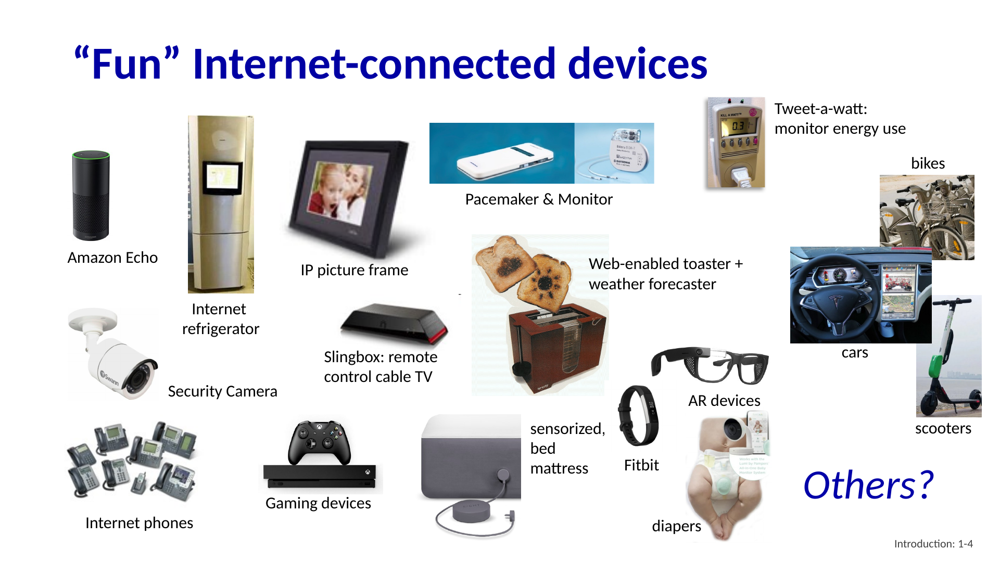

Examples of how broad the set of Internet-connected devices has become.

Between hosts, data moves through:

- Communication links: the physical media that carry bits (fiber, copper, radio, satellite). Each link has a transmission rate (bandwidth, in bits/second).
- Packets: data is broken into chunks; each chunk gets header bytes; the network forwards these chunks independently.
- Packet switches: devices that forward packets from an incoming link to an outgoing link.
  - Routers: typically used in the network core.
  - Link-layer switches: typically used in access networks.

The sequence of links and switches a packet traverses is its *path* (or *route*).

The “trucks on highways” analogy is worth keeping in your head:

- packets are trucks
- links are roads
- switches/routers are intersections
- hosts are buildings

In practice, hosts don’t usually plug directly into the global Internet. They connect through an Internet Service Provider (ISP). Each ISP is itself a network, and those ISP networks interconnect with other lower-tier and upper-tier networks.

That is the key idea behind the phrase *network of networks*: the Internet is not one centrally owned machine. It is many separately operated networks joined together so information can move between hosts across organizational boundaries.

To make all these independently built devices and networks work together, everyone needs to agree on protocols. Protocols are everywhere in networking, and they are the standard way of doing things.

Examples you will keep seeing:

- `HTTP` for the Web
- streaming protocols for audio/video delivery
- `Zoom`-style real-time communication on top of lower-level protocols
- `TCP` and `IP` in the Internet core
- `WiFi`, `4G/5G`, and `Ethernet` on different kinds of links

Many Internet protocol standards are published by the IETF as RFCs. Other standards bodies matter too, especially `IEEE 802` for technologies such as Ethernet and WiFi.

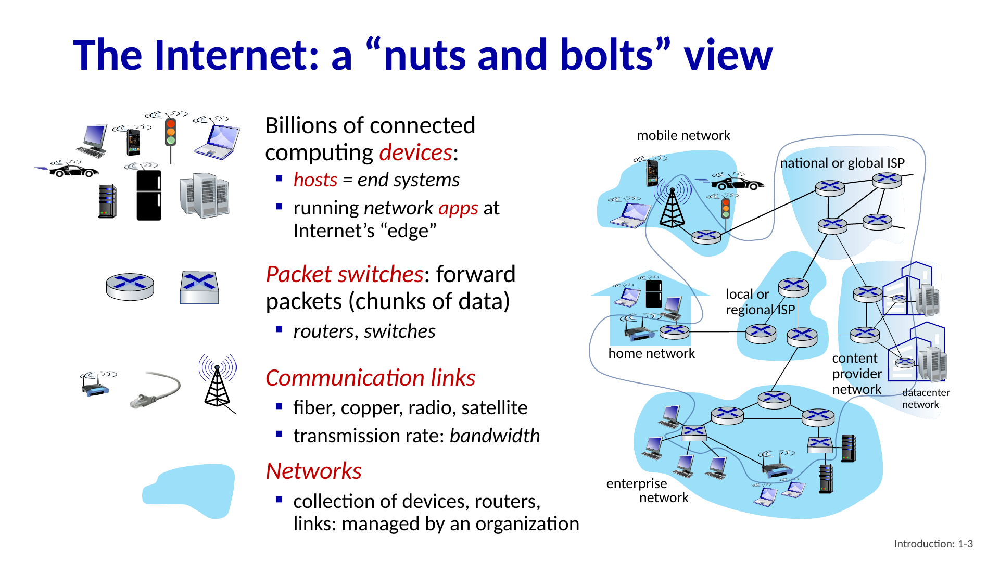

The nuts-and-bolts view of hosts, links, routers, and network organization.


Figure 1.1 Some pieces of the Internet

##### 1.1.2 A Services Description

From the services viewpoint, the Internet is a platform that applications use to exchange data.

Applications are *distributed* when they run on multiple hosts and communicate across the network (Web browsing, email, messaging, mapping, streaming music/video, video calls, multiplayer games, and so on). Importantly, these applications run on end systems. The devices in the network core do not “run the app”; they mainly move packets from one place to another.

For a program to use the Internet, it uses a programming interface, or “hooks,” that let it send data to and receive data from another program running elsewhere. In Internet terminology, this interface is provided as a *socket*.

The postal-service analogy captures the idea:

- you provide the letter (your data)
- the “rules of the interface” tell you how to address/package it so the infrastructure can deliver it

The point is not that the Internet application does the delivery itself. The application asks the Internet infrastructure to deliver data to the right destination program, and the socket interface is the rulebook for making that request correctly.

Like the postal service, the Internet offers more than one kind of service. Later chapters will make those choices precise.

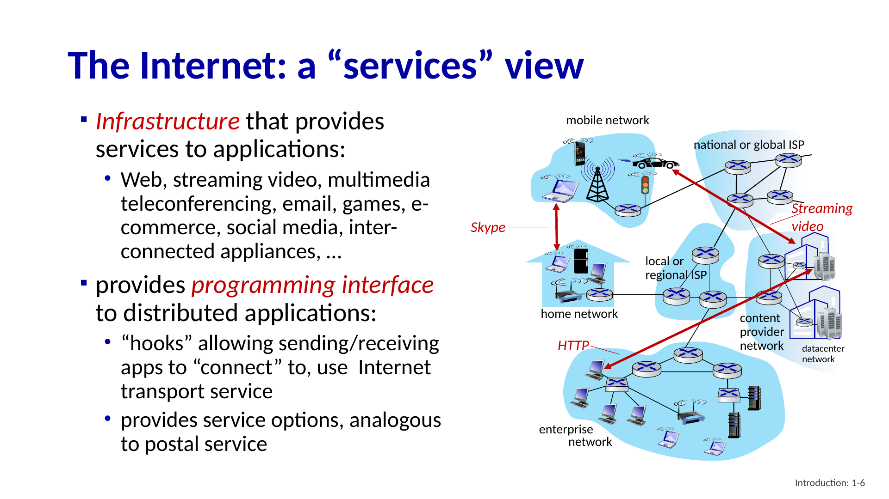

The Internet as an application-facing service platform.

##### 1.1.3 What Is a Protocol?

Protocols are rules for communication.

Human analogies help because they have the same shape: there are expected messages, a typical ordering, and specific actions based on what you receive, or whether you receive nothing.

Two useful examples:

- asking someone for the time
- the classroom question-asking pattern: professor invites questions, student raises a hand, professor acknowledges, student asks, professor answers

In networks, the communicating “entities” are hardware/software components (hosts, network interface cards, routers, and so on). Protocols appear at many layers (HTTP, TCP, IP, WiFi, Ethernet), and a big part of networking is understanding how these protocols compose.

Many protocols naturally have *phases*. In the human “what time is it?” example, there is a greeting/opening phase and then a request/reply phase.

The Web example has the same structure:

- your computer sends a `TCP connection request`
- the server sends back a connection response
- your computer sends a `GET` request for the page
- the server returns the file

So a protocol is not just “some messages.” It is the message formats, the order they must happen in, and the actions triggered by each event.

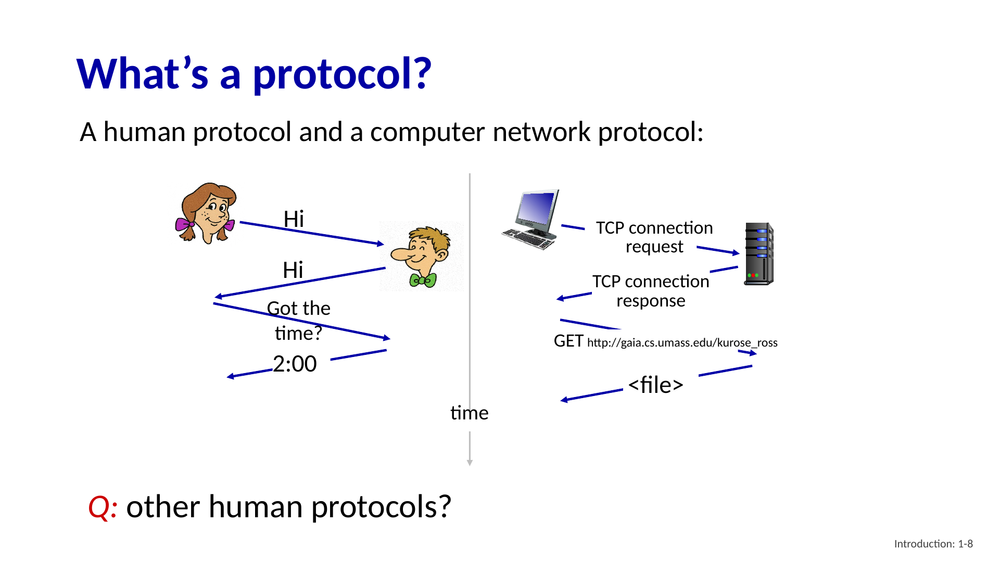

The human and Web examples side by side make the message ordering concrete.

Definition:

A protocol defines the format and the order of messages exchanged between two or more communicating entities, as well as the actions taken on the transmission and/or receipt of a message or other event.


Figure 1.2 A human protocol and a computer network protocol

The practical payoff: if two systems implement the same protocol, they can interoperate; if they do not, communication fails or becomes meaningless. That is why networking is so deeply tied to standards.

#### 1.2 The Network Edge

The *network edge* is where end systems live: your laptop, phone, servers, and all the other devices that run applications.

End systems are often split into:

- clients: user devices (laptops, phones, tablets)
- servers: machines that store/serve content and services (Web, email, streaming, search, APIs)

Most of the servers you interact with now live in large data centers.


Figure 1.3 End-system interaction

Case History Data Centers and Cloud Computing

Data centers are buildings packed with servers connected by their own internal networks.

They commonly serve three roles:

- hosting a company’s own services (for example, an e-commerce site)
- running large internal data-processing jobs (massively parallel computation)
- providing “cloud” infrastructure (other companies run their services on it)

Even if a company’s “app” feels like a single website, behind the scenes there can be thousands of machines cooperating inside one or more data centers.

##### 1.2.1 Access Networks

An *access network* is the part that physically connects an end system to the first router on its path into the Internet (the *edge router*).

Access networks show up in different settings:

- home access
- enterprise/campus access
- wide-area mobile (cellular) access

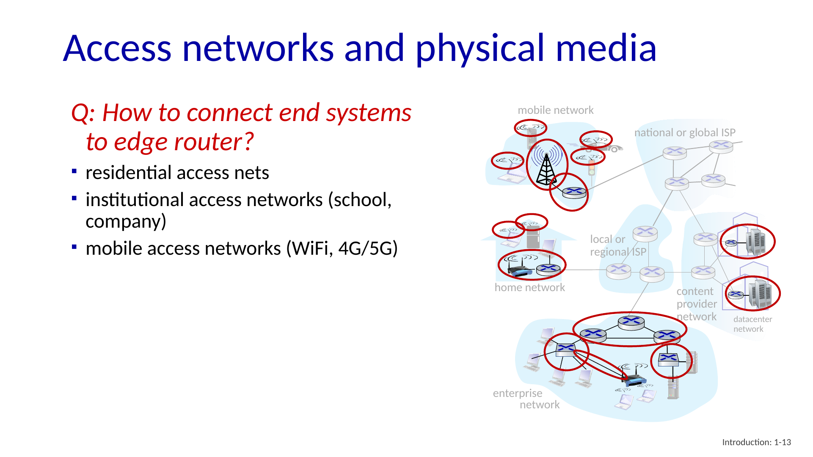

The main access-network categories that connect end systems to the first router.


Figure 1.4 Access networks

Home access

The three most common broadband options are DSL, cable, and FTTH.

DSL

DSL uses the telephone company’s existing twisted-pair phone lines.

The key moving parts are:

- a DSL modem in the home
- a splitter that separates voice vs data (different frequency bands)
- a DSLAM at the telephone company central office (CO), where many home lines terminate


Figure 1.5 DSL Internet access

DSL is typically *asymmetric* (download faster than upload), and the achievable rate depends heavily on how far you live from the CO and on line quality.

Cable (HFC)

Cable Internet uses the cable-TV company’s infrastructure, often called *hybrid fiber-coax* (HFC): fiber to a neighborhood junction, then coaxial cable to homes.

Important characteristics:

- you use a cable modem at home
- the provider side has a CMTS (similar role to a DSLAM)
- downstream and upstream channels exist (also typically asymmetric)
- it’s a *shared broadcast medium*: in a neighborhood, many homes share capacity

Shared capacity is why performance can vary with how many neighbors are active at the same time.


Figure 1.6 A hybrid fiber-coaxial access network

FTTH

Fiber to the home (FTTH) brings an optical fiber path very close to, or directly into, the home.

The details vary by architecture, but a useful mental model is:

- optical equipment in/near the central office
- some form of splitting/sharing closer to the neighborhood
- an optical network terminator (ONT) at the home


Figure 1.7 FTTH Internet access

Fixed wireless and LEO satellites

Fixed wireless Internet can provide high-speed home access without running physical cables to the house.

Low-earth orbit (LEO) satellites are increasingly used for broadband access, especially in rural/remote areas, with much lower delay than geostationary satellites.

Enterprise/campus access: Ethernet and WiFi

On campuses and in enterprises, a LAN typically connects hosts to the edge router.

Ethernet:

- hosts connect over copper (twisted pair) to an Ethernet switch
- switches (or networks of switches) connect into the broader Internet


Figure 1.8 Ethernet Internet access

WiFi (802.11):

- hosts connect wirelessly to an access point
- the access point is typically connected to wired Ethernet

Home networks often combine broadband access (DSL/cable/FTTH) plus WiFi and Ethernet behind a home router.

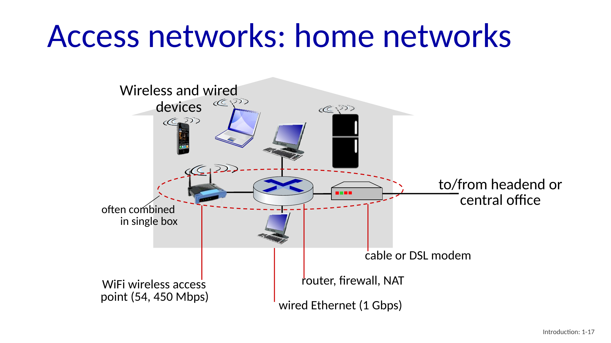

A home network as a small collection of wired and wireless pieces around the access link.


Figure 1.9 A typical home network

Wide-area mobile access: 4G and 5G

With cellular access, phones and other devices send/receive packets through a provider-operated base station.

The key difference from WiFi is range: WiFi is tens of meters; cellular can cover tens of kilometers.

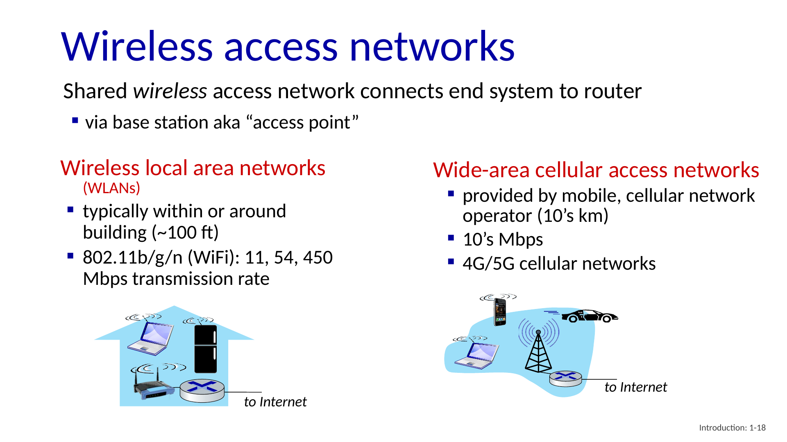

Wireless access spans both local WiFi and wide-area cellular systems.

##### 1.2.2 Physical Media

To talk about “physical media,” imagine the life of a single bit going from sender to receiver.

It repeatedly moves through *transmitter/receiver pairs*:

```text
host -> link -> router -> link -> router -> ... -> link -> host
```

Each hop can use a different physical medium.

Physical media fall into two broad categories:

- guided media: signals are guided through a solid medium (twisted pair, coax, fiber)
- unguided media: signals propagate through the air/space (radio)

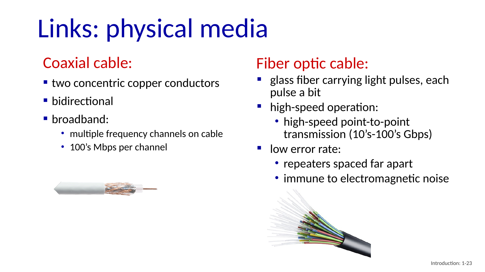

A side-by-side view of the major guided media used in networks.

Cost note: the cable itself is often cheap compared to the labor of installing it. That’s why buildings often run multiple kinds of cabling even if only one is used at first.

Twisted-pair copper wire

- two insulated copper wires twisted together to reduce interference
- dominant medium for short-range wired networking (LANs) and also used for DSL
- achievable rate depends on distance and cable category (modern categories can reach multi-gigabit over short distances)

Coaxial cable

- concentric copper conductors with shielding
- common in cable TV and cable Internet
- can act as a shared medium (multiple end systems connected to the same coax)

Fiber optics

- bits are carried as pulses of light
- supports extremely high rates over long distances with low attenuation
- immune to electromagnetic interference and harder to tap
- widely used for long-haul links and Internet backbones (and increasingly for FTTH)

Terrestrial radio channels

- no wire to install
- supports mobility
- performance depends heavily on the environment (path loss, shadowing, multipath, interference)

Satellite radio channels

- satellites link ground stations and can provide connectivity where land-based access is hard
- geostationary satellites introduce large propagation delay (because they are far away)
- LEO constellations reduce delay but need many satellites for continuous coverage

#### 1.3 The Network Core

This section is about the middle of the Internet.

At the edge, hosts create and receive data. In the core, routers move that data from one link to the next until it reaches the destination.

So the network core is just this:

- routers
- communication links between routers
- rules for deciding where each packet goes next

Mental model:

```text
host -> router -> router -> router -> destination
```

The core usually does not run the application itself. Its main job is to carry packets across the network.


Figure 1.10 The network core

##### 1.3.1 Packet Switching

Packet switching is the basic idea behind the Internet.

Instead of sending one huge message as one continuous stream, the sender breaks the message into smaller pieces called `packets`.

That gives a simple flow:

```text
message -> packets -> routers forward packets -> destination rebuilds message
```

If a packet has `L` bits and a link transmits at rate `R` bits per second, then putting that packet onto the link takes `L/R` seconds.

Two words matter a lot here:

- `forwarding`: the local router action of moving a packet from an input link to the correct output link
- `routing`: the network-wide job of deciding the full path from source to destination

Easy way to remember the difference:

- routing = choosing the trip
- forwarding = taking the next turn

Routers make forwarding decisions using forwarding tables. A packet carries a destination IP address in its header, and the router uses that destination to choose the next outbound link. Routing protocols are what build and update those forwarding tables.

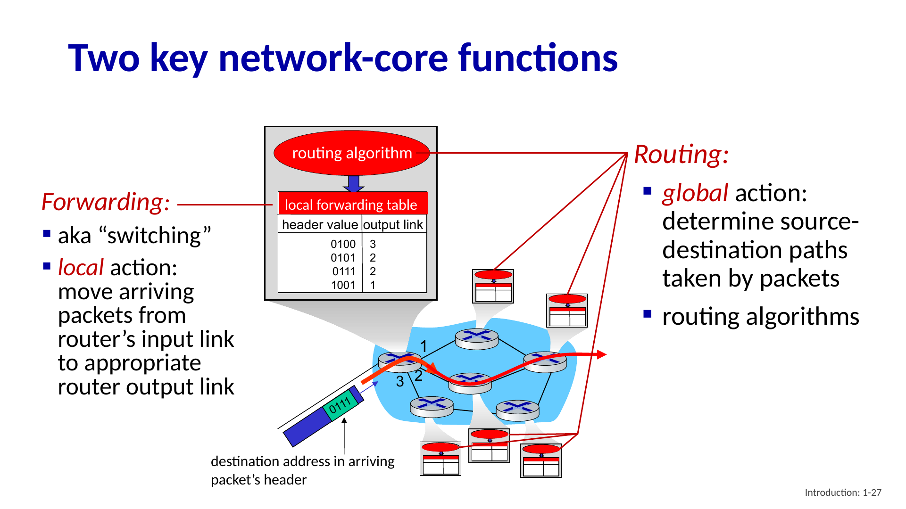

Routing chooses the overall path; forwarding handles the next hop at each router.

Store-and-forward

Routers usually use `store-and-forward`. That means a router has to receive the whole packet before it can send that packet on the next link.

So if there are two links:

- first link transmission: `L/R`
- second link transmission: another `L/R`
- total transmission delay: `2L/R`

More generally, with `N` links of equal rate `R`:

`d_end-to-end = NL/R`

The key idea is that every hop adds work. Even though different links can be busy at the same time, each router still needs the full packet before forwarding it.

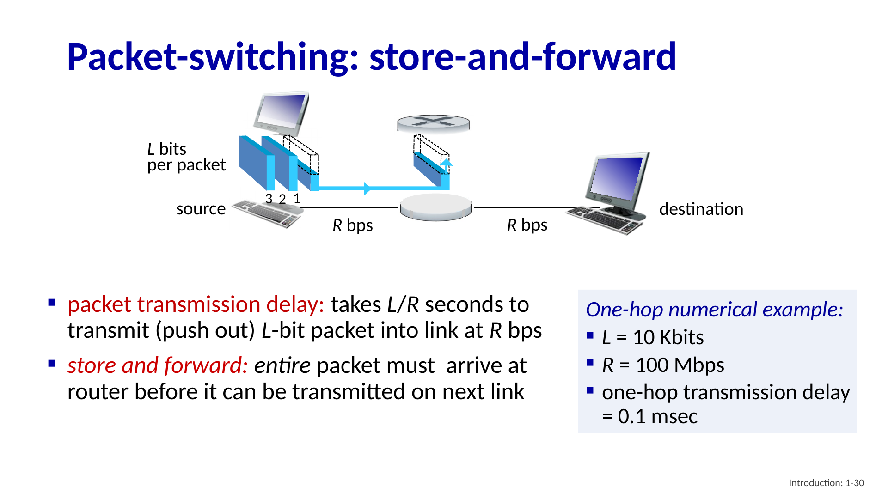

Store-and-forward makes each router wait for the full packet before sending it onward.

Queuing and packet loss

Transmission delay is not the only delay. Routers also have buffers, which are waiting areas for packets.

If packets arrive faster than they can leave on the output link, a queue forms.

That leads to three outcomes:

- packets wait in line
- waiting creates queueing delay
- if the buffer fills up, later packets are dropped

This is like cars reaching a toll booth faster than they can pass through it. A short burst creates a short line. A long burst creates a long line. If there is no room left, new arrivals are turned away.


Figure 1.12 Packet switching

##### 1.3.2 Circuit Switching

Circuit switching takes the opposite approach.

Instead of sharing the network packet by packet, it reserves resources for the whole communication session in advance. Traditional telephone systems are the standard example.

So the difference is:

- packet switching: share resources as packets arrive
- circuit switching: reserve resources before the conversation begins

In a circuit-switched network, the session behaves like a `call`. The network sets aside capacity across the full path, and that capacity stays dedicated to that call until the call ends.

That makes performance more predictable. In the idealized picture, the call does not compete with other traffic for its reserved bandwidth.


Figure 1.13 A simple circuit-switched network consisting of four switches and four links

Two standard ways to divide a link among circuits are:

- `FDM` (frequency-division multiplexing): split the frequency spectrum into bands and assign one band per call
- `TDM` (time-division multiplexing): split time into repeating slots and assign one slot pattern per call


Figure 1.14 With FDM, each circuit continuously gets a fraction of the bandwidth. With TDM, each circuit gets all of the bandwidth periodically during brief intervals of time (that is, during slots)

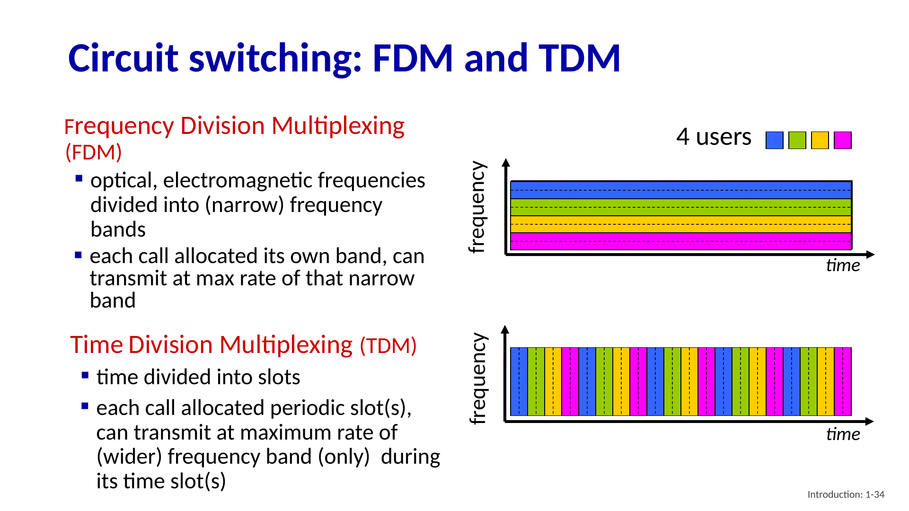

A direct comparison of how FDM and TDM slice shared link capacity.

One TDM example is worth remembering:

- link rate: `1.536 Mbps`
- `24` slots
- per-circuit rate: `1.536 Mbps / 24 = 64 kbps`
- file size: `640,000` bits
- transmission time: `10 s`
- add `500 ms` setup time
- total: `10.5 s`

Why packet switching usually wins for data

Circuit switching sounds attractive because reserved resources avoid queueing, but it also wastes capacity. If a user has a reserved slice of the link and is temporarily idle, that slice usually cannot be borrowed by someone else.

That is why packet switching is especially good for bursty traffic:

- no call setup
- no reservation step
- idle users do not keep bandwidth locked up
- active users can borrow spare capacity on demand

This is the idea behind `statistical multiplexing`: many users share the same resources because most of them are idle much of the time.

The standard example:

- shared link: `1 Mbps`
- each active user needs `100 kbps`
- each user is active only `10%` of the time

With circuit switching, the link can support only `10` users because `10 x 100 kbps = 1 Mbps`.

With packet switching, more than `10` users can share the link because they are rarely active at the same instant. In the classic `35`-user example, the chance that more than `10` are active at once is only about `0.0004`.

Another example makes the same point in a more intuitive way: if one user suddenly has `1,000` packets of `1,000` bits each to send and everyone else is quiet, packet switching can let that user take the full `1 Mbps` link and finish in about `1 s`. With `10`-slot TDM, that same transfer would take about `10 s`.

So packet switching is usually the better fit for computer data: it is flexible and efficient, but the price is possible congestion, delay, and loss.

##### 1.3.3 A Network of Networks

This part explains what `network of networks` actually means.

Users connect through access networks, but those access networks still need a way to reach every other network on the Internet. That is why the Internet is built from many separately run networks connected together.

The most naive design would be to connect every access ISP directly to every other access ISP. That would require about `N^2` links, which becomes impossible at Internet scale.

So the structure grows in stages:

1. Network Structure 1: one global transit ISP interconnects all access ISPs.
2. Network Structure 2: multiple global transit ISPs appear and must interconnect with each other.
3. Network Structure 3: a hierarchy emerges: access ISPs -> regional ISPs -> tier-1 ISPs.
4. Network Structure 4: add PoPs, multi-homing, peering, and IXPs.
5. Network Structure 5: add content-provider networks such as Google's private global network.

Helpful terms:

- customer/provider: a lower-level ISP pays an upstream ISP for connectivity
- peering: two networks directly interconnect, often settlement-free
- `IXP` (Internet Exchange Point): a shared meeting place where multiple ISPs peer
- `PoP` (Point of Presence): a provider location where customers connect into that provider's network
- multi-homing: connecting to multiple providers for resilience and flexibility

The modern Internet looks roughly like this:

- a relatively small number of very large, well-connected tier-1 networks near the center
- regional networks that peer with each other and with higher tiers
- access networks at the edge
- content-provider networks such as Google, Microsoft, Amazon, and Akamai pushing services closer to users

Large content providers build private networks for a reason: they want to move content closer to users, reduce dependence on other networks when possible, and control performance more directly.

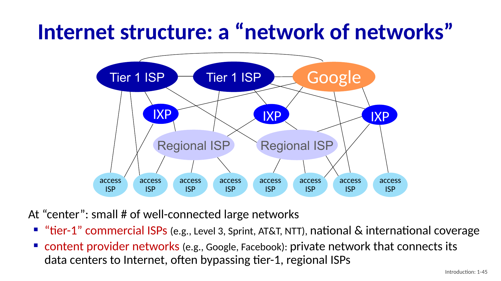

The modern Internet as a mix of access ISPs, regional networks, tier-1 networks, IXPs, and content-provider backbones.


Figure 1.15 Google cloud locations and network


Figure 1.16 Interconnection of ISPs and content provider networks

The big picture to keep in mind is:

```text
end users
  -> access ISPs
  -> regional / larger provider networks
  -> tier-1 backbones and peering fabric
  -> content-provider networks and data centers
```

So `network of networks` does not mean one neat hierarchy with a single owner. It means many independently operated networks connected through business relationships, peering arrangements, exchange points, and private backbones.

#### 1.4 Delay, Loss, and Throughput in Packet-Switched Networks

This section answers a practical question: why can a network feel slow even when a path already exists?

Three limits explain most of it:

- delay: packets take time to move from one place to another
- loss: packets can be dropped before they arrive
- throughput: the path can deliver data only up to some maximum rate

So having a connection is not the same as having a fast connection. A packet-switched network is always constrained by how busy the routers are, how fast the links are, and how far the signal has to travel.

##### 1.4.1 Overview of Delay in Packet-Switched Networks

When a packet goes from source to destination, it usually passes through multiple routers. At each router, delay can be added.

The per-router story looks like this:

```text
packet arrives at router
  -> router examines it
  -> packet may wait in a queue
  -> packet is pushed onto the link
  -> bits travel across the link
```

That gives four delay components at a node:

- `d_proc`: processing delay
- `d_queue`: queuing delay
- `d_trans`: transmission delay
- `d_prop`: propagation delay

Total nodal delay:

`d_nodal = d_proc + d_queue + d_trans + d_prop`

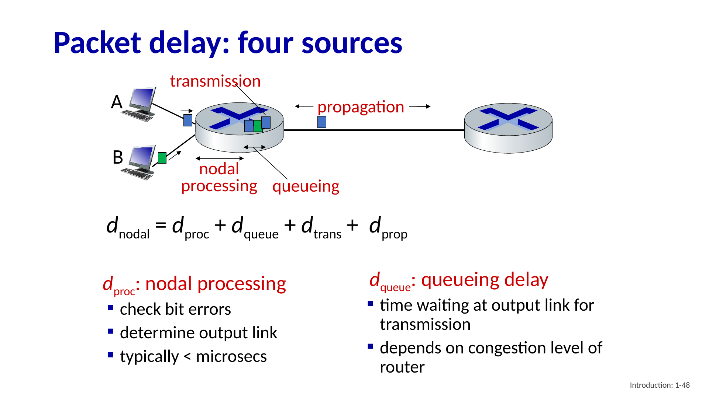

One packet can be delayed four different ways at the same router: being examined, waiting, being pushed onto the link, and then physically traveling across the link.


Figure 1.17 The nodal delay at router A

`processing delay` is the time needed to inspect the packet enough to handle it correctly. That includes reading header fields, using the forwarding table, and checking integrity. This is usually tiny, often microseconds or less.

`queuing delay` is the waiting time before the packet can use the outgoing link. If no other packets are in front of it, this can be near zero. If the output link is busy, the packet may wait a long time.

`transmission delay` is the time needed to push all `L` bits of the packet onto a link with rate `R`:

`d_trans = L / R`

This is about injecting the packet into the medium.

`propagation delay` is different. After the bits are already on the link, they still have to travel across the medium. If the link length is `d` and the propagation speed is `s`, then:

`d_prop = d / s`

This is about distance, not packet size.

This is the most important distinction in the section:

- transmission delay = how long it takes to push the packet out
- propagation delay = how long it takes the signal to travel across the link

A short memory trick:

- transmission is filling the pipe
- propagation is moving through the pipe

The caravan analogy makes this much easier to picture. Think of a packet as a caravan of cars:

- each car is like a bit
- the tollbooth is like a router output interface
- getting cars through the tollbooth is like transmission
- driving between tollbooths is like propagation

In the classic example:

- tollbooth service time is `12 s` per car
- caravan size is `10` cars
- distance between booths is `100 km`
- car speed is `100 km/h`

So:

- getting the whole caravan through the first booth takes `120 s = 2 min`
- the last car then needs `60 min` to travel to the second booth
- total time until the full caravan is lined up at the next booth is `62 min`

That cleanly separates the two kinds of delay:

- `2 min` came from transmission
- `60 min` came from propagation

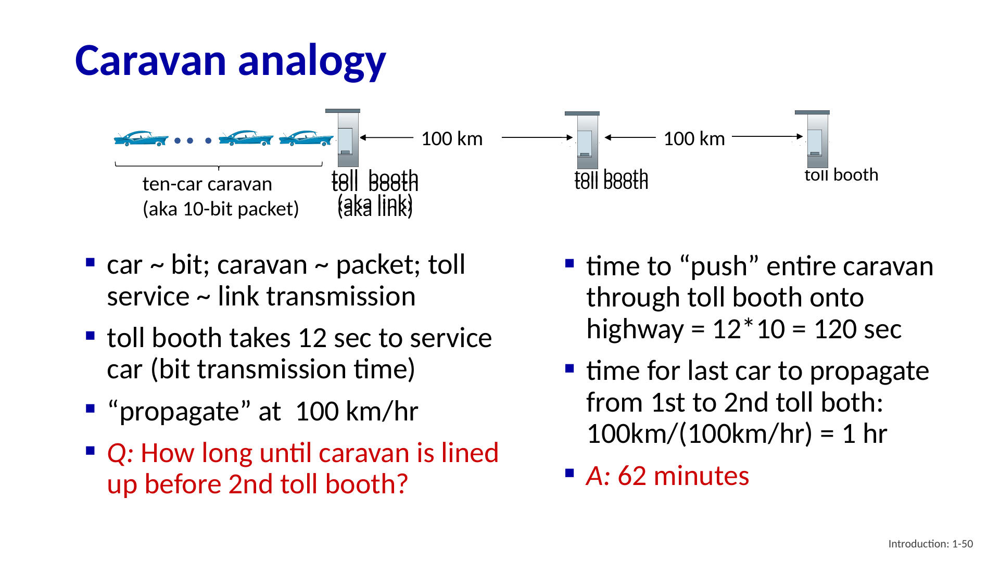

The tollbooth part represents transmission delay; the road between tollbooths represents propagation delay.

Propagation delay can be noticeable in real networks. A transatlantic link can be on the order of `30 ms`, and a geosynchronous satellite hop can be on the order of `270 ms`.

##### 1.4.2 Queuing Delay and Packet Loss

Queuing delay is the least predictable part because it depends on current traffic.

If almost no packets are arriving, a new packet may leave almost immediately. If packets arrive faster than the link can serve them, they pile up.

The key quantity is `traffic intensity`:

`La / R`

where:

- `L` = bits per packet
- `a` = average packet arrival rate
- `R` = transmission rate of the outgoing link

`La` is the average arrival rate in bits per second. Dividing by `R` compares arriving work to the link's ability to do that work.

Interpret it like this:

- if `La / R` is close to `0`, the link is lightly loaded and queuing delay is usually small
- if `La / R` gets close to `1`, delays grow fast
- if `La / R > 1`, more work is arriving than the link can handle on average, so the queue keeps growing

That last case is unstable in the ideal infinite-buffer model. The backlog keeps growing because the router is receiving work faster than it can finish it.

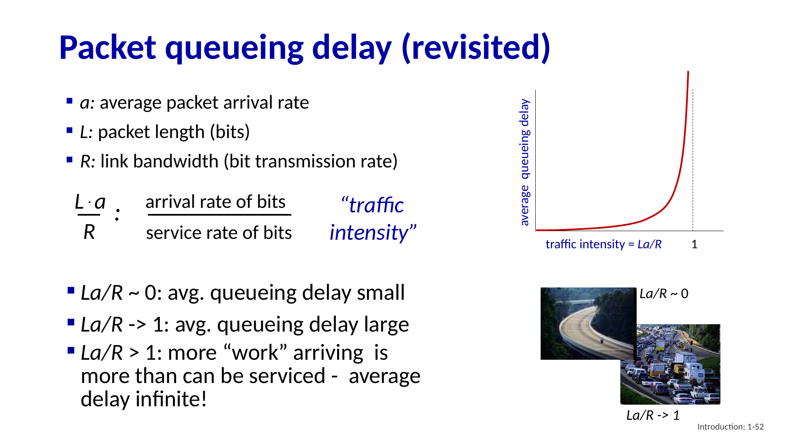

The key shape to notice is that delay stays modest at low load, then climbs sharply as traffic intensity approaches `1`.


Figure 1.19 Dependence of average queuing delay on traffic intensity

One subtle point matters: even when `La / R <= 1`, delay still depends on traffic pattern.

- perfectly spaced arrivals can produce little or no queueing
- bursty arrivals can produce large queueing delays

That is why a network can feel fine most of the time and then suddenly feel slow during bursts.

Real routers do not have infinite memory. Their buffers are finite. So instead of waiting forever, packets eventually reach a full queue and get dropped.

That is packet loss.

From the sender's point of view, the packet simply disappears inside the network. Depending on the protocol, it may be retransmitted later. Transport protocols such as `TCP` also react to loss and congestion by reducing the sending rate.

##### 1.4.3 End-to-End Delay

So far the focus has been one router at a time. End-to-end delay adds up the delays across the whole path.

If a packet crosses `N` links in an uncongested path, and each hop has the same processing, transmission, and propagation delays, then:

`d_end-end = N(d_proc + d_trans + d_prop)`

This is just the clean per-hop delay multiplied across the route.

Real networks are messier: hops can have different rates, different distances, and different queueing conditions. But the main idea stays the same: end-to-end delay is built hop by hop.

`traceroute` helps make that path visible.

`traceroute` sends probe packets toward a destination and measures the round-trip time to routers along the way. In practice, it lets you see:

- which routers the packets cross
- how many hops are involved
- how round-trip delay changes along the path

A simple way to picture it:

- send probes toward hop 1 and measure the three `RTT` values
- send probes toward hop 2 and measure again
- keep going until the destination is reached

So `traceroute` is giving you live hop-by-hop delay information.

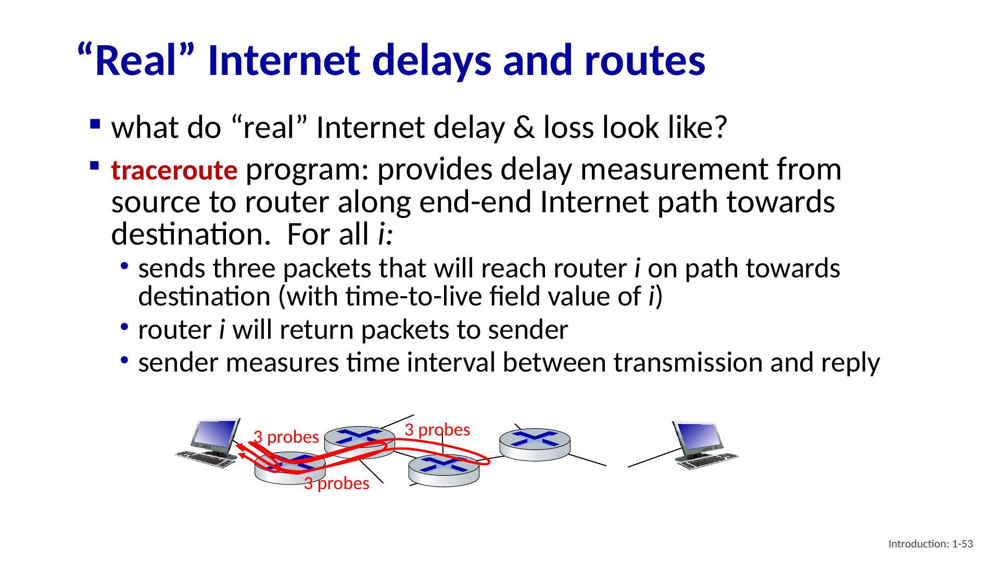

This makes the route concrete by showing both the sequence of routers and the round-trip times to each one.

Traceroute output also shows that delay does not increase smoothly from hop to hop. Queueing changes over time, and different probes can see different conditions. A large jump in `RTT` often points to a long propagation segment, such as an ocean-crossing link.

There can also be important delays outside the routers themselves. Examples include:

- waiting to access a shared medium like `WiFi`
- packetization delay while an application fills a packet with media data

Those matter a lot for interactive applications such as voice and video.

##### 1.4.4 Throughput in Computer Networks

`throughput` is the rate at which data is actually delivered from sender to receiver.

There are two useful ways to think about it:

- `instantaneous throughput`: rate right now
- `average throughput`: total file size divided by total transfer time

If a file has `F` bits and takes `T` seconds to arrive, average throughput is:

`F / T`

The key mental model is a pipe:

- sender puts data into the path like water into a pipe
- each link has some carrying capacity
- the end-to-end flow can only move as fast as the narrowest part

That narrowest link is the `bottleneck link`.

In a simple two-link path with server access rate `R_s` and client access rate `R_c`, the throughput is:

`min(R_s, R_c)`


Figure 1.20 Throughput for a file transfer from server to client

So if the server can send at `2 Mbps` but the client access link is only `1 Mbps`, the transfer cannot go faster than `1 Mbps`.

The same rule extends to longer paths. If a path has link rates `R_1, R_2, ..., R_N`, then throughput is limited by:

`min(R_1, R_2, ..., R_N)`

That is the bottleneck along the route.


Figure 1.21 End-to- end throughput: (a) Client downloads a file from server; (b) 10 clients downloading with 10 servers

But there is one more complication: other traffic matters.

Even if a link is fast, it can still become the bottleneck if many flows are sharing it.

That is the point of the shared-core example. Suppose:

- `R_s = 2 Mbps`
- `R_c = 1 Mbps`
- a shared core link has `R = 5 Mbps`
- `10` downloads are sharing that same core link equally

Then each download gets only `R / 10 = 500 kbps` on that shared link.

So the effective throughput per download becomes:

`min(R_s, R_c, R / 10) = 500 kbps`

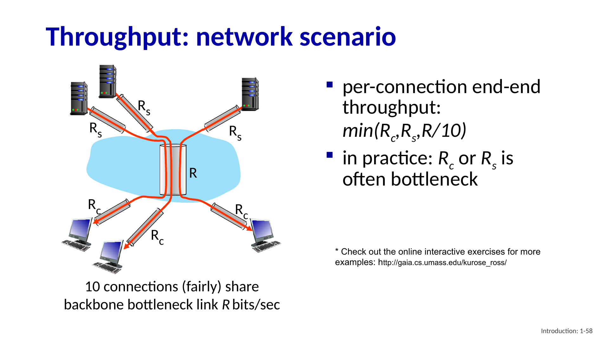

The shared core link becomes the bottleneck here, so every flow is pulled down by competition from the others.

That example shows the full point:

- throughput depends on the path's link rates
- throughput also depends on how much competing traffic shares those links

The big picture for this section is simple:

- delay tells you how long packets take
- loss tells you whether packets get dropped
- throughput tells you how much data per second you can really move

Those three ideas show up in almost every later networking topic.

#### 1.5 Protocol Layers and Their Service Models

By this point, the Internet already looks messy: applications, hosts, routers, switches, links, protocols, hardware, software, and many different kinds of behavior all interacting at once.

So this section answers a practical question:

- how do we organize such a complex system so we can design it, talk about it, and change it without losing our minds?

The main answer is `layering`.

Layering breaks a big system into smaller pieces. Each piece has a job, offers a service to the layer above it, and relies on the layer below it.

##### 1.5.1 Layered Architecture

The airline analogy is useful because it shows how a complicated system can be understood as a stack of related functions.

When you take a flight, the trip is not just one giant undifferentiated process. It is a sequence of smaller functions:

- ticketing
- baggage handling
- gate operations
- takeoff and landing
- airplane routing in flight


Figure 1.22 Taking an airplane trip: actions

That picture is still a little too "story-like," though. The deeper idea is that these actions can be grouped into layers.

Each layer does two things at once:

- it performs its own local work
- it uses the service provided by the layer below it

So a higher layer gets to build on lower layers instead of redoing all the work itself.


Figure 1.23 Horizontal layering of airline functionality

This is the core idea of a `service model`:

- a layer provides a service to the layer above it
- the layer above does not need to know every implementation detail underneath
- as long as the service stays the same, the implementation can change

A simple memory aid is:

```text
layer above: "here is what I need"
layer below: "here is the service I provide"
```

Why layering helps:

- it gives a clear structure for discussing the system
- it shows how the pieces relate to each other
- it modularizes the design, so changes can stay local

That last point matters a lot. If one layer changes how it implements its job, the rest of the system does not need to change as long as the service interface stays the same.

There are tradeoffs too:

- two layers may duplicate similar work
- one layer may need information that naturally lives in another layer

So layering is extremely useful, but it is not magic.

Internet protocol stack

The Internet uses a five-layer protocol stack:

- `application`
- `transport`
- `network`
- `link`
- `physical`

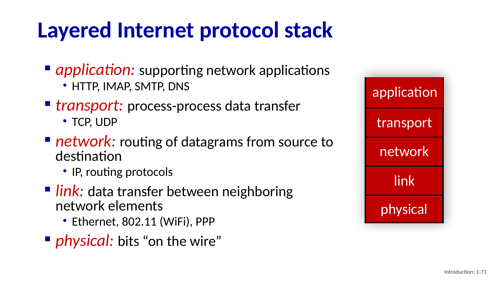

The five-layer Internet stack and some representative protocols that live at each layer.

Here is the easiest way to think about the five layers.

`application layer`

- where network applications live
- examples include `HTTP`, `SMTP`, `DNS`, and other application protocols
- the data unit here is usually called a `message`

This is the layer where distributed applications exchange information with each other.

`transport layer`

- moves application data from one `process` to another
- Internet examples are `TCP` and `UDP`
- the data unit here is a `segment`

`TCP` gives a richer service, including reliable delivery, flow control, and congestion response. `UDP` gives a much lighter-weight service with fewer guarantees.

`network layer`

- moves data from one `host` to another across the Internet
- the key Internet protocol here is `IP`
- routing protocols also live around this layer's job of determining paths
- the data unit here is a `datagram`

The Internet network layer uses a `best-effort` service model: it tries to deliver packets, but it makes no guarantee that every datagram will arrive.

`link layer`

- moves data across one link, from one network element to the next neighboring one
- examples include `Ethernet`, `WiFi`, and `DOCSIS`
- the data unit here is a `frame`

This is a hop-by-hop layer, not an end-to-end layer.

`physical layer`

- moves the actual bits across the transmission medium
- the details depend on the medium: copper, fiber, radio, and so on

This is the lowest-level "how do bits physically get across?" layer.

One important distinction to keep straight:

- transport layer: `process-to-process`
- network layer: `host-to-host`
- link layer: `node-to-neighboring-node over one link`

##### 1.5.2 Encapsulation

Once the layers are in place, the next question is: what happens to data as it moves down the stack?

The answer is `encapsulation`.

Encapsulation means each layer takes the data unit from the layer above, adds its own control information, and creates a new data unit for its own layer.

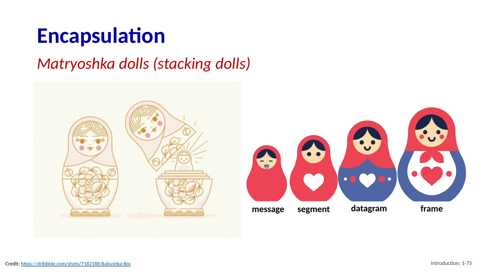

Encapsulation works like nesting dolls: each lower layer wraps the data from the layer above inside a new outer structure.

A good step-by-step view is:

1. The application creates a `message`.
2. The transport layer adds a transport header `H_t`, creating a `segment`.
3. The network layer adds a network header `H_n`, creating a `datagram`.
4. The link layer adds a link header `H_l`, creating a `frame`.
5. The physical layer sends the bits of that frame across the link.

In compact form:

```text
message
  -> segment = H_t + message
  -> datagram = H_n + segment
  -> frame = H_l + datagram
  -> bits on the link
```

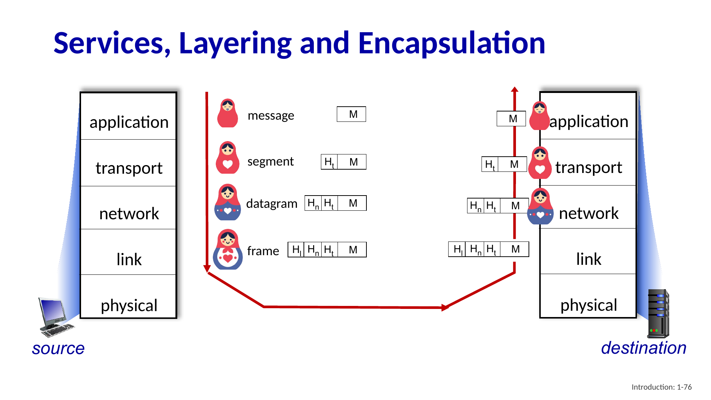

The names `message`, `segment`, `datagram`, and `frame` refer to the same underlying data as seen at different layers after different headers have been added.

The new header is not random extra baggage. It carries the information that layer needs in order to do its job.

Examples:

- the transport layer may need information identifying the destination process
- the network layer may need source and destination IP addresses
- the link layer may need link-local addressing and framing information

The data from the layer above becomes the `payload` of the current layer.


Figure 1.25 Hosts, routers, and link-layer switches; each contains a different set of layers, reflecting their differences in functionality

Figure 1.25 also highlights an important architecture point:

- hosts implement all five layers
- routers usually implement layers `1` through `3`
- link-layer switches usually implement layers `1` and `2`

That means not every device in the network understands every layer.

A host sending data goes all the way down the stack. A receiving host goes back up the stack and removes the headers in reverse order. That reverse process is `de-encapsulation`.

Routers and switches usually handle only the layers relevant to their job. A router, for example, works with the network layer and the lower layers, but it is not running the user's application-layer protocol on behalf of the endpoints.

One last subtle point: the wrapping process can create multiple packets. A large application message may be split into multiple transport segments, and those may then be carried as multiple lower-layer packets.

The big picture for this section is:

- layering is how networking manages complexity
- each layer offers a service and uses the service below it
- the Internet stack has five main layers
- encapsulation is how data is repackaged as it moves down the stack
- different devices implement different portions of the stack

#### 1.6 Networks Under Attack

By this point, the Internet can look like an impressive engineering success story.

But there is another side to the story: once a network becomes useful and widely trusted, it also becomes a target.

This section is really asking one big question:

- what can go wrong when bad actors use the network against us?

And it points toward two follow-up questions that will keep showing up later:

- how do attacks work?
- how do we defend against them?

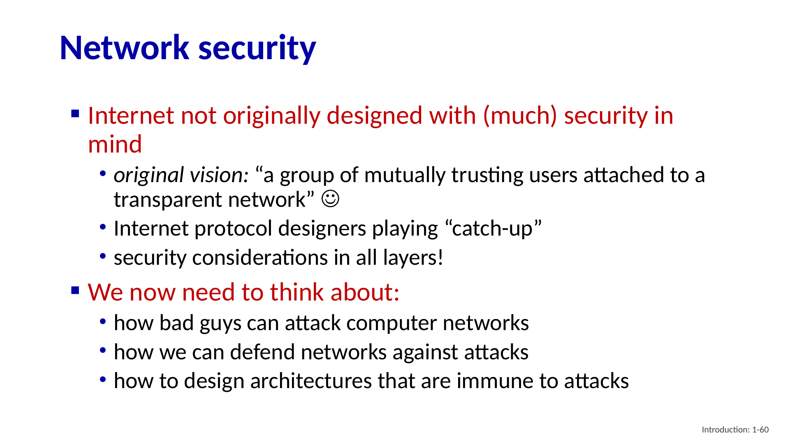

The security view of networking starts from an uncomfortable fact: the Internet was not originally designed for a world full of hostile users, so a lot of security work is still catch-up.

The original design assumption was much closer to this:

- users mostly trust each other
- the network is there to carry traffic, not to question it

That is not the world we have now.

Today, security has to be treated as part of the architecture at every layer.

One important idea here is `security by design`.

That means not just reacting after attacks happen, but building protocols and systems so that attacks are harder to launch in the first place.

The major attack themes introduced here are:

- malware infecting hosts
- denial-of-service attacks against servers and infrastructure
- packet sniffing
- masquerading through fake identity, especially IP spoofing

Malware: when the attack gets inside the host

Some attacks do not just interfere with traffic. They compromise the device itself.

`malware` is malicious software that gets onto a device through Internet-connected activity and then does harmful work.

Examples include software that:

- deletes files
- installs spyware
- steals passwords, social security numbers, or keystrokes
- silently sends private data back to the attacker

One especially important idea is that a compromised host may not stay an isolated victim.

It can become part of a `botnet`: a collection of compromised devices under the attacker's control.

That matters because once many compromised machines are coordinated together, the attacker suddenly has much more power for spam, scanning, and large-scale denial-of-service attacks.

Some malware is also `self-replicating`, meaning it spreads from one infected host to more hosts, and then from those hosts to still more. That is why Internet malware can spread extremely quickly.

Denial of service: making a resource unusable

Another big class of attacks aims not to steal data, but to make a service unavailable.

A `denial-of-service (DoS)` attack tries to make a host, server, or network resource unusable for legitimate users.

Targets can include:

- Web servers
- e-mail servers
- DNS servers
- institutional networks
- network infrastructure devices

DoS attacks fall into three useful categories:

1. `Vulnerability attack`: send a small number of carefully crafted packets that exploit a software bug and crash or freeze the service.
2. `Bandwidth flooding`: send so much traffic that the target's access link gets clogged.
3. `Connection flooding`: create huge numbers of bogus connections so the host runs out of connection-handling capacity.

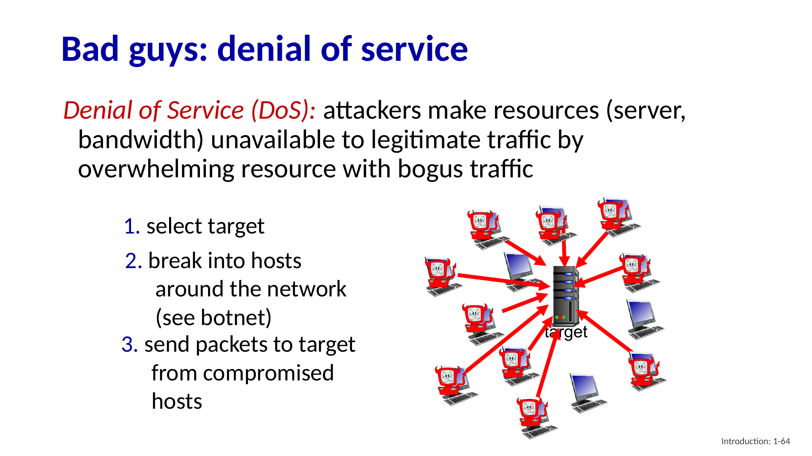

The core DoS picture is simple: the attacker does not need to break the service logically if they can overwhelm it operationally.

For bandwidth flooding, a useful mental model from earlier sections comes back:

- if the victim's access rate is about `R` bps
- then an attacker needs traffic on the order of `R` bps to seriously hurt the service

That is one reason large servers are hard to overwhelm from just one machine.

This leads to the more serious version: `distributed denial-of-service (DDoS)`.

In a `DDoS` attack, the attacker controls many machines and has all of them send attack traffic at the same time.

That gives two advantages to the attacker:

- the total attack rate is the sum of many sources
- the attack is harder to block, because it is not coming from one obvious place

Often those many sources are compromised hosts in a botnet.


Figure 1.26 A distributed denial-of-service attack

Packet sniffing: reading traffic that was not meant for you

Another attack is passive rather than destructive.

`packet sniffing` means capturing copies of packets as they pass through a shared medium or a compromised observation point.

This is especially dangerous on shared or broadcast-style media, such as:

- wireless networks
- shared Ethernet environments
- shared cable environments

If an attacker can sit close enough to the transmission path, they may be able to record traffic that was never addressed to them.

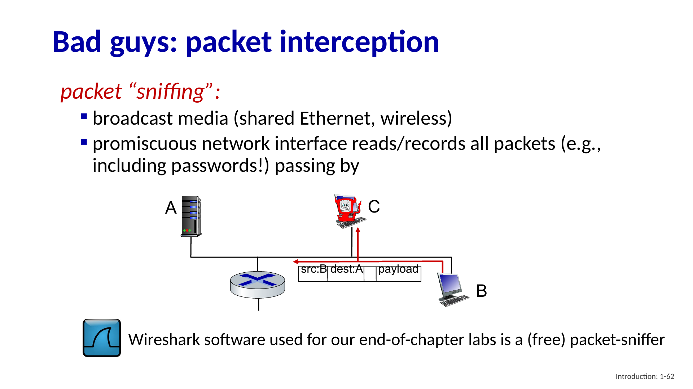

The key thing to notice is that the attacker may learn sensitive information without changing anything at all.

That is what makes sniffing dangerous:

- passwords can be exposed
- personal messages can be exposed
- private organizational data can be exposed

`Wireshark`, which is used as a legitimate learning tool in labs, is also an example of packet-sniffing software. The difference is not the mechanism. The difference is whether it is being used with authorization.

Because sniffers can be passive, they are often hard to detect.

Fake identity: pretending to be someone else

Another attack is to inject packets that lie about who sent them.

This is `IP spoofing`.

In IP spoofing, an attacker creates a packet with a false source address and sends it into the network.

The danger is straightforward: if a receiver trusts the claimed source address, it may accept instructions or data from someone it should not trust.

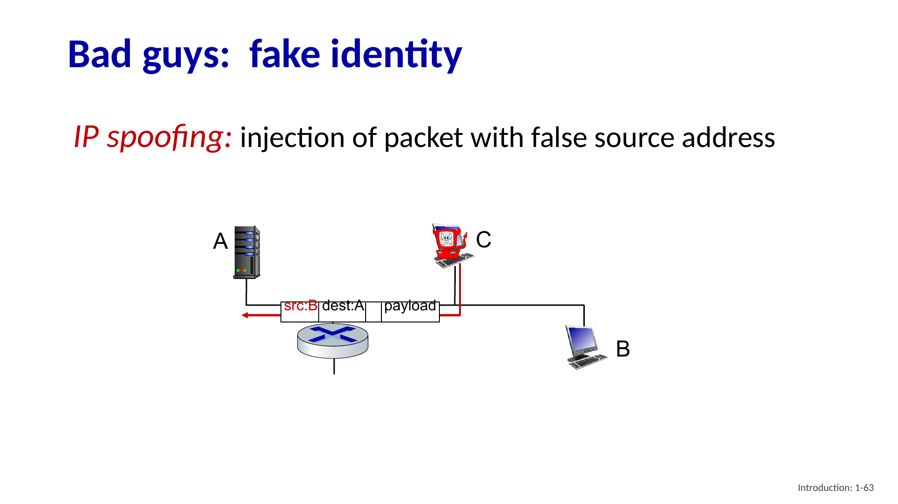

This is the network version of a forged identity claim.

A useful analogy is a phishing message that claims to be from a trusted bank or colleague. The packet says one thing about its origin, but that does not make the claim true.

The big lesson is:

- receiving a packet is not the same as proving who sent it

Defenses: the first vocabulary

This section only introduces defenses at a high level, but the vocabulary matters.

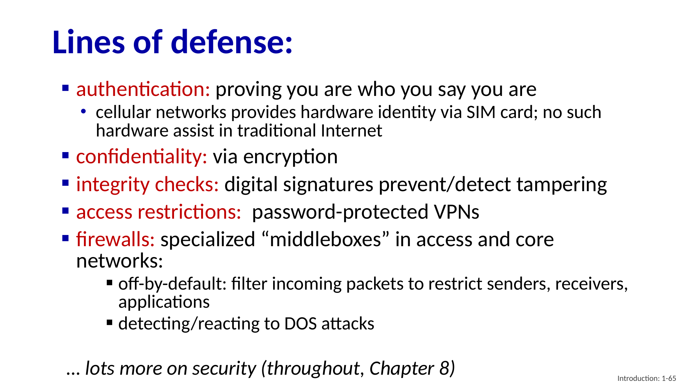

The main defense ideas introduced here are:

- `authentication`: prove that an entity really is who it claims to be
- `confidentiality`: keep others from reading the data, usually through encryption
- `integrity`: detect whether data was altered in transit
- `access control`: decide who is allowed to use which resources
- `firewalls`: filter and control traffic entering or leaving parts of a network

`authentication` helps defend against spoofing.

Examples include:

- passwords
- hardware-backed identity such as a SIM card in cellular systems

`confidentiality` helps defend against sniffing.

The main tool there is `encryption`, which makes captured packets unreadable without the right keys.

`integrity` helps defend against tampering.

The section points to `digital signatures` as a way for a receiver to verify both who sent the data and whether it was changed on the way.

`access control` limits who may use resources and what they are allowed to do.

`firewalls` are specialized devices or middleboxes placed in edge or core networks that can:

- block unwanted traffic
- restrict which senders or applications are allowed
- help detect or react to some attacks, including DoS-related traffic patterns

One especially important mindset shift is this:

- the old Internet default was close to open-by-default
- many defenses move toward deny-by-default or at least verify-before-trusting

The big picture for this section is:

- the Internet is valuable, so it is also a target
- attacks can compromise hosts, overwhelm services, copy traffic, or fake identity
- botnets make large coordinated attacks possible
- security depends on authentication, encryption, integrity checks, access control, and filtering
- modern networking has to treat security as an architectural issue, not an afterthought

#### 1.7 History of Computer Networking and the Internet

This section is a fast timeline of how the Internet got here.

The useful mindset is: today's Internet was not built all at once. It emerged in stages. Each stage solved a different problem:

- how to move bursty computer traffic efficiently
- how to connect multiple independent networks
- how to scale from a research network to a global public infrastructure
- how to turn that infrastructure into a platform for the Web, cloud services, and mobile computing

The timeline is easiest to remember as five eras.

##### 1.7.1 The Development of Packet Switching: 1961-1972

In the early 1960s, the telephone network was the dominant communication system. That network used `circuit switching`, which made sense for voice because voice is produced at a fairly steady rate.

Computer traffic looked different. A user might type a command, wait, then type again. That is *bursty* traffic: short periods of activity separated by silence.

That difference is what made `packet switching` such a big idea. Instead of reserving a whole path for an entire session, data could be broken into packets and shared across the network only when needed.

Three groups reached this idea independently:

- Leonard Kleinrock used queuing theory to show why packet switching works well for bursty traffic.
- Paul Baran studied packet switching for military communication.
- Donald Davies and Roger Scantlebury developed related ideas at the National Physical Laboratory in England.

One big lesson from this period is that packet switching was not just a clever implementation trick. It was a better match for the actual shape of computer communication.

Then the ideas started becoming real systems.

- `1967`: ARPA published the ARPAnet plan.
- `1969`: the first ARPAnet node went live.
- by the end of `1969`: the network had four nodes.
- `1972`: ARPAnet had about 15 nodes, got its first major public demo, and gained `NCP`, the first host-to-host protocol.
- `1972`: Ray Tomlinson wrote the first e-mail program.

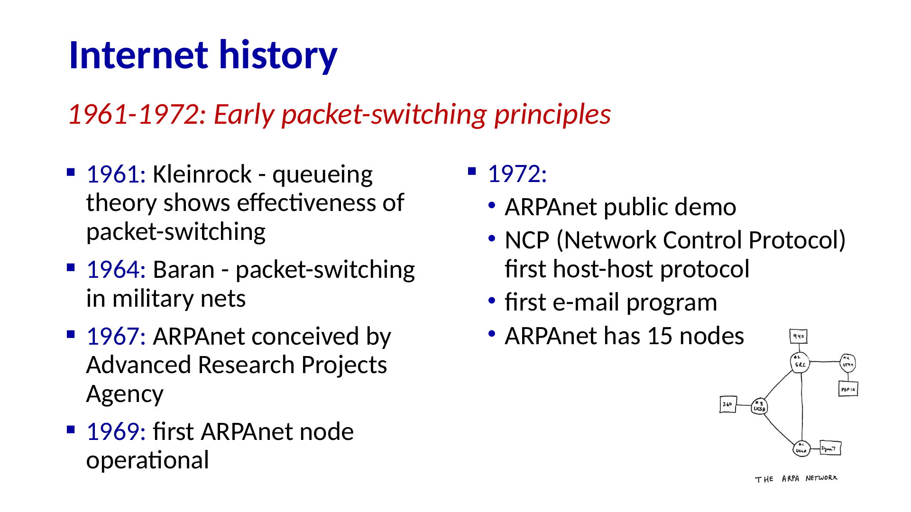

The first era of Internet history: packet switching moved from theory into ARPAnet and early host-to-host communication.


Figure 1.27 An early packet switch

##### 1.7.2 Proprietary Networks and Internetworking: 1972-1980

Early ARPAnet was only one network. That was useful, but limited. If many different packet-switched networks existed, the next question became much more important:

How do you connect networks together without forcing them all to become one giant uniform network?

During the 1970s, more networks appeared:

- `ALOHAnet` linked universities in Hawaii.
- DARPA built packet-satellite and packet-radio networks.
- `Telenet`, `Cyclades`, and several time-sharing and proprietary networks also appeared.
- `Ethernet` emerged from research on shared access to a broadcast medium.

So the problem shifted from building *a* packet-switched network to building a *network of networks*.

This is where Vinton Cerf and Robert Kahn become central. Their work on `internetting` asked how independent networks could interoperate while remaining internally autonomous.

Four principles from that work still matter today:

- minimalism and autonomy: networks should interconnect without internal redesign
- best-effort service: the network tries to deliver packets, but makes no absolute guarantees
- stateless routing: forwarding should avoid excessive per-flow dependence inside the network
- decentralized control: no single central controller should be required for the whole system

These ideas shaped the Internet architecture far more deeply than any one specific product or company.

Another important change happened here: the protocol split that gave us the modern roles of `TCP`, `UDP`, and `IP`. Early TCP bundled together reliability and forwarding ideas. Over time, the architecture separated those concerns into cleaner layers.

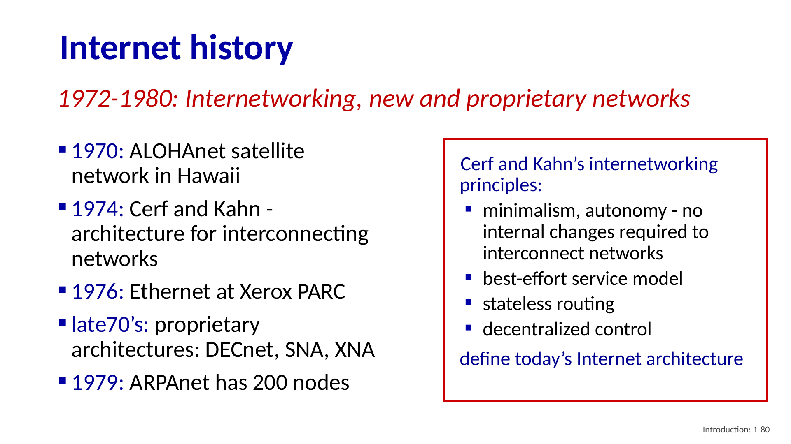

The second era: multiple networks appeared, and the core problem became how to interconnect them without losing autonomy.

##### 1.7.3 A Proliferation of Networks: 1980-1990

By the 1980s, growth accelerated.

This decade matters because the Internet stopped being a small research experiment and started becoming a larger federation of networks.

Important milestones from this period:

- `1983`: `TCP/IP` became the official ARPAnet host protocol.
- `SMTP` was defined for e-mail.
- `DNS` was developed so humans could use names instead of raw IP addresses.
- `FTP` was defined for file transfer.
- in the late 1980s, `TCP congestion control` was added.

At the same time, institutional and national networks expanded:

- `BITNET` linked universities for e-mail and file transfer.
- `CSNET` connected researchers without ARPAnet access.
- `NSFNET` began as a way to reach NSF supercomputing centers and then grew into a major backbone linking regional networks.

By the end of the 1980s, the Internet looked much more like a real confederation of networks rather than a single experimental system.

That is the key transition of this era:

- before: one important network among a small set of experiments
- after: a growing, interoperable infrastructure with about `100,000` hosts

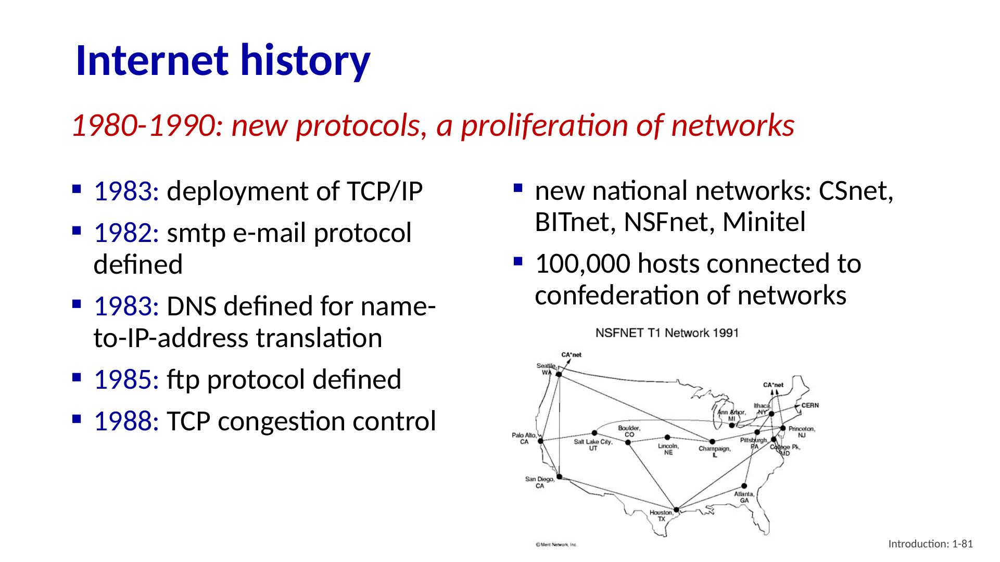

The third era: common protocols and expanding backbone networks turned networking into a much larger shared system.

##### 1.7.4 The Internet Explosion: The 1990s

The 1990s are when the Internet became part of everyday life.

Two changes happened at once:

- the old research-centered structure gave way to commercialization
- the `World Wide Web` made the Internet usable for a much broader population

Some milestone events:

- ARPAnet was retired.
- `1991`: NSFNET lifted restrictions on commercial use.
- `1995`: NSFNET itself was decommissioned, with commercial ISPs carrying backbone traffic.

But the real turning point was the Web.

Tim Berners-Lee and collaborators created the key pieces together:

- `HTML`
- `HTTP`
- Web servers
- Web browsers

Those pieces turned the Internet from a network mainly used by researchers and specialists into a general application platform.

By the second half of the 1990s, the Internet was supporting a growing set of "killer apps":

- e-mail
- the Web and Internet commerce
- instant messaging
- peer-to-peer file sharing

This period also made clear that applications can change the meaning of a network. The underlying packet infrastructure already existed, but the Web made millions of people suddenly care about it.

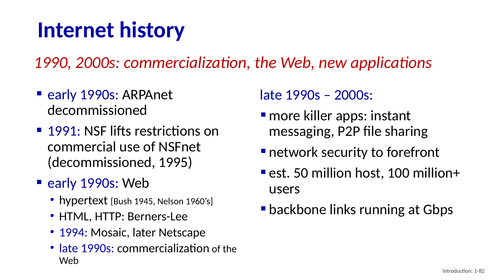

The fourth era: commercialization plus the Web turned the Internet into a mass-market platform.

##### 1.7.5 The New Millennium

In the 21st century, the Internet kept growing, but the story changed again.

The question was no longer only "how do we connect computers?" It became "how do we support a society that assumes constant connectivity?"

Several developments define this era:

- broadband home access became widespread
- high-speed wireless access made constant mobility normal
- smartphones became dominant Internet devices
- social networks created massive application ecosystems on top of the Internet
- large providers built private global networks
- cloud platforms became the default place to run many applications

Two big structural changes are especially worth remembering.

First, `mobility` changed the default user experience. Internet access stopped being something tied mainly to a desk and became something expected everywhere.

Second, `cloud and content-provider networks` changed where computation and content live. Companies such as Google, Facebook, and Microsoft built large private backbones and data-center networks so they could move services closer to users and reduce dependence on the public transit hierarchy.

That means the modern Internet is not just end users talking across public ISP infrastructure. It is also shaped by huge private networks, hyperscale data centers, and cloud platforms.

By `2017`, mobile devices connected to the Internet outnumbered fixed devices. That is a good marker for how different the modern Internet is from the early desktop-centered Web.

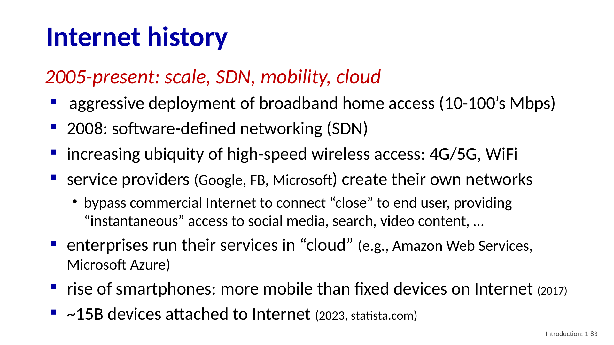

The fifth era: broadband, wireless access, smartphones, content-provider backbones, and cloud computing reshaped what the Internet is used for and how it is built.

The big picture for this section is:

- packet switching won because it matched bursty computer traffic better than circuit switching
- internetworking mattered because the future was never one network, but many
- common protocols such as `TCP/IP`, `DNS`, and `SMTP` helped the Internet scale
- the Web made the Internet mainstream
- broadband, mobile devices, cloud platforms, and provider-owned backbones define the modern era

#### 1.8 Summary

Chapter 1 is a broad first pass over networking.

The goal was not to master every mechanism yet. The goal was to build a mental map of the field: what the Internet is made of, how data moves through it, where performance limits come from, why layering matters, why security matters, and how the whole system grew into what it is today.

The main ideas from the chapter fit into one connected picture:

- hosts and applications live at the edge
- access networks and physical media connect those hosts into the Internet
- routers and links in the core move packets across a network of networks
- delay, loss, and throughput explain why the network can feel fast or slow
- layered protocols organize the system so complex pieces can work together
- attacks and defenses are now part of the architecture, not an optional extra
- the Internet took shape over decades of research, engineering, and commercialization

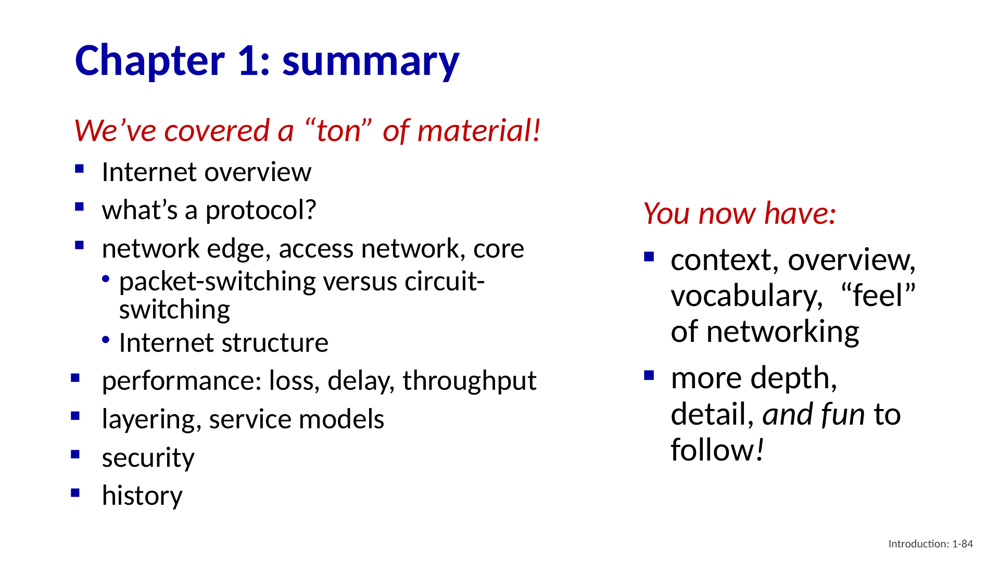

The chapter summary slide compresses the whole introduction into one checklist: Internet overview, protocols, edge and core, performance, layering, security, and history.

One good way to think about this chapter is: it is a mini-course that gave you the big picture first.

That is why the vocabulary matters so much here. Terms like `packet`, `router`, `protocol`, `socket`, `throughput`, `best effort`, `encapsulation`, and `DDoS` are now part of the basic language for everything that follows.

If this chapter felt dense, that is normal. The important outcome is not perfect recall of every detail. The important outcome is that you can now recognize the major parts of a network and see how they connect.

That is also why the rest of the book can now go deeper. The next chapters revisit these ideas one layer at a time:

1. Chapter 2: `Application Layer`
2. Chapter 3: `Transport Layer`
3. Chapter 4: `Network Layer: Data Plane`
4. Chapter 5: `Network Layer: Control Plane`
5. Chapter 6: `The Link Layer and LANs`
6. Chapter 7: `Wireless and Mobile Networks`
7. Chapter 8: `Security in Computer Networks`

The overall study path is `top-down`.

That means the next step is to start from applications and then work downward through the stack. The logic is simple: once you know what applications need, it becomes easier to understand why the lower layers provide the services they do.

The big takeaway from Chapter 1 is not a single formula or device. It is the overall feel of networking:

- many layers
- many protocols
- many independently run networks
- one shared goal: move data between applications correctly and efficiently
