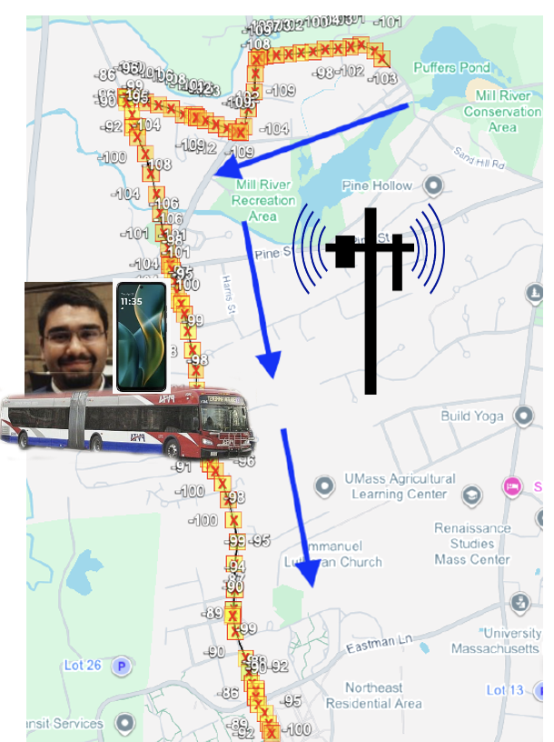
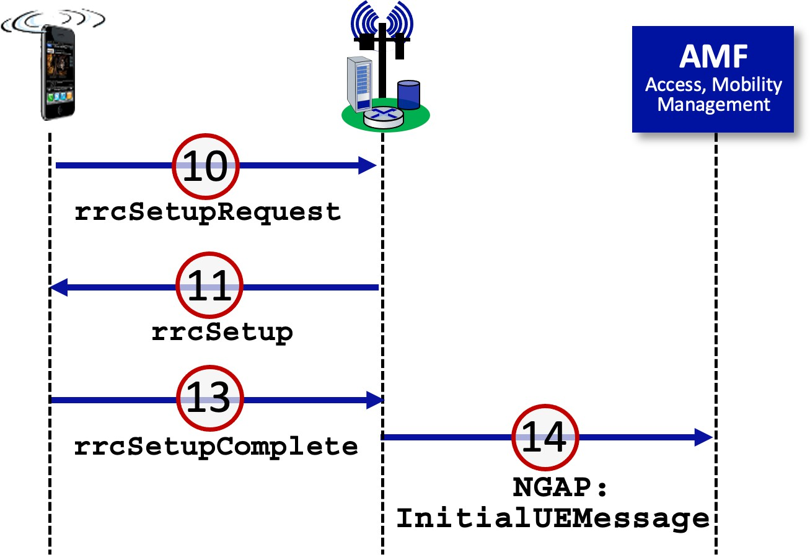
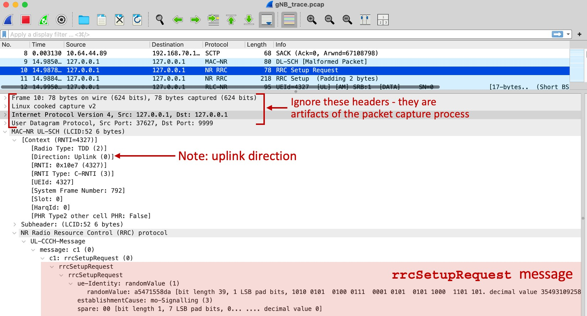
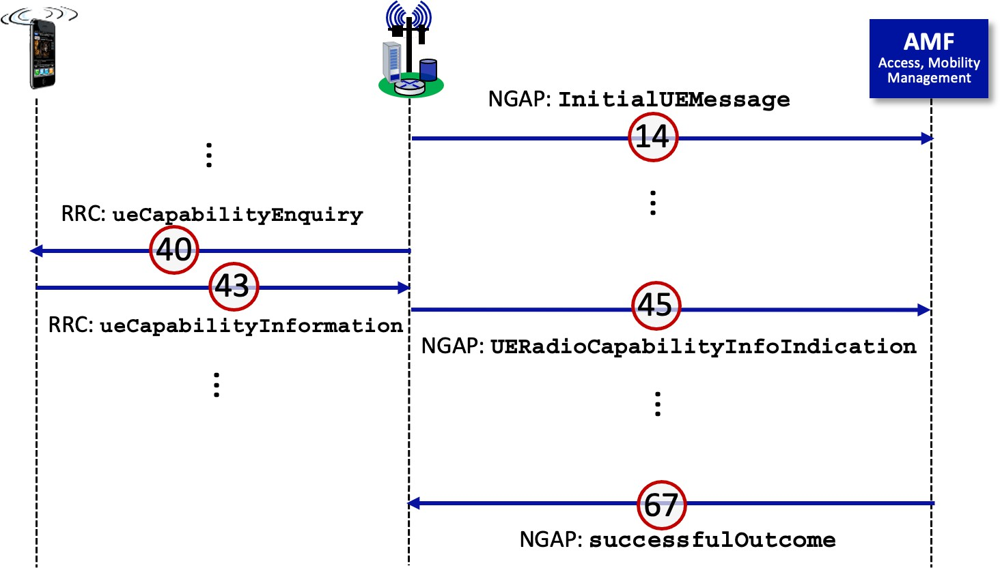
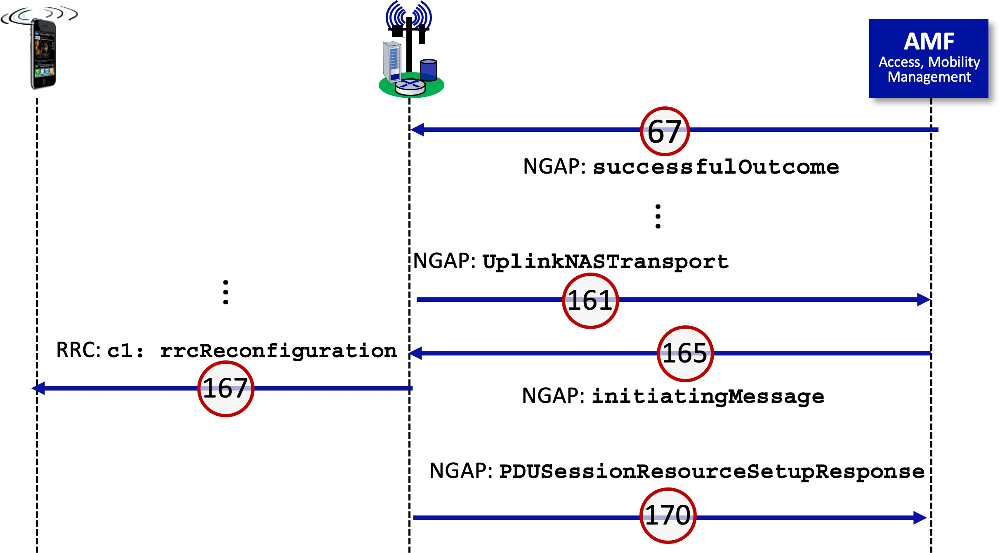

In this lab, we’ll take a look at how a 5G device learns about and then attaches to (joins) a 5G network. Before beginning this lab, you might want to re-read Section 7.3.3 and 7.3.4 in the text[^1]. If you want to read about the 5G RAN in more depth, you can do so here: <https://gaia.cs.umass.edu/wireless_and_mobile_networks/readings/Chapter_5_RAN.pdf>

If you want to learn more about joining a 5G network in more depth, you can check out Section 6.3 (“Discovery and attaching to the RAN/WLAN”) here: <https://gaia.cs.umass.edu/wireless_and_mobile_networks/readings/Chapter_6_Edge_topics.pdf>

As in the case of our earlier 5G lab we’ve captured trace files[^2] of 5G frames for you to analyze for this lab. The questions below assume you are analyzing these traces.

**1. Investigating the 5G RAN: getting started**

We learned (see Section 7.3.4) that the MIB and SIB blocks, broadcast from the base station (known as a gNB) within the 5G RAN allows devices to find the 5G network and information about that network. Let’s look at MIB and SIB1 messages in a 5G trace captured on a 5G Android phone connected to a national cellular network provider (you’ll learn the identity of the provider by digging into the SIB1 information block being broadcast by the provider’s gNB) in Amherst MA, as shown in Figure 1.

|  |
|:--:|
| **Figure 1:** First 5G trace scenario |

The 5G Master Information Block (MIB) contains critical information about the cellular network: the network owner/operator, channel bandwidth information, and a pointer to where the UE should listen for additional information in the System Information Blocks (SIBs), including the SIB1 block. Both the MIB and the SIBs are broadcast on the Physical Broadcast Channel (PBCH). We’ll look at a MIB and SIB1in this trace.

Before starting up Wireshark, you’ll need to place the scat-v2.lua file that you extracted from the Zip file in the right place on your filesystem, where Wireshark will find it and install it. (That is, you only need put the .lua file in the directory specified below; you don’t need to run any code to install it.) Here's the official Wireshark docs that explain where to place the .lua file: <https://www.wireshark.org/docs/wsug_html_chunked/ChPluginFolders.html>

TL;DR:

> On Windows:

- The personal plugin folder is *%APPDATA%\Wireshark\plugins*.

- The global plugin folder is *WIRESHARK\plugins*.

> On Mac and Unix-like systems:

- The personal plugin folder is *~/.local/lib/wireshark/plugins*.

After installing the .lua file, you should reboot your computer. With the .lua file installed, and the .pcapng file downloaded, start up Wireshark and open the *trace4-scatv2-5G-NR-feb-19-2025.pcapng* trace file.

Let’s start by focusing on packet 1 in this trace – a MIB message. Expand the NR Radio Resource Control (RRC) protocol line as well as the following BCCH-BCH-Message line, which shows the MIB message received on the PBCH.

1.  What are the subcarrier spacings (channel widths) used in this 5G network? Two values are given, one for the case of the 410 MHz–7125 MHz range, and one for the case of the 24.25 GHz–52.6 GHz range. "scs15or60" would indicate 15 kHz in the lower frequency ranges and 60 kHz in the higher, millimeter ranges.

2.  Is this network open for use? A cell that is open for use will not bar users from joining (or at least will allow UE to present credentials, after which the UE may or may be admitted to the network).

The System Frame Number(SFN) in the MIB helps the UE synchronize it slot timing boundaries to that of the gNB. A 10 ms interval is conceptually divided into 1024 smaller intervals. The System Frame Number indicates the current position of time in these 1024 intervals. Since both the UE and the gNB know the SFN they know the common current position with the 1024 subintervals in the current 10 ms long interval.

3.  What is the value of the SFN?

Let’s next focus on packet 2 in this trace – a SIB1 message – and see what’s in there. Expand the NR Radio Resource Control (RRC) protocol line in this SIB1 message, and all other following lines.   We're interested in the material in the PLMN-Identity fields. (As an aside, PLMN stands for Public Land Mobile Network - a mobile operator's cellular network in a given country).  Here's where your phone finds the country and the identity of the network that is sending the SIB. The country and the identity of the network is in this information! The Three mcc digits (310) are the country code; the three mnc digits given the network operator code. You will need to look up the names of the countries and network operators using these codes: here: <https://en.wikipedia.org/wiki/Mobile_network_codes_in_ITU_region_3xx_(North_America)>

4.  What country is the origin country for this network?

5.  What company is the owner/operator of this network?

6.  The RAN cell within this network has an identifier, what is that identifier?

7.  The RAN cell within this network also has a tracking area code that is used for managing device mobility. What is the value of this code?

Hey! The SIB shows there is *another* country and provider associated with this network! It has a different MCC (**Mobile Country Code**) as part of its PLMN.

8.  What is the MCC value of this second provider network?

9.  Is the second owner/operator name (not number) the same as the name of the early owner/operator for the other in your answers above?

You might want to scroll further down the SIB1 message, where you find configuration information for the physical channels that we’ve learned about. We can see how through the use of the MIB and SIB, the UE is able to bootstrap information about the network. Of course, the UE has yet to identify itself to the network; we’ll cover that topic below.

**2 Attaching to the 5G RAN**

Now let’s take a look at the various messages exchanged among the UE, gNB and AMF, as a UE attaches to (i.e., “joins”) a 5G network. Before doing so, you’ll definitely want to review the material in section 7.4.3 of our textbook. For even more detail, you can read Section 6.3 (“Discovery and attaching to the RAN/WLAN”) in

<https://gaia.cs.umass.edu/wireless_and_mobile_networks/readings/Chapter_6_Edge_topics.pdf> and Section 8.3.3 (“User identity, registration, and session establishment”) in <https://gaia.cs.umass.edu/wireless_and_mobile_networks/readings/Chapter_8_5G_Core.pdf>

There are two major steps involved when a UE joins a 5G network (See Figure 7.42 in the textbook):

- The initial message exchange between the UE and the gNB to establish the uplink and downlink *RAN* control channels between the UE and the gNB. This is covered in Section 2.1 below.

- The message exchanges between the UE and gNB, and between the gNB and the AMF, as the UE and network perform mutual authentication. These are covered in Sections 2.2 and 2.3 of this lab.

Recall that these are steps that are taken *before* the UE can actually send any data-plane datagrams to/from the Internet via its UPF. When working with our trace, it will also be important to keep in mind whether a packet is being exchanged between the UE and the gNB (generally using the Radio Resource Control (RRC) protocol) or between the gNB and the AMF (generally using NGAP, the Next-Generation Application Protocol). **In this lab, we’ll use a Wireshark .pcap trace containing packets captured at a gNB.** The trace will thus contain the RRC messages exchanged over the RAN (between the UE and its gNB) and NGAP signaling messages exchanged between the gNB and the AMF. The .pcap file for the next part of this lab is *gNB_trace.pcap*.[^1]

Before you start this lab, you’ll need to start up Wireshark and set a few preferences that control the display of packet details:

- On the top Wireshark menu go to Analyze-\>Protocols and make sure that MAC-LTE and its subitem mac_lte_udp are checked, and that MAC-NR and the subitem mac_nr_udp checkboxes are checked. Click OK.

- On Windows, Go to Edit/Preferences or on macOS, use the top Wireshark menu go to Wireshark-\>Preferences and then expand the Protocols item in the popped-up menu.

  - In the expanded list of protocols, find MAC-LTE, click on MAC-LTE and check all the options (checkboxes). For the "which layer info to show in info column" item in the MAC-LTE pop-up, select "MAC info". Click OK at bottom right. For MAC-NR, also check all of the boxes in the window for MAC-NR.

  - In the expanded list of protocols, find NAS-5GS, and check the “Try to detect and decode 5G-EA0 ciphered messages” box.

  - In the expanded list of protocols, find RLC-LTE, click on this and check all the options *except* the "May see RLC headers only" option. For the "call PDCP dissector for DRB PDUs" item, select the value of "12-bit SN" Click OK at bottom right. Repeat this process for RLC-NR in the expanded protocols list.

Close Wireshark and then restart it. You’re ready to go!

**2.1 Joining the RAN**

Figure 2 below shows messages exchanged between the UE and gNB when a UE first begins attaching to the RAN. These are *Radio Resource Control (RRC)* protocol message - a protocol that runs (only!) between the UE and the gNB. The red-circled numbers shown in Figure 2 correspond to packets in the trace. Packets 10, 11, and 13 in the *gNB_trace.pcap* file are RRC messages; packet 14, which is sent from the gNB to the AMF (Access and Mobility management function) is a *NGAP (Next-Generation Application Protocol)* protocol message. NGAP runs between the gNB and the AMF.

> **Figure 2:** packets exchanged when a UE first joins the RAN

Let’s start at the beginning, by taking a look at the **rrcSetupRequest** message in packet 10. To do so expand the **NR Radio Resource Control (RRC) protocol** and all subtrees below it, in the packet details part of the Wireshark display for this packet. Your display should look similar to Figure 3. You can completely ignore the Frame, Linux, IP, and UDP information in the trace, since these fields are there solely as an artifact of how packets are captured, as noted in Figure 3. Remember – we’re looking at 5G link-layer RRC control messages here – the UE joining the RAN doesn’t even have an IP address yet!

> 
>
> **Figure 3:** Wireshark details expansion to examine the **rrcSetupRequest** message

Packet 10 contains the **rrcSetupRequest** message that the UE sends to the gNB indicating that it (the UE) wants to join the RAN. We learned in class that this packet is sent on the random-access channel from the UE to the gNB.

10. What value does the UE enter as its **ue-identity**? Is this ID information stored on its SIM card?

11. What is the declared reason for wanting to establish this session, i.e., the **establishmentCause**? Note: you may need to search the Web for meaning of the stated reason.

Now let’s take a look at the gNB’s reply, the RRC **rrcSetup** message in packet 11.

12. Which four physical channels (two uplink and two downlink) does the UE learn about from the gNB in this **rrcSetup** message? \[Hint: look under **masterCellGroup** -> **CellGroupConfig** -> **spCellConfig**.\]

In the final step in joining the RAN, the UE passes selected IMSI information about itself to the gNB (packet 13).

13. What is the Mobile Country Code and Mobile Network Code (within that country) of the UE’s home network? What is the UE’s MSIN (Mobile Subscriber Identification Number)? \[Hint: look under **rrcSetupComplete** -> **dedicatedNAS-Message** -> **Non-Access-Stratum 5GS (NAS) PDU** -> **Plain NAS 5GS Message** -> **5GS mobile identity**.\]

> You should verify for yourself that the UE information in packet 13 is then placed into packet 14, which is an NGAP protocol **initiatingMessage** with a type of **InitialUEMessage**. This message is sent from the gNB to the AMF, initiating the process of joining the UE to the 5G Core Functions. This two-step sequence of actions – the contents of an RRC message from the UE to the gNB being subsequently placed into an NGAP message that is then sent from the gNB to the AMF – occurs in many places in this trace. Similarly, contents from an NGAP message from the AMF to the gNB are often subsequently placed into an RRC message from the gNB to the UE. Thus, the UE and the AMF never communicate directly.

## 2.2 UE, 5G Core Interaction: Identification, Authentication, Security

> The **InitialUEMessage** NGAP message in packet 14 is the first indication to the 5G Core that a UE wants to join the network. The final (and in this trace successful!) response to **InitialUEMessage** NGAP message is the **successfulOutcome** NGAP message sent in packet 67 from the AMF to the gNB, as shown in Figure 4. This message indicates that the UE has been successfully accepted to join the 5G network.

> **Figure 4:** UE capability declaration

Most of the trace’s packets between packets 14 and 67 are concerned with authentication and security, which we’ll cover later in this course. However, packets 40, 43, and 45 involve the UE providing information about its capabilities to the AMF. Let’s take a look at these messages.

14. In RRC packet 40, what is the 5G frequency band number that will be used for this UE session, and for which the gNB is requesting the UE capabilities? To answer this question, you’ll need to expand all of the fields of DL-DCCH **ueCapabilityEnquiry** message.

15. In RRC packet 43, the **UE-NR-Capability** field contains loads of information about the UE, including its link-layer PDCP, RLC and MAC parameters, its physical layer parameters, information about what the UE can measure, and information about the UE’s mobility capabilities. Check it out! Does this UE support the **longDRX** and **ShortDRX** sleep cycles we learned about in class?

16. In packet 43, does the UE support inter-frequency handover, when a UE moves from one gNB to another gNB that operate on different frequencies? The answer to this question is in the **handoverInterF** value under **measAndMobParametersXDD-Diff** information.

You might (or might not ☺) want to verify that the UE capability information contained in the UE-to-gNB RRC packet 43, is copied into the gNB-to-AMF NGAP message (under **ueCapabilityInformation** in the NGAP message in packet 45).

17. Packet 67 contains the AMF-to-gNB NGAP **successfulOutcome** indication. What is the ID number (**AMF-UE-NGAP-ID**) that the AMF has assigned to this UE, in order to be able to reference this UE in future interactions with the UE’s gNB?

## 2.3 UE, gNB, 5G Core Interaction: Setting Up the Data Plane for the UE

**Figure 5:** UE, gNB, 5G Core Interaction: setting up the data plane for the UE

Figure 5 shows the key message in setting up the data-plane PDU session for the UE. Packet 161 contains the NGAP **UplinkNASTransport** message that contains the message from the UE to the AMF (encapsulated and relayed via the gNB) that will trigger the creation of a PDU session for that UE. That data is encrypted (see **Item 2: id-NAS-PDU .... Encrypted data**), but you can decrypt that in Wireshark by right-clicking on Item-2 and then click "Decode-as" to decode it. (note that you need not do this here, this is just FYI).

Packet 165 is the AMF’s response to packet 161. It also contains encrypted information that will be relayed by the gNB to the UE. But it also contains some information about the UE’s session that will be of interest to the gNB itself. So, let’s look at packet 165 in more detail. Expand all of the subtrees under **initiatingMessage** in this packet. Note that the **Item 0: id-AMF-UE-NGAP-ID** value is the same as in your answer to question 9 above, so we know this message is for our UE of interest.

18. What are the declared UE’s maximum downlink and uplink bit rates for this PDU session? \[Hint: you want to look at the value of **pDUSessionAggregateMaximumBitRateDL** and **pDUSessionAggregateMaximumBitRateUL** for this PDU session, *not* the values of **uEAggregateMaximumBitRateDL** and **uEAggregateMaximumBitRateUL**.\]

19. What is the IP address associated with the tunnel for this session from the gNB to the UPF for this session. Since this tunnel information is being provided, we can assume that the AMF has already contacted the SMF, which in turn has interacted with the UPF for this session to set up the UE’s data plane.

Packets 167 and 170 complete the process of the UE joining the RAN and the Core.

20. Packet 167 is an RRC **rrcReconfiguration** message from the gNB to the UE, informing the UE that its registration is complete. It also provides even more configuration info for the UE. One of these configuration parameters is the **periodicBSR-Timer**. This value determines how often the UE will send a Buffer Status Report (BSR) to the gNB. This will help the gNB allocate upstream transmission blocks that the UE can use for scheduling its transmissions. What is the value of **periodicBSR-Timer**?

21. Packet 170 is a NGAP message from the gNB to the AMF, letting the AMF know that the UE’s registration is complete. The gNB also lets the AMF know the IP address of the other end of the gNB-to-UPF tunnel for the UE. What is this IP address? \[Hint: look under **Item 2: id-PDUSessionResourceSetupListSURes** and then much deeper down under **uPTransportLayerInformation: gTPTunnel**. \]

[^1]: References to figures and sections are for the 9th edition of our text, *Computer Networks, A Top-down Approach, 9th ed., J.F. Kurose and K.W. Ross, Addison-Wesley/Pearson, 2025.* Our authors’ website for this book is <http://gaia.cs.umass.edu/kurose_ross> You’ll find lots of interesting open material there.

[^2]: Download the zip file <http://gaia.cs.umass.edu/wireshark-labs/wireshark-traces-9e.zip> and extract three files. The first is a trace file, *trace4-scatv2-5G-NR-feb-19-2025.pcapng;* the second is the scat file *scat-v2.lua*; the third file is a trace file *gNB_trace.pcap*. UMass student Atharva Kale (that’s him in Figure 1!), gathered the first trace file for you. The other trace file was taken by our friends at the Sorbonne University in Paris: Sokratis Christakis, Serge Fdida, and Dimitris Kefalas. We gratefully acknowledge their work.
