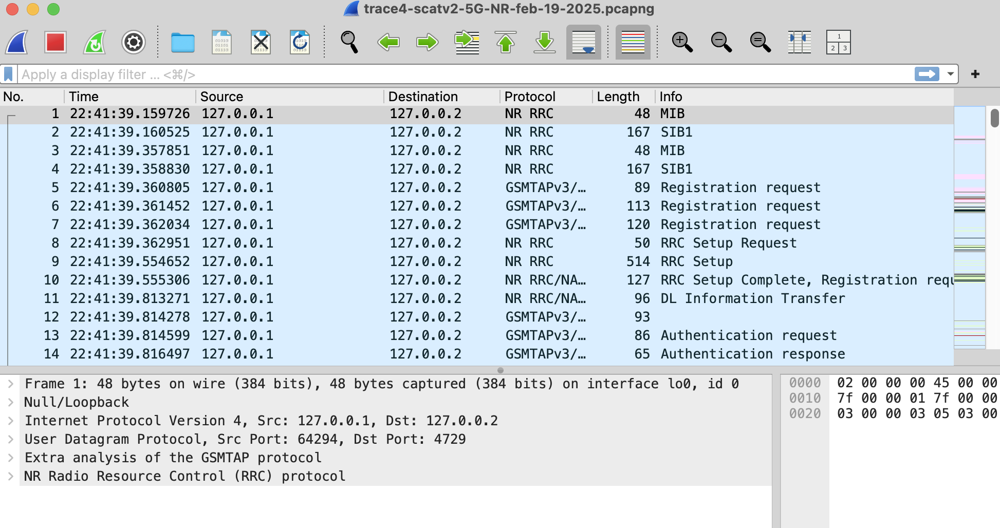
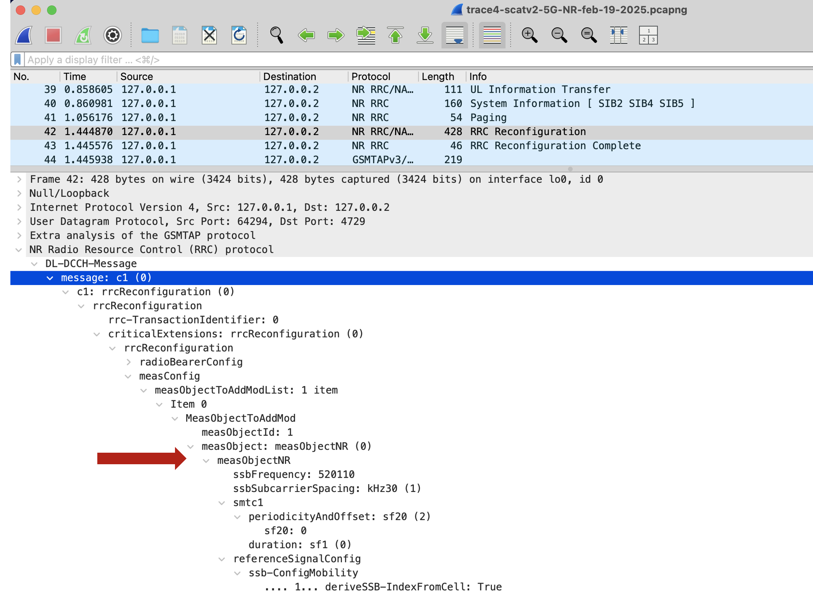
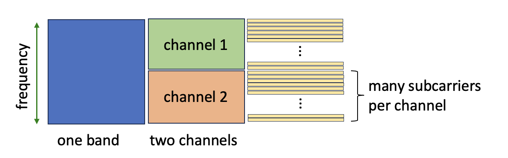
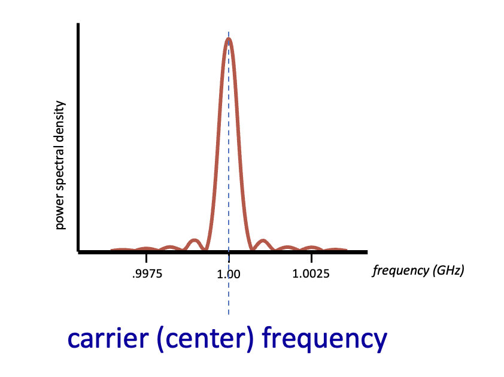
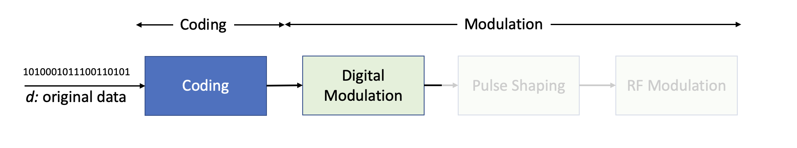
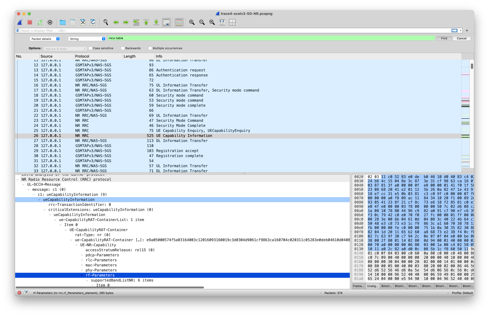

In this lab, we’ll take a look at radio information provided to Wireshark in a 5G network. Before beginning this lab, you might want to re-read Section 7.3.3 in the text[^1]. if you want to read about the 5G radio channel and RAN in more depth, you can do so here: <https://gaia.cs.umass.edu/wireless_and_mobile_networks/readings/Chapter_5_RAN.pdf> As in the case of WiFi, it is notoriously hard to capture 5G frames that have radio information[^2]. So, we’ve captured a trace file\\ of 5G frames for you to analyze for this lab The questions below assume you are analyzing this trace. Download the zip file <http://gaia.cs.umass.edu/wireshark-labs/wireshark-traces-9e.zip> and extract two files. The first is a trace file, trace4-scatv2-5G-NR-feb-19-2025.pcapng; the second is the scat file scat-v2.lua.

The .pcapng file is a trace taken on a live UE (a rooted android phone) containing packets captured using [scat](https://github.com/fgsect/scat). To do this lab, you’ll also need to install a .lua file – a Wireshark dissector plugin – that tells Wireshark how to decode the packets contained in the trace file[^3]. Before opening the trace in Wireshark, you’ll need to place the .lua file in the right place on your filesystem, where Wireshark will find it and install it (that is, you only need put the .lua file in the directory specified below; you don’t need to run any code to install it.) Here's the official Wireshark docs that explain where to place the .lua file: <https://www.wireshark.org/docs/wsug_html_chunked/ChPluginFolders.html>

TL;DR:

> On Windows:

- The personal plugin folder is *%APPDATA%\Wireshark\plugins*.

- The global plugin folder is *WIRESHARK\plugins*.

> On Mac and Unix-like systems:

- The personal plugin folder is *~/.local/lib/wireshark/plugins*.

After copying the .lua file into this directory, you should reboot your computer. With the .lua file installed, and the .pcapng file downloaded, start up Wireshark and open the *trace4-scatv2-5G-NR.pcapng* trace file. Your display should look similar to the screenshot in Figure 1.

|  |
|:--:|
| **Figure 1:** Wireshark screen after opening the trace4-scatv2-5G-NR.pcapng trace file |

Since this is probably the first time you are looking at a 5G trace in Wireshark, take a moment to browse through it. In this lab, we’ll just want to look at aspects of the 5G radio channel, including channel frequency, modulation technique, signal-to-noise ratio and MIMO. In later Wireshark labs we’ll look at the 5G link layer, and the process of joining a 5G network. But in this lab, we’ll focus just on the 5G radio.

Now let’s take a detailed look at the 5G radio characteristics associated with packet 42 in the Wireshark trace. Open the first level field, NR Radio Resource Control (RRC) protocol, which contains all of the radio information associated with this packet, and expand all of the subfields. Your display should look similar to the screenshot in Figure 2 (except for the red arrow, which shows you where to look for the answer to the first question below):

|  |
|:--:|
| **Figure 2:** Expanding the NR Radio Resource Control (RRC) protocol information for packet 42 in our 5G trace |

Wow – that’s lot of information! What we are seeing here is a RRC Reconfiguration message (RRC stands for Radio Resource Control) that is sent by the gNodeB to the UE. We know this message is on the downlink channel by the letters “DL,” in the line just above the highlighted dark blue line in Figure 2. This message is the last message of the “registration sequence” (that we will study later) where the gNodeB is instructing the UE about the channel parameters to use and other configuration parameters for all future communication between the UE and the gNB.

Answer the following questions looking at packet 42. You’ll find it helpful to look up what some fields in this message mean online. Here’s a good resource describing the structure of this message that you can Ctrl+F: <https://howltestuffworks.blogspot.com/2020/02/5g-nr-measurement-configuration.html>

**Figure 3:** Relationship between frequency bands, channels and subcarriers

1.  All communication between a UE and a gNodeB after registration takes place within a frequency band. Recall that a “band” is a range of frequencies that is further subdivided into “channels.” What is the frequency band of the radio channel that the UE will use to communicate with the gNodeB?

2.  What range of frequencies in MHz does the band you discovered above occupy in the radio spectrum? (Hint: this information is not in the trace. You will find the answer in a table in the [channel.pptx file for our class](https://gaia.cs.umass.edu/wireless_and_mobile_networks/slides/channel.pptx))

**Figure 4:** A representation of the central frequency of a carrier over which all symbols (data) are transmitted between a UE and the gNodeB

3.  Periodically (typically every 20ms) the gNodeB sends a Synchronization Signal Block (SSB) to the UE (we’ll learn more about what the SSB looks like later in the course). The UE uses the SSB to measure the quality of the channel between it and the gNodeB. From Figure 4, we know that all data (the SSB is data too!) is carried over a specific carrier which has a central frequency. What is the central frequency of the carrier in MHz that carries the SSB? Hint: Look at the field “ssbFrequency” and use this online calculator: <https://www.cellmapper.net/arfcn>

> 

**Figure 5:** A representation of how raw data gets transformed from binary into waves

4.  From the lecture on coding and modulation, we know that the gNodeB chooses the best digital modulation technique that maximizes the number of reliably transmitted bits/sec based on observed channel impairments. What is the modulation and coding scheme (mcs) used for the physical channel that carries user data?

Next, answer the following questions based on packet 114. Packet 114 is a measurement report the UE sends to the gNodeB containing measurements on the quality of the channel as measured against a reference signal (the SSB as we saw in question 3).

5.  As indicated by this measurement report, what is the average received power of the reference signal (RSRP) in dBm?

6.  What is the average received quality of the reference signal (RSRQ) in dB?

7.  What is the average signal to interference noise ratio of the reference signal in dB?

Next, answer the following questions based on packet 26. Packet 26 is a message from the UE to the gNodeB where the UE specifies its radio capabilities.

The 5G NR standard imposes limits on the maximum power that a UE can use to transmit data. This limit is imposed for several reasons including conserving power and maintaining good signal-to-noise ratios for many simultaneous users (one user’s signal is another user’s noise). Specifically, look at the Radio Frequency (RF) parameters section as highlighted in Figure 3.

**Figure 6:** Expanding the UE Capability information for packet 26 in our 5G trace

8.  What power class does the UE support based on the MIMO parameters of band 41?

9.  Based on the power class you discovered above, what is the maximum transmit power in dBm that the UE must respect based on the NR standard? (Hint: you can search about “UE power classes” online)

[^1]: References to figures and sections are for the 9th edition of our text, *Computer Networks, A Top-down Approach, 9th ed., J.F. Kurose and K.W. Ross, Addison-Wesley/Pearson, 2025.* Our authors’ website for this book is <http://gaia.cs.umass.edu/kurose_ross> You’ll find lots of interesting open material there.

[^2]: In an earlier lab, we discussed how hard it is to capture WiFi traces. Capturing 5G traces is even harder, as only small number of phone models even allow radio information to be captured, and then a great deal of additional pre- and post-processing is required. Fortunately, UMass student Atharva Kale, gathered this trace for you! We gratefully acknowledge his work.

[^3]: We’ll be using our own version of the plugin (located in this [fork](https://github.com/atharvakale343/scat/tree/master/wireshark)) instead of the one in [scat](https://github.com/fgsect/scat/tree/master/wireshark).
