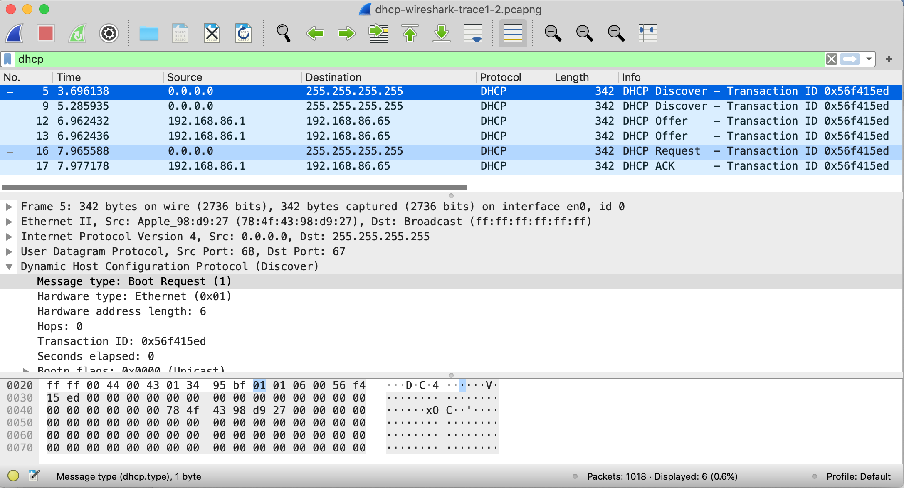

In this lab, we’ll take a quick look at the Dynamic Host Configuration Protocol, DHCP. Recall that DHCP is used extensively in corporate, university and home-network wired and wireless LANs to dynamically assign IP addresses to hosts, as well as to configure other network configuration information.

Before getting started, you’ll probably want to review the coverage of DHCP in Section 4.4.3 in the text[^1]. In particular, you’ll want to pay close attention to Figure 4.24, since we’ll be studying the DHCP Discover, Offer, Request and ACK messages shown in Figure 4.24.

As we’ve done in earlier Wireshark labs, you’ll perform a few actions on your computer that will cause DHCP to spring into action, and then use Wireshark to collect and then the packet trace containing DHCP protocol messages.

Gathering a Packet Trace

The first two steps in the DHCP protocol in Figure 4.24 (using the Discover and Offer messages) are optional (in the sense that they need not always be used when, for example, a new IP address is needed, or an existing DHCP address is to be renewed); the Request and ACK messages are not. In order to collect a trace that will contain all four DHCP message types, we’ll need to take a few command line actions on a Mac, Linux or PC.

On a Mac:

2.  In a terminal window/shell enter the following command:

% sudo ipconfig set en0 none

> Where en0 (in this example) is the interface on which you want to capture packets using Wireshark. You can easily find the list of interface names in Wireshark by choosing Capture-\>options. This command will de-configure network interface en0.

3.  Start up Wireshark, capturing packets on the interface you de-configured in Step 1.

4.  In the terminal window/shell enter the following command:

% sudo ipconfig set en0 dhcp

> This will cause the DHCP protocol to request and receive an IP address and other information from the DHCP server.

4.  After waiting for a few seconds, stop Wireshark capture.

On a Linux machine:

1.  In a terminal window/shell, enter the following commands:

>        sudo ip addr flush en0 
>
>    sudo dhclient -r 
>
> where en0 (in this example) is the interface on which you want to capture packets using Wireshark. You can easily find the list of interface names in Wireshark by choosing Capture -\> Options.  This command will remove the existing IP address of the interface, and release any existing DHCP address leases. 

2.  Start up Wireshark, capturing packets in the interface you de-configured in Step 1. 

3.  In the terminal window/shell, enter the following command:

> sudo dhclient en0
>
> where, as with above, en0 is the interface on which you are currently capturing packets. This will cause the DHCP protocol to request and receive an IP address and other information from the DHCP server. 

4.  After waiting for a few seconds, stop Wireshark capture.

On a PC:

1.  In a command-line window enter the following command:

\> ipconfig /release

> This command will cause your PC to give up its IP address.

2.  Start up Wireshark.

3.  In the command-line window enter the following command:

> \> ipconfig /renew
>
> This will cause the DHCP protocol to request and receive an IP address and other information from a DHCP server.

4.  After waiting for a few seconds, stop Wireshark capture.

After stopping Wireshark capture in step 4, you should take a peek in your Wireshark window to make sure you’ve actually captured the packets that we’re looking for. If you enter “dhcp” into the display filter field (as shown in the light green field in the top left of Figure 1), your screen (on a Mac) should look similar to Figure 1.

|  |
|:--:|
| **Figure 1:** Wireshark display, showing the capture of DHCP Discover, Offer, Request and ACK messages |

If you’re unable to run Wireshark on a live network connection, are unable to capture all four DHCP messages, or are assigned to do so by your instructor, you can use the Wireshark trace file, *dhcp-wireshark-trace1-1.pcapng*[^2] that we’ve gathered following the steps above on one of the author’s computers. You may well find it valuable to download this trace even if you’ve captured your own trace and use it, as well as your own trace, as you explore the questions below.

DHCP Questions

Answer the following questions[^3]. If you’re doing this lab as part of class, your teacher will provide details about how to hand in assignments, whether written or in an LMS.

Let’s start by looking at the DHCP Discover message. Locate the IP datagram containing the first Discover message in your trace.

1.  Is this DHCP Discover message sent out using UDP or TCP as the underlying transport protocol?

2.  What is the source IP address used in the IP datagram containing the Discover message? Is there anything special about this address? Explain.

3.  What is the destination IP address used in the datagram containing the Discover message. Is there anything special about this address? Explain.

4.  What is the value in the transaction ID field of this DHCP Discover message?

5.  Now inspect the options field in the DHCP Discover message. What are five pieces of information (beyond an IP address) that the client is suggesting or requesting to receive from the DHCP server as part of this DHCP transaction?

Now let’s look at the DHCP Offer message. Locate the IP datagram containing the DHCP Offer message in your trace that was sent by a DHCP server in the response to the DHCP Discover message that you studied in questions 1-5 above.

6.  How do you know that this Offer message is being sent in response to the DHCP Discover message you studied in questions 1-5 above?

7.  What is the *source* IP address used in the IP datagram containing the Offer message? Is there anything special about this address? Explain.

8.  What is the *destination* IP address used in the datagram containing the Offer message? Is there anything special about this address? Explain. \[Hint: Look at your trace carefully. The answer to this question may differ from what you see in Figure 4.24 in the textbook. If you really want to dig into this, consult the DHCP RFC: <https://www.ietf.org/rfc/rfc2131.txt>, page 24.\]

9.  Now inspect the options field in the DHCP Offer message. What are five pieces of information that the DHCP server is providing to the DHCP client in the DHCP Offer message?

It would appear that once the DHCP Offer message is received, that the client may have all of the information it needs to proceed. However, the client may have received OFFERs from multiple DHCP servers and so a second phase is needed, with two more mandatory messages – the client-to-server DHCP Request message, and the server-to-client DHCP ACK message is needed. But at least the client knows there is at least one DHCP server out there! Let’s take a look at the DHCP Request message, remembering that although we’ve already seen a Discover message in our trace, that is not always the case when a DHCP request message is sent.

Locate the IP datagram containing the first DHCP Request message in your trace, and answer the following questions.

10. What is the UDP source port number in the IP datagram containing the first DHCP Request message in your trace? What is the UDP destination port number being used?

11. What is the source IP address in the IP datagram containing this Request message? Is there anything special about this address? Explain.

12. What is the destination IP address used in the datagram containing this Request message. Is there anything special about this address? Explain.

13. What is the value in the transaction ID field of this DHCP Request message? Does it match the transaction IDs of the earlier Discover and Offer messages?

14. Now inspect the options field in the DHCP Discover message and take a close look at the “Parameter Request List”. The DHCP RFC <https://www.ietf.org/rfc/rfc2131.txt> notes that

> “The client can inform the server which configuration parameters the client is interested in by including the 'parameter request list' option. The data portion of this option explicitly lists the options requested by tag number.”
>
> What differences do you see between the entries in the ‘parameter request list’ option in this Request message and the same list option in the earlier Discover message?

Locate the IP datagram containing the first DHCP ACK message in your trace, and answer the following questions.

15. What is the source IP address in the IP datagram containing this ACK message? Is there anything special about this address? Explain.

16. What is the destination IP address used in the datagram containing this ACK message. Is there anything special about this address? Explain.

17. What is the name of the field in the DHCP ACK message (as indicated in the Wireshark window) that contains the assigned client IP address?

18. For how long a time (the so-called “lease time”) has the DHCP server assigned this IP address to the client?

19. What is the IP address (returned by the DHCP server to the DHCP client in this DHCP ACK message) of the first-hop router on the default path from the client to the rest of the Internet?

[^1]: References to figures and sections are for the 8th edition of our text, *Computer Networks, A Top-down Approach, 9th ed., J.F. Kurose and K.W. Ross, Addison-Wesley/Pearson, 2025.* Our website for this book is [http://gaia.cs.umass.edu/kurose_ross](http://gaia.cs.umass.edu/kurose_ross) You’ll find lots of interesting open material there.

[^2]: You can download the zip file [http://gaia.cs.umass.edu/wireshark-labs/wireshark-traces-9e.zip](http://gaia.cs.umass.edu/wireshark-labs/wireshark-traces-9e.zip) and extract the trace file *dhcp-wireshark-trace1-1.pcapng.* These trace files can be used to answer these Wireshark lab questions without actually capturing packets on your own. Each trace was made using Wireshark running on one of the author’s computers, while performing the steps indicated in the Wireshark lab. Once you’ve downloaded a trace file, you can load it into Wireshark and view the trace using the *File* pull down menu, choosing *Open*, and then selecting the trace file name.

[^3]: For the author’s class, when answering the following questions with hand-in assignments, students sometimes need to print out specific packets (see the introductory Wireshark lab for an explanation of how to do this) and indicate where in the packet they’ve found the information that answers a question. They do this by marking paper copies with a pen or annotating electronic copies with text in a colored font. There are also learning management system (LMS) modules for teachers that allow students to answer these questions online and have answers auto-graded for these Wireshark labs at [http://gaia.cs.umass.edu/kurose_ross/lms.htm](http://gaia.cs.umass.edu/kurose_ross/lms.htm)
