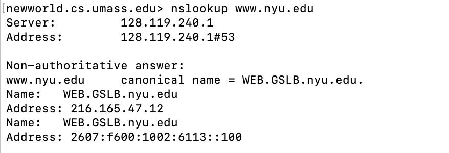
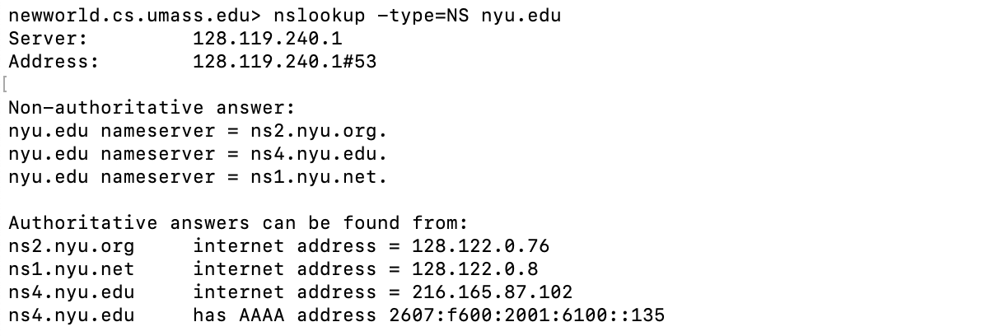
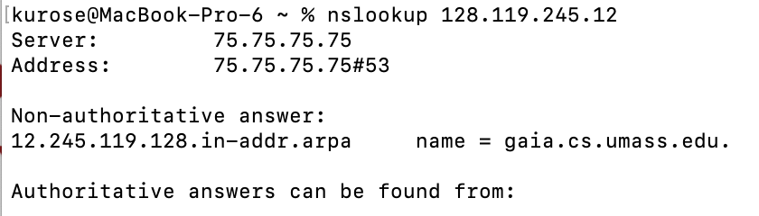
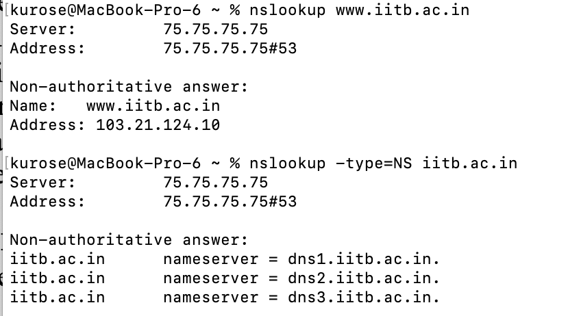
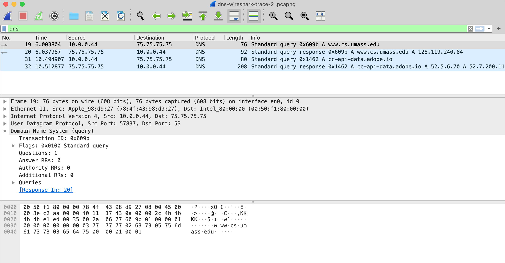

As described in Section 2.4 of the text[^1], the Domain Name System (DNS) translates hostnames to IP addresses, fulfilling a critical role in the Internet infrastructure. In this lab, we’ll take a closer look at the client side of DNS. Recall that the client’s role in the DNS is relatively simple – a client sends a *query* to its local DNS server, and receives a *response* back. As shown in Figures 2.19 and 2.20 in the textbook, much can go on “under the covers,” invisible to a DNS client, as the hierarchical DNS servers communicate with each other to either recursively or iteratively resolve the client’s DNS query. From the DNS client’s standpoint, however, the protocol is quite simple – a query is formulated to the local DNS server and a response is received from that server.

Before beginning this lab, you’ll probably want to review DNS by reading Section 2.4 of the text. In particular, you may want to review the material on **local DNS servers**, **DNS caching**, **DNS records and messages**, and the **TYPE field** in the DNS record.

1\. nslookup

Let’s start our investigation of the DNS by examining the nslookup command, which will invoke the underlying DNS services to implement its functionality. The nslookup command is available in most Microsoft, Apple IOS, and Linux operating systems. To run nslookup you just type the nslookup command on the command line in a DOS window, Mac IOS terminal window, or Linux shell.

In its most basic operation, nslookup allows the host running nslookup to query any specified DNS server for a DNS record. The queried DNS server can be a root DNS server, a top-level-domain (TLD) DNS server, an authoritative DNS server, or an intermediate DNS server (see the textbook for definitions of these terms). For example, nslookup can be used to retrieve a “Type=A” DNS record that maps a hostname (e.g., www.nyu.edu) to its IP address. To accomplish this task, nslookup sends a DNS query to the specified DNS server (or the default local DNS server for the host on which nslookup is run, if no specific DNS server is specified), receives a DNS response from that DNS server, and displays the result.

Let’s take nslookup out for a spin! We’ll first run nslookup on the Linux command line on the newworld.cs.umass.edu host located in the CS Department at the University of Massachusetts (UMass) campus, where the local name server is named primo.cs.umass.edu (which has an IP address 128.119.240.1). Let’s try nslookup in its simplest form:

|  |
|----|
|  |
| **Figure 1:** the basic nslookup command |

In this example the nslookup command is given one argument, a hostname (www.nyu.edu). In words, this command is saying “please send me the IP address for the host www.nyu.edu.” As shown in the screenshot, the response from this command provides two pieces of information: (1) the name and IP address of the DNS server that provides the answer – in this case the local DNS server at UMass; and (2) the answer itself, which is the canonical host name and IP address of www.nyu.edu. You may have noticed that there are two name/address pairs provided for [www.nyu.edu](http://www.nyu.edu). The first (216.165.47.12) is an IPv4 address in the familiar-looking dotted decimal notation; the second (2607:f600:1002:6113::100) is a longer and more complicated looking IPv6 address. We’ll learn about IPv4 and IPv6 and their two different addressing schemes later in Chapter 4. For now, let’s just focus on our more comfortable (and common) IPv4 world[^2].

Although the response came from the local DNS server (with IP address 128.119.240.1) at UMass, it is quite possible that this local DNS server iteratively contacted several other DNS servers to get the answer, as described in Section 2.4 of the textbook.

In addition to using nslookup to query for a DNS “Type=A” record, we can also use nslookup to nslookup to query for a “TYPE=NS” record, which returns the hostname (and its IP address) of an authoritative DNS server that knows how to obtain the IP addresses for hosts in the authoritative server’s domain.

|  |
|---:|
|  |
| **Figure 2:** using nslookup to find the authoritative name servers for the nyu.edu domain |

In the example in Figure 2, we’ve invoked nslookup with the option “-type=NS” and the domain “nyu.edu”. This causes nslookup to send a query for a type-NS record to the default local DNS server. In words, the query is saying, “please send me the host names of the authoritative DNS for nyu.edu”. (When the –type option is not used, *nslookup* uses the default, which is to query for type A records.) The answer, displayed in the above screenshot, first indicates the DNS server that is providing the answer (which is the default local UMass DNS server with address 128.119.240.1) along with three NYU DNS name servers. Each of these servers is indeed an authoritative DNS server for the hosts on the NYU campus. However, nslookup also indicates that the answer is “non-authoritative,” meaning that this answer came from the cache of some server rather than from an authoritative NYU DNS server. Finally, the answer also includes the IP addresses of the authoritative DNS servers at NYU. (Even though the type-NS query generated by nslookup did not explicitly ask for the IP addresses, the local DNS server returned these “for free” and *nslookup* displays the result.)

nslookup has a number of additional options beyond “-type=NS” that you might want to explore. Here’s a site with screenshots of ten popular nslookup uses: [https://www.cloudns.net/blog/10-most-used-nslookup-commands/](https://www.cloudns.net/blog/10-most-used-nslookup-commands/) and here are the “man pages” for nslookup: [https://linux.die.net/man/1/nslookup](https://linux.die.net/man/1/nslookup).

Lastly, we sometimes might be interested in discovering the name of the host associated with a given IP address, i.e., the reverse of the lookup shown in Figure 1 (where the host’s name was known/specified and the host’s IP address was returned). nslookup can also be used to perform this so-called “reverse DNS lookup.” In Figure 3, for example, we specify an IP address as the nslookup argument (128.119.245.12 in this example) and nslookup returns the host name with that address (gaia.cs.umass.edu in this example)

|  |
|:--:|
|  |
| **Figure 3:** using nslookup to perform a “reverse DNS lookup” |

Now that we’ve provided an overview of nslookup, it’s time for you to test drive it yourself. Do the following (and write down the results[^3]). If you’re doing this lab as part of class, your teacher will provide details about how to hand in assignments, whether written or in an LMS. If you’re unable to run the nslookup command or are answering this question using an LMS, Figure 4 shows a screenshot of performing the nslookups in questions 1 and 4, that will allow you to answer the questions below.

1.  Run nslookup to obtain the IP address of the web server for the Indian Institute of Technology in Bombay, India: www.iitb.ac.in. What is the IP address of www.iitb.ac.in

2.  What is the IP address of the DNS server that provided the answer to your nslookup command in question 1 above?

3.  Did the answer to your nslookup command in question 1 above come from an authoritative or non-authoritative server?

4.  Use the nslookup command to determine the name of the authoritative name server for the iit.ac.in domain. What is that name? (If there are more than one authoritative servers, what is the name of the first authoritative server returned by nslookup)? If you had to find the IP address of that authoritative name server, how would you do so?

|  |
|:--:|
|  |
| **Figure 4:** using nslookup to find the IP address of www.iitb.ac.in and the names of the authoritative name servers for the iitb.ac.in domain |

2\. The DNS cache on your computer

From the description of iterative and recursive DNS query resolution (Figures 2.19 and 2.20) in our textbook, you might think that the local DNS server must be contacted *every* time an application needs to translate from a hostname to an IP address. That’s not always true in practice!

Most hosts (e.g., your personal computer) keep a *cache* of recently retrieved DNS records (sometimes called a DNS *resolver cache*), just like many Web browsers keep a cache of objects recently retrieved by HTTP. When DNS services need to be invoked by a host, that host will first check if the DNS record needed is resident in this host’s DNS cache; if the record is found, the host will not even bother to contact the local DNS server and will instead use this cached DNS record. A DNS record in a resolver cache will eventually timeout and be removed from the resolver cache, just as records cached in a local DNS server (see Figures 2.19, 2.20) will timeout.

You can also explicitly clear the records in your DNS cache. There’s no harm in doing so – it will just mean that your computer will need to invoke the distributed DNS service next time it needs to use the DNS name resolution service, since it will find no records in the cache. On a Mac computer, you can enter the following command into a terminal window to clear your DNS resolver cache:

sudo killall -HUP mDNSResponder

On Windows computer you can enter the following command at the command prompt:

ipconfig /flushdns

and on a Linux computer, enter:

sudo systemd-resolve --flush-caches

For v22.04 and later versions of Ubuntu Linux, enter:

sudo resolvectl flush-caches

# 3. Tracing DNS with Wireshark

Now that we are familiar with nslookup and clearing the DNS resolver cache, we’re ready to get down to some serious business. Let’s first capture the DNS messages that are generated by ordinary Web-surfing activity.

- Clear the DNS cache in your host, as described above.

- Open your Web browser and clear your browser cache.

- Open Wireshark and enter ip.addr == \<your_IP_address\> into the display filter, where \<your_IP_address\> is the IPv4 address of your computer[^4]. With this filter, Wireshark will only display packets that either originate from, or are destined to, your host.

- Start packet capture in Wireshark.

- With your browser, visit the Web page: http://gaia.cs.umass.edu/kurose_ross/

- Stop packet capture.

If you are unable to run Wireshark on a live network connection, you can download a packet trace file that was captured while following the steps above on one of the author’s computers[^5]. Answer the following questions.

5.  Locate the first DNS query message resolving the name gaia.cs.umass.edu. What is the packet number[^6] in the trace for the DNS query message? Is this query message sent over UDP or TCP?

6.  Now locate the corresponding DNS response to the initial DNS query. What is the packet number in the trace for the DNS response message? Is this response message received via UDP or TCP?

7.  What is the destination port for the DNS query message? What is the source port of the DNS response message?

8.  To what IP address is the DNS query message sent?

9.  Examine the DNS query message. How many “questions” does this DNS message contain? How many “answers” answers does it contain?

10. Examine the DNS response message to the initial query message. How many “questions” does this DNS message contain? How many “answers” answers does it contain?

11. The web page for the base file http://gaia.cs.umass.edu/kurose_ross/ references the image object http://gaia.cs.umass.edu/kurose_ross/header_graphic_book_8E_2.jpg , which, like the base webpage, is on gaia.cs.umass.edu. What is the packet number in the trace for the initial HTTP GET request for the base file http://gaia.cs.umass.edu/kurose_ross/? What is the packet number in the trace of the DNS query made to resolve gaia.cs.umass.edu so that this initial HTTP request can be sent to the gaia.cs.umass.edu IP address? What is the packet number in the trace of the received DNS response? What is the packet number in the trace for the HTTP GET request for the image object http://gaia.cs.umass.edu/kurose_ross/header_graphic_book_8E2.jpg? What is the packet number in the DNS query made to resolve gaia.cs.umass.edu so that this second HTTP request can be sent to the gaia.cs.umass.edu IP address? Discuss how DNS caching affects the answer to this last question.

Now let’s play with nslooku*p*[^7].

- Start packet capture.

- Do an nslookup on www.cs.umass.edu

- Stop packet capture.

You should get a trace that looks something like the following in your Wireshark window. Let’s look at the first type A query (which is packet number 19 in the figure below, and indicated by the “A” in the *Info* column for that packet.

12. What is the destination port for the DNS query message? What is the source port of the DNS response message?

13. To what IP address is the DNS query message sent? Is this the IP address of your default local DNS server?

14. Examine the DNS query message. What “Type” of DNS query is it? Does the query message contain any “answers”?

15. Examine the DNS response message to the query message. How many “questions” does this DNS response message contain? How many “answers”?

Last, let’s use nslookup to issue a command that will return a type NS DNS record, Enter the following command:

nslookup –type=NS umass.edu

and then answer the following questions[^8] :

16. To what IP address is the DNS query message sent? Is this the IP address of your default local DNS server?

17. Examine the DNS query message. How many questions does the query have? Does the query message contain any “answers”?

18. Examine the DNS response message (in particular the DNS response message that has type “NS”). How many answers does the response have? What information is contained in the answers? How many additional resource records are returned? What additional information is included in these additional resource records (if additional information is returned)?

[^1]: References to figures and sections are for the 9th edition of our text, *Computer Networks, A Top-down Approach, 9th ed., J.F. Kurose and K.W. Ross, Addison-Wesley/Pearson, 2025.* Our website for this book is [http://gaia.cs.umass.edu/kurose_ross](http://gaia.cs.umass.edu/kurose_ross) You’ll find lots of interesting open material there.

[^2]: For Mac OS, if you want to work just in the IPv4 world: System preferences -\> Network. Then select your active interface (e.g., Wi-Fi) and Advanced-\>TCP/IP. Then select the Configure IPv6 drop-down menu and set it to “Link-local only” or “Off”.

[^3]: For the author’s class, when answering the following questions with hand-in assignments, students sometimes need to print out specific packets (see the introductory Wireshark lab for an explanation of how to do this) and indicate where in the packet they’ve found the information that answers a question. They do this by marking paper copies with a pen or annotating electronic copies with text in a colored font. There are also learning management system (LMS) modules for teachers that allow students to answer these questions online and have answers auto-graded for these Wireshark labs at [http://gaia.cs.umass.edu/kurose_ross/lms.htm](http://gaia.cs.umass.edu/kurose_ross/lms.htm)

[^4]: If you’re not sure how to find the IP address of your computer, you can search the Web for articles for your operating system. Windows 10 info is [here](https://support.microsoft.com/en-us/windows/find-your-ip-address-f21a9bbc-c582-55cd-35e0-73431160a1b9); Mac info is [here](https://www.hellotech.com/guide/for/how-to-find-ip-address-on-mac); Linux info is [here](https://www.linuxtrainingacademy.com/determine-public-ip-address-command-line-curl/)

[^5]:  You can download the zip file [http://gaia.cs.umass.edu/wireshark-labs/wireshark-traces-9e.zip](http://gaia.cs.umass.edu/wireshark-labs/wireshark-traces-9e.zip) and extract the trace file dns-wireshark-trace1-1. These trace files can be used to answer these Wireshark lab questions without actually capturing packets on your own. Each trace was made using Wireshark running on one of the author’s computers, while performing the steps indicated in the Wireshark lab. Once you’ve downloaded a trace file, you can load it into Wireshark and view the trace using the *File* pull down menu, choosing *Open*, and then selecting the trace file name.

[^6]: Remember that this “packet number” is assigned by Wireshark for listing purposes only; it is NOT a packet number contained in any real packet header.

[^7]: If you are unable to run Wireshark and capture a trace file, or are using an LMS, use the trace file dns-wireshark-trace-2 in the zip file of traces in the footnote above to answer questions 12-16 below.

[^8]: If you are unable to run Wireshark and capture a trace file, or are using an LMS, use the trace file *dns-wireshark-trace-3* in the zip file of traces in the footnote above to answer questions 17-19 below.
