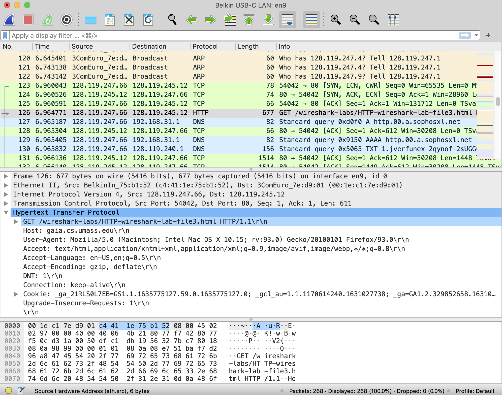
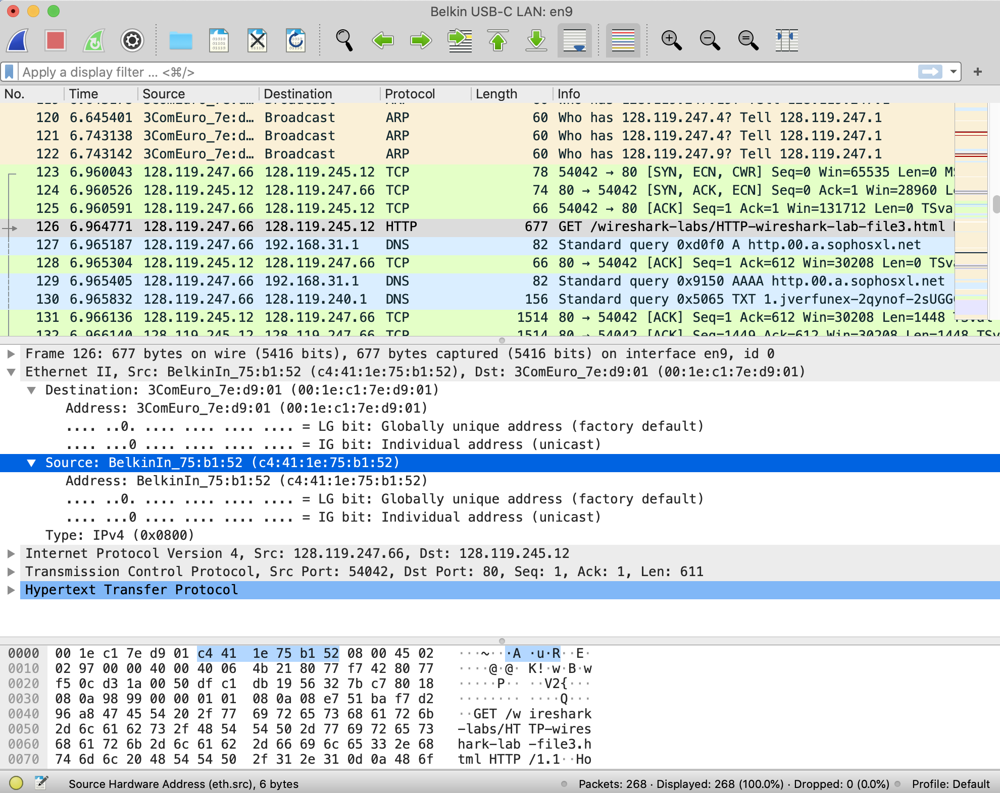
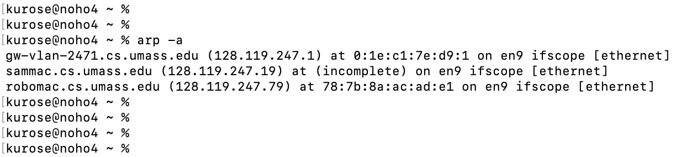
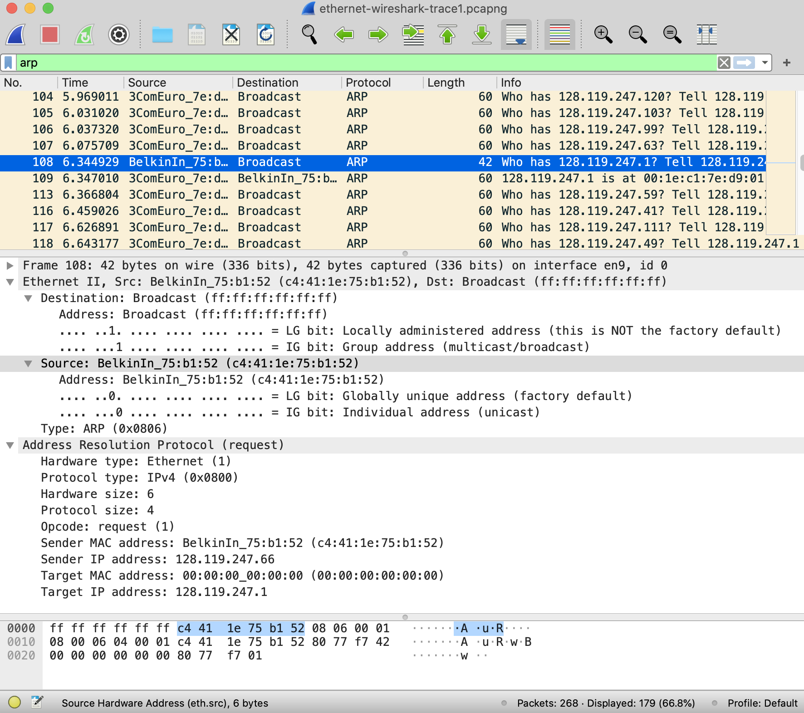

In this lab, we’ll investigate the Ethernet protocol and the ARP protocol. Before beginning this lab, you’ll probably want to review sections 6.4.1 (Link-layer addressing and ARP) and 6.4.2 (Ethernet) in the text[^1]. RFC .1

26 (<ftp://ftp.rfc-editor.org/in-notes/std/std37.txt>) contains the gory details of the ARP protocol, which is used by an IP device to determine the IP address of a remote interface whose Ethernet address is known.

1\. Capturing and analyzing Ethernet frames

Let’s begin by capturing a set of Ethernet frames to study. To do this, of course, you’ll need access to a wired Ethernet connection for your PC or Mac – not necessarily a common scenario these days, given the popularity of wireless WiFi and cellular access. If you’re unable to run Wireshark on a live Ethernet connection, you can download a packet trace that was captured while following the steps below on one of the author’s computers[^2]. In addition, you may well find it valuable to download this trace even if you’ve captured your own trace and use it, as well as your own trace, when you explore the questions below.

Do the following:

- First, make sure your browser’s cache of previously downloaded documents is empty.

- Start up Wireshark and enter the following URL into your browser: <http://gaia.cs.umass.edu/wireshark-labs/HTTP-wireshark-file3.html>. Your browser should display the rather lengthy US Bill of Rights.

- Stop Wireshark packet capture.

> First, find the packet number (the leftmost column in the upper Wireshark window) of the HTTP GET message that was sent from your computer to gaia.cs.umass.edu, as well as the beginning of the HTTP response message sent to your computer by gaia.cs.umass.edu. You should see a screen that looks something like this (where packet 126 in the screen shot below contains the HTTP GET message)

|  |
|:--:|
| **Figure 1:** Wireshark display showing HTTP GET message for http://gaia.cs.umass.edu/wireshark-labs/HTTP-wireshark-file3.html |

Since this lab is about Ethernet and ARP, we’re not interested in high-level protocols like IP, TCP or HTTP. We’re interested in Ethernet frames and ARP messages!

Let’s start by looking at the Ethernet frame containing the HTTP GET message. (Recall that the HTTP GET message is carried inside of a TCP segment, which is carried inside of an IP datagram, which is carried inside of an Ethernet frame; reread section 1.5.2 in the text if you find this notion of encapsulation a bit confusing). Expand the Ethernet II information in the packet details window. Note that the contents of the Ethernet frame (header as well as payload) are displayed in the packet contents window. Your display should look similar to that shown in Figure 2.

|  |
|:--:|
| **Figure 2:** Wireshark display showing details of the Ethernet frame containing the HTTP GET request. |

In answering the questions below[^3], you can use either your own live trace, or use the Wireshark captured packet file *Ethernet-wireshark-trace1* in <http://gaia.cs.umass.edu/wireshark-labs/wireshark-traces-9e.zip>

1.  What is the 48-bit Ethernet address of your computer?

2.  What is the 48-bit destination address in the Ethernet frame? Is this the Ethernet address of gaia.cs.umass.edu? (Hint: the answer is *no*). What device has this as its Ethernet address? \[Note: this is an important question, and one that students sometimes get wrong. Re-read pages 483-484 in the text and make sure you understand the answer here.\]

3.  What is the hexadecimal value for the two-byte Frame type field in the Ethernet frame carrying the HTTP GET request?  What upper layer protocol does this correspond to?

4.  How many bytes from the very start of the Ethernet frame does the ASCII “G” in “GET” appear in the Ethernet frame? Do not count any preamble bits in your count, i.e., assume that the Ethernet frame begins with the Ethernet frame's destination address.

Next, answer the following questions, based on the contents of the Ethernet frame containing the first byte of the HTTP response message.

5.  What is the value of the Ethernet source address? Is this the address of your computer, or of gaia.cs.umass.edu (Hint: the answer is *no*). What device has this as its Ethernet address?

6.  What is the destination address in the Ethernet frame? Is this the Ethernet address of your computer?

7.  Give the hexadecimal value for the two-byte Frame type field. What upper layer protocol does this correspond to?

8.  How many bytes from the very start of the Ethernet frame does the ASCII “O” in “OK” (i.e., the HTTP response code) appear in the Ethernet frame? Do not count any preamble bits in your count, i.e., assume that the Ethernet frame begins with the Ethernet frame's destination address.

9.  How many Ethernet frames (each containing an IP datagram, each containing a TCP segment) carry data that is part of the complete HTTP “OK 200 ...” reply message?

2\. The Address Resolution Protocol

In this section, we’ll observe the ARP protocol in action. We strongly recommend that you re-read section 6.4.1 in the text before proceeding.

**ARP Caching**

Recall that the ARP protocol typically maintains a cache of IP-to-Ethernet address translation pairs on your computer. The *arp* command (in both DOS, MacOS and Linux) is used to view and manipulate the contents of this cache. Since the *arp* command and the ARP protocol have the same name, it’s understandably easy to confuse them. But keep in mind that they are different - the *arp* command is used to view and manipulate the ARP cache contents, while the ARP protocol defines the format and meaning of the messages sent and received, and defines the actions taken on ARP message transmission and receipt.

Let’s take a look at the contents of the ARP cache on your computer. In DOS, MacOS, and Linux, the “arp -a” command will display the contents of the ARP cache on your computer. So at a command line, type “arp -a”. The results of entering this command on one of the authors’ computers is shown in Figure 3.

|  |
|:--:|
| Figure 3: Executing the “arp -a” command from one of the authors’ computers |

10. How many entries are stored in your ARP cache?

11. What is contained in each displayed entry of the ARP cache?

In order to observe your computer sending and receiving ARP messages, we’ll need to clear the ARP cache, since otherwise your computer is likely to find a needed IP-Ethernet address translation pair in its cache and consequently not need to send out an ARP message. The “*arp –d -a*” command will clear your ARP cache using the command line. In order to run this command on a Mac or Linux machine you’ll need root privileges or use *sudo*. If you don’t have root privileges and can’t run Wireshark on a Windows machine, you can skip the trace collection part of this lab and use the trace file *ethernet-wireshark-trace1* discussed earlier.

**Observing ARP in action**

Do the following[^4]:

- Clear your ARP cache, as described above and make sure your browser’s cache is cleared of previously downloaded documents.

- Start up the Wireshark packet sniffer.

- Enter the following URL into your browser:  
  http://gaia.cs.umass.edu/wireshark-labs/HTTP-wireshark-lab-file3.html  
  Your browser should again display the rather lengthy US Bill of Rights.

- Stop Wireshark packet capture.

> Again, we’re not interested in IP or higher-layer protocols, so let’s just look at ARP packets. Your display should look similar to that shown in Figure 3 (note we have entered “arp” into the display filter window at the top of the Wireshark screen).

|  |
|:--:|
| Figure 3: An ARP query being broadcast from the computer of one of the authors’ |

Let’s start by looking at the Ethernet frames containing ARP messages. Answer the following questions:

12. What is the hexadecimal value of the source address in the Ethernet frame containing the ARP request message sent out by your computer?

13. What is the hexadecimal value of the destination addresses in the Ethernet frame containing the ARP request message sent out by your computer? And what device(if any) corresponds to that address (e.g,, client, server, router, switch or otherwise...)?

14. What is the hexadecimal value for the two-byte Ethernet Frame *type* field. What upper layer protocol does this correspond to?

Now let’s dig even a bit deeper into the ARP messages themselves. To answer this question, you will need to dig into ARP. The original RFC (<https://datatracker.ietf.org/doc/html/rfc826>) that defines ARP is a little hard to read. The Wikipedia entry for ARP is pretty good: <https://en.wikipedia.org/wiki/Address_Resolution_Protocol>

Answer the following question about the ARP request message sent by your computer.

15. How many bytes from the very beginning of the Ethernet frame does the ARP *opcode* field begin?

16. What is the value of the *opcode* field within the ARP request message sent by your computer?

17. Does the ARP request message contain the IP address of the sender? If the answer is yes, what is that value?

18. What is the IP address of the device whose corresponding Ethernet address is being requested in the ARP request message sent by your computer?

Now find the ARP reply message that was sent in response to the ARP request from your computer.

19. What is the value of the *opcode* field within the ARP reply message received by your computer?

20. *Finally (!),* let’s look at the **answer** to the ARP request message! What is the Ethernet address corresponding to the IP address that was specified in the ARP request message sent by your computer (see question 18)?

We’ve looked the ARP request message sent by your computer running Wireshark, and the ARP reply sent in reply. But there are other devices in this network that are also sending ARP requests that you can find in the trace.

21. We’ve looked the ARP request message sent by your computer running Wireshark, and the ARP reply message sent in response.  But there are other devices in this network that are also sending ARP request messages that you can find in the trace. Why are there no ARP replies in your trace that are sent in response to these other ARP request messages?  

**Extra Credit**

EX-1. The *arp* command:

> *arp -s InetAddr EtherAddr*
>
> allows you to manually add an entry to the ARP cache that resolves the IP address *InetAddr* to the physical address *EtherAddr*. What would happen if, when you manually added an entry, you entered the correct IP address, but the wrong Ethernet address for that remote interface? A security attack known as “ARP poisoning” <https://www.varonis.com/blog/arp-poisoning/> spoofs ARP messages and causes incorrect entries to be made into an ARP table!

EX-2. What is the default amount of time that an entry remains in your ARP cache before being removed? You can determine this empirically (by monitoring the cache contents) or by looking this up in your operating system documentation. Indicate how/where you determined this value.

[^1]: References to figures and sections are for the 9th edition of our text, *Computer Networks, A Top-down Approach, 9th ed., J.F. Kurose and K.W. Ross, Addison-Wesley/Pearson, 2020.* Our authors’ website for this book is <http://gaia.cs.umass.edu/kurose_ross> You’ll find lots of interesting open material there.

[^2]: You can download the zip file <http://gaia.cs.umass.edu/wireshark-labs/wireshark-traces-9e.zip> and extract the trace file *ethernet-wireshark-trace1*. This trace file can be used to answer this Wireshark lab without actually capturing packets on your own. This trace was made using Wireshark running on one of the author’s computers, while performing the steps indicated in this Wireshark lab. Once you’ve downloaded a trace file, you can load it into Wireshark and view the trace using the *File* pull down menu, choosing *Open*, and then selecting the trace file name.

[^3]: For the author’s class, when answering the following questions with hand-in assignments, students sometimes need to print out specific packets (see the introductory Wireshark lab for an explanation of how to do this) and indicate where in the packet they’ve found the information that answers a question. They do this by marking paper copies with a pen or annotating electronic copies with text in a colored font. There are also learning management system (LMS) modules for teachers that allow students to answer these questions online and have answers auto-graded for these Wireshark labs at <http://gaia.cs.umass.edu/kurose_ross/lms.htm>

[^4]: The *ethernet-wireshark-trace-1* trace file in <http://gaia.cs.umass.edu/wireshark-labs/wireshark-traces-9e.zip> and was created using the steps below (in particular after the ARP cache had been flushed).
