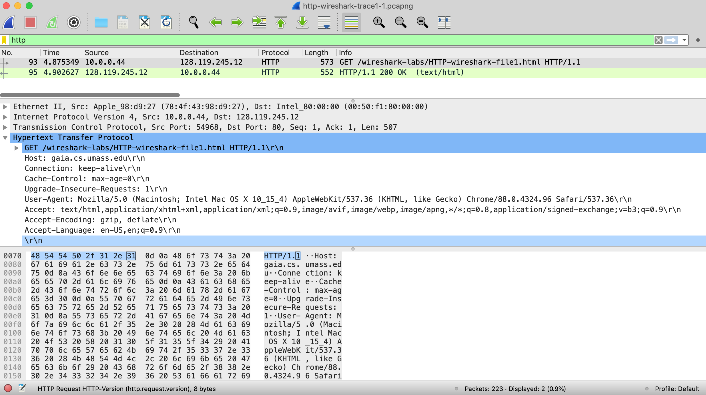

Having gotten our feet wet with the Wireshark packet sniffer in the introductory lab, we’re now ready to use Wireshark to investigate protocols in operation. In this lab, we’ll explore several aspects of the HTTP protocol: the basic GET/response interaction, HTTP message formats, retrieving large HTML files, retrieving HTML files with embedded objects, and HTTP authentication and security. Before beginning these labs, you might want to review Section 2.2 of the text.[^1]

You might also want to review the introductory Wireshark Lab, where we noted that

before you run Wireshark, there are several things you should check in your network connection and browser configuration:

- Make sure you are ***not*** running a VPN (virtual private network) service. We’ll learn about VPNs later in this course. But for now, all you need to know is that when you’re running a VPN service, upper-layer protocol information (HTTP, TCP) that is sent by your computer may be encrypted. This makes it impossible to use Wireshark to look at what’s going on inside these protocols!

- Make sure your browser program is ***not***, by default, using the HTTP/3 protocol or the QUIC protocol. We’ll learn about HTTP/3 and QUIC in Chapter 2. But for now, all you need to know is that when you’re running HTTP/3 or QUIC, upper-layer protocol information (HTTP, TCP) sent by your computer will be encrypted. As of 2025, most popular browsers have adopted HTTP/3 and QUIC as defaults. A document that describes how to *disable* HTTP/3 AND QUIC as the defaults for your browser is here: <https://techysnoop.com/disable-quic-protocol-in-chrome-edge-firefox/> .

- Make sure that when you go to a URL, the URL starts with `http://` rather than `https://`, since the latter case will encrypt frames.

- Make sure privacy and browser privacy settings are turned off.

- Make sure you clear your browser cache and browser history before you start.

1\. The Basic HTTP GET/response interaction

Let’s begin our exploration of HTTP by downloading a very simple HTML file - one that is very short, and contains no embedded objects. Do the following:

1.  Start up your web browser.

2.  Start up the Wireshark packet sniffer, as described in the Introductory lab (but don’t yet begin packet capture). Enter “http” (just the letters, not the quotation marks, and in lower case) in the display-filter-specification window, so that only captured HTTP messages will be displayed later in the packet-listing window. (We’re only interested in the HTTP protocol here, and don’t want to see the clutter of all captured packets).

3.  Wait a bit more than one minute (we’ll see why shortly), and then begin Wireshark packet capture.

4.  Enter the following to your browser  
    <http://gaia.cs.umass.edu/wireshark-labs/HTTP-wireshark-file1.html>  
    Your browser should display the very simple, one-line HTML file.

5.  Stop Wireshark packet capture.

Your Wireshark window should look similar to the window shown in Figure 1. If you’re unable to run Wireshark on a live network connection, you can download a packet trace that was created when the steps above were followed.[^2]

**Figure 1:** Wireshark Display after http://gaia.cs.umass.edu/wireshark-labs/ HTTP-wireshark-file1.html has been retrieved by your browser

The example in Figure 1 shows in the packet-listing window that two HTTP messages were captured: the GET message (from your browser to the gaia.cs.umass.edu web server) and the response message from the server to your browser. The packet-contents window shows details of the selected message (in this case the HTTP OK message, which is highlighted in the packet-listing window). Recall that since the HTTP message was carried inside a TCP segment, which was carried inside an IP datagram, which was carried within an Ethernet frame, Wireshark displays the Frame, Ethernet, IP, and TCP packet information as well. We want to minimize the amount of non-HTTP data displayed (we’re interested in HTTP here, and will be investigating these other protocols is later labs), so make sure the boxes at the far left of the Frame, Ethernet, IP and TCP information have a plus sign or a right-pointing triangle (which means there is hidden, undisplayed information), and the HTTP line has a minus sign or a down-pointing triangle (which means that all information about the HTTP message is displayed).

> (*Note:* You should ignore any HTTP GET and response for favicon.ico. If you see a reference to this file, it is your browser automatically asking the server if it (the server) has a small icon file that should be displayed next to the displayed URL in your browser. We’ll ignore references to this pesky file in this lab.).

By looking at the information in the HTTP GET and response messages, answer the following questions. If you’re doing this lab as part of class, your teacher will provide details about how to hand in assignments, whether written or in an LMS.[^3]

1.  Is your browser running HTTP version 1.0, 1.1, or 2? What version of HTTP is the server running?

2.  What languages (if any) does your browser indicate that it can accept to the server?

3.  What is the IP address of your computer? What is the IP address of the gaia.cs.umass.edu server?

4.  What is the status code returned from the server to your browser?

5.  When was the HTML file that you are retrieving last modified at the server?

6.  How many bytes of content are being returned to your browser?

7.  By inspecting the raw data in the packet content window, do you see any headers within the data that are not displayed in the packet-listing window? If so, name one.

In your answer to question 5 above (assuming you’re running Wireshark “live”, as opposed to using an earlier-recorded trace file), you might have been surprised to find that the document you just retrieved was last modified within a minute before you downloaded the document. That’s because (for this particular file), the gaia.cs.umass.edu server is setting the file’s last-modified time to be the current time, and is doing so once per minute. Thus, if you wait a minute between accesses, the file will appear to have been recently modified, and hence your browser will download a “new” copy of the document.

2\. The HTTP CONDITIONAL GET/response interaction

Recall from Section 2.2.5 of the text, that most web browsers perform object caching and thus often perform a conditional GET when retrieving an HTTP object. Before performing the steps below, make sure your browser’s cache is empty[^4]. Now do the following:

- Start up your web browser, and make sure your browser’s cache is cleared, as discussed above.

- Start up the Wireshark packet sniffer

- Enter the following URL into your browser  
  <http://gaia.cs.umass.edu/wireshark-labs/HTTP-wireshark-file2.html>  
  Your browser should display a very simple five-line HTML file.

- Quickly enter the same URL into your browser again (or simply select the refresh button on your browser)

- Stop Wireshark packet capture, and enter “http” (again, in lower case without the quotation marks) in the display-filter-specification window, so that only captured HTTP messages will be displayed later in the packet-listing window.

If you’re unable to run Wireshark on a live network connection (or unable to get your browser to issue an If-Modified-Since field on the second HTTP GET request), you can download a packet trace that was created when the steps above were followed.[^5] Answer the following questions:

8.  Inspect the contents of the first HTTP GET request from your browser to the server. Do you see an “IF-MODIFIED-SINCE” line in the HTTP GET?

9.  Inspect the contents of the server response. Did the server explicitly return the contents of the file? How can you tell?

10. Now inspect the contents of the second HTTP GET request from your browser to the server. Do you see an “IF-MODIFIED-SINCE:” line in the HTTP GET[^6]? If so, what information follows the “IF-MODIFIED-SINCE:” header?

11. What is the HTTP status code and phrase returned from the server in response to this second HTTP GET? Did the server explicitly return the contents of the file? Explain.

3\. Retrieving Long Documents

In our examples thus far, the documents retrieved have been simple and short HTML files. Let’s next see what happens when we download a long HTML file. Do the following:

- Start up your web browser, and make sure your browser’s cache is cleared, as discussed above.

- Start up the Wireshark packet sniffer

- Enter the following URL into your browser  
  <http://gaia.cs.umass.edu/wireshark-labs/HTTP-wireshark-file3.html>  
  Your browser should display the rather lengthy US Bill of Rights.

- Stop Wireshark packet capture, and enter “http” in the display-filter-specification window, so that only captured HTTP messages will be displayed.

In the packet-listing window, you should see your HTTP GET message, followed by a multiple-packet TCP response to your HTTP GET request. Make sure you your Wireshark display filter is cleared so that the multi-packet TCP response will be displayed in the packet listing.

This multiple-packet response deserves a bit of explanation. Recall from Section 2.2 (see Figure 2.9 in the text) that the HTTP response message consists of a status line, followed by header lines, followed by a blank line, followed by the entity body. In the case of our HTTP GET, the entity body in the response is the *entire* requested HTML file. In our case here, the HTML file is rather long, and at 4500 bytes is too large to fit in one TCP packet. The single HTTP response message is thus broken into several pieces by TCP, with each piece being contained within a separate TCP segment (see Figure 1.24 in the text). In recent versions of Wireshark, Wireshark indicates each TCP segment as a separate packet, and the fact that the single HTTP response was fragmented across multiple TCP packets is indicated by the “TCP segment of a reassembled PDU” in the Info column of the Wireshark display.

Answer the following questions[^7]:

12. How many HTTP GET request messages did your browser send? Which packet number in the trace contains the GET message for the Bill or Rights?

13. Which packet number in the trace contains the status code and phrase associated with the response to the HTTP GET request?

14. What is the status code and phrase in the response?

15. How many data-containing TCP segments were needed to carry the single HTTP response and the text of the Bill of Rights?

4\. HTML Documents with Embedded Objects

Now that we’ve seen how Wireshark displays the captured packet traffic for large HTML files, we can look at what happens when your browser downloads a file with embedded objects, i.e., a file that includes other objects (in the example below, image files) that are stored on another server(s).

Do the following:

- Start up your web browser, and make sure your browser’s cache is cleared, as discussed above.

- Start up the Wireshark packet sniffer

- Enter the following URL into your browser  
  <http://gaia.cs.umass.edu/wireshark-labs/HTTP-wireshark-file4.html>  
  Your browser should display a short HTML file with two images. These two images are referenced in the base HTML file. That is, the images themselves are not contained in the HTML; instead the URLs for the images are contained in the downloaded HTML file. As discussed in the textbook, your browser will have to retrieve these logos from the indicated web sites. Our publisher’s logo is retrieved from the gaia.cs.umass.edu web site. The image of our 8th edition cover (one of our favorite covers) is stored at a server in France.

- Stop Wireshark packet capture, and enter “http” in the display-filter-specification window, so that only captured HTTP messages will be displayed.

Answer the following questions[^8]:

16. How many HTTP GET request messages did your browser send? To which Internet addresses were these GET requests sent?

17. Can you tell whether your browser downloaded the two images serially, or whether they were downloaded from the two web sites in parallel? Explain.

5 HTTP Authentication

Finally, let’s try visiting a web site that is password-protected and examine the sequence of HTTP message exchanged for such a site. The URL

http://gaia.cs.umass.edu/wireshark-labs/protected_pages/HTTP-wireshark-file5.html is password protected. The username is “wireshark-students” (without the quotes), and the password is “network” (again, without the quotes). So let’s access this “secure” password-protected site. Do the following:

- Make sure your browser’s cache is cleared, as discussed above, and close down your browser. Then, start up your browser

- Start up the Wireshark packet sniffer

- Enter the following URL into your browser  
  <http://gaia.cs.umass.edu/wireshark-labs/protected_pages/HTTP-wireshark-file5.html>  
  Type the requested user name and password into the pop up box.

- Stop Wireshark packet capture, and enter “http” in the display-filter-specification window, so that only captured HTTP messages will be displayed later in the packet-listing window.

- *Note:* If you are unable to run Wireshark on a live network connection, you can use the “classic” http-ethereal-trace-5 packet trace, or other additional traces, as notes in footnote 2, to answer the questions below.

Now let’s examine the Wireshark output. You might want to first read up on HTTP authentication by reviewing the easy-to-read material on “HTTP Access Authentication Framework” at <http://frontier.userland.com/stories/storyReader$2159>

Answer the following questions[^9]:

18. What is the server’s response (status code and phrase) in response to the initial HTTP GET message from your browser?

19. When your browser’s sends the HTTP GET message for the second time, what new field is included in the HTTP GET message?

The username (wireshark-students) and password (network) that you entered are encoded in the string of characters (d2lyZXNoYXJrLXN0dWRlbnRzOm5ldHdvcms=) following the “Authorization: Basic” header in the client’s HTTP GET message. While it may appear that your username and password are encrypted, they are simply encoded in a format known as Base64 format. The username and password are *not* encrypted! To see this, go to <http://www.motobit.com/util/base64-decoder-encoder.asp> and enter the base64-encoded string d2lyZXNoYXJrLXN0dWRlbnRz and decode. *Voila!* You have translated from Base64 encoding to ASCII encoding, and thus should see your username! To view the password, enter the remainder of the string Om5ldHdvcms= and press decode. Since anyone can download a tool like Wireshark and sniff packets (not just their own) passing by their network adaptor, and anyone can translate from Base64 to ASCII (you just did it!), it should be clear to you that simple passwords on WWW sites are not secure unless additional measures are taken.

Fear not! As we will see in Chapter 8, there are ways to make WWW access more secure. However, we’ll clearly need something that goes beyond the basic HTTP authentication framework!

[^1]: References to figures and sections are for the 9th edition of our text, *Computer Networks, A Top-down Approach, 9th ed., J.F. Kurose and K.W. Ross, Addison-Wesley/Pearson, 2025.* Our authors’ website for this book is <http://gaia.cs.umass.edu/kurose_ross> You’ll find lots of interesting open material there.

[^2]: You can download the zip file <http://gaia.cs.umass.edu/wireshark-labs/wireshark-traces-9e.zip> and extract the trace file http-wireshark-trace1-1. These trace files can be used to answer these Wireshark lab questions without actually capturing packets on your own. Each trace was made using Wireshark running on one of the author’s computers, while performing the steps indicated in the Wireshark lab. Once you’ve downloaded a trace file, you can load it into Wireshark and view the trace using the *File* pull down menu, choosing *Open*, and then selecting the trace file name. The resulting display should look similar to Figure 1 (for the http-wireshark-trace1-1 trace file for this HTTP lab). The Wireshark user interface displays just a bit differently on different operating systems, and in different versions of Wireshark.

[^3]: For the author’s class, when answering the following questions with hand-in assignments, students print out the GET and response messages (see the introductory Wireshark lab for an explanation of how to do this) and indicate where in the message they’ve found the information that answers a question. They do this by marking paper copies with a pen or annotating electronic copies with text in a colored font. There are LMS modules for teachers that allow students to answer these questions online and have answers auto-graded for these Wireshark labs at <http://gaia.cs.umass.edu/kurose_ross/lms.htm>

[^4]: See <https://www.howtogeek.com/304218/how-to-clear-your-history-in-any-browser/> for instructions on clearing your browser cache.

[^5]: If you’re unable to run Wireshark on a live network connection, you can download the zip file <http://gaia.cs.umass.edu/wireshark-labs/wireshark-traces-9e.zip> and extract the trace file http-wireshark-trace2-1.

[^6]: *Hint:* ideally, you should see an If-Modified-Since header since you’ve just downloaded this page a few seconds ago. However, depending on the browser you’re using, and the format of the server’s earlier response to your initial GET, your browser may not include an If-Modified-Since even if the document has been downloaded and caches. The Chrome browser is pretty good at regularly using If-Modified-Since. But Safari and Firefox are much more finicky about when to use If-Modified-Since. Life isn’t always as easy in practice as it is in theory!

[^7]: If you’re unable to run Wireshark on a live network connection, you can download the zip file <http://gaia.cs.umass.edu/wireshark-labs/wireshark-traces-9e.zip> and extract the trace file http-wireshark-trace3-1.

[^8]: If you’re unable to run Wireshark on a live network connection, you can download the zip file <http://gaia.cs.umass.edu/wireshark-labs/wireshark-traces-9e.zip> and extract the trace file http-wireshark-trace4-1.

[^9]: If you’re unable to run Wireshark on a live network connection, you can download the zip file <http://gaia.cs.umass.edu/wireshark-labs/wireshark-traces-9e.zip> and extract the trace file http-wireshark-trace5-1.
