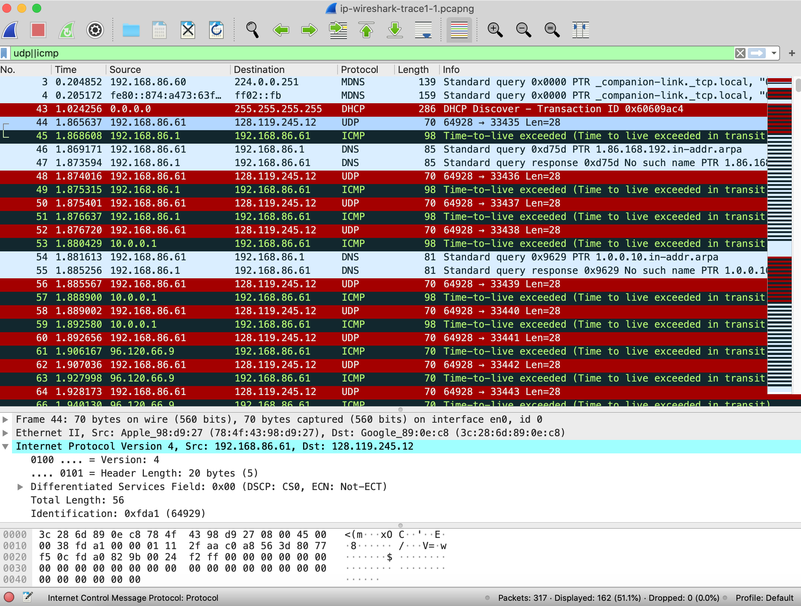
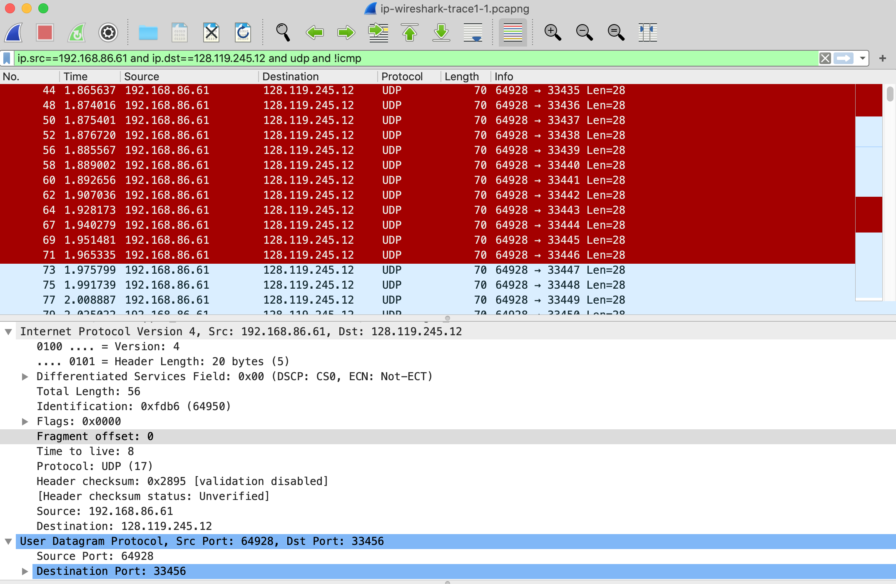
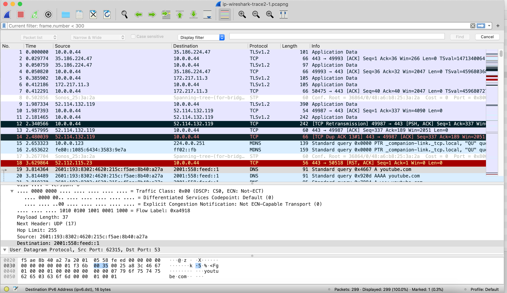

In this lab, we’ll investigate the celebrated IP protocol, focusing on the IPv4 and IPv6 datagram. This lab has three parts. In the first part, we’ll analyze packets in a trace of IPv4 datagrams sent and received by the traceroute program (the traceroute program itself is explored in more detail in the Wireshark ICMP lab). We’ll study IP fragmentation in Part 2 of this lab, and take a quick look at IPv6 in Part 3 of this lab.

Before getting started, you’ll probably want to review sections 1.4.3 in the text[^1] and section 3.4 of [RFC 2151](https://tools.ietf.org/html/rfc2151) to update yourself on the operation of the traceroute program. You’ll also want to read Section 4.3 in the text, and probably also have [RFC 791](https://tools.ietf.org/html/rfc791) on hand as well, for a discussion of the IP protocol. If you answer the questions on IP fragmentation, you’ll definitely also want to review material on IP fragmentation. Although we’ve removed the topic of IP fragmentation from the 8th edition of our textbook (to make room for new material), you can find material on IP fragmentation from the 7th edition of our textbook (and earlier) at <http://gaia.cs.umass.edu/kurose_ross/Kurose_Ross_7th_edition_section_4.3.2.pdf>.

[RFC 8200](https://tools.ietf.org/html/rfc8200) is the full RFC for IPv6, but reading that is a bit of overkill for this lab; you can review IPv6 by consulting Section 4.3.4 in the textbook.

Capturing packets from an execution of traceroute

In order to generate a trace of IPv4 datagrams for the first two parts of this lab, we’ll use the traceroute program to send datagrams of two different sizes to gaia.cs.umass.edu. Recall that traceroute operates by first sending one or more datagrams with the time-to-live (TTL) field in the IP header set to 1; it then sends a series of one or more datagrams towards the same destination with a TTL value of 2; it then sends a series of datagrams towards the same destination with a TTL value of 3; and so on. Recall that a router must decrement the TTL in each received datagram by 1 (actually, RFC 791 says that the router must decrement the TTL by *at least* one). If the TTL reaches 0, the router returns an ICMP message (type 11 – TTL-exceeded) to the sending host. As a result of this behavior, a datagram with a TTL of 1 (sent by the host executing traceroute) will cause the router one hop away from the sender to send an ICMP TTL-exceeded message back to the sender; the datagram sent with a TTL of 2 will cause the router two hops away to send an ICMP message back to the sender; the datagram sent with a TTL of 3 will cause the router three hops away to send an ICMP message back to the sender; and so on. In this manner, the host executing traceroute can learn the IP addresses of the routers between itself and the destination by looking at the source IP addresses in the datagrams containing the ICMP TTL-exceeded messages.

Let’s run traceroute and have it send datagrams of two different sizes. The larger of the two datagram lengths will require traceroute messages to be fragmented across multiple IPv4 datagrams.

- **Linux/MacOS.** With the Linux/MacOS traceroute command, the size of the UDP datagram sent towards the final destination can be explicitly set by indicating the number of bytes in the datagram; this value is entered in the traceroute command line immediately after the name or address of the destination. For example, to send traceroute datagrams of 2000 bytes towards gaia.cs.umass.edu, the command would be:

> %traceroute gaia.cs.umass.edu 2000

- **Windows.** The tracert program provided with Windows does not allow one to change the size of the ICMP message sent by tracert. So it won’t be possible to use a Windows machine to generate ICMP messages that are large enough to force IP fragmentation. However, you can use tracert to generate small, fixed length packets to perform Part 1 of this lab. At the DOS command prompt enter:

> \>tracert gaia.cs.umass.edu
>
> If you want to do the second part of this lab, you can download a packet trace file that was captured on one of the author’s computers[^2].

Do the following:

- Start up Wireshark and begin packet capture. *(Capture-\>Start* or click on the blue shark fin button in the top left of the Wireshark window).

- Enter two traceroute commands, using gaia.cs.umass.edu as the destination, the first with a length of 56 bytes. Once that command has finished executing, enter a second traceroute command for the same destination, but with a length of 3000 bytes.

- Stop Wireshark tracing.

If you’re unable to run Wireshark on a live network connection, you can use the packet trace file, *ip-wireshark-trace1-1.pcapng*, referenced in footnote 2. You may well find it valuable to download this trace even if you’ve captured your own trace and use it, as well as your own trace, as you explore the questions below.

Part 1: Basic IPv4

In your trace, you should be able to see the series of UDP segments (in the case of MacOS/Linux) or ICMP Echo Request messages (Windows) sent by traceroute on your computer, and the ICMP TTL-exceeded messages returned to your computer by the intermediate routers. In the questions below, we’ll assume you’re using a MacOS/Linux computer; the corresponding questions for the case of a Windows machine should be clear. Your screen should look similar to the screenshot in Figure 2, where we have used the display filter “udp\|\|icmp” (see the light-green-filled display-filter field in Figure 2) so that only UDP and/or ICMP protocol packets are displayed.

|  |
|:--:|
| **Figure 2:** Wireshark screenshot, showing UDP and ICMP packets in the tracefile *ip-wireshark-trace1-1.pcapng* |

Answer the following questions[^3]. If you’re doing this lab as part of class, your teacher will provide details about how to hand in assignments, whether written or in an LMS.

1.  Select the first UDP segment sent by your computer via the traceroute command to gaia.cs.umass.edu. (Hint: this is 44th packet in the trace file in the *ip-wireshark-trace1-1.pcapng* file in footnote 2). Expand the Internet Protocol part of the packet in the packet details window. What is the IP address of your computer?

2.  What is the value in the time-to-live (TTL) field in this IPv4 datagram’s header?

3.  What is the value in the upper layer protocol field in this IPv4 datagram’s header? \[Note: the answers for Linux/MacOS differ from Windows here\].

4.  How many bytes are in the IP header?

5.  How many bytes are in the payload of the IP datagram? Explain how you determined the number of payload bytes.

6.  Has this IP datagram been fragmented? Explain how you determined whether or not the datagram has been fragmented.

Next, let’s look at the *sequence* of UDP segments being sent from your computer via traceroute, destined to 128.119.245.12. The display filter that you can enter to do this is “ip.src==192.168.86.61 and ip.dst==128.119.245.12 and udp and !icmp”. This will allow you to easily move sequentially through just the datagrams containing just these segments. Your screen should look similar to Figure 3.

|  |
|:--:|
| Figure 3: Wireshark screenshot, showing UDP segments in the tracefile *ip-wireshark-trace1-1.pcapng* using the display filter ip.src==192.168.86.61 and ip.dst==128.119.245.12 and udp and !icmp |

7.  Which fields in the IP datagram *always* change from one datagram to the next within this series of UDP segments sent by your computer destined to 128.119.245.12, via traceroute? Why?

8.  Which fields in this sequence of IP datagrams (containing UDP segments) stay constant? Why?

9.  Describe the pattern you see in the values in the Identification field of the IP datagrams being sent by your computer.

Now let’s take a look at the ICMP packets being returned to your computer by the intervening routers where the TTL value was decremented to zero (and hence caused the ICMP error message to be returned to your computer). The display filter that you can use to show just these packets is “ip.dst==192.168.86.61 and icmp”.

10. What is the upper layer protocol specified in the IP datagrams returned from the routers? \[Note: the answers for Linux/MacOS differ from Windows here\].

11. Are the values in the Identification fields (across the sequence of all of ICMP packets from all of the routers) similar in behavior to your answer to question 9 above?

12. Are the values of the TTL fields similar, across all of ICMP packets from all of the routers?

Part 2: Fragmentation

In this section, we’ll look at a large (3000-byte) UDP segment sent by the traceroute program that is fragmented into multiple IP datagrams. We recommend that you first consult the material on IP fragmentation from the 7th edition of our textbook (and earlier) at <http://gaia.cs.umass.edu/kurose_ross/Kurose_Ross_7th_edition_section_4.3.2.pdf>

Sort the packet listing from Part 1, with any display filters cleared, according to time, by clicking on the *Time* column.

13. Find the first IP datagram containing the first part of the segment sent to 128.119.245.12 by your computer via the traceroute command to gaia.cs.umass.edu, *after* you specified that the traceroute packet length should be 3000. (Hint: This is packet 179 in the *ip-wireshark-trace1-1.pcapng* trace file in footnote 2. Packets 179, 180, and 181 are three IP datagrams created by fragmenting the first single 3000-byte UDP segment sent to 128.119.245.12.) Has that segment been fragmented across more than one IP datagram? (Hint: the answer is yes[^4]!)

14. What information in the IP header indicates that this datagram has been fragmented?

15. What information in the IP header for this packet indicates whether this is the first fragment versus a later fragment?

16. How many bytes are there in this IP datagram (header plus payload)?

17. Now inspect the datagram containing the second fragment of the fragmented UDP segment. What information in the IP header indicates that this is *not* the first datagram fragment?

18. What fields change in the IP header between the first and second fragment?

19. Now find the IP datagram containing the third fragment of the original UDP segment. What information in the IP header indicates that this is the last fragment of that segment?

Part 3: IPv6

In this final section we’ll take a quick look at the IPv6 datagram using Wireshark. You’ll probably want to review section 4.3.4 in the text. Because the Internet is still primarily an IPv4 network (see section 4.3.4), and your own computer or your ISP may not be configured for IPv6, let’s look at a trace of already captured packets that contain some IPv6 packets. To generate this trace, our web browser opened the youtube.com homepage. Youtube (and Google) provide fairly widespread support for IPv6.

Open the file *ip-wireshark-trace2-1.pcapng* in the .zip file of traces given in footnote 2. Your Wireshark display should look similar to Figure 4.

|  |
|:--:|
| Figure 4: Wireshark screenshot, showing the first set of captured packets in *ip-wireshark-trace2-1.pcapng*. If you look at the Source column, you’ll see some IPv6 addresses! |

Let’s start by taking a closer look at the 20th packet in this trace, sent at *t=*3.814489. This is a DNS request (contained in an IPv6 datagram) to an IPv6 DNS server for the IPv6 address of youtube.com. The DNS AAAA request type is used to resolve names to IPv6 IP addresses.

Answer the following questions:

20. What is the IPv6 address of the computer making the DNS AAAA request? This is the source address of the 20th packet in the trace. Give the IPv6 source address for this datagram in the exact same form as displayed in the Wireshark window[^5].

21. What is the IPv6 destination address for this datagram? Give this IPv6 address in the exact same form as displayed in the Wireshark window.

22. What is the value of the flow label for this datagram?

23. How much payload data is carried in this datagram?

24. What is the upper layer protocol to which this datagram’s payload will be delivered at the destination?

Lastly, find the IPv6 DNS response to the IPv6 DNS AAAA request made in the 20th packet in this trace. This DNS response contains IPv6 addresses for youtube.com.

25. How many IPv6 addresses are returned in the response to this AAAA request?

26. What is the first of the IPv6 addresses returned by the DNS for youtube.com (in the *ip-wireshark-trace2-1.pcapng* trace file, this is also the address that is numerically the smallest)? Give this IPv6 address in the exact same shorthand form as displayed in the Wireshark window.

[^1]: References to figures and sections are for the 9th edition of our text, *Computer Networks, A Top-down Approach, 9th ed., J.F. Kurose and K.W. Ross, Addison-Wesley/Pearson, 2025.* Our website for this book is [http://gaia.cs.umass.edu/kurose_ross](http://gaia.cs.umass.edu/kurose_ross) You’ll find lots of interesting open material there.

[^2]: You can download the zip file [http://gaia.cs.umass.edu/wireshark-labs/wireshark-traces-9e.zip](http://gaia.cs.umass.edu/wireshark-labs/wireshark-traces-9e.zip) and extract the trace file *ip-wireshark-trace1-1.pcapng*. This trace file can be used to answer these Wireshark lab questions without actually capturing packets on your own. The trace was made using Wireshark running on one of the author’s computers, while performing the steps in this Wireshark lab. Once you’ve downloaded a trace file, you can load it into Wireshark and view the trace using the *File* pull down menu, choosing *Open*, and then selecting the trace file name.

[^3]: For the author’s class, when answering the following questions with hand-in assignments, students sometimes need to print out specific packets (see the introductory Wireshark lab for an explanation of how to do this) and indicate where in the packet they’ve found the information that answers a question. They do this by marking paper copies with a pen or annotating electronic copies with text in a colored font. There are also learning management system (LMS) modules for teachers that allow students to answer these questions online and have answers auto-graded for these Wireshark labs at [http://gaia.cs.umass.edu/kurose_ross/lms.htm](http://gaia.cs.umass.edu/kurose_ross/lms.htm)

[^4]: Note: if you find your packet has not been fragmented, you should download the zip file in footnote 2 and extract the trace file *ip-wireshark-trace1-1.pcapng* . If your computer has an Ethernet or WiFi interface, a packet size of 3000 *should* cause fragmentation.

[^5]: Recall that an IPv6 address is shown as 8 sets of 4 hexadecimal digits, with each set separated by colons, and with leading zeros omitted. If an IPv6 address has two colons in a row (‘::’), this is shorthand meaning that all of the intervening bytes between the two colons are zero. Thus, for example, fe80::1085:6434:583:e79 is shorthand for fe80:0000:0000:0000:1085:6434:0583:0e79. Make sure you understand this example.
