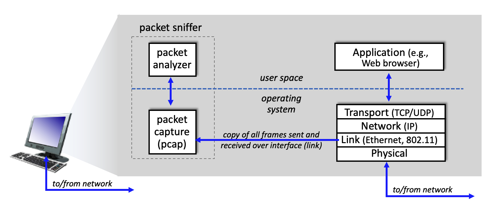
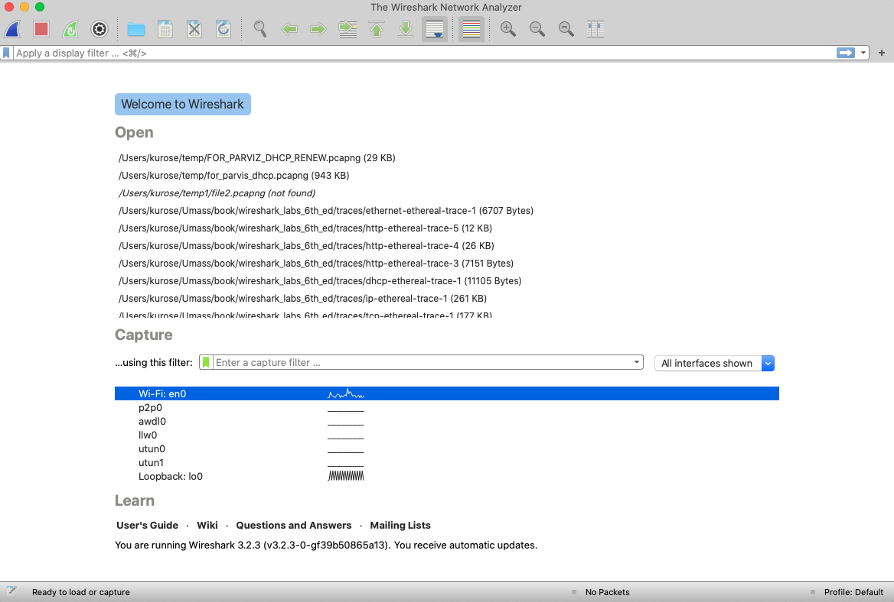
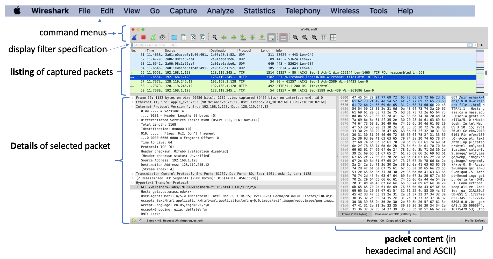
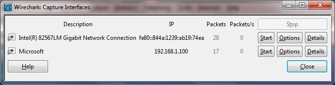
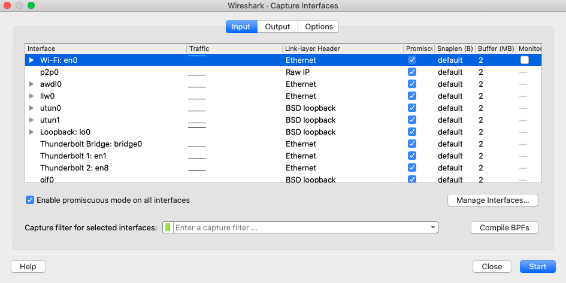
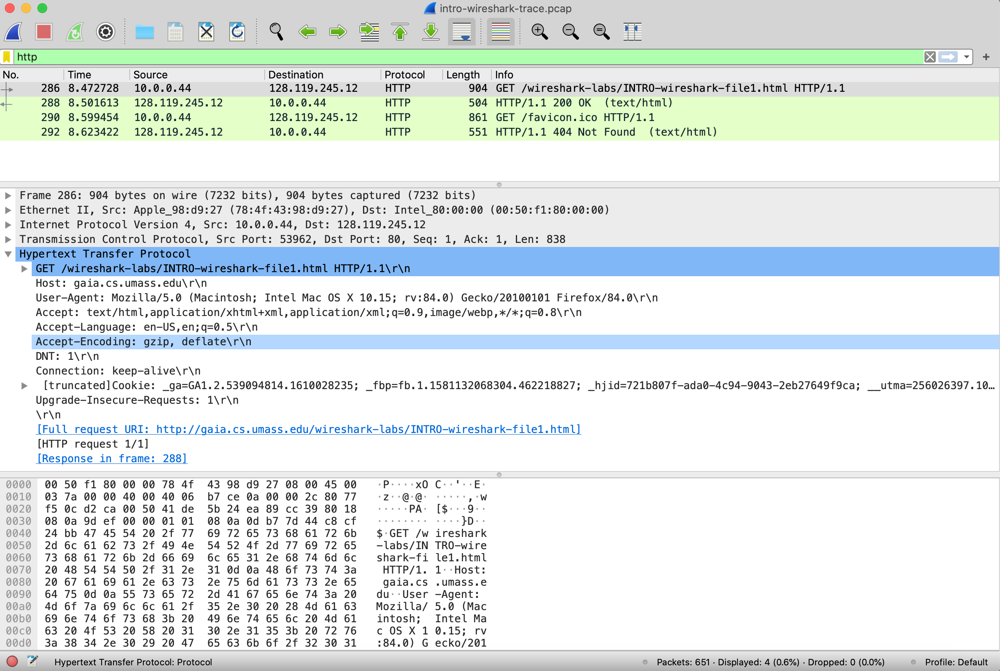

One’s understanding of network protocols can often be greatly deepened by “seeing protocols in action” and by “playing around with protocols” – observing the sequence of messages exchanged between two protocol entities, delving down into the details of protocol operation, and causing protocols to perform certain actions and then observing these actions and their consequences. This can be done in simulated scenarios or in a “real” network environment such as the Internet. In the Wireshark labs you’ll be doing in this course, you’ll be running various network applications in different scenarios using your own computer. You’ll observe the network protocols in your computer “in action,” interacting and exchanging messages with protocol entities executing elsewhere in the Internet. Thus, you and your computer will be an integral part of these “live” labs. You’ll observe, and you’ll learn, by doing.

In this first Wireshark lab, you’ll get acquainted with Wireshark, and make some simple packet captures and observations.

The basic tool for observing the messages exchanged between executing protocol entities is called a **packet sniffer**. As the name suggests, a packet sniffer captures (“sniffs”) messages being sent/received from/by your computer; it will also typically store and/or display the contents of the various protocol fields in these captured messages. A packet sniffer itself is passive. It observes messages being sent and received by applications and protocols running on your computer, but never sends packets itself. Similarly, received packets are never explicitly addressed to the packet sniffer. Instead, a packet sniffer receives a *copy* of packets that are sent/received from/by application and protocols executing on your machine.

Figure 1 shows the structure of a packet sniffer. At the right of Figure 1 are the protocols (in this case, Internet protocols) and applications (such as a web browser or email client) that normally run on your computer. The packet sniffer, shown within the dashed rectangle in Figure 1 is an addition to the usual software in your computer, and consists of two parts. The **packet capture library** receives a copy of every link-layer frame that is sent from or received by your computer over a given interface (link layer, such as Ethernet or WiFi). Recall from the discussion from section 1.5 in the text (Figure 1.24[^1]) that messages exchanged by higher layer protocols such as HTTP, FTP, TCP, UDP, DNS, or IP all are eventually encapsulated in link-layer frames that are transmitted over physical media such as an Ethernet cable or an 802.11 WiFi radio. Capturing all link-layer frames thus gives you all messages sent/received across the monitored link from/by all protocols and applications executing in your computer.

|  |
|:--:|
| Figure 1: packet sniffer structure |

The second component of a packet sniffer is the **packet analyzer**, which displays the contents of all fields within a protocol message. In order to do so, the packet analyzer must “understand” the structure of all messages exchanged by protocols. For example, suppose we are interested in displaying the various fields in messages exchanged by the HTTP protocol in Figure 1. The packet analyzer understands the format of Ethernet frames, and so can identify the IP datagram within an Ethernet frame. It also understands the IP datagram format, so that it can extract the TCP segment within the IP datagram. Finally, it understands the TCP segment structure, so it can extract the HTTP message contained in the TCP segment. Finally, it understands the HTTP protocol and so, for example, knows that the first bytes of an HTTP message will contain the string “GET,” “POST,” or “HEAD,” as shown in Figure 2.8 in the text.

We will be using the Wireshark packet sniffer \[<http://www.wireshark.org/>\] for these labs, allowing us to display the contents of messages being sent/received from/by protocols at different levels of the protocol stack. (Technically speaking, Wireshark is a packet analyzer that uses a packet capture library in your computer. Also, technically speaking, Wireshark captures link-layer frames as shown in Figure 1, but uses the generic term “packet” to refer to link-layer frames, network-layer datagrams, transport-layer segments, and application-layer messages, so we’ll use the less-precise “packet” term here to go along with Wireshark convention). Wireshark is a free network protocol analyzer that runs on Windows, Mac, and Linux/Unix computers. It’s an ideal packet analyzer for our labs – it is stable, has a large user base and well-documented support that includes a user-guide (<http://www.wireshark.org/docs/wsug_html_chunked/>), man pages (<http://www.wireshark.org/docs/man-pages/>), and a detailed FAQ (<http://www.wireshark.org/faq.html>), rich functionality that includes the capability to analyze hundreds of protocols, and a well-designed user interface. It operates in computers using Ethernet, serial (PPP), 802.11 (WiFi) wireless LANs, and many other link-layer technologies.

Getting Wireshark

In order to run Wireshark, you’ll need to have access to a computer that supports both Wireshark and the *libpcap* or *WinPCap* packet capture library. The *libpcap* software will be installed for you, if it is not installed within your operating system, when you install Wireshark. See <http://www.wireshark.org/download.html> for a list of supported operating systems and download sites.

Download and install the Wireshark software:

- Go to <http://www.wireshark.org/download.html> and download and install the Wireshark binary for your computer.

The Wireshark FAQ has a number of helpful hints and interesting tidbits of information, particularly if you have trouble installing or running Wireshark.

If you’d like to watch a video that overviews and introduces Wireshark and its use in the context of this book, go to <https://youtu.be/kCwd2YoJcvg> .

Running Wireshark

Before you run Wireshark, here are several things to check in your network connection and browser configuration:

- Make sure you are ***not*** running a VPN (virtual private network) service. We’ll learn about VPNs later in this course. But for now, all you need to know is that when you’re running a VPN service, upper-layer protocol information (HTTP, TCP) that is sent by your computer may be encrypted. This makes it impossible to use Wireshark to look at what’s going on inside these protocols!

- Make sure your browser program is ***not***, by default, using the HTTP/3 protocol or the QUIC protocol. We’ll learn about HTTP/3 and QUIC in Chapter 2. But for now, all you need to know is that when you’re running HTTP/3 or QUIC, upper-layer protocol information (HTTP, TCP) sent by your computer will be encrypted. As of 2025, most popular browsers have adopted HTTP/3 and QUIC as defaults. A document that describes how to *disable* HTTP/3 AND QUIC as the defaults for your browser is here: <https://techysnoop.com/disable-quic-protocol-in-chrome-edge-firefox/> .

- Make sure that when you go to a URL, the URL starts with `http://` rather than `https://`, since the latter case will encrypt frames.

- Make sure privacy and browser privacy settings are turned off.

- Make sure you clear your browser cache and browser history before you start.

When you run the Wireshark program, you’ll get a startup screen that looks something like the screen below. Different versions of Wireshark will have different startup screens – so don’t panic if yours doesn’t look exactly like the screen below! The Wireshark documentation states “As Wireshark runs on many different platforms with many different window managers, different styles applied and there are different versions of the underlying GUI toolkit used, your screen might look different from the provided screenshots. But as there are no real differences in functionality these screenshots should still be well understandable.” Well said.

|  |
|:--:|
| **Figure 2:** Initial Wireshark Screen |

There’s not much that’s very interesting on this screen. But note that under the Capture section, there is a list of so-called interfaces. The Mac computer we’re taking these screenshots from has just one interface – “Wi-Fi en0,” (shaded in blue in Figure 2) which is the interface for Wi-Fi access. All packets to/from this computer will pass through the Wi-Fi interface, so it’s here where we’ll want to capture packets. On a Mac, double click on this interface (or on another computer locate the interface on startup page through which you are getting Internet connectivity, e.g., mostly likely a WiFi or Ethernet interface, and select that interface in the Wireshark screen where you specify the packet capture interface).

Let’s take Wireshark out for a spin! If you click on one of these interfaces to start packet capture (i.e., for Wireshark to begin capturing all packets being sent to/from that interface), a screen like the one below will be displayed, showing information about the packets being captured. Once you start packet capture, you can stop it by using the Capture pull down menu and selecting Stop (or by clicking on the red square button next to the Wireshark fin in Figure 2). [^2]

|  |
| :---------------------------------------------------------------: |
|     **Figure 3:** Wireshark window, during and after capture      |

This looks more interesting! The Wireshark interface has five major components:

- The **command menus** are standard pulldown menus located at the top of the Wireshark window (and on a Mac at the top of the screen as well; the screenshot in Figure 3 is from a Mac). Of interest to us now are the File and Capture menus. The File menu allows you to save captured packet data or open a file containing previously-captured packet data and exit the Wireshark application. The Capture menu allows you to begin packet capture.

- The **packet-listing window** displays a one-line summary for each packet captured, including the packet number (assigned by Wireshark; note that this is *not* a packet number contained in any protocol’s header), the time at which the packet was captured, the packet’s source and destination IP addresses, the upper-layer protocol type, and protocol-specific information contained in the packet. The packet listing can be sorted according to any of these categories by clicking on a column name. The protocol type field lists the highest-level protocol that sent or received this packet, i.e., the protocol that is the source or ultimate sink for this packet.

- The **packet-header details window** provides details about the packet selected (highlighted) in the packet-listing window. (To select a packet in the packet-listing window, place the cursor over the packet’s one-line summary in the packet-listing window and click with the left mouse button.). These details include information about the Ethernet frame (assuming the packet was sent/received over an Ethernet interface) and IP datagram that contains this packet. The amount of Ethernet and IP-layer detail displayed can be expanded or minimized by clicking on the plus/minus boxes or right/downward-pointing triangles to the left of the Ethernet frame or IP datagram line in the packet details window. If the packet has been carried over TCP or UDP, TCP or UDP details will also be displayed, which can similarly be expanded or minimized. Finally, details about the highest-level protocol that sent or received this packet are also provided.

- The **packet-contents window** displays the entire contents of the captured frame, in both ASCII and hexadecimal format.

- Towards the top of the Wireshark graphical user interface, is the **packet display filter field,** into which a protocol name or other information can be entered in order to filter the information displayed in the packet-listing window (and hence the packet-header and packet-contents windows). In the example below, we’ll use the packet-display filter field to have Wireshark hide (not display) packets that do not correspond to HTTP messages.

Taking Wireshark for a Test Run

The best way to learn about any new piece of software is to try it out! We’ll assume that your computer is connected to the Internet via a wired Ethernet interface or a wireless 802.11 WiFi interface. Do the following:

1.  Start up your favorite web browser, which will display your selected homepage.

2.  Start up the Wireshark software. You will initially see a window similar to that shown in Figure 2. Wireshark has not yet begun capturing packets.

3.  To begin packet capture, select the Capture pull down menu and select *Interfaces.* This will cause the “Wireshark: Capture Interfaces” window to be displayed (on a PC) or you can choose Options on a Mac. You should see a list of interfaces, as shown in Figures 4a (Windows) and 4b (Mac).

|  |
|:--:|
| **Figure 4a:** Wireshark Capture interface window, on a Windows computer |
|  |
| **Figure 4b:** Wireshark Capture interface window, on a Mac computer |

4.  You’ll see a list of the interfaces on your computer as well as a count of the packets that have been observed on that interface so far. On a Windows machine, click on *Start* for the interface on which you want to begin packet capture (in the case in Figure 4a, the Gigabit Network Connection). On a Windows machine, select the interface and click Start on the bottom of the window). Packet capture will now begin - Wireshark is now capturing all packets being sent/received from/by your computer!

5.  Once you begin packet capture, a window similar to that shown in Figure 3 will appear. This window shows the packets being captured. By selecting the *Capture* pulldown menu and selecting *Stop*, or by click on the red Stop square, you can stop packet capture. But don’t stop packet capture yet. Let’s capture some interesting packets first. To do so, we’ll need to generate some network traffic. Let’s do so using a web browser, which will use the HTTP protocol that we will study in detail in class to download content from a website.

6.  While Wireshark is running, enter the URL:  
    <http://gaia.cs.umass.edu/wireshark-labs/INTRO-wireshark-file1.html>  
    and have that page displayed in your browser. In order to display this page, your browser will contact the HTTP server at gaia.cs.umass.edu and exchange HTTP messages with the server in order to download this page, as discussed in section 2.2 of the text. The Ethernet or WiFi frames containing these HTTP messages (as well as all other frames passing through your Ethernet or WiFi adapter) will be captured by Wireshark.

7.  After your browser has displayed the `INTRO-wireshark-file1.html` page (it is a simple one-line message of congratulations), stop Wireshark packet capture by selecting *Stop* in the Wireshark capture window. The main Wireshark window should now look similar to Figure 3. You now have live packet data that contains all protocol messages exchanged between your computer and other network entities! The HTTP message exchanges with the gaia.cs.umass.edu web server should appear somewhere in the listing of packets captured. But there will be many other types of packets displayed as well (see, e.g., the many different protocol types shown in the *Protocol* column in Figure 3). Even though the only action you took was to download a web page, there were evidently many other protocols running on your computer that are unseen by the user. We’ll learn much more about these protocols as we progress through the text! For now, you should just be aware that there is often much more going on than meets the eye!

8.  Type in “http” (without the quotes, and *in lower case* – all protocol names are in lower case in Wireshark, and make sure to press your enter/return key) into the display filter specification window at the top of the main Wireshark window. Then select *Apply* (to the right of where you entered “http”) or just hit return. This will cause only HTTP message to be displayed in the packet-listing window. Figure 5 below shows a screenshot after the http filter has been applied to the packet capture window shown earlier in Figure 3. Note also that in the Selected packet details window, we’ve chosen to show detailed content for the Hypertext Transfer Protocol application message that was found within the TCP segment, that was inside the IPv4 datagram that was inside the Ethernet II (WiFi) frame. Focusing on content at a specific message, segment, datagram and frame level lets us focus on just what we want to look at (in this case HTTP messages).

|  |
|:--:|
| **Figure 5:** looking at the details of the HTTP message that contained a GET of http://gaia.cs.umass.edu/wireshark-labs/INTRO-wireshark-file1.html |

9.  Find the HTTP GET message that was sent from your computer to the gaia.cs.umass.edu HTTP server. (Look for an HTTP GET message in the “listing of captured packets” portion of the Wireshark window (see Figures 3 and 5) that shows “GET” followed by the gaia.cs.umass.edu URL that you entered. When you select the HTTP GET message, the Ethernet frame, IP datagram, TCP segment, and HTTP message header information will be displayed in the packet-header window[^3]. By clicking on ‘+’ and ‘-' and right-pointing and down-pointing arrowheads to the left side of the packet details window, *minimize* the amount of Frame, Ethernet, Internet Protocol, and Transmission Control Protocol information displayed. *Maximize* the amount information displayed about the HTTP protocol. Your Wireshark display should now look roughly as shown in Figure 5. (Note, in particular, the minimized amount of protocol information for all protocols except HTTP, and the maximized amount of protocol information for HTTP in the packet-header window).

10. Exit Wireshark

*Congratulations! You’ve now completed the first lab!*

Now answer the questions below. If you’re doing this lab as part of class, your teacher will provide details about how to hand in assignments, whether written or in a learning management system (LMS).[^4] If you’re unable to run Wireshark on a live network connection or are answering questions via an LMS, you can download a packet trace file that was captured while following the steps above[^5].

1.  Which of the following protocols are shown as appearing (i.e., are listed in the Wireshark “protocol” column) in your trace file: TCP, QUIC, HTTP, DNS, UDP, TLSv1.2?

2.  How long did it take from when the HTTP GET message was sent until the HTTP OK reply was received? (By default, the value of the Time column in the packet-listing window is the amount of time, in seconds, since Wireshark tracing began. (If you want to display the Time field in time-of-day format, select the Wireshark *View* pull down menu, then select Time *Display Format*, then select *Time-of-day*.)

3.  What is the Internet address of the gaia.cs.umass.edu (also known as www-net.cs.umass.edu)? What is the Internet address of your computer or (if you are using the trace file) the computer that sent the HTTP GET message?

To answer the following two questions, you’ll need to select the TCP packet containing the HTTP GET request (hint: this is packet number 286[^6]). The purpose of these next two questions is to familiarize you with using Wireshark’s “Details of selected packet window”; see Figure 3. To do this, click on Packet 286 (your screen should look similar to Figure 3). To answer the first question below, then look in the “Details of selected packet” window toggle the triangle for HTTP (your screen should then look similar to Figure 5); for the second question below, you’ll need to expand the information on the Transmission Control Protocol (TCP) part of this packet.

4.  Expand the information on the HTTP message in the Wireshark “Details of selected packet” window (see Figure 3 above) so you can see the fields in the HTTP GET request message. What type of Web browser issued the HTTP request? The answer is shown at the right end of the information following the “User-Agent:” field in the expanded HTTP message display. \[This field value in the HTTP message is how a web server learns what type of browser you are using.\]

- Firefox, Safari, Microsoft Internet Edge, Other

5.  Expand the information on the Transmission Control Protocol for this packet in the Wireshark “Details of selected packet” window (see Figure 3 in the lab writeup) so you can see the fields in the TCP segment carrying the HTTP message. What is the destination port number (the number following “Dest Port:” for the TCP segment containing the HTTP request) to which this HTTP request is being sent?

And finally ...

6.  Print the two HTTP messages (GET and OK) referred to in question 2 above. To do so, select *Print* from the Wireshark *File* command menu, and select the “*Selected Packet Only”* and *“Print as displayed”* radial buttons, and then click OK.

[^1]: References to figures and sections are for the 9th edition of our text, *Computer Networks, A Top-down Approach, 9th ed., J.F. Kurose and K.W. Ross, Addison-Wesley/Pearson, 2025.* Our authors’ website for this book is <http://gaia.cs.umass.edu/kurose_ross> You’ll find lots of interesting open material there.

[^2]: If you are unable to run Wireshark, you can still look at packet traces that were captured on one of the author’s (Jim’s) computers. You can download the zip file <http://gaia.cs.umass.edu/wireshark-labs/wireshark-traces-9e.zip> and extract the trace file `intro-wireshark-trace1.pcap`. If you are using a Learning Management System (LMS) to answer questions in this document, you may be instructed to open a different version of this introductory trace file. Once you’ve downloaded a trace file, you can load it into Wireshark and view the trace using the *File* pull down menu, choosing *Open*, and then selecting the `intro-wireshark-trace` trace file. The resulting display should look similar to Figures 3 and 5. The Wireshark user interface displays just a bit differently on different operating systems and in different versions of Wireshark.

[^3]: Recall that the HTTP GET message that is sent to the gaia.cs.umass.edu web server is contained within a TCP segment, which is contained (encapsulated) in an IP datagram, which is encapsulated in an Ethernet frame. If this process of encapsulation isn’t quite clear yet, review section 1.5 in the text

[^4]: For the author’s class and written answers, students print out the GET and response messages and indicate where in the message they’ve found the information that answers a question. They do this by marking paper copies with a pen or annotating electronic copies with text in a colored font. There are LMS modules for teachers that allow students to answer these questions online and have answers auto-graded for these Wireshark labs at <http://gaia.cs.umass.edu/kurose_ross/lms.htm>

[^5]: You can download the zip file <http://gaia.cs.umass.edu/wireshark-labs/wireshark-traces-9e.zip> and extract the trace file intro-wireshark-trace1. This trace file can be used to answer these Wireshark lab questions without actually capturing packets on your own. Each trace was made using Wireshark running on one of the author’s computers, while performing the steps indicated in the Wireshark lab. Once you’ve downloaded a trace file, you can load it into Wireshark and view the trace using the *File* pull down menu, choosing *Open*, and then selecting the trace file name.

[^6]: Remember that this “packet number” is assigned by Wireshark for listing purposes only; it is NOT a packet number contained in any real packet header.
