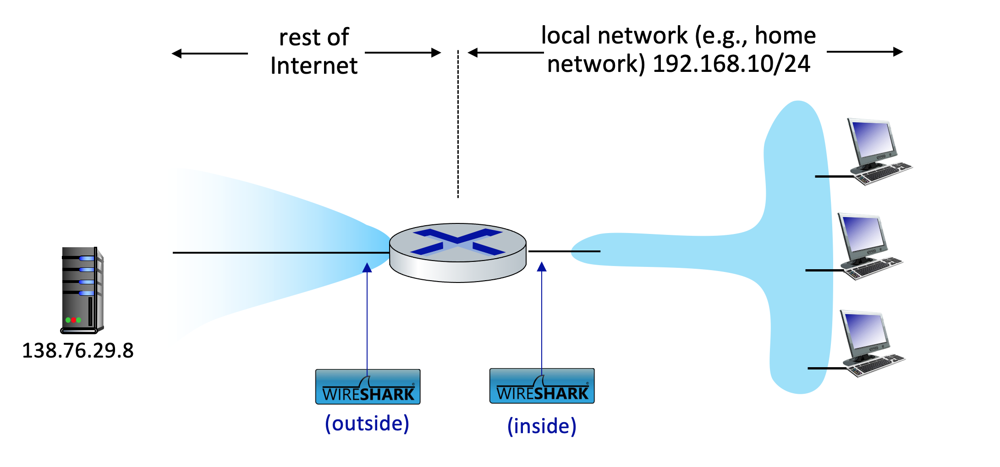

In this lab, we’ll investigate the behavior of a NAT router. This lab will be different from our other Wireshark labs, where we’ve captured a trace file at a single Wireshark measurement point. Because we’re interested in capturing packets at *both* the input and output sides of the NAT device, we’ll need to capture packets at *two* locations. Also, because many students don’t have easy access to a NAT device or to two computers on which to take Wireshark measurements, this isn’t a lab that is easily done “live” by a student. So, in this lab, you’ll use Wireshark trace files that we’ve captured for you. This should be a relatively short and easy lab since the concepts behind NAT aren’t difficult, but it’ll be good nonetheless to observe NAT in action. Before beginning this lab, you’ll probably want to review the material on NAT in section 4.3.3 in the text[^1].

NAT Measurement Scenario

In this lab, we’ll capture packets containing a simple HTTP GET request message from a client inside a home network to a remote server, and the corresponding HTTP response from that server. Within the home network, the home network router provides a NAT service, as discussed in Chapter 4. Figure 1 shows our Wireshark trace-collection scenario. We’ll capture packets in *two* locations, and thus this lab has *two* trace files:

- We’ll capture packets being received at the local area network (LAN) side of the NAT router. All devices in this LAN have addresses in 192.168.10/24. This file is named *nat-inside-wireshark-trace1-1.pcapng* [^2].

- Because we’re also interested in analyzing packets being forwarded (and received) by the NAT router on its Internet-facing side, we’ll collect a second trace file on the Internet side of the router, as shown in Figure 1. Packets captured by Wireshark at this point that were sent from a host on the right to the server on the left will have undergone NAT translation by the time they reach this second measurement point. This file is named *nat-outside-wireshark-trace1-1.pcapng*.

|  |
|:--:|
| Figure 1: NAT packet capture scenario |

In the scenario shown in Figure 1, one of the hosts within the LAN will send an HTTP GET request to the web server at IP address 138.76.29.8, which will respond to the requesting host. Of course, we’re not really interested in the HTTP GET request itself, but rather in how the NAT router changes the IP addresses and port numbers of the datagram containing the GET request on the LAN side (inside) to the addresses and port numbers in the forwarded outgoing datagram on the Internet side (outside) of the NAT router.

Let’s first take a look at what’s happening on the LAN side of the NAT router. Open the *nat-inside-wireshark-trace1-1.pcapng* trace file. In this file, you should see an HTTP GET request addressed to the external web server at IP address 138.76.29.8, as well as the subsequent HTTP response message (“200 OK”). Both of these messages in the trace file were captured on the LAN side of the router.

Answer the following questions[^3].

1.  What is the IP address of the client that sends the HTTP GET request in the *nat-inside-wireshark-trace1-1.pcapng* trace? What is the source port number of the TCP segment in this datagram containing the HTTP GET request? What is the destination IP address of this HTTP GET request? What is the destination port number of the TCP segment in this datagram containing the HTTP GET request?

2.  At what time[^4] is the corresponding HTTP 200 OK message from the webserver forwarded by the NAT router to the client on the router’s LAN side?

3.  What are the source and destination IP addresses and TCP source and destination ports on the IP datagram carrying this HTTP 200 OK message?

In the following we’ll focus on these two HTTP messages (GET and 200 OK). Our goal below will be to locate these two HTTP messages in the trace file *nat-outside-wireshark-trace1-1.pcapng*, captured on the Internet-side link between the router and the ISP. Because the captured packets heading towards the server will have already been forwarded through the NAT router, some of the IP address and port numbers will have been changed as a result of NAT translation.

Open the trace file *nat-outside-wireshark-trace1-1.pcapng.* Note that the time stamps in this file and the *nat-inside-wireshark-trace1-1.pcapng* file are not necessarily synchronized.

In the *nat-outside-wireshark-trace1-1.pcapng* trace file, find the HTTP GET message that corresponds to the HTTP GET message that was sent from the client to the 138.76.29.8 server at time *t=*0.27362245, where *t=*0.27362245 is the time at which this message was sent, as recorded in the *nat-inside-wireshark-trace1-1.pcapng* trace file.

4.  At what time does this HTTP GET message appear in the *nat-outside-wireshark-trace1-1.pcapng* trace file?

5.  What are the source and destination IP addresses and TCP source and destination port numbers on the IP datagram carrying this HTTP GET (as recorded in the *nat-outside-wireshark-trace1-1.pcapng* trace file)?

6.  Which of these four fields are different than in your answer to question 1 above?

7.  Are any fields in the HTTP GET message changed?

8.  Which of the following fields in the IP datagram carrying the HTTP GET are changed from the datagram received on the local area network (inside) to the corresponding datagram forwarded on the Internet side (outside) of the NAT router: Version, Header Length, Flags, Checksum?

Let’s continue to look at the *nat-outside-wireshark-trace1-1.pcapng* trace file. Find the HTTP reply containing the “200 OK” message that was received in response to the HTTP GET request you just examined in questions 4-8 above.

9.  At what time does this message appear in the *nat-outside-wireshark-trace1-1.pcapng* trace file?

10. What are the source and destination IP addresses and TCP source and destination port numbers on the IP datagram carrying this HTTP reply (“200 OK”) message (as recorded in the *nat-outside-wireshark-trace1-1.pcapng* trace file)?

Lastly, let’s consider what happens when the NAT router receives this datagram that you examined in questions 9 and 10, performs NAT translation, and finally forwards that datagram to the destination host on the LAN side. Based on your answers to questions 1 through 10 above and your knowledge of how NAT works, you should be able to answer the following question without actually looking at the *nat-inside-wireshark-trace1-1.pcapng* trace file:

11. What are the source and destination IP addresses and TCP source and destination port numbers on the IP datagram carrying the HTTP reply (“200 OK”) that is forwarded from the router to the destination host in the right of Figure 1?

Just to make sure you understand NAT, you should now use Wireshark to peek into the *nat-inside-wireshark-trace1-1.pcapng* trace file and look at the HTTP reply (“200 OK”).

Do your answers to question 11 above match what you see in the *nat-inside-wireshark-trace1-1.pcapng* trace file? Hopefully, your answer is yes.

That’s it! See, we told you this Wireshark NAT lab wasn’t going to be hard!

[^1]: References to figures and sections are for the 8th edition of our text, *Computer Networks, A Top-down Approach, 8th ed., J.F. Kurose and K.W. Ross, Addison-Wesley/Pearson, 2020.* Our website for this book is [http://gaia.cs.umass.edu/kurose_ross](http://gaia.cs.umass.edu/kurose_ross) You’ll find lots of interesting open material there.

[^2]: You can download the zip file [http://gaia.cs.umass.edu/wireshark-labs/wireshark-traces-9e.zip](http://gaia.cs.umass.edu/wireshark-labs/wireshark-traces-9e.zip) and extract the trace file *nat-inside-wireshark-trace1-1.pcapng.* These trace files can be used to answer these Wireshark lab questions without actually capturing packets on your own. Each trace was made using Wireshark running on one of the author’s computers, while performing the steps indicated in the Wireshark lab. Once you’ve downloaded a trace file, you can load it into Wireshark and view the trace using the *File* pull down menu, choosing *Open*, and then selecting the trace file name.

[^3]: For the author’s class, when answering the following questions with hand-in assignments, students sometimes need to print out specific packets (see the introductory Wireshark lab for an explanation of how to do this) and indicate where in the packet they’ve found the information that answers a question. They do this by marking paper copies with a pen or annotating electronic copies with text in a colored font. There are also learning management system (LMS) modules for teachers that allow students to answer these questions online and have answers auto-graded for these Wireshark labs at [http://gaia.cs.umass.edu/kurose_ross/lms.htm](http://gaia.cs.umass.edu/kurose_ross/lms.htm)

[^4]: Specify time using the time since the beginning of the trace (rather than absolute, wall-clock time).
