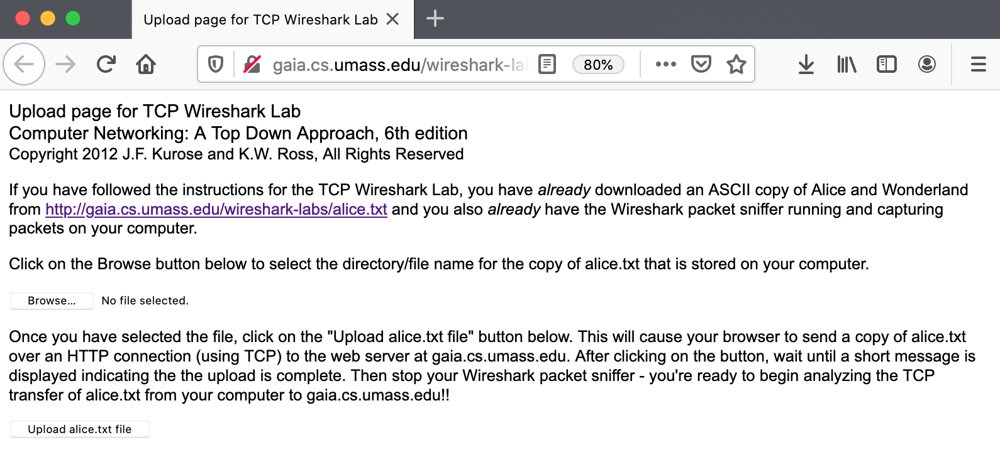
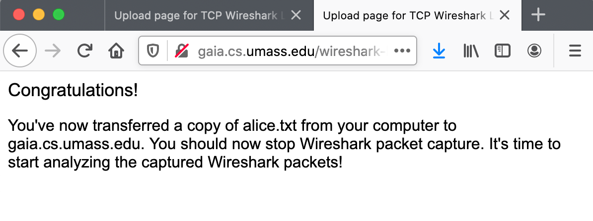
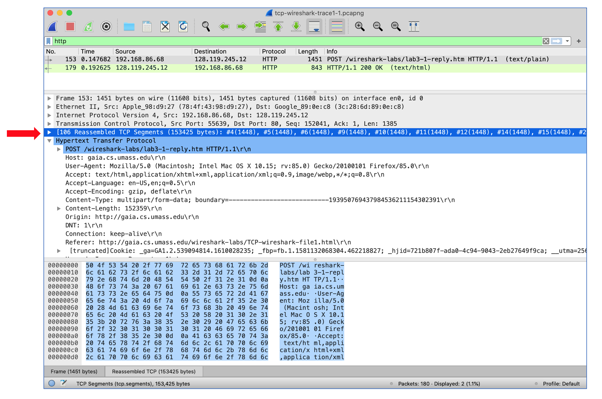
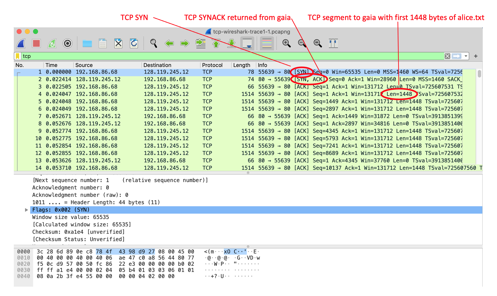
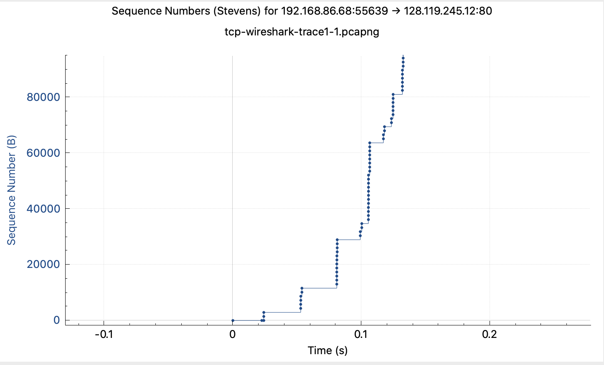
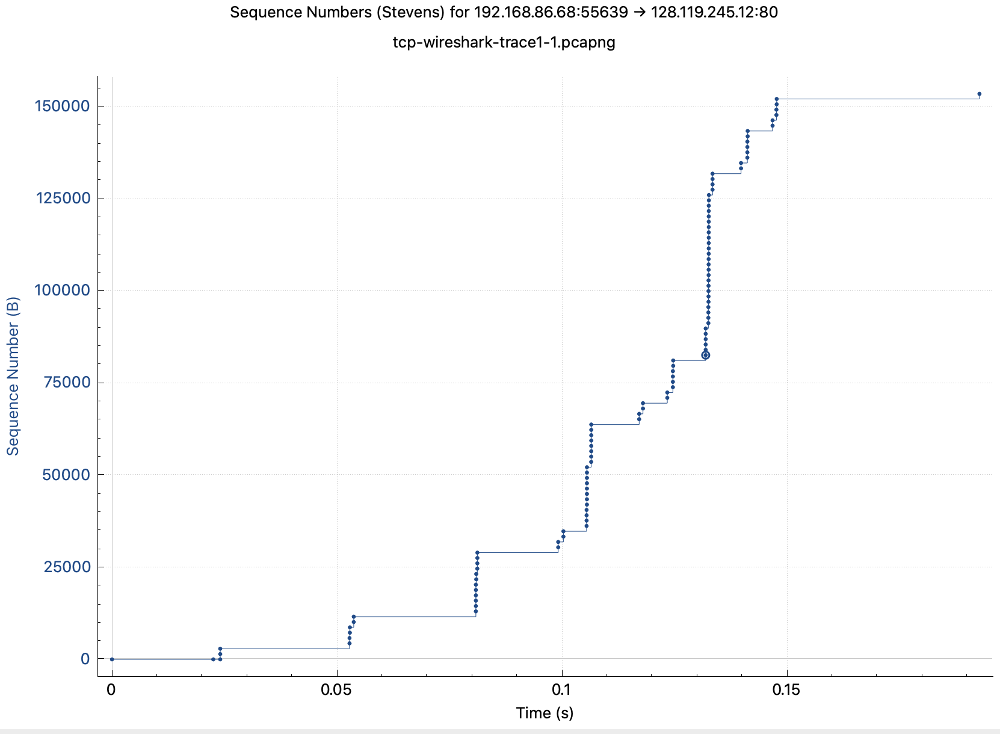

In this lab, we’ll investigate the behavior of the celebrated TCP protocol in detail. We’ll do so by analyzing a trace of the TCP segments sent and received in transferring a 150KB file (containing the text of Lewis Carrol’s *Alice’s Adventures in Wonderland*) from your computer to a remote server. We’ll study TCP’s use of sequence and acknowledgement numbers for providing reliable data transfer; we’ll see TCP’s congestion control algorithm – slow start and congestion avoidance – in action; and we’ll look at TCP’s receiver-advertised flow control mechanism. We’ll also briefly consider TCP connection setup and we’ll investigate the performance (throughput and round-trip time) of the TCP connection between your computer and the server.

Before beginning this lab, you’ll probably want to review sections 3.5 and 3.7 in the text[^1].

1\. Capturing a bulk TCP transfer from your computer to a remote server

Before beginning our exploration of TCP, we’ll need to use Wireshark to obtain a packet trace of the TCP transfer of a file from your computer to a remote server. You’ll do so by accessing a Web page that will allow you to enter the name of a file stored on your computer (which contains the ASCII text of *Alice in Wonderland*), and then transfer the file to a Web server using the HTTP POST method (see section 2.2.3 in the text). We’re using the POST method rather than the GET method as we’d like to transfer a large amount of data *from* your computer to another computer. Of course, we’ll be running Wireshark during this time to obtain the trace of the TCP segments sent and received from your computer.

Do the following:

- Start up your web browser. Go to <http://gaia.cs.umass.edu/wireshark-labs/alice.txt> and retrieve an ASCII copy of *Alice in Wonderland*. Store this as a `.txt` file somewhere on your computer.

- Next go to <http://gaia.cs.umass.edu/wireshark-labs/TCP-wireshark-file1.html>.

- You should see a screen that looks like Figure 1.

|  |
|:--:|
| **Figure 1:** Page to upload the alice.txt file from your computer to gaia.cs.umass.edu |

- Use the *Browse* button in this form to the file on your computer that you just created containing *Alice in Wonderland*. Don’t press the “*Upload alice.txt file*” button yet.

- Now start up Wireshark and begin packet capture (see the earlier Wireshark labs if you need a refresher on how to do this).

- Returning to your browser, press the “*Upload alice.txt file*” button to upload the file to the gaia.cs.umass.edu server. Once the file has been uploaded, a short congratulations message will be displayed in your browser window.

- Stop Wireshark packet capture. Your Wireshark window should look similar to the window shown in Figure 2.

|  |
|:--:|
| **Figure 2:** Success! You’ve uploaded a file to gaia.cs.umass.edu and have hopefully captured a Wireshark packet trace while doing so. |

If you are unable to run Wireshark on a live network connection, you can download a packet trace that was captured while following the steps above on one of the author’s computers [^2]. In addition, you may well find it valuable to download this trace even if you’ve captured your own trace and use it, as well as your own trace, when you explore the questions below.

2\. A first look at the captured trace

Before analyzing the behavior of the TCP connection in detail, let’s take a high-level view of the trace.

Let’s start by looking at the HTTP POST message that uploaded the alice.txt file to gaia.cs.umass.edu from your computer. Find that file in your Wireshark trace, and expand the HTTP message so we can take a look at the HTTP POST message more carefully. Your Wireshark screen should look something like Figure 3.

|  |
|:--:|
| **Figure 3:** expanding the HTTP POST message that uploaded alice.txt from your computer to gaia.cs.umass.edu |

There are a few things to note here:

- The body of your application-layer HTTP POST message contains the contents of the file alice.txt, which is a large file of more than 152K bytes. OK – it’s not *that* large, but it’s going to be too large for this one HTTP POST message to be contained in just one TCP segment!

- In fact, as shown in the Wireshark window in Figure 3 we see that the HTTP POST message was spread across 106 TCP segments. This is shown where the red arrow is placed in Figure 3 \[Aside: Wireshark doesn’t have a red arrow like that; we added it to the figure to be helpful ☺\]. If you look even more carefully there, you can see that Wireshark is being really helpful to you as well, telling you that the first TCP segment containing the beginning of the POST message is packet \#4 in the particular trace for the example in Figure 3, which is the trace *tcp-wireshark-trace1-1* noted in footnote 2. The second TCP segment containing the POST message in packet \#5 in the trace, and so on.

Let’s now “get our hands dirty” by looking at some TCP segments.

- First, filter the packets displayed in the Wireshark window by entering “tcp” (lowercase, no quotes, and don’t forget to press return after entering!) into the display filter specification window towards the top of the Wireshark window. Your Wireshark display should look something like Figure 4. In Figure 4, we’ve noted the TCP segment that has its SYN bit set – this is the first TCP message in the three-way handshake that sets up the TCP connection to gaia.cs.umass.edu that will eventually carry the HTTP POST message and the alice.txt file. We’ve also noted the SYNACK segment (the second step in TCP three-way handshake), as well as the TCP segment (packet \#4, as discussed above) that carries the POST message and the beginning of the alice.txt file. Of course, if you’re taking your own trace file, the packet numbers will be different, but you should see similar behavior to that shown in Figures 3 and 4.

|  |
|:--:|
| **Figure 4:** TCP segments involved in sending the HTTP POST message (including the file alice.txt) to gaia.cs.umass.edu |

Answer the following questions[^3], either from your own live trace, or by opening the Wireshark captured packet file *tcp-wireshark-trace1-1* in <http://gaia.cs.umass.edu/wireshark-labs/wireshark-traces-9e.zip>

1.  What is the IP address and TCP port number used by the client computer (source) that is transferring the alice.txt file to gaia.cs.umass.edu? To answer this question, it’s probably easiest to select an HTTP message and explore the details of the TCP packet used to carry this HTTP message, using the “details of the selected packet header window” (refer to Figure 2 in the “Getting Started with Wireshark” Lab if you’re uncertain about the Wireshark windows).

2.  What is the IP address of gaia.cs.umass.edu? On what port number is it sending and receiving TCP segments for this connection?

Since this lab is about TCP rather than HTTP, now change Wireshark’s “listing of captured packets” window so that it shows information about the TCP segments containing the HTTP messages, rather than about the HTTP messages, as in Figure 4 above. This is what we’re looking for‒a series of TCP segments sent between your computer and gaia.cs.umass.edu!

3\. TCP Basics

Answer the following questions for the TCP segments:

3.  What is the *sequence number* of the TCP SYN segment that is used to initiate the TCP connection between the client computer and gaia.cs.umass.edu? (Note: this is the “raw” sequence number carried in the TCP segment itself; it is *NOT* the packet \# in the “No.” column in the Wireshark window. Remember there is no such thing as a “packet number” in TCP or UDP; as you know, there *are* sequence numbers in TCP and that’s what we’re after here. Also note that this is not the relative sequence number with respect to the starting sequence number of this TCP session.). What is it in this TCP segment that identifies the segment as a SYN segment? Will the TCP receiver in this session be able to use Selective Acknowledgments (allowing TCP to function a bit more like a “selective repeat” receiver, see section 3.4.5 in the text)?

4.  What is the *sequence number* of the SYNACK segment sent by gaia.cs.umass.edu to the client computer in reply to the SYN? What is it in the segment that identifies the segment as a SYNACK segment? What is the value of the Acknowledgement field in the SYNACK segment? How did gaia.cs.umass.edu determine that value?

5.  What is the sequence number of the TCP segment containing the header of the HTTP POST command? Note that in order to find the POST message header, you’ll need to dig into the packet content field at the bottom of the Wireshark window, *looking for a segment with the ASCII text “POST” within its DATA field*[^4],[^5]. How many bytes of data are contained in the payload (data) field of this TCP segment? Did all of the data in the transferred file alice.txt fit into this single segment?

6.  Consider the TCP segment containing the HTTP “POST” as the first segment in the data transfer part of the TCP connection.

- At what time was the first segment (the one containing the HTTP POST) in the data-transfer part of the TCP connection sent?

- At what time was the ACK for this first data-containing segment received?

- What is the RTT for this first data-containing segment?

- What is the RTT value the second data-carrying TCP segment and its ACK?

- What is the EstimatedRTT value (see Section 3.5.3, in the text) after the ACK for the second data-carrying segment is received? Assume that in making this calculation after the received of the ACK for the second segment, that the initial value of EstimatedRTT is equal to the measured RTT for the first segment, and then is computed using the EstimatedRTT equation on page 242, and a value of α = 0.125.

> *Note:* Wireshark has a nice feature that allows you to plot the RTT for each of the TCP segments sent. Select a TCP segment in the “listing of captured packets” window that is being sent from the client to the gaia.cs.umass.edu server. Then select: *Statistics-\>TCP Stream Graph-\>Round Trip Time Graph.*

7.  What is the length (header plus payload) of each of the first four data-carrying TCP segments?[^6]

8.  What is the minimum amount of available buffer space advertised to the client by gaia.cs.umass.edu among these first four data-carrying TCP segments[^7]? Does the lack of receiver buffer space ever throttle the sender for these first four data-carrying segments?

9.  Are there any retransmitted segments in the trace file? What did you check for (in the trace) in order to answer this question?

10. How much data does the receiver typically acknowledge in an ACK among the first ten data-carrying segments sent from the client to gaia.cs.umass.edu? Can you identify cases where the receiver is ACKing every other received segment (see Table 3.2 in the text) among these first ten data-carrying segments?

11. What is the throughput (bytes transferred per unit time) for the TCP connection? Explain how you calculated this value.

4\. TCP congestion control in action

Let’s now examine the amount of data sent per unit time from the client to the server. Rather than (tediously!) calculating this from the raw data in the Wireshark window, we’ll use one of Wireshark’s TCP graphing utilities‒*Time-Sequence-Graph(Stevens*)‒to plot out data.

- Select a client-sent TCP segment in the Wireshark’s “listing of captured-packets” window corresponding to the transfer of alice.txt from the client to gaia.cs.umass.edu. Then select the menu: *Statistics-\>TCP Stream Graph-\> Time-Sequence-Graph(Stevens*[^8]). You should see a plot that looks similar to the plot in Figure 5, which was created from the captured packets in the packet trace *tcp-wireshark-trace1-1*. You may have to expand, shrink, and fiddle around with the intervals shown in the axes in order to get your graph to look like Figure 5.

|  |
|----|
| Figure 5: A sequence-number-versus-time plot (Stevens format) of TCP segments. |

> Here, each dot represents a TCP segment sent, plotting the sequence number of the segment versus the time at which it was sent. Note that a set of dots stacked above each other represents a series of packets (sometimes called a “fleet” of packets) that were sent back-to-back by the sender.

Answer the following question for the TCP segments in the packet trace *tcp-wireshark-trace1-1* (see footnote [^2]).

12. Use the *Time-Sequence-Graph(Stevens*) plotting tool to view the sequence number versus time plot of segments being sent from the client to the gaia.cs.umass.edu server. Consider the “fleets” of packets sent around *t* = 0.025, *t* = 0.053, *t* = 0.082 and *t* = 0.1. Comment on whether this looks as if TCP is in its slow start phase, congestion avoidance phase or some other phase. Figure 6 shows a slightly different view of this data.

13. These “fleets” of segments appear to have some periodicity. What can you say about the period?

14. Answer each of two questions above for the trace that you have gathered when you transferred a file from your computer to gaia.cs.umass.edu

|  |
|:--:|
| Figure 6: Another view of the same data as in Figure 5. |

[^1]: References to figures and sections are for the 9th edition of our text, *Computer Networks, A Top-down Approach, 9th ed., J.F. Kurose and K.W. Ross, Addison-Wesley/Pearson, 2025.* Our website for this book is <http://gaia.cs.umass.edu/kurose_ross> You’ll find lots of interesting open material there.

[^2]: You can download the zip file <http://gaia.cs.umass.edu/wireshark-labs/wireshark-traces-9e.zip> and extract the trace file *tcp-wireshark-trace1-1*. This trace file can be used to answer this Wireshark lab without actually capturing packets on your own. This trace was made using Wireshark running on one of the author’s computers, while performing the steps indicated in this Wireshark lab. Once you’ve downloaded a trace file, you can load it into Wireshark and view the trace using the *File* pull down menu, choosing *Open*, and then selecting the trace file name.

[^3]: For the author’s class, when answering the following questions with hand-in assignments, students sometimes need to print out specific packets (see the introductory Wireshark lab for an explanation of how to do this) and indicate where in the packet they’ve found the information that answers a question. They do this by marking paper copies with a pen or annotating electronic copies with text in a colored font. There are also learning management system (LMS) modules for teachers that allow students to answer these questions online and have answers auto-graded for these Wireshark labs at <http://gaia.cs.umass.edu/kurose_ross/lms.htm>

[^4]: *Hint:* this TCP segment is sent by the client soon (but not always immediately) after the SYNACK segment is received from the server.

[^5]: Note that if you filter to only show “http” messages, you’ll see that the TCP segment that Wireshark associates with the HTTP POST message is the *last* TCP segment in the connection (which contains the text at the *end* of alice.txt: “THE END”) and *not* the first data-carrying segment in the connection. Students (and teachers!) often find this unexpected and/or confusing.

[^6]: The TCP segments in the tcp-wireshark-trace1-1 trace file are all less than 1480 bytes. This is because the computer on which the trace was gathered has an interface card that limits the length of the maximum IP datagram to 1500 bytes, and there is a *minimum* of 40 bytes of TCP/IP header data. This 1500-byte value is a fairly typical maximum length for an Internet IP datagram.

[^7]: Give the Wireshark-reported value for “Window Size Value” which must then be multiplied by the Window Scaling Factor to give the actual number of buffer bytes available at gaia.cs.umass.edu for this connection.

[^8]: William Stevens wrote the “bible” book on TCP, known as [*TCP Illustrated*](https://www.amazon.com/TCP-Illustrated-Vol-Addison-Wesley-Professional/dp/0201633469).
