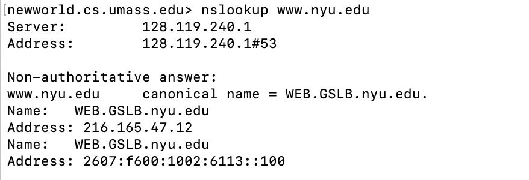

In this lab, we’ll take a quick look at the UDP transport protocol. As we saw in Chapter 3 of the text[^1], UDP is a streamlined, no-frills protocol. You may want to re-read section 3.3 in the text before doing this lab. Because UDP is simple and sweet, we’ll be able to cover it pretty quickly in this lab. So if you’ve another appointment to run off to in 30 minutes, no need to worry, as you should be able to finish this lab with ample time to spare.

At this stage, you should be a Wireshark expert. Thus, we are not going to spell out the steps as explicitly as in earlier labs. In particular, we are not going to provide example screenshots for all the steps.

The Assignment

Start capturing packets in Wireshark and then do something that will cause your host to send and receive several UDP packets. It’s also likely that just by doing nothing (except capturing packets via Wireshark) that some UDP packets sent by others will appear in your trace. In particular, the Domain Name System (DNS) protocol (see section 2.4 in the text; and the DNS Wireshark Lab) typically sends DNS query and response messages inside of UDP, so it’s likely that you’ll find some DNS messages (and therefore UDP packets) in your trace.

Specifically you can try out the nslookup command, which invokes the underlying DNS protocol, which in turn will send UDP segments from/to the host issuing the nslookup. nslookup is available in most Microsoft, Apple IOS, and Linux operating systems. To run nslookup you just type the nslookup command on the command line in a DOS window, Mac IOS terminal window, or Linux shell. Figure 1 is a screenshot of running nslookup on the Linux command line on the newworld.cs.umass.edu host located in the CS Department at the University of Massachusetts (UMass) campus, to display the IP address of www.nyu.edu.

|  |
|:--:|
| **Figure 1:** the basic nslookup command |

We don’t need to go into any more details about nslookup or DNS, as we’re just interested in getting a few UDP segments into Wireshark, and we promised this lab would be short!

After starting packet capture on Wireshark, run nslookup for a hostname that you haven’t visited for a while. Then stop packet capture, set your Wireshark packet filter so that Wireshark only displays the UDP segments sent and received at your host. Pick the first UDP segment and expand the UDP fields in the details window. If you are unable to find UDP segments in your trace or are unable to run Wireshark on a live network connection, you can download a packet trace containing some UDP segments[^2].

Answer the following questions[^3]. If you’re doing this lab as part of class, your teacher will provide details about how to hand in assignments, whether written or in an LMS.

1.  Select the first UDP segment in your trace. What is the packet number[^4] of this segment in the trace file? What type of application-layer payload or protocol message is being carried in this UDP segment? Look at the details of this packet in Wireshark. How many fields there are in the UDP header? (You shouldn’t look in the textbook! Answer these questions directly from what you observe in the packet trace.) What are the names of these fields?

2.  By consulting the displayed information in Wireshark’s packet content field for this packet (or by consulting the textbook), what is the length (in bytes) of each of the UDP header fields?

3.  The value in the Length field is the length of what? (You can consult the text for this answer). Verify your claim with your captured UDP packet.

4.  What is the maximum number of bytes that can be included in a UDP payload? (Hint: the answer to this question can be determined by your answer to 2. above)

5.  What is the largest possible source port number? (Hint: see the hint in 4.)

6.  What is the protocol number for UDP? Give your answer in decimal notation. To answer this question, you’ll need to look into the Protocol field of the IP datagram containing this UDP segment (see Figure 4.13 in the text, and the discussion of IP header fields).

7.  Examine the pair of UDP packets in which your host sends the first UDP packet and the second UDP packet is a reply to this first UDP packet. (Hint: for a second packet to be sent in response to a first packet, the sender of the first packet should be the destination of the second packet). What is the packet number[^5] of the first of these two UDP segments in the trace file? What is the value in the source port field in this UDP segment? What is the value in the destination port field in this UDP segment? What is the packet number[^6] of the second of these two UDP segments in the trace file? What is the value in the source port field in this second UDP segment? What is the value in the destination port field in this second UDP segment? Describe the relationship between the port numbers in the two packets.

That’s it! As a streamlined, no-frills protocol , UDP deserves a streamlined, no-frills Wireshark Lab ☺.

[^1]: References to figures and sections are for the 9th edition of our text, *Computer Networks, A Top-down Approach, 9th ed., J.F. Kurose and K.W. Ross, Addison-Wesley/Pearson, 2025.* Our website for this book is <http://gaia.cs.umass.edu/kurose_ross> You’ll find lots of interesting open material there.

[^2]: You can download the zip file <http://gaia.cs.umass.edu/wireshark-labs/wireshark-traces-9e.zip> and extract the trace file dns-wireshark-trace1-1. This trace file can be used to answer this Wireshark lab without actually capturing packets on your own. This trace was made using Wireshark running on one of the author’s computers, while performing the steps indicated in this Wireshark lab. Once you’ve downloaded a trace file, you can load it into Wireshark and view the trace using the *File* pull down menu, choosing *Open*, and then selecting the trace file name.

[^3]: For the author’s class, when answering the following questions with hand-in assignments, students sometimes need to print out specific packets (see the introductory Wireshark lab for an explanation of how to do this) and indicate where in the packet they’ve found the information that answers a question. They do this by marking paper copies with a pen or annotating electronic copies with text in a colored font. There are also learning management system (LMS) modules for teachers that allow students to answer these questions online and have answers auto-graded for these Wireshark labs at <http://gaia.cs.umass.edu/kurose_ross/lms.htm>

[^4]: Remember that this “packet number” is assigned by Wireshark for listing purposes only; it is NOT a packet number contained in any real packet header.

[^5]: Remember that this “packet number” is assigned by Wireshark for listing purposes only; it is NOT a packet number contained in any real packet header.

[^6]: Remember that this “packet number” is assigned by Wireshark for listing purposes only; it is NOT a packet number contained in any real packet header.
