# Crash Course Computer Science

Notes from CrashCourse's *Computer Science* playlist. These notes are distilled from the video transcripts and organized by lesson rather than copied verbatim.

## 01. Early Computing

Source: [Early Computing: Crash Course Computer Science #1](https://www.youtube.com/watch?v=O5nskjZ_GoI)

### Big Picture

- Computer science is broader than programming. This course focuses on computing as a discipline and technology, from bits and logic gates through operating systems, networks, artificial intelligence, and robots.
- Modern life depends on computing infrastructure: power grids, transportation, water treatment, finance, logistics, payroll, factories, telecommunications, medicine, education, and emerging fields like VR and self-driving cars.
- Computing is framed as a technological shift comparable to the Industrial Revolution: it amplifies human capability, increases scale, and reshapes daily life.
- Computers look complex because they contain many layers of abstraction, but those layers are built from simple operations.
- The course starts with early computing because the need for computation is ancient even though electronic computers are recent.

### Abacus: External Memory For Arithmetic

- The earliest recognized computing device was the abacus, invented in Mesopotamia around 2500 BCE.
- It is a hand-operated calculator for addition and subtraction.
- It also stores the current state of a calculation, similar in spirit to how modern storage preserves data.
- The abacus appeared because societies became too large for people to track everything mentally: villages, livestock, goods, taxes, trade, and other quantities exceeded unaided memory.
- A simple decimal abacus uses rows for powers of ten: ones, tens, hundreds, thousands, and so on.
- Addition works by moving beads; when a row overflows past nine, the value carries into the next row.

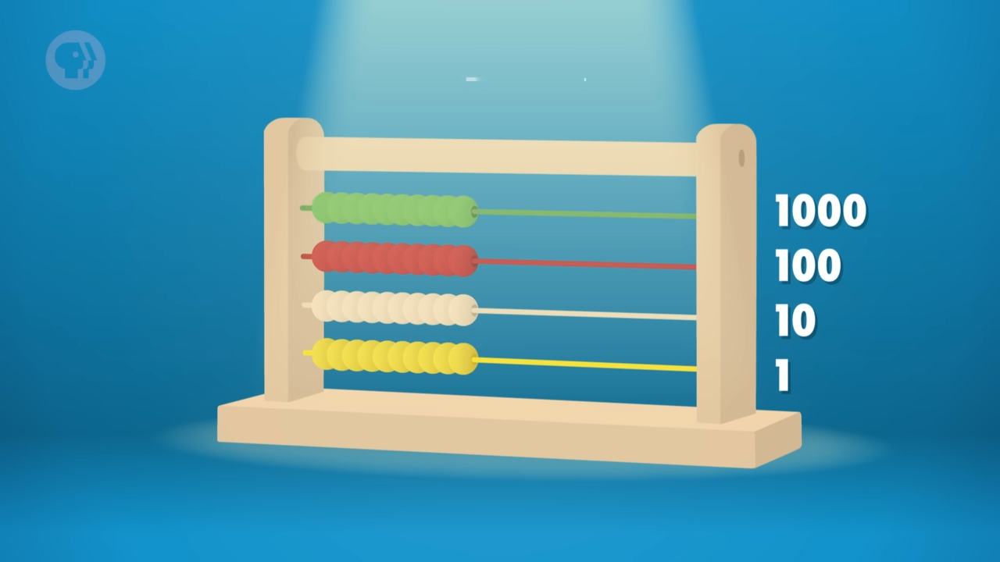

### Computing Tools Before Computers

- For thousands of years, humans built specialized devices that made hard calculations faster, easier, and more accurate.
- Examples include the astrolabe for calculating latitude at sea, the slide rule for multiplication and division, and clocks or related mechanisms for calculating sunrise, tides, celestial positions, and time.
- These tools lowered the barrier to complex calculation and amplified human mental ability.
- Charles Babbage summarized the pattern: with each new tool, human labor becomes shortened.

### The Word "Computer" Started As A Job

- The earliest documented use of the word "computer" is from 1613 in a book by Richard Braithwait.
- At that time, a computer was not a machine. It was a person who performed calculations.
- Human computers sometimes used mechanical aids, but often did the work by hand.
- This meaning persisted for centuries and only shifted toward machines in the late 1800s.

### Step Reckoner: Mechanical Arithmetic

- Gottfried Leibniz built the Step Reckoner in 1694.
- It used gears with ten teeth to represent digits from `0` through `9`.
- When a gear passed `9`, it rolled back to `0` and advanced the adjacent gear by one tooth, much like carrying on an abacus.
- The same mechanism could run in reverse for subtraction.
- With additional mechanical tricks, the Step Reckoner could also multiply and divide.
- Multiplication and division can be reduced to repeated addition and subtraction, which made them mechanically automatable.
- The Step Reckoner was the first machine able to perform all four basic arithmetic operations.
- Its design influenced calculator construction for roughly three centuries.

### Precomputed Tables And Military Pressure

- Mechanical calculators still required many manual steps for real-world problems, and a single result could take hours or days.
- These machines were expensive and inaccessible to most people.
- Before the 20th century, many people encountered computing through precomputed tables made by human computers.
- A table let someone look up values such as square roots instead of recalculating them from scratch.
- Militaries had strong incentives to improve computation because artillery required speed and accuracy.
- Range tables helped gunners determine cannon angles based on conditions such as distance, wind, temperature, and atmospheric pressure.
- The drawback was that changing a cannon or shell design required recomputing entire tables, which was slow and error-prone.

### Difference Engine: Automating Tables

- In 1822, Charles Babbage described using machinery to compute astronomical and mathematical tables.
- He proposed the Difference Engine, a mechanical device designed to approximate polynomials.
- Polynomials can model relationships between variables and approximate logarithmic or trigonometric functions.
- Babbage began construction in 1823.
- The intended machine required about 25,000 components and weighed roughly 15 tons.
- The original project was abandoned, but in 1991 historians built a Difference Engine from Babbage's plans and it worked.
- The important lesson is that Babbage was trying to remove human error from large-scale table production.

### Analytical Engine: General-Purpose Computing

- While working on the Difference Engine, Babbage imagined a more ambitious machine: the Analytical Engine.
- Unlike earlier special-purpose devices, the Analytical Engine was designed as a general-purpose computer.
- It could accept data, run operations in sequence, use memory, and output results through a primitive printer.
- The machine was never fully built, but the design was a major conceptual leap.
- Its key idea was automatic execution: a machine could guide itself through a series of operations.
- Ada Lovelace wrote hypothetical programs for the Analytical Engine and is often considered the world's first programmer.
- Babbage is often called the father of computing because later computer scientists reused many of his ideas.

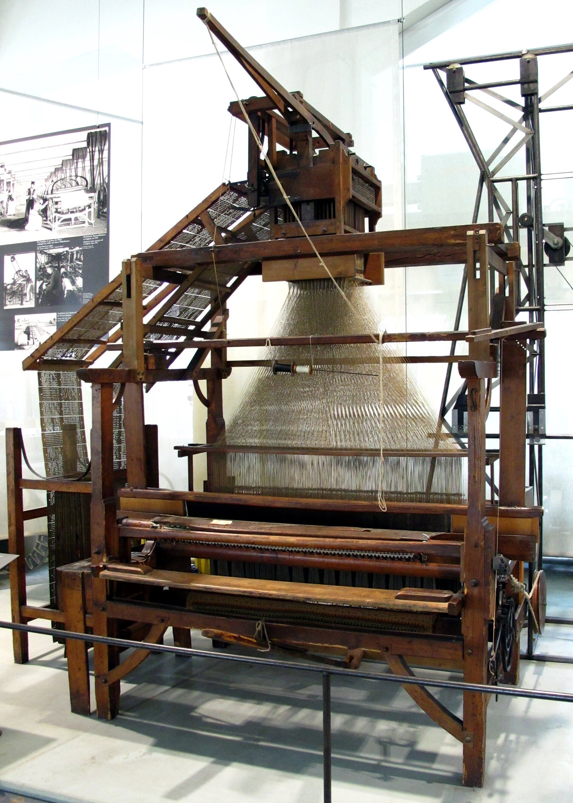

### Hollerith Tabulating Machine: Data Processing At Scale

- By the late 1800s, computing devices were still mostly used for special-purpose scientific and engineering tasks.
- The 1890 United States census created a practical data-processing crisis.
- The 1880 census took seven years to compile manually, and the 1890 census was predicted to take thirteen years even though a census was required every ten years.
- Herman Hollerith built an electro-mechanical tabulating machine for the Census Bureau.
- It used mechanical counters combined with electrically powered components.
- Data was stored on punch cards: paper cards with holes punched at specific positions to represent information.
- When a card was inserted, metal pins passed through punched holes into mercury, completing an electrical circuit.
- The completed circuit powered a motor that turned a gear and incremented the relevant counter.
- Hollerith's machine was about ten times faster than manual tabulation.
- The 1890 census was completed in two and a half years and saved millions of dollars.

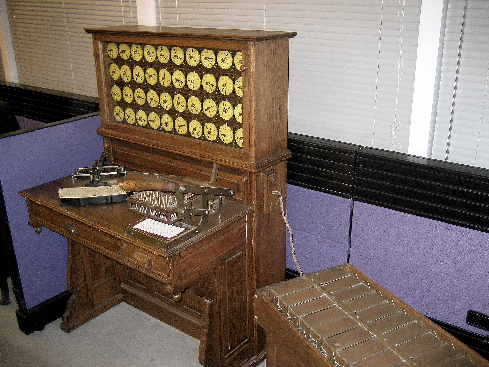

### Business Computing And IBM

- Businesses quickly recognized that computing could improve labor- and data-intensive tasks.
- Early commercial uses included accounting, insurance appraisal, and inventory management.
- Hollerith founded the Tabulating Machine Company to meet this demand.
- In 1924, it merged with other machine makers to become International Business Machines Corporation, or IBM.
- Electro-mechanical business machines transformed government and commerce.
- By the mid-1900s, population growth and global trade required faster, more flexible tools for processing data.
- That pressure set the stage for digital computers.

### Core Takeaways

- Computation began as a response to scale: society produced more data than people could comfortably track or calculate mentally.
- Early computing tools amplified human ability by making calculation faster, more reliable, and more accessible.
- The word "computer" originally described people, then gradually shifted to machines.
- Special-purpose machines solved one class of problem; general-purpose machines introduced the idea of programmable, reusable computation.
- Data processing demand from government, military, science, and business pushed computing from hand calculation toward mechanical, electro-mechanical, and eventually digital systems.

## 02. Electronic Computing

Source: [Electronic Computing: Crash Course Computer Science #2](https://www.youtube.com/watch?v=LN0ucKNX0hc)

### Big Picture

- Early 20th-century society produced far more data and coordination work than earlier special-purpose tabulating machines could comfortably handle.
- Population growth, world wars, global trade, transit networks, engineering, and science all increased demand for faster automation and computation.
- Electro-mechanical computers scaled up from cabinet-sized business machines into room-sized machines that were expensive, fragile, and error-prone.
- The major technical shift in this lesson is from mechanical switching to electronic switching.
- Computing speed, reliability, cost, and size were constrained by the physical switch technology available at each stage.

### Harvard Mark I: Electro-Mechanical Scale

- The Harvard Mark I was one of the largest electro-mechanical computers.
- IBM completed it in 1944 for the Allies during World War II.
- It had about 765,000 components, three million connections, and 500 miles of wire.
- Its mechanics were synchronized by a 50-foot shaft driven by a five-horsepower motor.
- One early use was running simulations for the Manhattan Project.
- The machine showed that electro-mechanical computing could tackle important work, but it also exposed the limits of relay-based design.

### Relays: Electrically Controlled Mechanical Switches

- Relays were the core switching elements in large electro-mechanical computers.
- A relay uses a control wire connected to a coil.
- When current flows through the coil, it creates an electromagnetic field.
- That field attracts a metal arm, snapping a circuit closed.
- The controlled circuit can then activate another circuit, motor, or counter.
- The faucet analogy is useful: the control wire is like the handle, and current flow is like water flow.
- The problem is that the metal arm has mass, so it cannot move instantly.
- A good 1940s relay could switch about 50 times per second.
- The Harvard Mark I could do about three additions or subtractions per second; multiplication took about six seconds, division about fifteen seconds, and complex trigonometric functions could take more than a minute.
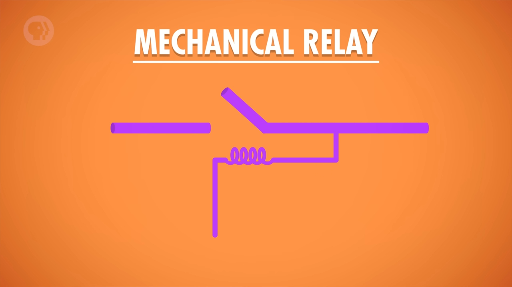
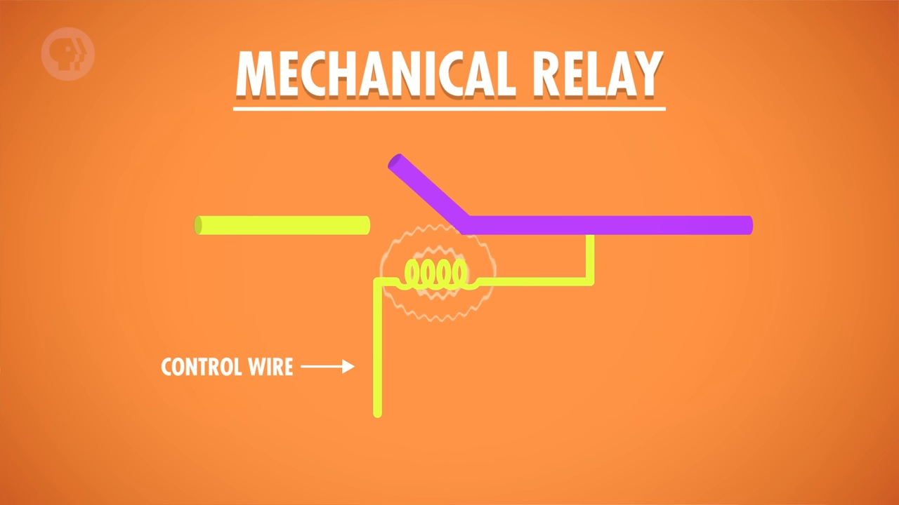
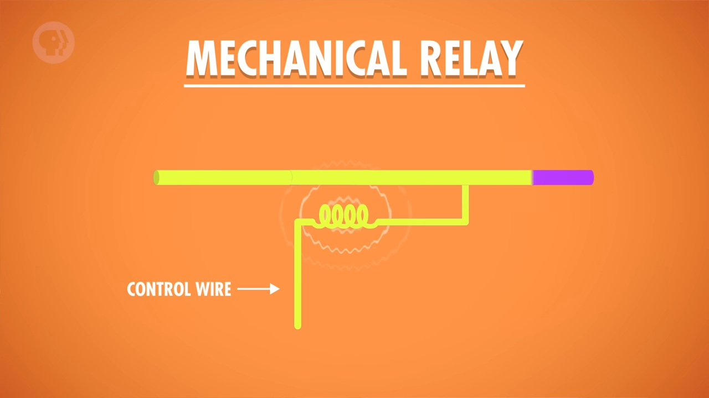

### Reliability, Wear, And Bugs

- Mechanical parts wear out because they move.
- Relays could become sticky, slow, unreliable, or break entirely.
- Failure probability increased as machines used more relays.
- The Harvard Mark I had roughly 3,500 relays, which made maintenance a constant concern during long calculations.
- Warm, dark machines also attracted insects.
- In 1947, Harvard Mark II operators found a dead moth in a malfunctioning relay.
- Grace Hopper later noted that when something went wrong, operators said the computer had "bugs" in it.
- The broader point is that mechanical switching did not scale well enough for the next stage of computing.

### Vacuum Tubes: Electronic Switching Without Moving Parts

- In 1904, John Ambrose Fleming developed the thermionic valve, the first vacuum tube.
- It used two electrodes in an airtight glass bulb.
- Heating one electrode caused it to emit electrons, a process called thermionic emission.
- If the other electrode was positively charged, electrons were attracted across the vacuum and current flowed.
- If the other electrode was neutral or negatively charged, current did not flow.
- This one-way current component is called a diode.
- In 1906, Lee de Forest added a third control electrode between the other two electrodes, creating a triode.
- A positive charge on the control electrode allowed current to flow; a negative charge blocked it.
- Like relays, triodes could open or close circuits, but they had no moving parts.
- Because there was no moving mechanical arm, vacuum tubes could switch thousands of times per second.
- Vacuum tubes were still fragile, could burn out, and were initially expensive, but by the 1940s they became practical for government-scale computers.

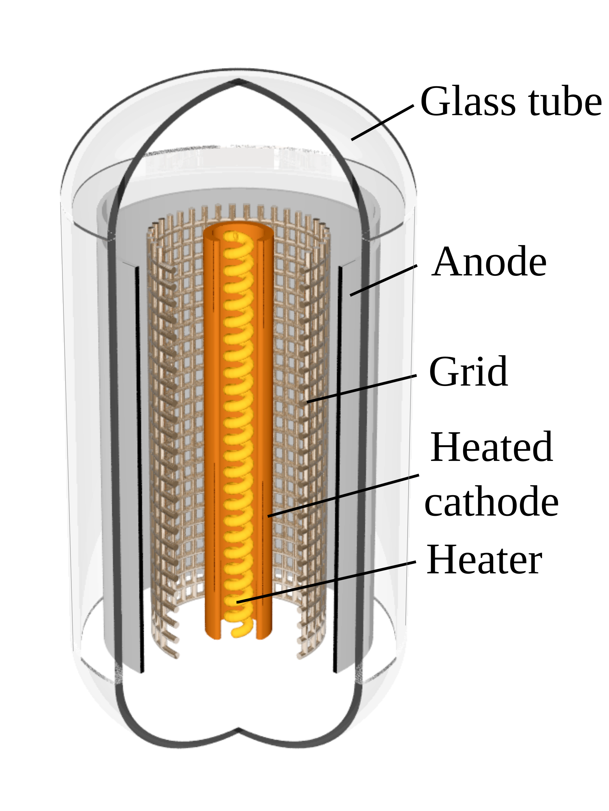

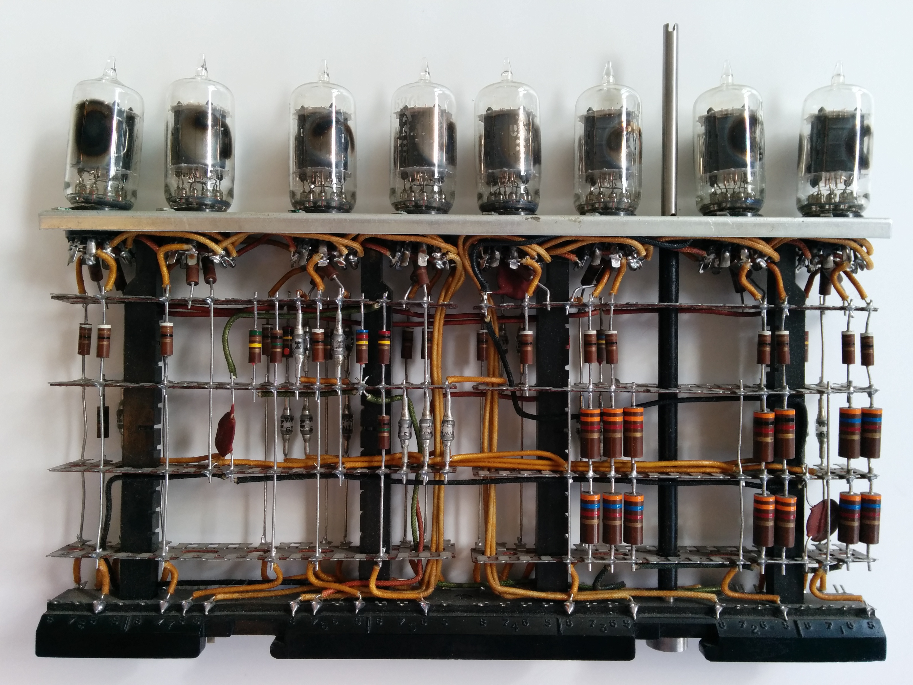

Source: [Wikimedia Commons, IBM 700 logic module](https://commons.wikimedia.org/wiki/File:IBM_700_logic_module.jpg).
### Colossus: First Programmable Electronic Computer

- Colossus Mk 1 was designed by Tommy Flowers and completed in December 1943.
- It was installed at Bletchley Park in the United Kingdom to help decrypt Nazi communications.
- The first Colossus used about 1,600 vacuum tubes.
- Ten Colossi were eventually built for code-breaking work.
- Colossus is regarded as the first programmable electronic computer.
- Its programming was physical: operators plugged hundreds of wires into plugboards to configure the machine.
- That made it programmable, but still oriented around specific computations once configured.
- Alan Turing's earlier Bombe, also used at Bletchley Park, was electro-mechanical and designed for breaking Enigma codes, but it was not technically a computer in the same sense.

### ENIAC: General-Purpose Electronic Computing

- ENIAC stands for Electronic Numerical Integrator and Calculator.
- It was completed in 1946 at the University of Pennsylvania.
- It was designed by John Mauchly and J. Presper Eckert.
- It is described as the first truly general-purpose, programmable, electronic computer.
- ENIAC could perform about 5,000 ten-digit additions or subtractions per second.
- It was operational for ten years and is estimated to have performed more arithmetic than the entire human race had up to that point.
- Its weakness was reliability: with so many vacuum tubes, failures were common, and it often ran only about half a day before breaking down.

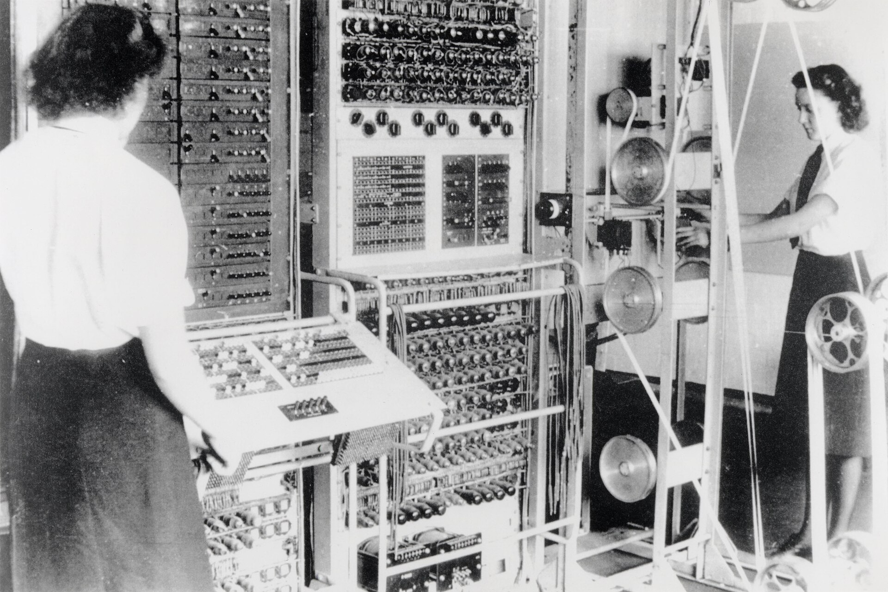

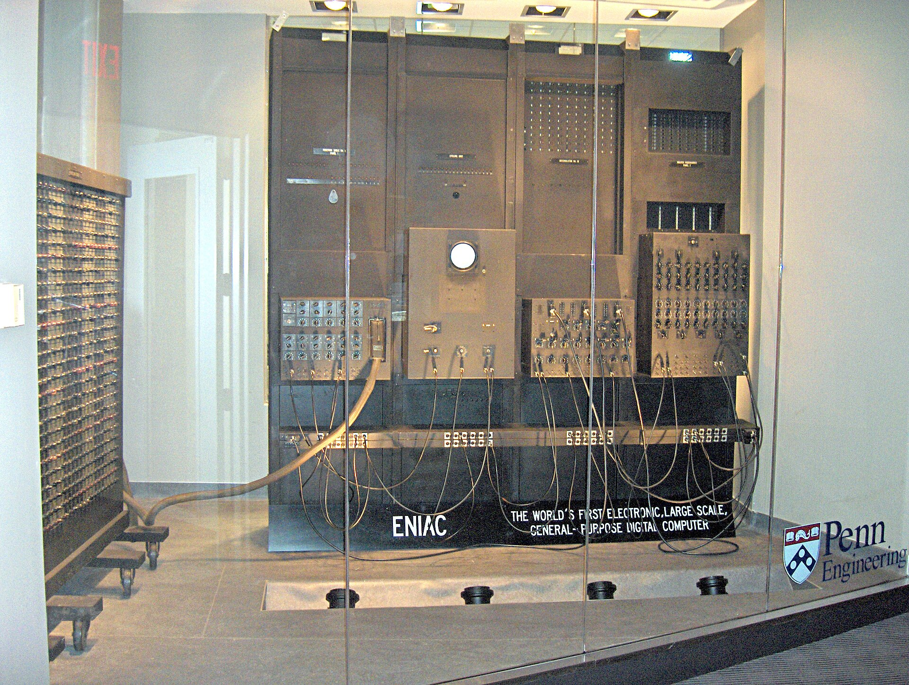

### Transistors: Solid-State Switching

- By the 1950s, vacuum-tube computing was reaching limits in cost, size, reliability, and speed.
- In 1947, Bell Labs scientists John Bardeen, Walter Brattain, and William Shockley invented the transistor.
- A transistor is another controlled switch, like a relay or vacuum tube.
- It uses a control wire attached to a gate electrode.
- Changing the gate's electrical charge changes whether a semiconductor material conducts or resists electricity.
- The first Bell Labs transistor could switch about 10,000 times per second.
- Transistors were solid-state components: solid material rather than glass tubes with suspended fragile parts.
- They could be made smaller than relays or vacuum tubes.
- This enabled smaller, cheaper, faster, and more reliable computers.

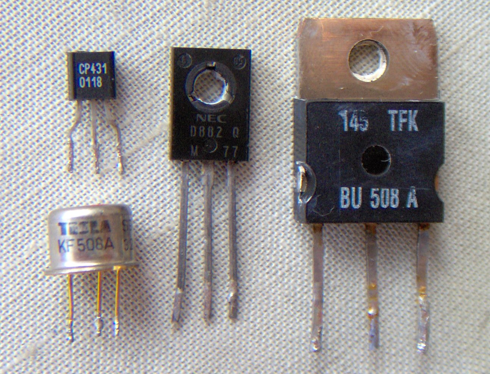

Source: [Wikimedia Commons, Electronic component transistors](https://commons.wikimedia.org/wiki/File:Electronic_component_transistors.jpg).

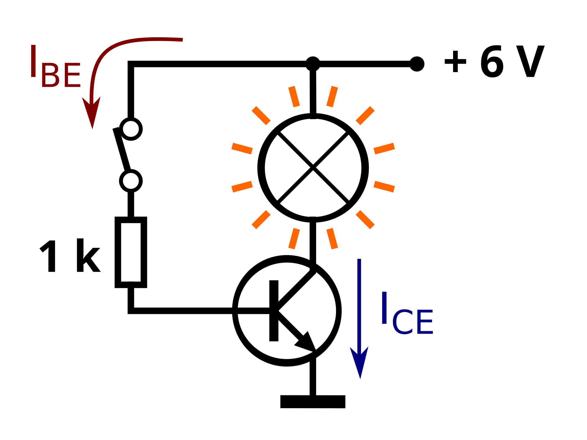

Source: [Wikimedia Commons, Transistor as switch](https://commons.wikimedia.org/wiki/File:Transistor_as_switch.svg).

### IBM 608 And Commercial Transistor Computers

- The IBM 608, released in 1957, was the first fully transistor-powered commercially available computer.
- It contained about 3,000 transistors.
- It could perform about 4,500 additions per second or roughly 80 multiplications or divisions per second.
- IBM soon moved its computing products toward transistors.
- Transistor-based computers gradually entered offices and, eventually, homes.

### Silicon Valley

- Modern computer transistors are smaller than 50 nanometers; a sheet of paper is roughly 100,000 nanometers thick.
- They can switch millions of times per second and can operate for decades.
- Much transistor and semiconductor development happened in the Santa Clara Valley between San Francisco and San Jose.
- Silicon became the dominant semiconductor material, so the region became known as Silicon Valley.
- William Shockley founded Shockley Semiconductor there.
- Employees from that company later founded Fairchild Semiconductor.
- Fairchild alumni later founded Intel, a major computer chip maker.

### Core Takeaways

- The history of electronic computing is largely the history of better switches.
- Relays made electrical control possible but were slow and mechanically fragile.
- Vacuum tubes removed moving parts and enabled electronic switching, but were still bulky, hot, fragile, and failure-prone.
- Transistors made switching solid-state, smaller, cheaper, faster, and more reliable.
- Colossus showed programmable electronic computing for code-breaking; ENIAC showed general-purpose programmable electronic computing.
- The next conceptual step is explaining how fast on/off electrical switches become actual computation without gears or motors.

## 03. Boolean Logic And Logic Gates

Source: [Boolean Logic & Logic Gates: Crash Course Computer Science #3](https://www.youtube.com/watch?v=gI-qXk7XojA&list=PL8dPuuaLjXtNlUrzyH5r6jN9ulIgZBpdo&index=4)

### Big Picture

- Transistors give computers a reliable physical way to represent two states: electricity flowing or not flowing.
- Those two states map naturally onto Boolean values: `true` and `false`, or `1` and `0`.
- Binary is useful because two distant signal states are easier to distinguish than many intermediate voltage levels.
- Electrical noise, weak batteries, heat, and very fast switching can blur signals, so using only on and off gives computers a clean margin for error.
- Boolean algebra supplies the mathematical rules for combining true and false values.
- Logic gates are the next abstraction layer: instead of thinking about individual transistors, engineers can combine small logical building blocks.

### Boolean Algebra: Logic As Mathematics

- George Boole developed a formal way to reason about truth values in the 1800s.
- Regular algebra uses numbers and operations such as addition or multiplication.
- Boolean algebra uses truth values and logical operations.
- The three fundamental operations introduced in this lesson are `NOT`, `AND`, and `OR`.
- Each operation can be described with a truth table, which lists every possible input combination and the resulting output.
- The important bridge is that Boolean operations are not just abstract math; they can be built as circuits from transistors.

### NOT: Inverting A Signal

- `NOT` takes one input and flips it.
- If the input is `true`, the output is `false`.
- If the input is `false`, the output is `true`.
- A basic transistor by itself passes the input through: on produces on, and off produces off.
- By changing where the output wire is taken and using a path to ground, a transistor circuit can invert the signal.
- When the transistor is on, current drains to ground and the output is off.
- When the transistor is off, current cannot drain through that path, so the output remains on.

### AND: Requiring Both Inputs

- `AND` takes two inputs and produces one output.
- The output is `true` only when both inputs are `true`.
- If either input is `false`, the whole statement is `false`.
- In circuit form, two transistors can be placed in series.
- Current reaches the output only if the first transistor and the second transistor are both allowing current through.
- Series wiring gives the circuit the same behavior as the Boolean `AND` operation.

### OR: Accepting Either Input

- `OR` also takes two inputs and produces one output.
- The output is `true` when at least one input is `true`.
- The only time `OR` produces `false` is when both inputs are `false`.
- In circuit form, two transistors can be placed in parallel.
- Current can reach the output through either path.
- Parallel wiring gives the circuit the same behavior as the Boolean `OR` operation.

### Logic Gates As Abstraction

- Engineers use standard symbols for logic gates so they do not have to redraw transistor circuits every time.
- A `NOT` gate is usually drawn as a triangle with a small circle at the output.
- An `AND` gate is often drawn with a flat input side and a rounded output side.
- An `OR` gate is drawn with a curved input side and pointed output side.
- These symbols hide transistor-level details while preserving the behavior needed to build larger circuits.
- This is the first major example of the course's abstraction ladder: simple physical switches become logic gates, and logic gates become more complex computer components.

### XOR: Combining Basic Gates

- `XOR` means exclusive OR.
- A normal `OR` is true when either input is true, including the case where both inputs are true.
- `XOR` is true only when exactly one input is true.
- If both inputs are true, `XOR` returns false.
- `XOR` can be built from the three basic gates: `OR`, `AND`, and `NOT`.
- One way to describe it is: `(A OR B) AND NOT (A AND B)`.
- This shows why primitive gates are powerful: once a few basic operations exist, more specialized operations can be composed from them.

### Core Takeaways

- Computers use binary because on/off states are physically reliable and map cleanly to Boolean truth values.
- Boolean algebra gives computers a formal system for manipulating true and false values.
- `NOT`, `AND`, and `OR` are the basic logical operations introduced in this lesson.
- Logic gates are transistor circuits viewed at a higher level of abstraction.
- More complex operations, such as `XOR`, can be assembled from simpler gates.
- The next step is using binary values not just for true and false, but for representing numbers, letters, and other data.

## 04. Representing Numbers And Letters With Binary

Source: [Representing Numbers and Letters with Binary: Crash Course Computer Science #4](https://www.youtube.com/watch?v=1GSjbWt0c9M)

### Big Picture

- A single bit can represent two values, but groups of bits can represent many more things.
- Binary works like decimal place-value notation, but each column is a power of two instead of a power of ten.
- Once numbers can be represented in binary, computers can encode letters, colors, memory addresses, and many other forms of data as numbers.
- The central idea is representation: computers store patterns of bits, and humans define what those bit patterns mean.
- Larger bit widths allow larger ranges, more precision, more memory addresses, and richer media.

### Binary Place Value

- Decimal is base 10 because each digit has ten possible values: `0` through `9`.
- Each decimal column is ten times larger than the column to its right: ones, tens, hundreds, and so on.
- Binary is base 2 because each digit has only two possible values: `0` and `1`.
- Each binary column is two times larger than the column to its right: ones, twos, fours, eights, sixteens, and so on.
- The binary number `101` means one `4`, zero `2`s, and one `1`, which equals decimal `5`.
- The binary number `10110111` equals `183` because it adds `128 + 32 + 16 + 4 + 2 + 1`.

### Binary Arithmetic

- Binary addition follows the same carry idea as decimal addition.
- In decimal, `9 + 1` creates a carry because a single digit cannot represent ten.
- In binary, `1 + 1` creates a carry because a single bit cannot represent two.
- `1 + 1` becomes binary `10`: write `0` in the current column and carry `1` to the next column.
- `1 + 1 + 1` becomes binary `11`: write `1` and carry `1`.
- This lets computers perform arithmetic using the same logic-gate foundation from the previous lesson.

### Bits, Bytes, And Scale

- A binary digit is called a bit.
- Eight bits make one byte.
- With eight bits, a computer can represent `256` different values, from `0` through `255`.
- Many early computers and game systems worked heavily with 8-bit chunks, which limited graphics and audio choices.
- Modern systems commonly operate on 32-bit or 64-bit chunks.
- A 32-bit unsigned value can represent a little under 4.3 billion possible values.
- A 64-bit value can represent vastly larger numbers, which is important for memory addresses and large-scale computation.

### Negative Numbers And Floating-Point Numbers

- Computers also need to represent negative numbers, not just positive whole numbers.
- A simple signed-number scheme uses one bit for the sign and the remaining bits for the magnitude.
- With 32 bits, dedicating one bit to the sign leaves 31 bits for the number, giving a range of roughly plus or minus two billion.
- Computers also need fractional values such as `12.7` or `3.14`.
- Floating-point numbers represent values in a form similar to scientific notation.
- The IEEE 754 standard is the common format for floating-point representation.
- In a 32-bit floating-point number, one bit stores the sign, eight bits store the exponent, and 23 bits store the significand.

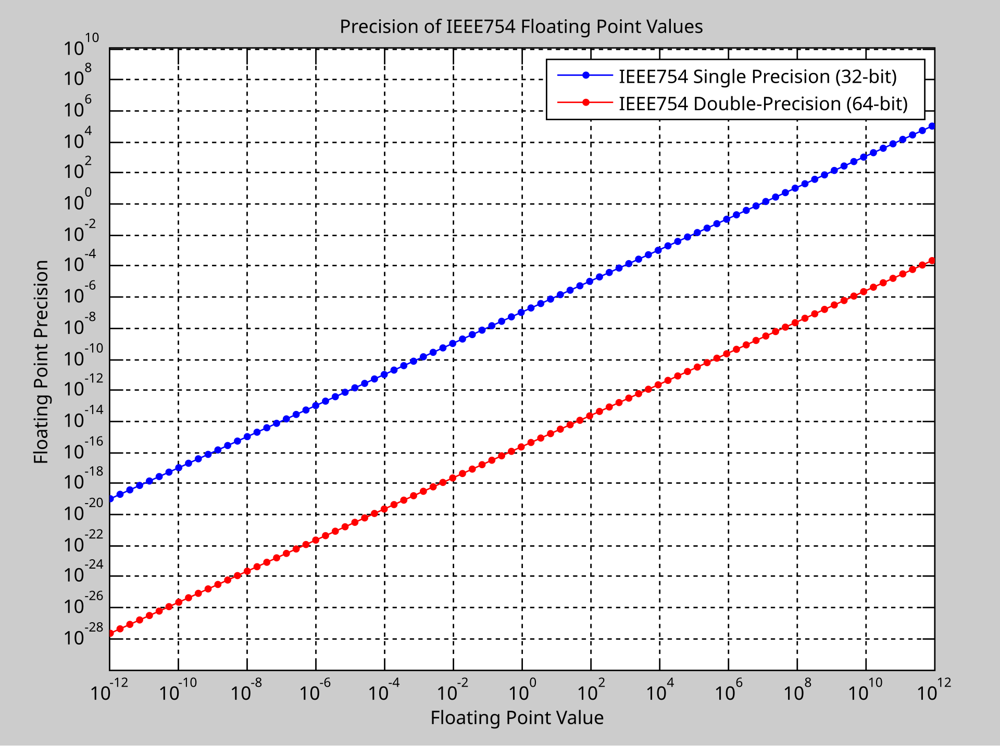

### Text As Numbers

- Computers do not need separate physical storage for letters.
- Instead, they assign numbers to characters and store those numbers as binary.
- A simple alphabet encoding could map `A` to `1`, `B` to `2`, and so on, but that is not enough for lowercase letters, punctuation, digits, and control codes.
- ASCII, created in 1963, used seven bits and could represent `128` values.
- ASCII included uppercase letters, lowercase letters, digits, punctuation, symbols, and control codes such as newline.
- Because ASCII became widely adopted, computers from different companies could exchange text more reliably.
- This ability for different systems to exchange data is interoperability.

### Extended Encodings And Unicode

- ASCII was designed mainly for English.
- Since a byte has eight bits, many systems used the extra values from `128` through `255` for additional symbols or national characters.
- Different regions used those extra values differently, which created compatibility problems.
- A byte pattern that represented one character on one system might represent a different character on another system.
- Unicode was created to provide a universal character encoding system.
- Unicode can represent many writing systems and symbols, including characters from different languages and modern additions such as emoji.
- The broader lesson is that representation standards matter because computers need shared agreements about what bit patterns mean.

### Core Takeaways

- Bits can represent more than true and false when they are grouped and interpreted by agreed-upon encoding schemes.
- Binary place value works like decimal place value, but the columns are powers of two.
- A byte is eight bits and can represent 256 distinct values.
- Larger bit widths increase range, precision, and addressable memory.
- Floating-point formats let computers represent fractional values, but they require structured fields such as sign, exponent, and significand.
- Text encoding turns characters into numbers; standards such as ASCII and Unicode make those numbers interoperable across systems.

## 05. How Computers Calculate: The ALU

Source: [How Computers Calculate - the ALU: Crash Course Computer Science #5](https://www.youtube.com/watch?v=1I5ZMmrOfnA)

### Big Picture

- Representing numbers is only the starting point; computers also need circuits that manipulate numbers in structured ways.
- The Arithmetic and Logic Unit, or ALU, is the part of a computer that performs core numerical and logical operations.
- An ALU combines two kinds of work: arithmetic operations such as addition and subtraction, and logical operations such as `AND`, `OR`, `NOT`, and tests.
- The lesson builds upward from logic gates to adders, then to an 8-bit ripple-carry adder, then to the larger ALU abstraction.
- This is another abstraction step: engineers do not want to think about every gate every time, so the ALU becomes a reusable component.

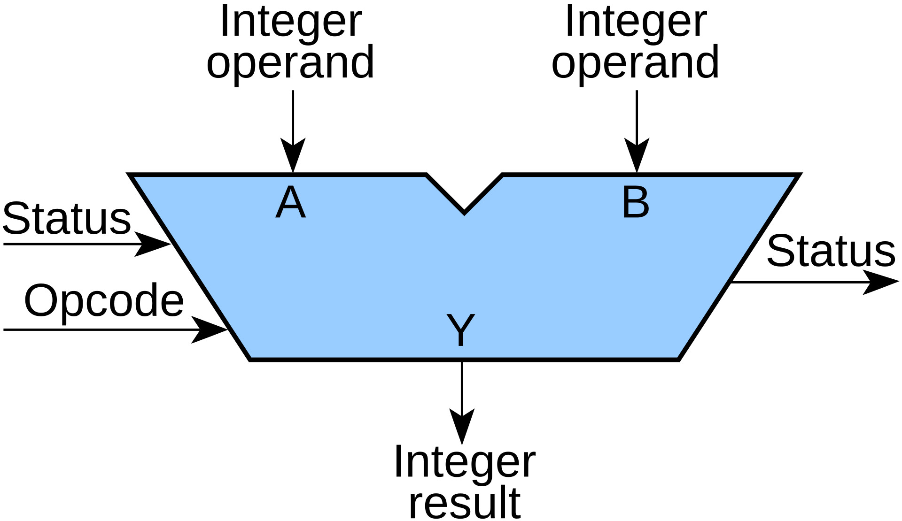

### Arithmetic Unit: Building Addition From Gates

- The arithmetic unit handles numerical operations.
- Addition is the central example because many other operations can be built from repeated or modified addition.
- Instead of drawing every transistor, the lesson works at the logic-gate level using `AND`, `OR`, `NOT`, and `XOR`.
- Adding two single bits has four input combinations: `0 + 0`, `1 + 0`, `0 + 1`, and `1 + 1`.
- The first three cases match `XOR`: the sum bit is `1` when exactly one input is `1`.
- The special case is `1 + 1`, which is binary `10`: the sum bit is `0`, and a carry bit moves to the next column.

### Half Adder: Sum And Carry

- A half adder is the simplest useful adding circuit.
- It takes two one-bit inputs, usually called `A` and `B`.
- It produces two outputs: a sum bit and a carry bit.
- The sum output is `A XOR B`.
- The carry output is `A AND B`, because a carry happens only when both inputs are `1`.
- A half adder is called "half" because it does not accept an incoming carry from a previous column.

### Full Adder And Ripple-Carry Addition

- Multi-bit addition needs to carry values from one column to the next, just like decimal addition.
- After the first bit column, each column may receive a carry from the previous column.
- A full adder handles three inputs: `A`, `B`, and `carry in`.
- A full adder can be built from two half adders plus an `OR` gate to combine carry outputs.
- To add 8-bit numbers, one half adder can handle the first column, and full adders can handle the remaining columns.
- Carry bits ripple forward through the chain, which is why this design is called a ripple-carry adder.

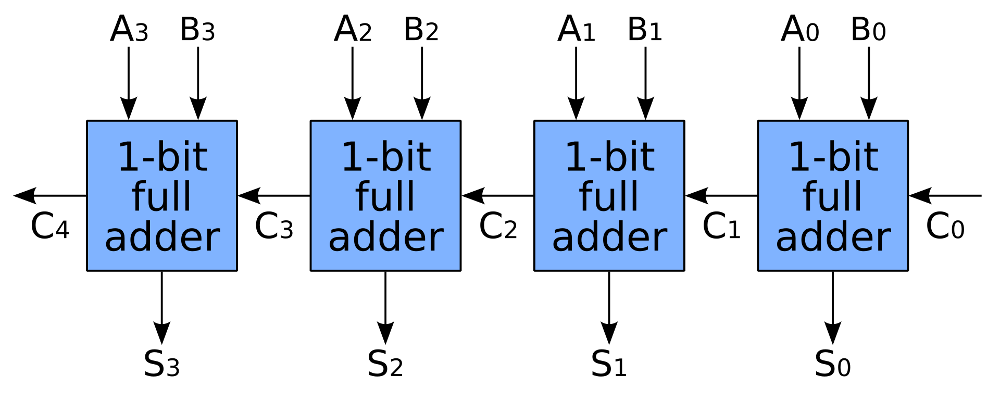

### Overflow And Bit Width

- A fixed number of bits can only represent a fixed range of values.
- If an 8-bit adder produces a carry into a ninth bit, the result is too large to fit in eight bits.
- This condition is called overflow.
- Overflow can produce errors or unexpected behavior because the hardware cannot represent the full result with the available bits.
- The lesson uses the original Pac-Man arcade game as an example: level numbers were stored with eight bits, so going past level `255` caused overflow-related glitches.
- Wider adders, such as 16-bit or 32-bit adders, make overflow less likely but require more gates.
- Ripple-carry adders also have a speed cost because each carry must propagate through the chain before the final result is known.
- Modern systems often use faster designs such as carry-lookahead adders, which do the same job with more sophisticated circuitry.

### Other Arithmetic Operations

- Simple ALUs usually support a small set of arithmetic operations, not every possible math operation directly in hardware.
- Multiplication can be performed as repeated addition: `12 * 5` can be computed by adding `12` five times.
- Simple processors often use repeated passes through the ALU for multiplication because it avoids dedicated multiplication hardware.
- More capable processors include specialized multiplication circuits, which are faster but require more logic gates.
- There is no magic in the more advanced circuits; they are still built from many smaller logic-gate combinations.

### Logic Unit: Boolean Operations And Tests

- The logic unit performs Boolean operations such as `AND`, `OR`, and `NOT`.
- It can also perform simple tests on numbers, such as checking whether a value is zero or whether it is negative.
- To test whether a value is zero, a circuit can use `OR` gates to check whether any bit is `1`.
- If any bit is `1`, the number is not zero.
- A final `NOT` gate flips that result, so the output is `1` only when every input bit is `0`.
- These simple tests are important because later CPU instructions need condition checks to decide what to do next.

### The ALU As A Reusable Abstraction

- A complete ALU contains many gates connected in carefully designed ways.
- The lesson mentions the 74181 as a historically important single-chip ALU.
- The 74181 handled 4-bit inputs and used about 70 logic gates, which was a major step in miniaturization.
- The course's simplified 8-bit ALU would require hundreds of gates if fully drawn out.
- Engineers hide that complexity behind a standard ALU symbol with input wires, output wires, and control signals.
- Control signals tell the ALU which operation to perform, such as addition, subtraction, or a logic operation.
- This abstraction lets later lessons treat the ALU as one part inside a larger CPU.

### Core Takeaways

- The ALU is the computer's core calculation component, combining arithmetic and logic operations.
- Addition can be built from logic gates: `XOR` gives the sum bit, and `AND` gives the carry bit for a half adder.
- Full adders include incoming carry bits, allowing multi-bit addition.
- Ripple-carry adders chain adders together, but carry propagation creates a speed limit.
- Overflow happens when a result is too large for the available number of bits.
- Logic operations and simple numerical tests are part of the ALU, not separate magic.
- The ALU is a major abstraction layer: hundreds of gates become one reusable component inside the CPU.

## 06. Registers And RAM

Source: [Registers and RAM: Crash Course Computer Science #6](https://www.youtube.com/watch?v=fpnE6UAfbtU)

### Big Picture

- Calculation is not enough by itself; a computer must also store results so later operations can use them.
- Memory gives circuits a way to hold values instead of letting every result disappear after one calculation.
- RAM, or random-access memory, is working memory: it stores the data and program state a computer is actively using.
- RAM is volatile, meaning it only keeps its contents while power remains on.
- Persistent storage is different: it keeps data without power, but this lesson focuses on working memory.
- The lesson builds memory in layers: one-bit latch, gated latch, register, memory matrix, addressable memory, and RAM.

### Feedback Loops And One-Bit Memory

- Earlier circuits mostly flowed in one direction from inputs to outputs.
- Memory requires feedback: a circuit output can loop back into one of its own inputs.
- An `OR` gate with feedback can latch onto a `1` once it receives one, because the output keeps feeding that `1` back into the gate.
- An `AND` gate with feedback can similarly hold onto a `0` once it is forced low.
- These feedback circuits show the core idea of memory: the current output depends partly on a previous state.
- By combining circuits that can remember `1` and `0`, we can build a one-bit storage component.
- The next step is adding a write-enable signal so the stored bit changes only when we want it to: a gated latch.

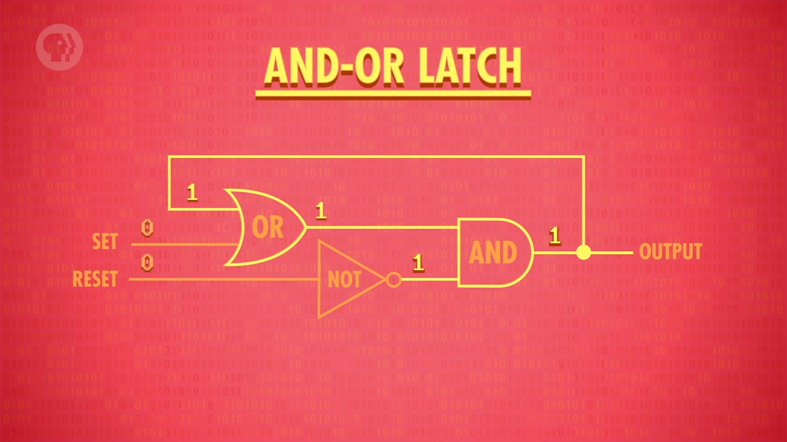

### Latches: Set, Reset, Write, And Read

- A latch stores one bit of information.
- A basic set-reset latch has two inputs: `set`, which stores `1`, and `reset`, which stores `0`.
- When both `set` and `reset` are inactive, the latch keeps outputting the last value it stored.
- Putting data into memory is called writing.
- Getting data out of memory is called reading.
- A gated latch improves the basic latch by using a data input and a write-enable input.
- When write enable is off, changes on the data wire are ignored.
- When write enable is on, the latch stores the current data value.
- The lesson shows this at two levels: a simple block view for intuition and a gate-level circuit for implementation detail.

![[06-gated-latch-block.png]]
### Registers: Grouping Latches Into Words

- One bit is not useful enough for practical computation.
- Placing several latches side by side lets a circuit store multi-bit values.
- A group of latches that stores one multi-bit value is called a register.
- An 8-bit register contains eight one-bit latches and can store one byte-sized value.
- A register's width is the number of bits it can store.
- Early computers used small register widths such as 8 bits; later systems used 16-bit, 32-bit, and 64-bit registers.
- A shared write-enable line can enable all latches in the register at once so the whole value is saved together.

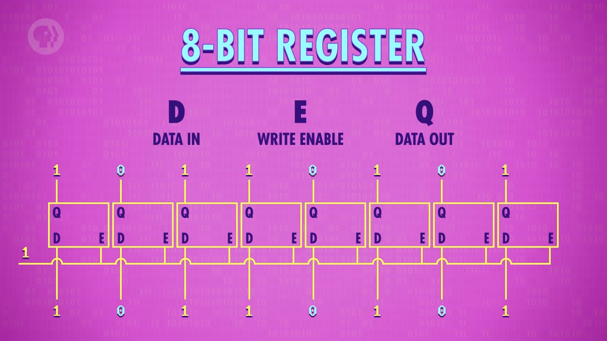

### Scaling Memory With A Matrix

- Putting latches in a single long row creates too many wires as memory gets larger.
- A matrix layout reduces wiring by arranging latches in rows and columns.
- In a 16-by-16 grid, 256 one-bit latches can be addressed by selecting one row and one column.
- Only the latch at the intersection of the active row and active column should respond.
- An `AND` gate can combine row selection, column selection, and write enable so only one latch is write-enabled.
- The same selection idea can be used with read enable to retrieve the stored bit later.
- The lesson notes that this kind of matrix reduces 256 bits of memory from hundreds of direct wires to a much smaller set of shared wires.

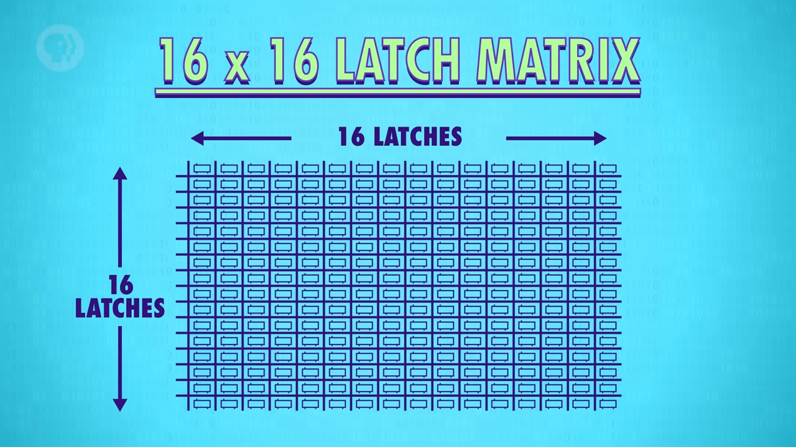

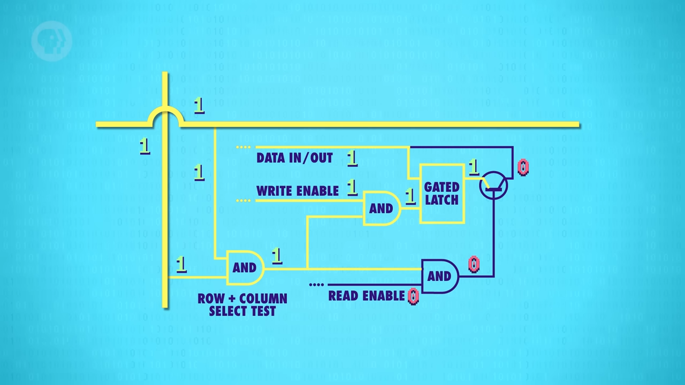

### Addresses And Multiplexers

- A memory address identifies a specific storage location.
- A row and column pair works like a city intersection: row 12 and column 8 identifies one cell in the matrix.
- If there are 16 rows, a 4-bit binary number can select one row because four bits can represent 16 values.
- Another 4-bit number can select one of 16 columns.
- Together, those row and column bits form an 8-bit address for 256 locations.
- A multiplexer converts an address into a selected output line.
- In this example, one multiplexer selects the row and another selects the column.

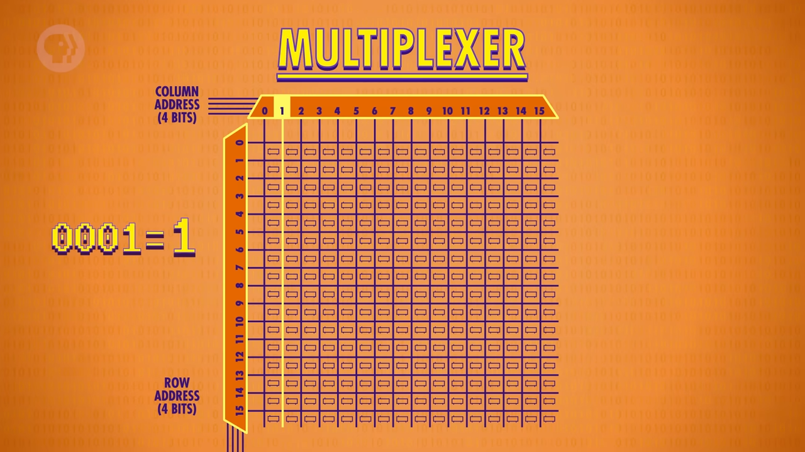

### RAM As Addressable Memory

- A 256-bit matrix stores 256 individual bits.
- To store bytes, the design can place eight 256-bit memory components side by side.
- Each component stores one bit of the byte at the same address.
- With eight parallel bit-planes, the memory can store 256 bytes: 256 addresses, each holding an 8-bit value.
- At this point the internal details can be abstracted away as a uniform bank of addressable memory.
- To use the RAM component, a system supplies an address, read/write control signals, and data lines.
- Modern computers scale this same idea into megabytes and gigabytes by packaging smaller memory blocks into larger ones.

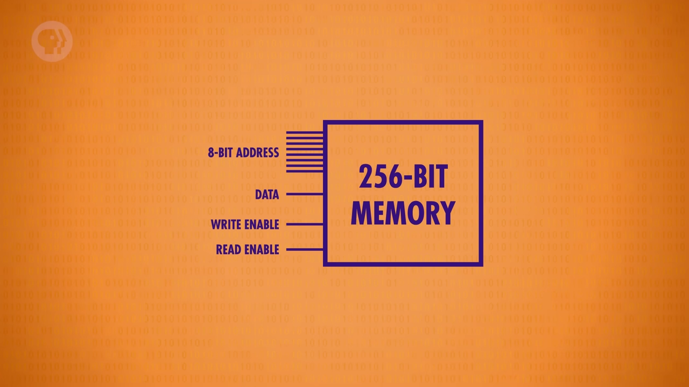

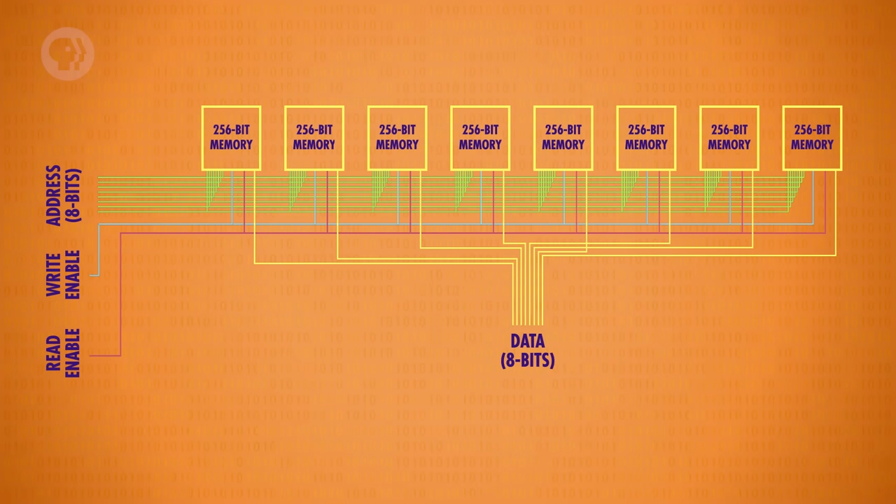

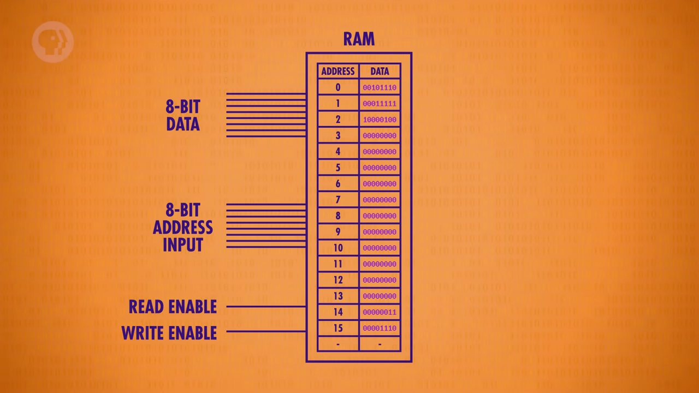

### Core Takeaways

- Memory is built from feedback circuits that can preserve a previous state.
- A latch stores one bit; a gated latch adds data and write-enable controls.
- A register groups latches so a circuit can store a multi-bit value at once.
- Matrix addressing avoids wiring every memory cell individually.
- Addresses identify storage locations, and multiplexers decode address bits into row and column selections.
- RAM is volatile working memory, organized as addressable locations that can be read from or written to.
- Like gates and ALUs, memory becomes manageable through repeated abstraction: small circuits are packaged into larger reusable components.
