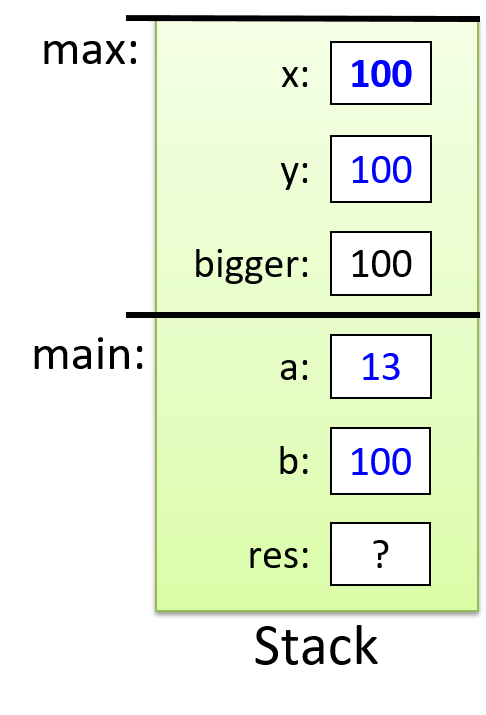

## 0. Introduction

Source: <https://diveintosystems.org/book/introduction.html>

This introduction sets the scope for the whole book:

```text
high-level programs
  -> machine instructions
  -> binary encoding
  -> hardware execution
  -> operating-system management
  -> multicore performance trade-offs
```

The point is practical systems understanding. The book wants you to see how programs actually run, what the operating system is doing for them, and where performance costs come from.

### 0.1. What Is a Computer System?

A computer system is hardware plus system software.

The core pieces are:

- input/output ports
- CPU
- RAM
- secondary storage
- operating system

The first four are the hardware. The operating system is the key software layer that makes the hardware usable, manages resources, and allows multiple programs to run safely and efficiently.


*Figure 1. The layered components of a computer system*

The book narrows the definition of a computer system to machines that are:

- general purpose
- reprogrammable

That is why calculators and microcontrollers are discussed as nearby examples but excluded from the book's main definition.

### 0.2. What Do Modern Computer Systems Look Like?

Modern systems vary in size and packaging, but keep the same basic ingredients.

Desktop and laptop systems contain the same major hardware components, with different physical trade-offs around size, cooling, batteries, RAM modules, and power use.


*Figure 2. Common computer systems: a desktop (left) and a laptop (right) computer*

The same trend continues toward smaller and more integrated devices.


*Figure 3. A Raspberry Pi single-board computer*

The Raspberry Pi is presented as a single-board computer built around a system-on-a-chip. The same integration pattern also appears in smartphones. The important takeaway is that form factors change, but the systems ideas remain the same.

The chapter also previews a central modern reality:

```text
most current computers are multicore systems
  -> multiple CPUs
  -> true parallel execution
```

### 0.3. What You Will Learn In This Book

The book's outcomes cluster into three themes:

- understanding how computers execute programs
- evaluating the systems costs of code
- using multicore hardware effectively

Along the way, the book also builds skill in:

- C programming
- assembly programming
- debugging tools
- computer architecture
- operating systems
- shared-memory parallelism

### 0.4. Getting Started with This Book

This section frames the practical setup for the rest of the text: the language choice, the environment, and how to approach the readings.

### 0.5. Linux, C, and the GNU Compiler

The book uses C because it exposes the machine more directly than many higher-level languages do. The programming environment is Linux with GCC.

Shell commands are written with a leading prompt:

```text
$
```

Example:

```text
$ uname -a
```

Example output:

```text
$ uname -a
Linux Fawkes 4.4.0-171-generic #200-Ubuntu SMP Tue Dec 3 11:04:55 UTC 2019
x86_64 x86_64 x86_64 GNU/Linux
```

Manual pages are introduced early:

```text
$ man uname
```

### 0.6. Other Types of Notation and Callouts

The introduction explains three recurring callout styles used throughout the book.

Aside:

```text
The origins of Linux, GNU, and the Free Open Source Software (FOSS) movement

In 1969, AT&T Bell Labs developed the UNIX operating system for internal use. Although it was initially written in assembly, it was rewritten in C in 1973. Due to an antitrust case that barred AT&T Bell Labs from entering the computing industry, AT&T Bell Labs freely licensed the UNIX operating system to universities, leading to its widespread adoption. By 1984, however, AT&T separated itself from Bell Labs, and (now free from its earlier restrictions) began selling UNIX as a commercial product, much to the anger and dismay of several individuals in academia.

In direct response, Richard Stallman (then a student at MIT) developed the GNU ("GNU is not UNIX") Project in 1984, with the goal of creating a UNIX-like system composed entirely of free software. The GNU project has spawned several successful free software products, including the GNU C Compiler (GCC), GNU Emacs (a popular development environment), and the GNU Public License (GPL, the origin of the "copyleft" principle).

In 1992, Linus Torvalds, then a student at the University of Helsinki, released a UNIX-like operating system that he wrote under the GPL. The Linux operating system (pronounced "Lin-nux" or "Lee-nux" as Linus Torvald's first name is pronounced "Lee-nus") was developed using GNU tools. Today, GNU tools are typically packaged with Linux distributions. The mascot for the Linux operating system is Tux, a penguin. Torvalds was apparently bitten by a penguin while visiting the zoo, and chose the penguin for the mascot of his operating system after developing a fondness for the creatures, which he dubbed as contracting "penguinitis".
```

Note:

```text
How to do the readings in this book

As a student, it is important to do the readings in the textbook. Notice that we say "do" the readings, not simply "read" the readings. To "read" a text typically implies passively imbibing words off a page. We encourage students to take a more active approach. If you see a code example, try typing it in! It's OK if you type in something wrong, or get errors; that's the best way to learn! In computing, errors are not failures - they are simply experience.
```

Warning:

```text
This book contains puns

The authors (especially the first author) are fond of puns and musical parodies related to computing (and not necessarily good ones). Adverse reactions to the authors' sense of humor may include (but are not limited to) eye-rolling, exasperated sighs, and forehead slapping.
```

The section closes with reading-path advice based on prior C experience and a short welcome into the material.

### 0.7. References

- William Shotts, *The Linux Command Line*, LinuxCommand.org

## 1. By the C, the Beautiful C

Source:

- <https://diveintosystems.org/book/C1-C_intro/>
- <https://diveintosystems.org/book/C1-C_intro/getting_started.html>
- <https://diveintosystems.org/book/C1-C_intro/input_output.html>
- <https://diveintosystems.org/book/C1-C_intro/conditionals.html>
- <https://diveintosystems.org/book/C1-C_intro/functions.html>
- <https://diveintosystems.org/book/C1-C_intro/arrays_strings.html>
- <https://diveintosystems.org/book/C1-C_intro/structs.html>
- <https://diveintosystems.org/book/C1-C_intro/summary.html>

Chapter 1 is the book's C on-ramp. It introduces the language features you need before the deeper systems material starts.

```text
variables
  -> input/output
  -> conditionals and loops
  -> functions
  -> arrays and strings
  -> structs
```

The recurring theme is that C gives you familiar programming constructs with much less abstraction than Python or Java. That lower-level model is exactly why the language is useful for systems work.

### 1.1. Getting Started Programming in C

This section contrasts interpreted and compiled execution and introduces basic C syntax, compilation, types, and operators.

The main mental model to keep: both the interpreter and the compiler are just programs running on top of an OS and hardware. The difference is when translation happens.

- Interpreted: your source code is executed by an interpreter program.
- Compiled: your source code is translated ahead of time into a machine-executable binary.


*Figure 1. A Python program is directly executed by the Python interpreter, which is a binary executable program that is run on the underlying system (OS and hardware)*


*Figure 2. The C compiler (gcc) builds C source code into a binary executable file (a.out). The underlying system (OS and hardware) directly executes the a.out file to run the program.*

```python
'''
    The Hello World Program in Python
'''

# Python math library
from math import *

# main function definition:
def main():
    # statements on their own line
    print("Hello World")
    print("sqrt(4) is %f" % (sqrt(4)))

# call the main function:
main()
```

```c
/*
    The Hello World Program in C
 */

/* C math and I/O libraries */
#include <math.h>
#include <stdio.h>

/* main function definition: */
int main(void) {
    // statements end in a semicolon (;)
    printf("Hello World\n");
    printf("sqrt(4) is %f\n", sqrt(4));

    return 0;  // main returns value 0
}
```

#### 1.1.1. Compiling and Running C Programs

The compiler step turns a `.c` file into an executable file. If you run `gcc hello.c` with no extra options, it typically produces a default executable named `a.out`.

Some library code is not included by default. The `sqrt` example comes from the math library, so this page also shows linking it explicitly via `-lm`.

```text
$ python hello.py
```

```text
$ gcc hello.c
$ ./a.out
```

```text
$ gcc hello.c -lm
```

###### Detailed Steps

This is the basic edit-compile-run loop you will repeat constantly when working in C.

```text
$ vim hello.c
```

```text
$ gcc <input_source_file>
```

```text
$ gcc -o <output_executable_file> <input_source_file>
```

```text
$ gcc -o hello hello.c
```

```text
$ ./hello
```

```text
$ gcc -Wall -g -o hello hello.c
```

#### 1.1.2. Variables and C Numeric Types

In C, every variable has an explicit type, and you must declare variables before using them. The `vars.c` example also demonstrates a few "systems-ish" gotchas early: integer division truncates, and you need to pick types intentionally (for example, `double` for precision).

```text
type_name variable_name;
```

```c
{
    /* 1. Define variables in this block's scope at the top of the block. */

    int x; // declares x to be an int type variable and allocates space for it

    int i, j, k;  // can define multiple variables of the same type like this

    char letter;  // a char stores a single-byte integer value
                  // it is often used to store a single ASCII character
                  // value (the ASCII numeric encoding of a character)
                  // a char in C is a different type than a string in C

    float winpct; // winpct is declared to be a float type
    double pi;    // the double type is more precise than float

    /* 2. After defining all variables, you can use them in C statements. */

    x = 7;        // x stores 7 (initialize variables before using their value)
    k = x + 2;    // use x's value in an expression

    letter = 'A';        // a single quote is used for single character value
    letter = letter + 1; // letter stores 'B' (ASCII value one more than 'A')

    pi = 3.1415926;

    winpct = 11 / 2.0; // winpct gets 5.5, winpct is a float type
    j = 11 / 2;        // j gets 5: int division truncates after the decimal
    x = k % 2;         // % is C's mod operator, so x gets 9 mod 2 (1)
}
```

#### 1.1.3. C Types

This section uses small examples to emphasize that C's types are low-level: `char` is a 1-byte integer type (often used to store ASCII codes), strings are arrays of characters, and signedness matters.

```c
8     // the int value 8
3.4   // the double value 3.4
'h'   // the char value 'h' (its value is 104, the ASCII value of h)
```

```c
printf("this is a C string\n");
```

```c
'h'  // this is a char literal value   (its value is 104, the ASCII value of h)
"h"  // this is a string literal value (its value is NOT 104, it is not a char)
```

###### C Numeric Types

Exact type sizes are platform-dependent, so the portable way to reason about representation is to measure with `sizeof`.

```c
int x;           // x is a signed int variable
unsigned int y;  // y is an unsigned int variable
```

```c
printf("number of bytes in an int: %lu\n", sizeof(int));
printf("number of bytes in a short: %lu\n", sizeof(short));
```

```text
number of bytes in an int: 4
number of bytes in a short: 2
```

###### Arithmetic Operators

These are the basic arithmetic-assignment forms you'll see everywhere in C. The increment operators are particularly easy to misuse when embedded inside larger expressions, so the warning block shows why separating steps is often clearer.

```text
variable = value of expression;  // e.g., x = 3 + 4;
```

```text
variable op= expression;  // e.g., x += 3; is shorthand for x = x + 3;
```

```text
variable++;  // e.g., x++; assigns to x the value of x + 1
```

```text
Pre- vs. Post-increment

The operators ++variable and variable++ are both valid, but
they’re evaluated slightly differently:

++x: increment x first, then use its value.

x++: use x’s value first, then increment it.

In many cases, it doesn't matter which you use because the value of the
incremented or decremented variable isn't being used in the statement. For
example, these two statements are equivalent (although the first is the most
commonly used syntax for this statement):

In some cases, the context affects the outcome (when the value of the incremented
or decremented variable is being used in the statement).  For example:

Code like the preceding example that uses an arithmetic expression with an
increment operator is often hard to read, and it’s easy to get wrong.  As a
result, it’s generally best to avoid writing code like this; instead, write
separate statements for exactly the order you want.  For example, if you want
to first increment x and then assign x + 1 to y, just write it as two separate
statements.

Instead of writing this:

write it as two separate statements:
```

```c
x++;
++x;
```

```c
x = 6;
y = ++x + 2;  // y is assigned 9: increment x first, then evaluate x + 2 (9)

x = 6;
y = x++ + 2;  // y is assigned 8: evaluate x + 2 first (8), then increment x
```

```c
y = ++x + 1;
```

```c
x++;
y = x + 1;
```

### 1.2. Input/Output (printf and scanf)

This section introduces C's standard terminal I/O functions for formatted output and user input.

Key idea: `printf` formats values into text using a format string plus extra arguments, and `scanf` parses text from the terminal and *stores* results into variables, so you pass it variable addresses (using `&`).

#### 1.2.1. printf

`printf` is "formatted printing": the format string contains placeholders like `%d` and `%s`, and you pass one extra argument for each placeholder.

Table 1. Syntax Comparison of Printing in Python and C

Python version

```python
# Python formatted print example


def main():

    print("Name: %s,  Info:" % "Vijay")
    print("\tAge: %d \t Ht: %g" %(20,5.9))
    print("\tYear: %d \t Dorm: %s" %(3, "Alice Paul"))

# call the main function:
main()
```

C version

```c
/* C printf example */
#include <stdio.h> // needed for printf

int main(void) {

    printf("Name: %s,  Info:\n", "Vijay");
    printf("\tAge: %d \t Ht: %g\n",20,5.9);
    printf("\tYear: %d \t Dorm: %s\n",
            3,"Alice Paul");

    return 0;
}
```

```text
Name: Vijay,  Info:
	Age: 20 	 Ht: 5.9
	Year: 3 	 Dorm: Alice Paul
```

```text
%g:  placeholder for a float (or double) value
%d:  placeholder for a decimal value (int, short, char)
%s:  placeholder for a string value
```

```c
// Example printing a char value as its decimal representation (%d)
// and as the ASCII character that its value encodes (%c)

char ch;

ch = 'A';
printf("ch value is %d which is the ASCII value of  %c\n", ch, ch);

ch = 99;
printf("ch value is %d which is the ASCII value of  %c\n", ch, ch);
```

```text
ch value is 65 which is the ASCII value of  A
ch value is 99 which is the ASCII value of  c
```

#### 1.2.2. scanf

`scanf` is "formatted reading": its format string describes what to parse, and its arguments are *where to store* the parsed values. That is why the examples pass `&num1` rather than `num1`.

Table 2. Comparison of Methods for Reading Input Values in Python and C

Python version

```python
# Python input example


def main():


    num1 = input("Enter a number:")
    num1 = int(num1)
    num2 = input("Enter another:")
    num2 = int(num2)

    print("%d + %d = %d" % (num1, num2, (num1+num2)))

# call the main function:
main()
```

C version

```c
/* C input (scanf) example */
#include <stdio.h>

int main(void) {
    int num1, num2;

    printf("Enter a number: ");
    scanf("%d", &num1);
    printf("Enter another: ");
    scanf("%d", &num2);

    printf("%d + %d = %d\n", num1, num2, (num1+num2));

    return 0;
}
```

```text
Enter a number: 30
Enter another: 67
30 + 67 = 97
```

`scanf_ex.c`

```c
int x;
float pi;

// read in an int value followed by a float value ("%d%g")
// store the int value at the memory location of x (&x)
// store the float value at the memory location of pi (&pi)
scanf("%d%g", &x, &pi);
```

```text
          8                   3.14
```

### 1.3. Conditionals and Loops

This section introduces C conditionals, C's integer-based notion of Boolean truth, and the core loop forms.

The big syntactic shift from Python is that C uses braces to define blocks (indentation is still important for readability, but it doesn't define structure). The big semantic shift is that C does not have a built-in `bool` type in this intro: integers are treated as true/false in conditions.

Table 1. Syntax Comparison of if-else Statements in Python and C

Python version

```python
# Python if-else example


def main():


    num1 = input("Enter the 1st number:")
    num1 = int(num1)
    num2 = input("Enter the 2nd number:")
    num2 = int(num2)

    if num1 > num2:
        print("%d is biggest" % num1)
        num2 = num1
    else:
        print("%d is biggest" % num2)
        num1 = num2


# call the main function:
main()
```

C version

```c
/* C if-else example */
#include <stdio.h>

int main(void) {
    int num1, num2;

    printf("Enter the 1st number: ");
    scanf("%d", &num1);
    printf("Enter the 2nd number: ");
    scanf("%d", &num2);

    if (num1 > num2) {
        printf("%d is biggest\n", num1);
        num2 = num1;
    } else {
        printf("%d is biggest\n", num2);
        num1 = num2;
    }

    return 0;
}
```

#### 1.3.1. Boolean Values in C

Treat `0` as false and any nonzero value as true. Boolean expressions are built out of relational operators (`<`, `>=`, `==`, etc.) and logical operators (`&&`, `||`, `!`), and C's logical operators short-circuit.

```c
    // a one-way branch:
    if ( <boolean expression> ) {
        <true body>
    }

    // a two-way branch:
    if ( <boolean expression> ) {
        <true body>
    }
    else {
        <false body>
    }

    // a multibranch (chaining if-else if-...-else)
    // (has one or more 'else if' following the first if):
    if ( <boolean expression 1> ) {
        <true body>
    }
    else if ( <boolean expression  2> ) {
        // first expression is false, second is true
        <true 2 body>
    }
    else if ( <boolean expression  3> ) {
        // first and second expressions are false, third is true
        <true 3 body>
    }
    // ... more else if's ...
    else if ( <boolean expression  N> ) {
        // first N-1 expressions are false, Nth is true
        <true N body>
    }
    else { // the final else part is optional
        // if all previous expressions are false
        <false body>
    }
```

```c
// assume x and y are ints, and have been assigned
// values before this point in the code

if (y < 0) {
    printf("y is negative\n");
} else if (y != 0) {
    printf("y is positive\n");
} else {
    printf("y is zero\n");
}

// set x and y to the larger of the two values
if (x >= y) {
    y = x;
} else {
    x = y;
}
```

```c
if ( (x > 10) && (y >= x) ) {
    printf("y and x are both larger than 10\n");
    x = 13;
} else if ( ((-x) == 10) || (y > x) ) {
    printf("y might be bigger than x\n");
    x = y * x;
} else {
    printf("I have no idea what the relationship between x and y is\n");
}
```

#### 1.3.2. Loops in C

C supports the same two core loop shapes as Python (`while` and `for`), plus `do-while` for cases where you want the body to run at least once before checking the condition.

###### while Loops

The example program doubles a value until it reaches the user's input, illustrating a common "update until condition" pattern.

Table 2. while Loop Syntax Comparison in Python and C

Python version

```python
# Python while loop example


def main():


    num = input("Enter a value: ")
    num = int(num)
    # make sure num is not negative
    if num < 0:
        num = -num

    val = 1
    while val < num:
        print("%d" % (val))
        val = val * 2


# call the main function:
main()
```

C version

```c
/* C while loop example */
#include <stdio.h>

int main(void) {
    int num, val;

    printf("Enter a value: ");
    scanf("%d", &num);
    // make sure num is not negative
    if (num < 0) {
        num = -num;
    }
    val = 1;
    while (val < num) {
        printf("%d\n", val);
        val = val * 2;
    }

    return 0;
}
```

```c
while ( <boolean expression> ) {
    <true body>
}
```

```text
1
2
4
8
```

```c
do {
    <body>
} while ( <boolean expression> );
```

###### for Loops

In C, a `for` loop bundles initialization, a continuation test, and a step update into one header. The evaluation trace block is there to make the order explicit.

Table 3. for Loop Syntax Comparison in Python and C

Python version

```python
# Python for loop example


def main():


    num = input("Enter a value: ")
    num = int(num)
    # make sure num is not negative
    if num < 0:
        num = -num

    for i in range(num):
        print("%d" % i)

# call the main function:
main()
```

C version

```c
/* C for loop example */
#include <stdio.h>

int main(void) {
    int num, i;

    printf("Enter a value: ");
    scanf("%d", &num);
    // make sure num is not negative
    if (num < 0) {
        num = -num;
    }

    for (i = 0; i < num; i++) {
        printf("%d\n", i);
    }

    return 0;
}
```

```c
for ( <initialization>; <boolean expression>; <step> ) {
    <body>
}
```

```c
int i;

for (i = 0; i < 3; i++) {
    printf("%d\n", i);
}
```

```text
(1) eval init: i is set to 0  (i=0)
(2) eval bool expr: i < 3 is true
(3) execute loop body: print the value of i (0)
(4) eval step: i is set to 1  (i++)
(2) eval bool expr: i < 3 is true
(3) execute loop body: print the value of i (1)
(4) eval step: i is set to 2  (i++)
(2) eval bool expr: i < 3 is true
(3) execute loop body: print the value of i (2)
(4) eval step: i is set to 3  (i++)
(2) eval bool expr: i < 3 is false, drop out of the for loop
```

```c
/* An example of a more complex for loop which uses multiple variables.
 * (it is unusual to have for loops with multiple statements in the
 * init and step parts, but C supports it and there are times when it
 * is useful...don't go nuts with this just because you can)
 */
#include <stdio.h>

int main(void) {
    int i, j;

    for (i=0, j=0; i < 10; i+=1, j+=10) {
        printf("i+j = %d\n", i+j);
    }

    return 0;
}

// the rules for evaluating a for loop are the same no matter how
// simple or complex each part is:
// (1) evaluate the initialization statements once on the first
//     evaluation of the for loop:  i=0 and j=0
// (2) evaluate the boolean condition: i < 10
//     if false (when i is 10), drop out of the for loop
// (3) execute the statements inside the for loop body: printf
// (4) evaluate the step statements:  i += 1, j += 10
// (5) repeat, starting at step (2)
```

```c
int guess = 0;

while (guess != num) {
    printf("%d is not the right number\n", guess);
    printf("Enter another guess: ");
    scanf("%d", &guess);
}
```

```c
int guess;

for (guess = 0; guess != num; ) {
    printf("%d is not the right number\n", guess);
    printf("Enter another guess: ");
    scanf("%d", &guess);
}
```

### 1.4. Functions

This section introduces function definitions, function calls, pass-by-value behavior, and the execution stack.

In C, a function is identified by its name, parameter types, and return type. A *prototype* is just the declaration (so code can call a function before its full definition appears). Parameters are passed by value, so assigning to a parameter inside a function does not change the caller's variable.

```text
// function definition format:
// ---------------------------
<return type> <function name> (<parameter list>)
{
    <function body>
}

// parameter list format:
// ---------------------
<type> <param1 name>, <type> <param2 name>, ...,  <type> <last param name>
```

```c
/* This program computes the larger of two
 * values entered by the user.
 */
#include <stdio.h>

/* max: computes the larger of two integer values
 *   x: one integer value
 *   y: the other integer value
 *   returns: the larger of x and y
 */
int max(int x, int y) {
    int bigger;

    bigger = x;
    if (y > x) {
        bigger = y;
    }
    printf("  in max, before return x: %d y: %d\n", x, y);
    return bigger;
}
```

```c
/* prints out the squares from start to stop
 *   start: the beginning of the range
 *   stop: the end of the range
 */
void print_table(int start, int stop) {
    int i;

    for (i = start; i <= stop; i++) {
        printf("%d\t", i*i);
    }
    printf("\n");
}
```

```text
// function call format:
// ---------------------
function_name(<argument list>);


// argument list format:
// ---------------------
<argument 1 expression>, <argument 2 expression>, ...,  <last argument expression>
```

```c
int val1, val2, result;

val1 = 6;
val2 = 10;

/* to call max, pass in two int values, and because max returns an
   int value, assign its return value to a local variable (result)
 */
result = max(val1, val2);     /* call max with argument values 6 and 10 */
printf("%d\n", result);       /* prints out 10 */

result = max(11, 3);          /* call max with argument values 11 and 3 */
printf("%d\n", result);       /* prints out 11 */

result = max(val1 * 2, val2); /* call max with argument values 12 and 10 */
printf("%d\n", result);       /* prints out 12 */

/* print_table does not return a value, but takes two arguments */
print_table(1, 20);           /* prints a table of values from 1 to 20 */
print_table(val1, val2);      /* prints a table of values from 6 to 10 */
```

```c
/* max: computes the larger of two int values
 *   x: one value
 *   y: the other value
 *   returns: the larger of x and y
 */
int max(int x, int y) {
    int bigger;

    bigger = x;
    if (y > x) {
        bigger = y;
        // note: changing the parameter x's value here will not
        //       change the value of its corresponding argument
        x = y;
    }
    printf("  in max, before return x: %d y: %d\n", x, y);

    return bigger;
}

/* main: shows a call to max */
int main(void) {
    int a, b, res;

    printf("Enter two integer values: ");
    scanf("%d%d", &a, &b);

    res = max(a, b);
    printf("The larger value of %d and %d is %d\n", a, b, res);

    return 0;
}
```

```text
$ ./a.out
Enter two integer values: 11  7
  in max, before return x: 11 y: 7
The larger value of 11 and 7 is 11

$ ./a.out
Enter two integer values: 13  100
  in max, before return x: 100 y: 100
The larger value of 13 and 100 is 100
```

#### 1.4.1. The Stack

The execution stack is the runtime data structure that tracks active function calls. Each call gets a stack frame containing its parameters and local variables; returning from a function pops that frame, which is why locals don't outlive the call.



*Figure 1. The execution stack contents just before returning from the max function*

```c
/* This file shows examples of defining and calling C functions.
 * It also demonstrates using scanf().
 */

#include <stdio.h>

/* This is an example of a FUNCTION PROTOTYPE.  It declares just the type
 * information for a function (the function's name, return type, and parameter
 * list). A prototype is used when code in main wants to call the function
 * before its full definition appears in the file.
 */
int max(int n1, int n2);

/* A prototype for another function.  void is the return type of a function
 * that does not return a value
 */
void print_table(int start, int stop);

/* All C programs must have a main function.  This function defines what the
 * program does when it begins executing, and it's typically used to organize
 * the big-picture behavior of the program.
 */
int main(void) {
    int x, y, larger;

    printf("This program will operate over two int values.\n");

    printf("Enter the first value: ");
    scanf("%d", &x);

    printf("Enter the second value: ");
    scanf("%d", &y);

    larger = max(x, y);

    printf("The larger of %d and %d is %d\n", x, y, larger);

    print_table(x, larger);

    return 0;
}

/* This is an example of a FUNCTION DEFINITION.  It specifies not only the
 * function name and type, but it also fully defines the code of its body.
 * (Notice, and emulate, the complete function comment!)
 */
/* Computes the max of two integer values.
 *   n1: the first value
 *   n2: the other value
 *   returns: the larger of n1 and n2
 */
int max(int n1, int n2)  {
    int result;

    result = n1;

    if (n2 > n1) {
        result = n2;
    }

    return result;
}

/* prints out the squares from start to stop
 *   start: the beginning of the range
 *   stop: the end of the range
 */
void print_table(int start, int stop) {
    int i;

    for (i = start; i <= stop; i++) {
        printf("%d\t", i*i);
    }

    printf("\n");
}
```
