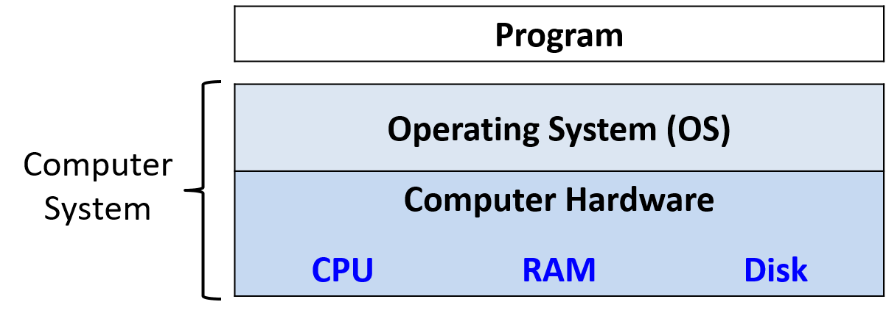
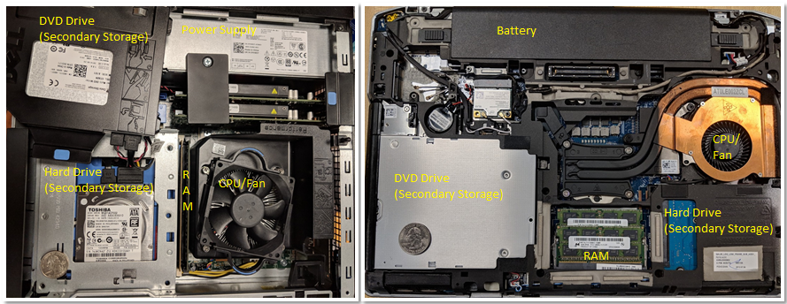
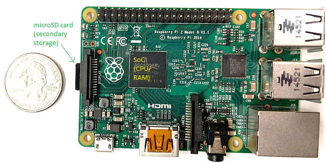
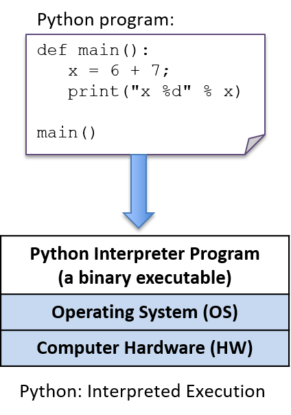
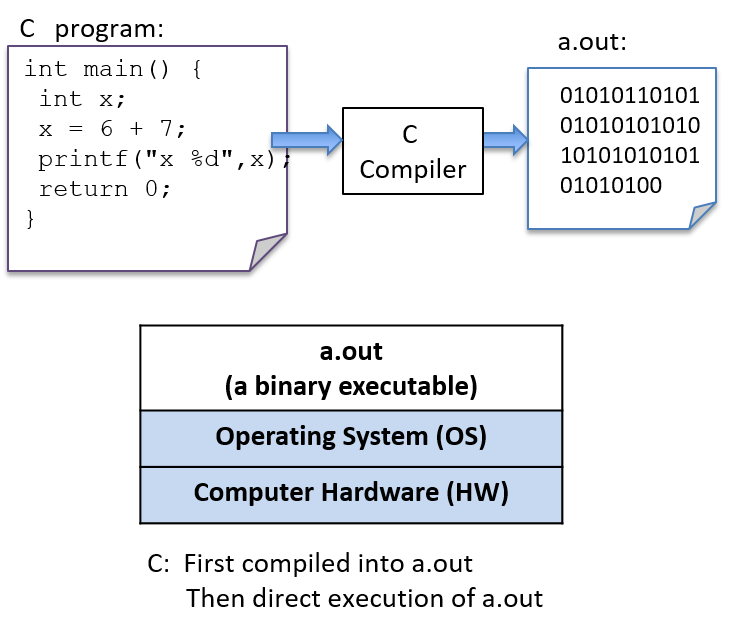

## 0. Introduction

Source: <https://diveintosystems.org/book/introduction.html>

This introduction sets the scope for the whole book:

```text
high-level programs
  -> machine instructions
  -> binary encoding
  -> hardware execution
  -> operating-system management
  -> multicore performance trade-offs
```

The point is practical systems understanding. The book wants you to see how programs actually run, what the operating system is doing for them, and where performance costs come from.

### 0.1. What Is a Computer System?

A computer system is hardware plus system software.

The core pieces are:

- input/output ports
- CPU
- RAM
- secondary storage
- operating system

The first four are the hardware. The operating system is the key software layer that makes the hardware usable, manages resources, and allows multiple programs to run safely and efficiently.



*Figure 1. The layered components of a computer system*

The book narrows the definition of a computer system to machines that are:

- general purpose
- reprogrammable

That is why calculators and microcontrollers are discussed as nearby examples but excluded from the book's main definition.

### 0.2. What Do Modern Computer Systems Look Like?

Modern systems vary in size and packaging, but keep the same basic ingredients.

Desktop and laptop systems contain the same major hardware components, with different physical trade-offs around size, cooling, batteries, RAM modules, and power use.



*Figure 2. Common computer systems: a desktop (left) and a laptop (right) computer*

The same trend continues toward smaller and more integrated devices.



*Figure 3. A Raspberry Pi single-board computer*

The Raspberry Pi is presented as a single-board computer built around a system-on-a-chip. The same integration pattern also appears in smartphones. The important takeaway is that form factors change, but the systems ideas remain the same.

The chapter also previews a central modern reality:

```text
most current computers are multicore systems
  -> multiple CPUs
  -> true parallel execution
```

### 0.3. What You Will Learn In This Book

The book's outcomes cluster into three themes:

- understanding how computers execute programs
- evaluating the systems costs of code
- using multicore hardware effectively

Along the way, the book also builds skill in:

- C programming
- assembly programming
- debugging tools
- computer architecture
- operating systems
- shared-memory parallelism

### 0.4. Getting Started with This Book

This section frames the practical setup for the rest of the text: the language choice, the environment, and how to approach the readings.

### 0.5. Linux, C, and the GNU Compiler

The book uses C because it exposes the machine more directly than many higher-level languages do. The programming environment is Linux with GCC.

Shell commands are written with a leading prompt:

```text
$
```

Example:

```text
$ uname -a
```

Example output:

```text
$ uname -a
Linux Fawkes 4.4.0-171-generic #200-Ubuntu SMP Tue Dec 3 11:04:55 UTC 2019
x86_64 x86_64 x86_64 GNU/Linux
```

Manual pages are introduced early:

```text
$ man uname
```

### 0.6. Other Types of Notation and Callouts

The introduction explains three recurring callout styles used throughout the book.

Aside:

```text
The origins of Linux, GNU, and the Free Open Source Software (FOSS) movement

In 1969, AT&T Bell Labs developed the UNIX operating system for internal use. Although it was initially written in assembly, it was rewritten in C in 1973. Due to an antitrust case that barred AT&T Bell Labs from entering the computing industry, AT&T Bell Labs freely licensed the UNIX operating system to universities, leading to its widespread adoption. By 1984, however, AT&T separated itself from Bell Labs, and (now free from its earlier restrictions) began selling UNIX as a commercial product, much to the anger and dismay of several individuals in academia.

In direct response, Richard Stallman (then a student at MIT) developed the GNU ("GNU is not UNIX") Project in 1984, with the goal of creating a UNIX-like system composed entirely of free software. The GNU project has spawned several successful free software products, including the GNU C Compiler (GCC), GNU Emacs (a popular development environment), and the GNU Public License (GPL, the origin of the "copyleft" principle).

In 1992, Linus Torvalds, then a student at the University of Helsinki, released a UNIX-like operating system that he wrote under the GPL. The Linux operating system (pronounced "Lin-nux" or "Lee-nux" as Linus Torvald's first name is pronounced "Lee-nus") was developed using GNU tools. Today, GNU tools are typically packaged with Linux distributions. The mascot for the Linux operating system is Tux, a penguin. Torvalds was apparently bitten by a penguin while visiting the zoo, and chose the penguin for the mascot of his operating system after developing a fondness for the creatures, which he dubbed as contracting "penguinitis".
```

Note:

```text
How to do the readings in this book

As a student, it is important to do the readings in the textbook. Notice that we say "do" the readings, not simply "read" the readings. To "read" a text typically implies passively imbibing words off a page. We encourage students to take a more active approach. If you see a code example, try typing it in! It's OK if you type in something wrong, or get errors; that's the best way to learn! In computing, errors are not failures - they are simply experience.
```

Warning:

```text
This book contains puns

The authors (especially the first author) are fond of puns and musical parodies related to computing (and not necessarily good ones). Adverse reactions to the authors' sense of humor may include (but are not limited to) eye-rolling, exasperated sighs, and forehead slapping.
```

The section closes with reading-path advice based on prior C experience and a short welcome into the material.

### 0.7. References

- William Shotts, *The Linux Command Line*, LinuxCommand.org

## 1. By the C, the Beautiful C

Source:

- <https://diveintosystems.org/book/C1-C_intro/>
- <https://diveintosystems.org/book/C1-C_intro/getting_started.html>
- <https://diveintosystems.org/book/C1-C_intro/input_output.html>
- <https://diveintosystems.org/book/C1-C_intro/conditionals.html>
- <https://diveintosystems.org/book/C1-C_intro/functions.html>
- <https://diveintosystems.org/book/C1-C_intro/arrays_strings.html>
- <https://diveintosystems.org/book/C1-C_intro/structs.html>
- <https://diveintosystems.org/book/C1-C_intro/summary.html>

Chapter 1 is the book's C on-ramp. It introduces the language features you need before the deeper systems material starts.

```text
variables
  -> input/output
  -> conditionals and loops
  -> functions
  -> arrays and strings
  -> structs
```

The recurring theme is that C gives you familiar programming constructs with much less abstraction than Python or Java. That lower-level model is exactly why the language is useful for systems work.

### 1.1. Getting Started Programming in C

This section contrasts interpreted and compiled execution and introduces basic C syntax, compilation, types, and operators.



*Figure 1. A Python program is directly executed by the Python interpreter, which is a binary executable program that is run on the underlying system (OS and hardware)*



*Figure 2. The C compiler (gcc) builds C source code into a binary executable file (a.out). The underlying system (OS and hardware) directly executes the a.out file to run the program.*

```python
'''
    The Hello World Program in Python
'''

# Python math library
from math import *

# main function definition:
def main():
    # statements on their own line
    print("Hello World")
    print("sqrt(4) is %f" % (sqrt(4)))

# call the main function:
main()
```

```c
/*
    The Hello World Program in C
 */

/* C math and I/O libraries */
#include <math.h>
#include <stdio.h>

/* main function definition: */
int main(void) {
    // statements end in a semicolon (;)
    printf("Hello World\n");
    printf("sqrt(4) is %f\n", sqrt(4));

    return 0;  // main returns value 0
}
```

#### 1.1.1. Compiling and Running C Programs

```text
$ python hello.py
```

```text
$ gcc hello.c
$ ./a.out
```

```text
$ gcc hello.c -lm
```

###### Detailed Steps

```text
$ vim hello.c
```

```text
$ gcc <input_source_file>
```

```text
$ gcc -o <output_executable_file> <input_source_file>
```

```text
$ gcc -o hello hello.c
```

```text
$ ./hello
```

```text
$ gcc -Wall -g -o hello hello.c
```

#### 1.1.2. Variables and C Numeric Types

```text
type_name variable_name;
```

```c
{
    /* 1. Define variables in this block's scope at the top of the block. */

    int x; // declares x to be an int type variable and allocates space for it

    int i, j, k;  // can define multiple variables of the same type like this

    char letter;  // a char stores a single-byte integer value
                  // it is often used to store a single ASCII character
                  // value (the ASCII numeric encoding of a character)
                  // a char in C is a different type than a string in C

    float winpct; // winpct is declared to be a float type
    double pi;    // the double type is more precise than float

    /* 2. After defining all variables, you can use them in C statements. */

    x = 7;        // x stores 7 (initialize variables before using their value)
    k = x + 2;    // use x's value in an expression

    letter = 'A';        // a single quote is used for single character value
    letter = letter + 1; // letter stores 'B' (ASCII value one more than 'A')

    pi = 3.1415926;

    winpct = 11 / 2.0; // winpct gets 5.5, winpct is a float type
    j = 11 / 2;        // j gets 5: int division truncates after the decimal
    x = k % 2;         // % is C's mod operator, so x gets 9 mod 2 (1)
}
```

#### 1.1.3. C Types

```c
8     // the int value 8
3.4   // the double value 3.4
'h'   // the char value 'h' (its value is 104, the ASCII value of h)
```

```c
printf("this is a C string\n");
```

```c
'h'  // this is a char literal value   (its value is 104, the ASCII value of h)
"h"  // this is a string literal value (its value is NOT 104, it is not a char)
```

###### C Numeric Types

```c
int x;           // x is a signed int variable
unsigned int y;  // y is an unsigned int variable
```

```c
printf("number of bytes in an int: %lu\n", sizeof(int));
printf("number of bytes in a short: %lu\n", sizeof(short));
```

```text
number of bytes in an int: 4
number of bytes in a short: 2
```

###### Arithmetic Operators

```text
variable = value of expression;  // e.g., x = 3 + 4;
```

```text
variable op= expression;  // e.g., x += 3; is shorthand for x = x + 3;
```

```text
variable++;  // e.g., x++; assigns to x the value of x + 1
```

```text
Pre- vs. Post-increment

The operators ++variable and variable++ are both valid, but
they’re evaluated slightly differently:

++x: increment x first, then use its value.

x++: use x’s value first, then increment it.

In many cases, it doesn't matter which you use because the value of the
incremented or decremented variable isn't being used in the statement. For
example, these two statements are equivalent (although the first is the most
commonly used syntax for this statement):

In some cases, the context affects the outcome (when the value of the incremented
or decremented variable is being used in the statement).  For example:

Code like the preceding example that uses an arithmetic expression with an
increment operator is often hard to read, and it’s easy to get wrong.  As a
result, it’s generally best to avoid writing code like this; instead, write
separate statements for exactly the order you want.  For example, if you want
to first increment x and then assign x + 1 to y, just write it as two separate
statements.

Instead of writing this:

write it as two separate statements:
```

```c
x++;
++x;
```

```c
x = 6;
y = ++x + 2;  // y is assigned 9: increment x first, then evaluate x + 2 (9)

x = 6;
y = x++ + 2;  // y is assigned 8: evaluate x + 2 first (8), then increment x
```

```c
y = ++x + 1;
```

```c
x++;
y = x + 1;
```

### 1.2. Input/Output (printf and scanf)

This section introduces C's standard terminal I/O functions for formatted output and user input.

#### 1.2.1. printf

Table 1. Syntax Comparison of Printing in Python and C

Python version

```python
# Python formatted print example


def main():

    print("Name: %s,  Info:" % "Vijay")
    print("\tAge: %d \t Ht: %g" %(20,5.9))
    print("\tYear: %d \t Dorm: %s" %(3, "Alice Paul"))

# call the main function:
main()
```

C version

```c
/* C printf example */
#include <stdio.h> // needed for printf

int main(void) {

    printf("Name: %s,  Info:\n", "Vijay");
    printf("\tAge: %d \t Ht: %g\n",20,5.9);
    printf("\tYear: %d \t Dorm: %s\n",
            3,"Alice Paul");

    return 0;
}
```

```text
Name: Vijay,  Info:
	Age: 20 	 Ht: 5.9
	Year: 3 	 Dorm: Alice Paul
```

```text
%g:  placeholder for a float (or double) value
%d:  placeholder for a decimal value (int, short, char)
%s:  placeholder for a string value
```

```c
// Example printing a char value as its decimal representation (%d)
// and as the ASCII character that its value encodes (%c)

char ch;

ch = 'A';
printf("ch value is %d which is the ASCII value of  %c\n", ch, ch);

ch = 99;
printf("ch value is %d which is the ASCII value of  %c\n", ch, ch);
```

```text
ch value is 65 which is the ASCII value of  A
ch value is 99 which is the ASCII value of  c
```

#### 1.2.2. scanf

Table 2. Comparison of Methods for Reading Input Values in Python and C

Python version

```python
# Python input example


def main():


    num1 = input("Enter a number:")
    num1 = int(num1)
    num2 = input("Enter another:")
    num2 = int(num2)

    print("%d + %d = %d" % (num1, num2, (num1+num2)))

# call the main function:
main()
```

C version

```c
/* C input (scanf) example */
#include <stdio.h>

int main(void) {
    int num1, num2;

    printf("Enter a number: ");
    scanf("%d", &num1);
    printf("Enter another: ");
    scanf("%d", &num2);

    printf("%d + %d = %d\n", num1, num2, (num1+num2));

    return 0;
}
```

```text
Enter a number: 30
Enter another: 67
30 + 67 = 97
```

`scanf_ex.c`

```c
int x;
float pi;

// read in an int value followed by a float value ("%d%g")
// store the int value at the memory location of x (&x)
// store the float value at the memory location of pi (&pi)
scanf("%d%g", &x, &pi);
```

```text
          8                   3.14
```
