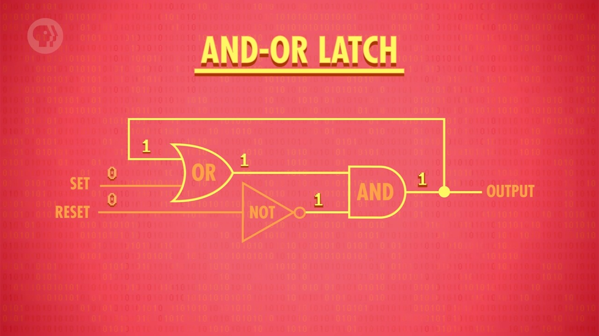
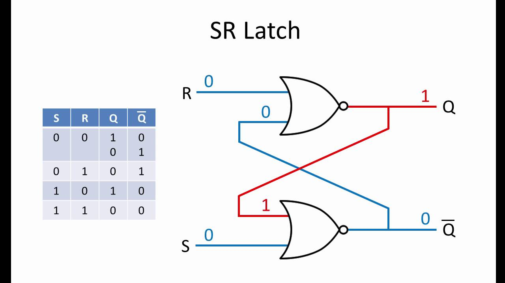
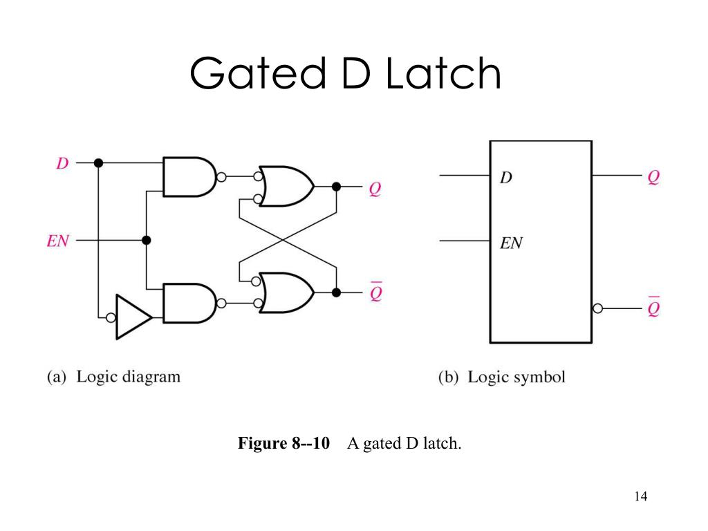

# From Gates To Memory: Latches, Flip-Flops, And The DFF

Chapter 3 of Nand2Tetris begins with a new kind of chip: the Data Flip-Flop, or `DFF`. 

Before this point, all the chips we built (AND, OR, NOT, multiplexers, ALUs) are **combinational**. A combinational chip has no memory: its outputs are determined purely by its current inputs. If inputs change, the outputs change. The chip has no concept of what happened earlier.

Memory requires a different idea: preserving information across time. To understand how that is possible, we need to climb one abstraction ladder that bridges the basic gates from Chapters 1 and 2 to the clocked sequential elements of Chapter 3:

```text
gates -> feedback loops -> SR latch -> gated D latch -> D flip-flop (DFF)
```

Nand2Tetris treats the `DFF` as a primitive. This deep dive explains how we construct the DFF from basic gates.

---

## 1. Feedback & The AND-OR Latch

The simplest way for a circuit to remember a value is to feed its output back into its own input. 

In a combinational circuit, information flows in one direction:

```text
inputs ──► [ logic gates ] ──► output
```

With feedback, the output wire is connected back into the input of a gate:

```text
                   ┌──────────────┐
external input ───►│  logic gate  ├─► output (Q)
               ┌──►│              │     │
               │   └──────────────┘     │
               └────────────────────────┘
```

Because physical gates have tiny propagation delays, the output does not change infinitely many times at once. We model this feedback loop using discrete step notation: the output state at the current interval $t$ depends on the feedback value from the previous interval $t-1$.

### Notation Definition
- $t$: The current timing step.
- $Q(t)$: The state (output value) at the current step.
- $Q(t-1)$: The previous state fed back into the inputs.
- $set$: A control input that can force the output state to $1$.
- $keep$: A control input that decides whether the stored value survives.

### OR Gate with Feedback
If we connect the output of an OR gate back to one of its inputs:

$$Q(t) = set \text{ OR } Q(t-1)$$

Meaning:
The output state $Q(t)$ is high if the external control input $set$ is high now, OR if the output was already high at the previous step $Q(t-1)$.

| set | Q(t-1) | Q(t) | Meaning |
|---|---|---|---|
| 0 | 0 | 0 | hold 0 |
| 0 | 1 | 1 | hold 1 |
| 1 | 0 | 1 | set to 1 |
| 1 | 1 | 1 | stay 1 |

Trace:
1. Start with $Q(0) = 0$.
2. At $t=1$, we set $set = 1$. The gate computes:
   $$Q(1) = 1 \text{ OR } Q(0) = 1 \text{ OR } 0 = 1$$
3. At $t=2$, we set $set = 0$. The gate computes:
   $$Q(2) = 0 \text{ OR } Q(1) = 0 \text{ OR } 1 = 1$$
4. The output remains locked at $1$ indefinitely. The $1$ keeps itself alive.

However, once the circuit stores $1$, there is no way to reset it to $0$. No value of $set$ can force $Q(t)$ to $0$ because the feedback loop is locked.

### AND Gate with Feedback
If we connect the output of an AND gate back to one of its inputs:

$$Q(t) = keep \text{ AND } Q(t-1)$$

Meaning:
The output state $Q(t)$ remains high only if the control input $keep$ is high now, AND the previous state $Q(t-1)$ was high.

| keep | Q(t-1) | Q(t) | Meaning |
|---|---|---|---|
| 1 | 0 | 0 | hold 0 |
| 1 | 1 | 1 | hold 1 |
| 0 | 0 | 0 | stay 0 |
| 0 | 1 | 0 | reset to 0 |

Trace:
1. Start with $Q(0) = 1$.
2. At $t=1$, we set $keep = 1$. The gate computes:
   $$Q(1) = 1 \text{ AND } Q(0) = 1 \text{ AND } 1 = 1$$
3. At $t=2$, we drop $keep = 0$. The gate computes:
   $$Q(2) = 0 \text{ AND } Q(1) = 0 \text{ AND } 1 = 0$$
4. At $t=3$, we set $keep = 1$. The gate computes:
   $$Q(3) = 1 \text{ AND } Q(2) = 1 \text{ AND } 0 = 0$$
5. The output remains locked at $0$. Once the state drops to $0$, no value of $keep$ can restore it to $1$.

### The Combined AND-OR Latch
To build a fully functional 1-bit memory cell, we must combine these two patterns:
- The OR feedback provides the ability to force $1$ (Set).
- The AND feedback provides the ability to force $0$ (Reset).

By nesting these loops, we obtain the state equation of the AND-OR Latch:

$$Q(t) = (Q(t-1) \text{ OR } set) \text{ AND } keep$$

Meaning:
To calculate the current output $Q(t)$, we first OR the previous state $Q(t-1)$ with the external $set$ signal, and then AND that result with the $keep$ signal.

| set | keep | Q(t) | Operation |
|---|---|---|---|
| 0 | 1 | Q(t-1) | Hold state |
| 1 | 1 | 1 | Set to 1 |
| 0 | 0 | 0 | Reset to 0 |
| 1 | 0 | 0 | Reset wins |

This circuit provides the three basic memory operations: Set, Reset, and Hold.



---

## 2. The SR Latch

A standard, symmetric way to implement Set-Reset storage in hardware is by cross-coupling two NOR gates.



### Physical Picture
The SR Latch consists of two identical NOR gates arranged in a symmetric feedback loop:
- The output of Gate 1 ($Q$) is wired directly to one input of Gate 2.
- The output of Gate 2 ($\bar{Q}$, or $not\ Q$) is wired directly to one input of Gate 1.
- Input $R$ (Reset) is the external input of Gate 1.
- Input $S$ (Set) is the external input of Gate 2.

### Notation Definition
- $S$: Set input pin.
- $R$: Reset input pin.
- $Q(t)$: Primary output state.
- $\bar{Q}(t)$: Complementary output state (satisfies $\bar{Q}(t) = \text{NOT } Q(t)$ in stable operation).

NOR gate behavior dictates that a NOR output is $1$ if and only if both inputs are $0$. The cross-coupled state equations are:

$$Q(t) = \text{NOR}(R, \bar{Q}(t-1))$$

$$\bar{Q}(t) = \text{NOR}(S, Q(t-1))$$

### Step-by-Step Voltage Propagation Traces

#### Set Operation ($S = 1, R = 0$, starting from state $Q = 0, \bar{Q} = 1$):
1. Initially, Gate 1 outputs $Q = 0$, and Gate 2 outputs $\bar{Q} = 1$.
2. The external Set pin rises: $S \to 1$.
3. Gate 2 evaluates its inputs ($S=1, Q=0$):
   $$\bar{Q} = \text{NOR}(1, 0) = 0$$
4. The output pin $\bar{Q}$ drops to $0$.
5. This new value ($0$) propagates along the feedback wire to the input of Gate 1.
6. Gate 1 evaluates its inputs ($R=0, \bar{Q}=0$):
   $$Q = \text{NOR}(0, 0) = 1$$
7. The output pin $Q$ rises to $1$.
8. The output $Q=1$ propagates to Gate 2. Gate 2 outputs $\text{NOR}(S=1, Q=1) = 0$. The loop settles into a stable state: $Q = 1, \bar{Q} = 0$.

#### Reset Operation ($S = 0, R = 1$, starting from state $Q = 1, \bar{Q} = 0$):
1. Initially, Gate 1 outputs $Q = 1$, and Gate 2 outputs $\bar{Q} = 0$.
2. The external Reset pin rises: $R \to 1$.
3. Gate 1 evaluates its inputs ($R=1, \bar{Q}=0$):
   $$Q = \text{NOR}(1, 0) = 0$$
4. The output pin $Q$ drops to $0$.
5. This new value ($0$) propagates along the feedback wire to the input of Gate 2.
6. Gate 2 evaluates its inputs ($S=0, Q=0$):
   $$\bar{Q} = \text{NOR}(0, 0) = 1$$
7. The output pin $\bar{Q}$ rises to $1$.
8. The output $\bar{Q}=1$ propagates back to Gate 1. Gate 1 outputs $\text{NOR}(R=1, \bar{Q}=1) = 0$. The loop settles into a stable state: $Q = 0, \bar{Q} = 1$.

#### Hold Operation ($S = 0, R = 0$):
1. The external inputs are held at zero: $S = 0, R = 0$.
2. If $Q = 1, \bar{Q} = 0$:
   - Gate 1 evaluates ($R=0, \bar{Q}=0$): $Q = \text{NOR}(0, 0) = 1$.
   - Gate 2 evaluates ($S=0, Q=1$): $\bar{Q} = \text{NOR}(0, 1) = 0$.
3. If $Q = 0, \bar{Q} = 1$:
   - Gate 1 evaluates ($R=0, \bar{Q}=1$): $Q = \text{NOR}(0, 1) = 0$.
   - Gate 2 evaluates ($S=0, Q=0$): $\bar{Q} = \text{NOR}(0, 0) = 1$.
4. The outputs are stable and reinforce each other. The latch holds its state indefinitely.

### The Invalid Case ($S=1, R=1$)
If both Set and Reset are asserted simultaneously:
- Gate 1 outputs $Q = \text{NOR}(R=1, \bar{Q}) = 0$.
- Gate 2 outputs $\bar{Q} = \text{NOR}(S=1, Q) = 0$.

Both outputs are forced to $0$, violating the expectation that $Q = \text{NOT } \bar{Q}$. 

The critical problem occurs when the inputs return to $0$ at the exact same moment ($S: 1 \to 0, R: 1 \to 0$):
1. Both gates now see $0$ on their external inputs and $0$ on their feedback inputs (since both outputs were $0$).
2. Both gates attempt to output $\text{NOR}(0, 0) = 1$.
3. As both outputs rise to $1$, they feed $1$ back to the opposite gates.
4. Both gates now see $1$ on their feedback inputs and try to output $\text{NOR}(0, 1) = 0$.
5. This causes the outputs to oscillates back and forth. In physical hardware, small differences in wire length or gate speed (thermal noise, manufacturing variations) break the symmetry, causing the latch to settle randomly into either $Q=1$ or $Q=0$. This is an unpredictable race condition.

---

## 3. The Gated D Latch

The Gated D Latch adds control logic in front of the SR latch to eliminate the invalid state and control when data can be written.



### Notation Definition
- $D$: Data input pin.
- $enable$ or $E$: Write enable control pin (level-sensitive).
- $S^*$: Internal Set signal routed to the core latch.
- $R^*$: Internal Reset signal routed to the core latch.
- $Q(t)$: Output state at time step $t$.

### Gating Architectures

#### 1. Gated NOR Latch (AND Steering Gates + Active-High NOR Latch)
In a NOR-based gated D latch, two AND gates steer the inputs:

$$S^* = D \text{ AND } enable$$

$$R^* = \text{NOT}(D) \text{ AND } enable$$

Since $D$ and $\text{NOT}(D)$ are complementary, they can never be $1$ at the same time. Thus, $S^*$ and $R^*$ can never both be $1$, preventing the invalid state by design.

#### 2. Gated NAND Latch (NAND Steering Gates + Active-Low NAND Latch)
The diagram in `media/gated-d-latch.jpg` shows a **NAND-gate-based Gated D Latch**:
- Input Gate A (top): $S^* = \text{NAND}(D, enable) = \text{NOT}(D \text{ AND } enable)$.
- Input Gate B (bottom): $R^* = \text{NAND}(\text{NOT}(D), enable) = \text{NOT}(\text{NOT}(D) \text{ AND } enable)$.
- The core latch is an active-low NAND-based SR latch where a $0$ input asserts the state:
  - $Q(t) = \text{NAND}(S^*, \bar{Q}(t-1))$
  - $\bar{Q}(t) = \text{NAND}(R^*, Q(t-1))$

#### NAND Latch Gating Analysis:
- **Enable is Low ($enable = 0$)**:
  - $S^* = \text{NAND}(D, 0) = 1$.
  - $R^* = \text{NAND}(\bar{D}, 0) = 1$.
  - The active-low core NAND latch receives $1, 1$. This is the hold state:
    $$Q(t) = \text{NAND}(1, \bar{Q}(t-1)) = \text{NOT}(\bar{Q}(t-1)) = Q(t-1)$$
    The latch is isolated from changes on $D$.
- **Enable is High ($enable = 1$)**:
  - **If $D = 1$**:
    - $S^* = \text{NAND}(1, 1) = 0$.
    - $R^* = \text{NAND}(0, 1) = 1$.
    - The core latch receives $S^* = 0$ (assert Set) and $R^* = 1$ (deassert Reset):
      $$Q = \text{NAND}(0, \bar{Q}) = 1$$
      $$\bar{Q} = \text{NAND}(1, Q=1) = 0$$
      The output settles to $Q = 1, \bar{Q} = 0$.
  - **If $D = 0$**:
    - $S^* = \text{NAND}(0, 1) = 1$.
    - $R^* = \text{NAND}(1, 1) = 0$.
    - The core latch receives $S^* = 1$ and $R^* = 0$ (assert Reset):
      $$\bar{Q} = \text{NAND}(0, Q) = 1$$
      $$Q = \text{NAND}(1, \bar{Q}=1) = 0$$
      The output settles to $Q = 0, \bar{Q} = 1$.

### Level-Sensitive Transparency
A D latch is level-sensitive. When $enable = 1$, the latch is transparent: the output $Q$ tracks the input $D$ directly. 

#### Step-by-Step Transparency Trace:
1. Initialize with $enable = 1, D = 0 \implies Q = 0$.
2. Input wiggles: $D \to 1$. Top gate outputs $S^* = 0$, forcing $Q \to 1$ immediately.
3. Input wiggles: $D \to 0$. Bottom gate outputs $R^* = 0$, forcing $Q \to 0$ immediately.
4. Input wiggles: $D \to 1 \implies Q \to 1$.
5. The enable signal drops: $enable \to 0$.
6. Input wiggles: $D \to 0$. Since $enable = 0$, the input gates output $S^* = 1, R^* = 1$.
7. The output $Q$ remains stable at $1$. It is no longer transparent.

#### The Hazard of Transparency
In complex processors, data outputs from one latch flow through combinational logic to the inputs of other latches. If all latches are transparent at the same time, signals will race through multiple stages within a single cycle. This makes it impossible to synchronize steps. 

To prevent this race condition, we must coordinate state updates with a clock signal to achieve edge-triggered behavior.

---

## 4. The D Flip-Flop

The Data Flip-Flop (DFF) is edge-triggered. It samples its input data $D$ only at the rising edge ($0 \to 1$) of the clock signal, holding that value constant until the next rising edge.

### Master-Slave Configuration
A standard way to build a rising-edge-triggered DFF is by cascading two Gated D Latches in a Master-Slave arrangement:

```text
               clock_inverted (enable_M)
                      |
D input ──► [ Master Gated Latch ] ──► QM ──► [ Slave Gated Latch ] ──► Q output
                                                     |
                                                clock (enable_S)
```

- **Master Latch**: Controlled by the inverted clock signal ($enable_M = \text{NOT}(Clock)$).
- **Slave Latch**: Controlled by the direct clock signal ($enable_S = Clock$).

### Step-by-Step Clock Transition Trace:

#### Phase 1: Clock is Low ($Clock = 0$)
- Inverted clock is high: $enable_M = 1$. The Master Latch is transparent. Its output $Q_M$ tracks the external input $D$.
- Direct clock is low: $enable_S = 0$. The Slave Latch is closed. The final output $Q$ holds its previous value $Q(t-1)$ and is isolated from any changes on $D$.

#### Phase 2: The Rising Edge ($Clock: 0 \to 1$)
- The inverted clock drops: $enable_M \to 0$. The Master Latch closes instantly. It captures and stores the state of $D$ at that exact moment:
  $$Q_M = D_{\text{edge}}$$
- The direct clock rises: $enable_S \to 1$. The Slave Latch opens and becomes transparent. It copies the stable value stored in the master ($Q_M$) to the final output:
  $$Q = Q_M = D_{\text{edge}}$$
- The output $Q$ updates to the value sampled at the clock edge.

#### Phase 3: Clock is High ($Clock = 1$)
- Inverted clock is low: $enable_M = 0$. The Master Latch remains closed, isolating $Q_M$ from any further changes or wiggles on $D$.
- Direct clock is high: $enable_S = 1$. The Slave Latch remains transparent, continuing to output the stable value of $Q_M$.
- As a result, the output $Q$ is locked at $D_{\text{edge}}$ for the entire high phase of the clock.

This Master-Slave loop provides edge-triggered storage. The output updates once per cycle, at the clock edge.

### Behavioral Rule
Nand2Tetris abstracts this implementation as the primitive sequential operation:

$$out(t) = in(t-1)$$

Meaning:
The output of the DFF at the current clock cycle $t$ is exactly the value that was present at its input at the end of the previous clock cycle $t-1$.


### Side-by-Side Comparison

| Feature | SR Latch | Gated D Latch | D Flip-Flop (DFF) |
|---|---|---|---|
| **Control Signal** | Direct Level ($S, R$) | Level-Sensitive Enable ($E$) | Edge-Triggered Clock ($CLK$) |
| **Data Sampled** | Continuous when inputs active | Continuous while $E = 1$ (transparent) | At the rising clock edge ($0 \to 1$) |
| **Invalid State** | Yes ($S=1, R=1$) | No (prevented by input steering) | No (prevented by design) |
| **Feedback Role** | Basic bi-stable element | Level-controlled store | Synchronous 1-cycle delay |

---

### Physical Realities and Perspectives
Although the logical transition from basic NAND/NOR gates to the DFF is elegant, modern computer architectures optimize physical memory at the transistor level. Alternative solid-state technologies (such as DRAM capacitors, SRAM transistors, and floating-gate flash cells) are used to balance cost, speed, volatile versus non-volatile storage, and cache hierarchies. For a broader look at these engineering trade-offs, see the [NOTES.md (Section 3.6 Perspectives)](NOTES.md#36-perspective) notes.
