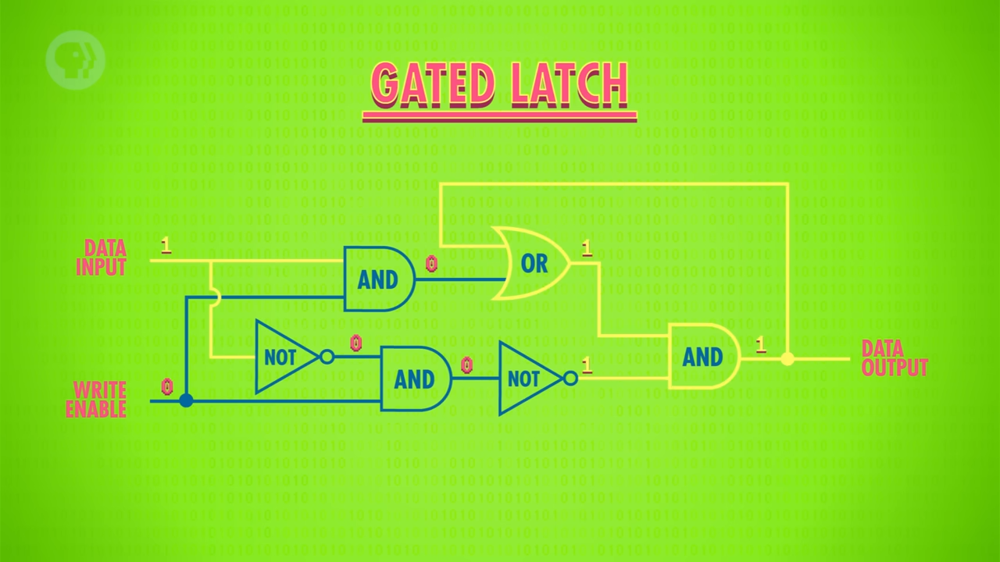

# DFF Deep Dive: From Feedback To Flip-Flops

This note is self-contained. You do not need the Crash Course Computer Science notes open beside it. The goal is to explain the missing bridge between ordinary logic gates and the `DFF` primitive used in Nand2Tetris Chapter 3.

Nand2Tetris starts Chapter 3 by saying that memory devices are built from a primitive gate called a Data Flip-Flop, or `DFF`. The book intentionally does not show how a `DFF` is built internally. It treats `DFF` the same way Chapter 1 treated `Nand`: as a given low-level building block.

That is good for building the computer, but it can feel like a conceptual jump. This note fills that gap.

The full ladder is:

```text
feedback -> SR latch -> gated latch -> D latch -> D flip-flop -> Bit -> Register -> RAM
```

The six core steps are:

```text
1. Feedback means a circuit can remember.
2. An SR latch can set, reset, or hold one bit.
3. A gated latch adds write control.
4. A D latch gives one safe data input.
5. A clock coordinates when state changes.
6. A D flip-flop samples data only at a clock edge.
```

## 1. Feedback Means A Circuit Can Remember

In Chapters 1 and 2, most chips are combinational circuits.

A combinational circuit has no memory. Its output depends only on its current inputs.

```text
current inputs -> logic gates -> current output
```

Example:

```text
And(a, b) = a AND b
```

If `a` or `b` changes, the output changes. The chip does not remember what `a` or `b` used to be.

Memory requires a different idea: feedback.

Feedback means the output of a circuit is routed back into the circuit as one of its future inputs.

```text
        +-------+
input ->| logic |-> output
        +-------+     |
            ^         |
            |_________|
```

Now the output can depend on two things:

- the current external input
- the previous output that was fed back

That previous output is state.

State means: the circuit has a condition that persists over time.


### Simple Feedback Intuition

Imagine this informal circuit:

```text
new output = input OR old output
```

If `old output` is `0` and `input` becomes `1`, the new output becomes `1`.

Then, even if `input` goes back to `0`, the circuit still sees:

```text
new output = 0 OR old output
new output = 0 OR 1
new output = 1
```

The `1` keeps itself alive through feedback.

This is not yet a good computer memory cell, because once it becomes `1`, it cannot easily be reset. But it shows the important idea: feedback can preserve information.

### Bistable State

A useful memory element must be bistable.

`Bistable` means it has two stable states:

```text
stable 0
stable 1
```

If it is in state `0`, it tends to remain `0` until forced to change.

If it is in state `1`, it tends to remain `1` until forced to change.

That is exactly what one bit of memory needs.

## 2. SR Latch: Set, Reset, Hold

The first practical one-bit memory circuit is usually explained as an `SR latch`.

`SR` means:

- `S` = set
- `R` = reset

The latch stores one bit. Its output is usually called `Q`.

```text
          +----------+
S ------->|          |----> Q
R ------->| SR latch |
          |          |----> NOT Q
          +----------+
```

The simplified behavior is:

| S | R | Next Q |
|---|---|--------|
| 0 | 0 | keep old Q |
| 1 | 0 | 1 |
| 0 | 1 | 0 |
| 1 | 1 | invalid / ambiguous |

The key row is the first one:

```text
S = 0 and R = 0 -> keep old Q
```

That is memory. When the latch is not being told to set or reset, it holds its previous value.

### Why The Invalid Case Exists

The `S = 1, R = 1` case is invalid because it asks the latch to do two contradictory things at once:

```text
set Q to 1
reset Q to 0
```

Real latch implementations differ in the exact electrical result, but as a logical abstraction this input combination should be avoided.

So the SR latch gives us memory, but the interface is awkward. The caller must carefully avoid activating set and reset at the same time.

## 3. Gated Latch: Add A Write Enable

A raw SR latch changes whenever its control inputs tell it to change. A computer memory cell needs stronger control.

Usually we want this behavior:

```text
if write is active:
    store the new value
else:
    keep the old value
```

This is where a gated latch comes in.

A gated latch adds a control input usually called one of these:

- `enable`
- `write`
- `load`

They mean the same basic thing: allow the stored value to change.

```text
               +-------------+
data --------->|             |----> Q
enable ------->| gated latch |
               +-------------+
```



The behavior is:

| enable | data | Next Q |
|--------|------|--------|
| 0 | 0 | keep old Q |
| 0 | 1 | keep old Q |
| 1 | 0 | 0 |
| 1 | 1 | 1 |

The enable input separates two questions:

- What value would I like to store? That is `data`.
- Am I allowed to store it now? That is `enable`.

This is already very close to Nand2Tetris's `Bit` chip idea:

```text
if load:
    out becomes in
else:
    out stays the same
```

But a basic gated latch is still level-sensitive. That means it can keep changing while `enable` is active. We will return to this problem in step 5.

## 4. D Latch: One Safe Data Input

A `D latch` is a safer and cleaner version of a gated latch.

`D` means data.

Instead of giving the outside world separate `S` and `R` inputs, the D latch exposes one data input:

```text
D = the bit I want to store
```

It also exposes one enable input:

```text
enable = whether the latch is allowed to copy D
```

The output is:

```text
Q = the currently stored bit
```


Source: Wikimedia Commons, `D-Type_Transparent_Latch.svg`, rendered locally as PNG.

Internally, the D latch converts `D` into safe set/reset signals:

```text
S = enable AND D
R = enable AND NOT(D)
```

That gives this behavior:

| enable | D | S | R | Next Q |
|--------|---|---|---|--------|
| 0 | 0 | 0 | 0 | keep old Q |
| 0 | 1 | 0 | 0 | keep old Q |
| 1 | 0 | 0 | 1 | 0 |
| 1 | 1 | 1 | 0 | 1 |

Notice what disappeared: the invalid `S = 1, R = 1` case.

Why?

Because `D` and `NOT(D)` cannot both be `1` at the same time.

```text
if D = 1, then NOT(D) = 0
if D = 0, then NOT(D) = 1
```

So the D latch gives us a clean one-bit storage interface:

```text
enable = 0 -> hold old value
enable = 1 -> copy D into Q
```

### The Important Problem: Transparency

A D latch is normally level-sensitive.

That means:

```text
while enable = 1:
    Q follows D

while enable = 0:
    Q holds its previous value
```

When `enable = 1`, the latch is called transparent.

Transparent means changes on `D` pass through to `Q`.

Example:

```text
enable = 1
D changes 0 -> 1 -> 0 -> 1
Q changes 0 -> 1 -> 0 -> 1
```

That is fine for some circuits. But it is dangerous in a whole computer, because many memory elements and logic gates are connected together. If too many latches are transparent at the same time, values can race through several layers during one clock period.

This is why we need clocked behavior.

## 5. Clocking: Coordinate When State Changes

A computer is not just one latch. It is many memory elements connected through many combinational circuits.

At a high level, one machine cycle looks like this:

```text
old state -> combinational logic computes -> new state is stored
```

For this to be reliable, the machine needs agreement about when storage updates happen.

That agreement is provided by a clock.

The clock divides time into discrete cycles:

```text
cycle 0 | cycle 1 | cycle 2 | cycle 3 | cycle 4
```

Nand2Tetris models time as a sequence of clock cycles. During a cycle, combinational chips compute. At the boundary between cycles, sequential chips update their stored state.


The point of the clock is not only speed. The point is coordination.

Without a clock discipline, different parts of the circuit may update at different moments, and then it becomes hard to say what the machine's state actually is.

With a clock discipline, we can reason like this:

```text
At time t:
    memory outputs the old state

During the cycle:
    combinational logic computes from that old state

At time t + 1:
    memory captures the new state
```

This is the central idea of sequential logic.

### Why A Plain D Latch Is Not Enough

If a latch is transparent for a whole interval, then `Q` can change any time during that interval.

For a small circuit this can be okay. For a CPU, this is harder to reason about.

We usually want a sharper abstraction:

```text
The memory updates once, at a precise clock edge.
```

That sharper abstraction is the D flip-flop.

## 6. D Flip-Flop: Sample On The Clock Edge

A `D flip-flop`, or `DFF`, stores one bit like a D latch, but it updates only at a clock edge.

An edge is the instant when the clock changes:

```text
low -> high   rising edge
high -> low   falling edge
```

Most simplified explanations use the rising edge, but the idea is the same for either edge.

The DFF behavior is:

```text
at the clock edge:
    Q becomes D

between clock edges:
    Q stays unchanged
```

Nand2Tetris describes this with a one-cycle delay:

```text
out(t) = in(t - 1)
```

Meaning:

```text
The input seen in the previous cycle becomes the output in the current cycle.
```


This is the abstraction that Chapter 3 needs.

The DFF turns a changing input signal into a stable stored output signal for the next cycle.

### D Latch Versus DFF

| Device | Control | When Q can change | Mental model |
|--------|---------|-------------------|--------------|
| D latch | enable level | while enable is active | transparent storage |
| DFF | clock edge | only at the edge | sampled storage |

The difference is not the value being stored. Both store a bit.

The difference is timing.

```text
D latch:
    Q may follow D for as long as enable = 1

DFF:
    Q samples D once at the clock edge, then holds
```

That timing difference is why Nand2Tetris uses `DFF` as the primitive for memory.

## How This Maps To Nand2Tetris Chapter 3

Nand2Tetris Chapter 3 starts with this primitive:

```text
DFF(in, out)
out(t) = in(t - 1)
```

Then it builds the memory hierarchy upward.


The hierarchy is:

```text
DFF -> Bit -> Register -> RAM8 -> RAM64 -> RAM512 -> RAM4K -> RAM16K -> PC
```

Each layer adds structure or control around the previous layer.

### DFF To Bit

A raw `DFF` always captures its input every cycle.

But a useful memory bit needs a `load` control:

```text
if load = 1:
    store the new input
else:
    keep the old stored value
```

Nand2Tetris builds this by putting a `Mux` before the `DFF`.

```text
                    +-----+
old output -------->|     |
new input --------->| Mux |----> DFF ----> output
load -------------->|     |
                    +-----+
```

If `load = 0`, the mux feeds the old output back into the `DFF`.

```text
next input to DFF = old output
```

So the bit keeps its value.

If `load = 1`, the mux feeds the external input into the `DFF`.

```text
next input to DFF = new input
```

So the bit updates at the next clock transition.

This is the Nand2Tetris version of controlled storage.

### Bit To Register

A `Bit` stores one bit.

A 16-bit `Register` stores sixteen bits side by side:

```text
Bit 0
Bit 1
Bit 2
...
Bit 15
```


All sixteen bits share the same `load` signal.

So when `load = 1`, the whole 16-bit word updates.

When `load = 0`, the whole 16-bit word holds its old value.

### Register To RAM

RAM is many registers plus addressing.

The address tells the RAM which register you want.

For example, `RAM8` contains eight registers. A 3-bit address selects one of them:

```text
000 -> register 0
001 -> register 1
010 -> register 2
011 -> register 3
100 -> register 4
101 -> register 5
110 -> register 6
111 -> register 7
```

Loading RAM requires two ideas:

- route the input value to all registers
- use the address to decide which register receives `load = 1`

Reading RAM also uses the address:

- all registers have stored values
- the address selects which stored value appears at the output

So RAM is not a totally new kind of memory. It is organized registers.

### RAM To PC

The `PC`, or Program Counter, is a special register used by the CPU to remember which instruction should run next.

It needs more behavior than a plain register:

```text
reset to 0
load a specific address
increment by 1
hold current value
```

But underneath, it is still built from the same sequential idea: store state across clock cycles.

## Timing Details Worth Knowing

Nand2Tetris abstracts away the electrical timing details. For the projects, this is enough:

```text
DFF output in this cycle equals DFF input from the previous cycle.
```

For deeper understanding, these real hardware concepts matter.

### Propagation Delay

Logic gates do not update instantly.

If an input changes, the output changes slightly later.

That delay is called propagation delay.

```text
input changes -> tiny delay -> output changes
```

### Setup Time

A flip-flop needs its `D` input to be stable shortly before the clock edge.

That required stable period is setup time.

```text
D must already be valid before the edge arrives
```

### Hold Time

A flip-flop also needs its `D` input to remain stable briefly after the clock edge.

That required stable period is hold time.

```text
D must not change immediately after the edge
```

### Metastability

If setup or hold rules are violated, a flip-flop can enter a temporary undecided state.

It may not immediately settle into a clean `0` or `1`.

That condition is called metastability.

Nand2Tetris does not make you deal with metastability. It gives you an ideal `DFF` so you can focus on architecture.

## The Essential Mental Model

Keep these four sentences:

```text
A latch remembers because feedback preserves a previous output.
A D latch copies D while enable is active and holds when enable is inactive.
A DFF copies D only at a clock edge and holds between edges.
Nand2Tetris uses DFF as the primitive so all memory updates cleanly once per cycle.
```

And keep this hierarchy in mind:

```text
feedback
  -> latch
  -> D latch
  -> DFF
  -> Bit
  -> Register
  -> RAM
  -> computer state
```

That is the conceptual bridge from gates to memory.
