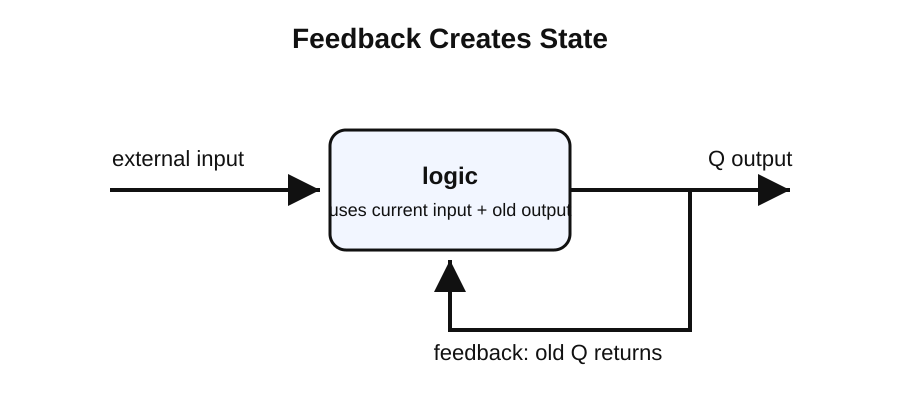
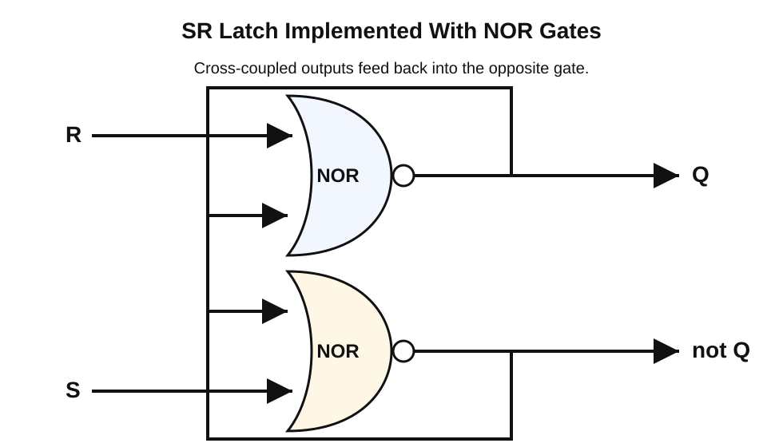
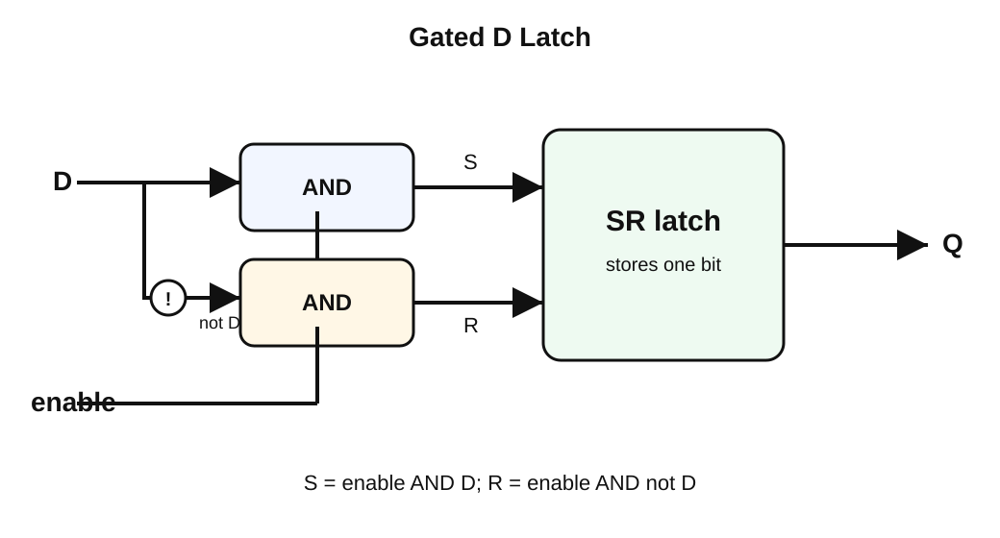

# From Gates To Memory: Latches, Flip-Flops, And The DFF

Chapter 3 of Nand2Tetris begins with a new kind of chip: the Data Flip-Flop, or `DFF`.

Before this point, the chips are combinational. A combinational chip has no memory: its output is determined only by its current inputs. If the inputs change, the output changes. The chip has no concept of what happened earlier.

Memory requires a different idea. A memory chip must preserve information across time. To understand how that is possible, we need to climb one abstraction ladder:

```text
feedback -> latch -> SR latch -> gated D latch -> D flip-flop -> Bit -> Register -> RAM
```

Nand2Tetris intentionally starts at `DFF` and treats it as primitive. This note explains the missing internal story so the primitive feels less magical.

## 1. Feedback

The simplest way for a circuit to remember something is to feed its output back into itself.

In an ordinary combinational circuit, information flows in one direction:

```text
inputs -> logic -> output
```

With feedback, the output becomes part of the next input:

```text
external input -> logic -> output
                    ^        |
                    |________|
```

This changes the meaning of the circuit. The output can now depend on two things:

- the current external input
- the previous output

That previous output is state.

State means a system has a condition that persists over time.



Consider this simple equation:

```text
next Q = input OR old Q
```

`Q` is the stored output.

If `old Q = 0` and `input = 1`, then:

```text
next Q = 1 OR 0 = 1
```

Now suppose `input` goes back to `0`. The circuit still has the old output feeding back:

```text
next Q = 0 OR 1 = 1
```

The `1` keeps itself alive.

This is the first hint of memory. The circuit is no longer merely calculating a fresh answer from outside inputs. It is preserving a previous value.

This simple feedback circuit is not enough for a computer memory cell, because it can remember `1` but has no clean way to return to `0`. A useful memory cell needs controlled ways to set, reset, and hold its value.

## 2. Set, Reset, And Hold

A one-bit memory cell needs three basic operations:

```text
set   -> store 1
reset -> store 0
hold  -> keep the old value
```

One way to see this is through an AND-OR latch equation:

```text
next Q = (old Q OR set) AND keep
```

The parts have simple roles:

- `old Q` is the feedback path
- `set` forces the stored bit to `1`
- `keep` allows the stored bit to survive

The behavior is:

| set | keep | next Q | Meaning |
|-----|------|--------|---------|
| 0 | 1 | old Q | hold |
| 1 | 1 | 1 | set |
| 0 | 0 | 0 | reset |
| 1 | 0 | 0 | reset wins in this form |

The hold row is the memory row:

```text
set = 0
keep = 1

next Q = (old Q OR 0) AND 1
next Q = old Q
```

If the cell held `0`, it keeps `0`:

```text
next Q = (0 OR 0) AND 1 = 0
```

If the cell held `1`, it keeps `1`:

```text
next Q = (1 OR 0) AND 1 = 1
```

The set row forces the value high:

```text
set = 1
keep = 1

next Q = (old Q OR 1) AND 1
next Q = 1
```

The reset row forces the value low:

```text
keep = 0

next Q = anything AND 0
next Q = 0
```

The important idea is not that every real latch is built exactly from this equation. The important idea is that a memory cell needs a feedback path plus control signals that can force the state to `1` or `0`.

The standard form of this idea is the SR latch.

## 3. The SR Latch

`SR` means set-reset.

An SR latch stores one bit. It has two control inputs:

```text
S = set
R = reset
```

Its main output is usually called `Q`. Many diagrams also show `not Q`, the opposite of `Q`.

The abstract behavior is:

| S | R | Next Q | Meaning |
|---|---|--------|---------|
| 0 | 0 | old Q | hold |
| 1 | 0 | 1 | set |
| 0 | 1 | 0 | reset |
| 1 | 1 | invalid | contradictory command |

The hold row is what makes the SR latch memory:

```text
S = 0 and R = 0 -> keep old Q
```

When neither input is asking for a change, the latch maintains its previous state through feedback.

### How An SR Latch Is Implemented

A common SR latch implementation uses two NOR gates connected in a loop.



The two NOR gates are cross-coupled:

- the output of the top NOR gate feeds the bottom NOR gate
- the output of the bottom NOR gate feeds the top NOR gate

That cross-coupling is the feedback that creates memory.

Using NOR gates, the latch equations are:

```text
Q     = NOR(R, not Q)
not Q = NOR(S, Q)
```

Remember the NOR rule:

```text
NOR(a, b) = 1 only when a = 0 and b = 0
```

Now walk through the useful cases.

### Set

To set the latch:

```text
S = 1
R = 0
```

Since `S = 1`, the lower NOR gate is forced to output `0`:

```text
not Q = NOR(1, Q) = 0
```

That `0` feeds into the top NOR gate. Since `R = 0`, the top NOR gate sees two zeros:

```text
Q = NOR(0, 0) = 1
```

So the latch stores `1`.

### Reset

To reset the latch:

```text
S = 0
R = 1
```

Since `R = 1`, the top NOR gate is forced to output `0`:

```text
Q = NOR(1, not Q) = 0
```

That `0` feeds into the lower NOR gate. Since `S = 0`, the lower NOR gate sees two zeros:

```text
not Q = NOR(0, 0) = 1
```

So the latch stores `0`.

### Hold

To hold the latch:

```text
S = 0
R = 0
```

If the latch is currently storing `1`, then `Q = 1` and `not Q = 0`.

Substitute those values into the equations:

```text
Q     = NOR(0, 0) = 1
not Q = NOR(0, 1) = 0
```

The state reproduces itself.

If the latch is currently storing `0`, then `Q = 0` and `not Q = 1`.

```text
Q     = NOR(0, 1) = 0
not Q = NOR(0, 0) = 1
```

Again, the state reproduces itself.

This is the precise mechanism of memory: the feedback loop settles into one of two stable states and stays there until `S` or `R` forces it to change.

### The Invalid Case

The input `S = 1, R = 1` is invalid for this abstraction because it asks for both commands at once:

```text
set Q to 1
reset Q to 0
```

In the NOR implementation, both outputs are forced to `0` while both inputs are `1`. That breaks the usual relationship where `not Q` is the opposite of `Q`. When the inputs return to `0`, the final state may depend on tiny timing differences.

That is why higher-level memory elements avoid exposing raw `S` and `R` as independent public inputs.

## 4. The Gated D Latch

A raw SR latch is useful, but awkward. Whoever uses it must avoid the invalid input combination. A computer memory cell should have a cleaner interface:

```text
D      = the data bit to store
enable = whether writing is allowed
Q      = the stored output
```

This is the D latch.



The D latch hides the raw `S` and `R` inputs. Internally, it generates safe set and reset signals from `D` and `enable`:

```text
S = enable AND D
R = enable AND NOT(D)
```

This removes the invalid case.

If `D = 1`, then `NOT(D) = 0`, so:

```text
S = enable AND 1
R = enable AND 0 = 0
```

The latch can set, but it cannot reset at the same time.

If `D = 0`, then `NOT(D) = 1`, so:

```text
S = enable AND 0 = 0
R = enable AND 1
```

The latch can reset, but it cannot set at the same time.

The behavior is:

| enable | D | S | R | Next Q |
|--------|---|---|---|--------|
| 0 | 0 | 0 | 0 | old Q |
| 0 | 1 | 0 | 0 | old Q |
| 1 | 0 | 0 | 1 | 0 |
| 1 | 1 | 1 | 0 | 1 |

So the D latch has a simple rule:

```text
if enable = 0:
    hold the old value
else:
    copy D into Q
```

This looks very close to the Nand2Tetris `Bit` chip, whose behavior is controlled by `load`.

But a D latch still has an important timing problem.

### Transparency

A D latch is level-sensitive.

That means:

```text
while enable = 1:
    Q follows D

while enable = 0:
    Q holds its previous value
```

When `enable = 1`, the latch is called transparent because changes on `D` pass through to `Q`.

Example:

```text
enable = 1
D changes 0 -> 1 -> 0 -> 1
Q changes 0 -> 1 -> 0 -> 1
```

Transparency is not automatically bad. But it is dangerous if many latches are connected through layers of logic. A value may race through several latches during the same interval, making the machine difficult to reason about.

This motivates the clocked abstraction used by Nand2Tetris.

## 5. Clocked Time

A computer contains many memory elements connected through combinational logic. A typical cycle looks like this:

```text
old state -> combinational logic computes -> new state is stored
```

The machine needs a shared rule for when state is allowed to change. That rule is provided by a clock.

The clock divides time into discrete cycles. Nand2Tetris uses this model throughout Chapter 3:


The important idea is coordination, not speed.

During a cycle, memory outputs are treated as stable old state. Combinational chips compute from that old state. At the clock boundary, memory elements capture the new state.

```text
At time t:
    memory outputs the old state

During the cycle:
    combinational logic computes a new value

At time t + 1:
    memory exposes the captured value
```

This is sequential logic.

The sharper abstraction we want is:

```text
State changes once per cycle, at the clock edge.
```

That is what the D flip-flop provides.

## 6. The D Flip-Flop

A D flip-flop, or `DFF`, stores one bit like a D latch. The difference is timing.

A D latch is controlled by an enable level:

```text
while enable is active, Q may follow D
```

A D flip-flop is controlled by a clock edge:

```text
at the clock edge, Q samples D
between clock edges, Q holds its value
```

An edge is the instant when the clock changes:

```text
low -> high   rising edge
high -> low   falling edge
```

Nand2Tetris abstracts away the internal construction and gives this behavior:

```text
out(t) = in(t - 1)
```

Meaning:

```text
The input from the previous time step becomes the output now.
```


This one-cycle delay is exactly what lets the rest of the computer be built cleanly. Combinational logic can compute during the current cycle, and the `DFF` exposes the result only in the next cycle.

The conceptual comparison is:

| Device | Control | When Q Can Change | Mental Model |
|--------|---------|-------------------|--------------|
| SR latch | set/reset inputs | whenever `S` or `R` changes | raw one-bit memory |
| D latch | enable level | while enable is active | transparent controlled storage |
| DFF | clock edge | only at the clock edge | sampled storage |

This is why Chapter 3 starts from `DFF`. It gives the book a clean unit of state: one bit that updates in discrete time.

## 7. From DFF To Memory

Once `DFF` exists, Nand2Tetris builds larger memory devices by adding control and structure.


The hierarchy is:

```text
DFF -> Bit -> Register -> RAM8 -> RAM64 -> RAM512 -> RAM4K -> RAM16K -> PC
```

Each layer uses the previous layer.

### DFF To Bit

A raw `DFF` captures its input every cycle. A useful memory bit needs a `load` signal:

```text
if load = 1:
    store the new input
else:
    keep the old value
```

Nand2Tetris implements this by placing a `Mux` before the `DFF`:

```text
                    +-----+
old output -------->|     |
new input --------->| Mux |----> DFF ----> output
load -------------->|     |
                    +-----+
```

If `load = 0`, the mux sends the old output back into the `DFF`:

```text
next DFF input = old output
```

The bit keeps its value.

If `load = 1`, the mux sends the external input into the `DFF`:

```text
next DFF input = new input
```

The bit updates on the next clock transition.

### Bit To Register

A `Bit` stores one bit. A 16-bit `Register` stores sixteen `Bit` chips side by side.

All sixteen bits share the same `load` signal:

```text
load = 1 -> all sixteen bits update
load = 0 -> all sixteen bits hold
```

The register is not a new kind of memory. It is sixteen controlled one-bit memories treated as one 16-bit word.

### Register To RAM

RAM is many registers plus addressing.

For example, `RAM8` contains eight registers. A 3-bit address selects one of them:

```text
000 -> register 0
001 -> register 1
010 -> register 2
011 -> register 3
100 -> register 4
101 -> register 5
110 -> register 6
111 -> register 7
```

Writing RAM requires routing the input value to the register bank and using the address to decide which register receives `load = 1`.

Reading RAM uses the address in the opposite direction: all registers contain values, and the address selects which stored value appears at the output.

So RAM is organized registers. The addressing logic is new, but the memory idea is still the same DFF-based state.

### RAM To PC

The `PC`, or Program Counter, is a special register used by the CPU to remember which instruction should run next.

It needs several behaviors:

```text
reset to 0
load a specific address
increment by 1
hold current value
```

But underneath, it is still built from the same idea: preserve state across clock cycles, and update that state only under controlled conditions.

## 8. Timing Details

Nand2Tetris gives an ideal `DFF`, so the projects do not require transistor-level timing. Still, these concepts explain why real hardware must be disciplined.

### Propagation Delay

Logic gates do not update instantly. After an input changes, the output changes slightly later.

```text
input changes -> tiny delay -> output changes
```

That tiny delay is propagation delay.

### Setup Time

A flip-flop needs its `D` input to be stable shortly before the clock edge.

```text
D must already be valid before the edge arrives
```

That required stable period is setup time.

### Hold Time

A flip-flop also needs its `D` input to remain stable briefly after the clock edge.

```text
D must not change immediately after the edge
```

That required stable period is hold time.

### Metastability

If setup or hold rules are violated, a flip-flop can temporarily fail to settle into a clean `0` or `1`.

That temporary undecided condition is metastability.

Nand2Tetris hides these electrical details so the focus can stay on architecture. The abstraction is:

```text
DFF output in this cycle equals DFF input from the previous cycle.
```

## Essential Model

The whole chapter can be compressed into four ideas:

```text
Feedback lets a circuit preserve a previous output.
An SR latch turns feedback into set, reset, and hold behavior.
A D latch gives that memory cell one data input and one enable input.
A DFF samples the data only at a clock edge, giving Nand2Tetris clean discrete-time memory.
```

And the construction ladder is:

```text
feedback
  -> SR latch
  -> D latch
  -> DFF
  -> Bit
  -> Register
  -> RAM
  -> computer state
```

That is the bridge from ordinary gates to the memory devices used in Chapter 3.
