## Preface

> What I hear, I forget; What I see, I remember; What I do, I understand.
>
> --Confucius (551-479 B.C.)

The book's promise is simple:

```text
Start with one primitive logic gate.
Build a complete computer system.
Run real programs on it.
```

The point is not only to learn hardware or software separately. The point is to understand how the whole stack fits together by building it.

The opening frame is BANG:

```text
Bits
Atoms
Neurons
Genes
```

Atoms, neurons, and genes may never be fully understood from top to bottom. Bits are different. A modern computer can look impossibly complex, but the ideas underneath it can be laid bare.

That is the opportunity of Nand to Tetris: take the machine apart conceptually, then rebuild it from first principles.

Modern computers feel mysterious because each layer hides the layer below it. Interfaces are useful, but they also hide implementations. Proprietary systems hide even more. The result is specialization: one course for programming, another for hardware, another for theory, another for systems.

The book reverses that experience. Instead of accepting the machine as magic, we build each layer from the previous one. Each layer becomes an abstraction with a clear contract:

```text
interface: what the layer promises to do
implementation: how the layer keeps that promise
```

In concrete course terms, the goal is to build a complete, general-purpose, working computer from the ground up, hardware and software. The first course focuses on the hardware computer, called Hack; the second course completes the software hierarchy above it.

The construction path is:

```text
Nand gate
  -> logic gates
  -> arithmetic chips
  -> memory chips
  -> CPU and computer architecture
  -> assembler
  -> virtual machine
  -> compiler
  -> operating system
  -> applications
```

This path is large, so the educational point is also about method. A complex system becomes manageable when it is split into modules, when each module has a precise interface, and when every implementation is built from simpler parts.

Richard Feynman's line captures the spirit of the course:

> What I cannot create, I do not understand.

Nand to Tetris takes that literally. Understanding comes through creation: start with Nand, build the hardware platform, build the software hierarchy, and end with a machine that can run Tetris and other programs.

The second edition clarifies this path and aligns the book more closely with the online course materials.

### Scope

The scope is not "all of computer science." It is the connected path needed to build a working general-purpose computer, then run high-level programs on it.

The selection rule is:

```text
include a topic if it is needed to build the machine,
run programs on the machine,
or support the next abstraction layer
```

That path covers hardware first:

- Boolean arithmetic
- combinational logic and sequential logic
- logic gates, multiplexers, flip-flops, registers, RAM units, and counters
- HDL, chip simulation, verification, and testing

Then it moves into computer architecture:

- ALU and CPU design
- clocks and cycles
- addressing modes
- fetch/execute logic
- instruction sets
- memory-mapped input/output

Once the hardware platform exists, the scope shifts upward through the software stack:

- binary and symbolic machine language
- assembly programming and assemblers
- stack-based virtual machines
- function call and return, including recursion
- a simple object-based, Java-like high-level language
- lexical analysis, parsing, symbol tables, and code generation
- arrays, objects, and two-tier compilation

The programming work is not just to study these abstractions. It is to implement the assembler, virtual machine, and compiler, using supplied APIs and any programming language.

The operating-system layer supplies the services that high-level programs expect:

- memory management
- math routines
- input/output drivers
- string processing
- text output and graphics output
- high-level language support

The course framing makes the split concrete. The first half builds the Hack hardware platform from the ground up. The second half builds the software hierarchy on top of it. In the first course, that means seven weeks, six projects, one computer, and no assumed CS or engineering background.

Each chapter is meant to connect three things: the idea, the tool, and the construction task. For example, Chapter 1 introduces basic Boolean ideas and Nand, then uses HDL and hardware simulation to build elementary logic gates. Later chapters repeat the same pattern at larger scales.

The key word is still minimal. The book does not try to cover every industrial detail. It keeps the smallest cohesive set of topics needed to make the whole system understandable and buildable. That set still includes many central ideas: data structures, algorithms, modular design, interface/implementation contracts, API design, documentation, unit testing, proactive test planning, quality assurance, and programming at large.

### Courses

The material can serve different kinds of learners because it is not a normal single-topic course.

Most courses move along one track:

```text
programming course
  or architecture course
  or compilers course
  or operating systems course
```

Nand to Tetris cuts across those tracks. The book calls this "perpendicular" to the typical computer science curriculum: it can be taken early, late, or outside a formal CS program, because the organizing question is always the same:

```text
What do we need next in order to build the computer?
```

That makes it useful as:

- an early systems course
- a late synthesis course
- a combined architecture-and-compilation course
- a hardware-only course using Part I
- a software-only course using Part II
- a full semester-long build-the-computer experience
- two separate semester-long experiences, depending on pace and depth

The top-level split is modular:

```text
Part I: Hardware
  chapters 1-6
  projects 1-6
  builds the Hack computer

Part II: Software
  chapters 7-12
  projects 7-12
  builds the software hierarchy above Hack
```

Part I requires no prerequisite knowledge. That is why the course introduction can frame the first half as seven weeks, six projects, one computer, and zero assumed CS or engineering background.

Part II does require programming, but not a specific language. The programming prerequisite matters because the learner will implement translators and system software: the VM translator, compiler, and operating-system services.

The course also works for different audiences:

- computer science students who want a systems-oriented introduction
- advanced students who want to synthesize earlier courses
- nonmajors who have learned some programming and want to go deeper
- software developers who want to "go below" their usual high-level tools
- compact applied-CS programs that need a focused systems component

The reason this works is that the main skill is systems thinking:

```text
understand an abstraction
implement it from simpler parts
use it as a building block for the next layer
```

So the same material can be adjusted by pace and depth without changing the central experience: build the stack, one abstraction at a time.

### Resources

The book is supported by the Nand to Tetris software suite and website.

These provide:

- hardware simulator
- CPU emulator
- VM emulator
- assembler and compiler tools
- tutorials
- project files
- test scripts
- comparison files

The tools matter because they make construction concrete. You do not only read that a chip should work. You implement it, run the supplied tests, and see whether it behaves correctly.

### Structure

[Part I](#i-hardware) covers hardware in chapters [1](#1-boolean-logic)–[6](The_Elements_of_Computing_Systems_2021.md#6-assembler): Boolean logic, Boolean arithmetic, memory, machine language, computer architecture, and assemblers. Part [II](The_Elements_of_Computing_Systems_2021.md#ii-software) covers software in chapters [7](The_Elements_of_Computing_Systems_2021.md#7-virtual-machine-i-processing)–[12](The_Elements_of_Computing_Systems_2021.md#12-operating-system): virtual machines, a high-level language, compiler construction, and an operating system. Chapter [13](The_Elements_of_Computing_Systems_2021.md#13-more-fun-to-go) and the appendices extend the journey and supply supporting technical material.

Each chapter follows the same pattern:

```text
concept
  -> abstraction
  -> implementation
  -> project
  -> perspective
```

That pattern is important. Every layer is first treated as a black box that has a clear public behavior. Then the chapter opens the box and shows how to build it.

### Projects

The projects are the main learning method.

The book is not asking you to memorize the computer stack. It is asking you to construct it.

The work includes:

- implementing chips in HDL
- building arithmetic and memory devices
- writing an assembler
- writing a virtual machine translator
- writing a compiler
- writing parts of an operating system
- running programs on the completed machine

The projects are intentionally constrained. Inputs are usually clean. Optimization is usually ignored. The goal is correctness and understanding, not industrial performance.

### The Second Edition

The second edition makes the two arcs clearer:

```text
Part I  -> hardware
Part II -> software
```

It also improves explanations, figures, examples, appendices, and project alignment with the online materials.

The main improvement is conceptual clarity: the book keeps returning to the difference between abstraction and implementation.
## I Hardware

### Introduction

Part I begins the bottom-up hardware path.

The goal is to build a working hardware platform from simple logic gates.

The deeper goal is to learn how complex systems are made from modules:

```text
small parts
  -> named interfaces
  -> tested implementations
  -> larger parts
```

#### Hello, World Below

A simple program like `Hello World` hides a large machine underneath it.

At the top, you see text in a high-level language.

Below that, many transformations happen:

```text
high-level program
  -> parsed and compiled
  -> translated into machine language
  -> executed by a CPU
  -> implemented by chips
  -> built from logic gates
  -> grounded in physical switching devices
```

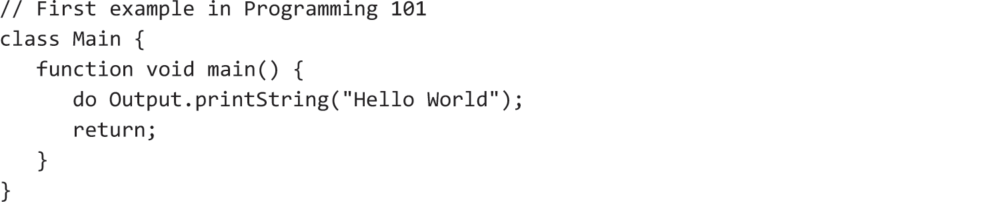

Read this figure as a vertical stack.

The higher you are in the figure, the more the work looks like software and human intent.

The lower you go, the more the work becomes precise machine-level mechanism.

So the figure is really making one big promise:

```text
everything above is realized by something below
```

The important idea is that programmers usually see only the top layer. This book goes below the surface and rebuilds the hidden layers one by one.

#### Nand to Tetris

The phrase Nand to Tetris means:

```text
from the primitive Nand gate
to a computer that can run an application like Tetris
```

The specific computer is called Hack. The specific high-level language is called Jack.

They are not meant to be industrial standards. They are small enough to understand completely.

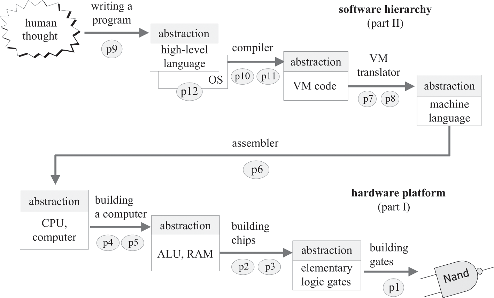

Figure `I.1` should be read in both directions.

Going upward:

```text
simple hardware blocks combine into a machine
```

Going downward:

```text
high-level software is translated into simpler and simpler representations
until it becomes machine instructions executed by that hardware
```

The roadmap has two directions:

```text
hardware builds upward
software translates downward
```

Hardware starts with gates and rises toward a machine. Software starts with high-level programs and is translated down into machine instructions.

The first half of the course stops at a working Hack computer and a low-level assembly language. That is enough to run programs, but it is not how most programmers want to work.

The second half asks what must be added to make Hack feel like a normal programming platform:

```text
high-level language
  -> compiler
  -> virtual machine layer
  -> assembler
  -> Hack machine language
  -> Hack hardware
```

The high-level language is Jack. Jack is deliberately simple, but it has the features expected in an introductory programming language: loops, data types, methods, objects, and abstractions.

The missing services are supplied by a standard library, also called the Jack OS:

```text
math operations
string processing
memory management
input and output
text and graphics output
```

So "Hack to Tetris" means closing the gap between a bare computer that understands only low-level instructions and a platform where a programmer can write a game in a high-level language.

#### Abstraction and Implementation

Every module has two views.

The abstraction is:

```text
what the module does
```

The implementation is:

```text
how the module does it
```

Example:

```text
Abstraction: Xor outputs 1 when its inputs differ.
Implementation: Xor can be built from Not, And, and Or gates.
```

When you use a module, you should depend on its abstraction. When you build a module, you must understand its implementation.

This separation is how large systems stay manageable.

#### Methodology

Part I builds about thirty gates and chips using HDL.

HDL is not a programming language in the usual sense. It describes hardware structure:

```text
which lower-level chips exist
how their pins are connected
```

The hardware simulator then tests the design before any physical hardware exists.

That is the practical method of the hardware half:

```text
read the chip abstraction
design a lower-level implementation
write the implementation in HDL
run the supplied test script
debug in the hardware simulator
```

This is how hardware engineers work in practice: they use computers to design, test, and debug hardware before building physical chips.

For a chip like `Xor`, the workflow is concrete:

```text
abstraction: Xor outputs 1 when its two inputs differ
design: choose lower-level gates that realize that behavior
HDL: describe how those gates are connected
test: run the chip against supplied scripts and compare files
```

The same pattern repeats for every chip in the hardware journey.

Part II later uses the completed hardware platform to build the software stack: assembler, virtual machine, compiler, and operating system.

#### The Road Ahead

The full journey contains twelve construction projects.

The course has two directions at once:

```text
Across projects: bottom-up
Within each project: top-down
```

Across projects, we start from Nand and build toward applications.

Within each project, we first understand the desired abstraction, then implement it using already available parts.

In Part I, the concrete destination is the Hack computer. At a high level, Hack has the same core shape as other stored-program computers:

```text
ROM: holds the program instructions
CPU: executes instructions
RAM: stores data
keyboard: supplies input
screen: displays output
```

Once these pieces are connected, the computer can execute programs: Pong, Space Invaders, Sokoban, Tetris, or any other program that can be expressed for the platform.

Part I builds:

```text
Nand
  -> elementary logic gates
  -> arithmetic logic unit (ALU)
  -> registers and memory units
  -> Hack machine language programs
  -> CPU and computer architecture
  -> assembler for Hack machine language
```

The course splits this into six hardware-side projects:

```text
Project 1: build elementary logic gates
Project 2: build the ALU
Project 3: build memory systems
Project 4: write programs in Hack machine language
Project 5: build the Hack computer
Project 6: build an assembler for Hack machine language
```

Notice the pause in project 4. Before building the full computer, you learn the language that the computer will execute. Then project 5 builds the machine that can run that language, and project 6 builds the tool that translates symbolic assembly into executable binary code.

That completed hardware/software boundary becomes the foundation for the higher-level software stack in Part II.

Part II then builds the missing software layers:

```text
Jack program
  -> compiler
  -> VM code
  -> VM translator
  -> Hack assembly
  -> assembler
  -> Hack machine code
  -> Hack computer
```

Meaning:

- the Jack language gives programmers a comfortable high-level notation
- the compiler translates Jack into VM code
- the VM translator translates VM code into Hack assembly
- the assembler translates Hack assembly into binary machine code
- the Hack computer executes that machine code

The operating system and standard library provide the high-level operations that programs assume already exist: printing text, reading input, drawing graphics, doing math, and managing memory. Without this layer, even `Hello World` would require too much low-level work.

### 1 Boolean Logic

> Such simple things, and we make of them something so complex it defeats us, Almost.
>
> --John Ashbery (1927-2017)

Digital hardware stores and processes binary values.

At the physical level, chips can be built from many different technologies. At this level, we ignore those physical details and keep only the logical abstraction:

```text
each signal has one of two values
each chip computes a rule over those values
```

That is why the chapter starts with Boolean logic instead of electronics. We first learn how to describe behavior over `0` and `1`; later we implement that behavior with gates and HDL.

Chapter 1 builds the basic vocabulary of hardware:

```text
Nand
  -> Not, And, Or, Xor
  -> multiplexers and demultiplexers
  -> 16-bit versions
  -> multi-way versions
```

These chips become the standard parts used in the next layers: arithmetic in chapter 2, memory in chapter 3, and eventually the Hack computer.

The main idea is:

```text
Boolean algebra specifies behavior.
Logic gates implement behavior.
HDL wires gates together.
Tests verify the implementation.
```

#### 1.1 Boolean Algebra

Boolean algebra works with two values:

```text
0
1
```

The practical motivation is simple: computers use two values because that is the easiest thing for hardware to maintain reliably, and two values are already enough to build everything else.

The names can change:

```text
0 / 1
off / on
false / true
no / yes
```

But they all refer to the same abstraction: a signal is in one of two distinguishable states.

One binary variable can describe `2` possible states. Two binary variables can describe `4` states. Three binary variables can describe `8` states.

In general:

```text
n binary variables -> 2^n possible input combinations
```

Meaning:

- each variable doubles the number of possible states
- a complete truth table must include one row for each possible state
- this finiteness is what makes Boolean functions easier to exhaustively describe than functions over ordinary numbers

A Boolean function maps binary inputs to a binary output.

Example:

```text
And(0, 0) = 0
And(0, 1) = 0
And(1, 0) = 0
And(1, 1) = 1
```

Meaning:

- `And` takes two Boolean inputs
- it returns `1` only when both inputs are `1`
- every other input combination returns `0`

The common Boolean operators are:

```text
And
Or
Not
```

They can be written mathematically as $x \cdot y$, $x + y$, and $\bar{x}$, or as $x \land y$, $x \lor y$, and `Not(x)`.

There are other named Boolean functions too:

```text
Nand = Not-And
Nor  = Not-Or
Xor  = exclusive-or
```

Meaning:

- `Nand(x, y)` is the opposite of `And(x, y)`
- `Nor(x, y)` is the opposite of `Or(x, y)`
- `Xor(x, y)` is `1` exactly when one input is `1` and the other is `0`

The names are useful shorthand, but the important thing is always the behavior: for each input combination, what output should the function produce?

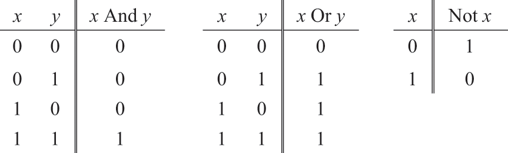

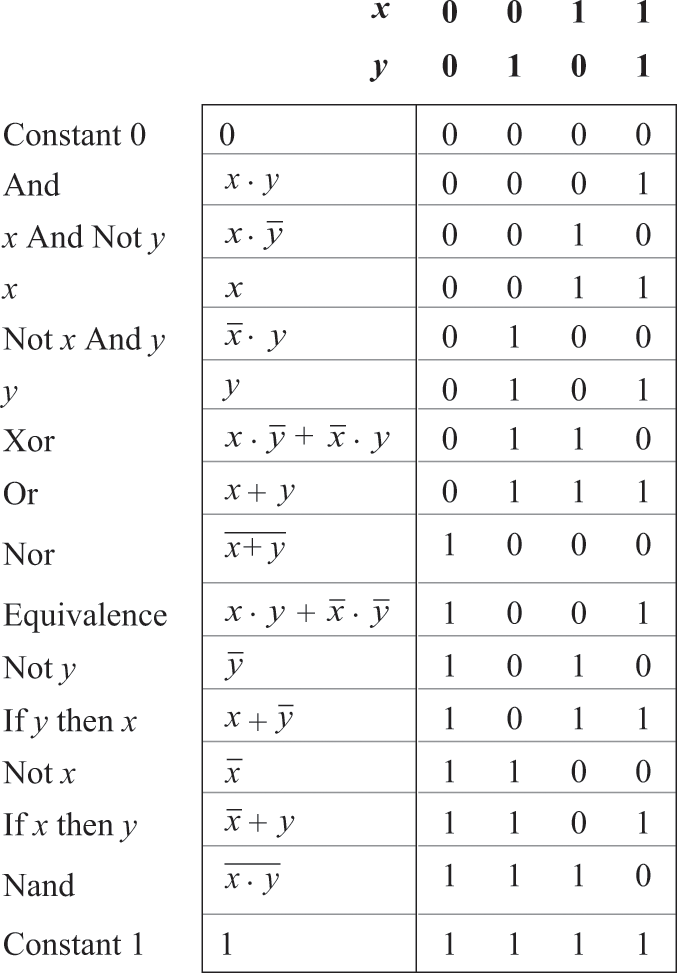

These two figures do complementary jobs.

`Figure 1.1` introduces the three basic Boolean operators.

You should read it as the small algebraic vocabulary from which larger logical statements are built.

`Figure 1.2` then shows the corresponding truth tables.

Each row answers the question:

```text
if the inputs are exactly this combination,
what must the output be?
```

That is the first key move of the whole chapter:

```text
behavior first
implementation later
```

The key theoretical fact is that every Boolean function can be built from Nand alone.

That is why Nand can be the primitive starting point for the whole computer.

The idea is:

```text
Not(x)   = x Nand x
And(x,y) = Not(x Nand y)
Or(x,y)  = Not(Not(x) And Not(y))
```

Meaning:

- once `Nand` can create `Not`, `And`, and `Or`, it can create the usual Boolean vocabulary
- once the usual Boolean vocabulary can express any truth table, `Nand` can express any Boolean function
- this is the first concrete reason that the whole course can start from one primitive gate

The number of possible Boolean functions grows very quickly. With `n` input variables, there are $2^{2^n}$ possible Boolean functions.

For example, with two inputs there are `2^2 = 4` input rows. Each row's output can independently be `0` or `1`, so there are `2^4 = 16` different two-input Boolean functions.

##### Boolean Functions

A Boolean function can be represented in two main ways.

Truth table:

```text
list every possible input
show the output for each input
```

Boolean expression:

```text
write a formula that computes the output
```

For three inputs `(x, y, z)`, there are `2^3 = 8` possible input combinations.

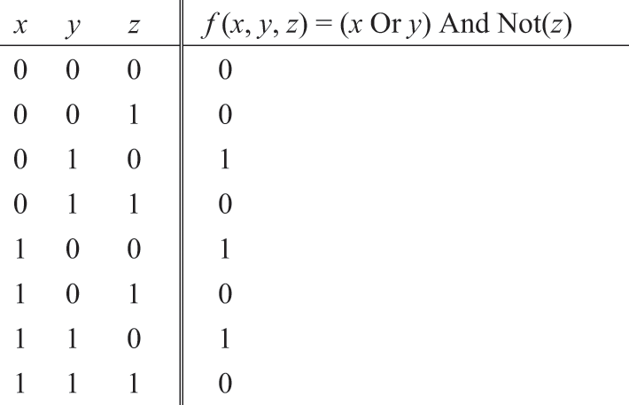

The figure shows that the same function can be described by a table or by an expression such as:

```text
(x OR y) AND NOT(z)
```

Meaning:

- first check whether `x` or `y` is `1`
- then check whether `z` is `0`
- the whole expression is `1` only when both conditions are true

For example:

```text
NOT(0 OR (1 AND 1))
  = NOT(0 OR 1)
  = NOT(1)
  = 0
```

Meaning:

- `1 AND 1` becomes `1`
- `0 OR 1` becomes `1`
- `NOT(1)` becomes `0`

When reading figure `1.3`, do not think of the expression and the truth table as two different functions.

They are two descriptions of the same mapping.

The truth table is explicit and complete.

The expression is compact and compositional.

Hardware designers constantly move between these two views.

##### Truth Tables and Boolean Expressions

Truth tables and expressions are two views of the same thing.

Going from expression to truth table is mechanical: evaluate the expression for every input combination and record the output.

Going from truth table to expression is less obvious, but there is a standard method.

**From truth table to Boolean expression (DNF)**

Scan the truth table row by row. Focus only on rows where the output is `1`.

For each such row, write a clause that is `1` exactly on that row and `0` everywhere else. You do this by:

- using the variable as-is if it is `1` in that row
- using `Not(variable)` if it is `0` in that row
- And-ing all the variable terms together

Then Or all the clauses together. The result is `1` for exactly the rows you care about.

Example: suppose a function `f(x, y, z)` has output `1` at two rows:

```text
row 1: x=0, y=0, z=0  ->  Not(x) And Not(y) And Not(z)
row 2: x=0, y=1, z=0  ->  Not(x) And     y  And Not(z)
```

Meaning:

- the first clause is `1` only when all three inputs are `0`
- the second clause is `1` only when `x=0`, `y=1`, `z=0`
- Or-ing them gives `1` exactly on those two rows

The complete expression is:

```text
f(x,y,z) = (Not(x) And Not(y) And Not(z)) Or (Not(x) And y And Not(z))
```

This is called **disjunctive normal form (DNF)**. It is always a valid starting point. It can then be simplified using Boolean laws.

The two clauses above both have `Not(x) And Not(z)` in common. Since the only difference is whether `y` or `Not(y)` appears, and both possibilities are covered, the `y` term drops out:

```text
f(x,y,z) = Not(x) And Not(z)
```

Simplification is not always this easy. Finding the shortest equivalent expression is an NP-hard problem in general. But Boolean algebra laws give tools to make progress.

This matters because hardware design often starts with desired behavior and ends with gates.

The practical path is:

```text
desired behavior
  -> truth table
  -> Boolean expression (DNF is one safe starting point)
  -> simpler expression
  -> gate implementation
```

Simplification matters because simpler expressions usually mean fewer gates.

**The remarkable fact behind all of this**

Any Boolean function, no matter how many variables, can always be expressed using only `And`, `Or`, and `Not`. The DNF construction proves it: any truth table produces a valid DNF expression, and DNF only uses those three operations.

But `{And, Or, Not}` can be reduced further. De Morgan's law shows that `Or` can be expressed using `And` and `Not`:

```text
x Or y = Not(Not(x) And Not(y))
```

So `{And, Not}` is enough to express any Boolean function.

And `Nand` alone is enough to express `{And, Not}`:

```text
Not(x)   = x Nand x
And(x,y) = Not(x Nand y)
```

Therefore any Boolean function can be expressed using only `Nand` gates. This is the theoretical foundation of the whole course: start from one primitive gate, build everything.

Boolean algebra gives rules for proving that two expressions are equivalent and for making expressions smaller.

Common laws include:

```text
x AND y = y AND x
x OR y  = y OR x

x AND (y AND z) = (x AND y) AND z
x OR  (y OR  z) = (x OR  y) OR  z

x AND (y OR  z) = (x AND y) OR  (x AND z)
x OR  (y AND z) = (x OR  y) AND (x OR  z)

NOT(NOT(x)) = x
x AND x = x
x OR  x = x

NOT(x AND y) = NOT(x) OR  NOT(y)
NOT(x OR  y) = NOT(x) AND NOT(y)
```

Meaning:

- commutative laws say input order does not matter for `And` and `Or`
- associative laws say grouping does not matter when chaining the same operation
- distributive laws say one operation can be spread across the other
- double negation says flipping twice returns the original value
- idempotence says repeating the same input does not add new information
- De Morgan's laws show how `Not` moves across `And` and `Or`

These laws can be checked by truth tables. If two expressions produce the same output for every possible input row, they describe the same Boolean function.

#### 1.2 Logic Gates

A logic gate is a physical or simulated device that implements a Boolean function.

The physical details can vary, but the abstraction stays the same.

For example, an And gate means:

```text
out = 1 only when both inputs are 1
```

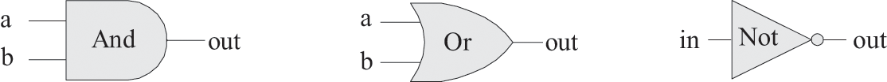

Figure `1.4` is the first clear example of abstraction.

The gate symbol hides all physical implementation details and preserves only what matters at this level:

```text
which pins go in
which pin comes out
what logical behavior the box guarantees
```

This lets us reason at the gate level without thinking about transistors every time.

The course makes one more practical point here: a gate can be specified in several equivalent ways.

```text
gate symbol
truth table
short verbal rule
```

If all three describe the same input/output behavior, they are just different presentations of the same functional specification.

##### Primitive and Composite Gates

A primitive gate is given to us.

A composite gate is built from other gates.

Example:

```text
And(a, b, c) = And(And(a, b), c)
```

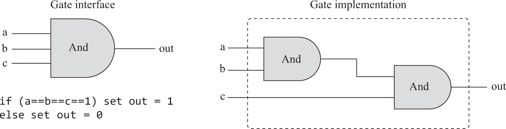

Figure `1.5` shows the difference between a black-box interface and an internal construction.

From the outside, the composite gate behaves like one logical unit.

Inside, it is a small network of simpler gates.

That is the same pattern the whole book will reuse:

```text
clean outside behavior
built from smaller inside parts
```

The interface says what the gate looks like from the outside:

```text
inputs
outputs
behavior
```

The implementation says what is inside:

```text
which smaller gates are used
how they are connected
```

Xor is a good example. Its behavior is:

```text
out = 1 when a and b are different
```

One implementation is:

```text
Xor(a, b) = Or(And(a, Not(b)), And(Not(a), b))
```

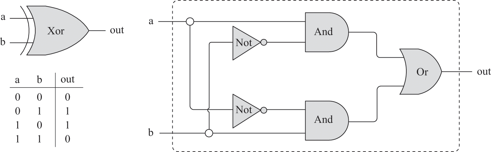

Figure `1.6` is worth reading left to right.

One branch detects:

```text
a = 1 and b = 0
```

The other branch detects:

```text
a = 0 and b = 1
```

Then the final `Or` says:

```text
output 1 if either of those mismatch cases happens
```

So logic design means:

```text
given a desired behavior
build it from gates that already exist
```

#### 1.3 Hardware Construction

Building physical chips by hand would be too slow and error-prone.

Modern hardware design therefore uses descriptions and simulations first.

The workflow is:

```text
write HDL
run simulator
compare against expected behavior
fix the design
```

Only after the design is correct would real manufacturing matter.

##### 1.3.1 Hardware Description Language

HDL describes chip structure.

It says:

```text
this chip has these inputs and outputs
this chip is built from these parts
these pins are connected to those pins
```

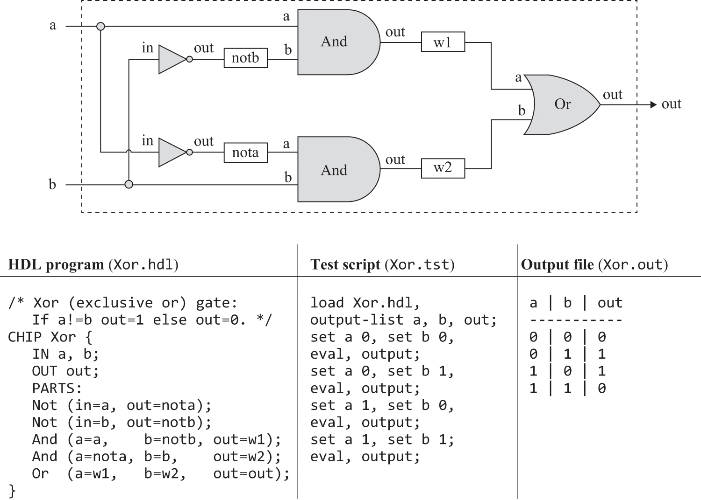

Figure `1.7` should be read in two passes.

First read only the chip header:

```text
what are the public inputs and outputs?
```

Then read the `PARTS` section:

```text
which previously built gates are being instantiated?
which internal wires connect them?
```

That is the basic rhythm of HDL throughout the course.

For Xor, the HDL header defines the public interface. The `PARTS` section builds the implementation from lower-level gates.

The course adds one more design rule here: the interface is fixed, but the implementation is not.

Many different internal designs can satisfy the same input/output contract. Later on, engineering concerns like part count, wiring complexity, and energy use help decide which implementation is better.

Internal pins name intermediate values.

Example mental model:

```text
notA = Not(a)
notB = Not(b)
aAndNotB = And(a, notB)
notAAndB = And(notA, b)
out = Or(aAndNotB, notAAndB)
```

##### Testing

Testing checks whether the implementation matches the specification.

A test script usually does this:

```text
load chip
set inputs
evaluate output
compare with expected output
repeat
```

For small gates, every input combination can be tested.

For larger chips, tests still provide strong confidence even when exhaustive testing is too large.

The videos also distinguish two testing modes:

```text
interactive probing
script-based verification
```

Interactive simulation is useful for quick experiments. But once you need to rerun the same checks repeatedly, test scripts are the practical default because they can generate an output file and compare it automatically against a compare file.

##### 1.3.2 Hardware Simulation

The hardware simulator executes HDL designs.

It lets you inspect:

```text
current input values
internal behavior
actual output
expected output
```

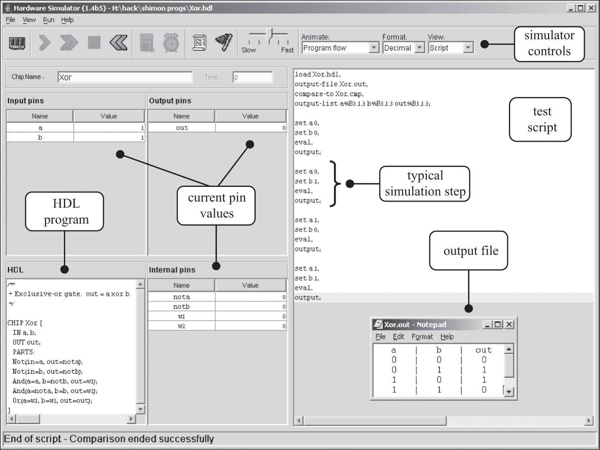

Figure `1.8` shows why the simulator is so helpful pedagogically.

It places the intended behavior and the actual behavior side by side.

So instead of guessing whether a circuit is correct, you can ask a precise question:

```text
for this input, did my chip produce the specified output?
```

This makes hardware design feel like programming with tests, but the thing being described is a circuit, not a sequence of instructions.

#### 1.4 Specification

This section specifies the chips needed for Project 1.

The specification answers:

```text
What should each chip do?
```

It does not yet answer:

```text
How should each chip be built?
```

That separation is the core discipline of the course.

##### 1.4.1 Nand

Nand is the primitive gate.

Its behavior is:

```text
Nand(a, b) = NOT(a AND b)
```

So it outputs `0` only when both inputs are `1`.

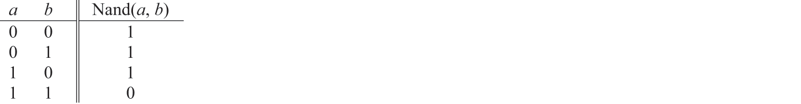

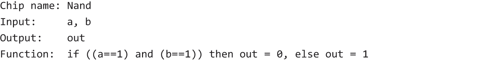

These two small figures give the two standard views of `Nand`:

```text
symbol / gate icon
truth table / exact behavior
```

The truth table is especially important because it shows the complete rule in one sentence:

```text
Nand outputs 0 only in the case 1,1
and 1 everywhere else
```

Everything else in Chapter 1 can be built from this gate.

##### 1.4.2 Basic Logic Gates

The basic gates are:

```text
Not
And
Or
Xor
Mux
DMux
```

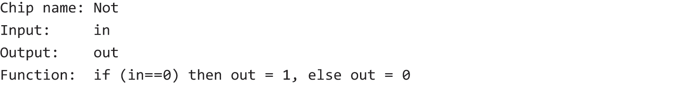

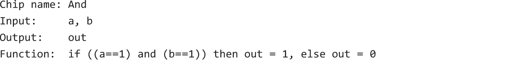

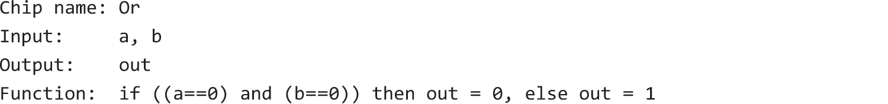

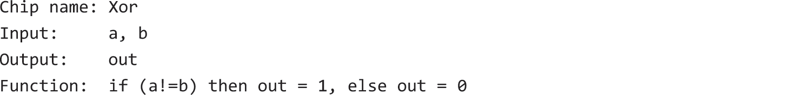

These figures collect the basic chip APIs of the chapter.

For `Not`, `And`, `Or`, and `Xor`, the important point is that each chip has a tiny, exact contract.

For `Mux` and `DMux`, the new idea is control.

The selector does not carry data.

It tells the circuit how to route data.

That is why these chips become so important later in memory chips and CPUs.

The multiplexer chooses one of two inputs:

```text
if sel = 0: out = a
if sel = 1: out = b
```

The figure should be read as a controlled choice:

```text
two possible data sources
one selector bit
one chosen output
```

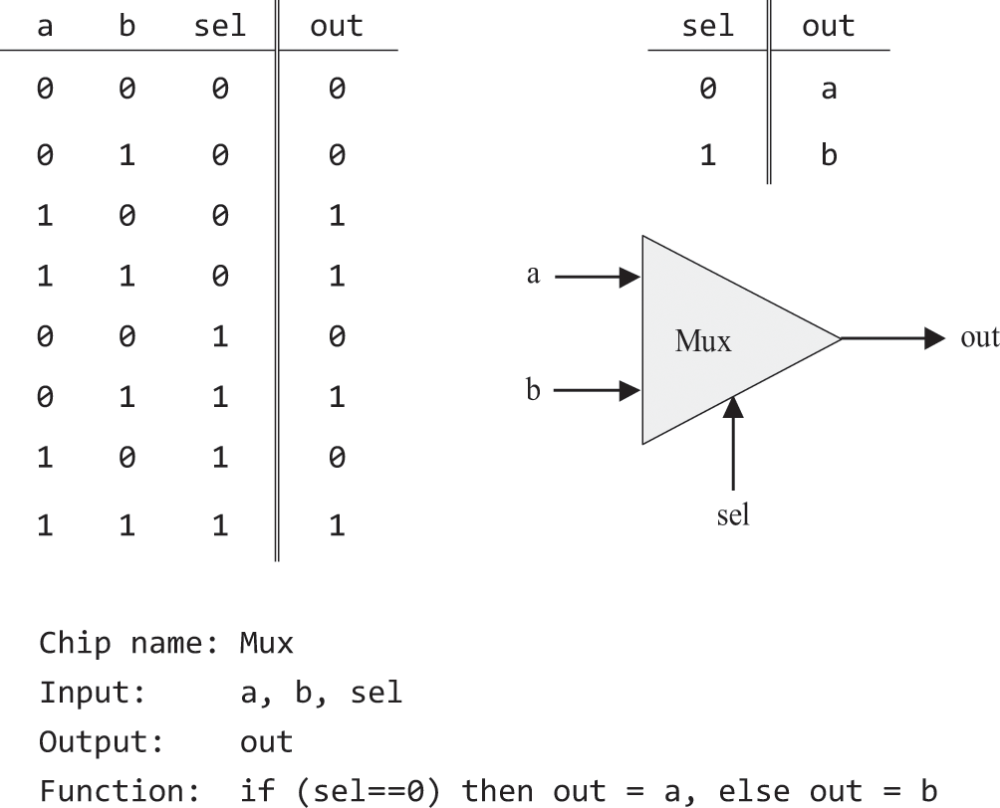

The demultiplexer routes one input to one of two outputs:

```text
if sel = 0: a = in, b = 0
if sel = 1: a = 0,  b = in
```

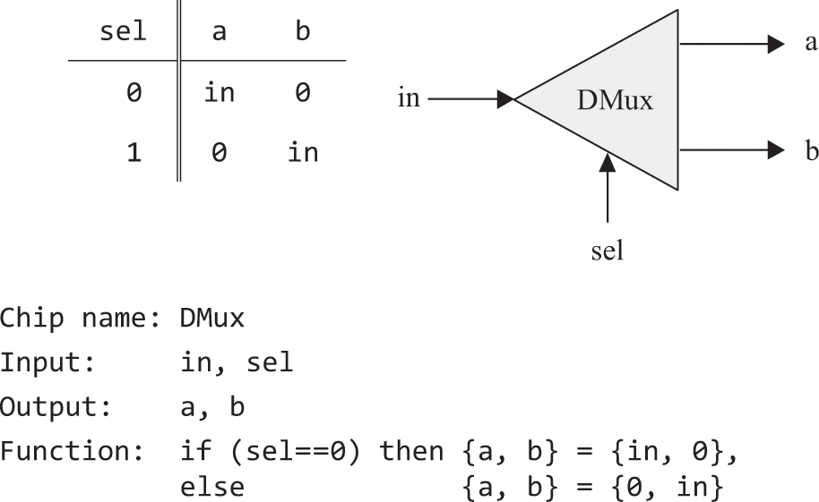

This is the mirror image of the `Mux` idea.

Instead of many inputs competing for one output, one input is routed toward one chosen destination.

Mental model:

```text
Mux chooses a value.
DMux chooses a destination.
```

##### 1.4.3 Multi-Bit Versions of Basic Gates

Computers usually process words, not isolated bits.

A 16-bit gate applies the same operation to each bit position.

Example:

```text
And16(a[16], b[16], out[16])

out[0]  = And(a[0],  b[0])
out[1]  = And(a[1],  b[1])
...
out[15] = And(a[15], b[15])
```

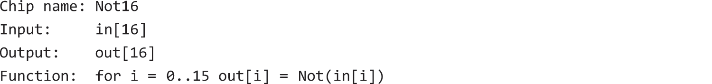

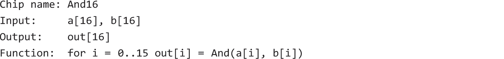

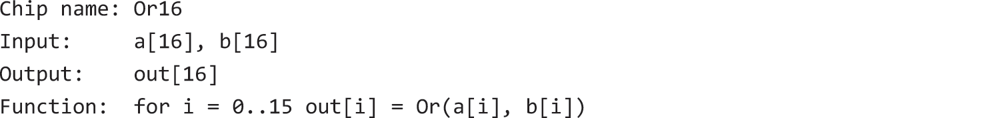

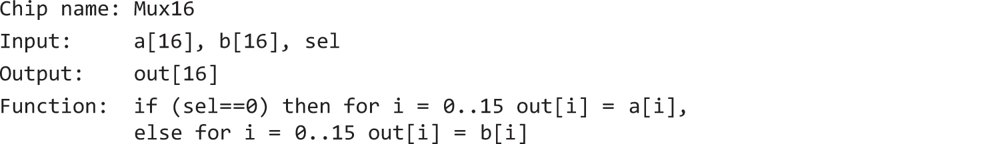

These figures show the same interface ideas from earlier, but widened from one bit to sixteen bits.

The important thing to notice is that the selector is still only one control value.

For example, a `Mux16` does not choose separately for each bit.

It chooses one entire 16-bit input word or the other.

The operation is not new. Only the width changes.

The course adds a useful abstraction reminder: a bus is still just a bundle of wires, but HDL lets us treat that bundle as one meaningful object. That is mostly a design convenience, not a new physical idea.

It also shows the practical consequence of that support: you can slice a bus into sub-buses or combine smaller buses into a larger one without naming every wire separately.

##### 1.4.4 Multi-Way Versions of Basic Gates

Multi-way gates generalize selection to more inputs or outputs.

Examples:

```text
Or8Way    -> OR together 8 inputs
Mux4Way16 -> choose 1 of 4 16-bit inputs
DMux8Way  -> route input to 1 of 8 outputs
```

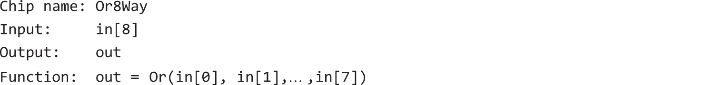

`Or8Way` is a reduction operation.

It answers one question:

```text
is any one of these inputs equal to 1?
```

You can picture it as a small tree of `Or` gates collapsing eight wires into one result.

To choose among `m` inputs, you need enough selector bits to name each choice:

```text
number of selector bits = log2(m)
```

For example:

```text
4 choices -> 2 selector bits
8 choices -> 3 selector bits
```

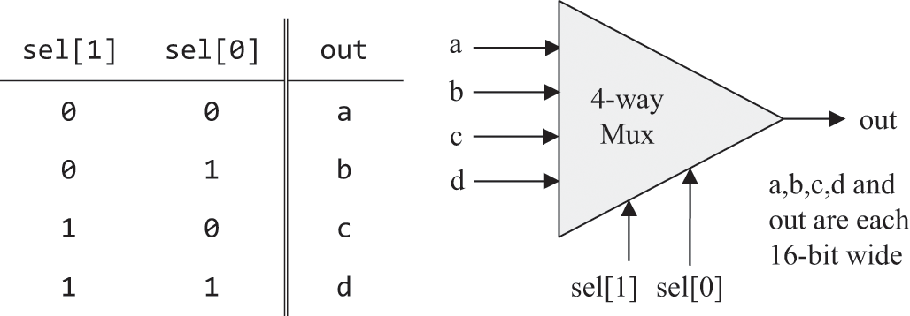

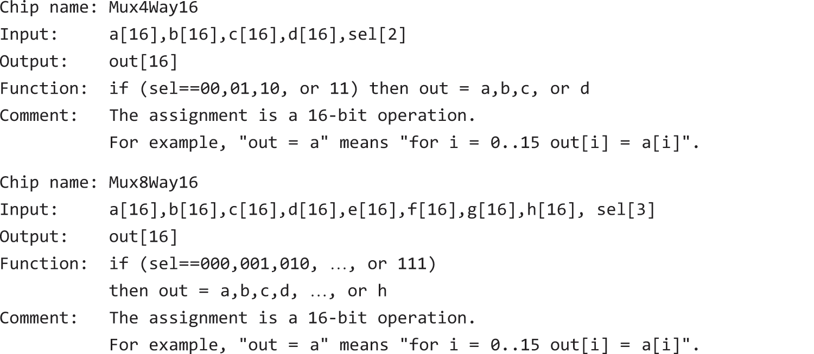

These multi-way mux figures are useful because they show selection as a hierarchy.

You do not need a magical new primitive.

You can build a 4-way or 8-way choice by combining simpler 2-way choices in stages.

Demultiplexers use the same idea in reverse: the selector chooses where the input goes.

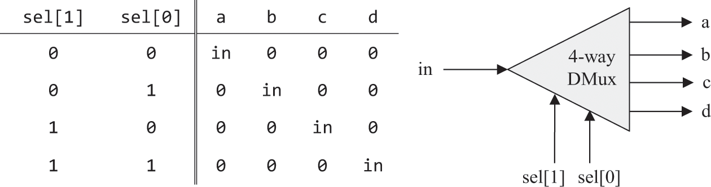

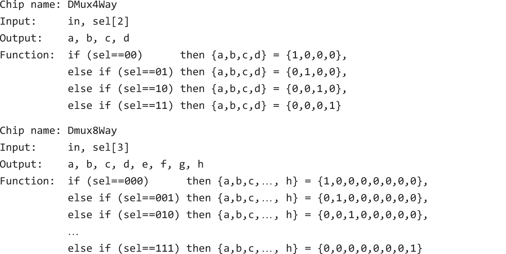

Again, the multi-way `DMux` should be read as staged routing.

One control value picks one branch, then possibly another, until exactly one output line receives the input signal.

#### 1.5 Implementation

After specifying the chips, the chapter explains how to build them.

The practical rule is:

```text
build small gates first
test them
reuse them to build larger gates
```

##### 1.5.1 Behavioral Simulation

Behavioral simulation means the simulator provides a chip's behavior directly.

This is useful when:

```text
you want to test a higher-level design
but a lower-level chip is not implemented yet
```

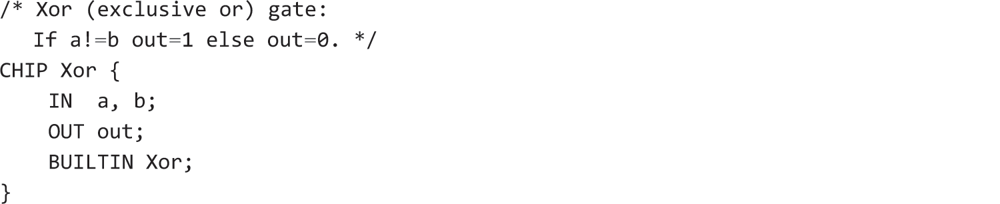

Figure `1.16` explains why built-in chips are useful during development.

They let you test the current chip as if all lower layers were already correct.

So behavioral simulation is really a way to isolate the design problem you are working on right now.

The built-in chip has the same interface as the HDL chip. The difference is only where the behavior comes from.

##### 1.5.2 Hardware Implementation

The implementation path starts from Nand.

Example ladder:

```text
Nand
  -> Not
  -> And
  -> Or
  -> Xor
  -> Mux and DMux
  -> 16-bit and multi-way chips
```

Once a chip works, use it as a building block. Do not keep rebuilding everything from raw Nand unless the project requires it.

##### 1.5.3 Built-In Chips

The simulator looks for chip implementations in two places:

```text
current project folder
built-in tools folder
```

If your HDL file is missing, the simulator may use a built-in version.

This is useful as a fallback, but the project goal is still to implement the specified chips yourself.

#### 1.6 Project

Project 1 asks you to implement the chapter's logic gates using HDL.

The course gives two extra reasons for this exact chip set: these gates are widely useful in digital design, and together they form the elementary toolkit needed for the later computer-building projects.

Implementation links: [`Not`](projects/project-01-boolean-logic.md#not), [`And`](projects/project-01-boolean-logic.md#and), [`Or`](projects/project-01-boolean-logic.md#or), [`Xor`](projects/project-01-boolean-logic.md#xor), [`Mux`](projects/project-01-boolean-logic.md#mux), [`DMux`](projects/project-01-boolean-logic.md#dmux), [`Not16`](projects/project-01-boolean-logic.md#not16), [`And16`](projects/project-01-boolean-logic.md#and16), [`Or16`](projects/project-01-boolean-logic.md#or16), [`Mux16`](projects/project-01-boolean-logic.md#mux16), [`Or8Way`](projects/project-01-boolean-logic.md#or8way), [`Mux4Way16`](projects/project-01-boolean-logic.md#mux4way16), [`Mux8Way16`](projects/project-01-boolean-logic.md#mux8way16), [`DMux4Way`](projects/project-01-boolean-logic.md#dmux4way), and [`DMux8Way`](projects/project-01-boolean-logic.md#dmux8way).

The work happens in `nand2tetris/projects/01`.

The pattern for every chip is:

```text
read the specification
write the HDL implementation
run the supplied test script
compare against the expected output
fix until it passes
```

The important constraint is that you should build the chips from Nand and from previously completed chips.

##### General Implementation Tips

- Prefer the simplest correct implementation.
- Reuse composite gates already built instead of implementing every chip directly from Nand.
- Do not invent helper chips outside the chapter's specified chip set.
- Build gates in chapter order, and rely on built-in chips only as a temporary fallback when necessary.

#### 1.7 Perspective

Chapter [1](#1-boolean-logic) builds the elementary logic toolbox.

In the course, the final unit is framed as a perspective-style Q&A section. So this part briefly opens the black box just enough to show that physical implementations exist beneath the logic symbols, and then returns to the abstraction level the course actually cares about.

The book uses Nand as the primitive, but Nand is not magical. Nor can also serve as a complete basis, and combinations like And/Or/Not are also complete.

The chapter intentionally ignores transistor-level physics and optimization.

The goal is to understand this layer:

```text
Boolean functions
  -> logic gates
  -> HDL implementations
```

That toolbox is enough to build arithmetic in the next chapter.

### 2 Boolean Arithmetic

Chapter 2 moves from logic to arithmetic.

The construction path is:

```text
binary numbers
  -> binary addition
  -> half-adder
  -> full-adder
  -> 16-bit adder
  -> incrementer
  -> ALU
```

The main idea is that many computer operations reduce to simple bit-level operations controlled by a small number of signals.

#### 2.1 Arithmetic Operations

Computers need operations such as:

```text
addition
subtraction
negation
comparison
multiplication
division
```

This chapter focuses on the operations needed to build the Hack ALU.

The most important operation is addition.

Why addition first?

```text
subtraction can be reduced to addition
incrementing is addition by 1
many higher operations can be built in software from simpler arithmetic
```

#### 2.2 Binary Numbers

Binary numbers use base 2.

Decimal uses powers of 10:

```text
345 = 3*100 + 4*10 + 5*1
```

Binary uses powers of 2:

```text
1011 = 1*8 + 0*4 + 1*2 + 1*1 = 11
```

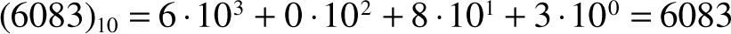

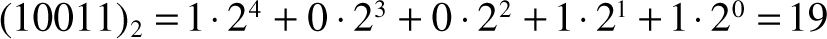

These figures do for binary what the earlier Boolean figures did for logic: they connect notation to meaning.

The key thing to notice is positional value.

Moving one place to the left in binary does not multiply by 10.

It multiplies by 2.

So each bit position has a fixed weight:

```text
1, 2, 4, 8, 16, ...
```

Computers store fixed-width binary words.

With `n` bits, there are:

```text
2^n possible bit patterns
```

The course adds one useful interpretation point: these `2^n` patterns do not have to mean numbers.

They can represent any `2^n` distinct things.

In this chapter, we choose to interpret them as integers.

If all values are nonnegative, the range is:

```text
0 through 2^n - 1
```

Example:

```text
4 bits -> 16 values -> 0 through 15
```

#### 2.3 Binary Addition

Binary addition works like decimal addition, but each digit is a bit.

You add from right to left:

```text
add current bit pair
include carry from previous position
produce sum bit
send carry to next position
```

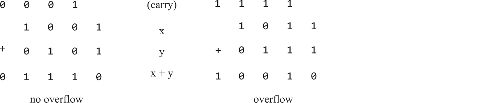

Figure `2.1` without the caption should be read exactly like hand addition in decimal, but with a smaller digit set.

At each column you combine:

```text
the left input bit
the right input bit
the incoming carry
```

and produce:

```text
one sum bit
one outgoing carry
```

The basic cases are:

```text
0 + 0 = 0
0 + 1 = 1
1 + 0 = 1
1 + 1 = 10  meaning sum 0, carry 1
```

In fixed-width hardware, overflow is ignored.

For Hack:

```text
16-bit addition returns the low 16 bits
extra carry beyond bit 15 is discarded
```

#### 2.4 Signed Binary Numbers

To represent negative numbers, the computer must assign meanings to bit patterns.

The standard representation used here is two's complement.

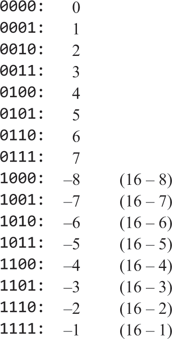

**Figure 2.1** Two's complement representation of signed numbers, in a 4-bit binary system.

This figure is best read as a circular numbering system rather than as two unrelated halves.

The nonnegative values rise normally:

```text
0000, 0001, 0010, ...
```

Then the bit patterns continue into the negative range:

```text
1111 = -1
1110 = -2
...
1000 = -8
```

That wraparound property is exactly what makes ordinary binary addition usable for signed arithmetic too.

In an `n`-bit two's complement system, the range is:

```text
-2^(n-1) through 2^(n-1) - 1
```

Example with 4 bits:

```text
1000 -> -8
1001 -> -7
...
1111 -> -1
0000 -> 0
0001 -> 1
...
0111 -> 7
```

The most significant bit indicates the sign:

```text
0 at the left -> nonnegative
1 at the left -> negative
```

The course also explains why a simple `sign bit + magnitude` scheme is not used here.

It creates two representations of zero and forces the hardware to treat positive and negative cases separately.

Two's complement is better because the arithmetic stays uniform.

To negate a number:

```text
flip all bits
add 1
```

The hardware payoff is huge:

```text
x - y = x + (-y)
```

So the same adder can support both addition and subtraction.

#### 2.5 Specification

The chapter specifies the arithmetic chips before building them.

The desired ladder is:

```text
HalfAdder
  -> FullAdder
  -> Add16
  -> Inc16
  -> ALU
```

##### 2.5.1 Adders

A half-adder adds two bits.

Interface:

```text
HalfAdder(a, b, sum, carry)
```

Behavior:

```text
sum   = low bit of a + b
carry = high bit of a + b
```

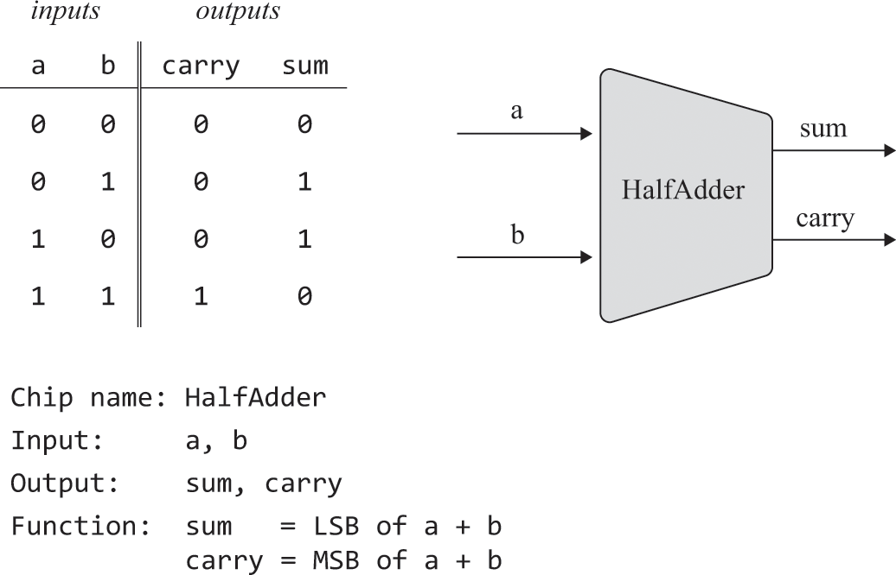

**Figure 2.2** Half-adder, designed to add 2 bits.

The figure shows that adding two 1-bit numbers can produce a 2-bit result.

That is why the outputs split into:

```text
sum   -> low-order bit
carry -> high-order bit
```

The course points out a neat shortcut here: the half-adder truth table is just repackaging two familiar gate behaviors.

```text
sum   = XOR(a, b)
carry = AND(a, b)
```

So arithmetic starts by recognizing that a small addition problem can already be expressed with ordinary logic gates.

A full-adder adds three bits: two data bits plus an incoming carry.

Interface:

```text
FullAdder(a, b, c, sum, carry)
```

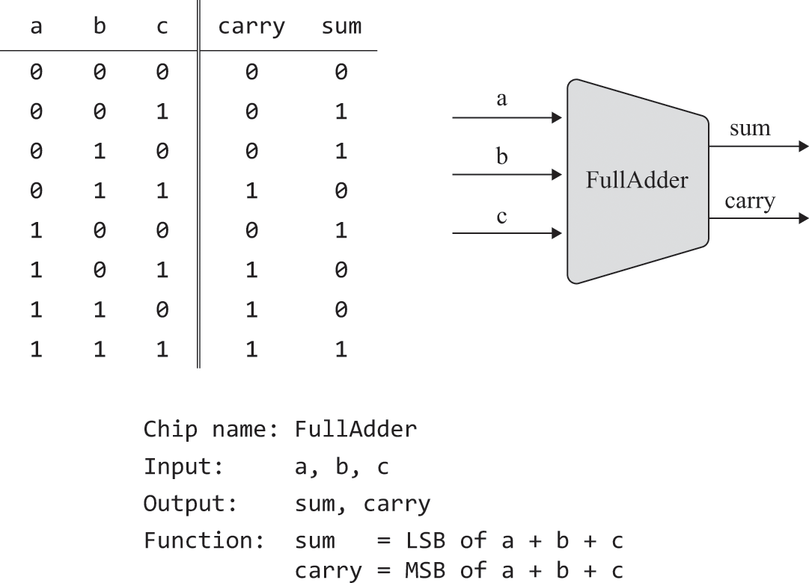

**Figure 2.3** Full-adder, designed to add 3 bits.

The extra input `c` is the carry arriving from the previous bit position.

So the full-adder is the real workhorse of multi-bit addition.

A 16-bit adder chains full-adders across all bit positions.

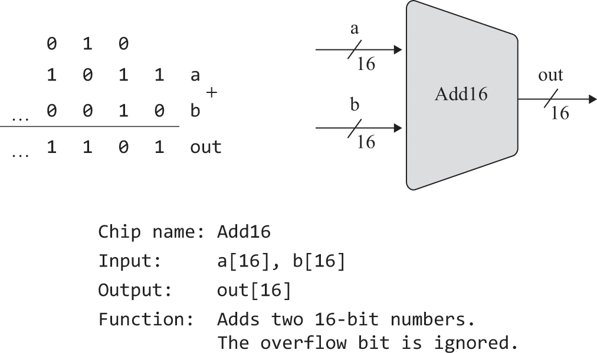

**Figure 2.4** 16-bit adder, designed to add two 16-bit numbers, with an example of addition action (on the left).

Read this figure from right to left across the bit positions.

The least significant bit is added first.

Its carry travels into the next position, and so on.

That is why the design is called ripple-carry: the carry ripples through the word.

Mental model:

```text
bit 0 produces carry into bit 1
bit 1 produces carry into bit 2
...
bit 15 produces overflow, which Hack ignores
```

The incrementer is a special adder:

```text
Inc16(in) = in + 1
```

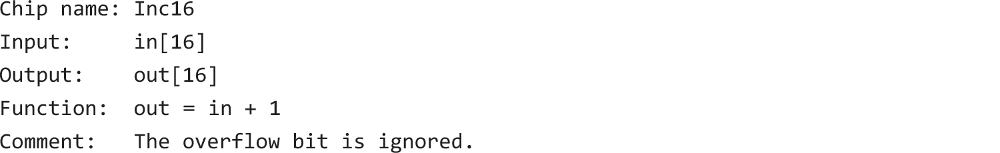

This figure emphasizes that incrementing is just a special case of addition.

You are adding a constant value of `1`, so most of the structure can be simpler than a fully general adder.

It will later help the program counter move to the next instruction.

##### 2.5.2 The Arithmetic Logic Unit

The ALU is the main computation chip of the Hack computer.

Inputs:

```text
x[16]
y[16]
```

Control bits:

```text
zx nx zy ny f no
```

Outputs:

```text
out[16]
zr
ng
```

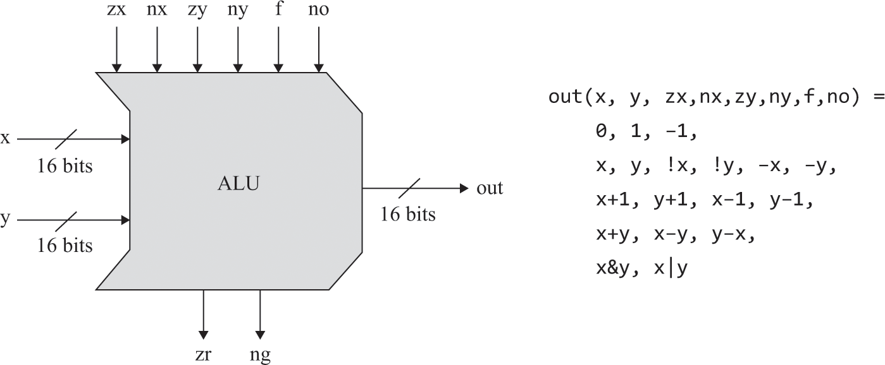

**Figure 2.5a** The Hack ALU, designed to compute the eighteen arithmetic-logical functions shown on the right. The symbols `!`, `&`, and `|` represent the 16-bit operations `Not`, `And`, and `Or`. For now, ignore the `zr` and `ng` output bits.

This figure is dense, but the main idea is simple:

```text
the ALU is one reusable data path
the control bits decide which computation that path performs
```

The six control bits describe a small processing pipeline:

```text
maybe zero x
maybe negate x
maybe zero y
maybe negate y
choose Add or And
maybe negate output
```

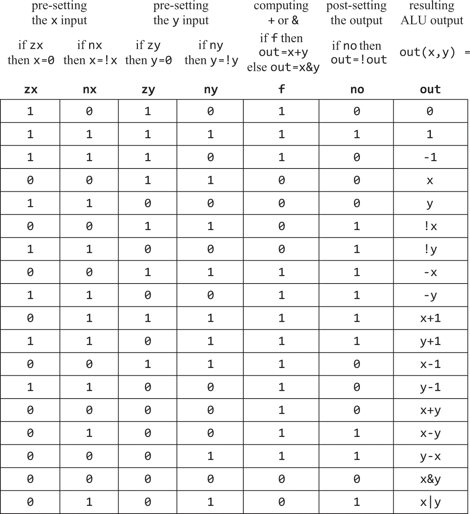

**Figure 2.5b** Taken together, the values of the six control bits `zx`, `nx`, `zy`, `ny`, `f`, and `no` cause the ALU to compute one of the functions listed in the rightmost column.

Figure `2.5b` is best read as a recipe.

You start with `x` and `y`, then pass them through several possible transformations, and only at the end do you get `out`.

So the ALU is not eighteen unrelated circuits.

It is one circuit whose behavior is steered by control bits.

This tiny control scheme can produce the Hack machine's needed arithmetic and logical functions:

```text
0, 1, -1
x, y
!x, !y
-x, -y
x+1, y+1
x-1, y-1
x+y
x-y, y-x
x&y
x|y
```

The status outputs summarize the result:

```text
zr = 1 if out is zero
ng = 1 if out is negative
```

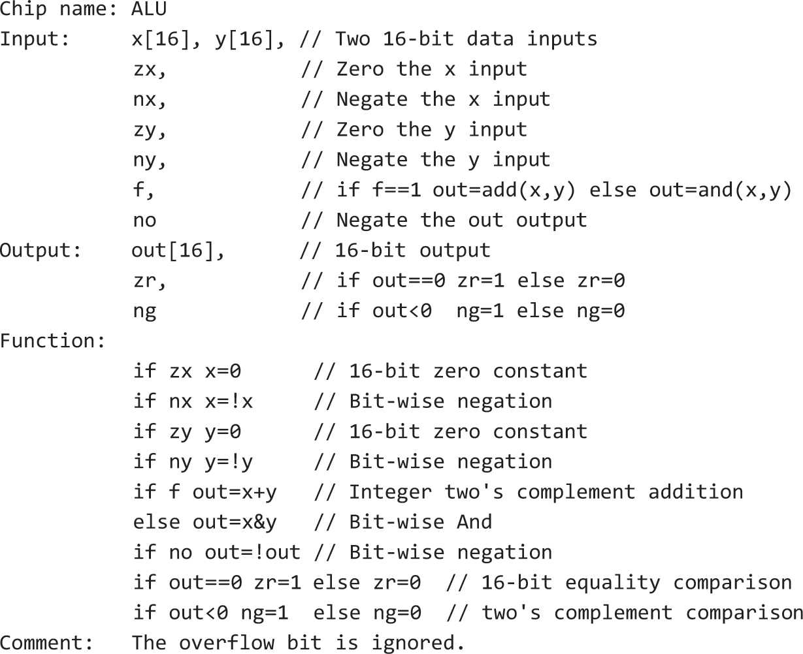

**Figure 2.5c** The Hack ALU API.

This compact API becomes critical later because the CPU will control the ALU only through these inputs and interpret the result only through these outputs.

These flags later help the CPU decide whether to jump.

#### 2.6 Implementation

The chapter gives sparse implementation guidance on purpose.

The learner must derive the HDL designs.

The adder path is:

```text
HalfAdder from basic gates
FullAdder from HalfAdders
Add16 from FullAdders
Inc16 from Add16 or equivalent logic
```

The 16-bit adder is a ripple-carry design:

```text
carry ripples from low bit to high bit
```

Conceptually the bits depend on each other in order, even though HDL describes the chip structurally.

The ALU implementation follows the control-bit pipeline:

```text
preprocess x
preprocess y
compute x+y or x&y
optionally negate output
compute zr and ng
```

#### 2.7 Project

Project 2 asks you to implement:

Implementation links: [`HalfAdder`](projects/project-02-boolean-arithmetic.md#halfadder), [`FullAdder`](projects/project-02-boolean-arithmetic.md#fulladder), [`Add16`](projects/project-02-boolean-arithmetic.md#add16), [`Inc16 using HalfAdders`](projects/project-02-boolean-arithmetic.md#inc16-using-halfadders), [`Inc16 using Add16`](projects/project-02-boolean-arithmetic.md#inc16-using-add16), and [`ALU`](projects/project-02-boolean-arithmetic.md#alu).

```text
HalfAdder
FullAdder
Add16
Inc16
ALU
```

The building blocks are Chapter 1 gates and the chips completed earlier in the project.

The book recommends using built-in versions of Chapter 1 chips instead of copying Project 1 HDL files. This makes Project 2 faster and keeps the focus on arithmetic.

The course adds a software-engineering reason: using built-in earlier chips helps localize bugs to the current project.

That supports a unit-testing style workflow, where you debug the new arithmetic chip rather than re-debugging the layers below it.

The same rules still apply:

- use only specified chips
- prefer simple correct HDL
- do not invent unnecessary helper chips
- test each chip with the supplied scripts

#### 2.8 Perspective

The adder design prioritizes clarity.

A ripple-carry adder is easy to understand:

```text
each bit waits for carry from the previous bit
```

But it can be slow because carry may need to travel through many positions.

Real hardware can use faster designs such as carry-lookahead adders, but those optimizations are outside the book's main path.

The course also makes a distinction between what is standard and what is course-specific.

Chips like half-adders, full-adders, and ripple-carry adders are standard building blocks in digital design, while the Hack ALU is intentionally simplified for teaching.

The Hack ALU is also intentionally small. Expensive operations like multiplication, division, and square root are not built directly into the hardware.

Instead:

```text
simple hardware
more work in software
```

This is a recurring systems trade-off.

### 3 Memory

Chapter 3 moves from combinational logic to sequential logic.

Combinational chips compute outputs from current inputs:

```text
current inputs -> logic -> current output
```

Memory chips must also remember previous values:

```text
current inputs + previous state -> next state/output
```

The construction ladder is:

```text
DFF
  -> Bit
  -> Register
  -> RAM8
  -> RAM64
  -> RAM512
  -> RAM4K
  -> RAM16K
  -> PC
```

The main idea is:

```text
DFF gives one bit of time-delayed state.
Registers group bits into words.
RAM groups registers and adds addressing.
PC is a controlled register for instruction flow.
```

#### 3.1 Memory Devices

Programs need values that persist.

The course makes one useful framing point before getting technical: in hardware, the word `memory` can refer to several storage technologies. This chapter narrows the discussion to the clocked memory devices that become registers and RAM inside the computer itself.

Examples:

```text
variables
arrays
objects
current instruction address
temporary computation results
```

Combinational logic cannot store these values because it has no memory. If its inputs disappear or change, its output changes too.

The chapter introduces a primitive sequential chip:

```text
DFF = Data Flip-Flop
```

The book treats `DFF` as a built-in building block.

From that one primitive, the chapter builds the useful memory hierarchy:

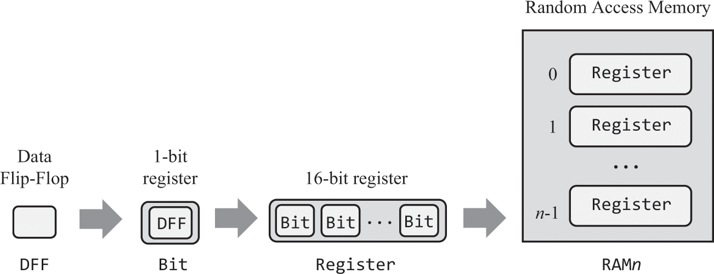

**Figure 3.1** The memory hierarchy built in this chapter.

This figure is the whole chapter in one ladder.

Read it as repeated wrapping:

```text
start with a 1-bit time-delayed element
add control to make a useful bit register
group bits into words
group words into addressed memory blocks
add special next-state logic to get a program counter
```

Mental model:

```text
DFF stores one delayed bit.
Everything else is structure and control around many DFFs.
```

#### 3.2 Sequential Logic

Sequential logic adds time to Boolean logic.

Combinational logic:

```text
out = function(current inputs)
```

Sequential logic:

```text
out = function(current inputs, stored state)
```

That stored state comes from earlier clock cycles.

##### 3.2.1 Time Matters

Real gates do not update instantly.

Signals need time to travel, and gate outputs need time to stabilize.

Instead of modeling every tiny delay, the book uses discrete time:

```text
cycle 0
cycle 1
cycle 2
...
```

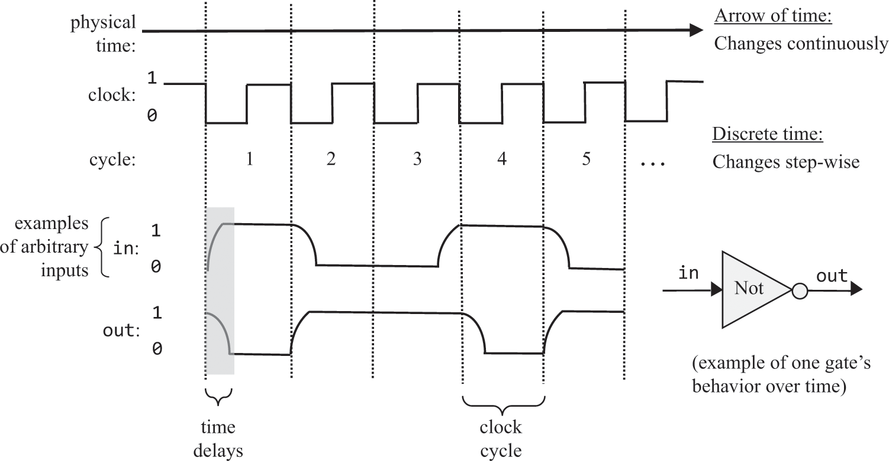

**Figure 3.2** Discrete time representation: state changes are observed only during cycle transitions, while within-cycle fluctuations are ignored.

The figure matters because it tells you what the book is choosing not to model.

Inside a clock cycle, signals may wiggle and settle.

The abstraction says:

```text
ignore the internal analog mess
observe only stable values at clock boundaries
```

The clock gives the machine a shared rhythm.

During a cycle:

```text
combinational logic computes
```

At the cycle boundary:

```text
stateful chips commit their next values
```

This works as long as the clock cycle is long enough for the slowest needed computation to settle.

##### 3.2.2 Flip-Flops

The `DFF` is the primitive one-bit memory device.

Its behavior is:

```text
out(t) = in(t - 1)
```

Meaning:

```text
the input from the previous time step becomes the output now
```

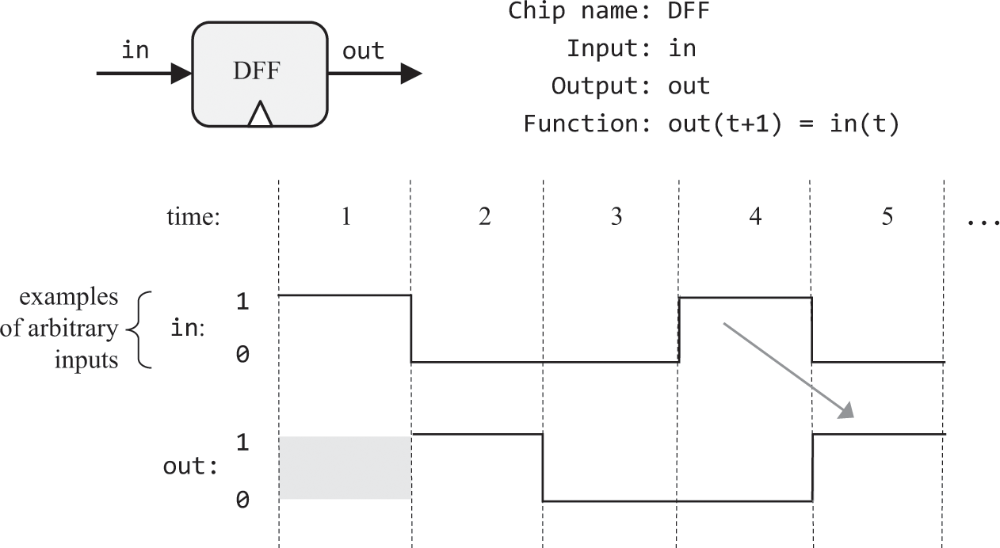

**Figure 3.3** The data flip-flop and its behavior over time.

When you read the timing part of the figure, track one value mentally.

If the input changes during cycle `t`, that new value does not appear immediately at the output.

It appears at the next observation point.

That single-step delay is what turns feedback from a paradox into usable memory.

This one-cycle delay is the key.

It lets the computer separate:

```text
old state used during this cycle
new state committed for the next cycle
```

##### 3.2.3 Combinational and Sequential Logic

Combinational chips contain no memory.

Sequential chips contain `DFF`s directly or indirectly.

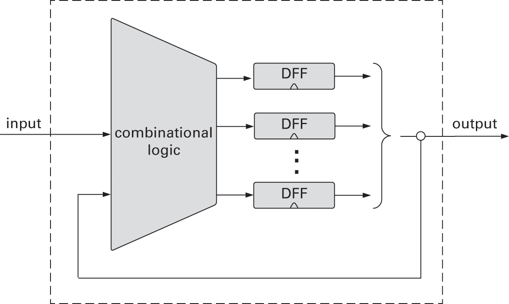

**Figure 3.4** Sequential logic design typically combines `DFF`s with combinational chips and feedback paths.

This figure is the template for almost every stateful digital system:

```text
current state goes into logic
logic computes a candidate next state
DFF stores that next state for the following cycle
```

The safe pattern is:

```text
old state -> combinational logic -> DFF -> next state
```

Feedback without delay can create circular dependency inside the same moment.

Feedback through a `DFF` is safe because the `DFF` delays the value until the next cycle.

#### 3.3 Specification

The chapter specifies the memory chips needed by the Hack platform.

The abstractions are:

```text
DFF       -> primitive one-bit delay
Bit       -> controlled 1-bit register
Register  -> controlled 16-bit register
RAM       -> addressable collection of registers
PC        -> register with reset/load/increment behavior
```

##### 3.3.1 Data Flip-Flop

The `DFF` has one data input and one data output.

Its rule is:

```text
out(t) = in(t - 1)
```

In plain language:

```text
whatever was at input last cycle appears at output this cycle
```

The `DFF` is small, but architecturally important. It is the source of all persistent state in the chapter.

##### 3.3.2 Registers

The chapter defines two register abstractions:

```text
Bit       -> stores 1 bit
Register  -> stores 16 bits
```

Both use a `load` control bit.

For the 1-bit register:

```text
Bit(in, load, out)
```

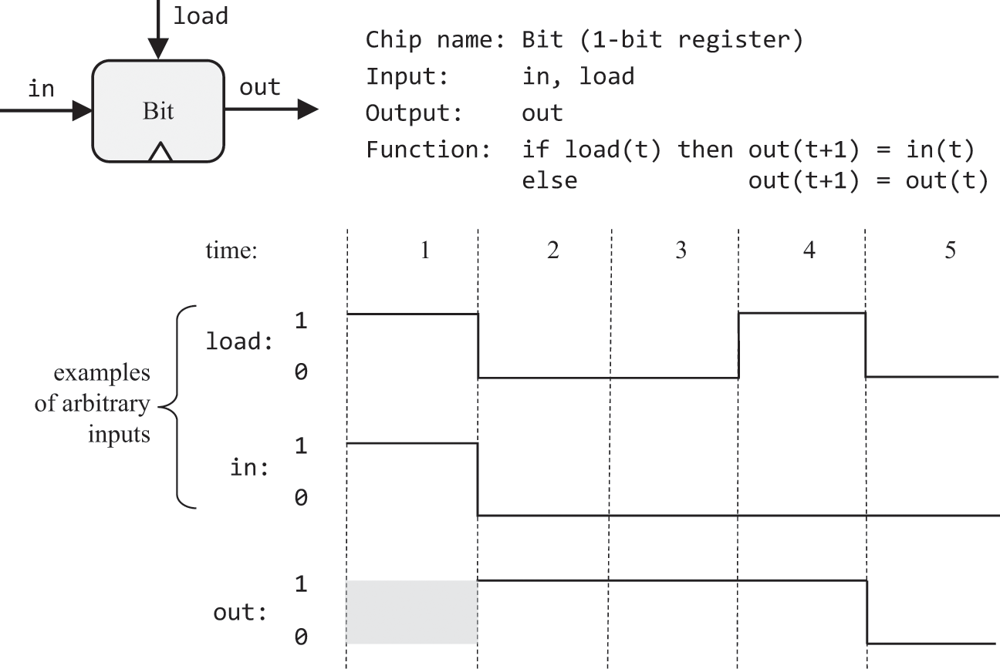

**Figure 3.5** 1-bit register (`Bit`).

The figure introduces an important pattern: data input plus control input.

`in` is the value that may be stored.

`load` decides whether storing actually happens.

Behavior:

```text
if load = 0:
    keep old value

if load = 1:
    store in on the next clock cycle
```

For the 16-bit register:

```text
Register(in[16], load, out[16])
```

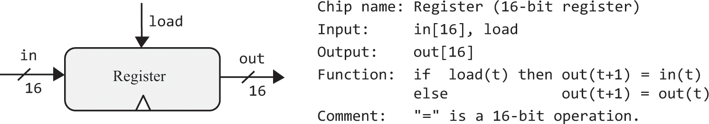

**Figure 3.6** 16-bit `Register`.

Read this figure as sixteen identical 1-bit storage decisions happening in parallel under one shared `load` signal.

Behavior:

```text
if load = 0:
    keep the old 16-bit word

if load = 1:
    store the new 16-bit input on the next clock cycle
```

The course adds one simple user-view rule: to read a register, just probe `out`. At any moment, `out` is the register's currently stored state.

Mental model:

```text
Bit stores one bit.
Register is sixteen Bit chips in parallel.
```

##### 3.3.3 Random Access Memory

RAM is many registers plus addressing.

The address chooses which register you are talking to.

Generic RAM behavior:

```text
in      = value you may want to store
load    = whether to write
address = where to read/write
out     = value currently stored at that address
```

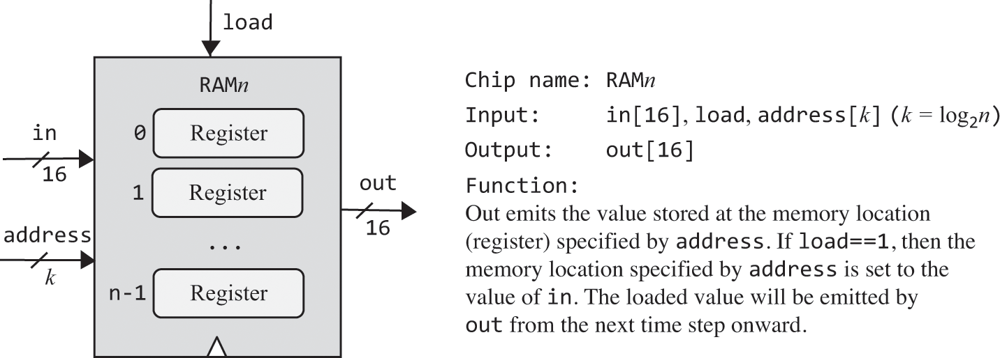

**Figure 3.7** A RAM chip as a collection of addressable `Register` chips.

The visual idea is:

```text
many storage words exist all the time
the address chooses which one is visible / writable right now
```

Reading:

```text
address selects which stored word appears at out
```

Writing:

```text
if load = 1:
    store in into the selected address on the next clock cycle
```

Random access means the address can select any location directly. You do not have to scan through earlier locations first.

##### 3.3.4 Counter

The `PC`, or Program Counter, is a special register.

It stores the address of the instruction that should run next.

It must support four behaviors:

```text
reset to 0
load a specific value
increment by 1
hold current value
```

The course also makes the control priority explicit:

```text
reset overrides everything
load overrides increment
increment is the default active update
otherwise the counter holds
```

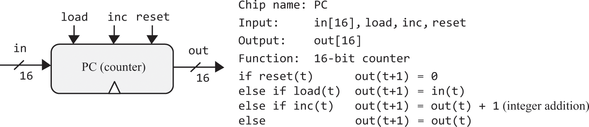

**Figure 3.8** Program Counter (`PC`).

This figure is useful because it shows that `PC` is not a completely different kind of hardware.

It is still a register, but wrapped with control logic that can choose among several candidate next values.

The `PC` is still a register underneath. The extra control bits decide what value should be stored next.

#### 3.4 Implementation

The implementation strategy is the same throughout the chapter:

```text
store state in DFFs/registers
use combinational logic to choose the next value
commit the chosen value on the next clock cycle
```

##### 3.4.1 Data Flip-Flop

The book does not ask you to build `DFF` from gates.

It treats `DFF` as primitive.

Reason:

```text
DFF implementation requires lower-level timing details
Chapter 3 wants to focus on memory architecture
```

So the simulator provides `DFF` as a built-in chip.

##### 3.4.2 Registers

A raw `DFF` stores its input every cycle.

A useful 1-bit register needs a choice:

```text
store the new input
or
keep the old value
```

The `Bit` chip gets this behavior by placing a `Mux` before the `DFF`.

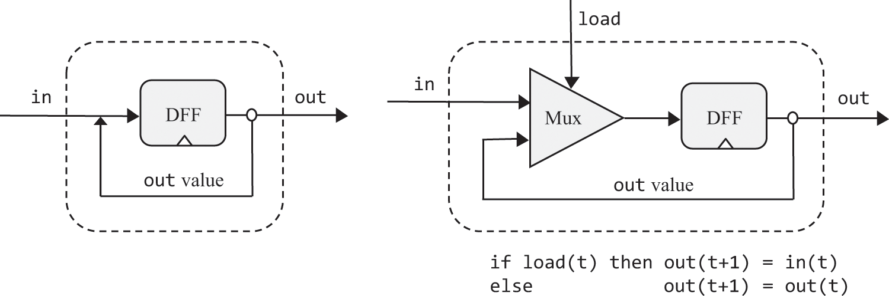

**Figure 3.9** Invalid and correct implementations of the `Bit` register.

The contrast in the figure is crucial.

The invalid design tries to feed state back without the right control structure.

The correct design inserts a `Mux` so the circuit can explicitly choose between:

```text
the old stored value
the new external input
```

Conceptually:

```text
                 +-----+
old out -------->|     |
in ------------->| Mux |----> DFF ----> out
load ----------->|     |
                 +-----+
```

If `load = 0`:

```text
Mux selects old out
DFF receives old out
Bit keeps its value
```

If `load = 1`:

```text
Mux selects in
DFF receives in
Bit updates on the next clock cycle
```

A 16-bit `Register` is then built from sixteen `Bit` chips:

```text
Bit 0  stores in[0]
Bit 1  stores in[1]
...
Bit 15 stores in[15]
```

All sixteen share the same `load` signal, so the whole word updates together.

##### 3.4.3 RAM

RAM is built recursively.

The hierarchy is:

```text
RAM8
  -> RAM64
  -> RAM512
  -> RAM4K
  -> RAM16K
```

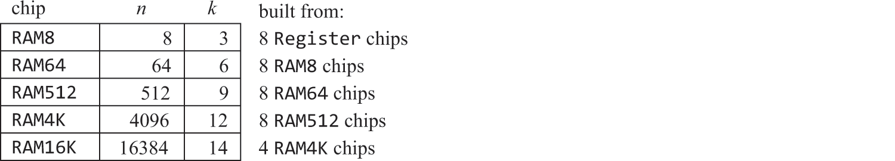

This recursive RAM figure is easier to understand if you read it as repeated address splitting.

Some address bits choose the large block.

The remaining bits choose a smaller location inside that block.

That same idea repeats until you reach one concrete register.

The basic idea for `RAM8` is:

```text
8 registers
one address selects one register
```

Reading uses a multiplexer:

```text
all register outputs go into a Mux
address chooses which output appears at RAM out
```

Writing uses a demultiplexer:

```text
global load goes into a DMux
address chooses which register receives load = 1
```

All registers can receive the same input bus, but only the selected register is told to load it.

For larger RAM, the same pattern repeats.

Example:

```text
RAM64 = 8 RAM8 chips
```

The address is split conceptually:

```text
low bits  -> select inside a small block
high bits -> select which block
```

Mental model:

```text
RAM = registers + read selection + write selection
```

##### 3.4.4 Counter

The counter is implemented from:

```text
Register
Incrementer
Mux/control logic
```

The combinational logic chooses the next value.

Possible next values:

```text
0              for reset
in             for load
current + 1    for increment
current        for hold
```

The register stores whichever value the control logic selects.

The general pattern is:

```text
current state -> combinational next-state logic -> register -> next state
```

#### 3.5 Project

Project 3 asks you to implement the memory chips.

Implementation links: [`Bit`](projects/project-03-memory.md#bit), [`Register`](projects/project-03-memory.md#register), [`RAM8`](projects/project-03-memory.md#ram8), [`RAM64`](projects/project-03-memory.md#ram64), [`RAM512`](projects/project-03-memory.md#ram512), [`RAM4K`](projects/project-03-memory.md#ram4k), [`RAM16K`](projects/project-03-memory.md#ram16k), and [`PC`](projects/project-03-memory.md#pc).

The chips include:

```text
Bit
Register
RAM8
RAM64
RAM512
RAM4K
RAM16K
PC
```

The allowed building blocks are:

```text
DFF
chips built earlier in Project 3
gates from Chapters 1 and 2
```

The project is split into two folders for simulator performance:

```text
projects/03/a -> smaller memory chips
projects/03/b -> larger memory chips
```

The course explains the reason a bit more concretely: large RAM chips expand recursively into many smaller parts, so the split helps the hardware simulator stop descending through HDL at some level and switch to built-in implementations for faster, smoother simulation.

The recommended workflow is the same as before:

```text
read specification
implement in HDL
run supplied test
fix until the compare file matches
```

#### 3.6 Perspective

Real flip-flops can be built from lower-level gates using carefully designed feedback circuits.

The book hides that detail because Chapter 3 is about the architectural use of memory, not transistor-level timing.

Modern memory technologies are also not always built literally as textbook flip-flops. Real systems use many optimized memory technologies.

The course gives two concrete examples here: `ROM` is used for code that must survive power loss and be available at boot time, and flash memory is another non-volatile storage technology with different engineering trade-offs.

But the abstractions remain fundamental:

```text
registers store words
RAM stores addressable words
counters store and update control positions
```

Together with the ALU from Chapter 2, these memory devices provide the remaining hardware pieces needed to build the CPU and the larger Hack computer.

### 4 Machine Language

Chapters 1-3 built the hardware pieces of a computer.

Chapter 4 pauses before building the CPU and asks a practical question:

```text
what is this hardware supposed to execute?
```

The answer is machine language.

Machine language is the interface between hardware and software.

At this level, programs tell the computer exactly what to do:

```text
compute a value
move a value
read or write memory
test a condition
jump to another instruction
```

High-level languages hide these details.

Machine language exposes them directly.

That is why this chapter matters so much:

```text
hardware becomes useful only when it can execute instructions
```

#### 4.1 Machine Language: Overview

This section explains what a machine language must talk about.

The focus is not on all the circuitry inside the machine.

The focus is on the hardware elements that a programmer must control explicitly.

The course adds one teaching motivation for doing Chapter 4 before Chapter 5: before building the full Hack computer, it helps to see what kind of machine the hardware is supposed to support from the programmer's point of view.

##### 4.1.1 Hardware Elements

Machine language is written for a specific physical machine.

So the language has to name the key hardware things that exist at runtime:

```text
memory     -> where most values live
processor  -> the thing that does operations
registers  -> small, fast storage inside the processor
```

**Memory** is the computer's big table of storage cells.

Each cell has an **address** (a number) and holds a fixed-width value (for Hack, 16 bits).

Mental model:

```text
RAM[0] = some 16-bit value
RAM[1] = some 16-bit value
RAM[2] = some 16-bit value
...
```

To use memory, a program must (1) pick an address, then (2) read or write the value stored at that address.

**Processor (CPU)** is the device that repeatedly:

```text
fetch an instruction
decode what it means
execute it (ALU work, memory access, or a jump)
```

It can do only a fixed set of primitive operations (add, and, not, compare, branch, etc.).

It does not "decide" what to do.

It follows the program's instruction stream.

**Registers** are a few storage cells built into the CPU chip.

They are much faster than main memory, so machine languages use them as the CPU's working area.

Two roles matter a lot:

```text
data registers    -> hold values being computed
address registers -> hold a value that is treated as a memory address
```

One subtle point that often causes confusion:

An "address register" does not contain some special "address substance".

It contains an ordinary bit-pattern, like any other register.

Whether that bit-pattern is interpreted as:

```text
the number 17
```

or as:

```text
the address of memory cell 17
```

depends entirely on what the next instruction chooses to do with it.

Concrete mental example (we will see this exactly in Hack later with the `A` register):

```text
If A = 17:

use A as data:     D = A    // D gets the value 17
use A as address:  D = M    // D gets RAM[A] (i.e., RAM[17])
```

This distinction matters because many machines access memory **indirectly**.

Instead of a single magical instruction "write RAM[123]", you typically do it in two steps:

```text
1) put 123 in an address register  (this selects RAM[123])
2) read/write the selected memory cell
```

That pattern is the core mental model for low-level programming:

```text
address register selects a memory cell
then the next instruction acts on that selected cell
```

##### 4.1.2 Languages

Machine language programs can be written in two equivalent notations:

```text
binary   -> what the CPU actually executes
symbolic -> a human-friendly spelling of the same instructions
```

The binary form is literally the bits that sit in instruction memory.

The symbolic form is what we call **assembly language**.

The bridge between them is a translation program:

```text
assembly (symbolic) -> assembler -> machine code (binary)
```

The key idea is that these are not two different languages.

They are two different *representations* of the same underlying instruction set.

Concrete example:

Suppose we want the abstract operation:

```text
set R1 to (R1 + R2)
```

As machine designers, we can decide an encoding scheme like:

```text
add op-code = 101011
R1 code     = 00001
R2 code     = 00010
```

Then the CPU's binary instruction could be:

```text
101011 00010 00001
```

Since `6 + 5 + 5 = 16`, concatenating these fields left-to-right gives:

```text
1010110001000001
```

Humans don't want to write or debug long bit-patterns.

So we choose a symbolic spelling for the same instruction, like:

```text
add R2,R1
```

And we let the assembler do the mechanical work:

```text
look up "add"  -> write 101011
look up "R2"   -> write 00010
look up "R1"   -> write 00001
pack fields into the 16-bit instruction format
```

In other words: symbols are not magic.

They are just names that stand for agreed-upon bit patterns.

Unlike high-level languages, assembly language is tied to a specific hardware platform.

Change the CPU (instruction formats, op-codes, registers), and you necessarily change the assembly language too.

##### 4.1.3 Instructions

This subsection is still staying general.

The book is not yet saying, "Here is the exact Hack syntax."

It is first answering a more basic question:

```text
what jobs must any machine language be able to do?
```

The answer is a short list:

```text
1) compute on values
2) access memory
3) control which instruction executes next
4) use symbols so humans can manage the code
```

That list is almost a definition of what low-level programming is.

If a language could not do these things, it could not control a general-purpose computer.

**Arithmetic and logical operations** let the computer transform data that is already inside the machine.

Examples:

```text
add two values
subtract one value from another
and/or/not values
```

These instructions are the programmer's view of the ALU.

At the hardware level, the ALU is a circuit.

At the machine-language level, it appears as a menu of primitive operations that instructions can request.

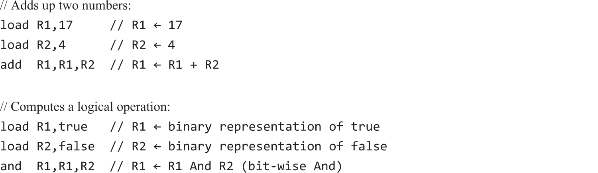

Figure `4.1` without the caption shows two tiny examples.

The first sequence is arithmetic:

```text
load R1,17
load R2,4
add R1,R1,R2
```

Read it step by step:

```text
put 17 in R1
put 4 in R2
replace R1 with R1 + R2
```

So after the third instruction, `R1 = 21`.

The second sequence is logical:

```text
load R1,true
load R2,false
and R1,R1,R2
```

Meaning:

```text
put true in R1
put false in R2
replace R1 with R1 And R2
```

Since `true And false = false`, the final value in `R1` is false.

The important point is not these particular mnemonics.

The important point is that machine language exposes primitive computation directly.

There is no expression parser, no rich type system, and no hidden runtime.

If you want a computation, you ask for it in small explicit steps.

The design lesson here is important:

an instruction set is always a cost/performance trade-off.

If you add richer operations, larger data types, or more elaborate addressing features, programming becomes nicer, but the hardware becomes more expensive and often slower.

**Memory access** exists because computation alone is not enough.

The CPU must also be able to fetch values from memory and store results back into memory.

Registers are the CPU's fast workspace.

Memory is the larger storage area outside that workspace.

So machine language needs instructions that move between:

```text
values in registers
values in memory
```

The usual pattern is indirect addressing:

```text
put an address in an address register
then operate on the selected memory cell
```

The easiest mental model is:

```text
A = a pointer to one memory address
M = the memory word currently selected by A
```

So:

```text
M = RAM[A]
```

This means `M` is not one fixed place.

Its meaning changes whenever `A` changes.

Example:

```text
if A = 17, then M means RAM[17]
if A = 200, then M means RAM[200]
```

This section is still speaking in general machine-language terms, not yet in exact Hack syntax.

So when the book uses instructions like:

```text
load A,17
load M,1
```

it is illustrating the access pattern, not yet giving the final Hack spelling.

The idea is:

```text
A = address register
M = the memory word currently selected by A
```

So if `A = 17`, then `M` means memory location `17`.

Then:

```text
load M,1
```

means:

```text
store 1 into memory[17]
```

Read the two instructions as:

```text
load A,17   -> make A point to address 17
load M,1    -> write 1 into the memory cell A points to
```

The bigger example follows exactly the same logic.

To set memory locations `200..249` to `1`, the machine first selects the start address and then repeatedly writes through the selected memory word while advancing the address:

```text
load A,200
loop:
  load M,1
  add A,A,1
```

Mental model:

```text
start with A = 200
write 1 into memory[A]
increment A
write 1 into memory[A]
increment A
repeat
```

Tiny trace:

```text
load A,200   -> A = 200, so M means RAM[200]
load M,1     -> RAM[200] = 1
add A,A,1    -> A = 201, so now M means RAM[201]
load M,1     -> RAM[201] = 1
add A,A,1    -> A = 202
```

So the main memory-access lesson is:

```text
first select an address
then read or write the selected memory word
```

In actual Hack assembly, the same idea later appears in a more concrete form such as:

```text
@17
M=1
```

Meaning:

```text
put 17 in A
now M means RAM[17]
store 1 there
```

This is why address registers matter so much in low-level programming.

They let the CPU point at one memory word, and then operate on that selected word.

**Flow control** exists because a useful program cannot just march forward forever.

Without flow control, a program would be trapped in straight-line execution:

```text
instruction 1
instruction 2
instruction 3
instruction 4
...
```

Without jumps, every program would be one fixed straight line.

That would make loops, conditionals, early exits, and repeated work impossible.

With jumps and tests, machine language can build higher-level patterns like:

```text
if
while
for
goto
```

At the machine-language level, these are not special language constructs.

They are all built from instructions that decide what the next instruction address will be.

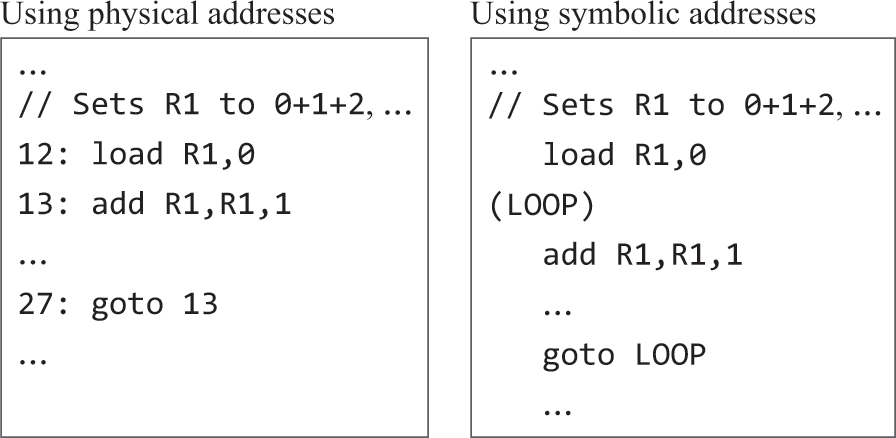

**Figure 4.1** Two versions of the same low-level code (it is assumed that the code includes some loop termination logic, not shown here).

Read the left side first.

It uses physical instruction addresses:

```text
12: load R1,0
13: add R1,R1,1
...
27: goto 13
```

Meaning:

```text
initialize R1 to 0
keep incrementing R1
when execution reaches instruction 27, jump back to instruction 13
```

So the loop is controlled by a raw numeric address.

This works, but it is fragile.

If you insert or remove instructions earlier in the program, the jump destination may change.

Now read the right side.

It expresses the same loop using a symbolic label:

```text
load R1,0
(LOOP)
  add R1,R1,1
...
  goto LOOP
```

The logic is identical, but the meaning is clearer:

```text
jump back to the place named LOOP
```

This is much easier for humans to read and maintain.

**Symbols** are the usability layer on top of all this.

The book uses figure 4.1 to show that symbolic names are not just cosmetic.

They solve a real low-level programming problem.

When code uses symbolic references instead of hard-coded physical addresses, the code becomes:

```text
easier to write
easier to debug
easier to maintain
easier to move in memory
```

That last point is especially important.

If code says `goto 13`, then it assumes the target instruction really is at address 13.

If the whole program gets shifted in memory, that assumption can break.

If code says `goto LOOP`, an assembler can translate `LOOP` to whichever physical address is correct in the final program.

This is what the book means by *relocatable* code.

So the full message of `4.1.3` is:

```text
machine language must let us compute
machine language must let us access memory
machine language must let us change control flow
machine language becomes usable for humans when symbols replace raw addresses
```

The next section, `4.2`, takes these general ideas and shows exactly how the Hack computer realizes them.

#### 4.2 The Hack Machine Language

After the general overview, the chapter narrows to one specific machine language:

```text
the Hack machine language
```

This is the language the Hack computer will execute in Chapter 5.

##### 4.2.1 Background

This section answers a practical question:

```text
what hardware picture should you keep in your head while reading Hack assembly?
```

Hack follows the von Neumann style and is a 16-bit computer.

So the machine stores, moves, and computes using 16-bit values.

The easiest way to understand the language is to first understand the memory model.

Hack uses two memories:

```text
data memory        -> RAM
instruction memory -> ROM
```

Each memory is 16 bits wide and has a 15-bit address space.

So each one can hold:

```text
2^15 = 32K words
```

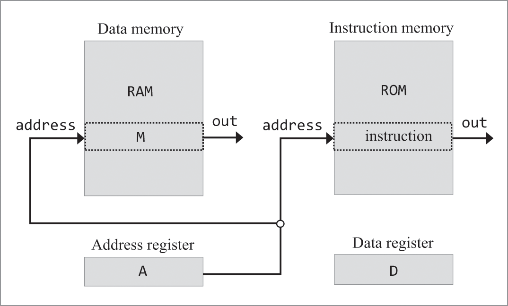

**Figure 4.2** Conceptual model of the Hack memory system. Although the actual architecture is wired somewhat differently (as described in chapter [5](#5-computer-architecture)), this model helps understand the semantics of Hack programs.

The key purpose of this figure is semantic, not electrical.

It is not trying to show every wire.

It is trying to show what Hack programs can talk about and manipulate:

```text
instruction memory
data memory
A register
D register
selected memory word M
```

The core split is:

```text
ROM = the program
RAM = the program's data
```

That separation is central.

When a Hack program runs, it is constantly doing two things at once:

```text
reading the next instruction from ROM
reading/writing data in RAM
```

Hack machine language manipulates three named storage targets:

```text
A
D
M
```

`D` is the straightforward one.

It is just a 16-bit data register.

`A` is the unusual one.

It can act as:

```text
a data register
an address register
```

`M` is the trickiest one.

It is not a separate physical register inside the CPU.

Instead:

```text
M means RAM[A]
```

So when `A = 100`, the symbol `M` refers to `RAM[100]`.

This single idea explains a huge part of the Hack language.

The instruction `@xxx` sets `A` to `xxx`.

Important: `A` always holds one plain 16-bit number.

It is not storing multiple meanings at once.

What changes is how the *next* instruction uses that same number.

`@xxx` does have two *side effects* in the hardware model:

```text
it makes RAM[xxx] the selected data memory word (so M would mean RAM[xxx])
it makes ROM[xxx] the selected instruction (so a jump could go there)
```

But you normally act on only one of these.

The next instruction reveals which role `A` is playing:

```text
use A as a number:         D=A
use A as a RAM address:    M=... or D=M        // because M = RAM[A]
use A as a jump target:    ...;JMP / ...;JEQ   // because the jump sets PC = A
```

Examples:

```text
@17
D=A
```

means:

```text
put 17 into A
then copy that 17 into D
```

So here `A` is being used like a data register.

And:

```text
@100
M=D
```

means:

```text
select RAM[100]
store D into that selected memory word
```

So here `A` is being used as an address register.

Branching uses the same register:

```text
@29
0;JMP
```

means:

```text
put 29 into A              // set up the jump target
jump: set PC = A           // so the next instruction fetched is ROM[A]
```

So here `A` is being used as a jump target.

Hack also supports **conditional branching**.

For example, the logic:

```text
if D==0 goto 52
```

is written as:

```text
@52
D;JEQ
```

Read it as:

```text
put 52 into A
evaluate D
if D equals 0, jump to the instruction whose address is A
```

So branching in Hack follows one basic pattern:

```text
1) put the destination in A
2) execute either an unconditional or conditional jump instruction
```

This dual use of `A` may feel strange at first, but it keeps the architecture small and economical.

That is the main trade-off:

```text
slightly more conceptual confusion
in exchange for simpler hardware and a smaller instruction set
```

Variables are where symbols start to matter in a serious way.

In Hack, the `xxx` in `@xxx` can be either:

```text
a constant
a symbol
```

So:

```text
@23
```

means:

```text
set A to the numeric value 23
```

But:

```text
@x
```

means:

```text
set A to whatever numeric address the assembler assigned to x
```

If the assembler decided that `x` lives at address `513`, then `@x` ends up behaving like `@513`.

This is what lets Hack programs use variables instead of hard-coded physical addresses.

For example, the high-level idea:

```text
let x = 17
```

can be implemented as:

```text
@17
D=A
@x
M=D
```

Read it step by step:

```text
put 17 into D
select the RAM location bound to x
store 17 there
```

So the symbol `x` is not the value itself.

It is a name that the assembler resolves to some RAM address.

That is the assembler's job:

```text
take symbolic names like x or count
bind them to sensible, consistent RAM addresses
replace the symbols with those addresses during translation
```

This is why programmers can write:

```text
@count
M=M+1
```

instead of something like:

```text
@30
M=M+1
```

The second version hard-codes a physical address.

The first version says what the memory cell means, and lets the assembler decide where it should live.

That is much easier to read, change, and maintain.

The language also includes built-in symbols `R0` through `R15`, bound to addresses `0` through `15`.

So:

```text
@R3
M=0
```

ends up meaning:

```text
RAM[3] = 0
```

These built-in names act like convenient pre-named working slots.

That is why the book calls them *virtual registers*.

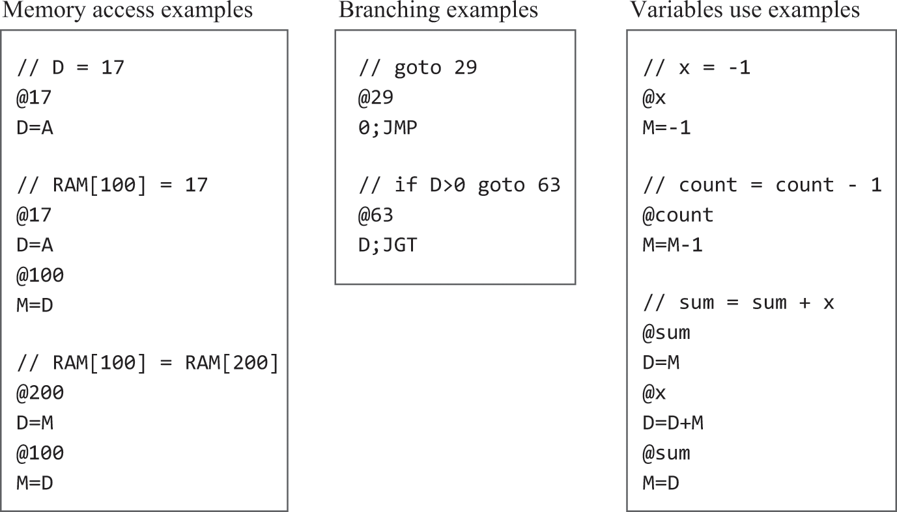

**Figure 4.3** Hack assembly code examples.

This figure is like a compact tour of the whole language.

It shows that most Hack code is built from the same repeating pattern:

```text
1) use @xxx to load or select something via A
2) use a compute instruction to do something with D, M, or the jump logic
```

The left column shows **memory access examples**.

First:

```text
// D = 17
@17
D=A
```

Meaning:

```text
put the value 17 into the A register // used as data
copy A into D
```

So this is how Hack gets a constant into `D`.

There is no direct `D=17` instruction.

Second:

```text
// RAM[100] = 17
@17
D=A
@100
M=D
```

Meaning:

```text
put the value 17 into the A register // used as data
copy A into D
put 100 into A // used as address -> select RAM[100]
store D into M // M = RAM[A]
```

This shows a very common two-stage pattern:

```text
first prepare a value
then select a memory address
then write the value there
```

Third:

```text
// RAM[100] = RAM[200]
@200
D=M
@100
M=D
```

Meaning:

```text
put 200 into A // used as address -> select RAM[200]
copy M into D // M = RAM[A]
put 100 into A // used as address -> select RAM[100]
store D into M // M = RAM[A]
```

So `D` is often used as a temporary holding place when moving data from one memory cell to another.

The middle column shows **branching examples**.

First:

```text
// goto 29
@29
0;JMP
```

Meaning:

```text
put 29 into A                    // set up the jump target
jump to the instruction at A     // equivalently: set PC = A, so next fetch is ROM[A]
```

So unconditional jumping is also a two-step process:

```text
select target address
issue jump instruction
```

Second:

```text
// if D>0 goto 63
@63
D;JGT
```

Meaning:

```text
put 63 into A                    // set up the jump target
if D is greater than 0, jump to the instruction at A
```

So conditional branching works by:

```text
testing some computed value
and using A as the jump destination if the condition passes
```

The right column shows **variable use examples**.

First:

```text
// x = -1
@x
M=-1
```

Meaning:

```text
put the address of x into A          // x is a symbol; the assembler resolves it
store -1 into M                      // M = RAM[A]
```

The important point is that the program never needs to know the physical address of `x`.

Second:

```text
// count = count - 1
@count
M=M-1
```

Meaning:

```text
put the address of count into A      // assembler resolves the symbol
decrement M in-place                 // M = RAM[A]
```

This is an in-place update of one variable.

Third:

```text
// sum = sum + x
@sum
D=M
@x
D=D+M
@sum
M=D
```

Meaning:

```text
put the address of sum into A        // select RAM[sum]
copy M into D                        // D = RAM[sum]
put the address of x into A          // select RAM[x]
add M into D                         // D = D + RAM[x]
put the address of sum into A        // select RAM[sum] again
store D into M                       // RAM[sum] = D
```

This example shows the general pattern for combining two variables:

```text
load one value into D
combine it with another value
store the result back somewhere
```

These examples are worth scanning slowly because each one highlights a different role of `A`:

```text
as a place to hold a constant
as a way to select RAM
as a way to select a jump destination
```

Across all the snippets, the same small vocabulary repeats:

```text
@value or @address   // set A (as a number, RAM address, or jump target)
use D                // temporary storage
operate on M         // M = RAM[A]
jump via A           // jumps set PC = A
use symbols when possible
```

##### 4.2.2 Program Example

Before giving the formal instruction format, the chapter throws you into a complete Hack program.

The task is to compute:

```text
1 + 2 + 3 + ... + n
```

The contract is:

```text
input:  n is already in RAM[0] (R0)
output: write the sum into RAM[1] (R1)
```

Instead of using the closed-form formula, the program uses a loop and repeated addition.
That is deliberate: it is a vehicle for showing conditional jumps and iteration in Hack.

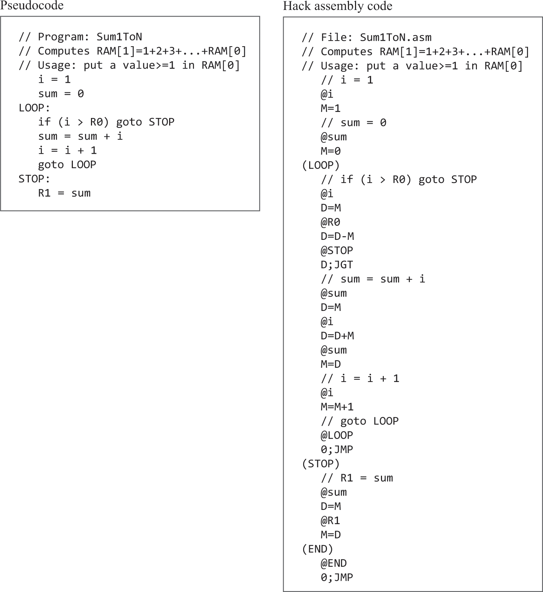

**Figure 4.4** A Hack assembly program (example). Note that `RAM[0]` and `RAM[1]` can be referred to as `R0` and `R1.`

The figure puts pseudocode on the left and Hack assembly on the right.
When the assembly looks mystifying, use the left-hand pseudocode as your roadmap.

Here is the pseudocode in one compact view:

```text
i = 1
sum = 0
LOOP:
  if (i > R0) goto STOP
  sum = sum + i
  i = i + 1
  goto LOOP
STOP:
  R1 = sum
END:
  goto END
```

Now read the Hack listing structurally instead of line by line.

Look for these blocks:

```text
initialization
loop condition / stop condition
loop body
jump back to loop
termination loop
```

That is the low-level version of ordinary structured programming.

If the details still look dense, that is normal.
What matters most right now is seeing how each pseudocode line expands into a few primitive moves.

**Initialization** (set up working variables):

```text
@i
M=1
@sum
M=0
```

Meaning:

```text
RAM[i]   = 1
RAM[sum] = 0
```

**Loop condition** (`if (i > R0) goto STOP`):

```text
@i
D=M
@R0
D=D-M
@STOP
D;JGT
```

Meaning:

```text
D = RAM[i]
D = D - RAM[0]          // i - n
if D > 0: jump to STOP  // i > n
```

Notice the style: the condition is implemented by computing a difference, then jumping based on the ALU output.

**Loop body** (`sum = sum + i`):

```text
@sum
D=M
@i
D=D+M
@sum
M=D
```

Meaning:

```text
D = RAM[sum]
D = D + RAM[i]
RAM[sum] = D
```

**Increment and jump back** (`i = i + 1; goto LOOP`):

```text
@i
M=M+1
@LOOP
0;JMP
```

Meaning:

```text
RAM[i] = RAM[i] + 1
jump to LOOP
```

**Stop and write output** (`R1 = sum`):

```text
@sum
D=M
@R1
M=D
```

Meaning:

```text
RAM[1] = RAM[sum]
```

**Termination loop** (keep the CPU contained after finishing):

```text
(END)
@END
0;JMP
```

Meaning:

```text
loop forever
```

The important pattern to notice is this:

```text
Hack programs are mostly built from two instruction types:
A-instructions
C-instructions
```

And many memory operations have a two-step rhythm:

```text
step 1: select address with @xxx
step 2: do something with that address
```

This simple rhythm is one of the defining traits of Hack.

##### 4.2.3 The Hack Language Specification

Now the chapter turns from examples to a formal contract.

Every Hack instruction is exactly 16 bits wide.

Hack has exactly two instruction families:

```text
A-instruction
C-instruction
```

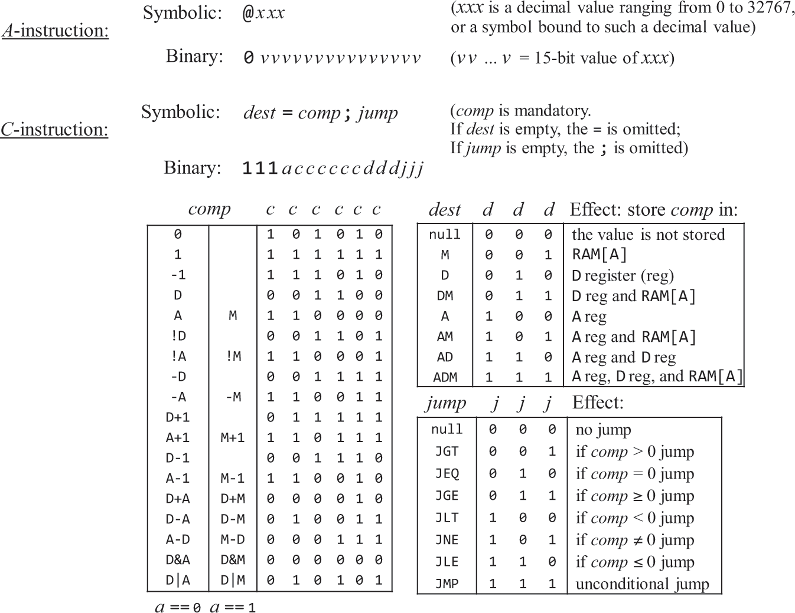

**Figure 4.5** The Hack instruction set, showing symbolic mnemonics and their corresponding binary codes.

This figure works like a dictionary.

When reading any Hack instruction, you can decompose it into fields and then look up what each field is allowed to mean.

So the figure is less about memorization and more about exact legal forms.

This figure is the chapter's central reference table.

It tells you exactly which symbolic spellings are legal and which binary bit patterns they mean.

###### The A-instruction

The `A`-instruction loads a 15-bit value into the `A` register.

Symbolic form:

```text
@xxx
```

Where `xxx` can be:

```text
a constant (like 17)
a symbol that the assembler will resolve (like sum or LOOP)
```

Binary shape:

```text
0vvvvvvvvvvvvvvv
```

Meaning:

```text
leftmost 0  -> this is an A-instruction
remaining 15 bits -> value to load into A
```

Example:

```text
@5  -> 0000000000000101
```

This instruction has three main uses:

```text
load a constant into A
select a RAM address for a later memory operation
select a ROM address for a later jump
```

So `@n` does not by itself add, store, or jump.

It prepares the stage.

For example, if `A` ends up holding 17:

```text
use A as data:     D = A        // D gets 17
use A as address:  D = M        // D gets RAM[A] (RAM[17])
use A as jump:     0;JMP        // jump sets PC = A
```

###### The C-instruction

The `C`-instruction performs actual work.

Its job is to answer three questions:

```text
what to compute?
where to store the result?
what to do next?
```

Binary shape:

```text
111accccccdddjjj
```

The fields mean:

```text
comp -> what the ALU should compute
dest -> where to store the ALU result
jump -> whether to jump (and on what condition)
```

Symbolic shape:

```text
dest=comp;jump
```

Where `dest` and `jump` are optional, but `comp` is always present.

Examples:

```text
D=M        // dest=D, comp=M
0;JMP      // comp=0, jump=JMP
D;JGT      // comp=D, jump=JGT
MD=D+1     // dest=MD, comp=D+1
```

The `comp` field chooses an ALU function.

The two possible data sources are:

```text
D
A or M
```

The `a` bit decides whether the second source is `A` or `M`.

So this is the core idea:

```text
same ALU machinery
different source selection
```

Examples:

```text
D-1
D|M
0
-1
```

The `dest` field tells where the ALU result goes.

Possible destinations are:

```text
A
D
M
```

One, several, or none can be selected at once.

So a single instruction can store the same computed value into multiple places.

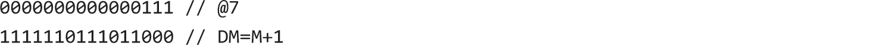

This small example matters because it shows that destination bits can describe several writes at once.

The ALU computes one value, and the control logic can choose to copy that value into more than one target in the same instruction.

The `jump` field decides whether execution continues with the next sequential instruction or jumps to the instruction whose address is currently in `A`.

The decision is based on the ALU output.

The three jump bits test whether that output is:

```text
negative
zero
positive
```

That is why the ALU flags from Chapter 2 matter.

The CPU will use them to decide whether a jump condition is satisfied.

The standard unconditional jump is:

```text
0;JMP
```

This looks odd until you remember that `comp` is mandatory.

So `0;JMP` means:

```text
compute 0 (ignored)
unconditionally jump by setting PC = A
```

One subtle best practice appears here.

Since `A` selects both `RAM[A]` and `ROM[A]`, the book advises:

```text
if a C-instruction uses M, do not also use it for jumping
if a C-instruction jumps, do not also use M in it
```

That discipline avoids conflicting uses of the `A` register in one step.

##### 4.2.4 Symbols

Symbols keep Hack programs readable.

The chapter groups them into three classes:

```text
predefined symbols
label symbols
variable symbols
```

**Predefined symbols** include:

```text
R0 ... R15
SP LCL ARG THIS THAT
SCREEN KBD
```

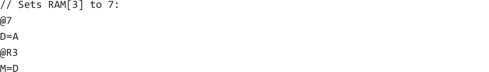

This figure exists to show that symbolic naming is layered.

Some names are predefined by the platform.

Some are introduced by the programmer as labels.

Some are introduced by the programmer as variables.

The assembler keeps those roles straight.

`R0` through `R15` are especially useful because they read like named working registers even though they are really RAM addresses 0 through 15.

`SCREEN` and `KBD` are special because they refer to memory-mapped I/O.

**Label symbols** are declared like this:

```text
(LOOP)
```

This means:

```text
bind LOOP to the address of the next instruction
```

Then a later or earlier jump can use `@LOOP`.

**Variable symbols** are any ordinary symbolic names that are not predefined and are not labels.

The assembler assigns them RAM addresses starting at 16.

This is how names like `i`, `sum`, or `count` become real storage locations without the programmer manually assigning addresses.

##### 4.2.5 Input/Output Handling

Hack handles screen and keyboard through memory maps.

This is a powerful systems idea:

```text
I/O devices look like memory regions
```

That means the CPU can interact with devices using ordinary read and write instructions.

**Screen**:

The Hack screen is a black-and-white grid with:

```text
256 rows
512 columns
```

Its state is stored in an 8K block of RAM starting at address `16384`, also named `SCREEN`.

Each 16-bit word controls 16 horizontal pixels.

So the mapping rule is:

```text
screen word address = SCREEN + row * 32 + col / 16
bit inside word     = col % 16
```

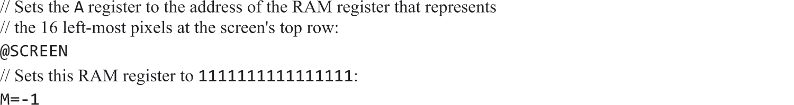

This screen-memory figure is best read as a mapping table from a 2D picture to a 1D memory region.

It explains why graphics at this level feel awkward:

```text
the user sees rows and columns of pixels
the program sees word addresses and bit positions
```

This is the first place where you clearly see why word-level memory access is lower level than pixel-level graphics.

To manipulate one pixel, the program often has to:

```text
read a 16-bit word
change one bit inside it
write the whole word back
```

**Keyboard**:

The keyboard is even simpler.

It is mapped to one RAM location:

```text
KBD = 24576
```

When no key is pressed, `RAM[KBD] = 0`.

When a key is pressed, that location contains the key's code.

This is why the `Fill.asm` project can poll the keyboard in a loop.

##### 4.2.7 Syntax Conventions and File Formats

The language definition also includes the file-level rules.

**Binary files** use the `.hack` extension.

Each line contains one 16-bit binary instruction.

The position of the line in the file is the instruction address loaded into ROM.

**Assembly files** use the `.asm` extension.

Each line is one of:

```text
A-instruction
C-instruction
label declaration
comment
```

Important syntax rules:

```text
labels look like (X)
comments start with //
leading spaces and blank lines are ignored
mnemonics are uppercase
labels are conventionally uppercase
variables are conventionally lowercase
```

The chapter also defines what counts as a valid symbol name.

This seems minor, but it matters because assemblers need exact lexical rules.

#### 4.3 Hack Programming

After defining the language, the chapter returns to programming examples.

The goal is not to memorize each line.

The goal is to internalize the low-level programming style.

**Example 1** computes a simple arithmetic expression.

It reads from `R0` and `R1`, adds the values, adds `17`, and stores the result in `R2`.

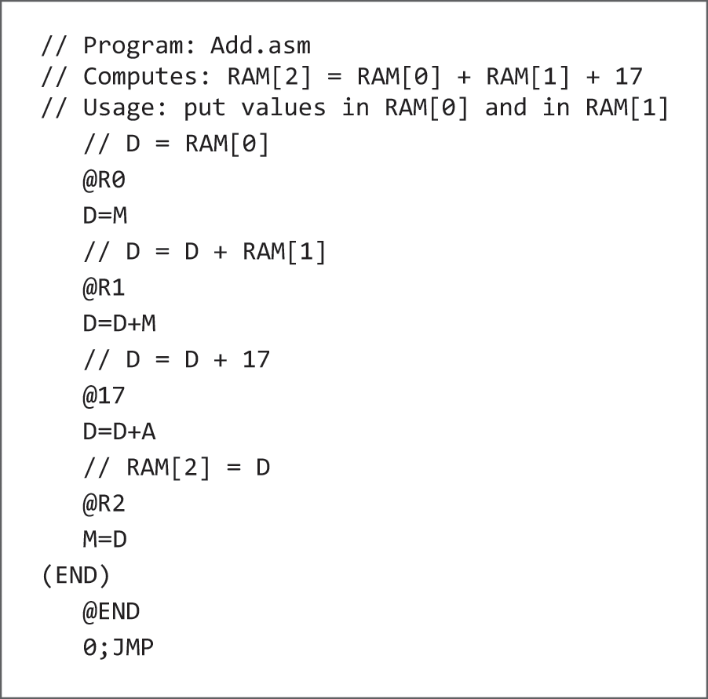

**Figure 4.6** A Hack assembly program that computes a simple arithmetic expression.

This figure is a good first full-program example because every line has an obvious role.

It is mostly just:

```text
read value
read another value
compute
store result
stop safely
```

This example also teaches an important discipline:

```text
end programs with an intentional infinite loop
```

Otherwise the CPU keeps fetching whatever bits happen to come after the program.

The course makes this even more explicit as a best practice: Hack has no real "stop" instruction here, so ending in a deliberate infinite loop keeps execution under control instead of falling into unintended instructions.

**Example 2** revisits the summation program from figure 4.4.

Now the point is not just what it computes, but how to design such code.

The recommended workflow is:

```text
write goto-style pseudocode
trace it on paper
make sure the logic is right
translate it into assembly
```

This is one of the most important learning habits in the chapter.

Assembly is too error-prone to improvise comfortably.

It is far safer to derive it from a clearer intermediate plan.

**Example 3** explains array processing using pointers.

High-level code like:

```text
for (i = 0; i < n; i++) {
    do something with arr[i];
}
```

has no direct array abstraction in machine language.

Instead, the program works with addresses.

The crucial idea is:

```text
a variable can hold an address
```

If `x = 523`, then:

```text
x = 17   -> change x itself
*x = 17  -> change RAM[523]
```

In Hack style, pointer work is typically expressed by first computing an address into `A` and then acting on `M`.

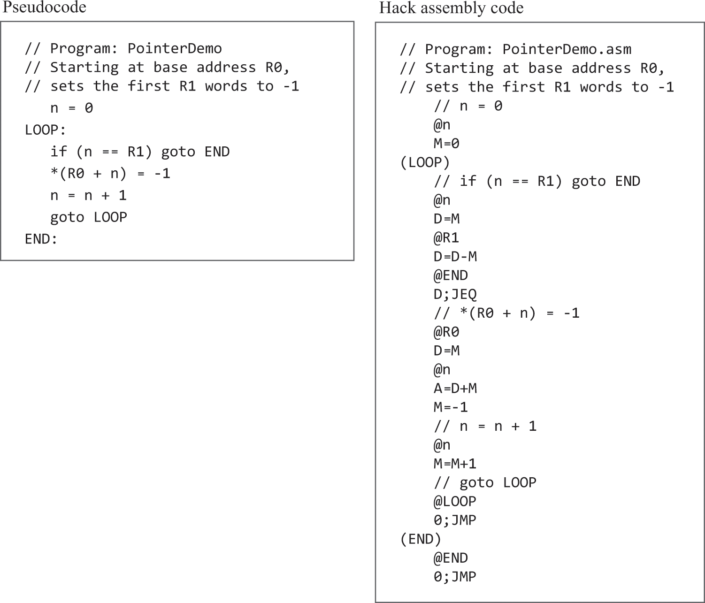

**Figure 4.7** Array processing example, using pointer-based access to array elements.

The heart of the figure is address computation.

The program does not ask for `arr[i]` directly.

It computes the address of that element, puts that address into `A`, and then uses `M` to access the selected memory word.

This small pattern is the seed of much richer high-level behavior.

Later, compilers will reduce array indexing, field access, and many variable manipulations to exactly this sort of address arithmetic plus `M` access.

#### 4.4 Project

Project 4 is different from the first three projects.

You do not build HDL chips here.

You write programs.

The objective is to get direct experience with low-level programming on the Hack platform.

The resources are:

```text
the CPU emulator in nand2tetris/tools
the supplied test scripts in projects/04
```

The project has two programs.

**Mult.asm**:

```text
inputs  -> R0 and R1
output  -> R2
task    -> compute R0 * R1
```

The assumptions are:

```text
R0 >= 0
R1 >= 0
R0 * R1 < 32768
```

The educational point is that multiplication is not a primitive Hack instruction.

So you must realize it in software, typically using repeated addition and a loop.

**Fill.asm**:

```text
if a key is pressed     -> blacken the screen
if no key is pressed    -> clear the screen
```

This program combines two machine-language ideas at once:

```text
poll KBD
write across the SCREEN memory map
```

It also teaches that visible graphics can emerge from plain RAM writes.

The chapter introduces the CPU emulator used for this work:

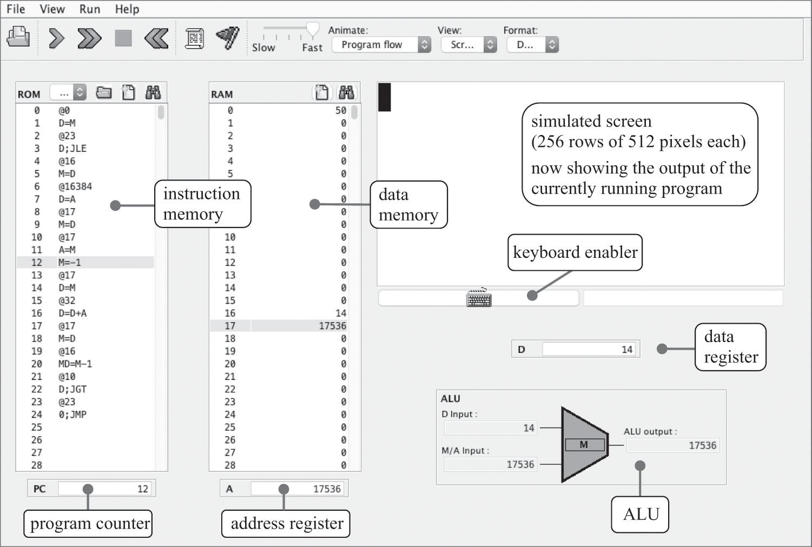

**Figure 4.8** The CPU emulator, with a program loaded in the instruction memory (ROM) and some data in the data memory (RAM). The figure shows a snapshot taken during the program’s execution.

This figure is important because it makes Chapter 4 concrete.

You are no longer just describing instructions abstractly.

You can watch those instructions change machine state in real time.

The emulator shows the state of:

```text
ROM
RAM
A
D
PC
ALU
screen
keyboard input
```

One especially useful convenience is that the emulator can load both:

```text
.hack files
.asm files
```

When given `.asm`, it assembles on the fly.

So for this project, you do not need a separate assembler yet.

Recommended workflow:

```text
write program
load it into the CPU emulator
run the supplied test
fix errors
repeat
```

The course also states some quality expectations for these programs: they should be short, efficient, elegant, and self-describing rather than merely correct.

Practical warning:

```text
Hack assembly is case-sensitive
```

So `@foo` and `@Foo` are different symbols.

#### 4.5 Perspective

Hack machine language is intentionally small.

Real machine languages often have:

```text
more instruction formats
more registers
more addressing modes
more operations
more data types
```

Hack keeps only what the course needs.

Its surface syntax is also friendlier than many industrial assembly languages.

For example:

```text
D=D+M
```

looks algebraic and readable.

But the important mental correction is this:

```text
D+M is not parsed as algebra by the machine
it is a mnemonic naming one allowed ALU operation
```

The deeper architectural limitation is instruction width.

Hack uses 16-bit instructions, and a full memory address already needs 15 bits.

So one instruction cannot conveniently hold both:

```text
a rich operation code
a full memory address
```

That is why Hack behaves like a kind of:

```text
half-address machine
```

Memory-oriented work usually needs two steps:

```text
use @xxx to choose an address
use a C-instruction to act on it
```

This explains the characteristic Hack rhythm:

```text
A-instruction
C-instruction
A-instruction
C-instruction
...
```

If this feels repetitive, the chapter points out that a smarter assembler could support macro-instructions like:

```text
sum=0
goto LOOP
```

and then expand them into ordinary Hack instructions.

So the awkwardness is not a fundamental limit of computation.

It is mostly a deliberate simplification of the language interface.

The course closes with one more practical reminder: most programmers do not write machine-language programs directly.

Usually they write high-level code and let a compiler generate machine code, only dropping closer to the machine in unusual cases like real-time or performance-critical work.

Finally, the chapter closes by returning to the assembler.

The assembler has two jobs:

```text
translate symbolic instructions into binary
resolve symbols into real addresses
```

That translation process becomes the main subject of Chapter 6.
