## Preface

> What I hear, I forget; What I see, I remember; What I do, I understand.
>
> --Confucius (551-479 B.C.)

The book's promise is simple:

```text
Start with one primitive logic gate.
Build a complete computer system.
Run real programs on it.
```

The point is not only to learn hardware or software separately. The point is to understand how the whole stack fits together by building it.

The opening frame is BANG:

```text
Bits
Atoms
Neurons
Genes
```

Atoms, neurons, and genes may never be fully understood from top to bottom. Bits are different. A modern computer can look impossibly complex, but the ideas underneath it can be laid bare.

That is the opportunity of Nand to Tetris: take the machine apart conceptually, then rebuild it from first principles.

Modern computers feel mysterious because each layer hides the layer below it. Interfaces are useful, but they also hide implementations. Proprietary systems hide even more. The result is specialization: one course for programming, another for hardware, another for theory, another for systems.

The book reverses that experience. Instead of accepting the machine as magic, we build each layer from the previous one. Each layer becomes an abstraction with a clear contract:

```text
interface: what the layer promises to do
implementation: how the layer keeps that promise
```

In concrete course terms, the goal is to build a complete, general-purpose, working computer from the ground up, hardware and software. The first course focuses on the hardware computer, called Hack; the second course completes the software hierarchy above it.

The construction path is:

```text
Nand gate
  -> logic gates
  -> arithmetic chips
  -> memory chips
  -> CPU and computer architecture
  -> assembler
  -> virtual machine
  -> compiler
  -> operating system
  -> applications
```

This path is large, so the educational point is also about method. A complex system becomes manageable when it is split into modules, when each module has a precise interface, and when every implementation is built from simpler parts.

Richard Feynman's line captures the spirit of the course:

> What I cannot create, I do not understand.

Nand to Tetris takes that literally. Understanding comes through creation: start with Nand, build the hardware platform, build the software hierarchy, and end with a machine that can run Tetris and other programs.

The second edition clarifies this path and aligns the book more closely with the online course materials.

### Scope

The scope is not "all of computer science." It is the connected path needed to build a working general-purpose computer, then run high-level programs on it.

The selection rule is:

```text
include a topic if it is needed to build the machine,
run programs on the machine,
or support the next abstraction layer
```

That path covers hardware first:

- Boolean arithmetic
- combinational logic and sequential logic
- logic gates, multiplexers, flip-flops, registers, RAM units, and counters
- HDL, chip simulation, verification, and testing

Then it moves into computer architecture:

- ALU and CPU design
- clocks and cycles
- addressing modes
- fetch/execute logic
- instruction sets
- memory-mapped input/output

Once the hardware platform exists, the scope shifts upward through the software stack:

- binary and symbolic machine language
- assembly programming and assemblers
- stack-based virtual machines
- function call and return, including recursion
- a simple object-based, Java-like high-level language
- lexical analysis, parsing, symbol tables, and code generation
- arrays, objects, and two-tier compilation

The programming work is not just to study these abstractions. It is to implement the assembler, virtual machine, and compiler, using supplied APIs and any programming language.

The operating-system layer supplies the services that high-level programs expect:

- memory management
- math routines
- input/output drivers
- string processing
- text output and graphics output
- high-level language support

The course framing makes the split concrete. The first half builds the Hack hardware platform from the ground up. The second half builds the software hierarchy on top of it. In the first course, that means seven weeks, six projects, one computer, and no assumed CS or engineering background.

Each chapter is meant to connect three things: the idea, the tool, and the construction task. For example, Chapter 1 introduces basic Boolean ideas and Nand, then uses HDL and hardware simulation to build elementary logic gates. Later chapters repeat the same pattern at larger scales.

The key word is still minimal. The book does not try to cover every industrial detail. It keeps the smallest cohesive set of topics needed to make the whole system understandable and buildable. That set still includes many central ideas: data structures, algorithms, modular design, interface/implementation contracts, API design, documentation, unit testing, proactive test planning, quality assurance, and programming at large.

### Courses

The material can serve different kinds of learners because it is not a normal single-topic course.

Most courses move along one track:

```text
programming course
  or architecture course
  or compilers course
  or operating systems course
```

Nand to Tetris cuts across those tracks. The book calls this "perpendicular" to the typical computer science curriculum: it can be taken early, late, or outside a formal CS program, because the organizing question is always the same:

```text
What do we need next in order to build the computer?
```

That makes it useful as:

- an early systems course
- a late synthesis course
- a combined architecture-and-compilation course
- a hardware-only course using Part I
- a software-only course using Part II
- a full semester-long build-the-computer experience
- two separate semester-long experiences, depending on pace and depth

The top-level split is modular:

```text
Part I: Hardware
  chapters 1-6
  projects 1-6
  builds the Hack computer

Part II: Software
  chapters 7-12
  projects 7-12
  builds the software hierarchy above Hack
```

Part I requires no prerequisite knowledge. That is why the course introduction can frame the first half as seven weeks, six projects, one computer, and zero assumed CS or engineering background.

Part II does require programming, but not a specific language. The programming prerequisite matters because the learner will implement translators and system software: the VM translator, compiler, and operating-system services.

The course also works for different audiences:

- computer science students who want a systems-oriented introduction
- advanced students who want to synthesize earlier courses
- nonmajors who have learned some programming and want to go deeper
- software developers who want to "go below" their usual high-level tools
- compact applied-CS programs that need a focused systems component

The reason this works is that the main skill is systems thinking:

```text
understand an abstraction
implement it from simpler parts
use it as a building block for the next layer
```

So the same material can be adjusted by pace and depth without changing the central experience: build the stack, one abstraction at a time.

### Resources

The book is supported by the Nand to Tetris software suite and website.

These provide:

- hardware simulator
- CPU emulator
- VM emulator
- assembler and compiler tools
- tutorials
- project files
- test scripts
- comparison files

The tools matter because they make construction concrete. You do not only read that a chip should work. You implement it, run the supplied tests, and see whether it behaves correctly.

### Structure

[Part I](#i-hardware) covers hardware in chapters [1](#1-boolean-logic)–[6](The_Elements_of_Computing_Systems_2021.md#6-assembler): Boolean logic, Boolean arithmetic, memory, machine language, computer architecture, and assemblers. Part [II](The_Elements_of_Computing_Systems_2021.md#ii-software) covers software in chapters [7](The_Elements_of_Computing_Systems_2021.md#7-virtual-machine-i-processing)–[12](The_Elements_of_Computing_Systems_2021.md#12-operating-system): virtual machines, a high-level language, compiler construction, and an operating system. Chapter [13](The_Elements_of_Computing_Systems_2021.md#13-more-fun-to-go) and the appendices extend the journey and supply supporting technical material.

Each chapter follows the same pattern:

```text
concept
  -> abstraction
  -> implementation
  -> project
  -> perspective
```

That pattern is important. Every layer is first treated as a black box that has a clear public behavior. Then the chapter opens the box and shows how to build it.

### Projects

The projects are the main learning method.

The book is not asking you to memorize the computer stack. It is asking you to construct it.

The work includes:

- implementing chips in HDL
- building arithmetic and memory devices
- writing an assembler
- writing a virtual machine translator
- writing a compiler
- writing parts of an operating system
- running programs on the completed machine

The projects are intentionally constrained. Inputs are usually clean. Optimization is usually ignored. The goal is correctness and understanding, not industrial performance.

### The Second Edition

The second edition makes the two arcs clearer:

```text
Part I  -> hardware
Part II -> software
```

It also improves explanations, figures, examples, appendices, and project alignment with the online materials.

The main improvement is conceptual clarity: the book keeps returning to the difference between abstraction and implementation.
## I Hardware

### Introduction

Part I begins the bottom-up hardware path.

The goal is to build a working hardware platform from simple logic gates.

The deeper goal is to learn how complex systems are made from modules:

```text
small parts
  -> named interfaces
  -> tested implementations
  -> larger parts
```

#### Hello, World Below

A simple program like `Hello World` hides a large machine underneath it.

At the top, you see text in a high-level language.

Below that, many transformations happen:

```text
high-level program
  -> parsed and compiled
  -> translated into machine language
  -> executed by a CPU
  -> implemented by chips
  -> built from logic gates
  -> grounded in physical switching devices
```


Read this figure as a vertical stack.

The higher you are in the figure, the more the work looks like software and human intent.

The lower you go, the more the work becomes precise machine-level mechanism.

So the figure is really making one big promise:

```text
everything above is realized by something below
```

The important idea is that programmers usually see only the top layer. This book goes below the surface and rebuilds the hidden layers one by one.

#### Nand to Tetris

The phrase Nand to Tetris means:

```text
from the primitive Nand gate
to a computer that can run an application like Tetris
```

The specific computer is called Hack. The specific high-level language is called Jack.

They are not meant to be industrial standards. They are small enough to understand completely.


Figure `I.1` should be read in both directions.

Going upward:

```text
simple hardware blocks combine into a machine
```

Going downward:

```text
high-level software is translated into simpler and simpler representations
until it becomes machine instructions executed by that hardware
```

The roadmap has two directions:

```text
hardware builds upward
software translates downward
```

Hardware starts with gates and rises toward a machine. Software starts with high-level programs and is translated down into machine instructions.

The first half of the course stops at a working Hack computer and a low-level assembly language. That is enough to run programs, but it is not how most programmers want to work.

The second half asks what must be added to make Hack feel like a normal programming platform:

```text
high-level language
  -> compiler
  -> virtual machine layer
  -> assembler
  -> Hack machine language
  -> Hack hardware
```

The high-level language is Jack. Jack is deliberately simple, but it has the features expected in an introductory programming language: loops, data types, methods, objects, and abstractions.

The missing services are supplied by a standard library, also called the Jack OS:

```text
math operations
string processing
memory management
input and output
text and graphics output
```

So "Hack to Tetris" means closing the gap between a bare computer that understands only low-level instructions and a platform where a programmer can write a game in a high-level language.

#### Abstraction and Implementation

Every module has two views.

The abstraction is:

```text
what the module does
```

The implementation is:

```text
how the module does it
```

Example:

```text
Abstraction: Xor outputs 1 when its inputs differ.
Implementation: Xor can be built from Not, And, and Or gates.
```

When you use a module, you should depend on its abstraction. When you build a module, you must understand its implementation.

This separation is how large systems stay manageable.

#### Methodology

Part I builds about thirty gates and chips using HDL.

HDL is not a programming language in the usual sense. It describes hardware structure:

```text
which lower-level chips exist
how their pins are connected
```

The hardware simulator then tests the design before any physical hardware exists.

That is the practical method of the hardware half:

```text
read the chip abstraction
design a lower-level implementation
write the implementation in HDL
run the supplied test script
debug in the hardware simulator
```

This is how hardware engineers work in practice: they use computers to design, test, and debug hardware before building physical chips.

For a chip like `Xor`, the workflow is concrete:

```text
abstraction: Xor outputs 1 when its two inputs differ
design: choose lower-level gates that realize that behavior
HDL: describe how those gates are connected
test: run the chip against supplied scripts and compare files
```

The same pattern repeats for every chip in the hardware journey.

Part II later uses the completed hardware platform to build the software stack: assembler, virtual machine, compiler, and operating system.

#### The Road Ahead

The full journey contains twelve construction projects.

The course has two directions at once:

```text
Across projects: bottom-up
Within each project: top-down
```

Across projects, we start from Nand and build toward applications.

Within each project, we first understand the desired abstraction, then implement it using already available parts.

In Part I, the concrete destination is the Hack computer. At a high level, Hack has the same core shape as other stored-program computers:

```text
ROM: holds the program instructions
CPU: executes instructions
RAM: stores data
keyboard: supplies input
screen: displays output
```

Once these pieces are connected, the computer can execute programs: Pong, Space Invaders, Sokoban, Tetris, or any other program that can be expressed for the platform.

Part I builds:

```text
Nand
  -> elementary logic gates
  -> arithmetic logic unit (ALU)
  -> registers and memory units
  -> Hack machine language programs
  -> CPU and computer architecture
  -> assembler for Hack machine language
```

The course splits this into six hardware-side projects:

```text
Project 1: build elementary logic gates
Project 2: build the ALU
Project 3: build memory systems
Project 4: write programs in Hack machine language
Project 5: build the Hack computer
Project 6: build an assembler for Hack machine language
```

Notice the pause in project 4. Before building the full computer, you learn the language that the computer will execute. Then project 5 builds the machine that can run that language, and project 6 builds the tool that translates symbolic assembly into executable binary code.

That completed hardware/software boundary becomes the foundation for the higher-level software stack in Part II.

Part II then builds the missing software layers:

```text
Jack program
  -> compiler
  -> VM code
  -> VM translator
  -> Hack assembly
  -> assembler
  -> Hack machine code
  -> Hack computer
```

Meaning:

- the Jack language gives programmers a comfortable high-level notation
- the compiler translates Jack into VM code
- the VM translator translates VM code into Hack assembly
- the assembler translates Hack assembly into binary machine code
- the Hack computer executes that machine code

The operating system and standard library provide the high-level operations that programs assume already exist: printing text, reading input, drawing graphics, doing math, and managing memory. Without this layer, even `Hello World` would require too much low-level work.

### 1 Boolean Logic

> Such simple things, and we make of them something so complex it defeats us, Almost.
>
> --John Ashbery (1927-2017)

Digital hardware stores and processes binary values.

At the physical level, chips can be built from many different technologies. At this level, we ignore those physical details and keep only the logical abstraction:

```text
each signal has one of two values
each chip computes a rule over those values
```

That is why the chapter starts with Boolean logic instead of electronics. We first learn how to describe behavior over `0` and `1`; later we implement that behavior with gates and HDL.

Chapter 1 builds the basic vocabulary of hardware:

```text
Nand
  -> Not, And, Or, Xor
  -> multiplexers and demultiplexers
  -> 16-bit versions
  -> multi-way versions
```

These chips become the standard parts used in the next layers: arithmetic in chapter 2, memory in chapter 3, and eventually the Hack computer.

The main idea is:

```text
Boolean algebra specifies behavior.
Logic gates implement behavior.
HDL wires gates together.
Tests verify the implementation.
```

#### 1.1 Boolean Algebra

Every digital device is built from physical chips designed to store and process binary information. At the physical level, hardware represents signals using two distinct states (typically voltage levels) because two stable values are the easiest and most robust to maintain reliably. 

While the physical representation involves electrical circuits, the logical mapping can use many conceptual labels:

```text
0 / 1          (numerical representation)
off / on       (electrical switch state)
false / true   (logical propositions)
no / yes       (decision logic)
```

Meaning:
- all these labels refer to the same logical abstraction: a binary signal is in one of two distinguishable states
- we use `0` and `1` as the standard mathematical symbols for these states

One binary variable describes `2` possible states. Two binary variables describe `4` possible states. Three binary variables describe `8` states.

In general, the number of states grows exponentially:

```text
N binary variables -> 2^N possible input states
```

Meaning:
- each additional variable doubles the number of possible states in our system
- because this state space is finite, Boolean functions can be described exhaustively by truth tables, unlike functions over infinite numbers

A Boolean function maps binary inputs to a binary output. In prefix notation, we write a function over two variables as $f(x, y)$. In infix notation, we can write $x\ f\ y$, where $x$ and $y$ are called **operands** and $f$ is the **operator**.

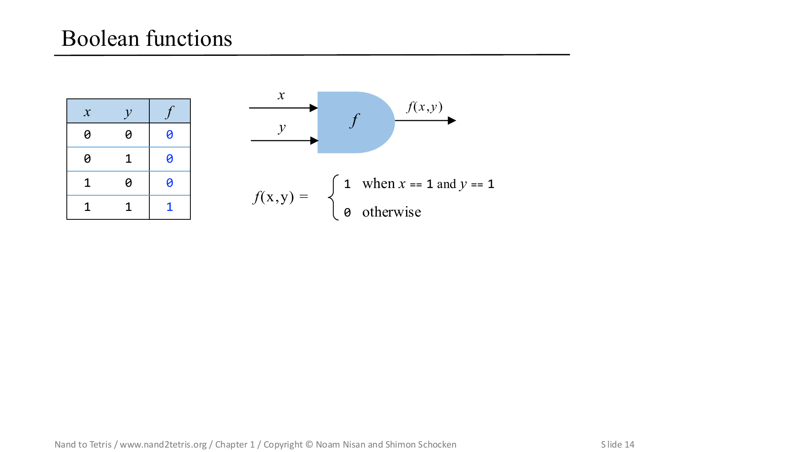

**Figure (Slide 14)** Three equivalent representations of the `And` function: truth table (explicit output for each input combination), gate diagram (the physical symbol used in circuit diagrams), and piecewise definition (a compact rule).

The three basic Boolean operators are:

- **And** (written mathematically as $x \cdot y$, $x \land y$, or $x \text{ And } y$)
- **Or** (written mathematically as $x + y$, $x \lor y$, or $x \text{ Or } y$)
- **Not** (written mathematically as $\bar{x}$, $\lnot x$, or $\text{Not}(x)$)

Behavior rules:

- **And(x, y)** is `1` only when both inputs are `1`
- **Or(x, y)** is `1` when at least one input is `1`
- **Not(x)** is the inverse of the input (outputs `1` only when `x = 0`)


**Figure 1.1** Three elementary Boolean functions.


**Figure 1.2** All the Boolean functions of two binary variables.

To see the complete landscape of two-variable operators, we can look at Slide 21:

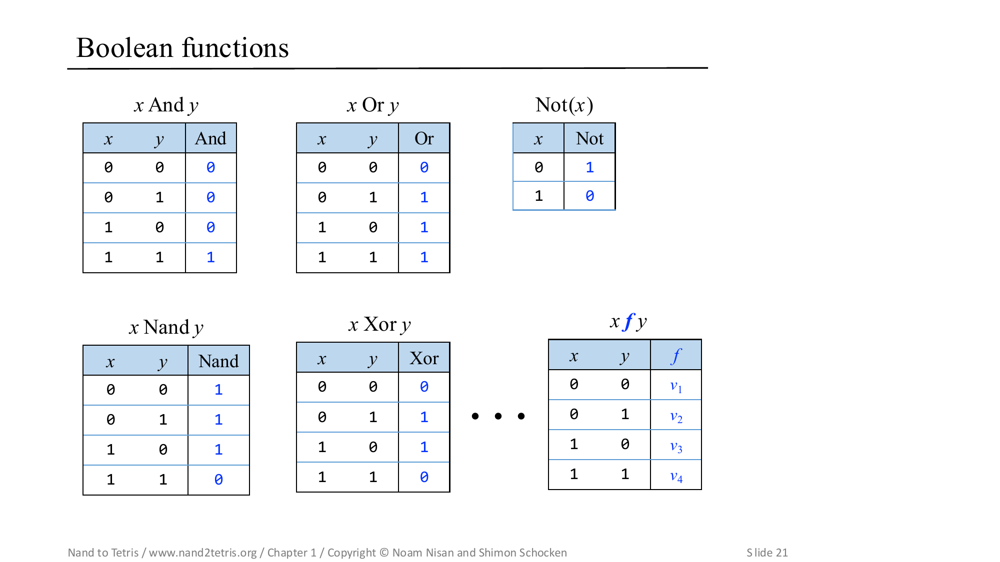

**Figure (Slide 21)** Truth table enumeration of the 16 possible two-input Boolean functions.

Meaning:
- with 2 inputs, there are $2^2 = 4$ possible input combinations (rows)
- since each row's output can be independently chosen as `0` or `1`, there are $2^{2^2} = 2^4 = 16$ possible functions
- these 16 functions include common named operators like:
  - `Nand(x, y)`: Not-And, evaluates to `0` only when both inputs are `1`
  - `Nor(x, y)`: Not-Or, evaluates to `1` only when both inputs are `0`
  - `Xor(x, y)`: Exclusive-Or, evaluates to `1` exactly when the inputs are different

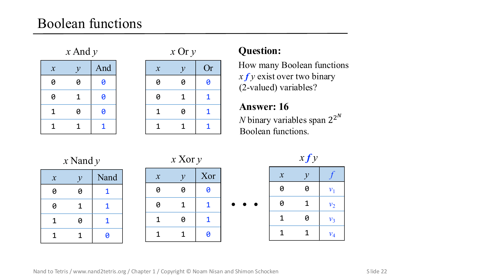

**Figure (Slide 22)** The general formula: *N* binary variables yield $2^{2^N}$ distinct Boolean functions. For $N = 2$: $2^{2^2} = 16$ functions.

**The Expressive Power of Nand**

A key theoretical fact of Boolean logic is that *any* Boolean function can be built using only And, Or, and Not. However, we can reduce this set even further:

```text
Not(x)    = x Nand x
And(x, y) = Not(x Nand y)
Or(x, y)  = Not(Not(x) And Not(y))
```

Meaning:
- `Not(x)` is implemented by feeding the same signal `x` to both inputs of a `Nand` gate
- `And(x, y)` is implemented by inverting the output of a `Nand` gate
- `Or(x, y)` is implemented using De Morgan's law: invert both inputs, feed them to an `And` gate, and invert the output (which simplifies to a combination of `Nand` operations)

Since And, Or, and Not are sufficient to express any Boolean function, and each can be constructed using only Nand, **any Boolean function can be realized using only Nand gates**. This is the theoretical foundation of the entire course: we start with one primitive gate and build a complete computer.

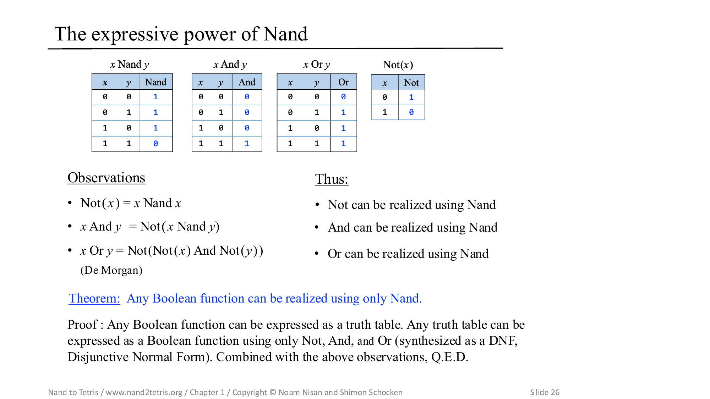

**Figure (Slide 26)** Complete derivation: Nand truth table, the three identities for Not/And/Or in terms of Nand, and the theorem with its full proof sketch using DNF.

##### Boolean Functions

Every Boolean function can be specified using two equivalent representations:

- **Truth Table:** an explicit, data-driven list showing the output value for every possible input combination.
- **Boolean Expression:** a compact, compositional mathematical formula that computes the output.

For three input variables $(x, y, z)$, there are $2^3 = 8$ possible input combinations.


**Figure 1.3** Truth table and functional definitions of a Boolean function (example).

For example, the Boolean expression representing the function in Figure 1.3 is:

```text
f(x, y, z) = (x Or y) And Not(z)
```

Meaning:
- first check if either `x` or `y` is `1`
- then check if `z` is `0` (so `Not(z)` is `1`)
- the entire expression evaluates to `1` only when both conditions are met

Evaluating this expression for a specific row, say $x = 0, y = 1, z = 1$:

```text
Not(0 Or (1 And 1))
  = Not(0 Or 1)
  = Not(1)
  = 0
```

Meaning:
- `1 And 1` evaluates to `1`
- `0 Or 1` evaluates to `1`
- `Not(1)` evaluates to `0` (matching the output in the truth table)

##### Truth Tables and Boolean Expressions

Going from a Boolean expression to a truth table is a mechanical evaluation process. 
Going from a truth table to a Boolean expression is achieved using **Disjunctive Normal Form (DNF)** synthesis:

1. Scan the truth table row-by-row and identify only the rows where the output is `1`.
2. For each `1` row, write a product clause (using `And`) containing all variables:
   - Use the variable directly if it is `1` in that row
   - Use `Not(variable)` if it is `0` in that row
3. Combine all product clauses using `Or`.

Example: Suppose a function $f(x, y, z)$ has output `1` in exactly two rows:

```text
row 1: x = 0, y = 0, z = 0  ->  Not(x) And Not(y) And Not(z)
row 2: x = 0, y = 1, z = 0  ->  Not(x) And y And Not(z)
```

Meaning:
- the first clause is `1` only when all inputs are `0`
- the second clause is `1` only when `x = 0`, `y = 1`, and `z = 0`
- the complete DNF expression is:
  `f(x, y, z) = (Not(x) And Not(y) And Not(z)) Or (Not(x) And y And Not(z))`

We can simplify this synthesized DNF expression using Boolean algebra laws. Because both clauses share `Not(x) And Not(z)`, and `y` or `Not(y)` covers all states of `y`, the variable `y` cancels out:

```text
f(x, y, z) = Not(x) And Not(z)
```

Meaning:
- the output depends only on `x` and `z` being `0`, regardless of what `y` is

Simplifying expressions is the first step toward hardware optimization. Simpler expressions require fewer gates, leading to lower manufacturing costs, less silicon area, lower power consumption, and faster speed.

Boolean algebra provides rules for showing equivalence and simplifying logic:

```text
x And y = y And x                        (Commutative Law)
x Or y = y Or x

x And (y And z) = (x And y) And z        (Associative Law)
x Or (y Or z) = (x Or y) Or z

x And (y Or z) = (x And y) Or (x And z)  (Distributive Law)
x Or (y And z) = (x Or y) And (x Or z)

Not(Not(x)) = x                          (Double Negation)

x And x = x                              (Idempotence)
x Or x = x

Not(x And y) = Not(x) Or Not(y)          (De Morgan's Law)
Not(x Or y) = Not(x) And Not(y)
```

Meaning:
- commutative and associative laws let us reorder and regroup inputs
- distributive laws let us factor terms in and out of clauses
- De Morgan's laws show how to distribute negation across binary operations, changing `And` to `Or` and vice versa

#### 1.2 Logic Gates

A logic gate is a physical or simulated device that implements a Boolean function.

At the physical level, gates can be constructed from a wide variety of technologies:

- silicon transistors (modern chips)
- mechanical switches and electromagnetic relays (early computers)
- optical, biological, hydraulic, pneumatic, quantum, or even domino-based systems

The key architectural benefit is abstraction: by modeling logic gates as mathematical Boolean functions, computer scientists can treat them as black boxes. We ignore the low-level physical dynamics (e.g., voltages, currents, power supplies, or fluid dynamics) and focus entirely on the logical mapping of binary signals. 

This conceptual mapping was first formulated by Claude Shannon in 1937, who showed that switching circuits can be modeled directly by Boolean algebra.

For example, an And gate is defined by the following simple behavior:

```text
And(a, b) = 1 only when a = 1 and b = 1; otherwise, 0
```


**Figure 1.4** Standard gate diagrams of three elementary logic gates: `And`, `Or`, and `Not`.

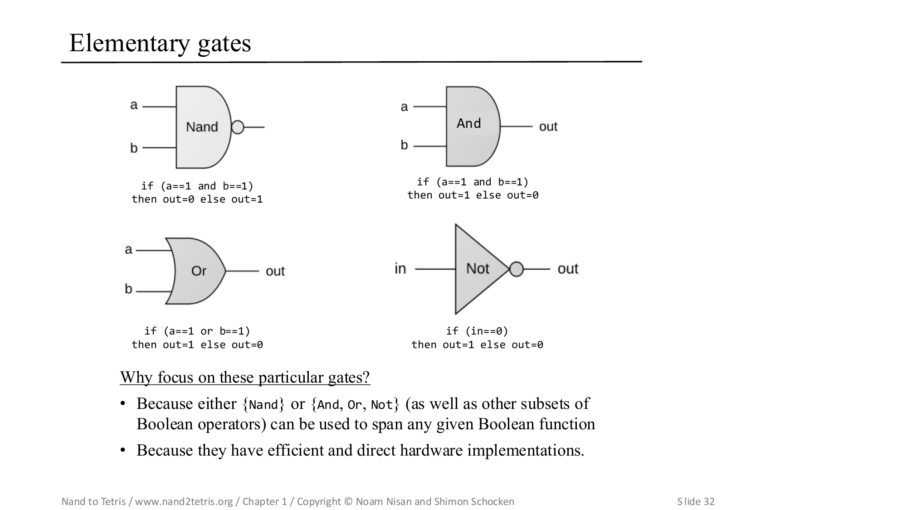

**Figure (Slide 32)** All four elementary gate diagrams side by side: `Nand`, `And`, `Or`, and `Not`, each with their if/else behavioral specification and the rationale for why this specific set is chosen — either `{Nand}` alone or `{And, Or, Not}` together is sufficient to build any Boolean function, and all have efficient hardware implementations.

To visualize how physical circuits relate to these symbols, the slides present conceptual switch/relay implementations:

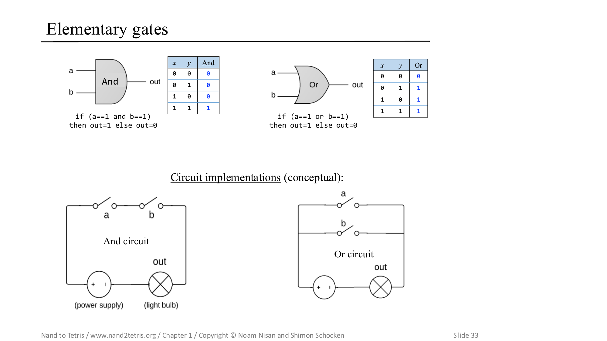

**Figure (Slide 33)** Conceptual circuit switch configurations for `And` and `Or` gates.

Meaning:

- **And circuit:** two switches are connected in series. Both switch `a` and switch `b` must close (set to `1`) for current to reach the output pin.
- **Or circuit:** two switches are connected in parallel. If either switch `a` or switch `b` closes (set to `1`), a pathway is completed for current to reach the output pin.

##### Primitive and Composite Gates

Logic gates use the same binary data types (input signals and output signals are all `0`s and `1`s). This common interface allows us to connect gates together, chaining them to construct **composite gates** of arbitrary complexity.

- **Primitive Gates:** the basic, atomic gates provided as the starting platform (such as `Nand`).
- **Composite Gates:** gates constructed by wiring together primitive gates or other simpler gates.

For example, a three-way `And` gate takes three inputs and outputs `1` only when all three are `1`. We can implement it by nesting two-input `And` gates:

```text
And(a, b, c) = And(And(a, b), c)
```

Meaning:

- first evaluate `And(a, b)`
- pass that intermediate result as the first input to the second `And` gate
- pass the third input `c` as the second input to the second `And` gate
- the final output is `1` only if both `And(a, b)` was `1` (which means `a=1` and `b=1`) and `c` is `1`


**Figure 1.5** Composite implementation of a three-way `And` gate. The rectangular dashed outline defines the boundary of the gate interface.

This modular structure allows any gate to be viewed from two distinct perspectives:

- **External View (Interface):** the gate's black-box specification. It defines the input and output pins, and the logical contract/behavior they guarantee. This is the only level of detail needed by someone *using* the gate.
- **Internal View (Implementation):** the internal architecture showing how smaller gates are wired together. This is relevant only to the gate *builder*.

An interface is unique (specified by one truth table or Boolean expression), but it can be realized by many different internal implementations.

Consider the design of a Exclusive-Or (`Xor`) gate. The external interface is defined verbally: Xor is `1` exactly when the inputs are different. 

The symbolic expression for this interface is:

```text
Xor(a, b) = Or(And(a, Not(b)), And(Not(a), b))
```

Meaning:

- `And(a, Not(b))` is `1` only when `a = 1` and `b = 0`
- `And(Not(a), b)` is `1` only when `a = 0` and `b = 1`
- the final `Or` gate outputs `1` if either of those two mismatch detectors output `1`


**Figure 1.6** `Xor` gate interface (left) and a possible implementation (right).

As shown in the slides, the design process focuses purely on the logical architecture rather than the physical layout:

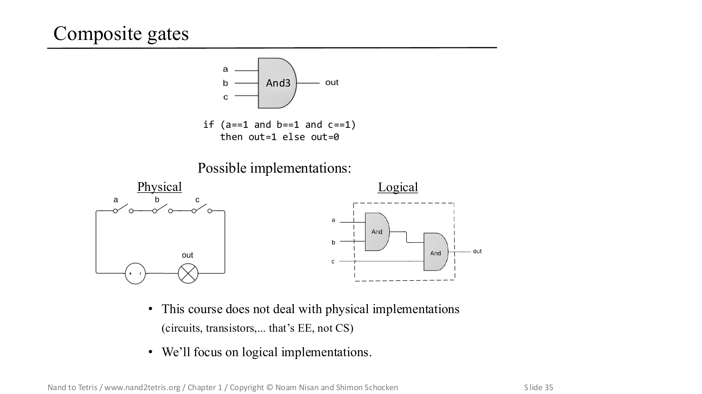

**Figure (Slide 35)** Logical vs. physical implementations of composite gates.

Meaning:

- **Logical Implementation:** the abstract arrangement of logic gates and their connections (the CS focus).
- **Physical Implementation:** the layout of transistors and electrical wiring in silicon (the EE focus). We do not deal with physical layouts in this course.

In logic design, the primary requirement is correctness (the implementation must match the interface). The secondary requirement is efficiency:

- try to minimize the total number of gates used
- fewer gates translate directly to lower manufacturing costs, less energy consumption, and faster computation speed (reduced signal propagation delay)

To sum up, the art of logic design is: given a target gate interface (specification), find an efficient way to implement it using other gates that have already been built.

#### 1.3 Hardware Construction

To understand the necessity of modern hardware design workflows, consider an intentionally naive construction approach: opening a home garage chip fabrication shop. Suppose we are contracted to build a hundred `Xor` gates. 

Using a down payment, we purchase:
- a soldering gun
- a roll of copper wire
- three component bins labeled "And gates," "Or gates," and "Not gates" (each logic gate pre-packaged in a plastic casing exposing its input/output pins and power supply ports)

We mount two `And` gates, two `Not` gates, and one `Or` gate on a board and manually solder wires between their respective input and output pins following the Xor schematic. The result is a sealed plastic casing exposing three pins: inputs `a`, `b`, and output `out`. This composite chip can now be stored in a new bin labeled "Xor gates" and reused as a black-box building block for future designs.

However, this manual physical assembly suffers from severe limitations:
- **No Correctness Guarantee:** There is no way to know if our logic diagram is correct without building it. In complex chips, we must resort to empirical testing (connecting power, manually toggling inputs, and checking outputs), which is slow and messy to fix if a connection is wrong.
- **Scaling Issues:** Manually replicating this assembly process hundreds of times is slow, expensive, and highly error-prone.

Modern hardware engineering bypasses these physical issues entirely by using **abstraction and simulation**. The workflow is:
1. **Design:** The architect plans the logical gate layout (CS focus).
2. **Specify:** The architecture is described textually in a Hardware Description Language (HDL).
3. **Test:** The design is verified virtually in a software simulator.
4. **Optimize:** The simulator quantifies speed, energy consumption, and cost to refine the design.
5. **Realize:** The finalized HDL code acts as a blueprint, which is sent to a specialized robotic fabrication facility to be stamped into silicon.

##### 1.3.1 Hardware Description Language

Hardware Description Language (HDL) is a declarative, functional language used to specify the static physical structure of a chip. Unlike procedural programming languages (e.g., Java or Python), HDL does not execute instructions sequentially; rather, it describes a static network of gates and their physical connections. 

When working with chips, developers wear two distinct hats:
- **The Programmer (User) Hat:** Focuses on the **interface** (the header). The interface is unique, specifying the name of the chip and the inputs/outputs. It represents a strict contract that must be adhered to. This is the only view needed by someone *using* the chip.
- **The Chip Builder Hat:** Focuses on the **implementation** (the `PARTS` section). The implementation can vary, and different designs can realize the same interface with varying efficiencies (fewer gates, lower cost, less power). This is relevant only to the chip *builder*.

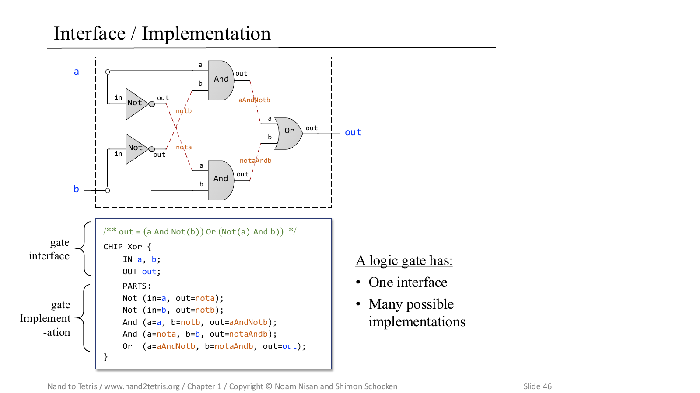

**Figure (Slide 46)** The interface/implementation distinction in HDL. The programmer only needs the interface contract (IN/OUT), while the chip builder implements it in the PARTS block using lower-level components. A logic gate has a single interface but can have many different implementations.

The syntax of a stub (incomplete) chip file begins with the interface declaration, followed by a `PARTS` block to define its internal components.

```text
/** out = (a And Not(b)) Or (Not(a) And b)) */
CHIP Xor {
    IN a, b;
    OUT out;

    PARTS:
    Not (in=a, out=nota);
    Not (in=b, out=notb);
    And (a=a, b=notb, out=aAndNotb);
    And (a=nota, b=b, out=notaAndb);
    Or (a=aAndNotb, b=notaAndb, out=out);
}
```

Meaning:
- `CHIP Xor`: Names the chip `Xor`.
- `IN a, b; OUT out;`: Declares the public inputs `a` and `b`, and output `out`.
- `PARTS:`: Marks the start of the implementation, which instantiates existing components (parts) and wires them together.
- `Not (in=a, out=nota);`: Instantiates a `Not` gate. It connects the chip's public input `a` to the `Not` gate's input pin `in`, and routes its output to an internal pin (wire) named `nota`.
- `Or (a=aAndNotb, b=notaAndb, out=out);`: Connects the internal wires `aAndNotb` and `notaAndb` to the `Or` gate's inputs, and routes the result directly to the chip's public output pin `out`.

Several core syntax rules and conventions govern HDL:
- **No Degrees of Freedom for Part APIs:** When instantiating pre-built components (like `Not`, `And`, `Or`), we must use their official pin signatures (e.g., `in` and `out` for `Not`; `a`, `b`, and `out` for `And`) as defined by their interface contract.
- **Automatic Internal Pins:** Internal connections (like `nota` or `aAndNotb`) represent internal wires. They are created automatically the first time they appear in the `PARTS` block.
- **Unlimited Fan-Out (Simultaneous Branching):** A single signal can be copied and distributed to multiple destinations simultaneously. For instance, input `a` is routed simultaneously to both a `Not` gate and an `And` gate. HDL has unlimited fan-out.
- **Declarative and Order-Insignificant:** Statements in the `PARTS` section can be written in any order because they describe a static physical layout rather than sequential steps. However, it is customary to order statements from left to right to match the schematic flow and improve readability.
- **The `a=a`, `out=out` Syntax:** In the Hack architecture, two-input chips conventionally use inputs `a` and `b`, and output `out`. This leads to statements like `And(a=a, b=notb, out=aAndNotb)` or `Or(..., out=out)`. In these expressions, the name on the left of the equals sign refers to the *part's input/output pin*, while the name on the right refers to the *chip's input/output or internal pin* that is being wired to it.
- **Simplified Educational Language:** Real-world hardware design uses industry-standard languages like VHDL and Verilog (which cover 90% of designs). The HDL in this course is a minimal, simplified subset that captures their essential concepts and can be learned in an hour, providing all the capabilities needed to build a computer.

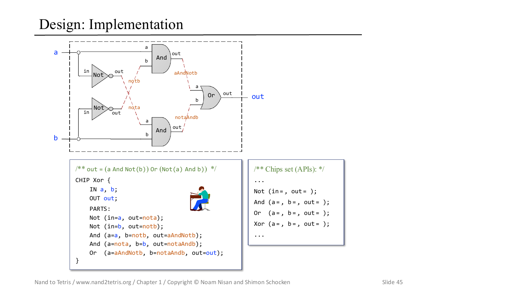

**Figure (Slide 45)** Gate diagram and corresponding HDL implementation for the Xor chip. The internal wires (`nota`, `notb`, `aAndNotb`, `notaAndb`) in the schematic map directly to the output pins of the respective part instantiations in the HDL code.


**Figure 1.7** Gate diagram and HDL implementation of the Boolean function $Xor(a, b) = Or(And(a, Not(b)), And(Not(a), b))$, used as an example. A test script and an output file generated by the test are also shown. Detailed descriptions of HDL and the testing language are given in appendices [2](#appendix-2-hardware-description-language) and [3](#appendix-3-test-description-language), respectively.

##### Testing

Quality assurance requires systematic and repeatable testing. Hardware simulators verify design correctness by running test scripts written in a scripting language.

There are two primary modes of simulation:
1. **Interactive Simulation:** The developer manually loads the HDL file, inputs test values into the GUI, evaluates the chip logic, and inspects the output and internal pins to debug failures.
2. **Script-Based Simulation:** The developer loads a test script (`.tst` file) that automates the testing cycle. The script sets inputs, evaluates the logic, and records output values in an output file (`.out`).

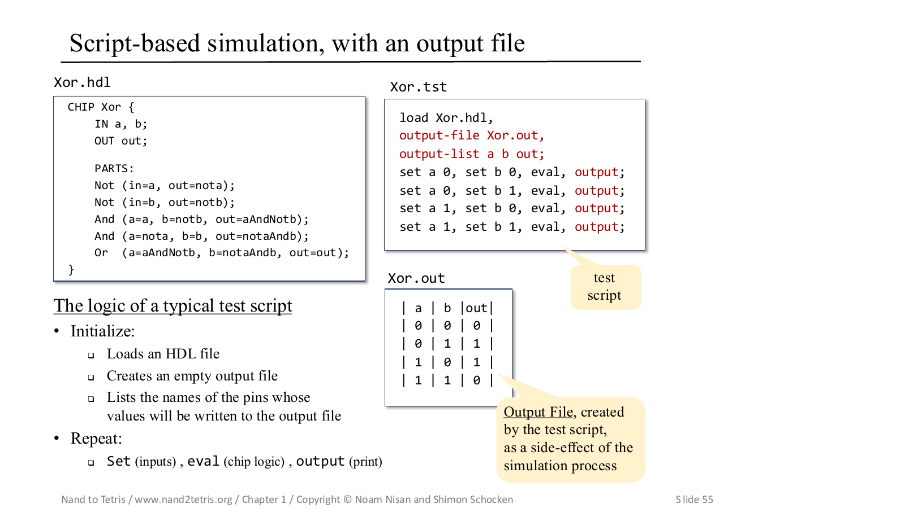

**Figure (Slide 55)** The logic and structure of script-based simulation with an output file. The test script initializes by loading the HDL, creating an empty output file, and specifying the pins to output. It then repeats the set, eval, and output cycle to construct the output file.

To automate validation, the simulator can load a **compare file** (`.cmp`) containing the expected outputs. The simulator compares the generated output file line-by-line against the compare file, throwing a comparison error if a mismatch occurs. This is critical for complex chips (like an ALU or CPU) where manual visual validation is impossible.

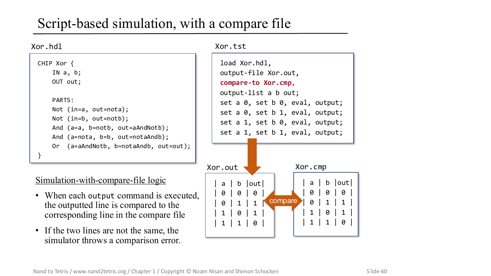

**Figure (Slide 60)** Script-based simulation with a compare file. When the test script executes an `output` command, the simulator compares the generated line in `.out` against the corresponding line in `.cmp`, throwing a comparison error if a mismatch occurs.

**Behavioral Simulation:** Before implementing a chip in HDL, the system architect can define the chip's logic in a high-level language like Java. This executable logic can be run to generate compare files, allowing the entire computer architecture to be planned and validated before any HDL is written.

##### 1.3.2 Hardware Simulation

Writing and debugging HDL programs mirrors conventional software development, but instead of compiling code, developers use a **hardware simulator** to virtually construct and test circuits. A hardware simulator parses the declarative HDL, builds a virtual representation of the gate network, executes inputs, and records outputs. The simulator in this course is written in Java and supports both interactive manual testing and automated script-based verification.

###### Interactive Simulation

For quick experiments and initial debugging, the developer interactively probes the chip using the simulator's GUI:
1. **Load the HDL File:** Click the load icon to load the `.hdl` file. The code is displayed in the bottom-left pane. Crucially, **this pane is read-only**. To modify the chip's logic, the developer must edit the file in an external text editor, save it, and click reload in the simulator.
2. **Manipulate Input Pins:** Click input fields in the "Input pins" pane to toggle values between `0` and `1`.
3. **Evaluate the Logic:** Click the calculator/evaluate icon to trigger logic evaluation. The simulator will not propagate signals until this action is taken.
4. **Inspect Results:** Inspect the output pin values in the "Output pins" pane and verify intermediate signal states in the "Internal pins" pane to trace errors.

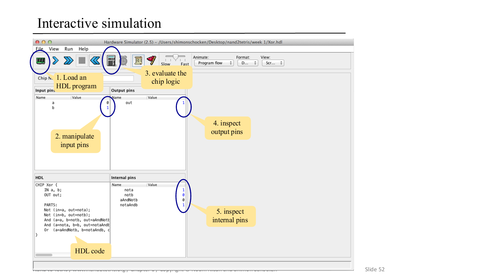

**Figure (Slide 52)** The interactive simulation workflow in the Hardware Simulator GUI. The numbers map the sequential steps of loading a chip, manually setting input pin values, evaluating the logic, and inspecting the outputs and internal pins.

###### Script-Based Simulation

While manual testing is sufficient for simple 2-input gates like `Xor`, it becomes tedious and error-prone for complex components (like an ALU or CPU). Systematic quality assurance relies on **test scripts** (`.tst` files) written in a simple, declarative scripting language.

A test script coordinates simulation by executing commands sequentially. The simulator interface displays the currently loaded script, highlighting the next statement to be executed with a yellow bar (cursor). Clicking play runs the commands until the next semicolon is hit.

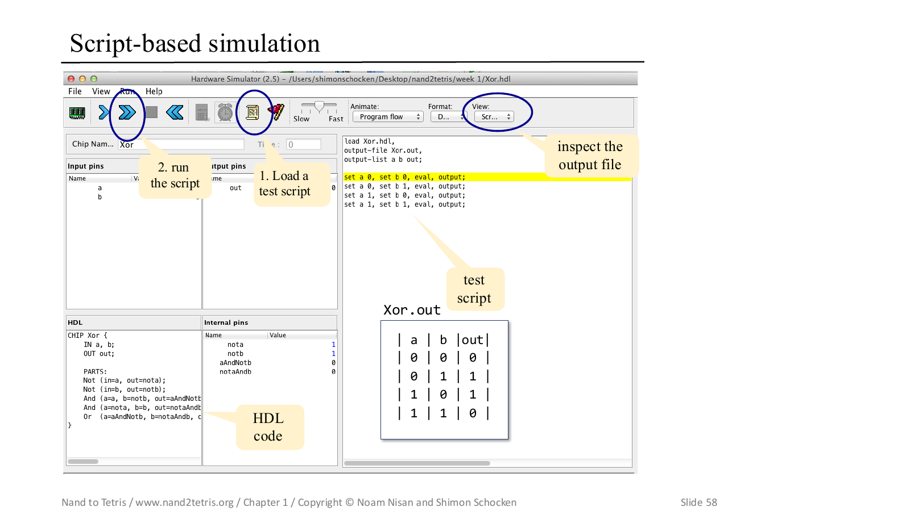

**Figure (Slide 58)** The script-based simulation workflow in the Hardware Simulator GUI. The numbers map out loading the test script, running it, and inspecting the resulting output file inside the GUI.

A typical script utilizes several primitive directives:

```text
load Xor.hdl,
output-file Xor.out,
compare-to Xor.cmp,
output-list a%B3.1.3 b%B3.1.3 out%B3.1.3;

set a 0, set b 0, eval, output;
set a 0, set b 1, eval, output;
```

Meaning:
- `load Xor.hdl;` — Loads the target chip logic into the simulator.
- `output-file Xor.out;` — Prepares a new file to log simulation results.
- `compare-to Xor.cmp;` — Specifies the expected correct output file for automated assertion.
- `output-list a%B3.1.3 b%B3.1.3 out%B3.1.3;` — Formats the layout, column spacing, and padding of the variables recorded in the output file.
- `set a 0, set b 0;` — Binds the chip's input pins `a` and `b` to the value `0`.
- `eval;` — Evaluates the chip logic (equivalent to clicking the calculator GUI button).
- `output;` — Appends the currently monitored pin states to the output file.

###### Automated Verification & Compare Files

The output file (`.out`) generated by a simulation is a side-effect of the script execution. For simple gates, the resulting file matches the gate's truth table. To eliminate manual verification, the simulator performs automated line-by-line assertions:

* When the test script executes the `output` command, the simulator compares the generated output line directly to the corresponding line in the loaded compare file (`.cmp`).
* If a mismatch occurs, the simulator throws a **comparison error** immediately, pinpointing exactly where the implementation diverges from the specification.


**Figure (Slide 55)** The logic and structure of script-based simulation with an output file. The test script initializes by loading the HDL, creating an empty output file, and specifying the pins to output. It then repeats the set, eval, and output cycle to construct the output file.


**Figure (Slide 60)** Script-based simulation with a compare file. When the test script executes an `output` command, the simulator compares the generated line in `.out` against the corresponding line in `.cmp`, throwing a comparison error if a mismatch occurs.

###### Behavioral Simulation

Before committing to a hardware implementation in HDL, a system architect can model the chip's logic in a high-level language like Java. This executable description can run to generate the expected `.cmp` files. This technique allows a complex computer architecture to be fully planned, integrated, and validated in software before writing any HDL code.

###### Divide and Conquer

This structured testing environment enables a clean separation of roles:
- **The System Architect:** Standardizes the overall system layout, defines chip APIs, and creates stub HDL files, test scripts (`.tst`), and compare files (`.cmp`).
- **The Hardware Developer:** Takes these resources as specifications, implements the missing gate logic in HDL, runs the tests, and iterates until the simulator reports that the comparison succeeded.

In this course, Shimon and Noam act as the system architects, providing stubs and tests for the 30 chips in the Hack chipset. The student acts as the developer, writing the HDL code to satisfy the automated test suite.


**Figure 1.8** A hardware simulator executing a test script for the `Xor` chip. The simulator state displays the current pin values. The output file generated by the simulation is compared line-by-line against a supplied compare file to verify correctness.

#### 1.4 Specification

This section specifies the chips needed for Project 1.

The specification answers:

```text
What should each chip do?
```

It does not yet answer:

```text
How should each chip be built?
```

That separation is the core discipline of the course.

##### 1.4.1 Nand

Nand is the primitive gate.

Its behavior is:

```text
Nand(a, b) = NOT(a AND b)
```

So it outputs `0` only when both inputs are `1`.


These two small figures give the two standard views of `Nand`:

```text
symbol / gate icon
truth table / exact behavior
```

The truth table is especially important because it shows the complete rule in one sentence:

```text
Nand outputs 0 only in the case 1,1
and 1 everywhere else
```

Everything else in Chapter 1 can be built from this gate.

##### 1.4.2 Basic Logic Gates

The basic gates are:

```text
Not
And
Or
Xor
Mux
DMux
```


These figures collect the basic chip APIs of the chapter.

For `Not`, `And`, `Or`, and `Xor`, the important point is that each chip has a tiny, exact contract.

For `Mux` and `DMux`, the new idea is control.

The selector does not carry data.

It tells the circuit how to route data.

That is why these chips become so important later in memory chips and CPUs.

The multiplexer chooses one of two inputs:

```text
if sel = 0: out = a
if sel = 1: out = b
```

The figure should be read as a controlled choice:

```text
two possible data sources
one selector bit
one chosen output
```


The demultiplexer routes one input to one of two outputs:

```text
if sel = 0: a = in, b = 0
if sel = 1: a = 0,  b = in
```


This is the mirror image of the `Mux` idea.

Instead of many inputs competing for one output, one input is routed toward one chosen destination.

Mental model:

```text
Mux chooses a value.
DMux chooses a destination.
```

##### 1.4.3 Multi-Bit Versions of Basic Gates

Computers usually process words, not isolated bits.

A word like a 16-bit value is carried by 16 separate wires traveling in parallel.

When we decide to treat those 16 wires as one named object, we call that bundle a **bus**.

So a bus is not a new physical thing.

It is still just many ordinary wires.

The abstraction is that HDL lets us talk about the bundle as one meaningful value instead of naming each wire separately.

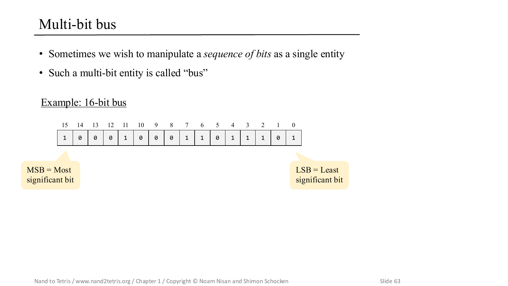

**Figure (Slide 63)** A 16-bit bus is one bundle of 16 wires, indexed from `15` down to `0`.

For a 16-bit bus:

```text
a[16] means: bus a has 16 wires
a[15] is the most significant bit (MSB)
a[0]  is the least significant bit (LSB)
```

That notation can be confusing at first, because the brackets are used in two related but different ways:

```text
IN a[16];   -> declares the width of the bus
a[3]        -> selects one particular wire inside that bus
```

A 16-bit gate applies the same operation to each bit position.

Example:

```text
And16(a[16], b[16], out[16])

out[0]  = And(a[0],  b[0])
out[1]  = And(a[1],  b[1])
...
out[15] = And(a[15], b[15])
```

Meaning:
- `a[16]`, `b[16]`, and `out[16]` are whole 16-wire bundles
- each output wire is computed from the matching input wires at the same position
- the chip does the same 1-bit operation 16 times in parallel


These figures show the same interface ideas from earlier, but widened from one bit to sixteen bits.

The first important reading rule is:

```text
same logic idea
same control idea
more wires
```

The operation is not new.

Only the width changes.

The course then shows two different ways HDL lets us work with buses.

**Whole-bus use** means one chip consumes or produces the entire multi-bit value at once.

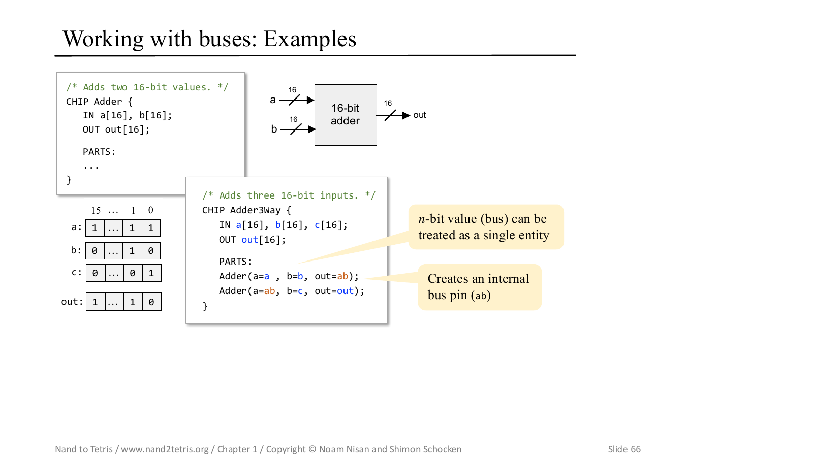

**Figure (Slide 66)** HDL can pass an entire bus through one pin name and can also create an internal bus like `ab`.

Example:

```text
CHIP Adder3Way {
    IN a[16], b[16], c[16];
    OUT out[16];

    PARTS:
    Adder(a=a,  b=b,  out=ab);
    Adder(a=ab, b=c,  out=out);
}
```

Meaning:
- `a`, `b`, and `c` are each entire 16-bit inputs
- the first `Adder` consumes two whole buses and produces another whole bus named `ab`
- `ab` is an internal 16-bit bus carrying the intermediate sum
- the second `Adder` takes that entire intermediate bus and adds `c` to it

This is why the selector rule matters so much for chips like `Mux16`.

The selector is still only one control value.

For example, a `Mux16` does not choose separately for each bit.

It chooses one entire 16-bit input word or the other.

So the data path becomes wider, but the control meaning stays at the word level.

The second HDL pattern is **bit selection**.

Sometimes we want to reach inside a bus and connect particular wires one by one.

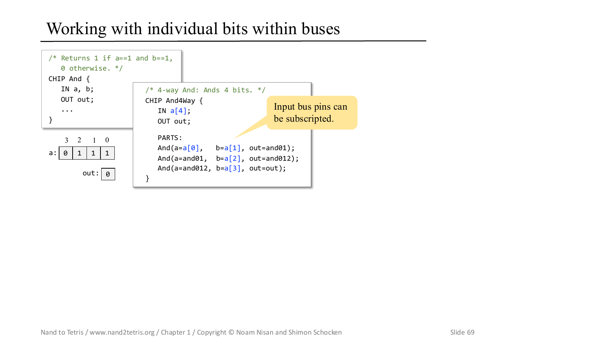

**Figure (Slide 69)** Input bus pins can be subscripted so a composite chip can refer to individual wires like `a[0]` or `a[3]`.

Example:

```text
CHIP And4Way {
    IN a[4];
    OUT out;

    PARTS:
    And(a=a[0],   b=a[1], out=and01);
    And(a=and01,  b=a[2], out=and012);
    And(a=and012, b=a[3], out=out);
}
```

Meaning:
- the first `And` combines bit `0` and bit `1` of the input bus
- the second `And` combines that partial result with bit `2`
- the third `And` combines that result with bit `3`
- the final output answers one question: are all four input bits equal to `1`?

We can also subscript outputs when we want a bit-wise operation that preserves width.

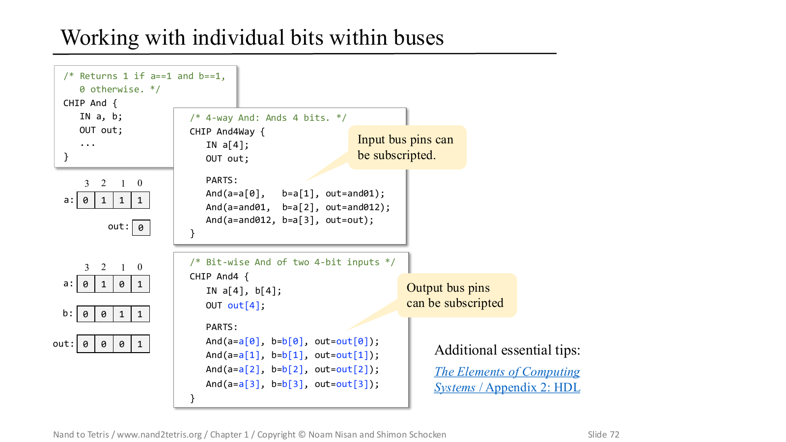

**Figure (Slide 72)** Output bus pins can also be subscripted, so each bit position can be written explicitly.

Example:

```text
CHIP And4 {
    IN a[4], b[4];
    OUT out[4];

    PARTS:
    And(a=a[0], b=b[0], out=out[0]);
    And(a=a[1], b=b[1], out=out[1]);
    And(a=a[2], b=b[2], out=out[2]);
    And(a=a[3], b=b[3], out=out[3]);
}
```

Meaning:
- each `And` here is still a 1-bit gate
- `a[0]` only talks to `b[0]`, and the result goes to `out[0]`
- `a[1]` only talks to `b[1]`, and so on for each position
- this is bit-wise processing: matching bit positions are handled independently in parallel

HDL also lets us connect **sub-buses**.

That means we can take a continuous slice of wires from a wider bus and plug that slice into some part input or output.

Example:

```text
CHIP JoinBytes {
    IN low[8], high[8];
    OUT out[16];

    PARTS:
    Some16BitPart(in[0..7]=low, in[8..15]=high, out=out);
}
```

Meaning:
- `in[0..7]` means: connect the low 8 wires of the 16-bit bus
- `in[8..15]` means: connect the high 8 wires of the same bus
- HDL is still describing plain wiring, just at the level of slices instead of single wires

The transcript also points out three practical HDL conventions that are easy to miss:

```text
internal bus width is inferred from what it connects to
sub-bus ranges may overlap
true and false can fill an entire bus
```

So if an internal name is first connected to a 16-bit output, HDL treats that internal connection as a 16-bit bus.

And if you write `true` or `false` into a multi-bit connection, HDL replicates that value across every wire in the bus.

Example:

```text
Mux16(a=a, b=false, sel=reset, out=masked);
```

Meaning:
- `false` here does not mean one bit only
- it means a 16-bit bus of all `0`s
- if `reset = 1`, the mux outputs sixteen `0` bits

So the practical ladder is:

```text
bus = many wires traveling together
whole-bus connection = treat the bundle as one value
subscripted connection = reach inside the bundle and touch one wire
```

That is the whole idea behind multi-bit versions of the basic gates.

The logic is familiar.

HDL just gives us a clean way to describe wider data paths.

##### 1.4.4 Multi-Way Versions of Basic Gates

Multi-way gates generalize selection to more inputs or outputs.

Examples:

```text
Or8Way    -> OR together 8 inputs
Mux4Way16 -> choose 1 of 4 16-bit inputs
DMux8Way  -> route input to 1 of 8 outputs
```


`Or8Way` is a reduction operation.

It answers one question:

```text
is any one of these inputs equal to 1?
```

You can picture it as a small tree of `Or` gates collapsing eight wires into one result.

To choose among `m` inputs, you need enough selector bits to name each choice:

```text
number of selector bits = log2(m)
```

For example:

```text
4 choices -> 2 selector bits
8 choices -> 3 selector bits
```


These multi-way mux figures are useful because they show selection as a hierarchy.

You do not need a magical new primitive.

You can build a 4-way or 8-way choice by combining simpler 2-way choices in stages.

Demultiplexers use the same idea in reverse: the selector chooses where the input goes.


Again, the multi-way `DMux` should be read as staged routing.

One control value picks one branch, then possibly another, until exactly one output line receives the input signal.

#### 1.5 Implementation

After specifying the chips, the chapter explains how to build them.

The practical rule is:

```text
build small gates first
test them
reuse them to build larger gates
```

##### 1.5.1 Behavioral Simulation

Behavioral simulation means the simulator provides a chip's behavior directly.

This is useful when:

```text
you want to test a higher-level design
but a lower-level chip is not implemented yet
```


Figure `1.16` explains why built-in chips are useful during development.

They let you test the current chip as if all lower layers were already correct.

So behavioral simulation is really a way to isolate the design problem you are working on right now.

The built-in chip has the same interface as the HDL chip. The difference is only where the behavior comes from.

##### 1.5.2 Hardware Implementation

The implementation path starts from Nand.

Example ladder:

```text
Nand
  -> Not
  -> And
  -> Or
  -> Xor
  -> Mux and DMux
  -> 16-bit and multi-way chips
```

Once a chip works, use it as a building block. Do not keep rebuilding everything from raw Nand unless the project requires it.

##### 1.5.3 Built-In Chips

The simulator looks for chip implementations in two places:

```text
current project folder
built-in tools folder
```

If your HDL file is missing, the simulator may use a built-in version.

This is useful as a fallback, but the project goal is still to implement the specified chips yourself.

#### 1.6 Project

Project 1 asks you to implement the chapter's 15 logic gates using HDL, starting from the primitive `Nand` gate. 

The computer we are building consists of about 30 different chips in total. Project 1 lays the foundational layer of this bottom-up construction, providing the elementary logic toolkit needed to build all subsequent components (the ALU, registers, RAM, CPU, and eventually the entire computer platform).

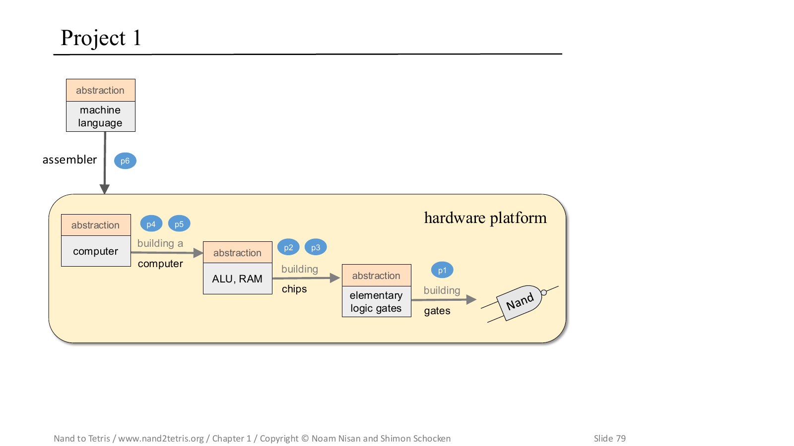

##### 1.6.1 The 15 Logic Gates
The 15 chips in Project 1 can be grouped into three logical categories:

1. **Elementary Logic Gates**: Basic two-input logic operations and control gates.
   * `Not`, `And`, `Or`, `Xor`, `Mux`, `DMux`
2. **16-Bit Variants**: Parallel versions of elementary gates that process 16-bit wide buses.
   * `Not16`, `And16`, `Or16`, `Mux16`
3. **Multi-Way / Multi-Way 16-Bit Variants**: Multi-input selectors and distributors processing single bits or 16-bit buses.
   * `Or8Way`, `Mux4Way16`, `Mux8Way16`, `DMux4Way`, `DMux8Way`

Implementation links: [`Not`](projects/project-01-boolean-logic.md#not), [`And`](projects/project-01-boolean-logic.md#and), [`Or`](projects/project-01-boolean-logic.md#or), [`Xor`](projects/project-01-boolean-logic.md#xor), [`Mux`](projects/project-01-boolean-logic.md#mux), [`DMux`](projects/project-01-boolean-logic.md#dmux), [`Not16`](projects/project-01-boolean-logic.md#not16), [`And16`](projects/project-01-boolean-logic.md#and16), [`Or16`](projects/project-01-boolean-logic.md#or16), [`Mux16`](projects/project-01-boolean-logic.md#mux16), [`Or8Way`](projects/project-01-boolean-logic.md#or8way), [`Mux4Way16`](projects/project-01-boolean-logic.md#mux4way16), [`Mux8Way16`](projects/project-01-boolean-logic.md#mux8way16), [`DMux4Way`](projects/project-01-boolean-logic.md#dmux4way), and [`DMux8Way`](projects/project-01-boolean-logic.md#dmux8way).

The work happens in `nand2tetris/projects/01`.

##### 1.6.2 Deep Dive: Multiplexer and Demultiplexer
The multiplexer (`Mux`) and demultiplexer (`DMux`) gates are the most sophisticated gates in this chipset. They act as logical traffic controllers in hardware systems.

###### Multiplexer (Mux)
A multiplexer acts as a selector that routes one of two inputs (`a` or `b`) to a single output (`out`) based on the value of a select bit (`sel`).

* **Interface**:
  * Inputs: `a` (input line), `b` (input line), `sel` (control line)
  * Output: `out`
* **Behavior Rules**:
  * If `sel == 0`: `out = a`
  * If `sel == 1`: `out = b`

Abbreviated Truth Table:

| `sel` | `out` |
|:-----:|:-----:|
|   0   |   a   |
|   1   |   b   |

###### Demultiplexer (DMux)
A demultiplexer is a distributor that routes a single input signal (`in`) to one of two outputs (`a` or `b`) depending on a select bit (`sel`). All other channels receive `0`.

* **Interface**:
  * Inputs: `in` (input line), `sel` (control line)
  * Outputs: `a`, `b`
* **Behavior Rules**:
  * If `sel == 0`: `{a, b} = {in, 0}` (routes input to channel `a`, forces channel `b` to 0)
  * If `sel == 1`: `{a, b} = {0, in}` (routes input to channel `b`, forces channel `a` to 0)

###### Application 1: Programmable Gate (AndMuxOr)
A programmable gate changes its logical behavior according to a selection bit. We can combine `And`, `Or`, and `Mux` gates to construct a chip that acts as an `And` gate when `sel` is 0, and as an `Or` gate when `sel` is 1.

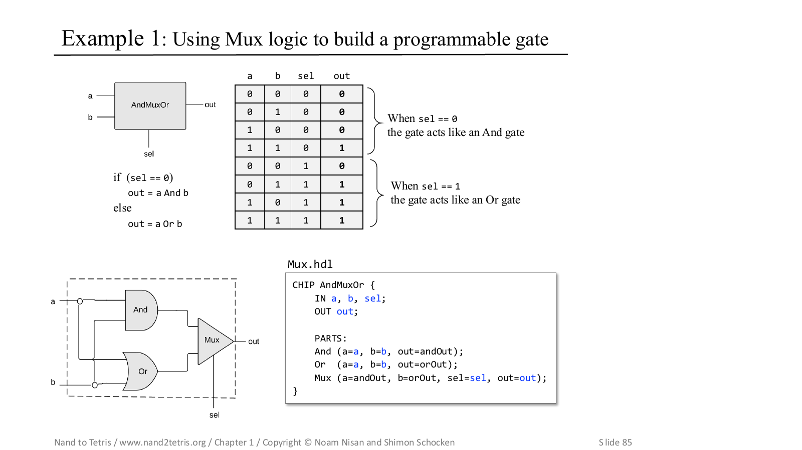

Wiring architecture for a programmable gate `AndMuxOr`:
1. Fan out inputs `a` and `b` simultaneously into both an `And` gate and an `Or` gate.
2. Route the output of the `And` gate to input `a` of a `Mux` gate.
3. Route the output of the `Or` gate to input `b` of the same `Mux` gate.
4. Use the select pin `sel` of the `Mux` to choose between the two behaviors.

HDL implementation:
```hdl
CHIP AndMuxOr {
    IN a, b, sel;
    OUT out;

    PARTS:
    And (a=a, b=b, out=andOut);
    Or (a=a, b=b, out=orOut);
    Mux (a=andOut, b=orOut, sel=sel, out=out);
}
```

Meaning:
* `And (a=a, b=b, out=andOut);` — Evaluates $a \land b$ and stores the intermediate result in the internal wire `andOut`.
* `Or (a=a, b=b, out=orOut);` — Evaluates $a \lor b$ and stores the intermediate result in the internal wire `orOut`.
* `Mux (a=andOut, b=orOut, sel=sel, out=out);` — Selects `andOut` (if `sel` is 0) or `orOut` (if `sel` is 1) and routes it to the main chip output `out`.

###### Application 2: Communications Interleaving (Braiding)
In communication networks, multiplexers and demultiplexers are used to share a single physical transmission line among multiple channels (such as transmitting multiple music streams or movies simultaneously).

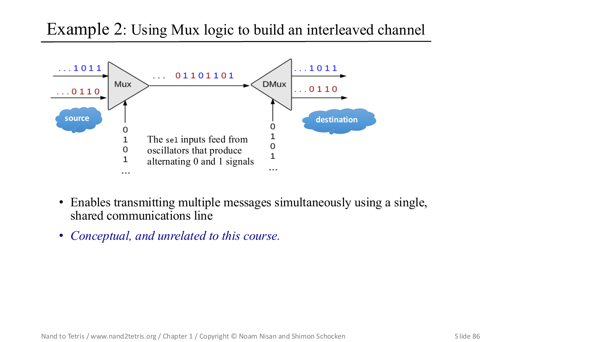

* **Source End**: A `Mux` receives input from multiple distinct channels. An oscillator feeds a rapidly alternating sequence of select bits (`0`, `1`, `0`, `1`, ...) to the `Mux`'s `sel` input, causing it to transmit alternating packets (e.g., a bit from channel A, a bit from channel B, and so on) sequentially down the shared line.
* **Destination End**: A `DMux` receives the combined data train from the line. A synchronized oscillator feeds the same alternating sequence of select bits to the `DMux`'s `sel` input, distributing the data back to its original separate destinations.
* **Asynchronous Operation**: Because the multiplexed stream carries its own implicit interleaving sequence, the encoding and decoding ends can operate asynchronously without a unified master system clock.

##### 1.6.3 16-Bit and Multi-Way Variants

###### 16-Bit Buses and Parallel Processing
Gates with a `16` suffix (such as `And16`) take 16-bit wide buses as input and return a 16-bit bus as output.
* **Parallel Calculation**: The calculations of 16-bit variants are **not sequential**. Instead, all 16 logic operations are processed in parallel, outputting the entire 16-bit result simultaneously.
* **HDL Implementation**: These are built by writing 16 individual instances of the corresponding elementary gates, mapping input bus indices directly to output indices:
  ```hdl
  And (a=a[0], b=b[0], out=out[0]);
  And (a=a[1], b=b[1], out=out[1]);
  // ...
  And (a=a[15], b=b[15], out=out[15]);
  ```

###### Multi-Way Variants
Multi-way gates process multiple input lines. 
* **Control Pin Scaling**: Selecting among $n$ input channels requires a control bus of size $k$ where $2^k = n$. For example, a 4-way multiplexer (`Mux4Way16`) routes one of four 16-bit inputs (`a`, `b`, `c`, `d`) to a single 16-bit output. Choosing among 4 possibilities requires a 2-bit selection bus `sel[2]`.

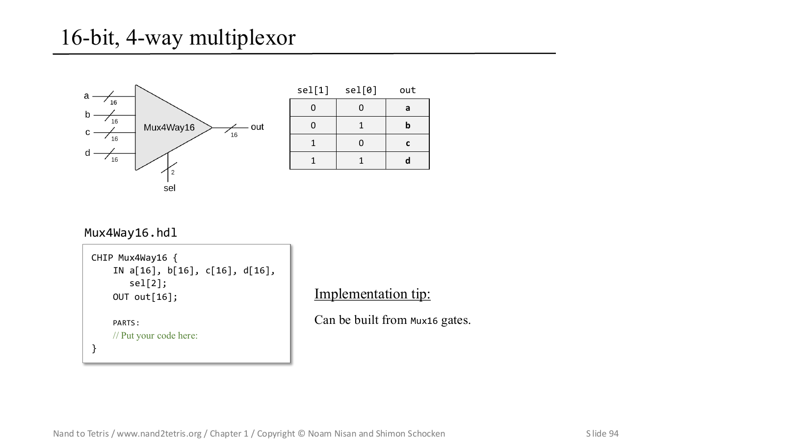

##### 1.6.4 Project Mechanics and Validation

###### Folder Files and the Testing Contract
For every chip built in the course, three corresponding files are provided in the project folder:
1. `Xxx.hdl` — A skeletal stub file containing the interface declaration (`IN`, `OUT`) and a blank `PARTS` section.
2. `Xxx.tst` — A simulation script containing input values, evaluation commands, and comparison calls.
3. `Xxx.cmp` — A comparison file specifying the exact expected outputs for the test inputs.

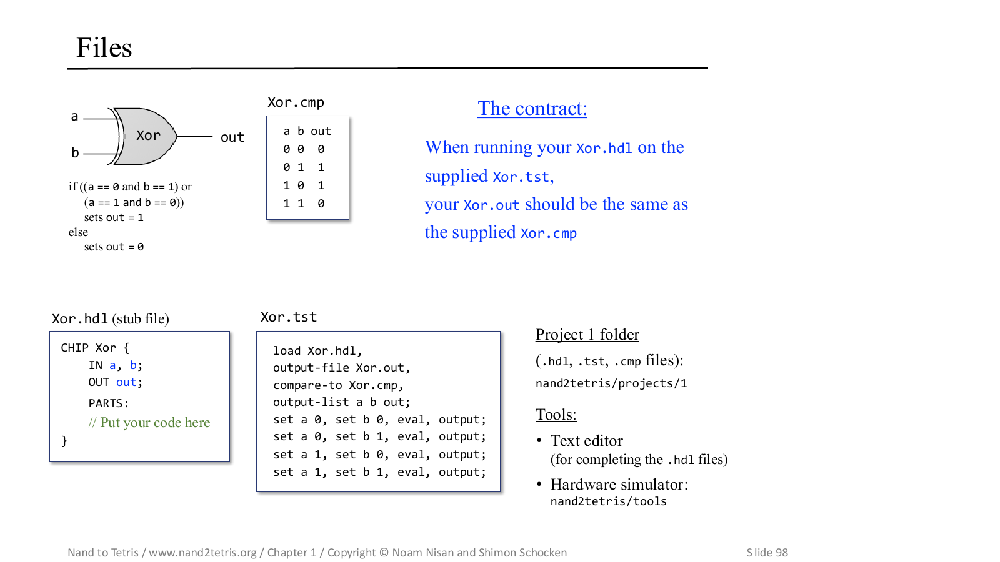

* **The Testing Contract**: When running the test script (`.tst`) on your implementation (`.hdl`), the hardware simulator evaluates your logic and writes results to an output file (`.out`). It then automatically compares `.out` to `.cmp`.
* **Verification Status**:
  * **Success**: The bottom-left status bar displays "Simulation completed successfully" in green.
  * **Failure**: If a mismatch occurs, the simulator halts instantly and prints an error description in red.

###### Signature Specification and Wiring
When wiring chip-parts together inside the `PARTS` block, the developer must map internal pins correctly. 

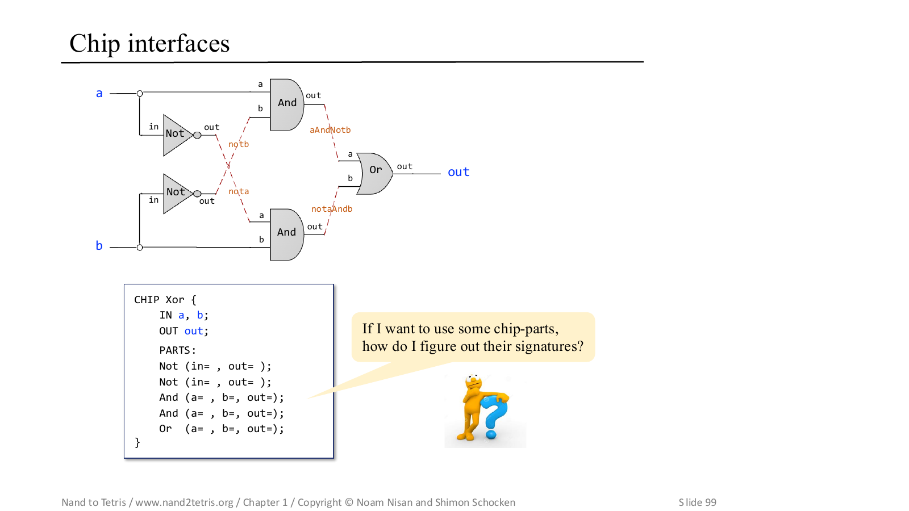

For a chip-part signature lookup (e.g. knowing that a `Mux` has inputs `a`, `b`, `sel` and output `out`), consult the **Hack Chipset API** reference guide.

##### 1.6.5 General Implementation Guidelines and Best Practices
- **Strict Exclusion of Recursion**: An HDL program cannot invoke itself as a chip-part. There is no recursion in HDL; every part must be a primitive chip or a previously completed independent gate.
- **Bus Indexing Convention**: Multi-bit buses are indexed **right-to-left**. If `A` is a 16-bit bus:
  * `A[0]` is the rightmost bit, representing the **Least Significant Bit (LSB)**.
  * `A[15]` is the leftmost bit, representing the **Most Significant Bit (MSB)**.
- **Built-in Chip Bypass Strategy**: If you want to build or debug chips in a different order, you can force the simulator to fall back to the built-in implementations of missing parts. To do this, rename or temporarily remove the local stub file of the dependency (e.g., rename `Mux.hdl` to `Mux1.hdl`). When simulating a parent chip, the simulator will fail to find `Mux.hdl` in the local directory and will automatically load the compiled Java version of `Mux` from `tools/builtIn/`.
- **Elegance and Minimization**: Strive to build correct implementations using the fewest chip parts possible.
- **Ordered Construction**: We recommend building gates in the chapter order (simpler to complex) to minimize the need for built-in chip overrides.


#### 1.7 Perspective

In the course, the final unit of the week is framed as a perspective-style Q&A section. This section briefly opens the physical "black box" beneath the logic symbols to show that physical implementations exist, and then returns to the clean logical abstractions that define computer science.

##### 1.7.1 Alternative Axiom Sets and the Popularity of Nand
Although our computer design begins with the primitive `Nand` gate, this starting point is not unique. 

* **Alternative Primitive Options**:
  * **NOR-Only Architecture**: A computer can be designed using only `Nor` gates as its atomic building block.
  * **AND/OR/NOT Suite**: A computer can be founded on a three-gate suite of `And`, `Or`, and `Not` gates.
* **The Geometry Axioms Analogy**: Constructing logic gates from different starting primitives is mathematically equivalent to basing geometry on different sets of axioms. As long as the starting gates form a functionally complete set (capable of expressing all Boolean functions), any of them can serve as a point of departure to build the entire system.
* **Why Nand Wins in Practice**: In physical hardware engineering, `Nand` is the dominant primitive because of manufacturing constraints. In popular integrated circuit technologies (such as CMOS and NMOS), it is physically simpler, cheaper, and faster to fabricate `Nand` gates out of transistors than it is to build other logic configurations.

##### 1.7.2 Physical Construction: The NMOS NAND Gate
To understand how voltage is mapped to logic, consider a simple physical implementation of a `Nand` gate using NMOS (N-type Metal-Oxide-Semiconductor) technology:

```text
          + Vdd (Pull-Up Voltage, Logical 1)
             |
             [ R ] (Resistor - weak connection)
             |
             +-------------> Output (out)
             |
           |/
      A ---|  (NMOS Transistor 1)
           |\>
             |
             |
           |/
      B ---|  (NMOS Transistor 2)
           |\>
             |
          ---v--- (Ground / Vss, Logical 0)
```

###### Circuit Components
* **Voltage Sources**:
  * $+V_{dd}$ — A positive voltage source representing **Logical 1**.
  * Ground ($V_{ss}$) — A zero-voltage reference representing **Logical 0**.
* **Pull-Up Resistor ($R$)**: Creates a "weak connection" to $+V_{dd}$. If there is no strong path to ground, this weak connection pulls the output voltage up to $+V_{dd}$ (Logical 1).
* **NMOS Transistors**: Act as voltage-controlled switches:
  * If a transistor gate (pin `A` or `B`) receives **high voltage** (Logical 1), it turns **ON**, creating a low-resistance (strong) connection between its other two terminals.
  * If a transistor gate receives **low voltage** (Logical 0), it turns **OFF**, disconnecting the terminals (infinite resistance).

###### Circuit State Tracing
1. **Both Inputs High ($A = 1, B = 1$)**:
   * Both Transistor 1 and Transistor 2 turn ON.
   * This creates a strong, low-resistance connection from `Output` through both transistors straight to Ground.
   * Because the Ground connection is strong and the Pull-up resistor connection is weak, Ground wins. The Output is pulled down to $0$ volts (**Logical 0**).
2. **At Least One Input Low (e.g., $A = 0, B = 1$)**:
   * The transistor connected to `A` turns OFF and disconnects its terminals.
   * This breaks the path from `Output` to Ground.
   * The Output is no longer connected to Ground, so the weak pull-up connection to $+V_{dd}$ rules, pulling the Output up to $+V_{dd}$ (**Logical 1**).

This simple logic matches the NAND truth table exactly.

###### The Abstraction Boundary
While physical construction is crucial for chip manufacturers, computer science intentionally abstracts this physical layer away.
* **Electrical Engineering Layer**: Focuses on transistors, resistors, silicon layers, voltages, optimization of energy dissipation, heat, propagation delay, and physical wire crossovers.
* **Computer Science Layer**: Sets the abstraction boundary at the gate interface. We treat gates as mathematical components that receive discrete true/false signals and output discrete true/false signals, completely ignoring the underlying physics.

##### 1.7.3 Course HDL vs. Commercial HDLs
Hardware design languages (HDLs) are used by professionals to describe and simulate complex circuits. The simple HDL dialect designed for this course differs from industrial standards like Verilog or VHDL:

* **Commercial HDLs (Verilog and VHDL)**:
  * Highly complex and feature-rich.
  * Syntactically combine structural gate wiring with software-like features (similar to the C programming language).
  * Feature high-level procedural programming blocks, including loops (`for`, `while`) and conditional logic, which eliminate the need for writing repetitive structural code.
  * Feature precise timing models and clock specifications to simulate sequential stateful logic (memories, registers).
* **Course HDL**:
  * A stripped-down, simplified dialect containing only the essential features needed to describe hardware structure.
  * Can be fully learned and written in one hour (compared to Verilog which takes at least a month to master).
  * Sufficiently powerful to define, build, and simulate the complete 16-bit Hack computer.

##### 1.7.4 Managing Complexity in Circuit Design
As computers scale to millions of logic gates, designing and optimizing circuits becomes a massive challenge.

* **Mathematical Complexity**: Finding the absolute most efficient arrangement of gates for a given Boolean function (using the fewest parts and wire connections) is an **NP-complete** problem. There is no known algorithm that can find the perfect design in reasonable time.
* **Design Tools and Heuristics**:
  * **Karnaugh Maps (K-maps)**: Visual maps used by engineers to simplify Boolean algebra and optimize logic gates with a small number of inputs (usually up to 4 or 6).
  * **Silicon Compilers**: Automated software tools that take functional descriptions of circuits and automatically synthesize gate diagrams. Because optimization is NP-complete, these compilers rely heavily on **heuristic algorithms** (rule-of-thumb approximations that are efficient but not mathematically guaranteed to be optimal).
* **The Computer Science Solution: Modularity and Abstraction**:
  Since automated compilers and mathematical methods cannot solve large-scale circuit designs perfectly, human chip designers rely on the core CS principles of **modularity** and **abstraction**. By breaking a complex system down into small, independent, and simple modules, each module can be optimized and tested separately. Those modules are then composed into larger systems, making the design of chips containing billions of transistors humanly manageable.


### 2 Boolean Arithmetic

Chapter 2 moves from logic to arithmetic.

The construction path is:

```text
binary numbers
  -> binary addition
  -> half-adder
  -> full-adder
  -> 16-bit adder
  -> incrementer
  -> ALU
```

The main idea is that many computer operations reduce to simple bit-level operations controlled by a small number of signals.

#### 2.1 Arithmetic Operations

General-purpose computers must perform a set of basic arithmetic operations on signed integers:
* Addition
* Sign conversion (negation)
* Subtraction
* Comparison ($<, >, =$)
* Multiplication
* Division

In Project 2, our hardware construction path moves systematically from simple adders to a fully functional Arithmetic Logic Unit (ALU):

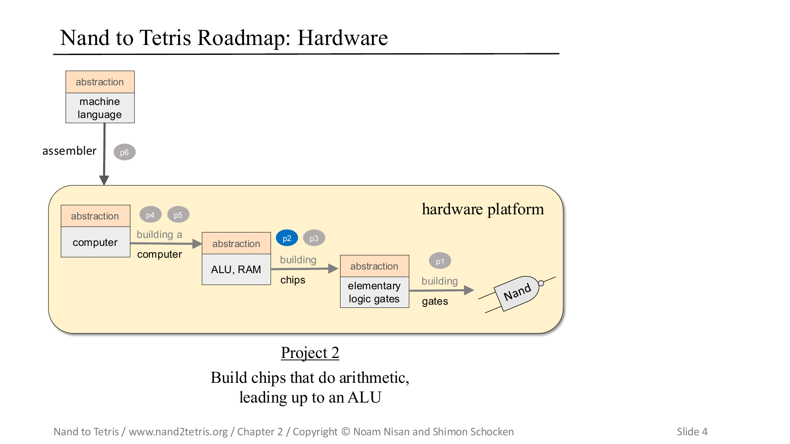

The most fundamental operation is addition. Subtraction can be modeled as addition by using negative representations (e.g. $x - y = x + (-y)$), incrementing is addition of a constant 1, and higher operations like multiplication and division can be reduced to successive additions in software or hardware. Therefore, building an efficient adder logic gate is the gateway to all processing capabilities.

#### 2.2 Binary Numbers

A number is an abstract quantity, whereas a numeral is a code used to represent that quantity. Computers store everything as sequences of bits (binary codes).

##### 2.2.1 The Positional System
Like the decimal system, the binary system is a positional number system. The value of a digit is determined by its position from the right (starting at index 0) and the base of the system.

* **Decimal (Base 10) system**: The positional base is 10. Each digit position has a weight of $10^i$.
  * Example:
    $$6507_{10} = 6 \cdot 10^3 + 5 \cdot 10^2 + 0 \cdot 10^1 + 7 \cdot 10^0 = 6000 + 500 + 0 + 7$$
* **Binary (Base 2) system**: The positional base is 2. Each digit position has a weight of $2^i$.
  * Example:
    $$101_2 = 1 \cdot 2^2 + 0 \cdot 2^1 + 1 \cdot 2^0 = 4 + 0 + 1 = 5_{10}$$

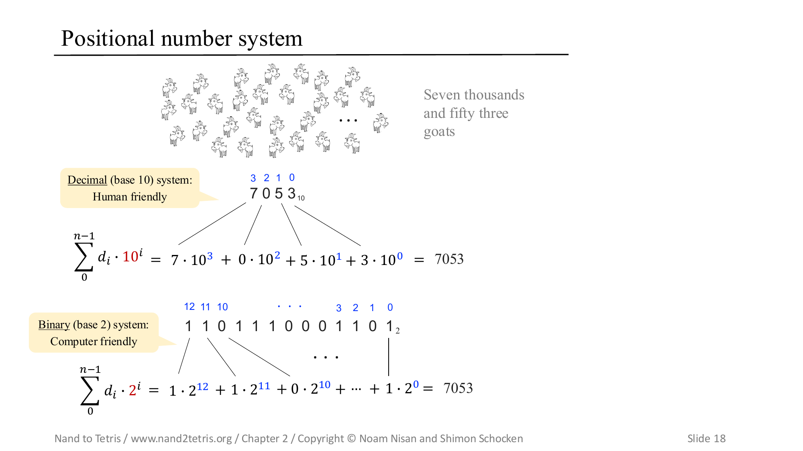

##### 2.2.2 Mathematical Representation and Conversion
To compute the decimal value of any binary sequence of bits $B$ of size $n+1$ (where $B_0$ is the LSB and $B_n$ is the MSB):

$$\text{Value} = \sum_{i=0}^{n} B_i \cdot 2^i$$

Inside computers, all information types (numbers, text, images, instructions) are represented using binary codes. Gottfried Wilhelm Leibniz first documented the binary system in 1679 (shown in his medallion), advocating that binary numerals are extremely easy to store, compare, add, subtract, multiply, and transmit in physical devices compared to decimal.

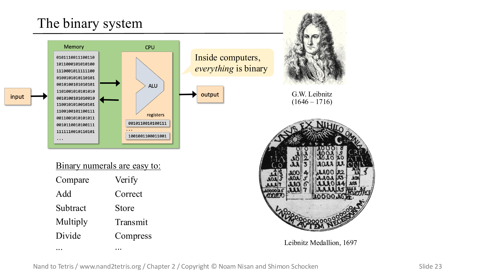

##### 2.2.3 Fixed Word Size and Integer Ranges
In physical hardware, registers are finite and use a fixed word size ($k$ bits) to represent chunks of data.
* **Nonnegative Integer Range**: Using $k$ bits, we can represent $2^k$ distinct patterns. If we interpret them only as nonnegative integers, the range is:
  $$0 \text{ to } 2^k - 1$$
* **Example**: An 8-bit register can code nonnegative integers from 0 to $2^8 - 1 = 255$.
* **Signed Integer Range**: In signed systems (discussed in later units), half of the $2^k$ patterns are reserved to represent negative numbers. For example, in an 8-bit system, the positive numbers are restricted to the range $0$ to $127$ (total signed range: $-128$ to $127$).

##### 2.2.4 Decimal-to-Binary Conversion Algorithm
To convert a decimal number to its binary representation, we express the decimal value as a sum of powers of 2 using a greedy subtraction algorithm:

1. Identify the largest power of 2 ($2^p$) that is less than or equal to the decimal number.
2. Place a `1` at bit position $p$ in the binary sequence.
3. Subtract $2^p$ from the number to obtain the remainder.
4. Repeat the process for the remainder until it becomes 0.
5. Place a `0` in all bit positions that did not appear in the sum.

###### Tracing Example: Convert $87_{10}$ to Binary
* The largest power of $2 \le 87$ is $2^6 = 64$. We set bit 6 to `1`. (Remainder: $87 - 64 = 23$)
* The largest power of $2 \le 23$ is $2^4 = 16$. We set bit 4 to `1`. (Remainder: $23 - 16 = 7$)
* The largest power of $2 \le 7$ is $2^2 = 4$. We set bit 2 to `1`. (Remainder: $7 - 4 = 3$)
* The largest power of $2 \le 3$ is $2^1 = 2$. We set bit 1 to `1`. (Remainder: $3 - 2 = 1$)
* The largest power of $2 \le 1$ is $2^0 = 1$. We set bit 0 to `1`. (Remainder: $1 - 1 = 0$, terminate)

Sum: $87 = 64 + 16 + 4 + 2 + 1 = 2^6 + 2^4 + 2^2 + 2^1 + 2^0$
Result: `1010111` (bits at positions 6, 4, 2, 1, 0 are `1`; bits at positions 5, 3 are `0`).

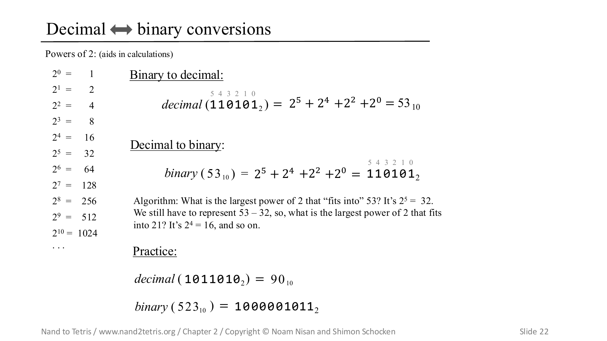

#### 2.3 Binary Addition

Binary addition is the foundational building block of all computer arithmetic. In hardware design, once we build a working addition circuit, other operations can be reduced to it:
* **Subtraction**: Once negative numbers are represented in hardware (using two's complement, covered in Section 2.4), subtraction is achieved for free by adding a negative number: $A - B = A + (-B)$.
* **Comparison**: Checking if $A > B$ can be reduced to checking if the difference $A - B > 0$, which uses the same addition-based subtraction circuit.
* **Multiplication and Division**: Multiplication and division are mathematically and electronically complex to implement directly in hardware logic gates. To keep the hardware simple, these operations are postponed to software. The hardware does not include multiplication/division gates; instead, software libraries (such as operating system routines) implement them using loops of addition and bit shifting, written as small programs.

##### The Bitwise Addition Algorithm

Binary addition works exactly like decimal addition learned in elementary school, but with a much simpler digit set: $\{0, 1\}$. 

We add two binary numbers bitwise from right to left, starting at the **least significant bit** (LSB, bit 0) and working towards the **most significant bit** (MSB, bit $n-1$). 

At each bit column position, we:
1. Combine the corresponding input bits from the two numbers.
2. Include any carry-in bit from the previous (rightward) column addition.
3. Calculate the sum bit for that position.
4. Calculate any carry-out bit to be sent to the next (leftward) column.

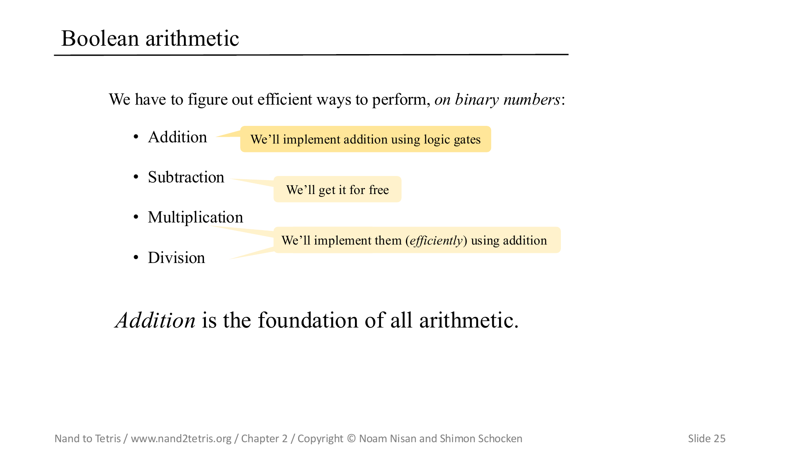

The basic bitwise addition cases are:
* $0 + 0 = 0$ (Sum: `0`, Carry: `0`)
* $0 + 1 = 1$ (Sum: `1`, Carry: `0`)
* $1 + 0 = 1$ (Sum: `1`, Carry: `0`)
* $1 + 1 = 10_2$ (Sum: `0`, Carry: `1`)
* $1 + 1 + 1 \text{ (carry-in)} = 11_2$ (Sum: `1`, Carry: `1`)

###### Column-by-Column Carry Tracing Example: $0101_2 + 0110_2$ ($5 + 6 = 11$)

Let $A = 0101_2$ (decimal $5$) and $B = 0110_2$ (decimal $6$). We perform a 4-bit addition column-by-column, tracing the carry bits:

```text
    Carry:  1 1 0 0 (from right to left)
    A:      0 1 0 1
  + B:      0 1 1 0
  -----------------
    Sum:    1 0 1 1
```

* **Column 0 (LSB)**:
  * Inputs: $A_0 = 1$, $B_0 = 0$, Carry-in = $0$
  * Computation: $1 + 0 + 0 = 1_{10} = 1_2$
  * Outputs: Sum bit = `1`, Carry-out = `0`
* **Column 1**:
  * Inputs: $A_1 = 0$, $B_1 = 1$, Carry-in = `0` (from Column 0)
  * Computation: $0 + 1 + 0 = 1_{10} = 1_2$
  * Outputs: Sum bit = `1`, Carry-out = `0`
* **Column 2**:
  * Inputs: $A_2 = 1$, $B_2 = 1$, Carry-in = `0` (from Column 1)
  * Computation: $1 + 1 + 0 = 2_{10} = 10_2$
  * Outputs: Sum bit = `0`, Carry-out = `1`
* **Column 3 (MSB)**:
  * Inputs: $A_3 = 0$, $B_3 = 0$, Carry-in = `1` (from Column 2)
  * Computation: $0 + 0 + 1 = 1_{10} = 1_2$
  * Outputs: Sum bit = `1`, Carry-out = `0`

The final result is $1011_2$ ($11_{10}$).

##### Handling Overflow

When the addition of the two most significant bits (MSB) generates a carry-out of 1, we have an **overflow**. In fixed-width computer systems (such as the 16-bit Hack platform), there is no hardware register space to store this extra carry bit. 

Our hardware approach is to **ignore the overflow carry** and discard it. 

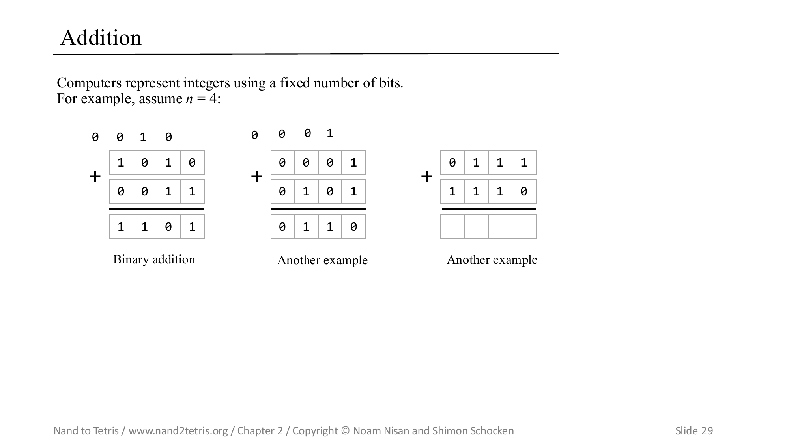

###### Mathematical Modulo Arithmetic of Overflow

Discarding the overflow carry is equivalent to performing **addition modulo $2^w$**, where $w$ is the word size of the computer:
$$\text{Hardware Sum} = (A + B) \pmod{2^w}$$

If the sum of $A$ and $B$ exceeds the maximum value representable in $w$ bits ($2^w - 1$), the hardware automatically decreases the result by $2^w$ by dropping the overflow bit. 

For example, in a 4-bit system ($w=4, 2^4 = 16$), if we add $1011_2$ ($11_{10}$) and $0110_2$ ($6_{10}$):
* True Sum: $11 + 6 = 17_{10}$
* Binary Sum: `1011` + `0110` = `10001` (5-bit result, with MSB carry = 1)
* Truncated Hardware Sum: Discarding the carry yields `0001` ($1_{10}$)
* Modulo Equivalence: $17 \pmod{16} = 1$

##### The Hardware Adder Construction Ladder

To construct the physical logic gates that perform this addition, we build a hierarchy of three abstraction stages:
1. **Half-Adder (2 inputs, 2 outputs)**:
   * Adds two bits $a$ and $b$.
   * Outputs: `sum` and `carry`.
   * Used for the LSB column where there is never a carry-in from a previous step.
2. **Full-Adder (3 inputs, 2 outputs)**:
   * Adds three bits $a$, $b$, and $c$ (where $c$ is the carry-in bit).
   * Outputs: `sum` and `carry`.
   * Used for all columns from bit 1 up to the MSB.
3. **Multi-Bit Adder (16-bit)**:
   * Adds two 16-bit numbers $A$ and $B$ by cascading one half-adder (for LSB bit 0) and 15 full-adders (for bits 1 through 15) in a carry-propagation chain. The carry-out of each adder becomes the carry-in of the next leftward adder.

#### 2.4 Signed Binary Numbers

##### The Code Space Allocation Challenge
An $n$-bit binary system can code $2^n$ different things. In a system representing nonnegative integers, these $2^n$ patterns code the values $0$ through $2^n - 1$. However, to represent signed (positive and negative) numbers, we must partition the available code space into two subsets: one subset for representing nonnegative numbers, and the other for representing negative numbers. 

The primary design goal for this partitioning is **hardware simplicity**: the coding scheme should complicate the physical implementation of arithmetic circuitry as little as possible.

##### Sign-Magnitude Representation and Its Downfalls
An intuitive way to represent negative numbers is the **Sign-Magnitude** scheme. Here, we allocate the leftmost bit (the most significant bit, MSB) exclusively to represent the sign:
* `0` in the sign bit represents a nonnegative number.
* `1` in the sign bit represents a negative number.
* The remaining $n-1$ bits represent the magnitude (absolute value) of the number.

For a 4-bit system, this allocates 1 sign bit and 3 magnitude bits, yielding values from $+0$ (`0000`) to $+7$ (`0111`) and $-0$ (`1000`) to $-7$ (`1111`).

Although simple in concept, this scheme has severe drawbacks for hardware design:
1. **Two Representations of Zero**: It creates both $+0$ (`0000`) and $-0$ (`1000`). This is highly inelegant and introduces software bugs since comparing $+0$ and $-0$ requires special hardware logic.
2. **Non-Monotonic Codes**: The codes do not increase monotonically with the values they represent, making magnitude comparison operations more complex.
3. **Hardware Complexity**: We cannot use the same addition circuitry for both positive and negative numbers. Adding a positive and a negative number requires separate subtraction logic, and the hardware must perform complex conditional checks on the sign bits.

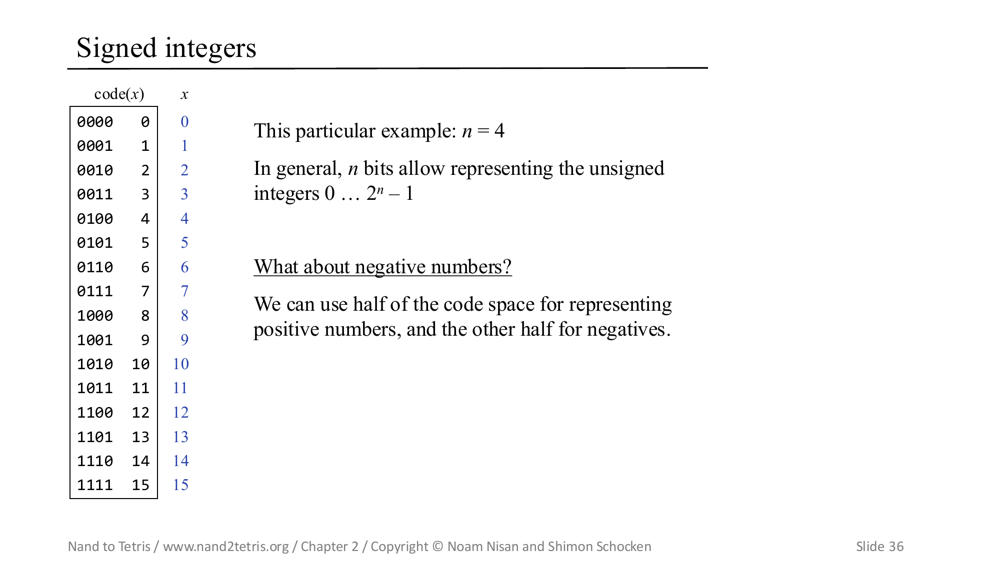

##### Two's Complement Representation (Radix Complement)
Modern computers solve these issues using **two's complement** representation. In an $n$-bit binary system, the two's complement code that represents a negative number $-x$ is defined as the positive binary code representing:
$$\text{Code}(-x) = 2^n - x$$

For example, in a 4-bit system ($n=4, 2^4 = 16$), the negative number $-7$ is represented by the code for $16 - 7 = 9_{10}$, which is `1001`.

###### Range of Representable Signed Numbers
An $n$-bit two's complement system represents $2^n$ signed numbers in the range:
$$-2^{n-1} \text{ through } 2^{n-1} - 1$$

In a 4-bit system, the range is $-2^3$ through $2^3 - 1$, which is $-8$ through $+7$:
* Nonnegative values ($0$ to $+7$) are coded as $0000$ to $0111$.
* Negative values ($-1$ to $-8$) are coded as $1111$ to $1000$ (representing $2^4 - x$).

This scheme results in the following attractive properties:
* **Single Representation of Zero**: Zero is uniquely represented as `0000` (since $2^n - 0 = 2^n$, which overflows to `0000` in fixed-width registers).
* **Sign Indicator Bit**: The most significant bit (MSB) naturally acts as a sign indicator:
  * If MSB = `0`, the number is nonnegative.
  * If MSB = `1`, the number is negative.
* **Monotonicity**: The codes are monotonically increasing in value within their respective signed intervals.


##### Two's Complement Addition and Modulo Arithmetic
The most remarkable feature of two's complement is that **ordinary unsigned binary addition works correctly for signed numbers without any modifications**. 

Because our fixed-width addition circuitry naturally performs addition modulo $2^n$ (by discarding any carry bit that overflows past the MSB), the hardware addition exactly aligns with the modulo-based encoding of negative numbers.

Mathematically, if we add $A$ and $B$ where one or both are negative (represented as $2^n - |x|$):
$$\text{Hardware Sum} = (A + B) \pmod{2^n}$$

###### Concrete Signed Addition Traces (4-Bit System)

* **Example 1: Positive + Negative ($6 + (-2) = 4$)**
  * Decimal equivalent: $6 + (16 - 2) = 6 + 14 = 20_{10}$
  * Binary:
    ```text
        Carry:  1 1 1 0
        6:      0 1 1 0
      + -2:     1 1 1 0  (14 in unsigned)
      -----------------
        Sum:  1 0 1 0 0  -> Discard overflow carry -> 0100 (4)
    ```
  * Modulo: $20 \pmod{16} = 4$. The hardware correctly yields $0100_2$ ($4_{10}$).

* **Example 2: Negative + Negative ($-2 + (-3) = -5$)**
  * Decimal equivalent: $(16 - 2) + (16 - 3) = 14 + 13 = 27_{10}$
  * Binary:
    ```text
        Carry:  1 1 0 0
        -2:     1 1 1 0  (14 in unsigned)
      + -3:     1 1 0 1  (13 in unsigned)
      -----------------
        Sum:  1 1 0 1 1  -> Discard overflow carry -> 1011 (11)
    ```
  * Modulo: $27 \pmod{16} = 11$. In two's complement, $11$ codes $16 - 5$, representing $-5$.

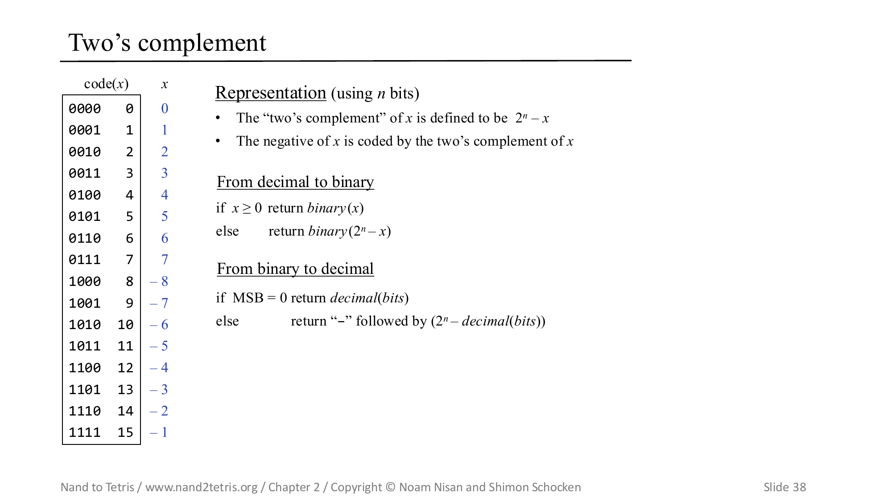

###### Overflow Detection
Since we represent a restricted range of signed values, adding two numbers can sometimes result in a sum that exceeds the representable range (signed overflow):
* **Positive Overflow**: Adding two positive numbers yields a negative result (e.g., $5 + 7 = 12 \rightarrow 1100_2$, which represents $-4$).
* **Negative Overflow**: Adding two negative numbers yields a positive result (e.g., $-7 + (-3) = 1001_2 + 1101_2 = 10110_2 \rightarrow 0110_2$, which represents $+6$).
* **Rule**: Overflow occurs if and only if adding two numbers of the same sign yields a result with the opposite sign.

##### The Negation Algorithm: NOT and Add 1
To negate a number $x$ (find $-x$), we need to compute $2^n - x$. We can derive a simple bit-level algorithm using a mathematical trick:
$$2^n = (2^n - 1) + 1$$
$$-x = 2^n - x = (2^n - 1) - x + 1$$

* The term $(2^n - 1)$ is represented in binary as a sequence of all `1`s (e.g., `1111` for $n=4$).
* Subtracting any number $x$ from all `1`s requires no borrow operations; it is equivalent to flipping every bit of $x$ (i.e., performing a bitwise NOT operation).
* Therefore, the negation of $x$ is:
$$\text{Negate}(x) = \text{NOT}(x) + 1$$

###### Step-by-Step Negation Example: Negating $4_{10}$ in a 4-Bit System
Let $x = 4_{10} = 0100_2$. We want to find the code for $-4_{10}$ (which is $16 - 4 = 12_{10}$):
1. **Flip all bits (NOT)**: `0100` becomes `1011` (this represents $15 - 4 = 11_{10}$).
2. **Add 1**: `1011` + `0001` = `1100` (this represents $11 + 1 = 12_{10}$, which is $-4$).

Meaning of the negation algorithm:
```text
  NOT(0100) -> 1011
  1011 + 1  -> 1100
```

###### Custom Hardware Incrementing Shortcut
When building hardware to add 1 to a number, we can use a simpler method than a general adder:
* Start from the rightmost bit (LSB).
* Flip bits from right to left as long as we see a `1` (turning them to `0`).
* When we hit the first `0`, flip it to `1` and stop.

##### Subtraction Reduction
Using the negation algorithm, subtraction is handled as a special case of addition. We do not need dedicated subtraction hardware:
$$y - x = y + (-x) = y + \text{NOT}(x) + 1$$

A single adder circuit can support both addition and subtraction.

#### 2.5 Specification

The chapter specifies the arithmetic chips before building them.

The desired ladder is:

```text
HalfAdder
  -> FullAdder
  -> Add16
  -> Inc16
  -> ALU
```

##### 2.5.1 Adders

A half-adder adds two bits.

Interface:

```text
HalfAdder(a, b, sum, carry)
```

Behavior:

```text
sum   = low bit of a + b
carry = high bit of a + b
```


**Figure 2.2** Half-adder, designed to add 2 bits.

The figure shows that adding two 1-bit numbers can produce a 2-bit result.

That is why the outputs split into:

```text
sum   -> low-order bit
carry -> high-order bit
```

The course points out a neat shortcut here: the half-adder truth table is just repackaging two familiar gate behaviors.

```text
sum   = XOR(a, b)
carry = AND(a, b)
```

So arithmetic starts by recognizing that a small addition problem can already be expressed with ordinary logic gates.

A full-adder adds three bits: two data bits plus an incoming carry.

Interface:

```text
FullAdder(a, b, c, sum, carry)
```


**Figure 2.3** Full-adder, designed to add 3 bits.

The extra input `c` is the carry arriving from the previous bit position.

So the full-adder is the real workhorse of multi-bit addition.

A 16-bit adder chains full-adders across all bit positions.


**Figure 2.4** 16-bit adder, designed to add two 16-bit numbers, with an example of addition action (on the left).

Read this figure from right to left across the bit positions.

The least significant bit is added first.

Its carry travels into the next position, and so on.

That is why the design is called ripple-carry: the carry ripples through the word.

Mental model:

```text
bit 0 produces carry into bit 1
bit 1 produces carry into bit 2
...
bit 15 produces overflow, which Hack ignores
```

The incrementer is a special adder:

```text
Inc16(in) = in + 1
```


This figure emphasizes that incrementing is just a special case of addition.

You are adding a constant value of `1`, so most of the structure can be simpler than a fully general adder.

It will later help the program counter move to the next instruction.

##### 2.5.2 The Arithmetic Logic Unit

###### Introduction and von Neumann Architecture
The **Arithmetic Logic Unit (ALU)** is the computational centerpiece of every general-purpose computer. In 1945, the mathematician John von Neumann published a seminal paper describing the structure of general-purpose computers, which became known as the **von Neumann Architecture**. 

In the von Neumann model, the Central Processing Unit (CPU) is a core block, and within it, the ALU is responsible for executing all arithmetic and logical operations.

An ALU is structurally abstracted as a component that receives two data inputs, a function selection directive, and outputs the resulting computation.

###### Hardware-Software Trade-Off
A classic question in computer engineering is: *How many functions should the ALU implement in hardware?* 
* **Hardware implementation**: Fast execution but requires more logic gates, increasing chip area, cost, and design complexity.
* **Software implementation**: Slower execution but keeps the hardware simple. Functions omitted from the ALU can be implemented later in software libraries (such as operating system libraries) using loops of simpler hardware instructions.

To keep the Hack platform clean and cheap, its ALU does not implement multiplication or division in hardware. Instead, it supports a minimal set of basic arithmetic and bitwise logic operations, leaving multiplication and division to be handled by software.

###### The Hack ALU Abstraction
The Hack ALU operates on two 16-bit, two's complement numbers and computes one of 18 functions. 


**Figure 2.5a** The Hack ALU, designed to compute the eighteen arithmetic-logical functions. The symbols `!`, `&`, and `|` represent the 16-bit operations `Not`, `And`, and `Or`. The diagram shows the 16-bit data inputs $x$ and $y$, 6 control inputs, a 16-bit output bus, and two status flags.

The chip's inputs, control bits, and outputs are defined as:

* **Data Inputs**:
  * `x[16]`: 16-bit data bus.
  * `y[16]`: 16-bit data bus.
* **Control Inputs (6 bits)**:
  * `zx` (zero x): If 1, the $x$ input is pre-set to 0.
  * `nx` (negate x): If 1, the $x$ input is bitwise negated.
  * `zy` (zero y): If 1, the $y$ input is pre-set to 0.
  * `ny` (negate y): If 1, the $y$ input is bitwise negated.
  * `f` (function): If 1, the ALU computes $x + y$; if 0, it computes $x \text{ AND } y$.
  * `no` (negate output): If 1, the output bus is bitwise negated.
* **Outputs**:
  * `out[16]`: 16-bit output bus holding the result.
  * `zr` (zero status flag): 1 if `out` is zero, 0 otherwise.
  * `ng` (negative status flag): 1 if `out` is negative (MSB is 1), 0 otherwise.

###### The 18 Functions of Interest and Truth Table
Rather than routing 18 distinct arithmetic/logical circuits, the Hack ALU is designed as a **single, unified data path** whose behavior is steered dynamically by the 6 control bits. 


**Figure 2.5b** The Hack ALU truth table specifying the control bit configurations for all 18 functions of interest. Taken together, the values of the six control bits `zx`, `nx`, `zy`, `ny`, `f`, and `no` cause the ALU to compute one of the functions listed in the rightmost column.

The full specifications are summarized in the following table:

| zx | nx | zy | ny | f | no | out = f(x,y) | Description |
|:--:|:--:|:--:|:--:|:-:|:-:|:------------:|:-----------:|
| 1  | 1  | 1  | 1  | 1 | 1  | `0`          | Constant 0 |
| 1  | 1  | 1  | 0  | 1 | 0  | `1`          | Constant 1 |
| 1  | 1  | 1  | 0  | 1 | 1  | `-1`         | Constant -1 |
| 0  | 0  | 1  | 1  | 0 | 0  | `x`          | Input x |
| 1  | 1  | 0  | 0  | 0 | 0  | `y`          | Input y |
| 0  | 0  | 1  | 1  | 0 | 1  | `!x`         | Bitwise Not x |
| 1  | 1  | 0  | 0  | 0 | 1  | `!y`         | Bitwise Not y |
| 0  | 0  | 1  | 1  | 1 | 1  | `-x`         | Negate x (two's complement) |
| 1  | 1  | 0  | 0  | 1 | 1  | `-y`         | Negate y (two's complement) |
| 0  | 1  | 1  | 1  | 1 | 1  | `x+1`        | Increment x by 1 |
| 1  | 1  | 0  | 1  | 1 | 1  | `y+1`        | Increment y by 1 |
| 0  | 0  | 1  | 1  | 1 | 0  | `x-1`        | Decrement x by 1 |
| 1  | 1  | 0  | 0  | 1 | 0  | `y-1`        | Decrement y by 1 |
| 0  | 0  | 0  | 0  | 1 | 0  | `x+y`        | Add x and y |
| 0  | 1  | 0  | 0  | 1 | 1  | `x-y`        | Subtract y from x |
| 0  | 0  | 0  | 1  | 1 | 1  | `y-x`        | Subtract x from y |
| 0  | 0  | 0  | 0  | 0 | 0  | `x&y`        | Bitwise And x and y |
| 0  | 1  | 0  | 1  | 0 | 1  | `x\|y`       | Bitwise Or x and y |

###### Tracing Non-Obvious Algebraic Insights
Understanding how these control bits achieve their mathematical results highlights the elegance of two's complement modulo $2^n$ arithmetic. We can simulate the ALU pipeline on paper to prove some of the non-obvious functions:

* **Insight 1: Constant `-1`** (`zx=1, nx=1, zy=1, ny=0, f=1, no=0`)
  1. $zx=1, nx=1 \implies x$ is zeroed, then negated: $\text{NOT}(0) = 1111\dots1111_2 = -1_{10}$.
  2. $zy=1, ny=0 \implies y$ is zeroed, but not negated: $y = 0$.
  3. $f=1 \implies x + y = -1 + 0 = -1$.
  4. $no=0 \implies out = -1$ (all `1` bits).

* **Insight 2: Two's Complement Negation `-x`** (`zx=0, nx=0, zy=1, ny=1, f=1, no=1`)
  1. $zx=0, nx=0 \implies x$ is left as $x$.
  2. $zy=1, ny=1 \implies y$ is zeroed, then negated: $\text{NOT}(0) = 1111\dots1111_2 = -1_{10}$.
  3. $f=1 \implies x + y = x + (-1) = x - 1$.
  4. $no=1 \implies \text{NOT}(x - 1)$. In two's complement, $\text{NOT}(z) = -z - 1$. Thus, $\text{NOT}(x-1) = -(x-1) - 1 = -x + 1 - 1 = -x$.

* **Insight 3: Increment `x+1`** (`zx=0, nx=1, zy=1, ny=1, f=1, no=1`)
  1. $zx=0, nx=1 \implies x$ is negated: $\text{NOT}(x)$.
  2. $zy=1, ny=1 \implies y$ is zeroed, then negated: $-1$.
  3. $f=1 \implies \text{NOT}(x) + (-1) = \text{NOT}(x) - 1$.
  4. $no=1 \implies \text{NOT}(\text{NOT}(x) - 1) = -(\text{NOT}(x) - 1) - 1 = -\text{NOT}(x) = -(-x - 1) = x + 1$.

* **Insight 4: Subtraction `x-y`** (`zx=0, nx=1, zy=0, ny=0, f=1, no=1`)
  1. $zx=0, nx=1 \implies x$ is negated: $\text{NOT}(x)$.
  2. $zy=0, ny=0 \implies y$ is left as $y$.
  3. $f=1 \implies \text{NOT}(x) + y = -x - 1 + y = y - x - 1$.
  4. $no=1 \implies \text{NOT}(y - x - 1) = -(y - x - 1) - 1 = x - y + 1 - 1 = x - y$.

###### The ALU Operation Pipeline
The logic of the Hack ALU is evaluated as a sequential processing pipeline. The inputs $x$ and $y$ are transformed stage-by-stage based on the control bits:

```text
Input:  x[16], y[16], zx, nx, zy, ny, f, no
1. If zx == 1: set x = 0
2. If nx == 1: set x = !x
3. If zy == 1: set y = 0
4. If ny == 1: set y = !y
5. If f == 1:  set out = x + y
   Else:       set out = x & y
6. If no == 1: set out = !out
Output: out[16]
```

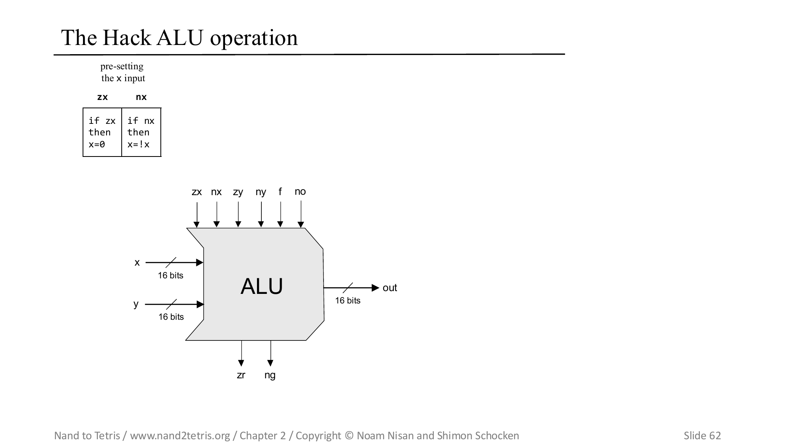

###### Status Outputs (`zr` and `ng`)
The ALU computes and outputs two status flags that summarize properties of the 16-bit output:


**Figure 2.5c** The Hack ALU API, illustrating the evaluation logic for the status flags `zr` (zero status indicator) and `ng` (negative status indicator).

* **Evaluation Rules**:
  * `zr = 1` if `out == 0`, else `0`.
  * `ng = 1` if `out < 0` (meaning the MSB is `1`), else `0`.
* **Hardware Significance**:
  These two bits are critical for **conditional branching** and program control (jumps). The CPU evaluates these status flags to decide whether to fetch the next sequential instruction or branch to a new address (e.g., executing jump instructions like `if out == 0 jump` or `if out > 0 jump`).

This compact API becomes critical later because the CPU will control the ALU only through these inputs and interpret the result only through these outputs.

These flags later help the CPU decide whether to jump.

#### 2.6 Implementation

The chapter gives sparse implementation guidance on purpose.

The learner must derive the HDL designs.

The adder path is:

```text
HalfAdder from basic gates
FullAdder from HalfAdders
Add16 from FullAdders
Inc16 from Add16 or equivalent logic
```

The 16-bit adder is a ripple-carry design:

```text
carry ripples from low bit to high bit
```

Conceptually the bits depend on each other in order, even though HDL describes the chip structurally.

The ALU implementation follows the control-bit pipeline:

```text
preprocess x
preprocess y
compute x+y or x&y
optionally negate output
compute zr and ng
```

#### 2.7 Project

Project 2 requires implementing a family of five combinational arithmetic chips, systematically building up from a basic 2-bit adder to a fully functional Arithmetic Logic Unit (ALU).

Implementation links: [`HalfAdder`](projects/project-02-boolean-arithmetic.md#halfadder), [`FullAdder`](projects/project-02-boolean-arithmetic.md#fulladder), [`Add16`](projects/project-02-boolean-arithmetic.md#add16), [`Inc16 using HalfAdders`](projects/project-02-boolean-arithmetic.md#inc16-using-halfadders), [`Inc16 using Add16`](projects/project-02-boolean-arithmetic.md#inc16-using-add16), and [`ALU`](projects/project-02-boolean-arithmetic.md#alu).

##### The 5 Project Chips

1. **HalfAdder**: Adds two bits $a$ and $b$, producing `sum` and `carry` outputs.
   - *Implementation Tip*: Can be built from exactly two basic gates implemented in Project 1: `Xor` (for the sum bit) and `And` (for the carry bit).
2. **FullAdder**: Adds three bits $a$, $b$, and $c$, producing `sum` and `carry` outputs.
   - *Implementation Tip*: Can be built using two `HalfAdder` chips and one `Or` gate.
3. **Add16**: Adds two 16-bit, two's complement numbers $A$ and $B$, producing a 16-bit output.
   - *Implementation Tip*: Cascades adders sequentially from right to left (1 `HalfAdder` for the LSB at bit 0, connected to 15 `FullAdder` chips for bits 1 through 15). The carry-out pin of bit $i$ is routed directly to the carry-in pin of bit $i+1$. The final MSB carry-out bit (from bit 15) is discarded.
4. **Inc16**: Increments a 16-bit number by 1, computing `in + 1`.
   - *Implementation Tip*: Can be built easily by feeding the input bus `in` and a constant value of `1` (using HDL constant syntax) into an `Add16` chip.
5. **ALU**: Computes one of 18 pre-defined arithmetic/logical functions on two 16-bit inputs.
   - *Implementation Tip*: Can be built using a 16-bit adder (`Add16`) and various logic gates from Project 1. Thanks to two's complement arithmetic, the entire ALU can be implemented in less than 20 lines of HDL!

##### Hack HDL Syntax: Sub-bussing and Constants

When writing HDL for Project 2, you must utilize Hack HDL's syntax for constants and sub-busses:

* **Constants (`true` and `false`)**: You can set individual bits or entire buses to constant values of `1` or `0` using the keywords `true` and `false`.
  - Setting a bus to `false` sets all its bits to `0` (e.g., `y = false` zero-presets a 16-bit bus).
  - Setting a bus to `true` sets all its bits to `1` (e.g., `x = true` sets all 16 bits to `1`, representing the value $-1$ in two's complement).
* **Sub-bussing (Slicing)**: You can assign constants or internal pins to specific bit subsets of a bus.
  - Syntax: `z[0..2] = true` sets bits 0, 1, and 2 of bus `z` to `1`. Unassigned bits default to `0`.
  - Creating internal pins from output subsets: `Add16(..., out[0..7] = low, out[8..15] = high)`.

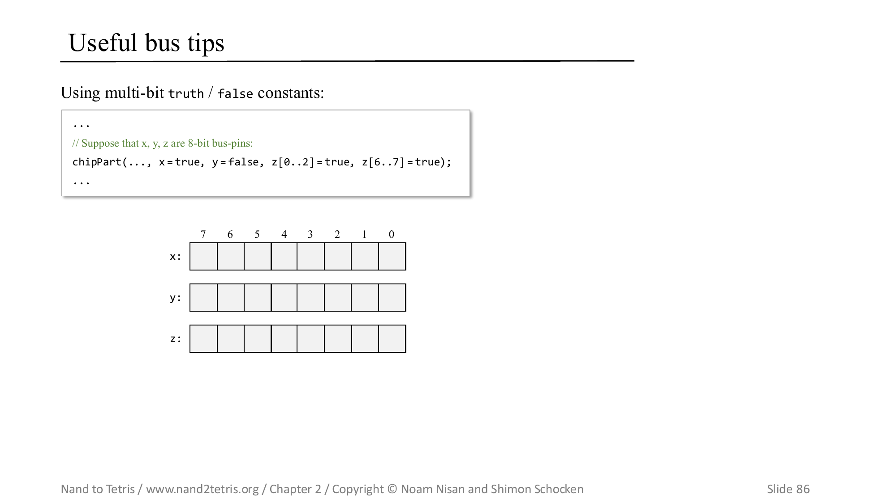

##### Built-In Chips and Unit Testing Strategy
The Hack Hardware Simulator resolves chip parts by checking the current project directory first. If a chip part referenced in an `.hdl` file (e.g., `And`, `Mux`, `Or`) is not found in the local directory (since the `02` directory only contains the 6 Project 2 stub files), the simulator automatically falls back to its Java-based **built-in implementation**.

This behavior supports a clean unit-testing workflow:
* Do not copy Project 1 HDL files into your Project 2 directory.
* By using Java built-in versions of earlier gates, you localize any bugs directly to the current chip under test. If a test fails, you know the error is in the logic of the chip you are building, rather than a hidden bug in a nested Project 1 gate.

#### 2.8 Perspective

##### Standard Components vs. Course Simplification
Most of the logic gates and adder circuits implemented in Project 2 are standard building blocks in digital systems design:
* **Standard Industry Chips**: The `HalfAdder`, `FullAdder`, and multi-bit ripple-carry adders (`Add16`) are identical to chips found in commercial processors.
* **Simplified Hack ALU**: The Hack ALU is a custom design optimized specifically for educational clarity. Commercial processors implement far more complex ALUs with dozens of specialized instructions, but the Hack ALU is kept simple to ensure all computational blocks can be built from first principles in a single course.

##### The Hardware/Software Trade-Off in Arithmetic
A computer's overall capabilities are divided between its hardware execution units and the software operating system running on top of it.
* **Hardware Operations**: Run extremely fast but are expensive to design, verify, and manufacture (requiring more physical transistors on the silicon die).
* **Software Operations**: Slower to execute but trivial to design, correct, and extend via software updates.

To keep the Hack hardware simple, complex arithmetic functions like multiplication, division, and square roots are omitted from the ALU. Instead, they are delegated to software libraries (specifically, the operating system's `Math` library, built in Part 2 of this course). Because this delegation is handled inside the OS, it is completely transparent to high-level programmers, who can use multiplication and division operators without needing to know that they are being executed as a software program rather than a hardware gate.

##### Ripple-Carry Delay vs. Carry-Lookahead Optimization
In our 16-bit adder, we chain 16 adders sequentially from right to left in a **Ripple-Carry** design.
* **Propagation Delay**: The carry bit must "ripple" through the adder columns. In each full adder, the carry signal traverses 3 to 4 gates. For an $n$-bit adder, the total propagation delay is:
$$\text{Total Delay} \approx n \times \text{Full Adder Gate Delay}$$
* **System Limitation**: This sequential carry propagation creates a significant delay. The system clock speed is restricted because the clock cycle must be long enough to allow carry signals to traverse the entire chain and let the voltages/capacitors settle.
* **Carry-Lookahead Adder**: Commercial systems optimize this using a carry-lookahead adder. This design uses additional parallel logic gates to compute the carry-in bit for each column independently of the preceding columns. This eliminates the sequential delay chain, allowing the adder to run at much higher clock speeds, at the cost of significantly increased transistor counts.

##### Simulator Performance and the Rationale for Built-In Chips
In Project 2, it is highly recommended to use built-in chips for previously completed parts (such as Project 1 gates). There are two primary reasons for this practice:
1. **Localizing Failures (Unit Testing)**: Using Java-based built-in parts ensures that any bugs that arise in Project 2 are localized to the current chip's implementation. If a test fails, you do not have to worry that the bug is hidden in a Project 1 gate.
2. **Simulation Performance**: The Hack Hardware Simulator runs built-in chips as compiled Java code, which evaluates near-instantaneously. Simulating multi-layered chips (such as ALU or RAM) using nested HDL descriptions recursively forces the simulator to track millions of individual gate evaluations, causing sluggish and slow simulation speeds.

### 3 Memory

Chapter 3 transitions our hardware journey from **combinational logic** to **sequential logic** by introducing the critical dimension of time.

**Combinational vs. Sequential Logic**

*Combinational Logic*
Computes outputs strictly as a function of the current inputs. These circuits are time-independent, meaning that outputs react immediately (in an idealized sense) to any changes on input pins.
$$out(t) = f(in(t))$$
*Inputs to Outputs Mapping:*
```text
current inputs -> [combinational logic] -> current output
```

*Sequential Logic*
Computes outputs based on both current inputs and the state of the circuit from the previous clock cycle. These circuits are time-dependent, utilizing clock signals to remember historical values.
$$out(t) = f(in(t-1), state(t-1))$$
*Stateful Transition Mapping:*
```text
current inputs + previous state -> [sequential logic] -> next state / output
```

**The Dual Role of Time in Hardware**
Incorporating time serves two major purposes in hardware design:
1. **Hardware Reuse**: The ability to perform the same calculations sequentially over time using a single physical component. For example, rather than constructing 100 distinct physical adders to compute the sum of 100 numbers, a single adder can be reused sequentially inside a program loop to add numbers one after another.
2. **Remembering the Past (State Retention)**: Storing intermediate computation results and execution context. To sum 100 numbers, the system must retain the running total accumulated up to the current iteration; without time-based state storage, there is no way to accumulate values.

**The Clocked Construction Ladder**
The hierarchy of clocked memory devices constructed in this chapter wraps sequential logic step-by-step:
```text
DFF (Data Flip-Flop)
  └── Bit (1-bit Register)
        └── Register (w-bit Register, e.g., 16-bit)
              ├── RAM8 (8 w-bit Registers)
              │     └── RAM64 ──> RAM512 ──> RAM4K ──> RAM16K
              └── PC (Program Counter with custom increment/load/reset logic)
```
- **Data Flip-Flop (DFF)**: The atomic 1-bit hardware primitive that introduces a one-cycle delay.
- **Registers**: Group individual bits together to store words of data (16-bit in the Hack platform).
- **RAM**: Clusters multiple registers together and implements addressing logic to select which register is active.
- **Program Counter (PC)**: A specialized register equipped with combinational logic to increment, load, or reset instruction addresses, directing program execution flow.

---

#### 3.1 Memory Devices

To write programs, we need values that persist. At the software level, we manipulate persistent values through variables, arrays, and objects. At the hardware level, however, "memory" can refer to multiple distinct technologies:
- **Secondary Storage**: Magnetic disks, solid-state drives, or optical media (non-volatile, slow, massive capacity).
- **Primary Storage**: Volatile semiconductor RAM, which is fast and directly addressable.
- **CPU Registers**: Tiny, ultra-fast storage locations built directly into the processor core.

This chapter focuses exclusively on **clocked memory devices** (registers and RAM) that are physically integrated into the CPU and the system's memory bus. 

##### The Limit of Combinational Logic
Combinational circuits are incapable of state retention. If their input signals are removed or altered, the output pins update immediately to reflect the new input state. Therefore, storing intermediate values requires a new class of components that can maintain state over time.

##### Wrapping the Atomic Primitive
The memory hierarchy is constructed by repeatedly wrapping the most primitive sequential component: the **Data Flip-Flop (DFF)**.


**Figure 3.1** The memory hierarchy built in this chapter.

- **Primitive 1-bit Delay**: A physical component (DFF) that delays its output by exactly one clock cycle.
- **Controlled 1-bit Register**: A wrapper around the DFF adding control logic to choose whether to load a new input or maintain the current state.
- **Word-level Register**: Multiple 1-bit registers grouped together to store multi-bit words (e.g., 16 bits).
- **Addressed Memory Blocks (RAM)**: Multiple word registers grouped together and paired with addressing logic (multiplexers and demultiplexers) to retrieve or update specific registers.
- **Program Counter (PC)**: A register wrapped with increment and control logic to track the address of the next instruction.

> **Mental Model:** Every memory device in the computer is ultimately composed of DFFs wrapped in combinational control structures.

---

#### 3.2 Sequential Logic

Sequential logic extends combinational circuits by introducing the concept of state transitions synchronised to clock cycles.

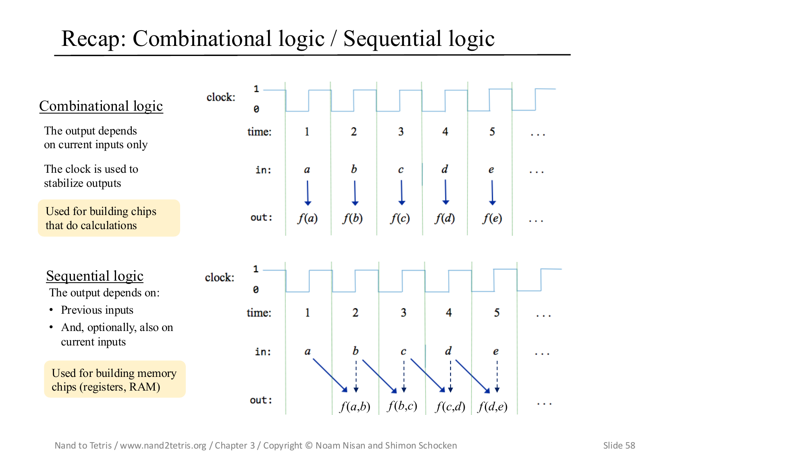

---

##### 3.2.1 Time Matters

In physical electronics, signals do not propagate instantaneously. Electrons require time to travel along physical wires, and transistors require time to switch state and charge capacitors. This physical delay consists of:
- **Propagation Delays**: The time elapsed between a change in an input pin and that change propagating down the physical wire to the gate's input.
- **Computation Delays**: The time a gate takes to switch its output state after its inputs have changed.

When inputs change, the outputs do not instantly jump to their correct values; instead, they undergo a chaotic analog transition phase, wiggling between 0 and 1.


##### Sweeping Delays Under the Rug (Discrete Time Abstraction)
To prevent programmers and hardware designers from having to calculate every microscopic delay, computer architecture abstracts continuous physical time into **discrete time steps** ($t = 1, 2, 3 \dots$) using a hardware **clock**:
- **Clock Oscillator**: A crystal oscillator (typically quartz) that generates a continuous train of alternating high/low electronic pulses (referred to as ticks and tocks).
- **Cycle Length (Clock Period)**: The duration of a single tick-tock cycle. This duration is a critical design parameter: it must be set to be slightly longer than the maximum propagation and computation delay of the computer's slowest combinational path (the critical path).

By setting the cycle length this way, we can safely ignore the internal analog wiggles and observe the outputs only at the cycle boundaries.


**Figure 3.2** Discrete time representation: state changes are observed only during cycle transitions, while within-cycle fluctuations are ignored.


##### The Shared System Rhythm
1. **Within the cycle**: Combinational logic computes. Inputs change, voltages rise/fall, and signals ripple through logic gates.
2. **At the cycle boundary**: Sequential elements (DFFs) sample their inputs and commit their next values, transitioning the state of the computer.

As long as the clock period satisfies:
$$\text{Clock Period} > \text{Max Combinational Delay}$$
the system is guaranteed to be stable and free of transient errors.

##### State Feedback Loops
In combinational logic, feeding the output of a gate directly back into its inputs creates a feedback loop with zero delay. Because the transition is instantaneous, this results in unstable race conditions, uncontrolled oscillations, or invalid states (e.g., connecting a NOT gate output back to its input creates a loop that rapidly oscillates between 0 and 1, drawing excessive power and generating thermal noise).

Sequential logic resolves this by introducing a **1-cycle clock delay**. By inserting a delay element (the DFF) into the feedback path:
1. The output at time $t$ depends on the input from time $t-1$.
2. This decouples the current input from the current output, allowing a wire to safely carry its own previous value without race conditions.

```text
               ┌───────────────────────┐
   Input (a) ──►   Combinational F()   ├─► Next State
               └──────────▲────────────┘
                          │
                   ┌──────┴──────┐
                   │ 1-Cycle DFF │ (Clocked Delay)
                   └──────▲──────┘
                          │
                          └──────────────── Output (Current State)
```

Traced mathematically over discrete time steps:
- At time $t=1$, the state is initialized to $a$:
  $$state(1) = a$$
- At time $t=2$, the feedback loop applies the function $f$:
  $$state(2) = f(state(1)) = f(a)$$
- At time $t=3$, the function is applied recursively:
  $$state(3) = f(state(2)) = f(f(a))$$
- In general, the state at any time step $t$ is:
  $$state(t) = f(state(t-1))$$

This discrete feedback mechanism enables the computer to transition gracefully from one state to another at each clock cycle edge, providing the basis for memory and CPU control units.

##### 3.2.2 Flip-Flops

To move information from time-step $t-1$ to time-step $t$, sequential systems require a hardware component that has **state**. The component must maintain one of two stable physical states (representing a digital 0 or 1) across the transition point of a clock cycle. Because it can switch between these two states based on control inputs, it is called a **flip-flop** (flipping to 0 and flopping back to 1).

The fundamental memory primitive used in this course is the **clocked Data Flip-Flop (DFF)**. 

> [!NOTE]
> For a detailed transition showing how a DFF is constructed from the basic combinational gates from Chapters 1 and 2, see the [DFF_DEEP_DIVE.md](DFF_DEEP_DIVE.md) notes.

###### DFF API
- **Inputs**: `in` (1-bit data input)
- **Outputs**: `out` (1-bit data output)
- **Clock**: Synchronised system clock input (represented visually by a triangle icon at the bottom of the chip diagram).

###### Behavioral Rule
$$out(t) = in(t-1)$$

*Meaning:*
The input pin value at time-step $t-1$ is delayed and emitted as the output pin value at time-step $t$.


###### Clock Icon (Triangle Symbol)
The triangle symbol at the bottom of a chip diagram indicates that it is a clocked (sequential) chip. Unlike combinational chips whose outputs depend immediately on current inputs, a clocked chip keeps state internally, and its outputs depend on what happened in previous cycles. At a physical level, this means the chip has access to the master clock oscillator to synchronise its state transitions.

###### The 1-Cycle Delay Key
The one-cycle delay of the DFF is the foundational element that enables state loops. It separates:
- The **old state** (which is stable and used for computations during the current clock cycle)
- The **new state** (which is computed during the cycle and committed at the cycle boundary for the next cycle)

By separating these two, we can feed outputs back to inputs without creating race conditions or unstable oscillations.

##### 3.2.3 Combinational and Sequential Logic

Every digital system is built by combining combinational logic (which does calculations) and sequential logic (which stores state).

###### The Generic Sequential Paradigm
The architecture of memory chips, CPU registers, and counters follows a universal feedback pattern:
1. **State Storage**: An array of DFFs stores the current state of the system.
2. **Combinational Processing**: The output of these DFFs (the current state) is fed into a combinational logic circuit along with any external inputs.
3. **Next State Calculation**: The combinational logic processes these inputs and generates a candidate next state.
4. **State Transition**: The output of the combinational logic is wired back to the inputs of the DFF array. At the next clock cycle boundary, the DFF array samples and stores this new state, becoming the current state for the next cycle.

*Generic Feedback Template:*
```text
               ┌───────────────────────┐
   Inputs ────►│                       │
               │  Combinational Logic  ├─► Next State
  Old State ──►│                       │      │
     ▲         └───────────────────────┘      │
     │                                        │
     │                 ┌───┐                  │
     └─────────────────┤DFF│◄─────────────────┘
                       └───┘
```

###### Example: A Counter
- The DFF array stores the current count value (e.g., 5).
- The combinational logic is an adder configured to add 1 to its input.
- The adder receives the current count (5) and outputs the candidate next state (6).
- At the clock tick, the DFF samples and stores the 6. The count transitions from 5 to 6.

###### The Rule of Safe Feedback
- **Unsafe Feedback**: Connecting the output of a combinational gate directly back to its input without a delay element creates a circular dependency in the same clock cycle, leading to race conditions and oscillations.
- **Safe Feedback**: Routing the feedback loop through a DFF is safe because the DFF delays the value until the next clock cycle, breaking the instantaneous loop.

#### 3.3 Specification

The chapter specifies the memory chips needed by the Hack platform.

The abstractions are:

```text
DFF       -> primitive one-bit delay
Bit       -> controlled 1-bit register
Register  -> controlled 16-bit register
RAM       -> addressable collection of registers
PC        -> register with reset/load/increment behavior
```

##### 3.3.1 Data Flip-Flop

The Data Flip-Flop (DFF) is the primitive 1-bit clocked delay element. It serves as the ultimate source of persistent state for all memory devices in the processor.

###### DFF Specification
- **Interface**: `DFF(in, out)`
- **Behavioral Contract**:
  $$out(t) = in(t-1)$$
- **Description**: Whatever value is at the input pin during the previous cycle $t-1$ is emitted on the output pin during the current cycle $t$.

##### 3.3.2 Registers

A register is a clocked memory device designed to store a value indefinitely until it is explicitly commanded to load a new one. The Hack platform defines two register abstractions:
- **Bit**: A 1-bit register.
- **Register**: A 16-bit register.

###### 1-Bit Register (Bit)
- **Interface**: `Bit(in, load, out)`
- **Inputs**:
  - `in`: 1-bit data input representing the value to be stored.
  - `load`: 1-bit control input deciding whether to update the register.
- **Outputs**:
  - `out`: 1-bit data output continuously emitting the stored state.

###### Bit Behavioral Contract
If the control pin `load` was asserted in the previous cycle, the register updates to the input value; otherwise, it holds its current state.

$$out(t) = \begin{cases} in(t-1) & \text{if } load(t-1) = 1 \\ out(t-1) & \text{if } load(t-1) = 0 \end{cases}$$


**Figure 3.5** 1-bit register (`Bit`).

###### 16-Bit Register (Register)
- **Interface**: `Register(in[16], load, out[16])`
- **Inputs**:
  - `in[16]`: 16-bit data bus representing the word to be stored.
  - `load`: 1-bit control input.
- **Outputs**:
  - `out[16]`: 16-bit data bus emitting the stored 16-bit word.
- **Behavior**: Exactly the same as the 1-bit register, applied across all 16 bits in parallel. All 16 internal bits share the same `load` signal, ensuring the entire word updates in unison.

For the 16-bit register:

```text
Register(in[16], load, out[16])
```


**Figure 3.6** 16-bit `Register`.

Read this figure as sixteen identical 1-bit storage decisions happening in parallel under one shared `load` signal.

Behavior:

```text
if load = 0:
    keep the old 16-bit word

if load = 1:
    store the new 16-bit input on the next clock cycle
```

The course adds one simple user-view rule: to read a register, just probe `out`. At any moment, `out` is the register's currently stored state.

Mental model:

```text
Bit stores one bit.
Register is sixteen Bit chips in parallel.
```

##### 3.3.3 Random Access Memory

In the Von Neumann architecture, memory is a central component that holds both the program's data and its execution instructions.

###### Memory Categories
- **Main Memory**: Fast, volatile semiconductor RAM hardwired onto the motherboard. It holds active program instructions and variables. Volatile means the stored state is lost when power is removed.
- **Secondary Storage**: Slow, non-volatile storage (disks, flash drives) where files and operating system files reside. State persists without power.
- **Logical Organization**: This course focuses entirely on the logical architecture of Random Access Memory (RAM), bypassing the analog transistor-level physical implementation.

###### The Memory Construction Ladder
To build RAM, we stack memory components recursively, starting from the atomic Data Flip-Flop (DFF):

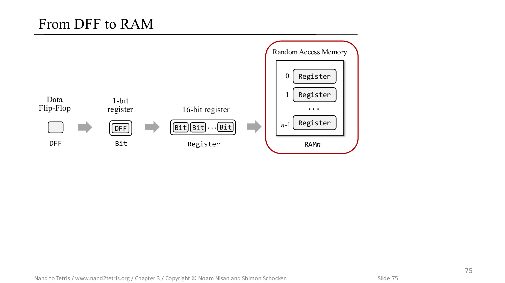

###### RAM Abstraction
A RAM chip of size $n$ consists of a sequence of $n$ addressable registers (numbered $0$ to $n-1$).
- **State**: The value currently expressed by the internal circuits of the registers, creating the illusion of storage.
- **Address Bits ($k$)**: To select exactly one out of $n$ registers using binary code, we require $k$ address pins:
  $$k = \log_2(n)$$
- **Word Width ($w$)**: The number of bits in each register (we assume $w = 16$ for the Hack computer).

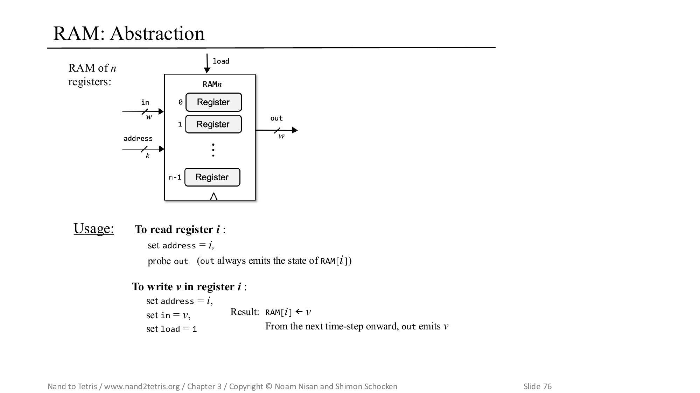

###### RAM Interface Ports
- `in[w]`: The $w$-bit data bus representing the value we want to write.
- `load`: The 1-bit control input deciding whether to write.
- `address[k]`: The $k$-bit selection code selecting which register to read or write.
- `out[w]`: The $w$-bit data output emitting the value of the selected register.

###### RAM Behavioral Contract
At any time cycle $t$, only the register selected by the `address` is active.
- **Reading**: The output pin `out` continuously emits the state of the selected register `RAM[address]`.
- **Writing**: If `load` is asserted (`load = 1`), the register at `address` is updated to the value of `in` on the next clock transition.

$$\text{out}(t) = \text{RAM}[\text{address}(t)](t-1)$$

$$\text{if } \text{load}(t-1) = 1: \quad \text{RAM}[\text{address}(t-1)](t) = \text{in}(t-1)$$

Meaning:
At step $t$, the output bus `out` emits the state of the register at the current `address`, which was stored at the end of the previous cycle $t-1$. If `load` was high in the previous cycle, the register at the previous `address` stores the input value `in` from that cycle.

###### The Power of Random Access
The term "Random Access" indicates that any memory location can be read or written in exactly the same access time ($O(1)$), regardless of whether the RAM has 8 registers or 8 million. This is achieved because:
1. State storage (holding the value) is sequential, utilizing clocked registers.
2. Address selection (routing to/from a register) is combinational, utilizing logic gates (multiplexers and demultiplexers) that resolve almost instantly.

##### 3.3.4 Counter

The Program Counter (`PC`) is a specialized register designed to track and direct program execution flow.

###### Execution Context (The Robot Recipe Metaphor)
Imagine a domestic robot programmed to bake brownies. The recipe consists of 50 steps (numbered $0$ to $49$) mounted on the wall:
- **Default Increment**: As the robot completes each step, a counter increments by $1$, telling the robot to execute the next instruction in sequence ($0 \to 1 \to 2 \dots$).
- **Direct Load (Jumping)**: If the recipe says "if the oven is already warm, skip to step 11", the counter must bypass sequence and load $11$ directly.
- **Reset**: When the recipe finishes and the robot must bake a new batch, the counter resets to step $0$.

###### PC Interface Ports
- `in[16]`: 16-bit data input representing the target jump address.
- `reset`: 1-bit control input to clear the counter to $0$.
- `load`: 1-bit control input to load the jump address from `in`.
- `inc`: 1-bit control input to increment the current count.
- `out[16]`: 16-bit data output continuously emitting the active instruction address.

###### PC Priority Logic Contract
The Program Counter behaves like a register with a prioritized multiplexing network. The control priority is absolute:
1. **Reset** overrides everything (clears to 0).
2. **Load** overrides increment (loads jump address).
3. **Increment** is the default active state transition (adds 1).
4. **Hold** occurs if no control bit is active (retains current count).

$$out(t) = \begin{cases} 0 & \text{if } reset(t-1) = 1 \\ in(t-1) & \text{else if } load(t-1) = 1 \\ out(t-1) + 1 & \text{else if } inc(t-1) = 1 \\ out(t-1) & \text{otherwise} \end{cases}$$

Meaning:
The output address `out` at cycle $t$ is determined by the control bits asserted during the previous cycle $t-1$. If `reset` was high, the address becomes $0$. If `reset` was low and `load` was high, the address becomes `in`. If both were low and `inc` was high, the address becomes `out(t-1) + 1`. Otherwise, the address remains unchanged.


**Figure 3.8** Program Counter (`PC`).

The PC is still a register at its core, but wrapped with combinational control logic that selects among several candidate next values.

#### 3.4 Implementation

The implementation strategy is the same throughout the chapter:

```text
store state in DFFs/registers
use combinational logic to choose the next value
commit the chosen value on the next clock cycle
```

##### 3.4.1 Data Flip-Flop

The course and the hardware simulator treat the `DFF` as a primitive, built-in gate (`BUILTIN DFF`). However, understanding how a physical flip-flop is implemented under the hood provides key insight into the physics of memory.

###### Constructing Memory from NAND Gates
In physical hardware, memory cells are constructed from standard combinational logic gates (NAND gates) wired together in **feedback loops**:
1. **The Cross-Coupled Latch**: Wiring the output of one NAND gate to the input of another creates a bi-stable loop (known as an SR latch). This loop amplifies any feedback signal and locks itself into one of two stable physical states (high voltage representing 1, or low voltage representing 0).
2. **Cycle Isolation (Edge-Triggering)**: A simple latch is level-sensitive, meaning its output changes immediately when its inputs change. If a level-sensitive latch is used in a state feedback loop, the signal will cycle around the loop multiple times within a single clock period, causing unstable race conditions.
3. **Master-Slave Design**: To prevent race conditions, a physical flip-flop uses two gated latches configured in a master-slave configuration (or edge-triggered latching). While the clock is high, the master latch is open to input changes while the slave latch is locked. When the clock transitions, the master latch locks its state and transfers it to the slave latch, which then updates the chip output. This isolates successive clock cycles and guarantees that outputs only update once per clock edge.

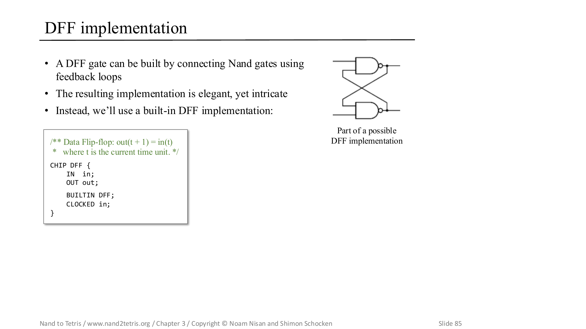

###### Why We Treat DFF as a Primitive
Simulating recursive feedback loops in a digital logic simulator requires tracking continuous analog voltage transitions, which is computationally expensive and sluggish. To maintain simulator speed and focus purely on memory architecture, the DFF is implemented as a built-in Java class.

##### 3.4.2 Registers

A DFF stores and outputs its input value at every clock cycle. To make a useful register, we must add a control mechanism to select whether to load a new value or maintain the currently stored value.

###### The Naive Feedback Loop Error
If we try to build a 1-bit register by looping the output of a DFF directly back to its input, we create a circuit that remembers its state, but remains closed to the outside world—there is no physical pin to feed new inputs:

```text
       ┌──────────┐
  ────►│   DFF    ├────► out
  ▲    └──────────┘    │
  └────────────────────┘
```

###### The Mux-DFF Loop Implementation
To resolve this, we place a Multiplexer (Mux) before the DFF. The Mux acts as a routing switch, choosing between the DFF's own feedback output (when `load = 0`) and the external data input pin (when `load = 1`).

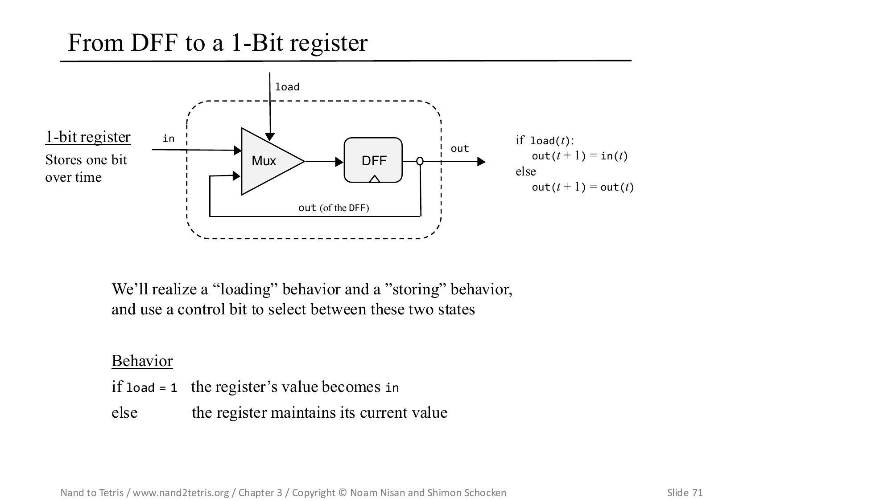

###### Trace Analysis: Retaining State (load = 0)
When `load` is 0 at cycle $t-1$:
1. The Multiplexer selects channel `a`, which is connected to the DFF output $out(t-1)$.
2. The Multiplexer outputs $out(t-1)$ to the input of the DFF.
3. At the next clock transition, the DFF commits this value, resulting in:
   $$out(t) = out(t-1)$$
   The state is successfully held.

###### Trace Analysis: Loading State (load = 1)
When `load` is 1 at cycle $t-1$:
1. The Multiplexer selects channel `b`, which is connected to the external input $in(t-1)$.
2. The Multiplexer outputs $in(t-1)$ to the input of the DFF.
3. At the next clock transition, the DFF commits this value, resulting in:
   $$out(t) = in(t-1)$$
   The new state is loaded.

###### 16-Bit Register Construction
A 16-bit register (`Register`) is implemented by placing sixteen `Bit` registers in parallel. All sixteen chips share the same single `load` control signal, ensuring that all 16 bits of the word update in unison:
- `Bit 0` stores `in[0]`
- `Bit 1` stores `in[1]`
- ...
- `Bit 15` stores `in[15]`

All outputs are grouped together as a 16-bit output bus `out[16]`.

##### 3.4.3 RAM

RAM is constructed recursively, stacking smaller memory units to build larger ones.

###### The RAM Chip Family
For the Hack platform, we build a family of five 16-bit RAM chips:

| Chip Name | Register Count ($n$) | Address Width ($k$) | Address Selection Logic |
|---|---|---|---|
| **RAM8** | 8 | 3 | Selects 1 of 8 16-bit registers |
| **RAM64** | 64 | 6 | Selects 1 of 8 RAM8 chips (3 bits) + 1 of 8 registers inside that block (3 bits) |
| **RAM512** | 512 | 9 | Selects 1 of 8 RAM64 chips (3 bits) + 1 of 8 RAM8 blocks inside (3 bits) + register (3 bits) |
| **RAM4K** | 4,096 | 12 | Selects 1 of 8 RAM512 chips (3 bits) + internal offsets (9 bits) |
| **RAM16K** | 16,384 | 14 | Selects 1 of 4 RAM4K chips (2 bits) + internal offsets (12 bits) |

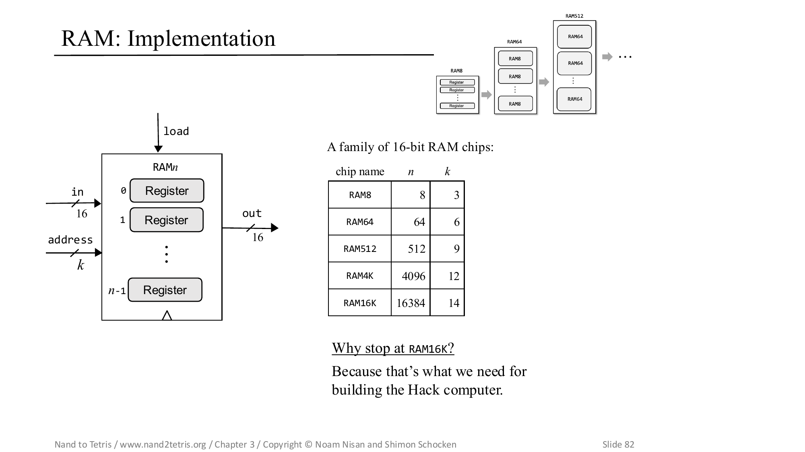

###### 1. RAM8 Implementation
RAM8 is the base unit of addressable memory, containing 8 Register chips (Register 0 to 7) operating in parallel:
- **Routing Input Data**: The global input bus `in[16]` is wired directly to the `in` inputs of all 8 internal Registers.
- **Reading (Multiplexing)**: The outputs of all 8 Registers are connected to a 16-bit 8-way Multiplexer (`Mux8Way16`). The 3-bit address bus `address` selects which register's output is routed to the global output pin `out`.
- **Writing (Demultiplexing)**: The global `load` bit is sent to a 1-to-8 Demultiplexer (`DMux8Way`), controlled by the 3-bit `address`. The DMux directs the `load` signal to the target register's `load` pin (sending 0 to all other registers). Only the selected register receives the active write signal and stores `in` at the next clock edge.

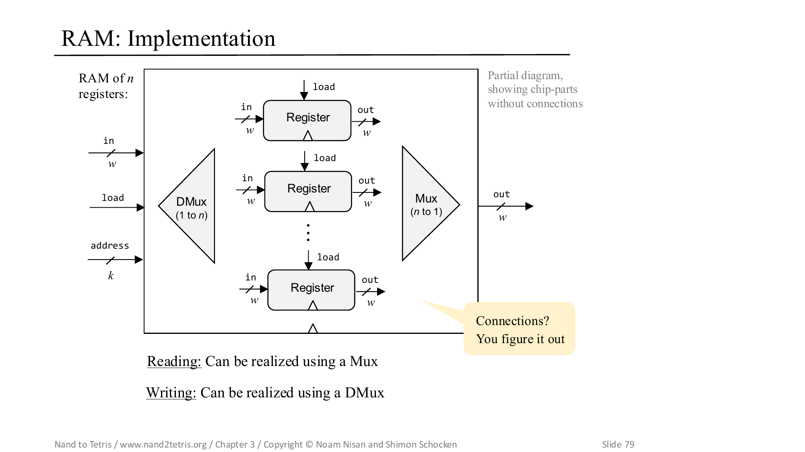

###### 2. Recursive Address Splitting
To build larger RAM chips (RAM64 and beyond), we group eight smaller memory blocks together and partition the address bus into two parts:
- **High-Order Address Bits**: Used to select which of the 8 sub-blocks to activate (routing the `load` signal via a DMux and reading output via a Mux).
- **Low-Order Address Bits**: Passed down to all 8 sub-blocks in parallel to select the target register inside the active sub-block.

For example, in `RAM64` (consisting of eight `RAM8` chips):
- We have a 6-bit address bus `address[6]`.
- The most significant 3 bits (`address[3..5]`) select one of the 8 `RAM8` sub-chips.
- The least significant 3 bits (`address[0..2]`) select one of the 8 individual Registers within the selected `RAM8` chip.

```text
       ┌─────────── address[0..5] ───────────┐
       ▼                                    ▼
[ address[3..5] ]                    [ address[0..2] ]
Selects 1 of 8 RAM8 chips            Selects 1 of 8 registers
(Steers load / reads output)         (Passed to RAM8 internal selection)
```

This structural recurrence continues all the way up the hierarchy:

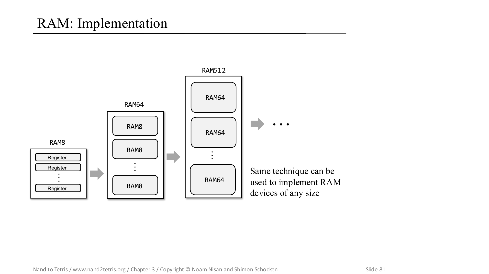

##### 3.4.4 Counter

A Program Counter is implemented by wrapping a 16-bit Register with combinational logic that calculates the next state and selects it based on priority.

###### 1. Component Composition
To build the PC, we connect:
- **State Storage**: A 16-bit `Register` that stores the current count.
- **Incrementer**: An `Inc16` chip that continuously calculates `out + 1` from the Register's output.
- **Multiplexer Cascade**: A chain of three 16-bit 2-way Multiplexers (`Mux16`) to select the next state.

Concrete Priority Cascade Schema
```text
           out (Feedback)
            │      │
            │    [Inc16] (out + 1)
            │      │
            ▼      ▼
         [ Mux16 (Stage 1) ] ◄─── inc
                  │
  in ─────────────┼────────┐
                  ▼        ▼
         [ Mux16 (Stage 2) ] ◄─── load
                  │
  0 ──────────────┼────────┐
                  ▼        ▼
         [ Mux16 (Stage 3) ] ◄─── reset
                  │
                  ▼
             [ Register ] ──► out (to system)
```

###### 2. The Multiplexer Cascade and Priority Routing
Because the Hack HDL requires us to resolve selections in a specific order of precedence, we arrange the `Mux16` gates in a chain where each successive multiplexer overrides the decisions of the earlier ones.

1. **Stage 1 (Increment Selector)**:
   - Selects between the current count `out` and the incremented count `out + 1`.
   - Controlled by `inc`.
   - If `inc = 1`, selects `out + 1`. If `inc = 0`, selects `out`.
2. **Stage 2 (Load Selector)**:
   - Selects between the output of Stage 1 and the external jump input `in`.
   - Controlled by `load`.
   - If `load = 1`, selects `in` (overriding `inc`). If `load = 0`, selects Stage 1's output.
3. **Stage 3 (Reset Selector)**:
   - Selects between the output of Stage 2 and the constant `0` (represented as `false` in HDL).
   - Controlled by `reset`.
   - If `reset = 1`, selects `0` (overriding both `load` and `inc`). If `reset = 0`, selects Stage 2's output.

The output of Stage 3 is then wired directly into the input of the Register.

###### Tracing Clock Execution (Tick/Tock Demo)
1. **Initialize State**: Let the Register store `23`.
2. **Load Scenario (`load = 1`, `in = 45`, `inc = 1`, `reset = 0`)**:
   - Stage 1 selects `23 + 1 = 24`.
   - Stage 2 selects `in = 45` (load overrides inc).
   - Stage 3 selects Stage 2's output (`45`, since `reset = 0`).
   - The Register's input pin receives `45`.
   - **On Tick**: The internal state of the Register updates to `45`.
   - **On Tock**: The output stabilizes to `45` and propagates through the system.
3. **Increment Scenario (`load = 0`, `inc = 1`, `reset = 0`)**:
   - Stage 1 selects `45 + 1 = 46`.
   - Stage 2 selects Stage 1's output (`46`, since `load = 0`).
   - Stage 3 selects Stage 2's output (`46`, since `reset = 0`).
   - **On Tick**: The internal state updates to `46`.
   - **On Tock**: The output stabilizes to `46`.
4. **Safety Verification**: If we inadvertently keep `load = 1` while trying to count, the Register will keep reloading `in` on every clock edge, preventing the incrementer from advancing. We must drop `load = 0` to resume counting.

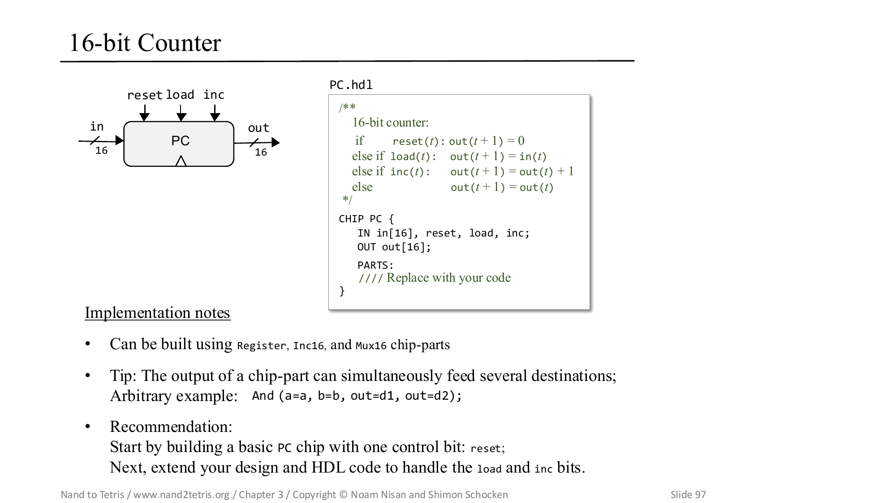

#### 3.5 Project

Project 3 tasks us with implementing the complete sequential logic chipset for the Hack platform, spanning from a single controlled memory bit to the addressable computer RAM.

###### The sequential Chip Hierarchy
Our construction strategy is a "Russian Doll" system where each chip recursively wraps the previous layer:
- `DFF`: The built-in atomic sequential delay.
- `Bit` (1-bit Register): The only chip in the entire computer that uses the `DFF` directly.
- `Register` (16-bit word): Formed by placing sixteen `Bit` registers in parallel.
- `RAM8` (8 registers): Built from eight `Register` chips plus address routing.
- `RAM64` $\to$ `RAM512` $\to$ `RAM4K` $\to$ `RAM16K`: Nested ascending arrays of memory blocks.
- `PC` (Program Counter): A `Register` wrapped in multiplexing priority routing logic.

Implementation links: [`Bit`](projects/project-03-memory.md#bit), [`Register`](projects/project-03-memory.md#register), [`RAM8`](projects/project-03-memory.md#ram8), [`RAM64`](projects/project-03-memory.md#ram64), [`RAM512`](projects/project-03-memory.md#ram512), [`RAM4K`](projects/project-03-memory.md#ram4k), [`RAM16K`](projects/project-03-memory.md#ram16k), and [`PC`](projects/project-03-memory.md#pc).

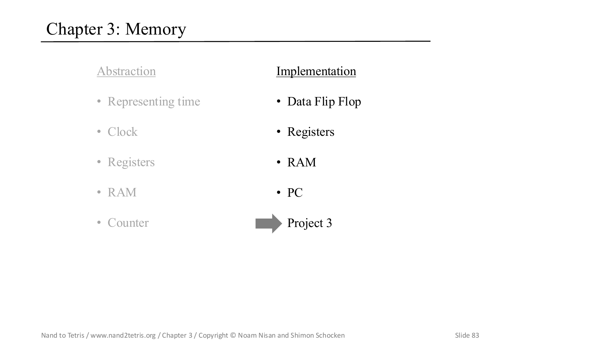


**Why this structure must be preserved:**
The Hardware Simulator is a standard computer program. If it evaluates a massive chip like `RAM16K` by recursively expanding every sub-part down to individual `DFF` gates, it will create millions of internal simulator objects. This would slow down simulation or cause the program to crash.

By separating the files into directories `a` and `b`, we exploit the simulator's path-loading rules:
1. When loading a chip from folder `b` (e.g., `RAM512.hdl`), the simulator searches its current directory for its constituent sub-parts (like `RAM64.hdl`).
2. Finding no `RAM64.hdl` in directory `b`, the simulator stops recursive drilling and automatically falls back to its highly optimized compiled Java class (`BUILTIN RAM64`).
3. This partition guarantees smooth, instantaneous simulation times.

###### Implementation Best Practices
- **Use Built-in Parts**: When writing HDL, do not copy your custom gate implementations from Projects 1 and 2 (such as `Mux16` or `DMux8Way`) into Project 3 directories. Allow the simulator to load its built-in implementations to keep execution fast.
- **The Hardware Loop**: Follow the standard iterative process:
  1. Read the target API and behavioral contract.
  2. Implement the wiring logic in HDL.
  3. Load the `.tst` test script in the simulator.
  4. Run the script and verify that the generated output `.out` file matches the reference `.cmp` file.

#### 3.6 Perspective

The closing perspective of Chapter 3 highlights several physical implementations, memory technologies, and engineering trade-offs that are abstracted away to simplify system architecture.

##### 3.6.1 Physical Flip-Flops vs. Abstraction
While we treat the DFF as an atomic, built-in primitive, physical flip-flops are constructed from combinational gates (such as NAND or NOR) configured in feedback loops:
- **Bi-stable Storage**: Two cross-coupled gates create an SR (Set-Reset) latch that can hold its state in one of two stable physical configurations (representing 0 or 1) based on momentary input triggers.
- **Edge Isolation (Master-Slave)**: Cascading two latches—a Master latch controlled by the inverted clock signal and a Slave latch controlled by the direct clock signal—ensures that state updates occur precisely at the clock cycle boundaries (ticks and tocks), preventing signal wiggles from propagating forward inside a single cycle.
- **Solid-State Physics**: Modern computers do not build memory cells strictly from textbook gate loops. Instead, they exploit the unique physical and electrical properties of semiconductor silicon (such as capacitors in DRAM or floating-gate transistors in flash memory) to minimize size, heat, and cost.

##### 3.6.2 Memory Hierarchy and Non-Volatile Storage
Physical memory systems operate under a classic trade-off: speed, size, and cost are inversely proportional. This leads to a layered memory hierarchy:
- **Volatile RAM**: Random Access Memory is fast and directly addressable, but it is volatile—meaning its stored contents disappear the moment power is cut.
- **Non-Volatile ROM**: Read-Only Memory is non-volatile, keeping its data permanently intact without power. ROM is critical for the booting (bootstrapping) process. When the computer turns on, a hardwired program in ROM runs first to initialize hardware components and load the operating system's startup code from secondary storage (like a disk drive) into RAM.
- **Flash Memory**: Combines the best of both RAM and ROM, providing a non-volatile medium that can be written to and modified in-place, making it perfect for SSDs, USB drives, and firmware.
- **Cache Memory**: A small, ultra-fast, and expensive memory block placed inside or extremely close to the processor core. The cache stores copies of frequently accessed data from the larger, slower main memory. Doing this correctly ensures that the processor operates at close to register speeds most of the time.

##### 3.6.3 Universal Logical Abstraction
Despite the vast differences in physical storage technologies (transistors, capacitors, magnetic disks, or optical media), they are logically identical from the programmer's point of view.

Every memory system behaves as a linear sequence of addressable registers:

```text
registers store words
RAM stores addressable words
counters store and update control positions
```

By abstracting these physical layers into uniform logical components, computer systems can run software without needing to adapt to the underlying hardware medium. Together with the ALU from Chapter 2, these memory devices provide the final components required to construct the CPU and the complete Hack computer platform.

### 4 Machine Language

Chapters 1-3 built the hardware pieces of a computer.

Chapter 4 pauses before building the CPU and asks a practical question:

```text
what is this hardware supposed to execute?
```

The answer is machine language.

Machine language is the interface between hardware and software.

At this level, programs tell the computer exactly what to do:

```text
compute a value
move a value
read or write memory
test a condition
jump to another instruction
```

High-level languages hide these details.

Machine language exposes them directly.

That is why this chapter matters so much:

```text
hardware becomes useful only when it can execute instructions
```

#### 4.1 Machine Language: Overview

This section explains what a machine language must talk about.

The focus is not on all the circuitry inside the machine.

The focus is on the hardware elements that a programmer must control explicitly.

The course adds one teaching motivation for doing Chapter 4 before Chapter 5: before building the full Hack computer, it helps to see what kind of machine the hardware is supposed to support from the programmer's point of view.

##### 4.1.1 Hardware Elements

Machine language is written for a specific physical machine.

So the language has to name the key hardware things that exist at runtime:

```text
memory     -> where most values live
processor  -> the thing that does operations
registers  -> small, fast storage inside the processor
```

**Memory** is the computer's big table of storage cells.

Each cell has an **address** (a number) and holds a fixed-width value (for Hack, 16 bits).

Mental model:

```text
RAM[0] = some 16-bit value
RAM[1] = some 16-bit value
RAM[2] = some 16-bit value
...
```

To use memory, a program must (1) pick an address, then (2) read or write the value stored at that address.

**Processor (CPU)** is the device that repeatedly:

```text
fetch an instruction
decode what it means
execute it (ALU work, memory access, or a jump)
```

It can do only a fixed set of primitive operations (add, and, not, compare, branch, etc.).

It does not "decide" what to do.

It follows the program's instruction stream.

**Registers** are a few storage cells built into the CPU chip.

They are much faster than main memory, so machine languages use them as the CPU's working area.

Two roles matter a lot:

```text
data registers    -> hold values being computed
address registers -> hold a value that is treated as a memory address
```

One subtle point that often causes confusion:

An "address register" does not contain some special "address substance".

It contains an ordinary bit-pattern, like any other register.

Whether that bit-pattern is interpreted as:

```text
the number 17
```

or as:

```text
the address of memory cell 17
```

depends entirely on what the next instruction chooses to do with it.

Concrete mental example (we will see this exactly in Hack later with the `A` register):

```text
If A = 17:

use A as data:     D = A    // D gets the value 17
use A as address:  D = M    // D gets RAM[A] (i.e., RAM[17])
```

This distinction matters because many machines access memory **indirectly**.

Instead of a single magical instruction "write RAM[123]", you typically do it in two steps:

```text
1) put 123 in an address register  (this selects RAM[123])
2) read/write the selected memory cell
```

That pattern is the core mental model for low-level programming:

```text
address register selects a memory cell
then the next instruction acts on that selected cell
```

##### 4.1.2 Languages

Machine language programs can be written in two equivalent notations:

```text
binary   -> what the CPU actually executes
symbolic -> a human-friendly spelling of the same instructions
```

The binary form is literally the bits that sit in instruction memory.

The symbolic form is what we call **assembly language**.

The bridge between them is a translation program:

```text
assembly (symbolic) -> assembler -> machine code (binary)
```

The key idea is that these are not two different languages.

They are two different *representations* of the same underlying instruction set.

Concrete example:

Suppose we want the abstract operation:

```text
set R1 to (R1 + R2)
```

As machine designers, we can decide an encoding scheme like:

```text
add op-code = 101011
R1 code     = 00001
R2 code     = 00010
```

Then the CPU's binary instruction could be:

```text
101011 00010 00001
```

Since `6 + 5 + 5 = 16`, concatenating these fields left-to-right gives:

```text
1010110001000001
```

Humans don't want to write or debug long bit-patterns.

So we choose a symbolic spelling for the same instruction, like:

```text
add R2,R1
```

And we let the assembler do the mechanical work:

```text
look up "add"  -> write 101011
look up "R2"   -> write 00010
look up "R1"   -> write 00001
pack fields into the 16-bit instruction format
```

In other words: symbols are not magic.

They are just names that stand for agreed-upon bit patterns.

Unlike high-level languages, assembly language is tied to a specific hardware platform.

Change the CPU (instruction formats, op-codes, registers), and you necessarily change the assembly language too.

##### 4.1.3 Instructions

This subsection is still staying general.

The book is not yet saying, "Here is the exact Hack syntax."

It is first answering a more basic question:

```text
what jobs must any machine language be able to do?
```

The answer is a short list:

```text
1) compute on values
2) access memory
3) control which instruction executes next
4) use symbols so humans can manage the code
```

That list is almost a definition of what low-level programming is.

If a language could not do these things, it could not control a general-purpose computer.

**Arithmetic and logical operations** let the computer transform data that is already inside the machine.

Examples:

```text
add two values
subtract one value from another
and/or/not values
```

These instructions are the programmer's view of the ALU.

At the hardware level, the ALU is a circuit.

At the machine-language level, it appears as a menu of primitive operations that instructions can request.


Figure `4.1` without the caption shows two tiny examples.

The first sequence is arithmetic:

```text
load R1,17
load R2,4
add R1,R1,R2
```

Read it step by step:

```text
put 17 in R1
put 4 in R2
replace R1 with R1 + R2
```

So after the third instruction, `R1 = 21`.

The second sequence is logical:

```text
load R1,true
load R2,false
and R1,R1,R2
```

Meaning:

```text
put true in R1
put false in R2
replace R1 with R1 And R2
```

Since `true And false = false`, the final value in `R1` is false.

The important point is not these particular mnemonics.

The important point is that machine language exposes primitive computation directly.

There is no expression parser, no rich type system, and no hidden runtime.

If you want a computation, you ask for it in small explicit steps.

The design lesson here is important:

an instruction set is always a cost/performance trade-off.

If you add richer operations, larger data types, or more elaborate addressing features, programming becomes nicer, but the hardware becomes more expensive and often slower.

**Memory access** exists because computation alone is not enough.

The CPU must also be able to fetch values from memory and store results back into memory.

Registers are the CPU's fast workspace.

Memory is the larger storage area outside that workspace.

So machine language needs instructions that move between:

```text
values in registers
values in memory
```

The usual pattern is indirect addressing:

```text
put an address in an address register
then operate on the selected memory cell
```

The easiest mental model is:

```text
A = a pointer to one memory address
M = the memory word currently selected by A
```

So:

```text
M = RAM[A]
```

This means `M` is not one fixed place.

Its meaning changes whenever `A` changes.

Example:

```text
if A = 17, then M means RAM[17]
if A = 200, then M means RAM[200]
```

This section is still speaking in general machine-language terms, not yet in exact Hack syntax.

So when the book uses instructions like:

```text
load A,17
load M,1
```

it is illustrating the access pattern, not yet giving the final Hack spelling.

The idea is:

```text
A = address register
M = the memory word currently selected by A
```

So if `A = 17`, then `M` means memory location `17`.

Then:

```text
load M,1
```

means:

```text
store 1 into memory[17]
```

Read the two instructions as:

```text
load A,17   -> make A point to address 17
load M,1    -> write 1 into the memory cell A points to
```

The bigger example follows exactly the same logic.

To set memory locations `200..249` to `1`, the machine first selects the start address and then repeatedly writes through the selected memory word while advancing the address:

```text
load A,200
loop:
  load M,1
  add A,A,1
```

Mental model:

```text
start with A = 200
write 1 into memory[A]
increment A
write 1 into memory[A]
increment A
repeat
```

Tiny trace:

```text
load A,200   -> A = 200, so M means RAM[200]
load M,1     -> RAM[200] = 1
add A,A,1    -> A = 201, so now M means RAM[201]
load M,1     -> RAM[201] = 1
add A,A,1    -> A = 202
```

So the main memory-access lesson is:

```text
first select an address
then read or write the selected memory word
```

In actual Hack assembly, the same idea later appears in a more concrete form such as:

```text
@17
M=1
```

Meaning:

```text
put 17 in A
now M means RAM[17]
store 1 there
```

This is why address registers matter so much in low-level programming.

They let the CPU point at one memory word, and then operate on that selected word.

**Flow control** exists because a useful program cannot just march forward forever.

Without flow control, a program would be trapped in straight-line execution:

```text
instruction 1
instruction 2
instruction 3
instruction 4
...
```

Without jumps, every program would be one fixed straight line.

That would make loops, conditionals, early exits, and repeated work impossible.

With jumps and tests, machine language can build higher-level patterns like:

```text
if
while
for
goto
```

At the machine-language level, these are not special language constructs.

They are all built from instructions that decide what the next instruction address will be.


**Figure 4.1** Two versions of the same low-level code (it is assumed that the code includes some loop termination logic, not shown here).

Read the left side first.

It uses physical instruction addresses:

```text
12: load R1,0
13: add R1,R1,1
...
27: goto 13
```

Meaning:

```text
initialize R1 to 0
keep incrementing R1
when execution reaches instruction 27, jump back to instruction 13
```

So the loop is controlled by a raw numeric address.

This works, but it is fragile.

If you insert or remove instructions earlier in the program, the jump destination may change.

Now read the right side.

It expresses the same loop using a symbolic label:

```text
load R1,0
(LOOP)
  add R1,R1,1
...
  goto LOOP
```

The logic is identical, but the meaning is clearer:

```text
jump back to the place named LOOP
```

This is much easier for humans to read and maintain.

**Symbols** are the usability layer on top of all this.

The book uses figure 4.1 to show that symbolic names are not just cosmetic.

They solve a real low-level programming problem.

When code uses symbolic references instead of hard-coded physical addresses, the code becomes:

```text
easier to write
easier to debug
easier to maintain
easier to move in memory
```

That last point is especially important.

If code says `goto 13`, then it assumes the target instruction really is at address 13.

If the whole program gets shifted in memory, that assumption can break.

If code says `goto LOOP`, an assembler can translate `LOOP` to whichever physical address is correct in the final program.

This is what the book means by *relocatable* code.

So the full message of `4.1.3` is:

```text
machine language must let us compute
machine language must let us access memory
machine language must let us change control flow
machine language becomes usable for humans when symbols replace raw addresses
```

The next section, `4.2`, takes these general ideas and shows exactly how the Hack computer realizes them.

#### 4.2 The Hack Machine Language

After the general overview, the chapter narrows to one specific machine language:

```text
the Hack machine language
```

This is the language the Hack computer will execute in Chapter 5.

##### 4.2.1 Background

This section answers a practical question:

```text
what hardware picture should you keep in your head while reading Hack assembly?
```

Hack follows the von Neumann style and is a 16-bit computer.

So the machine stores, moves, and computes using 16-bit values.

The easiest way to understand the language is to first understand the memory model.

Hack uses two memories:

```text
data memory        -> RAM
instruction memory -> ROM
```

Each memory is 16 bits wide and has a 15-bit address space.

So each one can hold:

```text
2^15 = 32K words
```


**Figure 4.2** Conceptual model of the Hack memory system. Although the actual architecture is wired somewhat differently (as described in chapter [5](#5-computer-architecture)), this model helps understand the semantics of Hack programs.

The key purpose of this figure is semantic, not electrical.

It is not trying to show every wire.

It is trying to show what Hack programs can talk about and manipulate:

```text
instruction memory
data memory
A register
D register
selected memory word M
```

The core split is:

```text
ROM = the program
RAM = the program's data
```

That separation is central.

When a Hack program runs, it is constantly doing two things at once:

```text
reading the next instruction from ROM
reading/writing data in RAM
```

Hack machine language manipulates three named storage targets:

```text
A
D
M
```

`D` is the straightforward one.

It is just a 16-bit data register.

`A` is the unusual one.

It can act as:

```text
a data register
an address register
```

`M` is the trickiest one.

It is not a separate physical register inside the CPU.

Instead:

```text
M means RAM[A]
```

So when `A = 100`, the symbol `M` refers to `RAM[100]`.

This single idea explains a huge part of the Hack language.

The instruction `@xxx` sets `A` to `xxx`.

Important: `A` always holds one plain 16-bit number.

It is not storing multiple meanings at once.

What changes is how the *next* instruction uses that same number.

`@xxx` does have two *side effects* in the hardware model:

```text
it makes RAM[xxx] the selected data memory word (so M would mean RAM[xxx])
it makes ROM[xxx] the selected instruction (so a jump could go there)
```

But you normally act on only one of these.

The next instruction reveals which role `A` is playing:

```text
use A as a number:         D=A
use A as a RAM address:    M=... or D=M        // because M = RAM[A]
use A as a jump target:    ...;JMP / ...;JEQ   // because the jump sets PC = A
```

Examples:

```text
@17
D=A
```

means:

```text
put 17 into A
then copy that 17 into D
```

So here `A` is being used like a data register.

And:

```text
@100
M=D
```

means:

```text
select RAM[100]
store D into that selected memory word
```

So here `A` is being used as an address register.

Branching uses the same register:

```text
@29
0;JMP
```

means:

```text
put 29 into A              // set up the jump target
jump: set PC = A           // so the next instruction fetched is ROM[A]
```

So here `A` is being used as a jump target.

Hack also supports **conditional branching**.

For example, the logic:

```text
if D==0 goto 52
```

is written as:

```text
@52
D;JEQ
```

Read it as:

```text
put 52 into A
evaluate D
if D equals 0, jump to the instruction whose address is A
```

So branching in Hack follows one basic pattern:

```text
1) put the destination in A
2) execute either an unconditional or conditional jump instruction
```

This dual use of `A` may feel strange at first, but it keeps the architecture small and economical.

That is the main trade-off:

```text
slightly more conceptual confusion
in exchange for simpler hardware and a smaller instruction set
```

Variables are where symbols start to matter in a serious way.

In Hack, the `xxx` in `@xxx` can be either:

```text
a constant
a symbol
```

So:

```text
@23
```

means:

```text
set A to the numeric value 23
```

But:

```text
@x
```

means:

```text
set A to whatever numeric address the assembler assigned to x
```

If the assembler decided that `x` lives at address `513`, then `@x` ends up behaving like `@513`.

This is what lets Hack programs use variables instead of hard-coded physical addresses.

For example, the high-level idea:

```text
let x = 17
```

can be implemented as:

```text
@17
D=A
@x
M=D
```

Read it step by step:

```text
put 17 into D
select the RAM location bound to x
store 17 there
```

So the symbol `x` is not the value itself.

It is a name that the assembler resolves to some RAM address.

That is the assembler's job:

```text
take symbolic names like x or count
bind them to sensible, consistent RAM addresses
replace the symbols with those addresses during translation
```

This is why programmers can write:

```text
@count
M=M+1
```

instead of something like:

```text
@30
M=M+1
```

The second version hard-codes a physical address.

The first version says what the memory cell means, and lets the assembler decide where it should live.

That is much easier to read, change, and maintain.

The language also includes built-in symbols `R0` through `R15`, bound to addresses `0` through `15`.

So:

```text
@R3
M=0
```

ends up meaning:

```text
RAM[3] = 0
```

These built-in names act like convenient pre-named working slots.

That is why the book calls them *virtual registers*.


**Figure 4.3** Hack assembly code examples.

This figure is like a compact tour of the whole language.

It shows that most Hack code is built from the same repeating pattern:

```text
1) use @xxx to load or select something via A
2) use a compute instruction to do something with D, M, or the jump logic
```

The left column shows **memory access examples**.

First:

```text
// D = 17
@17
D=A
```

Meaning:

```text
put the value 17 into the A register // used as data
copy A into D
```

So this is how Hack gets a constant into `D`.

There is no direct `D=17` instruction.

Second:

```text
// RAM[100] = 17
@17
D=A
@100
M=D
```

Meaning:

```text
put the value 17 into the A register // used as data
copy A into D
put 100 into A // used as address -> select RAM[100]
store D into M // M = RAM[A]
```

This shows a very common two-stage pattern:

```text
first prepare a value
then select a memory address
then write the value there
```

Third:

```text
// RAM[100] = RAM[200]
@200
D=M
@100
M=D
```

Meaning:

```text
put 200 into A // used as address -> select RAM[200]
copy M into D // M = RAM[A]
put 100 into A // used as address -> select RAM[100]
store D into M // M = RAM[A]
```

So `D` is often used as a temporary holding place when moving data from one memory cell to another.

The middle column shows **branching examples**.

First:

```text
// goto 29
@29
0;JMP
```

Meaning:

```text
put 29 into A                    // set up the jump target
jump to the instruction at A     // equivalently: set PC = A, so next fetch is ROM[A]
```

So unconditional jumping is also a two-step process:

```text
select target address
issue jump instruction
```

Second:

```text
// if D>0 goto 63
@63
D;JGT
```

Meaning:

```text
put 63 into A                    // set up the jump target
if D is greater than 0, jump to the instruction at A
```

So conditional branching works by:

```text
testing some computed value
and using A as the jump destination if the condition passes
```

The right column shows **variable use examples**.

First:

```text
// x = -1
@x
M=-1
```

Meaning:

```text
put the address of x into A          // x is a symbol; the assembler resolves it
store -1 into M                      // M = RAM[A]
```

The important point is that the program never needs to know the physical address of `x`.

Second:

```text
// count = count - 1
@count
M=M-1
```

Meaning:

```text
put the address of count into A      // assembler resolves the symbol
decrement M in-place                 // M = RAM[A]
```

This is an in-place update of one variable.

Third:

```text
// sum = sum + x
@sum
D=M
@x
D=D+M
@sum
M=D
```

Meaning:

```text
put the address of sum into A        // select RAM[sum]
copy M into D                        // D = RAM[sum]
put the address of x into A          // select RAM[x]
add M into D                         // D = D + RAM[x]
put the address of sum into A        // select RAM[sum] again
store D into M                       // RAM[sum] = D
```

This example shows the general pattern for combining two variables:

```text
load one value into D
combine it with another value
store the result back somewhere
```

These examples are worth scanning slowly because each one highlights a different role of `A`:

```text
as a place to hold a constant
as a way to select RAM
as a way to select a jump destination
```

Across all the snippets, the same small vocabulary repeats:

```text
@value or @address   // set A (as a number, RAM address, or jump target)
use D                // temporary storage
operate on M         // M = RAM[A]
jump via A           // jumps set PC = A
use symbols when possible
```

##### 4.2.2 Program Example

Before giving the formal instruction format, the chapter throws you into a complete Hack program.

The task is to compute:

```text
1 + 2 + 3 + ... + n
```

The contract is:

```text
input:  n is already in RAM[0] (R0)
output: write the sum into RAM[1] (R1)
```

Instead of using the closed-form formula, the program uses a loop and repeated addition.
That is deliberate: it is a vehicle for showing conditional jumps and iteration in Hack.


**Figure 4.4** A Hack assembly program (example). Note that `RAM[0]` and `RAM[1]` can be referred to as `R0` and `R1.`

The figure puts pseudocode on the left and Hack assembly on the right.
When the assembly looks mystifying, use the left-hand pseudocode as your roadmap.

Here is the pseudocode in one compact view:

```text
i = 1
sum = 0
LOOP:
  if (i > R0) goto STOP
  sum = sum + i
  i = i + 1
  goto LOOP
STOP:
  R1 = sum
END:
  goto END
```

Now read the Hack listing structurally instead of line by line.

Look for these blocks:

```text
initialization
loop condition / stop condition
loop body
jump back to loop
termination loop
```

That is the low-level version of ordinary structured programming.

If the details still look dense, that is normal.
What matters most right now is seeing how each pseudocode line expands into a few primitive moves.

**Initialization** (set up working variables):

```text
@i
M=1
@sum
M=0
```

Meaning:

```text
RAM[i]   = 1
RAM[sum] = 0
```

**Loop condition** (`if (i > R0) goto STOP`):

```text
@i
D=M
@R0
D=D-M
@STOP
D;JGT
```

Meaning:

```text
D = RAM[i]
D = D - RAM[0]          // i - n
if D > 0: jump to STOP  // i > n
```

Notice the style: the condition is implemented by computing a difference, then jumping based on the ALU output.

**Loop body** (`sum = sum + i`):

```text
@sum
D=M
@i
D=D+M
@sum
M=D
```

Meaning:

```text
D = RAM[sum]
D = D + RAM[i]
RAM[sum] = D
```

**Increment and jump back** (`i = i + 1; goto LOOP`):

```text
@i
M=M+1
@LOOP
0;JMP
```

Meaning:

```text
RAM[i] = RAM[i] + 1
jump to LOOP
```

**Stop and write output** (`R1 = sum`):

```text
@sum
D=M
@R1
M=D
```

Meaning:

```text
RAM[1] = RAM[sum]
```

**Termination loop** (keep the CPU contained after finishing):

```text
(END)
@END
0;JMP
```

Meaning:

```text
loop forever
```

The important pattern to notice is this:

```text
Hack programs are mostly built from two instruction types:
A-instructions
C-instructions
```

And many memory operations have a two-step rhythm:

```text
step 1: select address with @xxx
step 2: do something with that address
```

This simple rhythm is one of the defining traits of Hack.

##### 4.2.3 The Hack Language Specification

Now the chapter turns from examples to a formal contract.

Every Hack instruction is exactly 16 bits wide.

Hack has exactly two instruction families:

```text
A-instruction
C-instruction
```


**Figure 4.5** The Hack instruction set, showing symbolic mnemonics and their corresponding binary codes.

This figure works like a dictionary.

When reading any Hack instruction, you can decompose it into fields and then look up what each field is allowed to mean.

So the figure is less about memorization and more about exact legal forms.

This figure is the chapter's central reference table.

It tells you exactly which symbolic spellings are legal and which binary bit patterns they mean.

###### The A-instruction

The `A`-instruction loads a 15-bit value into the `A` register.

Symbolic form:

```text
@xxx
```

Where `xxx` can be:

```text
a constant (like 17)
a symbol that the assembler will resolve (like sum or LOOP)
```

Binary shape:

```text
0vvvvvvvvvvvvvvv
```

Meaning:

```text
leftmost 0  -> this is an A-instruction
remaining 15 bits -> value to load into A
```

Example:

```text
@5  -> 0000000000000101
```

This instruction has three main uses:

```text
load a constant into A
select a RAM address for a later memory operation
select a ROM address for a later jump
```

So `@n` does not by itself add, store, or jump.

It prepares the stage.

For example, if `A` ends up holding 17:

```text
use A as data:     D = A        // D gets 17
use A as address:  D = M        // D gets RAM[A] (RAM[17])
use A as jump:     0;JMP        // jump sets PC = A
```

###### The C-instruction

The `C`-instruction performs actual work.

Its job is to answer three questions:

```text
what to compute?
where to store the result?
what to do next?
```

Binary shape:

```text
111accccccdddjjj
```

The fields mean:

```text
comp -> what the ALU should compute
dest -> where to store the ALU result
jump -> whether to jump (and on what condition)
```

Symbolic shape:

```text
dest=comp;jump
```

Where `dest` and `jump` are optional, but `comp` is always present.

Examples:

```text
D=M        // dest=D, comp=M
0;JMP      // comp=0, jump=JMP
D;JGT      // comp=D, jump=JGT
MD=D+1     // dest=MD, comp=D+1
```

The `comp` field chooses an ALU function.

The two possible data sources are:

```text
D
A or M
```

The `a` bit decides whether the second source is `A` or `M`.

So this is the core idea:

```text
same ALU machinery
different source selection
```

Examples:

```text
D-1
D|M
0
-1
```

The `dest` field tells where the ALU result goes.

Possible destinations are:

```text
A
D
M
```

One, several, or none can be selected at once.

So a single instruction can store the same computed value into multiple places.


This small example matters because it shows that destination bits can describe several writes at once.

The ALU computes one value, and the control logic can choose to copy that value into more than one target in the same instruction.

The `jump` field decides whether execution continues with the next sequential instruction or jumps to the instruction whose address is currently in `A`.

The decision is based on the ALU output.

The three jump bits test whether that output is:

```text
negative
zero
positive
```

That is why the ALU flags from Chapter 2 matter.

The CPU will use them to decide whether a jump condition is satisfied.

The standard unconditional jump is:

```text
0;JMP
```

This looks odd until you remember that `comp` is mandatory.

So `0;JMP` means:

```text
compute 0 (ignored)
unconditionally jump by setting PC = A
```

One subtle best practice appears here.

Since `A` selects both `RAM[A]` and `ROM[A]`, the book advises:

```text
if a C-instruction uses M, do not also use it for jumping
if a C-instruction jumps, do not also use M in it
```

That discipline avoids conflicting uses of the `A` register in one step.

##### 4.2.4 Symbols

Symbols keep Hack programs readable.

The chapter groups them into three classes:

```text
predefined symbols
label symbols
variable symbols
```

**Predefined symbols** include:

```text
R0 ... R15
SP LCL ARG THIS THAT
SCREEN KBD
```


This figure exists to show that symbolic naming is layered.

Some names are predefined by the platform.

Some are introduced by the programmer as labels.

Some are introduced by the programmer as variables.

The assembler keeps those roles straight.

`R0` through `R15` are especially useful because they read like named working registers even though they are really RAM addresses 0 through 15.

`SCREEN` and `KBD` are special because they refer to memory-mapped I/O.

**Label symbols** are declared like this:

```text
(LOOP)
```

This means:

```text
bind LOOP to the address of the next instruction
```

Then a later or earlier jump can use `@LOOP`.

**Variable symbols** are any ordinary symbolic names that are not predefined and are not labels.

The assembler assigns them RAM addresses starting at 16.

This is how names like `i`, `sum`, or `count` become real storage locations without the programmer manually assigning addresses.

##### 4.2.5 Input/Output Handling

Hack handles screen and keyboard through memory maps.

This is a powerful systems idea:

```text
I/O devices look like memory regions
```

That means the CPU can interact with devices using ordinary read and write instructions.

**Screen**:

The Hack screen is a black-and-white grid with:

```text
256 rows
512 columns
```

Its state is stored in an 8K block of RAM starting at address `16384`, also named `SCREEN`.

Each 16-bit word controls 16 horizontal pixels.

So the mapping rule is:

```text
screen word address = SCREEN + row * 32 + col / 16
bit inside word     = col % 16
```


This screen-memory figure is best read as a mapping table from a 2D picture to a 1D memory region.

It explains why graphics at this level feel awkward:

```text
the user sees rows and columns of pixels
the program sees word addresses and bit positions
```

This is the first place where you clearly see why word-level memory access is lower level than pixel-level graphics.

To manipulate one pixel, the program often has to:

```text
read a 16-bit word
change one bit inside it
write the whole word back
```

**Keyboard**:

The keyboard is even simpler.

It is mapped to one RAM location:

```text
KBD = 24576
```

When no key is pressed, `RAM[KBD] = 0`.

When a key is pressed, that location contains the key's code.

This is why the `Fill.asm` project can poll the keyboard in a loop.

##### 4.2.7 Syntax Conventions and File Formats

The language definition also includes the file-level rules.

**Binary files** use the `.hack` extension.

Each line contains one 16-bit binary instruction.

The position of the line in the file is the instruction address loaded into ROM.

**Assembly files** use the `.asm` extension.

Each line is one of:

```text
A-instruction
C-instruction
label declaration
comment
```

Important syntax rules:

```text
labels look like (X)
comments start with //
leading spaces and blank lines are ignored
mnemonics are uppercase
labels are conventionally uppercase
variables are conventionally lowercase
```

The chapter also defines what counts as a valid symbol name.

This seems minor, but it matters because assemblers need exact lexical rules.

#### 4.3 Hack Programming

After defining the language, the chapter returns to programming examples.

The goal is not to memorize each line.

The goal is to internalize the low-level programming style.

**Example 1** computes a simple arithmetic expression.

It reads from `R0` and `R1`, adds the values, adds `17`, and stores the result in `R2`.


**Figure 4.6** A Hack assembly program that computes a simple arithmetic expression.

This figure is a good first full-program example because every line has an obvious role.

It is mostly just:

```text
read value
read another value
compute
store result
stop safely
```

This example also teaches an important discipline:

```text
end programs with an intentional infinite loop
```

Otherwise the CPU keeps fetching whatever bits happen to come after the program.

The course makes this even more explicit as a best practice: Hack has no real "stop" instruction here, so ending in a deliberate infinite loop keeps execution under control instead of falling into unintended instructions.

**Example 2** revisits the summation program from figure 4.4.

Now the point is not just what it computes, but how to design such code.

The recommended workflow is:

```text
write goto-style pseudocode
trace it on paper
make sure the logic is right
translate it into assembly
```

This is one of the most important learning habits in the chapter.

Assembly is too error-prone to improvise comfortably.

It is far safer to derive it from a clearer intermediate plan.

**Example 3** explains array processing using pointers.

High-level code like:

```text
for (i = 0; i < n; i++) {
    do something with arr[i];
}
```

has no direct array abstraction in machine language.

Instead, the program works with addresses.

The crucial idea is:

```text
a variable can hold an address
```

If `x = 523`, then:

```text
x = 17   -> change x itself
*x = 17  -> change RAM[523]
```

In Hack style, pointer work is typically expressed by first computing an address into `A` and then acting on `M`.


**Figure 4.7** Array processing example, using pointer-based access to array elements.

The heart of the figure is address computation.

The program does not ask for `arr[i]` directly.

It computes the address of that element, puts that address into `A`, and then uses `M` to access the selected memory word.

This small pattern is the seed of much richer high-level behavior.

Later, compilers will reduce array indexing, field access, and many variable manipulations to exactly this sort of address arithmetic plus `M` access.

#### 4.4 Project

Project 4 is different from the first three projects.

You do not build HDL chips here.

You write programs.

The objective is to get direct experience with low-level programming on the Hack platform.

The resources are:

```text
the CPU emulator in nand2tetris/tools
the supplied test scripts in projects/04
```

The project has two programs.

**Mult.asm**:

```text
inputs  -> R0 and R1
output  -> R2
task    -> compute R0 * R1
```

The assumptions are:

```text
R0 >= 0
R1 >= 0
R0 * R1 < 32768
```

The educational point is that multiplication is not a primitive Hack instruction.

So you must realize it in software, typically using repeated addition and a loop.

**Fill.asm**:

```text
if a key is pressed     -> blacken the screen
if no key is pressed    -> clear the screen
```

This program combines two machine-language ideas at once:

```text
poll KBD
write across the SCREEN memory map
```

It also teaches that visible graphics can emerge from plain RAM writes.

The chapter introduces the CPU emulator used for this work:


**Figure 4.8** The CPU emulator, with a program loaded in the instruction memory (ROM) and some data in the data memory (RAM). The figure shows a snapshot taken during the program’s execution.

This figure is important because it makes Chapter 4 concrete.

You are no longer just describing instructions abstractly.

You can watch those instructions change machine state in real time.

The emulator shows the state of:

```text
ROM
RAM
A
D
PC
ALU
screen
keyboard input
```

One especially useful convenience is that the emulator can load both:

```text
.hack files
.asm files
```

When given `.asm`, it assembles on the fly.

So for this project, you do not need a separate assembler yet.

Recommended workflow:

```text
write program
load it into the CPU emulator
run the supplied test
fix errors
repeat
```

The course also states some quality expectations for these programs: they should be short, efficient, elegant, and self-describing rather than merely correct.

Practical warning:

```text
Hack assembly is case-sensitive
```

So `@foo` and `@Foo` are different symbols.

#### 4.5 Perspective

Hack machine language is intentionally small.

Real machine languages often have:

```text
more instruction formats
more registers
more addressing modes
more operations
more data types
```

Hack keeps only what the course needs.

Its surface syntax is also friendlier than many industrial assembly languages.

For example:

```text
D=D+M
```

looks algebraic and readable.

But the important mental correction is this:

```text
D+M is not parsed as algebra by the machine
it is a mnemonic naming one allowed ALU operation
```

The deeper architectural limitation is instruction width.

Hack uses 16-bit instructions, and a full memory address already needs 15 bits.

So one instruction cannot conveniently hold both:

```text
a rich operation code
a full memory address
```

That is why Hack behaves like a kind of:

```text
half-address machine
```

Memory-oriented work usually needs two steps:

```text
use @xxx to choose an address
use a C-instruction to act on it
```

This explains the characteristic Hack rhythm:

```text
A-instruction
C-instruction
A-instruction
C-instruction
...
```

If this feels repetitive, the chapter points out that a smarter assembler could support macro-instructions like:

```text
sum=0
goto LOOP
```

and then expand them into ordinary Hack instructions.

So the awkwardness is not a fundamental limit of computation.

It is mostly a deliberate simplification of the language interface.

The course closes with one more practical reminder: most programmers do not write machine-language programs directly.

Usually they write high-level code and let a compiler generate machine code, only dropping closer to the machine in unusual cases like real-time or performance-critical work.

Finally, the chapter closes by returning to the assembler.

The assembler has two jobs:

```text
translate symbolic instructions into binary
resolve symbols into real addresses
```

That translation process becomes the main subject of Chapter 6.
