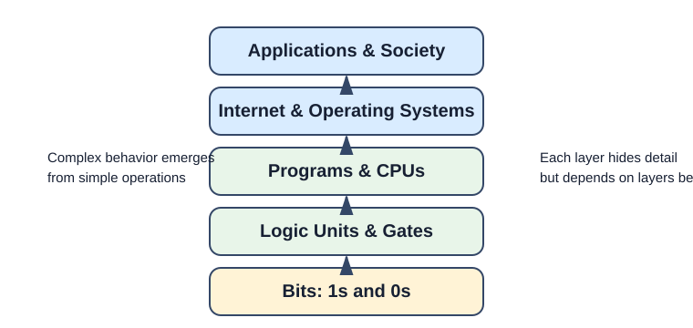
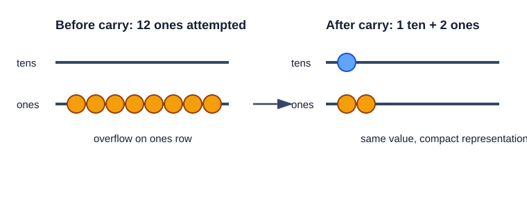
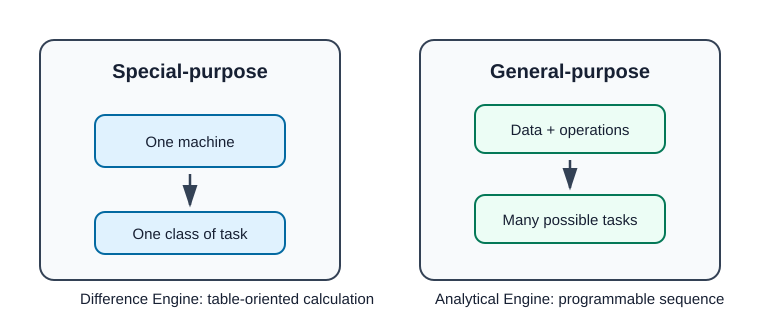
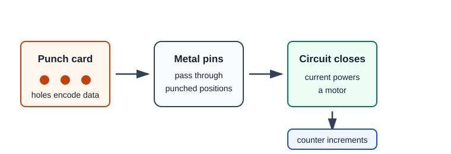
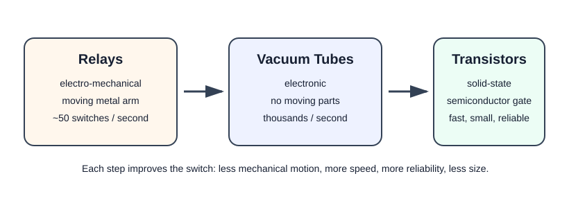
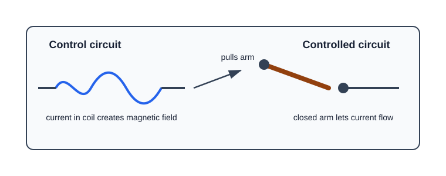
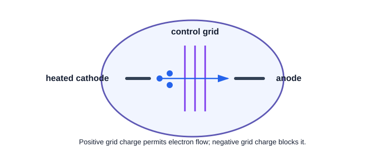
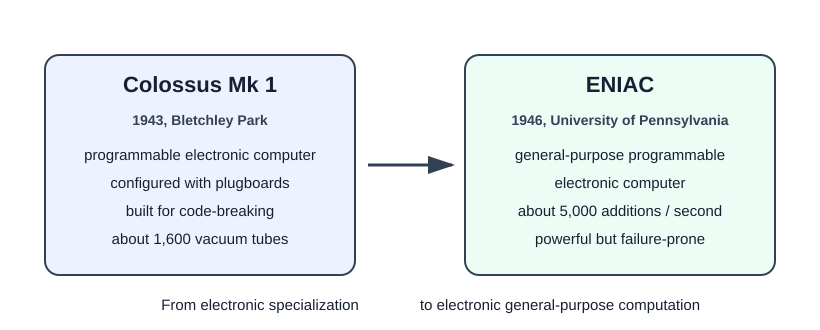

# Crash Course Computer Science

Notes from CrashCourse's *Computer Science* playlist. These notes are distilled from the video transcripts and organized by lesson rather than copied verbatim.

## 01. Early Computing

Source: [Early Computing: Crash Course Computer Science #1](https://www.youtube.com/watch?v=O5nskjZ_GoI)

### Big Picture

- Computer science is broader than programming. This course focuses on computing as a discipline and technology, from bits and logic gates through operating systems, networks, artificial intelligence, and robots.
- Modern life depends on computing infrastructure: power grids, transportation, water treatment, finance, logistics, payroll, factories, telecommunications, medicine, education, and emerging fields like VR and self-driving cars.
- Computing is framed as a technological shift comparable to the Industrial Revolution: it amplifies human capability, increases scale, and reshapes daily life.
- Computers look complex because they contain many layers of abstraction, but those layers are built from simple operations.
- The course starts with early computing because the need for computation is ancient even though electronic computers are recent.

### Abacus: External Memory For Arithmetic

- The earliest recognized computing device was the abacus, invented in Mesopotamia around 2500 BCE.
- It is a hand-operated calculator for addition and subtraction.
- It also stores the current state of a calculation, similar in spirit to how modern storage preserves data.
- The abacus appeared because societies became too large for people to track everything mentally: villages, livestock, goods, taxes, trade, and other quantities exceeded unaided memory.
- A simple decimal abacus uses rows for powers of ten: ones, tens, hundreds, thousands, and so on.
- Addition works by moving beads; when a row overflows past nine, the value carries into the next row.

### Computing Tools Before Computers

- For thousands of years, humans built specialized devices that made hard calculations faster, easier, and more accurate.
- Examples include the astrolabe for calculating latitude at sea, the slide rule for multiplication and division, and clocks or related mechanisms for calculating sunrise, tides, celestial positions, and time.
- These tools lowered the barrier to complex calculation and amplified human mental ability.
- Charles Babbage summarized the pattern: with each new tool, human labor becomes shortened.

### The Word "Computer" Started As A Job

- The earliest documented use of the word "computer" is from 1613 in a book by Richard Braithwait.
- At that time, a computer was not a machine. It was a person who performed calculations.
- Human computers sometimes used mechanical aids, but often did the work by hand.
- This meaning persisted for centuries and only shifted toward machines in the late 1800s.

### Step Reckoner: Mechanical Arithmetic

- Gottfried Leibniz built the Step Reckoner in 1694.
- It used gears with ten teeth to represent digits from `0` through `9`.
- When a gear passed `9`, it rolled back to `0` and advanced the adjacent gear by one tooth, much like carrying on an abacus.
- The same mechanism could run in reverse for subtraction.
- With additional mechanical tricks, the Step Reckoner could also multiply and divide.
- Multiplication and division can be reduced to repeated addition and subtraction, which made them mechanically automatable.
- The Step Reckoner was the first machine able to perform all four basic arithmetic operations.
- Its design influenced calculator construction for roughly three centuries.

### Precomputed Tables And Military Pressure

- Mechanical calculators still required many manual steps for real-world problems, and a single result could take hours or days.
- These machines were expensive and inaccessible to most people.
- Before the 20th century, many people encountered computing through precomputed tables made by human computers.
- A table let someone look up values such as square roots instead of recalculating them from scratch.
- Militaries had strong incentives to improve computation because artillery required speed and accuracy.
- Range tables helped gunners determine cannon angles based on conditions such as distance, wind, temperature, and atmospheric pressure.
- The drawback was that changing a cannon or shell design required recomputing entire tables, which was slow and error-prone.

### Difference Engine: Automating Tables

- In 1822, Charles Babbage described using machinery to compute astronomical and mathematical tables.
- He proposed the Difference Engine, a mechanical device designed to approximate polynomials.
- Polynomials can model relationships between variables and approximate logarithmic or trigonometric functions.
- Babbage began construction in 1823.
- The intended machine required about 25,000 components and weighed roughly 15 tons.
- The original project was abandoned, but in 1991 historians built a Difference Engine from Babbage's plans and it worked.
- The important lesson is that Babbage was trying to remove human error from large-scale table production.

### Analytical Engine: General-Purpose Computing

- While working on the Difference Engine, Babbage imagined a more ambitious machine: the Analytical Engine.
- Unlike earlier special-purpose devices, the Analytical Engine was designed as a general-purpose computer.
- It could accept data, run operations in sequence, use memory, and output results through a primitive printer.
- The machine was never fully built, but the design was a major conceptual leap.
- Its key idea was automatic execution: a machine could guide itself through a series of operations.
- Ada Lovelace wrote hypothetical programs for the Analytical Engine and is often considered the world's first programmer.
- Babbage is often called the father of computing because later computer scientists reused many of his ideas.

### Hollerith Tabulating Machine: Data Processing At Scale

- By the late 1800s, computing devices were still mostly used for special-purpose scientific and engineering tasks.
- The 1890 United States census created a practical data-processing crisis.
- The 1880 census took seven years to compile manually, and the 1890 census was predicted to take thirteen years even though a census was required every ten years.
- Herman Hollerith built an electro-mechanical tabulating machine for the Census Bureau.
- It used mechanical counters combined with electrically powered components.
- Data was stored on punch cards: paper cards with holes punched at specific positions to represent information.
- When a card was inserted, metal pins passed through punched holes into mercury, completing an electrical circuit.
- The completed circuit powered a motor that turned a gear and incremented the relevant counter.
- Hollerith's machine was about ten times faster than manual tabulation.
- The 1890 census was completed in two and a half years and saved millions of dollars.

### Business Computing And IBM

- Businesses quickly recognized that computing could improve labor- and data-intensive tasks.
- Early commercial uses included accounting, insurance appraisal, and inventory management.
- Hollerith founded the Tabulating Machine Company to meet this demand.
- In 1924, it merged with other machine makers to become International Business Machines Corporation, or IBM.
- Electro-mechanical business machines transformed government and commerce.
- By the mid-1900s, population growth and global trade required faster, more flexible tools for processing data.
- That pressure set the stage for digital computers.

### Core Takeaways

- Computation began as a response to scale: society produced more data than people could comfortably track or calculate mentally.
- Early computing tools amplified human ability by making calculation faster, more reliable, and more accessible.
- The word "computer" originally described people, then gradually shifted to machines.
- Special-purpose machines solved one class of problem; general-purpose machines introduced the idea of programmable, reusable computation.
- Data processing demand from government, military, science, and business pushed computing from hand calculation toward mechanical, electro-mechanical, and eventually digital systems.

## 02. Electronic Computing

Source: [Electronic Computing: Crash Course Computer Science #2](https://www.youtube.com/watch?v=LN0ucKNX0hc)

### Big Picture

- Early 20th-century society produced far more data and coordination work than earlier special-purpose tabulating machines could comfortably handle.
- Population growth, world wars, global trade, transit networks, engineering, and science all increased demand for faster automation and computation.
- Electro-mechanical computers scaled up from cabinet-sized business machines into room-sized machines that were expensive, fragile, and error-prone.
- The major technical shift in this lesson is from mechanical switching to electronic switching.
- Computing speed, reliability, cost, and size were constrained by the physical switch technology available at each stage.

### Harvard Mark I: Electro-Mechanical Scale

- The Harvard Mark I was one of the largest electro-mechanical computers.
- IBM completed it in 1944 for the Allies during World War II.
- It had about 765,000 components, three million connections, and 500 miles of wire.
- Its mechanics were synchronized by a 50-foot shaft driven by a five-horsepower motor.
- One early use was running simulations for the Manhattan Project.
- The machine showed that electro-mechanical computing could tackle important work, but it also exposed the limits of relay-based design.

### Relays: Electrically Controlled Mechanical Switches

- Relays were the core switching elements in large electro-mechanical computers.
- A relay uses a control wire connected to a coil.
- When current flows through the coil, it creates an electromagnetic field.
- That field attracts a metal arm, snapping a circuit closed.
- The controlled circuit can then activate another circuit, motor, or counter.
- The faucet analogy is useful: the control wire is like the handle, and current flow is like water flow.
- The problem is that the metal arm has mass, so it cannot move instantly.
- A good 1940s relay could switch about 50 times per second.
- The Harvard Mark I could do about three additions or subtractions per second; multiplication took about six seconds, division about fifteen seconds, and complex trigonometric functions could take more than a minute.

### Reliability, Wear, And Bugs

- Mechanical parts wear out because they move.
- Relays could become sticky, slow, unreliable, or break entirely.
- Failure probability increased as machines used more relays.
- The Harvard Mark I had roughly 3,500 relays, which made maintenance a constant concern during long calculations.
- Warm, dark machines also attracted insects.
- In 1947, Harvard Mark II operators found a dead moth in a malfunctioning relay.
- Grace Hopper later noted that when something went wrong, operators said the computer had "bugs" in it.
- The broader point is that mechanical switching did not scale well enough for the next stage of computing.

### Vacuum Tubes: Electronic Switching Without Moving Parts

- In 1904, John Ambrose Fleming developed the thermionic valve, the first vacuum tube.
- It used two electrodes in an airtight glass bulb.
- Heating one electrode caused it to emit electrons, a process called thermionic emission.
- If the other electrode was positively charged, electrons were attracted across the vacuum and current flowed.
- If the other electrode was neutral or negatively charged, current did not flow.
- This one-way current component is called a diode.
- In 1906, Lee de Forest added a third control electrode between the other two electrodes, creating a triode.
- A positive charge on the control electrode allowed current to flow; a negative charge blocked it.
- Like relays, triodes could open or close circuits, but they had no moving parts.
- Because there was no moving mechanical arm, vacuum tubes could switch thousands of times per second.
- Vacuum tubes were still fragile, could burn out, and were initially expensive, but by the 1940s they became practical for government-scale computers.

### Colossus: First Programmable Electronic Computer

- Colossus Mk 1 was designed by Tommy Flowers and completed in December 1943.
- It was installed at Bletchley Park in the United Kingdom to help decrypt Nazi communications.
- The first Colossus used about 1,600 vacuum tubes.
- Ten Colossi were eventually built for code-breaking work.
- Colossus is regarded as the first programmable electronic computer.
- Its programming was physical: operators plugged hundreds of wires into plugboards to configure the machine.
- That made it programmable, but still oriented around specific computations once configured.
- Alan Turing's earlier Bombe, also used at Bletchley Park, was electro-mechanical and designed for breaking Enigma codes, but it was not technically a computer in the same sense.

### ENIAC: General-Purpose Electronic Computing

- ENIAC stands for Electronic Numerical Integrator and Calculator.
- It was completed in 1946 at the University of Pennsylvania.
- It was designed by John Mauchly and J. Presper Eckert.
- It is described as the first truly general-purpose, programmable, electronic computer.
- ENIAC could perform about 5,000 ten-digit additions or subtractions per second.
- It was operational for ten years and is estimated to have performed more arithmetic than the entire human race had up to that point.
- Its weakness was reliability: with so many vacuum tubes, failures were common, and it often ran only about half a day before breaking down.

### Transistors: Solid-State Switching

- By the 1950s, vacuum-tube computing was reaching limits in cost, size, reliability, and speed.
- In 1947, Bell Labs scientists John Bardeen, Walter Brattain, and William Shockley invented the transistor.
- A transistor is another controlled switch, like a relay or vacuum tube.
- It uses a control wire attached to a gate electrode.
- Changing the gate's electrical charge changes whether a semiconductor material conducts or resists electricity.
- The first Bell Labs transistor could switch about 10,000 times per second.
- Transistors were solid-state components: solid material rather than glass tubes with suspended fragile parts.
- They could be made smaller than relays or vacuum tubes.
- This enabled smaller, cheaper, faster, and more reliable computers.

### IBM 608 And Commercial Transistor Computers

- The IBM 608, released in 1957, was the first fully transistor-powered commercially available computer.
- It contained about 3,000 transistors.
- It could perform about 4,500 additions per second or roughly 80 multiplications or divisions per second.
- IBM soon moved its computing products toward transistors.
- Transistor-based computers gradually entered offices and, eventually, homes.

### Silicon Valley

- Modern computer transistors are smaller than 50 nanometers; a sheet of paper is roughly 100,000 nanometers thick.
- They can switch millions of times per second and can operate for decades.
- Much transistor and semiconductor development happened in the Santa Clara Valley between San Francisco and San Jose.
- Silicon became the dominant semiconductor material, so the region became known as Silicon Valley.
- William Shockley founded Shockley Semiconductor there.
- Employees from that company later founded Fairchild Semiconductor.
- Fairchild alumni later founded Intel, a major computer chip maker.

### Core Takeaways

- The history of electronic computing is largely the history of better switches.
- Relays made electrical control possible but were slow and mechanically fragile.
- Vacuum tubes removed moving parts and enabled electronic switching, but were still bulky, hot, fragile, and failure-prone.
- Transistors made switching solid-state, smaller, cheaper, faster, and more reliable.
- Colossus showed programmable electronic computing for code-breaking; ENIAC showed general-purpose programmable electronic computing.
- The next conceptual step is explaining how fast on/off electrical switches become actual computation without gears or motors.
